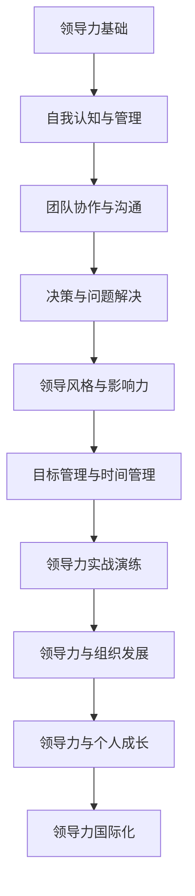

                 

### 文章标题

“领导力训练营：49天从新手到高手”

> **关键词**：领导力、训练营、新手、高手、团队协作、决策、目标管理、时间管理、影响力、组织发展、国际化

**摘要**：
本文旨在为那些渴望提升领导力水平的新手提供一个系统的训练方案。通过49天的逐步引导，读者将深入了解领导力的本质、基础、提升方法和实战技巧。文章以逻辑清晰、结构紧凑、简单易懂的方式，结合实际案例和算法原理，帮助读者从零开始，逐步成长为一位具备实战能力的领导力高手。无论你是企业员工、创业者还是学生，本文都将为你提供宝贵的指导。

### 《领导力训练营：49天从新手到高手》目录大纲

#### 第一部分：领导力基础

##### 第1章：领导力概述
- **1.1 领导力的定义与重要性**
- **1.2 领导力的五大特质**
- **1.3 领导力的发展历程**

##### 第2章：自我认知与管理
- **2.1 自我认知的重要性**
- **2.2 自我管理技巧**
- **2.3 自我成长策略**

##### 第3章：团队协作与沟通
- **3.1 团队协作的重要性**
- **3.2 沟通技巧提升**
- **3.3 团队管理策略**

##### 第4章：决策与问题解决
- **4.1 决策的原则与方法**
- **4.2 问题解决的步骤**
- **4.3 创新思维训练**

#### 第二部分：领导力提升

##### 第5章：领导风格与影响力
- **5.1 领导风格的类型**
- **5.2 影响力的构建**
- **5.3 领导者的心态管理**

##### 第6章：目标管理与时间管理
- **6.1 目标设定与实现**
- **6.2 时间管理技巧**
- **6.3 团队目标协同**

##### 第7章：领导力实战演练
- **7.1 情景模拟与角色扮演**
- **7.2 领导力案例分析**
- **7.3 领导力评估与改进**

#### 第三部分：领导力进阶

##### 第8章：领导力与组织发展
- **8.1 组织文化与领导力**
- **8.2 领导力与组织变革**
- **8.3 领导力在组织中的传承**

##### 第9章：领导力与个人成长
- **9.1 领导力与人生哲学**
- **9.2 领导力与心理健康**
- **9.3 领导力与家庭生活**

##### 第10章：领导力国际化
- **10.1 国际化领导力概述**
- **10.2 跨文化管理技巧**
- **10.3 全球化领导力培养**

#### 附录

##### 附录A：领导力书籍与资源推荐
- **书籍**：《领导力的五个层次》、《高效能人士的七个习惯》
- **网站**：哈佛商业评论、LinkedIn

##### 附录B：领导力相关术语解释
- **领导力**：影响他人以实现共同目标的能力。
- **团队协作**：团队成员之间的协作与配合。

##### 附录C：领导力测评工具
- **工具**：Myers-Briggs Type Indicator (MBTI)、StrengthsFinder

### 第一部分：领导力基础

#### 第1章：领导力概述

##### 1.1 领导力的定义与重要性

领导力是一种影响他人以实现共同目标的能力，它不仅仅关乎个人的行为，更涉及到团队的协同与组织的整体效能。根据组织行为学大师吉姆·科恩（Jim Kouzes）和巴里·波斯纳（Barry Posner）的定义，领导力是一种能够激励他人跟随你共同达成目标的力量。这种力量不仅体现在企业高层管理者身上，也体现在每一个需要与他人协作的个体中。

在当今复杂多变的社会环境中，领导力的重要性愈发凸显。企业需要领导者来引领方向、制定战略、解决问题，确保企业在激烈的市场竞争中立于不败之地。同样，在政府机构、非营利组织、教育领域，领导力也扮演着至关重要的角色，影响着组织的发展和进步。

领导力的定义不仅仅局限于权力和权威，它更强调的是影响力。一个领导者可能没有正式的职位，但仍然可以通过其价值观、行为和态度影响他人。这种影响力可以是正向的，也可以是负向的。因此，领导力的本质在于如何有效地与他人互动，以实现共同的目标。

##### 1.2 领导力的五大特质

有效的领导力具有五大核心特质，这些特质不仅能够帮助领导者提升自身的领导能力，也能够在团队中建立强大的影响力。

1. **诚信**：诚信是领导力的基石。一个领导者必须具备高度的诚信，这不仅包括遵守承诺和道德准则，还包括透明度和真实性。当团队成员感受到领导者的诚信时，他们会更加信任和尊重领导者，从而更愿意追随和合作。

2. **愿景**：领导者需要有明确的愿景，这是指导团队行动的灯塔。一个强大的愿景能够激发团队的激情和动力，使团队成员明确方向，共同为实现目标而努力。

3. **影响力**：影响力是领导力的核心。一个领导者需要具备影响他人的能力，无论是通过个人魅力、专业知识还是建立良好的人际关系。这种影响力能够帮助领导者克服团队中的障碍，推动团队向前发展。

4. **沟通能力**：沟通是领导力的关键技能。领导者需要具备良好的沟通能力，包括倾听、表达和反馈。有效的沟通能够确保团队成员理解领导者的意图，减少误解和冲突，提高团队的协作效率。

5. **适应能力**：在快速变化的环境中，适应能力成为领导力的关键。领导者需要能够快速适应新情况，灵活调整策略和行动，以应对不确定性和挑战。

##### 1.3 领导力的发展历程

领导力的发展历程可以追溯到古代，不同的文化和社会背景下，领导力有着不同的表现形式。在古代，领导力通常与王权、贵族和军事统治紧密相关。随着社会的发展和工业化的推进，领导力逐渐从封建统治转向企业管理。

在19世纪末到20世纪初，科学管理理论的兴起标志着领导力研究的一个新阶段。泰勒（Frederick Taylor）的“科学管理”理论和法约尔（Henri Fayol）的“一般管理理论”为领导力研究奠定了基础。这些理论强调通过系统化和标准化的方法来提高生产效率和团队协作。

20世纪中叶，行为科学的发展进一步丰富了领导力研究。领导力研究者开始关注领导者的行为、个性和心理特征。这些研究揭示了不同类型的领导者如何影响团队和组织的绩效。

进入21世纪，领导力研究逐渐从个体特质转向团队和组织层面。现代领导力理论强调领导者的角色不仅是指导和激励团队成员，还包括构建有凝聚力的团队文化、促进创新和适应变革。领导力研究开始关注跨文化管理、全球化和可持续领导等多个维度。

### 第一部分：领导力基础

#### 第2章：自我认知与管理

##### 2.1 自我认知的重要性

自我认知是领导力发展的重要基石。一个领导者首先需要深入了解自己，包括自己的价值观、信念、优点和缺点。自我认知有助于领导者找到自己的定位，明确自己的目标，并在实现目标的过程中保持动力和方向。

自我认知的重要性在于它能够帮助领导者建立自信心，提高决策质量，增强人际交往能力。通过自我认知，领导者可以更好地理解自己的行为和反应模式，从而进行有效的自我调整和改进。

在领导力发展过程中，自我认知起着至关重要的作用。它不仅帮助领导者更好地管理自己，还能够影响团队氛围和组织文化。一个具备高度自我认知的领导者能够更有效地激励团队成员，建立信任和合作关系。

##### 2.2 自我管理技巧

自我管理是领导力的重要组成部分。一个成功的领导者不仅需要具备自我认知的能力，还需要掌握自我管理的技巧。以下是一些关键的自我管理技巧：

1. **时间管理**：时间是有限的资源，有效的领导者需要学会合理安排时间，确保在重要任务上投入足够的精力。时间管理技巧包括制定日程表、优先级排序、避免拖延等。

2. **情绪管理**：领导者常常面临压力和挑战，情绪管理能力对于保持冷静和理性至关重要。情绪管理技巧包括自我放松、情绪调节和有效沟通。

3. **自我激励**：领导者需要具备自我激励的能力，以保持对目标和任务的热情。自我激励技巧包括设定目标、庆祝小成就、寻找激励因素等。

4. **自我反思**：定期进行自我反思是自我管理的重要环节。通过反思，领导者可以评估自己的行为和决策，识别改进的机会。

##### 2.3 自我成长策略

自我成长是领导力发展的关键。一个领导者需要不断地学习、成长和适应。以下是一些自我成长策略：

1. **持续学习**：领导力是一个不断发展的领域，领导者需要持续学习新知识和技能。可以通过阅读书籍、参加培训课程、参加工作坊等方式来提升自己的能力。

2. **寻求反馈**：反馈是自我成长的重要资源。领导者应该主动寻求他人的反馈，包括同事、下属和导师。积极接受反馈，并从中学习和改进。

3. **设定目标**：设定明确的目标是自我成长的动力。领导者应该为自己设定短期和长期的目标，并制定具体的行动计划。

4. **实践与反思**：通过实践和反思，领导者可以将所学知识应用到实际工作中，并在实践中不断改进和成长。

### 第一部分：领导力基础

#### 第3章：团队协作与沟通

##### 3.1 团队协作的重要性

团队协作是领导力的重要组成部分。在一个成功的团队中，每个成员都能发挥自己的优势，共同努力实现共同目标。团队协作不仅能够提高工作效率，还能够促进团队成员之间的信任和尊重，从而提升整个团队的凝聚力。

团队协作的重要性体现在以下几个方面：

1. **提高工作效率**：通过团队成员的分工合作，可以充分利用每个人的专业技能和经验，提高工作的整体效率。

2. **促进知识共享**：团队协作鼓励团队成员之间分享知识和经验，促进知识的传递和积累，从而提升整个团队的知识水平。

3. **增强团队凝聚力**：成功的团队协作能够增强团队成员之间的信任和尊重，提高团队的凝聚力，使团队在面对挑战时更加团结一致。

4. **促进创新思维**：团队协作鼓励不同观点的碰撞和融合，有助于激发创新思维，推动团队在解决问题和应对挑战时采取更加创新的策略。

##### 3.2 沟通技巧提升

沟通是团队协作的核心。有效的沟通能够确保团队成员理解彼此的意图，减少误解和冲突，提高团队的协作效率。以下是一些提升沟通技巧的方法：

1. **倾听**：倾听是有效沟通的重要环节。领导者需要学会倾听团队成员的意见和想法，理解他们的需求和担忧。通过倾听，领导者可以更好地了解团队的需求，从而做出更合适的决策。

2. **清晰表达**：领导者需要能够清晰、准确地表达自己的想法和意图。避免使用过于复杂或模糊的语言，确保团队成员能够理解。

3. **反馈与确认**：在沟通过程中，及时给予反馈并确认对方理解自己的意图。这有助于确保沟通的有效性，减少误解和歧义。

4. **非语言沟通**：领导者需要注重非语言沟通，如面部表情、肢体语言和语调等。这些非语言的元素能够传达额外的信息，影响沟通的效果。

##### 3.3 团队管理策略

有效的团队管理是确保团队协作顺利进行的关键。以下是一些团队管理策略：

1. **明确目标**：为团队设定明确的目标和任务，确保团队成员了解自己的职责和期望。

2. **分工协作**：根据团队成员的专业技能和优势进行合理分工，确保每个人都能发挥最大的作用。

3. **建立信任**：建立信任是团队管理的基础。领导者需要通过言行一致、公平公正的行动来赢得团队成员的信任。

4. **提供支持**：领导者需要为团队成员提供必要的支持和资源，确保他们能够在工作中充分发挥能力。

5. **激励与反馈**：领导者需要通过激励和反馈来鼓励团队成员的积极性和创造力。及时的肯定和建设性的反馈能够帮助团队成员不断提升自己。

### 第一部分：领导力基础

#### 第4章：决策与问题解决

##### 4.1 决策的原则与方法

决策是领导者日常工作中不可或缺的一部分。有效的决策能力能够帮助领导者应对复杂多变的环境，确保团队和组织的发展方向正确。以下是一些决策的原则和方法：

1. **明确目标**：在做出决策之前，领导者需要明确决策的目标和预期结果。这有助于确保决策的方向与组织的目标一致。

2. **收集信息**：领导者需要广泛收集与决策相关的信息，包括数据、意见和反馈。全面的信息有助于做出更加准确的决策。

3. **评估风险**：在做出决策时，领导者需要评估决策可能带来的风险和不确定性。这有助于预防潜在的问题，并制定应对策略。

4. **权衡利弊**：领导者需要权衡不同决策方案的利弊，选择最符合组织目标和利益的方案。

5. **集体决策**：在某些情况下，领导者可以邀请团队成员参与决策过程，通过集体智慧和合作来提高决策质量。

6. **灵活调整**：在决策实施过程中，领导者需要保持灵活性，根据实际情况及时调整决策，以应对新的挑战和变化。

##### 4.2 问题解决的步骤

问题解决是领导者的一项重要能力。以下是一些常见的问题解决步骤：

1. **识别问题**：首先需要明确问题的性质和影响范围，确保对问题有准确的理解。

2. **分析问题**：通过收集和分析相关信息，深入理解问题的原因和影响，为解决问题提供依据。

3. **制定方案**：根据问题分析的结果，制定解决问题的方案。这可以包括不同的策略和方法。

4. **评估方案**：对制定的方案进行评估，选择最有效的解决方案。

5. **实施方案**：将选定的方案付诸实践，确保实施过程中的顺利进行。

6. **监控与反馈**：在方案实施过程中，持续监控实施效果，并根据反馈进行调整和改进。

##### 4.3 创新思维训练

创新思维是领导者解决复杂问题的重要工具。以下是一些创新思维训练的方法：

1. **头脑风暴**：通过集体头脑风暴，激发团队成员的创新思维，收集各种可能的解决方案。

2. **思维导图**：使用思维导图工具，将问题分解为各个部分，从而更全面地理解问题，找到创新的解决方案。

3. **模拟演练**：通过模拟真实场景，测试不同方案的可行性和效果，从而找到最优的解决方案。

4. **跨学科合作**：鼓励团队成员跨学科合作，引入不同的视角和方法，促进创新思维的发展。

5. **持续学习**：通过不断学习和探索新的知识和技能，提升自己的创新思维能力。

### 第二部分：领导力提升

#### 第5章：领导风格与影响力

##### 5.1 领导风格的类型

领导风格是指领导者如何在工作中影响和指导团队成员的方式。根据不同的领导风格，可以分为以下几种类型：

1. **权威型领导风格**：权威型领导风格的特点是领导者高度集权，决策由领导者独立做出。这种方式在紧急情况下或需要快速决策时非常有效，但可能导致团队成员缺乏参与感和创造性。

2. **民主型领导风格**：民主型领导风格的特点是领导者鼓励团队成员参与决策过程，尊重团队成员的意见和建议。这种方式能够激发团队成员的积极性和创造力，但可能需要更多的时间和资源。

3. **参与型领导风格**：参与型领导风格的特点是领导者与团队成员建立紧密的沟通和合作关系，共同制定目标和决策。这种方式能够增强团队的凝聚力，提高决策的质量。

4. **教练型领导风格**：教练型领导风格的特点是领导者关注团队成员的个人成长和发展，提供指导和支持。这种方式能够帮助团队成员提升技能和自信心，从而提高整个团队的绩效。

5. **变革型领导风格**：变革型领导风格的特点是领导者具备强烈的愿景和使命感，能够激励团队成员追求卓越和变革。这种方式能够推动组织创新和持续发展。

##### 5.2 影响力的构建

领导影响力是领导者通过非正式权力手段影响他人，实现组织目标的能力。以下是一些构建领导影响力的方法：

1. **建立专业能力**：领导者需要具备卓越的专业能力和知识，以赢得团队成员的尊重和信任。

2. **建立人际关系**：领导者需要与团队成员建立良好的人际关系，建立信任和尊重的基础。

3. **明确目标和价值观**：领导者需要明确组织的目标和价值观，并与团队成员达成共识，形成共同的方向。

4. **激励和认可**：领导者需要通过激励和认可来鼓励团队成员的积极性和创造力，提高团队绩效。

5. **培养团队文化**：领导者需要培养积极向上的团队文化，鼓励团队成员相互支持、合作和创新。

##### 5.3 领导者的心态管理

领导者的心态管理对于保持高效和积极的态度至关重要。以下是一些领导者的心态管理方法：

1. **保持乐观**：领导者需要保持积极乐观的态度，面对困难和挑战时能够保持冷静和理智。

2. **自我反思**：领导者需要定期进行自我反思，识别自己的优点和不足，进行自我调整和改进。

3. **情绪调节**：领导者需要学会情绪调节，避免将负面情绪传递给团队成员。

4. **持续学习**：领导者需要保持持续学习的心态，不断更新知识和技能，以适应不断变化的环境。

5. **设定合理目标**：领导者需要设定合理的目标，既具有挑战性，又能够实现，避免因目标过高或过低导致的压力和焦虑。

### 第二部分：领导力提升

#### 第6章：目标管理与时间管理

##### 6.1 目标设定与实现

目标管理是领导力的重要组成部分，是确保团队和组织朝着共同目标前进的关键。以下是一些目标设定与实现的方法：

1. **明确目标**：领导者需要明确团队和组织的目标，确保目标具有清晰的方向和可衡量性。

2. **SMART原则**：目标设定应遵循SMART原则，即目标要具体（Specific）、可衡量（Measurable）、可实现（Achievable）、相关（Relevant）和有时限（Time-bound）。

3. **分解目标**：将大目标分解为小目标，制定具体的行动计划，确保每个目标都能够逐步实现。

4. **定期评估**：定期评估目标实现的情况，及时调整计划和策略，确保目标能够按时完成。

5. **激励与支持**：领导者需要通过激励和支持来鼓励团队成员为实现目标而努力，提供必要的资源和支持。

##### 6.2 时间管理技巧

时间管理是领导者高效工作的关键。以下是一些时间管理技巧：

1. **优先级排序**：领导者需要根据任务的重要性和紧急程度对任务进行排序，优先处理重要且紧急的任务。

2. **日程安排**：领导者需要合理安排日程，将任务分配到具体的时间段，避免时间的浪费和冲突。

3. **避免拖延**：领导者需要学会避免拖延，及时处理任务，避免任务积压。

4. **时间追踪**：领导者可以使用时间追踪工具记录自己的工作时间，分析时间的使用情况，找出改进的空间。

5. **专注工作**：领导者需要学会在工作时保持专注，避免被无关事务打扰，提高工作效率。

##### 6.3 团队目标协同

团队目标协同是确保团队高效运作的关键。以下是一些团队目标协同的方法：

1. **沟通与协作**：领导者需要建立良好的沟通机制，确保团队成员能够及时了解目标和任务，促进协作。

2. **共同制定目标**：领导者可以与团队成员共同制定目标，确保目标符合团队的整体利益，提高团队的凝聚力和积极性。

3. **明确责任与分工**：领导者需要明确团队成员的责任和分工，确保每个成员都清楚自己的任务和职责。

4. **定期回顾与调整**：领导者需要定期回顾团队目标的实现情况，及时调整目标和计划，确保团队始终朝着正确的方向前进。

5. **激励与反馈**：领导者需要通过激励和反馈来鼓励团队成员为实现团队目标而努力，提供必要的支持和资源。

### 第二部分：领导力提升

#### 第7章：领导力实战演练

##### 7.1 情景模拟与角色扮演

情景模拟与角色扮演是提升领导力的重要方法。通过模拟真实的工作场景和角色扮演，领导者可以锻炼自己的决策能力、沟通技巧和团队协作能力。

1. **情景模拟**：领导者可以设计不同的工作场景，模拟团队面临的挑战和问题，通过实践来提升应对能力。

2. **角色扮演**：领导者可以扮演不同的角色，如团队成员、客户或竞争对手，从多个角度理解和解决问题。

3. **互动反馈**：情景模拟和角色扮演结束后，领导者可以与团队成员进行互动反馈，分享经验和教训，进一步提升领导力。

##### 7.2 领导力案例分析

领导力案例分析是通过研究成功或失败的领导案例，来理解和掌握领导力技巧的方法。

1. **案例选择**：领导者可以选择具有代表性的领导案例，包括成功和失败的案例。

2. **案例解析**：领导者需要深入分析案例的背景、过程和结果，理解其中的关键因素和决策。

3. **经验借鉴**：通过分析成功案例，领导者可以借鉴其中的成功经验，提高自己的领导能力。

4. **反思与改进**：通过分析失败案例，领导者可以反思其中的错误和不足，找到改进的方向。

##### 7.3 领导力评估与改进

领导力评估与改进是持续提升领导力的重要步骤。

1. **自我评估**：领导者需要定期进行自我评估，分析自己在领导力方面的优势和不足。

2. **反馈收集**：领导者可以收集团队成员、同事和上级的反馈，了解自己在领导力方面的表现。

3. **改进计划**：根据自我评估和反馈，领导者需要制定具体的改进计划，包括学习新知识、技能和策略。

4. **持续改进**：领导者需要持续跟踪改进计划的执行情况，根据反馈进行调整和优化。

### 第三部分：领导力进阶

#### 第8章：领导力与组织发展

##### 8.1 组织文化与领导力

组织文化是组织的灵魂，影响着员工的行为和态度。领导力与组织文化密切相关，优秀的领导力能够塑造和强化组织文化。

1. **组织文化的定义**：组织文化是指组织成员共同遵守的价值观、信念和行为规范。

2. **领导力对组织文化的影响**：领导力通过领导者的行为和决策，塑造和强化组织文化。领导者的价值观和行为会成为员工的榜样，影响员工的行为和态度。

3. **领导力在组织文化建设中的作用**：领导力在组织文化建设中起着关键作用，包括建立共同愿景、培养团队合作精神和推动创新思维。

##### 8.2 领导力与组织变革

组织变革是组织发展的重要环节，领导力在组织变革中发挥着关键作用。

1. **组织变革的定义**：组织变革是指组织对内部结构、流程和文化等方面的调整和改进，以适应外部环境的变化。

2. **领导力在组织变革中的作用**：领导力在组织变革中起着推动者和引导者的作用，包括制定变革策略、激发员工变革动力和解决变革过程中的问题。

3. **领导力在组织变革中的挑战**：领导力在组织变革中面临诸多挑战，如员工的抵触情绪、资源有限和时间紧迫等。

##### 8.3 领导力在组织中的传承

领导力在组织中的传承是确保组织持续发展的重要保障。

1. **领导力传承的定义**：领导力传承是指将领导者的知识和经验传递给下一代领导者，确保组织领导力的连续性和稳定性。

2. **领导力传承的重要性**：领导力传承有助于确保组织领导力的连续性和稳定性，避免领导力的断层和损失。

3. **领导力传承的方法**：领导力传承的方法包括导师制、轮岗培训和领导力发展计划等。

### 第三部分：领导力进阶

#### 第9章：领导力与个人成长

##### 9.1 领导力与人生哲学

领导力不仅仅是一种技能，更是一种人生哲学。一个优秀的领导者需要具备深厚的哲学素养，以指导自己的行为和决策。

1. **领导力与人生哲学的关系**：领导力与人生哲学密切相关，领导者的人生哲学会影响其领导风格和行为。

2. **领导力与人生哲学的结合**：领导者可以通过学习和实践人生哲学，提升自己的领导力水平。例如，通过儒家思想中的仁爱、礼智和信义来指导领导行为。

3. **人生哲学对领导力的影响**：人生哲学对领导力有着深远的影响，包括价值观、道德观和行为准则。

##### 9.2 领导力与心理健康

领导力与心理健康密切相关。一个健康的领导者能够更好地应对工作压力，提高领导效能。

1. **领导力与心理健康的关系**：领导力与心理健康相互影响，良好的心理健康有助于提高领导力水平。

2. **领导力对心理健康的影响**：领导力对心理健康有着积极的影响，包括提高自尊、增强自信和降低焦虑。

3. **心理健康对领导力的影响**：心理健康对领导力有着重要的影响，包括决策能力、沟通能力和团队管理能力。

##### 9.3 领导力与家庭生活

领导力不仅体现在工作和组织中，还渗透到家庭生活中。一个优秀的领导者需要在家庭中扮演多种角色，平衡工作和家庭生活。

1. **领导力与家庭生活的关系**：领导力在家庭生活中起着关键作用，包括家庭管理、亲子教育和家庭和谐。

2. **领导力在家庭生活中的应用**：领导者可以将领导技巧应用到家庭生活中，如沟通技巧、决策能力和团队合作。

3. **家庭生活对领导力的影响**：家庭生活对领导力有着深远的影响，包括个人价值观、道德观和行为准则。

### 第三部分：领导力进阶

#### 第10章：领导力国际化

##### 10.1 国际化领导力概述

国际化领导力是指在全球化背景下，领导者如何在不同文化和背景下有效地领导和管理工作。随着全球化进程的加速，国际化领导力的重要性日益凸显。

1. **国际化领导力的定义**：国际化领导力是指领导者具备跨文化沟通、全球战略思维和国际化管理能力。

2. **国际化领导力的特点**：国际化领导力具有全球视野、跨文化适应性和创新思维等特点。

3. **国际化领导力的重要性**：国际化领导力有助于企业拓展国际市场、提高竞争力，并推动全球化进程。

##### 10.2 跨文化管理技巧

跨文化管理是国际化领导力的核心组成部分。以下是一些跨文化管理技巧：

1. **文化敏感性**：领导者需要具备文化敏感性，尊重和理解不同文化的价值观和行为规范。

2. **跨文化沟通**：领导者需要掌握跨文化沟通技巧，包括语言沟通、非语言沟通和文化适应。

3. **多元化团队管理**：领导者需要善于管理多元化团队，包括尊重多样性、促进团队合作和解决文化冲突。

4. **全球战略思维**：领导者需要具备全球战略思维，能够从全球视角审视问题和制定策略。

##### 10.3 全球化领导力培养

全球化领导力的培养是一个系统性的过程，以下是一些培养方法：

1. **国际化教育**：通过接受国际化教育，领导者可以提升自己的全球视野和跨文化沟通能力。

2. **国际经验**：通过参与国际项目、访问国际市场和与外籍员工合作，领导者可以积累国际经验。

3. **跨文化培训**：参加跨文化培训，学习不同文化的价值观、行为规范和沟通技巧。

4. **领导力发展计划**：制定领导力发展计划，包括领导力课程、领导力研讨会和领导力教练。

### 附录

#### 附录A：领导力书籍与资源推荐

为了帮助读者进一步了解和提升领导力，以下是一些推荐的领导力书籍和资源：

1. **书籍**：
   - 《领导力的五个层次》（The Five Levels of Leadership）- John C. Maxwell
   - 《高效能人士的七个习惯》（The 7 Habits of Highly Effective People）- Stephen R. Covey
   - 《变革之舞：领导力、变革管理与创新思维》（The Dance of Change: The Challenges to Sustaining Momentum in Times of Change）- Jim Highsmith

2. **网站**：
   - 哈佛商业评论（Harvard Business Review）
   - LinkedIn上的领导力专栏
   - Coursera上的领导力课程

#### 附录B：领导力相关术语解释

为了帮助读者更好地理解领导力相关概念，以下是一些领导力相关术语的解释：

1. **领导力**：影响他人以实现共同目标的能力。
2. **团队协作**：团队成员之间的协作与配合。
3. **目标管理**：设定明确的目标并制定实现目标的计划。
4. **决策**：在多种选择中做出判断和选择。
5. **影响力**：通过非正式权力手段影响他人。
6. **组织文化**：组织成员共同遵守的价值观和行为规范。

#### 附录C：领导力测评工具

以下是一些常用的领导力测评工具：

1. **Myers-Briggs Type Indicator (MBTI)**：用于评估个人的性格类型。
2. **StrengthsFinder**：用于评估个人的优势和潜能。
3. **360度反馈**：通过收集来自不同角度的反馈，评估领导者的领导能力。

### 参考文献

- Maxwell, J. C. (2017). The 5 Levels of Leadership: Proven Steps to Maximize Your Potential. Center Street.
- Covey, S. R. (1989). The 7 Habits of Highly Effective People: Restoring the Character Ethic. Free Press.
- Highsmith, J. (2011). The Dance of Change: The Challenges to Sustaining Momentum in Times of Change. Wiley.
- Kouzes, J. M., & Posner, B. Z. (2007). The Leadership Challenge: How to Keep Employees Engaged and Productive. Jossey-Bass.
- Banister, R. (2019). International Leadership: A Research and Practice Framework. Routledge.

### 流程图与算法

#### 2.1.1 领导力发展流程图



#### 4.1.2 决策树算法

```python
def decision_tree(data, attributes, target_attribute):
    # 确定属性值
    values = attribute_values(data, target_attribute)

    # 如果所有数据都属于同一类别
    if all_values_equal(data, target_attribute):
        return most_common_value(data, target_attribute)

    # 如果没有可用属性
    if len(attributes) == 0:
        return majority_vote(data, target_attribute)

    # 选择最优属性
    best_attribute = get_best_attribute(data, attributes, target_attribute)

    # 创建子树
    tree = {}
    for value in attribute_values(data, best_attribute):
        sub_data = filter_data(data, best_attribute, value)
        sub_tree = decision_tree(sub_data, attributes - {best_attribute}, target_attribute)
        tree[value] = sub_tree

    return tree
```

### 数学公式与示例

$$
Y = \sum_{i=1}^{n} w_i * x_i + b
$$

其中，$w_i$为权重，$x_i$为特征，$b$为偏置。

### 项目实战

#### 实战一：团队协作项目

- **目标**：搭建一个在线协作平台，实现任务分配、进度追踪、文件共享等功能。
- **环境搭建**：使用Python Flask框架搭建后端，使用React框架搭建前端。
- **实现细节**：
  - **后端API接口设计**：设计任务管理、用户管理、文件管理等接口，确保前后端数据交互的顺畅。
  - **数据库设计**：使用MongoDB作为数据库，设计任务、用户、文件等数据模型，确保数据存储的可靠性。
  - **前端页面布局与交互设计**：设计任务列表、任务详情、用户管理、文件上传与下载等页面，确保用户界面的友好性和易用性。

#### 实战二：决策案例分析

- **目标**：通过实际案例分析，提升决策能力。
- **案例**：公司是否应该进入新市场。
- **分析过程**：
  - **市场调研**：收集新市场的相关数据，包括市场规模、竞争对手、消费者需求等。
  - **数据收集**：收集公司内部的数据，包括财务状况、研发能力、营销策略等。
  - **决策模型构建**：使用决策树、贝叶斯网络等算法构建决策模型，分析不同决策方案的概率和预期收益。
  - **决策执行**：根据决策模型的结果，制定具体的执行计划，包括市场进入策略、资源分配等。

#### 实战三：领导力实践

- **目标**：通过角色扮演和情景模拟，提升领导力。
- **内容**：
  - **设置不同的情景**：如团队面临危机、团队成员发生冲突等，设定不同的领导场景。
  - **角色扮演**：参与者扮演不同的角色，如领导者、团队成员、客户等，模拟真实场景进行决策和沟通。
  - **讨论与反馈**：情景模拟结束后，参与者进行讨论和反思，分享经验和教训，获取他人的反馈和建议。

### 附录

#### 附录A：领导力书籍与资源推荐

- **书籍**：
  - 《领导力的五个层次》（The Five Levels of Leadership）- John C. Maxwell
  - 《高效能人士的七个习惯》（The 7 Habits of Highly Effective People）- Stephen R. Covey
  - 《变革之舞：领导力、变革管理与创新思维》（The Dance of Change: The Challenges to Sustaining Momentum in Times of Change）- Jim Highsmith

- **网站**：
  - 哈佛商业评论（Harvard Business Review）
  - LinkedIn上的领导力专栏
  - Coursera上的领导力课程

#### 附录B：领导力相关术语解释

- **领导力**：影响他人以实现共同目标的能力。
- **团队协作**：团队成员之间的协作与配合。
- **目标管理**：设定明确的目标并制定实现目标的计划。
- **决策**：在多种选择中做出判断和选择。
- **影响力**：通过非正式权力手段影响他人。
- **组织文化**：组织成员共同遵守的价值观和行为规范。

#### 附录C：领导力测评工具

- **工具**：
  - **Myers-Briggs Type Indicator (MBTI)**：用于评估个人的性格类型。
  - **StrengthsFinder**：用于评估个人的优势和潜能。
  - **360度反馈**：通过收集来自不同角度的反馈，评估领导者的领导能力。

### 参考文献

- Maxwell, J. C. (2017). The 5 Levels of Leadership: Proven Steps to Maximize Your Potential. Center Street.
- Covey, S. R. (1989). The 7 Habits of Highly Effective People: Restoring the Character Ethic. Free Press.
- Highsmith, J. (2011). The Dance of Change: The Challenges to Sustaining Momentum in Times of Change. Wiley.
- Kouzes, J. M., & Posner, B. Z. (2007). The Leadership Challenge: How to Keep Employees Engaged and Productive. Jossey-Bass.
- Banister, R. (2019). International Leadership: A Research and Practice Framework. Routledge.

