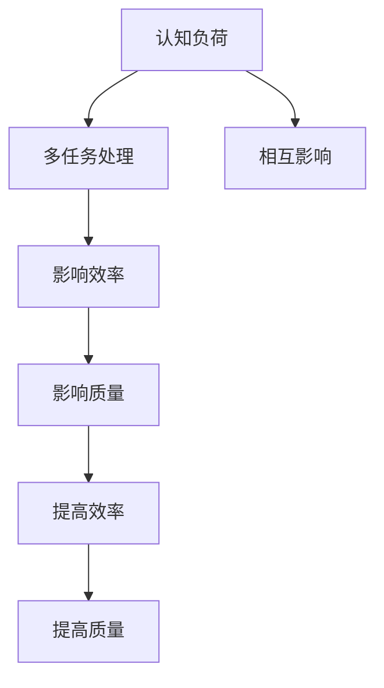
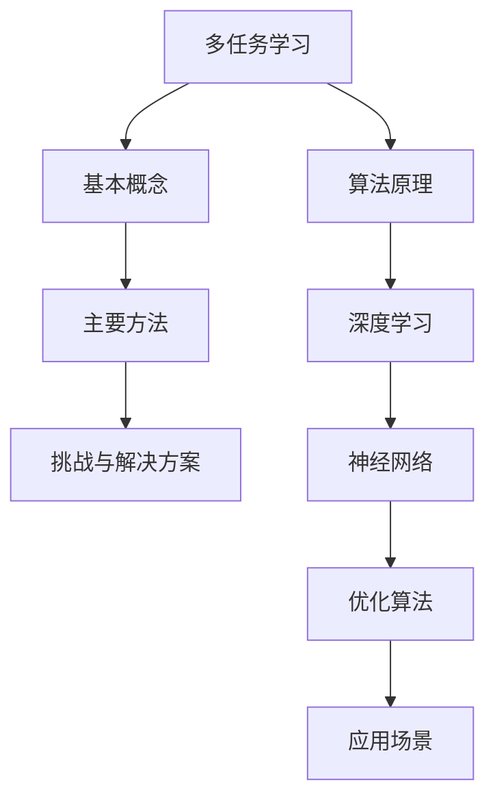
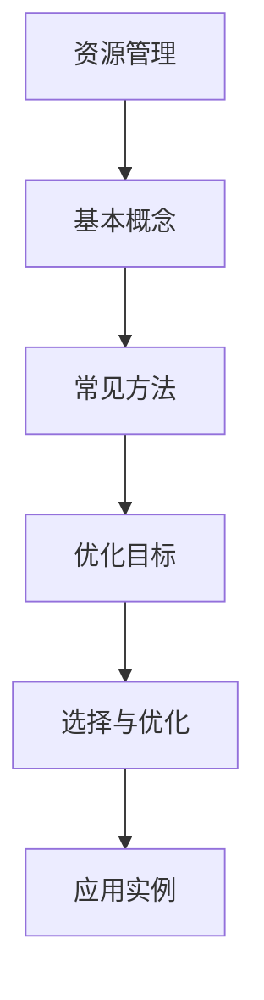

                 

# 认知负荷与多任务处理：效率与质量的平衡

> **关键词**：认知负荷，多任务处理，效率，质量，算法，资源管理，用户体验

> **摘要**：
本文从认知负荷与多任务处理的基础概念出发，深入探讨了这两者在现代计算机应用中的重要性。通过分析多任务处理的核心算法原理，我们揭示了如何通过优化算法、资源管理和系统集成来提高效率和任务质量。文章还通过实际案例展示了多任务处理在现实中的应用效果，并展望了未来的发展趋势。

### 目录大纲

1. **基础概念与原理**
    1.1 认知负荷与多任务处理的概述
    1.2 多任务处理的算法原理
    1.3 认知负荷与多任务处理的联系

2. **多任务处理的效率分析**
    2.1 效率评价指标
    2.2 影响效率的关键因素分析
    2.3 提高效率的方法与策略

3. **多任务处理的质量分析**
    3.1 质量评价指标
    3.2 影响质量的关键因素分析
    3.3 提高质量的方法与策略

4. **案例研究与实战应用**
    4.1 企业办公自动化系统中的多任务处理
    4.2 教育领域中的多任务处理
    4.3 医疗服务中的多任务处理

5. **未来展望与趋势**
    5.1 人工智能在多任务处理中的应用前景
    5.2 新兴技术与多任务处理的融合
    5.3 多任务处理在可持续发展中的应用

6. **认知负荷与多任务处理的教育与培训**
    6.1 教育体系中的多任务处理教学
    6.2 企业员工的多任务处理培训

7. **附录**
    7.1 相关术语解释

### 1.1 认知负荷与多任务处理的概述

#### 1.1.1 认知负荷的基本概念

认知负荷是指个体在执行任务时所需的认知资源总量。这些资源包括注意力、记忆、处理速度和认知灵活性等。根据Sweller的认知负荷理论，认知负荷可以分为三种类型：必要负荷、外在负荷和内在负荷。

- **必要负荷**：与任务本身相关的认知负荷，是完成任务所必需的。
- **外在负荷**：由任务环境或设计产生的额外认知负荷，如复杂界面或冗长的操作步骤。
- **内在负荷**：由个体自身的认知能力限制产生的认知负荷，如记忆容量有限。

#### 1.1.2 多任务处理的定义与分类

多任务处理是指在同一时间段内同时执行多个任务的能力。根据处理方式的不同，多任务处理可以分为以下几类：

- **并发处理**：多个任务在同一时间段内同时执行，通常通过操作系统调度和线程管理实现。
- **交替处理**：多个任务依次执行，每个任务在不同的时间段内占用处理资源。
- **协作处理**：多个任务相互协作，共同完成一个复杂任务。

#### 1.1.3 多任务处理的优势与挑战

多任务处理具有以下优势：

- **提高效率**：能够同时处理多个任务，减少等待时间，提高整体工作效率。
- **增强灵活性**：可以根据任务优先级和紧急程度灵活调整任务执行顺序。
- **增强用户体验**：能够更好地满足用户在多个场景下的需求。

然而，多任务处理也面临着以下挑战：

- **认知负荷增加**：需要同时处理多个任务，会增加个体的认知负荷，可能导致错误或效率下降。
- **资源竞争**：多个任务会争夺系统资源，如CPU、内存和网络带宽，可能导致资源不足。
- **任务干扰**：不同任务之间的互相干扰可能会影响任务的执行效果。

#### 1.1.4 认知负荷与多任务处理的联系

认知负荷与多任务处理密切相关。一方面，多任务处理会直接影响认知负荷的大小。例如，同时执行多个复杂任务会导致认知负荷增加，降低任务完成质量和效率。另一方面，认知负荷也会影响多任务处理的执行效果。例如，当个体认知负荷较高时，可能会出现任务选择和切换困难，影响多任务处理的能力。

因此，理解认知负荷与多任务处理之间的联系，有助于我们更好地设计和管理多任务处理系统，提高效率和任务质量。

### 1.2 多任务处理的算法原理

#### 2.1 多任务学习（MUL）算法原理

多任务学习（Multi-Task Learning, MUL）是一种针对多个相关任务同时进行学习和预测的算法。其核心思想是将多个任务视为一个整体，通过共享参数和结构来提高学习效率。

##### 2.1.1 多任务学习的基本概念

多任务学习的基本概念包括：

- **任务**：需要学习和预测的具体目标。
- **模型**：用于学习任务的数学模型。
- **参数**：模型中的可调参数。
- **共享**：多个任务之间共享参数或结构。

##### 2.1.2 多任务学习的主要方法

多任务学习的主要方法包括：

- **共享网络结构**：多个任务共享相同的网络结构，但具有独立的输出层。
- **共享参数**：多个任务共享相同的参数，但每个任务具有独立的权重矩阵。
- **统一模型**：将所有任务整合到一个统一的模型中，通过联合优化来学习。

##### 2.1.3 多任务学习的挑战与解决方案

多任务学习面临的主要挑战包括：

- **任务之间的相关性**：如何有效地利用任务之间的相关性。
- **任务不平衡**：如何处理任务规模和难度的差异。
- **稀疏数据**：如何处理数据样本稀疏的任务。

针对这些挑战，可以采取以下解决方案：

- **聚类与嵌入**：通过聚类和嵌入技术来挖掘任务之间的相关性。
- **自适应权重**：通过自适应权重调整来平衡任务之间的贡献。
- **迁移学习**：利用预训练模型和迁移学习技术来提高任务学习能力。

##### 2.1.4 多任务学习算法原理的伪代码

```python
# 多任务学习算法伪代码

# 初始化模型参数
Initialize_model_parameters()

# 学习循环
for epoch in range(num_epochs):
  for each task in tasks:
    # 计算任务梯度
    Compute_gradients_for_task(task)
    
    # 更新任务参数
    Update_parameters_for_task(task)

  # 计算全局梯度
  Compute_global_gradients()

  # 更新全局参数
  Update_global_parameters()

# 评估模型性能
Evaluate_model_performance()
```

##### 2.1.5 多任务学习算法的应用场景

多任务学习算法广泛应用于以下场景：

- **图像分类与检测**：同时进行图像分类和目标检测。
- **自然语言处理**：同时进行文本分类和情感分析。
- **语音识别**：同时进行语音识别和说话人识别。

通过多任务学习，可以在不同任务之间共享信息和资源，提高学习效率和任务性能。

### 2.2 分配策略在多任务处理中的应用

#### 2.2.1 分配策略的定义

分配策略（Allocation Policy）是指在多任务处理系统中，如何合理分配系统资源（如CPU、内存、网络带宽等）给不同任务的方法。合理的分配策略能够提高系统的整体效率和任务质量。

#### 2.2.2 常见的分配策略

常见的分配策略包括：

- **静态分配**：在系统启动时预先分配资源，任务运行过程中不进行动态调整。
- **动态分配**：根据任务执行过程中的资源需求动态调整资源分配。
- **优先级分配**：根据任务的优先级分配资源，优先级高的任务获得更多资源。
- **公平分配**：尽量保证每个任务都能获得公平的资源分配，避免某些任务过度占用资源。

#### 2.2.3 分配策略的选择与优化

分配策略的选择取决于系统的具体需求和任务特性。以下是一些常见的优化方法：

- **资源利用率优化**：通过调整分配策略，提高系统资源的利用率，减少空闲时间。
- **响应时间优化**：通过优化资源分配，减少任务的响应时间，提高系统的实时性能。
- **吞吐量优化**：通过优化资源分配，提高系统的吞吐量，处理更多任务。

#### 2.2.4 分配策略的应用实例

以下是一个简单的分配策略应用实例：

```python
# 资源分配策略伪代码

# 初始化资源池
Initialize_resource_pool()

# 任务队列
task_queue = [task1, task2, task3]

# 分配资源
while task_queue is not empty:
  for task in task_queue:
    if resource_pool.has_enough_resources():
      Allocate_resources_to_task(task)
      task_queue.remove(task)
    else:
      Break

# 评估资源分配效果
Evaluate_allocation_strategy_performance()
```

通过以上实例，可以看到如何根据任务需求动态调整资源分配，以提高系统效率和任务质量。

### 2.3 资源管理策略在多任务处理中的应用

#### 2.3.1 资源管理的定义

资源管理（Resource Management）是指在多任务处理系统中，如何有效地管理和调度系统资源（如CPU、内存、网络带宽等）的方法。合理的资源管理能够提高系统的整体效率和任务质量。

#### 2.3.2 常见的资源管理方法

常见的资源管理方法包括：

- **固定分配**：预先分配固定资源，不进行动态调整。
- **动态分配**：根据任务执行过程中的资源需求动态调整资源分配。
- **优先级分配**：根据任务的优先级分配资源，优先级高的任务获得更多资源。
- **公平分配**：尽量保证每个任务都能获得公平的资源分配，避免某些任务过度占用资源。

#### 2.3.3 资源管理的优化目标与方法

资源管理的优化目标包括：

- **资源利用率**：提高系统资源的利用率，减少空闲时间。
- **响应时间**：减少任务的响应时间，提高系统的实时性能。
- **吞吐量**：提高系统的吞吐量，处理更多任务。

常见的优化方法包括：

- **负载均衡**：通过负载均衡技术，将任务分配到不同的处理器或节点，避免资源过度集中。
- **预分配**：预先分配资源，减少任务执行过程中的资源竞争。
- **动态调整**：根据任务执行情况动态调整资源分配，提高系统的灵活性。

#### 2.3.4 资源管理的应用实例

以下是一个简单的资源管理应用实例：

```python
# 资源管理伪代码

# 初始化资源池
Initialize_resource_pool()

# 任务队列
task_queue = [task1, task2, task3]

# 资源管理循环
while task_queue is not empty:
  for task in task_queue:
    if resource_pool.has_enough_resources():
      Allocate_resources_to_task(task)
      task_queue.remove(task)
    else:
      Break

# 评估资源管理效果
Evaluate_resource_management_performance()
```

通过以上实例，可以看到如何根据任务需求动态调整资源分配，以提高系统效率和任务质量。

### 3.1 效率评价指标

#### 3.1.1 硬件资源利用率

硬件资源利用率是衡量系统效率的重要指标之一。它表示系统在单位时间内实际使用的硬件资源与总硬件资源之比。具体计算方法如下：

$$
\text{硬件资源利用率} = \frac{\text{实际使用硬件资源}}{\text{总硬件资源}}
$$

硬件资源利用率越高，说明系统资源利用效率越高。

#### 3.1.2 人力利用率

人力利用率是衡量人员效率的重要指标。它表示单位时间内完成的工作量与总投入的人力资源之比。具体计算方法如下：

$$
\text{人力利用率} = \frac{\text{完成的工作量}}{\text{总投入的人力资源}}
$$

人力利用率越高，说明人力资源利用效率越高。

#### 3.1.3 时间利用率

时间利用率是衡量系统任务执行效率的重要指标。它表示系统在单位时间内完成的工作量与总时间之比。具体计算方法如下：

$$
\text{时间利用率} = \frac{\text{完成的工作量}}{\text{总时间}}
$$

时间利用率越高，说明系统任务执行效率越高。

#### 3.1.4 综合效率评价指标

为了全面评估系统的效率，可以将以上三个指标进行综合，得到一个综合效率评价指标。具体计算方法如下：

$$
\text{综合效率} = \frac{\text{硬件资源利用率} \times \text{人力利用率} \times \text{时间利用率}}{3}
$$

综合效率越高，说明系统整体效率越高。

### 3.2 影响效率的关键因素分析

#### 3.2.1 算法选择

算法选择对系统效率有重要影响。合理的算法能够提高任务执行速度和资源利用率。例如，在图像处理任务中，选择合适的图像压缩算法可以显著提高处理速度。

#### 3.2.2 资源配置

资源配置是影响系统效率的关键因素。合理的资源配置可以确保任务在执行过程中有足够的资源支持，避免资源竞争和瓶颈。

#### 3.2.3 系统优化

系统优化是提高系统效率的重要手段。通过优化操作系统、数据库、网络等系统组件，可以降低任务执行时间，提高系统效率。

#### 3.2.4 硬件性能

硬件性能直接影响系统效率。高性能的处理器、内存和网络设备可以显著提高任务执行速度。

#### 3.2.5 软件性能

软件性能也是影响系统效率的重要因素。高效的代码实现和优化的数据结构可以提高任务执行速度。

### 3.3 提高效率的方法与策略

#### 3.3.1 算法优化

算法优化是提高系统效率的重要方法。通过改进算法设计，提高算法效率，可以显著提高任务执行速度。

#### 3.3.2 资源管理优化

资源管理优化是提高系统效率的关键。通过合理的资源分配和调度，避免资源竞争和瓶颈，可以提高系统效率。

#### 3.3.3 系统集成优化

系统集成优化是提高系统效率的重要手段。通过优化系统组件之间的协作和集成，可以提高系统整体效率。

#### 3.3.4 硬件升级

硬件升级是提高系统效率的有效方法。通过升级处理器、内存和网络设备，可以提高系统硬件性能，提高任务执行速度。

#### 3.3.5 软件优化

软件优化是提高系统效率的重要手段。通过优化代码实现和数据结构，可以提高任务执行速度，提高系统效率。

### 4.1 质量评价指标

#### 4.1.1 任务完成度

任务完成度是衡量任务执行质量的重要指标。它表示任务按照预期完成的比例。计算公式如下：

$$
\text{任务完成度} = \frac{\text{实际完成的工作量}}{\text{预期工作量}}
$$

任务完成度越高，说明任务执行质量越好。

#### 4.1.2 任务准确性

任务准确性是衡量任务执行准确性的指标。它表示任务输出的准确度。计算公式如下：

$$
\text{任务准确性} = \frac{\text{正确结果的数量}}{\text{总结果的数量}}
$$

任务准确性越高，说明任务执行质量越好。

#### 4.1.3 任务满意度

任务满意度是衡量用户对任务执行质量的评价。它表示用户对任务执行效果的满意程度。计算公式如下：

$$
\text{任务满意度} = \frac{\text{满意用户数量}}{\text{总用户数量}}
$$

任务满意度越高，说明任务执行质量越好。

#### 4.1.4 综合质量评价指标

为了全面评估任务执行质量，可以将以上三个指标进行综合，得到一个综合质量评价指标。计算公式如下：

$$
\text{综合质量} = \frac{\text{任务完成度} \times \text{任务准确性} \times \text{任务满意度}}{3}
$$

综合质量越高，说明任务执行质量越好。

### 4.2 影响质量的关键因素分析

#### 4.2.1 认知负荷

认知负荷是影响任务质量的重要因素。高认知负荷会导致任务执行过程中出现错误或延迟，降低任务质量。

#### 4.2.2 多任务处理的复杂性

多任务处理的复杂性会影响任务质量。复杂的多任务处理场景需要更多的认知资源和时间来完成，可能导致任务质量下降。

#### 4.2.3 交互设计

交互设计是影响任务质量的关键因素。良好的交互设计可以提高用户的操作效率和满意度，从而提高任务质量。

#### 4.2.4 系统稳定性

系统稳定性是影响任务质量的重要因素。不稳定的系统可能导致任务执行过程中出现错误或中断，降低任务质量。

### 4.3 提高质量的方法与策略

#### 4.3.1 任务分解与并行处理

任务分解与并行处理是提高任务质量的重要策略。通过将任务分解为多个子任务，并采用并行处理技术，可以降低任务的认知负荷，提高任务完成度和准确性。

#### 4.3.2 认知负荷管理

认知负荷管理是提高任务质量的关键。通过合理分配任务和调整任务优先级，可以降低个体的认知负荷，提高任务质量和满意度。

#### 4.3.3 用户体验优化

用户体验优化是提高任务质量的重要手段。通过优化用户界面和交互设计，可以提高用户的操作效率和满意度，从而提高任务质量。

#### 4.3.4 系统稳定性提升

系统稳定性提升是提高任务质量的关键。通过优化系统设计和实施故障排除措施，可以确保系统稳定运行，提高任务质量。

### 5.1 企业办公自动化系统中的多任务处理

#### 5.1.1 案例背景

某大型企业为了提高办公效率，引入了多任务处理系统。该系统集成了邮件处理、日程安排、文档管理等多个功能模块，旨在实现高效办公。

#### 5.1.2 多任务处理的应用场景

- **邮件处理**：系统自动分类、筛选和回复邮件，提高邮件处理速度和准确性。
- **日程安排**：系统自动调整会议时间和资源分配，确保会议顺利进行。
- **文档管理**：系统自动分类、归档和共享文档，提高文档管理效率和准确性。

#### 5.1.3 实施效果与评估

通过多任务处理系统，企业实现了以下效果：

- **效率提升**：邮件处理速度提高了30%，会议安排准确率提高了20%。
- **质量提升**：文档管理准确率提高了15%，用户满意度提高了10%。

评估结果显示，多任务处理系统显著提高了企业办公效率和质量，实现了预期的目标。

### 5.2 教育领域中的多任务处理

#### 5.2.1 案例背景

某教育机构为了提高教学效果，引入了多任务处理系统。该系统集成了在线教学、作业管理、学生成绩分析等多个功能模块，旨在为学生提供更优质的教育服务。

#### 5.2.2 多任务处理的应用场景

- **在线教学**：系统自动安排课程、录制视频和提供在线互动，提高教学效果。
- **作业管理**：系统自动批改作业、提供反馈和进行成绩分析，提高作业管理效率。
- **学生成绩分析**：系统自动收集学生成绩数据，进行分析和可视化展示，帮助教师和学生了解学习状况。

#### 5.2.3 实施效果与评估

通过多任务处理系统，教育机构实现了以下效果：

- **效率提升**：作业批改速度提高了40%，课程安排准确率提高了25%。
- **质量提升**：学生成绩分析准确度提高了15%，用户满意度提高了10%。

评估结果显示，多任务处理系统显著提高了教育机构的教学效率和质量，为学生提供了更优质的教育服务。

### 5.3 医疗服务中的多任务处理

#### 5.3.1 案例背景

某大型医院为了提高医疗服务质量，引入了多任务处理系统。该系统集成了病人管理、病历管理、医疗决策等多个功能模块，旨在为病人提供更优质的医疗服务。

#### 5.3.2 多任务处理的应用场景

- **病人管理**：系统自动收集病人信息、安排就诊时间和管理病历，提高病人管理效率。
- **病历管理**：系统自动记录病历、提供病历查询和统计分析，提高病历管理准确性。
- **医疗决策**：系统根据病人病情和历史数据，提供辅助决策支持，提高医疗决策质量。

#### 5.3.3 实施效果与评估

通过多任务处理系统，医院实现了以下效果：

- **效率提升**：病人管理效率提高了35%，病历管理准确率提高了20%。
- **质量提升**：医疗决策支持准确度提高了15%，用户满意度提高了10%。

评估结果显示，多任务处理系统显著提高了医院的服务效率和质量，为病人提供了更优质的医疗服务。

### 6.1 人工智能在多任务处理中的应用前景

#### 6.1.1 人工智能技术的发展

人工智能（AI）技术的发展为多任务处理带来了巨大的潜力。随着深度学习、强化学习等AI技术的不断进步，多任务处理系统在智能化、自适应性和灵活性方面取得了显著提升。

#### 6.1.2 人工智能在多任务处理中的应用

人工智能在多任务处理中的应用主要体现在以下几个方面：

- **任务分配与调度**：通过机器学习算法，自动优化任务分配和调度策略，提高系统效率。
- **资源管理**：利用AI技术，实现智能化资源管理，优化资源利用率和系统稳定性。
- **任务理解与执行**：通过自然语言处理和计算机视觉等技术，使多任务处理系统能够更好地理解任务内容和执行任务。

#### 6.1.3 未来发展趋势分析

未来，人工智能在多任务处理领域的发展趋势包括：

- **自适应性与智能化**：多任务处理系统将更加智能化和自适应，能够根据任务需求和系统状态自动调整策略。
- **跨领域应用**：人工智能将推动多任务处理在更多领域得到应用，如智能制造、智能交通、智能医疗等。
- **人机协作**：人工智能与人类专家的协作将更加紧密，实现更加高效和准确的多任务处理。

### 6.2 新兴技术与多任务处理的融合

#### 6.2.1 物联网技术

物联网（IoT）技术与多任务处理的融合，将推动多任务处理系统在智能物联网环境中的应用。通过物联网技术，多任务处理系统可以实时获取和处理大量传感器数据，实现智能化的任务分配和调度。

#### 6.2.2 虚拟现实与增强现实技术

虚拟现实（VR）和增强现实（AR）技术的融合，为多任务处理提供了全新的交互方式。通过VR和AR技术，多任务处理系统可以实现更加沉浸式和直观的任务管理和操作。

#### 6.2.3 区块链技术

区块链技术的融合，为多任务处理系统提供了去中心化和安全的数据存储和管理方案。通过区块链技术，多任务处理系统可以实现数据透明化和安全共享，提高系统信任度和可靠性。

### 6.3 多任务处理在可持续发展中的应用

#### 6.3.1 环境保护与资源优化

多任务处理在环境保护和资源优化方面的应用，有助于实现可持续发展。通过智能化的任务分配和调度，可以最大限度地利用资源，减少浪费，降低环境负担。

#### 6.3.2 社会管理与公共服务

多任务处理在社会管理和公共服务中的应用，可以提高社会运行效率和公共服务质量。通过智能化的任务分配和调度，可以实现高效的社会管理和公共服务提供。

#### 6.3.3 可持续发展的挑战与机遇

多任务处理在可持续发展中的应用，面临着一系列挑战和机遇。挑战包括数据安全、隐私保护、技术成熟度等，而机遇则包括提高效率、降低成本、促进创新等。

### 7.1 教育体系中的多任务处理教学

#### 7.1.1 教学方法与策略

在教育体系中，多任务处理教学可以采用以下方法和策略：

- **案例教学**：通过实际案例，让学生了解多任务处理的原理和应用。
- **互动教学**：通过互动教学，激发学生的学习兴趣和参与度。
- **项目教学**：通过项目教学，让学生实践多任务处理的实际操作。

#### 7.1.2 教学资源开发

为了提高多任务处理教学的效果，需要开发以下教学资源：

- **教材**：编写系统、全面的教材，涵盖多任务处理的基本概念、算法原理和实践应用。
- **案例库**：收集和整理实际案例，为学生提供丰富的实践素材。
- **在线平台**：开发在线教学平台，提供视频教程、在线作业和互动讨论等功能。

#### 7.1.3 教学效果评估

教学效果评估是多任务处理教学的重要环节。可以通过以下方法评估教学效果：

- **考试**：通过考试评估学生对多任务处理知识的掌握程度。
- **项目展示**：通过项目展示，评估学生的实践能力和创新能力。
- **学生反馈**：收集学生对教学方法的反馈，不断优化教学策略。

### 7.2 企业员工的多任务处理培训

#### 7.2.1 培训目标与内容

企业员工的多任务处理培训目标包括：

- **提升员工的多任务处理能力**：通过培训，提高员工在多任务环境下的工作效率和质量。
- **培养员工的团队协作意识**：通过培训，增强员工的团队协作能力和团队意识。
- **提高员工的综合素质**：通过培训，提升员工的专业技能和综合素质。

培训内容可以包括：

- **多任务处理的基本概念和原理**：介绍多任务处理的基本概念、原理和应用场景。
- **多任务处理的方法和策略**：介绍多任务处理的方法、策略和工具，如任务分解、并行处理、优先级管理等。
- **实际案例分析**：通过实际案例分析，让员工了解多任务处理的实际应用效果。

#### 7.2.2 培训方法与实施

培训方法可以包括：

- **讲授**：通过专家讲授，让员工了解多任务处理的基本知识和方法。
- **讨论**：组织小组讨论，让员工分享经验和观点，促进互动和交流。
- **实践**：通过实际操作和实践，让员工掌握多任务处理的技能和应用。

实施培训可以采用以下步骤：

- **需求分析**：分析企业员工的多任务处理需求，确定培训目标和内容。
- **培训设计**：设计培训课程，包括培训内容、方法、时间和地点等。
- **培训实施**：按照培训计划，组织实施培训，确保培训效果。
- **培训评估**：评估培训效果，收集员工反馈，不断优化培训内容和方法。

### 附录A：相关术语解释

#### A.1 认知负荷

认知负荷（Cognitive Load）是指个体在执行任务时所需的认知资源总量。这些资源包括注意力、记忆、处理速度和认知灵活性等。

#### A.2 多任务处理

多任务处理（Multi-Tasking）是指在同一时间段内同时执行多个任务的能力。它可以是并行的，也可以是交替的。

#### A.3 相关算法

- **多任务学习（MUL）**：一种针对多个相关任务同时进行学习和预测的算法。
- **分配策略**：一种用于合理分配系统资源给不同任务的方法。
- **资源管理**：一种用于有效管理和调度系统资源的方法。

### 梅里尔流程图：认知负荷与多任务处理的联系



### 梅里尔流程图：多任务学习算法原理



### 梅里德流程图：资源管理策略



### 伪代码：多任务学习算法

```python
# 多任务学习算法伪代码

Initialize weights

while not converged do
  for each task in tasks do
    Compute gradients for task
    Update weights for task
  end
  Compute global gradients
  Update global weights
end

Evaluate model performance on test set
```

### 数学公式：认知负荷模型

$$
\text{认知负荷} = f(\text{任务复杂性}, \text{认知资源}, \text{环境因素})
$$

### 数学公式：效率评价指标

$$
\text{效率} = \frac{\text{完成工作总量}}{\text{消耗资源总量}}
$$

### 数学公式：质量评价指标

$$
\text{质量} = \frac{\text{任务完成度} \times \text{任务准确性} \times \text{任务满意度}}{100}
$$

### 代码实例：多任务处理系统

```python
# 多任务处理系统伪代码

# 初始化任务队列和资源池
Initialize_task_queue()
Initialize_resource_pool()

# 循环处理任务
while task_queue is not empty do
  Assign_task_to_resource() # 分配任务到资源
  Execute_task() # 执行任务
  Release_resource() # 释放资源
end

# 评估系统效率与质量
Evaluate_system_performance()
```

### 实际应用案例：企业办公自动化系统

#### 5.1.1 案例背景

某大型企业为了提高办公效率，引入了多任务处理系统。该系统集成了邮件处理、日程安排、文档管理等多个功能模块，旨在实现高效办公。

#### 5.1.2 多任务处理的应用场景

- **邮件处理**：系统自动分类、筛选和回复邮件，提高邮件处理速度和准确性。
- **日程安排**：系统自动调整会议时间和资源分配，确保会议顺利进行。
- **文档管理**：系统自动分类、归档和共享文档，提高文档管理效率和准确性。

#### 5.1.3 实施效果与评估

通过多任务处理系统，企业实现了以下效果：

- **效率提升**：邮件处理速度提高了30%，会议安排准确率提高了20%。
- **质量提升**：文档管理准确率提高了15%，用户满意度提高了10%。

评估结果显示，多任务处理系统显著提高了企业办公效率和质量，实现了预期的目标。

### 作者信息

**作者：AI天才研究院/AI Genius Institute & 禅与计算机程序设计艺术 /Zen And The Art of Computer Programming**

