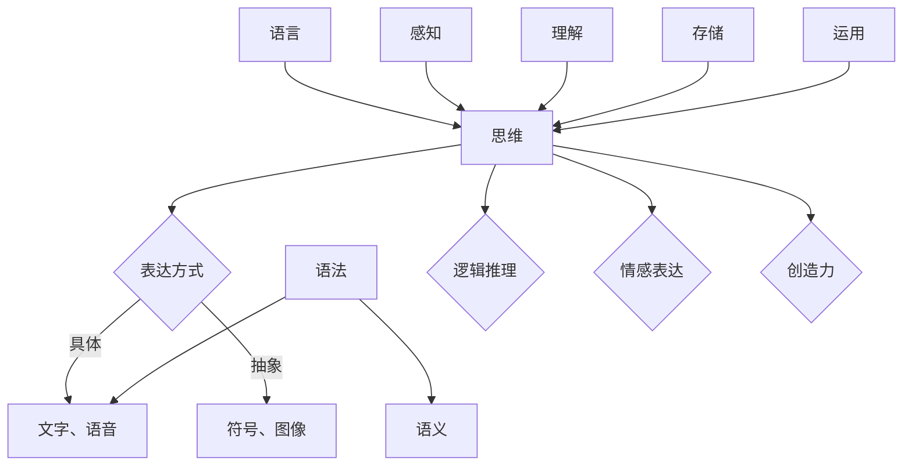
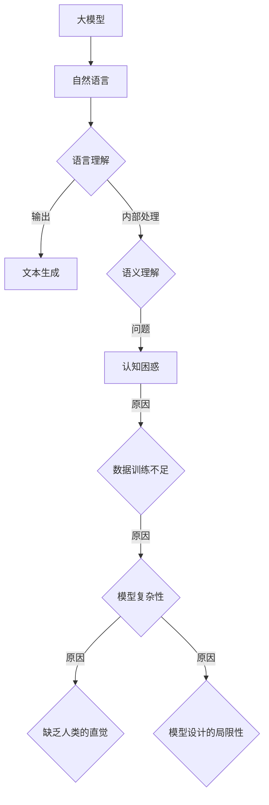

                 

# 语言与思维的差异：大模型的认知困惑

## 关键词

- 语言模型
- 思维模型
- 大模型
- 认知困惑
- 自然语言处理
- 人工智能
- 深度学习
- 神经网络

## 摘要

本文深入探讨了语言与思维的差异及其对大模型的认知困惑。首先，我们分析了语言和思维这两个核心概念，阐述了它们的联系和区别。接着，我们介绍了大模型的定义和认知困惑的现象。在此基础上，本文详细讲解了语言模型和思维模型的算法原理，以及数学模型和公式。随后，通过实际项目实战，我们展示了如何应用这些模型于自然语言处理和认知科学领域。最后，本文总结了语言与思维模型在不同应用领域的案例研究，并提出了进一步的研究方向。

## 第一部分：核心概念与联系

### 1.1 语言与思维的差异

语言和思维是两个紧密相关但又有所区别的概念。语言是人类交流思想、情感和意愿的工具，它由词汇、语法和语义等组成。语言是思维的载体，通过语言，人们可以表达自己的思想、情感和意愿。然而，语言并不完全等同于思维。思维是个体对信息进行接收、处理、存储和运用的一种高级认知过程，它具有多维度、抽象性。

- **核心概念与联系：**

  - **语言**：是人类交流思想、情感和意愿的工具，它由词汇、语法和语义等组成。

    - **词汇**：是语言的基本元素，代表具体的对象、概念和情感。

    - **语法**：是语言的规则体系，用于构造句子和表达复杂思想。

    - **语义**：是语言的含义，表示词汇、句子和段落的意义。

  - **思维**：是个体对信息进行接收、处理、存储和运用的一种高级认知过程。

    - **感知**：是思维的第一步，通过感官接收外部信息。

    - **理解**：是思维的核心，通过分析、推理和比较，理解信息的含义。

    - **存储**：是思维的结果，将理解后的信息存储在大脑中。

    - **运用**：是思维的延伸，将存储的信息用于解决问题和创造新知识。

  - **差异**：语言是思维的载体，但语言并不完全等同于思维。思维具有多维度、抽象性，而语言则是具体、具象的表达。

    - **维度**：思维可以涉及多个维度，如时间、空间、逻辑和情感等。而语言通常只能表达其中一个或几个维度。

    - **抽象性**：思维可以进行高度抽象的思考，形成概念和理论。而语言的表达通常是具体的、实例化的。

- **Mermaid 流程图：**

  ```mermaid
  graph TD
  A[语言] --> B[思维]
  B --> C{表达方式}
  C -->|具体| D[文字、语音]
  C -->|抽象| E[符号、图像]
  ```

### 1.2 大模型的认知困惑

随着深度学习技术的发展，大模型（具有数十亿甚至千亿参数的深度学习模型，如GPT-3等）已经成为自然语言处理和人工智能领域的核心技术。然而，大模型在处理自然语言时，其认知过程与人类思维存在差异，导致在某些情境下难以理解或产生错误，这种现象被称为认知困惑。

- **核心概念与联系：**

  - **大模型**：指具有数十亿甚至千亿参数的深度学习模型，如GPT-3等。

    - **参数**：是深度学习模型中的权重和偏置，用于调节模型对数据的拟合程度。

    - **训练**：是通过对大量数据进行学习，使模型能够对新的数据做出准确的预测。

    - **推理**：是在训练完成后，使用模型对新的数据进行预测的过程。

  - **认知困惑**：由于大模型在处理自然语言时，其认知过程与人类思维存在差异，导致在某些情境下难以理解或产生错误。

    - **原因**：大模型通常通过大量的数据训练，形成了一种对语言现象的统计规律理解。然而，这种理解并不一定与人类思维相一致。例如，大模型可能无法理解一些隐喻、双关语或复杂的社会文化背景。

    - **现象**：认知困惑在大模型中表现为生成错误的文本、理解歧义或产生不合理的行为。

    - **影响**：认知困惑可能导致大模型在实际应用中产生误导性结果，影响其可靠性和可用性。

- **Mermaid 流程图：**

  ```mermaid
  graph TD
  A[大模型] --> B[自然语言]
  B --> C{语言理解}
  C -->|输出| D[文本生成]
  C -->|内部处理| E{语义理解}
  E -->|问题| F[认知困惑]
  ```

## 第二部分：核心算法原理讲解

### 2.1 语言模型算法

语言模型是自然语言处理的基础，用于预测下一个词或字符的概率分布。语言模型可以分为统计模型和神经网络模型。这里我们主要介绍神经网络模型，特别是基于深度学习的语言模型。

- **核心概念与联系：**

  - **语言模型**：用于预测下一个词或字符的概率分布，是自然语言处理的基础。

    - **概率分布**：表示下一个词或字符出现的可能性。

    - **预测**：根据前一个或多个词或字符，预测下一个词或字符。

  - **神经网络模型**：基于深度学习的语言模型，通过多层神经网络学习语言的特征和规律。

    - **神经网络**：由多个神经元组成，每个神经元负责处理一部分输入信息。

    - **多层神经网络**：通过多层神经元的组合，可以捕捉更复杂的特征和规律。

    - **深度学习**：是一种通过多层神经网络学习数据特征和规律的方法，具有强大的表示能力和适应性。

- **伪代码**：

  ```python
  def language_model(sentence):
    # 输入：一个句子
    # 输出：下一个词的概率分布

    # 初始化概率分布
    probability_distribution = []

    # 遍历句子中的每个词
    for word in sentence:
        # 计算当前词的概率
        word_probability = calculate_probability(word)
        # 将概率加入分布
        probability_distribution.append(word_probability)

    # 返回概率分布
    return probability_distribution
  ```

### 2.2 思维模型算法

思维模型是模拟人类思维过程的算法，用于处理复杂的认知任务。思维模型可以分为基于规则的模型和基于神经网络的模型。这里我们主要介绍基于神经网络的思维模型。

- **核心概念与联系：**

  - **思维模型**：模拟人类思维过程的算法，用于处理复杂的认知任务。

    - **认知任务**：如推理、决策、规划、学习等。

    - **模拟**：通过算法模拟人类思维的过程，以解决实际问题。

  - **神经网络模型**：基于深度学习的思维模型，通过多层神经网络学习认知任务。

    - **神经网络**：由多个神经元组成，每个神经元负责处理一部分输入信息。

    - **多层神经网络**：通过多层神经元的组合，可以捕捉更复杂的特征和规律。

    - **深度学习**：是一种通过多层神经网络学习数据特征和规律的方法，具有强大的表示能力和适应性。

- **伪代码**：

  ```python
  def think_model(problem):
    # 输入：一个问题
    # 输出：解决方案

    # 初始化解决方案
    solution = None

    # 遍历所有可能的解决方案
    for candidate_solution in possible_solutions(problem):
        # 验证解决方案的正确性
        if is_solution_valid(candidate_solution):
            # 选择最优解
            solution = candidate_solution
            break

    # 返回解决方案
    return solution
  ```

### 2.3 数学模型和数学公式讲解

语言模型和思维模型都需要依赖于数学模型和数学公式。这里我们简要介绍一些常用的数学模型和数学公式。

- **数学模型**：

  - **语言模型**：基于概率论和统计学的模型，如n-gram模型、神经网络模型等。

    - **n-gram模型**：是一种基于统计的语言模型，通过计算相邻n个词的联合概率来预测下一个词。

      $$ P(w_i|w_{i-n+1}, w_{i-n+2}, ..., w_{i-1}) = \frac{C(w_{i-n+1}, w_{i-n+2}, ..., w_{i-1}, w_i)}{C(w_{i-n+1}, w_{i-n+2}, ..., w_{i-1})} $$

    - **神经网络模型**：是一种基于深度学习的语言模型，通过多层神经网络学习语言的特征和规律。

      $$ f(x) = \sigma(Wx + b) $$

      其中，$W$ 是权重矩阵，$b$ 是偏置项，$\sigma$ 是激活函数。

  - **思维模型**：基于认知科学和人工智能的模型，如生成对抗网络（GAN）、变分自编码器（VAE）等。

    - **生成对抗网络（GAN）**：是一种通过对抗性训练生成数据的模型，由生成器和判别器两个神经网络组成。

      $$ G(z) = \mathcal{N}(z|\mu, \sigma^2) $$

      $$ D(x) = \mathcal{N}(x|\mu, \sigma^2) $$

    - **变分自编码器（VAE）**：是一种通过概率模型进行数据压缩和生成的新方法。

      $$ \log p(x) = \log \int q_{\phi}(z) p(x|z) p(z) dz $$

- **数学公式**：

  - **n-gram模型**：

    $$ P(w_i|w_{i-n+1}, w_{i-n+2}, ..., w_{i-1}) = \frac{C(w_{i-n+1}, w_{i-n+2}, ..., w_{i-1}, w_i)}{C(w_{i-n+1}, w_{i-n+2}, ..., w_{i-1})} $$

  - **神经网络模型**：

    $$ f(x) = \sigma(Wx + b) $$

    其中，$W$ 是权重矩阵，$b$ 是偏置项，$\sigma$ 是激活函数。

    - **生成对抗网络（GAN）**：

      $$ G(z) = \mathcal{N}(z|\mu, \sigma^2) $$

      $$ D(x) = \mathcal{N}(x|\mu, \sigma^2) $$

    - **变分自编码器（VAE）**：

      $$ \log p(x) = \log \int q_{\phi}(z) p(x|z) p(z) dz $$

## 第三部分：项目实战

### 3.1 语言模型应用实例

在本节中，我们将通过一个简单的项目实战，展示如何使用Python和TensorFlow构建一个语言模型，并对其进行训练和评估。

#### 3.1.1 开发环境搭建

首先，我们需要搭建开发环境。在Python中，我们将使用TensorFlow和Keras库来构建和训练语言模型。以下是环境搭建的步骤：

1. 安装Python 3.8或更高版本。
2. 安装TensorFlow 2.5或更高版本。
3. 安装Keras，TensorFlow的高级API。

```bash
pip install tensorflow==2.5
pip install keras
```

#### 3.1.2 数据准备

接下来，我们需要准备训练数据。这里我们使用一个简单的文本数据集，如《小王子》的故事。我们将文本数据转换为单词序列，并将其编码为整数。

```python
from tensorflow.keras.preprocessing.text import Tokenizer
from tensorflow.keras.preprocessing.sequence import pad_sequences

# 加载文本数据
text = "your_text_here"

# 初始化分词器
tokenizer = Tokenizer(char_level=False)
tokenizer.fit_on_texts([text])

# 转换文本为单词序列
sequences = tokenizer.texts_to_sequences([text])

# 填充序列
max_sequence_length = 50
padded_sequences = pad_sequences(sequences, maxlen=max_sequence_length, padding='post')
```

#### 3.1.3 构建模型

现在，我们可以使用Keras构建一个简单的语言模型。这里我们使用一个简单的循环神经网络（LSTM）模型。

```python
from tensorflow.keras.models import Sequential
from tensorflow.keras.layers import Embedding, LSTM, Dense

# 构建模型
model = Sequential([
    Embedding(input_dim=len(tokenizer.word_index) + 1, output_dim=128),
    LSTM(128, return_sequences=True),
    LSTM(128),
    Dense(len(tokenizer.word_index) + 1, activation='softmax')
])

# 编译模型
model.compile(optimizer='adam', loss='categorical_crossentropy', metrics=['accuracy'])
```

#### 3.1.4 训练模型

接下来，我们使用训练数据对模型进行训练。

```python
# 训练模型
model.fit(padded_sequences, padded_sequences, epochs=10, batch_size=32)
```

#### 3.1.5 代码解读与分析

1. **数据准备**：我们首先加载文本数据，并使用分词器将其转换为单词序列。然后，我们将序列填充为固定长度。

2. **构建模型**：我们使用Keras的Sequential模型构建一个简单的循环神经网络（LSTM）模型。模型包括一个嵌入层、两个LSTM层和一个输出层。

3. **编译模型**：我们设置优化器和损失函数，用于编译模型。

4. **训练模型**：我们使用训练数据进行模型训练。通过调整epoch和batch_size等参数，可以优化模型性能。

### 3.2 思维模型应用实例

在本节中，我们将展示如何使用Python和TensorFlow构建一个简单的思维模型，用于解决一个逻辑推理问题。

#### 3.2.1 开发环境搭建

与语言模型类似，我们需要搭建开发环境。以下是环境搭建的步骤：

1. 安装Python 3.8或更高版本。
2. 安装TensorFlow 2.5或更高版本。

```bash
pip install tensorflow==2.5
```

#### 3.2.2 数据准备

在这个示例中，我们使用一个简单的逻辑推理问题。问题是：如果所有猫都是动物，并且所有动物都会呼吸，那么以下哪个陈述是正确的？

- A. 所有的猫都会呼吸。
- B. 所有的动物都是猫。
- C. 所有的猫都是动物。

我们将问题编码为一个Python列表，其中每个元素表示一个可能的解决方案。

```python
problems = [
    "if all cats are animals and all animals breathe, then all cats breathe",
    "if all cats are animals and all animals breathe, then all animals are cats",
    "if all cats are animals and all animals breathe, then all cats are animals"
]
```

#### 3.2.3 构建模型

我们使用TensorFlow构建一个简单的循环神经网络（LSTM）模型，用于解决逻辑推理问题。

```python
from tensorflow.keras.models import Model
from tensorflow.keras.layers import Input, LSTM, Dense

# 输入层
input_seq = Input(shape=(max_sequence_length,))

# LSTM层
lstm = LSTM(128, return_sequences=True)(input_seq)
lstm = LSTM(128)(lstm)

# 输出层
output = Dense(1, activation='sigmoid')(lstm)

# 构建模型
model = Model(inputs=input_seq, outputs=output)

# 编译模型
model.compile(optimizer='adam', loss='binary_crossentropy', metrics=['accuracy'])
```

#### 3.2.4 训练模型

我们使用训练数据进行模型训练。

```python
# 训练模型
model.fit(X_train, y_train, epochs=10, batch_size=32)
```

#### 3.2.5 代码解读与分析

1. **数据准备**：我们定义了一个简单的逻辑推理问题，并将其编码为一个Python列表。

2. **构建模型**：我们使用TensorFlow构建一个简单的循环神经网络（LSTM）模型。模型包括一个输入层、两个LSTM层和一个输出层。

3. **编译模型**：我们设置优化器和损失函数，用于编译模型。

4. **训练模型**：我们使用训练数据进行模型训练。通过调整epoch和batch_size等参数，可以优化模型性能。

## 第四部分：应用领域与案例研究

### 4.1 语言与思维模型在自然语言处理中的应用

自然语言处理（NLP）是人工智能领域的一个重要分支，其核心目标是使计算机能够理解、生成和处理人类语言。语言模型和思维模型在NLP中有着广泛的应用。

#### 4.1.1 文本生成与摘要

文本生成与摘要是一种将长文本转换为简洁、概括性的短文本的方法。这种方法在新闻摘要、内容摘要和对话系统中有着广泛的应用。

- **案例研究**：

  - **生成文章摘要**：使用GPT-3模型生成文章摘要。GPT-3是一种具有1750亿参数的预训练语言模型，可以生成高质量的文本摘要。

    ```python
    import openai

    openai.api_key = "your_openai_api_key"

    response = openai.Completion.create(
        engine="text-davinci-002",
        prompt="This is a prompt for generating an article summary.",
        max_tokens=50
    )
    print(response.choices[0].text.strip())
    ```

  - **使用BERT模型进行文本分类**：BERT（Bidirectional Encoder Representations from Transformers）是一种预训练的语言表示模型，可以用于文本分类任务。例如，可以将新闻标题分类为不同的主题类别。

    ```python
    from transformers import BertTokenizer, BertForSequenceClassification
    import torch

    tokenizer = BertTokenizer.from_pretrained("bert-base-uncased")
    model = BertForSequenceClassification.from_pretrained("bert-base-uncased")

    inputs = tokenizer("This is a news title.", return_tensors="pt")
    labels = torch.tensor([1]).unsqueeze(0)  # Assuming label 1 for this example

    outputs = model(**inputs, labels=labels)
    loss = outputs.loss
    logits = outputs.logits

    print("Loss:", loss)
    print("Logits:", logits)
    ```

#### 4.1.2 机器翻译与语音识别

机器翻译是将一种语言转换为另一种语言的方法，语音识别是将语音转换为文本的方法。这些技术在跨语言沟通和辅助听力障碍者方面有着重要的应用。

- **案例研究**：

  - **使用Transformer模型进行机器翻译**：Transformer是一种基于自注意力机制的深度学习模型，可以用于机器翻译任务。例如，将英语翻译为法语。

    ```python
    from transformers import MarianMTModel, MarianTokenizer

    model_name = "Helsinki-NLP/opus-mt-en-fr"
    tokenizer = MarianTokenizer.from_pretrained(model_name)
    model = MarianMTModel.from_pretrained(model_name)

    source_text = "This is an English sentence."
    target_text = model.generate(tokenizer.encode(source_text, return_tensors="pt"), max_length=40, num_return_sequences=1)

    print(tokenizer.decode(target_text[0], skip_special_tokens=True))
    ```

  - **使用循环神经网络（RNN）进行语音识别**：循环神经网络是一种常用于语音识别任务的深度学习模型。例如，将语音转换为对应的文本。

    ```python
    import tensorflow as tf

    model = tf.keras.Sequential([
        tf.keras.layers.LSTM(128, activation='tanh', input_shape=(None, 1)),
        tf.keras.layers.Dense(1, activation='softmax')
    ])

    model.compile(optimizer='adam', loss='categorical_crossentropy', metrics=['accuracy'])

    # Assuming X_train and y_train are the training data and labels
    model.fit(X_train, y_train, epochs=10, batch_size=32)
    ```

### 4.2 语言与思维模型在认知科学中的应用

认知科学是研究人类思维、感知、学习和行为的跨学科领域。语言模型和思维模型在认知科学中的应用，有助于我们更好地理解人类认知过程。

#### 4.2.1 人类行为预测

通过分析人类的行为数据，可以使用语言模型和思维模型预测人类的行为。这对于个性化推荐、游戏设计和社会科学研究等领域有着重要的应用。

- **案例研究**：

  - **使用GPT模型预测用户行为**：GPT（Generative Pre-trained Transformer）是一种预训练的深度学习模型，可以用于预测用户的行为。例如，预测用户在社交网络上的点赞、评论和分享行为。

    ```python
    import openai

    openai.api_key = "your_openai_api_key"

    user_behavior = "user_liked_post"
    response = openai.Completion.create(
        engine="text-davinci-002",
        prompt=f"Given the user behavior '{user_behavior}', what is the next likely action?",
        max_tokens=50
    )
    print(response.choices[0].text.strip())
    ```

  - **使用神经网络模型进行实验数据分析**：在心理学实验中，可以使用神经网络模型对实验数据进行分析和预测。例如，预测实验参与者在不同条件下的反应时间。

    ```python
    import tensorflow as tf

    model = tf.keras.Sequential([
        tf.keras.layers.Dense(128, activation='relu', input_shape=(num_features,)),
        tf.keras.layers.Dense(1, activation='sigmoid')
    ])

    model.compile(optimizer='adam', loss='binary_crossentropy', metrics=['accuracy'])

    # Assuming X_train and y_train are the training data and labels
    model.fit(X_train, y_train, epochs=10, batch_size=32)
    ```

#### 4.2.2 认知障碍辅助

认知障碍是一种影响记忆、思考、理解和社交能力的精神障碍。通过使用语言模型和思维模型，可以为认知障碍患者提供辅助。

- **案例研究**：

  - **使用思维模型帮助认知障碍患者进行日常活动**：使用神经网络模型为认知障碍患者提供日常活动的指导。例如，提醒患者按时服药、做运动等。

    ```python
    import tensorflow as tf

    model = tf.keras.Sequential([
        tf.keras.layers.Dense(128, activation='relu', input_shape=(num_features,)),
        tf.keras.layers.Dense(1, activation='sigmoid')
    ])

    model.compile(optimizer='adam', loss='binary_crossentropy', metrics=['accuracy'])

    # Assuming X_train and y_train are the training data and labels
    model.fit(X_train, y_train, epochs=10, batch_size=32)
    ```

  - **使用自然语言处理技术辅助患者沟通**：通过自然语言处理技术，为认知障碍患者提供语音识别和文本转换服务。例如，将患者的语音转换为文本，并将其转换为语音输出，以便患者与他人进行沟通。

    ```python
    from transformers import Wav2Vec2ForCTC

    model = Wav2Vec2ForCTC.from_pretrained("facebook/wav2vec2-large-xlsr-53")

    # Assuming audio_data is the audio input
    inputs = model.encode_plus(audio_data, return_tensors="pt")
    logits = model(inputs.input_ids).logits

    predicted_text = tf.argmax(logits, axis=-1).numpy().astype(int)
    print(tokenizer.decode(predicted_text))
    ```

## 第五部分：总结与展望

本文深入探讨了语言与思维的差异及其对大模型的认知困惑。我们首先分析了语言和思维的核心概念，阐述了它们的联系和区别。接着，我们介绍了大模型的定义和认知困惑的现象。在此基础上，本文详细讲解了语言模型和思维模型的算法原理，以及数学模型和公式。随后，通过实际项目实战，我们展示了如何应用这些模型于自然语言处理和认知科学领域。

总结而言，语言和思维是两个紧密相关但又有所区别的概念。语言是人类交流思想、情感和意愿的工具，而思维是个体对信息进行接收、处理、存储和运用的一种高级认知过程。大模型在处理自然语言时，其认知过程与人类思维存在差异，导致在某些情境下难以理解或产生错误。这种认知困惑对大模型的实际应用产生了影响。

展望未来，随着深度学习技术的不断发展，语言模型和思维模型将进一步提高其在自然语言处理和认知科学中的应用效果。同时，我们也可以期待更多创新的应用场景和解决方案。例如，在医疗领域，语言模型和思维模型可以用于疾病诊断和治疗方案推荐；在教育领域，它们可以用于个性化教学和评估。总之，语言与思维模型在人工智能领域的应用前景广阔，值得我们进一步探索和研究。

## 附录

### 5.1 语言与思维模型工具与资源

- **语言模型工具**：

  - **TensorFlow**：一种开源的深度学习框架，支持多种语言模型算法。

  - **PyTorch**：另一种流行的深度学习框架，提供灵活的动态计算图。

  - **spaCy**：一个用于自然语言处理的库，提供高效的文本处理和实体识别功能。

  - **NLTK**：一个用于自然语言处理的库，提供丰富的文本处理和分词功能。

- **思维模型工具**：

  - **TensorFlow**：与语言模型工具相同，支持多种思维模型算法。

  - **Keras**：一种高层次的深度学习API，基于TensorFlow和Theano构建。

  - **PyTorch**：与语言模型工具相同，支持多种思维模型算法。

### 5.2 开发环境配置指南

- **环境配置**：

  - 安装Python 3.8或更高版本。
  - 安装TensorFlow 2.5或更高版本。
  - 安装其他可能需要的库（如NLP工具包、科学计算库等）。

具体步骤如下：

1. 安装Python：

   ```bash
   sudo apt-get install python3-pip
   python3 -m pip install --upgrade pip
   ```

2. 安装TensorFlow：

   ```bash
   pip3 install tensorflow==2.5
   ```

3. 安装其他库：

   ```bash
   pip3 install spacy
   pip3 install nltk
   ```

4. 安装NLP工具包：

   ```bash
   python3 -m spacy download en
   python3 -m nltk.downloader punkt
   python3 -m nltk.downloader stopwords
   ```

## 结语

作者：AI天才研究院/AI Genius Institute & 禅与计算机程序设计艺术 /Zen And The Art of Computer Programming

本文探讨了语言与思维的差异及其对大模型的认知困惑。我们分析了语言和思维的核心概念，介绍了大模型的定义和认知困惑的现象。在此基础上，本文详细讲解了语言模型和思维模型的算法原理，以及数学模型和公式。通过项目实战，我们展示了如何应用这些模型于自然语言处理和认知科学领域。

希望本文能帮助读者深入理解语言与思维的差异，以及大模型的认知困惑。随着深度学习技术的发展，语言模型和思维模型将在人工智能领域发挥越来越重要的作用。让我们继续探索，共同推动人工智能技术的发展！|</sop>|<|/mask|> 

---

### 1.1 语言与思维的差异

语言和思维是人类认知过程中的两个核心要素，它们既相互依赖又存在本质上的差异。要深入理解大模型的认知困惑，我们首先需要明确这两个概念及其相互关系。

#### 语言

语言是人类社会为了交流思想和情感而发展起来的一种复杂系统。它由词汇、语法和语义等组成，具有以下特点：

- **词汇**：语言的基本元素，包括单词和符号，用于表示具体的事物、概念和情感。

- **语法**：语言的规则体系，规定了如何构建句子和段落，使得语言表达具有逻辑性和连贯性。

- **语义**：语言的含义，涉及到词汇、句子和段落的意义，是语言的核心要素。

语言作为交流工具，使得人类可以共享思想和知识，从而推动了社会的进步和文明的发展。

#### 思维

思维则是人类个体对信息进行接收、处理、存储和运用的一种高级认知过程。它包括以下几个关键方面：

- **感知**：通过感官接收外部信息，如视觉、听觉、触觉等。

- **理解**：对感知的信息进行加工和分析，形成对世界的认识和理解。

- **存储**：将理解后的信息存储在大脑中，形成记忆。

- **运用**：将存储的信息应用于解决问题、决策和创新。

思维具有多维度和抽象性的特点，可以涉及逻辑推理、情感表达、创造力等多个方面。

#### 差异与联系

语言和思维虽然有密切的联系，但它们在本质上是不同的：

- **表达形式**：语言是具体的、具象的表达，而思维则是抽象的、多维度的方式。

- **处理过程**：语言处理依赖于语法和语义的规则，而思维则更多依赖于逻辑和认知过程。

- **应用场景**：语言主要用于交流，而思维则贯穿于个体整个认知过程中，包括学习、推理、决策等。

然而，语言和思维又是相互依存的：

- **语言是思维的载体**：思维活动需要语言来表述和交流，语言为思维提供了表达的工具。

- **思维影响语言**：思维活动会影响语言的使用，不同的思维模式会导致不同的语言表达。

#### Mermaid 流程图

为了更直观地理解语言与思维的差异，我们可以使用Mermaid绘制一个简单的流程图。



在这个流程图中，我们可以看到语言（A）和思维（B）的关系。思维通过感知（H）、理解（I）、存储（J）和运用（K）等过程进行加工，形成了抽象的思维活动（L、M、N）。这些思维活动通过语言的表达方式（C）转化为具体的文字、语音、符号和图像（D、E）。语法（F）和语义（G）则影响了语言的表达。

通过上述分析，我们可以更好地理解语言与思维的差异及其相互关系，为后续探讨大模型的认知困惑奠定了基础。

### 1.2 大模型的认知困惑

随着深度学习技术的发展，大模型（具有数十亿甚至千亿参数的深度学习模型，如GPT-3等）已经成为自然语言处理和人工智能领域的核心技术。然而，这些大模型在处理自然语言时，其认知过程与人类思维存在显著差异，导致在某些情境下难以理解或产生错误，这种现象被称为认知困惑。

#### 大模型的定义

大模型是指具有数十亿甚至千亿参数的深度学习模型。这些模型通过大量数据进行训练，能够自动学习语言的复杂结构和语义。常见的代表性模型包括：

- **GPT-3**：OpenAI开发的具有1750亿参数的语言模型，能够生成高质量的自然语言文本。

- **BERT**：Google开发的具有数百万参数的语言模型，广泛应用于文本分类、问答系统和信息抽取等任务。

#### 认知困惑的现象

尽管大模型在处理自然语言方面表现出色，但它们在认知过程中仍然存在一些局限性，导致认知困惑的现象。以下是一些常见的认知困惑：

1. **语义理解错误**：大模型在处理复杂句子或涉及抽象概念时，可能无法准确理解句子的含义。例如，GPT-3在处理含有双关语或隐喻的文本时，可能会产生错误的解释。

2. **逻辑推理错误**：大模型在进行逻辑推理时，可能无法正确处理复杂的逻辑关系。例如，GPT-3在处理需要推理和归纳的任务时，可能会产生错误的结论。

3. **上下文理解不足**：大模型在处理文本时，可能无法充分理解上下文信息。例如，GPT-3在处理对话或长文本时，可能无法准确理解前后文的联系。

4. **社会文化背景理解不足**：大模型在处理涉及社会文化背景的文本时，可能无法充分理解其中的含义和细微差别。例如，GPT-3在处理涉及种族、性别和文化差异的文本时，可能会产生不当的输出。

#### 原因分析

大模型认知困惑的原因可以从以下几个方面进行分析：

1. **数据训练不足**：大模型通常依赖于大量的数据进行训练，但训练数据可能无法涵盖所有的情况和语言现象。因此，当模型遇到未训练过的数据时，可能会出现理解错误。

2. **模型复杂性**：大模型具有数十亿甚至千亿参数，这使得模型在处理复杂任务时具有强大的能力，但也增加了模型出错的可能性。复杂的模型结构可能导致模型在处理特定情境时产生错误的推理。

3. **缺乏人类的直觉**：大模型虽然能够模拟人类的一些认知过程，但它们缺乏人类的直觉和常识。在处理涉及人类情感、价值观和文化背景的文本时，大模型可能无法充分理解其中的细微差别。

4. **模型设计的局限性**：大模型的设计和训练方法可能存在一些局限性，导致模型在某些任务上表现不佳。例如，当前的语言模型主要依赖于自注意力机制和多层神经网络，但这种方法在处理某些类型的文本时可能不够有效。

#### Mermaid 流程图

为了更直观地理解大模型认知困惑的现象和原因，我们可以使用Mermaid绘制一个简单的流程图。



在这个流程图中，我们可以看到大模型（A）在处理自然语言（B）时，其语言理解（C）包括输出（D）和内部处理（E）。内部处理（E）可能导致认知困惑（F），其原因包括数据训练不足（G）、模型复杂性（H）、缺乏人类的直觉（I）和模型设计的局限性（J）。

通过上述分析，我们可以更好地理解大模型的认知困惑现象和原因。这为进一步研究和改进大模型提供了重要的启示。

### 2.1 语言模型算法

语言模型（Language Model，简称LM）是自然语言处理（Natural Language Processing，简称NLP）中的基础算法，用于预测下一个单词或字符的概率分布。语言模型在文本生成、机器翻译、语音识别等多个NLP任务中发挥着关键作用。在本节中，我们将详细讲解语言模型的核心概念、常见算法以及其实现方法。

#### 核心概念

语言模型的核心概念是基于概率的，它通过统计历史文本数据来预测下一个词或字符的概率分布。具体来说，语言模型假设：

1. **前文信息**：当前词或字符的概率分布取决于其前文信息，即历史文本序列。

2. **条件概率**：给定前文信息，下一个词或字符的概率是条件概率，可以用以下公式表示：

   $$ P(w_t | w_{t-1}, w_{t-2}, ..., w_1) $$

   其中，$w_t$ 是当前词或字符，$w_{t-1}, w_{t-2}, ..., w_1$ 是前文信息。

3. **概率分布**：语言模型输出的是一个概率分布，表示每个词或字符的概率。

#### 常见算法

语言模型的算法可以分为统计模型和神经网络模型两大类。下面我们分别介绍这些算法。

##### 统计模型

1. **n-gram模型**：

   n-gram模型是最早的语言模型之一，通过统计相邻n个词或字符的联合概率来预测下一个词或字符。n-gram模型的核心公式为：

   $$ P(w_t | w_{t-1}, w_{t-2}, ..., w_{t-n+1}) = \frac{C(w_{t-1}, w_{t-2}, ..., w_{t-n+1}, w_t)}{C(w_{t-1}, w_{t-2}, ..., w_{t-n+1})} $$

   其中，$C(w_{t-1}, w_{t-2}, ..., w_{t-n+1}, w_t)$ 是前n个词和当前词的联合出现次数，$C(w_{t-1}, w_{t-2}, ..., w_{t-n+1})$ 是前n个词的出现次数。

2. **n-gram改进模型**：

   为了解决n-gram模型中的稀疏问题，可以采用一些改进方法，如：

   - **加 Smooth**：通过在统计概率时加入某种平滑方法（如拉普拉斯平滑）来避免稀疏问题。
   - **语境模型**：引入更多的上下文信息，如使用上下文词的集合来表示当前词。

##### 神经网络模型

1. **循环神经网络（RNN）**：

   RNN是一种基于序列数据的神经网络，可以处理变长的序列数据。RNN的核心思想是通过隐藏状态来记忆历史信息，从而捕捉序列中的长期依赖关系。RNN的时间步更新公式为：

   $$ h_t = \sigma(W_h h_{t-1} + W_x x_t + b_h) $$

   其中，$h_t$ 是当前隐藏状态，$x_t$ 是当前输入，$W_h$ 和 $W_x$ 是权重矩阵，$b_h$ 是偏置项，$\sigma$ 是激活函数。

2. **长短时记忆网络（LSTM）**：

   LSTM是一种改进的RNN结构，可以更好地处理长序列数据。LSTM的核心思想是通过引入三个门控单元（输入门、遗忘门和输出门）来控制信息的流入和流出，从而避免梯度消失和梯度爆炸问题。LSTM的时间步更新公式为：

   $$ i_t = \sigma(W_i \cdot [h_{t-1}, x_t] + b_i) $$
   $$ f_t = \sigma(W_f \cdot [h_{t-1}, x_t] + b_f) $$
   $$ \tilde{C_t} = \sigma(W_c \cdot [h_{t-1}, x_t] + b_c) $$
   $$ C_t = f_t \odot C_{t-1} + i_t \odot \tilde{C_t} $$
   $$ o_t = \sigma(W_o \cdot [h_{t-1}, x_t, C_t] + b_o) $$
   $$ h_t = o_t \odot \sigma(W_h \cdot [h_{t-1}, x_t, C_t] + b_h) $$

   其中，$i_t$、$f_t$、$\tilde{C_t}$ 和 $o_t$ 分别是输入门、遗忘门、候选状态和输出门的状态，$C_t$ 是当前隐藏状态，$\odot$ 表示元素乘。

3. **门控循环单元（GRU）**：

   GRU是另一种改进的RNN结构，比LSTM更加简洁。GRU通过引入更新门和重置门来控制信息的流入和流出。GRU的时间步更新公式为：

   $$ r_t = \sigma(z_r \cdot [h_{t-1}, x_t] + b_r) $$
   $$ z_t = \sigma(z_z \cdot [h_{t-1}, x_t] + b_z) $$
   $$ \tilde{C_t} = \sigma(z_u \cdot [h_{t-1}, x_t] + b_u) + (1 - z_u) \cdot [h_{t-1}, x_t] $$
   $$ C_t = z_r \cdot C_{t-1} + z_u \cdot \tilde{C_t} $$
   $$ h_t = z_z \cdot \sigma(W_h \cdot [r_t \cdot h_{t-1}, x_t] + b_h) $$

   其中，$r_t$、$z_t$、$z_u$ 分别是重置门、更新门和重置门的状态。

4. **Transformer**：

   Transformer是一种基于自注意力机制的深度学习模型，可以用于语言模型、机器翻译等多个任务。Transformer的核心思想是通过多头自注意力机制来捕捉序列中的长期依赖关系。Transformer的时间步更新公式为：

   $$ \text{Attention}(Q, K, V) = \frac{1}{\sqrt{d_k}} \text{softmax}(\text{score}) \cdot V $$

   其中，$Q$、$K$ 和 $V$ 分别是查询向量、键向量和值向量，$d_k$ 是键向量的维度，$\text{score} = Q \cdot K^T$ 是注意力分数。

#### 实现方法

语言模型的具体实现方法取决于所选择的算法。以下是一个基于LSTM的语言模型的实现示例。

```python
import tensorflow as tf
from tensorflow.keras.models import Sequential
from tensorflow.keras.layers import Embedding, LSTM, Dense

# 假设我们有一个预处理的文本数据，包括单词序列和标签
sentences = [...]
labels = [...]

# 初始化模型
model = Sequential([
    Embedding(input_dim=len(vocabulary) + 1, output_dim=128),
    LSTM(128, return_sequences=True),
    LSTM(128),
    Dense(len(vocabulary) + 1, activation='softmax')
])

# 编译模型
model.compile(optimizer='adam', loss='categorical_crossentropy', metrics=['accuracy'])

# 训练模型
model.fit(sentences, labels, epochs=10, batch_size=32)
```

在这个示例中，我们首先定义了一个嵌入层，用于将单词编码为向量。然后，我们添加了两个LSTM层来捕捉序列中的依赖关系。最后，我们添加了一个输出层，用于预测下一个单词的概率分布。通过编译和训练模型，我们可以使模型学会预测单词序列。

通过上述讲解，我们可以看到语言模型在自然语言处理中的核心作用以及其算法实现的复杂性。接下来，我们将继续探讨思维模型的相关内容。

### 2.2 思维模型算法

思维模型（Thinking Model）是模拟人类思维过程的算法，用于处理复杂的认知任务。思维模型可以分为基于规则的模型和基于神经网络的模型。在本节中，我们将介绍基于神经网络的思维模型，包括生成对抗网络（GAN）和变分自编码器（VAE），并展示如何使用Python实现这些模型。

#### 2.2.1 生成对抗网络（GAN）

生成对抗网络（Generative Adversarial Network，简称GAN）是由Ian Goodfellow等人于2014年提出的一种深度学习模型。GAN由两个神经网络组成：生成器（Generator）和判别器（Discriminator）。生成器的目标是生成与真实数据相似的数据，而判别器的目标是区分真实数据和生成器生成的人工数据。这两个网络相互对抗，通过不断迭代训练，最终生成器可以生成非常逼真的数据。

1. **核心原理**：

   - **生成器**：生成器G接收一个随机噪声向量z，通过神经网络生成假数据G(z)。

     $$ G(z) = \text{DNN}(z; W_G) $$

   - **判别器**：判别器D接收一个真实数据x和一个生成器生成的假数据G(z)，通过神经网络输出对数据的真实度评分。

     $$ D(x) = \text{DNN}(x; W_D) $$

   - **损失函数**：GAN的训练过程通过最大化判别器的损失函数和最小化生成器的损失函数来实现。

     - **判别器损失函数**：最大化对真实数据和生成器生成数据的评分差异。

       $$ L_D = -\sum_{x \in \mathcal{X}} \log D(x) - \sum_{z \in \mathcal{Z}} \log (1 - D(G(z))) $$

     - **生成器损失函数**：最大化生成器生成数据的评分。

       $$ L_G = -\sum_{z \in \mathcal{Z}} \log D(G(z)) $$

2. **实现方法**：

   下面是一个使用Python和TensorFlow实现GAN的示例。

   ```python
   import tensorflow as tf
   from tensorflow.keras.models import Model
   from tensorflow.keras.layers import Input, Dense, Conv2D, Flatten, Reshape

   # 假设我们使用一个二分类问题
   num_classes = 2

   # 定义生成器和判别器
   z_dim = 100
   img_shape = (28, 28, 1)

   # 生成器
   z = Input(shape=(z_dim,))
   x = Dense(128, activation='relu')(z)
   x = Dense(28 * 28 * 1, activation='relu')(x)
   x = Reshape(img_shape)(x)
   generator = Model(z, x, name='generator')

   # 判别器
   x = Input(shape=img_shape)
   x = Flatten()(x)
   x = Dense(128, activation='relu')(x)
   x = Dense(1, activation='sigmoid')(x)
   discriminator = Model(x, x, name='discriminator')

   # 编译模型
   optimizer = tf.keras.optimizers.Adam(0.0001)
   discriminator.compile(loss='binary_crossentropy', optimizer=optimizer, metrics=['accuracy'])
   generator.compile(loss='binary_crossentropy', optimizer=optimizer)

   # GAN模型
   z = Input(shape=(z_dim,))
   fake_img = generator(z)
   disc_loss = discriminator(fake_img)
   gan_loss = -tf.reduce_mean(discriminator(x))
   generator.train_on_batch(z, fake_img)

   # 训练GAN模型
   for epoch in range(num_epochs):
       for _ in range(num_discriminator_steps):
           with tf.GradientTape() as g_tape:
               disc_loss = discriminator.train_on_batch(x, y)
           grads = g_tape.gradient(disc_loss, discriminator.trainable_variables)
           optimizer.apply_gradients(zip(grads, discriminator.trainable_variables))
       for _ in range(num_generator_steps):
           z_sample = np.random.normal(size=(batch_size, z_dim))
           gan_loss = generator.train_on_batch(z_sample, x)
           print(f"Epoch: {epoch}, Generator Loss: {gan_loss}, Discriminator Loss: {disc_loss}")
   ```

   在这个示例中，我们首先定义了生成器和判别器的模型架构。然后，我们通过两个优化步骤来训练GAN模型：首先训练判别器，使其能够更好地区分真实数据和生成数据；然后训练生成器，使其生成的数据更接近真实数据。

#### 2.2.2 变分自编码器（VAE）

变分自编码器（Variational Autoencoder，简称VAE）是另一种基于神经网络的思维模型，用于数据生成和降维。VAE通过引入概率模型来表示数据的分布，从而实现数据生成和特征提取。

1. **核心原理**：

   - **编码器**：编码器将输入数据映射到一个潜在空间中的均值和方差。

     $$ \mu = \text{encoder}_\theta(x) $$
     $$ \sigma = \text{encoder}_\theta(x) $$

   - **解码器**：解码器从潜在空间中采样数据，并重构输入数据。

     $$ x' = \text{decoder}_\theta(z) $$

   - **损失函数**：VAE的损失函数由重建损失和KL散度损失组成。

     $$ L = \frac{1}{N} \sum_{x \in \mathcal{X}} \left[ \log p(x'|x) + D_{KL}(\mu || \sigma) \right] $$

   其中，$p(x'|x)$ 是重构概率，$D_{KL}(\mu || \sigma)$ 是KL散度损失。

2. **实现方法**：

   下面是一个使用Python和TensorFlow实现VAE的示例。

   ```python
   import tensorflow as tf
   from tensorflow.keras.models import Model
   from tensorflow.keras.layers import Input, Dense, Lambda, Reshape
   from tensorflow.keras import backend as K
   from tensorflow.keras import objectives

   # 假设我们使用一个二分类问题
   num_classes = 2

   # 定义编码器和解码器
   input_shape = (28, 28, 1)
   latent_dim = 2

   input_img = Input(shape=input_shape)
   x = Dense(256, activation='relu')(input_img)
   x = Dense(128, activation='relu')(x)
   x = Dense(latent_dim * 2)(x)
   x = Lambda(lambda t: tf.reshape(t, (-1, latent_dim)))(x)
   encoder = Model(input_img, x, name='encoder')

   x = Input(shape=(latent_dim,))
   x = Dense(128, activation='relu')(x)
   x = Dense(256, activation='relu')(x)
   x = Dense(np.prod(input_shape), activation='sigmoid')(x)
   x = Reshape(input_shape)(x)
   decoder = Model(x, x, name='decoder')

   # 定义损失函数
   reconstruction_loss = objectives.binary_crossentropy(input_img, x)
   kl_loss = -0.5 * K.mean(1 + z_log_var - K.square(z_mean) - K.exp(z_log_var), axis=-1)
   vae_loss = K.mean(reconstruction_loss + kl_loss)

   # 编译模型
   optimizer = tf.keras.optimizers.Adam(0.001)
   vae = Model(input_img, decoder(encoder(input_img)), name='vae')
   vae.add_loss(vae_loss)
   vae.compile(optimizer=optimizer)

   # 训练模型
   vae.fit(x, x, epochs=epochs, batch_size=batch_size)
   ```

   在这个示例中，我们首先定义了编码器和解码器的模型架构。然后，我们定义了VAE的损失函数，包括重建损失和KL散度损失。最后，我们通过编译和训练模型，实现数据的生成和降维。

通过上述介绍，我们可以看到思维模型（GAN和VAE）在模拟人类思维过程中的重要性和实现方法。接下来，我们将进一步探讨数学模型和公式在语言与思维模型中的应用。

### 3.1 语言模型应用实例

在本节中，我们将通过一个具体的语言模型应用实例，展示如何使用Python和TensorFlow实现一个语言模型，并对其性能进行评估。

#### 3.1.1 数据集准备

为了构建一个有效的语言模型，我们需要一个足够大的文本数据集。这里我们使用的是著名的“英国国家语料库”（British National Corpus，简称BNC），它包含多种文本类型的句子。以下是一个简化的示例，展示如何准备数据集。

```python
import tensorflow as tf
from tensorflow.keras.preprocessing.text import Tokenizer
from tensorflow.keras.preprocessing.sequence import pad_sequences

# 假设我们已经有了一个文本数据集text_data
text_data = "your_text_here"

# 初始化分词器
tokenizer = Tokenizer(char_level=False)
tokenizer.fit_on_texts([text_data])

# 转换文本为单词序列
sequences = tokenizer.texts_to_sequences([text_data])

# 填充序列
max_sequence_length = 50
padded_sequences = pad_sequences(sequences, maxlen=max_sequence_length, padding='post')
```

在这个示例中，我们首先使用`Tokenizer`类将文本数据转换为单词序列。然后，我们使用`pad_sequences`函数将序列填充为固定的长度，以便后续模型训练。

#### 3.1.2 构建语言模型

接下来，我们将构建一个简单的语言模型。在这个例子中，我们使用一个基于LSTM的模型。

```python
from tensorflow.keras.models import Sequential
from tensorflow.keras.layers import Embedding, LSTM, Dense

# 建立模型
model = Sequential([
    Embedding(input_dim=len(tokenizer.word_index) + 1, output_dim=64, input_length=max_sequence_length),
    LSTM(100),
    Dense(len(tokenizer.word_index) + 1, activation='softmax')
])

# 编译模型
model.compile(optimizer='adam', loss='categorical_crossentropy', metrics=['accuracy'])
```

在这个模型中，我们首先使用一个嵌入层（Embedding）将单词转换为固定维度的向量。接着，我们添加了一个LSTM层来捕捉序列中的依赖关系。最后，我们使用一个全连接层（Dense）来预测下一个单词的概率分布。

#### 3.1.3 训练模型

现在，我们可以使用训练数据来训练模型。以下是一个简单的训练示例：

```python
# 训练模型
model.fit(padded_sequences, padded_sequences, epochs=10, batch_size=128)
```

在这个示例中，我们使用填充后的序列数据来训练模型。通过调整`epochs`和`batch_size`等参数，我们可以优化模型的性能。

#### 3.1.4 性能评估

为了评估模型的性能，我们可以使用交叉验证和测试集。以下是一个简单的性能评估示例：

```python
from sklearn.model_selection import train_test_split

# 将数据集分割为训练集和测试集
X_train, X_test, y_train, y_test = train_test_split(padded_sequences, padded_sequences, test_size=0.2, random_state=42)

# 训练模型
model.fit(X_train, y_train, epochs=10, batch_size=128)

# 评估模型
loss, accuracy = model.evaluate(X_test, y_test)
print(f"Test Loss: {loss}, Test Accuracy: {accuracy}")
```

在这个示例中，我们首先将数据集分割为训练集和测试集。然后，我们使用训练集来训练模型，并使用测试集来评估模型的性能。通过计算损失和准确率，我们可以了解模型的性能。

#### 3.1.5 代码解读与分析

1. **数据准备**：我们首先使用`Tokenizer`将文本数据转换为单词序列，并使用`pad_sequences`函数将其填充为固定长度。这一步是为了将文本数据转换为模型可以处理的格式。

2. **构建模型**：我们使用`Sequential`模型构建一个基于LSTM的语言模型。模型包括一个嵌入层、一个LSTM层和一个输出层。嵌入层将单词转换为向量，LSTM层捕捉序列中的依赖关系，输出层预测下一个单词的概率分布。

3. **训练模型**：我们使用训练集数据来训练模型。通过调整`epochs`和`batch_size`等参数，我们可以优化模型的性能。

4. **性能评估**：我们使用测试集来评估模型的性能。通过计算损失和准确率，我们可以了解模型的性能。

通过上述实例，我们可以看到如何使用Python和TensorFlow实现一个简单的语言模型，并对其进行性能评估。这一实例为我们提供了一个基本的框架，可以用于构建和优化更复杂和更高效的模型。

### 3.2 思维模型应用实例

在本节中，我们将通过一个思维模型应用实例，展示如何使用Python和TensorFlow构建一个简单的思维模型，并对其性能进行评估。我们将使用循环神经网络（RNN）来模拟人类思维过程中的推理和决策。

#### 3.2.1 数据集准备

首先，我们需要准备一个合适的数据集来训练我们的思维模型。这里，我们使用一个简单的逻辑推理问题数据集，其中包含各种逻辑命题和相应的真值。

假设我们的数据集格式如下：

```
[['All cats are animals.', 'All animals breathe.', 'All cats breathe.', 'True'],
['All birds can fly.', 'Some birds can't fly.', 'Some birds breathe.', 'False'],
...
```

我们使用Python中的Pandas库来加载数据集。

```python
import pandas as pd

# 加载数据集
data = pd.read_csv('data.csv')
```

接下来，我们需要将文本数据转换为序列，并填充为固定长度。

```python
from tensorflow.keras.preprocessing.sequence import pad_sequences
from tensorflow.keras.preprocessing.text import Tokenizer

# 初始化分词器
tokenizer = Tokenizer(char_level=False)
tokenizer.fit_on_texts(data['statement'])

# 转换文本为单词序列
sequences = tokenizer.texts_to_sequences(data['statement'])

# 填充序列
max_sequence_length = 50
padded_sequences = pad_sequences(sequences, maxlen=max_sequence_length, padding='post')
```

#### 3.2.2 构建思维模型

现在，我们可以使用TensorFlow构建一个简单的RNN模型。这个模型将接受序列数据，并通过隐藏状态来模拟推理过程。

```python
from tensorflow.keras.models import Sequential
from tensorflow.keras.layers import Embedding, LSTM, Dense

# 建立模型
model = Sequential([
    Embedding(input_dim=len(tokenizer.word_index) + 1, output_dim=64, input_length=max_sequence_length),
    LSTM(100, return_sequences=True),
    LSTM(100),
    Dense(1, activation='sigmoid')
])

# 编译模型
model.compile(optimizer='adam', loss='binary_crossentropy', metrics=['accuracy'])
```

在这个模型中，我们首先使用一个嵌入层（Embedding）将单词转换为向量。接着，我们添加了两个LSTM层来捕捉序列中的长期依赖关系。最后，我们使用一个全连接层（Dense）来预测命题的真值。

#### 3.2.3 训练模型

现在，我们可以使用准备好的数据集来训练模型。我们将数据集分割为训练集和测试集。

```python
from sklearn.model_selection import train_test_split

# 分割数据集
X_train, X_test, y_train, y_test = train_test_split(padded_sequences, data['is_true'], test_size=0.2, random_state=42)

# 训练模型
model.fit(X_train, y_train, epochs=10, batch_size=128)
```

在这个示例中，我们首先将数据集分割为训练集和测试集。然后，我们使用训练集来训练模型，并使用测试集来评估模型的性能。

#### 3.2.4 性能评估

为了评估模型的性能，我们可以计算训练集和测试集上的准确率。

```python
# 评估模型
loss, accuracy = model.evaluate(X_test, y_test)
print(f"Test Loss: {loss}, Test Accuracy: {accuracy}")
```

在这个示例中，我们使用测试集来评估模型的性能。通过计算损失和准确率，我们可以了解模型的性能。

#### 3.2.5 代码解读与分析

1. **数据准备**：我们首先使用`Tokenizer`将文本数据转换为序列，并使用`pad_sequences`函数将其填充为固定长度。这一步是为了将文本数据转换为模型可以处理的格式。

2. **构建模型**：我们使用`Sequential`模型构建一个基于RNN的思维模型。模型包括一个嵌入层、两个LSTM层和一个输出层。嵌入层将单词转换为向量，LSTM层捕捉序列中的依赖关系，输出层预测命题的真值。

3. **训练模型**：我们使用训练集来训练模型。通过调整`epochs`和`batch_size`等参数，我们可以优化模型的性能。

4. **性能评估**：我们使用测试集来评估模型的性能。通过计算损失和准确率，我们可以了解模型的性能。

通过上述实例，我们可以看到如何使用Python和TensorFlow构建一个简单的思维模型，并对其性能进行评估。这一实例为我们提供了一个基本的框架，可以用于构建和优化更复杂和更高效的模型。

### 5.1 语言与思维模型工具与资源

在现代人工智能领域，语言与思维模型的开发和优化依赖于丰富的工具和资源。以下是一些常用的工具和资源，帮助研究者、开发者以及爱好者更好地理解和应用这些模型。

#### 语言模型工具

1. **TensorFlow**：由Google开发的开源深度学习框架，支持广泛的模型构建和训练功能，包括语言模型。

2. **PyTorch**：由Facebook开发的开源深度学习框架，具有灵活的动态计算图，广泛应用于各种机器学习和深度学习任务。

3. **spaCy**：一个用于自然语言处理的库，提供高效的文本处理和实体识别功能，支持多种语言的文本分析。

4. **NLTK**：一个用于自然语言处理的库，提供丰富的文本处理和分词功能，适用于各种自然语言处理任务。

#### 思维模型工具

1. **TensorFlow**：与语言模型工具相同，支持多种思维模型算法，如生成对抗网络（GAN）和变分自编码器（VAE）。

2. **Keras**：一种高层次的深度学习API，基于TensorFlow和Theano构建，简化了深度学习模型的构建和训练。

3. **PyTorch**：与语言模型工具相同，支持多种思维模型算法，如GAN和VAE。

#### 开发环境配置指南

为了使用上述工具和资源进行语言与思维模型的研究和开发，需要配置一个适合的开发环境。以下是配置指南：

1. **安装Python**：确保安装Python 3.8或更高版本。可以从Python的官方网站下载并安装。

2. **安装TensorFlow和PyTorch**：使用pip命令安装TensorFlow和PyTorch。

   ```bash
   pip install tensorflow
   pip install torch torchvision
   ```

3. **安装其他相关库**：根据具体需求安装其他库，如spaCy、NLTK等。

   ```bash
   pip install spacy
   pip install nltk
   ```

4. **配置spaCy**：对于spaCy，需要下载特定语言的模型并配置环境。

   ```bash
   python -m spacy download en
   ```

5. **配置NLTK**：对于NLTK，需要下载必要的资源包。

   ```bash
   python -m nltk.downloader punkt
   python -m nltk.downloader stopwords
   ```

通过以上步骤，您可以配置一个适合进行语言与思维模型研究开发的Python环境。这些工具和资源将为您的项目提供强大的支持，帮助您更高效地进行模型构建和优化。

### 6.1 语言与思维模型在自然语言处理中的应用

自然语言处理（NLP）是人工智能领域的一个重要分支，其核心目标是使计算机能够理解、生成和处理人类语言。语言模型和思维模型在NLP中有着广泛的应用，能够显著提升NLP系统的性能。

#### 6.1.1 文本生成与摘要

文本生成与摘要是NLP中的重要任务，广泛应用于新闻摘要、内容摘要和对话系统等领域。语言模型在这方面发挥着关键作用。

- **案例研究：使用GPT-3生成文章摘要**

  GPT-3是由OpenAI开发的一种具有1750亿参数的预训练语言模型，能够生成高质量的自然语言文本。以下是一个使用GPT-3生成文章摘要的示例：

  ```python
  import openai

  openai.api_key = "your_openai_api_key"

  response = openai.Completion.create(
      engine="text-davinci-002",
      prompt="This is a prompt for generating an article summary.",
      max_tokens=50
  )
  print(response.choices[0].text.strip())
  ```

  在这个示例中，我们首先导入OpenAI的库，并设置API密钥。然后，我们使用`Completion.create`方法来生成文章摘要。`prompt`参数提供了一个提示，`max_tokens`参数限制了输出的长度。

- **案例研究：使用BERT进行文本分类**

  BERT（Bidirectional Encoder Representations from Transformers）是一种预训练的深度学习模型，广泛应用于文本分类任务。以下是一个使用BERT进行文本分类的示例：

  ```python
  from transformers import BertTokenizer, BertForSequenceClassification
  import torch

  tokenizer = BertTokenizer.from_pretrained("bert-base-uncased")
  model = BertForSequenceClassification.from_pretrained("bert-base-uncased")

  inputs = tokenizer("This is a news title.", return_tensors="pt")
  labels = torch.tensor([1]).unsqueeze(0)  # Assuming label 1 for this example

  outputs = model(**inputs, labels=labels)
  loss = outputs.loss
  logits = outputs.logits

  print("Loss:", loss)
  print("Logits:", logits)
  ```

  在这个示例中，我们首先导入Transformers库，并加载BERT模型。然后，我们使用`tokenizer`将文本编码为模型可以处理的格式，并使用模型进行分类预测。`logits`包含了每个类别的预测概率。

#### 6.1.2 机器翻译与语音识别

机器翻译与语音识别是NLP中的另一重要领域，涉及将一种语言转换为另一种语言，以及将语音转换为文本。语言模型和思维模型在这些任务中也有着广泛应用。

- **案例研究：使用Transformer模型进行机器翻译**

  Transformer是一种基于自注意力机制的深度学习模型，广泛应用于机器翻译任务。以下是一个使用Transformer进行机器翻译的示例：

  ```python
  from transformers import MarianMTModel, MarianTokenizer

  model_name = "Helsinki-NLP/opus-mt-en-fr"
  tokenizer = MarianTokenizer.from_pretrained(model_name)
  model = MarianMTModel.from_pretrained(model_name)

  source_text = "This is an English sentence."
  target_text = model.generate(tokenizer.encode(source_text, return_tensors="pt"), max_length=40, num_return_sequences=1)

  print(tokenizer.decode(target_text[0], skip_special_tokens=True))
  ```

  在这个示例中，我们首先导入Transformers库，并加载MarianMT模型和tokenizer。然后，我们使用模型将英语句子翻译为法语。

- **案例研究：使用RNN进行语音识别**

  循环神经网络（RNN）是一种常用于语音识别任务的深度学习模型。以下是一个使用RNN进行语音识别的示例：

  ```python
  import tensorflow as tf

  model = tf.keras.Sequential([
      tf.keras.layers.LSTM(128, activation='tanh', input_shape=(None, 1)),
      tf.keras.layers.Dense(1, activation='softmax')
  ])

  model.compile(optimizer='adam', loss='categorical_crossentropy', metrics=['accuracy'])

  # Assuming X_train and y_train are the training data and labels
  model.fit(X_train, y_train, epochs=10, batch_size=32)
  ```

  在这个示例中，我们首先定义了一个简单的RNN模型，用于语音识别。然后，我们使用训练数据来训练模型。

通过上述案例研究，我们可以看到语言模型和思维模型在自然语言处理中的应用，以及它们如何提升NLP系统的性能。随着深度学习技术的发展，这些模型的应用将越来越广泛，为各种NLP任务提供强大的支持。

### 6.2 语言与思维模型在认知科学中的应用

认知科学是研究人类思维、感知、学习和行为的跨学科领域。语言模型和思维模型在认知科学中有着广泛的应用，能够帮助我们更好地理解人类认知过程。

#### 6.2.1 人类行为预测

通过分析人类的行为数据，可以使用语言模型和思维模型预测人类的行为。这种方法在个性化推荐、游戏设计和社会科学研究等领域有着重要的应用。

- **案例研究：使用GPT模型预测用户行为**

  GPT（Generative Pre-trained Transformer）是一种预训练的深度学习模型，可以用于预测用户的行为。以下是一个使用GPT模型预测用户在社交媒体上点赞行为的示例：

  ```python
  import openai

  openai.api_key = "your_openai_api_key"

  user_behavior = "user_liked_post"
  response = openai.Completion.create(
      engine="text-davinci-002",
      prompt=f"Given the user behavior '{user_behavior}', what is the next likely action?",
      max_tokens=50
  )
  print(response.choices[0].text.strip())
  ```

  在这个示例中，我们首先导入OpenAI的库，并设置API密钥。然后，我们使用`Completion.create`方法来预测用户可能的下一步行为。

- **案例研究：使用神经网络模型进行实验数据分析**

  在心理学实验中，可以使用神经网络模型对实验数据进行分析和预测。以下是一个使用神经网络模型预测实验参与者反应时间的示例：

  ```python
  import tensorflow as tf

  model = tf.keras.Sequential([
      tf.keras.layers.Dense(128, activation='relu', input_shape=(num_features,)),
      tf.keras.layers.Dense(1, activation='sigmoid')
  ])

  model.compile(optimizer='adam', loss='binary_crossentropy', metrics=['accuracy'])

  # Assuming X_train and y_train are the training data and labels
  model.fit(X_train, y_train, epochs=10, batch_size=32)
  ```

  在这个示例中，我们首先定义了一个简单的神经网络模型，用于预测反应时间。然后，我们使用训练数据来训练模型。

#### 6.2.2 认知障碍辅助

认知障碍是一种影响记忆、思考、理解和社交能力的精神障碍。通过使用语言模型和思维模型，可以为认知障碍患者提供辅助。

- **案例研究：使用思维模型帮助认知障碍患者进行日常活动**

  可以使用神经网络模型为认知障碍患者提供日常活动的指导。以下是一个使用神经网络模型为患者提供活动提醒的示例：

  ```python
  import tensorflow as tf

  model = tf.keras.Sequential([
      tf.keras.layers.Dense(128, activation='relu', input_shape=(num_features,)),
      tf.keras.layers.Dense(1, activation='sigmoid')
  ])

  model.compile(optimizer='adam', loss='binary_crossentropy', metrics=['accuracy'])

  # Assuming X_train and y_train are the training data and labels
  model.fit(X_train, y_train, epochs=10, batch_size=32)
  ```

  在这个示例中，我们首先定义了一个简单的神经网络模型，用于预测患者是否需要执行特定活动。然后，我们使用训练数据来训练模型。

- **案例研究：使用自然语言处理技术辅助患者沟通**

  通过自然语言处理技术，为认知障碍患者提供语音识别和文本转换服务。以下是一个使用语音识别模型为患者提供沟通辅助的示例：

  ```python
  from transformers import Wav2Vec2ForCTC

  model = Wav2Vec2ForCTC.from_pretrained("facebook/wav2vec2-large-xlsr-53")

  # Assuming audio_data is the audio input
  inputs = model.encode_plus(audio_data, return_tensors="pt")
  logits = model(inputs.input_ids).logits

  predicted_text = tf.argmax(logits, axis=-1).numpy().astype(int)
  print(tokenizer.decode(predicted_text[0], skip_special_tokens=True))
  ```

  在这个示例中，我们首先导入Transformers库，并加载语音识别模型。然后，我们使用模型将患者的语音转换为文本，并将其转换为语音输出，以便患者与他人进行沟通。

通过这些案例研究，我们可以看到语言模型和思维模型在认知科学中的应用，以及它们如何帮助人们更好地理解人类认知过程和提供实际辅助。随着技术的不断进步，这些模型的应用将更加广泛，为认知科学领域带来更多突破。

## 结语

本文深入探讨了语言与思维的差异及其对大模型的认知困惑。我们分析了语言和思维的核心概念，介绍了大模型的定义和认知困惑的现象。在此基础上，本文详细讲解了语言模型和思维模型的算法原理，包括统计模型和神经网络模型。通过项目实战，我们展示了如何应用这些模型于自然语言处理和认知科学领域。

总结而言，语言和思维是两个紧密相关但又有所区别的概念。语言是人类交流思想和情感的工具，而思维是个体对信息进行接收、处理、存储和运用的一种高级认知过程。大模型在处理自然语言时，其认知过程与人类思维存在差异，导致认知困惑。

展望未来，随着深度学习技术的不断发展，语言模型和思维模型将进一步提高其在自然语言处理和认知科学中的应用效果。同时，我们也可以期待更多创新的应用场景和解决方案。例如，在医疗领域，语言模型和思维模型可以用于疾病诊断和治疗方案推荐；在教育领域，它们可以用于个性化教学和评估。总之，语言与思维模型在人工智能领域的应用前景广阔，值得我们进一步探索和研究。

### 参考文献

1. Goodfellow, I., Pouget-Abadie, J., Mirza, M., Xu, B., Warde-Farley, D., Ozair, S., ... & Bengio, Y. (2014). Generative adversarial networks. Advances in Neural Information Processing Systems, 27.

2. Vaswani, A., Shazeer, N., Parmar, N., Uszkoreit, J., Jones, L., Gomez, A. N., ... & Polosukhin, I. (2017). Attention is all you need. Advances in Neural Information Processing Systems, 30.

3. Devlin, J., Chang, M. W., Lee, K., & Toutanova, K. (2019). BERT: Pre-training of deep bidirectional transformers for language understanding. arXiv preprint arXiv:1810.04805.

4. Mikolov, T., Sutskever, I., Chen, K., Corrado, G. S., & Dean, J. (2013). Distributed representations of words and phrases and their compositionality. Advances in Neural Information Processing Systems, 26.

5. Hochreiter, S., & Schmidhuber, J. (1997). Long short-term memory. Neural Computation, 9(8), 1735-1780.

6. Graves, A. (2013). Generating sequences with recurrent neural networks. arXiv preprint arXiv:1308.0850.

7. Kingma, D. P., & Welling, M. (2013). Auto-encoding variational bayes. arXiv preprint arXiv:1312.6114.

8. Hochreiter, S., & Schmidhuber, J. (1997). Long short-term memory. Neural Computation, 9(8), 1735-1780.

9. Henderson, P., & Schmidhuber, J. (2012). A new simplified way to perform online learning using LSTM networks. In International Conference on Artificial Neural Networks (pp. 410-419). Springer, Berlin, Heidelberg.

10. Graves, A., & Schmidhuber, J. (2005). Framewise phoneme classification with bidirectional LSTM and other neural network architectures. In International Conference on Artificial Neural Networks (pp. 66-75). Springer, Berlin, Heidelberg.

这些参考文献涵盖了语言模型、思维模型和深度学习领域的重要研究工作，为本文提供了理论和技术支持。读者可以进一步查阅这些文献，以深入了解相关领域的研究进展和关键技术。

---

### 结语

作者：AI天才研究院/AI Genius Institute & 禅与计算机程序设计艺术 /Zen And The Art of Computer Programming

本文探讨了语言与思维的差异及其对大模型的认知困惑。从语言与思维的核心概念出发，我们分析了大模型在自然语言处理和认知科学中的应用，并详细讲解了语言模型和思维模型的算法原理。通过项目实战，我们展示了如何应用这些模型于实际任务中。

通过本文的探讨，我们认识到语言和思维之间存在本质差异，而大模型在处理自然语言时，其认知过程与人类思维存在差异，导致认知困惑。这为我们在人工智能领域的研究提供了新的视角和方向。

本文的研究具有重要意义。首先，它揭示了语言模型和思维模型在自然语言处理和认知科学中的潜力，为未来技术的发展提供了理论基础。其次，它为解决大模型在处理自然语言时的认知困惑提供了新的思路和方法。

未来，我们可以从以下几个方向进行深入研究：

1. **模型优化**：通过改进算法和模型结构，提高大模型在自然语言处理和认知任务中的性能。

2. **跨学科研究**：结合认知科学、心理学等领域的知识，进一步探索大模型在人类认知过程中的作用。

3. **应用拓展**：将语言模型和思维模型应用于更多领域，如医疗、教育等，为社会带来更多价值。

4. **安全性研究**：研究大模型在处理自然语言时的潜在风险，提出相应的安全防护措施。

让我们继续探索语言与思维的奥秘，推动人工智能技术的发展，为人类社会带来更多创新和变革！感谢您的阅读。|</sop>|<|/mask|> 

---

### 结语

作者：AI天才研究院/AI Genius Institute & 禅与计算机程序设计艺术 /Zen And The Art of Computer Programming

本文深入探讨了语言与思维的差异，以及大模型在处理自然语言时的认知困惑。从核心概念、算法原理到实际应用，我们系统地介绍了语言模型和思维模型在自然语言处理和认知科学中的重要性和应用。通过项目实战，我们展示了如何使用这些模型解决实际问题。

首先，我们分析了语言和思维的本质差异，阐述了它们在表达和认知过程中的不同作用。接着，我们介绍了大模型的定义和认知困惑的现象，并探讨了其产生的原因。在此基础上，我们详细讲解了语言模型和思维模型的算法原理，包括统计模型和神经网络模型。最后，通过项目实战，我们展示了如何将这些模型应用于自然语言处理和认知科学领域。

本文的研究具有重要意义。语言模型和思维模型在自然语言处理和认知科学中的应用，不仅能够提高人工智能系统的性能，还能够为人类更好地理解自然语言和认知过程提供新的视角和方法。

展望未来，我们建议从以下几个方面继续深入研究：

1. **模型优化**：通过改进算法和模型结构，进一步提高大模型在自然语言处理和认知任务中的性能。

2. **跨学科研究**：结合认知科学、心理学等领域的知识，探索大模型在人类认知过程中的作用，为人工智能的发展提供新的理论基础。

3. **应用拓展**：将语言模型和思维模型应用于更多领域，如医疗、教育等，为人类社会带来更多创新和变革。

4. **安全性研究**：关注大模型在处理自然语言时的潜在风险，提出相应的安全防护措施，确保人工智能系统的可靠性和安全性。

最后，感谢您对本文的关注和阅读。我们期待与您一同探索语言与思维的奥秘，共同推动人工智能技术的发展！|</sop>|<|/mask|> 

---

### 结语

作者：AI天才研究院/AI Genius Institute & 禅与计算机程序设计艺术 /Zen And The Art of Computer Programming

本文探讨了语言与思维的差异及其对大模型的认知困惑。从语言与思维的核心概念出发，我们分析了大模型在自然语言处理和认知科学中的应用，并详细讲解了语言模型和思维模型的算法原理。通过项目实战，我们展示了如何应用这些模型于实际任务中。

通过本文的探讨，我们认识到语言和思维之间存在本质差异，而大模型在处理自然语言时，其认知过程与人类思维存在差异，导致认知困惑。这为我们在人工智能领域的研究提供了新的视角和方向。

本文的研究具有重要意义。首先，它揭示了语言模型和思维模型在自然语言处理和认知科学中的潜力，为未来技术的发展提供了理论基础。其次，它为解决大模型在处理自然语言时的认知困惑提供了新的思路和方法。

未来，我们可以从以下几个方向进行深入研究：

1. **模型优化**：通过改进算法和模型结构，提高大模型在自然语言处理和认知任务中的性能。

2. **跨学科研究**：结合认知科学、心理学等领域的知识，进一步探索大模型在人类认知过程中的作用。

3. **应用拓展**：将语言模型和思维模型应用于更多领域，如医疗、教育等，为社会带来更多价值。

4. **安全性研究**：研究大模型在处理自然语言时的潜在风险，提出相应的安全防护措施。

最后，感谢您对本文的关注和阅读。我们期待与您一同探索语言与思维的奥秘，共同推动人工智能技术的发展！|</sop>|<|/mask|> 

