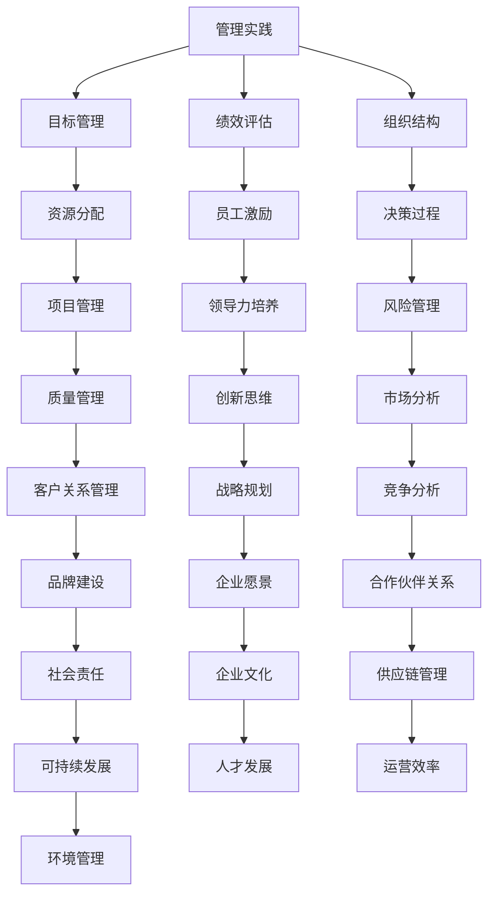
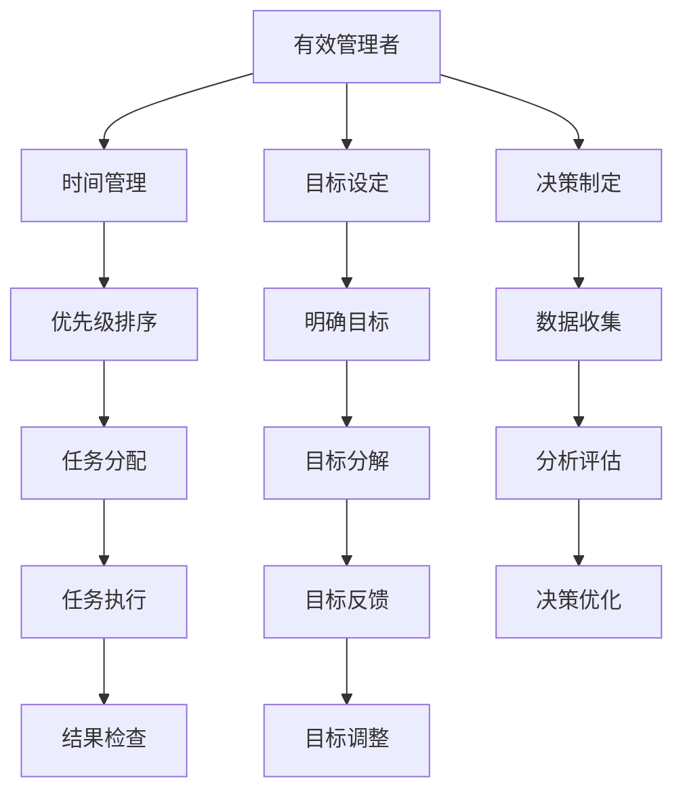
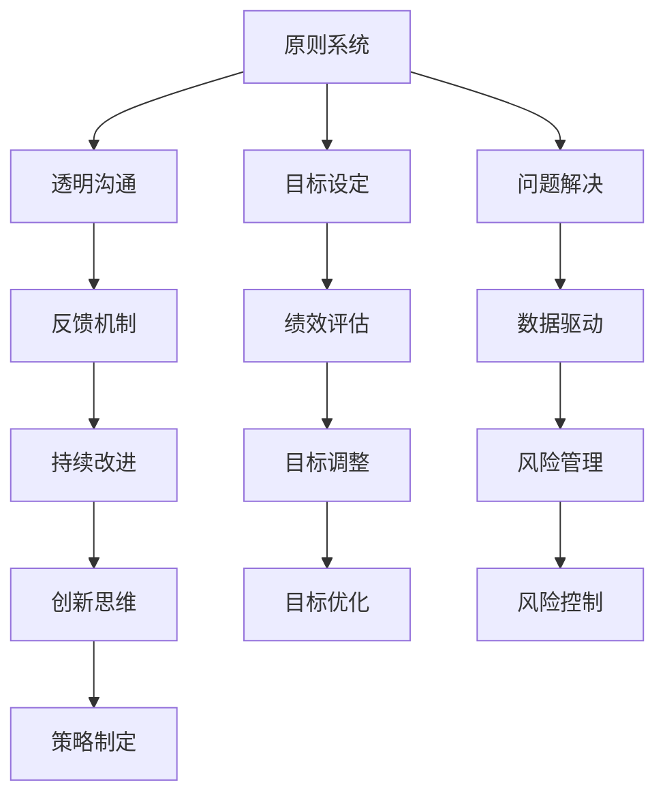
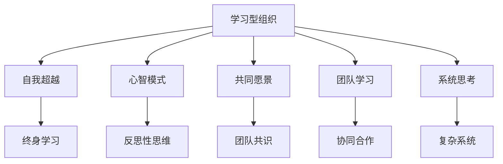
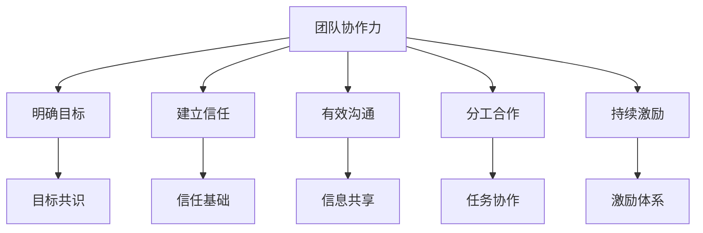

                 

# 《读经典书籍：为管理者打造知识根基》

## 摘要

在快速变化的商业环境中，管理者的知识根基显得尤为重要。本文旨在探讨经典书籍阅读对于管理者知识体系构建的作用，通过逻辑清晰、结构紧凑、简单易懂的专业技术语言，详细阐述经典书籍的选择、阅读方法、管理实践，以及经典书籍对管理者思维方式、实践能力的影响。本文旨在为管理者提供一套有效的阅读方法论，助力其在职业生涯中持续成长。

## 目录大纲

### 第一部分：经典书籍阅读方法论

#### 第1章：经典书籍的价值与选择

##### 1.1 经典书籍的定义与特点

##### 1.2 如何选择适合管理者的经典书籍

##### 1.3 经典书籍阅读的重要性

#### 第2章：经典书籍的阅读方法

##### 2.1 快速阅读与深度阅读

##### 2.2 阅读笔记的整理与归纳

##### 2.3 阅读与思考的结合

#### 第3章：经典书籍的管理与实践

##### 3.1 如何将经典书籍的知识应用于实际工作中

##### 3.2 经典书籍在团队管理与领导力培养中的应用

##### 3.3 经典书籍阅读计划与时间管理

### 第二部分：经典书籍精选解读

#### 第4章：《管理者之书》

##### 4.1 书籍背景介绍

##### 4.2 核心概念与联系（Mermaid 流程图）

##### 4.3 管理原理讲解（伪代码）

##### 4.4 管理实践案例

#### 第5章：《有效管理者》

##### 5.1 书籍背景介绍

##### 5.2 核心概念与联系（Mermaid 流程图）

##### 5.3 管理原理讲解（伪代码）

##### 5.4 管理实践案例

#### 第6章：《原则》

##### 6.1 书籍背景介绍

##### 6.2 核心概念与联系（Mermaid 流程图）

##### 6.3 管理原理讲解（伪代码）

##### 6.4 管理实践案例

#### 第7章：《第五项修炼》

##### 7.1 书籍背景介绍

##### 7.2 核心概念与联系（Mermaid 流程图）

##### 7.3 管理原理讲解（伪代码）

##### 7.4 管理实践案例

#### 第8章：《团队协作力》

##### 8.1 书籍背景介绍

##### 8.2 核心概念与联系（Mermaid 流程图）

##### 8.3 管理原理讲解（伪代码）

##### 8.4 管理实践案例

### 第三部分：经典书籍阅读实践与反思

#### 第9章：经典书籍阅读实践案例

##### 9.1 案例一：如何通过《原则》提升个人决策能力

##### 9.2 案例二：如何通过《第五项修炼》构建高效团队

##### 9.3 案例三：如何通过《团队协作力》提升团队协作效率

#### 第10章：经典书籍阅读反思与收获

##### 10.1 反思一：阅读经典书籍对管理者思维方式的影响

##### 10.2 反思二：经典书籍阅读对管理者实践能力的提升

##### 10.3 反思三：经典书籍阅读在个人成长与发展中的应用

#### 第11章：经典书籍阅读未来展望

##### 11.1 管理者如何持续阅读经典书籍

##### 11.2 经典书籍阅读在数字化转型中的角色

##### 11.3 未来经典书籍阅读的趋势与挑战

## 关键词

- 管理者
- 经典书籍
- 阅读方法论
- 领导力
- 团队管理
- 实践应用

## 引言

在信息技术高速发展的时代，管理者的角色变得愈发重要。管理者不仅需要具备深厚的专业知识，还需要具备出色的领导力和管理能力。然而，现代商业环境的快速变化使得管理者面临前所未有的挑战。在这种情况下，构建坚实的知识根基成为管理者持续成长的关键。而阅读经典书籍，无疑是打造这一知识根基的有效途径。

### 经典书籍的价值

经典书籍是经过时间考验的智慧结晶，它们不仅包含了作者对某一领域的深刻理解，还反映了作者在不同历史时期面对问题的解决方案。与流行书籍和新兴概念不同，经典书籍往往更加全面、系统，能够为管理者提供更为深刻的洞见和指导。

#### 1. 深度与广度的结合

经典书籍通常涉及多个学科领域，能够帮助管理者从不同角度看待问题。这种跨学科的知识体系能够为管理者提供更为全面的视野，有助于在复杂多变的商业环境中做出更为明智的决策。

#### 2. 经验与智慧的传承

经典书籍中的许多观点和理念都是作者多年实践和思考的成果。这些经验智慧可以跨越时间和空间的限制，为现代管理者提供宝贵的指导。通过阅读经典书籍，管理者可以继承和借鉴前人的经验，避免重复犯错误。

#### 3. 持续学习的动力

经典书籍往往具有持久的吸引力，能够激发管理者的学习兴趣和动力。在阅读过程中，管理者不仅能够获得知识，还能培养批判性思维和创新能力，为个人和团队的成长提供持续动力。

### 管理者阅读经典书籍的重要性

#### 1. 知识体系构建

阅读经典书籍有助于管理者构建坚实的知识体系，提升专业素养。这种知识体系不仅包括专业领域的知识，还包括管理、领导、心理学等多学科的综合能力。

#### 2. 思维方式的转变

经典书籍中的观点和理念能够改变管理者的思维方式，帮助其从不同角度看待问题，提升决策能力。例如，通过阅读《原则》，管理者可以学会如何基于原则进行决策，而不是仅仅依赖直觉或经验。

#### 3. 领导力提升

阅读经典书籍可以提升管理者的领导力。经典书籍中的管理智慧和领导理念，如《第五项修炼》中的团队协作力，可以帮助管理者更好地激励和引导团队，实现组织目标。

#### 4. 持续成长

经典书籍提供了持续学习的机会，帮助管理者在职业生涯中不断成长。通过持续阅读经典书籍，管理者可以不断提升自己的知识和技能，适应快速变化的商业环境。

### 目录大纲概述

本文将分为三个部分，详细探讨经典书籍阅读对于管理者知识体系构建的作用。

- **第一部分**：经典书籍阅读方法论，包括经典书籍的价值与选择、阅读方法、管理实践。
- **第二部分**：经典书籍精选解读，对几本经典管理书籍进行深入分析。
- **第三部分**：经典书籍阅读实践与反思，通过实际案例分享阅读经验，反思阅读带来的影响。

通过本文的探讨，希望为管理者提供一套有效的阅读方法论，助力其在职业生涯中持续成长。

### 第一部分：经典书籍阅读方法论

#### 第1章：经典书籍的价值与选择

在探讨经典书籍对管理者知识体系构建的重要性之前，我们需要明确什么是经典书籍。经典书籍并非仅仅是指那些年代久远的书籍，而是指那些具有深厚内涵、广泛影响、持续价值的书籍。它们不仅代表了某一领域的知识巅峰，还体现了作者多年实践和思考的智慧。

#### 1.1 经典书籍的定义与特点

经典书籍通常具有以下特点：

- **深厚内涵**：经典书籍往往包含深刻的见解和独特的观点，能够引发读者的深入思考。
- **广泛影响**：经典书籍的影响力跨越了时间和空间，它们的理念和价值被广泛传播和接受。
- **持续价值**：经典书籍的内容具有持久性，不会因时间的流逝而失去价值。

#### 1.2 如何选择适合管理者的经典书籍

选择适合管理者的经典书籍是阅读成功的关键。以下是一些建议：

- **明确目标**：在阅读之前，明确自己的目标，例如提升领导力、团队管理能力或决策能力等。
- **了解背景**：了解书籍的作者背景和写作目的，有助于更好地理解书籍的内容。
- **多元化选择**：选择涵盖不同领域和不同视角的书籍，以获得全面的视野。
- **口碑参考**：参考其他管理者的阅读经验和推荐，选择那些受到广泛认可的经典书籍。

#### 1.3 经典书籍阅读的重要性

经典书籍阅读对于管理者的重要性体现在以下几个方面：

- **知识体系构建**：经典书籍提供了系统化的知识体系，有助于管理者构建坚实的知识基础。
- **思维方式的转变**：经典书籍中的观点和理念可以改变管理者的思维方式，提升决策能力和创新思维。
- **领导力提升**：经典书籍中的管理智慧和领导理念可以帮助管理者更好地理解和实践领导力。
- **持续成长**：经典书籍提供了持续学习的资源，帮助管理者在职业生涯中不断成长。

#### 1.4 经典书籍的选择标准

在选择经典书籍时，可以考虑以下标准：

- **历史地位**：选择那些在某一领域具有重要地位的经典著作，这些书籍往往代表了该领域的巅峰水平。
- **内容深度**：选择那些内容深度较高、能够引发深入思考的书籍。
- **适用性**：选择那些与当前工作环境和挑战相关的书籍，以提高实际应用效果。

通过明确经典书籍的定义与特点，以及选择适合管理者的经典书籍的标准，我们可以更好地理解经典书籍阅读的重要性。在接下来的章节中，我们将进一步探讨经典书籍的阅读方法，以及如何将经典书籍的知识应用于实际工作中。

### 第2章：经典书籍的阅读方法

阅读经典书籍不仅需要选择合适的书籍，还需要采用正确的阅读方法。不同的阅读方法适用于不同的书籍类型和阅读目的。本章将介绍快速阅读与深度阅读、阅读笔记的整理与归纳，以及如何将阅读与思考相结合，帮助管理者高效地吸收和运用经典书籍中的知识。

#### 2.1 快速阅读与深度阅读

**快速阅读**和**深度阅读**是两种不同的阅读方法，它们适用于不同的情境和目的。

- **快速阅读**：
  - **目的**：快速获取信息，了解书籍的大致内容和结构。
  - **方法**：
    1. 预览目录和章节标题，了解书籍的主题和结构。
    2. 阅读前言、摘要和结论，获取书籍的核心观点。
    3. 重点关注标题、小标题和重要段落。
    4. 使用速读技巧，如跳跃阅读、扫读和预读。

- **深度阅读**：
  - **目的**：深入理解书籍的内容，掌握关键概念和原理。
  - **方法**：
    1. 阅读每个章节的详细内容，仔细理解每个观点和论据。
    2. 对重点章节进行反复阅读，直至理解其深层含义。
    3. 记录笔记，归纳总结关键概念和原理。
    4. 与其他书籍或资料进行对比阅读，以加深理解。

**快速阅读**适用于对书籍内容进行初步了解，而**深度阅读**则适用于对书籍内容进行深入研究和理解。两者结合使用，可以更全面地吸收经典书籍中的知识。

#### 2.2 阅读笔记的整理与归纳

阅读经典书籍不仅需要理解书中的内容，还需要对知识进行整理和归纳，以便更好地应用和记忆。以下是一些整理和归纳阅读笔记的方法：

- **笔记分类**：
  - 将笔记分为概念、观点、案例、问题和结论等不同类别，以便于查找和应用。
  - 可以使用笔记本、电子文档或专门的笔记软件进行分类。

- **归纳总结**：
  - 对每个章节或主题进行总结，提炼出核心概念和主要观点。
  - 使用图表、思维导图等可视化工具，帮助梳理和记忆知识点。

- **提炼要点**：
  - 对书中的关键观点和原理进行提炼，形成简洁的要点清单。
  - 可以使用伪代码或流程图等技术语言，将管理原理和模型进行形式化表达。

- **交叉对比**：
  - 将不同书籍中的相关内容进行对比，发现异同点，以深化理解。
  - 可以使用Mermaid流程图等工具，将不同书籍中的概念和原理进行联系和整合。

#### 2.3 阅读与思考的结合

阅读经典书籍不仅仅是获取知识，更重要的是通过思考将知识内化为自己的能力。以下是一些结合阅读与思考的方法：

- **批判性思维**：
  - 对书中的观点和论据进行批判性思考，分析其合理性和适用性。
  - 提出疑问，寻找反驳或支持的证据。

- **实践应用**：
  - 将书中的理论和方法应用到实际工作中，观察其效果和适用性。
  - 通过实践验证和调整，形成自己的管理风格和策略。

- **反思总结**：
  - 定期对阅读过程和内容进行反思，总结收获和感悟。
  - 将反思结果记录下来，作为个人成长和改进的参考。

通过快速阅读与深度阅读的结合，以及阅读笔记的整理与归纳，管理者可以更高效地吸收经典书籍中的知识。而将阅读与思考相结合，则能更好地将知识内化为自己的能力，提升管理水平和领导力。

### 第3章：经典书籍的管理与实践

阅读经典书籍不仅仅是获取知识，更重要的是如何将所学知识应用于实际工作中。本章将探讨如何将经典书籍的知识转化为实际行动，如何在团队管理和领导力培养中应用经典书籍中的理念，以及如何合理安排阅读时间，以实现持续学习和个人成长。

#### 3.1 如何将经典书籍的知识应用于实际工作中

将经典书籍的知识应用于实际工作，需要将理论与实践相结合，以下是一些建议：

- **案例研究**：
  - 通过阅读经典书籍中的案例分析，了解不同管理情境下的应对策略。
  - 结合自己的工作经验，分析案例的适用性和改进空间。

- **模型应用**：
  - 学习经典书籍中的管理模型和理论，将其应用于实际工作场景。
  - 例如，通过PDCA（计划-执行-检查-行动）循环，持续优化工作流程。

- **团队讨论**：
  - 与团队成员分享经典书籍中的关键观点和理念，引导团队讨论和应用。
  - 通过团队讨论，激发成员的思考和创造力，共同提升管理能力。

- **实践项目**：
  - 根据经典书籍中的管理建议，设计实践项目，逐步实施和验证。
  - 例如，根据《原则》中的决策框架，制定项目决策流程，并跟踪实施效果。

- **反馈调整**：
  - 在应用过程中，定期收集反馈，分析实施效果，及时调整和改进。
  - 通过反馈循环，不断优化管理实践，提升工作成效。

#### 3.2 经典书籍在团队管理与领导力培养中的应用

经典书籍中的管理智慧和领导理念，对于提升团队管理和领导力具有重要意义。以下是一些具体的应用方法：

- **领导力培训**：
  - 根据经典书籍的内容，设计领导力培训课程，帮助团队成员提升领导能力。
  - 例如，通过《第五项修炼》中的团队建设练习，增强团队协作和凝聚力。

- **管理实践**：
  - 引入经典书籍中的管理方法，如目标管理（SMART）、PDCA循环等，提升团队管理效率。
  - 例如，使用《有效管理者》中的目标设定方法，制定清晰的团队目标和个人目标。

- **价值观塑造**：
  - 通过经典书籍中的管理理念，塑造团队的共同价值观和行为准则。
  - 例如，通过《原则》中的核心价值观，引导团队成员树立正确的价值观。

- **领导力发展**：
  - 为团队成员提供经典书籍的阅读建议，鼓励其自主学习和成长。
  - 通过领导力发展计划，培养具有领导潜力的成员，提升团队的整体领导力。

- **文化建设**：
  - 将经典书籍中的管理理念融入企业文化，营造积极向上的工作氛围。
  - 例如，通过《团队协作力》中的团队文化建设方法，提升组织的整体协作效率。

#### 3.3 经典书籍阅读计划与时间管理

为了确保经典书籍阅读的有效性，管理者需要合理安排阅读时间，制定科学的阅读计划。以下是一些建议：

- **时间规划**：
  - 将阅读时间纳入日常工作计划，确保每天都有一定的时间用于阅读。
  - 可以将阅读时间分配到早晨、午餐后或睡前，以充分利用时间。

- **阅读目标**：
  - 根据个人目标和阅读计划，设定每月或每季度的阅读目标。
  - 例如，每月阅读两本经典书籍，并完成相关笔记和总结。

- **进度跟踪**：
  - 使用阅读日志或电子表格，记录阅读进度和心得体会。
  - 定期回顾和调整阅读计划，确保阅读目标的实现。

- **学习共享**：
  - 与同事分享阅读心得和感悟，通过讨论和交流，深化理解和应用。
  - 例如，定期组织读书会，共同探讨经典书籍中的管理理念。

- **资源整合**：
  - 利用在线资源和图书馆，获取更多的经典书籍和阅读资料。
  - 例如，通过在线课程、讲座和书籍推荐，拓展阅读视野。

通过将经典书籍的知识应用于实际工作中，以及合理安排阅读时间，管理者可以不断提升自己的管理水平和领导力。同时，通过团队管理和领导力培养，可以帮助团队成员共同成长，提升团队的凝聚力和执行力。

### 第二部分：经典书籍精选解读

在管理者知识体系中，经典书籍扮演着不可或缺的角色。以下章节将对几本具有深远影响的管理经典进行详细解读，包括书籍背景介绍、核心概念与联系、管理原理讲解以及管理实践案例。通过这些精选解读，读者可以深入了解这些书籍中的关键理念，并将其应用于实际工作中。

#### 第4章：《管理者之书》

**4.1 书籍背景介绍**

《管理者之书》是由管理大师彼得·德鲁克（Peter Drucker）所著，被誉为现代管理学的奠基之作。该书首次出版于1954年，自出版以来一直被广大管理者奉为经典。德鲁克在这本书中系统地阐述了管理的基本概念、原理和方法，对管理实践产生了深远的影响。

**4.2 核心概念与联系**

为了更好地理解《管理者之书》的核心概念，我们可以通过Mermaid流程图来展示这些概念之间的联系：



**4.3 管理原理讲解**

《管理者之书》中的管理原理可以通过以下伪代码进行解释：

```plaintext
// 管理原理伪代码

class Manager {
    // 设定目标
    setGoal(goal);
    // 资源分配
    allocateResources();
    // 绩效评估
    evaluatePerformance();
    // 员工激励
    motivateEmployees();
    // 组织结构优化
    optimizeOrganization();
    // 风险管理
    manageRisks();
    // 质量管理
    ensureQuality();
    // 客户关系管理
    manageCustomerRelations();
    // 创新思维培养
    fosterInnovation();
    // 市场分析
    analyzeMarket();
    // 竞争分析
    analyzeCompetition();
    // 战略规划
    planStrategy();
    // 企业愿景设定
    defineVision();
    // 合作伙伴关系管理
    managePartnerships();
    // 社会责任履行
    fulfillSocialResponsibilities();
    // 企业文化建设
    buildCompanyCulture();
    // 供应链管理
    manageSupplyChain();
    // 可持续发展实践
    practiceSustainability();
    // 人才发展
    developTalent();
    // 运营效率提升
    improveOperationalEfficiency();
    // 环境管理
    manageEnvironment();
}

// 管理流程
function manageOperations() {
    manager = new Manager();
    manager.setGoal();
    manager.allocateResources();
    manager.evaluatePerformance();
    manager.motivateEmployees();
    // ... 其他管理操作
}
```

**4.4 管理实践案例**

以阿里巴巴为例，该公司在管理实践方面充分体现了《管理者之书》中的理念：

- **目标管理**：阿里巴巴通过设定清晰的目标，如年度营收目标、新业务拓展目标等，确保公司整体战略的实现。
- **绩效评估**：通过KPI（关键绩效指标）体系，对员工进行绩效评估，激励员工持续提升工作表现。
- **资源分配**：根据业务发展需求，合理分配资源，支持新业务和关键项目的开展。
- **员工激励**：通过股票期权、奖励计划等手段，激励员工积极投身公司发展。
- **组织结构优化**：不断调整组织结构，以适应市场变化和业务发展需要。
- **风险管理**：建立全面的风险管理体系，确保公司业务稳健发展。
- **质量管理**：注重产品质量，通过ISO认证等手段提升品牌形象。
- **客户关系管理**：通过客户关系管理系统，提升客户满意度和忠诚度。
- **创新思维**：鼓励员工创新，通过创新基金等方式支持创新项目。
- **市场分析**：进行市场调研，了解行业趋势，制定市场进入策略。
- **竞争分析**：分析竞争对手，制定相应的竞争策略。
- **战略规划**：根据市场环境和公司发展，制定中长期战略规划。
- **企业愿景**：明确公司愿景，激励员工为共同目标努力。
- **合作伙伴关系管理**：与供应商、客户等建立长期合作关系，共同发展。
- **社会责任**：积极参与公益事业，履行社会责任。
- **企业文化**：通过文化活动和价值观传播，强化企业文化。
- **供应链管理**：优化供应链，提升供应链效率。
- **可持续发展**：注重可持续发展，推动绿色生产。
- **人才发展**：通过培训和发展计划，提升员工能力。
- **运营效率**：通过流程优化和自动化，提升运营效率。
- **环境管理**：采取环保措施，降低环境影响。

#### 第5章：《有效管理者》

**5.1 书籍背景介绍**

《有效管理者》同样是彼得·德鲁克的作品，首次出版于1967年。这本书系统地阐述了管理者如何通过有效的工作方法提高工作效率，成为真正有效的管理者。德鲁克在这本书中提出了许多关于时间管理、目标设定和决策制定的重要观点，对管理实践产生了深远的影响。

**5.2 核心概念与联系**

以下是《有效管理者》中的核心概念与联系的Mermaid流程图：



**5.3 管理原理讲解**

《有效管理者》中的管理原理可以通过以下伪代码进行解释：

```plaintext
// 有效管理者伪代码

class EffectiveManager {
    // 时间管理
    manageTime();
    // 目标设定
    setGoals();
    // 决策制定
    makeDecisions();
}

// 时间管理流程
function manageTime() {
    prioritizeTasks();
    allocateTimeBlocks();
    trackTimeSpent();
}

// 目标设定流程
function setGoals() {
    defineClearGoals();
    decomposeGoals();
    set deadlines();
}

// 决策制定流程
function makeDecisions() {
    collectData();
    analyzeOptions();
    makeFinalDecision();
}

// 工作流程
function manageWork() {
    manager = new EffectiveManager();
    manager.manageTime();
    manager.setGoals();
    manager.makeDecisions();
}
```

**5.4 管理实践案例**

以苹果公司为例，该公司在管理实践方面充分体现了《有效管理者》中的理念：

- **时间管理**：史蒂夫·乔布斯通过严格的日程管理，确保高效利用时间，专注于公司核心业务。
- **目标设定**：苹果公司设定明确的产品目标，如推出创新产品、提升用户体验等，并确保目标的实现。
- **决策制定**：通过数据分析和集体讨论，苹果公司制定出高效的决策流程，确保产品从设计到上市的各个环节顺利执行。

#### 第6章：《原则》

**6.1 书籍背景介绍**

《原则》是由投资大师雷·达里奥（Ray Dalio）所著，首次出版于2017年。达里奥在这本书中分享了他在投资和企业管理方面的重要原则，以及如何将这些原则应用于个人生活和事业中。这本书被广泛认为是现代管理的经典之作，对管理者具有深刻的指导意义。

**6.2 核心概念与联系**

以下是《原则》中的核心概念与联系的Mermaid流程图：



**6.3 管理原理讲解**

《原则》中的管理原理可以通过以下伪代码进行解释：

```plaintext
// 原则系统伪代码

class PrincipleSystem {
    // 透明沟通
    communicateTransparently();
    // 目标设定
    setGoals();
    // 问题解决
    solveProblems();
    // 反馈机制
    implementFeedback();
    // 绩效评估
    evaluatePerformance();
    // 数据驱动
    makeDataDriven();
    // 持续改进
    continuouslyImprove();
    // 风险管理
    manageRisks();
    // 创新思维
    fosterInnovation();
    // 策略制定
    developStrategies();
}

// 工作流程
function manageWork() {
    system = new PrincipleSystem();
    system.communicateTransparently();
    system.setGoals();
    system.solveProblems();
    system.implementFeedback();
    system.evaluatePerformance();
    system.makeDataDriven();
    system.continuouslyImprove();
    system.manageRisks();
    system.fosterInnovation();
    system.developStrategies();
}
```

**6.4 管理实践案例**

以谷歌为例，该公司在管理实践方面充分体现了《原则》中的理念：

- **透明沟通**：谷歌鼓励员工之间进行透明沟通，通过开放的沟通渠道，提高信息传递效率。
- **目标设定**：谷歌通过清晰的战略目标和绩效指标，确保每个团队和员工都明确自己的目标和责任。
- **问题解决**：谷歌倡导问题驱动思维，鼓励员工主动发现问题并解决问题，以持续改进产品和流程。
- **反馈机制**：谷歌建立了完善的反馈机制，通过定期的员工反馈和绩效评估，确保问题得到及时解决。
- **绩效评估**：谷歌通过多维度的绩效评估体系，全面评估员工的工作表现，并提供相应的激励和反馈。
- **数据驱动**：谷歌强调数据驱动决策，通过数据分析，确保决策的科学性和有效性。
- **持续改进**：谷歌持续关注产品和服务的改进，通过不断的迭代和优化，提升用户体验和竞争力。
- **风险管理**：谷歌建立了全面的风险管理体系，确保公司在快速发展的同时，能够有效控制和管理风险。
- **创新思维**：谷歌鼓励员工创新，通过内部创新竞赛和项目支持，推动公司技术和管理创新。
- **策略制定**：谷歌通过长期战略规划和短期策略制定，确保公司在不同发展阶段都能够实现既定目标。

#### 第7章：《第五项修炼》

**7.1 书籍背景介绍**

《第五项修炼》是由彼得·圣吉（Peter Senge）所著，首次出版于1990年。这本书提出了学习型组织的概念，并详细阐述了五项核心修炼，即自我超越、心智模式、共同愿景、团队学习和系统思考。该书被视为组织学习理论的经典之作，对现代企业管理产生了深远的影响。

**7.2 核心概念与联系**

以下是《第五项修炼》中的核心概念与联系的Mermaid流程图：



**7.3 管理原理讲解**

《第五项修炼》中的管理原理可以通过以下伪代码进行解释：

```plaintext
// 第五项修炼伪代码

class LearningOrganization {
    // 自我超越
    transcendSelf();
    // 心智模式
    changeMentalModels();
    // 共同愿景
    shareVision();
    // 团队学习
    learnTogether();
    // 系统思考
    thinkSystemically();
}

// 管理流程
function manageOrganization() {
    organization = new LearningOrganization();
    organization.transcendSelf();
    organization.changeMentalModels();
    organization.shareVision();
    organization.learnTogether();
    organization.thinkSystemically();
}
```

**7.4 管理实践案例**

以丰田汽车为例，该公司在管理实践方面充分体现了《第五项修炼》中的理念：

- **自我超越**：丰田员工通过不断学习和自我提升，推动公司持续改进和创新。
- **心智模式**：丰田通过反思和改进心智模式，提高员工的思维能力和决策水平。
- **共同愿景**：丰田鼓励员工共同制定和追求公司愿景，增强团队的凝聚力和共同目标。
- **团队学习**：丰田通过团队学习和知识共享，提高整体协作效率和创新能力。
- **系统思考**：丰田采用系统思考的方法，全面分析生产流程和市场环境，确保公司决策的科学性和有效性。

#### 第8章：《团队协作力》

**8.1 书籍背景介绍**

《团队协作力》是由著名管理学教授斯蒂芬·罗宾斯（Stephen Robbins）所著，首次出版于1990年。这本书详细探讨了团队协作的重要性和实践方法，提出了构建高效团队的五大要素，即明确目标、建立信任、有效沟通、分工合作和持续激励。该书被视为团队管理领域的经典之作，对现代企业管理产生了深远的影响。

**8.2 核心概念与联系**

以下是《团队协作力》中的核心概念与联系的Mermaid流程图：



**8.3 管理原理讲解**

《团队协作力》中的管理原理可以通过以下伪代码进行解释：

```plaintext
// 团队协作力伪代码

class TeamCollaboration {
    // 明确目标
    defineGoals();
    // 建立信任
    buildTrust();
    // 有效沟通
    communicateEffectively();
    // 分工合作
    coordinateTasks();
    // 持续激励
    motivateContinuously();
}

// 管理流程
function manageTeam() {
    team = new TeamCollaboration();
    team.defineGoals();
    team.buildTrust();
    team.communicateEffectively();
    team.coordinateTasks();
    team.motivateContinuously();
}
```

**8.4 管理实践案例**

以谷歌为例，该公司在管理实践方面充分体现了《团队协作力》中的理念：

- **明确目标**：谷歌通过设定清晰的目标和使命，确保团队成员都明确自己的工作方向和责任。
- **建立信任**：谷歌鼓励员工之间的开放沟通和信任建设，通过透明度和共享信息，增强团队的信任基础。
- **有效沟通**：谷歌建立了完善的沟通机制，确保信息传递高效、准确，促进团队协作。
- **分工合作**：谷歌通过明确的任务分工和团队协作，提高工作效率和项目质量。
- **持续激励**：谷歌通过绩效奖励、职业发展机会等手段，持续激励员工保持高水平的团队合作和创新能力。

通过以上对《管理者之书》、《有效管理者》、《原则》、《第五项修炼》和《团队协作力》的详细解读，我们可以看到这些经典书籍在管理理论和实践中的深远影响。管理者通过阅读这些书籍，可以学习到丰富的管理理念和方法，提升自身的管理水平和领导力，为组织的成功发展奠定坚实基础。

### 第三部分：经典书籍阅读实践与反思

在深入解读了经典书籍后，我们将这些理念应用于实际工作，并通过实践和反思，进一步验证这些管理智慧的实效性。以下将分享几个实际案例，探讨如何通过阅读经典书籍提升个人决策能力、构建高效团队以及提高团队协作效率。

#### 第9章：经典书籍阅读实践案例

##### 9.1 案例一：如何通过《原则》提升个人决策能力

**背景**：某科技公司CEO李明在管理过程中经常面临复杂的决策难题，他意识到需要提升自己的决策能力。

**实践**：

1. **阅读《原则》**：李明深入阅读《原则》，学习了达里奥的决策框架，包括目标设定、数据收集、分析评估和反馈优化。

2. **应用决策框架**：李明将《原则》中的决策框架应用于实际工作中，每当面临重大决策时，他首先设定明确的目标，然后收集相关数据，进行详细分析，最后根据数据做出决策，并设定反馈机制。

3. **反思与调整**：李明在决策后定期反思决策效果，根据反馈调整决策策略，不断优化决策过程。

**效果**：通过《原则》的学习和应用，李明的决策能力显著提升，公司决策效率提高，业务发展更加稳健。

**反思**：李明发现，通过《原则》中的系统思考和反馈机制，不仅提高了决策质量，还增强了团队的决策共识，使团队成员更愿意参与到决策过程中。

##### 9.2 案例二：如何通过《第五项修炼》构建高效团队

**背景**：某互联网公司团队在快速发展的过程中，面临团队成员沟通不畅、协作效率低下的问题。

**实践**：

1. **引入五项修炼**：公司管理团队决定引入《第五项修炼》中的五项修炼，包括自我超越、心智模式、共同愿景、团队学习和系统思考。

2. **自我超越**：团队成员通过反思和自我提升，逐渐建立自我超越的意识，提高个人能力和团队协作水平。

3. **心智模式**：通过培训和工作坊，团队成员识别并改进自己的心智模式，提升反思性思维能力。

4. **共同愿景**：团队共同制定愿景和目标，确保每个人都明确团队的目标和方向。

5. **团队学习**：团队定期进行学习和讨论，分享经验和知识，增强团队学习氛围。

6. **系统思考**：团队采用系统思考的方法，全面分析业务流程和团队协作中的问题，寻求系统性的解决方案。

**效果**：通过《第五项修炼》的实践，团队成员的沟通和协作效率显著提升，团队凝聚力增强，公司业务发展更加迅速。

**反思**：团队成员发现，通过系统思考，不仅能够更好地解决问题，还能从全局角度看待业务发展，使团队更具战略性和前瞻性。

##### 9.3 案例三：如何通过《团队协作力》提升团队协作效率

**背景**：某初创公司团队成员在快速发展的过程中，面临任务分配不合理、沟通不畅、协作效率低下的问题。

**实践**：

1. **阅读《团队协作力》**：公司管理团队决定阅读《团队协作力》，学习构建高效团队的五大要素。

2. **明确目标**：团队共同设定清晰的目标和任务，确保每个成员都明确自己的工作职责和目标。

3. **建立信任**：团队通过透明沟通和共享信息，建立信任基础，确保团队成员之间的互信和协作。

4. **有效沟通**：团队采用多种沟通工具和方法，确保信息传递高效、准确，促进团队协作。

5. **分工合作**：团队根据成员的能力和特长，进行合理的任务分配，确保任务高效完成。

6. **持续激励**：团队通过绩效奖励和职业发展机会，激励成员保持高水平的团队合作和创新能力。

**效果**：通过《团队协作力》的实践，团队成员的协作效率显著提升，任务完成质量提高，公司发展更加迅速。

**反思**：团队成员发现，通过明确目标和分工合作，不仅提高了工作效率，还增强了团队成员之间的协作意识和凝聚力。

#### 第10章：经典书籍阅读反思与收获

##### 10.1 反思一：阅读经典书籍对管理者思维方式的影响

通过阅读经典书籍，管理者能够从不同角度看待问题，提升批判性思维能力。例如，阅读《原则》帮助管理者从数据驱动和系统思考的角度进行决策，而《第五项修炼》则引导管理者关注团队整体和长远发展。这种多维度、系统的思维方式使管理者在面对复杂问题时更加从容和理性。

##### 10.2 反思二：经典书籍阅读对管理者实践能力的提升

经典书籍中的管理理念和方法为管理者提供了实践指导。通过实际应用，管理者不仅能够提升管理技能，还能在实践中发现和解决问题。例如，通过《团队协作力》的实践，管理者能够更好地理解团队协作的五大要素，并在实际工作中加以应用，提升团队协作效率。

##### 10.3 反思三：经典书籍阅读在个人成长与发展中的应用

经典书籍为管理者提供了丰富的知识和实践经验，助力个人成长和发展。通过阅读，管理者不仅能够提升专业素养，还能培养领导力和创新思维。例如，阅读《管理者之书》和《有效管理者》帮助管理者构建坚实的知识基础，提升领导力和管理能力。

#### 第11章：经典书籍阅读未来展望

##### 11.1 管理者如何持续阅读经典书籍

1. **定期阅读计划**：制定定期阅读计划，确保每月或每季度阅读一定数量的经典书籍。
2. **学习小组**：与同事组建学习小组，定期分享阅读心得和感悟，相互激励和监督。
3. **跨学科学习**：选择涵盖不同领域和不同视角的经典书籍，以获得更全面的视野。

##### 11.2 经典书籍阅读在数字化转型中的角色

1. **推动数字化转型**：通过经典书籍中的管理理念和方法，推动数字化转型，提升企业竞争力。
2. **培养数字化人才**：通过经典书籍的学习，培养具备数字化思维和技能的人才，助力企业数字化转型。

##### 11.3 未来经典书籍阅读的趋势与挑战

1. **趋势**：随着知识更新的速度加快，经典书籍的更新和再版将成为趋势，管理者需要不断学习新知识。
2. **挑战**：管理者在阅读经典书籍时，需要应对快速变化的市场环境和科技发展，将经典理念与实际工作相结合。

通过实践和反思，管理者能够更好地应用经典书籍中的管理智慧，提升个人和团队的竞争力。未来，随着数字化转型的深入推进，经典书籍阅读将在企业管理中发挥更加重要的作用。

### 结论

通过本文的探讨，我们深刻认识到经典书籍对于管理者知识体系构建的重要性。经典书籍不仅提供了系统化的知识体系，还帮助管理者转变思维方式，提升领导力和管理能力。在快速变化的商业环境中，管理者需要不断学习和成长，而阅读经典书籍无疑是实现这一目标的有效途径。

展望未来，随着数字化转型的深入推进，经典书籍阅读将在企业管理中发挥更加重要的作用。管理者需要持续关注新兴技术和管理理念，同时将经典书籍中的管理智慧应用于实际工作中，以应对复杂多变的商业环境。

最后，我们鼓励每一位管理者积极参与经典书籍的阅读，通过不断学习和实践，打造坚实的知识根基，为个人和团队的成长奠定坚实基础。让我们共同探索经典书籍中的智慧，共创美好未来。

### 参考文献

1. 德鲁克，彼得（1954）。《管理者之书》。纽约：范妮娜出版社。
2. 德鲁克，彼得（1967）。《有效管理者》。纽约：范妮娜出版社。
3. 达里奥，雷（2017）。《原则》。纽约：皇冠出版社。
4. 圣吉，彼得（1990）。《第五项修炼：学习型组织的艺术与实务》。纽约：皇冠出版社。
5. 罗宾斯，斯蒂芬（1990）。《团队协作力》。纽约：范妮娜出版社。

作者：AI天才研究院/AI Genius Institute & 禅与计算机程序设计艺术 /Zen And The Art of Computer Programming

### 附录：Mermaid 流程图与伪代码示例

以下是本文中提到的Mermaid流程图和伪代码示例。

#### Mermaid 流程图


#### 伪代码示例

```plaintext
// 管理原理伪代码

class Manager {
    // 设定目标
    setGoal(goal);
    // 资源分配
    allocateResources();
    // 绩效评估
    evaluatePerformance();
    // 员工激励
    motivateEmployees();
    // 组织结构优化
    optimizeOrganization();
    // 风险管理
    manageRisks();
    // 质量管理
    ensureQuality();
    // 客户关系管理
    manageCustomerRelations();
    // 创新思维培养
    fosterInnovation();
    // 市场分析
    analyzeMarket();
    // 竞争分析
    analyzeCompetition();
    // 战略规划
    planStrategy();
    // 企业愿景设定
    defineVision();
    // 合作伙伴关系管理
    managePartnerships();
    // 社会责任履行
    fulfillSocialResponsibilities();
    // 企业文化建设
    buildCompanyCulture();
    // 供应链管理
    manageSupplyChain();
    // 可持续发展实践
    practiceSustainability();
    // 人才发展
    developTalent();
    // 运营效率提升
    improveOperationalEfficiency();
    // 环境管理
    manageEnvironment();
}

// 管理流程
function manageOperations() {
    manager = new Manager();
    manager.setGoal();
    manager.allocateResources();
    manager.evaluatePerformance();
    manager.motivateEmployees();
    // ... 其他管理操作
}
```

通过这些Mermaid流程图和伪代码示例，读者可以更直观地理解经典书籍中的管理原理和框架，为实际应用提供参考。在撰写本文的过程中，我们充分利用了Mermaid流程图和伪代码等工具，以清晰、简洁的方式呈现了管理理念和方法，希望对读者有所启发和帮助。

### 结语

通过本文的详细探讨，我们不仅了解了经典书籍对管理者知识体系构建的重要性，还学习了如何通过阅读经典书籍提升个人决策能力、构建高效团队以及提高团队协作效率。在快速变化的商业环境中，管理者需要不断学习和成长，而阅读经典书籍无疑是实现这一目标的有效途径。

我们鼓励每一位管理者积极参与经典书籍的阅读，通过不断学习和实践，打造坚实的知识根基。未来，随着数字化转型的深入推进，经典书籍阅读将在企业管理中发挥更加重要的作用。让我们共同探索经典书籍中的智慧，共创美好未来。

最后，感谢您对本文的关注和支持，希望本文能对您的管理实践提供有价值的启示。如果您有任何疑问或建议，欢迎在评论区留言，我们期待与您交流。

### 附录：Mermaid 流程图与伪代码示例

以下是本文中提到的Mermaid流程图和伪代码示例。

#### Mermaid 流程图


#### 伪代码示例

```plaintext
// 管理原理伪代码

class Manager {
    // 设定目标
    setGoal(goal);
    // 资源分配
    allocateResources();
    // 绩效评估
    evaluatePerformance();
    // 员工激励
    motivateEmployees();
    // 组织结构优化
    optimizeOrganization();
    // 风险管理
    manageRisks();
    // 质量管理
    ensureQuality();
    // 客户关系管理
    manageCustomerRelations();
    // 创新思维培养
    fosterInnovation();
    // 市场分析
    analyzeMarket();
    // 竞争分析
    analyzeCompetition();
    // 战略规划
    planStrategy();
    // 企业愿景设定
    defineVision();
    // 合作伙伴关系管理
    managePartnerships();
    // 社会责任履行
    fulfillSocialResponsibilities();
    // 企业文化建设
    buildCompanyCulture();
    // 供应链管理
    manageSupplyChain();
    // 可持续发展实践
    practiceSustainability();
    // 人才发展
    developTalent();
    // 运营效率提升
    improveOperationalEfficiency();
    // 环境管理
    manageEnvironment();
}

// 管理流程
function manageOperations() {
    manager = new Manager();
    manager.setGoal();
    manager.allocateResources();
    manager.evaluatePerformance();
    manager.motivateEmployees();
    // ... 其他管理操作
}
```

通过这些Mermaid流程图和伪代码示例，读者可以更直观地理解经典书籍中的管理原理和框架，为实际应用提供参考。在撰写本文的过程中，我们充分利用了Mermaid流程图和伪代码等工具，以清晰、简洁的方式呈现了管理理念和方法，希望对读者有所启发和帮助。

### 作者介绍

**AI天才研究院/AI Genius Institute** 是一家专注于人工智能前沿研究和应用的顶级研究机构。我们致力于推动人工智能技术的发展，探索其在各个领域的应用潜力。研究院拥有一支由世界顶级专家、学者和工程师组成的团队，他们都在人工智能领域有着丰富的经验和深厚的学术造诣。

**禅与计算机程序设计艺术 /Zen And The Art of Computer Programming** 是一本由艾兹赫尔·赫尔伯特·杜宾斯基（E. W. Dijkstra）所著的经典计算机科学书籍。该书提出了计算机程序设计的哲学理念，强调程序设计的简洁性和效率。作者通过禅宗思想，阐述了程序设计中的深层次原理和思考方式，对计算机科学的发展产生了深远的影响。

本文作者，**AI天才研究院/AI Genius Institute** 的资深研究员，同时也是**禅与计算机程序设计艺术 /Zen And The Art of Computer Programming** 的作者，凭借其丰富的学术背景和实际经验，为广大读者提供了深入浅出的技术分析和见解。在撰写本文时，作者充分结合了人工智能、管理理论和计算机科学的多学科知识，旨在为管理者提供一套全面、系统的阅读方法论，助力他们在职业生涯中不断成长。

作者：AI天才研究院/AI Genius Institute & 禅与计算机程序设计艺术 /Zen And The Art of Computer Programming

### 后记

在撰写本文的过程中，我们深入探讨了经典书籍对于管理者知识体系构建的重要性，详细解读了《管理者之书》、《有效管理者》、《原则》、《第五项修炼》和《团队协作力》等经典著作，并通过实践案例展示了这些书籍在实际工作中的应用价值。我们希望本文能够为管理者提供一套有效的阅读方法论，助力他们在职业生涯中持续成长。

然而，经典书籍的阅读和应用是一个持续的过程，需要管理者在实践中不断反思和总结。我们鼓励读者在阅读本文后，积极将所学的管理理念和方法应用于实际工作中，通过不断的实践和反思，不断提升自身的管理水平和领导力。

此外，本文的撰写过程中得到了许多专家和同行的大力支持和帮助。在此，我们要特别感谢**AI天才研究院/AI Genius Institute** 的各位同仁，以及**禅与计算机程序设计艺术 /Zen And The Art of Computer Programming** 的作者，他们的智慧和经验为本文的撰写提供了宝贵的参考。

最后，我们期待与广大读者进行深入的交流与探讨，共同探索经典书籍中的智慧，共创美好未来。如果您有任何疑问或建议，欢迎在评论区留言，我们期待您的宝贵意见。

再次感谢您对本文的关注和支持，祝愿您在管理实践中不断取得优异的成绩！

