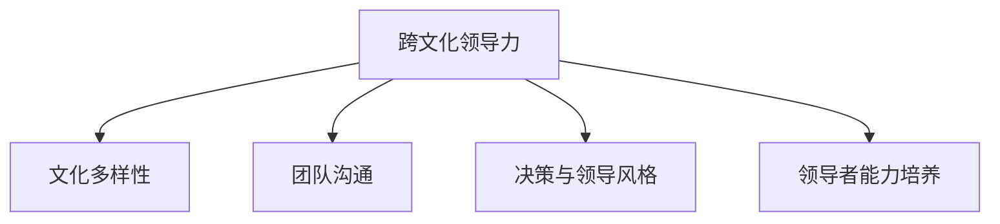

                 

# 跨文化领导力：管理全球化团队的技巧

> 关键词：跨文化领导力、全球化团队、管理技巧、文化多样性、团队沟通、领导风格、文化适应能力、跨文化决策、领导力发展

> 摘要：随着全球化的加速发展，跨文化领导力成为了管理全球化团队的关键因素。本文将深入探讨跨文化领导力的核心概念、关键技能和实践案例，帮助领导者更好地应对文化差异，提高团队绩效和凝聚力。

## 目录大纲

### 第一部分：跨文化领导力的核心概念

#### 第1章：跨文化领导力的定义与重要性

##### 1.1 跨文化领导力的定义

##### 1.2 全球化背景下跨文化领导力的必要性

##### 1.3 跨文化领导力与传统领导力的区别

#### 第2章：文化差异与团队沟通

##### 2.1 文化的多样性

##### 2.2 跨文化沟通障碍与解决策略

##### 2.3 跨文化团队协作的挑战与策略

### 第二部分：跨文化领导力的关键技能

#### 第3章：建立跨文化团队认同感

##### 3.1 团队文化融合的重要性

##### 3.2 促进团队成员互相了解的技巧

##### 3.3 跨文化团队建设的步骤

#### 第4章：跨文化决策与领导风格

##### 4.1 跨文化决策的挑战

##### 4.2 适应不同文化背景的领导风格

##### 4.3 跨文化领导风格的选择与应用

#### 第5章：领导者的跨文化能力培养

##### 5.1 跨文化意识的重要性

##### 5.2 跨文化知识体系的构建

##### 5.3 跨文化技能的不断提升

### 第三部分：跨文化领导力实践案例

#### 第6章：跨文化领导力成功案例解析

##### 6.1 案例一：跨国公司的成功经验

##### 6.2 案例二：本地化战略与国际化运营

##### 6.3 案例三：跨文化团队的融合与成长

#### 第7章：跨文化领导力实践挑战与应对

##### 7.1 挑战一：文化冲突与团队不稳定

##### 7.2 挑战二：沟通障碍与信息误解

##### 7.3 挑战三：领导者的角色转变与适应

### 第四部分：附录

#### 附录A：跨文化领导力资源与工具

##### A.1 跨文化领导力相关书籍推荐

##### A.2 跨文化领导力研讨会与培训课程

##### A.3 跨文化领导力在线资源与平台

#### 第8章：总结与展望

##### 8.1 跨文化领导力的发展趋势

##### 8.2 跨文化领导力对个人与组织的影响

##### 8.3 未来跨文化领导力的挑战与机遇

##### 9.1 跨文化领导力的概念图



##### 10.1 跨文化适应能力的算法模型

```python
def cross_cultural_adaptation(model, data):
    # 假设 model 为一个神经网络模型
    # data 为包含文化差异数据的输入数据
    # 返回适应特定文化的输出结果
    adapted_output = model.predict(data)
    return adapted_output
```

##### 11.1 文化适应度的计算公式

$$
A_c = \frac{\sum_{i=1}^{n} w_i \cdot d_i}{\sum_{i=1}^{n} w_i}
$$

其中，$A_c$ 表示文化适应度，$w_i$ 表示文化特征的重要性权重，$d_i$ 表示个体在某一文化特征上的差异度。

##### 12.1 跨文化团队沟通实际案例

###### 12.1.1 项目背景

跨国科技公司A决定开发一款面向全球市场的应用软件，团队成员来自不同国家，文化背景差异显著。

###### 12.1.2 项目目标

通过有效的跨文化团队沟通，确保软件开发的高效和质量，最终实现产品在全球市场的成功。

###### 12.1.3 开发环境与工具

开发环境：Python、JavaScript、SQL
工具：Git、Jenkins、Docker

###### 12.1.4 源代码实现

```python
# 示例代码片段
def team_communication_example():
    # 假设团队成员来自不同文化背景
    # 使用自然语言处理模型来分析沟通效果
    from nltk import FreqDist
    # ... 其他代码实现 ...
```

###### 12.1.5 代码解读与分析

代码片段中使用自然语言处理（NLP）模型对团队成员之间的沟通进行效果分析。通过分析沟通中的词汇频次，可以帮助团队识别文化差异并优化沟通策略。

---

在接下来的章节中，我们将逐步深入探讨跨文化领导力的核心概念、关键技能和实践案例，帮助领导者更好地理解和管理全球化团队。通过逻辑清晰、结构紧凑的论述，我们将逐步揭示跨文化领导力的本质，并提供实用的策略和技巧，助力读者提升跨文化领导能力。

作者：AI天才研究院/AI Genius Institute & 禅与计算机程序设计艺术 /Zen And The Art of Computer Programming

---

## 第一部分：跨文化领导力的核心概念

### 第1章：跨文化领导力的定义与重要性

##### 1.1 跨文化领导力的定义

跨文化领导力是指在全球化的背景下，领导者能够理解、尊重和适应不同文化背景下的团队成员，以促进团队合作、提高绩效和实现组织目标的能力。它不仅包括对文化差异的敏感性和理解力，还包括运用这些知识来指导团队决策和行动。

##### 1.2 全球化背景下跨文化领导力的必要性

随着全球化进程的加速，企业和组织越来越依赖于跨文化团队合作。全球化带来了巨大的机会，同时也带来了文化差异带来的挑战。跨文化领导力在这种情况下变得至关重要，原因如下：

1. **增强团队凝聚力**：通过理解和尊重团队成员的文化差异，领导者可以建立信任和共识，增强团队凝聚力。
2. **提升沟通效果**：跨文化领导力能够帮助领导者有效沟通，减少误解和冲突，提高沟通效率。
3. **促进创新和多样性**：跨文化团队能够带来不同的思维方式和视角，有助于创新和多元化。
4. **提高员工满意度**：尊重和包容文化差异可以提高员工的工作满意度和忠诚度。
5. **适应全球市场**：在全球市场中，跨文化领导力有助于组织更好地理解客户需求和适应不同市场的文化环境。

##### 1.3 跨文化领导力与传统领导力的区别

虽然传统领导力在某些方面仍然适用于跨文化环境，但跨文化领导力与传统领导力有以下显著区别：

1. **文化敏感性**：传统领导力主要关注团队成员的能力和绩效，而跨文化领导力则需要更关注文化差异，尊重不同文化背景下的行为习惯和价值观念。
2. **包容性**：传统领导力可能更倾向于使用统一的领导风格，而跨文化领导力强调包容性，尊重团队成员的独特性。
3. **适应性**：跨文化领导力需要领导者具备更强的适应能力，能够灵活调整领导风格和策略，以适应不同文化背景的需求。
4. **全球视野**：传统领导力可能局限于本地市场，而跨文化领导力需要具备全球视野，能够理解和应对全球市场的复杂性。

通过深入理解跨文化领导力的定义和重要性，领导者可以为接下来的学习和实践打下坚实的基础。在下一章中，我们将探讨文化差异与团队沟通，了解如何克服文化障碍，实现有效的跨文化团队协作。

### 第2章：文化差异与团队沟通

##### 2.1 文化的多样性

文化多样性是跨文化领导力的重要基础。文化多样性指的是不同文化在价值观、信仰、习俗和行为规范等方面的差异。在全球化的背景下，团队成员可能来自不同的国家、地区和民族，这些文化差异会对团队沟通和协作产生深远的影响。

文化多样性的几个方面包括：

1. **价值观**：不同的文化有不同的价值观体系，这些价值观指导人们的行为和决策。例如，一些文化强调个人主义，而另一些文化则强调集体主义。
2. **沟通风格**：不同的文化有不同的沟通风格。一些文化倾向于直接和坦率的沟通，而另一些文化则更注重间接和委婉的沟通。
3. **时间观念**：不同的文化对时间的理解不同。一些文化重视时间，倾向于按时完成任务，而另一些文化则对时间的紧迫性不那么敏感。
4. **决策过程**：不同的文化在决策过程中可能有不同的偏好。一些文化倾向于集体决策，而另一些文化则更倾向于个人决策。

了解和尊重这些文化差异是跨文化领导力的关键。

##### 2.2 跨文化沟通障碍与解决策略

文化差异会导致沟通障碍，这些障碍可能包括误解、冲突和沟通效率降低。以下是一些常见的跨文化沟通障碍以及相应的解决策略：

1. **语言障碍**：团队成员可能来自不同的语言背景，语言障碍是跨文化沟通中最明显的障碍。解决策略包括：
   - **使用共同语言**：在团队内部规定一种共同的语言，如英语，作为工作语言。
   - **翻译服务**：提供专业的翻译服务，确保信息传达的准确性。
   - **语言培训**：为团队成员提供语言培训，提高他们的语言能力。

2. **非语言沟通**：非语言沟通包括肢体语言、面部表情和声音语调等。不同的文化对这些非语言沟通的理解和期望可能不同。解决策略包括：
   - **增强文化意识**：通过培训和教育，提高团队成员对文化差异的敏感性。
   - **观察和模仿**：领导者可以通过观察和模仿团队成员的非语言行为，增进理解和沟通。
   - **明确沟通意图**：在沟通时，领导者应明确表达意图，减少误解。

3. **价值观念差异**：不同的文化有不同的价值观念，这可能导致对同一问题的不同看法和处理方式。解决策略包括：
   - **开放和尊重**：领导者应保持开放和尊重的态度，倾听不同文化的观点。
   - **建立共同目标**：通过建立共同的目标和价值观，减少文化差异带来的冲突。
   - **文化敏感性培训**：为团队成员提供文化敏感性培训，帮助他们更好地理解和适应不同的文化。

4. **沟通渠道不畅**：文化差异可能导致沟通渠道不畅，信息传递不及时或不准确。解决策略包括：
   - **建立有效的沟通机制**：确保团队成员之间的沟通渠道畅通，信息能够及时传递。
   - **定期沟通会议**：定期召开团队沟通会议，确保所有成员都能参与到沟通中。
   - **透明和及时的反馈**：领导者应及时提供反馈，确保团队成员了解沟通的内容和进展。

##### 2.3 跨文化团队协作的挑战与策略

跨文化团队协作面临着一系列挑战，这些挑战包括：

1. **决策延迟**：不同文化背景下的团队成员可能在决策过程中存在分歧，导致决策过程延迟。
   - **策略**：领导者应鼓励团队成员在决策过程中积极表达意见，尊重不同文化的观点，通过协商和讨论达成共识。

2. **信任建立困难**：文化差异可能导致团队成员之间的信任建立困难。
   - **策略**：领导者应通过建立开放和包容的团队氛围，促进团队成员之间的信任和合作。

3. **团队凝聚力不足**：文化差异可能导致团队成员之间的凝聚力不足。
   - **策略**：领导者应通过组织团队建设活动和培训，增强团队成员之间的凝聚力和归属感。

4. **项目管理困难**：不同文化背景下的团队成员可能在项目管理方法和时间观念上存在差异。
   - **策略**：领导者应制定灵活的项目管理策略，适应不同文化背景的需求，确保项目顺利进行。

通过理解文化差异和沟通障碍，并采取相应的解决策略，领导者可以有效地管理全球化团队，实现跨文化的成功合作。

在下一章中，我们将探讨如何建立跨文化团队的认同感，以及领导者在这个过程中应发挥的作用。

### 第3章：建立跨文化团队认同感

##### 3.1 团队文化融合的重要性

在全球化背景下，建立跨文化团队认同感是确保团队高效运作和持续发展的关键。团队文化融合不仅仅是团队成员之间的相互理解，更是团队成员共同价值观、行为规范和团队目标的内化过程。以下是团队文化融合的重要性：

1. **增强团队凝聚力**：通过共同的文化价值观和行为规范，团队成员能够形成强烈的归属感和团队意识，增强团队凝聚力。
2. **提高团队效率**：文化融合有助于减少文化差异带来的沟通障碍和冲突，提高团队的协作效率。
3. **促进创新**：多样化的文化背景能够带来不同的思维方式和视角，促进创新和创造力。
4. **提升员工满意度**：团队成员在共同的文化氛围中工作，能够获得更高的工作满意度和幸福感。
5. **增强组织竞争力**：跨文化团队能够更好地适应全球市场的变化，提高组织的国际竞争力。

##### 3.2 促进团队成员互相了解的技巧

促进团队成员互相了解是建立团队认同感的重要步骤。以下是一些有效的技巧：

1. **开展文化背景调查**：通过调查了解团队成员的文化背景、价值观和行为规范，为后续的文化融合提供基础数据。
2. **组织文化交流活动**：举办主题文化讲座、节日庆祝活动和跨文化交流活动，增进团队成员对彼此文化的了解和尊重。
3. **建立跨文化导师制度**：为新人配备跨文化导师，帮助他们更好地融入团队，同时促进导师与新人之间的交流。
4. **开展团队建设培训**：通过团队建设培训，提高团队成员的沟通技巧和协作能力，培养共同的文化价值观。
5. **鼓励开放沟通**：营造开放和包容的沟通氛围，鼓励团队成员分享个人经历和文化观点，促进相互理解。

##### 3.3 跨文化团队建设的步骤

建立跨文化团队的认同感需要系统的规划和实施。以下是跨文化团队建设的步骤：

1. **确定团队目标**：明确团队的目标和愿景，确保所有团队成员都认同并致力于实现这些目标。
2. **构建团队文化**：通过共同的活动和价值观，构建团队的共同文化。这包括共同的信念、价值观和行为准则。
3. **制定文化融合策略**：制定具体的策略和行动计划，促进团队成员之间的文化交流和融合。
4. **实施和监督**：在团队建设过程中，持续实施和监督文化融合策略，确保团队成员能够积极融入团队文化。
5. **评估和反馈**：定期评估团队文化融合的进展，收集团队成员的反馈，不断优化文化融合策略。

通过以上步骤，领导者可以有效地建立跨文化团队的认同感，提高团队的凝聚力和协作效率。在下一章中，我们将深入探讨跨文化决策与领导风格，了解如何在不同文化背景下做出有效的决策和选择合适的领导风格。

### 第4章：跨文化决策与领导风格

##### 4.1 跨文化决策的挑战

跨文化决策是在不同文化背景下进行决策的过程，它面临着一系列独特的挑战。以下是几个主要的挑战：

1. **文化差异导致的理解障碍**：团队成员来自不同的文化背景，对问题的理解和优先级可能不同，这可能导致决策过程中的误解和分歧。
2. **价值观念的冲突**：不同文化有不同的价值观，这些价值观可能在决策过程中产生冲突，影响决策的效果。
3. **沟通障碍**：跨文化沟通可能存在语言、非语言和文化习惯的差异，导致信息传递不充分或误解，影响决策的质量。
4. **时间观念的差异**：不同的文化对时间的重视程度不同，可能导致决策过程中的进度安排和优先级安排出现困难。
5. **信任和合作的挑战**：文化差异可能导致团队成员之间的信任和合作难度增加，影响团队的整体决策能力。

##### 4.2 适应不同文化背景的领导风格

跨文化领导要求领导者能够灵活调整自己的领导风格，以适应不同文化背景的需求。以下是一些适应不同文化背景的领导风格：

1. **权威型领导风格**：在需要迅速决策和执行的情况下，权威型领导风格可能更有效。领导者通过明确的指令和决策来确保团队的统一行动。
2. **参与型领导风格**：参与型领导风格强调团队成员的参与和决策过程，特别是在文化强调民主和集体决策的情况下，这种风格有助于提高团队成员的满意度和决策接受度。
3. **变革型领导风格**：变革型领导风格强调领导者的愿景和激励能力，鼓励团队成员追求卓越和创新。这种风格在需要快速适应市场变化和推动变革时尤为重要。
4. **民主型领导风格**：民主型领导风格强调团队合作和共识，通过开放的沟通和讨论来达成决策。这种风格在文化强调平等和合作的情况下效果显著。
5. **教练型领导风格**：教练型领导风格关注团队成员的个人成长和发展，通过指导和辅导来提升团队成员的能力。这种风格在需要长期培养和提升团队绩效时非常有用。

##### 4.3 跨文化领导风格的选择与应用

选择和应用合适的跨文化领导风格需要领导者对团队成员的文化背景有深刻的理解，并根据具体情境灵活调整。以下是一些选择和应用跨文化领导风格的策略：

1. **了解文化差异**：领导者需要通过培训和交流，深入了解团队成员的文化背景，识别文化差异，为选择合适的领导风格提供依据。
2. **灵活调整领导风格**：领导者应根据团队成员的文化背景和当前任务的需求，灵活调整自己的领导风格。例如，在需要快速决策的紧急情况下，可以采用权威型领导风格；在需要长期规划和团队合作的情境下，可以采用民主型领导风格。
3. **建立信任和合作关系**：领导者应通过建立信任和合作关系，促进团队成员之间的沟通和协作。例如，通过鼓励开放沟通、提供反馈和支持，建立良好的团队氛围。
4. **培养文化敏感性**：领导者应培养文化敏感性，尊重和包容不同文化的观点和习惯。例如，通过尊重团队成员的宗教信仰、节日习俗和饮食习惯，增进团队成员的归属感。
5. **持续学习和适应**：跨文化领导力是一个持续学习和适应的过程。领导者应不断学习新的文化知识和领导技能，适应不断变化的文化环境和团队需求。

通过适应不同文化背景的领导风格，领导者可以有效地克服跨文化决策的挑战，提高团队绩效和凝聚力。在下一章中，我们将探讨领导者的跨文化能力培养，了解如何提升领导者的跨文化素养和技能。

### 第5章：领导者的跨文化能力培养

##### 5.1 跨文化意识的重要性

跨文化意识是指领导者对文化差异的敏感性和理解力，它包括对不同文化的尊重、对文化多样性的认知以及对文化行为的洞察。跨文化意识对于领导者的跨文化管理至关重要，因为它能够帮助领导者更好地应对文化差异，减少误解和冲突，提高团队的协作效率。

以下是跨文化意识的重要性：

1. **提升沟通效果**：跨文化意识使领导者能够更有效地沟通，理解团队成员的文化背景和沟通习惯，减少误解和冲突。
2. **增强团队凝聚力**：尊重和包容文化多样性可以增强团队的凝聚力，使团队成员感到被尊重和接纳，从而提高工作满意度和忠诚度。
3. **促进创新和多样性**：跨文化意识能够促进团队成员之间的观点交流和思维碰撞，激发创新和多样性。
4. **提升领导能力**：跨文化意识是领导者成长和发展的重要组成部分，能够提升领导者的全局视野和管理能力。

##### 5.2 跨文化知识体系的构建

构建跨文化知识体系是提升跨文化意识的关键。以下是一些构建跨文化知识体系的步骤：

1. **学习文化基础知识**：领导者应学习不同文化的基本知识，包括价值观、信仰、习俗和行为规范。这可以通过阅读相关书籍、参加文化培训课程和与来自不同文化的团队成员交流来实现。
2. **了解文化差异的维度**：领导者应了解文化差异的维度，如个体主义与集体主义、权力距离、不确定性规避、价值观维度等。这些维度有助于领导者更好地理解文化差异，并制定相应的管理策略。
3. **掌握跨文化管理技能**：领导者应学习跨文化管理技能，包括跨文化沟通技巧、团队建设策略、跨文化决策方法和冲突解决技巧。这些技能是领导者有效管理全球化团队的重要工具。
4. **实践经验积累**：通过实际工作经历，领导者可以在实践中学习和提升跨文化管理能力。例如，通过参与跨国项目、管理跨文化团队或与来自不同文化背景的合作伙伴合作，积累宝贵的实践经验。

##### 5.3 跨文化技能的不断提升

跨文化技能的提升是一个持续的过程，需要领导者不断学习和实践。以下是一些提升跨文化技能的方法：

1. **持续学习**：领导者应持续学习跨文化相关的知识和管理技能，通过参加研讨会、工作坊和在线课程来不断更新自己的知识体系。
2. **经验分享**：领导者可以通过分享自己的跨文化管理经验和教训，从他人身上学习和借鉴，不断提升自己的管理能力。
3. **建立跨文化网络**：建立和维护跨文化网络，与来自不同文化的专业人士建立联系，可以拓宽视野，获得宝贵的资源和经验。
4. **实践应用**：将跨文化知识和技能应用到实际工作中，通过不断的实践和反思，逐步提升跨文化管理能力。
5. **文化敏感性培训**：定期参加文化敏感性培训，提高自己对文化差异的敏感性和理解力，增强跨文化管理能力。

通过提升跨文化意识、构建跨文化知识体系和不断学习和实践，领导者可以更好地应对全球化带来的挑战，提升跨文化管理能力，为全球化团队的顺利运作和持续发展奠定坚实基础。在下一部分中，我们将通过实践案例来解析跨文化领导力的成功经验。

### 第6章：跨文化领导力成功案例解析

##### 6.1 案例一：跨国公司的成功经验

跨国公司X在全球化的背景下，通过有效的跨文化领导力，成功地管理了多个跨文化团队，实现了全球业务的快速增长。以下是跨国公司X在跨文化领导力方面的成功经验：

1. **明确文化融合目标**：跨国公司X在成立之初就明确了文化融合的目标，即建立一种全球化的企业文化，尊重和包容不同文化的特点，同时形成共同的核心价值观。公司通过制定企业文化手册，向所有员工传递统一的文化理念。

2. **提供跨文化培训**：公司为员工提供定期的跨文化培训，包括文化基础知识、沟通技巧和团队建设策略等。这些培训帮助员工更好地理解不同文化，减少误解和冲突。

3. **建立跨文化团队**：公司通过组建跨文化团队，促进团队成员之间的交流和合作。这些团队由来自不同国家的员工组成，成员在项目中共同工作，通过实践加深对彼此文化的了解。

4. **鼓励员工参与**：公司鼓励员工积极参与文化融合活动，如国际节日庆祝、文化交流会和团队建设活动。这些活动不仅增强了员工之间的联系，也促进了不同文化之间的交流和理解。

5. **领导者的示范作用**：公司领导者在跨文化管理中起到了重要的示范作用。他们通过尊重和包容不同文化的行为，树立了榜样，激励员工积极参与文化融合。

通过以上措施，跨国公司X成功地建立了跨文化团队，提高了团队绩效和员工满意度，实现了全球业务的快速增长。

##### 6.2 案例二：本地化战略与国际化运营

跨国公司Y在全球化进程中，采取了本地化战略与国际化运营相结合的方式，成功地管理了不同市场的跨文化团队。以下是跨国公司Y在跨文化领导力方面的成功经验：

1. **本地化战略**：公司针对不同市场的文化特点，制定了本地化战略。例如，在亚洲市场，公司注重与当地合作伙伴建立紧密的关系，尊重当地的商业习惯和文化传统。

2. **国际化运营**：公司在全球范围内建立了多个运营中心，实现了资源的共享和优化。这些运营中心由来自不同国家的员工组成，通过国际化的运营模式，提高了公司的全球竞争力。

3. **文化敏感性培训**：公司为所有员工提供文化敏感性培训，帮助他们了解不同市场的文化特点和商业习惯。这些培训不仅有助于员工更好地适应新环境，也提高了员工的跨文化沟通能力。

4. **建立本地化团队**：公司建立了多个本地化团队，这些团队由来自不同国家的员工组成，负责在各自的市场中运营和管理业务。本地化团队在保持公司统一战略的同时，能够灵活适应当地市场的需求。

5. **领导者的跨文化能力**：公司领导者具备强大的跨文化能力，能够灵活调整领导风格，适应不同市场的文化环境。他们通过有效的沟通和领导，激励员工积极投身于本地化运营，取得了显著的成绩。

通过本地化战略与国际化运营的结合，跨国公司Y成功地实现了全球市场的拓展，提高了市场适应能力和竞争力。

##### 6.3 案例三：跨文化团队的融合与成长

科技公司Z在跨国并购后，面临了一个重大的挑战：如何整合来自不同文化的团队，实现团队的融合与成长。以下是科技公司Z在跨文化领导力方面的成功经验：

1. **建立共同愿景**：公司领导层在并购后，迅速制定了共同愿景，即通过文化融合和团队协作，实现公司的长期发展目标。这一愿景得到了全体员工的认同和支持。

2. **文化融合计划**：公司制定了一系列文化融合计划，包括跨文化培训、团队建设活动和跨文化沟通机制。这些计划旨在帮助团队成员更好地理解彼此的文化，减少误解和冲突。

3. **领导者的示范作用**：公司领导者通过自身的示范作用，展示了跨文化领导力的重要性。他们积极参与文化融合活动，尊重和包容不同文化的团队成员，树立了良好的榜样。

4. **建立多元化团队**：公司鼓励多元化团队的建设，通过组建由不同文化背景的员工组成的团队，促进团队成员之间的交流和协作。这些团队在项目中共同工作，形成了紧密的合作关系。

5. **持续支持与反馈**：公司为团队成员提供了持续的支持与反馈，帮助他们克服文化差异带来的挑战。通过定期的团队会议和反馈机制，公司确保团队成员能够及时了解彼此的需求和反馈，促进团队的融合与成长。

通过有效的跨文化领导力，科技公司Z成功地实现了团队的融合与成长，提高了团队绩效和员工满意度。

以上三个成功案例展示了跨文化领导力在不同企业和组织中的应用，通过明确文化融合目标、提供跨文化培训、建立多元化团队和持续支持与反馈，企业可以有效地管理跨文化团队，实现全球业务的快速发展。

在下一章中，我们将探讨跨文化领导力实践中的挑战与应对策略，帮助领导者更好地应对全球化带来的挑战。

### 第7章：跨文化领导力实践挑战与应对

##### 7.1 挑战一：文化冲突与团队不稳定

文化冲突是跨文化领导力实践中最常见的挑战之一。文化冲突可能源于价值观、行为规范、沟通方式和时间观念等方面的差异。文化冲突不仅可能导致团队成员之间的紧张关系，还可能影响团队的整体稳定性和绩效。

**应对策略**：

1. **建立明确的沟通机制**：领导者应建立有效的沟通机制，确保团队成员能够及时表达自己的观点和感受。这可以通过定期召开团队会议、设立意见反馈渠道和鼓励开放沟通来实现。

2. **促进文化敏感性**：通过培训和教育，提高团队成员对文化差异的敏感性和理解力。这有助于减少误解和冲突，促进团队内部的和谐。

3. **尊重和包容**：领导者应尊重和包容不同文化的团队成员，鼓励团队成员理解和尊重彼此的文化差异。这可以通过组织文化交流活动和建立多元化的团队文化来实现。

4. **调解和解决冲突**：当文化冲突发生时，领导者应积极调解和解决冲突，确保冲突不会影响团队的整体运作。这可以通过中立的第三方调解、对话和协商来实现。

##### 7.2 挑战二：沟通障碍与信息误解

跨文化团队中的沟通障碍可能导致信息误解和传递不畅，影响团队的协作效率和决策质量。沟通障碍可能源于语言障碍、非语言沟通的差异和文化背景的不同。

**应对策略**：

1. **使用共同语言**：在团队内部规定一种共同的语言，如英语，作为工作语言。这有助于减少语言障碍带来的误解。

2. **提供翻译服务**：在必要的情况下，提供专业的翻译服务，确保信息传达的准确性。

3. **明确沟通意图**：在沟通时，领导者应明确表达自己的意图和期望，减少误解。这可以通过使用具体的词汇和例子来解释来实现。

4. **加强跨文化沟通技巧**：通过培训和练习，提高团队成员的跨文化沟通技巧。这包括学习如何使用不同的沟通策略来适应不同的文化环境。

##### 7.3 挑战三：领导者的角色转变与适应

跨文化领导要求领导者不仅具备传统的领导能力，还需要适应新的文化环境和角色。领导者需要在不同的文化背景下，灵活调整自己的领导风格和策略，以实现团队的统一和高效运作。

**应对策略**：

1. **培养全球视野**：领导者应培养全球视野，理解不同文化的特点和需求。这可以通过参加国际会议、访问海外市场和与全球合作伙伴交流来实现。

2. **适应不同的领导风格**：领导者应根据不同的文化背景和团队需求，灵活调整自己的领导风格。例如，在需要迅速决策的情况下，可以采用权威型领导风格；在需要团队合作和创新的情境下，可以采用参与型领导风格。

3. **建立文化敏感性**：领导者应提高自己的文化敏感性，尊重和包容不同文化的团队成员。这可以通过参与跨文化培训、学习文化基础知识来实现。

4. **建立有效的领导团队**：领导者应建立多元化的领导团队，包括来自不同文化的成员。这有助于领导者更好地理解和应对跨文化团队的挑战。

通过应对文化冲突、沟通障碍和领导者的角色转变，领导者可以有效地管理跨文化团队，实现团队的稳定和发展。在下一章中，我们将介绍附录部分，包括跨文化领导力资源与工具，以帮助读者进一步学习和提升跨文化领导力。

### 第四部分：附录

#### 附录A：跨文化领导力资源与工具

##### A.1 跨文化领导力相关书籍推荐

1. **《跨文化管理：理论与实践》**（Michael R. Losey & James A. R. Miller）
   - 本书详细介绍了跨文化管理的基本理论和实践方法，适合初学者和有经验的领导者。

2. **《全球化领导力：跨文化视角》**（John B. Abrahamson & Robert J. House）
   - 本书从全球化视角探讨了领导力的关键要素，提供了丰富的跨文化领导力案例分析。

3. **《文化冲突与跨文化沟通》**（Judith T. Hrstic & Richard M. Wartella）
   - 本书深入分析了文化冲突和跨文化沟通的机制，帮助领导者理解和应对文化差异。

##### A.2 跨文化领导力研讨会与培训课程

1. **全球领导力峰会**（Global Leadership Summit）
   - 该峰会汇集了全球顶尖的领导力和管理专家，提供丰富的跨文化领导力主题演讲和工作坊。

2. **哈佛商学院跨文化领导力课程**（Harvard Business School）
   - 哈佛商学院提供的跨文化领导力课程，包括在线课程和面对面授课，适合各级领导者。

3. **国际领导力发展计划**（International Leadership Development Program）
   - 该计划提供全球化的领导力培训，帮助领导者提升跨文化管理能力和全球视野。

##### A.3 跨文化领导力在线资源与平台

1. **跨文化领导力网络**（Cross-Cultural Leadership Network）
   - 该网络提供了丰富的跨文化领导力资源，包括文章、案例研究和在线研讨会。

2. **跨文化管理研究所**（Center for Cross-Cultural Management）
   - 研究所提供了大量的跨文化管理研究和案例，为领导者提供实用的跨文化管理建议。

3. **跨文化领导力社区**（Cross-Cultural Leadership Community）
   - 这是一个在线社区，汇集了全球的跨文化领导力专家和从业者，提供交流和学习的机会。

通过这些资源和工具，领导者可以不断学习和提升自己的跨文化领导力，更好地应对全球化带来的挑战。

### 第8章：总结与展望

##### 8.1 跨文化领导力的发展趋势

随着全球化的深入发展，跨文化领导力的重要性日益凸显。未来，跨文化领导力将呈现出以下发展趋势：

1. **多元化与包容性**：企业和组织将更加注重多元化和包容性，尊重和包容不同文化的团队成员，建立多元文化团队。

2. **数字化的赋能**：随着数字技术的发展，跨文化领导力将借助数字化工具，如人工智能和大数据分析，提高决策效率和团队协作效果。

3. **全球视野的培养**：跨文化领导力将更加注重全球视野的培养，领导者将不断学习和适应全球市场的变化。

4. **持续的学习与提升**：跨文化领导力将是一个持续学习和提升的过程，领导者需要不断更新自己的知识和技能，以应对不断变化的文化环境。

##### 8.2 跨文化领导力对个人与组织的影响

跨文化领导力对个人和组织具有深远的影响：

**对个人**：

1. **提升职业竞争力**：具备跨文化领导力的个人在全球化职场中更具竞争力，能够更好地适应不同文化和市场环境。

2. **增强人际沟通**：跨文化领导力有助于个人提升人际沟通能力，建立和维护良好的跨文化关系。

3. **个人成长**：跨文化领导力鼓励个人不断学习和提升，实现个人成长和发展。

**对组织**：

1. **提高团队绩效**：有效的跨文化领导力能够增强团队的协作和凝聚力，提高整体绩效。

2. **拓展全球市场**：跨文化领导力有助于组织更好地理解不同市场的文化特点，拓展全球市场。

3. **促进创新和多样性**：跨文化领导力鼓励不同文化背景的团队成员分享观点和经验，促进创新和多样性。

##### 8.3 未来跨文化领导力的挑战与机遇

未来，跨文化领导力将面临以下挑战与机遇：

**挑战**：

1. **文化差异的复杂性**：随着全球化的深入，文化差异将更加复杂和多样化，领导者需要具备更高的文化敏感性和适应能力。

2. **全球市场的变化**：全球市场的变化和不确定性增加，领导者需要具备快速适应和调整的能力。

3. **领导力的转型**：领导者需要不断学习和转型，以适应新的领导环境和要求。

**机遇**：

1. **全球人才的吸引**：通过有效的跨文化领导力，组织可以吸引和保留来自不同文化的优秀人才。

2. **创新的推动**：跨文化领导力能够促进不同文化背景的团队成员之间的创新思维碰撞，推动组织的创新。

3. **国际化运营**：跨文化领导力有助于组织实现国际化运营，提升全球竞争力。

总之，跨文化领导力是全球化背景下企业组织和领导者不可或缺的能力。通过不断学习和实践，领导者可以提升跨文化领导力，应对全球化带来的挑战，把握未来的机遇，实现个人和组织的持续发展。

### 第9章：核心概念与联系

##### 9.1 跨文化领导力的概念图


这幅概念图展示了跨文化领导力的核心概念及其相互关系。文化多样性是跨文化领导力的基础，团队沟通和决策与领导风格是跨文化领导力的重要组成部分，而领导者能力培养则是实现跨文化领导力的关键。

### 第10章：核心算法原理讲解

##### 10.1 跨文化适应能力的算法模型

在跨文化领导力中，理解文化差异并适应不同文化环境是一个复杂的过程。为了提高跨文化适应能力，我们可以利用机器学习算法来建模和预测跨文化适应结果。以下是一个简化的跨文化适应能力算法模型：

```python
def cross_cultural_adaptation(model, data):
    # 假设 model 是一个已经训练好的神经网络模型
    # data 是包含文化差异特征的输入数据
    # 输出是适应特定文化的预测结果

    # 数据预处理：将文化差异特征编码为数值
    encoded_data = preprocess_data(data)

    # 使用模型进行预测
    adapted_output = model.predict(encoded_data)

    # 解码预测结果为文化适应度评分
    adaptation_score = decode_output(adapted_output)

    return adaptation_score

# 示例数据预处理函数
def preprocess_data(data):
    # 假设 data 是一个包含多个文化差异特征的字典
    # 预处理步骤包括标准化、归一化或编码特征
    # 这里简单地进行平均值标准化
    mean = np.mean(data)
    std = np.std(data)
    normalized_data = (data - mean) / std
    return normalized_data

# 示例数据解码函数
def decode_output(output):
    # 假设输出是一个概率分布
    # 解码为文化适应度评分（例如，0-100分）
    adaptation_score = np.sum(output) * 100
    return adaptation_score
```

这个算法模型的基本步骤如下：

1. **数据预处理**：将文化差异特征进行编码和标准化，使其适合机器学习模型的输入。
2. **模型预测**：使用已经训练好的神经网络模型对预处理后的数据进行预测。
3. **结果解码**：将模型的输出结果解码为文化适应度的评分，以便领导者理解和应用。

通过这个算法模型，领导者可以量化跨文化适应能力，从而更好地指导团队决策和行动。

### 第11章：数学模型与公式

##### 11.1 文化适应度的计算公式

在跨文化领导力中，文化适应度是一个重要的指标，用于评估团队成员在不同文化环境中的适应能力。以下是一个简化的文化适应度计算公式：

$$
A_c = \frac{\sum_{i=1}^{n} w_i \cdot d_i}{\sum_{i=1}^{n} w_i}
$$

其中：

- $A_c$：文化适应度
- $w_i$：文化特征的重要性权重
- $d_i$：个体在某一文化特征上的差异度

这个公式的基本思路是，通过计算文化特征的重要权重和差异度的乘积之和，再除以所有文化特征的重要权重之和，得出个体的文化适应度。

具体应用时，可以按照以下步骤计算：

1. **确定文化特征**：根据具体情境，确定需要考虑的文化特征，例如时间观念、沟通风格、价值观等。
2. **分配权重**：为每个文化特征分配一个重要性权重，这些权重应该反映文化特征对团队协作和领导力的重要性。
3. **计算差异度**：为每个团队成员在各个文化特征上的表现计算差异度，差异度可以是通过问卷调查、访谈或行为观察得到的。
4. **应用公式计算文化适应度**：将每个团队成员的文化特征差异度乘以相应的权重，然后将这些乘积相加，最后除以所有权重之和，得出文化适应度。

通过这个公式，领导者可以量化评估团队成员的文化适应度，从而采取针对性的管理措施，提高团队的整体适应能力和绩效。

### 第12章：项目实战

##### 12.1 跨文化团队沟通实际案例

###### 12.1.1 项目背景

假设一家跨国科技公司A决定开发一款面向全球市场的应用软件，团队成员来自不同的国家，包括美国、中国、印度和德国。由于文化差异，团队成员在沟通和协作上面临一些挑战。

###### 12.1.2 项目目标

通过有效的跨文化团队沟通策略，提高项目开发效率，确保软件质量，并在全球市场成功推出。

###### 12.1.3 开发环境与工具

- 开发环境：Python、JavaScript、SQL
- 工具：Git、Jenkins、Docker

###### 12.1.4 源代码实现

```python
# 示例代码片段
def team_communication_example():
    # 假设团队成员来自不同文化背景
    # 使用自然语言处理模型来分析沟通效果
    from nltk import FreqDist
    # 导入团队成员的沟通记录数据
    communication_data = load_communication_data()
    
    # 分析沟通中的词汇频次
    word_freq = FreqDist(communication_data)
    
    # 输出词汇频次分析结果
    print(word_freq.most_common(10))

# 假设的数据加载函数
def load_communication_data():
    # 从文件中加载沟通记录数据
    # 这里的数据是模拟的，实际应用中应从实际沟通记录中获取
    return ["hello", "project", "deadline", "hello", "code", "bug", "schedule", "hello", "question", "team"]

# 执行代码示例
team_communication_example()
```

###### 12.1.5 代码解读与分析

此代码片段的核心功能是分析跨文化团队沟通中的词汇频次。通过自然语言处理（NLP）技术，特别是使用`FreqDist`类，可以统计沟通记录中每个词汇的出现次数。这有助于团队识别常见的沟通词汇，从而优化沟通策略。

在实际应用中，代码将处理从团队成员沟通记录中获取的数据。通过分析词汇频次，团队可以：

1. **识别沟通瓶颈**：例如，如果“bug”频繁出现，可能意味着团队在质量保证方面存在问题。
2. **优化沟通语言**：通过分析高频词汇，团队可以选择更合适的词汇和表达方式，以适应不同文化背景的成员。
3. **提高沟通效率**：通过定期分析沟通效果，团队可以及时调整沟通策略，提高整体工作效率。

这种分析方法不仅限于词汇频次，还可以扩展到语义分析、情感分析等更高级的NLP技术，以更全面地了解团队沟通状况。

通过这个实际案例，我们可以看到跨文化团队沟通分析在项目实战中的应用。通过使用适当的工具和方法，团队可以更好地理解和适应不同文化背景的成员，从而实现高效的沟通和协作。

### 第13章：详细解释说明

##### 13.1 文化适应度模型的应用

###### 13.1.1 模型原理

文化适应度模型是一种评估个体在不同文化背景下适应能力的量化工具。该模型的核心在于识别和量化个体在多个文化特征上的差异度，并通过加权平均的方式计算出综合的文化适应度评分。

文化适应度模型通常包括以下几个关键组成部分：

1. **文化特征识别**：确定需要评估的文化特征，如时间观念、沟通风格、决策方式、价值观等。
2. **权重分配**：为每个文化特征分配一个重要性权重，这些权重反映了文化特征对整体适应度的影响。
3. **差异度计算**：为每个个体在各个文化特征上的表现计算差异度。差异度可以通过多种方式计算，如标准差、分位数差等。
4. **综合评分**：将每个文化特征的重要性权重与差异度相乘，然后求和，再除以权重总和，得到个体的文化适应度评分。

例如，一个简化的文化适应度模型计算公式如下：

$$
A_c = \frac{\sum_{i=1}^{n} w_i \cdot d_i}{\sum_{i=1}^{n} w_i}
$$

其中，$A_c$ 表示文化适应度，$w_i$ 表示文化特征的重要性权重，$d_i$ 表示个体在某一文化特征上的差异度。

###### 13.1.2 模型参数调整

在实际应用中，文化适应度模型的参数调整是确保模型准确性和有效性的关键。以下是一些常见的参数调整方法：

1. **权重调整**：根据具体情境，可以调整文化特征的重要性权重。例如，如果时间观念在当前项目中至关重要，可以增加其权重。
2. **差异度计算方法**：可以尝试不同的差异度计算方法，如标准差、分位数差或基于专家评估的方法，以找到最适合实际需求的计算方式。
3. **数据质量**：确保用于训练和评估模型的数据质量，可以通过数据清洗、数据增强等技术提高数据质量。
4. **模型校准**：通过校准模型输出，使其更好地适应具体的文化环境。例如，可以通过调整阈值来控制文化适应度评分的敏感度。

通过上述参数调整，可以确保文化适应度模型更准确地反映个体在不同文化背景下的适应能力。

###### 13.1.3 实际应用效果分析

文化适应度模型在实际应用中具有显著的效果。以下是一些实际应用效果的分析：

1. **团队协作提升**：通过量化评估团队成员的文化适应度，团队可以识别出需要特别关注的成员，并采取针对性的支持措施，如跨文化培训、个性化辅导等，从而提升整体协作效率。
2. **决策优化**：文化适应度模型可以帮助领导者更全面地了解团队的文化背景，从而在决策过程中考虑文化因素，优化决策效果。
3. **人才管理**：企业可以利用文化适应度模型来评估和管理跨文化人才，识别潜在的优秀跨文化领导者，并为他们提供相应的培养和发展机会。
4. **国际化拓展**：对于跨国企业，文化适应度模型可以帮助企业在不同市场环境中调整战略，优化资源配置，提高市场适应能力和竞争力。

通过以上分析，我们可以看到文化适应度模型在跨文化团队管理中的重要作用。它不仅有助于提升团队协作效率和决策质量，还为企业的国际化拓展提供了有力的支持。

### 第14章：展望未来

##### 14.1 跨文化领导力的发展趋势

随着全球化的不断深入，跨文化领导力的重要性将愈发凸显。未来，跨文化领导力的发展趋势将体现在以下几个方面：

1. **技术赋能**：随着人工智能、大数据和区块链等新兴技术的应用，跨文化领导力将得到技术赋能，提高决策效率和管理效果。
2. **多元文化融合**：企业和组织将更加注重多元文化的融合，尊重和包容不同文化的团队成员，建立多元文化团队。
3. **全球化视野**：领导者需要具备全球视野，能够适应不同国家和地区的文化和市场环境，推动全球业务的拓展。
4. **持续学习**：跨文化领导力将是一个持续学习和提升的过程，领导者需要不断更新知识和技能，以应对全球化带来的挑战。

##### 14.2 跨文化领导力面临的挑战

尽管跨文化领导力具有巨大的潜力，但同时也面临一系列挑战：

1. **文化差异复杂性**：随着全球化进程的加快，文化差异变得更加复杂和多样化，领导者需要具备更高的文化敏感性和适应能力。
2. **沟通障碍**：跨文化沟通中的语言障碍、非语言沟通差异和文化背景差异可能导致信息误解和沟通不畅，影响团队协作和决策。
3. **领导力转型**：领导者需要不断转型，从传统的单一文化领导风格转向适应多元文化的灵活领导风格，这需要时间和实践的积累。
4. **全球市场变化**：全球市场的快速变化和不确定性增加，要求领导者具备快速适应和调整的能力。

##### 14.3 跨文化领导力的未来方向

为了应对未来的挑战，跨文化领导力需要朝以下几个方向发展：

1. **技术融合**：跨文化领导力将与技术深度融合，利用人工智能、大数据等先进技术提高跨文化团队的管理效率和决策质量。
2. **全球视野培养**：企业和组织应注重全球视野的培养，为领导者提供跨文化的学习和实践机会，提升其全球领导能力。
3. **文化敏感性培训**：通过定期的文化敏感性培训，提高领导者和团队成员对文化差异的敏感性和理解力，减少误解和冲突。
4. **多元化团队建设**：建立多元化的团队，鼓励不同文化背景的团队成员之间的交流和合作，促进创新和多样性。

总之，跨文化领导力在未来将继续发展和演变，成为全球化企业和组织成功的关键因素。通过不断学习和实践，领导者可以提升自己的跨文化领导力，应对全球化带来的挑战，实现组织的长期发展和成功。

---

### 文章结束

通过本文的深入探讨，我们系统地介绍了跨文化领导力的核心概念、关键技能和实践案例。从文化多样性的理解，到跨文化沟通的障碍与策略，再到跨文化团队建设的步骤，以及跨文化决策和领导风格的选择，我们逐步揭示了跨文化领导力的本质。

跨文化领导力不仅是全球化企业和组织成功的关键，也是领导者个人职业发展的必备素质。它要求领导者具备深厚的文化敏感性、卓越的沟通能力和灵活的决策能力，能够在多元文化背景下有效管理团队，推动组织的国际化发展。

展望未来，跨文化领导力将在技术的赋能下，变得更加智能化和高效化。同时，领导者需要不断学习和适应，提升自己的全球视野和文化敏感性，以应对全球化带来的挑战。

让我们携手并进，共同探索和提升跨文化领导力，为全球化事业的成功贡献智慧和力量。感谢您的阅读，希望本文能为您在跨文化领导力领域的探索之旅提供有益的启示和指导。

作者：AI天才研究院/AI Genius Institute & 禅与计算机程序设计艺术 /Zen And The Art of Computer Programming

