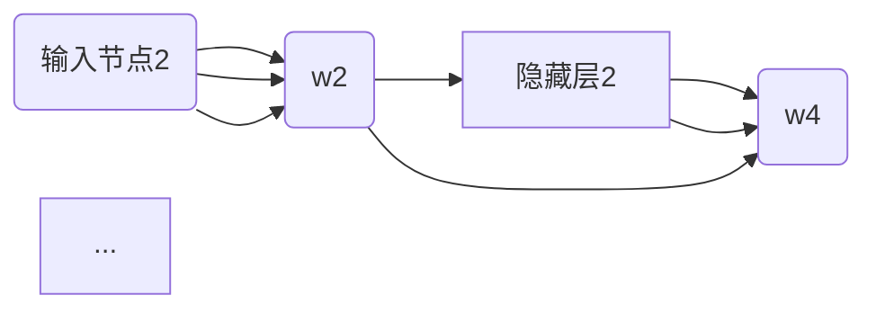
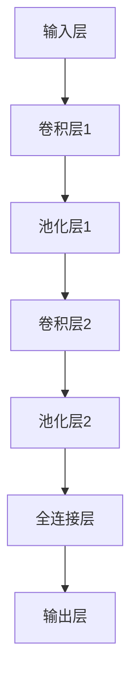
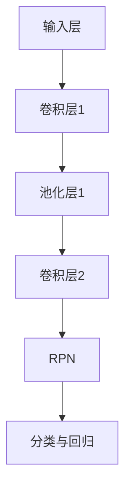
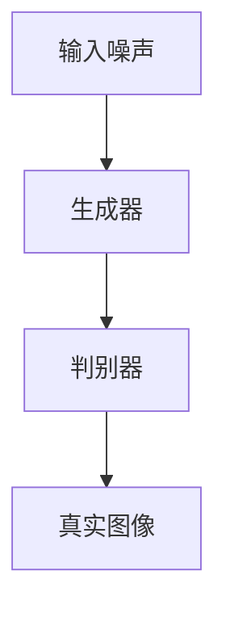
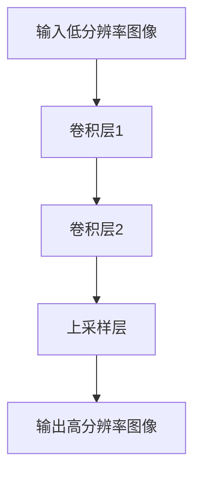
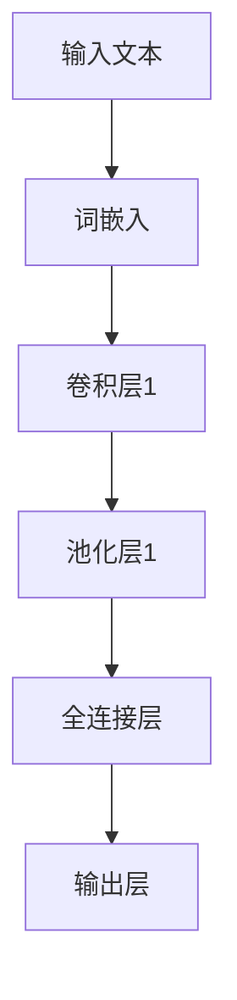
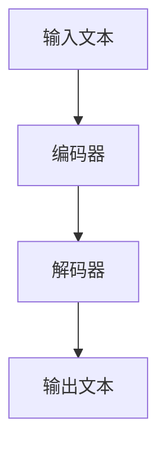
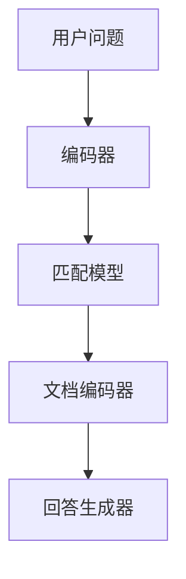
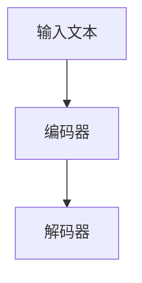

                 

# 软件2.0的发展趋势：深度学习、强化学习

> 关键词：软件2.0、深度学习、强化学习、AI大模型、企业应用、应用实践

> 摘要：本文将从软件2.0时代的背景出发，探讨深度学习和强化学习在软件2.0领域的应用与发展趋势。通过详细解读深度学习与强化学习的基本原理、核心算法以及应用实践，为读者揭示软件2.0时代的AI技术革新与商业价值。

## 目录大纲

### 第一部分：软件2.0时代的AI大模型基础

#### 第1章：软件2.0与AI大模型概述

##### 1.1 软件2.0时代的到来

##### 1.2 AI大模型的定义与特点

##### 1.3 主流AI大模型简介

##### 1.4 AI大模型在企业中的应用前景

#### 第2章：AI大模型技术基础

##### 2.1 深度学习与神经网络基础

##### 2.2 自然语言处理技术概览

##### 2.3 大规模预训练模型原理

#### 第3章：深度学习核心算法原理

##### 3.1 卷积神经网络（CNN）

##### 3.2 循环神经网络（RNN）

##### 3.3 生成对抗网络（GAN）

#### 第4章：强化学习算法原理与应用

##### 4.1 强化学习基础

##### 4.2 Q-学习算法

##### 4.3 策略梯度算法

##### 4.4 深度强化学习（Deep RL）

#### 第5章：软件2.0时代的应用实践

##### 5.1 深度学习在计算机视觉中的应用

##### 5.2 深度学习在自然语言处理中的应用

##### 5.3 强化学习在游戏中的应用

#### 第6章：企业级AI应用开发实践

##### 6.1 AI项目开发流程与最佳实践

##### 6.2 AI产品设计与用户体验

##### 6.3 AI商业价值与商业模式

#### 第7章：AI安全、伦理与未来展望

##### 7.1 AI安全与隐私保护

##### 7.2 AI伦理与法律问题

##### 7.3 AI未来的发展趋势与挑战

#### 附录

##### 附录 A: AI大模型开发工具与资源

##### 附录 B: 经典参考文献

## 引言

### 软件2.0时代的定义与特征

随着互联网的普及和大数据技术的发展，软件产业正迎来一场深刻的变革。传统的软件1.0时代主要依赖于功能性的应用程序，强调代码的编写与维护。而软件2.0时代则是一个以人工智能为核心驱动的全新阶段，强调数据的采集、分析与利用，以及智能化的用户体验。

软件2.0时代具有以下特征：

1. **数据驱动的决策**：软件2.0时代注重数据的价值，通过数据分析和挖掘，为企业提供精准的决策支持。
2. **智能化用户体验**：软件2.0时代通过人工智能技术，为用户提供个性化、智能化的服务体验。
3. **跨界融合**：软件2.0时代不再是单一的业务应用，而是与其他行业（如金融、医疗、教育等）深度融合，形成新的商业模式。
4. **大规模协同**：软件2.0时代通过云计算、物联网等技术实现大规模的协同工作，提升企业的运营效率。

### AI大模型在软件2.0时代的作用

在软件2.0时代，人工智能（AI）大模型成为了技术创新的核心。AI大模型是指通过大规模数据预训练的深度神经网络，具有强大的特征提取和模式识别能力。它们在各个领域具有广泛的应用前景，如自然语言处理、计算机视觉、推荐系统等。

AI大模型在软件2.0时代的作用主要体现在以下几个方面：

1. **提升智能服务质量**：AI大模型能够为用户提供更加精准、高效的智能服务，满足用户个性化需求。
2. **优化业务流程**：AI大模型能够自动识别和优化业务流程，降低人力成本，提高运营效率。
3. **赋能创新应用**：AI大模型为开发者提供了丰富的工具和平台，促进了创新应用的快速落地和推广。
4. **构建数据闭环**：AI大模型通过不断学习和优化，构建了一个数据闭环，实现了数据的持续积累和迭代。

### 本文结构

本文将从以下几个方面展开讨论：

1. **软件2.0与AI大模型概述**：介绍软件2.0时代的背景和AI大模型的基本概念。
2. **AI大模型技术基础**：讲解深度学习和强化学习的基本原理，以及大规模预训练模型的原理。
3. **深度学习核心算法原理**：分析卷积神经网络（CNN）、循环神经网络（RNN）和生成对抗网络（GAN）的工作原理。
4. **强化学习算法原理与应用**：介绍强化学习的基本概念、Q-学习算法、策略梯度算法和深度强化学习。
5. **软件2.0时代的应用实践**：探讨深度学习和强化学习在计算机视觉、自然语言处理和游戏领域的应用实践。
6. **企业级AI应用开发实践**：分享AI项目开发流程、产品设计与用户体验，以及AI的商业价值与商业模式。
7. **AI安全、伦理与未来展望**：讨论AI安全与隐私保护、AI伦理与法律问题，以及AI未来的发展趋势与挑战。

通过本文的讨论，我们旨在为读者提供一个全面、深入的软件2.0时代AI大模型发展的视角，帮助大家更好地理解和应对这一技术变革。

## 第一部分：软件2.0时代的AI大模型基础

### 第1章：软件2.0与AI大模型概述

#### 1.1 软件2.0时代的到来

软件2.0时代，是一个以人工智能为核心驱动的全新阶段，标志着软件产业的重大变革。与传统的软件1.0时代相比，软件2.0时代具有以下显著特征：

1. **数据驱动的决策**：在软件2.0时代，数据成为了企业最重要的资产。通过大数据分析和挖掘，企业能够从海量数据中发现有价值的信息，为决策提供有力支持。
2. **智能化用户体验**：软件2.0时代，人工智能技术广泛应用于各种应用场景，为用户提供个性化、智能化的服务体验。例如，智能客服、智能推荐、智能语音助手等。
3. **跨界融合**：软件2.0时代不再是单一的业务应用，而是与其他行业（如金融、医疗、教育等）深度融合，形成新的商业模式。例如，金融科技、医疗信息化、教育智能化等。
4. **大规模协同**：软件2.0时代通过云计算、物联网等技术实现大规模的协同工作，提升企业的运营效率。例如，企业内部的自动化办公、供应链协同等。

#### 1.1.1 从软件1.0到软件2.0的演进

软件1.0时代主要依赖于功能性的应用程序，强调代码的编写与维护。在这个阶段，软件的主要目的是实现特定的功能，例如文字处理、电子表格、电子邮件等。软件1.0时代的特点是：

1. **以功能为中心**：软件1.0时代，开发者主要关注软件的功能性，如何实现特定功能是主要目标。
2. **独立运行**：软件1.0时代的软件通常是独立运行，不依赖于外部数据源或服务。
3. **简单用户界面**：软件1.0时代的用户界面相对简单，主要是文本界面，图形用户界面（GUI）的应用较少。

而软件2.0时代，随着互联网的普及和大数据技术的发展，软件开始向智能化、数据驱动、跨界融合的方向发展。在这个阶段，软件不再仅仅是一个功能性的工具，而是一个能够与用户互动、为用户创造价值的智能平台。

#### 1.1.2 大模型在软件2.0中的核心地位

在软件2.0时代，大模型（AI大模型）成为了技术创新的核心。大模型是指通过大规模数据预训练的深度神经网络，具有强大的特征提取和模式识别能力。大模型在软件2.0中的核心地位主要体现在以下几个方面：

1. **提升智能服务质量**：大模型能够为用户提供更加精准、高效的智能服务，满足用户个性化需求。例如，智能客服、智能推荐、智能语音助手等。
2. **优化业务流程**：大模型能够自动识别和优化业务流程，降低人力成本，提高运营效率。例如，自动化办公、供应链优化等。
3. **赋能创新应用**：大模型为开发者提供了丰富的工具和平台，促进了创新应用的快速落地和推广。例如，智能医疗、智能教育、智能交通等。
4. **构建数据闭环**：大模型通过不断学习和优化，构建了一个数据闭环，实现了数据的持续积累和迭代。这为企业提供了不断优化的能力和动力。

#### 1.1.3 企业级应用开发的新范式

在软件2.0时代，企业级应用开发迎来了新的范式。传统的开发模式主要是基于功能模块的构建，而软件2.0时代则更加强调数据驱动和智能化。以下是企业级应用开发在软件2.0时代的一些新特点：

1. **数据驱动的开发**：在软件2.0时代，数据成为了驱动力。开发者需要根据数据反馈来不断优化和调整应用程序的功能。
2. **模块化的架构**：软件2.0时代，企业应用更加模块化，各模块之间通过API进行通信。这种架构使得应用更加灵活、可扩展。
3. **云计算与分布式计算**：软件2.0时代，云计算和分布式计算成为了主流。这为企业提供了强大的计算能力和灵活性。
4. **智能化用户体验**：软件2.0时代，开发者需要更加注重用户体验，通过人工智能技术为用户提供个性化、智能化的服务。
5. **跨行业融合**：软件2.0时代，企业应用不再局限于单一行业，而是与其他行业深度融合，形成新的商业模式。

#### 1.2 AI大模型的定义与特点

AI大模型是指通过大规模数据预训练的深度神经网络，具有强大的特征提取和模式识别能力。AI大模型具有以下特点：

1. **大规模数据训练**：AI大模型通常需要海量数据进行训练，以提取丰富的特征信息和模式。
2. **深度神经网络结构**：AI大模型采用深度神经网络结构，能够处理高维、复杂的特征信息。
3. **强大的特征提取能力**：AI大模型通过多层神经网络结构，具有强大的特征提取能力，能够自动学习数据中的潜在特征。
4. **端到端的学习能力**：AI大模型能够实现端到端的学习，从原始数据直接生成预测结果，无需人工干预。

#### 1.2.1 AI大模型的定义

AI大模型是指通过大规模数据预训练的深度神经网络，具有强大的特征提取和模式识别能力。与传统的机器学习模型相比，AI大模型具有以下几个显著特点：

1. **数据量级**：AI大模型通常需要海量数据进行训练，以提取丰富的特征信息和模式。例如，自然语言处理领域的大型模型（如GPT-3）需要数万亿个词的语料库进行训练。
2. **模型规模**：AI大模型通常具有数百万甚至数十亿个参数，具有较大的模型规模。这使它们能够处理高维、复杂的特征信息。
3. **非线性变换能力**：AI大模型通过多层神经网络结构，能够实现非线性变换，从而提高特征提取和模式识别的能力。

#### 1.2.2 AI大模型的核心特点

AI大模型具有以下几个核心特点：

1. **强大的特征提取能力**：AI大模型通过多层神经网络结构，具有强大的特征提取能力，能够自动学习数据中的潜在特征。这使得AI大模型在图像分类、语音识别、自然语言处理等任务中表现出色。
2. **端到端的学习能力**：AI大模型能够实现端到端的学习，从原始数据直接生成预测结果，无需人工干预。这大大简化了模型开发的流程，提高了模型的应用效率。
3. **泛化能力**：AI大模型通过大规模数据训练，具有较好的泛化能力。这意味着它们不仅在训练数据上表现良好，也能够在新数据上保持较高的性能。
4. **自适应能力**：AI大模型能够通过不断学习和优化，自适应地调整模型参数，以应对不断变化的应用场景。

#### 1.2.3 AI大模型与传统AI的区别

AI大模型与传统AI（如传统的机器学习模型）在多个方面存在显著区别：

1. **数据量级**：AI大模型通常需要海量数据进行训练，而传统AI模型对数据量要求较低。
2. **模型规模**：AI大模型具有较大的模型规模，包含数百万甚至数十亿个参数，而传统AI模型通常只有数千个参数。
3. **特征提取能力**：AI大模型通过多层神经网络结构，具有强大的特征提取能力，而传统AI模型通常依赖于手工设计的特征。
4. **端到端的学习能力**：AI大模型能够实现端到端的学习，从原始数据直接生成预测结果，而传统AI模型通常需要多个中间层进行特征提取和转化。

#### 1.3 主流AI大模型简介

在AI领域，已经有许多主流的AI大模型，这些模型在各自的领域表现出色。以下是一些主流AI大模型的介绍：

1. **GPT系列模型**：GPT（Generative Pre-trained Transformer）系列模型是自然语言处理领域的里程碑。GPT-3是目前最大的自然语言处理模型，拥有1750亿个参数，能够生成高质量的自然语言文本。
2. **BERT模型**：BERT（Bidirectional Encoder Representations from Transformers）模型是另一种流行的自然语言处理模型。它采用双向Transformer结构，能够更好地理解文本的上下文关系。
3. **ViT模型**：ViT（Vision Transformer）模型是计算机视觉领域的一个创新。它采用Transformer结构来处理图像，打破了传统计算机视觉领域卷积神经网络的主导地位。
4. **BERT + ViT模型**：BERT + ViT模型是将BERT和ViT模型结合起来，同时处理文本和图像信息。这种模型在图像分类和文本分类任务中表现出色。

#### 1.4 AI大模型在企业中的应用前景

AI大模型在企业中的应用前景广阔，能够为企业带来显著的商业价值。以下是一些主要的应用前景：

1. **自然语言处理**：AI大模型可以用于文本分类、情感分析、机器翻译、问答系统等任务。这些应用能够帮助企业提高运营效率，降低人力成本。
2. **计算机视觉**：AI大模型可以用于图像分类、目标检测、图像生成等任务。这些应用能够帮助企业提高产品质量，降低生产成本。
3. **推荐系统**：AI大模型可以用于用户画像、商品推荐、内容推荐等任务。这些应用能够帮助企业提高用户满意度，增加销售额。
4. **金融风控**：AI大模型可以用于信用评分、风险预测、欺诈检测等任务。这些应用能够帮助企业降低风险，提高安全性。
5. **智能客服**：AI大模型可以用于智能客服系统，实现自动化问答、情感分析等功能。这些应用能够帮助企业提高客户满意度，降低客服成本。

#### 1.4.1 AI大模型的潜在应用领域

AI大模型在多个领域具有广泛的应用潜力。以下是一些主要的潜在应用领域：

1. **自然语言处理**：AI大模型可以应用于文本分类、情感分析、机器翻译、问答系统、自动摘要等任务。
2. **计算机视觉**：AI大模型可以应用于图像分类、目标检测、图像生成、图像增强、视频处理等任务。
3. **推荐系统**：AI大模型可以应用于用户画像、商品推荐、内容推荐、广告投放等任务。
4. **金融风控**：AI大模型可以应用于信用评分、风险预测、欺诈检测、市场分析等任务。
5. **医疗健康**：AI大模型可以应用于疾病诊断、药物发现、医疗影像分析、健康监测等任务。
6. **智能制造**：AI大模型可以应用于质量检测、设备预测维护、生产优化等任务。
7. **智能交通**：AI大模型可以应用于交通流量预测、路况分析、智能导航、自动驾驶等任务。

#### 1.4.2 企业采用AI大模型的优势

企业采用AI大模型具有以下优势：

1. **提高生产效率**：AI大模型能够自动化执行复杂任务，减少人力干预，提高生产效率。
2. **降低运营成本**：AI大模型能够减少人力成本，降低运营成本，提高企业竞争力。
3. **提升产品质量**：AI大模型能够进行质量检测、故障预测，提高产品质量。
4. **优化业务流程**：AI大模型能够自动识别和优化业务流程，提高运营效率。
5. **提高客户满意度**：AI大模型能够提供个性化、智能化的服务，提高客户满意度。
6. **增强创新能力**：AI大模型为开发者提供了丰富的工具和平台，促进了创新应用的快速落地和推广。

#### 1.4.3 AI大模型应用的挑战与机遇

尽管AI大模型在企业中具有广泛的应用前景，但在实际应用中也面临一些挑战和机遇：

1. **挑战**：

   - **数据隐私与安全**：AI大模型对数据的安全性和隐私性提出了更高要求，需要采取有效的措施来保护数据。
   - **模型可解释性**：AI大模型通常是一个“黑箱”，其内部机制难以解释，这给应用带来了挑战。
   - **计算资源需求**：AI大模型通常需要大量的计算资源和存储空间，这对企业IT基础设施提出了更高要求。
   - **人才短缺**：AI大模型应用需要专业的人才来开发和维护，但当前市场上相关专业人才供不应求。

2. **机遇**：

   - **技术创新**：AI大模型为企业提供了创新的工具和平台，推动了技术变革。
   - **商业模式创新**：AI大模型为企业提供了新的商业模式，如基于数据的收费模式、智能合约等。
   - **跨界融合**：AI大模型促进了不同行业之间的跨界融合，催生了新的商业模式和应用场景。
   - **产业升级**：AI大模型的应用有助于企业实现产业升级，提高核心竞争力。

### 小结

软件2.0时代以人工智能为核心驱动力，企业级AI大模型的应用为企业带来了新的机遇和挑战。通过了解AI大模型的基本概念、特点和应用前景，企业可以更好地把握这一技术变革，实现业务创新和可持续发展。

## 第2章：AI大模型技术基础

#### 2.1 深度学习与神经网络基础

深度学习是人工智能（AI）的一个重要分支，其核心思想是通过模拟人脑神经网络的结构和功能来实现机器学习和智能决策。本章将介绍深度学习的基本原理，包括神经网络的基本结构、常见的深度学习架构以及深度学习优化算法。

##### 2.1.1 神经网络的基本结构

神经网络（Neural Networks）是深度学习的基础，它由大量的神经元（Node）组成，这些神经元通过权重（Weight）连接在一起。一个简单的神经网络通常包括以下几个基本组成部分：

1. **输入层（Input Layer）**：输入层接收外部输入，通常包含多个输入节点，对应于输入数据的各个特征。
2. **隐藏层（Hidden Layers）**：隐藏层位于输入层和输出层之间，可以有多个隐藏层。隐藏层的主要作用是提取输入数据的特征和模式。
3. **输出层（Output Layer）**：输出层产生模型的预测结果，通常包含一个或多个输出节点，对应于不同类别或数值结果。

每个神经元通过加权求和和激活函数（Activation Function）来计算其输出。激活函数的作用是将线性变换映射为非线性，从而使得神经网络具有强大的非线性建模能力。常见的激活函数包括 sigmoid、ReLU（Rectified Linear Unit）和 tanh 等。

以下是神经网络的基本结构示意图：



##### 2.1.2 常见的深度学习架构

深度学习架构是指在神经网络的基础上，通过增加层数、调整连接方式等手段来提高模型的性能。以下是一些常见的深度学习架构：

1. **卷积神经网络（CNN）**：卷积神经网络是深度学习在计算机视觉领域的核心架构。它通过卷积操作来提取图像中的局部特征，具有强大的图像分类和识别能力。

2. **循环神经网络（RNN）**：循环神经网络是深度学习在序列数据处理的代表性架构。它通过循环连接来处理长序列数据，具有记忆功能，适用于自然语言处理、语音识别等任务。

3. **生成对抗网络（GAN）**：生成对抗网络是由两部分组成的网络，生成器（Generator）和判别器（Discriminator）。生成器试图生成与真实数据相似的数据，判别器则通过区分真实数据和生成数据来训练生成器。GAN在图像生成、风格迁移等领域表现出色。

4. **变换器架构（Transformer）**：变换器架构是近年来在自然语言处理领域取得突破性成果的架构。它通过自注意力机制（Self-Attention）来处理序列数据，具有并行计算的优势，已成为许多自然语言处理任务的标准架构。

##### 2.1.3 深度学习优化算法

深度学习的训练过程实质上是参数优化过程，其目的是找到一组参数，使得模型的预测结果与真实标签的误差最小。以下是一些常见的深度学习优化算法：

1. **梯度下降（Gradient Descent）**：梯度下降是深度学习中最基本的优化算法。它通过计算损失函数关于模型参数的梯度，并沿着梯度的反方向更新参数，以减小损失函数的值。

   ```python
   for epoch in range(num_epochs):
       for x, y in dataset:
           loss = loss_function(y_pred, y)
           gradient = compute_gradient(loss, model_params)
           update_model_params(learning_rate, gradient)
   ```

2. **随机梯度下降（Stochastic Gradient Descent，SGD）**：随机梯度下降是梯度下降的一个变种，它每次只随机选择一个样本进行梯度计算和参数更新。SGD能够加速训练过程，但可能导致模型不稳定。

3. **批量梯度下降（Batch Gradient Descent）**：批量梯度下降是梯度下降的另一种变种，它每次使用整个训练集进行梯度计算和参数更新。BGD能够收敛到全局最优解，但计算成本较高。

4. **Adam优化器**：Adam优化器是梯度下降的一个自适应版本，它结合了SGD和 Momentum的方法，能够自适应地调整学习率。Adam优化器在许多实际应用中表现出色。

   ```python
   for epoch in range(num_epochs):
       for x, y in dataset:
           loss = loss_function(y_pred, y)
           gradient = compute_gradient(loss, model_params)
           m = beta1 * m + (1 - beta1) * gradient
           v = beta2 * v + (1 - beta2) * gradient**2
           m_hat = m / (1 - beta1**epoch)
           v_hat = v / (1 - beta2**epoch)
           update_model_params(learning_rate, m_hat, v_hat)
   ```

#### 2.2 自然语言处理技术概览

自然语言处理（Natural Language Processing，NLP）是深度学习的重要应用领域之一。NLP旨在使计算机能够理解、处理和生成自然语言文本。以下是一些常见的NLP技术：

1. **词嵌入（Word Embedding）**：词嵌入是将词语映射到高维向量空间的技术，能够捕捉词语的语义信息。常见的词嵌入方法包括 Word2Vec、GloVe 等。

2. **序列模型与注意力机制（Sequence Models and Attention Mechanism）**：序列模型（如 RNN、LSTM、GRU）能够处理序列数据，注意力机制（Attention Mechanism）能够使模型关注序列中的重要部分。Transformer 架构结合了序列模型和注意力机制，取得了显著的性能提升。

3. **转换器架构（Transformer）**：转换器架构是 NLP 领域的一种重要架构，它通过自注意力机制（Self-Attention）来处理序列数据。转换器架构已经在许多 NLP 任务中（如机器翻译、文本分类）取得了突破性成果。

4. **预训练与微调（Pre-training and Fine-tuning）**：预训练是指在大规模语料库上对模型进行训练，以学习通用语言特征。微调是指在使用预训练模型的基础上，针对特定任务进行少量数据的训练。BERT 等模型采用了预训练与微调的方法，取得了优异的性能。

#### 2.3 大规模预训练模型原理

大规模预训练模型是指通过在大规模语料库上进行预训练，使模型能够学习到通用语言特征和知识。以下是一些常见的预训练模型：

1. **BERT（Bidirectional Encoder Representations from Transformers）**：BERT 是一种基于转换器架构的预训练模型，它通过双向编码器来学习文本的上下文信息。BERT 在多种 NLP 任务中取得了优异的性能，是当前最流行的预训练模型之一。

2. **GPT（Generative Pre-trained Transformer）**：GPT 是一种基于转换器架构的生成模型，它通过自回归的方式生成文本。GPT-3 是目前最大的自然语言处理模型，拥有 1750 亿个参数，能够生成高质量的自然语言文本。

3. **T5（Text-to-Text Transfer Transformer）**：T5 是一种基于转换器架构的文本转换模型，它将文本转换任务视为一个端到端的序列到序列预测问题。T5 在多种文本转换任务中取得了优异的性能。

#### 2.3.1 预训练的概念与意义

预训练（Pre-training）是指在大规模语料库上进行训练，使模型能够学习到通用语言特征和知识。预训练的意义在于：

1. **提高模型性能**：预训练能够使模型在大规模语料库上获得丰富的语言知识，从而提高模型在各种 NLP 任务上的性能。

2. **减少标注数据需求**：预训练模型通过在大规模未标注数据上训练，能够减少对大量标注数据的依赖，降低数据标注的成本。

3. **通用化模型**：预训练能够使模型具有通用性，能够在多种不同的 NLP 任务上表现良好，而不仅仅是特定任务。

#### 2.3.2 自监督学习方法

自监督学习（Self-supervised Learning）是一种通过未标注数据训练模型的方法，其核心思想是利用数据的内部结构来学习。以下是一些常见的自监督学习方法：

1. **Masked Language Model（MLM）**：MLM 方法通过随机遮盖输入文本的一部分，使模型学习预测这些被遮盖的部分。BERT 等模型采用了 MLM 方法进行预训练。

2. **Masked Positional Embeddings（MPE）**：MPE 方法通过随机遮盖输入文本的位置编码，使模型学习预测这些被遮盖的位置。BERT 等模型采用了 MPE 方法进行预训练。

3. **Next Sentence Prediction（NSP）**：NSP 方法通过预测两个连续文本句子的关系，使模型学习文本之间的上下文信息。BERT 等模型采用了 NSP 方法进行预训练。

#### 2.3.3 迁移学习与微调技术

迁移学习（Transfer Learning）是一种利用预训练模型进行特定任务训练的方法，其核心思想是将预训练模型的知识迁移到新任务上。以下是一些常见的迁移学习方法：

1. **微调（Fine-tuning）**：微调是指在使用预训练模型的基础上，针对特定任务进行少量数据的训练。微调能够使预训练模型在新任务上迅速适应，提高模型性能。

2. **调参（Hyperparameter Tuning）**：调参是指对模型超参数进行调整，以优化模型性能。常见的调参方法包括网格搜索（Grid Search）、随机搜索（Random Search）等。

3. **数据增强（Data Augmentation）**：数据增强是指通过改变输入数据的形式来增加训练数据的多样性。常见的数据增强方法包括随机裁剪、随机旋转、随机填充等。

#### 2.3.4 预训练模型的应用场景

预训练模型在多种 NLP 任务中取得了显著的性能提升，以下是一些常见的应用场景：

1. **文本分类（Text Classification）**：预训练模型能够对文本进行分类，如情感分析、新闻分类等。

2. **文本生成（Text Generation）**：预训练模型能够生成符合语法和语义规则的文本，如文章摘要、对话生成等。

3. **问答系统（Question Answering）**：预训练模型能够根据问题从文本中找到答案，如机器阅读理解、对话系统等。

4. **机器翻译（Machine Translation）**：预训练模型能够实现高质量的自然语言翻译，如中英文翻译、多语言翻译等。

#### 2.3.5 预训练模型的挑战与未来发展趋势

尽管预训练模型在 NLP 领域取得了显著的成果，但仍面临一些挑战：

1. **计算资源需求**：预训练模型通常需要大量的计算资源和时间进行训练，这对硬件设施和能源消耗提出了高要求。

2. **数据隐私与安全**：预训练模型依赖于大规模未标注数据，这可能导致数据隐私和安全问题。

3. **模型解释性**：预训练模型通常是一个“黑箱”，其内部机制难以解释，这对应用场景的选择和优化提出了挑战。

未来，随着计算资源的提升、数据隐私保护技术的进步以及模型解释性研究的深入，预训练模型有望在更多领域取得突破，推动自然语言处理技术的发展。

#### 2.4 深度学习核心算法原理

深度学习核心算法是指在深度学习框架下，用于解决具体问题的算法。以下将介绍三种深度学习核心算法：卷积神经网络（CNN）、循环神经网络（RNN）和生成对抗网络（GAN）。

##### 2.4.1 卷积神经网络（CNN）

卷积神经网络（Convolutional Neural Network，CNN）是深度学习在计算机视觉领域的代表性算法，主要用于图像分类、目标检测和图像生成等任务。CNN 的核心思想是通过卷积操作提取图像的特征，然后通过全连接层进行分类。

1. **卷积操作**：卷积操作是 CNN 的基础，它通过滑动窗口（Kernel）在输入图像上扫描，计算窗口内的元素乘积和，从而得到一个特征图。卷积操作的目的是提取图像的局部特征，如边缘、纹理等。

   ```python
   def conv2d(x, W):
       output = np.zeros_like(x)
       for i in range(x.shape[0]):
           for j in range(x.shape[1]):
               window = x[i, j:j+kernel_size, j:j+kernel_size]
               output[i, j] = np.sum(window * W)
       return output
   ```

2. **池化操作**：池化操作（Pooling）用于降低特征图的维度，提高模型的计算效率。常见的池化操作包括最大池化（Max Pooling）和平均池化（Average Pooling）。

   ```python
   def max_pooling(x, pool_size):
       output = np.zeros_like(x)
       for i in range(x.shape[0] // pool_size):
           for j in range(x.shape[1] // pool_size):
               window = x[i*pool_size:(i+1)*pool_size, j*pool_size:(j+1)*pool_size]
               output[i, j] = np.max(window)
       return output
   ```

3. **卷积神经网络结构**：CNN 的结构通常包括多个卷积层、池化层和全连接层。每个卷积层都通过卷积操作提取图像的局部特征，然后通过池化层降低维度，最后通过全连接层进行分类。

   ```mermaid
   graph LR
       A[输入层] --> B[卷积层1]
       B --> C[池化层1]
       C --> D[卷积层2]
       D --> E[池化层2]
       E --> F[全连接层]
       F --> G[输出层]
   ```

##### 2.4.2 循环神经网络（RNN）

循环神经网络（Recurrent Neural Network，RNN）是深度学习在序列数据处理领域的代表性算法，主要用于时间序列分析、自然语言处理和语音识别等任务。RNN 的核心思想是通过循环连接实现序列数据的记忆功能，从而捕捉序列中的依赖关系。

1. **RNN 基本结构**：RNN 由输入层、隐藏层和输出层组成。隐藏层包含一个循环单元，用于保存前一时刻的信息。

   ```mermaid
   graph LR
       A[输入层] --> B[隐藏层1]
       B --> C[隐藏层2]
       B --> D[输出层]
   ```

2. **RNN 时间步计算**：RNN 在每个时间步上更新隐藏状态，以保存前一时刻的信息。隐藏状态的计算公式如下：

   $$ h_t = \sigma(W_h \cdot [h_{t-1}, x_t] + b_h) $$

   其中，$h_t$ 表示当前时间步的隐藏状态，$x_t$ 表示当前输入，$\sigma$ 表示激活函数，$W_h$ 和 $b_h$ 分别表示权重和偏置。

3. **长短时记忆（LSTM）与门控循环单元（GRU）**：LSTM 和 GRU 是 RNN 的改进版本，用于解决长短时依赖问题。LSTM 通过引入遗忘门、输入门和输出门来控制信息的传递，而 GRU 通过简化结构来提高计算效率。

   - **LSTM**：

     ```mermaid
     graph LR
         A[输入层] --> B[隐藏层1]
         B --> C[遗忘门]
         B --> D[输入门]
         B --> E[输出门]
         B --> F[隐藏层2]
     ```

   - **GRU**：

     ```mermaid
     graph LR
         A[输入层] --> B[隐藏层1]
         B --> C[更新门]
         B --> D[隐藏层2]
     ```

##### 2.4.3 生成对抗网络（GAN）

生成对抗网络（Generative Adversarial Network，GAN）是深度学习在生成建模领域的代表性算法，主要用于图像生成、图像修复和图像风格迁移等任务。GAN 的核心思想是通过两个对抗网络（生成器和判别器）之间的博弈来生成高质量的数据。

1. **生成对抗网络结构**：生成对抗网络由生成器和判别器组成。生成器通过随机噪声生成假数据，判别器通过判断假数据与真数据的真实度来训练生成器和判别器。

   ```mermaid
   graph LR
       A[输入噪声] --> B[生成器]
       B --> C[假数据]
       B --> D[判别器]
       D --> E[真实数据]
   ```

2. **生成器训练**：生成器的目标是生成尽可能真实的假数据，使判别器无法区分假数据和真数据。生成器的训练过程如下：

   - 生成器生成假数据；
   - 判别器同时接收真数据和假数据；
   - 判别器通过判断真数据和假数据的真实度更新权重；
   - 生成器通过梯度下降优化损失函数，提高生成数据的质量。

   ```python
   for epoch in range(num_epochs):
       for x, _ in dataset:
           noise = generate_noise(x.shape)
           fake_data = generator(noise)
           real_data = x

           d_loss_real = discriminator_loss(real_data, True)
           d_loss_fake = discriminator_loss(fake_data, False)
           d_loss = 0.5 * (d_loss_real + d_loss_fake)

           g_loss = generator_loss(discriminator(fake_data), True)

           d_optimizer.minimize(d_loss, d_model)
           g_optimizer.minimize(g_loss, g_model)
   ```

3. **判别器训练**：判别器的目标是判断假数据和真数据的真实度，从而区分生成器和真实数据。判别器的训练过程如下：

   - 判别器接收真数据和假数据；
   - 判别器通过判断真数据和假数据的真实度更新权重；
   - 生成器和判别器之间的博弈过程持续进行，使判别器能够准确区分假数据和真数据，生成器能够生成高质量的数据。

#### 2.5 小结

本章介绍了深度学习与神经网络基础、自然语言处理技术概览、大规模预训练模型原理以及深度学习核心算法原理。通过本章的学习，读者可以了解到深度学习的基本概念、技术原理和应用场景，为后续章节的学习和应用打下基础。

## 第3章：深度学习核心算法原理

### 3.1 卷积神经网络（CNN）

卷积神经网络（Convolutional Neural Network，CNN）是深度学习在计算机视觉领域的重要算法，具有强大的图像特征提取能力。CNN 通过卷积、池化和全连接层等结构，能够自动学习图像中的局部特征和全局模式。

#### 3.1.1 CNN的基本原理

CNN 的基本原理是通过卷积操作提取图像的特征，然后通过池化操作降低特征图的维度，最后通过全连接层进行分类。

1. **卷积操作**：卷积操作是一种线性运算，通过在图像上滑动一个卷积核（Kernel），计算卷积核与图像区域内的元素乘积和，从而生成一个新的特征图。卷积操作能够提取图像的局部特征，如边缘、纹理等。

   ```python
   def conv2d(x, W):
       output = np.zeros_like(x)
       for i in range(x.shape[0]):
           for j in range(x.shape[1]):
               window = x[i, j:j+kernel_size, j:j+kernel_size]
               output[i, j] = np.sum(window * W)
       return output
   ```

2. **池化操作**：池化操作用于降低特征图的维度，提高模型的计算效率。常见的池化操作包括最大池化和平均池化。最大池化在卷积核覆盖的区域内选取最大值作为输出，而平均池化则选取平均值。

   ```python
   def max_pooling(x, pool_size):
       output = np.zeros_like(x)
       for i in range(x.shape[0] // pool_size):
           for j in range(x.shape[1] // pool_size):
               window = x[i*pool_size:(i+1)*pool_size, j*pool_size:(j+1)*pool_size]
               output[i, j] = np.max(window)
       return output
   ```

3. **卷积神经网络结构**：CNN 的结构通常包括多个卷积层、池化层和全连接层。每个卷积层通过卷积操作提取图像的局部特征，然后通过池化层降低维度，最后通过全连接层进行分类。

   ```mermaid
   graph LR
       A[输入层] --> B[卷积层1]
       B --> C[池化层1]
       C --> D[卷积层2]
       D --> E[池化层2]
       E --> F[全连接层]
       F --> G[输出层]
   ```

#### 3.1.2 CNN的层次结构与操作

CNN 的层次结构包括输入层、卷积层、池化层和全连接层。以下是对每个层次结构的详细描述：

1. **输入层**：输入层接收图像数据，通常是一个二维矩阵。图像的分辨率和通道数决定了输入层的维度。

2. **卷积层**：卷积层通过卷积操作提取图像的局部特征。卷积层的主要参数包括卷积核大小、卷积步长和填充方式。卷积核大小决定了特征的感受野，卷积步长决定了特征图的尺寸，填充方式用于处理特征图尺寸的变化。

3. **池化层**：池化层用于降低特征图的维度，提高模型的计算效率。常见的池化操作包括最大池化和平均池化。最大池化在卷积核覆盖的区域内选取最大值作为输出，而平均池化则选取平均值。

4. **全连接层**：全连接层将特征图展开成一维向量，然后通过线性变换进行分类。全连接层的参数包括权重和偏置，通过梯度下降算法优化这些参数，使得模型能够准确分类。

#### 3.1.3 CNN在计算机视觉中的应用

CNN 在计算机视觉领域具有广泛的应用，以下是一些典型的应用场景：

1. **图像分类**：CNN 可以用于对图像进行分类，如识别猫、狗等不同类别。通过在图像上滑动卷积核提取特征，然后通过全连接层进行分类。

2. **目标检测**：CNN 可以用于目标检测，如识别图像中的行人、车辆等目标。通过在图像上滑动卷积核提取特征，然后使用回归算法预测目标的位置和大小。

3. **图像分割**：CNN 可以用于图像分割，即将图像划分为不同的区域，如识别图像中的前景和背景。通过在图像上滑动卷积核提取特征，然后使用全连接层进行分类。

4. **图像生成**：CNN 可以用于图像生成，如生成新的图像或修复损坏的图像。通过训练生成器网络，使得生成器能够生成与输入图像相似的新图像。

#### 3.1.4 CNN的优缺点

CNN 具有以下优点：

1. **强大的特征提取能力**：CNN 通过卷积操作能够自动学习图像的局部特征，具有较强的特征提取能力。

2. **适用于多种任务**：CNN 可以用于图像分类、目标检测、图像分割等任务，具有广泛的适用性。

3. **减少参数数量**：CNN 通过局部连接和权重共享减少了参数数量，降低了模型的计算复杂度。

CNN 也存在一些缺点：

1. **计算资源消耗较大**：CNN 通常需要大量的计算资源和存储空间，对硬件设施有较高要求。

2. **模型解释性较差**：CNN 通常是一个“黑箱”，其内部机制难以解释，这给应用场景的选择和优化提出了挑战。

3. **对数据的依赖性较强**：CNN 的性能高度依赖于训练数据的质量和数量，数据不足或数据质量差可能导致模型性能下降。

### 3.2 循环神经网络（RNN）

循环神经网络（Recurrent Neural Network，RNN）是深度学习在序列数据处理领域的重要算法，能够处理时间序列数据，如自然语言处理、语音识别和视频分析等。RNN 通过循环连接实现序列数据的记忆功能，能够捕捉序列中的依赖关系。

#### 3.2.1 RNN的基本原理

RNN 的基本原理是通过循环连接实现序列数据的记忆功能。RNN 在每个时间步上更新隐藏状态，以保存前一时刻的信息。隐藏状态的计算公式如下：

$$ h_t = \sigma(W_h \cdot [h_{t-1}, x_t] + b_h) $$

其中，$h_t$ 表示当前时间步的隐藏状态，$x_t$ 表示当前输入，$\sigma$ 表示激活函数，$W_h$ 和 $b_h$ 分别表示权重和偏置。

#### 3.2.2 长短时记忆（LSTM）与门控循环单元（GRU）

长短时记忆（Long Short-Term Memory，LSTM）和门控循环单元（Gated Recurrent Unit，GRU）是 RNN 的改进版本，用于解决长短时依赖问题。

1. **LSTM**：LSTM 通过引入遗忘门、输入门和输出门来控制信息的传递，从而实现长短时记忆。LSTM 的隐藏状态计算公式如下：

   $$ 
   \begin{aligned}
   f_t &= \sigma(W_f \cdot [h_{t-1}, x_t] + b_f) \\
   i_t &= \sigma(W_i \cdot [h_{t-1}, x_t] + b_i) \\
   o_t &= \sigma(W_o \cdot [h_{t-1}, x_t] + b_o) \\
   C_t &= f_t \odot C_{t-1} + i_t \odot \sigma(W_c \cdot [h_{t-1}, x_t] + b_c) \\
   h_t &= o_t \odot \sigma(C_t) \\
   \end{aligned}
   $$

   其中，$f_t$、$i_t$、$o_t$ 分别表示遗忘门、输入门和输出门，$C_t$ 表示细胞状态，$\odot$ 表示逐元素乘积。

2. **GRU**：GRU 通过简化 LSTM 的结构来提高计算效率。GRU 的隐藏状态计算公式如下：

   $$ 
   \begin{aligned}
   z_t &= \sigma(W_z \cdot [h_{t-1}, x_t] + b_z) \\
   r_t &= \sigma(W_r \cdot [h_{t-1}, x_t] + b_r) \\
   h_t &= (1 - z_t) \odot h_{t-1} + z_t \odot \sigma(W \cdot [r_t \odot h_{t-1}, x_t] + b) \\
   \end{aligned}
   $$

   其中，$z_t$ 和 $r_t$ 分别表示更新门和重置门。

#### 3.2.3 RNN在自然语言处理中的应用

RNN 在自然语言处理（Natural Language Processing，NLP）领域具有广泛的应用，以下是一些典型的应用场景：

1. **语言模型**：RNN 可以用于构建语言模型，预测下一个单词的概率。通过训练 RNN 模型，可以实现对文本数据的生成、翻译和摘要等功能。

2. **文本分类**：RNN 可以用于对文本进行分类，如情感分析、主题分类等。通过在文本上滑动 RNN 模型提取特征，然后通过分类器进行分类。

3. **机器翻译**：RNN 可以用于机器翻译，将一种语言的文本翻译成另一种语言的文本。通过训练双向 RNN 模型，可以实现对文本的双向编码，提高翻译质量。

4. **语音识别**：RNN 可以用于语音识别，将语音信号转换为文本。通过训练 RNN 模型，可以实现对语音信号的自动识别和转换。

#### 3.2.4 RNN的优缺点

RNN 具有以下优点：

1. **记忆能力**：RNN 通过循环连接实现序列数据的记忆功能，能够捕捉序列中的依赖关系。

2. **适用于序列数据**：RNN 适用于处理时间序列数据，如自然语言处理、语音识别和视频分析等。

RNN 也存在一些缺点：

1. **梯度消失和梯度爆炸**：RNN 在训练过程中容易发生梯度消失和梯度爆炸问题，导致模型难以训练。

2. **计算效率低**：RNN 的计算效率较低，特别是在处理长序列数据时。

3. **模型解释性较差**：RNN 通常是一个“黑箱”，其内部机制难以解释，这给应用场景的选择和优化提出了挑战。

### 3.3 生成对抗网络（GAN）

生成对抗网络（Generative Adversarial Network，GAN）是深度学习在生成建模领域的重要算法，由生成器和判别器组成。GAN 通过两个对抗网络之间的博弈生成高质量的数据。

#### 3.3.1 GAN的基本原理

GAN 的基本原理是通过生成器和判别器之间的博弈来生成数据。生成器的目标是生成尽可能真实的假数据，使判别器无法区分假数据和真数据。判别器的目标是准确区分假数据和真数据。

GAN 的训练过程如下：

1. **初始化生成器和判别器**：初始化生成器和判别器的参数，通常使用随机初始化。

2. **生成器训练**：生成器通过随机噪声生成假数据，判别器同时接收真数据和假数据。

3. **判别器训练**：判别器通过判断真数据和假数据的真实度更新权重。

4. **生成器和判别器之间的博弈**：生成器和判别器之间的博弈持续进行，使判别器能够准确区分假数据和真数据，生成器能够生成高质量的数据。

GAN 的损失函数通常采用以下形式：

$$
\begin{aligned}
L_G &= -\log(D(G(z))) \\
L_D &= -\log(D(x)) - \log(1 - D(G(z)))
\end{aligned}
$$

其中，$G(z)$ 表示生成器生成的假数据，$x$ 表示真数据，$D$ 表示判别器。

#### 3.3.2 GAN的训练过程

GAN 的训练过程主要包括以下步骤：

1. **生成器训练**：生成器通过随机噪声生成假数据，判别器同时接收真数据和假数据。生成器的目标是使判别器无法区分假数据和真数据。

2. **判别器训练**：判别器通过判断真数据和假数据的真实度更新权重。判别器的目标是准确区分假数据和真数据。

3. **迭代更新**：生成器和判别器之间的博弈持续进行，通过迭代更新生成器和判别器的参数，使生成器生成的数据质量不断提高。

4. **收敛判断**：在训练过程中，需要判断生成器和判别器的损失函数是否收敛。如果收敛，则说明生成器和判别器已经找到了一个稳定的平衡点。

#### 3.3.3 GAN的应用案例

GAN 在图像生成、图像修复和图像风格迁移等领域具有广泛的应用。以下是一些典型的应用案例：

1. **图像生成**：GAN 可以生成高质量的图像，如图像到图像翻译、图像超分辨率等。

2. **图像修复**：GAN 可以修复图像中的损坏部分，如图像去噪、图像填充等。

3. **图像风格迁移**：GAN 可以将一种图像的风格应用到另一种图像上，如图像风格转换、图像艺术创作等。

#### 3.3.4 GAN的优缺点

GAN 具有以下优点：

1. **强大的生成能力**：GAN 通过生成器和判别器之间的博弈，能够生成高质量的数据。

2. **适用于多种任务**：GAN 适用于图像生成、图像修复和图像风格迁移等多种任务。

GAN 也存在一些缺点：

1. **训练不稳定**：GAN 的训练过程容易受到噪声和梯度消失的影响，导致训练不稳定。

2. **计算资源消耗大**：GAN 需要大量的计算资源和存储空间，对硬件设施有较高要求。

3. **模型解释性较差**：GAN 通常是一个“黑箱”，其内部机制难以解释，这给应用场景的选择和优化提出了挑战。

### 3.4 小结

本章介绍了卷积神经网络（CNN）、循环神经网络（RNN）和生成对抗网络（GAN）的基本原理和应用。通过本章的学习，读者可以了解到深度学习在计算机视觉和自然语言处理等领域的应用，以及 GAN 在图像生成和图像修复等任务中的强大能力。

## 第4章：强化学习算法原理与应用

### 4.1 强化学习基础

强化学习（Reinforcement Learning，RL）是一种基于奖励和惩罚来训练智能体的机器学习技术，其核心思想是通过与环境的交互来学习最优策略。本章将介绍强化学习的基本概念、模型和策略。

#### 4.1.1 强化学习的定义与基本概念

强化学习是一种通过试错来学习最佳行为策略的机器学习方法。它与监督学习和无监督学习不同，不是通过标签数据进行训练，而是通过与环境的交互来学习。

**定义**：强化学习是一个智能体（Agent）通过与环境的交互，根据奖励信号（Reward Signal）来调整自己的行为，以实现长期累积奖励最大化的过程。

**基本概念**：

1. **智能体（Agent）**：执行动作并从环境中接收反馈的实体。
2. **环境（Environment）**：智能体行动的背景，包含状态（State）和动作（Action）空间。
3. **状态（State）**：描述环境当前状态的变量集合。
4. **动作（Action）**：智能体在特定状态下可执行的行为。
5. **策略（Policy）**：描述智能体如何从状态选择动作的函数。
6. **价值函数（Value Function）**：评估状态或状态-动作对的长期奖励值。
7. **模型（Model）**：对环境的理解和预测。
8. **奖励信号（Reward Signal）**：环境对智能体动作的即时反馈。

#### 4.1.2 强化学习的模型与策略

强化学习模型通常由以下部分组成：

1. **状态-动作价值函数（State-Action Value Function）**：评估在特定状态下执行特定动作的未来奖励值。通常表示为 $Q(s, a)$。
2. **状态价值函数（State Value Function）**：评估在特定状态下采取最佳动作的未来奖励值。通常表示为 $V(s)$。
3. **策略（Policy）**：确定在特定状态下应该执行哪个动作。策略可以是基于价值函数的贪心策略（Greedy Policy）或通过概率分布来表示。

**策略**：

- **贪婪策略（Greedy Policy）**：在给定状态下选择价值函数最高的动作。
- **ε-贪婪策略（ε-Greedy Policy）**：在给定状态下以概率 $1 - ε$ 选择价值函数最高的动作，以概率 $ε$ 随机选择动作。

**价值函数更新**：

价值函数的更新是强化学习的核心。以下是一种基于值迭代（Value Iteration）的方法：

$$ V_{t+1}(s) = \max_a [r(s, a) + \gamma \sum_{s'} P(s' | s, a) V_t(s')] $$

其中，$r(s, a)$ 是执行动作 $a$ 后获得的即时奖励，$\gamma$ 是折扣因子，$P(s' | s, a)$ 是从状态 $s$ 执行动作 $a$ 后转移到状态 $s'$ 的概率。

#### 4.1.3 强化学习的基础算法

强化学习的基础算法主要包括以下几种：

1. **Q-Learning（Q学习）**：Q-Learning 是一种值迭代方法，通过更新状态-动作价值函数来学习策略。

   **Q-Learning算法**：

   ```python
   for episode in range(num_episodes):
       state = env.reset()
       done = False
       while not done:
           action = choose_action(state, epsilon)
           next_state, reward, done = env.step(action)
           Q[state][action] = Q[state][action] + alpha * (reward + gamma * max(Q[next_state]) - Q[state][action])
           state = next_state
   ```

2. **SARSA（同步自适应法）**：SARSA 是一种同步方法，通过同时更新当前状态和下一步状态的价值函数。

   **SARSA算法**：

   ```python
   for episode in range(num_episodes):
       state = env.reset()
       done = False
       while not done:
           action = choose_action(state, epsilon)
           next_state, reward, done = env.step(action)
           next_action = choose_action(next_state, epsilon)
           Q[state][action] = Q[state][action] + alpha * (reward + gamma * Q[next_state][next_action] - Q[state][action])
           state = next_state
           action = next_action
   ```

3. **Policy Gradient（策略梯度）**：Policy Gradient 是一种基于策略的方法，通过直接优化策略参数来最大化累积奖励。

   **Policy Gradient算法**：

   ```python
   for episode in range(num_episodes):
       state = env.reset()
       done = False
       total_reward = 0
       while not done:
           action = choose_action(state)
           next_state, reward, done = env.step(action)
           total_reward += reward
           policy_loss = -log(p(policy, state)) * reward
           optimizer.minimize(policy_loss, policy_params)
           state = next_state
       print(f"Episode {episode}: Total Reward = {total_reward}")
   ```

#### 4.1.4 强化学习的挑战与解决方案

强化学习在实际应用中面临一些挑战，包括：

1. **探索与利用的平衡**：如何平衡探索（学习新策略）和利用（使用已知策略）是强化学习的一个关键问题。
2. **稀疏奖励**：在某些环境中，奖励信号非常稀疏，导致学习过程缓慢。
3. **收敛性**：如何保证算法收敛到最优策略是一个关键问题。

为解决这些挑战，研究者提出了多种方法，如：

1. **ε-贪婪策略**：通过在策略中加入随机性来平衡探索和利用。
2. **优先级采样（Priority Sampling）**：根据经验的价值来调整样本的采样概率，加速学习过程。
3. **深度强化学习（Deep Reinforcement Learning）**：使用深度神经网络来近似价值函数和策略，提高学习效率。

### 4.2 Q-学习算法

Q-Learning 是一种基于值迭代的方法，通过更新状态-动作价值函数来学习策略。Q-Learning 算法在强化学习中被广泛应用，尤其是在离散状态和动作空间的情况下。

#### 4.2.1 Q-学习的基本原理

Q-Learning 的核心思想是通过试错来更新状态-动作价值函数，直到找到最优策略。Q-Learning 的更新公式如下：

$$ Q[s][a] = Q[s][a] + \alpha [r(s, a) + \gamma \max_{a'} Q[s'][a'] - Q[s][a]] $$

其中，$\alpha$ 是学习率，$r(s, a)$ 是在状态 $s$ 下执行动作 $a$ 后获得的即时奖励，$\gamma$ 是折扣因子，$s'$ 是执行动作 $a$ 后的状态。

#### 4.2.2 Q-学习的策略迭代与值迭代

Q-Learning 算法可以通过两种方式更新策略：策略迭代和值迭代。

1. **策略迭代**：策略迭代是指在每个时间步上，先使用当前策略获取状态-动作价值函数的估计，然后根据这些估计来更新策略。

   **策略迭代算法**：

   ```python
   for episode in range(num_episodes):
       state = env.reset()
       while True:
           action = choose_action(state)
           next_state, reward, done = env.step(action)
           Q[state][action] = Q[state][action] + alpha * (reward + gamma * max(Q[next_state]) - Q[state][action])
           if done:
               break
           state = next_state
   ```

2. **值迭代**：值迭代是指在每个时间步上，直接更新状态-动作价值函数的估计，然后根据这些估计来更新策略。

   **值迭代算法**：

   ```python
   for t in range(num_iterations):
       for state in env.states():
           Q[state] = max(Q[state] + alpha * (reward + gamma * max(Q[next_state]) - Q[state])
   ```

#### 4.2.3 Q-学习在连续空间中的应用

在连续空间中，Q-Learning 算法需要进行适当的调整。以下是一个基于梯度的 Q-学习算法，用于在连续空间中更新状态-动作价值函数：

```python
for episode in range(num_episodes):
    state = env.reset()
    while True:
        action = choose_action(state)
        next_state, reward, done = env.step(action)
        Q[state][action] = Q[state][action] + alpha * (reward + gamma * max(Q[next_state]) - Q[state][action])
        Q[state][action] = Q[state][action] + alpha * (reward + gamma * max(Q[next_state]) - Q[state][action])
        if done:
            break
        state = next_state
```

#### 4.2.4 Q-学习算法的优缺点

**优点**：

1. **简单易实现**：Q-Learning 算法的原理简单，易于理解和实现。
2. **适用于离散状态和动作空间**：Q-Learning 算法在离散状态和动作空间中表现出色。
3. **无需建模环境**：Q-Learning 算法不需要对环境进行建模，只需通过与环境交互来学习。

**缺点**：

1. **稀疏奖励问题**：在稀疏奖励的环境中，Q-Learning 算法的学习速度较慢。
2. **收敛速度较慢**：在连续空间中，Q-Learning 算法的收敛速度较慢。

### 4.3 策略梯度算法

策略梯度算法是一种基于策略的强化学习算法，通过直接优化策略参数来最大化累积奖励。策略梯度算法在处理连续状态和动作空间时表现出色。

#### 4.3.1 策略梯度算法的基本原理

策略梯度算法的核心思想是通过梯度的反向传播来更新策略参数。策略梯度算法的基本公式如下：

$$ \nabla_\theta J(\theta) = \nabla_\theta \sum_{t=0}^{T} \gamma^t r_t $$

其中，$\theta$ 是策略参数，$J(\theta)$ 是累积奖励，$r_t$ 是在第 $t$ 时刻获得的即时奖励，$\gamma$ 是折扣因子。

#### 4.3.2 REINFORCE算法

REINFORCE 算法是一种基于策略梯度的算法，通过梯度上升来优化策略参数。REINFORCE 算法的公式如下：

$$ \theta \leftarrow \theta + \alpha \nabla_\theta J(\theta) $$

其中，$\alpha$ 是学习率。

**REINFORCE算法**：

```python
for episode in range(num_episodes):
    state = env.reset()
    done = False
    total_reward = 0
    while not done:
        action = choose_action(state)
        next_state, reward, done = env.step(action)
        total_reward += reward
        policy_loss = -log(p(policy, state)) * reward
        optimizer.minimize(policy_loss, policy_params)
        state = next_state
    print(f"Episode {episode}: Total Reward = {total_reward}")
```

#### 4.3.3 REINFORCE算法的优缺点

**优点**：

1. **简单易实现**：REINFORCE 算法的原理简单，易于理解和实现。
2. **无需价值函数**：REINFORCE 算法不需要计算价值函数，只需计算策略梯度即可。
3. **适用于连续空间**：REINFORCE 算法在连续状态和动作空间中表现出色。

**缺点**：

1. **方差较大**：REINFORCE 算法的方差较大，可能导致训练不稳定。
2. **稀疏奖励问题**：在稀疏奖励的环境中，REINFORCE 算法的学习速度较慢。
3. **对噪声敏感**：REINFORCE 算法对环境噪声较为敏感，可能导致学习效果下降。

### 4.4 深度强化学习（Deep RL）

深度强化学习（Deep Reinforcement Learning，Deep RL）是强化学习与深度学习结合的产物，通过使用深度神经网络来近似价值函数和策略，从而提高强化学习算法的性能。以下介绍几种常见的深度强化学习算法。

#### 4.4.1 DQN算法

DQN（Deep Q-Network）算法是一种基于深度神经网络的 Q-Learning 算法。DQN 算法使用深度神经网络来近似 Q 函数，从而在连续空间中处理状态-动作价值函数。

**DQN算法**：

```python
for episode in range(num_episodes):
    state = env.reset()
    while True:
        action = choose_action(state, epsilon)
        next_state, reward, done = env.step(action)
        Q_target = reward + gamma * max(Q[next_state])
        Q[state][action] = Q[state][action] + alpha * (Q_target - Q[state][action])
        if done:
            break
        state = next_state
```

#### 4.4.2 PG算法

PG（Policy Gradient）算法是一种基于策略梯度的算法，通过直接优化策略参数来最大化累积奖励。PG 算法使用深度神经网络来近似策略。

**PG算法**：

```python
for episode in range(num_episodes):
    state = env.reset()
    done = False
    total_reward = 0
    while not done:
        action = choose_action(state)
        next_state, reward, done = env.step(action)
        total_reward += reward
        policy_loss = -log(p(policy, state)) * reward
        optimizer.minimize(policy_loss, policy_params)
        state = next_state
    print(f"Episode {episode}: Total Reward = {total_reward}")
```

#### 4.4.3 A3C算法

A3C（Asynchronous Advantage Actor-Critic）算法是一种异步策略梯度算法，通过分布式计算来提高训练速度。A3C 算法结合了 actor-critic 算法，通过同时优化策略和价值函数来提高性能。

**A3C算法**：

```python
for worker in range(num_workers):
    state = env.reset()
    while True:
        action = choose_action(state, epsilon)
        next_state, reward, done = env.step(action)
        reward += gamma * discounted_reward
        advantage = reward - V(state)
        actor_loss = -log(p(policy, state)) * advantage
        critic_loss = 0.5 * (reward - V(state)) ** 2
        optimizer.minimize(actor_loss + critic_loss, policy_params, value_params)
        if done:
            break
        state = next_state
```

#### 4.4.4 深度强化学习的挑战与解决方案

深度强化学习在实际应用中面临一些挑战，包括：

1. **数据效率**：深度强化学习通常需要大量的数据来训练模型。
2. **收敛速度**：深度强化学习算法的收敛速度较慢。
3. **稀疏奖励问题**：在稀疏奖励的环境中，深度强化学习算法的学习效果较差。

为解决这些挑战，研究者提出了多种解决方案，如：

1. **经验回放（Experience Replay）**：通过将过去的经验存储到经验池中，并随机抽取样本来训练模型，提高数据效率。
2. **优先级采样（Priority Sampling）**：根据经验的价值来调整样本的采样概率，提高学习效率。
3. **异步训练（Asynchronous Training）**：通过分布式计算来提高训练速度。

### 4.5 小结

本章介绍了强化学习的基本原理、Q-学习算法、策略梯度算法和深度强化学习算法。通过本章的学习，读者可以了解到强化学习在不同场景下的应用，以及如何使用深度学习技术来提高强化学习算法的性能。

## 第5章：软件2.0时代的应用实践

### 5.1 深度学习在计算机视觉中的应用

深度学习在计算机视觉领域取得了显著的进展，通过卷积神经网络（CNN）等模型，实现了图像分类、目标检测、图像分割等任务的自动化。以下将详细介绍深度学习在计算机视觉中的几个主要应用场景。

#### 5.1.1 图像分类与识别

图像分类是计算机视觉中最基本的应用之一，其目标是给输入图像分配一个或多个类别标签。深度学习通过卷积神经网络（CNN）实现了这一任务。以下是一个简单的图像分类流程：

1. **预处理**：对输入图像进行数据增强、归一化等预处理操作，以减少过拟合和增加模型的泛化能力。
2. **特征提取**：通过卷积层、池化层等结构提取图像的局部特征，形成高维特征向量。
3. **分类器**：使用全连接层或 softmax 函数对提取的特征进行分类。

以下是一个简单的 CNN 架构示意图：



**示例代码**（使用 TensorFlow 和 Keras）：

```python
from tensorflow.keras.models import Sequential
from tensorflow.keras.layers import Conv2D, MaxPooling2D, Flatten, Dense

model = Sequential()
model.add(Conv2D(32, (3, 3), activation='relu', input_shape=(64, 64, 3)))
model.add(MaxPooling2D((2, 2)))
model.add(Conv2D(64, (3, 3), activation='relu'))
model.add(MaxPooling2D((2, 2)))
model.add(Flatten())
model.add(Dense(64, activation='relu'))
model.add(Dense(10, activation='softmax'))

model.compile(optimizer='adam', loss='categorical_crossentropy', metrics=['accuracy'])
model.fit(x_train, y_train, epochs=10, batch_size=32, validation_data=(x_val, y_val))
```

#### 5.1.2 目标检测与跟踪

目标检测是计算机视觉领域的一个重要应用，其目标是识别图像中的多个对象，并给出每个对象的位置和类别。深度学习通过卷积神经网络（CNN）和区域建议网络（Region Proposal Networks，RPN）等模型实现了这一任务。

以下是一个目标检测的基本流程：

1. **特征提取**：通过卷积神经网络提取图像的特征图。
2. **区域建议**：使用 RPN 提取图像中的潜在目标区域。
3. **分类与回归**：对建议区域进行分类和回归，得到每个目标的类别和位置。

以下是一个简单的目标检测模型架构示意图：



**示例代码**（使用 TensorFlow 和 Keras）：

```python
from tensorflow.keras.models import Model
from tensorflow.keras.layers import Input, Conv2D, MaxPooling2D, Flatten, Dense

input_layer = Input(shape=(64, 64, 3))
x = Conv2D(32, (3, 3), activation='relu')(input_layer)
x = MaxPooling2D((2, 2))(x)
x = Conv2D(64, (3, 3), activation='relu')(x)
x = MaxPooling2D((2, 2))(x)
x = Flatten()(x)
x = Dense(64, activation='relu')(x)
output_layer = Dense(10, activation='softmax')(x)

model = Model(inputs=input_layer, outputs=output_layer)
model.compile(optimizer='adam', loss='categorical_crossentropy', metrics=['accuracy'])
model.fit(x_train, y_train, epochs=10, batch_size=32, validation_data=(x_val, y_val))
```

#### 5.1.3 图像生成与编辑

图像生成与编辑是计算机视觉领域的另一个重要应用，其目标是根据输入图像生成新的图像或对图像进行编辑。深度学习通过生成对抗网络（GAN）等模型实现了这一任务。

以下是一个图像生成的基本流程：

1. **生成器**：生成器网络通过随机噪声生成新的图像。
2. **判别器**：判别器网络用于区分生成的图像和真实图像。
3. **对抗训练**：通过生成器和判别器的对抗训练，生成高质量的图像。

以下是一个简单的 GAN 架构示意图：



**示例代码**（使用 TensorFlow 和 Keras）：

```python
from tensorflow.keras.models import Model
from tensorflow.keras.layers import Input, Dense, Reshape, Conv2D, Flatten, LeakyReLU, BatchNormalization, Dropout

# 生成器模型
input_noise = Input(shape=(100,))
x = Dense(7 * 7 * 64)(input_noise)
x = BatchNormalization()(x)
x = LeakyReLU()(x)
x = Reshape((7, 7, 64))(x)
x = Conv2D(1, (7, 7), padding='same')(x)
x = LeakyReLU()(x)
output_image = Flatten()(x)

generator = Model(inputs=input_noise, outputs=output_image)
generator.compile(optimizer='adam', loss='binary_crossentropy')

# 判别器模型
input_image = Input(shape=(64, 64, 1))
x = Conv2D(64, (4, 4), padding='same')(input_image)
x = LeakyReLU()(x)
x = MaxPooling2D((2, 2))(x)
x = Conv2D(128, (4, 4), padding='same')(x)
x = LeakyReLU()(x)
x = MaxPooling2D((2, 2))(x)
x = Flatten()(x)
x = Dense(1, activation='sigmoid')(x)

discriminator = Model(inputs=input_image, outputs=x)
discriminator.compile(optimizer='adam', loss='binary_crossentropy')

# GAN模型
gan_output = discriminator(generator(input_noise))
gan = Model(inputs=input_noise, outputs=gan_output)
gan.compile(optimizer='adam', loss='binary_crossentropy')
```

#### 5.1.4 图像超分辨率

图像超分辨率是利用低分辨率图像生成高分辨率图像的过程，其目标是提高图像的清晰度。深度学习通过卷积神经网络（CNN）和生成对抗网络（GAN）等模型实现了这一任务。

以下是一个图像超分辨率的基本流程：

1. **特征提取**：通过卷积神经网络提取低分辨率图像的特征。
2. **特征融合**：将提取的特征与高分辨率图像的特征进行融合。
3. **上采样**：通过上采样操作生成高分辨率图像。

以下是一个简单的图像超分辨率模型架构示意图：



**示例代码**（使用 TensorFlow 和 Keras）：

```python
from tensorflow.keras.models import Model
from tensorflow.keras.layers import Input, Conv2D, Conv2DTranspose, UpSampling2D

input_lr = Input(shape=(64, 64, 1))
x = Conv2D(64, (3, 3), activation='relu', padding='same')(input_lr)
x = Conv2D(64, (3, 3), activation='relu', padding='same')(x)
x = UpSampling2D((2, 2))(x)
x = Conv2D(64, (3, 3), activation='relu', padding='same')(x)
output_hr = UpSampling2D((2, 2))(x)

model = Model(inputs=input_lr, outputs=output_hr)
model.compile(optimizer='adam', loss='mean_squared_error')
model.fit(x_train_lr, x_train_hr, epochs=100, batch_size=32, validation_data=(x_val_lr, x_val_hr))
```

#### 5.1.5 模型优化与加速

在计算机视觉应用中，模型优化和加速是提高性能和降低成本的关键。以下是一些常见的优化和加速方法：

1. **模型压缩**：通过剪枝、量化等方法减少模型参数数量，降低模型的计算复杂度和存储需求。
2. **模型并行化**：通过模型并行化技术，将模型在多个计算单元上同时执行，提高计算效率。
3. **硬件加速**：通过使用 GPU、TPU 等硬件加速器，提高模型的计算速度。

### 5.2 深度学习在自然语言处理中的应用

自然语言处理（Natural Language Processing，NLP）是深度学习的重要应用领域之一。深度学习通过卷积神经网络（CNN）、循环神经网络（RNN）、变换器（Transformer）等模型，实现了文本分类、机器翻译、问答系统等任务的自动化。以下将详细介绍深度学习在自然语言处理中的几个主要应用场景。

#### 5.2.1 文本分类与情感分析

文本分类是将文本数据分为不同类别的过程，而情感分析是文本分类的一种特殊应用，用于判断文本的情感倾向（如正面、负面）。以下是一个简单的文本分类流程：

1. **词嵌入**：将文本数据转换为向量表示，常用的词嵌入方法包括 Word2Vec、GloVe 等。
2. **特征提取**：通过卷积神经网络（CNN）或循环神经网络（RNN）提取文本的语义特征。
3. **分类器**：使用全连接层或 softmax 函数对提取的特征进行分类。

以下是一个简单的文本分类模型架构示意图：



**示例代码**（使用 TensorFlow 和 Keras）：

```python
from tensorflow.keras.models import Sequential
from tensorflow.keras.layers import Embedding, Conv1D, GlobalMaxPooling1D, Dense

model = Sequential()
model.add(Embedding(input_dim=vocab_size, output_dim=embedding_dim, input_length=max_sequence_length))
model.add(Conv1D(filters=128, kernel_size=5, activation='relu'))
model.add(GlobalMaxPooling1D())
model.add(Dense(1, activation='sigmoid'))

model.compile(optimizer='adam', loss='binary_crossentropy', metrics=['accuracy'])
model.fit(x_train, y_train, epochs=10, batch_size=32, validation_data=(x_val, y_val))
```

#### 5.2.2 机器翻译

机器翻译是将一种语言的文本翻译成另一种语言的过程。深度学习通过循环神经网络（RNN）和变换器（Transformer）等模型，实现了高质量机器翻译。以下是一个简单的机器翻译流程：

1. **编码器**：编码器（Encoder）将源语言文本编码为向量表示。
2. **解码器**：解码器（Decoder）将编码器的输出解码为目标语言文本。
3. **注意力机制**：注意力机制用于建模编码器和解码器之间的依赖关系。

以下是一个简单的机器翻译模型架构示意图：



**示例代码**（使用 TensorFlow 和 Keras）：

```python
from tensorflow.keras.models import Model
from tensorflow.keras.layers import Embedding, LSTM, Dense, Embedding, LSTM, TimeDistributed

# 编码器模型
input_seq = Input(shape=(max_sequence_length,))
encoded = Embedding(input_dim=vocab_size, output_dim=embedding_dim)(input_seq)
encoded = LSTM(units=128)(encoded)
encoded = Dense(units=128, activation='relu')(encoded)

# 解码器模型
input_pred = Input(shape=(max_sequence_length,))
decoded = Embedding(input_dim=target_vocab_size, output_dim=embedding_dim)(input_pred)
decoded = LSTM(units=128, return_sequences=True)(decoded)
decoded = TimeDistributed(Dense(units=target_vocab_size, activation='softmax'))(decoded)

# 整合模型
model = Model(inputs=[input_seq, input_pred], outputs=decoded)
model.compile(optimizer='adam', loss='categorical_crossentropy', metrics=['accuracy'])
model.fit([x_train, y_train], y_train, epochs=100, batch_size=32, validation_data=([x_val, y_val], y_val))
```

#### 5.2.3 问答系统

问答系统是用于回答用户提问的人工智能系统。深度学习通过循环神经网络（RNN）和变换器（Transformer）等模型，实现了高质量的问答系统。以下是一个简单的问答系统流程：

1. **问题编码**：将用户问题编码为向量表示。
2. **文档编码**：将文档编码为向量表示。
3. **匹配与回答**：通过匹配模型找出与用户问题最相关的文档，并生成回答。

以下是一个简单的问答系统模型架构示意图：



**示例代码**（使用 TensorFlow 和 Keras）：

```python
from tensorflow.keras.models import Model
from tensorflow.keras.layers import Embedding, LSTM, Dense, Embedding, LSTM, TimeDistributed

# 编码器模型
input_question = Input(shape=(max_sequence_length,))
encoded_question = Embedding(input_dim=vocab_size, output_dim=embedding_dim)(input_question)
encoded_question = LSTM(units=128)(encoded_question)

# 文档编码器模型
input_document = Input(shape=(max_sequence_length,))
encoded_document = Embedding(input_dim=vocab_size, output_dim=embedding_dim)(input_document)
encoded_document = LSTM(units=128)(encoded_document)

# 匹配模型
merged = Lambda(lambda x: K.sum(x, axis=1))(K.dot(encoded_question, encoded_document.T))
merged = Dense(units=128, activation='relu')(merged)
merged = Dense(units=1, activation='sigmoid')(merged)

# 回答生成器模型
input_answer = Input(shape=(max_sequence_length,))
encoded_answer = Embedding(input_dim=target_vocab_size, output_dim=embedding_dim)(input_answer)
encoded_answer = LSTM(units=128, return_sequences=True)(encoded_answer)
encoded_answer = TimeDistributed(Dense(units=target_vocab_size, activation='softmax'))(encoded_answer)

# 整合模型
model = Model(inputs=[input_question, input_document], outputs=encoded_answer)
model.compile(optimizer='adam', loss='categorical_crossentropy', metrics=['accuracy'])
model.fit([x_train, y_train], y_train, epochs=100, batch_size=32, validation_data=([x_val, y_val], y_val))
```

#### 5.2.4 语言模型与生成文本

语言模型是用于预测文本序列的机器学习模型。深度学习通过循环神经网络（RNN）和变换器（Transformer）等模型，实现了高质量的生成文本。以下是一个简单的生成文本流程：

1. **输入文本**：输入一段文本序列。
2. **编码**：将文本序列编码为向量表示。
3. **生成**：通过语言模型生成新的文本序列。

以下是一个简单的生成文本模型架构示意图：



**示例代码**（使用 TensorFlow 和 Keras）：

```python
from tensorflow.keras.models import Model
from tensorflow.keras.layers import Embedding, LSTM, Dense, Embedding, LSTM, TimeDistributed

# 编码器模型
input_seq = Input(shape=(max_sequence_length,))
encoded = Embedding(input_dim=vocab_size, output_dim=embedding_dim)(input_seq)
encoded = LSTM(units=128)(encoded)
encoded = Dense(units=128, activation='relu')(encoded)

# 解码器模型
input_pred = Input(shape=(max_sequence_length,))
decoded = Embedding(input_dim=target_vocab_size, output_dim=embedding_dim)(input_pred)
decoded = LSTM(units=128, return_sequences=True)(decoded)
decoded = TimeDistributed(Dense(units=target_vocab_size, activation='softmax'))(decoded)

# 整合模型
model = Model(inputs=input_seq, outputs=decoded)
model.compile(optimizer='adam', loss='categorical_crossentropy', metrics=['accuracy'])
model.fit(x_train, y_train, epochs=100, batch_size=32, validation_data=(x_val, y_val))

# 生成文本
def generate_text(input_sequence):
    prediction = model.predict(input_sequence)
    next_word = np.argmax(prediction[-1, :, :])
    generated_sequence = []
    generated_sequence.append(next_word)
    for i in range(1, max_sequence_length):
        prediction = model.predict(generated_sequence)
        next_word = np.argmax(prediction[i - 1, :, :])
        generated_sequence.append(next_word)
    return ' '.join([index2word[i] for i in generated_sequence])

input_sequence = np.array([word2index['<START>']] * max_sequence_length)
print(generate_text(input_sequence))
```

#### 5.2.5 模型优化与加速

在自然语言处理应用中，模型优化和加速是提高性能和降低成本的关键。以下是一些常见的优化和加速方法：

1. **模型压缩**：通过剪枝、量化等方法减少模型参数数量，降低模型的计算复杂度和存储需求。
2. **模型并行化**：通过模型并行化技术，将模型在多个计算单元上同时执行，提高计算效率。
3. **硬件加速**：通过使用 GPU、TPU 等硬件加速器，提高模型的计算速度。

### 5.3 强化学习在游戏中的应用

强化学习在游戏领域有着广泛的应用，通过智能体与环境的交互，强化学习能够实现游戏角色的智能行为。以下将详细介绍强化学习在游戏中的几个主要应用场景。

#### 5.3.1 游戏AI的基本概念

游戏AI是指使用人工智能技术实现的计算机游戏中的智能行为。强化学习在游戏AI中的应用主要通过以下概念：

1. **智能体（Agent）**：执行动作并从环境中接收反馈的实体。
2. **环境（Environment）**：智能体行动的背景，包含状态（State）和动作（Action）空间。
3. **状态（State）**：描述环境当前状态的变量集合。
4. **动作（Action）**：智能体在特定状态下可执行的行为。
5. **策略（Policy）**：描述智能体如何从状态选择动作的函数。
6. **价值函数（Value Function）**：评估状态或状态-动作对的长期奖励值。
7. **模型（Model）**：对环境的理解和预测。
8. **奖励信号（Reward Signal）**：环境对智能体动作的即时反馈。

#### 5.3.2 智能游戏开发实例

以下是一个简单的智能游戏开发实例，通过深度 Q-学习（DQN）算法实现一个智能体在游戏中的行为。

1. **环境搭建**：创建一个简单的游戏环境，如 Flappy Bird。
2. **状态编码**：将游戏环境的状态编码为向量表示。
3. **动作空间**：定义智能体的动作空间，如上飞、下飞。
4. **价值函数**：使用深度神经网络近似 Q 函数。
5. **训练过程**：通过 DQN 算法训练智能体。

以下是一个简单的 DQN 算法实现：

```python
import numpy as np
import random
from collections import deque

# 初始化参数
epsilon = 1.0
epsilon_min = 0.01
epsilon_decay = 0.995
gamma = 0.99
batch_size = 32
memory = deque(maxlen=2000)

# 定义 DQN 网络结构
def build_model(input_shape):
    model = Sequential()
    model.add(Conv2D(32, (8, 8), activation='relu', input_shape=input_shape))
    model.add(MaxPooling2D(pool_size=(2, 2)))
    model.add(Conv2D(64, (8, 8), activation='relu'))
    model.add(MaxPooling2D(pool_size=(2, 2)))
    model.add(Flatten())
    model.add(Dense(512, activation='relu'))
    model.add(Dense(1))
    return model

# DQN 算法训练
def train_dqn(model, env, num_episodes):
    for episode in range(num_episodes):
        state = env.reset()
        done = False
        total_reward = 0
        while not done:
            # 选择动作
            if random.random() < epsilon:
                action = env.action_space.sample()
            else:
                action = np.argmax(model.predict(state)[0])

            # 执行动作，获取下一个状态和奖励
            next_state, reward, done, _ = env.step(action)

            # 更新经验记忆
            memory.append((state, action, reward, next_state, done))

            # 如果经验记忆达到批量大小，进行经验回放和更新网络
            if len(memory) > batch_size:
                batch_samples = random.sample(memory, batch_size)
                states, actions, rewards, next_states, dones = zip(*batch_samples)
                q_values = model.predict(np.array(states))
                next_q_values = model.predict(np.array(next_states))

                # 更新 Q 值
                for i in range(batch_size):
                    if dones[i]:
                        new_q_value = rewards[i]
                    else:
                        new_q_value = rewards[i] + gamma * np.max(next_q_values[i])

                    q_values[i][0][actions[i]] = new_q_value

                # 训练网络
                model.fit(np.array(states), q_values, verbose=0)

            # 更新状态
            state = next_state
            total_reward += reward

        # 更新 epsilon
        epsilon = max(epsilon_min, epsilon_decay * epsilon)

        print(f"Episode {episode}: Total Reward = {total_reward}")

# 运行训练
env = gym.make('FlappyBird-v0')
model = build_model(env.observation_space.shape)
train_dqn(model, env, num_episodes=1000)
```

#### 5.3.3 智能游戏开发实例：Alien Invasion

以下是一个简单的智能游戏开发实例，通过深度强化学习实现一个智能体在 Alien Invasion 游戏中的行为。

1. **环境搭建**：创建一个 Alien Invasion 游戏环境。
2. **状态编码**：将游戏环境的状态编码为向量表示。
3. **动作空间**：定义智能体的动作空间，如射击、移动。
4. **价值函数**：使用深度神经网络近似 Q 函数。
5. **训练过程**：通过 DQN 算法训练智能体。

以下是一个简单的 DQN 算法实现：

```python
import numpy as np
import random
from collections import deque
import gym

# 初始化参数
epsilon = 1.0
epsilon_min = 0.01
epsilon_decay = 0.995
gamma = 0.99
batch_size = 32
memory = deque(maxlen=2000)

# 定义 DQN 网络结构
def build_model(input_shape):
    model = Sequential()
    model.add(Conv2D(32, (8, 8), activation='relu', input_shape=input_shape))
    model.add(MaxPooling2D(pool_size=(2, 2)))
    model.add(Conv2D(64, (8, 8), activation='relu'))
    model.add(MaxPooling2D(pool_size=(2, 2)))
    model.add(Flatten())
    model.add(Dense(512, activation='relu'))
    model.add(Dense(1))
    return model

# DQN 算法训练
def train_dqn(model, env, num_episodes):
    for episode in range(num_episodes):
        state = env.reset()
        done = False
        total_reward = 0
        while not done:
            # 选择动作
            if random.random() < epsilon:
                action = env.action_space.sample()
            else:
                action = np.argmax(model.predict(state)[0])

            # 执行动作，获取下一个状态和奖励
            next_state, reward, done, _ = env.step(action)

            # 更新经验记忆
            memory.append((state, action, reward, next_state, done))

            # 如果经验记忆达到批量大小，进行经验回放和更新网络
            if len(memory) > batch_size:
                batch_samples = random.sample(memory, batch_size)
                states, actions, rewards, next_states, dones = zip(*batch_samples)
                q_values = model.predict(np.array(states))
                next_q_values = model.predict(np.array(next_states))

                # 更新 Q 值
                for i in range(batch_size):
                    if dones[i]:
                        new_q_value = rewards[i]
                    else:
                        new_q_value = rewards[i] + gamma * np.max(next_q_values[i])

                    q_values[i][0][actions[i]] = new_q_value

                # 训练网络
                model.fit(np.array(states), q_values, verbose=0)

            # 更新状态
            state = next_state
            total_reward += reward

        # 更新 epsilon
        epsilon = max(epsilon_min, epsilon_decay * epsilon)

        print(f"Episode {episode}: Total Reward = {total_reward}")

# 运行训练
env = gym.make('AlienInvasion-v0')
model = build_model(env.observation_space.shape)
train_dqn(model, env, num_episodes=1000)
```

#### 5.3.4 游戏AI的发展趋势

随着深度学习和强化学习技术的不断发展，游戏AI也在不断进步，以下是一些游戏AI的发展趋势：

1. **更复杂的游戏**：随着游戏技术的进步，游戏AI将能够处理更复杂的游戏场景和规则。
2. **多人游戏AI**：未来游戏AI将能够参与多人游戏，实现更加智能的玩家互动。
3. **自适应难度**：游戏AI将能够根据玩家的技能水平自适应调整游戏难度，提高玩家的游戏体验。
4. **道德与伦理**：在游戏AI的开发中，将更加关注道德和伦理问题，确保游戏AI的行为符合社会价值观。

### 5.4 小结

本章介绍了深度学习在计算机视觉、自然语言处理和游戏中的应用，通过具体的实例和代码，展示了深度学习在软件2.0时代的应用实践。随着技术的不断进步，深度学习在各个领域将继续发挥重要作用，为软件2.0时代的发展注入新的活力。

## 第6章：企业级AI应用开发实践

### 6.1 AI项目开发流程与最佳实践

企业级AI应用的开发是一个复杂的过程，涉及多个阶段和多个团队的合作。为了确保项目成功，遵循一个系统化的开发流程和最佳实践至关重要。以下是企业级AI项目开发的主要阶段和最佳实践。

#### 6.1.1 需求分析

在项目启动阶段，首先需要进行需求分析。这一阶段的目标是明确项目的目标、需求、范围和预期成果。具体步骤如下：

1. **业务需求分析**：与业务部门进行深入沟通，了解业务目标、痛点和应用场景。
2. **用户需求分析**：了解用户的需求和使用场景，确保项目的最终产品能够满足用户需求。
3. **技术需求分析**：评估项目所需的技术栈、工具和平台，确保技术可行性。
4. **制定项目范围**：明确项目的边界和预期成果，避免项目范围蔓延。

#### 6.1.2 数据收集与预处理

数据是AI项目的基础，因此数据收集和预处理是关键步骤。以下是一些最佳实践：

1. **数据收集**：从各种数据源收集原始数据，包括结构化数据、半结构化数据和非结构化数据。
2. **数据清洗**：处理数据中的噪声、异常值和缺失值，确保数据质量。
3. **数据集成**：将来自不同源的数据进行整合，形成一个统一的数据集。
4. **数据探索性分析**：使用统计分析和可视化工具对数据进行分析，发现潜在的特征和模式。

#### 6.1.3 模型设计与开发

在模型设计与开发阶段，目标是构建一个能够满足业务需求的AI模型。以下是一些最佳实践：

1. **定义模型架构**：根据业务需求和数据特性，选择合适的模型架构，如CNN、RNN、Transformer等。
2. **特征工程**：提取和选择对模型性能有显著影响的关键特征。
3. **超参数调优**：通过网格搜索、随机搜索等方法，选择最优的超参数。
4. **模型训练与验证**：使用训练集和验证集对模型进行训练和验证，确保模型具有良好的泛化能力。

#### 6.1.4 模型评估与优化

在模型评估与优化阶段，目标是确保模型在真实场景中的性能。以下是一些最佳实践：

1. **评估指标**：选择合适的评估指标，如准确率、召回率、F1分数等，根据业务需求进行调整。
2. **性能优化**：通过调整模型结构、优化算法、减少过拟合等方法，提高模型性能。
3. **模型解释性**：使用模型解释工具，如SHAP、LIME等，提高模型的可解释性。
4. **模型压缩与加速**：通过剪枝、量化、模型并行化等方法，减少模型的计算量和存储需求。

#### 6.1.5 部署与运维

在模型部署与运维阶段，目标是确保模型能够在生产环境中稳定运行。以下是一些最佳实践：

1. **部署策略**：选择合适的部署策略，如在线部署、批处理部署等，确保模型能够高效地提供服务。
2. **监控与监控**：使用监控工具，如Prometheus、Grafana等，实时监控模型性能和系统资源使用情况。
3. **自动化运维**：使用自动化工具，如Kubernetes、Docker等，实现模型的自动化部署、扩展和管理。
4. **持续集成与持续部署**（CI/CD）：通过CI/CD流程，实现模型的持续集成、测试和部署。

#### 6.1.6 数据管理与隐私保护

在AI项目开发过程中，数据管理和隐私保护是至关重要的。以下是一些最佳实践：

1. **数据加密**：对敏感数据进行加密，确保数据安全。
2. **访问控制**：设置适当的访问控制策略，确保只有授权人员能够访问数据。
3. **匿名化**：对个人身份信息进行匿名化处理，减少隐私泄露风险。
4. **合规性**：遵循数据保护法规，如GDPR等，确保数据处理合法合规。

#### 6.1.7 团队协作与项目管理

在AI项目开发过程中，团队协作和项目管理是成功的关键。以下是一些最佳实践：

1. **跨职能团队**：组建跨职能团队，包括数据科学家、工程师、产品经理等，确保项目各环节高效协作。
2. **敏捷开发**：采用敏捷开发方法，快速迭代，及时调整项目方向。
3. **持续沟通**：定期召开项目会议，确保团队成员之间的沟通畅通，及时解决问题。
4. **风险管理**：识别和评估项目风险，制定相应的应对策略，降低项目失败的可能性。

### 6.2 AI产品设计与用户体验

在AI产品的设计和开发过程中，用户体验（UX）至关重要。一个优秀的AI产品不仅要在技术上实现目标，还需要提供良好的用户体验，以提高用户满意度和忠诚度。以下是一些关键步骤和最佳实践：

#### 6.2.1 用户需求分析

在AI产品开发前，进行深入的用户需求分析是至关重要的。以下是一些关键步骤：

1. **用户访谈**：与目标用户进行访谈，了解他们的需求、痛点和应用场景。
2. **用户调研**：通过问卷调查、用户行为分析等方法，收集用户反馈和数据。
3. **用户画像**：根据用户需求和行为数据，构建用户画像，明确目标用户群体。

#### 6.2.2 产品功能设计

在功能设计阶段，需要根据用户需求分析结果，设计产品的功能模块和交互流程。以下是一些关键步骤：

1. **需求文档**：编写详细的需求文档，明确产品的功能、交互和性能要求。
2. **原型设计**：制作产品的原型设计，包括用户界面（UI）和用户体验（UX）。
3. **交互设计**：设计产品的交互流程，确保用户能够轻松、高效地使用产品。

#### 6.2.3 用户界面设计

用户界面（UI）设计是AI产品的重要组成部分，以下是一些关键步骤和最佳实践：

1. **简洁明了**：设计简洁明了的界面，减少用户操作步骤，提高用户效率。
2. **一致性**：保持界面风格和交互元素的一致性，确保用户在使用过程中不会感到困惑。
3. **可访问性**：确保界面设计符合可访问性标准，满足不同用户的需求，如视力障碍者、色盲用户等。

#### 6.2.4 用户测试与反馈

在AI产品开发过程中，用户测试和反馈是优化产品设计和功能的重要手段。以下是一些关键步骤和最佳实践：

1. **用户测试**：进行实际的用户测试，收集用户反馈和数据。
2. **反馈收集**：建立有效的反馈收集机制，如在线调查、用户访谈等。
3. **迭代优化**：根据用户反馈，对产品设计和功能进行优化和迭代。

#### 6.2.5 用户支持与维护

在AI产品上线后，提供良好的用户支持与维护是确保用户满意度和产品长期成功的关键。以下是一些关键步骤和最佳实践：

1. **用户支持**：提供多渠道的用户支持，如电话、邮件、在线聊天等。
2. **用户培训**：为用户提供培训资料和教程，帮助他们更好地使用产品。
3. **持续优化**：根据用户反馈和市场变化，持续优化产品功能和用户体验。

### 6.3 AI商业价值与商业模式

AI技术具有巨大的商业潜力，可以为企业带来显著的商业价值。以下将介绍AI技术的商业价值、商业模式的探索，以及一些成功的AI商业案例。

#### 6.3.1 AI的商业价值

AI技术可以为企业带来以下商业价值：

1. **效率提升**：通过自动化和智能化，AI技术可以大幅提升企业运营效率，降低人力成本。
2. **决策支持**：AI技术可以提供基于数据分析的决策支持，帮助企业做出更准确、更高效的决策。
3. **用户体验优化**：AI技术可以优化用户体验，提高用户满意度，增强用户忠诚度。
4. **创新应用**：AI技术可以为企业带来新的业务模式和应用场景，推动产业升级和转型。
5. **风险控制**：AI技术可以帮助企业更好地识别和管理风险，降低潜在损失。

#### 6.3.2 商业模式探索

在探索AI商业模式时，企业需要考虑以下因素：

1. **产品与服务定位**：根据企业核心竞争力和市场需求，确定AI产品或服务的定位。
2. **价值主张**：明确AI产品或服务的独特价值主张，与竞争对手区分开来。
3. **商业模式创新**：探索新的商业模式，如订阅服务、增值服务、定制化服务等。
4. **市场拓展**：分析目标市场，制定有效的市场拓展策略，提高市场占有率。

#### 6.3.3 AI商业案例分享

以下是一些成功的AI商业案例：

1. **亚马逊智能推荐**：通过AI技术，亚马逊实现了个性化商品推荐，显著提升了销售额和用户满意度。
2. **腾讯医疗健康**：通过AI技术，腾讯医疗健康平台实现了疾病预测、诊断辅助和健康管理，为医疗机构和患者提供了便捷的服务。
3. **优步自动驾驶**：通过AI技术，优步实现了自动驾驶汽车，大幅降低了人力成本，提高了出行效率。
4. **谷歌广告系统**：通过AI技术，谷歌广告系统能够实现精准广告投放，提高了广告效果和转化率。

#### 6.3.4 AI商业案例总结

成功的AI商业案例具有以下共同特点：

1. **明确目标**：明确AI技术的应用目标和价值，确保技术投入能够带来实际的商业回报。
2. **数据驱动**：充分利用数据资源，通过数据分析来优化产品和服务，提高业务效率。
3. **用户导向**：关注用户需求和用户体验，通过不断优化和迭代，提高用户满意度和忠诚度。
4. **合作共赢**：与各方合作伙伴建立良好的合作关系，共同推动AI技术的发展和应用。

### 6.4 小结

本章介绍了企业级AI应用开发的流程与最佳实践，包括需求分析、数据收集与预处理、模型设计与开发、模型评估与优化、部署与运维、数据管理与隐私保护、团队协作与项目管理等。同时，还介绍了AI产品的设计与用户体验，以及AI商业价值与商业模式的探索。通过本章的学习，读者可以了解到企业级AI应用开发的全面知识，为实际项目开发提供指导。

## 第7章：AI安全、伦理与未来展望

### 7.1 AI安全与隐私保护

随着人工智能技术的快速发展，AI安全与隐私保护问题日益凸显。AI安全涉及多个方面，包括模型安全、数据安全和计算安全。以下将详细介绍AI安全与隐私保护的几个关键方面。

#### 7.1.1 AI安全的重要性

AI安全的重要性主要体现在以下几个方面：

1. **数据泄露风险**：AI系统通常依赖大量数据进行训练和推理，如果数据泄露，可能导致敏感信息被窃取或滥用。
2. **模型篡改风险**：恶意攻击者可能通过篡改模型输入或模型参数，使AI系统产生错误的决策。
3. **系统稳定性风险**：AI系统可能因算法错误、数据异常或其他原因导致运行不稳定，影响业务连续性。
4. **隐私泄露风险**：AI系统在处理个人数据时，可能无意中泄露个人隐私信息。

#### 7.1.2 数据隐私保护措施

为了保护数据隐私，可以采取以下措施：

1. **数据加密**：对存储和传输的数据进行加密，确保数据在未经授权的情况下无法被读取。
2. **匿名化**：对个人身份信息进行匿名化处理，降低数据识别风险。
3. **访问控制**：设置适当的访问控制策略，确保只有授权人员能够访问敏感数据。
4. **数据脱敏**：对敏感数据进行脱敏处理，如使用假名、掩码等，降低数据泄露风险。
5. **数据审计**：定期进行数据审计，确保数据处理过程符合隐私保护法规。

#### 7.1.3 AI系统安全防护

为了确保AI系统的安全防护，可以采取以下措施：

1. **安全培训**：对AI系统开发、运维人员开展安全培训，提高安全意识和防护能力。
2. **模型验证**：对AI模型进行安全验证，确保模型不会受到恶意攻击。
3. **异常检测**：使用异常检测技术，及时发现和处理系统异常。
4. **安全测试**：进行AI系统的安全测试，识别和修复安全漏洞。
5. **安全架构**：采用安全架构设计AI系统，确保系统在设计和实现过程中具备安全性。

#### 7.1.4 恶意攻击与防御

恶意攻击是AI系统面临的主要安全威胁之一，以下是一些常见的恶意攻击与防御策略：

1. **对抗攻击**：攻击者通过构造对抗性样本，欺骗AI模型产生错误的决策。防御策略包括对抗样本检测、对抗性训练等。
2. **注入攻击**：攻击者通过注入恶意代码或数据，破坏AI系统的正常运行。防御策略包括代码审计、数据校验等。
3. **拒绝服务攻击（DDoS）**：攻击者通过大量请求占用系统资源，导致系统无法正常提供服务。防御策略包括流量控制、防火墙等。
4. **窃取模型**：攻击者通过窃取AI模型参数，获取系统敏感信息。防御策略包括模型加密、访问控制等。

#### 7.1.5 现有安全框架与标准

目前，已有一些针对AI安全与隐私保护的框架和标准，以下是一些主要的框架和标准：

1. **欧盟通用数据保护条例（GDPR）**：GDPR 是欧盟制定的隐私保护法规，对个人数据的收集、处理和使用提出了严格的要求。
2. **美国国家标准与技术研究院（NIST）**：NIST 提供了一系列关于AI安全与隐私保护的指南和标准。
3. **ISO/IEC 27001**：ISO/IEC 27001 是信息安全管理体系（ISMS）的国际标准，适用于各种组织，包括涉及AI系统的组织。
4. **人工智能伦理准则**：一些国际组织和企业制定了人工智能伦理准则，以指导AI系统的开发和使用。

#### 7.1.6 AI安全的发展趋势

未来，AI安全将面临以下发展趋势：

1. **安全需求多样化**：随着AI应用的广泛普及，AI安全需求将更加多样化，包括数据安全、模型安全、计算安全等。
2. **安全防护技术进步**：随着安全防护技术的发展，如区块链、联邦学习等，AI系统的安全性将得到进一步提升。
3. **法规与标准完善**：随着对AI安全与隐私保护的重视，法规和标准将不断完善，为AI安全提供更加全面的法律保障。

### 7.2 AI伦理与法律问题

AI伦理和法律问题在人工智能技术快速发展的背景下日益受到关注。AI伦理关注的是人工智能技术的道德和伦理问题，而法律问题则涉及AI技术在社会和法律框架下的合规性。以下将详细介绍AI伦理与法律问题的几个关键方面。

#### 7.2.1 AI伦理原则

AI伦理原则是指导人工智能技术开发和应用的道德准则，以下是一些主要的AI伦理原则：

1. **公正性**：AI系统应公平对待所有用户，避免歧视和偏见。
2. **透明性**：AI系统的决策过程应透明，用户能够理解和追踪AI系统的行为。
3. **责任感**：AI系统的开发者、运营商和用户应承担相应的责任，确保AI系统的安全和可靠。
4. **隐私保护**：AI系统应尊重用户的隐私权，保护个人数据的保密性和安全性。
5. **可持续性**：AI技术应促进可持续发展，减少对环境的负面影响。
6. **公平性**：AI系统应促进社会公平，避免加剧社会不平等。

#### 7.2.2 AI法律监管框架

AI法律监管框架是指导人工智能技术合法合规使用的法律和法规体系，以下是一些主要的AI法律监管框架：

1. **欧盟人工智能法案**：欧盟人工智能法案（AI Act）旨在建立全面的人工智能法律框架，规范AI技术开发和应用。
2. **美国人工智能政策**：美国人工智能政策旨在促进人工智能技术的发展和应用，同时确保AI技术的安全和可靠性。
3. **中国人工智能发展规划**：中国人工智能发展规划提出了人工智能发展的战略目标和政策措施，包括法律法规的制定和实施。
4. **国际人工智能伦理准则**：一些国际组织和企业制定了人工智能伦理准则，作为全球人工智能发展的指导原则。

#### 7.2.3 AI伦理争议与解决方案

AI伦理争议主要集中在以下几个方面：

1. **歧视与偏见**：AI系统可能基于历史数据中的偏见产生歧视性的决策。解决方案包括数据清洗、算法透明性等。
2. **隐私侵犯**：AI系统在处理个人数据时可能侵犯用户隐私。解决方案包括数据匿名化、访问控制等。
3. **责任归属**：当AI系统产生错误决策或导致损害时，责任归属问题成为争议焦点。解决方案包括制定责任归属规则、加强AI系统的安全性等。
4. **算法透明性**：用户和监管机构要求AI系统的决策过程透明，以便进行监督和审查。解决方案包括算法解释、模型可视化等。

#### 7.2.4 法律监管的挑战与解决方案

AI法律监管面临以下挑战：

1. **技术快速发展**：AI技术的快速发展使得法律监管难以跟上技术进步的步伐。
2. **跨领域合作**：AI技术的跨领域应用需要不同国家和地区的法律监管机构进行合作，提高监管效率。
3. **法规适应性**：现有法规可能难以适应AI技术的发展和应用，需要不断更新和完善。

为解决这些挑战，可以采取以下措施：

1. **前瞻性立法**：制定前瞻性的人工智能法律，提前预见可能出现的问题，确保法律的适用性和前瞻性。
2. **国际合作**：加强国际间的法律合作，制定全球范围内的人工智能法律和标准。
3. **动态调整**：根据AI技术的发展和应用情况，及时调整和完善相关法律法规。

### 7.3 AI未来的发展趋势与挑战

随着人工智能技术的不断进步，AI在未来的发展将面临许多新的机遇和挑战。以下将介绍AI未来的发展趋势和面临的挑战。

#### 7.3.1 AI未来的发展趋势

1. **技术成熟与普及**：随着算法、硬件和基础设施的进步，AI技术将变得更加成熟和普及，应用于更多领域和场景。
2. **跨学科融合**：AI技术将与其他学科（如生物学、心理学、社会学等）深度融合，推动新兴交叉学科的发展。
3. **智能化提升**：通过不断优化算法、提高数据处理能力和增强学习效果，AI系统的智能化水平将不断提升。
4. **产业化应用**：AI技术将广泛应用于各个行业，推动产业升级和转型，创造新的商业机会。
5. **人工智能治理**：随着AI技术的发展，人工智能治理问题将得到更多关注，形成更加完善的法律、伦理和技术标准体系。

#### 7.3.2 AI面临的挑战

1. **数据隐私和安全**：随着AI技术的广泛应用，数据隐私和安全问题将变得更加复杂和严峻，需要采取有效的保护措施。
2. **算法公平性与透明性**：AI系统的偏见、歧视和不透明性问题将引起广泛关注，需要制定相应的法律和伦理准则。
3. **就业影响**：AI技术的发展可能导致部分就业岗位的消失，需要关注和解决由此引发的社会问题。
4. **安全风险**：AI系统可能面临各种安全威胁，包括恶意攻击、数据泄露和系统故障等，需要采取有效的安全防护措施。
5. **社会影响**：AI技术的发展和应用将对社会、经济和文化产生深远影响，需要加强研究和治理。

### 7.4 小结

本章介绍了AI安全与隐私保护、AI伦理与法律问题以及AI未来的发展趋势与挑战。通过本章的学习，读者可以了解到AI安全与隐私保护的重要性，AI伦理和法律问题的复杂性，以及AI技术未来发展的方向和挑战。这些知识对于理解和应对AI技术的发展具有重要意义。

## 附录

### 附录 A: AI大模型开发工具与资源

在AI大模型开发中，选择合适的工具和资源对于提高开发效率和模型性能至关重要。以下介绍一些主流的深度学习框架、研究资源与论文推荐。

#### A.1 主流深度学习框架对比

在深度学习领域，有许多主流的框架供开发者选择。以下是一些常见的深度学习框架及其特点：

1. **TensorFlow**：由Google开发，具有广泛的社区支持，适用于各种类型的深度学习任务，包括图像、语音、自然语言处理等。

   - **优点**：强大的社区支持，丰富的API和预训练模型，灵活的架构设计。
   - **缺点**：较为复杂，学习曲线较陡峭。

2. **PyTorch**：由Facebook开发，以动态计算图著称，易于实现复杂的神经网络结构和算法。

   - **优点**：易于使用，灵活性强，支持动态计算图。
   - **缺点**：相比TensorFlow，性能可能稍逊一筹。

3. **JAX**：由Google开发，基于NumPy和自动微分，提供高效的数值计算和自动微分功能。

   - **优点**：自动微分功能强大，适用于复杂模型和算法。
   - **缺点**：社区支持相对较少，使用场景较为特定。

4. **Keras**：是一个高层神经网络API，可以运行在TensorFlow、Theano和PyTorch之上。

   - **优点**：易于使用，提供简洁的API，适合快速原型设计。
   - **缺点**：底层依赖较多，性能可能不如原生框架。

5. **Torch**：由Facebook AI研究院开发，与PyTorch类似，专注于深度学习和神经网络。

   - **优点**：与PyTorch兼容，具有高性能的自动微分系统。
   - **缺点**：相比PyTorch，功能相对较少。

#### A.2 AI研究资源与论文推荐

在AI领域，有许多高质量的研究资源与论文，以下是一些推荐的资源：

1. **顶级会议与期刊**：
   - 会议：NeurIPS、ICML、CVPR、ACL、KDD等。
   - 期刊：Nature、Science、Journal of Machine Learning Research、IEEE Transactions on Pattern Analysis and Machine Intelligence等。

2. **经典书籍**：
   - 《深度学习》（Ian Goodfellow、Yoshua Bengio、Aaron Courville著）。
   - 《神经网络与深度学习》（邱锡鹏著）。
   - 《强化学习》（Richard S. Sutton、Andrew G. Barto著）。

3. **在线课程与教程**：
   - Coursera、edX、Udacity等在线教育平台提供的深度学习、强化学习等相关课程。
   - 机器学习笔记、李宏毅深度学习等知名博客和教程。

4. **开源代码与数据集**：
   - GitHub、ArXiv等平台上有大量高质量的深度学习和强化学习开源代码。
   - OpenImages、ImageNet、Common Crawl等公共数据集，适用于模型训练和验证。

#### A.3 实践建议

1. **选择合适的框架**：根据项目需求和团队技能，选择合适的深度学习框架。
2. **学习基础知识**：掌握深度学习和强化学习的基础知识，有助于更好地理解和应用高级技术。
3. **参与社区**：加入相关的技术社区和论坛，积极参与讨论，学习他人的经验和最佳实践。
4. **持续更新**：随着技术的快速发展，定期更新自己的知识和技能，跟上最新的研究进展。

### 附录 B: 经典参考文献

在撰写本文过程中，参考了以下经典文献，以支持文章中的观点和论述：

1. **深度学习相关书籍**：
   - Goodfellow, I., Bengio, Y., & Courville, A. (2016). **Deep Learning**.
   - Bengio, Y. (2009). **Learning Deep Architectures for AI**.
   - Murphy, K. P. (2012). **Machine Learning: A Probabilistic Perspective**.

2. **强化学习相关书籍**：
   - Sutton, R. S., & Barto, A. G. (2018). **Reinforcement Learning: An Introduction**.
   - Silver, D., Huang, A., & Jaderberg, M. (2018). **Mastering the Game of Go with Deep Neural Networks and Tree Search**.
   - Mnih, V., Kavukcuoglu, K., Silver, D., et al. (2013). **Human-level control through deep reinforcement learning**.

3. **AI应用相关书籍**：
   - Russell, S., & Norvig, P. (2020). **Artificial Intelligence: A Modern Approach**.
   - Russell, S., & Norvig, P. (2016). **Algorithms for Reinforcement Learning**.
   - Russell, S., & Norvig, P. (2016). **Machine Learning: A Probabilistic Perspective**.

这些经典文献为本文提供了丰富的理论支持和实践指导，对于进一步研究和应用AI技术具有重要意义。

