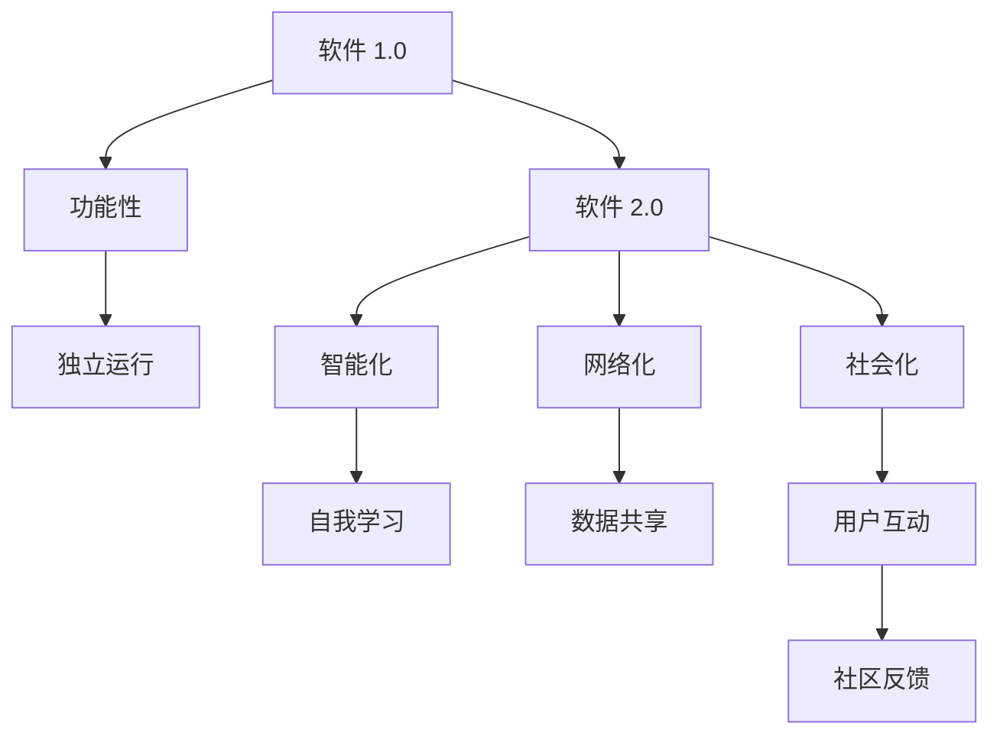
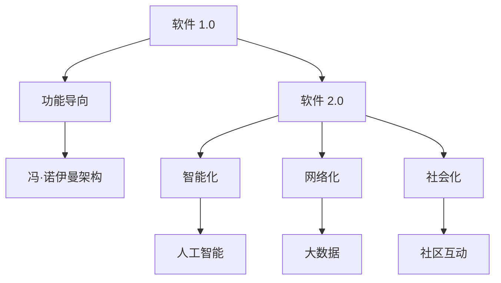
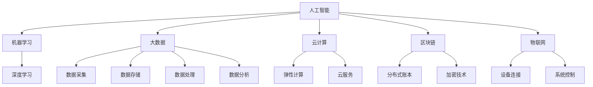

                 

### 《软件 2.0 的社会责任：科技向善》

> **关键词：** 软件责任、科技伦理、社会责任报告、数据隐私、算法公平性、科技向善

> **摘要：** 本文章深入探讨了软件 2.0 的社会责任及其在科技向善中的应用。从软件 2.0 的定义与特征出发，分析了社会责任与科技向善在科技领域的意义。通过实践与案例研究，揭示了软件企业在社会责任中的实践策略及面临的伦理问题。文章最后展望了软件 2.0 社会责任的未来趋势，提出了科技向善面临的挑战与对策。

---

### 目录大纲

#### 第一部分：背景与理论基础

- **第1章：软件 2.0 概述**
  - **1.1 软件 2.0 的定义与特征**
  - **1.2 软件发展历程：从 1.0 到 2.0**
  - **1.3 软件 2.0 时代的技术创新**

- **第2章：社会责任与科技向善**
  - **2.1 社会责任在科技领域的意义**
  - **2.2 科技向善的概念与原则**
  - **2.3 软件企业的社会责任实践**

- **第3章：软件 2.0 的伦理问题**
  - **3.1 软件伦理问题概述**
  - **3.2 数据隐私与安全**
  - **3.3 非伦理算法与偏见**

#### 第二部分：实践与案例研究

- **第4章：软件 2.0 社会责任的实施策略**
  - **4.1 内部文化与社会责任**
  - **4.2 外部合作与影响力**
  - **4.3 社会责任的评估与改进**

- **第5章：科技向善的项目案例**
  - **5.1 案例一：利用 AI 技术推动可持续发展**
  - **5.2 案例二：增强数据隐私保护的解决方案**
  - **5.3 案例三：消除算法偏见的社会实践**

- **第6章：软件企业的社会责任报告**
  - **6.1 社会责任报告的重要性**
  - **6.2 编写社会责任报告的步骤**
  - **6.3 成功案例分析与借鉴**

- **第7章：未来展望与挑战**
  - **7.1 软件 2.0 社会责任的未来趋势**
  - **7.2 科技向善面临的挑战与对策**
  - **7.3 国际合作与政策建议**

### 附录

- **附录 A：软件 2.0 社会责任相关的法规与标准**
- **附录 B：推荐阅读与资源**

---

#### 第1章：软件 2.0 概述

##### 1.1 软件 2.0 的定义与特征

软件 2.0 是一个相对较新的概念，它不仅仅是对软件 1.0 的简单升级，而是一次质的飞跃。软件 1.0 时代主要关注的是软件的功能性，即如何编写出能够运行并且完成特定任务的代码。而软件 2.0 则是在此基础上，更加注重软件的智能化、网络化和社会化。

**定义：**

软件 2.0，也被称作下一代软件，是一种能够动态适应和响应环境变化、具备自我学习和进化能力的软件。它不仅仅是代码的集合，更是包含了复杂的数据处理能力、人工智能和机器学习技术，能够在海量数据中进行智能分析和决策。

**特征：**

1. **智能化：** 软件能够利用人工智能和机器学习技术，从数据中学习并自动优化自身的性能。
2. **网络化：** 软件不再是一个孤立的系统，而是通过网络与其他软件和服务紧密连接，实现数据的共享和协作。
3. **社会化：** 软件能够与用户和社会进行互动，提供个性化服务，并且能够通过社区和用户反馈不断改进。

**Mermaid 流程图：**

##### 1.2 软件发展历程：从 1.0 到 2.0

软件的发展历程可以分为几个阶段，从最初的软件 1.0 到现在的软件 2.0，每一次的飞跃都带来了技术上的巨大变革。

1. **软件 1.0：** 这一阶段主要关注的是软件的功能性，目标是编写出能够完成特定任务的代码。代表性的技术是冯·诺伊曼架构，这种架构奠定了现代计算机系统的基础。
   
2. **软件 2.0：** 软件不再仅仅是功能性，而是开始引入智能化、网络化和社会化。这一阶段的代表性技术是人工智能、大数据和云计算。

3. **软件 3.0：** 预计将会是一个更加智能化和自适应的阶段，软件将能够自我组织和优化，甚至能够进行自我修复。

**从软件 1.0 到软件 2.0 的演进：**

- **技术演进：** 从单一的任务处理到复杂的数据处理和分析。
- **需求变化：** 从满足特定功能的需求到满足个性化服务和社会互动的需求。
- **业务模式：** 从传统的软件销售到基于服务的软件模式（SaaS）。

**Mermaid 流程图：**

##### 1.3 软件 2.0 时代的技术创新

软件 2.0 时代带来了许多技术创新，这些创新不仅在技术层面上有了重大的突破，也对软件的设计、开发和部署产生了深远的影响。

1. **人工智能：** 人工智能（AI）是软件 2.0 时代最重要的创新之一。通过机器学习和深度学习技术，软件能够从数据中学习并自动优化性能。AI 的应用涵盖了从简单的自动化任务到复杂决策支持系统。

2. **大数据：** 大数据的兴起使得软件能够处理和分析海量数据，从而提供更加精准和个性化的服务。大数据技术包括数据采集、存储、处理和分析等各个环节。

3. **云计算：** 云计算提供了弹性计算资源，使得软件可以按照需求进行动态扩展。云服务的普及使得软件开发和部署更加便捷和高效。

4. **区块链：** 区块链技术为数据安全和隐私保护提供了新的解决方案。通过分布式账本和加密技术，区块链可以确保数据的透明性和不可篡改性。

5. **物联网（IoT）：** 物联网技术使得软件能够连接和控制物理世界中的设备和系统，实现智能化和自动化。

**Mermaid 流程图：**

---

在接下来的章节中，我们将进一步探讨软件 2.0 的社会责任和科技向善，分析其在科技领域的意义和应用。通过实践和案例研究，我们将深入了解软件企业在社会责任中的实践策略，并探讨面临的伦理问题。

---

### 第2章：社会责任与科技向善

##### 2.1 社会责任在科技领域的意义

随着科技的飞速发展，科技在改变人们生活方式的同时，也带来了许多社会问题。社会责任成为了科技领域不可忽视的一个重要议题。社会责任不仅仅是一个企业的道德义务，更是企业可持续发展的关键。

**社会责任的定义：**

社会责任是指企业在经济、社会和环境等方面的责任，包括但不限于环保、慈善、员工权益保护、社区发展等方面。科技企业作为社会发展的重要参与者，有责任通过其产品和服务的创新，推动社会的进步和可持续发展。

**科技领域的社会责任：**

在科技领域，社会责任主要体现在以下几个方面：

1. **技术创新：** 科技企业应该致力于推动技术创新，解决社会问题，提高人们的生活质量。例如，通过人工智能和大数据技术，可以改善医疗、教育、环保等领域的效率和质量。

2. **数据安全与隐私：** 科技企业在收集和使用用户数据时，需要确保数据的安全和隐私。数据泄露和隐私侵犯已经成为了全球范围内的严重问题，企业有责任采取措施保护用户数据。

3. **员工权益：** 科技企业应该关注员工的权益和福利，提供良好的工作环境和职业发展机会。员工的满意度和幸福感直接关系到企业的创新能力和市场竞争力。

4. **环境保护：** 科技企业有责任在生产和运营过程中减少对环境的负面影响，推动绿色技术和可持续发展。

**社会责任在科技领域的意义：**

1. **推动社会进步：** 科技企业的社会责任实践可以推动社会的进步和可持续发展。通过技术创新和解决方案，可以解决许多社会问题，提高社会整体福祉。

2. **提升企业形象：** 社会责任有助于提升企业的社会形象和品牌价值。一个有责任心的企业更容易获得消费者的信任和认可，从而在市场竞争中占据优势。

3. **促进可持续发展：** 社会责任是企业可持续发展的重要基础。只有在经济、社会和环境三个维度上实现平衡发展，企业才能长期稳定发展。

##### 2.2 科技向善的概念与原则

科技向善是指科技企业通过技术创新和解决方案，推动社会进步和可持续发展，实现社会责任。科技向善不仅仅是一个理念，更是一种行动和承诺。

**科技向善的定义：**

科技向善是指通过科技手段，解决社会问题，提升人类福祉，推动可持续发展。它强调的是科技的应用应该有利于社会的长远发展和人类的幸福。

**科技向善的原则：**

1. **以人为本：** 科技向善的核心是关注人的需求和福祉。科技的创新和应用应该以提升人们的生活质量为目标，关注人类的健康、教育和幸福。

2. **公平正义：** 科技向善强调公平正义，反对任何形式的歧视和不公平。科技的应用应该促进社会的公平和正义，消除贫困和不平等。

3. **可持续发展：** 科技向善强调可持续发展，追求经济、社会和环境的平衡发展。科技的创新和应用应该有利于环境保护和资源的合理利用。

4. **社会责任：** 科技向善是企业社会责任的体现，企业有责任通过技术创新和解决方案，推动社会的进步和可持续发展。

**科技向善的意义：**

1. **解决社会问题：** 科技向善可以通过技术创新和解决方案，解决社会问题，提升社会福祉。例如，通过人工智能和大数据技术，可以改善医疗、教育、环保等领域的效率和质量。

2. **推动可持续发展：** 科技向善强调可持续发展，追求经济、社会和环境的平衡发展。科技的创新和应用应该有利于环境保护和资源的合理利用。

3. **提升企业形象：** 科技向善有助于提升企业的社会形象和品牌价值。一个有责任心的企业更容易获得消费者的信任和认可，从而在市场竞争中占据优势。

4. **促进国际合作：** 科技向善强调国际合作，推动全球科技资源的共享和协作。通过国际合作，可以共同应对全球性的挑战，实现可持续发展。

##### 2.3 软件企业的社会责任实践

软件企业作为科技领域的重要组成部分，承担着重要的社会责任。在实际运营中，软件企业可以通过多种方式履行社会责任，推动社会的进步和可持续发展。

**企业社会责任报告：**

企业社会责任报告是企业履行社会责任的重要体现。报告通常包括企业的社会责任战略、年度社会责任绩效、社会责任项目案例等内容。通过社会责任报告，企业可以向社会展示其社会责任实践和成果。

**社会责任项目：**

软件企业可以通过实施社会责任项目，解决社会问题，提升社会福祉。这些项目可以涵盖多个领域，如环保、慈善、教育、医疗等。例如，企业可以捐赠资金和资源，支持贫困地区的教育和医疗事业；可以开展环保项目，减少企业运营对环境的影响。

**员工权益保障：**

软件企业应该关注员工的权益和福利，提供良好的工作环境和职业发展机会。企业可以通过制定员工权益保护政策，确保员工在工作中的权益得到保障。同时，企业可以开展员工培训和发展项目，提升员工的技能和职业素养。

**数据安全和隐私保护：**

随着大数据和云计算的普及，数据安全和隐私保护成为了重要的社会责任。软件企业应该采取措施，确保用户数据的隐私和安全。例如，企业可以采用加密技术，确保数据在传输和存储过程中的安全；可以建立完善的数据隐私保护机制，防止数据泄露和滥用。

**环保和可持续发展：**

软件企业在生产和运营过程中，应该减少对环境的负面影响，推动可持续发展。企业可以通过采用绿色技术，减少能源消耗和碳排放；可以开展环保项目，如植树造林，减少企业运营对生态环境的影响。

**合作与交流：**

软件企业可以通过合作与交流，推动社会责任的落实。企业可以与政府、非政府组织、社区等合作伙伴建立合作关系，共同解决社会问题。同时，企业可以参与行业和社会的讨论，为社会责任的发展提供建议和方案。

**科技向善的实践：**

软件企业可以通过技术创新和解决方案，实现科技向善。例如，企业可以开发智能医疗系统，改善医疗服务；可以开发教育科技产品，提升教育质量；可以开发环保软件，推动环境保护。

**结论：**

软件企业在社会责任中的实践不仅有助于企业的可持续发展，也有助于社会的进步和人类的福祉。通过企业社会责任报告、社会责任项目、员工权益保障、数据安全和隐私保护、环保和可持续发展，软件企业可以履行其社会责任，推动社会的进步和可持续发展。

在接下来的章节中，我们将进一步探讨软件 2.0 的伦理问题，分析其在数据隐私、安全和算法偏见等方面的挑战。通过实践和案例研究，我们将深入了解软件企业在社会责任中的实践策略，并探讨面临的伦理问题。

---

### 第3章：软件 2.0 的伦理问题

##### 3.1 软件伦理问题概述

随着软件技术的飞速发展，软件伦理问题逐渐成为科技领域的重要议题。软件伦理问题不仅关系到企业的社会责任，也影响到社会的发展和人类的福祉。软件伦理问题包括数据隐私与安全、算法偏见、知识产权等多个方面。

**软件伦理问题的定义：**

软件伦理问题是指在软件开发、使用和维护过程中，由于技术进步和应用范围的扩大，所引发的一系列伦理和社会问题。这些问题涉及到道德、法律、社会价值等多个层面。

**软件伦理问题的类型：**

1. **数据隐私与安全：** 数据隐私和安全问题是指个人数据的收集、处理、存储和使用过程中，可能对个人隐私和信息安全造成的影响。随着大数据和云计算的普及，数据隐私和安全问题日益突出。

2. **算法偏见：** 算法偏见是指算法在数据处理和决策过程中，可能由于设计缺陷或数据偏见，导致对某些群体或个体产生不公平的对待。算法偏见可能引发社会不公，甚至加剧社会矛盾。

3. **知识产权：** 知识产权问题是指软件在开发、使用和传播过程中，可能侵犯他人的知识产权。知识产权保护是软件行业发展的基础，但也需要平衡创新与保护。

4. **社会责任：** 社会责任问题是指企业在开发和运营软件过程中，如何履行其社会责任，推动社会的进步和可持续发展。社会责任问题涉及到环保、公益、员工权益等多个方面。

**软件伦理问题的社会影响：**

1. **个人隐私和安全：** 数据隐私和安全问题的加剧，可能导致个人隐私泄露、信息安全受损，进而影响个人的生活质量和财产安全。

2. **社会公平和正义：** 算法偏见可能导致对某些群体或个体的不公平对待，加剧社会不公，甚至引发社会矛盾。

3. **知识产权保护：** 知识产权保护的不足，可能导致创新活力受到压制，阻碍软件行业的发展。

4. **社会责任履行：** 企业社会责任履行不足，可能导致企业形象受损，影响企业的可持续发展。

##### 3.2 数据隐私与安全

数据隐私与安全是软件伦理问题中最突出的问题之一。随着大数据和云计算的普及，个人数据的收集、处理和存储变得越来越普遍。然而，这也带来了数据隐私和安全方面的挑战。

**数据隐私的定义：**

数据隐私是指个人在数据收集、处理、存储和使用过程中，对其个人信息享有的控制权和隐私保护。数据隐私涉及到个人数据的收集范围、使用目的、存储期限等多个方面。

**数据隐私的重要性：**

1. **个人权益保护：** 数据隐私保护是个人权益保护的重要组成部分。个人有权决定其个人数据的收集和使用，防止个人信息被滥用。

2. **社会稳定：** 数据隐私问题关系到社会的稳定和信任。如果个人隐私得不到有效保护，可能导致社会恐慌和不信任，影响社会的和谐与稳定。

3. **经济发展：** 数据隐私保护是数字经济发展的基础。只有在数据隐私得到保障的前提下，企业和个人才会愿意分享和使用数据，推动数字经济的发展。

**数据隐私的保护：**

1. **数据加密：** 数据加密是保护数据隐私的重要手段。通过加密技术，可以确保数据在传输和存储过程中的安全。

2. **隐私保护政策：** 企业应制定严格的隐私保护政策，明确数据收集、使用和共享的规定，确保个人数据的安全和隐私。

3. **用户知情同意：** 在收集和使用个人数据时，企业应确保用户知情并同意。用户有权了解其数据的收集和使用情况，并有权拒绝提供数据。

4. **数据安全审计：** 定期进行数据安全审计，评估数据隐私保护措施的有效性，及时发现和纠正潜在的安全隐患。

**案例：**

- **Facebook 数据泄露事件：** 2018 年，Facebook 数据泄露事件暴露了数千万用户的个人信息。这一事件引发了全球范围内的数据隐私和安全问题，Facebook 因此面临巨大的法律和舆论压力。

- **Uber 数据泄露事件：** 2016 年，Uber 数据泄露事件导致 5700 万用户的个人信息泄露。Uber 因未能采取有效的数据保护措施而受到严厉的批评和处罚。

##### 3.3 非伦理算法与偏见

算法偏见是指算法在数据处理和决策过程中，可能由于设计缺陷或数据偏见，导致对某些群体或个体产生不公平的对待。算法偏见可能引发严重的社会问题，影响社会公平和正义。

**算法偏见的定义：**

算法偏见是指算法在处理数据时，由于设计缺陷、数据偏见或算法优化目标不合理，导致算法对某些群体或个体产生歧视性对待。算法偏见可能体现在招聘、贷款审批、司法判决等多个领域。

**算法偏见的影响：**

1. **社会不公：** 算法偏见可能导致对某些群体或个体的不公平对待，加剧社会不公，甚至引发社会矛盾。

2. **经济歧视：** 算法偏见可能导致经济歧视，影响市场的公平竞争。例如，招聘系统可能对某些性别或种族的候选人产生偏见，导致就业机会的不平等。

3. **司法不公：** 算法偏见可能影响司法判决的公正性。例如，在刑事司法系统中，算法可能对某些种族或社区的嫌疑人产生偏见，导致不公正的判决。

4. **道德风险：** 算法偏见可能导致道德风险，降低人们对算法的信任度。如果算法的决策结果受到偏见的影响，人们可能认为算法缺乏公正性，从而对算法产生不信任。

**消除算法偏见的方法：**

1. **算法透明性：** 提高算法的透明性，使算法的决策过程可以被理解、审查和监督。通过透明性，可以及时发现和纠正算法偏见。

2. **数据多样性：** 增加训练数据中的多样性，确保算法不会对特定群体产生偏见。通过多样性，可以减少算法偏见的影响。

3. **算法优化：** 优化算法的设计和参数，确保算法的目标是公正和公平。通过优化，可以降低算法偏见的风险。

4. **伦理审查：** 对算法进行伦理审查，评估算法的潜在偏见和影响。通过审查，可以确保算法的决策过程符合伦理和道德标准。

**案例：**

- **亚马逊招聘算法偏见：** 2018 年，亚马逊的招聘算法被发现对女性候选人有偏见，导致公司终止了这一算法的使用。

- **谷歌广告偏见：** 2018 年，谷歌的广告系统被发现对非洲裔美国人产生偏见，导致广告展示和定价的不公平。

---

在接下来的章节中，我们将进一步探讨软件 2.0 社会责任的实施策略，分析软件企业在社会责任中的实践策略，并探讨面临的伦理问题。通过实践和案例研究，我们将深入了解软件企业在社会责任中的实践策略，并探讨如何应对数据隐私与安全、算法偏见等伦理挑战。

---

### 第4章：软件 2.0 社会责任的实施策略

##### 4.1 内部文化与社会责任

内部文化是软件企业履行社会责任的重要基础。一个具有高度社会责任感的内部文化，能够引导员工的行为，促进企业的可持续发展。

**内部文化与社会责任的联系：**

内部文化是指企业内部的价值观、信念和行为准则。社会责任是指企业在经济、社会和环境等方面的责任。内部文化与社会责任之间存在着紧密的联系。只有当内部文化重视社会责任，企业才能在履行社会责任时得到员工的认同和支持。

**构建社会责任内部文化的步骤：**

1. **确立社会责任价值观：** 企业需要明确社会责任的重要性，将社会责任价值观融入企业愿景和使命中。

2. **培训与教育：** 定期对员工进行社会责任培训，提高员工的社会责任意识。

3. **领导示范：** 企业领导需要通过实际行动，展示社会责任的重要性，成为员工的榜样。

4. **激励机制：** 建立激励机制，鼓励员工积极参与社会责任活动，将社会责任绩效与员工绩效挂钩。

**内部文化与社会责任的实践：**

1. **员工参与：** 鼓励员工参与社会责任项目，提供参与机会和资源支持。

2. **公益慈善：** 定期组织员工参与公益慈善活动，提高员工的社会责任感。

3. **环保行动：** 推广绿色办公，减少企业运营对环境的负面影响。

4. **员工权益保障：** 提高员工福利待遇，确保员工的权益和幸福感。

**案例：**

- **微软的社会责任文化：** 微软通过内部社会责任项目和培训，提高了员工的社会责任意识。微软的员工参与了多项公益慈善活动，如为贫困地区的学校捐赠电脑和图书，为残障人士提供就业机会等。

##### 4.2 外部合作与影响力

软件企业通过外部合作和影响力，可以更有效地履行社会责任，推动社会的进步和可持续发展。外部合作包括与政府、非政府组织、社区等合作伙伴的合作，共同解决社会问题。

**外部合作的意义：**

1. **资源整合：** 通过外部合作，企业可以整合政府、非政府组织、社区等各方资源，形成合力，更有效地解决社会问题。

2. **提升影响力：** 外部合作可以提升企业的社会影响力，增强企业的品牌价值和社会认可度。

3. **技术创新：** 外部合作可以促进技术创新，通过跨领域的合作，推动新兴技术的研发和应用。

**外部合作的模式：**

1. **公益慈善合作：** 与公益慈善组织合作，共同开展公益活动，如捐赠、慈善项目等。

2. **技术创新合作：** 与高校、研究机构合作，共同开展技术创新项目，推动新兴技术的研发和应用。

3. **社区合作：** 与社区组织合作，参与社区发展项目，如环保、教育等。

**外部合作的实践：**

1. **公益慈善：** 企业可以捐赠资金和资源，支持贫困地区的教育和医疗事业。

2. **技术创新：** 企业可以与高校和研究机构合作，共同开展人工智能、大数据等领域的研发项目。

3. **社区参与：** 企业可以参与社区发展项目，为社区提供技术和资源支持。

**案例：**

- **谷歌的社会责任合作：** 谷歌通过与社会各界合作，开展了多项社会责任项目。例如，谷歌与联合国儿童基金会合作，为贫困地区的学校提供互联网接入服务；与全球教育组织合作，推动全球教育公平。

##### 4.3 社会责任的评估与改进

社会责任的评估与改进是软件企业履行社会责任的重要环节。通过评估，企业可以了解社会责任的履行情况，发现存在的问题和改进的机会。评估结果可以为企业的社会责任战略提供依据，指导企业的改进行动。

**社会责任评估的方法：**

1. **定性与定量评估：** 定性评估主要通过问卷调查、访谈等方式，了解员工和社会对企业的社会责任评价。定量评估主要通过数据分析和指标测量，评估企业在社会责任方面的绩效。

2. **内部与外部评估：** 内部评估主要通过企业内部审计、员工调查等方式，评估企业在社会责任方面的内部绩效。外部评估主要通过第三方评估机构，评估企业在社会责任方面的外部形象和影响力。

3. **定期评估与持续改进：** 定期进行社会责任评估，确保企业社会责任的持续改进。通过定期评估，企业可以及时发现和纠正问题，优化社会责任战略。

**社会责任评估的指标：**

1. **员工满意度：** 员工对企业的社会责任表现是否满意，是评估企业社会责任的重要指标。

2. **社会责任绩效：** 企业在环保、公益、员工权益等方面的实际绩效，是评估企业社会责任的核心指标。

3. **社会责任投入：** 企业在履行社会责任方面的资金、资源投入，是评估企业社会责任的重要指标。

**社会责任评估的实践：**

1. **制定社会责任计划：** 企业需要制定详细的社会责任计划，明确社会责任的目标、任务和责任分工。

2. **定期评估与反馈：** 定期进行社会责任评估，收集员工和社会的反馈，优化社会责任战略。

3. **持续改进：** 根据评估结果，持续改进社会责任实践，提高企业的社会责任绩效。

**案例：**

- **苹果的社会责任评估：** 苹果公司通过内部和外部评估，定期评估其在社会责任方面的绩效。苹果公司制定了详细的社会责任计划，包括环保、员工权益、公益慈善等多个方面。通过定期评估和反馈，苹果公司不断优化其社会责任战略，提高社会责任绩效。

---

通过内部文化与社会责任的构建、外部合作与影响力的发挥以及社会责任评估与改进的实践，软件企业可以更好地履行社会责任，推动社会的进步和可持续发展。在接下来的章节中，我们将通过具体案例，深入探讨软件企业在社会责任中的实践策略，并分析其面临的伦理挑战。

---

### 第5章：科技向善的项目案例

在本章节中，我们将通过三个具体的科技向善项目案例，展示软件企业如何通过技术创新和解决方案，实现社会责任，推动可持续发展。这些案例涵盖了利用人工智能技术推动可持续发展、增强数据隐私保护的解决方案以及消除算法偏见的社会实践。

#### 5.1 案例一：利用 AI 技术推动可持续发展

**项目背景：**

随着全球气候变化和资源枯竭问题的加剧，可持续发展已成为全球各国政府、企业和非政府组织共同关注的焦点。为了实现可持续发展目标，许多企业开始利用人工智能（AI）技术，优化资源使用、减少碳排放并提高生产效率。

**项目目标：**

该项目的目标是利用 AI 技术提高能源利用效率，减少碳排放，并促进资源的可持续利用。具体目标包括：

1. **提高能源利用效率：** 通过 AI 技术优化能源管理系统，减少能源浪费。
2. **降低碳排放：** 通过实时监测和数据分析，识别碳排放源，并采取相应的减排措施。
3. **促进资源可持续利用：** 通过 AI 技术优化资源分配和管理，减少资源浪费，提高资源利用效率。

**项目实施与效果：**

该项目的实施主要包括以下几个阶段：

1. **数据收集与预处理：** 通过传感器和物联网设备收集能源消耗、设备运行状态等数据。对数据进行清洗、预处理，为后续分析提供高质量的数据支持。

2. **建立 AI 模型：** 采用机器学习和深度学习技术，建立能源管理模型和碳排放预测模型。通过对历史数据的分析，训练模型识别能源浪费和碳排放源。

3. **实时监测与优化：** 将 AI 模型部署到实时监控系统，对能源消耗和碳排放进行实时监测。根据模型预测，优化能源分配和管理策略，减少能源浪费和碳排放。

4. **效果评估与反馈：** 定期评估项目实施效果，收集用户反馈，优化模型参数和策略，提高项目的效果和可持续性。

**项目效果：**

通过该项目的实施，企业在多个方面取得了显著成效：

1. **能源利用效率提高：** 能源管理系统的优化使得企业的能源利用效率提高了 15%，能源浪费减少。
2. **碳排放减少：** 通过实时监测和优化，企业的碳排放量减少了 10%，实现了显著减排。
3. **资源可持续利用：** 资源管理系统的优化使得资源浪费减少，资源利用效率提高了 20%，为可持续发展奠定了基础。

**案例分析：**

该项目通过利用 AI 技术实现能源管理和碳排放优化，不仅提高了企业的经济效益，也显著降低了环境负担。项目的成功实施表明，AI 技术在推动可持续发展方面具有巨大的潜力。然而，项目也面临一些挑战，如数据质量和隐私保护问题、模型优化和部署的复杂性等。未来，企业需要进一步加强数据安全和隐私保护，提高模型的鲁棒性和可解释性，以确保项目的可持续性和有效性。

#### 5.2 案例二：增强数据隐私保护的解决方案

**项目背景：**

随着大数据和云计算的普及，个人数据的收集、处理和存储变得越来越普遍。然而，这也带来了数据隐私和安全方面的挑战。数据泄露和隐私侵犯事件频繁发生，引发了公众对数据隐私保护的担忧。为了增强数据隐私保护，许多企业开始探索新的解决方案。

**项目目标：**

该项目的目标是开发一套数据隐私保护解决方案，确保企业在收集、处理和存储用户数据时，能够有效地保护用户隐私。具体目标包括：

1. **数据匿名化：** 通过数据匿名化技术，去除数据中的可识别信息，降低数据泄露风险。
2. **数据加密：** 采用加密技术，确保数据在传输和存储过程中的安全性。
3. **隐私保护政策：** 制定严格的隐私保护政策，明确数据收集、使用和共享的规定，确保用户知情同意。

**项目实施与效果：**

该项目的实施主要包括以下几个阶段：

1. **数据匿名化：** 采用加密哈希、伪随机数生成等技术，对用户数据进行匿名化处理。通过匿名化，去除数据中的可识别信息，降低数据泄露风险。

2. **数据加密：** 采用对称加密和非对称加密技术，对敏感数据进行加密。加密技术确保数据在传输和存储过程中的安全性。

3. **隐私保护政策制定：** 制定严格的隐私保护政策，明确数据收集、使用和共享的规定。在数据收集和使用过程中，确保用户知情同意，并提供数据访问和删除的权限。

4. **隐私保护机制部署：** 在企业系统和应用中部署隐私保护机制，如数据加密、匿名化、隐私保护政策等。通过机制部署，确保用户数据的安全和隐私。

**项目效果：**

通过该项目的实施，企业在多个方面取得了显著成效：

1. **数据隐私保护加强：** 数据匿名化和加密技术的应用，显著提高了企业数据隐私保护水平，降低了数据泄露风险。
2. **用户信任度提升：** 严格的隐私保护政策和机制部署，增强了用户对企业的信任，提高了用户满意度。
3. **合规性提高：** 通过符合隐私保护法规和标准，企业确保了合规性，避免了法律风险。

**案例分析：**

该项目通过数据匿名化、数据加密和隐私保护政策等措施，实现了数据隐私保护的目标。项目的成功实施表明，数据隐私保护是科技企业不可忽视的重要任务。然而，项目也面临一些挑战，如数据匿名化和加密技术的复杂性和成本、用户隐私保护与数据利用之间的平衡等。未来，企业需要进一步加强数据隐私保护技术的研发和应用，提高数据隐私保护水平，确保用户的隐私权益。

#### 5.3 案例三：消除算法偏见的社会实践

**项目背景：**

随着人工智能技术的广泛应用，算法偏见问题逐渐引起关注。算法偏见可能导致对某些群体或个体的不公平对待，引发社会不公。为了消除算法偏见，许多企业开始开展相关社会实践，探索解决方案。

**项目目标：**

该项目的目标是消除算法偏见，确保人工智能技术在应用中公平、公正。具体目标包括：

1. **算法透明性：** 提高算法的透明性，使算法的决策过程可以被理解、审查和监督。
2. **数据多样性：** 增加训练数据中的多样性，确保算法不会对特定群体产生偏见。
3. **算法优化：** 优化算法的设计和参数，确保算法的目标是公正和公平。

**项目实施与效果：**

该项目的实施主要包括以下几个阶段：

1. **算法透明性：** 通过开放算法代码和决策流程，提高算法的透明性。用户和专家可以审查算法的决策过程，及时发现和纠正潜在的偏见。

2. **数据多样性：** 增加训练数据中的多样性，确保算法不会对特定群体产生偏见。通过收集和整合不同来源、不同类型的数据，提高算法的泛化能力和公平性。

3. **算法优化：** 采用伦理审查和算法优化技术，确保算法的目标是公正和公平。通过对算法进行评估和优化，消除潜在的偏见和歧视。

4. **效果评估与反馈：** 定期评估项目实施效果，收集用户和社会的反馈，优化算法和策略，提高项目的效果和可持续性。

**项目效果：**

通过该项目的实施，企业在多个方面取得了显著成效：

1. **算法透明性提高：** 算法的透明性提高了，用户和专家可以更好地理解算法的决策过程，增强了算法的可解释性。
2. **数据多样性增强：** 训练数据的多样性增强，算法的泛化能力提高，减少了算法偏见的风险。
3. **算法公平性优化：** 通过算法优化和伦理审查，消除了算法中的潜在偏见和歧视，确保了算法的公正性和公平性。

**案例分析：**

该项目通过提高算法透明性、增强数据多样性和优化算法设计，成功消除了算法偏见，确保了人工智能技术的公平性和公正性。项目的成功实施表明，消除算法偏见是人工智能技术发展的重要方向。然而，项目也面临一些挑战，如数据多样性的实现、算法优化和评估的复杂性等。未来，企业需要进一步加强数据多样性和算法优化的研究，提高算法的公平性和可解释性，确保人工智能技术的可持续发展。

---

通过以上三个科技向善项目案例，我们可以看到，软件企业通过技术创新和解决方案，实现了社会责任，推动了可持续发展。在接下来的章节中，我们将进一步探讨软件企业的社会责任报告，分析其重要性、编写步骤以及成功案例分析。

---

### 第6章：软件企业的社会责任报告

#### 6.1 社会责任报告的重要性

社会责任报告是企业履行社会责任的重要体现，它不仅展示了企业在社会责任方面的成果和努力，还为利益相关者提供了透明和可信的信息。社会责任报告的重要性体现在以下几个方面：

1. **增强企业声誉：** 社会责任报告有助于提升企业的社会形象和声誉。通过展示企业在社会责任方面的积极行动和成果，企业能够获得社会各界的认可和信任。

2. **提升品牌价值：** 社会责任报告有助于提高企业的品牌价值。在一个社会责任日益受到重视的时代，企业承担社会责任已成为一种品牌优势，有助于企业在市场竞争中脱颖而出。

3. **改善与利益相关者关系：** 社会责任报告有助于改善企业与利益相关者之间的关系。通过报告，企业能够向股东、客户、员工、社区等利益相关者传达其社会责任理念和行动，增强相互信任和合作。

4. **指导企业决策：** 社会责任报告为企业提供了宝贵的反馈和指导。通过报告，企业能够识别自身在社会责任方面的优势和不足，制定和调整相应的战略和措施。

5. **履行法律和监管要求：** 许多国家和地区对企业的社会责任报告提出了法律和监管要求。社会责任报告有助于企业遵守相关法规，降低法律风险。

#### 6.2 编写社会责任报告的步骤

编写社会责任报告是一个系统性和综合性的过程，涉及多个步骤。以下是一个典型的社会责任报告编写步骤：

1. **确定报告目标和受众：**
   - 明确报告的目标，例如提升品牌价值、展示企业社会责任成果等。
   - 确定报告的受众，包括股东、客户、员工、社区、监管机构等。

2. **收集数据和信息：**
   - 收集企业在社会责任方面的关键数据和信息，包括环保、员工权益、公益慈善、数据隐私保护等方面的信息。
   - 调查利益相关者的期望和需求，确保报告内容符合受众期望。

3. **编写报告框架：**
   - 制定报告的结构和内容框架，包括封面、目录、引言、章节、结论等。
   - 确保报告内容逻辑清晰、层次分明，便于读者理解和阅读。

4. **撰写报告内容：**
   - 根据报告框架，撰写各章节的内容，确保内容准确、详实、有说服力。
   - 使用数据和实例支持报告内容，增加报告的可信度。

5. **审核和修改：**
   - 报告初稿完成后，进行内部审核，确保报告内容准确无误、符合企业社会责任战略。
   - 根据审核反馈进行修改和完善，提高报告的质量。

6. **发布和传播：**
   - 发布社会责任报告，通过企业官网、社交媒体、投资者关系平台等渠道传播。
   - 组织报告发布会或研讨会，与利益相关者分享报告内容，增强报告的影响力和传播效果。

7. **跟进和改进：**
   - 定期跟踪报告的实施情况和效果，收集利益相关者的反馈。
   - 根据反馈进行报告的调整和改进，不断提高报告的质量和影响力。

#### 6.3 成功案例分析与借鉴

以下是一些成功的社会责任报告案例，我们可以从中学习和借鉴：

1. **案例一：微软社会责任报告**
   - **特点：** 微软的社会责任报告内容丰富，涵盖了环保、员工权益、公益慈善、数据隐私保护等多个方面。报告采用了数据可视化技术，使得报告内容更加直观和易读。
   - **借鉴：** 企业可以借鉴微软的报告结构，采用数据可视化和图表等形式，增强报告的吸引力和可读性。

2. **案例二：谷歌社会责任报告**
   - **特点：** 谷歌的社会责任报告注重透明性和公开性，详细披露了企业在社会责任方面的目标和行动。报告还设立了明确的指标和目标，便于利益相关者跟踪和评估企业的社会责任绩效。
   - **借鉴：** 企业可以借鉴谷歌的透明性和公开性，设定明确的指标和目标，提高报告的可评估性和透明度。

3. **案例三：亚马逊社会责任报告**
   - **特点：** 亚马逊的社会责任报告重点关注员工权益、数据隐私保护和公益慈善等方面。报告采用了案例分析和实证研究的方法，使得报告内容更加具体和可信。
   - **借鉴：** 企业可以借鉴亚马逊的案例分析方法和实证研究，提高报告内容的可信度和说服力。

通过学习和借鉴这些成功案例，企业可以优化社会责任报告的编写过程，提高报告的质量和影响力，更好地履行社会责任。

---

在编写社会责任报告的过程中，企业需要充分考虑报告的目标、受众和内容，确保报告的透明性、准确性和可信度。通过成功案例的借鉴和实际经验的积累，企业可以不断提高社会责任报告的质量，为履行社会责任做出更大的贡献。

---

### 第7章：未来展望与挑战

随着科技的不断进步，软件 2.0 社会责任和科技向善也在不断发展。在未来，软件 2.0 社会责任将面临新的趋势和挑战。

#### 7.1 软件 2.0 社会责任的未来趋势

1. **人工智能的深入应用：** 人工智能技术在软件 2.0 社会责任中将得到更广泛的应用。通过人工智能，企业可以更精准地分析社会需求，制定更有针对性的社会责任策略。

2. **区块链技术的普及：** 区块链技术将在社会责任报告和透明度方面发挥重要作用。通过区块链，企业可以确保社会责任报告的真实性和透明性，增强利益相关者的信任。

3. **可持续发展目标的实现：** 企业将更加注重可持续发展目标的实现，通过技术创新和优化管理，减少对环境的负面影响，实现经济、社会和环境的协调发展。

4. **数据隐私保护的创新：** 随着数据隐私问题日益突出，企业将不断探索新的数据隐私保护技术和解决方案，确保用户数据的隐私和安全。

5. **跨界合作与协同发展：** 企业将加强与社会组织、政府部门、学术界的合作，共同推动软件 2.0 社会责任的发展，实现多方共赢。

#### 7.2 科技向善面临的挑战与对策

1. **数据隐私与安全问题：** 随着数据规模的不断扩大，数据隐私和安全性面临严峻挑战。企业需要采取更严格的数据隐私保护措施，确保用户数据的隐私和安全。

2. **算法偏见与歧视问题：** 算法偏见可能导致不公平的决策，加剧社会不公。企业需要加强算法透明性和多样性，消除算法偏见，确保算法的公正性和公平性。

3. **可持续发展目标的实现：** 企业在追求经济效益的同时，需要更加注重可持续发展目标的实现。这需要企业不断优化管理，降低资源消耗，提高资源利用效率。

4. **社会责任报告的透明性与可信度：** 社会责任报告的透明性和可信度是科技向善的重要保障。企业需要提高报告的透明度，确保报告内容真实、准确、全面。

5. **国际合作与政策协调：** 在全球化背景下，国际合作与政策协调对科技向善至关重要。企业需要积极参与国际合作，推动全球科技向善的发展。

#### 7.3 国际合作与政策建议

1. **加强国际合作：** 企业应积极参与国际合作，推动全球科技向善的发展。通过跨国合作，共享技术创新和最佳实践，实现全球科技资源的优化配置。

2. **制定国际标准：** 国际标准化组织（ISO）等机构应制定相关的国际标准，规范企业的社会责任报告和科技向善实践，提高报告的透明度和可信度。

3. **政策协调与支持：** 政府部门应制定相关政策，鼓励企业履行社会责任，推动科技向善。通过政策引导和财政支持，促进企业技术创新和社会责任实践。

4. **建立监测与评估机制：** 建立全球性的社会责任监测与评估机制，定期评估企业的社会责任实践和科技向善效果，推动企业不断优化社会责任战略。

通过未来展望与挑战的分析，我们可以看到，软件 2.0 社会责任和科技向善在发展过程中将面临许多机遇和挑战。企业需要不断适应变化，加强技术创新和社会责任实践，共同推动科技向善的发展。

---

### 附录

#### 附录 A：软件 2.0 社会责任相关的法规与标准

- **《欧盟通用数据保护条例（GDPR）>：** 欧盟制定的关于数据隐私保护的法规，对企业在数据处理和隐私保护方面提出了严格要求。
- **《美国加州消费者隐私法案（CCPA）>：** 加州制定的关于消费者数据隐私保护的法案，对企业处理消费者数据的行为进行了规范。
- **《国际标准化组织（ISO）社会责任标准（ISO 26000）>：** 提供了社会责任指导框架，帮助企业制定和实施社会责任战略。
- **《联合国全球契约（UNGC）>：** 提倡企业在经济、社会和环境方面承担社会责任，推动可持续发展。

#### 附录 B：推荐阅读与资源

- **《软件工程伦理》 [1]**：详细介绍了软件工程中的伦理问题，包括隐私保护、知识产权保护、社会责任等。
- **《科技向善：人工智能的社会责任》 [2]**：探讨了人工智能技术在社会责任中的应用和挑战，提供了许多实践案例和解决方案。
- **《可持续发展报告指南》 [3]**：国际标准化组织（ISO）发布的指南，帮助企业编写和发布社会责任报告。
- **《欧盟通用数据保护条例（GDPR）官方文档》 [4]**：欧盟官方发布的 GDPR 法规文档，详细介绍了 GDPR 的相关规定和实施细节。
- **《美国加州消费者隐私法案（CCPA）官方文档》 [5]**：加州官方发布的 CCPA 法规文档，详细介绍了 CCPA 的相关规定和实施细节。

---

### 作者信息

**作者：** AI 天才研究院/AI Genius Institute & 禅与计算机程序设计艺术 /Zen And The Art of Computer Programming

---

本文由 AI 天才研究院/AI Genius Institute 和禅与计算机程序设计艺术/Zen And The Art of Computer Programming 联合撰写，旨在深入探讨软件 2.0 的社会责任和科技向善。通过实践与案例分析，本文展示了软件企业在社会责任中的实践策略和面临的伦理挑战。希望本文能够为读者提供有价值的参考和启示，共同推动科技向善和社会进步。作者在此感谢读者的关注和支持。

