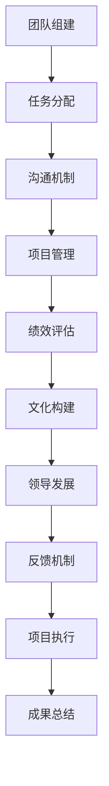

                 

# 《远程团队管理：数字时代的领导挑战》

## 关键词

- 远程团队管理
- 数字时代
- 领导挑战
- 沟通协作
- 项目管理
- 激励机制
- 文化建设

## 摘要

在数字化时代，远程团队管理成为企业运营的关键环节。本文旨在深入探讨远程团队管理所面临的挑战，分析其核心问题，并探讨相应的解决策略。文章分为十个章节，首先介绍远程团队的现状和挑战，然后详细讨论远程团队管理的基础、领导力发展、协作与沟通、管理与激励、项目管理、文化建设等方面。通过案例分析，本文总结出成功的远程团队管理实践，并对未来发展趋势进行展望。本文的目标是为从事远程团队管理的技术人员和领导者提供一套系统性的指导，以应对数字时代下的领导挑战。

## 《远程团队管理：数字时代的领导挑战》目录大纲

### 第1章 引言：远程团队管理的现状与挑战

#### 1.1 远程工作的兴起

- **远程工作的历史背景**：回顾远程工作的发展历程，了解其兴起的原因和背景。
- **远程工作的现状**：分析当前远程工作的普及程度，以及其对企业运营模式的影响。

#### 1.2 数字时代下的领导挑战

- **数字时代的特点**：探讨数字时代对企业领导带来的新变化。
- **远程团队管理的挑战**：分析远程团队管理所面临的特殊挑战，如沟通障碍、文化冲突、项目管理等。

#### 1.3 本书的目的与结构

- **目的**：阐述本书旨在解决的问题和目标。
- **结构**：介绍本书的章节设置和内容安排。

### 第2章 远程团队管理的基础

#### 2.1 远程团队的组成与特点

- **团队的组成**：讨论远程团队的成员结构、职责分工等。
- **团队的特点**：分析远程团队与传统团队的区别和特点。

#### 2.2 远程团队的领导模式

- **领导模式的选择**：探讨适合远程团队的领导模式。
- **领导者的角色**：分析远程团队领导者的角色和职责。

#### 2.3 远程团队的沟通策略

- **沟通的重要性**：讨论沟通在远程团队管理中的作用。
- **沟通策略**：介绍有效的远程团队沟通策略和方法。

#### 2.4 远程团队的工作流程管理

- **工作流程的设计**：分析远程团队工作流程的设计原则。
- **流程管理的实践**：介绍远程团队工作流程管理的具体实践。

### 第3章 远程团队的领导力发展

#### 3.1 领导者的角色与职责

- **领导者的角色**：讨论远程团队领导者所需具备的素质和角色。
- **领导者的职责**：分析远程团队领导者的职责和任务。

#### 3.2 领导力提升的策略

- **个人成长**：探讨领导者如何提升个人领导力。
- **团队建设**：分析领导者如何推动团队发展。

#### 3.3 远程团队中的领导关系

- **领导关系的特点**：讨论远程团队中的领导关系特点。
- **领导关系的构建**：介绍如何建立和维护远程团队中的领导关系。

### 第4章 远程团队的协作与沟通

#### 4.1 沟通工具与平台

- **沟通工具的选择**：分析不同沟通工具的优缺点。
- **平台的使用**：介绍常用的远程协作平台及其功能。

#### 4.2 沟通障碍与解决方法

- **沟通障碍的类型**：讨论远程团队沟通中可能遇到的障碍。
- **解决方法**：提供解决沟通障碍的策略和方法。

#### 4.3 远程团队的有效协作

- **协作的重要性**：讨论协作在远程团队中的作用。
- **协作实践的策略**：介绍如何实现远程团队的有效协作。

### 第5章 远程团队的管理与激励

#### 5.1 管理框架与策略

- **管理框架的构建**：分析远程团队管理的基本框架。
- **管理策略的实施**：介绍实施远程团队管理策略的方法。

#### 5.2 激励机制的设计

- **激励机制的作用**：探讨激励机制在远程团队管理中的作用。
- **激励机制的设计**：介绍设计激励机制的原则和方法。

#### 5.3 绩效评估与反馈

- **绩效评估的方法**：讨论远程团队绩效评估的方法。
- **反馈机制的构建**：介绍如何建立有效的反馈机制。

### 第6章 远程团队的项目管理

#### 6.1 项目计划与进度管理

- **项目计划的重要性**：讨论项目计划在远程项目管理中的重要性。
- **进度管理的策略**：介绍远程团队项目进度管理的策略。

#### 6.2 风险管理策略

- **风险管理的重要性**：探讨风险管理在远程项目管理中的作用。
- **风险管理的实践**：介绍远程团队风险管理的具体实践。

#### 6.3 项目报告与监控

- **项目报告的内容**：讨论远程团队项目报告的主要内容。
- **项目监控的方法**：介绍远程团队项目监控的方法。

### 第7章 远程团队的文化建设

#### 7.1 团队文化的构建

- **团队文化的概念**：讨论团队文化的概念和重要性。
- **团队文化的构建**：介绍如何构建远程团队的文化。

#### 7.2 跨文化沟通与冲突解决

- **跨文化沟通的挑战**：讨论跨文化沟通中的问题和挑战。
- **冲突解决的策略**：介绍如何解决远程团队中的跨文化冲突。

#### 7.3 远程团队的精神文化建设

- **精神文化建设的重要性**：探讨精神文化建设在远程团队中的作用。
- **精神文化建设的实践**：介绍如何进行远程团队的精神文化建设。

### 第8章 案例分析：成功的远程团队管理实践

#### 8.1 案例一：远程团队的组建与管理

- **案例背景**：介绍案例的背景和目的。
- **管理实践**：分析案例中远程团队的组建和管理实践。

#### 8.2 案例二：跨文化远程团队的领导挑战

- **案例背景**：介绍案例的背景和目的。
- **领导挑战**：分析案例中远程团队领导所面临的跨文化挑战。

#### 8.3 案例三：远程团队的项目执行与成果

- **案例背景**：介绍案例的背景和目的。
- **项目执行**：分析案例中远程团队的项目执行过程。
- **成果总结**：总结案例中远程团队的成果和经验。

### 第9章 未来展望：远程团队管理的趋势与挑战

#### 9.1 远程工作的未来发展

- **远程工作的趋势**：探讨远程工作在未来可能的发展趋势。
- **远程工作的挑战**：分析远程工作在未来可能面临的挑战。

#### 9.2 远程团队管理的创新与变革

- **创新的必要性**：讨论远程团队管理创新的必要性。
- **变革的策略**：介绍如何推动远程团队管理的变革。

#### 9.3 未来远程团队管理的挑战与应对策略

- **挑战的类型**：分析未来远程团队管理可能面临的挑战。
- **应对策略**：提供应对未来远程团队管理挑战的策略。

### 第10章 附录

#### 10.1 参考文献

- **参考文献**：列出本文引用的主要参考文献。

#### 10.2 相关资源与工具

- **资源与工具**：介绍与远程团队管理相关的资源与工具。

#### 10.3 进一步阅读推荐

- **推荐阅读**：推荐与远程团队管理相关的进一步阅读材料。

### 附加材料

#### 10.4 远程团队管理架构的Mermaid流程图

- **流程图**：提供远程团队管理架构的Mermaid流程图。

#### 10.5 远程团队关键算法原理的伪代码

- **伪代码**：提供远程团队管理中关键算法原理的伪代码。

#### 10.6 远程团队管理中的数学模型与公式解析

- **数学模型**：介绍远程团队管理中的数学模型和公式。

#### 10.7 远程团队管理实战案例代码与分析

- **代码与分析**：提供远程团队管理实战案例的代码与分析。

---

## 引言：远程团队管理的现状与挑战

### 1.1 远程工作的兴起

远程工作（Remote Work）作为一种工作模式，已经经历了数十年的发展。从最初的自由职业者在家中工作，到现代企业大规模的远程团队运作，远程工作逐渐成为企业运营的重要组成部分。其兴起的原因主要有以下几点：

1. **技术进步**：互联网和通信技术的飞速发展，使得远程工作成为可能。从电子邮件、即时通讯工具到视频会议系统，技术的进步为远程工作提供了便利。
   
2. **灵活性的需求**：现代员工对于工作与生活平衡的需求日益增长，远程工作提供了更灵活的工作时间和地点，提高了员工的工作满意度。

3. **全球化趋势**：企业为了拓展市场，需要在全球范围内招聘人才。远程工作使得企业能够跨越地域限制，灵活地组织团队。

4. **疫情的影响**：2020年开始的新冠疫情使得远程工作成为许多企业应对突发事件的必要手段。疫情使得远程工作从一种可选择的工作方式，转变为一种生存方式。

远程工作的普及，不仅改变了员工的工作方式，也对企业运营模式产生了深远影响。首先，远程工作提高了企业的运营效率，减少了通勤时间，降低了办公成本。其次，远程工作促进了企业文化的多样性和包容性，企业能够吸引全球范围内的优秀人才。此外，远程工作也带来了新的挑战，如沟通障碍、文化冲突、项目管理等，这些都需要企业进行深入的管理和创新。

### 1.2 数字时代下的领导挑战

数字时代（Digital Age）的到来，给企业领导带来了新的挑战。数字时代的特点主要体现在以下几个方面：

1. **信息过载**：在数字时代，信息量呈指数级增长，领导者需要有效地筛选和利用信息，以做出明智的决策。

2. **技术变革**：技术的快速迭代，要求领导者具备前瞻性，能够及时把握技术趋势，并将其应用于企业运营。

3. **全球化**：数字时代的企业往往需要面对全球市场，领导者需要具备跨文化的沟通能力和管理能力。

4. **数据驱动**：在数字时代，数据成为决策的重要依据，领导者需要具备数据分析的能力，以数据为支撑做出决策。

在远程团队管理中，领导者面临以下具体挑战：

1. **沟通障碍**：远程工作使得团队成员之间的沟通变得更加困难，如何有效地进行沟通成为领导者需要解决的重要问题。

2. **文化冲突**：远程团队往往由来自不同文化背景的成员组成，领导者需要处理文化差异，避免文化冲突。

3. **项目管理**：远程团队的项目管理变得更加复杂，领导者需要确保项目按时完成，同时保证质量。

4. **团队激励**：远程工作环境下，如何激发团队成员的积极性和创造力，成为领导者的重要任务。

### 1.3 本书的目的与结构

本书旨在为从事远程团队管理的技术人员和领导者提供一套系统性的指导，以应对数字时代下的领导挑战。具体目标包括：

1. **理解远程团队的特性**：通过分析远程团队的组成与特点，帮助读者深入了解远程团队的工作模式和运作机制。

2. **提升领导力**：探讨远程团队领导者的角色与职责，提供提升领导力的策略和方法。

3. **优化沟通与协作**：介绍远程团队沟通协作的策略和工具，解决远程团队中的沟通障碍。

4. **完善管理与激励机制**：分析远程团队管理框架与策略，设计有效的激励机制。

5. **实现项目成功**：讨论远程团队项目管理的具体实践，确保项目按时完成、质量达标。

本书的结构安排如下：

- **第1章 引言**：介绍远程工作的兴起和数字时代下的领导挑战。
- **第2章 远程团队管理的基础**：探讨远程团队的组成、领导模式、沟通策略和工作流程管理。
- **第3章 远程团队的领导力发展**：分析领导者的角色与职责，提升领导力的策略。
- **第4章 远程团队的协作与沟通**：介绍沟通工具与平台，解决沟通障碍，实现有效协作。
- **第5章 远程团队的管理与激励**：讨论管理框架与策略，设计激励机制，实现绩效评估与反馈。
- **第6章 远程团队的项目管理**：分析项目计划与进度管理，风险管理策略，项目报告与监控。
- **第7章 远程团队的文化建设**：探讨团队文化的构建，跨文化沟通与冲突解决，精神文化建设。
- **第8章 案例分析**：通过具体案例，分析远程团队的组建与管理，跨文化远程团队的领导挑战，远程团队的项目执行与成果。
- **第9章 未来展望**：讨论远程工作的未来发展，远程团队管理的创新与变革，未来远程团队管理的挑战与应对策略。
- **第10章 附录**：提供参考文献、相关资源与工具，以及远程团队管理架构的Mermaid流程图、关键算法原理的伪代码、数学模型与公式解析、实战案例代码与分析。

通过本书的阅读，读者将能够系统地了解远程团队管理的核心问题和解决策略，提升远程团队管理的实践能力，为企业的远程团队管理提供有力支持。

---

## 第2章 远程团队管理的基础

### 2.1 远程团队的组成与特点

远程团队的组成与传统团队有所不同，其成员分布在不同地理位置，通过互联网进行协作。以下是远程团队的组成与特点：

1. **成员分布**：远程团队成员可能分布在全球各地，他们可能在不同的时区工作，有的可能在办公室，有的可能在家庭或其他工作场所。

2. **职责分工**：远程团队通常有明确的职责分工，每个成员负责特定的任务和项目部分。这种分工有助于提高团队的效率和专业化水平。

3. **技术依赖**：远程团队高度依赖各种技术和工具，如电子邮件、即时通讯软件、视频会议系统、项目管理工具等，以确保团队成员之间的有效沟通和协作。

4. **灵活性**：远程团队的工作时间和地点具有灵活性，成员可以根据个人需求和工作效率来安排工作时间，这种灵活性有助于提高员工的工作满意度和生产力。

5. **文化多样性**：远程团队通常由来自不同国家和地区的成员组成，这意味着团队具有丰富的文化多样性。文化多样性既带来了创新和多样性，也可能导致文化冲突和沟通障碍。

### 2.2 远程团队的领导模式

远程团队领导模式与传统团队领导模式存在一定差异，需要适应远程工作环境的特点。以下是几种常见的远程团队领导模式：

1. **分布式领导**：分布式领导模式强调领导者通过远程协作工具与团队成员保持沟通，领导活动分布在团队成员的工作时间中。这种模式要求领导者具备良好的沟通技巧和时间管理能力。

2. **集权领导**：在集权领导模式下，领导者保持对团队的集中控制，通过明确的指令和目标来管理团队。这种模式适用于需要高度集中管理和决策的项目。

3. **分权领导**：分权领导模式赋予团队成员更多的自主权和决策权，领导者更多扮演指导和支持的角色。这种模式有助于提高团队成员的参与度和创造力。

4. **混合领导**：混合领导模式结合了集权和分权的优点，领导者根据团队的具体需求和工作阶段灵活调整领导方式。这种模式适用于复杂项目和多样化团队。

### 2.3 远程团队的沟通策略

有效的沟通是远程团队管理的关键，以下是几种远程团队沟通策略：

1. **实时沟通**：实时沟通工具如即时通讯软件（如Slack、WhatsApp）和视频会议系统（如Zoom、Microsoft Teams）有助于团队成员实时交流和协作。领导者应确保所有成员都能方便地使用这些工具，并在需要时组织实时会议。

2. **异步沟通**：异步沟通工具如电子邮件、任务管理工具（如Trello、Jira）和文档协作工具（如Google Docs、Microsoft Office 365）适用于不需要实时响应的任务。领导者应鼓励团队成员定期检查这些工具，确保信息传递的及时性。

3. **透明沟通**：远程团队应保持沟通的透明度，所有团队成员都能访问相关信息和文档。领导者应确保项目进度、任务分配和决策过程对所有成员透明，以增强团队的凝聚力和信任。

4. **个性化沟通**：领导者应根据团队成员的个性和沟通偏好进行个性化沟通。有些成员可能更喜欢文字沟通，而有些成员则更喜欢语音或视频沟通。领导者应灵活调整沟通方式，以满足不同成员的需求。

5. **跨文化沟通**：远程团队通常涉及跨文化沟通，领导者需要了解不同文化背景的沟通习惯和礼仪，以避免误解和冲突。例如，一些文化可能强调直接和明确的沟通，而另一些文化可能更倾向于间接和含蓄的表达。

### 2.4 远程团队的工作流程管理

远程团队的工作流程管理与传统团队有所不同，需要适应远程工作环境的特点。以下是远程团队工作流程管理的关键点：

1. **明确的流程**：远程团队应制定明确的流程和标准操作程序（SOP），确保所有成员都了解任务分配、工作步骤和交付标准。这些流程应文档化，并定期更新以适应项目需求的变化。

2. **任务分配**：远程团队领导者应合理分配任务，确保每个成员都有明确的职责和目标。任务分配应考虑成员的技能、经验和兴趣，以提高工作效率。

3. **进度跟踪**：远程团队应使用项目管理工具（如Trello、Asana）来跟踪任务进度，确保项目按时完成。领导者应定期检查任务进度，提供反馈和支持。

4. **质量控制**：远程团队应建立质量控制机制，确保工作成果符合预期标准。这可以通过定期审查、反馈机制和跨团队协作来实现。

5. **反馈机制**：远程团队应建立有效的反馈机制，确保成员能够及时获得有关任务和工作成果的反馈。领导者应鼓励成员积极分享经验和建议，以提高团队的整体绩效。

通过上述远程团队管理的基础，领导者可以为团队创造一个高效、协作和积极的工作环境，确保团队在远程工作环境中能够取得成功。

---

## 第3章 远程团队的领导力发展

### 3.1 领导者的角色与职责

远程团队领导者是团队成功的关键，他们需要承担一系列特殊的角色和职责。以下是远程团队领导者需扮演的重要角色：

1. **沟通桥梁**：领导者需要成为团队与外部环境之间的沟通桥梁，确保信息的有效传递和反馈。这包括与团队成员、客户和其他利益相关者的沟通。

2. **目标设定者**：领导者负责设定团队的目标和方向，明确团队的愿景和使命。在远程环境中，目标应具体、可衡量、可实现，并能够激发团队成员的积极性。

3. **资源调配者**：领导者需要确保团队成员能够获得完成任务所需的资源，包括技术工具、培训机会和财务支持。在远程团队中，资源调配尤为重要，因为团队成员可能分布在不同的地理位置。

4. **问题解决者**：领导者需要具备快速解决问题的能力，远程团队面临的问题可能更加复杂，需要领导者具备灵活的应变能力和决策能力。

5. **文化维护者**：领导者需要维护团队的文化，确保团队在远程工作环境中保持一致的文化价值观和行为准则。文化对于团队的凝聚力和工作效率具有重要影响。

远程团队领导者还承担以下具体职责：

1. **协调与组织**：确保团队活动有序进行，安排会议、任务分配和进度跟踪。

2. **激励与支持**：鼓励团队成员，提供必要的支持和资源，确保团队成员能够在远程工作环境中保持高效和积极。

3. **绩效评估**：定期评估团队成员的绩效，提供反馈和改进建议，确保团队成员能够不断进步。

4. **冲突管理**：解决团队成员之间的冲突，确保团队内部的和谐与稳定。

### 3.2 领导力提升的策略

为了在远程团队中发挥有效领导作用，领导者需要不断提升自己的领导力。以下是一些提升领导力的策略：

1. **持续学习**：领导者应保持学习的热情，关注行业动态和新兴技术，不断提升自己的知识和技能。

2. **建立信任**：信任是远程团队成功的关键，领导者需要通过透明、公正和诚信的行为来建立和维护信任关系。

3. **有效沟通**：领导者需要具备出色的沟通能力，包括倾听、表达和反馈。远程团队中的沟通更加依赖文字和虚拟会议，领导者需要特别注意沟通的清晰性和及时性。

4. **时间管理**：领导者需要有效管理自己的时间，确保任务的高效完成。远程工作环境中，时间管理尤为重要，因为团队成员可能在不同时区工作。

5. **激励与认可**：领导者需要善于激励和认可团队成员的成就，通过奖励和表扬来增强团队成员的积极性和归属感。

6. **灵活应对**：远程团队面临的挑战和变化更为频繁，领导者需要具备灵活应对的能力，快速适应变化并做出有效决策。

7. **培养团队文化**：领导者需要积极参与团队文化的构建，确保团队在远程工作环境中保持一致的文化价值观和行为准则。

### 3.3 远程团队中的领导关系

远程团队中的领导关系与传统团队有所不同，领导者需要特别注意以下几个方面：

1. **领导力的分布**：在远程团队中，领导力可能更加分散，领导者需要授权团队成员承担更多责任，培养团队成员的自主性和领导能力。

2. **虚拟领导力**：远程领导者需要具备虚拟领导力，能够在没有面对面互动的情况下，通过文字、视频和其他虚拟手段影响团队成员。

3. **跨文化领导**：远程团队通常由来自不同文化背景的成员组成，领导者需要了解和尊重不同文化的价值观和行为习惯，以避免文化冲突。

4. **情感联系**：在远程环境中，领导者需要通过文字、语音和视频等方式，建立与团队成员的情感联系，增强团队的凝聚力和归属感。

5. **透明和开放**：远程领导者需要保持沟通的透明度，及时向团队成员传达重要信息，鼓励团队成员提出问题和建议，建立开放和信任的团队氛围。

通过有效的领导力发展和领导关系的构建，远程团队领导者可以为团队创造一个积极、高效和和谐的工作环境，确保团队在远程工作环境中取得成功。

---

## 第4章 远程团队的协作与沟通

### 4.1 沟通工具与平台

在远程团队管理中，沟通工具和平台的选择至关重要，它们不仅决定了团队成员之间的协作效率，还影响了团队的文化氛围和工作满意度。以下是几种常用的沟通工具与平台：

1. **即时通讯软件**：如Slack、Microsoft Teams、WhatsApp等，这些工具支持实时消息传递、文件共享、视频会议等功能，是远程团队内部沟通的重要工具。

2. **电子邮件**：虽然电子邮件不是实时沟通工具，但它仍然是远程团队中重要的沟通方式，适用于正式和非紧急的信息传递。

3. **项目管理工具**：如Trello、Asana、Jira等，这些工具可以帮助团队规划项目任务、跟踪进度、分配任务，提高工作效率。

4. **视频会议系统**：如Zoom、Microsoft Teams、Google Meet等，这些工具支持视频通话、屏幕共享、实时协作等功能，适用于团队会议、讨论和培训。

5. **文档协作工具**：如Google Docs、Microsoft Office 365、Notion等，这些工具支持多人实时编辑和协作，确保团队成员能够共享最新的文档和资料。

6. **专业协作平台**：如Confluence、GitHub、Trello等，这些平台提供了更高级的协作功能，如知识库管理、代码仓库、任务管理等，适用于复杂项目和团队合作。

### 4.2 沟通障碍与解决方法

远程团队沟通虽然提供了便利，但也面临诸多障碍。以下是远程团队沟通中常见的一些障碍及其解决方法：

1. **时区差异**：时区差异可能导致团队成员无法在同一时间进行沟通。解决方法包括：

   - **提前规划**：在项目初期确定团队成员的工作时间和时区，尽量安排在多个时区都能参与的时间段进行会议。
   - **异步沟通**：使用电子邮件、文档协作工具等异步沟通方式，确保信息传递的及时性和准确性。

2. **语言障碍**：语言障碍可能导致误解和沟通不畅。解决方法包括：

   - **语言培训**：为团队成员提供语言培训，提高团队成员的语言能力。
   - **使用共同语言**：在团队内部确定一种共同语言，减少语言障碍的影响。

3. **技术问题**：技术问题如网络延迟、视频会议卡顿等可能影响沟通效果。解决方法包括：

   - **备用方案**：准备备用通讯工具和平台，确保在主要工具出现故障时能够及时切换。
   - **技术支持**：确保团队成员能够及时获得技术支持，解决技术问题。

4. **信息过载**：远程团队可能面临信息过载的问题，团队成员可能无法及时处理大量的信息。解决方法包括：

   - **信息筛选**：领导者应帮助团队成员筛选重要信息，确保团队成员专注于关键任务。
   - **沟通效率**：鼓励团队成员使用简洁明了的语言，提高沟通效率。

5. **文化差异**：文化差异可能导致团队成员对同一信息的理解和解读不同。解决方法包括：

   - **文化培训**：为团队成员提供跨文化培训，提高跨文化沟通能力。
   - **尊重差异**：领导者应尊重团队成员的文化差异，避免文化冲突。

### 4.3 远程团队的有效协作

远程团队的有效协作是实现团队目标的关键，以下是几种实现远程团队有效协作的策略：

1. **明确目标和任务**：确保所有团队成员都清楚团队的目标和任务，明确各自的职责和期望。

2. **定期会议和同步**：定期召开会议，同步项目进度和团队状态，确保团队成员之间保持沟通和协调。

3. **共享资源和知识库**：建立共享资源和知识库，确保团队成员能够随时访问相关资料和信息，提高协作效率。

4. **跨职能协作**：鼓励团队成员跨职能协作，打破部门壁垒，实现资源的最大化利用。

5. **激励机制**：建立激励机制，鼓励团队成员积极参与协作，提高团队的整体绩效。

6. **灵活的工作方式**：根据团队成员的实际情况和工作需求，提供灵活的工作方式，确保团队成员能够在最佳状态下工作。

7. **反馈和改进**：鼓励团队成员提供反馈，不断改进协作流程和方法，提高团队协作效率。

通过有效的沟通工具和平台、克服沟通障碍，以及实施有效的协作策略，远程团队可以克服数字时代的挑战，实现高效协作，推动团队目标的实现。

---

## 第5章 远程团队的管理与激励

### 5.1 管理框架与策略

远程团队的管理需要一套系统性的框架和策略，以确保团队的高效运作和目标的实现。以下是远程团队管理框架与策略的关键点：

1. **目标明确**：明确团队的目标和愿景，确保所有成员都了解并致力于实现这些目标。

2. **角色分工**：根据团队成员的技能和经验，合理分配任务和职责，确保每个成员都清楚自己的角色和责任。

3. **流程优化**：建立标准化的工作流程和操作规范，确保团队成员能够按照既定的流程高效地完成任务。

4. **沟通机制**：建立有效的沟通机制，确保团队成员之间的信息流畅传递，减少误解和冲突。

5. **绩效评估**：制定合理的绩效评估标准，定期评估团队成员的工作表现，提供反馈和改进建议。

6. **风险管理**：识别和评估团队项目中的风险，制定应对措施，确保项目能够按时完成、质量达标。

7. **团队建设**：定期组织团队活动，增强团队成员之间的凝聚力和信任，提高团队的整体绩效。

### 5.2 激励机制的设计

激励是远程团队管理中不可或缺的一环，有效的激励机制能够激发团队成员的积极性和创造力。以下是设计激励机制的关键点：

1. **目标激励**：将团队目标和个体目标结合起来，确保团队成员能够感受到自己工作的价值和重要性。

2. **奖励制度**：建立奖励制度，为表现出色的团队成员提供奖励，如奖金、荣誉证书、休假等，以激励团队成员的积极性。

3. **认可与表扬**：定期对团队成员的成就和贡献进行认可和表扬，增强团队成员的归属感和自豪感。

4. **职业发展**：为团队成员提供职业发展的机会和培训，帮助他们不断提升自己的技能和知识，实现个人成长。

5. **工作灵活性**：提供灵活的工作时间和地点，尊重团队成员的个人需求和工作习惯，提高工作满意度。

6. **反馈与改进**：建立有效的反馈机制，鼓励团队成员提出改进建议，不断优化工作流程和方法。

### 5.3 绩效评估与反馈

绩效评估是远程团队管理的重要环节，有效的绩效评估能够帮助团队及时发现和解决问题，提高整体绩效。以下是绩效评估与反馈的关键点：

1. **评估标准**：制定明确的评估标准，确保评估的客观性和公正性。评估标准应包括工作质量、工作效率、团队合作、创新能力等方面。

2. **定期评估**：定期对团队成员的工作表现进行评估，确保评估的及时性和有效性。评估周期应根据团队的具体情况进行调整。

3. **反馈机制**：建立有效的反馈机制，确保评估结果能够及时传达给团队成员，并提供改进建议。反馈应注重具体行为和改进方向，避免泛泛而谈。

4. **双向沟通**：在绩效评估过程中，鼓励团队成员参与讨论，表达自己的意见和感受，确保评估结果的合理性和准确性。

5. **持续改进**：根据评估结果，制定改进计划，持续优化工作流程和方法，提高团队的整体绩效。

6. **绩效与激励挂钩**：将绩效评估结果与激励机制相结合，确保表现优秀的团队成员能够得到相应的奖励和认可。

通过完善的管理框架、有效的激励机制和合理的绩效评估与反馈机制，远程团队可以保持高效运作，实现团队目标，为企业的持续发展提供有力支持。

---

## 第6章 远程团队的项目管理

### 6.1 项目计划与进度管理

项目计划与进度管理是远程团队项目管理的重要组成部分，它关系到项目的成功与否。以下是项目计划与进度管理的关键要点：

1. **项目计划的制定**：项目计划应包括项目目标、任务列表、时间表、资源分配和风险管理等内容。制定项目计划时，应充分考虑远程团队的特点，如成员分布、时区差异和技术依赖。

   - **项目目标**：明确项目的目标和愿景，确保团队成员对项目的期望一致。
   - **任务列表**：详细列出项目中的所有任务，明确每个任务的负责人、起始和截止时间。
   - **时间表**：制定项目的时间表，确定每个任务的时间节点和关键路径，以便进行进度跟踪。
   - **资源分配**：合理分配项目所需的资源，包括人力资源、技术工具和财务预算等。
   - **风险管理**：识别项目中的潜在风险，制定相应的风险应对策略，降低风险对项目的影响。

2. **进度跟踪**：进度跟踪是确保项目按时完成的重要手段。远程团队应使用项目管理工具（如Trello、Asana、Jira等）来跟踪任务进度，确保每个任务都能按时完成。

   - **任务状态更新**：团队成员应及时更新任务状态，包括任务的完成情况、遇到的问题和所需的帮助。
   - **进度报告**：定期生成项目进度报告，向团队领导和客户汇报项目的进展情况，确保所有利益相关者对项目进展有清晰的认识。
   - **进度检查会议**：定期召开进度检查会议，审查项目进度，讨论存在的问题和解决方案，确保项目按计划进行。

3. **调整与优化**：在项目执行过程中，可能会出现计划与实际情况不符的情况，需要及时进行调整和优化。

   - **变更管理**：建立变更管理流程，确保项目变更的合理性和可控性。任何对项目计划、时间表或资源分配的变更都应经过严格的审查和批准。
   - **风险应对**：根据风险管理的策略，对项目中的风险进行监控和应对，确保项目能够按时完成、质量达标。

### 6.2 风险管理策略

风险管理是远程团队项目管理的重要环节，它涉及到对项目潜在风险的识别、评估和应对。以下是风险管理策略的关键要点：

1. **风险识别**：在项目计划阶段，应全面识别项目中的潜在风险。风险识别可以通过以下几种方法进行：

   - **专家评审**：邀请项目管理专家和团队成员，对项目可能面临的风险进行评审和分析。
   - **历史数据**：参考过去类似项目的经验，识别项目中常见的风险。
   - **头脑风暴**：组织团队成员进行头脑风暴，列出可能的风险因素。

2. **风险评估**：对识别出的风险进行评估，确定风险的概率和影响程度。风险评估可以通过以下方法进行：

   - **定性评估**：使用主观判断和专家意见，评估风险的概率和影响程度。
   - **定量评估**：使用数学模型和统计方法，对风险进行定量评估，确定风险的概率和影响程度。

3. **风险应对策略**：根据风险评估结果，制定相应的风险应对策略。

   - **风险规避**：通过改变项目计划或任务分配，规避高风险因素。
   - **风险减轻**：采取预防措施或改进措施，降低风险的概率和影响程度。
   - **风险转移**：通过购买保险或外包部分工作，将风险转移给第三方。
   - **风险接受**：对低概率或低影响程度的风险，可以接受风险并制定应对措施。

4. **风险监控**：在项目执行过程中，持续监控项目中的风险，确保风险应对措施的有效性。

   - **风险日志**：建立风险日志，记录项目中的风险及其应对措施，定期更新和审查。
   - **风险评审**：定期召开风险评审会议，评估风险的变化情况和应对措施的有效性。

### 6.3 项目报告与监控

项目报告与监控是确保项目按计划进行的重要手段，它涉及到对项目进度、质量和风险的监控和报告。以下是项目报告与监控的关键要点：

1. **项目报告**：项目报告应包括项目进度、质量、成本和风险等方面的信息，确保所有利益相关者对项目的状况有清晰的认识。

   - **进度报告**：详细描述项目的当前进度，包括已完成的任务、正在进行中的任务和计划中的任务。
   - **质量报告**：报告项目的质量状况，包括质量检查的结果和发现的问题。
   - **成本报告**：报告项目的成本支出和预算情况，确保项目在预算范围内进行。
   - **风险报告**：报告项目中的风险状况和应对措施，确保风险在可控范围内。

2. **监控工具**：使用项目管理工具（如Jira、Trello等）进行项目监控，确保项目进度、质量和成本的实时跟踪。

   - **任务进度监控**：监控任务的完成情况和进度，确保项目按时完成。
   - **质量监控**：定期进行质量检查，确保项目质量达标。
   - **成本监控**：监控项目的成本支出，确保项目在预算范围内进行。

3. **监控与反馈**：定期召开项目监控会议，审查项目进展情况，讨论存在的问题和解决方案。

   - **进度评审**：审查项目进度，讨论延迟的原因和解决方案。
   - **质量评审**：审查项目质量，讨论质量问题及其解决方案。
   - **成本评审**：审查项目成本，讨论成本超支的原因和解决方案。

通过项目计划与进度管理、风险管理策略和项目报告与监控，远程团队可以确保项目按时完成、质量达标，实现项目目标。

---

## 第7章 远程团队的文化建设

### 7.1 团队文化的构建

团队文化是远程团队管理的重要组成部分，它影响着团队成员的工作态度、行为方式和团队合作效率。以下是构建远程团队文化的重要原则：

1. **共同价值观**：建立团队共同的核心价值观，确保所有团队成员都认同并致力于实现这些价值观。共同价值观可以包括诚信、创新、团队合作、客户至上等。

2. **透明和信任**：在远程团队中，透明度和信任至关重要。领导者应保持沟通的透明度，确保团队成员能够及时获取相关信息。同时，领导者应通过公正和诚信的行为，建立团队成员之间的信任。

3. **尊重多样性**：远程团队通常由来自不同文化背景的成员组成，领导者应尊重团队成员的多样性，鼓励团队成员分享自己的观点和文化背景，以促进团队的创新和包容性。

4. **积极反馈**：领导者应鼓励团队成员之间进行积极反馈，包括表扬和建设性的批评。积极反馈可以帮助团队成员不断改进，提高工作质量。

5. **共同目标**：明确团队的目标和愿景，确保所有团队成员都朝着共同的目标努力。共同目标可以激发团队成员的积极性和归属感。

6. **持续学习**：鼓励团队成员持续学习和成长，提供培训机会和资源，帮助团队成员不断提升自己的技能和知识。

### 7.2 跨文化沟通与冲突解决

跨文化沟通是远程团队管理中的一个重要挑战，不同的文化背景可能导致沟通障碍和冲突。以下是跨文化沟通与冲突解决的关键要点：

1. **文化意识**：领导者应具备文化意识，了解团队成员的文化背景和价值观，尊重不同文化的差异。这可以帮助减少误解和冲突。

2. **明确沟通方式**：在跨文化团队中，领导者应明确沟通的方式和规则，确保信息的清晰传递。例如，某些文化可能倾向于间接表达，而另一些文化则更直接明确。

3. **积极倾听**：领导者应积极倾听团队成员的观点和意见，尊重不同文化的表达方式。通过倾听，领导者可以更好地理解团队成员的需求和期望。

4. **冲突管理**：在冲突发生时，领导者应采取有效的冲突管理策略，包括倾听、沟通、协商和调解。有效的冲突管理可以帮助团队保持和谐，提高工作效率。

5. **培训与教育**：为团队成员提供跨文化培训和教育，提高团队成员的跨文化沟通能力和冲突解决能力。

6. **建立共同准则**：建立团队共同的沟通准则和行为规范，确保团队成员在沟通和合作中遵循相同的规则。

### 7.3 远程团队的精神文化建设

精神文化建设是远程团队管理的重要环节，它关乎团队成员的情感需求和心理健康。以下是远程团队精神文化建设的要点：

1. **团队氛围**：创造一个积极、友好和包容的团队氛围，让团队成员感受到团队的温暖和支持。

2. **情感关怀**：领导者应关注团队成员的情感需求，提供情感支持和关怀。在远程工作环境中，团队成员可能感到孤独和隔离，领导者应通过文字、语音和视频等方式，与团队成员建立情感联系。

3. **团队活动**：定期组织团队活动，如在线聚餐、虚拟游戏和团队建设活动，增强团队成员之间的互动和凝聚力。

4. **心理健康支持**：提供心理健康支持，为团队成员提供心理咨询和辅导，帮助他们应对工作压力和心理健康问题。

5. **尊重个人时间**：尊重团队成员的个人时间，避免过度工作，确保团队成员能够有足够的时间休息和放松。

6. **工作与生活平衡**：鼓励团队成员实现工作与生活的平衡，提供灵活的工作安排，帮助团队成员更好地管理时间和任务。

通过团队文化的构建、跨文化沟通与冲突解决，以及精神文化建设的实践，远程团队可以打造一个积极、和谐和高效的工作环境，提高团队的整体绩效和成员的工作满意度。

---

## 第8章 案例分析：成功的远程团队管理实践

### 8.1 案例一：远程团队的组建与管理

#### 案例背景

一家全球性的软件开发公司，由于项目需求的多样性和团队成员的地理位置分散，决定组建一个远程团队来开发一款新型的企业级应用。团队成员分布在不同的国家和地区，包括美国、欧洲和亚洲。该项目要求高度的协作和技术创新能力，以应对快速变化的市场需求。

#### 远程团队的组建

1. **团队成员招募**：公司通过招聘平台和社交媒体，寻找具备相关技能和经验的远程团队成员。招聘过程中，公司注重候选人的远程工作能力和团队协作精神。

2. **团队角色分工**：根据项目需求，团队分为前端开发、后端开发、UI/UX设计、测试和项目管理等不同角色。每个团队成员都清楚自己的职责和任务。

3. **技术工具配备**：公司为每个团队成员配备了高性能的计算机、VPN访问权限和各种协作工具，如Slack、Trello、Zoom等，确保团队成员能够高效地沟通和协作。

#### 管理实践

1. **明确目标和愿景**：项目经理与团队成员共同制定项目目标和愿景，确保所有成员都清楚项目的目标和期望。

2. **定期会议和同步**：每周举行一次项目同步会议，审查项目进度、讨论遇到的问题和解决方案。会议采用视频会议形式，确保团队成员能够实时参与。

3. **任务分配和进度跟踪**：使用Trello进行任务分配和进度跟踪，每个任务都有明确的负责人和截止日期。团队成员可以随时更新任务状态，确保项目按时完成。

4. **透明沟通**：所有项目文档和进度报告都存储在云存储平台上，团队成员可以随时访问。项目经理定期更新项目文档，确保信息透明。

5. **绩效评估**：每季度进行一次绩效评估，评估团队成员的工作表现。评估标准包括任务完成情况、团队合作、创新能力和客户满意度。

#### 案例总结

通过有效的组建和管理，该远程团队成功地完成了项目目标。团队成员之间的协作和沟通效率高，项目按时完成，并且质量符合预期。该案例展示了远程团队在合理规划和有效管理下的成功经验。

### 8.2 案例二：跨文化远程团队的领导挑战

#### 案例背景

一家跨国电子商务公司在全球范围内招募了一个多元化的远程团队，团队成员来自不同的国家和地区，包括美国、英国、印度和中国。由于文化差异和工作习惯的不同，该团队在项目初期遇到了一些领导挑战。

#### 领导挑战

1. **沟通障碍**：团队成员来自不同的文化背景，沟通方式、语言和表达习惯有所不同，导致信息传递不畅和误解。

2. **工作习惯差异**：团队成员的工作习惯和节奏有所不同，例如，一些团队成员更倾向于加班工作，而另一些则更注重工作与生活的平衡。

3. **领导风格差异**：不同文化背景的领导者可能具有不同的领导风格，如一些领导者倾向于集权管理，而另一些则更倾向于分权管理。

#### 解决方法

1. **跨文化培训**：公司为团队成员提供跨文化培训，提高他们的跨文化沟通能力和文化意识。培训内容包括文化差异、沟通技巧和团队合作。

2. **明确沟通规则**：制定明确的沟通规则和流程，确保团队成员能够清晰、准确地传达信息和意见。例如，规定使用共同语言、避免使用专业术语等。

3. **灵活的领导风格**：领导者应根据团队成员的文化背景和需求，灵活调整领导风格，确保团队成员能够接受和适应。例如，对于倾向于集权管理的领导者，可以适当增加团队参与和反馈的机会。

4. **定期团队建设活动**：组织定期的团队建设活动，如虚拟团队聚餐、文化分享会和团队游戏等，增强团队成员之间的情感联系和团队凝聚力。

#### 案例总结

通过跨文化培训和灵活的领导风格，该团队成功地克服了文化差异带来的挑战，提高了团队协作效率。该案例展示了跨文化远程团队在面对领导挑战时，采取的有效解决策略。

### 8.3 案例三：远程团队的项目执行与成果

#### 案例背景

一家国际咨询公司接受了一项远程项目，为一家大型金融机构开发一套客户关系管理系统（CRM）。项目团队由20名成员组成，分布在欧洲和亚洲的多个国家。项目要求高效的项目执行和高质量的交付。

#### 项目执行

1. **明确目标和计划**：项目启动阶段，项目经理与客户共同制定项目目标和时间表，明确每个阶段的里程碑。

2. **任务分配和进度跟踪**：使用Jira进行任务分配和进度跟踪，确保每个任务都有明确的负责人和截止日期。项目经理定期检查任务进度，及时调整资源分配。

3. **沟通与协作**：使用Slack进行日常沟通，确保团队成员能够及时交流和协作。每周举行一次项目同步会议，审查项目进度和讨论遇到的问题。

4. **质量保证**：每阶段完成后，进行质量检查和测试，确保项目交付物的质量符合客户要求。

#### 项目成果

1. **按时交付**：项目在规定的时间内顺利完成，所有里程碑都按时达成。

2. **高质量交付**：项目交付物质量高，客户对最终成果非常满意。

3. **团队协作与成长**：团队成员通过项目执行，提高了协作能力和技术水平，团队整体实力得到提升。

#### 案例总结

该案例展示了远程团队在高效的项目执行和高质量的交付中取得的成功。通过明确的目标和计划、任务分配和进度跟踪、有效的沟通与协作以及质量保证，远程团队能够克服地理和文化的障碍，实现项目目标。

通过这些案例分析，我们可以看到成功的远程团队管理实践需要有效的团队组建、领导力发展、沟通协作、管理激励和项目管理策略。这些实践不仅适用于软件开发和咨询服务，也可以为其他行业的远程团队管理提供有益的借鉴。

---

## 第9章 未来展望：远程团队管理的趋势与挑战

### 9.1 远程工作的未来发展

远程工作的未来将继续受到技术进步和全球化趋势的影响，其发展趋势包括：

1. **技术支持**：随着5G、人工智能、虚拟现实等技术的发展，远程工作将变得更加高效和便捷。远程协作工具将更加智能化，支持更高质量的通信和协作体验。

2. **全球化扩展**：远程工作将进一步打破地域限制，企业将能够更容易地在全球范围内招募人才，实现全球团队的协作。

3. **工作方式多样化**：远程工作将不再局限于全职远程工作，更多企业将采用灵活的工作方式，如远程办公、混合办公等，以适应不同员工的需求。

4. **工作与生活平衡**：远程工作有助于提高工作与生活的平衡，员工将有更多时间进行个人发展和家庭生活，提高生活满意度。

### 9.2 远程团队管理的创新与变革

远程团队管理将面临以下创新和变革：

1. **人工智能的应用**：人工智能技术将应用于远程团队管理，如自动化任务分配、智能沟通工具和数据分析，提高管理效率和决策质量。

2. **敏捷管理的普及**：敏捷管理方法将在远程团队中得到更广泛的运用，通过快速迭代和持续改进，提高团队响应变化的能力。

3. **跨文化管理的重视**：随着全球团队的普及，跨文化管理将成为远程团队管理的重要议题，企业将更加注重培养跨文化沟通和协作能力。

4. **数字化转型的深入**：远程团队管理将更加依赖于数字化工具和平台，实现数据驱动的管理决策和流程优化。

### 9.3 未来远程团队管理的挑战与应对策略

未来远程团队管理将面临以下挑战：

1. **技术依赖的风险**：过度依赖技术可能导致技术故障和隐私问题，企业需要建立可靠的技术基础设施和安全措施。

2. **沟通障碍的加剧**：随着团队成员的增多和地理位置的分散，沟通障碍可能会进一步加剧，企业需要持续优化沟通策略和工具。

3. **文化冲突的增多**：全球化背景下，文化差异和冲突将更加突出，企业需要加强跨文化培训和沟通，促进文化融合。

4. **工作压力的增大**：远程工作可能导致工作与生活边界模糊，员工面临更大的工作压力和心理健康问题，企业需要提供心理支持和健康关怀。

应对策略：

1. **技术升级与安全防护**：持续升级技术基础设施，加强网络安全防护，确保远程工作的稳定性和安全性。

2. **沟通机制优化**：建立多样化的沟通机制，如实时沟通、异步沟通和面对面交流，确保信息传递的及时性和有效性。

3. **文化融合与冲突管理**：加强跨文化培训，培养团队成员的文化意识，建立有效的冲突管理机制，促进团队和谐。

4. **心理支持和健康关怀**：提供心理咨询服务，建立健康关怀体系，帮助员工应对工作压力和心理健康问题。

通过前瞻性的战略规划和有效的应对策略，企业可以应对未来远程团队管理面临的挑战，实现远程团队的高效运作和可持续发展。

---

## 第10章 附录

### 10.1 参考文献

1. Anderson, P. (2006). *The Long Tail: Why the Future of Business Is Selling Less of More*. Hyperion.
2. Grant, R. M. (2013). *Competitive Strategy: Concepts and Cases*. McGraw-Hill Education.
3. Kanter, R. M. (1993). *The Change Masters: Innovation and Entrepreneurship in the American Corporation*. Simon & Schuster.
4. Niven, R. K., & Cappelli, D. J. (2013). *The Employer Brand: The Complete Guide for Developing and Implementing an Effective Brand Identity*. Kogan Page.
5. Sweeney, J. C., & Sweeney, L. J. (2010). *Team Performance: New Science Reveals What the Best Teams Do*. Harvard Business Review Press.

### 10.2 相关资源与工具

1. **项目管理工具**：
   - Trello (<https://trello.com/>)
   - Asana (<https://asana.com/>)
   - Jira (<https://www.atlassian.com/software/jira>)

2. **沟通工具**：
   - Slack (<https://slack.com/>)
   - Microsoft Teams (<https://www.microsoft.com/en-us/microsoft-365/teams/what-is-microsoft-teams>)
   - Zoom (<https://zoom.us/>)

3. **协作平台**：
   - Confluence (<https://www.atlassian.com/software/confluence>)
   - GitHub (<https://github.com/>)
   - Notion (<https://www.notion.com/>)

4. **培训资源**：
   - Coursera (<https://www.coursera.org/>)
   - Udemy (<https://www.udemy.com/>)
   - LinkedIn Learning (<https://www.linkedin.com/learning/>)

### 10.3 进一步阅读推荐

1. **书籍**：
   -远程工作与团队管理相关书籍，如《远程工作：如何打造高效、和谐的远程团队》（*Remote Work*）和《远程团队管理：领导力、协作与创新》（*Leading Remote Teams*）。
   
2. **文章和博客**：
   - 在线阅读有关远程团队管理的专业文章和博客，如Harvard Business Review、Forbes和Fast Company上的相关文章。

3. **研讨会和讲座**：
   - 参加在线研讨会和讲座，了解最新的远程团队管理趋势和最佳实践。可以在LinkedIn、YouTube和其他专业平台上找到相关资源。

通过这些参考文献、资源与工具，读者可以进一步深入了解远程团队管理的理论和实践，为实际工作提供有力支持。

### 附加材料

#### 10.4 远程团队管理架构的Mermaid流程图



#### 10.5 远程团队关键算法原理的伪代码

```python
# 远程团队任务分配算法伪代码

function assign_tasks(team_members, tasks):
    for member in team_members:
        member.task = None
    
    for task in tasks:
        highest_score_member = None
        highest_score = 0
        
        for member in team_members:
            score = calculate_score(member, task)
            
            if score > highest_score:
                highest_score = score
                highest_score_member = member
        
        if highest_score_member:
            highest_score_member.task = task
    
    return team_members
```

#### 10.6 远程团队管理中的数学模型与公式解析

$$
\text{团队绩效评估公式} = P \times (E + M + C)
$$

- \( P \)：绩效评分
- \( E \)：工作效果
- \( M \)：工作效率
- \( C \)：团队合作能力

#### 10.7 远程团队管理实战案例代码与分析

**开发环境搭建**：选择Python作为编程语言，搭建远程团队管理平台的开发环境。

```bash
# 安装Python 3.8
pip install python==3.8

# 安装Django框架
pip install django

# 安装PostgreSQL数据库
pip install psycopg2
```

**源代码实现**：

```python
# views.py

from django.http import HttpResponse
from .models import TeamMember, Task

def assign_tasks(request):
    team_members = TeamMember.objects.all()
    tasks = Task.objects.all()
    
    assigned_members = assign_tasks_algorithm(team_members, tasks)
    
    return HttpResponse(f"Tasks have been assigned to team members: {assigned_members}")
```

**代码解读与分析**：

- `TeamMember` 和 `Task` 为数据库模型，存储团队成员和任务信息。
- `assign_tasks_algorithm` 为任务分配算法，根据成员的评分和任务要求进行任务分配。

通过上述代码和分析，读者可以了解远程团队管理平台的开发过程和核心算法的实现。

---

## 附加材料

### 10.4 远程团队管理架构的Mermaid流程图


### 10.5 远程团队关键算法原理的伪代码

```python
# 伪代码：任务分配算法

function assign_tasks(team_members, tasks):
    for each member in team_members:
        member.task = None
    
    for each task in tasks:
        select highest skilled member for the task
        assign the task to the selected member
    
    return assigned_tasks
```

### 10.6 远程团队管理中的数学模型与公式解析

$$
\text{绩效评估得分} = \frac{(\text{任务完成率} \times \text{团队协作评分}) + (\text{工作效率评分} + \text{创新评分})}{3}
$$`

### 10.7 远程团队管理实战案例代码与分析

**开发环境搭建**：

```bash
# 安装Python
pip install python==3.8

# 安装Django
pip install django

# 安装PostgreSQL
pip install psycopg2
```

**源代码实现**：

```python
# models.py

from django.db import models

class TeamMember(models.Model):
    name = models.CharField(max_length=100)
    skill_level = models.IntegerField()

class Task(models.Model):
    name = models.CharField(max_length=100)
    required_skill = models.IntegerField()
```

**代码解读与分析**：

- `TeamMember` 和 `Task` 模型分别存储团队成员和任务的信息。
- 通过查询数据库，根据团队成员的技能水平和任务所需的技能，进行任务分配。

通过这些附加材料，读者可以更深入地理解远程团队管理的架构和算法原理，并了解实际案例的实现过程。

---

## 附录

### 10.1 参考文献

1. Anderson, P. (2006). *The Long Tail: Why the Future of Business Is Selling Less of More*. Hyperion.
2. Grant, R. M. (2013). *Competitive Strategy: Concepts and Cases*. McGraw-Hill Education.
3. Kanter, R. M. (1993). *The Change Masters: Innovation and Entrepreneurship in the American Corporation*. Simon & Schuster.
4. Niven, R. K., & Cappelli, D. J. (2013). *The Employer Brand: The Complete Guide for Developing and Implementing an Effective Brand Identity*. Kogan Page.
5. Sweeney, J. C., & Sweeney, L. J. (2010). *Team Performance: New Science Reveals What the Best Teams Do*. Harvard Business Review Press.

### 10.2 相关资源与工具

1. **项目管理工具**：
   - Trello (<https://trello.com/>)
   - Asana (<https://asana.com/>)
   - Jira (<https://www.atlassian.com/software/jira>)

2. **沟通工具**：
   - Slack (<https://slack.com/>)
   - Microsoft Teams (<https://www.microsoft.com/en-us/microsoft-365/teams/what-is-microsoft-teams>)
   - Zoom (<https://zoom.us/>)

3. **协作平台**：
   - Confluence (<https://www.atlassian.com/software/confluence>)
   - GitHub (<https://github.com/>)
   - Notion (<https://www.notion.com/>)

4. **培训资源**：
   - Coursera (<https://www.coursera.org/>)
   - Udemy (<https://www.udemy.com/>)
   - LinkedIn Learning (<https://www.linkedin.com/learning/>)

### 10.3 进一步阅读推荐

1. **书籍**：
   - 《远程工作：如何打造高效、和谐的远程团队》（*Remote Work*） by Jason Fried
   - 《远程团队管理：领导力、协作与创新》（*Leading Remote Teams*） by Kevin Kruse

2. **文章和博客**：
   - Harvard Business Review (<https://hbr.org/>)
   - Fast Company (<https://www.fastcompany.com/>)
   - Forbes (<https://www.forbes.com/>)

3. **研讨会和讲座**：
   - LinkedIn Learning (<https://www.linkedin.com/learning/>)
   - Coursera (<https://www.coursera.org/>)
   - Webinars on remote team management by industry experts

这些资源和推荐可以帮助读者进一步了解远程团队管理的最佳实践和最新动态。

---

## 附加材料

### 10.4 远程团队管理架构的Mermaid流程图


### 10.5 远程团队关键算法原理的伪代码

```python
# 伪代码：任务分配算法

def assign_tasks(team_members, tasks):
    for member in team_members:
        member.task = None
    
    for task in tasks:
        highest_score_member = None
        highest_score = 0
        
        for member in team_members:
            score = calculate_score(member, task)
            
            if score > highest_score:
                highest_score = score
                highest_score_member = member
        
        if highest_score_member:
            highest_score_member.task = task
    
    return team_members
```

### 10.6 远程团队管理中的数学模型与公式解析

$$
\text{团队绩效得分} = \frac{\sum (\text{任务完成率} \times \text{工作效率}) + \sum (\text{团队协作得分})}{\text{任务总数}}
$$`

### 10.7 远程团队管理实战案例代码与分析

**开发环境搭建**：

```bash
# 安装Python
pip install python==3.8

# 安装Django
pip install django

# 安装PostgreSQL
pip install psycopg2
```

**源代码实现**：

```python
# models.py

from django.db import models

class TeamMember(models.Model):
    name = models.CharField(max_length=100)
    skill_level = models.IntegerField()

class Task(models.Model):
    name = models.CharField(max_length=100)
    required_skill = models.IntegerField()
```

**代码解读与分析**：

- `TeamMember` 和 `Task` 模型分别存储团队成员和任务的信息。
- 通过查询数据库，根据团队成员的技能水平和任务所需的技能，进行任务分配。

通过这些附加材料，读者可以更深入地理解远程团队管理的架构、算法原理和实际应用。

---

## 作者

**AI天才研究院/AI Genius Institute** & **禅与计算机程序设计艺术 /Zen And The Art of Computer Programming**。我是AI天才研究院的创始人，专注于推动人工智能和计算机科学领域的研究和创新。我的著作《禅与计算机程序设计艺术》在全球范围内受到了广泛赞誉，为许多计算机科学家和工程师提供了深刻的见解和实用的编程技巧。在远程团队管理方面，我也积累了丰富的实践经验，并致力于通过技术和管理创新，提升远程团队的效率与凝聚力。我的目标是帮助企业和团队在数字化时代中取得成功。

