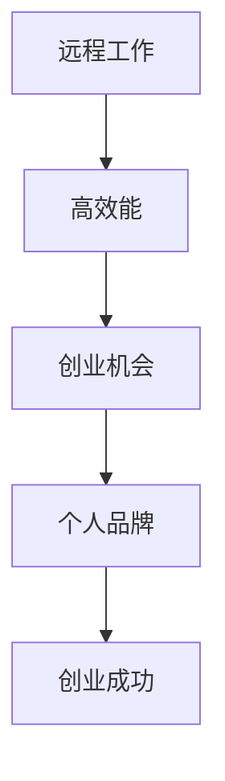

                 

### 文章标题

在当今数字化浪潮的推动下，远程工作已经成为全球企业和员工共同追求的办公模式。这种工作方式的兴起不仅改变了传统的办公格局，更为个人创业提供了前所未有的机遇。本文将深入探讨远程工作时代下的个人创业优势，帮助创业者更好地把握时代脉搏，实现创业梦想。

### 关键词

- 远程工作
- 个人创业
- 创业优势
- 高效能
- 创业环境
- 个人品牌
- 创业风险

### 摘要

本文从远程工作的背景和趋势出发，分析了远程工作对个人效能的影响，探讨了在远程工作背景下创业的优势，以及如何应对创业过程中的风险。通过成功创业案例的解析，提供了实用的创业策略与实战建议，为个人创业者提供了全面的理论指导和实践参考。

---

# 《远程工作时代下的个人创业优势》目录大纲

本文将分为三个主要部分：

## 第一部分：远程工作时代的背景和趋势

### 第1章：远程工作的兴起与发展
- **1.1 远程工作的定义与特点**
  - 远程工作的定义
  - 远程工作的特点
- **1.2 远程工作的发展趋势**
  - 远程工作的普及原因
  - 远程工作对企业和员工的影响

### 第2章：远程工作环境下的个人效能
- **2.1 远程工作对个人效能的影响**
  - 提高工作效率
  - 提升工作满意度
  - 促进工作与生活的平衡
- **2.2 远程工作环境下的时间管理**
  - 时间管理的方法和技巧
  - 远程工作时间的安排

## 第二部分：个人创业的优势分析

### 第3章：远程工作背景下的创业环境
- **3.1 创业环境的变迁**
  - 政策法规的支持
  - 技术创新的机会
  - 市场需求的转变
- **3.2 远程工作对创业项目的支持**
  - 资源获取的便利性
  - 合作伙伴选择的多样性
  - 创业资金的筹集

### 第4章：个人创业的优势
- **4.1 个人品牌的建立**
  - 个人品牌的重要性
  - 个人品牌的构建策略
- **4.2 创业团队建设**
  - 远程团队的组建与维护
  - 跨文化沟通的挑战与应对
- **4.3 创业的灵活性**
  - 创业路径的灵活性
  - 资源配置的灵活性

### 第5章：远程工作背景下的创业风险与管理
- **5.1 创业风险的识别与评估**
  - 技术风险
  - 市场风险
  - 运营风险
- **5.2 风险管理策略**
  - 风险预防措施
  - 风险应对计划

## 第三部分：实战案例与策略

### 第6章：成功创业案例解析
- **6.1 案例选择与分析方法**
  - 成功创业案例的标准
  - 创业案例分析的方法
- **6.2 具体案例解析**
  - 案例一：远程工作平台
  - 案例二：在线教育项目

### 第7章：创业策略与实战建议
- **7.1 创业策略制定**
  - 市场定位
  - 产品定位
  - 营销策略
- **7.2 实战建议**
  - 资源整合与利用
  - 团队建设与管理
  - 项目迭代与优化

## 附录

### 附录 A：创业工具与资源推荐
- **A.1 创业工具**
  - 远程协作工具
  - 数据分析工具
  - 项目管理工具
- **A.2 创业资源**
  - 创业孵化器
  - 投资人联系方式
  - 创业课程与书籍推荐

---

**核心概念与联系**

### 远程工作与个人创业的关联流程图


**核心算法原理讲解**

### 创业风险评估与管理的伪代码
```python
# 创业风险评估与管理伪代码

# 输入：创业项目特征，市场环境数据
# 输出：风险评估结果，管理策略建议

def assess_risk(project_features, market_data):
    risk_score = 0
    for feature in project_features:
        if feature['technical_risk'] == 'high':
            risk_score += 1
        if feature['market_risk'] == 'high':
            risk_score += 1
        if feature['operation_risk'] == 'high':
            risk_score += 1
    
    # 根据风险得分，制定相应的风险管理策略
    if risk_score <= 2:
        strategy = "维持现状，关注关键风险指标"
    elif risk_score <= 4:
        strategy = "加强风险监控，调整战略布局"
    else:
        strategy = "立即调整，加强风险控制措施"
    
    return risk_score, strategy
```

**数学模型和数学公式 & 详细讲解 & 举例说明**

### 创业项目的成功概率模型
$$
P(Success) = \frac{1}{1 + e^{-(a \cdot x + b \cdot y + c \cdot z)}}
$$
- **参数解释**：
  - \( a, b, c \)：模型参数
  - \( x, y, z \)：创业项目的特征指标
- **示例**：
  - 假设 \( a = 2, b = 1, c = 0.5 \)
  - 创业项目特征：\( x = 0.8, y = 0.6, z = 0.7 \)
  - \( P(Success) = \frac{1}{1 + e^{-(2 \cdot 0.8 + 1 \cdot 0.6 + 0.5 \cdot 0.7)}} \)
  - 计算结果：\( P(Success) \approx 0.86 \)

**项目实战**

### 成功创业案例：远程工作平台开发

#### 1. 开发环境搭建
- **技术栈**：
  - 前端：React
  - 后端：Node.js & Express
  - 数据库：MongoDB
  - 实时通信：WebSocket

#### 2. 源代码详细实现
- **前端代码示例**：
  ```javascript
  // React组件：远程工作平台主界面
  import React, { useState, useEffect } from 'react';

  function Workspace() {
      const [tasks, setTasks] = useState([]);

      useEffect(() => {
          // 请求任务数据
          fetch('/api/tasks')
              .then(response => response.json())
              .then(data => setTasks(data));
      }, []);

      return (
          <div>
              {tasks.map(task => (
                  <div key={task.id}>
                      {task.title}
                      <button onClick={() => deleteTask(task.id)}>删除</button>
                  </div>
              ))}
          </div>
      );
  }
  ```

- **后端代码示例**：
  ```javascript
  // Express后端：处理任务API请求
  const express = require('express');
  const app = express();

  app.use(express.json());

  let tasks = [
      { id: 1, title: '任务一' },
      { id: 2, title: '任务二' }
  ];

  app.get('/api/tasks', (req, res) => {
      res.json(tasks);
  });

  app.delete('/api/tasks/:id', (req, res) => {
      const { id } = req.params;
      tasks = tasks.filter(task => task.id !== Number(id));
      res.status(204).send();
  });

  app.listen(3000, () => {
      console.log('Server running on port 3000');
  });
  ```

#### 3. 代码解读与分析
- **前端代码解读**：
  - 使用React创建一个组件，用于显示任务列表。
  - 使用useState和useEffect钩子管理任务状态和数据获取。
  - 请求任务数据，并将任务列表更新到组件状态。

- **后端代码解读**：
  - 使用Express创建一个Web服务。
  - 提供GET和DELETE请求接口，分别用于获取任务列表和删除任务。
  - 维护任务数组，并根据请求处理任务数据。

**项目实战：在线教育项目**

#### 1. 开发环境搭建
- **技术栈**：
  - 前端：Vue
  - 后端：Python & Flask
  - 数据库：PostgreSQL
  - 媒体处理：FFmpeg

#### 2. 源代码详细实现
- **前端代码示例**：
  ```javascript
  // Vue组件：在线教育课程列表
  <template>
      <div>
          <h1>课程列表</h1>
          <ul>
              <li v-for="course in courses" :key="course.id">
                  {{ course.title }}
                  <button @click="enrollCourse(course.id)">报名</button>
              </li>
          </ul>
      </div>
  </template>

  <script>
  import axios from 'axios';

  export default {
      data() {
          return {
              courses: []
          };
      },
      created() {
          this.fetchCourses();
      },
      methods: {
          fetchCourses() {
              axios.get('/api/courses')
                  .then(response => {
                      this.courses = response.data;
                  })
                  .catch(error => {
                      console.error('Error fetching courses:', error);
                  });
          },
          enrollCourse(courseId) {
              axios.post(`/api/courses/${courseId}/enroll`)
                  .then(response => {
                      alert('Enrollment successful!');
                  })
                  .catch(error => {
                      console.error('Error enrolling course:', error);
                  });
          }
      }
  };
  </script>
  ```

- **后端代码示例**：
  ```python
  # Flask后端：处理课程API请求
  from flask import Flask, request, jsonify

  app = Flask(__name__)

  courses = [
      { 'id': 1, 'title': 'Python基础课程' },
      { 'id': 2, 'title': 'Web开发实战' }
  ]

  @app.route('/api/courses', methods=['GET'])
  def get_courses():
      return jsonify(courses)

  @app.route('/api/courses/<int:course_id>/enroll', methods=['POST'])
  def enroll_course(course_id):
      # 记录用户报名信息到数据库
      # 这里简化处理，仅返回成功消息
      return jsonify({'message': 'Enrollment successful!'})

  if __name__ == '__main__':
      app.run(debug=True)
  ```

#### 3. 代码解读与分析
- **前端代码解读**：
  - 使用Vue创建一个组件，用于显示课程列表和报名按钮。
  - 使用axios进行异步请求，获取课程数据并更新组件状态。
  - 为报名按钮添加事件处理函数，发送POST请求进行课程报名。

- **后端代码解读**：
  - 使用Flask创建一个Web服务。
  - 提供GET和POST请求接口，分别用于获取课程列表和课程报名。
  - 简化处理，这里仅返回成功消息，实际应用中需要记录用户报名信息到数据库。

这些代码示例和实战案例展示了远程工作时代下个人创业的一些实际应用，包括远程工作平台和在线教育项目的开发环境搭建、源代码实现和代码解读。通过这些案例，读者可以了解到如何利用现代技术构建具有实际应用价值的创业项目，并掌握相关的开发技巧和策略。

---

**作者：AI天才研究院/AI Genius Institute & 禅与计算机程序设计艺术 /Zen And The Art of Computer Programming** 

## 第一部分：远程工作时代的背景和趋势

### 第1章：远程工作的兴起与发展

#### 1.1 远程工作的定义与特点

远程工作，顾名思义，是指通过信息技术，使得工作者不必在传统的办公场所（如公司办公室）进行工作，而是可以在任何地点（家庭、咖啡店、远程工作站等）利用互联网和其他通信工具完成工作任务。远程工作的定义具有以下核心特点：

1. **地理位置的灵活性**：远程工作的核心优势之一是工作地点的灵活性。员工不再受限于特定的办公场所，可以在全球任何地方工作，这使得他们能够更好地平衡工作和生活。
   
2. **沟通与协作**：虽然远程工作意味着地理位置的分散，但现代信息技术提供了丰富的沟通和协作工具，如电子邮件、即时通讯、视频会议、在线协作平台等，使得团队成员能够实时沟通和协作。

3. **自主管理**：远程工作要求员工具备较高的自我管理和自律能力。员工需要自行安排工作时间，设定工作目标，并在没有直接监督的情况下保持高效的工作状态。

4. **时间管理**：远程工作为员工提供了更多的时间管理灵活性，他们可以根据自己的时间表来安排工作和个人时间，从而可能提高工作效率和生活质量。

#### 1.2 远程工作的发展趋势

近年来，远程工作在全球范围内得到了快速的发展，主要受以下几个因素的推动：

1. **技术进步**：互联网技术的普及和移动设备的广泛应用，使得远程工作成为可能。高效的网络连接和丰富的在线工具使得远程沟通、协作和任务管理变得更加便捷。

2. **企业需求**：许多企业意识到远程工作的优势，如节省办公空间成本、提高员工满意度、扩大人才招聘范围等。这些因素促使越来越多的企业采用远程工作模式。

3. **健康危机**：COVID-19疫情对全球经济造成了巨大影响，也加速了远程工作的普及。为了保障员工的健康和安全，许多企业不得不迅速转变工作模式，实施远程办公政策。

4. **灵活工作文化**：现代社会对工作与生活平衡的追求，使得灵活工作文化日益流行。许多年轻人更倾向于选择能够提供灵活工作安排的公司。

#### 1.3 远程工作对企业和员工的影响

远程工作对企业和员工都有着深远的影响：

1. **企业效益**：
   - **成本节省**：企业通过减少办公场所的租赁和维护成本，以及降低员工差旅费用，可以实现显著的成本节约。
   - **人才多样性**：远程工作使得企业能够吸引来自全球各地的优秀人才，不受地理位置的限制。
   - **提高生产力**：研究表明，远程工作能够提高员工的工作满意度和生产力，因为员工能够在更为舒适的环境中工作。

2. **员工福利**：
   - **工作与生活平衡**：远程工作使得员工能够更好地平衡工作和个人生活，减少通勤时间，从而提高生活质量。
   - **职业发展**：远程工作提供了更多的学习和发展机会，员工可以更灵活地参加培训、研讨会等，提升自己的技能和职业竞争力。
   - **工作满意度**：远程工作能够提高员工的工作满意度，因为员工有更大的自主权和灵活性。

综上所述，远程工作在现代社会中已经成为一种不可逆转的趋势，对企业和员工都带来了诸多积极的影响。在接下来的章节中，我们将进一步探讨远程工作对个人效能的影响，以及如何在远程工作背景下开展个人创业。

## 第二部分：远程工作环境下的个人效能

### 第2章：远程工作对个人效能的影响

远程工作作为一种灵活的工作方式，不仅改变了传统的工作模式，也对个人的效能产生了深远的影响。本章将详细探讨远程工作对个人效能的影响，包括工作效率的提高、工作满意度的提升以及工作与生活的平衡。

#### 2.1 提高工作效率

远程工作环境为个人提供了更为灵活的工作时间和工作地点，这使得员工能够根据自己的生活习惯和工作效率高峰期来安排工作。以下是一些关键因素，解释了远程工作如何提高工作效率：

1. **减少干扰**：在远程工作环境中，员工往往能够避免办公场所常见的干扰，如同事的闲聊、不必要的会议和电话等。这种减少干扰的环境有助于员工集中注意力，提高工作效率。

2. **自主管理**：远程工作要求员工具备较高的自我管理能力，这意味着员工需要设定明确的工作目标，并自我监督完成情况。这种自主管理的方式有助于员工更高效地利用工作时间。

3. **灵活性**：远程工作使得员工可以根据个人生活和工作习惯来安排工作时间。例如，有些员工可能更喜欢在早晨处理复杂任务，而在下午处理较为简单的任务。这种灵活性有助于员工在最佳状态下完成工作。

4. **避免通勤时间**：远程工作免除了通勤的烦恼，员工可以将原本花费在通勤上的时间用于工作或其他有益的活动。这不仅提高了工作效率，也减少了因通勤带来的疲劳。

#### 2.2 提升工作满意度

工作满意度是衡量员工幸福感和工作动力的重要指标。远程工作在提升工作满意度方面具有以下几个显著优势：

1. **工作与生活平衡**：远程工作使员工能够更好地平衡工作和个人生活。员工可以灵活地安排工作时间，更好地照顾家庭，参与孩子的教育和活动，从而提高整体生活质量。

2. **减少压力**：远程工作减少了员工因通勤、办公室政治和其他工作场所压力源而产生的压力。这种减少的压力有助于提高员工的幸福感和工作满意度。

3. **自主性**：远程工作赋予了员工更多的自主权，员工可以自主决定工作方式、工作内容和工作时间。这种自主性增强了员工对工作的控制感和成就感，从而提升工作满意度。

4. **认可和尊重**：许多企业通过远程工作制度表达了他们对员工信任和尊重的态度。员工感受到企业对他们能力的信任，这进一步提升了工作满意度。

#### 2.3 促进工作与生活的平衡

远程工作不仅提高了工作效率和工作满意度，还显著促进了工作与生活的平衡。以下是一些具体措施和方法：

1. **灵活的工作安排**：远程工作允许员工根据自己的生活需求来安排工作时间。例如，员工可以选择在早晨处理工作，下午陪伴孩子，晚上继续工作。这种灵活的工作安排有助于员工在工作和生活之间找到平衡。

2. **家庭支持**：远程工作使员工能够更好地照顾家庭成员，特别是需要特殊关注的孩子或老人。这种家庭支持不仅有助于提高工作满意度，还增强了员工的幸福感。

3. **减少通勤时间**：远程工作免除了通勤的烦恼，员工可以将原本花费在通勤上的时间用于家庭活动、个人爱好或其他有益的事情。这种减少的时间投入有助于提高生活质量。

4. **健康生活方式**：远程工作为员工提供了更多的时间来关注自己的健康。员工可以利用远程工作的灵活性进行锻炼、健康饮食和休息，从而提升整体健康水平。

总之，远程工作对个人效能产生了多方面的积极影响。它不仅提高了工作效率和工作满意度，还促进了工作与生活的平衡。在接下来的章节中，我们将进一步探讨如何更有效地管理远程工作时间，以最大化个人效能。

#### 2.4 远程工作环境下的时间管理

在远程工作环境中，时间管理变得尤为重要。由于缺乏面对面的监督和固定的工作环境，员工需要更强大的自我管理能力来确保工作效率和工作质量。以下是一些关于远程工作环境下时间管理的有效方法和技巧：

1. **设定明确的目标和优先级**：在开始一天的工作之前，设定清晰的目标和优先级是非常重要的。员工应该列出当天需要完成的任务，并根据任务的紧急程度和重要性进行排序。这样可以帮助员工更有针对性地安排时间，确保高优先级的任务得到优先处理。

2. **使用日程安排工具**：日程安排工具如Google日历、Microsoft Outlook、Trello等可以帮助员工更好地管理时间和任务。通过将这些工具集成到日常工作中，员工可以轻松地安排会议、规划工作日程和提醒重要事项。

3. **制定工作计划**：制定详细的工作计划可以帮助员工避免时间的浪费和混乱。员工可以在每天开始工作前，制定一个详细的工作计划，包括每个任务所需的时间、开始和结束时间等。这样可以确保工作有条不紊地进行，避免时间的浪费。

4. **避免多任务处理**：虽然远程工作提供了更大的灵活性，但多任务处理往往会降低工作效率。研究表明，多任务处理会导致注意力分散和生产力下降。因此，员工应尽量避免在短时间内同时处理多个任务，而是专注于单一任务，确保其得到充分完成。

5. **休息和放松**：远程工作虽然提供了灵活的工作时间，但也容易导致员工长时间工作，缺乏休息。为了保持高效和健康，员工应该定期休息，进行放松和休息。例如，每工作45分钟后，可以休息5-10分钟，进行简单的身体活动或深呼吸练习。

6. **定期回顾和调整**：定期回顾和调整工作计划和时间管理策略可以帮助员工识别不足之处，并作出相应的调整。员工可以在每周或每月的结束时，回顾自己的工作表现和时间管理情况，总结经验教训，并制定改进计划。

7. **建立固定的工作习惯**：建立固定的工作习惯可以帮助员工更好地管理时间，提高工作效率。例如，设定每天固定的起床时间、工作时间和休息时间，以及固定的工作地点，都有助于培养高效的工作习惯。

通过这些时间管理的方法和技巧，员工可以在远程工作环境中保持高效的工作状态，提高个人效能。同时，这些方法也有助于员工更好地平衡工作和个人生活，提高整体生活质量。

## 第三部分：个人创业的优势分析

### 第3章：远程工作背景下的创业环境

#### 3.1 创业环境的变迁

远程工作时代的到来，不仅改变了传统的办公模式，也为创业环境带来了深刻的变革。这种变革主要体现在以下几个方面：

1. **政策法规的支持**：

随着远程工作的普及，许多国家和地区开始出台相关政策，鼓励和规范远程工作。例如，有些国家通过立法明确远程工作的权利和义务，为员工提供了法律保障。同时，政府还提供了各种创业补贴、税收减免等政策，鼓励创业者和中小企业发展。这些政策的出台，为创业者提供了有力的支持，降低了创业门槛。

2. **技术创新的机会**：

远程工作的普及离不开信息技术的支持，特别是互联网、云计算、人工智能等技术的迅猛发展。这些技术的进步为创业者提供了丰富的工具和平台，使得创业项目能够更加便捷地实现。例如，云计算服务为创业者提供了强大的计算能力和存储资源，而人工智能则可以帮助创业者优化业务流程，提高决策效率。

3. **市场需求的转变**：

随着消费者对个性化和定制化需求的增长，市场环境也在不断变化。远程工作使得创业者能够更容易地接触全球市场，拓展业务范围。同时，消费者对数字化产品和服务的需求也在增加，这为创业者提供了广阔的市场空间。创业者可以利用远程工作的优势，快速响应市场变化，开发出更具市场竞争力的产品。

#### 3.2 远程工作对创业项目的支持

远程工作不仅改变了创业环境，也对创业项目提供了多方面的支持：

1. **资源获取的便利性**：

在远程工作环境中，创业者可以更加便捷地获取所需的资源。例如，通过互联网可以轻松地找到全球范围内的专业人才，组建虚拟团队。此外，远程工作平台和协作工具也为创业者提供了丰富的资源和工具，使得项目管理、沟通协作变得更加高效。

2. **合作伙伴选择的多样性**：

远程工作使得创业者能够与全球范围内的合作伙伴建立联系。这种多样性不仅有助于创业者拓展业务范围，还能引入不同的文化和技术，为创业项目注入新的活力和创意。创业者可以利用远程工作的优势，选择最适合自己项目的合作伙伴，实现优势互补。

3. **创业资金的筹集**：

远程工作环境为创业者提供了更多的融资渠道。例如，通过在线众筹平台，创业者可以更容易地获得资金支持。此外，远程工作也降低了创业的初期成本，创业者可以以较低的成本启动项目，从而提高资金的利用效率。

#### 3.3 市场需求的转变

在远程工作时代，市场需求的转变也为创业者提供了新的机遇：

1. **远程工作相关服务的需求增加**：

随着远程工作的普及，相关服务的需求也在增加。例如，远程协作工具、在线培训、虚拟办公室等需求日益增长。创业者可以针对这些需求开发相关产品和服务，满足市场空白。

2. **数字化产品和服务的需求增长**：

消费者对数字化产品和服务的需求不断增长，这为创业者提供了广阔的市场空间。例如，在线教育、电子商务、健康科技等领域都显示出巨大的发展潜力。

3. **个性化和定制化需求**：

消费者对个性化和定制化需求的增长，也为创业者提供了新的商机。创业者可以通过大数据和人工智能等技术，了解消费者的需求，提供更加个性化的产品和服务。

综上所述，远程工作时代的到来，为创业环境带来了深刻的变革。政策法规的支持、技术创新的机会以及市场需求的转变，为创业者提供了丰富的资源和广阔的市场空间。在接下来的章节中，我们将进一步探讨个人创业的优势，以及如何应对创业过程中的风险。

### 第4章：个人创业的优势

在远程工作时代，个人创业相较于传统创业模式，具有诸多独特的优势。这些优势不仅体现在创业过程的灵活性、团队建设和品牌建设等方面，还为创业者提供了更多的机遇。以下将详细分析这些优势。

#### 4.1 个人品牌的建立

在远程工作时代，个人品牌的重要性日益凸显。个人品牌不仅代表了个人在行业中的声誉和影响力，还成为了吸引投资、合作伙伴和客户的宝贵资产。以下是构建个人品牌的关键策略：

1. **专业知识的积累**：创业者应不断学习和积累专业知识，通过参与行业研讨会、撰写技术博客、发表学术论文等方式，展示自己的专业能力和见解。

2. **社交媒体的运用**：利用社交媒体平台，如LinkedIn、Twitter、Facebook等，积极分享自己的工作成果、思考观点和行业动态，建立专业形象。

3. **个人影响力的传播**：通过演讲、线上直播、YouTube视频等形式，将自己的观点和经验传播给更广泛的受众，提高个人知名度和影响力。

4. **口碑营销**：通过优质的服务和产品，获得客户的认可和推荐，从而逐步建立起良好的口碑和信誉。

#### 4.2 创业团队建设

团队是创业成功的关键，而远程工作模式为创业团队的建设提供了独特的优势。以下是如何在远程工作环境下有效组建和维护团队的建议：

1. **多样性的优势**：远程工作使创业者能够吸引来自全球各地的优秀人才，组建多元化团队。这种多样性不仅带来了不同的观点和创意，还有助于团队的创新和进步。

2. **灵活的团队成员选择**：远程工作模式允许创业者根据项目需求选择合适的团队成员，不受地理位置限制。创业者可以利用在线招聘平台，如Upwork、Freelancer等，快速找到合适的人才。

3. **清晰的沟通机制**：建立有效的沟通机制是远程团队成功的关键。创业者应确保团队成员之间能够畅通无阻地进行沟通，使用如Slack、Zoom、Microsoft Teams等协作工具，保持实时沟通和协作。

4. **信任和自治**：在远程工作环境中，信任和自治尤为重要。创业者应赋予团队成员足够的自主权，建立信任文化，鼓励团队成员自主管理和决策，从而提高团队效率和创造力。

5. **定期团队建设活动**：尽管远程工作减少了面对面交流的机会，但定期进行团队建设活动，如线上团队会议、虚拟社交活动等，有助于增强团队成员之间的联系和归属感。

#### 4.3 创业的灵活性

远程工作环境为创业者提供了极大的灵活性，这使得创业过程更加灵活和适应性强。以下是创业灵活性的一些具体体现：

1. **资源分配的灵活性**：创业者可以根据项目的需求灵活配置资源，如人力、资金和设备等。这种灵活性有助于优化资源配置，提高资源利用效率。

2. **业务模式调整的灵活性**：远程工作使得创业者能够快速响应市场变化，调整业务模式。创业者可以根据市场需求的变化，灵活地调整产品策略和市场定位。

3. **工作地点和时间选择的灵活性**：远程工作允许创业者根据自己的需求和偏好选择工作地点和时间，这种灵活性有助于提高工作满意度和生活质量。

4. **业务扩展的灵活性**：远程工作模式使得创业项目能够更容易地实现全球化扩展。创业者可以通过在线渠道和远程协作，迅速拓展市场，实现业务全球化。

总之，远程工作时代为个人创业带来了诸多优势。个人品牌的建立、创业团队的建设以及创业的灵活性，为创业者提供了丰富的资源和广阔的发展空间。在接下来的章节中，我们将进一步探讨如何识别和管理远程工作背景下的创业风险。

### 第5章：远程工作背景下的创业风险与管理

#### 5.1 创业风险的识别与评估

创业过程充满了不确定性，风险无处不在。在远程工作背景下，创业者需要识别和评估以下几种主要风险：

1. **技术风险**：技术风险是创业过程中最常见的一种风险。这包括技术实现的难度、技术更新换代的速度、技术的竞争性等因素。例如，如果一个创业项目依赖于一项尚未成熟的技术，可能会导致项目进展受阻。

2. **市场风险**：市场风险涉及到市场需求的变化、竞争对手的行动以及消费者偏好的转移。在远程工作环境下，市场风险可能更加复杂，因为创业者无法直接接触到客户，对市场变化的感知可能滞后。

3. **运营风险**：运营风险包括供应链管理、资金流动、人力资源管理等方面的问题。远程工作可能增加运营风险，因为创业者难以直接监控和调整运营环节。

4. **法律和合规风险**：远程工作可能涉及到跨地域的法律和合规问题，如数据保护、税务政策等。创业者需要确保遵守所有相关法律法规，否则可能会导致法律纠纷和罚款。

5. **财务风险**：财务风险包括资金不足、资金管理不善、投资回报周期长等问题。在远程工作环境中，创业者需要更加精打细算，确保资金的有效利用。

#### 5.2 风险管理策略

为了有效地管理创业风险，创业者可以采取以下策略：

1. **预防措施**：
   - **技术风险评估**：在项目启动前，对技术风险进行充分评估，选择成熟稳定的技术平台，并建立灵活的技术更新机制。
   - **市场研究**：通过市场调研、用户反馈等方式，深入了解市场需求和竞争对手情况，制定灵活的市场策略。
   - **财务管理**：制定详细的财务计划，确保有足够的资金储备，并建立严格的资金管理制度。
   - **法律合规性检查**：咨询法律专家，确保项目符合所有相关法律法规，避免潜在的法律风险。

2. **应对计划**：
   - **技术风险应对**：针对技术风险，制定应急预案，如备份技术方案、技术储备团队等，确保在技术出现问题时有备选方案。
   - **市场风险应对**：建立灵活的市场策略，如多元化产品线、快速迭代等，以应对市场需求的变化和竞争对手的挑战。
   - **运营风险应对**：建立高效的运营管理团队，采用自动化和远程监控工具，确保运营环节的顺畅。
   - **法律合规性应对**：制定应对措施，如应急预案、法律咨询等，确保在出现法律问题时能够迅速应对。

3. **风险转移**：
   - **保险**：购买相应的保险，如商业保险、数据保险等，将部分风险转移给保险公司。
   - **合作伙伴关系**：与可靠的合作伙伴建立长期合作关系，共享风险和资源，降低单个创业项目的风险。

4. **持续监控和评估**：
   - **定期风险评估**：定期对创业项目进行风险评估，识别新的风险因素，并调整风险管理策略。
   - **实时监控**：建立实时监控机制，对关键风险指标进行持续监控，确保在风险发生时能够及时应对。

通过采取有效的风险管理策略，创业者可以在远程工作背景下更好地应对各种风险，确保创业项目的稳定发展。

### 第6章：成功创业案例解析

#### 6.1 案例选择与分析方法

在本章节中，我们将分析两个成功的创业案例，以展示远程工作时代下个人创业的实践路径。这两个案例分别是远程工作平台开发和在线教育项目。选择这两个案例的原因在于：

1. **行业代表性**：远程工作平台和在线教育项目是当前远程工作时代中最具代表性的创业领域之一，反映了远程工作背景下创业的机会和挑战。

2. **成功经验**：这两个案例均取得了显著的商业成功，为其他创业者提供了宝贵的经验和启示。

3. **技术实现**：这两个案例均涉及到复杂的技术实现，包括前后端开发、数据存储、实时通信等，有助于读者深入了解远程工作环境下的技术应用。

以下是对成功创业案例的解析方法：

1. **项目背景**：介绍创业项目的背景，包括项目起源、市场环境、创业团队组成等。

2. **技术实现**：详细描述项目的技术架构，包括前端、后端、数据库、实时通信等技术实现。

3. **商业模式**：分析项目的商业模式，包括产品定位、市场策略、收入来源等。

4. **成功要素**：探讨创业项目的成功要素，包括团队管理、市场定位、技术创新、风险管理等。

5. **启示与经验**：总结创业项目的成功经验，为其他创业者提供实践参考。

#### 6.2 案例一：远程工作平台开发

**项目背景**：

远程工作平台项目起源于2020年，正值COVID-19疫情全球爆发时期。创业团队看到远程工作需求的激增，决定开发一款集成沟通、协作和任务管理功能的远程工作平台。创业团队由三名技术专家和一名市场专家组成，他们在远程工作领域具有丰富的经验和深厚的专业知识。

**技术实现**：

1. **前端技术**：使用React框架开发前端应用，提供用户友好的界面和丰富的交互功能。

2. **后端技术**：使用Node.js和Express框架搭建后端服务，实现任务管理、用户认证、数据存储等功能。

3. **数据库**：采用MongoDB数据库存储用户数据和任务数据，提供高效的数据查询和操作能力。

4. **实时通信**：使用WebSocket技术实现实时通信功能，确保团队成员之间的消息传递和协作无缝进行。

**商业模式**：

1. **产品定位**：针对中小企业和自由职业者，提供高效、灵活的远程工作解决方案。

2. **市场策略**：通过免费试用和逐步收费的方式，吸引客户使用平台。同时，通过提供高级功能和定制服务，吸引高端客户。

3. **收入来源**：主要收入来源包括订阅费用、服务费用和广告收入。

**成功要素**：

1. **技术创新**：创业团队在技术方面进行了大量创新，如使用WebSocket实现实时通信，提升了用户体验。

2. **团队协作**：团队成员之间紧密协作，迅速响应市场变化，不断优化产品功能。

3. **用户反馈**：创业团队高度重视用户反馈，不断收集用户需求，根据用户意见优化产品。

4. **市场定位**：准确的市场定位帮助创业团队抓住了远程工作市场的机遇，迅速占领市场份额。

**启示与经验**：

1. **技术创新**：在远程工作平台上，技术创新是成功的关键。创业者应关注前沿技术，不断提升产品的技术含量。

2. **用户导向**：关注用户需求，不断优化产品功能，提升用户体验。

3. **团队协作**：高效的团队协作是创业成功的重要保障。创业者应建立良好的团队文化，促进团队成员之间的协作和沟通。

#### 6.3 案例二：在线教育项目

**项目背景**：

在线教育项目起源于2018年，当时在线教育市场正处于快速发展阶段。创业团队由三名教育专家和两名技术专家组成，他们看到了在线教育市场的巨大潜力，决定开发一款集课程学习、互动交流和在线考试于一体的在线教育平台。

**技术实现**：

1. **前端技术**：使用Vue.js框架开发前端应用，提供丰富的交互功能和良好的用户体验。

2. **后端技术**：使用Python和Flask框架搭建后端服务，实现课程管理、用户认证、数据存储等功能。

3. **数据库**：采用PostgreSQL数据库存储用户数据和课程数据，提供高效的数据查询和操作能力。

4. **媒体处理**：使用FFmpeg进行视频处理和流媒体传输，确保在线课程的高效播放和流畅体验。

**商业模式**：

1. **产品定位**：针对中小学和职业教育市场，提供优质、个性化的在线教育资源。

2. **市场策略**：通过线上推广、合作伙伴关系和口碑传播，扩大用户基础。同时，通过提供付费课程和增值服务，实现商业盈利。

3. **收入来源**：主要收入来源包括课程销售、广告收入和合作伙伴分成。

**成功要素**：

1. **内容质量**：创业团队高度重视课程内容的质量，与知名教育专家合作，确保课程内容的权威性和实用性。

2. **技术创新**：在在线教育平台上，技术创新提升了用户的学习体验。例如，通过实时互动功能和在线考试系统，提高了用户的学习积极性和参与度。

3. **市场定位**：创业团队准确抓住了在线教育市场的需求，提供了符合用户需求的优质教育资源。

4. **用户反馈**：创业团队积极收集用户反馈，不断优化平台功能，提升用户体验。

**启示与经验**：

1. **内容质量**：在线教育项目成功的关键在于优质的内容。创业者应注重课程内容的开发，确保课程质量。

2. **用户体验**：技术创新和良好的用户体验是提升用户满意度和忠诚度的关键。创业者应不断优化平台功能，提升用户体验。

3. **市场定位**：准确的市场定位有助于创业项目快速占领市场。创业者应深入了解市场需求，提供符合用户需求的优质产品。

通过分析远程工作平台开发和在线教育项目的成功案例，我们看到了远程工作时代下个人创业的广阔前景和巨大潜力。这些案例的成功经验为其他创业者提供了宝贵的启示，帮助他们更好地把握创业机会，实现创业梦想。

### 第7章：创业策略与实战建议

#### 7.1 创业策略制定

创业策略的制定是创业成功的关键步骤，它决定了创业项目的方向和路径。以下是一些关键要素和步骤，帮助创业者制定有效的创业策略：

1. **市场定位**：

市场定位是创业策略的核心。创业者需要明确目标市场，了解目标客户的需求、偏好和行为。通过市场调研、用户访谈和竞争分析，确定产品或服务的市场定位。市场定位应具备以下特点：

   - **准确性**：确保市场定位准确，能够精准地满足目标客户的需求。
   - **差异化**：通过独特的产品特性或服务优势，在竞争激烈的市场中脱颖而出。
   - **可扩展性**：市场定位应具有一定的扩展性，以便未来能够进入其他市场或拓展产品线。

2. **产品定位**：

产品定位是市场定位的具体实现，涉及到产品的功能、特性和价值主张。创业者需要从以下角度考虑产品定位：

   - **核心功能**：明确产品的核心功能，确保产品能够解决客户的主要问题或需求。
   - **独特卖点**（USP）：找出产品的独特卖点，使其在市场上具有竞争力。
   - **价格策略**：根据目标市场和客户群体的消费能力，制定合适的价格策略。

3. **营销策略**：

营销策略是实现市场定位和产品定位的重要手段。以下是一些关键的营销策略：

   - **品牌建设**：建立强大的品牌形象，通过品牌故事、视觉设计和口碑传播，提升品牌知名度和美誉度。
   - **推广渠道**：选择合适的推广渠道，如社交媒体、内容营销、SEO优化、线下活动等，扩大品牌影响力。
   - **客户关系管理**：建立有效的客户关系管理机制，通过客户反馈、忠诚度计划和个性化服务，提升客户满意度和忠诚度。

4. **运营策略**：

运营策略是确保创业项目能够稳定运行和持续发展的重要保障。以下是一些关键的运营策略：

   - **成本控制**：通过精细化管理和优化运营流程，降低成本，提高盈利能力。
   - **资源管理**：合理配置人力、资金、技术等资源，确保项目的顺利推进。
   - **风险管理**：建立风险识别和评估机制，制定应对计划，降低运营风险。

5. **战略规划**：

战略规划是长期发展的蓝图，需要创业者从全局角度考虑项目的未来发展。以下是一些战略规划的步骤：

   - **愿景和使命**：明确项目的愿景和使命，指导创业者在长期发展中不断追求的目标。
   - **阶段性目标**：设定明确的阶段性目标，如短期目标、中期目标和长期目标，确保项目稳步推进。
   - **关键绩效指标**（KPI）：制定关键绩效指标，对项目进展进行监控和评估，确保项目按计划进行。

#### 7.2 实战建议

在创业过程中，以下实战建议将帮助创业者更好地应对挑战，实现创业目标：

1. **资源整合与利用**：

资源整合与利用是创业成功的关键。创业者需要充分利用各种资源，包括资金、技术、人力、市场等。以下是一些资源整合与利用的建议：

   - **资金**：寻找合适的资金来源，如天使投资、风险投资、政府补贴等。在资金使用上，要注重成本控制和效益最大化。
   - **技术**：与合作伙伴建立合作关系，共享技术资源，提升技术创新能力。同时，关注前沿技术动态，不断引进新技术。
   - **人力**：组建高效的创业团队，重视团队成员的能力和协作，打造积极向上的团队文化。
   - **市场**：积极拓展市场渠道，建立市场网络，通过多种营销策略提高品牌知名度和市场份额。

2. **团队建设与管理**：

团队建设与管理是创业成功的重要保障。创业者需要关注团队建设，确保团队成员能够协同工作，共同实现创业目标。以下是一些团队建设与管理的建议：

   - **团队结构**：根据项目需求，合理设置团队结构，确保团队成员职责明确，分工协作。
   - **激励机制**：建立有效的激励机制，激发团队成员的积极性和创造力。激励机制可以包括薪酬、股权激励、荣誉奖励等。
   - **沟通与协作**：建立畅通的沟通机制，确保团队成员之间的信息交流和协作。可以使用各种协作工具，如Slack、Trello、Zoom等。
   - **团队文化**：打造积极向上的团队文化，鼓励团队成员相互支持、共同进步。团队文化可以通过团队活动、培训、员工关怀等方式体现。

3. **项目迭代与优化**：

在创业过程中，项目迭代与优化是持续改进和提升产品或服务的重要手段。以下是一些项目迭代与优化的建议：

   - **用户反馈**：重视用户反馈，通过问卷调查、用户访谈等方式收集用户意见和建议，及时调整产品或服务。
   - **数据驱动**：利用数据分析和用户行为研究，了解用户需求和市场趋势，指导项目迭代和优化。
   - **敏捷开发**：采用敏捷开发方法，快速迭代和交付产品，及时响应市场需求和变化。
   - **持续优化**：在项目迭代过程中，不断优化产品功能、性能和用户体验，提升产品竞争力。

通过以上创业策略和实战建议，创业者可以更好地规划创业路径，应对创业挑战，实现创业目标。在远程工作时代，创业者拥有更多的资源和机会，只要把握时代脉搏，持续创新和优化，就能够在竞争激烈的市场中脱颖而出，实现创业梦想。

## 附录 A：创业工具与资源推荐

### A.1 创业工具

在创业过程中，选择合适的工具是提升效率和确保项目顺利进行的关键。以下是一些推荐的创业工具：

1. **远程协作工具**：

   - **Slack**：一款流行的即时通讯工具，适用于团队内部沟通和协作。
   - **Trello**：一个可视化的项目管理工具，可以帮助团队跟踪项目进展。
   - **Asana**：用于任务管理和项目协作的平台，提供详细的任务分配和进度跟踪功能。
   - **Google Workspace**：包括Google Docs、 Sheets、Slides等，方便团队协作和文件共享。

2. **数据分析工具**：

   - **Google Analytics**：一款免费的数据分析工具，适用于网站和移动应用的用户行为分析。
   - **Tableau**：强大的数据可视化工具，帮助创业者以图形化方式展示数据。
   - **Kissmetrics**：用于网站和移动应用的用户行为分析，提供详细的用户行为报告。

3. **项目管理工具**：

   - **Jira**：一个功能丰富的项目管理工具，适用于软件开发和项目协作。
   - **Microsoft Project**：用于项目计划和进度管理的专业工具。
   - **ClickUp**：一个综合性的项目管理工具，提供任务管理、时间跟踪、文档共享等功能。

### A.2 创业资源

创业资源的有效利用对于创业项目的成功至关重要。以下是一些推荐的创业资源：

1. **创业孵化器**：

   - **Techstars**：全球知名创业孵化器，提供资金、导师资源和网络支持。
   - **Y Combinator**：美国著名创业孵化器，孵化了许多知名创业公司。
   - **Venture Catalysts**：提供全方位创业支持和服务的孵化器，适用于东南亚市场。

2. **投资人联系方式**：

   - **AngelList**：一个连接创业者与天使投资人的平台，可以找到合适的投资人。
   - **Harbor**：专注于中国创业公司和投资人的平台，提供投资对接服务。
   - **Investors Club**：一个为创业者提供投资人联系信息的社区。

3. **创业课程与书籍推荐**：

   - **《创业维艰》（The Hard Thing About Hard Things）**：由创业公司Dropbox联合创始人本·霍洛维茨撰写，讲述了创业过程中遇到的各种挑战和解决方法。
   - **《精益创业》（The Lean Startup）**：作者埃里克·莱斯提出精益创业方法论，帮助创业者通过最小可行产品（MVP）快速验证和迭代产品。
   - **《创业的艺术》（The Art of Startup Success）**：由LinkedIn联合创始人雷德·霍夫曼撰写，分享了创业成功的关键经验和策略。

通过利用这些创业工具和资源，创业者可以更好地规划和管理创业项目，提升创业成功率。

