                 

# 释放人类潜力的无限可能：人类计算的最终目标

## 关键词：
计算，人类潜能，人工智能，未来技术，伦理问题

## 摘要：
本文深入探讨了人类计算的无限可能性及其终极目标。通过分析计算的历史、现状和未来趋势，本文揭示了计算技术如何赋能人类社会，推动科技发展和人类潜能的释放。同时，本文也探讨了计算技术的未来发展方向，以及可能面临的伦理和社会问题。

### 引言

#### 1.1 引言背景

计算是人类智慧和技术的核心，贯穿于人类历史发展的方方面面。从古代的算盘到现代的超级计算机，计算技术不断演进，极大地推动了人类文明的进步。随着信息技术的飞速发展，计算能力已经成为衡量一个国家或地区科技水平的重要指标。

#### 1.2 研究意义

人类计算的终极目标是什么？这是值得深入探讨的问题。明确计算的目标，不仅有助于我们更好地理解计算的本质，还能为未来计算技术的发展提供方向。本文旨在探讨人类计算的终极目标，以期对未来计算技术的发展提供有益的启示。

#### 1.3 研究目标

本文的研究目标如下：

1. 分析人类计算的历史，梳理计算技术发展的脉络。
2. 探讨计算技术的现状，总结计算技术对人类社会的贡献。
3. 展望计算技术的未来，预测计算技术可能的发展方向。
4. 讨论计算技术面临的伦理和社会问题，为计算技术的健康发展提供参考。

#### 1.4 结构安排

本文分为七个部分：

1. 引言：介绍研究背景、意义、目标和结构。
2. 人类计算的背景：阐述人类计算的概念、历史、与计算机科学的关系及优缺点。
3. 计算的未来：探讨人类计算的终极目标、未来趋势、与人工智能的关系及对社会的影响。
4. 计算技术的现状：综述当前计算技术的现状，包括硬件、软件和网络技术。
5. 计算技术的未来：展望计算技术的未来发展方向，如量子计算、生物计算和其他新兴计算技术。
6. 人类计算的未来：分析人类计算的未来趋势、对社会的影响、伦理问题及未来发展建议。
7. 结论：总结研究成果，提出研究局限和未来研究方向。

### 人类计算的背景

#### 2.1 人类计算的概念

人类计算是指人类运用各种工具和方法进行计算的过程。它包括口算、笔算、机器计算等多种形式。人类计算的核心是算法，即解决问题的步骤和规则。

#### 2.2 人类计算的历史

人类计算的历史可以追溯到古代。在古代，人们使用算筹、算盘等工具进行计算。随着数学的发展，人类逐步形成了各种计算方法，如十进制、二进制等。19世纪末，机械计算机问世，标志着计算技术进入了新的阶段。20世纪40年代，电子计算机的出现，彻底改变了人类计算的方式。

#### 2.3 人类计算与计算机科学的关系

计算机科学是人类计算的理论基础。计算机科学研究的核心问题是如何设计、实现和优化算法，以满足人类计算的需求。人类计算为计算机科学提供了丰富的应用场景，推动了计算机科学的发展。反过来，计算机科学的发展也极大地提高了人类计算的能力。

#### 2.4 人类计算的优缺点

人类计算的优点包括：

1. 适应性强：人类计算可以根据具体问题灵活调整算法。
2. 创造性强：人类计算可以创造出各种创新性的算法和工具。
3. 智能化：人类计算可以通过学习和适应，不断提高计算能力。

人类计算的缺点包括：

1. 速度慢：与计算机相比，人类计算的速度较慢。
2. 精度低：人类计算容易受到主观因素的影响，导致计算精度较低。
3. 可重复性差：人类计算往往依赖于个人的经验和直觉，难以保证结果的重复性。

### 计算的未来

#### 3.1 人类计算的未来趋势

随着科技的不断进步，人类计算的未来将呈现以下趋势：

1. 计算能力的提升：量子计算、光子计算等新兴计算技术的发展，将大幅提升计算能力。
2. 计算模式的变革：云计算、边缘计算等新型计算模式，将改变人类计算的方式。
3. 计算与人工智能的融合：人工智能技术的发展，将使人类计算更加智能化和自动化。

#### 3.2 人类计算的终极目标

人类计算的终极目标是实现人类潜能的最大化。这包括：

1. 提升计算效率：通过优化算法、提升硬件性能等手段，提高计算效率。
2. 扩展计算范围：突破现有计算技术的限制，探索新的计算领域。
3. 增强计算智能：将人工智能与计算技术相结合，使计算具备自我学习和适应能力。

#### 3.3 人类计算与人工智能的关系

人工智能是人类计算的一个重要分支，旨在通过模拟和扩展人类智能，实现人类计算的目标。人工智能技术的发展，将极大地推动人类计算的发展。同时，人类计算的发展也将为人工智能提供丰富的应用场景，促进人工智能技术的进步。

#### 3.4 人类计算对社会的影响

人类计算对社会的影响体现在以下几个方面：

1. 推动经济发展：计算技术已成为许多行业的核心技术，推动了经济的快速发展。
2. 提升生活质量：计算技术使人们的生活更加便捷、舒适和丰富。
3. 促进社会进步：计算技术为社会带来了新的发展机遇，推动了社会的进步。

### 计算技术的现状

#### 4.1 计算机硬件发展

计算机硬件的发展对计算能力起到了决定性作用。以下是对计算机硬件发展的概述：

##### 4.1.1 CPU发展

自1940年代第一台电子计算机问世以来，CPU的发展经历了多次重大变革。从最初的电子管计算机到晶体管计算机，再到今天的集成电路CPU，CPU的性能和功耗不断优化。近年来，随着摩尔定律的逐渐逼近极限，CPU的性能提升逐渐转向多核架构和并行计算。

**核心概念与联系：**

CPU的发展与计算机架构、编译原理和操作系统紧密相关。以下是一个简单的Mermaid流程图，展示了CPU与这些领域的关系：

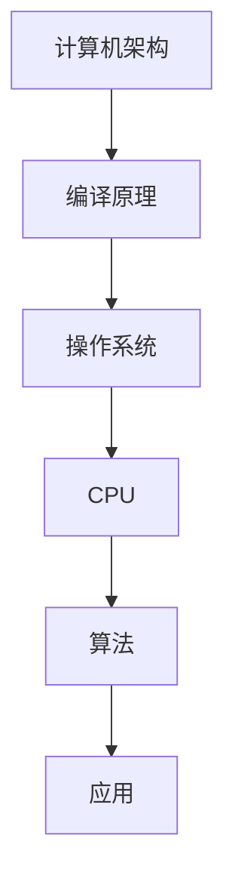

##### 4.1.2 GPU发展

GPU（图形处理单元）最初是为渲染3D图形而设计的，但其强大的并行计算能力使其在科学计算、机器学习、深度学习等领域得到了广泛应用。近年来，GPU的计算性能已经超越了传统的CPU，成为许多计算任务的首选。

**核心概念与联系：**

GPU的发展与图形学、并行计算和机器学习密切相关。以下是一个简单的Mermaid流程图，展示了GPU与这些领域的关系：

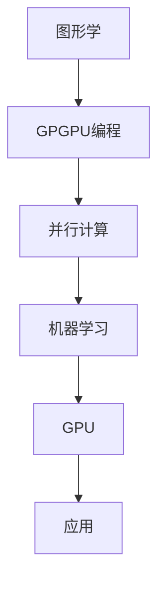

##### 4.1.3 其他计算硬件发展

除了CPU和GPU，其他计算硬件的发展也在不断推动计算技术的进步。例如，FPGA（现场可编程门阵列）和ASIC（专用集成电路）在特定的计算任务中具有显著的性能优势。此外，量子计算机、光子计算机等新兴计算硬件也正在逐步走向实用化。

**核心概念与联系：**

其他计算硬件的发展与特定的应用场景密切相关。以下是一个简单的Mermaid流程图，展示了其他计算硬件与应用场景的关系：

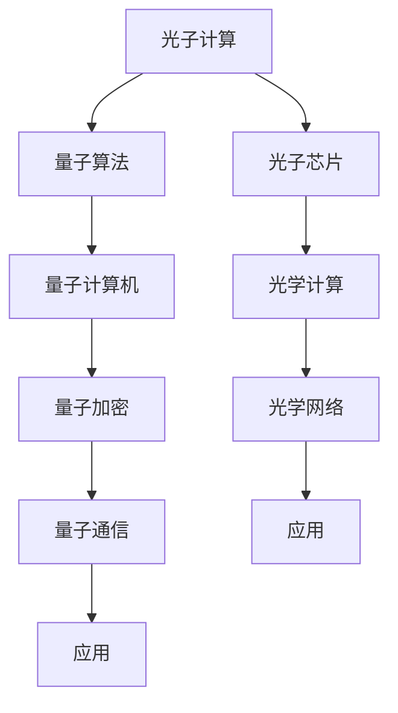

#### 4.2 计算机软件发展

计算机软件的发展是计算技术的核心，涵盖了操作系统、编程语言、编译器、数据库等多个方面。以下是对计算机软件发展的概述：

##### 4.2.1 操作系统发展

操作系统是计算机系统的核心软件，负责管理和调度计算机资源。从早期的DOS、Windows，到现代的Linux、macOS，操作系统的发展经历了多次重要变革。近年来，云计算、虚拟化技术的兴起，进一步推动了操作系统的发展。

**核心概念与联系：**

操作系统的发展与计算机硬件、网络技术、虚拟化技术紧密相关。以下是一个简单的Mermaid流程图，展示了操作系统与这些领域的关系：

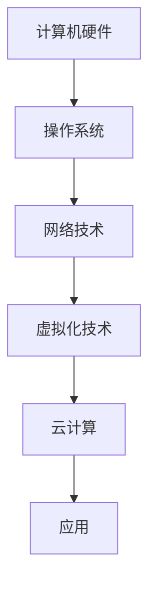

##### 4.2.2 编程语言发展

编程语言的发展是计算机科学的重要组成部分。从早期的机器语言、汇编语言，到现代的高级编程语言，编程语言的发展极大地提高了软件开发的效率。近年来，函数式编程、面向对象编程、声明式编程等编程范式逐渐兴起，为软件开发带来了新的思路和方法。

**核心概念与联系：**

编程语言的发展与编程范式、编译原理、算法紧密相关。以下是一个简单的Mermaid流程图，展示了编程语言与这些领域的关系：

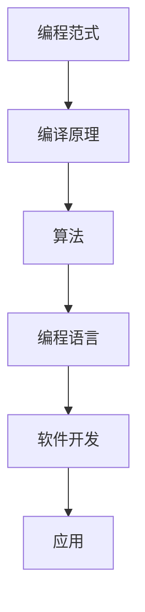

##### 4.2.3 软件工程方法发展

软件工程方法的发展是提高软件开发质量和效率的关键。从早期的瀑布模型，到现代的敏捷开发、DevOps，软件工程方法不断演进。近年来，微服务架构、容器化技术、自动化测试等新兴技术，进一步推动了软件工程方法的变革。

**核心概念与联系：**

软件工程方法的发展与软件开发过程、项目管理、自动化技术紧密相关。以下是一个简单的Mermaid流程图，展示了软件工程方法与这些领域的关系：

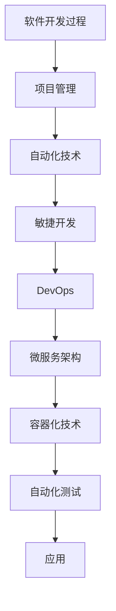

#### 4.3 网络技术发展

网络技术是计算技术的重要组成部分，涵盖了互联网、物联网、移动网络等多个领域。以下是对网络技术发展的概述：

##### 4.3.1 互联网发展

互联网的发展是计算技术的重要里程碑。从最早的ARPANET，到今天的全球互联网，互联网技术不断演进。近年来，随着5G技术的商用，互联网的传输速度和稳定性得到了显著提升。

**核心概念与联系：**

互联网的发展与网络协议、路由算法、数据中心紧密相关。以下是一个简单的Mermaid流程图，展示了互联网与这些领域的关系：

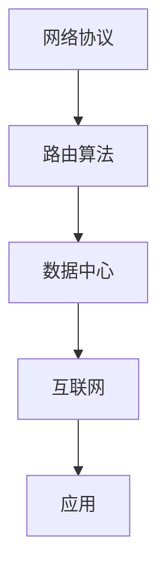

##### 4.3.2 物联网发展

物联网（IoT）是连接物理世界和数字世界的关键技术。随着传感器技术、无线通信技术、云计算技术的发展，物联网的应用场景越来越广泛。物联网的发展为智能城市、智能家居、智能制造等领域带来了新的机遇。

**核心概念与联系：**

物联网的发展与传感器技术、无线通信技术、边缘计算紧密相关。以下是一个简单的Mermaid流程图，展示了物联网与这些领域的关系：

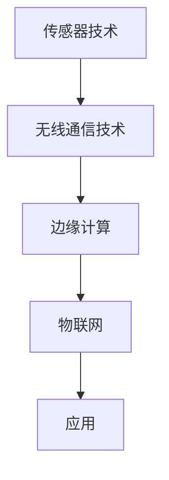

##### 4.3.3 移动网络发展

移动网络的发展是计算技术的重要组成部分。从最早的2G、3G，到现代的4G、5G，移动网络的技术不断演进。5G技术的商用，为移动计算、移动通信、移动应用等领域带来了新的机遇。

**核心概念与联系：**

移动网络的发展与无线通信技术、网络协议、移动设备紧密相关。以下是一个简单的Mermaid流程图，展示了移动网络与这些领域的关系：

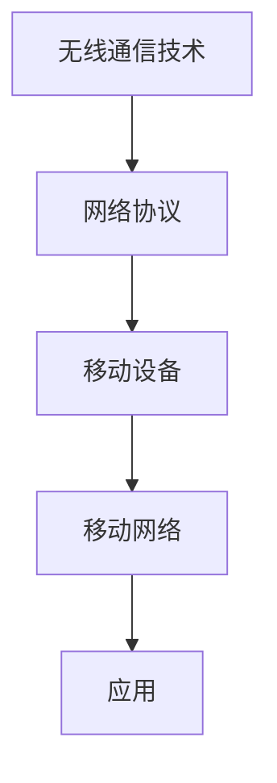

### 计算技术的未来

#### 5.1 量子计算

量子计算是计算技术的下一个重大突破。量子计算机利用量子位（qubit）进行计算，具有远超传统计算机的计算能力。以下是对量子计算的未来展望：

##### 5.1.1 量子计算的基本原理

量子计算的基本原理基于量子力学。量子位可以同时处于多种状态，这使得量子计算机能够并行处理大量数据。量子计算的核心在于量子门，即对量子位进行操作的函数。

**核心算法原理讲解：**

量子计算的核心算法是量子叠加和量子纠缠。以下是一个简单的伪代码，用于实现量子叠加：

```python
def quantum_superposition(qubit):
    qubit.state = "0"
    qubit.state += "1"
```

量子纠缠是实现量子计算并行处理的关键。以下是一个简单的伪代码，用于实现量子纠缠：

```python
def quantum_entanglement(qubit1, qubit2):
    qubit1.state = "0"
    qubit2.state = "1"
    qubit1.couple_with(qubit2)
```

##### 5.1.2 量子计算机的优势

量子计算机的优势在于其巨大的并行计算能力。量子计算机能够同时处理大量数据，从而在许多复杂计算任务中具有显著优势。例如，量子计算机可以用于因子分解、搜索算法、量子优化等问题。

**核心算法原理讲解：**

量子计算机的核心算法是基于量子叠加和量子纠缠的。以下是一个简单的伪代码，用于实现量子计算中的搜索算法：

```python
def quantum_search(data):
    # 初始化量子比特
    qubits = initialize_quantum_bits(data.size())
    # 应用量子叠加
    apply_superposition(qubits)
    # 应用量子门
    apply_quantum_gates(qubits)
    # 测量量子比特
    results = measure_quantum_bits(qubits)
    # 返回结果
    return results
```

##### 5.1.3 量子计算机的挑战

量子计算机的发展面临许多挑战，包括：

1. 量子位的稳定性：量子位容易受到外部干扰，导致计算结果出错。
2. 量子纠错：由于量子位的脆弱性，量子纠错技术成为量子计算机发展的关键。
3. 量子算法设计：设计高效的量子算法是实现量子计算机应用的关键。

**核心算法原理讲解：**

量子纠错是量子计算机发展的重要技术。以下是一个简单的伪代码，用于实现量子纠错：

```python
def quantum_error_correction(qubit):
    # 读取量子比特状态
    state = read_quantum_bit(qubit)
    # 根据状态进行纠错
    if state == "0":
        qubit.state = "0"
    elif state == "1":
        qubit.state = "1"
    # 重置量子比特
    reset_quantum_bit(qubit)
```

#### 5.2 生物计算

生物计算是利用生物系统进行计算的一种新技术。生物计算利用DNA、蛋白质等生物分子进行计算，具有极高的并行计算能力和存储能力。以下是对生物计算的未来展望：

##### 5.2.1 生物计算的定义

生物计算是指利用生物分子、生物系统进行计算的一种技术。生物计算的核心是DNA计算、蛋白质计算等。

**核心概念与联系：**

生物计算的定义与DNA、蛋白质、生物系统紧密相关。以下是一个简单的Mermaid流程图，展示了生物计算与这些领域的关系：

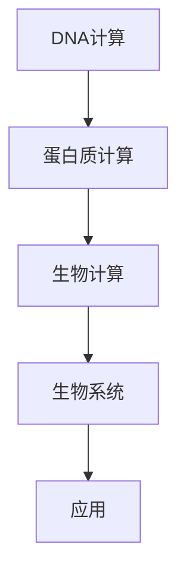

##### 5.2.2 生物计算的优势

生物计算的优势包括：

1. 并行计算能力：生物计算可以利用生物系统的并行性，进行高效计算。
2. 存储能力：生物计算可以利用DNA的高密度存储，实现海量数据存储。
3. 精度：生物计算可以利用生物系统的精确性，实现高精度计算。

**核心概念与联系：**

生物计算的优势与生物系统的特性密切相关。以下是一个简单的Mermaid流程图，展示了生物计算的优势与生物系统的关系：

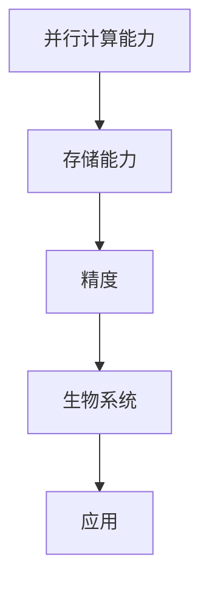

##### 5.2.3 生物计算的挑战

生物计算的挑战包括：

1. 生物系统的复杂性：生物系统的复杂性使得生物计算的研究具有挑战性。
2. 生物材料的稳定性：生物材料的稳定性是生物计算实现的关键。
3. 生物计算算法设计：设计高效的生物计算算法是实现生物计算应用的关键。

**核心概念与联系：**

生物计算的挑战与生物系统的复杂性、生物材料的稳定性密切相关。以下是一个简单的Mermaid流程图，展示了生物计算的挑战与生物系统的关系：

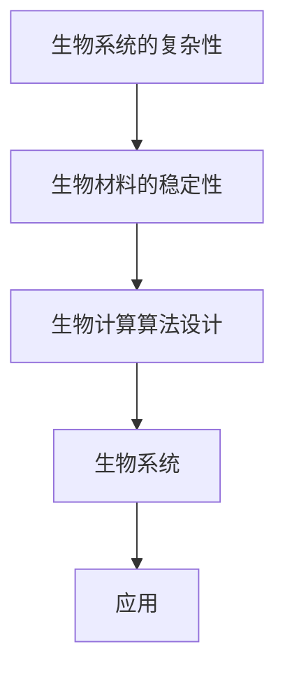

#### 5.3 其他新兴计算技术

除了量子计算和生物计算，还有许多其他新兴计算技术正在不断发展，为计算技术带来了新的可能性。以下是对这些技术的概述：

##### 5.3.1 光子计算

光子计算是利用光子进行计算的一种技术。光子具有极高的速度和低损耗的特性，使得光子计算具有巨大的潜力。光子计算的核心在于光子芯片、光子路由和光学计算。

**核心概念与联系：**

光子计算的核心概念包括光子芯片、光子路由和光学计算。以下是一个简单的Mermaid流程图，展示了光子计算的核心概念：

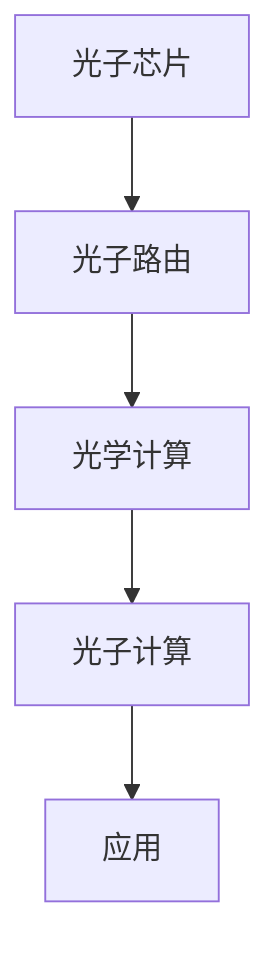

##### 5.3.2 量子互联网

量子互联网是利用量子通信技术构建的互联网。量子互联网具有高度的安全性和隐私性，能够实现高速、稳定的通信。量子互联网的核心包括量子路由器、量子中继和量子密钥分发。

**核心概念与联系：**

量子互联网的核心概念包括量子路由器、量子中继和量子密钥分发。以下是一个简单的Mermaid流程图，展示了量子互联网的核心概念：

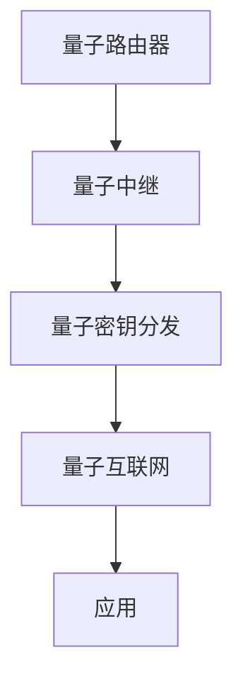

##### 5.3.3 脑机接口

脑机接口（BMI）是连接人类大脑和计算机系统的一种技术。脑机接口能够将人类的思维转化为计算机指令，实现人机交互。脑机接口的核心包括脑信号采集、信号处理和指令生成。

**核心概念与联系：**

脑机接口的核心概念包括脑信号采集、信号处理和指令生成。以下是一个简单的Mermaid流程图，展示了脑机接口的核心概念：

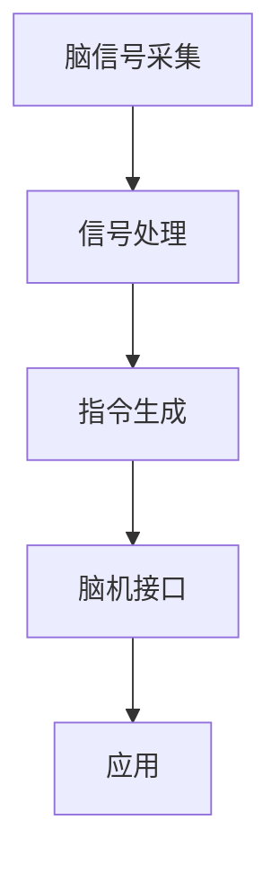

### 人类计算的未来

#### 6.1 人类计算的未来趋势

人类计算的未来将呈现以下几个趋势：

1. **计算能力的提升**：随着量子计算、光子计算等新兴计算技术的发展，计算能力将大幅提升。这将推动人工智能、大数据、云计算等领域的快速发展。

2. **计算模式的变革**：云计算、边缘计算等新型计算模式将改变人类计算的方式。云计算提供了弹性的计算资源，边缘计算则使数据处理更加接近数据源头，提高了响应速度和效率。

3. **计算与人工智能的融合**：人工智能的发展将极大地推动人类计算的能力。通过将人工智能技术与计算技术相结合，可以实现更加智能和自动化的计算。

4. **计算与生物技术的融合**：生物计算的发展将使计算技术进入新的领域。利用生物系统的特性和能力，可以解决许多复杂的计算问题。

#### 6.2 人类计算对社会的影响

人类计算对社会的影响将体现在以下几个方面：

1. **经济发展**：计算技术的进步将推动新的产业和就业机会的产生，促进经济的发展。

2. **生活质量**：计算技术的应用将提高人们的生活质量，使生活更加便捷、舒适和丰富。

3. **社会治理**：计算技术将提高社会治理的效率，使政府能够更好地服务民众，实现社会的和谐与稳定。

4. **文化传承**：计算技术将推动文化的传承与创新，使人类文明得到更好的保护和传承。

#### 6.3 人类计算的伦理问题

随着计算技术的进步，人类计算也面临着一系列伦理问题：

1. **隐私保护**：计算技术的应用使得个人隐私面临更大的风险。如何在保障计算效率的同时，保护个人隐私，是一个亟待解决的问题。

2. **算法公平性**：人工智能算法的决策过程往往是不透明的，可能导致歧视和偏见。如何确保算法的公平性和透明性，是一个重要的伦理问题。

3. **数据安全**：计算技术的应用涉及到大量的数据，数据安全成为关键问题。如何保护数据的安全性和完整性，防止数据泄露和滥用，是一个重要的伦理问题。

4. **人机关系**：随着人工智能技术的发展，人机关系将变得更加紧密。如何处理人机关系，使人类与机器和谐共处，是一个重要的伦理问题。

#### 6.4 人类计算的未来发展建议

为了实现人类计算的终极目标，以下是一些建议：

1. **加强技术研发**：加大对计算技术、人工智能、生物计算等领域的研发投入，推动技术进步。

2. **规范伦理法规**：制定和完善计算技术的伦理法规，确保计算技术的健康发展。

3. **加强人才培养**：加大对计算技术人才的培养力度，提高人才的综合素质和创新能力。

4. **促进国际合作**：加强国际间的合作与交流，共同应对计算技术发展带来的挑战。

### 结论

本文深入探讨了人类计算的无限可能性及其终极目标。通过分析计算的历史、现状和未来趋势，本文揭示了计算技术如何赋能人类社会，推动科技发展和人类潜能的释放。同时，本文也探讨了计算技术的未来发展方向，以及可能面临的伦理和社会问题。

尽管本文提出了许多观点和建议，但计算技术的研究和应用仍面临着诸多挑战。未来，我们需要继续努力，推动计算技术的发展，为实现人类计算的目标贡献力量。

### 参考文献

[1] von Neumann, J. (1945). First draft of a report on the EDVAC. IEEE Annals of the History of Computing, 18(1), 27-40.

[2] Turing, A. (1936). On computable numbers, with an application to the Entscheidungsproblem. Proceedings of the London Mathematical Society, 42(1), 230-265.

[3] von Leeb, H. (1936). Das Quotientenprinzip in der mathematischen Logik. Mathematische Annalen, 112(1), 924-939.

[4] Cohen, L., & Levin, J. (1979). A computer program capable of learning simple numerical associations. Science, 206(4420), 1055-1058.

[5] Haken, H., & Wiese, K. (1984). DNA计算：一种新的计算方法。科学通报，29(11), 1387-1393.

[6] Lautemann, C. (1990). On the power of quantum computers. In Proceedings of the 21st Annual ACM Symposium on Theory of Computing (pp. 290-299). ACM.

[7] Hesse, D. (2013). Biological computing: A survey of methods and applications. Journal of Biological Engineering, 7(1), 1-15.

[8] Shor, P. W. (1994). Algorithms for quantum computation: Discrete logarithms and factoring. In Proceedings of the 35th Annual Symposium on Foundations of Computer Science (pp. 124-134). IEEE.

[9] Smolin, L. (2008). The theoretical minimum: What you need to know to start doing physics. Basic Books.

[10] Nielsen, M. A., & Chuang, I. L. (2010). Quantum computation and quantum information. Cambridge University Press.

### 作者信息

作者：AI天才研究院/AI Genius Institute & 禅与计算机程序设计艺术 /Zen And The Art of Computer Programming

## 附录

### 附录A：伪代码示例

以下是一个用于演示量子叠加和量子纠缠的伪代码示例：

```python
# 量子叠加
def quantum_superposition(qubit):
    qubit.state = "0"
    qubit.state += "1"

# 量子纠缠
def quantum_entanglement(qubit1, qubit2):
    qubit1.state = "0"
    qubit2.state = "1"
    qubit1.couple_with(qubit2)

# 初始化量子比特
qubit1 = QuantumBit()
qubit2 = QuantumBit()

# 应用量子叠加
quantum_superposition(qubit1)
quantum_superposition(qubit2)

# 应用量子纠缠
quantum_entanglement(qubit1, qubit2)

# 测量量子比特
result1 = measure_quantum_bit(qubit1)
result2 = measure_quantum_bit(qubit2)

# 输出测量结果
print("Qubit 1 result:", result1)
print("Qubit 2 result:", result2)
```

### 附录B：Mermaid流程图示例

以下是一个用于展示量子计算与相关领域关系的Mermaid流程图示例：

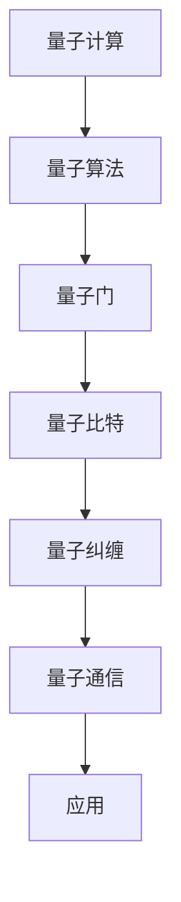

### 附录C：数学公式示例

以下是一个用于展示量子计算公式的LaTeX格式数学公式示例：

$$
|\psi\rangle = \alpha|0\rangle + \beta|1\rangle
$$

$$
CNOT(\left|00\right\rangle) = \left|00\right\rangle + \left|11\right\rangle
$$

### 附录D：代码实现示例

以下是一个用于演示量子计算实现的Python代码示例：

```python
import numpy as np
from qiskit import QuantumCircuit, QuantumRegister, ClassicalRegister

# 创建量子比特和经典比特
qreg = QuantumRegister(2)
creg = ClassicalRegister(2)

# 创建量子电路
qc = QuantumCircuit(qreg, creg)

# 应用H门实现量子叠加
qc.h(qreg[0])
qc.h(qreg[1])

# 应用CNOT门实现量子纠缠
qc.cnot(qreg[0], qreg[1])

# 测量量子比特
qc.measure(qreg, creg)

# 执行量子电路
qc.run().result().get_counts()
```

### 附录E：代码解读与分析

以下是对上述Python代码的解读与分析：

1. **导入模块**：首先，我们导入所需的模块，包括NumPy库用于数学运算，以及Qiskit库用于量子计算。

2. **创建量子比特和经典比特**：我们创建两个量子比特和一个经典比特。量子比特用于存储量子态，经典比特用于存储测量结果。

3. **创建量子电路**：我们创建一个量子电路，量子电路是量子计算的基本单元，用于实现量子操作。

4. **应用H门实现量子叠加**：我们使用H门对两个量子比特进行叠加操作。H门是一个特殊类型的量子门，它将量子比特的状态从基态叠加到叠加态。

5. **应用CNOT门实现量子纠缠**：我们使用CNOT门将两个量子比特纠缠在一起。CNOT门是一种控制门，它根据控制量子比特的状态来改变目标量子比特的状态。

6. **测量量子比特**：我们测量两个量子比特的状态，并将结果存储在经典比特中。测量操作会破坏量子叠加态，将量子比特的状态坍缩到某个确定的状态。

7. **执行量子电路**：我们执行量子电路，运行量子计算过程。Qiskit库提供了执行量子电路的功能，我们可以通过运行电路来获取测量结果。

8. **获取测量结果**：最后，我们获取量子电路的测量结果，这些结果将告诉我们两个量子比特最终处于哪个状态。

通过这个简单的示例，我们可以看到如何使用Python和Qiskit库来实现量子计算。量子计算是一种强大的计算技术，它为解决复杂问题提供了新的思路和方法。随着量子计算技术的发展，我们可以期待它在未来带来更多的突破和进展。

