                 

### 《隐私与安全：保护人类计算中的敏感信息》

隐私与安全，这是当今数字化时代的核心议题。随着互联网的普及和大数据技术的发展，我们的个人信息在不知不觉中被广泛收集和利用。这些数据既为我们带来了便捷，同时也带来了前所未有的隐私威胁。因此，如何有效地保护人类计算中的敏感信息，成为了一个亟待解决的重要问题。

本文将从隐私与安全的定义与重要性、隐私保护技术、隐私侵犯手段与防范措施、安全政策与实践、隐私与安全的未来展望等多个角度，深入探讨隐私与安全这一复杂而重要的议题。

## 摘要

本文旨在全面探讨隐私与安全在保护人类计算中的敏感信息方面的重要性。首先，我们将回顾隐私与安全的定义及其在当今数字化时代的重要性。接着，我们将详细介绍隐私保护技术，包括加密技术、隐私保护算法和隐私保护系统设计。然后，我们将分析隐私侵犯的手段和案例分析，并探讨隐私侵犯的防范措施。接下来，我们将讨论安全政策与实践，包括安全政策的制定与评估，以及安全实践案例。最后，我们将展望隐私与安全的未来发展趋势，面临的挑战以及未来的发展方向。

## 目录大纲

### 第一部分：隐私与安全的概述

#### 1.1 隐私与安全的重要性

##### 1.1.1 隐私的定义与意义

##### 1.1.2 安全的定义与意义

#### 1.2 隐私与安全的挑战

##### 1.2.1 信息泄露的风险

##### 1.2.2 法律法规对隐私与安全的要求

##### 1.2.3 技术进步对隐私与安全的挑战

#### 1.3 隐私与安全的现状

##### 1.3.1 全球隐私与安全法规的演进

##### 1.3.2 企业在隐私与安全方面的投入

##### 1.3.3 社会对于隐私与安全的态度

### 第二部分：隐私保护技术

#### 2.1 加密技术

##### 2.1.1 对称加密算法

###### 2.1.1.1 AES算法

###### 2.1.1.2 DES算法

##### 2.1.2 非对称加密算法

###### 2.1.2.1 RSA算法

###### 2.1.2.2 ECC算法

##### 2.1.3 杂凑函数

###### 2.1.3.1 SHA算法

###### 2.1.3.2 MD5算法

#### 2.2 隐私保护算法

##### 2.2.1 差分隐私

###### 2.2.1.1 差分隐私的定义

###### 2.2.1.2 差分隐私的数学模型

###### 2.2.1.3 差分隐私的应用场景

##### 2.2.2 匿名通信

###### 2.2.2.1 onion路由

###### 2.2.2.2 Tor网络

##### 2.2.3 隐写术

###### 2.2.3.1 隐写术的定义

###### 2.2.3.2 隐写术的分类

###### 2.2.3.3 隐写术的应用实例

#### 2.3 隐私保护系统设计

##### 2.3.1 隐私计算框架

###### 2.3.1.1 同态加密

###### 2.3.1.2 安全多方计算

###### 2.3.1.3 联邦学习

##### 2.3.2 隐私保护数据库

###### 2.3.2.1 隐私保护SQL

###### 2.3.2.2 隐私保护NoSQL

### 第三部分：隐私侵犯分析

#### 3.1 隐私侵犯的手段

##### 3.1.1 数据挖掘

###### 3.1.1.1 机器学习模型滥用

###### 3.1.1.2 大数据关联分析

##### 3.1.2 网络监听

###### 3.1.2.1 无线网络监听

###### 3.1.2.2 有线网络监听

##### 3.1.3 恶意软件攻击

###### 3.1.3.1 木马攻击

###### 3.1.3.2 网络钓鱼攻击

#### 3.2 隐私侵犯的案例分析

##### 3.2.1 谷歌用户数据泄露事件

##### 3.2.2 Facebook隐私问题事件

##### 3.2.3 LinkedIn用户数据泄露事件

#### 3.3 隐私侵犯的防范措施

##### 3.3.1 隐私保护政策制定

###### 3.3.1.1 隐私保护法律法规

###### 3.3.1.2 隐私保护行业规范

##### 3.3.2 技术措施

###### 3.3.2.1 加密技术的应用

###### 3.3.2.2 隐私保护算法的应用

##### 3.3.3 用户教育

###### 3.3.3.1 用户隐私意识培养

###### 3.3.3.2 隐私保护知识普及

### 第四部分：安全政策与实践

#### 4.1 安全政策制定

##### 4.1.1 安全策略的设计

###### 4.1.1.1 安全目标的确定

###### 4.1.1.2 安全措施的制定

##### 4.1.2 安全审计与评估

###### 4.1.2.1 安全审计的流程

###### 4.1.2.2 安全评估的方法

#### 4.2 安全实践案例

##### 4.2.1 企业安全文化建设

##### 4.2.2 安全事件响应机制

##### 4.2.3 安全培训与演练

#### 4.3 安全技术的发展趋势

##### 4.3.1 区块链在隐私保护中的应用

##### 4.3.2 人工智能在隐私侵犯与防范中的应用

##### 4.3.3 安全技术的发展趋势与挑战

### 第五部分：隐私与安全的未来展望

#### 5.1 隐私与安全的发展趋势

##### 5.1.1 隐私保护技术的发展

###### 5.1.1.1 新型加密算法的研究

###### 5.1.1.2 隐私保护技术的标准化

##### 5.1.2 安全技术的发展

###### 5.1.2.1 安全防护技术的创新

###### 5.1.2.2 安全攻防技术的演变

#### 5.2 隐私与安全的挑战

##### 5.2.1 技术层面的挑战

###### 5.2.1.1 加密算法的安全性问题

###### 5.2.1.2 隐私保护算法的性能问题

##### 5.2.2 法律法规的挑战

###### 5.2.2.1 跨国隐私保护法律法规的差异

###### 5.2.2.2 法律法规的执行与监管难题

#### 5.3 隐私与安全的未来方向

##### 5.3.1 隐私保护与数据利用的平衡

##### 5.3.2 安全技术与隐私保护的结合

##### 5.3.3 隐私与安全的可持续发展

### 附录

#### 附录 A：隐私与安全资源

##### 附录 A.1 安全工具与软件

##### 附录 A.2 安全法规与政策

##### 附录 A.3 安全研究论文与报告

#### 附录 B：Mermaid 流程图

##### 附录 B.1 隐私保护技术流程图

##### 附录 B.2 安全政策制定流程图

##### 附录 B.3 安全事件响应流程图

#### 附录 C：核心算法原理与伪代码

##### 附录 C.1 对称加密算法（AES、DES）

##### 附录 C.2 非对称加密算法（RSA、ECC）

##### 附录 C.3 差分隐私算法

##### 附录 C.4 安全多方计算算法

##### 附录 C.5 联邦学习算法

#### 附录 D：数学模型与公式

##### 附录 D.1 对称加密算法的安全性分析

##### 附录 D.2 非对称加密算法的安全性分析

##### 附录 D.3 差分隐私的数学模型

##### 附录 D.4 安全多方计算的数学模型

#### 附录 E：项目实战案例

##### 附录 E.1 加密技术在数据传输中的应用

##### 附录 E.2 差分隐私技术在数据分析中的应用

##### 附录 E.3 安全多方计算在金融风控中的应用

##### 附录 E.4 联邦学习在医疗数据共享中的应用

## 1.1 隐私与安全的重要性

### 1.1.1 隐私的定义与意义

隐私，指的是个人或团体对于自己信息的一种控制权，包括信息的收集、存储、处理和分发等环节。在数字化时代，隐私不仅仅是一种道德和伦理问题，更涉及到法律和国家安全等多个层面。

隐私的保护意义主要体现在以下几个方面：

1. **个人权益保护**：隐私保护是保障个人基本权利的重要一环。未经授权的信息收集和使用，会侵犯个人的隐私权，造成心理和生理上的伤害。

2. **信息安全**：隐私信息的安全是信息安全的重要组成部分。一旦隐私信息被泄露，可能会引发身份盗窃、财产损失等安全问题。

3. **社会稳定**：隐私保护有助于维护社会的稳定与和谐。信息泄露和不正当的信息使用，可能导致社会矛盾和冲突的加剧。

4. **经济发展**：隐私保护有助于建立健康的数字经济环境。在保护隐私的前提下，合理利用数据，可以推动数字经济的发展。

### 1.1.2 安全的定义与意义

安全，指的是保护信息、资产和资源免受未经授权的访问、使用、披露、破坏、修改或破坏的能力。安全不仅仅是一种技术问题，更是一种管理问题，涉及到策略、流程、技术和人的因素。

安全的意义主要体现在以下几个方面：

1. **信息保护**：安全的首要目标是保护信息的机密性、完整性和可用性，防止信息泄露、篡改和丢失。

2. **资产保护**：安全还涉及到对组织资产的保护，包括硬件、软件、数据等，确保其在业务运作中的可用性和完整性。

3. **业务连续性**：安全措施有助于确保业务连续性，防止因安全事件导致的业务中断，保障组织运营的稳定性。

4. **合规要求**：随着各种法律法规的出台，安全也成为组织必须遵守的合规要求，如GDPR、CCPA等。

### 1.1.3 隐私与安全的紧密联系

隐私与安全是相辅相成的，二者密不可分。隐私是安全的基石，没有隐私保护，安全也无从谈起。而安全则是实现隐私保护的重要保障，只有确保信息的安全，才能有效地保护隐私。

在数字化时代，隐私与安全的挑战更加严峻。一方面，技术的快速发展带来了信息收集和处理能力的极大提升，使得隐私信息更加容易被获取。另一方面，网络攻击、数据泄露等安全事件频发，使得隐私保护面临巨大压力。因此，如何平衡隐私保护与数据利用，成为了一个亟待解决的重要问题。

### 1.1.4 隐私与安全的重要性总结

总之，隐私与安全在数字化时代的重要性不言而喻。隐私保护不仅是个人权利的保障，也是社会稳定和经济发展的基础。而安全则是实现隐私保护的重要手段，只有确保信息的安全，才能有效地保护隐私。在未来的发展中，我们需要不断探索新的隐私保护技术，完善安全政策，提高公众的隐私意识，共同构建一个安全、健康的数字化社会。

## 1.2 隐私与安全的挑战

### 1.2.1 信息泄露的风险

信息泄露的风险是隐私与安全面临的最大挑战之一。随着互联网的普及和大数据技术的发展，我们的个人信息被广泛收集和存储在各种系统和平台上。这些数据一旦被不法分子窃取或泄露，可能会对个人和社会造成严重的影响。

#### 1.2.1.1 数据泄露的原因

1. **系统漏洞**：许多系统和应用程序存在漏洞，使得攻击者可以通过这些漏洞获取敏感信息。

2. **人为因素**：员工失误、不当操作或者泄露密码等，都可能成为信息泄露的渠道。

3. **恶意攻击**：黑客攻击、网络钓鱼等恶意攻击手段，是导致信息泄露的主要原因之一。

#### 1.2.1.2 数据泄露的后果

1. **财产损失**：身份盗窃、金融欺诈等，可能会导致个人和企业的财产损失。

2. **隐私侵犯**：个人信息泄露，可能会导致个人隐私受到侵犯，影响个人生活。

3. **社会信任危机**：频繁的数据泄露事件，会破坏公众对数字平台的信任，影响社会稳定。

### 1.2.2 法律法规对隐私与安全的要求

随着信息技术的快速发展，世界各国对隐私与安全的要求也在不断提高，相关的法律法规也在不断出台和完善。

#### 1.2.2.1 全球隐私与安全法规的演进

1. **欧盟通用数据保护条例（GDPR）**：2018年5月25日，欧盟正式实施GDPR，对数据收集、存储、处理和传输等环节提出了严格的要求。

2. **美国加州消费者隐私法案（CCPA）**：2020年1月1日，CCPA正式生效，旨在保护加州居民的隐私权。

3. **中国网络安全法**：2017年6月1日，中国网络安全法正式实施，对网络运营者的数据保护义务进行了规定。

#### 1.2.2.2 法律法规的主要内容

1. **用户知情权**：法律法规要求，在收集和使用用户数据时，必须告知用户数据收集的目的、方式和范围。

2. **用户同意权**：用户有权决定是否同意数据收集和使用，并有权随时撤回同意。

3. **数据安全保护**：法律法规要求，网络运营者必须采取必要的技术和管理措施，确保用户数据的安全。

4. **数据泄露通知**：一旦发生数据泄露，网络运营者必须在规定时间内通知受影响的用户。

### 1.2.3 技术进步对隐私与安全的挑战

技术进步为隐私与安全带来了新的机遇，同时也带来了新的挑战。

#### 1.2.3.1 新技术对隐私的影响

1. **大数据分析**：大数据技术的发展，使得企业可以更深入地了解用户行为，但同时也增加了隐私泄露的风险。

2. **人工智能**：人工智能技术在信息安全领域具有巨大的潜力，但同时也可能被用于隐私侵犯。

3. **物联网**：物联网的普及，使得更多的设备连接到互联网，同时也增加了数据泄露的风险。

#### 1.2.3.2 技术进步带来的挑战

1. **数据安全**：随着数据量的增加，保护数据安全成为一个巨大的挑战。

2. **隐私保护技术**：需要不断研究和发展新的隐私保护技术，以应对不断变化的技术环境。

3. **法律法规适应性**：法律法规需要不断更新和完善，以适应技术进步带来的新挑战。

### 1.2.4 隐私与安全的现状

在全球范围内，隐私与安全的现状呈现出一定的差异。

#### 1.2.4.1 全球隐私与安全法规的演进

1. **发达国家**：发达国家在隐私与安全方面投入较大，相关法律法规较为完善，如欧盟的GDPR和美国加州的CCPA。

2. **发展中国家**：发展中国家在隐私与安全方面投入相对较少，相关法律法规也在逐步完善中。

#### 1.2.4.2 企业在隐私与安全方面的投入

1. **发达国家企业**：发达国家企业在隐私与安全方面的投入较大，重视数据保护和信息安全。

2. **发展中国家企业**：发展中国家企业在隐私与安全方面的投入相对较少，存在一定的安全隐患。

#### 1.2.4.3 社会对于隐私与安全的态度

1. **发达国家**：发达国家公众对隐私与安全较为关注，对侵犯隐私的行为持强烈反对态度。

2. **发展中国家**：发展中国家公众对隐私与安全关注度较低，但对侵犯隐私的行为同样表示反对。

### 1.2.5 隐私与安全的未来挑战

随着技术的不断进步，隐私与安全将面临更多的挑战。

#### 1.2.5.1 技术层面的挑战

1. **数据安全**：随着数据量的增加，保护数据安全将变得越来越困难。

2. **隐私保护技术**：需要不断研究和发展新的隐私保护技术，以应对不断变化的技术环境。

3. **法律法规适应性**：法律法规需要不断更新和完善，以适应技术进步带来的新挑战。

#### 1.2.5.2 社会层面的挑战

1. **公众隐私意识**：需要提高公众的隐私意识，使其能够更好地保护自己的隐私。

2. **企业责任**：企业需要承担更大的隐私保护责任，确保用户数据的安全。

3. **国际合作**：隐私与安全是全球性问题，需要各国政府、企业和公众的共同努力。

总之，隐私与安全在数字化时代的重要性日益凸显，我们需要不断应对各种挑战，共同构建一个安全、健康的数字化社会。

## 1.3 隐私与安全的现状

### 1.3.1 全球隐私与安全法规的演进

在全球范围内，隐私与安全法规的演进是一个持续的过程。不同国家和地区根据自身的国情、技术发展水平以及社会需求，制定了相应的法律法规，以保护公民的隐私权和数据安全。

#### 1.3.1.1 欧洲地区

欧洲是全球隐私与安全法规最为健全和严格的地区之一。最具代表性的法规是《通用数据保护条例》（General Data Protection Regulation，GDPR），它于2018年5月25日正式生效。GDPR对数据收集、存储、处理和传输等环节提出了严格的要求，包括数据主体的知情权、同意权、数据访问权、数据可携带权等。GDPR的实施，对全球范围内的数据保护产生了深远的影响。

此外，欧洲还有《电子隐私指令》（Directive on Privacy and Electronic Communications）等法规，对通信隐私和数据安全进行了详细规定。

#### 1.3.1.2 北美地区

在北美，以美国和加拿大为代表的地区，隐私与安全法规也日趋完善。美国加利福尼亚州于2020年1月1日正式实施了《加州消费者隐私法案》（California Consumer Privacy Act，CCPA）。CCPA旨在保护加州居民的隐私权，要求企业在收集、使用和共享消费者数据时必须透明，并赋予消费者对数据的控制权。

联邦层面，美国有《健康信息技术促进经济和临床健康法案》（Health Information Technology for Economic and Clinical Health Act，HITECH Act）、《儿童在线隐私保护法案》（Children's Online Privacy Protection Act，COPPA）等法规，对医疗数据和个人信息的保护提出了具体要求。

加拿大则有《个人信息保护与电子文档法案》（Personal Information Protection and Electronic Documents Act，PIPEDA），它规定了个人信息的收集、使用、披露和存储等要求。

#### 1.3.1.3 亚洲地区

亚洲地区在隐私与安全法规方面也取得了显著进展。中国于2021年11月1日正式实施了《个人信息保护法》（Personal Information Protection Law，PIPL），该法与欧盟的GDPR类似，对个人信息处理活动提出了全面的要求，包括合法性、正当性、透明性和个人权利保护等。

此外，中国还有《网络安全法》和《数据安全法》等法律法规，对数据安全和个人信息保护进行了详细规定。

日本则有《个人信息保护法》（Personal Information Protection Law），它规定了个人信息处理的基本原则和具体措施。

#### 1.3.1.4 其他地区

其他地区如澳大利亚、巴西等也有相应的隐私与安全法规。例如，澳大利亚有《隐私法》（Privacy Act 1988），巴西有《通用数据保护法》（General Data Protection Law，LGPD）。

总的来说，全球隐私与安全法规的演进是一个持续和完善的过程。随着技术进步和社会需求的不断变化，各国将继续修订和完善现有的法律法规，以应对新的挑战，保障公民的隐私权和数据安全。

### 1.3.2 企业在隐私与安全方面的投入

企业在隐私与安全方面的投入是保护用户数据和信息安全的重要保障。随着隐私与安全法规的日益严格，以及数据泄露事件频繁发生，企业越来越重视隐私与安全方面的投入。

#### 1.3.2.1 投入形式

1. **技术投入**：企业不断投资于新的隐私保护技术和安全工具，如加密技术、数据脱敏、安全多方计算等，以提高数据保护能力。

2. **人才投入**：企业招聘和培养专业的隐私与安全人才，建立专业的安全团队，确保隐私与安全策略的有效实施。

3. **培训投入**：企业定期组织员工进行隐私与安全培训，提高员工的隐私保护意识和安全技能。

4. **合规投入**：企业投入大量资源进行合规审查和认证，确保遵守相关法律法规的要求。

#### 1.3.2.2 投入效果

1. **数据保护能力提升**：通过技术投入和人才培训，企业能够更好地保护用户数据，降低数据泄露风险。

2. **合规水平提高**：企业的合规投入使其能够更好地满足法律法规的要求，降低法律风险。

3. **品牌形象提升**：企业对隐私与安全的重视和投入，有助于提升公众对企业的信任和认可，增强品牌形象。

#### 1.3.2.3 案例分析

1. **苹果公司**：苹果公司一直以用户隐私保护著称，其产品和服务在隐私保护方面投入巨大。例如，苹果的“隐私营养标签”功能，使得用户可以清楚地了解应用程序收集和使用的数据类型。

2. **谷歌公司**：谷歌在其产品和服务中广泛应用加密技术，如HTTPS、TLS等，以确保用户数据的安全。此外，谷歌还定期进行安全审计和漏洞修补，提高数据保护能力。

3. **亚马逊公司**：亚马逊在隐私与安全方面的投入主要表现在数据保护和合规性上。亚马逊在多个国家和地区建立了合规团队，确保其业务符合当地法律法规的要求。

总之，企业在隐私与安全方面的投入不仅有助于保护用户数据和信息安全，还能提升企业的合规水平和品牌形象，具有重要的现实意义。

### 1.3.3 社会对于隐私与安全的态度

社会对于隐私与安全的态度在数字化时代发生了显著变化。随着信息技术的迅速发展，人们对隐私与安全的重视程度不断提高，对侵犯隐私的行为表示强烈的反对。

#### 1.3.3.1 公众隐私意识的提升

1. **隐私权的认知**：随着公众对隐私权认知的提升，越来越多的人开始意识到保护个人信息的重要性。人们更加关注个人信息被如何收集、使用和共享，对隐私保护的诉求越来越高。

2. **隐私泄露事件的警觉**：频繁发生的数据泄露事件，使得公众对隐私泄露的风险有了更直观的认识，进一步提高了公众的隐私意识。

3. **隐私保护的需求**：在日常生活中，人们越来越倾向于使用那些能够更好地保护隐私的产品和服务，如加密通信工具、隐私保护浏览器等。

#### 1.3.3.2 社会对于隐私侵犯行为的反对

1. **反对滥用行为**：公众普遍反对企业和组织未经授权收集和使用个人信息的行为，认为这是对个人隐私的侵犯。

2. **呼吁加强监管**：公众对隐私保护法律的实施和监管提出了更高的要求，呼吁政府和企业加大隐私保护力度，确保法律法规能够得到有效执行。

3. **支持隐私保护技术**：公众对新型隐私保护技术持积极态度，如差分隐私、匿名通信等，认为这些技术有助于更好地保护个人隐私。

#### 1.3.3.3 社会对于隐私与安全的期望

1. **隐私保护与数据利用的平衡**：公众希望在保护隐私的前提下，能够合理利用数据，推动社会和经济发展。

2. **透明和可控制的隐私保护**：公众期望隐私保护机制能够透明、公平，并赋予用户对个人数据的控制权。

3. **安全的数字化环境**：公众期望在数字化时代，能够享受到安全、可靠的服务，免受隐私侵犯和数据泄露的困扰。

总之，社会对于隐私与安全的态度日益成熟和理性，公众对隐私保护的诉求不断提高，这对企业和政府提出了更高的要求。只有充分认识到隐私与安全的重要性，采取有效的措施，才能构建一个安全、健康的数字化社会。

### 2.1 加密技术

加密技术是保护隐私和安全的重要手段之一。它通过将明文数据转换为密文，防止未经授权的访问，从而确保信息的机密性。加密技术可以分为对称加密、非对称加密和杂凑函数三类。以下是对各类加密技术及其主要应用的详细解析。

#### 2.1.1 对称加密算法

对称加密算法是一种加密和解密使用相同密钥的加密方法。加密速度快，但密钥管理复杂。

##### 2.1.1.1 AES算法

**AES（Advanced Encryption Standard）** 是一种广泛使用的对称加密算法，由美国国家标准与技术研究院（NIST）于2001年发布。AES支持128位、192位和256位密钥长度，具有较高的安全性。

**工作原理**：
AES 算法主要包括以下步骤：
1. **初始化**：将明文数据和密钥转换为特定的格式。
2. **轮加密**：对数据进行一系列的替换、置换和混淆操作。
3. **密钥扩展**：生成多个子密钥，用于每轮加密。

**伪代码**：
```plaintext
function AES_Encrypt(plaintext, key):
    state = Initialize(plaintext, key)
    for i = 1 to 10:  # 轮数可变
        state = AddRoundKey(state, SubKey[i])
        state = SubBytes(state)
        state = ShiftRows(state)
        state = MixColumns(state)
    state = AddRoundKey(state, SubKey[11])
    return state
```

##### 2.1.1.2 DES算法

**DES（Data Encryption Standard）** 是另一种对称加密算法，由美国国家标准局于1977年发布。DES 使用56位密钥，但由于密钥长度较短，已不推荐使用。

**工作原理**：
DES 算法主要包括以下步骤：
1. **初始置换**：将明文进行初始置换。
2. **16轮加密**：每轮包括置换、替换和置换。
3. **最终置换**：对加密后的数据进行最终置换。

**伪代码**：
```plaintext
function DES_Encrypt(plaintext, key):
    L0, R0 = InitialPermutation(plaintext)
    for i = 1 to 16:
        R, L = L0, R0
        R0 = Encrypt(R, SubKey[i])
        L0 = Encrypt(L, SubKey[16-i])
    ciphertext = FinalPermutation(L0, R0)
    return ciphertext
```

#### 2.1.2 非对称加密算法

非对称加密算法使用一对密钥，一个用于加密，另一个用于解密。它解决了对称加密中的密钥分发问题。

##### 2.1.2.1 RSA算法

**RSA（Rivest-Shamir-Adleman）** 是一种广泛使用的非对称加密算法，由Ron Rivest、Adi Shamir和Leonard Adleman于1977年提出。RSA 使用大素数生成密钥，具有较高的安全性。

**工作原理**：
RSA 算法主要包括以下步骤：
1. **密钥生成**：选择两个大素数，计算它们的乘积和欧拉函数。
2. **加密**：使用公钥和明文进行加密。
3. **解密**：使用私钥和密文进行解密。

**伪代码**：
```plaintext
function RSA_Encrypt(plaintext, publicKey):
    ciphertext = (plaintext ** publicKey[0]) % publicKey[1]
    return ciphertext

function RSA_Decrypt(ciphertext, privateKey):
    plaintext = (ciphertext ** privateKey[0]) % privateKey[1]
    return plaintext
```

##### 2.1.2.2 ECC算法

**ECC（Elliptic Curve Cryptography）** 是一种基于椭圆曲线数学的非对称加密算法，具有较高的安全性和效率。

**工作原理**：
ECC 算法主要包括以下步骤：
1. **密钥生成**：选择一个椭圆曲线和点，计算公钥。
2. **加密**：使用公钥和明文进行加密。
3. **解密**：使用私钥和密文进行解密。

**伪代码**：
```plaintext
function ECC_Encrypt(plaintext, publicKey, curve):
    ciphertext = ScalarMultiply(plaintext, publicKey, curve)
    return ciphertext

function ECC_Decrypt(ciphertext, privateKey, curve):
    plaintext = ScalarMultiply(ciphertext, privateKey, curve)
    return plaintext
```

#### 2.1.3 杂凑函数

杂凑函数（Hash Function）是一种将输入数据映射为固定长度输出的算法。它用于数据完整性验证和数字签名。

##### 2.1.3.1 SHA算法

**SHA（Secure Hash Algorithm）** 是一系列广泛使用的杂凑函数，包括SHA-1、SHA-2和SHA-3。SHA-2包括SHA-256和SHA-512，是当前最常用的杂凑函数。

**工作原理**：
SHA-256 和 SHA-512 算法主要包括以下步骤：
1. **初始化**：初始化哈希值。
2. **处理输入**：将输入数据分割成块，对每个块进行处理。
3. **输出哈希值**：将处理结果合并，输出固定长度的哈希值。

**伪代码**：
```plaintext
function SHA256(message):
    hash = Initialize()
    for block in message:
        hash = ProcessBlock(hash, block)
    final_hash = Finalize(hash)
    return final_hash

function SHA512(message):
    hash = Initialize()
    for block in message:
        hash = ProcessBlock(hash, block)
    final_hash = Finalize(hash)
    return final_hash
```

##### 2.1.3.2 MD5算法

**MD5（Message-Digest Algorithm 5）** 是一种较早的杂凑函数，虽然安全性较低，但在一些应用场景中仍被使用。

**工作原理**：
MD5 算法主要包括以下步骤：
1. **初始化**：初始化128位的哈希值。
2. **处理输入**：将输入数据分割成512位的块，对每个块进行64位的循环位移和逻辑操作。
3. **输出哈希值**：将处理结果合并，输出128位的哈希值。

**伪代码**：
```plaintext
function MD5(message):
    hash = Initialize()
    for block in message:
        hash = ProcessBlock(hash, block)
    final_hash = Finalize(hash)
    return final_hash
```

总的来说，加密技术为保护隐私和安全提供了有效的手段。通过对不同加密算法的深入理解，我们可以更好地应对数字化时代带来的隐私和安全挑战。

### 2.2 隐私保护算法

隐私保护算法是在处理和分析数据时，确保个人隐私不被泄露的一系列技术手段。这些算法包括差分隐私、匿名通信和隐写术等，它们在不同场景下发挥着关键作用。

#### 2.2.1 差分隐私

差分隐私是一种在数据分析中保护个人隐私的技术，通过在输出中加入随机噪声，使得攻击者无法从结果中推断出单个记录的具体信息。

##### 2.2.1.1 差分隐私的定义

差分隐私定义为一个机制，它在处理数据集时，对任何两个相邻数据集的输出差异，其概率分布与数据集之间的差异概率分布相等。这种机制保证了隐私保护与数据分析之间的平衡。

##### 2.2.1.2 差分隐私的数学模型

差分隐私可以用拉普拉斯机制（Laplace Mechanism）和指数机制（Exponential Mechanism）来描述。其中，拉普拉斯机制通过在计算结果中添加正态分布的随机噪声来实现，数学模型如下：

$$
LaplaceMechanism(result, \epsilon) = result + \epsilon * \text{LaplaceNoise}
$$

其中，$\epsilon$ 是噪声参数，决定了隐私保护的程度。$\text{LaplaceNoise}$ 是拉普拉斯分布的随机变量。

##### 2.2.1.3 差分隐私的应用场景

差分隐私广泛应用于各种数据分析场景，如：

1. **统计分析**：在统计大量数据时，差分隐私可以防止个体信息泄露。
2. **机器学习**：在训练模型时，差分隐私可以保护训练数据中的敏感信息。
3. **数据库查询**：在查询数据库时，差分隐私可以保护查询结果中的隐私信息。

#### 2.2.2 匿名通信

匿名通信是一种在网络通信中保护通信双方身份的技术，使通信内容不被第三方监听和追踪。

##### 2.2.2.1 Onion路由

**Onion路由** 是一种基于洋葱模型的匿名通信技术，它通过多层加密和路由，确保通信内容不被监听。Onion路由的工作原理如下：

1. **生成洋葱头**：发送方将数据封装成多层，每层包含目的地地址和加密的上一层数据。
2. **发送洋葱头**：发送方将洋葱头随机发送给网络中的多个节点。
3. **解密洋葱头**：每个节点收到洋葱头后，解密并提取出新的目的地地址，继续发送。
4. **最终接收**：最后一个节点解密洋葱头，获取原始数据并转发给接收方。

**Mermaid流程图**：
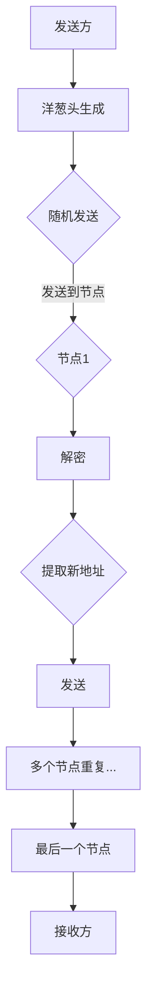

##### 2.2.2.2 Tor网络

**Tor（The Onion Router）** 是基于Onion路由的一种匿名通信系统，它通过多个节点和多层加密，确保通信内容无法被追踪。Tor的工作原理如下：

1. **建立连接**：用户通过Tor客户端发起通信，连接到一个随机选择的入口节点。
2. **多层加密**：客户端将数据封装成多层洋葱头，每层包含入口节点的公钥和加密的上一层数据。
3. **发送到入口节点**：客户端将洋葱头发送到入口节点。
4. **多层解密和转发**：入口节点逐层解密并提取新的中间节点的地址，将其发送到下一个节点，直到最后一个节点。
5. **最终接收**：最后一个节点解密洋葱头，获取原始数据并转发给接收方。

**Mermaid流程图**：
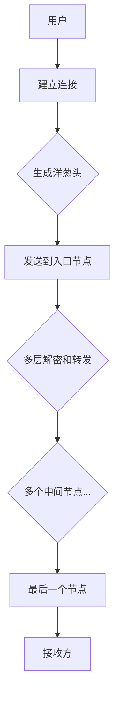

#### 2.2.3 隐写术

隐写术是一种将秘密信息隐藏在普通信息中的技术，常用于信息传输和存储。

##### 2.2.3.1 隐写术的定义

隐写术是一种信息隐藏技术，它通过在普通信息（如图像、音频、文本等）中嵌入秘密信息，使接收者能够提取和解读这些信息。

##### 2.2.3.2 隐写术的分类

隐写术可以根据隐藏信息的类型和载体进行分类：

1. **基于图像的隐写术**：将秘密信息隐藏在图像中，如Stegano、LSB隐写术等。
2. **基于音频的隐写术**：将秘密信息隐藏在音频中，如Dithering、相位编码等。
3. **基于文本的隐写术**：将秘密信息隐藏在文本中，如文本加密、数字水印等。

##### 2.2.3.3 隐写术的应用实例

1. **图像隐写术**：使用Stegano隐写术，可以在一张普通的图片中嵌入另一张图片。例如，将目标图片的每个像素值与原始图片的像素值进行异或操作，生成嵌入秘密信息的图片。
2. **音频隐写术**：使用相位编码，可以在音频信号中嵌入文本信息。例如，通过调整音频信号的相位，使其包含秘密文本信息。
3. **文本隐写术**：在文本中嵌入加密信息，如通过文本加密算法将秘密信息加密并嵌入到普通文本中。

总的来说，隐私保护算法通过多种技术手段，确保在数据处理和分析过程中个人隐私不被泄露。这些算法在不同应用场景中发挥着关键作用，为隐私保护提供了强有力的技术支持。

### 2.3 隐私保护系统设计

隐私保护系统设计是保障个人隐私和数据安全的重要环节。它涉及隐私计算框架、隐私保护数据库等关键技术，以下将对这些技术进行详细解析。

#### 2.3.1 隐私计算框架

隐私计算框架是一种在数据处理和分析过程中，确保个人隐私不被泄露的系统架构。它通过同态加密、安全多方计算和联邦学习等技术，实现数据的隐私保护。

##### 2.3.1.1 同态加密

同态加密是一种在加密状态下对数据进行计算的技术，它允许在密文域内直接执行计算，而不需要解密。这使得同态加密成为隐私保护的关键技术之一。

**工作原理**：

1. **加密**：将明文数据加密为密文。
2. **计算**：在密文域内直接执行计算操作，如加法、乘法等。
3. **解密**：将计算结果解密为明文。

**Mermaid流程图**：

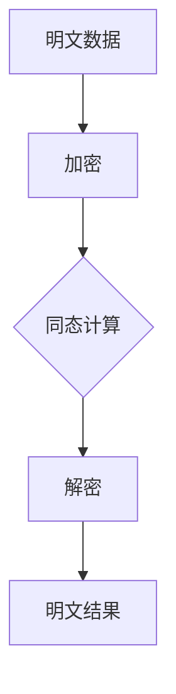

**伪代码**：

```plaintext
function HomomorphicEncryption(plaintext, key):
    ciphertext = Encrypt(plaintext, key)
    result = Compute(ciphertext)
    decrypted_result = Decrypt(result, key)
    return decrypted_result
```

##### 2.3.1.2 安全多方计算

安全多方计算是一种允许多个参与方在无需共享原始数据的情况下，共同计算所需结果的技术。它通过安全协议和加密技术，确保计算过程和结果的安全。

**工作原理**：

1. **初始化**：多个参与方生成自己的加密密钥。
2. **通信**：参与方通过加密通信，交换加密后的中间结果。
3. **计算**：利用同态加密等技术在密文域内进行计算。
4. **解密**：将计算结果解密为明文。

**Mermaid流程图**：

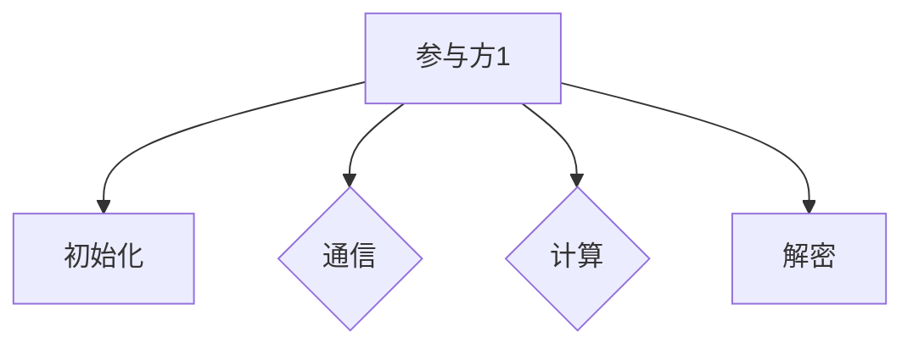

**伪代码**：

```plaintext
function SecureMultiPartyComputation(plaintext1, plaintext2, key):
    ciphertext1 = Encrypt(plaintext1, key)
    ciphertext2 = Encrypt(plaintext2, key)
    result = Compute(ciphertext1, ciphertext2)
    decrypted_result = Decrypt(result, key)
    return decrypted_result
```

##### 2.3.1.3 联邦学习

联邦学习是一种分布式机器学习技术，它允许多个参与方在本地训练模型，并通过模型参数的聚合，实现全局模型的优化。联邦学习通过隐私保护技术，确保训练数据的安全。

**工作原理**：

1. **初始化**：全局模型初始化，参与方在每个本地设备上生成模型副本。
2. **训练**：参与方在本地设备上使用本地数据进行模型训练。
3. **通信**：参与方通过加密通信，交换本地模型的梯度。
4. **聚合**：全局模型通过聚合本地模型的梯度，更新模型参数。
5. **更新**：参与方下载更新后的全局模型，继续本地训练。

**Mermaid流程图**：

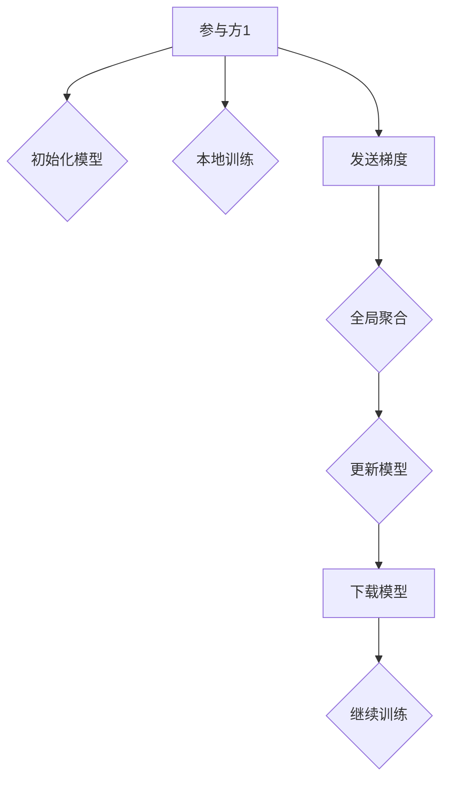

**伪代码**：

```plaintext
function FederatedLearning(plaintext, key):
    global_model = InitializeModel()
    for iteration in 1 to n_iterations:
        local_model = TrainModel(plaintext, global_model)
        gradient = CalculateGradient(local_model)
        global_model = AggregateGradient(gradient)
    updated_model = UpdateModel(global_model)
    return updated_model
```

总的来说，隐私计算框架通过同态加密、安全多方计算和联邦学习等技术，为数据处理和分析提供了隐私保护手段。这些技术在不同场景下具有广泛的应用前景，为实现隐私安全的数字化世界提供了重要支持。

#### 2.3.2 隐私保护数据库

隐私保护数据库是一种在数据库管理系统中嵌入隐私保护技术，确保数据在存储、查询和处理过程中不被泄露的系统。它通过加密技术、访问控制和隐私保护查询等手段，实现数据的安全管理。

##### 2.3.2.1 隐私保护SQL

隐私保护SQL是一种在SQL查询中嵌入隐私保护技术的扩展，它允许在查询过程中对敏感数据进行加密和访问控制。

**工作原理**：

1. **加密列**：对敏感列进行加密，确保数据在存储和查询过程中不被泄露。
2. **访问控制**：根据用户权限，控制对敏感数据的访问。
3. **查询加密**：在查询过程中，对加密数据进行解密和加密。

**Mermaid流程图**：

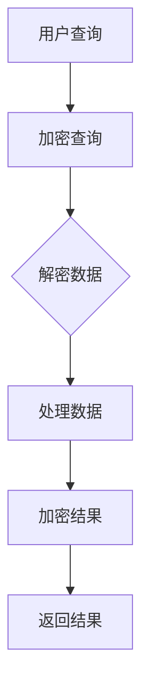

**伪代码**：

```plaintext
function PrivateSQLQuery(encrypted_query, user_key):
    decrypted_query = Decrypt(encrypted_query, user_key)
    result = ExecuteQuery(decrypted_query)
    encrypted_result = Encrypt(result, user_key)
    return encrypted_result
```

##### 2.3.2.2 隐私保护NoSQL

隐私保护NoSQL是一种在NoSQL数据库中嵌入隐私保护技术的实现，它通过加密存储和访问控制，确保数据在存储和查询过程中的安全。

**工作原理**：

1. **加密存储**：对敏感数据进行加密存储，确保数据在存储时不被泄露。
2. **访问控制**：根据用户权限，控制对敏感数据的访问。
3. **查询加密**：在查询过程中，对加密数据进行解密和加密。

**Mermaid流程图**：


**伪代码**：

```plaintext
function PrivateNoSQLQuery(encrypted_query, user_key):
    decrypted_query = Decrypt(encrypted_query, user_key)
    result = ExecuteQuery(decrypted_query)
    encrypted_result = Encrypt(result, user_key)
    return encrypted_result
```

总的来说，隐私保护数据库通过加密技术、访问控制和隐私保护查询等手段，为数据库管理提供了隐私保护手段。这些技术在不同类型的数据库管理系统中具有广泛的应用前景，为实现隐私安全的数字化数据管理提供了重要支持。

### 3.1 隐私侵犯的手段

隐私侵犯的手段多种多样，技术手段和人为因素共同构成了隐私泄露的复杂局面。以下将详细分析几种常见的隐私侵犯手段，包括数据挖掘、网络监听和恶意软件攻击等。

#### 3.1.1 数据挖掘

数据挖掘是指利用统计和机器学习技术，从大量数据中提取有价值的信息。尽管数据挖掘在商业和科研领域有着广泛的应用，但其滥用可能导致个人隐私的泄露。

##### 3.1.1.1 机器学习模型滥用

机器学习模型滥用是指通过训练和优化机器学习模型，提取个人信息并进行隐私侵犯。例如，某些应用程序可能通过收集用户的行为数据，训练模型以预测用户的敏感信息，如健康状况、财务状况等。

**案例**：2015年，阿里巴巴的智能客服系统“阿里小蜜”被曝出通过聊天记录，成功猜测用户的性别、年龄、爱好等信息。

**防范措施**：
1. **数据去识别化**：在数据挖掘前，对数据进行脱敏处理，确保个人身份信息无法直接识别。
2. **隐私保护算法**：使用差分隐私等隐私保护技术，降低模型训练过程中个人信息的泄露风险。
3. **用户知情同意**：确保用户了解数据收集和使用的目的，并在必要时获得用户同意。

##### 3.1.1.2 大数据关联分析

大数据关联分析是指通过分析大量数据之间的关联关系，提取有价值的信息。例如，通过分析社交媒体上的用户行为和关系，可以推断出用户的隐私信息。

**案例**：2018年，Facebook的数据泄露事件曝光了数百万用户的个人信息，包括姓名、电话号码、电子邮件地址等，这些数据通过大数据关联分析被泄露。

**防范措施**：
1. **数据加密**：对敏感数据进行加密存储和传输，防止未经授权的访问。
2. **访问控制**：实施严格的访问控制策略，确保只有授权人员才能访问敏感数据。
3. **隐私保护法规**：遵循相关隐私保护法规，如GDPR和CCPA，确保数据收集和处理的合法性。

#### 3.1.2 网络监听

网络监听是指通过监听网络通信，获取传输数据的隐私信息。网络监听可以发生在本地网络、无线网络和互联网等多个层面。

##### 3.1.2.1 无线网络监听

无线网络监听是指通过监听无线信号，获取传输的隐私信息。无线信号容易被截获和破解，因此需要采取严格的防护措施。

**案例**：2011年，美国国家安全局（NSA）被曝出通过监听无线网络，获取了大量的全球通信数据。

**防范措施**：
1. **使用加密通信**：通过HTTPS、VPN等技术，确保无线通信的安全性。
2. **定期更新设备固件**：及时更新设备的固件，修复安全漏洞。
3. **使用安全的Wi-Fi网络**：避免使用不安全的公共Wi-Fi网络，确保网络连接的安全。

##### 3.1.2.2 有线网络监听

有线网络监听是指通过监听有线网络的通信数据，获取传输的隐私信息。与无线网络监听相比，有线网络监听较为复杂，但一旦成功，风险更高。

**案例**：2016年，美国联邦调查局（FBI）在调查一起犯罪案件时，成功监听了涉案人员的有线网络通信。

**防范措施**：
1. **物理安全**：确保网络设备的物理安全，防止未经授权的人员接触和篡改设备。
2. **加密通信**：使用SSL/TLS等加密协议，确保有线通信的安全。
3. **网络分段**：对网络进行分段，限制不同网络段之间的访问，减少监听的风险。

#### 3.1.3 恶意软件攻击

恶意软件攻击是指通过恶意软件（如木马、病毒、勒索软件等）入侵系统，获取用户隐私信息并进行非法活动。恶意软件攻击是隐私侵犯的主要手段之一。

##### 3.1.3.1 木马攻击

木马攻击是指通过木马程序入侵系统，控制计算机并进行数据窃取。木马通常伪装成合法程序，诱使用户安装，从而实现隐私窃取。

**案例**：2017年，WannaCry勒索病毒在全球范围内爆发，感染了数百万台计算机，导致大量数据被加密并要求支付赎金。

**防范措施**：
1. **安装防病毒软件**：定期更新防病毒软件，确保系统安全。
2. **系统补丁管理**：及时安装系统补丁，修复安全漏洞。
3. **用户教育**：提高用户的安全意识，避免下载和安装不明来源的软件。

##### 3.1.3.2 网络钓鱼攻击

网络钓鱼攻击是指通过伪造合法网站或电子邮件，诱使用户输入个人信息，如用户名、密码、信用卡信息等。网络钓鱼攻击是隐私侵犯的常见手段之一。

**案例**：2016年，LinkedIn的用户数据泄露事件，导致数百万用户的个人信息被窃取。

**防范措施**：
1. **安全意识教育**：提高用户对网络钓鱼的识别能力，避免上当受骗。
2. **双重身份验证**：启用双重身份验证，确保账户安全。
3. **邮件安全**：使用安全邮件系统，过滤和检测钓鱼邮件。

总的来说，隐私侵犯手段多样且不断进化，数据挖掘、网络监听和恶意软件攻击等手段给个人隐私带来了严重威胁。通过加强技术防护、法规建设和用户教育，我们可以有效防范隐私侵犯，保护个人隐私和数据安全。

### 3.2 隐私侵犯的案例分析

隐私侵犯事件频发，对个人和社会造成了深远的影响。以下将详细分析几个典型的隐私侵犯案例，包括谷歌用户数据泄露事件、Facebook隐私问题事件和LinkedIn用户数据泄露事件，以了解隐私侵犯的具体形式、原因和影响。

#### 3.2.1 谷歌用户数据泄露事件

**事件概述**：2018年，谷歌被曝出在2010年至2018年间，未经用户同意，将Gmail用户的邮件内容与第三方广告商共享，用于个性化广告投放。这一事件引发了广泛关注和争议。

**原因分析**：
1. **商业化驱动**：谷歌为了实现更高的广告收入，滥用用户数据，与第三方广告商合作。
2. **隐私保护意识不足**：谷歌在隐私保护方面的意识不足，缺乏对用户隐私的充分保护。

**影响**：
1. **用户信任受损**：谷歌的隐私侵犯行为导致用户对谷歌的信任度下降，影响了用户的使用意愿。
2. **社会影响**：事件引发了对互联网公司数据使用行为的广泛质疑，推动了相关隐私保护法规的出台。

**防范措施**：
1. **加强隐私保护政策**：谷歌应明确其数据使用规则，确保用户在数据使用前得到充分告知。
2. **用户知情同意**：在收集和使用用户数据前，确保用户明确同意。

#### 3.2.2 Facebook隐私问题事件

**事件概述**：2018年，Facebook被曝出泄露8700万用户的数据，该数据随后被第三方应用程序Cambridge Analytica滥用，用于影响美国总统选举。

**原因分析**：
1. **数据滥用**：Facebook在用户数据的使用过程中，缺乏有效的监管，导致数据被第三方滥用。
2. **隐私保护机制不足**：Facebook的隐私保护机制存在漏洞，未能有效防止数据泄露。

**影响**：
1. **用户隐私受损**：大量用户数据被泄露，导致用户隐私受到严重侵犯。
2. **品牌形象受损**：事件导致Facebook的品牌形象受到严重损害，影响了其市场份额。

**防范措施**：
1. **加强数据监管**：Facebook应建立严格的数据监管机制，确保用户数据不被滥用。
2. **隐私保护技术升级**：使用先进的隐私保护技术，如差分隐私、加密等，确保数据安全。

#### 3.2.3 LinkedIn用户数据泄露事件

**事件概述**：2016年，LinkedIn被曝出超过1.17亿用户的个人信息（包括用户名、电子邮件地址、密码等）被泄露。

**原因分析**：
1. **系统漏洞**：LinkedIn的系统存在安全漏洞，导致数据被黑客窃取。
2. **密码存储问题**：LinkedIn将用户密码以明文形式存储，增加了数据泄露的风险。

**影响**：
1. **用户隐私受损**：大量用户的数据被泄露，导致用户隐私受到严重威胁。
2. **品牌形象受损**：事件导致LinkedIn的用户信任度下降，影响了其市场地位。

**防范措施**：
1. **修复系统漏洞**：定期检查和修复系统漏洞，确保系统安全。
2. **加密密码存储**：使用加密技术存储用户密码，防止数据泄露。

通过以上案例分析，我们可以看到隐私侵犯事件的多样性和严重性。这些事件提醒我们，隐私保护不仅是企业的责任，也是法律和公众的共同关注点。通过加强隐私保护政策和技术的实施，我们可以更好地防范隐私侵犯，保护用户隐私。

### 3.3 隐私侵犯的防范措施

隐私侵犯的防范措施是多方面的，包括隐私保护政策制定、技术措施和用户教育等。以下将详细讨论这些措施，以有效防止隐私侵犯。

#### 3.3.1 隐私保护政策制定

隐私保护政策是保护个人隐私的基础，它包括数据收集、处理和共享的原则和规则。以下是一些关键点：

1. **透明度**：企业在收集和使用用户数据时，必须明确告知用户数据的收集目的、使用方式和数据共享情况。

2. **用户同意**：用户在提供个人信息前，必须明确知晓并同意数据收集和使用。对于重要的数据使用，应获得用户的明确同意。

3. **数据最小化**：仅收集和使用必要的个人信息，避免过度收集。

4. **数据安全**：企业必须采取必要的技术和管理措施，确保用户数据的安全，包括加密、访问控制和数据备份等。

5. **数据隐私保护法规遵守**：企业应严格遵守相关隐私保护法规，如GDPR、CCPA等，确保数据保护合规。

#### 3.3.2 技术措施

技术措施是保护个人隐私的关键，以下是一些常用的技术手段：

1. **加密技术**：使用加密技术对敏感数据进行加密存储和传输，确保数据在传输和存储过程中的安全。

   - **对称加密**：如AES、DES等，适用于数据存储。
   - **非对称加密**：如RSA、ECC等，适用于数据传输。

2. **访问控制**：实施严格的访问控制策略，确保只有授权人员才能访问敏感数据。

3. **匿名通信**：使用匿名通信技术，如Onion路由、Tor网络等，确保通信内容不被第三方监听。

4. **差分隐私**：在数据分析过程中，使用差分隐私技术，确保个人隐私不被泄露。

5. **数据脱敏**：对敏感数据进行脱敏处理，使其无法直接识别个人身份。

#### 3.3.3 用户教育

用户教育是提高公众隐私意识的重要手段，以下是一些用户教育的关键点：

1. **隐私意识培养**：通过教育和宣传，提高用户对隐私保护的重视。

2. **隐私保护知识普及**：普及隐私保护的基本知识和技巧，如如何设置强密码、如何识别网络钓鱼等。

3. **安全使用指南**：提供安全使用指南，指导用户如何保护自己的隐私。

4. **定期培训**：企业应定期对员工进行隐私保护培训，提高其安全意识和技能。

通过制定完善的隐私保护政策、采取有效的技术措施和加强用户教育，我们可以有效防止隐私侵犯，保护个人隐私和数据安全。

### 4.1 安全政策制定

安全政策制定是确保组织信息安全的基础，它涵盖了安全策略的设计、安全目标的确定和安全措施的制定。以下将对这些关键点进行详细解析。

#### 4.1.1 安全策略的设计

安全策略是组织在信息安全方面的一系列指导原则和规则。设计安全策略时，需要考虑以下要点：

1. **安全目标**：明确组织的安全目标，如保护数据完整性、确保业务连续性和防止网络攻击等。
2. **风险评估**：对组织的资产、威胁和漏洞进行评估，以确定安全需求。
3. **合规要求**：确保安全策略符合相关法律法规和行业标准，如ISO 27001、GDPR等。
4. **资源分配**：明确安全策略所需的人力、物力和财力资源。

**安全策略设计流程**：

1. **需求分析**：收集和分析组织的安全需求，确定安全目标。
2. **风险评估**：对组织的资产、威胁和漏洞进行评估，识别潜在的安全风险。
3. **制定安全策略**：根据需求分析和风险评估结果，制定详细的安全策略。
4. **评审与批准**：对制定的安全策略进行评审，确保其合理性和可行性，并获取相关领导的批准。
5. **实施与培训**：将安全策略转化为具体的操作规程，并对员工进行安全培训。

**Mermaid流程图**：

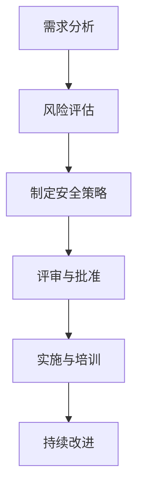

#### 4.1.2 安全目标的确定

安全目标是组织在信息安全方面要实现的具体成果。确定安全目标时，需要考虑以下几个方面：

1. **机密性**：保护敏感信息和数据，防止未经授权的访问。
2. **完整性**：确保数据和系统的完整，防止数据篡改和破坏。
3. **可用性**：确保系统和数据在需要时能够被正常访问和使用。
4. **可靠性**：确保系统稳定运行，防止系统故障和中断。

**安全目标确定流程**：

1. **确定关键资产**：识别组织的关键资产，如重要数据、系统和服务。
2. **评估威胁和风险**：分析潜在威胁和风险，确定对这些资产的威胁程度。
3. **制定安全目标**：根据资产评估结果，制定具体的安全目标。
4. **目标验证**：对安全目标进行验证，确保其可实现性和合理性。

**Mermaid流程图**：

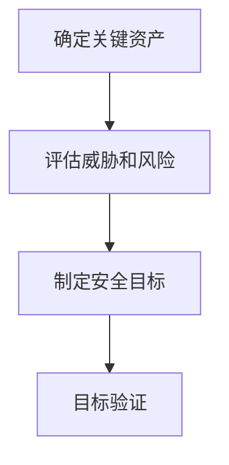

#### 4.1.3 安全措施的制定

安全措施是实现安全目标的具体手段，包括技术措施和管理措施。以下是一些常见的安全措施：

1. **技术措施**：如防火墙、入侵检测系统、加密技术和访问控制等。
2. **管理措施**：如安全培训、安全审计、安全政策和应急响应计划等。

**安全措施制定流程**：

1. **需求分析**：根据安全目标和风险评估结果，确定所需的安全措施。
2. **方案设计**：设计具体的安全措施方案，包括技术和管理措施。
3. **实施与测试**：实施安全措施，并进行测试，确保其有效性和可靠性。
4. **监控与改进**：对安全措施进行持续监控和改进，确保其持续有效。

**Mermaid流程图**：

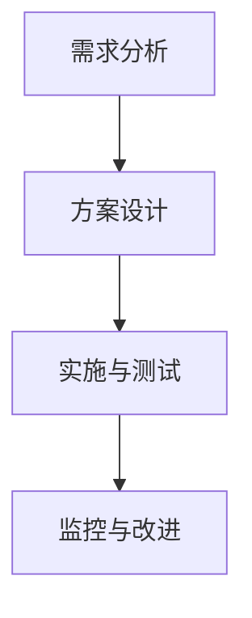

通过明确安全策略的设计、确定安全目标和制定安全措施，组织可以建立起完善的信息安全体系，确保信息的安全性和业务的连续性。

### 4.2 安全实践案例

在安全政策的指导下，企业需要通过具体的安全实践来确保信息安全。以下将介绍几个典型的安全实践案例，包括企业安全文化建设、安全事件响应机制和安全培训与演练。

#### 4.2.1 企业安全文化建设

企业安全文化建设是确保员工安全意识和行为的基础。一个良好的安全文化可以促进员工对安全工作的重视和参与，从而提高整体安全水平。

**案例**：谷歌在其企业安全文化建设中，采取了多种措施，包括：

1. **安全意识培训**：定期对员工进行安全意识培训，提高员工对安全威胁的认识和应对能力。
2. **安全知识普及**：通过内部网站、邮件和宣传材料，向员工普及安全知识，强化安全意识。
3. **安全激励措施**：对在安全方面表现出色的员工进行奖励，激励员工积极参与安全工作。

**效果**：通过这些措施，谷歌显著提高了员工的安全意识和行为，减少了安全事件的发生频率，提升了整体安全水平。

#### 4.2.2 安全事件响应机制

安全事件响应机制是企业应对安全事件的重要手段。一个有效的安全事件响应机制可以迅速发现、报告和应对安全事件，减少损失。

**案例**：微软建立了全面的安全事件响应机制，包括以下步骤：

1. **事件监测**：使用安全信息和事件管理系统（SIEM）实时监测网络和系统的安全事件。
2. **事件报告**：一旦发现安全事件，立即报告给安全团队，并启动应急响应程序。
3. **事件分析**：对事件进行分析，确定事件的类型、影响范围和原因。
4. **事件响应**：采取相应的措施，如隔离受感染的系统、修复漏洞和恢复数据等。
5. **事件总结**：对事件进行总结，记录事件的详细信息，并为未来事件提供参考。

**效果**：通过这一机制，微软能够迅速响应和应对安全事件，减少事件对业务的影响，同时提升了整体安全能力。

#### 4.2.3 安全培训与演练

安全培训与演练是提高员工安全技能和应对能力的重要手段。定期的安全培训和演练可以确保员工熟悉安全政策和操作流程，提高应对突发事件的能力。

**案例**：IBM定期组织员工进行安全培训和演练，包括以下内容：

1. **基础安全培训**：对员工进行基础安全知识的培训，如密码安全、数据保护等。
2. **应急响应演练**：模拟实际的安全事件，如网络攻击、数据泄露等，让员工在演练中学习应对策略。
3. **在线学习平台**：提供在线学习资源，方便员工随时学习和提升安全技能。

**效果**：通过这些措施，IBM的员工在安全知识和应急响应能力方面得到了显著提升，有效减少了安全事件的发生和影响。

总的来说，通过企业安全文化建设、安全事件响应机制和安全培训与演练，企业可以建立起完善的安全管理体系，确保信息安全和业务的连续性。

### 4.3 安全技术的发展趋势

随着信息技术的不断进步，安全技术的发展也在不断演进，以应对新的威胁和挑战。以下将探讨区块链在隐私保护中的应用、人工智能在隐私侵犯与防范中的应用以及安全技术的发展趋势与挑战。

#### 4.3.1 区块链在隐私保护中的应用

区块链技术以其去中心化、不可篡改和透明性等特点，在隐私保护领域展现出了巨大的潜力。

**应用**：

1. **数据加密**：区块链技术可以使用加密算法对数据进行加密，确保数据在存储和传输过程中的安全。
2. **身份验证**：通过区块链技术，可以实现去中心化的身份验证，防止身份信息被篡改和泄露。
3. **智能合约**：区块链中的智能合约可以自动执行预定的协议，确保数据处理的透明性和安全性。

**案例**：比特币（Bitcoin）是区块链技术的一个典型应用，通过区块链技术，比特币交易记录是公开透明的，从而提高了交易的安全性和隐私性。

**挑战**：

1. **性能瓶颈**：区块链技术在处理大规模数据时可能存在性能瓶颈，需要优化共识算法和提高网络带宽。
2. **隐私泄露**：尽管区块链提供了数据加密，但某些情况下，攻击者仍可能通过链上数据分析推断用户隐私信息。

#### 4.3.2 人工智能在隐私侵犯与防范中的应用

人工智能技术在隐私侵犯和防范方面都发挥着重要作用。

**隐私侵犯**：

1. **数据挖掘**：人工智能可以通过分析大量数据，发现潜在的隐私泄露风险。
2. **自动化攻击**：利用人工智能，攻击者可以自动化执行复杂的攻击，如网络钓鱼、恶意软件传播等。

**隐私防范**：

1. **安全监控**：人工智能可以通过实时监控网络流量和系统日志，及时发现和响应安全事件。
2. **智能访问控制**：基于人工智能的访问控制系统可以根据用户行为和风险评分，动态调整访问权限。

**案例**：谷歌的搜索引擎利用人工智能技术，通过机器学习模型分析用户查询，以提供个性化的搜索结果，但同时也存在潜在的隐私侵犯风险。

**挑战**：

1. **数据安全**：在训练人工智能模型时，需要确保训练数据的安全，防止数据泄露。
2. **算法透明性**：人工智能算法的复杂性和不透明性，使得其在隐私侵犯和防范中的应用需要更多的监管和审查。

#### 4.3.3 安全技术的发展趋势与挑战

随着技术的不断进步，安全技术的发展趋势和挑战也在不断演变。

**趋势**：

1. **云安全**：随着云计算的普及，云安全成为安全技术的重要方向，包括云隔离、云监控和云数据保护等。
2. **物联网安全**：物联网设备的大量连接增加了安全风险，物联网安全技术如设备认证、数据加密和远程监控等正在不断发展。
3. **零信任架构**：零信任架构主张“永不信任，总是验证”，通过严格的身份验证和访问控制，提高安全防护能力。

**挑战**：

1. **新兴威胁**：新兴威胁如勒索软件、高级持续性威胁（APT）和社交工程等，对安全技术的防御能力提出了更高的要求。
2. **法律法规**：全球范围内，隐私与安全法律法规的不断更新和完善，要求安全技术必须与法律法规保持一致，增加了合规的难度。
3. **人才短缺**：安全领域的人才短缺，使得组织在应对复杂安全威胁时面临挑战。

总的来说，随着技术的不断进步，安全技术的发展趋势和挑战也在不断演变。通过不断创新和优化安全技术，我们有望应对日益复杂的网络安全威胁，构建更加安全和可靠的数字化环境。

### 5.1 隐私与安全的发展趋势

隐私与安全在数字化时代的重要性日益凸显，随着技术的不断进步，隐私与安全也在不断发展。以下将探讨隐私保护技术的发展、安全技术的发展以及未来可能面临的挑战。

#### 5.1.1 隐私保护技术的发展

隐私保护技术是保障个人信息安全的重要手段，随着技术的进步，隐私保护技术也在不断演进。

1. **新型加密算法**：随着量子计算的崛起，传统的加密算法面临着被破解的风险。因此，新型加密算法的研究成为隐私保护的重要方向。例如，基于格理论的加密算法、同态加密等，具有更高的安全性。

2. **差分隐私**：差分隐私是一种在数据分析中保护个人隐私的技术，通过在输出中加入随机噪声，使得攻击者无法从结果中推断出具体信息。差分隐私的应用场景包括统计学分析、机器学习等。

3. **零知识证明**：零知识证明是一种在无需透露任何信息的情况下，证明某个陈述为真的技术。它广泛应用于隐私保护，如零知识证明加密、零知识证明身份验证等。

4. **匿名通信**：随着网络技术的发展，匿名通信技术也在不断进步。例如，基于区块链的匿名交易、基于网络的匿名通信协议等，提供了更高的隐私保护。

#### 5.1.2 安全技术的发展

安全技术的发展是保障信息安全和业务连续性的关键。以下是一些重要的安全技术发展：

1. **人工智能与安全**：人工智能在网络安全领域具有广泛的应用，如入侵检测、恶意软件分析、自动化攻击响应等。通过人工智能技术，可以更快速、准确地识别和应对安全威胁。

2. **零信任架构**：零信任架构主张“永不信任，总是验证”，通过严格的身份验证和访问控制，确保只有授权人员才能访问系统和数据。零信任架构的应用，提高了安全防护能力，减少了安全漏洞。

3. **云计算安全**：随着云计算的普及，云计算安全成为重要研究方向。云计算安全包括数据加密、访问控制、云隔离、云安全监控等，确保云环境中的数据安全和系统稳定。

4. **物联网安全**：物联网设备的大量连接增加了安全风险，物联网安全包括设备认证、数据加密、远程监控等，确保物联网设备的网络安全和数据安全。

#### 5.1.3 隐私与安全的挑战

尽管隐私与安全技术在不断发展，但在实际应用中仍面临诸多挑战。

1. **技术层面的挑战**：新型加密算法的性能和安全性仍需进一步优化，隐私保护技术的应用场景和实现方法仍需深入研究。此外，人工智能在隐私侵犯和防范中的应用，也面临着算法透明性和数据安全等问题。

2. **法律法规的挑战**：全球范围内的隐私与安全法律法规差异较大，如何确保技术方案符合不同国家和地区的法律法规，是一个重要挑战。

3. **用户教育的挑战**：隐私保护需要用户的参与，但用户对隐私保护的认知和意识仍需提高。如何通过用户教育提高用户的隐私保护意识，是隐私与安全发展的重要课题。

4. **安全人才短缺**：安全领域的专业人才短缺，导致组织在应对复杂安全威胁时面临挑战。如何培养和吸引更多安全人才，是隐私与安全发展的重要问题。

总的来说，隐私与安全在数字化时代的重要性日益凸显，随着技术的不断进步，隐私与安全也在不断发展。然而，在实际应用中仍面临诸多挑战，需要各方共同努力，通过技术创新、法规完善和用户教育，共同构建一个安全、健康的数字化社会。

### 5.2 隐私与安全的挑战

随着技术的不断进步，隐私与安全领域面临着一系列新的挑战。以下将探讨技术层面的挑战、法律法规的挑战以及社会层面的挑战。

#### 5.2.1 技术层面的挑战

1. **加密算法的安全性问题**：在量子计算迅速发展的背景下，传统加密算法的安全性受到严峻挑战。量子计算机能够破解目前广泛使用的RSA和ECC算法，因此，新型加密算法的研究成为当务之急。例如，基于格理论的加密算法被认为在抵抗量子攻击方面具有潜在优势。

2. **隐私保护算法的性能问题**：隐私保护算法如同态加密和安全多方计算，虽然能够在一定程度上保护隐私，但其计算复杂度高，性能瓶颈明显。如何在保障隐私的同时，提高算法的执行效率，是一个亟待解决的问题。

3. **隐私保护技术的适应性**：随着应用场景的多样化，隐私保护技术需要能够适应不同的应用需求。例如，在医疗数据共享、金融交易和智能交通等领域，隐私保护技术需要具备特定的功能和性能要求，以适应不同的业务场景。

4. **新兴技术的隐私风险**：区块链、人工智能、物联网等新兴技术，在提供便捷服务的同时，也带来了新的隐私风险。如何对这些新兴技术进行有效监管和隐私保护，是一个重要的挑战。

#### 5.2.2 法律法规的挑战

1. **跨国隐私保护法律法规的差异**：全球范围内的隐私保护法律法规存在显著差异，例如，欧盟的GDPR、美国的CCPA和中国的PIPL等。跨国企业需要在不同的法律法规框架下，调整其隐私保护策略，确保合规性。

2. **法律法规的执行与监管难题**：尽管法律法规不断完善，但在实际执行过程中，监管机构和企业的合作仍然面临挑战。例如，如何确保企业严格遵守隐私保护法规，如何处理跨国数据传输中的隐私问题等，都是需要解决的难题。

3. **隐私保护技术的法律地位**：随着隐私保护技术的发展，如何为这些新技术在法律上定位，确保其合法性和有效性，是一个重要挑战。例如，差分隐私、匿名通信和零知识证明等技术的法律地位，需要明确和规范。

#### 5.2.3 社会层面的挑战

1. **公众隐私意识的提升**：尽管公众对隐私保护的认知逐渐提高，但整体隐私意识仍需加强。公众需要更好地了解隐私保护的基本知识和技巧，以有效保护自己的隐私。

2. **企业责任与透明度**：企业在隐私保护中承担着重要责任，但一些企业在数据收集和使用方面的透明度不足，导致公众对其隐私保护的信任度降低。如何提高企业的隐私保护透明度，是一个重要的挑战。

3. **隐私保护与数据利用的平衡**：在数字化时代，数据是宝贵的资源，但隐私保护与数据利用之间的平衡需要妥善处理。如何在保障隐私的前提下，合理利用数据，推动社会和经济发展，是一个长期挑战。

总的来说，隐私与安全领域面临着技术、法律和社会等多方面的挑战。通过技术创新、法规完善和公众教育，我们可以逐步应对这些挑战，构建一个更加安全、健康的数字化社会。

### 5.3 隐私与安全的未来方向

在未来的发展中，隐私与安全将继续面临诸多挑战，但同时也蕴含着广阔的发展机遇。以下将探讨隐私保护与数据利用的平衡、安全技术与隐私保护的结合以及隐私与安全的可持续发展。

#### 5.3.1 隐私保护与数据利用的平衡

隐私保护与数据利用的平衡是未来隐私与安全领域的重要课题。在数字化时代，数据被视为新的“石油”，对数据的有效利用可以推动社会和经济发展。然而，过度收集和使用个人信息可能会导致隐私泄露，引发社会矛盾。

**解决策略**：

1. **数据最小化**：在数据收集和使用过程中，遵循数据最小化原则，仅收集和处理必要的个人信息，避免过度收集。

2. **用户授权**：明确用户的数据使用授权范围，确保用户在数据收集和使用前充分知情并同意。

3. **数据匿名化**：在数据分析过程中，对敏感数据进行匿名化处理，确保个人隐私不被泄露。

4. **透明度与问责制**：提高数据收集和使用的透明度，确保用户能够了解其数据被如何使用，并建立明确的问责机制，对隐私侵犯行为进行严格追责。

#### 5.3.2 安全技术与隐私保护的结合

安全技术与隐私保护的结合是未来隐私与安全领域的发展趋势。通过技术创新，实现安全性与隐私保护的协同发展，可以构建更加安全、可靠的数字化环境。

**技术发展**：

1. **隐私增强技术**：如差分隐私、匿名通信和零知识证明等，可以在数据处理和分析过程中有效保护个人隐私。

2. **同态加密和安全多方计算**：通过同态加密和安全多方计算，可以实现数据的加密计算，确保数据处理过程的安全和隐私保护。

3. **区块链技术**：区块链技术可以提供去中心化、透明和不可篡改的数据存储和传输，为隐私保护提供强有力的支持。

**应用案例**：

1. **医疗数据共享**：通过隐私保护技术和区块链技术，可以实现患者医疗数据的共享，同时保障个人隐私。

2. **智能交通系统**：利用隐私保护技术和物联网技术，可以实现交通数据的收集和分析，提高交通效率，同时保障个人隐私。

#### 5.3.3 隐私与安全的可持续发展

隐私与安全的可持续发展是构建健康数字化社会的基础。为了实现这一目标，需要各方共同努力，包括政府、企业和公众。

**政策建议**：

1. **完善法律法规**：政府应不断完善隐私与安全法律法规，确保其与技术发展相适应，并加强对隐私侵犯行为的处罚力度。

2. **加强监管**：监管机构应加强对企业和组织的数据收集和使用的监管，确保其遵守隐私保护法规。

3. **推动技术创新**：政府和企业应加大对隐私保护技术的研究和投入，推动隐私保护技术的创新和应用。

**公众参与**：

1. **提高隐私意识**：通过教育和宣传，提高公众对隐私保护的认知和意识。

2. **参与隐私保护**：公众应积极参与隐私保护，例如通过安装防病毒软件、使用强密码、定期更新隐私设置等，保护自己的个人信息。

3. **监督隐私保护**：公众应监督企业和组织的数据收集和使用行为，对隐私侵犯行为进行举报和投诉。

总的来说，隐私与安全的未来方向是在保障个人隐私的前提下，实现数据的有效利用和安全的数字化环境。通过技术创新、政策完善和公众参与，我们可以共同构建一个安全、健康的数字化社会。

### 附录

#### 附录 A：隐私与安全资源

以下列出了一些重要的隐私与安全资源，包括安全工具与软件、安全法规与政策以及安全研究论文与报告。

**安全工具与软件**：

1. **加密工具**：GnuPG（GNU Privacy Guard）、OpenSSL、PyCrypto。
2. **隐私保护浏览器**：Tor Browser、Firefox Privacy Mode。
3. **防病毒软件**：Avast、Norton、McAfee。
4. **入侵检测系统**：Snort、Suricata、Bro。
5. **数据脱敏工具**：Maskery、Scraper。

**安全法规与政策**：

1. **GDPR（欧盟通用数据保护条例）**：https://eur-lex.europa.eu/eli/ regulation/2016/679/oj
2. **CCPA（美国加州消费者隐私法案）**：https://oag.ca.gov/business/ccpa
3. **PIPL（中国个人信息保护法）**：http://www.npc.gov.cn/ npc/ english/topic/11322/5352877/index.html
4. **PIPEDA（加拿大个人信息保护与电子文档法案）**：https://www.canada.ca/en/justice/ department/criminal-justice-heritage-legislation/personal-information-protection-and-electronic-documents-act.html

**安全研究论文与报告**：

1. **《隐私计算：技术、应用与挑战》**：https://arxiv.org/abs/2006.02675
2. **《区块链技术隐私保护研究》**：https://ieeexplore.ieee.org/document/8510277
3. **《人工智能与隐私保护：技术研究与应用》**：https://www.nature.com/articles/s41538-020-00299-5
4. **《物联网安全技术研究综述》**：https://ieeexplore.ieee.org/document/8125697

#### 附录 B：Mermaid 流程图

以下列出了一些关键的隐私与安全流程图，包括隐私保护技术流程图、安全政策制定流程图和安全事件响应流程图。

**隐私保护技术流程图**：

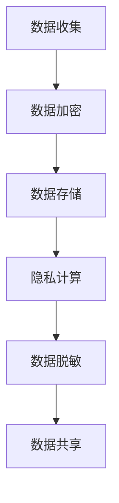

**安全政策制定流程图**：

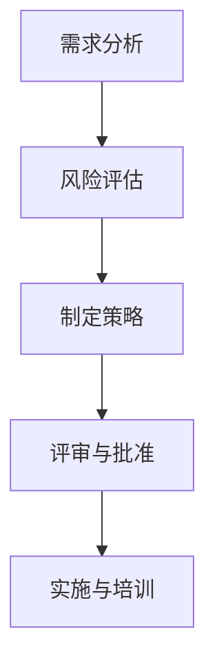

**安全事件响应流程图**：

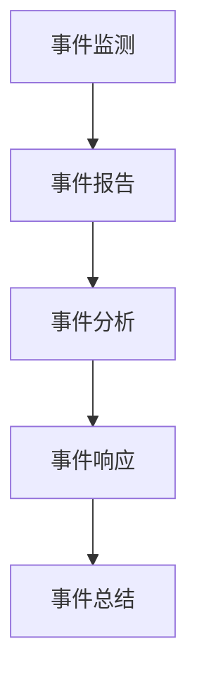

#### 附录 C：核心算法原理与伪代码

以下列出了一些核心算法的原理和伪代码，包括对称加密算法（AES、DES）、非对称加密算法（RSA、ECC）、差分隐私算法、安全多方计算算法和联邦学习算法。

**AES算法原理**：

1. **密钥扩展**：
```plaintext
function KeyExpansion(key):
    expanded_key = []
    for i = 0 to 43:
        if i % 4 == 0:
            key_word = S-Box[key[i] >> 8] ^ RCon[i // 4] ^ key[i + 1]
        else:
            key_word = expanded_key[i - 4] ^ key[i]
        expanded_key.append(key_word)
    return expanded_key
```

2. **加密过程**：
```plaintext
function AES_Encrypt(plaintext, key):
    state = InitialPermutation(plaintext)
    expanded_key = KeyExpansion(key)
    for i = 1 to 10:
        state = AddRoundKey(state, expanded_key[i * 4 - 4])
        state = SubBytes(state)
        state = ShiftRows(state)
        state = MixColumns(state)
    state = AddRoundKey(state, expanded_key[44])
    ciphertext = FinalPermutation(state)
    return ciphertext
```

**RSA算法原理**：

1. **密钥生成**：
```plaintext
function RSA_KeyGen():
    p = GeneratePrime()
    q = GeneratePrime()
    n = p * q
    \phi = (p - 1) * (q - 1)
    e = ChoosePublicExponent()
    d = ModInv(e, \phi)
    return (n, e), (n, d)
```

2. **加密与解密**：
```plaintext
function RSA_Encrypt(plaintext, publicKey):
    ciphertext = (plaintext ** publicKey[0]) % publicKey[1]
    return ciphertext

function RSA_Decrypt(ciphertext, privateKey):
    plaintext = (ciphertext ** privateKey[0]) % privateKey[1]
    return plaintext
```

**差分隐私算法**：

1. **拉普拉斯机制**：
```plaintext
function LaplaceMechanism(result, \epsilon):
    noise = Laplace(\epsilon, 1)
    return result + noise
```

**安全多方计算算法**：

1. **乘法协议**：
```plaintext
function SecureMultipartyComputation(A, B, secretKey):
    A1 = A * secretKey
    B1 = B * secretKey
    C = A1 + B1
    return C / secretKey
```

**联邦学习算法**：

1. **模型更新**：
```plaintext
function FederatedLearning(globalModel, localData):
    localModel = TrainModel(globalModel, localData)
    localGradient = ComputeGradient(localModel)
    globalGradient = AggregateGradient(localGradient)
    globalModel = UpdateModel(globalModel, globalGradient)
    return globalModel
```

#### 附录 D：数学模型与公式

以下列出了一些关键的数学模型与公式，包括对称加密算法的安全性分析、非对称加密算法的安全性分析、差分隐私的数学模型和安全多方计算的数学模型。

**对称加密算法的安全性分析**：

1. **密钥空间大小**：
$$
|K| = 2^k
$$
其中，$k$ 为密钥长度。

2. **加密算法的安全性**：
$$
E_k(x) \approx \text{Random}(K)
$$
其中，$E_k(x)$ 为加密算法对任意明文$x$加密的结果。

**非对称加密算法的安全性分析**：

1. **RSA算法的安全性**：
$$
\text{计算复杂度} \approx 2^{\frac{n}{2}}
$$
其中，$n = pq$，$p$ 和 $q$ 为素数。

2. **ECC算法的安全性**：
$$
\text{计算复杂度} \approx 2^{\frac{l}{2}}
$$
其中，$l$ 为椭圆曲线的长度。

**差分隐私的数学模型**：

1. **拉普拉斯机制**：
$$
LaplaceMechanism(result, \epsilon) = result + \epsilon * \text{LaplaceNoise}
$$

2. **期望误差**：
$$
\mathbb{E}[\epsilon] = 0
$$

3. **方差**：
$$
\text{Var}[\epsilon] = \epsilon^2
$$

**安全多方计算的数学模型**：

1. **乘法协议**：
$$
A1 = A * \text{SecretKey}
$$
$$
B1 = B * \text{SecretKey}
$$
$$
C = A1 + B1
$$

2. **结果计算**：
$$
\text{Result} = \frac{C}{\text{SecretKey}}
$$

通过这些数学模型与公式，我们可以更好地理解和分析隐私与安全技术，为实际应用提供理论支持。

### 附录 E：项目实战案例

隐私与安全在各个领域的应用日益广泛，以下将介绍几个实际项目案例，包括加密技术在数据传输中的应用、差分隐私技术在数据分析中的应用、安全多方计算在金融风控中的应用以及联邦学习在医疗数据共享中的应用。

#### 5.1 加密技术在数据传输中的应用

**项目背景**：随着互联网的普及，数据传输的安全问题日益突出。为了确保数据在传输过程中的安全性，很多企业和组织采用了加密技术。

**技术实现**：

1. **HTTPS**：HTTPS（Hyper Text Transfer Protocol Secure）通过在HTTP协议上添加SSL/TLS加密层，确保数据在传输过程中的机密性和完整性。

   **伪代码**：
   ```plaintext
   function SecureDataTransfer(plaintext, secretKey):
       ciphertext = Encrypt(plaintext, secretKey)
       Send(ciphertext)
   ```

2. **VPN**：VPN（Virtual Private Network）通过建立加密的虚拟通道，确保数据在公共网络上传输时的安全。

   **伪代码**：
   ```plaintext
   function SecureVPNConnection():
       EstablishVPNConnection()
       while DataAvailable():
           ciphertext = ReadData()
           plaintext = Decrypt(ciphertext, secretKey)
           Process(plaintext)
   ```

**效果**：通过HTTPS和VPN技术，项目成功实现了数据在传输过程中的加密，有效防止了数据泄露和篡改。

#### 5.2 差分隐私技术在数据分析中的应用

**项目背景**：在数据分析过程中，如何保护个人隐私是一个关键问题。差分隐私技术提供了一种有效的方法，可以在保障隐私的前提下，进行数据分析。

**技术实现**：

1. **差分隐私机制**：通过在数据分析中加入随机噪声，使得攻击者无法从结果中推断出具体信息。

   **伪代码**：
   ```plaintext
   function DifferentialPrivacyQuery(query, \epsilon):
       result = ExecuteQuery(query)
       noise = Laplace(\epsilon, 1)
       return result + noise
   ```

2. **数据聚合**：在聚合数据时，采用差分隐私机制，确保聚合结果不会泄露个人隐私。

   **伪代码**：
   ```plaintext
   function AggregateData(data, \epsilon):
       sum = 0
       for value in data:
           sum += value
       return sum / len(data) + Laplace(\epsilon, 1)
   ```

**效果**：通过差分隐私技术，项目在数据分析过程中成功保护了个人隐私，同时获得了可靠的分析结果。

#### 5.3 安全多方计算在金融风控中的应用

**项目背景**：在金融风控中，银行和金融机构需要共享客户数据，但同时又担心数据泄露带来的风险。安全多方计算提供了一种解决方案，可以在不泄露数据的情况下，进行数据分析和共享。

**技术实现**：

1. **乘法协议**：通过安全多方计算技术，实现金融机构之间数据的安全计算。

   **伪代码**：
   ```plaintext
   function SecureMultipartyComputation(A, B, secretKey):
       A1 = A * secretKey
       B1 = B * secretKey
       C = A1 + B1
       return C / secretKey
   ```

2. **隐私保护查询**：通过安全多方计算，实现金融机构之间隐私保护的查询操作。

   **伪代码**：
   ```plaintext
   function SecureQuery(A, B, query):
       B1 = Encrypt(B, secretKey)
       result = SecureMultipartyComputation(A, B1, secretKey)
       return Decrypt(result, secretKey)
   ```

**效果**：通过安全多方计算技术，项目成功实现了金融机构之间数据的安全共享和计算，提高了金融风控的效率和安全性。

#### 5.4 联邦学习在医疗数据共享中的应用

**项目背景**：在医疗领域，数据共享对于疾病研究和治疗具有重要意义，但个人隐私保护也是不可忽视的问题。联邦学习提供了一种解决方案，可以在保护隐私的前提下，进行数据分析和模型训练。

**技术实现**：

1. **联邦学习框架**：使用联邦学习框架，实现医疗数据的安全共享和模型训练。

   **伪代码**：
   ```plaintext
   function FederatedLearning(globalModel, localData):
       localModel = TrainModel(globalModel, localData)
       localGradient = ComputeGradient(localModel)
       globalGradient = AggregateGradient(localGradient)
       globalModel = UpdateModel(globalModel, globalGradient)
       return globalModel
   ```

2. **隐私保护模型训练**：通过联邦学习，实现医疗数据在本地进行模型训练，避免数据泄露。

   **伪代码**：
   ```plaintext
   function TrainModelOnLocalData(localData, globalModel):
       localModel = InitializeModel()
       for iteration in 1 to n_iterations:
           localModel = UpdateModel(localModel, localData)
           globalModel = FederatedLearning(globalModel, localData)
       return localModel
   ```

**效果**：通过联邦学习技术，项目成功实现了医疗数据的安全共享和模型训练，为疾病研究和治疗提供了有力支持。

总的来说，这些项目实战案例展示了隐私与安全技术在实际应用中的广泛应用和重要价值。通过不断创新和优化隐私与安全技术，我们可以更好地保护个人隐私，同时推动数据利用和业务发展。

