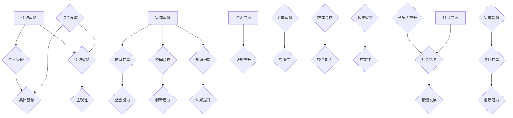
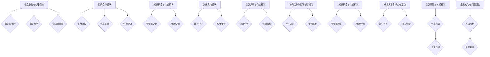
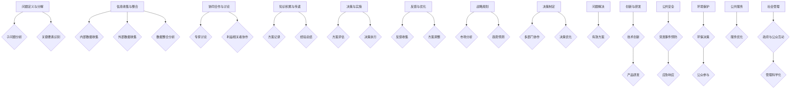
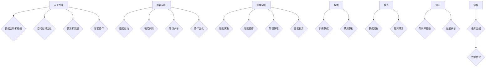
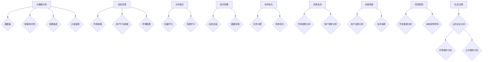
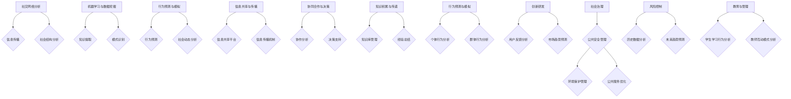
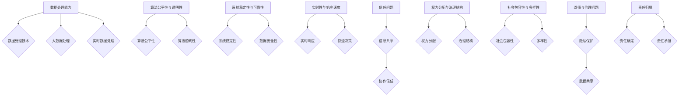
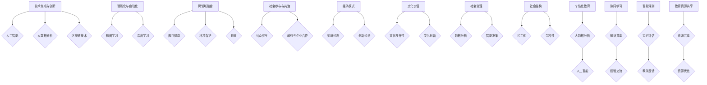

                 

### 第1章: 集体智慧的概念与重要性

#### 1.1 集体智慧的定义

**集体智慧**，是指一个群体通过信息共享、协同合作和知识积累，共同解决问题的能力。它源于传统智慧，但又超越了个体的局限，具有更强的整合能力和创新潜力。集体智慧的起源可以追溯到人类社会的早期，从原始部落的合作狩猎到现代社会的团队协作，都体现了集体智慧的重要性。

**集体智慧**的基本特征包括：
1. **信息共享**：成员之间能够自由地分享信息，促进知识的传播和更新。
2. **协同合作**：成员之间相互配合，共同完成任务，实现个体无法达到的目标。
3. **知识积累**：通过不断的实践和反思，群体能够积累经验，提高解决问题的能力。

#### 1.2 集体智慧的重要性

**集体智慧**在解决复杂问题中具有独特的优势。复杂问题通常涉及多个方面，需要不同领域的知识和技能。集体智慧通过汇聚各种专业知识和经验，能够更全面地分析问题，找到更有效的解决方案。

**集体智慧**在促进创新与进步中也发挥着重要作用。创新往往需要突破传统思维模式的束缚，而集体智慧能够激发成员的创造力，推动新技术的诞生和产业的变革。

此外，**集体智慧**对个人与社会的积极影响也不容忽视。在个人层面，集体智慧能够提高个体的认知水平，增强解决问题的能力。在社会层面，集体智慧能够促进社会的和谐与发展，提升整体竞争力。

#### 1.3 集体智慧与传统智慧的对比

**传统智慧**主要依赖于个人的经验和知识，具有一定的局限性和主观性。而**集体智慧**则通过群体的协作和信息的共享，克服了个体智慧的不足，具有更高的整合能力和创新潜力。

**传统智慧**强调个体能力，往往注重个体的独立思考和决策。而**集体智慧**则强调群体合作，强调信息的共享和协同创新。

然而，**集体智慧**并不是要完全取代**传统智慧**，而是与之相结合，形成更高效、更有力的智慧系统。通过**集体智慧**，我们可以更好地发挥个人智慧的优势，同时弥补个体智慧的不足，实现智慧的最大化。

### Mermaid 流程图

### 第2章: 集体智慧的架构与机制

#### 2.1 集体智慧的架构

**集体智慧**的架构可以分为四个核心模块：信息收集与处理模块、协同合作模块、知识积累与传递模块和决策支持模块。这些模块相互协作，形成一个有机的整体，共同实现集体智慧的目标。

1. **信息收集与处理模块**：负责收集各种来源的信息，如数据、知识库、社交媒体等，并对这些信息进行预处理、分析和整合，为后续的决策提供支持。

2. **协同合作模块**：提供平台和工具，支持成员之间的信息共享、讨论和协作，促进群体智慧的形成和发展。

3. **知识积累与传递模块**：通过记录、存储和共享成员的知识和经验，实现知识的积累和传递，为集体智慧的持续发展提供保障。

4. **决策支持模块**：基于收集到的信息和知识，提供决策建议和方案，帮助群体做出更明智的决策。

#### 2.2 集体智慧的核心机制

**集体智慧**的核心机制主要包括信息共享与交流机制、协同合作与协同创新机制和知识积累与传递机制。

1. **信息共享与交流机制**：通过建立开放的平台和工具，鼓励成员之间自由地分享信息和知识，促进信息的流动和整合。

2. **协同合作与协同创新机制**：通过制定合理的合作规则和激励机制，鼓励成员积极参与合作和创新，实现集体智慧的优化和发展。

3. **知识积累与传递机制**：通过建立知识库和经验分享平台，记录和传播成员的知识和经验，为集体智慧的持续发展提供支持。

#### 2.3 集体智慧的关键要素

**集体智慧**的关键要素包括成员角色的多样性与互动、信息质量与传播机制以及组织文化与氛围的塑造。

1. **成员角色的多样性与互动**：成员角色的多样性和互动是集体智慧的重要基础。通过多样化的角色和互动，可以充分发挥每个人的优势，实现知识的互补和协同。

2. **信息质量与传播机制**：高质量的信息是集体智慧的重要保障。通过建立严格的筛选和审核机制，确保信息的准确性和可靠性，同时通过有效的传播机制，提高信息的传播速度和范围。

3. **组织文化与氛围的塑造**：良好的组织文化和氛围是集体智慧持续发展的关键。通过建立开放、包容、互助的文化，鼓励成员积极参与和贡献，形成积极向上的组织氛围。

### Mermaid 流程图

### 第3章: 集体智慧在解决问题中的应用

#### 3.1 集体智慧解决复杂问题的方法

复杂问题的特点通常包括问题的多面性、不确定性、动态性和高度关联性。面对这些挑战，**集体智慧**提供了一种有效的解决方法。以下是**集体智慧**解决复杂问题的几个关键步骤：

1. **问题定义与分解**：首先，需要明确复杂问题的核心和关键要素，将其分解为若干个子问题，以便更清晰地理解和分析。

2. **信息收集与整合**：通过多种渠道收集与问题相关的信息和数据，包括内部数据和外部数据，并进行整合和分析，为后续的决策提供支持。

3. **协同合作与讨论**：将相关专家和利益相关者组织起来，通过讨论和协作，共同分析问题，提出解决方案。

4. **知识积累与传递**：将讨论的结果和解决方案记录下来，积累知识，以便在未来遇到类似问题时能够快速响应。

5. **决策与实施**：基于集体智慧的讨论和知识积累，做出决策，并实施解决方案。

6. **反馈与优化**：在实施过程中，收集反馈信息，对方案进行优化和调整，确保问题得到有效解决。

#### 3.2 集体智慧在企业管理中的应用

在企业管理中，**集体智慧**可以发挥重要作用，特别是在战略规划、决策制定和问题解决等方面。以下是**集体智慧**在企业管理中的应用模式：

1. **战略规划**：通过集体智慧，企业可以更好地把握市场动态和行业趋势，制定更具前瞻性和适应性的战略规划。

2. **决策制定**：在决策过程中，企业可以充分利用集体智慧，汇集不同部门和层级员工的意见和建议，提高决策的全面性和准确性。

3. **问题解决**：面对企业管理中的各种挑战，企业可以通过集体智慧，快速找到有效的解决方案，提高问题的解决效率。

4. **创新与研发**：集体智慧可以激发员工的创造力，推动企业的技术创新和产品研发，提升企业的核心竞争力。

#### 3.3 集体智慧在社会治理中的应用

在社会治理中，**集体智慧**同样具有重要的应用价值，特别是在公共安全、环境保护和公共服务等方面。以下是**集体智慧**在社会治理中的应用策略：

1. **公共安全**：通过集体智慧，可以更有效地预防和应对各种突发事件，提高公共安全保障水平。

2. **环境保护**：集体智慧可以汇聚公众的环保意识和行动，推动环境保护的决策制定和执行。

3. **公共服务**：通过集体智慧，可以提高公共服务的效率和质量，满足公众的需求。

4. **社会管理**：集体智慧可以促进政府与公众的互动和合作，提高社会管理的科学性和民主性。

### Mermaid 流程图

### 第4章: 人工智能与集体智慧

#### 4.1 人工智能在集体智慧中的作用

**人工智能（AI）**在集体智慧中发挥着重要的作用，它不仅提高了信息处理和决策的效率，还增强了集体智慧的功能。以下是人工智能在集体智慧中的作用：

1. **数据分析和挖掘**：人工智能能够高效地处理和分析大量数据，从中提取有价值的信息，为集体智慧提供更全面和准确的决策支持。

2. **自动化和优化**：通过机器学习和深度学习技术，人工智能可以自动化许多重复性和低效的任务，优化集体智慧的运行流程，提高工作效率。

3. **预测和规划**：人工智能的预测能力可以帮助集体智慧更好地应对不确定性和动态变化，为长期规划和决策提供科学依据。

4. **智能协作**：人工智能可以通过自然语言处理和智能对话系统，与人类成员进行有效的沟通和协作，促进集体智慧的形成和发展。

#### 4.2 机器学习与集体智慧的关系

**机器学习（ML）**是人工智能的核心技术之一，它与集体智慧有着密切的关系。以下是机器学习与集体智慧的关系：

1. **数据驱动**：机器学习依赖于大量数据进行训练和预测，这与集体智慧的信息收集和整合过程相呼应，为集体智慧提供了强大的数据支持。

2. **模式识别**：机器学习算法能够从数据中识别出隐藏的模式和趋势，为集体智慧提供了新的洞察力和解决问题的方法。

3. **知识共享**：通过机器学习，集体智慧可以不断学习和更新，提高其解决问题的能力，同时也可以将学习到的知识和经验共享给其他成员。

4. **协作优化**：机器学习可以帮助集体智慧优化其协作机制，提高整体效率和效果。

#### 4.3 深度学习与集体智慧的应用

**深度学习（DL）**是机器学习的一个分支，它在图像识别、语音识别和自然语言处理等领域取得了显著的成果。以下是深度学习在集体智慧中的应用：

1. **智能决策**：深度学习算法可以处理复杂的非线性问题，为集体智慧提供更加精准和智能的决策支持。

2. **智能协作**：通过深度学习，集体智慧可以更好地理解和预测成员的行为和需求，实现更加高效和智能的协作。

3. **知识获取**：深度学习可以从大量非结构化数据中提取知识，丰富集体智慧的知识库，提高其解决问题的能力。

4. **智能服务**：深度学习可以帮助集体智慧提供更加个性化的服务，满足不同成员的需求。

### Mermaid 流程图

### 第5章: 大数据分析与集体智慧

#### 5.1 大数据分析的基本概念

**大数据分析**是指通过先进的数据处理技术，从海量数据中提取有价值信息的过程。大数据分析的特点包括：

1. **数据量大**：大数据的规模远超传统数据处理的范围，通常需要处理TB甚至PB级别的数据。
2. **数据多样性**：大数据不仅包括结构化数据，还包括非结构化数据，如文本、图像、音频等。
3. **处理速度快**：大数据分析要求快速处理数据，以实时或近实时的方式提供决策支持。
4. **价值密度低**：大数据中包含的信息价值密度较低，需要通过数据挖掘和机器学习等技术进行深入分析。

#### 5.2 大数据与集体智慧的关系

**大数据**与**集体智慧**有着密切的关系。大数据为集体智慧提供了丰富的信息资源，而集体智慧则通过分析这些大数据，提高了信息处理的效率和准确性。

1. **信息资源**：大数据为集体智慧提供了丰富的信息资源，包括市场数据、用户行为数据、环境数据等，这些数据可以帮助集体智慧更好地理解和分析问题。
2. **分析能力**：大数据分析技术，如机器学习和深度学习，为集体智慧提供了强大的分析能力，使其能够从海量数据中提取有价值的信息和模式。
3. **知识积累**：通过大数据分析，集体智慧可以不断积累知识和经验，提高其解决问题的能力。
4. **协作优化**：大数据分析可以帮助集体智慧优化其协作机制，提高整体效率和效果。

#### 5.3 大数据分析在集体智慧中的应用

**大数据分析**在**集体智慧**中有着广泛的应用，以下是几个关键应用领域：

1. **决策支持**：大数据分析可以为集体智慧提供科学的决策支持，通过分析市场趋势、用户需求等数据，帮助集体智慧做出更明智的决策。
2. **创新研发**：大数据分析可以帮助集体智慧在创新研发中找到新的突破点，通过分析用户反馈、市场趋势等数据，指导技术创新和产品研发。
3. **风险控制**：大数据分析可以帮助集体智慧识别和评估潜在风险，通过分析历史数据、预测未来趋势，制定有效的风险控制策略。
4. **社会治理**：大数据分析在公共安全、环境保护、公共服务等领域具有重要作用，通过分析大量数据，可以更有效地进行社会管理和公共服务。

### Mermaid 流程图

### 第6章: 社会计算与集体智慧

#### 6.1 社会计算的基本概念

**社会计算**是一种研究如何通过计算技术和方法来模拟和分析人类社会行为和互动的跨学科领域。社会计算的核心思想是利用计算机科学、社会学、心理学、统计学等领域的知识，来理解和预测人类社会的行为模式和社会动态。

**社会计算**的基本概念包括：

1. **社交网络分析**：通过分析社交网络中的节点和边，研究信息传播、社会结构、群体行为等。
2. **机器学习与数据挖掘**：利用机器学习和数据挖掘技术，从大量的社交网络数据中提取有价值的信息和模式。
3. **行为预测与模拟**：通过建模和模拟，预测个体或群体的行为，研究社会动态和群体行为。
4. **信息传播与影响**：研究信息在社会网络中的传播机制，以及信息对个体和社会的影响。

#### 6.2 社会计算与集体智慧的关系

**社会计算**与**集体智慧**有着密切的关系，两者相互促进，共同发展。

1. **信息共享与传播**：社会计算提供了有效的信息共享和传播机制，使得群体成员能够快速获取和分享信息，为集体智慧的形成提供了基础。
2. **协同合作与决策**：社会计算通过分析社交网络中的互动和协作模式，帮助集体智慧优化协同合作和决策过程，提高整体效率。
3. **知识积累与传递**：社会计算通过挖掘社交网络中的知识，帮助集体智慧积累和传递知识，提高整体解决问题的能力。
4. **行为预测与模拟**：社会计算可以通过建模和模拟，预测个体和群体的行为，为集体智慧提供科学依据，指导决策和行动。

#### 6.3 社会计算在集体智慧中的应用

**社会计算**在**集体智慧**中有着广泛的应用，以下是几个关键应用领域：

1. **创新研发**：社会计算可以帮助集体智慧在创新研发中找到新的突破点，通过分析用户反馈、市场趋势等数据，指导技术创新和产品研发。
2. **社会治理**：社会计算在公共安全、环境保护、公共服务等领域具有重要作用，通过分析大量数据，可以更有效地进行社会管理和公共服务。
3. **风险控制**：社会计算可以帮助集体智慧识别和评估潜在风险，通过分析历史数据、预测未来趋势，制定有效的风险控制策略。
4. **教育与管理**：社会计算在教育和管理领域也有重要应用，通过分析学生的学习行为、教师的互动模式等数据，可以优化教育和管理流程。

### Mermaid 流程图

### 第7章: 集体智慧的实践应用案例

#### 7.1 集体智慧在创新研发中的应用

在创新研发领域，**集体智慧**的应用已经取得了显著的成果。以下是一个具体的实践案例：

**案例：** 互联网巨头**谷歌**在研发人工智能助手**谷歌助手**时，充分利用了**集体智慧**。谷歌助手通过收集和分析海量用户数据，不断优化其回答问题和解决问题的能力。以下是具体的应用步骤：

1. **数据收集**：谷歌助手通过用户查询记录、使用习惯等数据，收集了大量有关用户问题和需求的样本。
2. **数据分析**：利用机器学习和深度学习技术，谷歌助手对这些数据进行分析，提取出用户常见的查询模式和问题类型。
3. **模型训练**：基于分析结果，谷歌助手训练了多个模型，用于识别用户查询、理解问题和生成回答。
4. **反馈机制**：谷歌助手在回答问题后，收集用户的反馈，包括满意度、回答的准确性等，用于优化模型和算法。
5. **迭代更新**：谷歌助手定期更新其模型和算法，不断提高其回答问题的准确性和效率。

通过这个案例，我们可以看到**集体智慧**在创新研发中的重要作用。通过大数据分析和机器学习，谷歌助手不仅能够快速响应用户的需求，还能够不断自我优化，提高服务质量。

#### 7.2 集体智慧在医疗健康中的应用

在医疗健康领域，**集体智慧**的应用正在逐渐改变传统的医疗模式。以下是一个具体的实践案例：

**案例：** 医疗健康平台**春雨医生**通过**集体智慧**，提供了一种创新的在线医疗服务模式。以下是具体的应用步骤：

1. **数据收集**：春雨医生通过在线咨询、用户评价、病例记录等方式，收集了大量关于患者病情和治疗信息的样本。
2. **数据分析**：利用大数据分析技术，春雨医生对这些数据进行分析，提取出常见的疾病症状、治疗方案和效果等信息。
3. **知识库构建**：基于分析结果，春雨医生构建了一个庞大的医疗知识库，为医生和患者提供准确的医疗信息。
4. **协同合作**：春雨医生通过平台，连接了数万名医生，实现医生之间的协作和知识共享，提高了医疗服务的质量和效率。
5. **个性化服务**：春雨医生基于用户的病史、症状等数据，提供个性化的医疗建议和治疗方案。

通过这个案例，我们可以看到**集体智慧**在医疗健康中的应用。通过大数据分析和协同合作，春雨医生不仅提高了医疗服务的质量和效率，还为患者提供了更加个性化的医疗服务。

#### 7.3 集体智慧在环境保护中的应用

在环境保护领域，**集体智慧**的应用也在逐步改变传统的环境保护模式。以下是一个具体的实践案例：

**案例：** 环境保护组织**绿色和平**通过**集体智慧**，推动了一系列环境保护项目。以下是具体的应用步骤：

1. **数据收集**：绿色和平通过传感器、卫星图像、监测站等方式，收集了大量关于环境状况的数据。
2. **数据分析**：利用大数据分析技术，绿色和平对这些数据进行分析，提取出环境污染、生态破坏等关键信息。
3. **知识共享**：绿色和平通过建立环境数据共享平台，与政府、企业、公众等各方共享环境数据，促进环境保护的协同合作。
4. **公众参与**：绿色和平通过在线平台，邀请公众参与环境保护项目，收集公众的意见和建议，提高环境保护的公众参与度。
5. **行动倡议**：基于分析结果和公众参与，绿色和平发起了一系列环境保护行动和倡议，推动环境保护工作的开展。

通过这个案例，我们可以看到**集体智慧**在环境保护中的应用。通过大数据分析和公众参与，绿色和平不仅提高了环境保护的效率和效果，还增强了公众对环境保护的关注和参与。

### Mermaid 流程图

```mermaid
graph TD
    A[数据收集] --> B{用户查询记录}
    A --> C{使用习惯数据}
    D[数据分析] --> E{用户查询模式}
    D --> F{问题类型分析}
    G[模型训练] --> H{识别模型}
    G --> I{理解模型}
    G --> J{回答模型}
    K[反馈机制] --> L{满意度评估}
    K --> M{回答准确性评估}
    N[迭代更新] --> O{模型优化}
    N --> P{算法优化}
    Q[数据收集] --> R{在线咨询记录}
    Q --> S{用户评价数据}
    Q --> T{病例记录数据}
    U[数据分析] --> V{疾病症状分析}
    U --> W{治疗方案分析}
    X[知识库构建] --> Y{医疗知识库}
    Z[协同合作] --> AA{医生协作}
    Z --> BB{知识共享}
    CC[个性化服务] --> DD{医疗建议}
    CC --> EE{治疗方案}
    FF[数据收集] --> GG{传感器数据}
    FF --> HH{卫星图像数据}
    FF --> II{监测站数据}
    JJ[数据分析] --> KK{环境污染分析}
    JJ --> LL{生态破坏分析}
    MM[知识共享] --> NN{数据共享平台}
    MM --> OO{合作机制}
    PP[公众参与] --> QQ{意见建议收集}
    PP --> RR{参与度提升}
    SS[行动倡议] --> TT{环境保护行动}
    SS --> UU{倡议发起}
```

### 第8章: 集体智慧面临的挑战

#### 8.1 技术挑战

**集体智慧**在技术层面面临着诸多挑战，这些挑战主要体现在以下几个方面：

1. **数据处理能力**：随着数据规模的不断扩大，如何高效地处理和分析海量数据成为了一个关键问题。传统的数据处理方法已无法满足大规模数据的需求，需要开发更先进的数据处理技术。
2. **算法公平性与透明性**：在集体智慧的应用中，算法的公平性和透明性至关重要。然而，现有的算法可能存在偏见和不透明的问题，需要研究和开发更公平和透明的算法。
3. **系统稳定性与可靠性**：集体智慧系统通常需要高可靠性和稳定性，以确保数据的安全和系统的正常运行。然而，由于系统的复杂性和不确定性，保证系统的稳定性仍然是一个挑战。
4. **实时性与响应速度**：集体智慧系统需要快速响应复杂问题的需求，实时性成为一个重要的挑战。如何提高系统的实时性和响应速度，是当前研究的一个重要方向。

#### 8.2 社会挑战

**集体智慧**在社会层面也面临着一系列挑战，这些挑战主要体现在以下几个方面：

1. **信任问题**：集体智慧依赖于成员之间的信息共享和协作，而信任是信息共享和协作的基础。然而，在现实社会中，信任问题常常成为集体智慧应用的障碍。
2. **权力分配与治理结构**：在集体智慧中，如何合理分配权力和建立有效的治理结构是一个重要问题。权力分配不当可能导致决策的无效和冲突，影响集体智慧的效果。
3. **社会包容性与多样性**：集体智慧需要涵盖不同背景、不同经验和不同观点的成员，以实现多元化的智慧。然而，如何确保社会的包容性和多样性，避免偏见和歧视，是一个重要挑战。
4. **道德与伦理问题**：集体智慧的应用可能引发一系列道德和伦理问题，如隐私保护、数据滥用等。如何确保集体智慧的应用符合道德和伦理标准，是一个亟待解决的问题。

#### 8.3 道德与伦理挑战

**集体智慧**在道德和伦理层面面临着一系列挑战，这些挑战主要体现在以下几个方面：

1. **隐私保护**：在集体智慧的应用中，大量个人数据被收集和处理，隐私保护成为了一个重要问题。如何确保个人数据的隐私安全，避免数据泄露和滥用，是一个关键挑战。
2. **数据共享与透明性**：集体智慧依赖于数据的共享和透明性，然而，数据共享可能引发隐私保护和知识产权等问题。如何在保证数据共享的同时，确保透明性和合法性，是一个重要挑战。
3. **算法偏见与歧视**：集体智慧系统中的算法可能存在偏见和歧视，导致不公平的结果。如何确保算法的公平性和公正性，避免算法偏见和歧视，是一个重要挑战。
4. **责任归属**：在集体智慧的应用中，当发生错误或问题时，如何确定责任归属是一个重要问题。如何建立有效的责任归属机制，确保各方承担相应的责任，是一个关键挑战。

### Mermaid 流程图

### 第9章: 集体智慧的未来发展趋势

#### 9.1 集体智慧的未来发展方向

随着技术的不断进步和社会需求的增加，**集体智慧**的未来发展呈现出以下几个方向：

1. **技术集成与创新**：未来的集体智慧将更加依赖于人工智能、大数据分析、区块链等新兴技术的集成和创新。这些技术的融合将进一步提升集体智慧的处理能力和决策水平。
2. **智能化与自动化**：集体智慧的自动化和智能化水平将不断提升，通过机器学习和深度学习等技术，集体智慧将能够自主学习和优化，实现更高层次的智能化。
3. **跨领域融合**：集体智慧将在更多领域得到应用，如医疗健康、环境保护、教育等，实现跨领域的融合和协同发展。
4. **社会参与与共治**：集体智慧将更加注重社会参与和共治，通过公众参与、政府与企业合作等机制，实现更广泛的集体智慧应用和社会治理。

#### 9.2 集体智慧的社会影响

**集体智慧**将对社会产生深远的影响，主要体现在以下几个方面：

1. **经济模式**：集体智慧将改变传统的经济模式，推动知识经济和创新经济的发展。通过集体智慧，企业可以更高效地应对市场变化，提高竞争力。
2. **文化价值**：集体智慧将促进文化的多样性和创新，通过信息的共享和传播，推动文化的交流和融合。
3. **社会治理**：集体智慧将提升社会治理的效率和效果，通过数据分析和智能决策，实现更科学、更高效的社会治理。
4. **社会结构**：集体智慧将改变社会结构，促进社会的民主化和包容性发展，实现社会的和谐与进步。

#### 9.3 集体智慧在教育领域的应用

**集体智慧**在教育领域具有巨大的应用潜力，以下是其主要应用方向：

1. **个性化教育**：通过大数据分析和人工智能技术，集体智慧可以为学生提供个性化的学习方案，满足不同学生的学习需求。
2. **协同学习**：集体智慧可以促进师生和同学之间的协同学习，通过共享知识和经验，提高学习效果。
3. **智能评测**：通过智能评测系统，集体智慧可以实时评估学生的学习进度和效果，为教师提供有效的教学反馈。
4. **教育资源共享**：集体智慧可以促进教育资源的共享和优化，提高教育资源的利用效率。

### Mermaid 流�程图

### 附录A：集体智慧相关资源与工具

#### A.1 集体智慧研究机构与学术期刊

1. **研究机构**：
   - **斯坦福大学计算与社会系统实验室**：专注于研究集体智慧、社会计算和人机交互等领域的顶尖实验室。
   - **麻省理工学院媒体实验室**：该实验室致力于探索数字技术在社会和文化中的作用，包括集体智慧的研究。

2. **学术期刊**：
   - **《集体智慧与集体动力学》**：一本专注于集体智慧和群体行为的国际学术期刊。
   - **《社会计算、行为和社会媒体》**：一本涵盖社会计算、行为分析和社交媒体研究的学术期刊。

#### A.2 集体智慧相关的开源项目

1. **Muse**：一个基于区块链的集体智慧平台，旨在促进知识共享和协作。
2. **Collective Mind**：一个开源的集体智慧框架，支持多种集体智慧应用的开发。
3. **SenseLab**：一个社会计算和集体智慧的开源项目，提供了一系列工具和资源。

#### A.3 集体智慧学习资源与教程

1. **《集体智慧导论》**：一本综合性的教材，介绍了集体智慧的基本概念、技术和应用。
2. **《社会计算与集体智慧课程》**：一系列课程材料，包括讲座笔记、实验项目和作业，适合大学生和研究者的学习。
3. **在线课程**：如Coursera上的“社会计算与集体智慧”课程，提供了系统的学习资源和互动平台。

### 附录B：集体智慧应用案例研究

#### B.1 集体智慧在商业领域的成功案例

1. **阿里巴巴**：阿里巴巴利用大数据和集体智慧，通过云计算平台和智能推荐系统，为商家和消费者提供精准的服务和产品推荐，大幅提高了商业效率和市场竞争力。
2. **谷歌**：谷歌的搜索算法和广告系统利用集体智慧，通过分析海量用户数据和广告投放效果，不断优化广告投放策略，实现了广告收入的持续增长。

#### B.2 集体智慧在政府治理中的实践

1. **新加坡**：新加坡政府利用集体智慧，通过智能城市项目，实现了交通管理、公共服务和环境保护的智能化，提高了城市管理的效率和响应速度。
2. **纽约市**：纽约市政府利用大数据和集体智慧，通过城市数据平台，实现了城市交通、公共卫生和环境监测的智能化管理，提升了城市治理的能力。

#### B.3 集体智慧在公共安全中的应用

1. **欧洲**：欧洲多个国家利用集体智慧和大数据分析，建立了公共安全预警系统，通过实时监控和智能分析，有效预防了恐怖袭击和其他公共安全事件。
2. **中国**：中国利用集体智慧和人工智能技术，建立了全国性的公共安全监控平台，通过视频分析和数据挖掘，提高了公共安全的防控能力。

