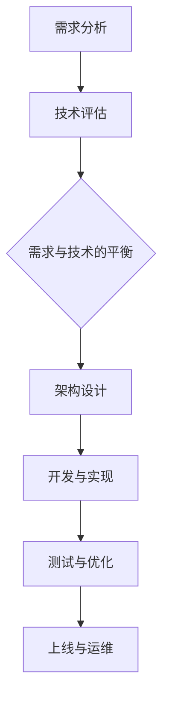

                 

### 《需求与技术可行性的平衡：大型应用开发的挑战》

#### 引言

在当今数字化时代，大型应用的开发已经成为众多企业和组织的核心任务。从电子商务平台到智慧城市项目，从金融科技应用到社交媒体网络，大型应用的发展不仅改变了我们的生活方式，也推动了技术的进步和创新。然而，在这繁荣的背后，大型应用开发也面临着诸多挑战。其中，需求与技术可行性的平衡无疑是最大的挑战之一。

需求和技术可行性，这两个看似独立的领域，实际上在大型应用开发中息息相关。需求代表了用户和市场的期望，是推动项目发展的动力。而技术可行性则关注于现有技术手段是否能够满足这些需求，是确保项目成功的基础。如何在需求与技术可行性之间找到平衡，成为了大型应用开发中至关重要的课题。

本文将围绕这一主题展开，首先介绍大型应用的定义与特点，深入探讨需求分析和技术可行性分析的核心概念。接着，我们将讨论技术栈与架构设计的重要性，以及如何通过性能优化策略提升系统的响应速度和稳定性。随后，文章将重点介绍需求管理、技术可行性评估、敏捷开发与迭代等策略，以帮助开发团队在需求与技术之间实现平衡。

此外，文章还将通过实际案例研究和项目实战，展示如何在实际项目中应用这些策略，实现需求与技术可行性的有效平衡。通过这些探讨，我们希望能够为大型应用开发提供一些实用的思路和方法，帮助开发团队应对挑战，实现项目成功。

#### 关键词

- 大型应用开发
- 需求分析
- 技术可行性
- 技术栈选择
- 架构设计
- 性能优化
- 需求管理
- 敏捷开发

#### 摘要

本文旨在探讨大型应用开发中需求与技术可行性的平衡问题。首先，通过介绍大型应用的定义与特点，以及需求分析和技术可行性分析的核心概念，为读者奠定理论基础。随后，文章深入讨论技术栈与架构设计的重要性，并分析性能优化策略对系统的影响。接着，文章重点介绍需求管理、技术可行性评估、敏捷开发与迭代等策略，以帮助开发团队在需求与技术之间实现平衡。最后，通过实际案例研究和项目实战，文章展示了如何在实际项目中应用这些策略，实现需求与技术可行性的有效平衡。本文的目标是提供实用的思路和方法，帮助开发团队应对大型应用开发中的挑战，确保项目成功。

#### 第一部分：背景与理论基础

##### 第1章：大型应用开发概述

#### 1.1 大型应用的定义与特点

大型应用，通常指的是那些在规模、复杂性、用户数量和业务需求上具有显著特征的应用系统。它们往往涉及多个业务领域，具有高度集成性和高并发性，能够处理大规模的数据和用户请求。大型应用的定义和特点可以从以下几个方面进行描述：

1. **规模与复杂性**：大型应用通常包含数百万甚至数十亿行代码，涉及多种编程语言和开发框架。其系统架构复杂，需要分布式计算和存储方案来支持高并发和高可用性。

2. **用户数量与并发性**：大型应用往往服务于广泛的用户群体，用户数量庞大。在高并发环境下，系统需要快速响应大量的用户请求，同时保持稳定性和性能。

3. **业务需求与多样性**：大型应用需要满足各种复杂的业务需求，如实时数据处理、业务逻辑复杂计算、个性化服务、安全控制等。这些需求对系统的设计、开发和维护提出了极高的要求。

4. **数据管理**：大型应用通常涉及海量数据的管理和存储，包括数据的收集、存储、处理和分析。这要求系统具备高效的数据库管理和数据访问机制，以支持快速的数据查询和分析。

5. **高可用性与容错性**：由于服务用户数量庞大，大型应用需要具备高可用性和容错性，以确保在任何情况下都能提供稳定的服务。这通常通过冗余设计、故障转移和自动恢复机制来实现。

6. **安全性与合规性**：大型应用往往涉及敏感数据和用户隐私，需要满足各种安全标准和合规要求。系统需要具备严格的访问控制和加密机制，以防止数据泄露和未经授权的访问。

#### 大型应用的发展历程

大型应用的发展历程可以追溯到20世纪末。随着互联网的普及和电子商务的兴起，大型应用开始出现在金融、零售、物流和社交媒体等领域。最初，这些应用主要采用传统的单体架构，但随着业务需求的增加和系统复杂性的提升，单体架构逐渐暴露出扩展性差、维护困难等问题。

在21世纪初，随着分布式计算、微服务架构和云计算等技术的兴起，大型应用的开发方法开始发生重大变革。分布式计算和微服务架构使得系统可以更加灵活地扩展，同时提高了系统的可靠性和维护性。云计算提供了强大的基础设施支持，使得开发团队能够更专注于业务逻辑的实现，而不是基础设施的管理。

近年来，大型应用的发展还受到人工智能、物联网和区块链等新兴技术的推动。这些技术不仅为大型应用带来了新的功能和服务，也对其开发方法和技术架构提出了新的要求。

#### 大型应用的技术挑战

大型应用在开发过程中面临诸多技术挑战，主要包括以下几个方面：

1. **系统架构设计**：大型应用需要设计一个高效、可扩展和易于维护的系统架构。这通常涉及到分布式计算、微服务架构、容器化技术等复杂的技术选型和实现。

2. **性能优化**：大型应用需要处理海量数据和大量用户请求，性能优化是一个重要的挑战。这包括数据库优化、缓存策略、网络优化和负载均衡等方面。

3. **安全性**：大型应用往往涉及敏感数据和安全需求，需要采取严格的安全措施来防止数据泄露和恶意攻击。这包括身份验证、加密、访问控制和安全审计等方面。

4. **持续集成与持续部署（CI/CD）**：大型应用的开发和运维需要高效的持续集成和持续部署流程。这要求开发团队能够快速迭代和发布新功能，同时确保系统的稳定性和安全性。

5. **数据管理和分析**：大型应用需要高效的数据管理和分析能力，以支持实时数据处理和复杂的数据分析。这通常涉及到大数据技术、数据仓库和数据分析平台等。

6. **用户体验**：大型应用需要提供优质的用户体验，以满足用户的需求和期望。这包括响应速度、界面设计、交互体验和个性化服务等方面。

通过深入了解大型应用的定义与特点、发展历程和技术挑战，我们可以更好地理解大型应用开发的重要性和复杂性。这为后续章节中需求分析、技术可行性分析、架构设计、性能优化等内容的深入探讨提供了基础。

#### 1.2 需求分析的核心概念

需求分析是大型应用开发过程中的关键环节，其核心目的是确保项目能够准确满足用户和市场的需求。需求分析不仅仅是一个技术活动，更是一个涉及多方面利益相关者沟通和理解的过程。以下是需求分析的核心概念和方法论：

##### 需求分析的方法论

1. **用户研究**：用户研究是需求分析的基础，通过深入了解用户的需求、行为和使用场景，可以更好地定义和设计系统的功能。用户研究的方法包括用户访谈、问卷调查、用户行为分析等。

2. **需求捕获**：需求捕获是需求分析的核心步骤，其目的是从用户和利益相关者那里获取清晰、具体的需求。需求捕获的方法包括需求会议、需求文档编写、原型设计等。

3. **需求分类**：需求分类有助于将需求按照类型、优先级和实现难度进行分类，以便更好地管理和实现。常见的需求分类方法包括功能性需求、非功能性需求、优先级排序（如MoSCoW方法）等。

4. **需求文档**：需求文档是需求分析的最终成果，它详细描述了系统的功能和性能需求。一份良好的需求文档应包括需求描述、用户故事、功能规范和验收标准等。

##### 需求捕获的实践技巧

1. **用户访谈**：用户访谈是一种直接获取用户需求的有效方法。通过面对面的交流，开发团队可以深入了解用户的需求、痛点和期望。在访谈过程中，应注重倾听和观察，避免过度引导。

2. **问卷调查**：问卷调查适用于大规模的用户群体，可以快速收集大量用户意见。设计问卷时，应确保问题的清晰性、针对性，并注意问题的逻辑性和合理性。

3. **用户场景分析**：用户场景分析是一种通过构建用户使用产品的场景，来理解用户需求和行为的技巧。这种方法可以帮助开发团队更好地把握用户需求，并设计出更加贴近用户的产品功能。

4. **用户故事地图**：用户故事地图是一种可视化工具，用于描述用户在使用产品过程中的主要任务和步骤。通过用户故事地图，开发团队可以更好地理解用户的操作流程，并据此设计系统的功能模块。

5. **原型设计**：原型设计是一种快速创建系统原型的方法，通过原型，开发团队可以与用户和利益相关者进行交互，获取反馈，并进行迭代优化。原型设计工具如Sketch、Axure等可以帮助团队高效地完成原型设计。

##### 需求变更控制

需求变更控制是需求管理中的重要环节，其目的是确保需求变更不会对项目造成负面影响。以下是一些需求变更控制的关键点：

1. **变更请求**：任何需求变更都应通过正式的变更请求流程进行。变更请求应包括变更的描述、影响评估和优先级。

2. **影响评估**：在批准任何需求变更之前，应对变更对项目的时间、成本和质量等方面的影响进行评估。这有助于确保变更的合理性和可行性。

3. **变更审批**：需求变更应经过利益相关者的审批，确保变更符合项目目标和资源约束。

4. **变更管理**：需求变更应纳入项目管理计划，并纳入版本控制系统中，以确保变更的可追溯性和一致性。

5. **沟通与协调**：需求变更涉及多个利益相关者，因此在变更过程中应保持良好的沟通与协调，确保变更的实施和效果。

通过上述需求分析的方法论和实践技巧，开发团队能够更准确地理解用户需求，有效地管理需求变更，从而确保项目能够按照预期目标顺利进行。在大型应用开发中，需求分析是一个持续迭代和优化的过程，它为后续的系统设计、开发、测试和部署提供了坚实的基础。

#### 1.3 技术可行性分析

技术可行性分析是大型应用开发过程中不可或缺的一环，其核心目的是评估现有技术手段是否能够满足项目需求，并识别潜在的技术风险。技术可行性分析不仅决定了项目的技术路线，还直接影响项目的成本、进度和质量。以下将详细阐述技术可行性分析的步骤、评估指标和风险缓解策略。

##### 技术评估的步骤

1. **需求分析**：在技术评估之前，首先需要对项目需求进行详细分析。这包括功能性需求和非功能性需求，如性能、安全性、可靠性等。明确需求有助于确定技术评估的具体方向。

2. **技术调研**：针对项目需求，对现有技术进行全面的调研和分析。这包括了解各种技术方案的优势、劣势、适用场景和潜在问题。技术调研可以借助专业报告、技术社区、技术文档等资源。

3. **技术选型**：在调研的基础上，根据项目需求和技术条件，选择最适合的技术方案。技术选型应综合考虑技术成熟度、社区支持、开发成本和团队熟悉度等因素。

4. **可行性评估**：对选定的技术方案进行可行性评估。评估内容包括技术实现难度、开发周期、成本估算、资源需求等。通过可行性评估，确定技术方案是否满足项目要求。

5. **风险评估**：识别和评估潜在的技术风险。这包括技术复杂性、资源依赖、技术变更风险等。对每个风险进行详细分析，评估其对项目的影响和可能性。

6. **决策与汇报**：根据技术评估的结果，制定技术决策，并形成正式的技术评估报告。报告应包括评估过程、评估结果、风险评估和推荐方案。

##### 技术评估指标

在进行技术可行性分析时，常用的评估指标包括以下几个方面：

1. **技术成熟度**：技术成熟度是评估技术方案是否稳定和可靠的重要指标。技术成熟度模型（Technology Readiness Level, TRL）是一个常用的评估框架，分为1到9级，级别越高表示技术越成熟。

2. **开发成本**：开发成本是技术评估的关键指标之一，包括人力成本、硬件成本、软件成本等。通过成本估算，可以评估技术方案的财务可行性。

3. **开发周期**：开发周期是项目成功的关键因素。评估技术方案的开发周期，有助于制定合理的时间计划和进度安排。

4. **资源需求**：资源需求包括人力资源、硬件资源和软件资源等。评估资源需求，可以确保项目在资源分配上的合理性和可行性。

5. **技术社区支持**：技术社区支持是评估技术方案的另一个重要指标。社区活跃度和社区资源（如文档、示例代码、社区论坛等）的丰富程度，直接影响技术方案的可维护性和可持续性。

6. **安全性**：安全性是技术评估中的一个关键点。评估技术方案的安全性能，可以确保系统在面临各种安全威胁时能够保持稳定和安全。

##### 技术风险评估

技术风险评估是技术可行性分析中的重要环节，旨在识别和缓解潜在的技术风险。以下是一些常见的技术风险评估方法：

1. **风险识别**：通过技术调研和需求分析，识别项目中可能面临的技术风险。风险识别可以采用头脑风暴、故障树分析（FTA）等方法。

2. **风险分类**：将识别出的风险按照类型进行分类，如技术复杂性、资源依赖、技术变更风险等。分类有助于更清晰地理解风险，并采取相应的缓解措施。

3. **风险评估**：对每个风险进行详细评估，包括风险发生的可能性、风险的影响程度等。风险评估可以采用定性评估（如风险矩阵）和定量评估（如风险概率和影响分析）。

4. **风险缓解**：根据风险评估结果，制定风险缓解策略。风险缓解策略包括风险规避、风险减轻、风险转移和风险接受等。通过风险缓解，可以降低风险对项目的负面影响。

5. **风险监控**：在项目开发过程中，持续监控技术风险的变化。通过定期评估和调整风险缓解措施，确保项目能够及时应对风险。

通过上述步骤和指标，技术可行性分析可以帮助开发团队在需求与技术之间找到平衡，确保项目能够顺利实施和交付。在大型应用开发中，技术可行性分析不仅为项目的成功奠定了基础，也为团队在后续开发过程中提供了重要的指导和保障。

#### 1.4 技术评估的实例

为了更好地理解技术评估的过程和方法，下面我们将通过一个具体的实例来详细阐述技术评估的步骤和如何进行技术可行性分析。

假设我们正在开发一款大型电子商务平台，该项目的主要目标是提供一个高性能、高可用性和安全的在线购物体验。具体需求包括用户注册与登录、商品浏览与搜索、购物车管理、订单处理和支付等功能。此外，系统还需要支持大量并发用户，并能够处理大规模的交易数据。

##### 1.4.1 技术调研

在确定项目需求后，我们首先需要进行技术调研，了解市场上现有技术方案的情况。以下是一些关键步骤：

1. **前端技术选型**：在电子商务平台中，前端技术是用户体验的核心。我们调研了多种前端技术方案，包括React、Vue和Angular。经过比较，我们决定选择React，因为它具有良好的组件化设计、灵活的生态系统和强大的社区支持。

2. **后端技术选型**：对于后端技术，我们调研了多种框架，如Spring Boot、Django和Node.js。考虑到系统的性能和可扩展性，我们最终选择了Spring Boot，因为它支持Java的高并发处理能力和成熟的微服务架构。

3. **数据库选型**：在数据库方面，我们评估了关系数据库（如MySQL和PostgreSQL）和NoSQL数据库（如MongoDB和Cassandra）。由于电子商务平台需要处理大量的结构化数据，我们选择了MySQL作为主要数据库。

4. **缓存技术**：为了提高系统的性能和响应速度，我们评估了多种缓存技术，如Redis和Memcached。最终选择了Redis，因为它具有更高的性能和更好的数据结构支持。

##### 1.4.2 可行性评估

在技术调研的基础上，我们对选定的技术方案进行可行性评估。以下是一些关键指标：

1. **技术成熟度**：根据技术成熟度模型（TRL），React、Spring Boot和MySQL都处于7-9级，表示这些技术已经非常成熟，可以满足项目的需求。

2. **开发成本**：通过估算人力成本、硬件成本和软件成本，我们得出该项目的开发成本大约为100万美元。这个成本在预算范围内，且具有可行性。

3. **开发周期**：根据团队的经验和资源，我们预计开发周期为6个月，包括需求分析、设计、开发和测试等阶段。

4. **资源需求**：该项目需要10名开发人员、1名数据库管理员和2名测试人员，资源需求合理。

5. **技术社区支持**：React、Spring Boot和MySQL都有丰富的社区资源和支持，有助于项目开发和问题解决。

##### 1.4.3 风险评估

在可行性评估的基础上，我们对项目可能面临的技术风险进行了评估：

1. **技术复杂性**：React和Spring Boot的复杂性较高，可能会影响开发进度和团队协作。为了缓解这一风险，我们计划进行充分的培训和技术交流。

2. **资源依赖**：数据库和缓存技术的选型可能导致资源依赖，影响系统的性能。我们计划通过性能测试和优化来缓解这一风险。

3. **技术变更风险**：技术方案的变更可能会影响项目的进度和质量。我们将制定严格的技术变更控制流程，确保变更的合理性和可行性。

通过上述技术评估实例，我们可以看到技术评估是一个系统化、全面化的过程，它不仅帮助团队选择了合适的技术方案，还为项目的成功实施提供了重要保障。

#### 第2章：技术栈与架构设计

##### 2.1 技术栈的选择

技术栈的选择是大型应用开发中的关键决策之一，它直接影响系统的性能、可扩展性、维护性和开发效率。一个合理的技术栈不仅能够满足项目的需求，还能提高团队的开发效率和项目的整体质量。下面我们将探讨前端技术选型、后端技术选型和数据库选型，并提供一些实际案例。

##### 前端技术选型

前端技术选型主要取决于项目的需求、团队技能和开发效率。以下是一些常见的前端技术选项：

1. **React**：React 是一个由Facebook推出的开源JavaScript库，以其组件化和声明式编程模式而闻名。它具有良好的性能、丰富的生态系统和强大的社区支持。React 的虚拟DOM技术使得页面渲染更加高效，适用于需要高交互性和动态内容的电商和社交应用。

   **实际案例**：阿里巴巴的淘宝网和京东商城都使用了React进行前端开发，取得了显著的性能提升和用户体验改进。

2. **Vue**：Vue 是一个渐进式的前端框架，由尤雨溪（Evan You）开发。它设计简洁、易于上手，适用于中小型项目。Vue 的双向数据绑定和虚拟DOM技术同样提供了良好的性能。

   **实际案例**：滴滴出行和知乎都在其平台的前端开发中使用了Vue，有效提高了开发效率和用户体验。

3. **Angular**：Angular 是由Google开发的成熟的前端框架，以其强大的数据绑定和依赖注入机制而著称。它适用于复杂的企业级应用，但学习曲线较陡峭。

   **实际案例**：谷歌的Google Maps和微软的Azure都使用了Angular进行前端开发，确保了应用的高性能和高可靠性。

##### 后端技术选型

后端技术选型的关键在于选择适合项目需求的技术框架和编程语言，以实现高效的业务逻辑处理和数据管理。以下是一些常见后端技术选项：

1. **Spring Boot**：Spring Boot 是一个基于Spring框架的轻量级开发框架，它简化了Spring应用的配置和部署过程。Spring Boot 的模块化设计、丰富的生态系统和高性能使其成为企业级后端开发的理想选择。

   **实际案例**：许多大型电商和金融应用，如亚马逊和汇丰银行，都使用了Spring Boot 进行后端开发。

2. **Django**：Django 是一个高性能的Python Web框架，以其“电池即开箱”的特性而著名。它提供了自动化的ORM、内置的用户认证系统和灵活的中间件，适用于快速开发中小型Web应用。

   **实际案例**：社交媒体平台如Instagram和Dropbox 使用了Django 进行后端开发，有效提升了开发速度和系统性能。

3. **Node.js**：Node.js 是一个基于Chrome V8引擎的JavaScript运行环境，它以单线程、高并发的特点而著称。Node.js 适用于实时应用、微服务和物联网等场景，特别是在处理高并发请求时表现出色。

   **实际案例**：阿里巴巴的钉钉和微信小程序后端服务都使用了Node.js，实现了高效的实时通信和数据处理。

##### 数据库选型

数据库选型需要根据数据类型、数据规模、查询性能和事务处理要求等因素进行。以下是一些常见数据库选项：

1. **MySQL**：MySQL 是一个流行的开源关系数据库管理系统，以其高性能、可靠性和易于维护的特点而受到广泛青睐。它适用于需要高并发读写和数据持久化的应用。

   **实际案例**：Facebook 和 LinkedIn 等大型社交平台使用 MySQL 存储用户数据和社交关系。

2. **MongoDB**：MongoDB 是一个高性能、开源的文档数据库，它以灵活的数据模型、水平扩展能力和高性能查询而著称。MongoDB 适用于处理大量非结构化数据和高并发读写场景。

   **实际案例**：亚马逊的 AWS Lambda 和 Netflix 的推荐系统都使用了 MongoDB 存储大规模数据。

3. **Redis**：Redis 是一个开源的内存数据结构存储系统，以其高性能、持久性和丰富的数据结构而受到欢迎。它适用于缓存、会话管理和实时数据处理等场景。

   **实际案例**：Twitter 和 百度 使用 Redis 来缓存高频访问的数据，显著提升了系统性能和响应速度。

通过合理选择前端技术、后端技术和数据库，开发团队可以构建一个高效、可扩展和稳定的系统。实际案例表明，不同的技术栈适合不同的应用场景，开发团队应根据项目需求和技术条件进行灵活选择。

##### 2.2 架构设计原则

架构设计是大型应用开发中的关键环节，它决定了系统的可扩展性、可维护性和可靠性。一个良好的架构设计不仅可以满足当前的需求，还能够适应未来可能的变更和扩展。以下是大型应用架构设计中的几个重要原则：

1. **分层架构**：分层架构是一种常见的系统架构设计方法，它将系统分为多个层次，每个层次负责不同的功能。典型的分层包括表示层、业务逻辑层和数据访问层。这种设计方法有助于提高系统的模块化程度，降低各层之间的耦合度，从而提高系统的可维护性和可扩展性。

2. **微服务架构**：微服务架构是一种将应用程序分解为多个独立、小型服务的架构设计方法。每个微服务负责实现特定的业务功能，并可以通过轻量级的通信协议（如RESTful API或消息队列）进行交互。微服务架构具有高可扩展性、高可用性和高容错性，同时降低了系统的复杂度，使开发、测试和部署变得更加灵活。

3. **分布式计算**：分布式计算是将任务分散到多个计算节点上进行处理的方法。通过分布式计算，系统可以处理大规模的数据和用户请求，提高系统的性能和可扩展性。分布式计算通常涉及负载均衡、数据分片和冗余设计等技术，以实现高效的资源利用和故障恢复。

4. **模块化设计**：模块化设计是将系统分解为多个独立的模块，每个模块负责特定的功能。模块之间通过清晰的接口进行通信，降低了模块之间的依赖性，提高了系统的可维护性和可扩展性。模块化设计有助于代码的重用，使开发过程更加高效。

5. **安全性设计**：在架构设计中，安全性是一个重要的考虑因素。系统应采用严格的安全措施，包括身份验证、授权、数据加密和访问控制等，以防止未经授权的访问和数据泄露。此外，系统还应具备安全的日志记录和审计功能，以便在发生安全事件时进行追溯和应对。

6. **高可用性设计**：高可用性设计旨在确保系统在任何情况下都能够提供稳定的服务。这通常通过冗余设计、故障转移和自动恢复机制来实现。系统应具备容错能力，能够在发生故障时自动切换到备用节点，保证服务的连续性。

7. **性能优化**：性能优化是架构设计中的重要环节，它涉及数据库优化、缓存策略、网络优化和负载均衡等方面。通过性能优化，系统能够更快地响应用户请求，提供更好的用户体验。

通过遵循上述架构设计原则，开发团队可以构建一个高效、可扩展、可靠的大型应用系统。这些原则不仅适用于当前的需求，也为未来的扩展和变更提供了良好的基础。

##### 2.3 性能优化策略

在大型应用开发中，性能优化是一个至关重要的环节，它直接影响用户体验和系统稳定性。以下是一些常见的性能优化策略，包括数据库优化、系统缓存策略和网络优化：

1. **数据库优化**：
   - **索引优化**：合理地创建索引可以显著提高数据库查询速度。索引应该根据查询频率和查询条件进行设计，避免不必要的索引。
   - **查询优化**：优化SQL查询是提升数据库性能的关键。通过减少查询的复杂度、避免子查询、减少数据扫描等手段，可以显著提高查询效率。
   - **分库分表**：对于数据量巨大的系统，可以通过分库分表来降低单表的数据量，从而提高查询性能。分库分表需要合理设计数据一致性策略，以避免数据冗余和更新延迟。
   - **读写分离**：通过主从复制和读写分离，可以减轻主数据库的读写压力，提高系统的整体性能。主数据库负责处理写操作，从数据库负责处理读操作。

2. **系统缓存策略**：
   - **内存缓存**：使用内存缓存（如Redis）可以显著提高数据访问速度。内存缓存适用于读取频繁、数据量较小的场景。
   - **分布式缓存**：对于大型应用，可以使用分布式缓存系统（如Memcached）来提高缓存的可扩展性和性能。分布式缓存可以部署在多个节点上，以支持更高的并发访问。
   - **缓存一致性**：缓存的一致性是性能优化的关键。通过使用缓存同步机制（如缓存穿透、缓存雪崩和缓存穿透）、版本控制等技术，可以确保缓存数据的一致性。

3. **网络优化**：
   - **负载均衡**：通过负载均衡（如Nginx、HAProxy），可以将用户请求分配到多个服务器上，提高系统的处理能力和响应速度。
   - **内容分发网络（CDN）**：使用CDN可以将静态内容（如图片、视频和CSS/JavaScript文件）缓存到全球多个节点，从而提高用户访问速度和降低带宽消耗。
   - **HTTP压缩**：使用HTTP压缩（如GZIP压缩），可以减少数据传输量，提高页面加载速度。HTTP压缩适用于文本和数据传输，不适合压缩图片和视频等大文件。

4. **代码优化**：
   - **减少HTTP请求**：通过合并CSS/JavaScript文件、使用图片精灵等技术，可以减少HTTP请求次数，提高页面加载速度。
   - **异步加载**：对于非核心内容和资源，可以使用异步加载技术（如异步JavaScript和CSS加载），减少页面初始加载时间。
   - **代码压缩与混淆**：通过压缩和混淆代码（如使用UglifyJS和CSSNano），可以减少文件大小，提高加载速度。

通过综合运用上述性能优化策略，开发团队能够显著提高大型应用系统的性能和响应速度，为用户提供更好的体验。

#### 第3章：需求管理

##### 3.1 需求管理流程

需求管理是确保项目成功的关键环节，它涉及到需求获取、需求分析和需求变更控制等多个方面。一个完善的需求管理流程可以有效地保障项目需求的清晰性、一致性和可追踪性。以下是大型应用开发中需求管理流程的详细描述：

1. **需求获取**：需求获取是需求管理的第一步，其目的是从用户、利益相关者和市场等方面获取项目需求。需求获取的方法包括用户访谈、问卷调查、用户场景分析、市场调研等。通过这些方法，开发团队可以全面了解用户的需求、痛点和期望，为后续的需求分析奠定基础。

2. **需求分析**：需求分析是对获取到的需求进行分类、整理和分析的过程。需求分析主要包括以下步骤：
   - **需求分类**：将获取到的需求按照功能、优先级、依赖关系等维度进行分类，以便于管理和实现。常见的分类方法包括功能需求、性能需求、安全需求等。
   - **需求验证**：通过用户验证、专家评审等方式，确保需求描述的准确性和完整性。需求验证有助于发现需求中的遗漏和矛盾，提高需求的可靠性。
   - **需求文档**：编写详细的需求文档，包括需求描述、用户故事、功能规范和验收标准等。需求文档是需求管理的核心成果，为后续的开发、测试和交付提供依据。

3. **需求变更控制**：需求变更控制是确保项目需求稳定性的重要措施。在项目开发过程中，需求变更在所难免，但需确保变更不会对项目的进度、成本和质量产生负面影响。需求变更控制主要包括以下步骤：
   - **变更请求**：任何需求变更都应通过正式的变更请求流程进行。变更请求应包括变更描述、影响评估和优先级。
   - **影响评估**：对变更请求的影响进行评估，包括对时间、成本、质量等方面的影响。通过评估，确定变更的可行性和必要性。
   - **变更审批**：变更请求需经过利益相关者的审批，确保变更符合项目目标和资源约束。变更审批应遵循严格的流程和权限。
   - **变更实施**：在批准变更后，将其纳入项目管理计划，并进行相应的调整和优化。变更实施过程中，需保持与利益相关者的沟通，确保变更的顺利执行。
   - **变更记录**：记录所有变更的详细信息，包括变更请求、评估结果、审批流程和实施情况。变更记录有助于追踪和管理需求变更，确保变更的可追溯性和一致性。

通过以上需求管理流程，开发团队能够有效地获取、分析和控制需求，确保项目能够按照预期目标顺利推进。需求管理的有效实施，不仅有助于提高项目成功率，还能提升团队协作效率和用户满意度。

##### 3.2 用户参与与反馈

在大型应用开发中，用户的参与和反馈是需求管理的重要组成部分。通过与用户的紧密互动，开发团队能够更好地理解用户需求，发现潜在问题，并及时调整项目方向，确保最终产品能够满足用户期望。以下是用户参与与反馈的几种有效方法：

1. **用户访谈**：用户访谈是一种直接获取用户需求和行为信息的有效方法。通过面对面的交流，开发团队可以深入了解用户的痛点和期望，获取真实的用户反馈。用户访谈应包括以下步骤：
   - **访谈准备**：确定访谈对象、访谈目标和访谈大纲，为访谈提供清晰的框架。
   - **访谈过程**：在访谈过程中，注重倾听用户的意见，避免过度引导，确保用户能够自由表达自己的想法。
   - **访谈记录**：详细记录访谈内容，包括用户的需求、建议和反馈，为后续的需求分析和设计提供依据。

2. **用户场景分析**：用户场景分析是一种通过构建用户使用产品的场景，来理解用户需求和行为的技巧。通过用户场景分析，开发团队能够更好地把握用户的使用流程，发现潜在的需求和改进点。用户场景分析应包括以下步骤：
   - **场景构建**：根据用户访谈和用户行为数据，构建用户在使用产品过程中的主要任务和步骤。
   - **场景评估**：评估每个场景的复杂度、用户操作流程和用户体验，确定需要改进和优化的方面。
   - **场景优化**：根据场景评估结果，调整和优化产品的功能设计，提高用户体验。

3. **用户调研**：用户调研是一种通过问卷调查、在线调查等方式，收集大量用户意见的方法。用户调研应包括以下步骤：
   - **调研设计**：设计调研问卷，确保问题的清晰性、针对性和合理性。
   - **调研实施**：通过邮件、在线平台等方式，分发调研问卷，收集用户反馈。
   - **数据分析**：对调研结果进行统计分析，提取有价值的信息，为需求分析和设计提供依据。

4. **用户反馈机制**：建立有效的用户反馈机制，可以确保用户的意见和建议能够及时传递到开发团队。用户反馈机制应包括以下方面：
   - **反馈渠道**：提供多种反馈渠道，如在线反馈表单、社交媒体、用户论坛等，方便用户提出意见和建议。
   - **反馈处理**：建立反馈处理流程，对用户反馈进行分类、评估和优先级排序，确保反馈得到及时处理和回应。
   - **反馈汇报**：定期向用户反馈处理结果，确保用户对项目的进展和改进有清晰的了解。

通过用户参与与反馈，开发团队能够更好地理解用户需求，提高产品的质量，并增强用户满意度。有效的用户参与与反馈机制，不仅有助于项目成功，也为企业的长期发展奠定了基础。

##### 3.3 需求优先级排序

在大型应用开发中，需求优先级排序是一个关键的管理活动，它有助于确保团队能够集中资源和精力，优先实现对项目成功最具影响力的功能。以下是两种常见的需求优先级排序方法：MoSCoW方法和Kano模型。

**MoSCoW方法**

MoSCoW方法是一种基于优先级分类的需求排序方法，它将需求分为四个类别：Must have（必须要有）、Should have（应该有）、Could have（可以有）和Would have（最好有）。

1. **Must have（必须要有）**：这类需求是项目成功的关键，没有这些功能，项目将无法达到预期目标。必须优先实现，确保项目的核心功能具备。
2. **Should have（应该有）**：这类需求是项目成功的补充，如果时间和资源允许，应该优先实现。这些功能对项目的成功有一定影响，但不是不可或缺的。
3. **Could have（可以有）**：这类需求是项目成功的可选功能，如果时间和资源有限，可以暂时不实现。这些功能对项目的成功影响较小，但有助于提升用户体验和竞争力。
4. **Would have（最好有）**：这类需求是项目成功的理想状态，如果时间和资源充足，可以尝试实现。这些功能对项目的成功影响较小，但有助于提升产品的完善度和用户体验。

**Kano模型**

Kano模型是一种基于用户满意度的需求排序方法，它将需求分为五个类别：基本型、期望型、魅力型、无差异型和反向型。

1. **基本型**：这类需求是用户的基本需求，没有这些功能，用户将不满意。例如，手机的基本功能包括拨打电话和发送短信。
2. **期望型**：这类需求是用户期望的功能，提供这些功能可以提升用户的满意度。例如，智能手机的摄像头和触摸屏功能。
3. **魅力型**：这类需求是用户未预见的创新功能，提供这些功能可以极大地提升用户的满意度。例如，智能手机的指纹识别和安全支付功能。
4. **无差异型**：这类需求对用户的满意度没有显著影响，无论是否提供，用户都不会有特别的感觉。例如，手机的颜色和包装。
5. **反向型**：这类需求是用户不希望看到的功能，提供这些功能反而会降低用户的满意度。例如，在手机上强制安装一些用户不喜欢的应用程序。

通过使用MoSCoW方法和Kano模型，开发团队能够清晰地识别和排序需求，确保项目资源能够被高效地利用，优先实现最具价值和影响的功能。这种方法不仅有助于项目的成功，还能提高用户满意度和产品竞争力。

#### 第4章：技术可行性评估

##### 4.1 技术评估指标

技术可行性评估是确保项目成功的关键步骤，它涉及到多个技术指标，用于评估选定的技术方案是否能够满足项目的需求。以下是几种常见的技术评估指标：

1. **技术成熟度模型（Technology Readiness Level, TRL）**：
   - **TRL1**：基本原理观察到。
   - **TRL2**：基本原理证明。
   - **TRL3**：可行性原理证明。
   - **TRL4**：设计、开发和集成。
   - **TRL5**：形式验证和测试。
   - **TRL6**：实际系统应用。
   - **TRL7**：广泛领域应用。
   - **TRL8**：生产级系统应用。
   - **TRL9**：商业生产应用。
   技术成熟度越高，技术方案越可靠，风险越低。

2. **成本效益分析（Cost-Benefit Analysis, CBA）**：
   成本效益分析是一种评估项目成本和预期收益的方法，通过比较总成本和总收益，确定技术方案的经济可行性。成本包括开发成本、运营成本和维护成本，收益则包括商业收益、用户体验改善和市场份额等。

3. **开发周期（Development Cycle）**：
   开发周期是指从项目启动到完成所需的时间。较长的开发周期可能意味着更高的风险，因为技术可能在此期间发生变化。评估开发周期时，需要考虑项目规模、团队技能和资源可用性。

4. **资源需求（Resource Requirements）**：
   资源需求包括人力资源、硬件资源和软件资源等。评估技术方案的资源需求有助于确定项目是否在预算范围内，并确保团队有足够的资源来实施项目。

5. **技术社区支持（Community Support）**：
   技术社区的支持程度是评估技术方案的一个重要指标。一个活跃的技术社区可以提供丰富的文档、示例代码和社区论坛，帮助开发团队解决技术难题，提高开发效率。

6. **安全性（Security）**：
   安全性是技术评估的关键因素，特别是在涉及用户数据和敏感信息的项目中。评估技术方案的安全性包括数据加密、访问控制和安全审计等方面。

7. **可维护性（Maintainability）**：
   可维护性是指技术方案在未来是否容易维护和升级。高可维护性的技术方案使用清晰的代码结构、良好的文档和模块化设计，使得维护和更新更加高效。

通过综合考虑这些技术评估指标，开发团队能够全面评估技术方案的可行性，确保项目在技术上的可行性和成功率。

##### 4.2 技术风险评估

技术风险评估是确保项目成功的重要环节，它涉及到识别、分类、评估和缓解潜在的技术风险。以下是一些常见的技术风险评估方法和策略：

1. **风险识别**：
   - **头脑风暴**：通过团队成员的集体讨论，识别项目中可能出现的风险。头脑风暴有助于发现潜在的威胁和机会。
   - **历史数据分析**：分析以往项目中的风险记录，从中提取经验教训，预测新项目可能面临的风险。
   - **专家评审**：邀请领域专家对项目进行评审，识别技术难题和潜在风险。

2. **风险分类**：
   - **技术复杂性**：评估技术实现难度和团队的技术能力，确定复杂技术的风险等级。
   - **资源依赖**：识别项目中对关键资源的依赖性，如开发工具、硬件设备和外部服务，评估这些资源可能带来的风险。
   - **技术变更**：评估技术方案在开发过程中可能面临的技术变更风险，如技术更新、升级或替换。

3. **风险评估**：
   - **定性评估**：使用风险矩阵（如概率-影响矩阵）对风险进行定性评估，确定每个风险的重要性和紧急性。
   - **定量评估**：通过成本估算、时间评估和资源消耗等定量方法，评估每个风险对项目的具体影响。

4. **风险缓解**：
   - **风险规避**：通过改变项目计划或技术方案，避免风险的发生。
   - **风险减轻**：采取措施降低风险发生的概率或影响程度，如增加冗余设计、备份方案和故障转移机制。
   - **风险转移**：通过保险、合同条款等方式，将风险转移给第三方，如将系统维护和升级责任转移给外部供应商。
   - **风险接受**：对于无法规避或减轻的风险，制定应急预案和应对策略，确保项目在风险发生时能够迅速恢复。

通过系统的技术风险评估，开发团队能够提前识别和应对潜在的技术风险，确保项目的顺利实施和成功交付。

##### 4.3 技术创新与迭代

在大型应用开发中，技术创新和迭代是推动项目成功的重要策略。通过快速原型开发和持续集成与持续部署（CI/CD），团队能够迅速响应需求变化，提高开发效率和产品质量。

**快速原型开发**

快速原型开发是一种通过快速构建可交互的初步版本，以验证需求和设计的方法。以下是其关键步骤：

1. **需求明确**：在开始原型开发之前，确保需求清晰明确，避免后续返工。
2. **原型设计**：使用原型设计工具（如Axure、Sketch等）创建低保真或高保真的原型界面，模拟用户操作流程。
3. **迭代开发**：根据用户反馈和需求变更，对原型进行多次迭代优化。每次迭代都应聚焦于解决一个或几个具体问题。
4. **用户测试**：邀请目标用户对原型进行测试，收集反馈意见，评估用户体验和功能是否符合预期。

**持续集成与持续部署（CI/CD）**

持续集成与持续部署是现代软件开发中的重要实践，通过自动化流程提高代码质量和部署效率。以下是其关键步骤：

1. **代码仓库管理**：使用版本控制系统（如Git）管理代码，确保代码的版本控制和协作开发。
2. **集成构建**：集成构建是将各个开发者的代码合并到一起，进行编译和测试的过程。自动化集成构建可以及时发现和解决代码冲突和错误。
3. **测试**：在集成构建过程中，运行一系列自动化测试，包括单元测试、集成测试和性能测试，确保代码质量和功能完整性。
4. **部署**：通过自动化部署脚本，将经过测试的代码部署到生产环境。自动化部署可以减少手动操作，提高部署效率和稳定性。
5. **监控与反馈**：部署后，实时监控系统的性能和状态，收集用户反馈和错误日志，及时发现问题并采取相应措施。

通过快速原型开发和持续集成与持续部署，团队能够快速响应需求变化，缩短开发周期，提高产品质量，从而在大型应用开发中实现需求与技术可行性的有效平衡。

#### 第5章：敏捷开发与迭代

##### 5.1 敏捷开发方法论

敏捷开发是一种以人为核心、迭代、增量和可持续开发为特征的方法论，它强调团队协作、快速反馈和持续改进。以下是敏捷开发的核心思想、价值观和流程：

**核心思想**：
1. **个体与互动胜过过程与工具**：团队中每个成员的创意和努力比依赖特定的工具或流程更加重要。
2. **可工作的软件胜过详细的文档**：优先交付可运行的软件，文档作为辅助，确保团队成员能够理解和维护代码。
3. **客户合作胜过合同谈判**：与客户保持紧密合作，确保项目能够满足客户的实际需求。
4. **响应变化胜过遵循计划**：敏捷开发强调适应性，鼓励团队在面对变化时能够灵活调整计划。

**价值观**：
1. **个体和互动**：重视团队合作和沟通，通过面对面的交流提高工作效率。
2. **可工作的软件**：关注实际交付的功能，确保每次迭代都能提供有价值的成果。
3. **客户协作**：与客户保持持续互动，确保项目方向始终符合客户需求。
4. **响应变化**：欢迎变化，并在项目过程中灵活应对，以快速适应市场和环境的变化。

**流程**：
1. **迭代开发**：项目被分解为多个短期迭代，每个迭代都提供一个可交付的工作成果。
2. **增量交付**：每次迭代都增加新的功能，逐步完善整个系统。
3. **持续交付**：通过自动化测试和持续集成，确保每次迭代后都能顺利交付。
4. **回顾与改进**：在每个迭代结束时进行回顾，总结经验教训，持续改进开发过程。

敏捷开发方法论的这些特点和原则，使得团队能够更快速、更高效地响应需求变化，确保项目成功。

##### 5.2 迭代开发与用户反馈

迭代开发是敏捷开发的核心实践之一，它通过分阶段、分功能地逐步实现项目，确保每次迭代都能交付有价值的成果。以下是如何在迭代开发中实现用户反馈的详细步骤：

1. **需求规划**：在每次迭代开始时，团队应与产品负责人和用户代表一起确定本次迭代的目标和优先级。需求规划应考虑用户反馈和市场变化，确保每次迭代都能满足用户需求。
2. **迭代计划**：根据需求规划，团队制定详细的迭代计划，包括任务分配、时间表和关键里程碑。迭代计划应保持灵活性，以便在开发过程中根据实际情况进行调整。
3. **开发与测试**：在迭代开发过程中，团队应专注于实现和测试本次迭代的功能。通过自动化测试和持续集成，确保每次迭代交付的代码质量。
4. **用户反馈**：在每次迭代结束时，团队应与用户代表和产品负责人进行演示和讨论，收集用户反馈。用户反馈包括功能是否满足需求、用户体验是否良好、是否存在缺陷等。
5. **迭代优化**：根据用户反馈，团队应立即进行相应的优化和调整。这些优化和调整可以包括功能改进、界面优化和性能提升等。
6. **持续迭代**：将用户反馈和优化结果纳入下一个迭代计划，确保项目在每次迭代后都能持续改进。通过不断迭代，团队能够逐步完善产品，提高用户满意度。

通过迭代开发和用户反馈，团队能够快速响应需求变化，确保产品在开发过程中始终保持与用户需求的紧密对接。

##### 5.3 敏捷实践案例分析

为了更好地理解敏捷开发在大型应用开发中的实际应用，以下我们将通过两个案例，分别展示成功的敏捷实践和失败的敏捷实践。

**案例一：电子商务平台**

**成功实践**：

1. **需求规划**：团队与产品负责人紧密合作，通过用户调研和市场分析，确定了电子商务平台的核心功能和用户体验需求。每次迭代都围绕这些需求进行规划和开发。

2. **迭代计划**：团队遵循敏捷原则，将整个项目划分为多个短周期迭代，每个迭代持续2-4周。每次迭代都设定具体的目标和里程碑，确保在规定时间内交付可工作的软件。

3. **开发与测试**：在迭代开发过程中，团队采用Scrum框架，每日进行站会，跟踪进度和解决问题。通过自动化测试和持续集成，确保每次迭代交付的代码质量。

4. **用户反馈**：每次迭代结束时，团队邀请用户进行产品演示和反馈。用户反馈成为后续迭代优化的重要依据，确保产品功能满足用户需求。

5. **持续迭代**：根据用户反馈和市场需求，团队持续优化产品功能，逐步完善电子商务平台。通过不断迭代，平台在用户体验、性能和安全性等方面得到了显著提升。

**案例二：金融科技应用**

**失败实践**：

1. **需求规划**：团队在开始项目前未能充分了解市场需求和用户需求，导致需求规划不清晰。每次迭代开始时，需求变更频繁，导致开发计划频繁调整。

2. **迭代计划**：团队未能严格遵守敏捷原则，迭代周期过长，每次迭代持续6-8周。这导致开发进度缓慢，团队工作效率低下。

3. **开发与测试**：在迭代开发过程中，团队缺乏有效的测试和持续集成流程，导致代码质量问题频出。每次迭代结束时，测试工作量大，修复缺陷耗费大量时间。

4. **用户反馈**：由于迭代周期过长，用户反馈无法及时收集和响应。每次迭代结束后，用户反馈堆积，导致团队无法迅速调整和优化产品。

5. **持续迭代**：团队在项目后期意识到问题，试图通过增加迭代频率进行补救，但已经无法挽回项目进度和用户满意度。

通过这两个案例，我们可以看到敏捷开发在实践中可以取得成功，但必须严格遵守敏捷原则，保持团队协作和用户反馈的紧密对接。失败的敏捷实践通常源于需求规划不足、迭代周期过长和测试流程缺失等问题。

#### 第6章：大型应用开发实战

##### 6.1 项目规划与资源调配

大型应用开发项目的成功离不开周密的项目规划和有效的资源调配。项目规划是项目管理的核心环节，它包括项目的目标设定、范围界定、进度安排、资源分配和风险控制等多个方面。以下是一些关键步骤和策略：

1. **项目目标设定**：明确项目的目标和期望成果。目标应具体、可衡量、可实现、相关性强和时间限制。例如，项目的目标可以是开发一个高性能的电子商务平台，并在六个月内实现上线。

2. **范围界定**：确定项目的范围，明确项目需要实现的功能和业务需求。这包括详细的功能列表、性能指标、安全要求和用户体验等。范围界定有助于避免项目范围蔓延，确保项目在可控范围内完成。

3. **进度安排**：制定详细的项目进度计划，包括关键里程碑、任务分解和工作计划。进度安排应考虑项目规模、团队技能和资源可用性，确保项目按计划推进。常用的进度管理工具包括甘特图、敏捷看板和项目管理软件。

4. **资源分配**：合理分配项目所需的人力、硬件和软件资源。资源分配应考虑项目的规模、复杂性和团队的专业技能，确保每个团队成员都有明确的职责和工作量。资源调配过程中，应灵活调整资源分配，以应对项目进度和需求的变化。

5. **风险管理**：识别和评估项目风险，制定相应的风险缓解措施。常见的项目风险包括技术风险、资源风险、市场风险和时间风险。通过建立风险登记册和定期风险评审，确保项目风险得到有效管理。

6. **沟通与协作**：建立有效的沟通机制，确保项目团队成员之间的信息传递和协作畅通。定期召开项目会议、工作汇报和反馈会，确保项目进展透明，团队成员之间的沟通和协作顺畅。

通过上述项目规划和资源调配策略，开发团队能够确保大型应用项目在合理的时间、成本和质量范围内顺利推进。

##### 6.2 技术实现与难点攻克

在大型应用开发中，技术实现是项目的核心环节，它决定了系统的性能、稳定性和用户体验。以下将详细介绍技术实现过程、核心技术组件的实现方法以及解决复杂问题的策略。

**技术实现过程**

1. **需求分析与设计**：在项目启动阶段，团队需详细分析需求，制定系统设计文档。这包括系统架构设计、模块划分、接口定义和数据模型设计等。需求分析和设计是技术实现的基础，确保后续开发工作有序进行。

2. **编码与单元测试**：根据设计文档，开发团队开始编码实现系统的各个模块。在编码过程中，团队需遵循良好的编程规范和代码风格，确保代码的可读性和可维护性。完成编码后，进行单元测试，验证每个模块的功能是否正确。

3. **集成测试与系统测试**：在模块级测试完成后，团队进行集成测试，将各个模块集成在一起，确保系统整体功能的正确性和性能。随后进行系统测试，模拟实际用户场景，验证系统的稳定性和用户体验。

4. **性能测试与优化**：性能测试是大型应用开发的重要环节，通过模拟高并发、大数据量等极端场景，评估系统的性能瓶颈。根据测试结果，进行性能优化，如数据库优化、缓存策略调整、代码重构等，提高系统的响应速度和处理能力。

5. **安全测试与加固**：在系统上线前，进行安全测试，包括漏洞扫描、代码审计、渗透测试等，确保系统具备良好的安全性。针对发现的安全问题，进行加固和修复，确保系统的安全运行。

**核心技术组件的实现方法**

1. **前端技术组件**：前端技术组件的实现方法主要包括：
   - **React/Vue/Angular**：使用这些主流前端框架进行组件化开发，提高代码复用性和可维护性。
   - **API调用与数据处理**：使用Ajax、Fetch等API调用技术，与后端服务进行数据交互，实现数据的展示和动态更新。
   - **状态管理**：使用Redux/Vuex等状态管理库，管理复杂的数据状态，确保组件间的数据同步和状态一致性。

2. **后端技术组件**：后端技术组件的实现方法主要包括：
   - **Spring Boot/Django/Node.js**：选择适合的后端框架，实现业务逻辑处理、数据存储和接口服务等功能。
   - **RESTful API/GraphQL**：使用RESTful API或GraphQL等技术，实现前后端的数据交互，提高系统的灵活性和扩展性。
   - **数据库管理**：使用MySQL/MongoDB等数据库，设计合理的数据库模型和索引，优化数据查询和存储性能。

3. **缓存技术**：使用Redis/Memcached等缓存技术，提高系统的响应速度和吞吐量。常见缓存策略包括页面缓存、对象缓存和会话缓存等。

**解决复杂问题的策略**

1. **分布式系统架构**：对于高并发、大数据量的应用，采用分布式系统架构，如微服务、容器化和负载均衡等，提高系统的可扩展性和可靠性。

2. **性能优化**：通过数据库优化、缓存策略、代码优化和负载均衡等手段，提高系统的性能和响应速度。例如，使用连接池、缓存中间件、异步处理等。

3. **安全性设计**：采用严格的安全措施，如身份验证、授权、数据加密和访问控制等，确保系统的安全性和数据隐私。

4. **容错与恢复**：设计容错机制和自动恢复策略，确保系统在故障发生时能够快速恢复，降低对用户体验的影响。例如，故障转移、备份和自愈机制等。

通过上述技术实现和解决策略，开发团队能够高效地实现大型应用系统，确保系统的性能、稳定性和安全性，为用户提供优质的服务体验。

##### 6.3 项目验收与上线

项目验收与上线是大型应用开发中的关键环节，它决定了系统是否能够顺利交付并投入实际使用。以下是一些关键步骤和注意事项：

1. **验收标准制定**：在项目启动阶段，团队应与客户和产品负责人一起制定详细的验收标准。验收标准应包括功能测试、性能测试、安全测试和用户体验等方面。确保所有验收标准清晰明确，便于后续验收工作。

2. **验收测试**：根据验收标准，进行全面的验收测试。验收测试通常包括以下内容：
   - **功能测试**：验证系统的各项功能是否按照需求规范正确实现。
   - **性能测试**：评估系统在高并发、大数据量等极端条件下的性能和稳定性。
   - **安全测试**：检查系统是否存在安全漏洞，如SQL注入、XSS攻击等。
   - **用户体验测试**：评估系统的界面设计、交互设计和易用性。

3. **问题修复与迭代**：在验收测试过程中，如果发现任何问题或不符合验收标准的地方，应立即进行修复。修复后，再次进行验收测试，确保问题得到彻底解决。

4. **上线准备**：在系统通过验收测试后，进行上线准备。包括以下内容：
   - **环境配置**：配置生产环境，包括服务器、数据库、缓存等。
   - **数据迁移**：将测试环境的数据迁移到生产环境，确保数据的完整性和一致性。
   - **版本管理**：确保代码版本控制系统的版本与上线版本一致，避免出现版本冲突。

5. **上线策略**：制定详细的上线策略，包括以下内容：
   - **灰度发布**：逐步将流量引入新系统，观察系统运行情况，确保系统稳定。
   - **应急计划**：准备应急预案，如系统故障、数据丢失等，确保能够迅速响应和解决。
   - **监控与反馈**：上线后，实时监控系统的运行状态和性能指标，收集用户反馈和问题报告。

6. **上线后的维护**：系统上线后，团队需持续进行维护和监控，确保系统的稳定运行。包括以下内容：
   - **性能优化**：定期进行性能测试，优化系统性能，提高用户体验。
   - **安全加固**：定期进行安全测试和漏洞扫描，加强系统安全防护。
   - **用户支持**：提供及时的用户支持和服务，解决用户在使用过程中遇到的问题。

通过上述步骤和注意事项，开发团队能够确保大型应用项目顺利验收和上线，为用户提供稳定、高效和安全的系统服务。

### 第7章：案例研究

在本章节中，我们将深入分析三个大型应用开发案例，分别为电子商务平台开发、智慧城市项目和金融科技应用。通过这些案例，我们将探讨需求与技术可行性的平衡策略，技术风险评估与应对措施，项目成果与经验总结，以及所遇到的主要挑战和解决方案。

#### 案例一：电子商务平台开发

**项目背景与需求**

电子商务平台项目旨在构建一个集商品浏览、购物车、订单管理和支付功能于一体的在线购物体验。项目需求包括高并发处理、快速响应、安全支付和良好的用户体验。由于用户量庞大，系统需要具备良好的扩展性和高可用性。

**技术评估与架构设计**

在技术评估阶段，团队选择了React作为前端框架，Spring Boot作为后端框架，MySQL作为数据库。技术评估过程中，团队重点关注了技术成熟度、社区支持、开发成本和资源需求。为了确保系统的可扩展性和高可用性，团队采用了微服务架构，将业务功能分解为多个独立服务。

**需求与技术平衡策略**

1. **需求规划**：通过用户访谈和问卷调查，团队明确了用户对购物体验的高要求。需求规划过程中，团队采用了MoSCoW方法，将需求分为“必须有”和“应该有”两类，确保核心功能优先实现。

2. **用户参与与反馈**：项目开发过程中，团队定期与用户代表进行沟通，收集用户反馈。通过用户故事地图，团队能够清晰地了解用户的使用场景和需求，及时调整和优化产品功能。

3. **敏捷开发**：团队采用敏捷开发方法，每次迭代持续2周，通过短周期迭代快速响应需求变化，确保产品功能逐步完善。

**项目成果与经验总结**

项目在预定时间内完成，上线后用户量迅速增长，用户体验良好。项目成功的关键因素包括：

1. **微服务架构**：微服务架构使得系统具有良好的扩展性和高可用性，能够支持大规模用户并发处理。

2. **用户参与与反馈**：通过与用户的紧密互动，团队能够及时调整产品功能，满足用户需求。

3. **敏捷开发**：敏捷开发方法使得团队能够快速响应需求变化，提高开发效率。

**主要挑战与解决方案**

1. **技术复杂性**：微服务架构虽然提高了系统的可扩展性，但也增加了系统的复杂度。团队通过文档化和代码规范，确保代码的可维护性。

2. **性能优化**：在高并发环境下，系统性能成为关键挑战。团队通过数据库优化、缓存策略和负载均衡等技术，显著提高了系统性能。

#### 案例二：智慧城市项目

**项目背景与需求**

智慧城市项目旨在通过物联网、大数据和人工智能技术，提升城市的管理和服务水平。项目需求包括实时交通监控、环境监测、公共安全管理和智能基础设施管理。项目需要处理海量数据，并确保数据的高效传输和处理。

**技术评估与架构设计**

在技术评估阶段，团队选择了Spring Boot作为后端框架，Apache Kafka用于消息队列，Hadoop和Spark用于大数据处理。技术评估过程中，团队重点关注了技术成熟度、数据处理能力、扩展性和安全性。

**需求与技术平衡策略**

1. **需求分析**：通过多方调研和用户访谈，团队明确了智慧城市项目的核心需求和用户痛点。需求分析过程中，团队采用了Kano模型，确保基础功能优先实现。

2. **技术风险评估**：团队对项目可能面临的技术风险进行了详细评估，包括数据安全、系统稳定性和数据处理能力。针对评估结果，团队制定了相应的风险缓解措施。

3. **分布式架构**：为了确保系统的高可用性和扩展性，团队采用了分布式架构，将不同功能模块部署在多个服务器上，实现负载均衡和故障转移。

**项目成果与经验总结**

项目在预定时间内完成，实现了实时交通监控、环境监测和智能基础设施管理等功能。项目成功的关键因素包括：

1. **分布式架构**：分布式架构提高了系统的可靠性和性能，能够处理海量数据。

2. **数据安全**：通过严格的数据加密和访问控制，确保用户数据的安全。

3. **用户参与与反馈**：通过与用户的紧密互动，团队能够及时调整和优化系统功能。

**主要挑战与解决方案**

1. **数据处理能力**：海量数据对系统性能和处理能力提出了高要求。团队通过大数据处理技术和优化算法，提高了数据处理能力。

2. **系统稳定性**：系统在高并发环境下需要保持稳定运行。团队通过故障转移和冗余设计，确保了系统的稳定性。

#### 案例三：金融科技应用

**项目背景与需求**

金融科技（FinTech）应用项目旨在开发一款集支付、转账、投资和理财功能于一体的移动应用程序。项目需求包括高安全性、实时交易处理、合规性和良好的用户体验。由于金融行业的特殊性，系统需要确保数据的保密性和安全性。

**技术评估与架构设计**

在技术评估阶段，团队选择了Node.js作为后端框架，MongoDB作为数据库，Redis用于缓存。技术评估过程中，团队重点关注了技术成熟度、性能、扩展性和安全性。

**需求与技术平衡策略**

1. **需求管理**：通过用户调研和需求分析，团队明确了用户对金融科技应用的高要求。需求管理过程中，团队采用了MoSCoW方法，将需求分为“必须有”和“应该有”两类。

2. **技术风险评估**：团队对项目可能面临的技术风险进行了详细评估，包括系统安全性、数据隐私和法律法规合规。针对评估结果，团队制定了相应的风险缓解措施。

3. **敏捷开发**：团队采用敏捷开发方法，每次迭代持续2周，通过短周期迭代快速响应需求变化。

**项目成果与经验总结**

项目在预定时间内完成，上线后用户量迅速增长。项目成功的关键因素包括：

1. **敏捷开发**：敏捷开发方法使得团队能够快速响应需求变化，提高开发效率。

2. **安全性设计**：通过严格的安全措施，确保系统数据的安全和用户的隐私。

3. **用户参与与反馈**：通过与用户的紧密互动，团队能够及时调整和优化系统功能。

**主要挑战与解决方案**

1. **系统安全性**：金融科技应用需要确保系统的安全性，防止数据泄露和未经授权的访问。团队通过加密技术、访问控制和安全审计等手段，确保系统安全。

2. **合规性**：金融行业有严格的法律法规要求。团队通过与法律法规专家的合作，确保系统符合相关法规要求。

通过上述案例研究，我们可以看到在不同类型的大型应用开发中，需求与技术可行性的平衡策略和技术风险评估与应对措施是项目成功的关键。在实际开发过程中，团队需要根据项目的具体情况，灵活调整策略和方案，以确保项目能够顺利实施和交付。

### 附录

#### 附录A：工具与技术资源

**A.1 开发工具与平台介绍**

**1. 开发环境搭建**

- **前端开发环境**：
  - **Visual Studio Code**：一款强大的代码编辑器，支持多种编程语言，提供丰富的插件和扩展。
  - **Node.js**：用于构建前端应用程序，提供高效的服务器和网络功能。

- **后端开发环境**：
  - **IntelliJ IDEA**：一款功能强大的Java集成开发环境，提供代码补全、调试、性能分析等功能。
  - **Docker**：用于容器化部署应用程序，提高开发效率和部署灵活性。

**2. 开发工具使用指南**

- **前端开发工具**：
  - **Webpack**：用于模块打包和代码优化，提高前端应用程序的性能。
  - **Babel**：用于将ES6+代码转换为兼容现代浏览器的代码，确保代码的兼容性。

- **后端开发工具**：
  - **Maven**：用于项目构建和管理，提供依赖管理和构建优化。
  - **Git**：用于版本控制和代码管理，确保代码的版本一致性。

**A.2 代码示例与模板**

以下提供几个常见的代码示例和模板，供开发者参考：

**1. 前端React组件模板**
```jsx
import React from 'react';

const MyComponent = () => {
  return (
    <div>
      {/* 组件内容 */}
    </div>
  );
};

export default MyComponent;
```

**2. 后端Spring Boot控制器模板**
```java
import org.springframework.web.bind.annotation.GetMapping;
import org.springframework.web.bind.annotation.RestController;

@RestController
public class MyController {

  @GetMapping("/hello")
  public String hello() {
    return "Hello, World!";
  }
}
```

**3. Redis缓存配置模板**
```yaml
# redis配置
spring:
  redis:
    host: localhost
    port: 6379
    password: yourpassword
    database: 0
```

**A.3 参考文献**

**1. 相关书籍推荐**

- 《深入理解计算机系统》（作者：Randal E. Bryant & David R. O’Hallaron）
- 《大话设计模式》（作者：刘未鹏）
- 《Effective Java》（作者：Joshua Bloch）

**2. 标准与技术规范引用**

- **RESTful API设计规范**：[RESTful API Design Guide](https://restfulapi.net/)
- **Docker官方文档**：[Docker Documentation](https://docs.docker.com/)
- **Spring Boot官方文档**：[Spring Boot Documentation](https://docs.spring.io/spring-boot/docs/current/reference/html/)

通过上述工具与技术资源，开发团队能够高效地进行大型应用开发，提高开发质量和效率。

### Mermaid 流程图示例



### 核心算法伪代码示例

```pseudo
// 伪代码：K-Means算法
Initialize centroids
for i = 1 to K do
    Select a random data point as centroid
end

Repeat until convergence do
    For each data point x in the dataset
        Assign x to the nearest centroid
    End
    Update centroids by averaging the assigned data points
End
```

### 数学模型与公式示例

$$
y = mx + b
$$

### 项目实战代码解读示例

```python
# Python代码：API请求示例
import requests

# 发送GET请求
response = requests.get('https://api.example.com/data')

# 检查响应状态码
if response.status_code == 200:
    # 解析响应内容
    data = response.json()
    print("Data retrieved successfully:", data)
else:
    print("Failed to retrieve data. Status code:", response.status_code)

```

#### 代码解读与分析

1. **导入requests库**：首先，我们导入了Python的标准库`requests`，用于发送HTTP请求。

2. **发送GET请求**：使用`requests.get()`方法发送GET请求到指定的API端点（`https://api.example.com/data`）。这个方法返回一个`Response`对象，其中包含响应的状态码、头部信息和响应体。

3. **检查响应状态码**：我们使用`response.status_code`检查响应的状态码。如果状态码为200，表示请求成功。

4. **解析响应内容**：如果请求成功，我们使用`response.json()`方法将响应体解析为JSON格式的数据。这通常适用于API返回JSON格式的数据。

5. **打印结果**：如果请求成功，我们打印获取的数据；如果请求失败，我们打印错误消息和状态码。

通过这个简单的示例，我们可以看到如何使用Python的`requests`库来发送HTTP请求，并处理响应数据。这个示例是实际项目中的常见操作，可以用于从API获取数据，然后进行进一步的处理或展示。

### 结尾

综上所述，大型应用开发中的需求与技术可行性的平衡是一项复杂的任务，但它是项目成功的关键。通过深入了解大型应用的特点、需求分析的核心概念、技术可行性分析的方法论，以及技术栈和架构设计的重要性，开发团队能够为项目的顺利推进打下坚实的基础。

在需求管理方面，通过有效的需求获取、用户参与和反馈机制，团队能够确保产品始终满足用户需求。敏捷开发与迭代的方法论，如敏捷宣言、用户故事地图和持续集成与持续部署，为团队提供了快速响应需求变化、提高开发效率的途径。

通过案例研究，我们可以看到，无论是电子商务平台、智慧城市项目还是金融科技应用，需求与技术可行性的平衡策略和技术风险评估都是项目成功的关键。这些策略不仅帮助团队解决了技术复杂性、性能优化和安全性等挑战，还提升了用户体验和系统稳定性。

在大型应用开发中，始终需要保持对用户需求和技术发展的敏感性，灵活调整策略和方法。只有通过不断的实践、反思和改进，开发团队才能在需求与技术之间找到最佳的平衡点，实现项目的成功。

最后，希望本文能为读者提供有价值的思考和参考，帮助大家在大型应用开发中实现需求与技术可行性的有效平衡，为用户提供优质的应用体验。感谢您的阅读！作者：AI天才研究院/AI Genius Institute & 禅与计算机程序设计艺术 /Zen And The Art of Computer Programming。

