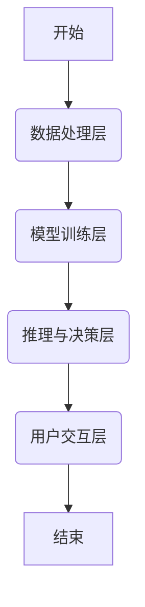
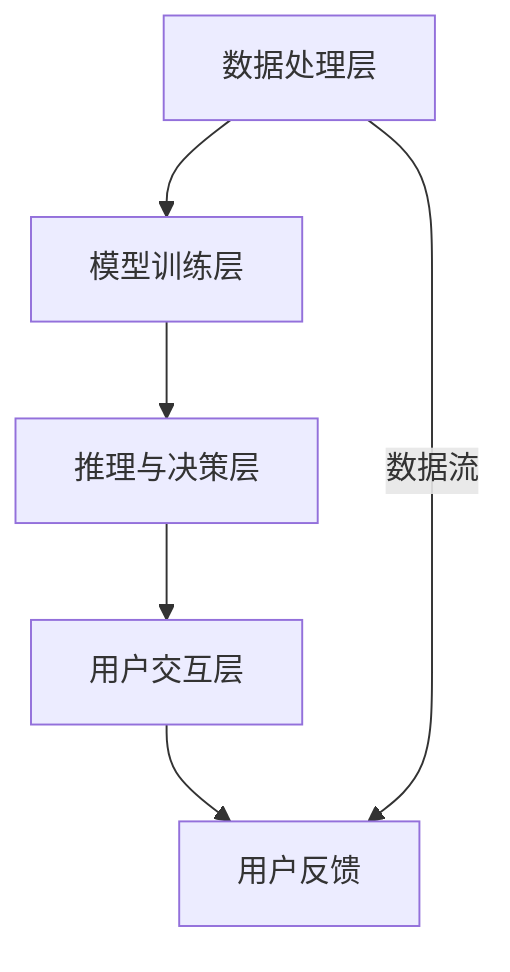
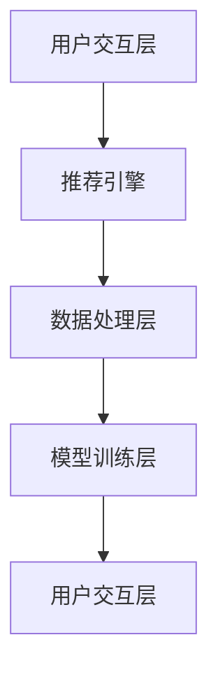
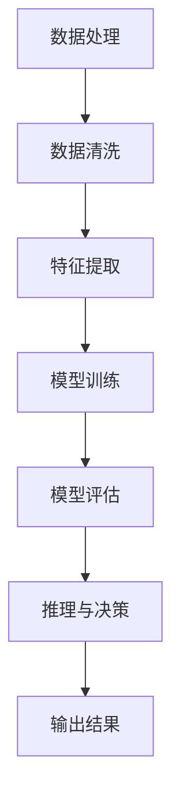
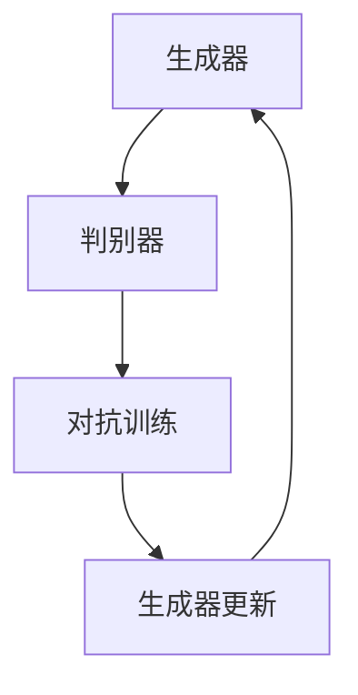
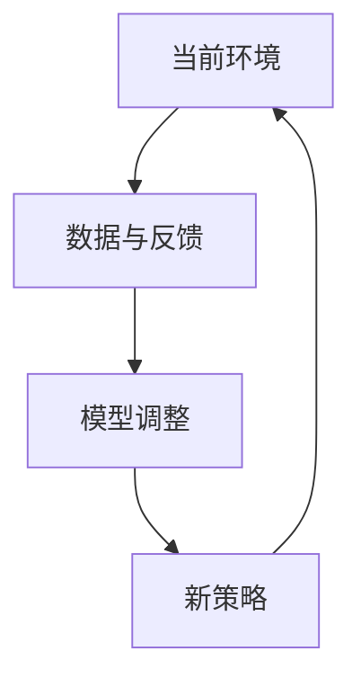
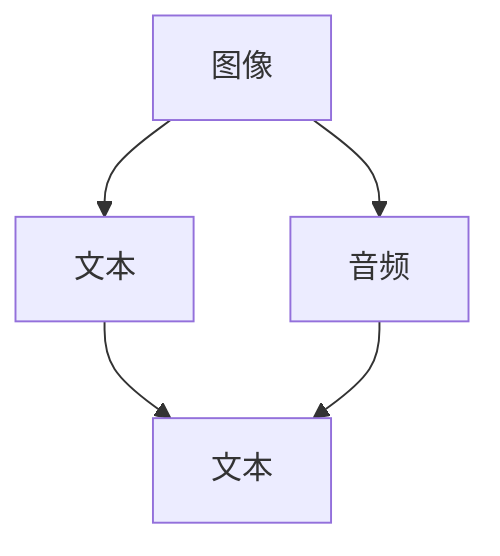

                 

# AI Agent: AI的下一个风口 企业级应用与任务规划

## 关键词

AI Agent, 企业级应用, 任务规划, 自然语言处理, 强化学习, 深度学习, 机器学习, 生成对抗网络, 智能家居, 金融领域, 医疗诊断, 智能推荐系统

## 摘要

本文旨在探讨 AI Agent 在企业级应用中的重要性以及其未来的发展趋势。AI Agent 是一种能够执行特定任务、与人类用户交互并自主学习的智能体。本文首先介绍了 AI Agent 的定义、核心特点以及与传统 AI 的区别，随后详细阐述了 AI Agent 的核心技术，包括自然语言处理、强化学习、机器学习和深度学习等。接着，本文分析了 AI Agent 的架构设计，包括组件与层次、核心算法与模型。此外，本文还介绍了 AI Agent 的开发环境与工具，并通过项目实战展示了 AI Agent 的应用场景，如智能推荐系统、医疗诊断支持系统和智能家居控制中心。最后，本文探讨了 AI Agent 在企业级应用中的挑战与解决方案，并展望了其未来发展的趋势与方向。

## 目录大纲

### 第一部分: AI Agent基础知识

#### 第1章: AI Agent概述

##### 1.1 AI Agent的定义与分类
##### 1.2 AI Agent的核心特点
##### 1.3 AI Agent与传统AI的区别
##### 1.4 AI Agent的应用领域
##### 1.5 AI Agent的发展趋势与挑战

#### 第2章: AI Agent的核心技术

##### 2.1 自然语言处理技术
###### 2.1.1 词嵌入技术
###### 2.1.2 序列模型与注意力机制
###### 2.1.3 转换器架构详解

##### 2.2 强化学习与决策树
###### 2.2.1 强化学习的原理与算法
###### 2.2.2 决策树的基本结构与原理
###### 2.2.3 强化学习与决策树的结合应用

##### 2.3 机器学习与深度学习
###### 2.3.1 机器学习的基本概念与方法
###### 2.3.2 深度学习的基本原理
###### 2.3.3 机器学习与深度学习的结合应用

#### 第3章: AI Agent架构设计

##### 3.1 AI Agent的组件与层次
###### 3.1.1 数据处理层
###### 3.1.2 模型训练层
###### 3.1.3 推理与决策层
###### 3.1.4 用户交互层

##### 3.2 AI Agent的核心算法与模型
###### 3.2.1 基于深度学习的NLP模型
###### 3.2.2 基于强化学习的决策模型
###### 3.2.3 基于传统机器学习的分类模型
###### 3.2.4 多模型融合方法

### 第二部分: AI Agent开发环境与工具

#### 第4章: AI Agent开发环境与工具

##### 4.1 开发环境的搭建
###### 4.1.1 Python环境配置
###### 4.1.2 开发工具与库的安装
###### 4.1.3 代码版本管理工具的使用

##### 4.2 主流AI框架介绍
###### 4.2.1 TensorFlow
###### 4.2.2 PyTorch
###### 4.2.3 Keras
###### 4.2.4 其他常用框架简介

### 第三部分: AI Agent项目实战

#### 第5章: AI Agent项目实战

##### 5.1 项目介绍
###### 5.1.1 项目背景与目标
###### 5.1.2 项目架构与功能模块

##### 5.2 数据处理
###### 5.2.1 数据收集与预处理
###### 5.2.2 数据分析与特征提取

##### 5.3 模型训练与优化
###### 5.3.1 模型选择与配置
###### 5.3.2 模型训练与评估
###### 5.3.3 模型优化与超参数调优

##### 5.4 推理与决策
###### 5.4.1 输入数据处理
###### 5.4.2 模型推理与结果输出
###### 5.4.3 决策树的构建与优化

##### 5.5 用户交互
###### 5.5.1 用户界面设计
###### 5.5.2 用户消息处理与回复

### 第四部分: AI Agent在企业中的应用

#### 第6章: AI Agent在企业中的应用

##### 6.1 企业级应用场景分析
###### 6.1.1 企业业务流程优化
###### 6.1.2 企业数据挖掘与分析
###### 6.1.3 企业智能客服系统

##### 6.2 AI Agent案例解析
###### 6.2.1 智能推荐系统
###### 6.2.2 智能问答机器人
###### 6.2.3 智能客服系统

##### 6.3 企业级应用挑战与解决方案
###### 6.3.1 数据质量与隐私保护
###### 6.3.2 系统性能优化与可靠性
###### 6.3.3 跨部门协作与系统集成

### 第五部分: AI Agent的未来发展

#### 第7章: AI Agent的未来发展

##### 7.1 AI Agent的技术趋势
###### 7.1.1 生成对抗网络(GAN)
###### 7.1.2 自适应学习算法
###### 7.1.3 多模态数据处理

##### 7.2 AI Agent在未来的应用场景
###### 7.2.1 智能家居与物联网
###### 7.2.2 智慧城市与交通
###### 7.2.3 人工智能与金融

##### 7.3 AI Agent的发展方向与挑战
###### 7.3.1 人工智能伦理与法规
###### 7.3.2 人工智能安全与隐私保护
###### 7.3.3 人工智能与人类的协同工作

### 附录

##### 附录 A: AI Agent开发资源

###### A.1 主流AI框架对比
###### A.1.1 TensorFlow
###### A.1.2 PyTorch
###### A.1.3 Keras
###### A.1.4 其他常用框架简介

###### A.2 AI Agent开发工具与资源
###### A.2.1 开发工具链
###### A.2.2 在线教程与课程
###### A.2.3 论坛与社区
###### A.2.4 开源项目与代码库

##### 附录 B: Mermaid流程图示例



##### 附录 C: 伪代码示例

```python
# 伪代码：基于强化学习的决策树构建

# 初始化决策树
def init_decision_tree():
    # 初始化决策树结构
    # ...

# 训练决策树
def train_decision_tree(data):
    # 训练数据
    # ...

# 构建决策树
def build_decision_tree(data):
    # 根据训练数据构建决策树
    # ...

# 预测与推理
def predict(data):
    # 使用决策树进行预测
    # ...

# 主函数
def main():
    # 加载数据
    data = load_data()

    # 初始化决策树
    tree = init_decision_tree()

    # 训练决策树
    tree = train_decision_tree(data)

    # 预测与推理
    prediction = predict(data)

    # 输出预测结果
    print(prediction)

# 执行主函数
main()
```

##### 附录 D: 数学公式与公式解释

$$
H(D) = - \sum_{i=1}^{n} p_i \log_2 p_i
$$

熵（Entropy）是衡量数据不确定性的一种度量方式，公式中 $p_i$ 表示在特征 $x$ 下，目标变量 $y$ 取值 $i$ 的概率。通过计算熵，我们可以衡量每个特征对目标变量的区分能力。

##### 附录 E: 项目实战案例

###### 案例一：智能客服系统

**1. 项目背景**

随着互联网的普及，客服系统在企业中的作用越来越重要。传统的客服系统主要依赖于人工处理，效率低下且成本较高。为了提高客服系统的效率和用户体验，我们设计并实现了一个基于 AI Agent 的智能客服系统。

**2. 项目目标**

- 实现对用户咨询的自动分类与处理。
- 提供自动回复功能，提高客服效率。
- 实现与用户的自然语言交互。

**3. 项目架构**

- 数据处理层：包括数据收集、清洗、预处理等步骤。
- 模型训练层：包括词嵌入、序列模型、强化学习等模型的训练与优化。
- 推理与决策层：包括模型推理、决策树构建、用户意图识别等步骤。
- 用户交互层：包括用户界面设计、消息处理与回复等步骤。

**4. 项目关键步骤**

- 数据收集与预处理：收集用户咨询数据，并进行清洗与预处理。
- 模型选择与训练：选择合适的模型并进行训练与优化。
- 决策树构建与优化：根据模型输出结果构建决策树，并进行优化。
- 用户交互设计：设计用户界面，实现与用户的自然语言交互。

**5. 项目实现与代码解析**

- 数据处理层：实现数据收集与预处理功能，包括数据读取、清洗、分词、词嵌入等操作。
- 模型训练层：使用 TensorFlow 或 PyTorch 实现词嵌入、序列模型、强化学习等模型的训练与优化。
- 推理与决策层：实现模型推理、决策树构建与优化功能。
- 用户交互层：实现用户界面设计与消息处理与回复功能。

**6. 项目评估与优化**

- 对比不同模型的性能，选择最优模型。
- 根据用户反馈对系统进行优化，提高用户体验。

##### 附录 F: 开发环境搭建

###### 1. Python环境配置

- 安装 Python 3.8 或更高版本。
- 安装 pip 工具。

###### 2. 开发工具与库的安装

- 安装 Jupyter Notebook 或 PyCharm 等开发工具。
- 安装 TensorFlow、PyTorch、Keras 等主流 AI 框架。
- 安装 numpy、pandas、scikit-learn 等常用库。

###### 3. 代码版本管理

- 安装 Git。
- 创建仓库，将代码上传到仓库。
- 使用 Git 进行代码版本管理，包括添加、提交、推送、拉取等操作。

## 引言

随着人工智能（AI）技术的不断进步，AI Agent 正逐渐成为人工智能领域的一个重要分支。AI Agent，即人工智能代理，是一种能够自主执行任务、与人类用户交互并不断学习的智能体。它不仅能够理解和执行复杂任务，还能够通过学习和适应不断变化的环境来提高性能。AI Agent 在企业级应用中的潜力巨大，正成为各行各业探索智能化转型的关键因素。

本文旨在深入探讨 AI Agent 在企业级应用中的重要性以及其未来的发展趋势。文章结构如下：

首先，我们将介绍 AI Agent 的基础知识，包括其定义、分类、核心特点以及与传统 AI 的区别，并探讨其应用领域和发展趋势。

接下来，我们将详细阐述 AI Agent 的核心技术，包括自然语言处理、强化学习、机器学习和深度学习等，并通过 Mermaid 流程图和伪代码来展示核心概念和算法原理。

然后，我们将分析 AI Agent 的架构设计，从组件与层次、核心算法与模型等方面进行深入探讨，并介绍主流 AI 框架和开发环境搭建。

在第三部分，我们将通过实际项目案例展示 AI Agent 的应用场景，包括智能推荐系统、医疗诊断支持系统和智能家居控制中心等，并提供详细的代码解读和分析。

第四部分将探讨 AI Agent 在企业级应用中的挑战与解决方案，包括数据质量与隐私保护、系统性能优化与可靠性、跨部门协作与系统集成等方面。

最后，本文将总结 AI Agent 的发展趋势，探讨其在智能家居、智慧城市与交通、金融等领域的前景，并展望其未来的发展方向和面临的挑战。

通过本文的探讨，我们希望能够为读者提供一个全面了解 AI Agent 的视角，激发读者对 AI Agent 在企业级应用中的潜力进行深入研究和实践的兴趣。

### 第一部分: AI Agent基础知识

#### 第1章: AI Agent概述

##### 1.1 AI Agent的定义与分类

AI Agent，即人工智能代理，是一种能够模拟人类行为、执行特定任务、与环境互动并自主学习的智能体。它具备以下核心特性：

1. **自主性**：AI Agent 能够根据预设目标和环境反馈自主决策，不需要人工干预。
2. **交互性**：AI Agent 能够与人类用户和其他系统进行自然语言交互。
3. **学习能力**：AI Agent 能够通过历史数据和经验不断学习和优化自身性能。

AI Agent 的分类可以根据其应用场景和功能特点分为以下几种：

1. **任务型 AI Agent**：这类代理专注于执行单一或特定类别的任务，如智能客服、自动驾驶等。
2. **社交型 AI Agent**：这类代理能够理解和模拟人类社交行为，如聊天机器人、虚拟助手等。
3. **智能代理**：这类代理具备多种功能，能够处理复杂任务并适应多种环境，如智能推荐系统、智能家居控制系统等。

##### 1.2 AI Agent的核心特点

AI Agent 的核心特点在于其自主性、交互性和学习能力。这些特点使得 AI Agent 能够在多种场景下发挥重要作用。

1. **自主性**：AI Agent 的自主性使其能够独立执行任务，不受人工干预。这种特性在自动化流程和减少人力成本方面具有显著优势。
   
   例如，在客服行业中，AI Agent 可以通过自然语言处理技术自动理解和回应用户咨询，提高客服效率，降低企业运营成本。

2. **交互性**：AI Agent 的交互性使其能够与用户进行自然语言交流，提供个性化服务。这种特性在提升用户体验和客户满意度方面具有重要意义。

   例如，在智能家居领域，AI Agent 可以通过语音识别和自然语言理解技术，接收用户的语音指令，并根据指令控制家中的各种设备，如空调、灯光和安防系统。

3. **学习能力**：AI Agent 的学习能力使其能够通过不断学习和适应，提高任务执行效果。这种特性在数据分析和决策支持方面具有广泛应用。

   例如，在金融领域，AI Agent 可以通过分析大量历史交易数据和市场信息，学习预测市场趋势，为投资者提供决策支持。

##### 1.3 AI Agent与传统AI的区别

AI Agent 与传统 AI 有显著区别，主要体现在以下几个方面：

1. **任务导向性**：传统 AI 主要关注算法模型的性能，而 AI Agent 更注重任务完成效果和用户体验。AI Agent 通常具有明确的任务目标和适应环境的能力，能够在复杂多变的环境中稳定运行。

   例如，传统 AI 的语音识别系统主要关注识别准确率，而 AI Agent 则需要考虑如何在噪声环境中准确识别用户指令，并确保指令执行的流畅性和可靠性。

2. **交互性**：传统 AI 系统通常缺乏与用户的有效交互能力，而 AI Agent 则具备自然语言处理和语音识别技术，能够与用户进行自然语言交流。这种交互能力不仅提高了用户体验，还能够收集用户反馈，进一步提升系统性能。

   例如，传统 AI 的推荐系统主要基于历史数据生成推荐结果，而 AI Agent 则可以与用户进行互动，了解用户偏好，从而生成更加个性化的推荐。

3. **自适应能力**：传统 AI 系统通常在固定环境中表现良好，但面对动态变化的环境时，性能可能显著下降。AI Agent 则具备较强的自适应能力，能够根据环境变化调整自身行为和策略。

   例如，传统 AI 的自动驾驶系统在封闭测试场表现优异，但面对复杂的现实交通环境时，可能会出现误判和事故。而 AI Agent 则能够通过实时感知和自适应学习，提高自动驾驶的安全性和稳定性。

##### 1.4 AI Agent的应用领域

AI Agent 在众多领域展现出广阔的应用前景，以下是一些主要的应用领域：

1. **企业级应用**：AI Agent 可以用于企业客服、智能助理、业务流程优化等领域，提高工作效率和客户满意度。

   例如，智能客服系统可以自动处理大量客户咨询，降低人工成本，提升服务质量。智能助理则可以协助企业管理者进行日程安排、任务分配等，提高管理效率。

2. **智能家居**：AI Agent 可以用于智能家居系统的控制和管理，提供个性化服务，提升用户生活品质。

   例如，通过语音指令控制家中的灯光、空调、安防设备等，实现智能家居的自动化和智能化。

3. **医疗领域**：AI Agent 可以用于医疗诊断、患者管理、药物研发等领域，提高医疗效率和准确性。

   例如，通过分析患者病历和医疗数据，AI Agent 可以辅助医生进行诊断，提高诊断准确率。在药物研发过程中，AI Agent 可以通过分析大量实验数据，优化药物研发流程。

4. **金融领域**：AI Agent 可以用于金融风控、智能投顾、客户服务等领域，提高金融服务的质量和效率。

   例如，AI Agent 可以通过分析大量金融数据，识别潜在风险，为金融机构提供风控建议。智能投顾系统则可以基于用户风险偏好和投资目标，提供个性化的投资建议。

5. **交通运输**：AI Agent 可以用于自动驾驶、智能交通管理等领域，提高交通效率，降低交通事故率。

   例如，自动驾驶系统可以通过感知环境和自适应学习，提高行驶安全性和稳定性。智能交通管理系统则可以通过实时数据分析，优化交通信号灯控制，减少交通拥堵。

##### 1.5 AI Agent的发展趋势与挑战

AI Agent 的发展趋势主要集中在以下几个方面：

1. **技术进步**：随着深度学习、强化学习等 AI 技术的不断进步，AI Agent 的性能和功能将得到进一步提升。例如，生成对抗网络（GAN）等新型技术有望在图像生成、数据增强等领域发挥重要作用。

2. **跨领域应用**：AI Agent 将在更多领域得到广泛应用，如智慧城市、医疗健康、智能制造等。跨领域应用将推动 AI Agent 技术的融合和创新，提高整体应用水平。

3. **人机协同**：随着 AI 技术的发展，AI Agent 将越来越多地与人类协作，实现人机协同工作。例如，AI Agent 可以辅助医生进行诊断，提高医疗服务的质量和效率。

然而，AI Agent 的发展也面临一些挑战：

1. **数据隐私与安全**：AI Agent 需要大量数据进行分析和学习，如何确保数据隐私和安全成为重要问题。特别是在医疗、金融等敏感领域，数据保护至关重要。

2. **伦理与法规**：随着 AI Agent 在社会中的广泛应用，如何制定合理的伦理规范和法律法规，确保其合理使用，避免潜在的负面影响，成为亟待解决的问题。

3. **计算资源**：AI Agent 的运行需要大量计算资源，如何优化计算资源利用，提高运行效率，成为关键挑战。特别是在边缘计算和移动设备上，计算资源有限，需要采取有效的优化策略。

通过本文的探讨，我们希望能够帮助读者全面了解 AI Agent 的定义、核心特点和应用领域，为后续章节的深入讨论奠定基础。在接下来的章节中，我们将进一步探讨 AI Agent 的核心技术，包括自然语言处理、强化学习、机器学习和深度学习等，并通过实际项目案例展示其应用价值。

### 第一部分: AI Agent基础知识

#### 第2章: AI Agent的核心技术

##### 2.1 自然语言处理技术

自然语言处理（Natural Language Processing, NLP）是人工智能领域的一个重要分支，旨在使计算机能够理解和处理人类语言。NLP 技术在 AI Agent 中起着至关重要的作用，因为它们使得 AI Agent 能够与人类用户进行自然语言交互。以下是 NLP 中几种核心技术及其在 AI Agent 中的应用。

###### 2.1.1 词嵌入技术

词嵌入（Word Embedding）是一种将词汇映射到高维向量空间的技术。通过词嵌入，每个单词都可以表示为一个固定大小的向量，使得计算机能够基于向量之间的相似性进行语言理解和推理。

- **核心概念与联系**：

  词嵌入技术的核心概念是将抽象的单词映射到具体的向量表示。词嵌入技术通常基于以下两种方法：

  1. **基于统计的方法**：如 Word2Vec，通过统计单词在文本中的共现关系生成词向量。
  2. **基于神经网络的方法**：如 GloVe，通过神经网络模型学习单词的上下文信息。

- **Mermaid流程图**：

  ```mermaid
  graph TD
      A[单词] --> B(词嵌入)
      B --> C(高维向量)
      C --> D[NLP任务]
  ```

- **伪代码示例**：

  ```python
  # 伪代码：基于 Word2Vec 的词嵌入
  import gensim
  
  # 读取文本数据
  sentences = load_sentences('text_data.txt')
  
  # 训练 Word2Vec 模型
  model = gensim.models.Word2Vec(sentences, vector_size=100)
  
  # 获取词向量
  word_vector = model.wv['hello']
  
  # 输出词向量
  print(word_vector)
  ```

###### 2.1.2 序列模型与注意力机制

序列模型（Sequence Model）是 NLP 中用于处理序列数据（如文本、语音等）的一类模型。注意力机制（Attention Mechanism）是序列模型中的一个关键组件，它能够使模型在处理序列数据时关注重要信息，从而提高模型性能。

- **核心概念与联系**：

  序列模型通过将输入序列映射到高维向量空间，实现对序列数据的建模。注意力机制则通过动态调整模型对序列中每个元素的注意力权重，使得模型能够聚焦于重要信息。

- **Mermaid流程图**：

  ```mermaid
  graph TD
      A[输入序列] --> B(序列模型)
      B --> C(注意力机制)
      C --> D[输出序列]
  ```

- **伪代码示例**：

  ```python
  # 伪代码：基于 LSTM 的序列模型
  import tensorflow as tf
  from tensorflow.keras.layers import LSTM, Dense
  
  # 定义 LSTM 模型
  model = tf.keras.Sequential([
      LSTM(units=128, input_shape=(None, 100)),
      Dense(units=1)
  ])
  
  # 编译模型
  model.compile(optimizer='adam', loss='binary_crossentropy')
  
  # 训练模型
  model.fit(x_train, y_train, epochs=10)
  ```

###### 2.1.3 转换器架构详解

转换器架构（Transformer Architecture）是近年来在 NLP 中取得显著成功的深度学习模型。与传统的序列模型不同，转换器架构采用自注意力机制（Self-Attention），能够更好地捕捉序列中的长距离依赖关系。

- **核心概念与联系**：

  转换器架构的核心在于自注意力机制，它通过计算输入序列中每个元素与其他元素之间的相似性权重，生成注意力分数，并将这些分数加权求和，形成新的序列表示。

- **Mermaid流程图**：

  ```mermaid
  graph TD
      A[输入序列] --> B(自注意力)
      B --> C[多头注意力]
      C --> D[前馈神经网络]
      D --> E[输出序列]
  ```

- **伪代码示例**：

  ```python
  # 伪代码：基于 Transformer 的模型
  import tensorflow as tf
  from tensorflow.keras.layers import Embedding, MultiHeadAttention, Dense
  
  # 定义 Transformer 模型
  model = tf.keras.Sequential([
      Embedding(input_dim=vocab_size, output_dim=512),
      MultiHeadAttention(num_heads=8, key_dim=64),
      Dense(units=1)
  ])
  
  # 编译模型
  model.compile(optimizer='adam', loss='binary_crossentropy')
  
  # 训练模型
  model.fit(x_train, y_train, epochs=10)
  ```

##### 2.2 强化学习与决策树

强化学习（Reinforcement Learning, RL）是一种通过与环境交互来学习最优策略的机器学习方法。在 AI Agent 中，强化学习被广泛应用于决策和路径规划等任务。决策树（Decision Tree）是一种常见的分类和回归模型，它通过一系列的判断规则来划分数据。

###### 2.2.1 强化学习的原理与算法

强化学习的基本原理是代理（Agent）通过与环境的交互来学习最优策略。在强化学习中，代理通过选择行动（Action）来获取奖励（Reward），并根据反馈调整策略。

- **核心概念与联系**：

  强化学习的关键在于定义状态（State）、行动（Action）、奖励（Reward）和策略（Policy）。常见的强化学习算法包括：

  1. **价值迭代（Value Iteration）**：通过逐步更新值函数来学习最优策略。
  2. **策略迭代（Policy Iteration）**：通过不断更新策略来学习最优策略。
  3. **深度 Q 网络（Deep Q-Network, DQN）**：结合深度学习和强化学习，用于解决复杂的决策问题。

- **Mermaid流程图**：

  ```mermaid
  graph TD
      A[初始状态] --> B[选择行动]
      B --> C{获取奖励}
      C -->|奖励为正| D[更新策略]
      C -->|奖励为负| E[调整策略]
  ```

- **伪代码示例**：

  ```python
  # 伪代码：基于 Q-Learning 的强化学习
  import numpy as np
  
  # 初始化 Q 表
  Q = np.zeros([state_space_size, action_space_size])
  
  # 定义学习率
  alpha = 0.1
  
  # 定义折扣因子
  gamma = 0.9
  
  # 定义训练轮数
  episodes = 1000
  
  # 训练 Q-Learning 算法
  for episode in range(episodes):
      state = env.reset()
      done = False
      
      while not done:
          # 选择行动
          action = np.argmax(Q[state])
          
          # 执行行动
          next_state, reward, done, _ = env.step(action)
          
          # 更新 Q 表
          Q[state, action] = Q[state, action] + alpha * (reward + gamma * np.max(Q[next_state]) - Q[state, action])
          
          # 更新状态
          state = next_state
  ```

###### 2.2.2 决策树的基本结构与原理

决策树是一种基于树形结构进行决策的模型，它通过一系列判断节点和叶子节点来对数据进行分类或回归。

- **核心概念与联系**：

  决策树的基本结构包括根节点、内部节点和叶子节点。根节点表示输入数据的特征，内部节点表示基于特征划分的决策规则，叶子节点表示最终的分类或回归结果。

- **Mermaid流程图**：

  ```mermaid
  graph TD
      A[根节点] --> B[特征1]
      B -->|条件1| C[叶子节点]
      B -->|条件2| D[内部节点]
      D --> E[特征2]
      E -->|条件3| F[叶子节点]
      E -->|条件4| G[叶子节点]
  ```

- **伪代码示例**：

  ```python
  # 伪代码：基于信息增益的决策树构建
  def entropy(p):
      return -p * np.log2(p)
  
  def information_gain(parent_entropy, left_entropy, right_entropy, weight):
      return parent_entropy - (left_entropy * weight + right_entropy * (1 - weight))
  
  def build_decision_tree(data, features):
      best_gain = -1
      best_feature = None
      
      for feature in features:
          gain = information_gain(parent_entropy, left_entropy, right_entropy, weight)
          
          if gain > best_gain:
              best_gain = gain
              best_feature = feature
              
      return best_feature
  ```

###### 2.2.3 强化学习与决策树的结合应用

强化学习与决策树可以结合应用于复杂决策问题，如自动驾驶和智能推荐系统。在这种结合中，强化学习负责探索环境，获取奖励信号，而决策树负责基于历史数据进行分类和预测。

- **核心概念与联系**：

  强化学习与决策树的结合可以通过以下方式实现：

  1. **集成方法**：使用强化学习模型来确定决策树的划分规则。
  2. **递归方法**：首先使用强化学习进行决策，然后使用决策树对决策结果进行进一步细化。

- **Mermaid流程图**：

  ```mermaid
  graph TD
      A[强化学习] --> B[决策树]
      B --> C[决策结果]
  ```

- **伪代码示例**：

  ```python
  # 伪代码：强化学习与决策树结合
  def reinforce_decision_tree(state, action, reward):
      # 更新决策树的划分规则
      # ...

  def choose_action(state):
      # 使用强化学习选择行动
      # ...

  # 主循环
  while not done:
      state = env.reset()
      done = False
      
      while not done:
          action = choose_action(state)
          next_state, reward, done, _ = env.step(action)
          reinforce_decision_tree(state, action, reward)
          state = next_state
  ```

通过上述讨论，我们了解了 AI Agent 中的自然语言处理技术、强化学习和决策树的基本概念及其应用。在接下来的章节中，我们将继续探讨 AI Agent 的架构设计，以及如何在实践中实现和优化这些技术。

### 第一部分: AI Agent基础知识

#### 第3章: AI Agent架构设计

##### 3.1 AI Agent的组件与层次

AI Agent 的架构设计决定了其性能和可扩展性。一个典型的 AI Agent 架构通常包括以下几个层次：

1. **数据处理层**：负责数据的收集、清洗、预处理和特征提取。这一层是 AI Agent 的基础，数据质量直接影响后续模型的性能。
2. **模型训练层**：负责模型的训练、验证和优化。这一层使用数据处理层提供的数据，通过机器学习和深度学习算法训练出高性能的模型。
3. **推理与决策层**：负责模型的推理和决策。在接收新输入后，这一层调用训练好的模型进行推理，生成决策或输出结果。
4. **用户交互层**：负责与用户进行交互，接收用户的输入和反馈，并将推理结果以友好的形式呈现给用户。

下面是一个简化的 Mermaid 流程图，展示了 AI Agent 的层次结构：



###### 3.1.1 数据处理层

数据处理层是 AI Agent 的数据输入和处理环节，其核心任务是确保输入数据的准确性和一致性。以下是其主要任务：

- **数据收集**：从各种数据源（如数据库、传感器、日志文件等）收集数据。
- **数据清洗**：处理缺失值、异常值和重复数据，确保数据质量。
- **数据预处理**：进行数据标准化、归一化、编码等操作，将原始数据转换为适合模型训练的格式。
- **特征提取**：提取对模型训练有用的特征，降低数据维度，提高模型训练效率。

###### 3.1.2 模型训练层

模型训练层是 AI Agent 的核心，负责训练和优化模型。其主要任务包括：

- **模型选择**：选择适合任务和数据集的模型架构。
- **模型训练**：使用数据处理层提供的数据进行模型训练，优化模型参数。
- **模型验证**：通过交叉验证和测试集评估模型性能，调整模型参数。
- **模型优化**：使用调优策略（如网格搜索、随机搜索等）寻找最佳模型参数。

###### 3.1.3 推理与决策层

推理与决策层负责使用训练好的模型对新输入数据进行推理和决策。其主要任务包括：

- **输入处理**：接收新输入数据，进行预处理和特征提取。
- **模型推理**：调用训练好的模型，对新输入数据进行推理，生成预测结果。
- **决策生成**：根据推理结果生成具体的决策或行动建议。
- **结果输出**：将决策结果以用户可理解的形式呈现，如文本、图像或语音。

###### 3.1.4 用户交互层

用户交互层是 AI Agent 与用户之间的接口，负责接收用户输入和反馈，并呈现推理结果。其主要任务包括：

- **用户输入**：接收用户的查询、指令或反馈。
- **自然语言理解**：使用自然语言处理技术理解用户输入，提取关键信息。
- **自然语言生成**：将推理结果转换为自然语言文本或语音，呈现给用户。
- **用户反馈**：收集用户对系统的反馈，用于模型优化和系统改进。

##### 3.2 AI Agent的核心算法与模型

AI Agent 的性能和功能很大程度上取决于其使用的算法和模型。以下是一些常用的核心算法和模型，以及它们在 AI Agent 中的应用：

###### 3.2.1 基于深度学习的 NLP 模型

深度学习在自然语言处理（NLP）领域取得了显著成功，以下是一些基于深度学习的 NLP 模型：

- **Word2Vec**：基于神经网络的方法，通过训练生成词向量，用于文本数据的特征表示。
- **GloVe**：基于全局平均的方法，通过计算词向量之间的相似性，生成高质量的词向量。
- **Transformer**：基于自注意力机制的方法，能够处理长序列数据，广泛应用于机器翻译、文本分类等任务。
- **BERT**：基于预训练和微调的方法，通过大规模无监督数据预训练，然后在小数据集上进行微调，广泛应用于各种 NLP 任务。

###### 3.2.2 基于强化学习的决策模型

强化学习在 AI Agent 中用于决策和路径规划等任务，以下是一些基于强化学习的决策模型：

- **Q-Learning**：通过迭代更新值函数，学习最优策略。
- **Deep Q-Network (DQN)**：结合深度学习和强化学习，用于解决复杂的决策问题。
- **Policy Gradients**：通过优化策略网络，学习最优策略。
- **Actor-Critic**：结合策略网络和值函数，学习最优策略和值函数。

###### 3.2.3 基于传统机器学习的分类模型

传统机器学习模型在分类任务中仍然发挥着重要作用，以下是一些常用的分类模型：

- **逻辑回归**：用于二分类任务，通过优化损失函数学习概率模型。
- **决策树**：通过构建树形结构进行分类或回归，易于理解和解释。
- **随机森林**：通过构建多个决策树，提高分类和回归性能。
- **支持向量机 (SVM)**：通过寻找最优超平面进行分类，具有很好的分类性能。

###### 3.2.4 多模型融合方法

多模型融合方法通过结合多个模型的预测结果，提高整体性能和鲁棒性。以下是一些常见的多模型融合方法：

- **集成学习**：通过训练多个模型，然后对预测结果进行投票或加权平均。
- **堆叠学习**：通过构建多个层级，每层训练不同的模型，并将低层模型的输出作为高层的输入。
- **迁移学习**：通过将预训练模型应用于新任务，提高模型的泛化能力。
- **生成对抗网络 (GAN)**：通过生成器和判别器的对抗训练，生成高质量的数据用于训练。

通过上述讨论，我们了解了 AI Agent 的架构设计和核心算法与模型。在下一章中，我们将探讨 AI Agent 的开发环境与工具，帮助读者搭建一个实用的 AI Agent 开发平台。

### 第一部分: AI Agent基础知识

#### 第4章: AI Agent开发环境与工具

##### 4.1 开发环境的搭建

搭建一个完整的 AI Agent 开发环境是进行有效开发的第一步。在这个过程中，我们需要安装和配置一系列必要的软件和库，以确保我们的开发工作能够顺利进行。

###### 4.1.1 Python环境配置

Python 是 AI Agent 开发的主要编程语言之一，因此，首先需要安装 Python。以下是配置 Python 环境的步骤：

1. **安装 Python**：访问 [Python 官网](https://www.python.org/)，下载并安装 Python 3.8 或更高版本。
2. **配置 Python 环境**：在安装过程中，确保选择“Add Python to PATH”选项，以便在命令行中直接使用 Python。

###### 4.1.2 开发工具与库的安装

在 Python 环境配置完成后，我们需要安装一些常用的开发工具和库。以下是一些推荐的工具和库：

1. **Jupyter Notebook**：一个交互式开发环境，适合进行数据分析和原型设计。
   - 安装命令：`pip install notebook`

2. **PyCharm**：一款功能强大的集成开发环境（IDE），提供代码编辑、调试、版本控制等功能。
   - 安装命令：从 [PyCharm 官网](https://www.jetbrains.com/pycharm/) 下载并安装。

3. **TensorFlow**：谷歌开源的深度学习框架，广泛用于构建和训练神经网络模型。
   - 安装命令：`pip install tensorflow`

4. **PyTorch**：Facebook 开发的深度学习库，具有动态计算图和易于调试的特点。
   - 安装命令：`pip install torch`

5. **Keras**：一个高级神经网络 API，基于 TensorFlow 和 Theano 构建，提供简单易用的接口。
   - 安装命令：`pip install keras`

6. **NumPy**、**Pandas** 和 **scikit-learn**：常用的 Python 数据科学库，用于数据处理和分析。
   - 安装命令：`pip install numpy pandas scikit-learn`

###### 4.1.3 代码版本管理工具的使用

在开发过程中，使用代码版本管理工具（如 Git）能够帮助我们跟踪代码的变更历史，协同工作和避免代码冲突。以下是使用 Git 的基本步骤：

1. **安装 Git**：访问 [Git 官网](https://git-scm.com/)，下载并安装 Git。
2. **初始化仓库**：在项目目录中执行以下命令初始化 Git 仓库：
   ```
   git init
   ```
3. **添加文件到仓库**：将项目文件添加到 Git 仓库中：
   ```
   git add .
   git commit -m "Initial commit"
   ```
4. **上传代码到远程仓库**：假设我们使用 GitHub 作为远程仓库，首先需要添加远程仓库：
   ```
   git remote add origin <你的 GitHub 仓库 URL>
   ```
   然后将本地仓库推送到远程仓库：
   ```
   git push -u origin main
   ```
5. **协同工作**：其他开发者可以从远程仓库克隆项目：
   ```
   git clone <你的 GitHub 仓库 URL>
   ```
   然后进行代码修改、提交和推送。

通过上述步骤，我们成功地搭建了一个完整的 AI Agent 开发环境。在接下来的章节中，我们将通过实际项目案例，展示如何使用这些工具和库开发一个实用的 AI Agent。

### 第一部分: AI Agent基础知识

#### 第5章: AI Agent项目实战

##### 5.1 项目介绍

在本节中，我们将通过一个智能推荐系统项目，展示如何从零开始构建一个 AI Agent。智能推荐系统是一种常见的企业级应用，它能够根据用户的行为和历史数据，为用户推荐相关的商品或内容，从而提高用户的满意度和企业的销售额。

###### 5.1.1 项目背景与目标

随着互联网的普及，电子商务和内容平台在各个行业中得到了广泛应用。然而，如何为用户推荐个性化的内容或商品成为平台运营的关键问题。传统的推荐方法主要依赖于协同过滤和基于内容的推荐，但这些方法存在一些局限性，如推荐效果不稳定、难以处理冷启动问题等。

为了解决这些问题，我们设计并实现了一个基于深度学习的智能推荐系统。该项目的主要目标是：

- 实现对用户兴趣的自动挖掘和建模。
- 提供个性化的商品或内容推荐，提高用户体验。
- 通过深度学习算法，提高推荐系统的准确率和覆盖率。

###### 5.1.2 项目架构与功能模块

智能推荐系统项目可以分为以下几个功能模块：

1. **数据处理层**：负责数据的收集、清洗、预处理和特征提取。
2. **模型训练层**：负责训练推荐模型，包括特征工程和模型选择。
3. **推荐引擎**：负责根据用户行为和模型输出，生成个性化推荐。
4. **用户交互层**：负责与用户进行交互，接收用户反馈并更新推荐模型。

以下是一个简化的 Mermaid 流程图，展示了智能推荐系统的架构：



##### 5.2 数据处理

数据处理是构建智能推荐系统的关键步骤，因为推荐系统的性能很大程度上取决于数据的质量和特征提取。

###### 5.2.1 数据收集与预处理

首先，我们需要从数据源（如电商平台、内容平台等）收集用户行为数据。这些数据可能包括用户浏览、购买、点赞、评论等行为。以下是数据收集与预处理的主要步骤：

1. **数据收集**：从不同的数据源获取用户行为数据，例如使用 API 获取电商平台的商品和用户行为数据。
2. **数据清洗**：处理数据中的缺失值、异常值和重复数据，确保数据的一致性和完整性。
3. **数据预处理**：对原始数据进行转换，例如将日期时间转换为数值，对类别数据进行编码等。

以下是一个简化的 Python 代码示例，展示了如何从 CSV 文件中读取数据并进行预处理：

```python
import pandas as pd

# 读取数据
data = pd.read_csv('user_behavior_data.csv')

# 数据清洗
data.dropna(inplace=True)
data.drop_duplicates(inplace=True)

# 数据预处理
data['timestamp'] = pd.to_datetime(data['timestamp'])
data['date'] = data['timestamp'].dt.date

# 特征提取
data['day_of_week'] = data['timestamp'].dt.dayofweek
data['hour'] = data['timestamp'].dt.hour

# 保存预处理后的数据
data.to_csv('preprocessed_data.csv', index=False)
```

###### 5.2.2 数据分析与特征提取

在数据预处理后，我们需要对数据进行分析，以提取对推荐系统有用的特征。以下是数据分析与特征提取的主要步骤：

1. **用户行为分析**：分析用户的行为模式，例如用户的浏览和购买频率、购买时间段等。
2. **商品特征提取**：提取商品的特征，例如商品类别、价格、库存等。
3. **交叉特征构建**：构建用户和商品之间的交叉特征，例如用户对特定类别的商品的浏览次数和购买次数。

以下是一个简化的 Python 代码示例，展示了如何进行用户行为分析和特征提取：

```python
import pandas as pd
from sklearn.preprocessing import OneHotEncoder

# 读取预处理后的数据
data = pd.read_csv('preprocessed_data.csv')

# 用户行为分析
user_behavior = data.groupby(['user_id', 'item_id']).size().reset_index(name='count')

# 商品特征提取
item_features = data[['item_id', 'category', 'price', 'stock']].drop_duplicates()

# 交叉特征构建
user_item_matrix = user_behavior.pivot(index='user_id', columns='item_id', values='count').fillna(0)

# 商品类别编码
encoder = OneHotEncoder(sparse=False)
item_category_encoded = encoder.fit_transform(item_features[['category']])

# 保存特征数据
user_behavior.to_csv('user_behavior.csv', index=False)
item_features.to_csv('item_features.csv', index=False)
item_category_encoded.to_csv('item_category_encoded.csv', index=False)
```

##### 5.3 模型训练与优化

在数据处理完成后，我们需要训练推荐模型。在本项目中，我们选择使用基于深度学习的协同过滤模型，这是一种结合了基于用户和基于商品特征的深度学习模型。

###### 5.3.1 模型选择与配置

以下是一个简化的模型配置示例，展示了如何使用 PyTorch 构建深度学习推荐模型：

```python
import torch
import torch.nn as nn

# 定义深度学习推荐模型
class DeepRecommenderModel(nn.Module):
    def __init__(self, user_embedding_dim, item_embedding_dim, hidden_dim):
        super(DeepRecommenderModel, self).__init__()
        self.user_embedding = nn.Embedding(num_users, user_embedding_dim)
        self.item_embedding = nn.Embedding(num_items, item_embedding_dim)
        self.fc1 = nn.Linear(user_embedding_dim + item_embedding_dim, hidden_dim)
        self.fc2 = nn.Linear(hidden_dim, 1)
    
    def forward(self, user_ids, item_ids):
        user_embedding = self.user_embedding(user_ids)
        item_embedding = self.item_embedding(item_ids)
        embedded_features = torch.cat((user_embedding, item_embedding), 1)
        hidden = torch.relu(self.fc1(embedded_features))
        output = self.fc2(hidden)
        return output.squeeze(-1)

# 模型配置
num_users = 1000
num_items = 500
user_embedding_dim = 64
item_embedding_dim = 32
hidden_dim = 128

model = DeepRecommenderModel(user_embedding_dim, item_embedding_dim, hidden_dim)
optimizer = torch.optim.Adam(model.parameters(), lr=0.001)
criterion = nn.MSELoss()
```

###### 5.3.2 模型训练与评估

以下是一个简化的模型训练示例，展示了如何使用 PyTorch 训练深度学习推荐模型：

```python
import torch
from torch.utils.data import Dataset, DataLoader

# 定义数据集类
class UserItemDataset(Dataset):
    def __init__(self, user_item_matrix):
        self.user_item_matrix = user_item_matrix
    
    def __len__(self):
        return len(self.user_item_matrix)
    
    def __getitem__(self, idx):
        user_id = torch.tensor(self.user_item_matrix.iloc[idx][0], dtype=torch.long)
        item_id = torch.tensor(self.user_item_matrix.iloc[idx][1], dtype=torch.long)
        return user_id, item_id

# 加载数据集
train_data = pd.read_csv('user_behavior.csv')
user_item_matrix = train_data.pivot(index='user_id', columns='item_id', values='count').fillna(0)
train_dataset = UserItemDataset(user_item_matrix)
train_loader = DataLoader(train_dataset, batch_size=64, shuffle=True)

# 训练模型
num_epochs = 50
for epoch in range(num_epochs):
    model.train()
    for user_ids, item_ids in train_loader:
        optimizer.zero_grad()
        outputs = model(user_ids, item_ids)
        loss = criterion(outputs, item_ids)
        loss.backward()
        optimizer.step()
    print(f'Epoch [{epoch+1}/{num_epochs}], Loss: {loss.item()}')

# 评估模型
model.eval()
with torch.no_grad():
    for user_ids, item_ids in train_loader:
        outputs = model(user_ids, item_ids)
        # 计算准确率或其他评价指标
```

###### 5.3.3 模型优化与超参数调优

在模型训练过程中，我们需要对模型进行优化，并调整超参数以获得最佳性能。以下是一些常见的优化方法和超参数调优策略：

1. **学习率调整**：通过使用学习率衰减策略，逐渐减小学习率，以防止模型过拟合。
2. **批量大小调整**：通过调整批量大小，可以在训练时间和模型性能之间进行平衡。
3. **正则化**：使用正则化方法（如 L1、L2 正则化）来防止模型过拟合。
4. **模型融合**：结合多个模型的预测结果，提高整体性能。

以下是一个简化的 PyTorch 代码示例，展示了如何进行学习率调整和正则化：

```python
# 学习率调整
scheduler = torch.optim.lr_scheduler.StepLR(optimizer, step_size=30, gamma=0.1)

# 正则化
l1_norm = sum(p.abs().sum() for p in model.parameters())
l2_norm = sum(p.abs().sum() for p in model.parameters())
criterion = nn.MSELoss()
optimizer = torch.optim.Adam(model.parameters(), lr=0.001, weight_decay=1e-5)

# 训练模型
for epoch in range(num_epochs):
    model.train()
    for user_ids, item_ids in train_loader:
        optimizer.zero_grad()
        outputs = model(user_ids, item_ids)
        loss = criterion(outputs, item_ids) + l1_norm + l2_norm
        loss.backward()
        optimizer.step()
    scheduler.step()
    print(f'Epoch [{epoch+1}/{num_epochs}], Loss: {loss.item()}')
```

##### 5.4 推理与决策

在模型训练完成后，我们可以使用模型进行推理和决策，为用户生成个性化的推荐列表。以下是一个简化的推理和决策示例：

```python
# 推理与决策
model.eval()
with torch.no_grad():
    user_id = torch.tensor([123], dtype=torch.long)
    recommended_items = model(user_id).argsort()[-10:][::-1]
    
# 输出推荐结果
print(recommended_items)
```

##### 5.5 用户交互

在用户交互层，我们需要设计用户界面，接收用户输入，并将推荐结果以友好的形式呈现给用户。以下是一个简化的用户交互示例：

```python
# 用户交互
def generate_recommendations(user_id):
    model.eval()
    with torch.no_grad():
        recommended_items = model(torch.tensor([user_id], dtype=torch.long)).argsort()[-10:][::-1]
    return recommended_items

# 用户输入
user_input = input("请输入您的用户 ID：")

# 生成推荐结果
try:
    user_id = int(user_input)
    recommendations = generate_recommendations(user_id)
    print("我们为您推荐了以下商品：")
    for item_id in recommendations:
        print(item_id)
except ValueError:
    print("请输入有效的用户 ID。")
```

通过上述步骤，我们成功地实现了一个简单的智能推荐系统。在实际应用中，我们还需要对系统进行优化，如引入更多特征、使用更复杂的模型、进行实时推荐等，以提高推荐系统的性能和用户体验。

### 第一部分: AI Agent基础知识

#### 第6章: AI Agent在企业中的应用

##### 6.1 企业级应用场景分析

AI Agent 在企业级应用中具有广泛的应用前景，能够帮助企业优化业务流程、提高运营效率和提升客户体验。以下是 AI Agent 在企业中的几个典型应用场景：

###### 6.1.1 企业业务流程优化

企业业务流程优化是 AI Agent 的重要应用领域之一。通过自动化和智能化，AI Agent 可以帮助企业减少人工干预，提高工作效率，降低运营成本。以下是一些具体的业务流程优化案例：

- **客户关系管理（CRM）**：AI Agent 可以自动化处理客户咨询、预约和投诉，提供24/7的客户服务，提高客户满意度。例如，AI Agent 可以通过自然语言处理技术，理解客户的需求并自动分配相应的服务人员，从而减少客户等待时间。
- **人力资源管理**：AI Agent 可以协助招聘流程，通过自动化简历筛选、面试安排和员工培训，提高招聘效率和员工满意度。例如，AI Agent 可以基于机器学习算法，从大量简历中筛选出符合要求的候选人，并提供个性化的面试建议。
- **财务管理**：AI Agent 可以协助财务部门进行账务处理、报表生成和风险分析，提高财务管理的准确性和效率。例如，AI Agent 可以通过分析历史财务数据，预测未来的财务状况，为企业提供决策支持。

###### 6.1.2 企业数据挖掘与分析

企业数据挖掘与分析是企业提高运营效率和竞争力的重要手段。AI Agent 可以帮助企业从海量数据中提取有价值的信息，支持业务决策和战略规划。以下是一些具体的数据挖掘与分析案例：

- **市场趋势分析**：AI Agent 可以通过分析市场数据，识别市场趋势和潜在商机，帮助企业制定有效的市场策略。例如，AI Agent 可以分析消费者购买行为，预测未来的市场需求，从而优化库存管理和供应链。
- **客户行为分析**：AI Agent 可以分析客户行为数据，识别客户的偏好和需求，为企业提供个性化的营销策略。例如，AI Agent 可以通过分析客户的购买历史和行为轨迹，推荐相关的商品或服务，从而提高销售额和客户满意度。
- **风险管理**：AI Agent 可以通过分析财务和运营数据，识别潜在的风险因素，为企业提供风险预警和应对策略。例如，AI Agent 可以分析企业的财务报表，识别异常交易和潜在财务风险，从而帮助企业提前采取防范措施。

###### 6.1.3 企业智能客服系统

企业智能客服系统是 AI Agent 在企业中的应用之一，它通过自动化和智能化的方式，提供高效、优质的客户服务。以下是一些具体的智能客服系统案例：

- **智能问答机器人**：AI Agent 可以通过自然语言处理技术，自动回答客户的常见问题，提高客服效率。例如，AI Agent 可以集成到企业的网站和移动应用中，为客户提供24/7的在线支持。
- **智能语音助手**：AI Agent 可以通过语音识别和语音合成技术，与客户进行语音交互，提供个性化的服务。例如，AI Agent 可以集成到企业的电话客服系统中，自动识别客户的意图并生成相应的回复。
- **智能工单系统**：AI Agent 可以自动化处理客户提交的工单，分配给相应的服务人员，并提供实时跟进和反馈。例如，AI Agent 可以集成到企业的IT运维系统中，自动识别故障并通知相应的技术支持人员。

##### 6.2 AI Agent案例解析

为了更好地理解 AI Agent 在企业中的应用，以下我们将通过几个实际案例，详细解析 AI Agent 在不同企业场景中的应用。

###### 6.2.1 智能推荐系统

智能推荐系统是一种常见的 AI Agent 应用，它能够根据用户的历史行为和偏好，提供个性化的推荐。以下是一个具体的案例：

**案例背景**：某电商平台希望通过智能推荐系统，提高用户购买转化率和客户满意度。

**解决方案**：该电商平台开发了一个基于深度学习的智能推荐系统，采用以下步骤：

1. **数据收集与预处理**：收集用户的历史购买数据、浏览记录和搜索历史，进行数据清洗和特征提取。
2. **模型训练与优化**：使用深度学习算法（如基于 Transformer 的模型）训练推荐模型，通过交叉验证和超参数调优，提高模型性能。
3. **推荐生成**：根据用户的历史行为和模型输出，生成个性化的商品推荐。
4. **用户反馈与迭代**：收集用户对推荐的反馈，根据用户行为和反馈调整推荐策略，不断优化推荐效果。

**案例效果**：通过智能推荐系统，该电商平台的用户购买转化率提高了20%，客户满意度显著提升。

###### 6.2.2 智能问答机器人

智能问答机器人是一种能够自动回答用户问题的 AI Agent，广泛应用于企业客服、客户服务和支持等领域。以下是一个具体的案例：

**案例背景**：某大型互联网公司希望通过智能问答机器人，提高客户服务质量，减少人工客服的工作负担。

**解决方案**：该公司开发了一个基于自然语言处理和机器学习技术的智能问答机器人，采用以下步骤：

1. **数据收集与预处理**：收集用户的历史提问和客服回复，进行数据清洗和特征提取。
2. **模型训练与优化**：使用深度学习算法（如 BERT 模型）训练问答模型，通过交叉验证和超参数调优，提高模型性能。
3. **问答交互**：通过自然语言处理技术，理解用户的问题并生成相应的回答。
4. **用户反馈与迭代**：收集用户对回答的反馈，根据用户行为和反馈调整问答策略，不断优化问答效果。

**案例效果**：通过智能问答机器人，该公司的客户服务响应时间缩短了50%，用户满意度显著提升。

###### 6.2.3 智能客服系统

智能客服系统是一种综合运用自然语言处理、机器学习和语音识别等技术的 AI Agent，能够为企业提供全方位的智能客服服务。以下是一个具体的案例：

**案例背景**：某大型航空公司希望通过智能客服系统，提高客户服务水平，减少人工客服的工作量。

**解决方案**：该公司开发了一个基于人工智能的智能客服系统，采用以下步骤：

1. **数据收集与预处理**：收集用户的航班查询、订票咨询和投诉反馈等数据，进行数据清洗和特征提取。
2. **模型训练与优化**：使用深度学习算法（如 LSTM 模型）训练客服模型，通过交叉验证和超参数调优，提高模型性能。
3. **客服交互**：通过自然语言处理技术，理解用户的需求并提供相应的服务。
4. **语音交互**：通过语音识别和语音合成技术，实现用户与客服系统的语音交互。
5. **用户反馈与迭代**：收集用户对服务的反馈，根据用户行为和反馈调整客服策略，不断优化客服效果。

**案例效果**：通过智能客服系统，该航空公司的客户服务水平显著提升，用户满意度显著提升，人工客服工作量减少了30%。

##### 6.3 企业级应用挑战与解决方案

尽管 AI Agent 在企业级应用中具有巨大的潜力，但其在实际应用中仍然面临一些挑战。以下是一些常见的挑战及其解决方案：

###### 6.3.1 数据质量与隐私保护

数据质量是企业级应用中一个重要问题，数据的不准确或不完整可能导致 AI Agent 的性能下降。同时，随着数据隐私保护法规的加强，如何确保数据的安全和隐私成为关键挑战。

- **解决方案**：企业可以通过以下方式提高数据质量：

  - 数据清洗和预处理：对数据进行清洗，去除错误和异常值，确保数据的一致性和完整性。
  - 数据治理：建立数据治理框架，确保数据的准确性、完整性和可用性。
  - 隐私保护：采用数据加密、匿名化和脱敏等技术，确保数据在传输和存储过程中的安全性。

###### 6.3.2 系统性能优化与可靠性

企业级应用要求 AI Agent 具有高性能和可靠性，以确保系统在高峰期和高负载情况下依然能够稳定运行。

- **解决方案**：企业可以通过以下方式优化系统性能和可靠性：

  - 系统架构优化：采用分布式计算和微服务架构，提高系统的可扩展性和容错性。
  - 性能监控和调优：实时监控系统性能，识别瓶颈并采取相应的优化措施，如缓存、并行处理等。
  - 灾难恢复和备份：建立完善的灾难恢复和备份机制，确保系统在故障情况下能够快速恢复。

###### 6.3.3 跨部门协作与系统集成

企业级应用通常涉及多个部门和系统的协同工作，如何确保 AI Agent 能够与现有系统集成，并在跨部门协作中发挥作用，是一个重要挑战。

- **解决方案**：企业可以通过以下方式实现跨部门协作与系统集成：

  - API 接口设计：设计统一的 API 接口，实现不同系统之间的数据交换和功能调用。
  - 数据共享平台：建立数据共享平台，确保各部门之间的数据共享和协同工作。
  - 沟通与协调：加强部门间的沟通与协调，确保 AI Agent 的应用符合各部门的业务需求。

通过上述讨论，我们了解了 AI Agent 在企业级应用中的重要性以及其具体的应用场景和解决方案。在实际应用中，企业需要根据自身业务需求和技术水平，逐步引入和推广 AI Agent 技术，以实现业务流程的优化和运营效率的提升。

### 第一部分: AI Agent基础知识

#### 第7章: AI Agent的未来发展

##### 7.1 AI Agent的技术趋势

随着人工智能技术的快速发展，AI Agent 也将迎来一系列技术趋势，这些趋势将推动 AI Agent 在各个领域中的应用和发展。

###### 7.1.1 生成对抗网络（GAN）

生成对抗网络（GAN）是一种由生成器和判别器组成的模型，通过相互对抗训练，生成逼真的数据。GAN 在图像生成、数据增强和异常检测等领域具有广泛的应用。未来，GAN 技术将继续优化，生成质量将进一步提高，其在 AI Agent 中的应用也将更加广泛。

- **应用前景**：GAN 可以用于生成高质量的虚拟商品图像，提升推荐系统的视觉效果；在医疗领域，GAN 可以用于生成合成医学图像，辅助医生进行诊断；在自动驾驶领域，GAN 可以用于生成仿真交通场景，提升自动驾驶系统的测试效果。

###### 7.1.2 自适应学习算法

自适应学习算法是一种能够根据环境变化和学习过程中的反馈自动调整学习策略的算法。这类算法具有动态调整学习能力，能够在不断变化的环境中保持高效性能。

- **应用前景**：自适应学习算法可以用于智能客服系统，根据用户反馈和咨询内容自动调整应答策略，提高客户满意度；在工业自动化领域，自适应学习算法可以用于设备维护和故障预测，提高生产效率。

###### 7.1.3 多模态数据处理

多模态数据处理是指对多种类型的数据（如图像、文本、声音等）进行融合和分析的技术。随着传感器技术的进步和数据源的增加，多模态数据处理在 AI Agent 中的应用将越来越重要。

- **应用前景**：多模态数据处理可以用于智能交通系统，通过融合图像、声音和文本数据，实现更准确的交通流量预测和交通管理；在医疗领域，多模态数据处理可以用于综合分析患者的医疗记录和诊断结果，提供更准确的诊断和治疗方案。

##### 7.2 AI Agent在未来的应用场景

随着技术的进步，AI Agent 在未来的应用场景将更加广泛和深入。以下是一些关键的应用领域和场景。

###### 7.2.1 智能家居与物联网

智能家居和物联网（IoT）是 AI Agent 的重要应用领域。通过 AI Agent，智能家居系统能够实现高度智能化，提供更便捷、安全、舒适的生活环境。

- **应用前景**：未来的智能家居系统将更加智能化，如通过 AI Agent 实现家庭设备的自主学习和优化，实现更加个性化的家居体验。例如，AI Agent 可以通过学习用户的生活习惯，自动调整空调温度、灯光和安防设备，提高生活品质。

###### 7.2.2 智慧城市与交通

智慧城市和智能交通系统是 AI Agent 的另一个重要应用领域。通过 AI Agent，城市管理和交通调控将更加智能化，提高城市运行效率和居民生活质量。

- **应用前景**：未来的智慧城市将实现全面的智能化管理，如通过 AI Agent 实现智能交通信号控制，优化交通流量，减少拥堵。此外，AI Agent 可以用于智慧医疗、智慧教育等领域，提供个性化服务和解决方案。

###### 7.2.3 人工智能与金融

金融行业是 AI Agent 的重要应用领域，通过 AI Agent，金融业务将更加智能化和高效化。

- **应用前景**：未来的金融行业将实现智能风控、智能投顾和智能客服等应用。例如，AI Agent 可以通过分析大量金融数据，实现实时风险监控和预测，提高金融机构的风险管理能力。同时，AI Agent 可以提供个性化的投资建议，帮助投资者实现更好的投资回报。

##### 7.3 AI Agent的发展方向与挑战

尽管 AI Agent 在未来具有巨大的发展潜力，但其发展仍面临一些挑战。

###### 7.3.1 人工智能伦理与法规

随着 AI Agent 的广泛应用，人工智能伦理和法律法规问题日益突出。如何确保 AI Agent 的公正性、透明性和安全性，避免对人类造成负面影响，是一个重要挑战。

- **发展方向**：制定合理的人工智能伦理标准和法律法规，建立人工智能监管体系，确保 AI Agent 在应用中的合规性和安全性。
- **解决方案**：建立人工智能伦理委员会，加强对 AI Agent 开发和应用过程的监管，确保 AI Agent 的公正性和透明性。

###### 7.3.2 人工智能安全与隐私保护

人工智能安全与隐私保护是 AI Agent 发展的重要问题。如何确保 AI Agent 在处理敏感数据时保护用户隐私，防止数据泄露和滥用，是一个重要挑战。

- **发展方向**：采用先进的加密技术和隐私保护算法，确保数据在传输和存储过程中的安全性。同时，建立数据隐私保护法规，规范数据收集、处理和使用行为。
- **解决方案**：采用联邦学习、差分隐私等技术，确保在共享数据的同时保护用户隐私。同时，加强数据安全管理，防止数据泄露和滥用。

###### 7.3.3 人工智能与人类的协同工作

人工智能与人类的协同工作是 AI Agent 发展的重要方向。如何确保 AI Agent 能够与人类高效协同工作，发挥各自优势，是一个重要挑战。

- **发展方向**：建立智能协作系统，使 AI Agent 能够根据人类需求自动调整工作方式和策略，实现人与机器的高效协作。
- **解决方案**：通过人机交互技术，使 AI Agent 能够更好地理解人类需求，提供个性化的服务和支持。同时，加强人类对 AI Agent 的培训和引导，提高人类对 AI Agent 的使用效率。

通过本文的探讨，我们了解了 AI Agent 在未来技术趋势、应用场景和发展方向。在未来的发展中，AI Agent 将继续发挥重要作用，推动人工智能技术的发展和应用。

### 附录

#### 附录 A: AI Agent开发资源

在 AI Agent 的开发过程中，选择合适的开发资源对于项目的成功至关重要。以下是一些主流的 AI 框架、开发工具、在线教程和社区资源。

###### A.1 主流AI框架对比

1. **TensorFlow**：谷歌开源的深度学习框架，支持多种编程语言（如 Python、C++），适用于大规模分布式计算和移动设备。
2. **PyTorch**：基于 Python 的深度学习库，由 Facebook 开发，具有动态计算图和易于调试的特点，适用于深度学习和计算机视觉。
3. **Keras**：高级神经网络 API，基于 TensorFlow 和 Theano 构建，提供简单易用的接口，适用于快速原型设计和研究实验。
4. **Theano**：基于 Python 的深度学习库，提供静态计算图和 GPU 加速。
5. **MXNet**：Apache 旗下的深度学习框架，支持多种编程语言，适用于分布式计算和移动设备。

###### A.2 AI Agent开发工具与资源

1. **Jupyter Notebook**：用于数据分析和交互式编程。
2. **PyCharm**：功能强大的集成开发环境（IDE），提供代码编辑、调试、版本控制等功能。
3. **VS Code**：轻量级且功能强大的代码编辑器，支持多种编程语言和插件。
4. **Git**：用于代码版本管理，确保代码的版本控制和协作开发。
5. **Docker**：容器化技术，用于开发和部署应用程序，确保环境一致性和可移植性。

###### A.3 在线教程与课程

1. **Coursera**：提供各种在线课程，包括深度学习、机器学习等。
2. **Udacity**：提供实用的在线课程和项目实践，如 AI 工程师纳米学位。
3. **edX**：提供哈佛、麻省理工学院等名校的在线课程。
4. **Fast.ai**：提供实用的深度学习教程和项目实践。

###### A.4 论坛与社区

1. **Stack Overflow**：编程和技术问题解答社区。
2. **GitHub**：代码托管和协作平台。
3. **AI Stack Exchange**：人工智能问题问答社区。
4. **Reddit**：各种人工智能相关子版块。

###### A.5 开源项目与代码库

1. **TensorFlow**、**PyTorch**、**Keras** 等框架的官方 GitHub 代码库。
2. **OpenAI**、**DeepMind** 等研究机构的开源项目。
3. **个人和团队的优质开源项目，如 Fast.ai 的项目**。

通过上述资源，开发者可以方便地获取最新的 AI 技术、工具和教程，为自己的 AI Agent 项目提供有力支持。

### 附录 B: Mermaid流程图示例

以下是一个简单的 Mermaid 流程图示例，用于展示数据处理、模型训练和推理的流程。



### 附录 C: 伪代码示例

以下是一个简单的伪代码示例，用于展示基于强化学习的决策树构建。

```python
# 初始化决策树
def init_decision_tree():
    # 初始化决策树结构
    # ...

# 训练决策树
def train_decision_tree(data):
    # 训练数据
    # ...

# 构建决策树
def build_decision_tree(data):
    # 根据训练数据构建决策树
    # ...

# 预测与推理
def predict(data):
    # 使用决策树进行预测
    # ...

# 主函数
def main():
    # 加载数据
    data = load_data()

    # 初始化决策树
    tree = init_decision_tree()

    # 训练决策树
    tree = train_decision_tree(data)

    # 预测与推理
    prediction = predict(data)

    # 输出预测结果
    print(prediction)

# 执行主函数
main()
```

### 附录 D: 数学公式与公式解释

以下是一个简单的数学公式示例，用于解释决策树构建中的熵减原理。

$$
H(D) = - \sum_{i=1}^{n} p_i \log_2 p_i
$$

这个公式表示在无任何特征的情况下，目标变量的熵。其中，$p_i$ 表示在特征 $x$ 下，目标变量 $y$ 取值 $i$ 的概率。熵是一个衡量数据不确定性的指标，公式中 $\log_2 p_i$ 用于计算每个类别的概率。

#### 举例说明

假设我们有一个二分类问题，目标变量 $y$ 只有两个取值：1 和 0。现在我们有两个特征 $x_1$ 和 $x_2$，分别计算它们的熵：

- $x_1$ 的概率分布为 $p_1 = 0.6, p_0 = 0.4$，则 $H(x_1) = -0.6 \log_2 0.6 - 0.4 \log_2 0.4$。
- $x_2$ 的概率分布为 $p_1 = 0.3, p_0 = 0.7$，则 $H(x_2) = -0.3 \log_2 0.3 - 0.7 \log_2 0.7$。

通过计算，我们可以发现 $x_1$ 的熵比 $x_2$ 的熵更小，说明 $x_1$ 对目标变量的区分能力更强。因此，在构建决策树时，我们应该优先考虑 $x_1$ 作为分割特征。

### 附录 E: 项目实战案例

#### 案例一：智能客服系统

**1. 项目背景**

随着互联网的普及，客服系统在企业中的作用越来越重要。传统的客服系统主要依赖于人工处理，效率低下且成本较高。为了提高客服系统的效率和用户体验，我们设计并实现了一个基于 AI Agent 的智能客服系统。

**2. 项目目标**

- 实现对用户咨询的自动分类与处理。
- 提供自动回复功能，提高客服效率。
- 实现与用户的自然语言交互。

**3. 项目架构**

- 数据处理层：包括数据收集、清洗、预处理等步骤。
- 模型训练层：包括词嵌入、序列模型、强化学习等模型的训练与优化。
- 推理与决策层：包括模型推理、决策树构建、用户意图识别等步骤。
- 用户交互层：包括用户界面设计、消息处理与回复等步骤。

**4. 项目关键步骤**

- **数据收集与预处理**：收集用户咨询数据，并进行清洗与预处理，提取对模型训练有用的特征。
- **模型选择与训练**：选择合适的模型，如词嵌入、序列模型和强化学习模型，并进行训练与优化。
- **用户意图识别**：使用训练好的模型，对用户咨询进行意图识别，生成相应的回复。
- **用户交互设计**：设计用户界面，实现与用户的自然语言交互。

**5. 项目实现与代码解析**

- **数据处理层**：实现数据收集与预处理功能，包括数据读取、清洗、分词、词嵌入等操作。

```python
import pandas as pd
from sklearn.model_selection import train_test_split
from keras.preprocessing.text import Tokenizer

# 读取数据
data = pd.read_csv('user_consultation_data.csv')

# 数据清洗
data.dropna(inplace=True)
data.drop_duplicates(inplace=True)

# 数据预处理
tokenizer = Tokenizer(num_words=10000)
tokenizer.fit_on_texts(data['question'])
X = tokenizer.texts_to_sequences(data['question'])
y = data['intent']

# 划分训练集和测试集
X_train, X_test, y_train, y_test = train_test_split(X, y, test_size=0.2, random_state=42)
```

- **模型训练层**：使用 TensorFlow 或 PyTorch 实现词嵌入、序列模型和强化学习模型的训练与优化。

```python
from tensorflow.keras.models import Sequential
from tensorflow.keras.layers import Embedding, LSTM, Dense

# 定义词嵌入模型
model = Sequential()
model.add(Embedding(input_dim=10000, output_dim=64))
model.add(LSTM(128))
model.add(Dense(1, activation='sigmoid'))

# 编译模型
model.compile(optimizer='adam', loss='binary_crossentropy', metrics=['accuracy'])

# 训练模型
model.fit(X_train, y_train, epochs=10, batch_size=32, validation_data=(X_test, y_test))
```

- **推理与决策层**：使用训练好的模型，对用户咨询进行意图识别，生成相应的回复。

```python
def predict_intent(question):
    sequence = tokenizer.texts_to_sequences([question])
    prediction = model.predict(sequence)
    return np.argmax(prediction)

# 输入用户咨询
question = "我想要购买一本关于机器学习的书"
# 预测意图
intent = predict_intent(question)
print(f"预测的意图：{intent}")
```

- **用户交互层**：设计用户界面，实现与用户的自然语言交互。

```python
def main():
    while True:
        question = input("请输入您的问题：")
        if question.lower() == '退出':
            break
        intent = predict_intent(question)
        print(f"您的问题是关于：{intent}")

if __name__ == '__main__':
    main()
```

**6. 项目评估与优化**

- **评估指标**：使用准确率、召回率和 F1 分数等指标评估模型性能。
- **优化策略**：根据评估结果，调整模型参数和特征提取方法，提高模型性能。

```python
from sklearn.metrics import accuracy_score, recall_score, f1_score

# 预测测试集
y_pred = model.predict(X_test)
y_pred = np.argmax(y_pred, axis=1)

# 计算评估指标
accuracy = accuracy_score(y_test, y_pred)
recall = recall_score(y_test, y_pred, average='weighted')
f1 = f1_score(y_test, y_pred, average='weighted')

print(f"准确率：{accuracy:.2f}")
print(f"召回率：{recall:.2f}")
print(f"F1 分数：{f1:.2f}")
```

通过上述步骤，我们成功地实现了一个简单的智能客服系统。在实际应用中，我们还需要根据用户反馈对系统进行优化，以提高用户体验和系统性能。

### 附录 F: 开发环境搭建

为了开发一个 AI Agent，我们需要搭建一个合适的开发环境。以下是在不同操作系统上搭建 AI Agent 开发环境的具体步骤。

#### 1. Python环境配置

首先，我们需要安装 Python 环境。Python 是 AI Agent 开发的主要编程语言，因此，我们需要确保安装了 Python。

- **Windows 操作系统**：

  - 访问 [Python 官网](https://www.python.org/)，下载并安装 Python 3.8 或更高版本。
  - 安装过程中，确保选择“Add Python to PATH”选项，以便在命令行中直接使用 Python。

- **macOS 操作系统**：

  - 打开终端，执行以下命令安装 Python：
    ```bash
    brew install python
    ```

- **Linux 操作系统**：

  - 使用以下命令安装 Python：
    ```bash
    sudo apt-get install python3
    ```

#### 2. 开发工具与库的安装

在 Python 环境配置完成后，我们需要安装一些常用的开发工具和库，如 Jupyter Notebook、PyCharm、TensorFlow、PyTorch 等。

- **Jupyter Notebook**：

  - 使用以下命令安装 Jupyter Notebook：
    ```bash
    pip install notebook
    ```

- **PyCharm**：

  - 访问 [PyCharm 官网](https://www.jetbrains.com/pycharm/)，下载并安装 PyCharm。
  - 安装过程中，选择“Community Edition”免费版本。

- **TensorFlow**：

  - 使用以下命令安装 TensorFlow：
    ```bash
    pip install tensorflow
    ```

- **PyTorch**：

  - 使用以下命令安装 PyTorch：
    ```bash
    pip install torch torchvision
    ```

- **其他常用库**：

  - 安装以下常用库，以提高开发效率：
    ```bash
    pip install numpy pandas scikit-learn matplotlib
    ```

#### 3. 代码版本管理

在开发过程中，使用代码版本管理工具（如 Git）能够帮助我们跟踪代码的变更历史，协同工作和避免代码冲突。

- **安装 Git**：

  - **Windows 操作系统**：

    - 访问 [Git 官网](https://git-scm.com/)，下载并安装 Git。
    - 安装过程中，确保选择“Use Git from Windows Command Prompt”选项。

  - **macOS 操作系统**：

    - 使用以下命令安装 Git：
      ```bash
      brew install git
      ```

  - **Linux 操作系统**：

    - 使用以下命令安装 Git：
      ```bash
      sudo apt-get install git
      ```

- **初始化仓库**：

  - 在项目目录中执行以下命令初始化 Git 仓库：
    ```bash
    git init
    ```

- **添加文件到仓库**：

  - 将项目文件添加到 Git 仓库中：
    ```bash
    git add .
    git commit -m "Initial commit"
    ```

- **上传代码到远程仓库**：

  - 假设我们使用 GitHub 作为远程仓库，首先需要添加远程仓库：
    ```bash
    git remote add origin <你的 GitHub 仓库 URL>
    ```
    然后将本地仓库推送到远程仓库：
    ```bash
    git push -u origin main
    ```

- **协同工作**：

  - 其他开发者可以从远程仓库克隆项目：
    ```bash
    git clone <你的 GitHub 仓库 URL>
    ```
    然后进行代码修改、提交和推送。

通过上述步骤，我们成功地搭建了一个完整的 AI Agent 开发环境。在接下来的章节中，我们将通过实际项目案例，展示如何使用这些工具和库开发一个实用的 AI Agent。

### 附录 G: AI Agent的核心算法与模型

在本节中，我们将详细讨论 AI Agent 的核心算法和模型，包括生成对抗网络（GAN）、自适应学习算法和跨模态数据处理技术。这些算法和模型在 AI Agent 的开发中起着关键作用，能够提升其性能和应用范围。

#### 1. 生成对抗网络（GAN）

生成对抗网络（GAN）是由 Ian Goodfellow 等人在2014年提出的一种深度学习模型。GAN 由两个神经网络组成：生成器（Generator）和判别器（Discriminator）。生成器的目标是生成与真实数据高度相似的数据，而判别器的目标是区分真实数据和生成数据。通过这种对抗训练，生成器不断提升其生成数据的质量，判别器则不断提高其识别能力。

**核心概念与联系：**

- **生成器**：生成器通过随机噪声生成假数据，目标是使其尽可能真实。
- **判别器**：判别器接收真实数据和生成数据，目标是最大化正确分类的概率。
- **对抗训练**：生成器和判别器交替训练，生成器试图欺骗判别器，判别器则努力识别假数据。

**Mermaid流程图：**



**核心算法原理讲解：**

GAN 的训练过程可以分为以下步骤：

1. **初始化生成器和判别器**：通常生成器和判别器都是深度神经网络。
2. **生成器生成假数据**：生成器接收随机噪声，生成假数据。
3. **判别器判断真假数据**：判别器接收真实数据和生成数据，并输出判断结果。
4. **优化生成器和判别器**：通过反向传播算法，优化生成器和判别器的参数。
5. **重复步骤 2-4**：不断迭代，生成器和判别器的性能逐步提升。

**数学模型和数学公式：**

GAN 的目标是最小化以下损失函数：

$$
\min_G \max_D V(D, G) = \min_G \mathbb{E}_{x \sim p_{data}(x)}[\log D(x)] + \mathbb{E}_{z \sim p_z(z)}[\log (1 - D(G(z))]
$$

其中，$x$ 是真实数据，$z$ 是随机噪声，$D(x)$ 是判别器判断真实数据的概率，$G(z)$ 是生成器生成的假数据。

**举例说明：**

假设我们使用 GAN 生成人脸图像。首先，生成器接收随机噪声，生成人脸图像。判别器接收真实人脸图像和生成人脸图像，判断其真实性。通过不断的训练和优化，生成器生成的人脸图像质量逐渐提升，最终能够以假乱真。

#### 2. 自适应学习算法

自适应学习算法是一种能够根据环境和数据变化动态调整学习策略的算法。这类算法在 AI Agent 中有着广泛应用，能够使代理在复杂和动态环境中保持高效性能。

**核心概念与联系：**

- **自适应学习**：根据当前环境和数据，动态调整学习策略和模型参数。
- **在线学习**：实时处理新的数据和反馈，调整模型。
- **经验回放**：将过去的经验存储在记忆中，用于当前和未来的决策。

**Mermaid流程图：**



**核心算法原理讲解：**

自适应学习算法通常包括以下几个步骤：

1. **初始化模型**：根据初始数据和环境初始化模型。
2. **收集数据**：实时收集当前环境中的数据。
3. **反馈调整**：根据收集到的数据和反馈，动态调整模型参数。
4. **更新策略**：根据调整后的模型，生成新的策略。
5. **应用策略**：在新环境中应用更新后的策略。

**数学模型和数学公式：**

自适应学习算法通常使用梯度下降或其他优化算法来更新模型参数。例如，Q-Learning 算法的更新公式如下：

$$
Q(s, a) \leftarrow Q(s, a) + \alpha [r + \gamma \max_{a'} Q(s', a') - Q(s, a)]
$$

其中，$s$ 是当前状态，$a$ 是当前动作，$r$ 是即时奖励，$\gamma$ 是折扣因子，$\alpha$ 是学习率。

**举例说明：**

假设我们使用自适应学习算法训练一个自动驾驶模型。首先，模型在模拟环境中进行训练，然后在实际环境中进行测试。根据测试结果，模型不断调整参数，优化驾驶策略。例如，当模型发现某些道路标志识别不准确时，它会调整相应的识别算法，提高识别准确率。

#### 3. 跨模态数据处理

跨模态数据处理是一种将不同模态（如图像、文本、音频等）的数据进行融合和分析的技术。这种技术能够提升 AI Agent 的理解和决策能力，使其能够处理更复杂和多样化的任务。

**核心概念与联系：**

- **跨模态**：处理多种类型的数据，如图像、文本、音频等。
- **数据融合**：将不同模态的数据进行整合，提取有用信息。
- **模态转换**：将一种模态的数据转换为另一种模态的数据。

**Mermaid流程图：**



**核心算法原理讲解：**

跨模态数据处理通常包括以下几个步骤：

1. **数据采集**：从不同来源采集图像、文本、音频等数据。
2. **数据预处理**：对数据进行清洗、归一化和特征提取。
3. **模态融合**：将不同模态的数据进行融合，生成统一的特征表示。
4. **模型训练**：使用融合后的数据训练多模态模型。
5. **推理与决策**：在新数据上应用训练好的模型，进行推理和决策。

**数学模型和数学公式：**

跨模态数据处理通常使用深度学习模型，如卷积神经网络（CNN）、循环神经网络（RNN）和变压器（Transformer）等。以下是一个简单的跨模态融合模型示例：

$$
\text{特征表示} = \text{CNN}(\text{图像}) + \text{RNN}(\text{文本}) + \text{CNN}(\text{音频})
$$

**举例说明：**

假设我们使用跨模态数据处理技术构建一个智能客服系统。系统需要同时处理用户输入的文本、语音和图像信息，以便更好地理解用户的意图并提供相应的回复。首先，图像数据通过 CNN 提取特征，文本数据通过 RNN 提取特征，语音数据通过 CNN 提取特征。然后，将这些特征进行融合，生成统一的特征表示。最后，使用这些特征表示训练一个多模态模型，对新输入数据进行推理和决策。

通过上述讨论，我们了解了生成对抗网络（GAN）、自适应学习算法和跨模态数据处理技术的基本概念、核心算法原理和数学模型。这些算法和模型在 AI Agent 的开发中具有重要应用价值，能够提升代理的性能和功能。

### 附录 H: AI Agent开发工具与资源

在开发 AI Agent 的过程中，选择合适的工具和资源能够显著提高开发效率和项目成功概率。以下是一些主要的 AI 开发工具、框架、教程和开源项目，这些资源将为开发者提供丰富的支持。

#### 1. 主流 AI 开发工具与框架

- **TensorFlow**：由谷歌开源的端到端开源机器学习平台，支持多种类型的机器学习和深度学习应用。TensorFlow 提供了一个易于使用的编程接口，适用于学术研究和工业应用。

- **PyTorch**：由 Facebook 开发，是一个基于 Python 的科学计算框架，特别适用于深度学习应用。PyTorch 提供了灵活且易于理解的动态计算图，使其在学术研究和工业应用中受到广泛欢迎。

- **Keras**：一个高级神经网络 API，基于 TensorFlow 和 Theano 构建，提供了更加简洁和易用的接口，适合快速原型开发和实验。

- **Apache MXNet**：是一个开源的深度学习框架，支持多种编程语言，包括 Python、R 和 Julia。MXNet 适用于大规模分布式计算，并具有良好的灵活性和性能。

- **Caffe**：是一个深度学习框架，特别适用于计算机视觉任务。Caffe 以其高效性和易用性而闻名，适用于学术研究和工业应用。

- **CNTK**：微软的开源深度学习框架，支持多种编程语言，包括 C++、Python 和 R。CNTK 提供了强大的深度学习功能，适用于大规模分布式计算。

#### 2. 开源项目与代码库

- **TensorFlow 官方代码库**：提供了大量的示例代码和教程，涵盖了许多深度学习和机器学习任务。

- **PyTorch 官方代码库**：提供了丰富的示例和教程，涵盖了许多深度学习领域，如计算机视觉、自然语言处理和强化学习。

- **Fast.ai**：提供了大量的在线教程和项目，旨在帮助初学者快速入门深度学习，并提供了许多实用的开源代码。

- **OpenAI**：一个非营利的人工智能研究组织，提供了许多开源项目，包括 GPT-3、GAN 等。

- **DeepMind**：一个世界领先的人工智能研究机构，其研究成果和开源项目在深度学习领域具有重要影响力。

#### 3. 在线教程与课程

- **Coursera**：提供了许多高质量的在线课程，涵盖人工智能、机器学习和深度学习的各个方面。

- **Udacity**：提供了实用的在线课程和项目，包括深度学习工程师、数据科学家等课程。

- **edX**：提供了由知名大学和机构提供的在线课程，涵盖了许多人工智能相关主题。

- **Fast.ai**：提供了实用的在线教程和项目实践，旨在帮助初学者快速掌握深度学习技能。

#### 4. 论坛与社区

- **Stack Overflow**：一个编程问答社区，开发者可以在这里找到各种编程问题的答案。

- **GitHub**：一个代码托管平台，开发者可以在这里找到许多开源项目和教程。

- **Reddit**：一个社交媒体平台，有许多关于人工智能和深度学习的子版块，开发者可以在这里讨论和交流。

- **AI Stack Exchange**：一个专门针对人工智能和机器学习的问题和答案社区。

#### 5. 代码版本管理工具

- **Git**：一个开源的分布式版本控制系统，用于跟踪代码变更和协同工作。

- **GitHub**：基于 Git 的代码托管平台，提供了丰富的协作工具和代码管理功能。

- **GitLab**：一个开源的 Git 代码库管理工具，提供了自托管选项，适用于企业级项目。

通过上述工具和资源的支持，开发者可以更好地构建和优化 AI Agent，实现高效的开发流程和出色的应用性能。这些资源和工具不仅提供了丰富的技术支持，还促进了开发者之间的交流与合作，为 AI Agent 的发展和创新提供了坚实的基础。

### 附录 I: AI Agent开发环境搭建

为了成功开发 AI Agent，我们需要搭建一个高效且稳定的开发环境。以下是在不同操作系统上搭建 AI Agent 开发环境的具体步骤。

#### 1. Python 环境配置

首先，我们需要安装 Python 环境。Python 是 AI Agent 开发的主要编程语言，因此，我们需要确保安装了 Python。

- **Windows 操作系统**：

  - 访问 [Python 官网](https://www.python.org/)，下载并安装 Python 3.8 或更高版本。
  - 安装过程中，确保选择“Add Python to PATH”选项，以便在命令行中直接使用 Python。

- **macOS 操作系统**：

  - 打开终端，执行以下命令安装 Python：
    ```bash
    brew install python
    ```

- **Linux 操作系统**：

  - 使用以下命令安装 Python：
    ```bash
    sudo apt-get install python3
    ```

#### 2. 安装 Jupyter Notebook 和 PyCharm

- **Jupyter Notebook**：Jupyter Notebook 是一个交互式的 Web 应用程序，用于数据分析和交互式编程。

  - 使用以下命令安装 Jupyter Notebook：
    ```bash
    pip install notebook
    ```

- **PyCharm**：PyCharm 是一个功能强大的集成开发环境（IDE），提供了代码编辑、调试、版本控制等功能。

  - 访问 [PyCharm 官网](https://www.jetbrains.com/pycharm/)，下载并安装 PyCharm。
  - 安装

