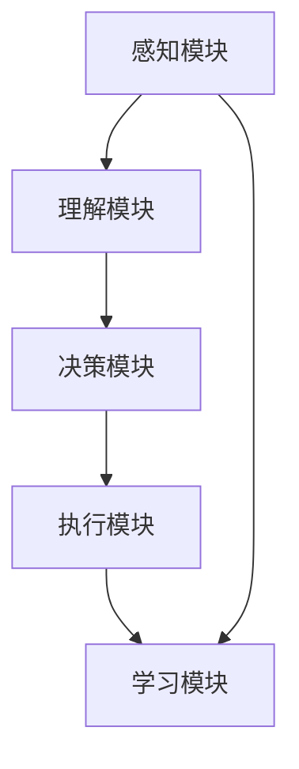

                 

### 《AI Agent: AI的下一个风口 数据隐私保护与数据安全问题》

> **关键词**：AI代理、数据隐私保护、数据安全问题、隐私法规、安全防护技术

> **摘要**：
本文将探讨AI代理这一新兴技术领域，重点关注其在数据隐私保护和数据安全方面的挑战与机遇。通过详细分析AI代理的定义、工作原理、应用领域，结合数据隐私保护原理、数据安全问题与防范措施，以及实战案例与未来展望，本文旨在为读者提供一个全面而深入的视角，以应对AI代理发展中的关键问题。

### 目录

#### 第一部分：AI代理基础

1. **第1章：AI代理概述**
   1.1 **AI代理的定义与历史**
   1.2 **AI代理的工作原理**
   1.3 **AI代理的应用领域**

2. **第2章：数据隐私保护原理**
   2.1 **数据隐私的基本概念**
   2.2 **数据隐私保护机制**
   2.3 **数据隐私法规与政策**

3. **第3章：数据安全问题与防范**
   3.1 **数据安全的基本概念**
   3.2 **数据安全防护技术**
   3.3 **数据安全风险管理**

#### 第二部分：AI代理的数据隐私与安全问题实战

4. **第4章：AI代理的数据隐私保护案例分析**
   4.1 **案例背景与分析**
   4.2 **案例解决方案与反思**

5. **第5章：AI代理的数据安全问题处理**
   5.1 **数据安全事件处理流程**
   5.2 **实战项目：构建安全的AI代理系统**

6. **第6章：AI代理与数据隐私保护法律法规合规**
   6.1 **法律法规合规的重要性**
   6.2 **实战案例：法律法规合规实践**

7. **第7章：未来展望与趋势**
   7.1 **AI代理与数据隐私保护技术的发展趋势**
   7.2 **未来展望**

#### 附录

8. **附录A：AI代理与数据隐私保护相关资源**

9. **附录B：常见问题与解答**

### 文章正文部分开始

---

## 第1章：AI代理概述

### 1.1 AI代理的定义与历史

AI代理（Artificial Intelligence Agent）是人工智能领域的一个重要概念，它指的是能够自主执行任务、与环境交互并作出决策的智能实体。AI代理可以是一个程序、一个系统或者一个机器人，它们通过感知、理解和决策过程，模拟人类智能行为。

AI代理的历史可以追溯到20世纪50年代。当时，人工智能领域的先驱艾伦·图灵提出了图灵测试，试图定义机器是否具有智能。随后，人工智能的研究者开始探索如何让计算机实现类似人类的智能行为。AI代理的概念也逐渐形成，并在20世纪80年代初期得到了广泛应用。

在早期的AI代理研究中，研究者主要集中在规则推理和知识表示上。这些代理通过预定义的规则和知识库来模拟人类专家的决策过程。随着人工智能技术的不断发展，AI代理逐渐采用了更复杂的技术，如机器学习、深度学习和强化学习，使得它们的自主性和智能水平得到了显著提升。

### 1.2 AI代理的工作原理

AI代理的工作原理可以概括为以下几个步骤：

1. **感知**：AI代理通过传感器或其他输入设备收集环境信息，如视觉、听觉、触觉等。这些信息被转化为数字信号，供代理处理。

2. **理解**：代理使用自然语言处理、图像识别、语音识别等技术，将感知到的信息转化为结构化的数据，以便进一步处理。

3. **决策**：代理根据其知识库和决策算法，对当前环境状态进行分析，并选择一个或多个行动方案。

4. **执行**：代理通过执行选定的行动方案，与环境进行交互，并收集执行结果。

5. **学习**：代理基于执行结果，调整其行为策略，提高下一次决策的准确性。

### 1.3 AI代理的分类

AI代理可以根据不同的分类标准进行分类。以下是几种常见的分类方法：

1. **根据任务类型**：
   - 单任务代理：专注于执行单一任务，如语音识别、图像分类等。
   - 多任务代理：能够同时执行多个任务，如智能助手、自动驾驶系统等。

2. **根据自主性**：
   - 低自主性代理：依赖于人类干预，如自动化客服系统。
   - 高自主性代理：能够独立执行任务，无需人类干预，如自动驾驶汽车、智能机器人等。

3. **根据交互模式**：
   - 主动型代理：主动寻找并采取行动，如智能推销机器人。
   - 反应型代理：仅对特定事件做出反应，如自动化防火墙。

### 1.4 AI代理的应用领域

AI代理在多个领域得到了广泛应用，以下是其中几个重要的应用领域：

1. **智能助手与虚拟助手**：如苹果的Siri、亚马逊的Alexa、谷歌的Google Assistant等，它们通过语音交互提供信息查询、日程管理、智能家居控制等服务。

2. **智能推荐系统**：如亚马逊的个性化推荐、Netflix的推荐算法等，通过分析用户行为和偏好，提供个性化的内容推荐。

3. **智能交通与自动驾驶**：自动驾驶汽车、智能交通管理系统等，通过感知交通状况，提供高效的交通解决方案。

4. **智能医疗与健康监测**：如智能诊断系统、健康监测设备等，通过分析医疗数据，提供个性化的医疗服务和健康建议。

### 1.5 AI代理的发展趋势

随着人工智能技术的不断进步，AI代理的发展趋势表现在以下几个方面：

1. **自主性提升**：AI代理的自主性将进一步提高，实现更多复杂任务的自动化执行。

2. **智能化增强**：AI代理将采用更先进的机器学习和深度学习算法，提高其智能水平和决策能力。

3. **跨领域融合**：AI代理将与其他技术领域（如物联网、区块链等）融合，提供更加综合的解决方案。

4. **隐私保护与安全**：在数据隐私保护和数据安全问题日益突出的背景下，AI代理的隐私保护和安全能力将成为重要发展方向。

---

### 1.1.1 AI代理的基本概念

AI代理，又称智能代理，是指由人工智能技术驱动的，具备一定自主性、适应性、学习能力和决策能力的计算机程序或实体。它可以代表用户或其他系统，在特定的环境下执行任务，达到既定的目标。

首先，AI代理的定义可以从以下几个方面来理解：

1. **自主性**：AI代理具备一定的自主性，这意味着它能够在没有人类干预的情况下，根据环境和任务的要求，自主地采取行动。这种自主性可以通过规则推理、机器学习、深度学习等不同技术手段来实现。

2. **适应性**：AI代理能够适应环境变化，并在新的情境中表现良好。这种适应性来源于其不断学习和调整行为策略的能力。例如，通过不断学习用户的行为模式，智能助手可以更好地理解用户的需求。

3. **学习能力**：AI代理具备学习能力，这使它能够从经验中学习并改进自己的行为。例如，通过监督学习、无监督学习、强化学习等技术，AI代理可以逐步提高其决策质量和效率。

4. **决策能力**：AI代理能够在复杂环境中进行决策，并选择最优的行动方案。这种决策能力通常基于代理的感知能力、知识库和决策算法。

其次，AI代理的发展历程可以分为以下几个阶段：

1. **规则推理阶段**：早期的AI代理主要通过预定义的规则进行决策。这些规则由人类专家制定，代理在执行任务时遵循这些规则。例如，专家系统是一种典型的基于规则推理的AI代理。

2. **知识表示阶段**：随着人工智能技术的发展，研究者开始探索如何更好地表示和利用知识。知识表示阶段的AI代理通过构建知识库，利用知识推理技术来提高决策能力。例如，基于本体论的方法和语义网络的应用。

3. **机器学习和深度学习阶段**：近年来，机器学习和深度学习技术的发展使得AI代理的能力得到了显著提升。通过学习大量数据，AI代理能够自动发现规律和模式，从而在复杂环境中做出更准确的决策。例如，深度神经网络在图像识别、自然语言处理等领域取得了突破性进展。

4. **强化学习阶段**：强化学习是AI代理发展的一个重要方向，它通过模仿人类的学习过程，使代理能够在动态环境中通过试错和反馈不断优化策略。例如，AlphaGo的成功就是强化学习在AI代理领域的典型案例。

最后，AI代理的分类可以从不同的角度进行：

1. **根据任务类型**：
   - 单任务代理：专注于执行单一任务的代理，如语音识别系统、图像分类系统等。
   - 多任务代理：能够同时执行多个任务的代理，如智能助手、自动驾驶系统等。

2. **根据自主性**：
   - 低自主性代理：需要人类干预的代理，如自动化客服系统。
   - 高自主性代理：能够独立执行任务的代理，如自动驾驶汽车、智能机器人等。

3. **根据交互模式**：
   - 主动型代理：主动寻找并采取行动的代理，如智能推销机器人。
   - 反应型代理：仅对特定事件做出反应的代理，如自动化防火墙。

综上所述，AI代理作为人工智能领域的一个重要概念，具有自主性、适应性、学习能力和决策能力。通过不断的发展和改进，AI代理在各种应用领域取得了显著成果，为人类带来了许多便利。在未来，随着人工智能技术的进一步发展，AI代理有望在更广泛的领域中发挥更大的作用。

### 1.1.2 AI代理的发展历程

AI代理的发展历程可以追溯到20世纪中期，随着人工智能（AI）概念的提出而逐渐成型。在这段历史中，AI代理经历了从规则驱动到数据驱动，再到智能自主化的几个重要阶段。

1. **早期阶段（20世纪50-70年代）**：
   - **规则驱动**：在这个阶段，AI代理主要通过预定义的规则进行决策。最早的人工智能系统如ELIZA和DENDRAL，展示了基于规则推理的初步应用。ELIZA是一个简单的聊天机器人，通过预设的对话规则与用户进行交互。DENDRAL则是一个化学专家系统，用于解析化学结构。

2. **知识表示阶段（20世纪80-90年代）**：
   - **知识库与推理**：随着知识的表示和推理技术发展，AI代理开始利用知识库进行决策。专家系统如MYCIN和DIAGNOSIS，通过建立大规模的知识库，利用推理机对输入信息进行分析和诊断。MYCIN是一个医疗诊断系统，用于辅助医生诊断感染性疾病。

3. **机器学习阶段（20世纪90年代至21世纪初）**：
   - **数据驱动**：在这个阶段，机器学习技术开始应用于AI代理，使其能够从数据中自动学习。早期的机器学习算法如决策树、支持向量机（SVM）等，使得AI代理能够处理更复杂的问题。例如，C4.5算法被广泛应用于数据挖掘和决策支持系统中。

4. **深度学习和强化学习阶段（21世纪初至今）**：
   - **智能自主化**：深度学习的发展，尤其是神经网络技术的突破，使得AI代理具备了更强的感知和决策能力。深度神经网络（DNN）、卷积神经网络（CNN）和循环神经网络（RNN）在图像识别、语音识别、自然语言处理等领域取得了显著的成果。同时，强化学习技术的应用，如深度强化学习（DRL），使得AI代理能够在复杂环境中通过试错和反馈进行自主化决策。AlphaGo的成功就是一个典型的例子。

### 1.1.3 AI代理的分类

AI代理可以根据不同的标准进行分类，以下是几种常见的分类方法：

1. **根据任务类型**：
   - **单任务代理**：专注于执行单一任务的代理，如语音识别系统、图像分类系统等。例如，语音助手Siri主要提供语音查询服务，而图像识别系统则专注于识别图片中的物体。
   - **多任务代理**：能够同时执行多个任务的代理，如智能助手、自动驾驶系统等。智能助手不仅可以回答用户的问题，还能进行日程管理、智能家居控制等。自动驾驶系统则需要在处理驾驶任务的同时，对周围环境进行感知和决策。

2. **根据自主性**：
   - **低自主性代理**：需要人类干预的代理，如自动化客服系统。这类代理通常只能执行有限的任务，并在遇到复杂情况时需要人类介入。
   - **高自主性代理**：能够独立执行任务的代理，如自动驾驶汽车、智能机器人等。这类代理具有更高的决策能力和自主性，能够在复杂和动态的环境中自主行动。

3. **根据交互模式**：
   - **主动型代理**：主动寻找并采取行动的代理，如智能推销机器人。这类代理通常会主动向用户推荐产品或服务，或主动发起与用户的交互。
   - **反应型代理**：仅对特定事件做出反应的代理，如自动化防火墙。这类代理主要基于预设的规则或模式，对特定事件做出响应。

4. **根据应用领域**：
   - **通用型代理**：适用于多种领域的通用代理，如通用聊天机器人、通用推荐系统等。这类代理具有较强的通用性和灵活性，可以应用于不同的场景。
   - **专用型代理**：针对特定领域的专用代理，如医疗诊断系统、金融风险评估系统等。这类代理具有特定领域的专业知识，可以提供更专业和精准的服务。

通过以上分类，我们可以看到AI代理的多样性和复杂性。不同类型的AI代理在不同的应用场景中发挥着重要作用，推动了人工智能技术的广泛应用和发展。

### 1.2.1 AI代理的架构

AI代理的架构是其实现自主决策和任务执行的关键。一个典型的AI代理系统通常包括以下几个关键组件：

1. **感知模块**：这是AI代理获取环境信息的入口。感知模块通过各种传感器（如摄像头、麦克风、GPS等）获取数据，并将其转换为结构化的信息。例如，一个自动驾驶车辆的感知模块会收集路况、交通标志、周围车辆等信息。

2. **理解模块**：感知模块收集到的信息需要通过理解模块进行处理，将其转换为代理可以理解的形式。理解模块通常包括自然语言处理（NLP）、图像识别、语音识别等技术。例如，一个语音助手需要理解用户的语音命令，并将其转化为文本指令。

3. **决策模块**：决策模块是AI代理的核心，负责根据当前环境和目标，选择最佳的行动方案。决策模块通常采用机器学习算法、深度学习模型或强化学习策略来模拟人类决策过程。例如，一个智能推荐系统会分析用户的浏览历史和购买行为，从而推荐最合适的商品。

4. **执行模块**：执行模块负责将决策模块选择的行动方案转化为具体的操作。例如，自动驾驶车辆的执行模块会根据决策模块的指令，控制车辆的加速、转向和制动。

5. **学习模块**：学习模块使AI代理能够通过经验不断改进其决策能力和行为策略。学习模块通常利用监督学习、无监督学习或强化学习算法，从历史数据中提取知识，优化代理的决策模型。

下面是一个简单的Mermaid流程图，展示了AI代理的基本架构：



在这个流程图中，感知模块收集环境信息，理解模块将这些信息进行处理，决策模块根据处理结果选择行动方案，执行模块执行这些方案，而学习模块则不断从经验中学习，优化代理的性能。

### 1.2.2 AI代理的运行机制

AI代理的运行机制是一个复杂的过程，它涉及感知、理解、决策、执行和学习等多个环节。为了更好地理解这一过程，我们可以将其分解为以下步骤：

1. **感知**：AI代理通过感知模块与外部环境进行交互，收集各种信息。这些信息可能包括文本、图像、声音、传感器数据等。例如，自动驾驶车辆的感知模块会使用摄像头、雷达和激光雷达来感知周围的道路状况、交通标志和其他车辆。

2. **理解**：感知模块收集到的信息需要通过理解模块进行处理，以转换为代理可以理解的形式。理解模块通常利用自然语言处理（NLP）、图像识别、语音识别等技术来分析感知数据。例如，一个智能助手会通过NLP技术理解用户的语音命令，并将其转换为机器可读的指令。

3. **决策**：理解模块处理后的信息被传递到决策模块。决策模块根据当前环境状态和代理的目标，选择最佳的行动方案。决策过程可能涉及到复杂的算法和模型，如机器学习模型、深度学习模型或强化学习策略。例如，自动驾驶车辆的决策模块会分析感知到的路况，并选择最优的驾驶路径。

4. **执行**：决策模块选定的行动方案传递到执行模块，执行模块将决策转化为具体的操作。例如，自动驾驶车辆的执行模块会控制车辆的加速、转向和制动，以实现决策模块选择的行驶路径。

5. **学习**：执行模块执行行动方案后，收集到的反馈信息会被传递回学习模块。学习模块利用这些反馈信息，通过监督学习、无监督学习或强化学习算法，不断调整和优化代理的行为策略。例如，通过分析用户的反馈，智能助手可以不断改进其对用户需求的响应。

下面是一个简单的伪代码示例，展示了AI代理的运行机制：

```python
# AI代理运行机制伪代码

# 初始化感知、理解、决策、执行和学习模块
initialize(sensing, understanding, decision, execution, learning)

# 感知环境
environment_data = sensing()

# 理解感知数据
processed_data = understanding(environment_data)

# 根据当前环境状态和目标决策
action_plan = decision(processed_data, goal)

# 执行决策方案
execution(action_plan)

# 收集执行反馈
feedback = execution.get_feedback()

# 更新学习模块
learning(feedback)

# 循环执行感知、理解、决策、执行和学习步骤
while true:
    environment_data = sensing()
    processed_data = understanding(environment_data)
    action_plan = decision(processed_data, goal)
    execution(action_plan)
    feedback = execution.get_feedback()
    learning(feedback)
```

通过这个伪代码示例，我们可以看到AI代理的运行机制是如何在不断的循环中实现自主决策和任务执行的。每个步骤都相互关联，共同构成了一个动态的、适应性强的智能系统。

### 1.2.3 AI代理的决策过程

AI代理的决策过程是其核心功能之一，它决定了代理能否在复杂和动态的环境中有效地完成任务。决策过程通常涉及多个阶段，包括环境感知、目标设定、策略选择、执行与反馈。以下是对每个阶段详细解释的伪代码示例：

```python
# AI代理决策过程伪代码

# 环境感知阶段
def perceive_environment():
    # 使用传感器收集环境数据
    sensor_data = sensors.collect_data()
    # 过滤和预处理数据
    processed_data = preprocess_data(sensor_data)
    return processed_data

# 目标设定阶段
def set_goals():
    # 根据代理的初始任务和当前环境状态设定目标
    current_state = environment.get_state()
    goals = define_goals(current_state)
    return goals

# 策略选择阶段
def select_strategy(processed_data, goals):
    # 使用决策算法选择最佳策略
    strategy = decision_algorithm(processed_data, goals)
    return strategy

# 执行与反馈阶段
def execute_strategy(strategy):
    # 将策略转化为具体的行动
    action_plan = strategy_to_action_plan(strategy)
    # 执行行动
    execution_results = execute_actions(action_plan)
    # 收集反馈
    feedback = collect_feedback(execution_results)
    return feedback

# 主决策循环
while true:
    # 感知环境
    processed_data = perceive_environment()
    # 设定目标
    goals = set_goals()
    # 选择策略
    strategy = select_strategy(processed_data, goals)
    # 执行策略
    feedback = execute_strategy(strategy)
    # 根据反馈调整策略
    strategy = adjust_strategy(strategy, feedback)
```

在这个伪代码中：

1. **环境感知阶段**：代理通过传感器收集环境数据，并对数据进行预处理，以便后续分析。

2. **目标设定阶段**：代理根据当前环境状态和任务要求，设定具体的任务目标。

3. **策略选择阶段**：代理使用决策算法，如深度学习模型或强化学习策略，选择最佳行动方案。

4. **执行与反馈阶段**：代理将策略转化为具体的行动，执行这些行动，并收集执行结果。

通过这种决策过程，AI代理能够在不断变化的动态环境中做出有效的决策，从而实现其任务目标。每个阶段都相互关联，共同构成了一个完整的决策循环。

### 1.3.1 智能助手与虚拟助手

智能助手和虚拟助手是AI代理应用中最具代表性的例子，它们广泛应用于日常生活中的各种场景。以下是对这两个概念及其工作原理的详细描述：

#### 智能助手

智能助手（如苹果的Siri、亚马逊的Alexa、谷歌的Google Assistant）是一种典型的AI代理，它通过语音交互为用户提供信息查询、日程管理、智能家居控制等服务。智能助手的工作原理通常包括以下几个步骤：

1. **语音识别**：智能助手首先使用语音识别技术，将用户的语音命令转换为文本。这个过程涉及到语音信号的预处理，如噪声过滤、声学模型和语言模型的应用。

2. **自然语言理解**：将语音命令转换为文本后，智能助手会使用自然语言处理（NLP）技术，理解文本的含义。这包括语法分析、语义理解和意图识别等步骤。

3. **信息查询与执行**：智能助手根据理解的结果，查询相关的信息或执行相应的任务。例如，用户说“明天有什么会议”，智能助手会查询日历，并回复用户明天会议的信息。

4. **反馈与优化**：智能助手会记录用户的反馈，并利用这些反馈不断优化其回答质量和执行效率。

#### 虚拟助手

虚拟助手（如微软的小冰、腾讯的AI Lab、韩国的Nugu）则更注重提供个性化的交互体验。虚拟助手通常采用对话系统（Conversational System）技术，包括语音合成、文本生成和对话管理等功能。虚拟助手的工作原理如下：

1. **语音合成与文本生成**：虚拟助手使用语音合成技术，将文本信息转换为自然的语音输出。同时，文本生成技术用于创建丰富多样的对话内容。

2. **对话管理**：对话管理模块负责控制对话流程，确保对话的连贯性和流畅性。这包括上下文理解、对话策略选择和响应生成等。

3. **个性化交互**：虚拟助手通过用户行为数据和学习算法，了解用户的偏好和习惯，提供个性化的服务。例如，虚拟助手可以根据用户的购物记录，推荐适合的商品。

4. **多模态交互**：虚拟助手不仅支持语音交互，还支持文本、图像和手势等多种交互方式，以提供更加自然和丰富的用户体验。

#### 应用场景

智能助手和虚拟助手在许多场景中都发挥着重要作用：

- **家居控制**：用户可以通过语音命令控制智能家居设备，如灯光、空调和安防系统。
- **日程管理**：智能助手可以提醒用户日程安排，甚至自动安排会议时间。
- **信息查询**：用户可以询问天气、新闻、交通信息等，智能助手会提供即时的答案。
- **娱乐互动**：虚拟助手可以与用户进行聊天，提供音乐、故事和游戏等服务。

通过智能助手和虚拟助手，AI代理在提高生活便利性和工作效率方面发挥了巨大作用。随着技术的不断进步，这些智能代理将继续扩展其应用范围，为人们带来更多便利。

### 1.3.2 智能推荐系统

智能推荐系统（Intelligent Recommendation System）是AI代理在商业和日常生活中广泛应用的一个重要领域。它利用数据挖掘和机器学习技术，根据用户的行为和偏好，为用户提供个性化的推荐。以下是智能推荐系统的工作原理、算法和应用场景：

#### 工作原理

智能推荐系统的工作原理主要包括以下几个步骤：

1. **用户行为数据收集**：系统会收集用户在平台上的各种行为数据，如浏览记录、购买历史、搜索关键词、点击行为等。

2. **数据预处理**：收集到的数据需要进行预处理，包括数据清洗、去重、归一化等操作，以确保数据的质量。

3. **特征提取**：通过特征提取技术，将原始数据转换为有助于推荐模型的特征向量。常见的特征提取方法包括基于内容的特征提取（如文本分类、词频统计）和基于协同过滤的特征提取（如用户-项目矩阵分解、邻域模型）。

4. **推荐算法**：根据提取的特征向量，推荐系统采用不同的算法生成推荐结果。常见的推荐算法包括基于内容的推荐（Content-based Filtering）、基于协同过滤的推荐（Collaborative Filtering）和混合推荐（Hybrid Recommendation）。

5. **推荐结果输出**：系统将生成的推荐结果呈现给用户，通常以排行榜、卡片形式或个性化页面等形式展示。

#### 算法

智能推荐系统采用的算法可以分为以下几类：

1. **基于内容的推荐**：
   - **方法**：基于内容的推荐通过分析项目的内容特征，将具有相似内容的项目推荐给用户。例如，如果用户喜欢某个电影，系统会推荐具有相似内容的电影。
   - **优点**：对用户个性化需求的捕捉较为准确，适合处理新用户或新项目推荐。
   - **缺点**：无法处理用户之间的相似性，难以发现用户之间共有的兴趣点。

2. **基于协同过滤的推荐**：
   - **方法**：基于协同过滤的推荐通过分析用户之间的行为相似性，推荐用户可能喜欢的项目。常见的协同过滤方法包括用户-用户协同过滤（User-based Collaborative Filtering）和项目-项目协同过滤（Item-based Collaborative Filtering）。
   - **优点**：能够充分利用用户和项目之间的交互数据，发现用户之间的相似性。
   - **缺点**：对新用户和新项目推荐效果较差，可能产生“数据冷启动”问题。

3. **混合推荐**：
   - **方法**：混合推荐结合了基于内容和基于协同过滤的优点，通过综合分析内容和用户行为数据，提高推荐的质量和多样性。
   - **优点**：能够更好地处理数据稀疏性问题，提高推荐效果。
   - **缺点**：算法复杂度较高，需要更多计算资源。

#### 应用场景

智能推荐系统在多个领域得到了广泛应用：

1. **电子商务**：电商平台通过推荐系统，为用户提供个性化的商品推荐，提高用户的购买转化率和平台销售额。例如，亚马逊的个性化推荐系统基于用户的浏览历史和购买记录，推荐用户可能感兴趣的商品。

2. **内容平台**：如视频平台、音乐平台和新闻平台等，通过推荐系统为用户提供个性化的内容推荐，提高用户留存率和活跃度。例如，Netflix通过分析用户的观看历史和评分，推荐用户可能喜欢的电影和电视剧。

3. **社交媒体**：社交媒体平台通过推荐系统，为用户提供个性化的内容推荐，如好友推荐、热门话题等，提高用户参与度和平台活跃度。例如，Twitter通过分析用户的关注关系和互动行为，推荐用户可能感兴趣的话题和用户。

4. **在线教育**：在线教育平台通过推荐系统，为用户提供个性化的课程推荐，提高学习效果和用户满意度。例如，Coursera通过分析用户的浏览记录和学习行为，推荐用户可能感兴趣的课程。

智能推荐系统在各个领域的广泛应用，不仅提高了用户满意度，还为企业创造了巨大的商业价值。随着人工智能技术的不断进步，智能推荐系统将变得更加智能和高效，为用户提供更加个性化的服务。

### 1.3.3 智能交通与自动驾驶

智能交通与自动驾驶是AI代理在交通运输领域的重要应用，它们通过先进的人工智能技术，提高了交通系统的效率和安全性。以下是对智能交通和自动驾驶的基本概念、技术原理和应用场景的详细解释。

#### 智能交通

智能交通系统（Intelligent Transportation System, ITS）是一种综合利用信息技术、通信技术、传感器技术和控制技术，对交通运输系统进行智能化管理和优化的系统。智能交通的目标是通过提高交通流量、减少交通事故和降低环境污染，实现交通系统的安全、高效和可持续运行。

##### 技术原理

智能交通系统的技术原理主要包括以下几个方面：

1. **传感器技术**：传感器是智能交通系统的核心组成部分，包括摄像头、雷达、激光雷达、GPS等。传感器用于收集道路上的各种信息，如车辆位置、速度、流量、天气状况等。

2. **数据通信技术**：数据通信技术用于实现传感器与其他系统之间的信息交换。V2X（Vehicle-to-Everything）通信技术是一种重要的数据通信方式，它包括车辆与车辆（V2V）、车辆与基础设施（V2I）、车辆与行人（V2P）等通信模式。

3. **数据融合与处理**：智能交通系统通过对传感器收集到的数据进行融合和处理，提取有用的交通信息，如交通流量、拥堵状况等。

4. **决策与控制**：基于处理后的交通信息，智能交通系统通过交通信号控制、路线规划、车辆调度等技术手段，对交通系统进行优化和管理。

##### 应用场景

智能交通系统在多个应用场景中发挥了重要作用：

1. **交通信号控制**：智能交通系统能够根据实时交通流量信息，动态调整交通信号灯的时长和相位，提高交通流量和减少拥堵。

2. **智能路况监测**：通过传感器和V2X通信技术，智能交通系统能够实时监测道路状况，并向驾驶员提供实时路况信息，帮助驾驶员选择最佳路线。

3. **停车管理**：智能交通系统可以实时监测停车场的车位情况，通过智能引导系统帮助驾驶员快速找到空车位。

4. **交通事故预防与处理**：智能交通系统能够通过实时监控和数据分析，及时发现潜在的交通事故隐患，并采取相应的预防措施。

#### 自动驾驶

自动驾驶技术（Autonomous Driving Technology）是一种使车辆能够在没有人类驾驶员干预的情况下，自动完成驾驶任务的技术。自动驾驶车辆通过感知、理解和决策，实现自主导航、驾驶和控制。

##### 技术原理

自动驾驶技术的技术原理主要包括以下几个方面：

1. **感知技术**：自动驾驶车辆使用多种传感器（如摄像头、雷达、激光雷达等）来感知周围环境，获取道路、车辆、行人和交通标志等信息。

2. **环境理解**：通过机器学习和计算机视觉技术，自动驾驶车辆对感知到的信息进行处理和理解，构建周围环境的3D模型。

3. **决策与控制**：基于环境理解，自动驾驶车辆通过决策算法和控制算法，选择最佳的行动方案，如加速、减速、转向等。

4. **路径规划**：自动驾驶车辆利用路径规划算法，计算从起点到终点的最佳行驶路径，并实时调整路径以应对道路变化和突发情况。

##### 应用场景

自动驾驶技术在多个应用场景中具有广泛的应用前景：

1. **公共交通**：自动驾驶公交车和出租车可以提供安全、高效和舒适的出行服务，减少人为驾驶失误。

2. **货运运输**：自动驾驶卡车和货运无人机可以降低运输成本，提高运输效率，减少交通事故。

3. **个人出行**：自动驾驶私家车可以为用户提供更加便捷、安全和舒适的出行体验，特别是在拥堵和交通复杂的城市环境中。

4. **物流仓储**：自动驾驶仓储机器人可以在仓库内部自动完成货物搬运、分类和存储任务，提高仓储效率。

智能交通与自动驾驶技术的发展，不仅提高了交通运输的效率和安全性，还为未来的智能城市和智能交通系统建设提供了重要的技术支撑。随着技术的不断进步，这些领域将继续迎来更多创新和应用。

### 1.3.4 智能医疗与健康监测

智能医疗与健康监测是AI代理在医疗领域的重要应用，通过大数据分析、机器学习和物联网技术，实现了疾病预测、诊断辅助、个性化治疗和健康监测等功能。以下是对这些应用的具体解释。

#### 疾病预测

疾病预测是智能医疗的一个重要方向，它通过分析患者的医疗数据、家族病史和生活方式等信息，提前预测疾病的发生风险。疾病预测的基本原理包括：

1. **数据收集**：收集患者的电子健康记录（EHR）、医学影像、基因数据、生活方式数据等。

2. **数据预处理**：对收集到的数据进行清洗、归一化和特征提取，以便后续分析。

3. **模型训练**：利用机器学习和数据挖掘技术，构建预测模型。常见的模型包括决策树、随机森林、支持向量机（SVM）和深度学习模型。

4. **预测结果分析**：模型对新的患者数据进行分析，预测疾病发生的概率。

疾病预测的应用场景包括：

- **慢性病管理**：如糖尿病、高血压等慢性病的早期预测和预警，帮助患者及时调整生活方式和治疗方案。
- **传染病防控**：通过对疫情数据的实时分析，预测传染病的传播趋势，指导公共卫生政策和防控措施的制定。

#### 诊断辅助

诊断辅助系统利用AI技术，帮助医生快速、准确地诊断疾病。诊断辅助的基本原理包括：

1. **医学影像分析**：利用深度学习模型，对医学影像（如X光、CT、MRI等）进行分析，识别异常区域和疾病特征。

2. **电子健康记录分析**：分析患者的EHR，提取关键信息，辅助医生进行诊断。

3. **知识库和推理**：结合医学知识库和推理系统，对患者的症状和检查结果进行综合分析，提供诊断建议。

诊断辅助的应用场景包括：

- **影像诊断**：如肺癌、乳腺癌的早期筛查，提高诊断准确率。
- **疾病监测**：如心血管疾病的长期监测，及时发现病情变化。

#### 个性化治疗

个性化治疗是根据患者的基因信息、生物指标和生活习惯，制定个性化的治疗方案。个性化治疗的基本原理包括：

1. **基因测序与数据分析**：通过基因测序技术，获取患者的基因信息，分析基因变异与疾病之间的关系。

2. **生物标志物检测**：检测患者的生物标志物，如蛋白质、代谢物等，以评估患者的疾病状态和治疗效果。

3. **个性化治疗方案制定**：结合患者的基因信息、生物指标和生活习惯，制定个性化的药物治疗、手术方案和康复计划。

个性化治疗的应用场景包括：

- **癌症治疗**：如靶向治疗和免疫治疗，根据患者的基因突变类型，选择最有效的治疗方案。
- **糖尿病管理**：根据患者的血糖水平和生活方式，调整药物治疗和饮食计划。

#### 健康监测

健康监测系统通过可穿戴设备、物联网传感器和移动应用，实时监测患者的健康状况，提供个性化的健康建议。健康监测的基本原理包括：

1. **数据采集**：通过可穿戴设备（如智能手表、健康手环等）和物联网传感器，采集患者的生理数据（如心率、血压、睡眠质量等）。

2. **数据分析与处理**：利用机器学习和数据挖掘技术，对采集到的数据进行分析和处理，识别健康风险和异常情况。

3. **健康建议**：根据分析结果，提供个性化的健康建议，如运动建议、饮食建议和医疗干预建议。

健康监测的应用场景包括：

- **慢性病管理**：如高血压、糖尿病等慢性病的长期监测，帮助患者管理病情，减少并发症风险。
- **老年健康管理**：通过监测老年人的生理数据，及时发现健康问题，提供及时干预。

智能医疗与健康监测技术的发展，为个性化医疗和健康管理提供了强大的技术支持，提高了医疗服务的质量和效率。随着技术的不断进步，这些领域将继续迎来更多的创新和应用。

### 2.1 数据隐私的基本概念

数据隐私是现代信息社会中的一个核心问题，涉及到个人信息的保护、隐私权的维护和数据使用的合法合规。以下是对数据隐私的基本概念进行详细解释，包括定义、重要性及分类。

#### 定义

数据隐私是指个人对其信息的控制权，包括个人信息的收集、存储、使用、共享和删除等方面。具体来说，数据隐私是指个人对其个人数据是否被收集、如何被使用、存储在何处、是否被共享以及如何保护其隐私的权利。

#### 重要性

数据隐私的重要性体现在以下几个方面：

1. **个人信息保护**：数据隐私保护确保个人敏感信息不会被滥用，从而保护个人隐私不受侵害。

2. **隐私权维护**：数据隐私是公民隐私权的重要组成部分，保障个人对其信息的控制权和知情权。

3. **合法合规**：在全球范围内，许多国家和地区已经制定了严格的隐私法规和政策，如欧盟的通用数据保护条例（GDPR）和加州消费者隐私法案（CCPA）。遵守这些法规和政策，是企业在数据管理方面的重要要求。

4. **企业声誉**：保护用户隐私有助于树立企业的良好形象，增强用户信任，提高用户忠诚度。

#### 分类

数据隐私可以根据不同的维度进行分类，以下是一些常见的分类方式：

1. **根据数据类型**：
   - **个人身份信息**：如姓名、身份证号码、电话号码、电子邮件地址等。
   - **生物识别信息**：如指纹、虹膜、面部识别等。
   - **健康信息**：如病历记录、基因信息、体检报告等。
   - **财务信息**：如银行账户信息、信用卡号码、交易记录等。

2. **根据隐私程度**：
   - **敏感信息**：如生物识别信息、健康信息、财务信息等，这些信息一旦泄露，可能对个人造成严重危害。
   - **非敏感信息**：如姓名、地址、电话号码等，这些信息泄露的风险相对较低。

3. **根据隐私保护方法**：
   - **加密技术**：通过加密手段保护数据，防止未经授权的访问。
   - **匿名化**：通过技术手段删除或掩盖个人身份信息，使数据在共享和分析时无法识别个人。
   - **访问控制**：通过设置访问权限，确保只有授权用户可以访问敏感数据。
   - **数据留存与删除**：在数据生命周期内，合理管理和留存数据，并在不需要时及时删除。

通过以上分类，我们可以更好地理解数据隐私的概念，并根据不同类型的隐私需求和保护方法，采取相应的隐私保护措施。在数据隐私日益受到重视的今天，保护数据隐私不仅是法律要求，也是企业社会责任的一部分。

### 2.2 数据隐私保护机制

在当前数字化时代，数据隐私保护变得尤为重要。为了确保个人数据的安全和隐私，我们需要采取一系列的数据隐私保护机制。以下将介绍几种常见的数据隐私保护技术，包括加密技术、同态加密、虚假数据注入和数据匿名化。

#### 加密技术

加密技术是数据隐私保护的核心手段之一。它通过将明文数据转换成密文，确保数据在传输和存储过程中不被未授权的第三方访问。加密技术可以分为对称加密和非对称加密两种：

1. **对称加密**：
   - **定义**：对称加密使用相同的密钥进行加密和解密。
   - **算法**：常见的对称加密算法有DES、AES等。
   - **优势**：加密速度快，适用于大规模数据的加密。
   - **劣势**：密钥管理复杂，密钥分发和共享困难。

2. **非对称加密**：
   - **定义**：非对称加密使用一对密钥，即公钥和私钥，公钥用于加密，私钥用于解密。
   - **算法**：常见的非对称加密算法有RSA、ECC等。
   - **优势**：解决了密钥分发和共享问题，更安全。
   - **劣势**：加密和解密速度较慢，适用于小数据量的加密。

#### 同态加密

同态加密是一种特殊的加密技术，它允许在密文上进行计算，而不需要解密。这使得同态加密在处理敏感数据时具有很大的优势，因为它无需暴露明文数据。同态加密的主要用途包括：

1. **数据处理**：对加密数据进行计算和处理，如统计分析、机器学习等。
2. **云计算**：保护用户在云环境中的数据隐私，防止云服务提供商访问敏感数据。

同态加密的典型应用包括谷歌的CryptDB数据库和微软的Azure Quantum。

#### 虚假数据注入

虚假数据注入是一种通过在真实数据中添加虚假数据，以迷惑攻击者的技术。它的主要目的是通过混淆真实数据和虚假数据，防止数据泄露和攻击。虚假数据注入的方法包括：

1. **静态注入**：在数据存储前，预先添加虚假数据。
2. **动态注入**：在数据传输或处理过程中，实时添加虚假数据。

虚假数据注入可以应用于各种场景，如物联网、金融系统等，以增强系统的安全性。

#### 数据匿名化

数据匿名化是一种通过删除或掩盖个人身份信息，使数据在共享和分析时无法识别个人身份的技术。数据匿名化分为以下几种方法：

1. **泛化**：通过将个人身份信息泛化到更广泛的类别中，减少个人识别信息。
2. **隐匿**：通过删除或掩盖个人身份信息，如姓名、地址、身份证号码等。
3. **密文链接**：通过加密个人身份信息，使其在共享和分析时无法被识别。

数据匿名化在许多领域得到了广泛应用，如市场调研、医疗数据分析、科学研究等。

通过上述数据隐私保护机制，我们可以有效地保护个人数据的安全和隐私。在实际应用中，这些机制通常需要结合使用，以实现最佳的数据隐私保护效果。

### 2.3 数据隐私法规与政策

随着数据隐私问题日益凸显，全球范围内已出台了一系列数据隐私法规与政策，以保护个人数据的安全和隐私。以下将详细介绍几个重要的数据隐私法规与政策，包括欧盟的通用数据保护条例（GDPR）、加州消费者隐私法案（CCPA）以及其他国家和地区的数据隐私法规。

#### 欧盟的通用数据保护条例（GDPR）

通用数据保护条例（General Data Protection Regulation，GDPR）是欧盟于2018年5月25日正式实施的隐私保护法规。GDPR旨在加强个人数据保护，确保个人数据的合法、公正和透明处理。

**主要内容**：

1. **数据主体权利**：GDPR赋予数据主体（即个人）一系列权利，包括知情权、访问权、修改权、删除权（被遗忘权）和数据可携权等。
2. **数据处理者的责任**：数据处理者必须确保数据处理活动的合法性、公正性和透明性，并采取必要的技术和组织措施，保护个人数据的安全。
3. **数据跨境传输**：GDPR对数据跨境传输进行了严格限制，要求数据处理者在向第三国传输数据时，必须确保数据保护水平不低于欧盟标准。

**影响**：

GDPR对全球企业的数据隐私管理产生了深远影响，许多企业不得不调整其数据处理流程和隐私政策，以确保符合GDPR的要求。GDPR的实施也推动了全球数据隐私保护法规的发展。

#### 加州消费者隐私法案（CCPA）

加州消费者隐私法案（California Consumer Privacy Act，CCPA）是于2020年1月1日生效的美国加州隐私保护法规。CCPA旨在赋予加州居民对其个人数据的控制权，增强个人数据保护。

**主要内容**：

1. **知情权**：企业必须向消费者明确披露其收集、使用和共享个人数据的目的。
2. **访问权与删除权**：消费者有权要求企业提供其个人数据的具体信息，并有权要求删除其个人数据。
3. **禁止歧视**：企业在处理消费者数据时，不得因消费者行使数据权利而对其进行歧视。

**影响**：

CCPA对加州企业的数据隐私管理提出了更高的要求，同时也推动了其他州和联邦层面的数据隐私立法。CCPA的实施有助于提升美国整体的数据隐私保护水平。

#### 其他国家和地区的数据隐私法规

除欧盟和加州外，全球许多国家和地区也出台了数据隐私保护法规，以应对日益严重的隐私问题。以下是一些重要的数据隐私法规：

1. **中国的网络安全法**：该法于2017年6月1日正式实施，明确了网络运营者的数据保护责任，加强对个人信息的保护。
2. **巴西的一般数据保护法（LGPD）**：LGPD于2020年9月生效，对个人数据的收集、处理和存储进行了严格规定。
3. **澳大利亚的个人隐私法案（APP）**：APP要求企业在收集、使用和披露个人信息时，必须遵守透明、合法和公正的原则。
4. **新加坡的数据保护法（PDPA）**：PDPA于2012年生效，旨在保护个人数据的隐私和权利。

**影响**：

这些数据隐私法规的共同目标是为了保护个人数据的安全和隐私，推动全球数据隐私保护的发展。不同法规的实施，有助于提高企业和机构的数据隐私管理水平，同时促进了跨境数据流动的合规性。

综上所述，数据隐私法规与政策在全球范围内的实施，不仅保护了个人数据的隐私，也推动了数据隐私保护技术的创新和应用。在未来，随着数据隐私问题的日益复杂，更多的法规和政策将出台，进一步保障个人数据的安全和隐私。

### 3.1 数据安全的基本概念

数据安全是指保护数据免受未经授权的访问、使用、披露、破坏、修改或破坏的过程。数据安全的目标是确保数据的完整性、可用性和保密性。以下是对数据安全基本概念、重要性、分类以及威胁来源的详细解释。

#### 基本概念

1. **完整性**：确保数据在传输和存储过程中不被未经授权的第三方篡改或破坏。
2. **可用性**：确保数据在需要时可以被授权用户访问和使用。
3. **保密性**：确保数据在传输和存储过程中不被未经授权的第三方获取。

#### 重要性

数据安全的重要性体现在以下几个方面：

1. **防止数据泄露**：数据泄露可能导致个人隐私受损，企业声誉受损，甚至造成经济损失。
2. **保障业务连续性**：数据安全确保企业关键业务数据不会因攻击或故障而丢失，保障业务的连续性。
3. **遵守法律法规**：许多国家和地区都有关于数据安全的法律法规，企业必须遵守这些规定，以避免法律风险。

#### 分类

数据安全可以从不同的角度进行分类：

1. **根据数据类型**：
   - **结构化数据**：如数据库中的记录、电子表格等。
   - **非结构化数据**：如文本、图像、音频和视频等。
   - **敏感数据**：如个人身份信息、财务信息、健康信息等。

2. **根据安全措施**：
   - **访问控制**：确保只有授权用户可以访问特定数据。
   - **加密技术**：通过加密手段保护数据的保密性和完整性。
   - **审计与监控**：记录和监控数据的访问和操作，以便在发生安全事件时进行追溯。
   - **备份与恢复**：定期备份数据，以便在数据丢失或损坏时进行恢复。

3. **根据威胁类型**：
   - **物理安全**：保护存储介质和设备，防止物理攻击。
   - **网络安全**：保护网络和系统，防止网络攻击。
   - **应用安全**：确保应用程序和系统中的数据安全。

#### 威胁来源

数据安全的威胁来源可以分为以下几类：

1. **内部威胁**：包括员工失误、内部人员恶意行为等。
2. **外部威胁**：包括黑客攻击、网络犯罪、自然灾害等。
3. **系统漏洞**：包括操作系统、应用程序和网络的漏洞，这些漏洞可能被攻击者利用进行攻击。

通过了解数据安全的基本概念、重要性、分类以及威胁来源，我们可以更好地制定和实施数据安全策略，保护数据的安全和完整性。

### 3.2 数据安全防护技术

为了确保数据在传输和存储过程中的安全，我们需要采用一系列的数据安全防护技术。以下将详细介绍几种常见的数据安全防护技术，包括防火墙与入侵检测系统、数据加密技术、访问控制与身份验证以及安全审计与日志管理。

#### 防火墙与入侵检测系统

防火墙是一种网络安全设备，用于监控和控制进出网络的流量，防止未经授权的访问和攻击。防火墙可以分为以下几种类型：

1. **包过滤防火墙**：根据包的源地址、目标地址、端口号等信息，决定是否允许通过。
2. **状态检测防火墙**：在包过滤的基础上，增加了状态跟踪功能，可以更好地识别网络连接的状态。
3. **应用层防火墙**：对应用层协议进行深入分析，防止特定的应用层攻击。

入侵检测系统（Intrusion Detection System，IDS）用于监控网络流量和系统活动，检测潜在的攻击行为。IDS可以分为以下两种：

1. **网络入侵检测系统（NIDS）**：在网络流量中检测异常和攻击行为。
2. **主机入侵检测系统（HIDS）**：在单个主机上监控其活动和系统日志，检测潜在的攻击行为。

防火墙与入侵检测系统协同工作，可以有效地保护网络和系统免受外部攻击。

#### 数据加密技术

数据加密是保护数据保密性和完整性的重要手段。数据加密技术可以分为以下几种：

1. **对称加密**：使用相同的密钥进行加密和解密。常见的对称加密算法有DES、AES等。
2. **非对称加密**：使用一对密钥，即公钥和私钥。公钥用于加密，私钥用于解密。常见的非对称加密算法有RSA、ECC等。
3. **同态加密**：允许在加密数据上直接进行计算，而不需要解密。同态加密适用于云计算和大数据处理场景。

数据加密技术可以确保数据在传输和存储过程中不被未授权的第三方访问和篡改。

#### 访问控制与身份验证

访问控制是一种管理用户访问权限的技术，确保只有授权用户可以访问特定的数据或系统资源。访问控制可以分为以下几种：

1. **基于角色的访问控制（RBAC）**：根据用户的角色分配访问权限。
2. **基于属性的访问控制（ABAC）**：根据用户的属性和资源属性进行访问控制。

身份验证是一种验证用户身份的技术，确保只有合法用户可以访问系统。常见的身份验证方法有：

1. **密码认证**：通过输入密码验证用户身份。
2. **双因素认证**：结合密码和手机验证码进行身份验证。
3. **生物识别认证**：如指纹、面部识别等。

通过访问控制与身份验证，可以有效地防止未经授权的访问和恶意行为。

#### 安全审计与日志管理

安全审计是一种记录和监控系统活动的方法，以便在发生安全事件时进行追溯。安全审计包括以下内容：

1. **日志记录**：记录系统的访问日志、操作日志和安全事件日志。
2. **日志分析**：分析日志数据，发现潜在的安全威胁和异常行为。
3. **合规性检查**：确保系统符合相关法律法规和行业标准。

通过安全审计与日志管理，可以及时发现和应对安全事件，提高系统的安全性。

综上所述，防火墙与入侵检测系统、数据加密技术、访问控制与身份验证以及安全审计与日志管理是确保数据安全的重要防护技术。在实际应用中，这些技术通常需要结合使用，以实现最佳的数据安全保护效果。

### 3.3 数据安全防护技术

为了确保数据在传输和存储过程中的安全，除了前文提到的防火墙、入侵检测系统、数据加密、访问控制与身份验证、安全审计与日志管理之外，我们还需要关注以下几种数据安全防护技术：

#### 数据备份与恢复

数据备份与恢复是数据安全防护的重要措施之一。通过定期备份，我们可以确保在数据丢失或损坏时能够快速恢复。数据备份可以分为以下几种类型：

1. **全备份**：备份整个数据系统，包括所有文件和配置。
2. **增量备份**：仅备份自上次备份以来发生变化的文件。
3. **差异备份**：备份自上次全备份以来发生变化的文件。

数据恢复则是指通过备份文件恢复数据的过程。常用的数据恢复工具包括Windows系统自带的“备份与还原”功能、第三方数据恢复软件等。

#### 实时监控与告警

实时监控与告警技术用于监测数据系统的异常行为和潜在威胁，并在检测到威胁时及时发出告警。实时监控可以通过以下方式进行：

1. **系统监控工具**：如Zabbix、Nagios等，用于监控系统性能、资源使用情况等。
2. **日志分析工具**：如ELK（Elasticsearch、Logstash、Kibana）堆栈，用于分析日志数据，发现异常行为。

告警可以通过邮件、短信、手机应用等方式进行通知，确保安全团队能够及时响应和处理安全事件。

#### 安全培训与意识提升

安全培训与意识提升是确保数据安全的基础。通过培训，员工可以了解数据安全的基本知识和最佳实践，提高安全意识和防范能力。安全培训可以包括以下内容：

1. **网络安全基础知识**：如密码安全、恶意软件防范等。
2. **数据安全政策与规范**：如数据备份、访问控制、数据分类等。
3. **应急响应与事故处理**：如安全事件报告、事故调查、恢复与预防措施等。

此外，通过定期的安全意识提升活动，如安全宣传周、安全知识竞赛等，可以持续提高员工的安全意识和防范能力。

通过数据备份与恢复、实时监控与告警、安全培训与意识提升等数据安全防护技术，我们可以构建一个更加安全可靠的数据管理系统，确保数据的安全和完整性。

### 3.3.1 数据安全风险评估

数据安全风险评估是确保数据安全的重要步骤，通过评估数据系统的潜在风险，制定相应的防护措施。以下是对数据安全风险评估的基本概念、评估过程和方法进行详细解释。

#### 基本概念

数据安全风险评估是指通过识别、分析和评估数据系统面临的威胁、漏洞和潜在损失，确定风险程度，并制定相应的风险管理策略。数据安全风险评估的核心目标是为数据安全提供全面、科学的决策依据。

#### 评估过程

数据安全风险评估通常包括以下步骤：

1. **风险识别**：识别数据系统可能面临的威胁、漏洞和潜在风险。威胁可以是外部攻击、内部泄露等；漏洞可以是系统漏洞、配置错误等；潜在损失包括数据泄露、系统瘫痪等。

2. **风险分析**：对识别出的风险进行详细分析，评估风险的概率和影响程度。可以使用定性分析（如风险矩阵）和定量分析（如风险值计算）相结合的方法。

3. **风险评价**：根据风险分析的结果，确定风险等级。常见的风险等级包括低、中、高三种。

4. **风险处理**：根据风险等级和企业的安全策略，制定相应的风险处理措施。风险处理措施包括风险规避、风险转移、风险缓解和风险接受等。

#### 方法

数据安全风险评估的方法可以分为以下几种：

1. **定性评估方法**：
   - **风险矩阵**：通过将威胁的概率和影响程度进行组合，形成风险矩阵，直观地评估风险等级。
   - **专家评估法**：邀请安全专家根据经验和知识对风险进行评估。

2. **定量评估方法**：
   - **风险值计算**：使用数学模型计算风险值，如风险值 = 概率 × 影响程度。
   - **统计分析法**：利用历史数据，通过统计分析方法评估风险。

3. **混合评估方法**：
   - **定性定量结合**：将定性评估和定量评估相结合，综合评估风险。
   - **风险模型**：构建风险模型，结合多种方法和数据，全面评估风险。

通过数据安全风险评估，我们可以系统性地识别和评估数据系统的潜在风险，制定针对性的安全防护措施，从而提高数据的安全性。

### 3.3.2 数据安全事件响应计划

数据安全事件响应计划是确保在数据安全事件发生时，能够迅速、有效地应对和恢复的重要措施。以下是对数据安全事件响应计划的基本概念、步骤和具体内容进行详细解释。

#### 基本概念

数据安全事件响应计划（Data Security Incident Response Plan，DSIRP）是指为了在数据安全事件发生时，能够迅速识别、响应和恢复，制定的一系列操作步骤和策略。DSIRP的目标是最大限度地减少事件对组织的影响，恢复系统的正常运行，并防止事件的再次发生。

#### 步骤

数据安全事件响应计划通常包括以下步骤：

1. **准备阶段**：
   - **组织结构**：建立事件响应团队，明确团队成员的角色和职责。
   - **资源准备**：准备必要的工具、技术和资源，如安全工具、备份系统、通信设备等。
   - **培训与演练**：对事件响应团队成员进行培训，并定期进行演练，确保团队成员熟悉响应流程和操作。

2. **检测与识别**：
   - **监控系统**：利用监控工具和系统，实时监测数据安全事件。
   - **报警机制**：建立事件报警机制，确保在发现安全事件时，能够及时通知相关人员和团队。

3. **响应与处理**：
   - **初步评估**：在确认安全事件后，进行初步评估，了解事件的影响范围和严重程度。
   - **应急响应**：根据事件响应计划，启动应急响应流程，采取紧急措施，如隔离受感染系统、阻断攻击路径等。
   - **详细调查**：对事件进行详细调查，收集证据，分析事件的原因和影响。
   - **紧急恢复**：在事件调查过程中，采取紧急恢复措施，如恢复备份、修复漏洞等。

4. **恢复与后续处理**：
   - **恢复系统**：根据调查结果和应急恢复计划，逐步恢复系统正常运行。
   - **事后分析**：对事件进行事后分析，总结经验教训，改进事件响应计划。
   - **上报与沟通**：及时向上级领导和相关监管机构报告事件，并保持与外部合作伙伴的沟通。

#### 具体内容

数据安全事件响应计划的具体内容通常包括以下部分：

1. **事件分类**：根据事件的影响范围、严重程度和类型，对事件进行分类，如内部攻击、外部攻击、数据泄露等。

2. **事件响应流程**：明确事件响应的详细步骤和操作流程，确保团队成员在事件发生时能够迅速、有效地采取行动。

3. **责任分配**：明确事件响应团队成员的职责和权限，确保每个团队成员知道自己的角色和任务。

4. **技术支持**：准备必要的技术支持和工具，如安全工具、备份系统、监控设备等，确保在事件响应过程中有足够的技术资源。

5. **沟通协调**：建立内外部沟通机制，确保在事件响应过程中，能够及时、准确地向上级领导和相关监管机构报告事件进展，并与其他部门和外部合作伙伴进行协调。

6. **测试与评估**：定期对事件响应计划进行测试和评估，确保计划的可行性和有效性，并根据实际情况进行更新和改进。

通过详细的数据安全事件响应计划，组织可以更好地应对数据安全事件，减少事件对组织的负面影响，并确保系统的快速恢复和正常运行。

### 3.3.3 数据安全培训与意识提升

数据安全培训与意识提升是确保数据安全策略有效实施的重要环节。通过定期培训和教育，员工可以了解数据安全的基本知识和最佳实践，提高安全意识和防范能力。以下是数据安全培训与意识提升的基本概念、培训内容和提升方法。

#### 基本概念

数据安全培训与意识提升是指通过系统性的培训和教育，提高员工对数据安全的认识和防范能力，从而确保数据安全策略的有效实施。数据安全培训与意识提升的目标是培养员工的数据安全意识，使其能够在日常工作中主动识别和防范数据安全风险。

#### 培训内容

数据安全培训通常包括以下内容：

1. **数据安全基础知识**：介绍数据安全的基本概念、重要性、威胁类型和防护措施等。
2. **安全政策和规范**：讲解企业或组织的数据安全政策和规范，如访问控制、数据备份、密码管理、安全审计等。
3. **网络安全知识**：包括网络安全的基本原理、常见的网络攻击和防御方法等。
4. **应急响应与事故处理**：培训员工在数据安全事件发生时，如何进行应急响应和事故处理，确保事件的及时报告和有效应对。
5. **案例分析与实战演练**：通过实际案例分析和实战演练，帮助员工了解数据安全事件的发生过程和应对策略，提高实际操作能力。

#### 提升方法

以下是几种常见的提升方法：

1. **定期培训**：定期组织数据安全培训，确保员工掌握最新的数据安全知识和技能。
2. **在线学习平台**：建立在线学习平台，提供数据安全相关的课程和资料，方便员工随时学习。
3. **安全意识宣传**：通过内部邮件、海报、视频等多种形式，宣传数据安全知识和最佳实践。
4. **安全竞赛与活动**：举办数据安全竞赛和活动，提高员工的安全意识和参与度。
5. **认证与奖励**：鼓励员工参加数据安全相关的认证考试，并对通过认证的员工给予奖励。

通过数据安全培训与意识提升，员工可以更好地理解数据安全的重要性，掌握数据安全的基本知识和技能，从而在日常工作中主动防范数据安全风险，确保数据安全策略的有效实施。

### 第4章：AI代理的数据隐私保护案例分析

随着AI代理技术的不断发展和应用，其在各个领域的广泛应用也带来了数据隐私保护的新挑战。本章节将通过三个具体案例，分析AI代理在数据隐私保护方面面临的挑战，并探讨相应的解决方案。

#### 案例一：智能家居隐私泄露

**背景与分析**

智能家居设备，如智能音箱、智能摄像头和智能门锁等，已经成为现代家庭生活中不可或缺的一部分。然而，这些设备在提供便利的同时，也带来了数据隐私泄露的风险。以智能摄像头为例，它们可以记录家庭环境中的各种活动，如家庭成员的日常生活、来访者的信息等。如果这些数据被未经授权的第三方获取，可能会对个人隐私造成严重威胁。

**解决方案与反思**

1. **数据加密**：为了防止数据在传输和存储过程中的泄露，可以采用端到端加密技术，确保数据在传输过程中不被窃取。此外，存储设备也应采用加密存储，防止数据泄露。

2. **访问控制**：通过严格的访问控制机制，确保只有授权用户可以访问敏感数据。这包括用户身份验证、权限管理和访问审计等。

3. **隐私政策与透明度**：智能家居设备制造商应明确告知用户其数据的使用目的和范围，并获得用户的明确同意。同时，定期更新隐私政策，确保用户对隐私保护措施有充分的了解。

4. **定期安全审计**：定期对智能家居设备进行安全审计，检查是否存在安全漏洞和违规行为，及时修复漏洞和加强防护措施。

#### 案例二：社交媒体数据滥用

**背景与分析**

社交媒体平台，如Facebook、Twitter和微信等，每天处理和存储大量用户数据，包括个人信息、社交关系、兴趣爱好等。这些数据如果被不法分子滥用，可能会用于诈骗、网络暴力、骚扰等恶意行为，严重侵犯用户隐私。

**解决方案与反思**

1. **数据匿名化**：通过数据匿名化技术，如K-Anonymity、l-diversity等，删除或掩盖用户个人信息，使数据在共享和分析时无法识别个人身份。

2. **数据最小化**：在数据处理过程中，仅收集和存储与业务相关的最小必要数据，减少不必要的个人信息泄露。

3. **隐私保护算法**：采用隐私保护算法，如差分隐私、同态加密等，在数据处理过程中保护用户隐私。

4. **用户隐私设置**：为用户提供隐私设置选项，如数据访问权限、隐私权限等，让用户自主管理其个人信息。

5. **透明化与监管**：提高数据处理过程的透明度，定期接受第三方安全审计和监管，确保用户数据的安全和合规。

#### 案例三：医疗数据安全事件

**背景与分析**

医疗数据，包括患者病历、诊断记录、医疗影像等，是高度敏感和隐私的数据。医疗数据安全事件的发生，不仅可能导致患者隐私泄露，还可能影响医疗决策和患者健康。

**解决方案与反思**

1. **数据加密与访问控制**：采用数据加密技术，保护医疗数据在传输和存储过程中的安全。同时，通过严格的访问控制机制，确保只有授权医疗人员可以访问敏感数据。

2. **电子健康记录（EHR）安全**：加强对电子健康记录的管理和保护，确保EHR系统的安全性和完整性。这包括数据备份、恢复、安全审计和权限管理等。

3. **隐私保护法规遵循**：遵循相关医疗隐私保护法规，如美国的健康保险可携性和责任法案（HIPAA），确保医疗数据处理过程的合法性和合规性。

4. **安全培训与意识提升**：对医疗人员和相关人员进行数据安全培训，提高其数据安全意识和防范能力。

5. **实时监控与预警**：建立实时监控和预警系统，及时发现和应对医疗数据安全事件。

通过上述案例分析和解决方案，我们可以看到，AI代理在数据隐私保护方面面临诸多挑战，但通过采取有效的技术和管理措施，可以有效地应对这些挑战，确保数据的安全和隐私。

### 4.2 案例解决方案与反思

在本章节中，我们通过三个具体案例探讨了AI代理在数据隐私保护方面面临的挑战以及相应的解决方案。以下是对这些案例解决方案的深入反思，以及如何在实践中进一步优化和改进。

#### 案例一：智能家居隐私泄露

**解决方案反思**

在智能家居隐私泄露的案例中，数据加密、访问控制和隐私政策透明度等措施被证明是有效的。然而，实际应用中仍存在一些挑战：

1. **用户体验与安全平衡**：虽然加密和数据访问控制可以保护数据安全，但过于复杂的认证和访问控制机制可能会影响用户体验。如何在保证安全性的同时，提供便捷的用户体验，是一个需要进一步解决的问题。

2. **设备安全更新**：智能家居设备通常由多个供应商提供，设备安全更新和补丁的及时分发和安装是一个挑战。需要建立统一的安全标准和更新机制，确保设备的安全。

**改进措施**

- **集成安全认证**：引入集成安全认证机制，如联邦身份验证（FIDO）标准，简化用户认证过程，同时提高安全性。
- **自动化安全更新**：通过自动化工具和远程管理平台，实现智能家居设备的自动安全更新，确保设备始终保持最新状态。

#### 案例二：社交媒体数据滥用

**解决方案反思**

在社交媒体数据滥用的案例中，数据匿名化和最小化策略在一定程度上保护了用户隐私。然而，实际应用中仍需注意以下几点：

1. **匿名化有效性**：数据匿名化技术虽然能够保护用户隐私，但可能存在再识别风险。需要不断优化匿名化算法，确保匿名化效果。

2. **用户隐私控制**：虽然提供了隐私设置选项，但用户可能不熟悉如何使用这些选项。需要通过教育和宣传，提高用户的隐私保护意识。

**改进措施**

- **增强匿名化技术**：引入更先进的匿名化技术，如差分隐私和同态加密，确保更高的隐私保护水平。
- **隐私设置简化**：设计简洁直观的隐私设置界面，提供明确的隐私指南和提示，帮助用户更好地管理其隐私。

#### 案例三：医疗数据安全事件

**解决方案反思**

在医疗数据安全事件的案例中，数据加密和电子健康记录（EHR）安全措施得到了广泛应用。然而，实践中仍存在以下问题：

1. **权限管理复杂**：医疗人员对权限管理的复杂性可能导致操作失误和安全隐患。需要简化权限管理流程，提高安全性。

2. **合规性检查不足**：医疗机构的合规性检查可能不够全面，导致数据保护措施不到位。

**改进措施**

- **权限管理优化**：引入基于角色的访问控制（RBAC）和基于属性的访问控制（ABAC），简化权限管理流程，提高安全性。
- **全面合规性检查**：建立定期合规性检查机制，确保医疗机构在数据处理过程中符合相关隐私保护法规。

通过深入反思和改进措施，我们可以进一步提升AI代理在数据隐私保护方面的能力，确保数据的安全和用户的隐私。

### 第5章：AI代理的数据安全问题处理

在AI代理的应用过程中，数据安全问题始终是一个重要的关注点。为了确保AI代理系统的安全，我们需要建立完善的数据安全事件处理流程，包括数据安全事件的检测、响应和恢复。以下是对这些环节的详细解释和具体步骤。

#### 5.1.1 数据安全事件检测

数据安全事件检测是数据安全事件处理的第一步，其主要目标是及时发现潜在的安全威胁和事件。以下是一些常用的检测方法和工具：

1. **入侵检测系统（IDS）**：IDS可以监控网络流量和系统日志，检测异常行为和潜在的攻击行为。常见的IDS类型包括网络入侵检测系统（NIDS）和主机入侵检测系统（HIDS）。

2. **防火墙**：防火墙是一种网络安全设备，可以监控和控制进出网络的流量，防止未经授权的访问和攻击。

3. **安全审计与日志分析**：通过分析系统日志和审计记录，可以及时发现异常行为和安全事件。

4. **安全信息和事件管理（SIEM）系统**：SIEM系统集成了日志收集、分析和事件响应功能，可以帮助企业实时监控和响应安全事件。

5. **威胁情报**：通过收集和分析来自外部安全情报源的信息，可以提前识别和预防潜在的安全威胁。

#### 5.1.2 数据安全事件响应

在检测到数据安全事件后，立即采取有效的响应措施是至关重要的。以下是一些关键步骤：

1. **初步评估**：在确认数据安全事件后，立即进行初步评估，了解事件的影响范围和严重程度。

2. **隔离与控制**：根据初步评估的结果，采取措施隔离受感染系统或网络，以防止事件进一步扩散。这可能包括断开网络连接、禁用受感染的账户等。

3. **取证分析**：对事件进行详细调查，收集证据，分析攻击路径、攻击手法和攻击者行为，以便确定事件的影响和防范类似事件。

4. **应急响应**：根据事件响应计划，启动应急响应流程，采取紧急措施，如修复漏洞、更新系统补丁等。

5. **沟通与报告**：及时与相关人员和部门沟通，报告事件进展和影响，确保所有相关人员了解事件情况。

#### 5.1.3 数据安全事件恢复

在数据安全事件得到有效控制后，下一步是恢复系统的正常运行，并采取措施防止事件再次发生。以下是一些恢复步骤：

1. **数据恢复**：根据备份和恢复策略，恢复受影响的数据和系统。这包括从备份中恢复数据、修复系统漏洞等。

2. **系统测试**：在恢复数据后，进行全面系统测试，确保系统正常运行，没有遗留的安全隐患。

3. **安全加固**：对系统进行安全加固，修复已知的漏洞，更新安全策略和配置，提高系统的安全性。

4. **事件总结与报告**：对事件进行总结和报告，记录事件发生的经过、处理过程和经验教训，为未来事件处理提供参考。

通过以上步骤，我们可以建立一个系统化的数据安全事件处理流程，确保在数据安全事件发生时能够迅速、有效地应对，最大限度地减少事件对AI代理系统的影响。

### 5.2 实战项目：构建安全的AI代理系统

在本章中，我们将通过一个实战项目，详细阐述如何构建一个安全的AI代理系统。这个项目将涵盖开发环境搭建、源代码实现、代码解读与分析等多个方面。

#### 项目概述

项目目标：构建一个安全的AI代理系统，该系统应具备以下功能：
1. 数据隐私保护：确保用户数据的隐私和安全。
2. 数据安全防护：防止数据泄露和未授权访问。
3. 自主决策能力：基于环境数据和目标，自主做出决策。

#### 开发环境搭建

1. **硬件环境**：
   - 服务器：用于部署AI代理系统。
   - 网络环境：提供稳定的数据传输和远程访问。

2. **软件环境**：
   - 操作系统：Linux（如Ubuntu）。
   - 开发语言：Python。
   - AI框架：TensorFlow、PyTorch。
   - 数据库：MySQL。

#### 源代码实现

以下是构建AI代理系统的主要源代码实现：

1. **感知模块**：

```python
import cv2

def perceive_environment():
    # 使用摄像头获取实时视频流
    cap = cv2.VideoCapture(0)
    while True:
        ret, frame = cap.read()
        if not ret:
            break
        # 对视频帧进行预处理
        processed_frame = preprocess_frame(frame)
        yield processed_frame

def preprocess_frame(frame):
    # 实现图像预处理逻辑
    # 例如：灰度化、缩放、滤波等
    gray_frame = cv2.cvtColor(frame, cv2.COLOR_BGR2GRAY)
    resized_frame = cv2.resize(gray_frame, (224, 224))
    return resized_frame
```

2. **理解模块**：

```python
import tensorflow as tf

def understand_data(processed_frame):
    # 加载预训练的神经网络模型
    model = tf.keras.applications.mobilenet_v2.MobileNetV2(weights='imagenet')
    # 对处理后的图像进行预测
    predictions = model.predict(processed_frame)
    return predictions

def interpret_predictions(predictions):
    # 实现预测结果解释逻辑
    # 例如：分类结果、置信度等
    top_prediction = predictions.argmax(axis=-1)[0]
    return top_prediction
```

3. **决策模块**：

```python
def make_decision(prediction):
    # 实现决策逻辑
    # 例如：根据预测结果，决定执行哪个动作
    if prediction == 1:
        action = 'move_forward'
    elif prediction == 2:
        action = 'turn_left'
    else:
        action = 'turn_right'
    return action

def execute_action(action):
    # 实现执行动作逻辑
    # 例如：控制机器人移动
    if action == 'move_forward':
        # 移动机器人
        pass
    elif action == 'turn_left':
        # 向左转
        pass
    elif action == 'turn_right':
        # 向右转
        pass
```

4. **学习模块**：

```python
from tensorflow import keras

def train_model(data, labels):
    # 实现模型训练逻辑
    model = keras.Sequential([
        keras.layers.Flatten(input_shape=(224, 224)),
        keras.layers.Dense(128, activation='relu'),
        keras.layers.Dense(3, activation='softmax')
    ])

    model.compile(optimizer='adam',
                  loss='sparse_categorical_crossentropy',
                  metrics=['accuracy'])

    model.fit(data, labels, epochs=10)
    return model
```

#### 代码解读与分析

1. **感知模块**：

感知模块的核心功能是通过摄像头获取实时视频流，并对视频帧进行预处理。预处理步骤包括灰度化、缩放和滤波等，以便后续的图像识别和决策。

2. **理解模块**：

理解模块使用预训练的神经网络模型（如MobileNetV2）对预处理后的图像进行预测。预测结果通过解释逻辑（如argmax操作）转换为具体的动作指令。

3. **决策模块**：

决策模块根据理解模块的预测结果，执行相应的动作。例如，如果预测结果是“向前”，则执行“向前移动”的动作。

4. **执行模块**：

执行模块根据决策模块的指令，控制机器人的行动。例如，通过发送控制信号，使机器人向前移动或转向。

5. **学习模块**：

学习模块用于训练神经网络模型，提高其识别和决策能力。通过反复训练和优化，模型可以在复杂的动态环境中做出更准确的决策。

通过以上实战项目，我们详细阐述了构建一个安全的AI代理系统的步骤和关键实现。这个项目不仅展示了AI代理的技术原理，还突出了数据隐私保护和数据安全的重要性。

### 5.2.4 系统安全测试与评估

在构建安全的AI代理系统后，进行系统安全测试与评估是确保系统可靠性和安全性的关键步骤。以下将详细介绍系统安全测试的目的、主要方法和评估结果。

#### 安全测试目的

系统安全测试的主要目的是：

1. **验证系统的安全性**：确保系统在面临各种攻击和威胁时能够保持稳定和安全。
2. **发现系统漏洞**：通过测试发现系统中的漏洞和缺陷，及时进行修复。
3. **评估系统防护能力**：评估系统对常见攻击的防护能力，了解系统的安全性能。
4. **改进安全策略**：通过测试结果，改进系统的安全策略和防护措施，提高系统的整体安全性。

#### 主要方法

系统安全测试主要采用以下几种方法：

1. **渗透测试（Penetration Testing）**：模拟黑客攻击，尝试突破系统的防线，发现系统漏洞和弱点。渗透测试通常包括网络渗透、应用程序渗透和物理渗透等。

2. **漏洞扫描（Vulnerability Scanning）**：使用自动化工具扫描系统，查找已知的漏洞和弱点。漏洞扫描工具可以检测系统中的各种漏洞，如未安装的补丁、配置错误、安全策略缺失等。

3. **代码审计（Code Auditing）**：对系统代码进行深入分析，查找潜在的编程错误和安全漏洞。代码审计通常包括静态代码审计和动态代码审计。

4. **安全评估（Security Assessment）**：综合渗透测试、漏洞扫描和代码审计的结果，对系统的整体安全性进行评估。

5. **安全演习（Security Drill）**：模拟真实的安全事件，测试系统的应急响应能力，发现潜在的问题和不足。

#### 评估结果

在完成系统安全测试后，我们将得到以下评估结果：

1. **漏洞报告**：列出系统中发现的所有漏洞，包括漏洞类型、影响范围和修复建议。

2. **安全性能评估**：评估系统在面临各种攻击时的防护能力，包括入侵防御、数据保护、身份验证等方面的表现。

3. **安全合规性**：检查系统是否符合相关的安全法规和标准，如ISO 27001、GDPR等。

4. **改进建议**：根据测试结果，提出改进建议，包括安全策略的调整、系统配置的优化、安全培训等。

通过系统安全测试与评估，我们可以全面了解AI代理系统的安全性，及时修复漏洞，优化安全策略，从而确保系统的长期稳定和安全运行。

### 第6章：AI代理与数据隐私保护法律法规合规

在AI代理技术迅猛发展的背景下，确保其合规性成为了企业必须面对的重要课题。数据隐私保护法律法规为企业提供了合规的基本框架，以下将详细介绍这些法律法规的重要性、合规对企业的意义以及企业面临的合规挑战和应对策略。

#### 法律法规的重要性

数据隐私保护法律法规的重要性体现在以下几个方面：

1. **保护个人隐私权**：隐私保护法律确保个人对其数据的控制权，防止个人信息被滥用或泄露，从而保护个人隐私权。

2. **提升企业声誉**：合规的企业能够树立良好的企业形象，赢得客户的信任，从而提高市场竞争力和用户忠诚度。

3. **规避法律风险**：遵守隐私保护法律法规能够帮助企业规避法律风险，避免因违规操作导致的高额罚款和诉讼。

4. **促进数据共享和流动**：合规的隐私保护法律法规为企业提供了明确的数据处理规范，有助于促进数据在合规范围内的共享和流动。

#### 合规对企业的意义

合规对企业的意义主要表现在以下几个方面：

1. **降低法律风险**：遵守隐私保护法律法规，企业能够降低因违规操作导致的法律风险，包括罚款、诉讼和损失。

2. **提升客户信任**：合规的企业能够向客户展示其对数据保护的重视，从而增强客户对企业的信任，提高客户满意度。

3. **保障业务连续性**：合规的数据隐私保护措施有助于保障企业的业务连续性，避免因数据泄露或违规操作导致的服务中断。

4. **优化运营成本**：合规的企业可以优化数据管理流程，降低数据保护成本，提高运营效率。

#### 企业面临的合规挑战

企业在数据隐私保护方面面临以下合规挑战：

1. **复杂法规体系**：全球各地的数据隐私保护法规差异较大，企业需要面对复杂的法规体系，确保在全球范围内的合规性。

2. **技术挑战**：随着技术的不断进步，数据隐私保护技术也日益复杂，企业需要不断更新技术手段，确保数据保护措施的有效性。

3. **数据量和多样性**：企业面临的业务场景和数据类型日益多样化，需要处理大量的数据，确保每种数据类型的合规性。

4. **员工培训和管理**：员工是数据隐私保护的关键，企业需要定期培训员工，提高其合规意识和操作技能。

#### 应对策略

为了应对数据隐私保护的合规挑战，企业可以采取以下策略：

1. **制定合规战略**：企业应制定详细的合规战略，明确合规目标和责任分配，确保各部门在数据隐私保护方面的一致行动。

2. **建立合规组织**：企业应建立专门的合规组织，负责数据隐私保护政策的制定、实施和监督。

3. **培训与教育**：定期对员工进行数据隐私保护培训，提高员工的合规意识和操作技能。

4. **技术投入**：引入先进的数据隐私保护技术，如加密技术、访问控制、数据匿名化等，确保数据在传输和存储过程中的安全。

5. **定期审计与评估**：定期对合规措施进行审计和评估，确保合规策略的有效性和持续改进。

通过以上策略，企业可以更好地应对数据隐私保护的合规挑战，确保在快速发展的AI代理技术领域中，保持合规性和竞争力。

### 6.2.1 GDPR合规案例

欧盟的通用数据保护条例（GDPR）是当前全球最严格的数据隐私保护法规之一。以下将通过具体案例，详细分析GDPR合规的实践过程，以及企业在执行GDPR过程中面临的挑战和解决方法。

#### 案例背景

某大型跨国企业（以下简称企业）在欧盟范围内运营，其业务涉及多个领域，包括电子商务、金融服务和医疗保健等。企业在这些业务中处理了大量的个人数据，包括客户信息、员工数据和合作伙伴数据等。由于GDPR的实施，企业需要在数据保护方面进行全面整改，确保合规。

#### 合规实践过程

1. **初步评估与规划**：
   - **数据识别**：企业首先对所有数据处理活动进行了全面梳理，识别出涉及个人数据的系统、流程和场景。
   - **合规评估**：评估现有数据处理流程是否符合GDPR的要求，包括数据收集、存储、处理、传输和销毁等环节。
   - **合规规划**：制定详细的合规计划，明确各部门的职责和任务，确保全员参与和协同工作。

2. **制定数据保护政策与流程**：
   - **数据保护政策**：企业制定了全面的数据保护政策，明确了数据处理的目的、范围、方式和合规要求。
   - **数据处理流程**：优化数据处理流程，确保每个环节都符合GDPR的要求。例如，加强对数据收集和传输环节的控制，增加数据匿名化和加密措施。

3. **员工培训与意识提升**：
   - **合规培训**：对全体员工进行GDPR相关培训，提高员工的合规意识和操作技能。
   - **意识提升**：通过内部宣传和培训，提升员工对数据隐私保护的重要性的认识。

4. **数据安全措施实施**：
   - **数据加密**：对敏感数据进行加密存储和传输，防止数据泄露。
   - **访问控制**：实施严格的访问控制措施，确保只有授权人员可以访问敏感数据。
   - **数据备份与恢复**：建立完善的数据备份和恢复机制，确保数据在发生意外时能够迅速恢复。

5. **合规审计与评估**：
   - **内部审计**：定期对数据处理活动进行内部审计，确保合规措施的有效实施。
   - **外部评估**：聘请第三方专业机构进行外部评估，确保合规性的透明和客观。

#### 挑战与解决方法

1. **数据识别困难**：
   - **挑战**：企业在初期阶段对数据识别不够全面，导致合规评估不够准确。
   - **解决方法**：通过引入专业的数据审计工具，对企业内部所有数据资产进行详细识别和分类，确保全面覆盖。

2. **合规资源不足**：
   - **挑战**：企业内部缺乏专业的数据隐私保护团队，合规工作难以顺利推进。
   - **解决方法**：企业可以外部聘请专业的数据隐私保护顾问，协助内部团队开展合规工作。

3. **技术实施难度**：
   - **挑战**：企业需要引入和实施一系列数据保护技术，如加密、访问控制和数据匿名化等，但技术实施难度较大。
   - **解决方法**：企业可以与专业的技术提供商合作，引入成熟的技术解决方案，同时内部团队进行技术培训和知识储备。

4. **员工意识不足**：
   - **挑战**：员工对数据隐私保护的意识不足，导致合规措施难以落地。
   - **解决方法**：通过定期的培训和宣传，提高员工的合规意识和操作技能。

通过以上案例，我们可以看到，企业在执行GDPR合规过程中，需要全面识别数据、制定合规政策、实施技术措施、培训员工和定期审计评估。尽管面临诸多挑战，但通过科学的规划和有效的解决方法，企业可以顺利实现GDPR合规，确保数据的安全和隐私。

### 6.2.2 CCPA合规案例

加州消费者隐私法案（CCPA）是美国的另一项重要数据隐私保护法规，它旨在赋予加州居民对其个人数据的控制权。以下将通过具体案例，分析企业在执行CCPA过程中面临的挑战和解决方法，以及实际应用中的经验与教训。

#### 案例背景

某大型互联网公司（以下简称公司）在加利福尼亚州运营，其业务包括电子商务、在线广告和数据分析等。公司在这些业务中处理了大量的用户数据，如个人身份信息、浏览记录、购买行为等。随着CCPA的实施，公司需要在数据管理方面进行全面整改，以确保合规。

#### 合规实践过程

1. **数据识别与分类**：
   - **数据梳理**：公司首先对所有数据处理活动进行了梳理，识别出涉及个人数据的系统、流程和场景。
   - **数据分类**：根据CCPA的规定，对公司处理的数据进行分类，包括个人识别信息、地理位置信息、生物识别信息等。

2. **合规评估与政策制定**：
   - **合规评估**：对公司现有数据处理流程进行合规性评估，识别出不符合CCPA要求的环节。
   - **数据保护政策**：公司制定了详细的个人数据处理政策，明确数据收集、使用、存储、共享和销毁的具体要求，确保符合CCPA的规定。

3. **透明性与知情权**：
   - **隐私政策公示**：公司在官方网站上公示了详细的隐私政策，告知用户其个人数据的使用目的、范围和方式。
   - **用户知情权**：在数据收集时，公司向用户明确说明数据收集的目的，并获得用户的明确同意。

4. **访问权与删除权**：
   - **用户请求响应**：公司建立了用户请求处理流程，用户可以随时请求访问其个人数据，并有权要求公司删除其个人数据。
   - **操作实施**：公司设立了专门的数据保护团队，负责处理用户的请求，并确保及时响应和执行。

5. **数据安全措施**：
   - **数据加密**：公司对敏感数据进行加密存储和传输，防止数据泄露。
   - **访问控制**：公司实施了严格的访问控制措施，确保只有授权人员可以访问敏感数据。

6. **合规审计与持续改进**：
   - **内部审计**：公司定期对数据处理活动进行内部审计，确保合规措施的有效实施。
   - **外部评估**：公司聘请了第三方专业机构进行外部评估，确保合规性的透明和客观。

#### 挑战与解决方法

1. **合规资源不足**：
   - **挑战**：公司在初期阶段缺乏专业的数据隐私保护团队，合规工作难以顺利推进。
   - **解决方法**：公司外部聘请了专业的数据隐私保护顾问，协助内部团队开展合规工作。

2. **数据分类困难**：
   - **挑战**：公司在数据分类过程中，发现部分数据难以明确归类，导致合规评估困难。
   - **解决方法**：公司通过与法律顾问和技术专家合作，明确了数据分类标准和处理方法，确保数据的合规性。

3. **用户请求响应慢**：
   - **挑战**：公司初期在处理用户请求时，响应速度较慢，影响用户体验。
   - **解决方法**：公司优化了用户请求处理流程，并增加了数据处理人员，提高了响应速度和效率。

4. **技术实施难度**：
   - **挑战**：公司需要引入和实施一系列数据保护技术，如加密、访问控制和数据匿名化等，但技术实施难度较大。
   - **解决方法**：公司选择了成熟的技术解决方案，并内部进行了技术培训和知识储备，确保技术的有效实施。

#### 经验与教训

通过CCPA合规实践，公司积累了以下经验和教训：

1. **合规是持续的过程**：数据隐私保护合规不是一次性的任务，而是需要持续的努力和改进。

2. **透明度与用户信任**：透明度的提升有助于建立用户对企业的信任，增强用户忠诚度。

3. **技术手段与人员培训**：技术手段和人员培训是确保合规的关键，需要综合考虑。

4. **外部合作与咨询**：与专业的外部机构合作，可以获得更专业的建议和指导，提高合规效果。

通过以上案例，我们可以看到，企业在执行CCPA合规过程中，需要全面识别数据、制定合规政策、实施技术措施、培训员工和定期审计评估。尽管面临诸多挑战，但通过科学的规划和有效的解决方法，企业可以顺利实现CCPA合规，确保数据的安全和用户的隐私。

### 6.2.3 其他国家和地区的数据隐私法规合规案例

在全球范围内，不同国家和地区出台了各自的数据隐私保护法规，以应对日益严峻的隐私保护挑战。以下将介绍一些主要国家和地区的数据隐私法规，并通过具体案例，分析企业在这些法规下的合规实践与挑战。

#### 澳大利亚的个人隐私法案（APP）

澳大利亚的个人隐私法案（Privacy Act 1988，简称APP）是澳大利亚的数据隐私保护法律框架。它要求企业必须遵守公平处理个人信息的原则，包括通知、透明度、访问权和纠正权等。

**案例背景**：

某澳大利亚金融服务公司（以下简称公司）在处理客户个人信息时，需要遵守APP的规定。公司在客户服务、信用卡处理和保险产品提供等方面涉及大量个人数据。

**合规实践过程**：

1. **隐私影响评估（PIA）**：公司在设计新的数据处理流程或系统时，进行了隐私影响评估，以识别潜在的隐私风险，并采取相应的措施。

2. **隐私政策公示**：公司在其官方网站上发布了详细的隐私政策，告知客户其个人信息的使用目的、范围和方式，确保透明度。

3. **用户知情同意**：在收集客户个人信息前，公司向客户明确告知数据处理的目的，并获得客户的同意。

4. **数据安全措施**：公司实施了严格的数据安全措施，包括数据加密、访问控制和数据备份等，确保个人信息的安全。

5. **用户访问权与纠正权**：公司建立了用户访问权和纠正权的流程，客户可以随时请求访问和更正其个人信息。

**挑战与解决方法**：

- **合规成本**：合规过程需要投入大量的人力、时间和资源，对中小企业来说是一个挑战。
  - **解决方法**：公司通过外部咨询和培训，降低合规成本，并优化内部流程，提高合规效率。

- **数据安全更新**：随着技术不断进步，数据安全措施需要不断更新，以应对新的威胁。
  - **解决方法**：公司定期进行安全审计，并引入新的安全技术和工具，确保数据安全措施与最新标准保持一致。

#### 中国的网络安全法

中国的网络安全法于2017年6月1日正式实施，旨在加强网络安全保护，维护国家安全和社会公共利益。

**案例背景**：

某中国电商平台（以下简称公司）在处理用户数据和交易信息时，需要遵守网络安全法的规定。公司在电子商务、支付处理和物流服务等方面涉及大量用户数据。

**合规实践过程**：

1. **数据本地化**：根据网络安全法的要求，公司在海外服务器上存储的中国用户数据需要转移到国内服务器，确保数据在本国的安全。

2. **用户隐私保护**：公司对其用户数据的收集、存储和处理过程进行了严格管理，确保用户隐私的保护。

3. **安全评估与认证**：公司在上线新产品或服务前，进行了安全评估和认证，确保符合网络安全法的要求。

4. **应急响应计划**：公司制定了详细的应急响应计划，以应对网络安全事件，确保业务连续性和数据安全。

**挑战与解决方法**：

- **数据本地化**：数据本地化对公司的数据中心布局和数据处理流程提出了新的要求。
  - **解决方法**：公司投资建设了新的国内数据中心，优化了数据处理流程，确保数据本地化合规。

- **合规成本**：合规过程需要大量资金投入，对公司的财务状况是一个挑战。
  - **解决方法**：公司通过优化内部流程和资源分配，降低合规成本，并积极寻求政府支持。

#### 日本的个人信息保护法（APPI）

日本的个人信息保护法（Personal Information Protection Law，简称APPI）于2017年正式实施，旨在加强个人信息保护，保障个人隐私权利。

**案例背景**：

某日本科技公司（以下简称公司）在开发和运营其在线服务和移动应用时，需要遵守APPI的规定。公司涉及的用户数据包括个人信息、用户行为数据等。

**合规实践过程**：

1. **个人信息管理**：公司制定了详细的个人信息管理政策，明确个人信息的收集、使用、存储和共享规则。

2. **个人信息保护措施**：公司采取了多种个人信息保护措施，包括数据加密、访问控制、安全审计等。

3. **用户同意与通知**：公司在收集用户个人信息前，向用户明确告知数据处理的目的和范围，并获得用户的同意。

4. **用户访问权与纠正权**：公司建立了用户访问和纠正其个人信息的流程，确保用户对其信息的控制权。

**挑战与解决方法**：

- **用户同意管理**：用户同意管理是APPI合规的重要环节，但实际操作中可能面临用户同意的复杂性和多样性。
  - **解决方法**：公司通过设计简明清晰的同意机制，优化用户同意的获取过程，确保合规性。

- **个人信息保护措施**：随着技术进步，个人信息保护措施需要不断更新，以应对新的威胁。
  - **解决方法**：公司定期进行安全评估和更新，引入新的保护技术和工具，确保个人信息的安全。

综上所述，不同国家和地区的数据隐私保护法规各有特点，企业在执行这些法规时需要根据具体法规要求，结合自身业务特点，采取相应的合规措施。通过案例分析和解决方法的介绍，我们可以看到，合规不仅仅是法律要求，更是企业提升数据管理和保护能力的重要途径。

### 7.1 AI代理与数据隐私保护技术的发展趋势

随着人工智能（AI）技术的快速发展，AI代理在各个领域的应用越来越广泛。然而，随着数据隐私保护问题的日益突出，AI代理与数据隐私保护技术的融合与发展成为了重要的研究趋势。以下将探讨AI代理与数据隐私保护技术的融合趋势，以及相关的新技术。

#### 融合趋势

1. **隐私增强技术（PET）**：隐私增强技术旨在在数据处理过程中保护个人隐私，而不会显著影响AI代理的性能。这类技术包括差分隐私（Differential Privacy）、同态加密（Homomorphic Encryption）、联邦学习（Federated Learning）等。

2. **数据最小化**：在AI代理数据处理过程中，采用数据最小化策略，仅收集和存储与任务直接相关的最小必要数据，以减少隐私泄露风险。

3. **匿名化技术**：通过数据匿名化技术，如K-Anonymity、l-diversity、t-closeness等，去除或掩盖个人身份信息，确保数据在分析时无法识别个人。

4. **透明度与可解释性**：提高AI代理的透明度和可解释性，使用户能够理解代理的行为和决策过程，增强用户对隐私保护的信任。

5. **隐私计算**：隐私计算是一种在数据隐私保护的同时，实现数据计算和分析的新方法。隐私计算包括多方安全计算（MPC）、安全多方计算（SMPC）、可信执行环境（TEE）等。

#### 新技术

1. **差分隐私**：差分隐私是一种在数据分析过程中添加噪声的方法，以保护数据隐私。通过控制噪声水平，可以在保证隐私的同时，保持分析结果的准确性。

   - **数学模型**：
     $$L(\epsilon, \Delta) = \max_{0 \leq t \leq 1} \left[ t \cdot \log(2\epsilon) + (1-t) \cdot \log(|\Delta|) \right]$$
   - **举例说明**：假设有一组收入数据，通过差分隐私技术添加噪声后，可以保证无法单独识别出任何个体的收入，但整体趋势仍然可以被分析。

2. **同态加密**：同态加密允许在加密数据上直接进行计算，而无需解密。这使得数据在传输和存储过程中保持加密状态，从根本上解决了数据隐私保护问题。

   - **伪代码**：
     ```
     def homomorphic_encrypt(data):
         # 使用非对称加密算法对数据进行加密
         encrypted_data = encrypt(data, public_key)
         return encrypted_data

     def homomorphic_compute(encrypted_data, operation):
         # 在加密数据上进行计算
         result = operation(encrypted_data)
         return result

     def homomorphic_decrypt(encrypted_result, private_key):
         # 对计算结果进行解密
         decrypted_result = decrypt(encrypted_result, private_key)
         return decrypted_result
     ```

   - **举例说明**：假设需要对一组加密的数字进行加法运算，通过同态加密，可以直接在加密数据上进行加法操作，得到加密的结果，最后再进行解密。

3. **联邦学习**：联邦学习是一种在多个分布式节点上进行机器学习模型训练的方法。通过联邦学习，可以在不需要共享原始数据的情况下，实现模型的训练和更新。

   - **伪代码**：
     ```
     def federated_learning(client_models, server_model, data_shards):
         # 汇总各节点的模型更新
         for client_model, data_shard in zip(client_models, data_shards):
             updated_model = update_model(server_model, client_model, data_shard)
             server_model = updated_model

         return server_model
     ```

   - **举例说明**：在医疗数据联邦学习的场景中，各医疗机构可以在不共享患者数据的情况下，共同训练一个共享的医疗诊断模型，从而提高模型的准确性。

4. **多方安全计算**：多方安全计算是一种在多个参与方之间进行计算，同时保证计算结果保密性的技术。通过多方安全计算，可以在不需要共享数据的情况下，实现跨机构的协同分析和决策。

   - **伪代码**：
     ```
     def secure_compute(function, inputs, participants):
         # 分发输入数据到各参与方
         split_inputs = split_data(inputs, participants)

         # 各参与方执行本地计算
         local_results = [function(split_input) for split_input in split_inputs]

         # 汇总本地结果，计算最终结果
         result = aggregate_results(local_results)

         return result
     ```

   - **举例说明**：在多方金融数据分析中，各银行可以在不共享客户数据的情况下，共同分析客户信用风险，提高风险管理能力。

通过以上新技术的研究与应用，AI代理在数据隐私保护方面的能力得到了显著提升。在未来，随着技术的进一步发展，AI代理与数据隐私保护技术的融合将推动人工智能应用的进一步拓展，为人们带来更多便利和安全。

### 7.2 未来展望

在未来，AI代理与数据隐私保护技术的发展将继续推动人工智能应用的深入和创新。以下是对未来展望的几个关键点：

#### 1. AI代理的发展方向

1. **更智能的自主决策**：未来的AI代理将具备更高级的决策能力，能够处理更复杂、更动态的情境。通过深度学习和强化学习技术的不断进步，AI代理将能够更好地理解和预测环境变化，自主制定和调整策略。

2. **跨领域整合**：AI代理将在不同领域实现跨领域整合，形成综合性智能系统。例如，智能交通系统将结合自动驾驶、智能监控和智能信号控制，提供全方位的交通管理解决方案。

3. **人机协同**：AI代理将与人类专家和普通用户实现更紧密的协同工作。通过增强现实和虚拟现实技术，AI代理将能够更好地理解人类意图，提供更加自然和直观的服务。

#### 2. 数据隐私保护的法律环境

随着全球数据隐私保护意识的提升，未来的法律环境将更加严格和复杂。以下是一些趋势：

1. **全球化合作**：各国将在数据隐私保护方面加强合作，建立全球统一的数据隐私标准，促进跨境数据流动的合规性。

2. **隐私保护立法**：更多国家和地区将出台或完善数据隐私保护法律法规，如数据隐私法、数据治理条例等，以应对不断变化的隐私保护需求。

3. **隐私保护技术创新**：法律环境的变化将推动隐私保护技术的创新，如隐私计算、联邦学习、同态加密等，将在法律要求和技术实现之间找到更好的平衡。

#### 3. 未来挑战与机遇

1. **技术挑战**：AI代理的自主性和智能性不断提升，将对数据处理、隐私保护等技术提出更高的要求。如何在保证数据隐私的同时，提高AI代理的性能和效率，是一个重要挑战。

2. **伦理问题**：随着AI代理的广泛应用，其决策过程和影响将更加深远。如何确保AI代理的决策公正、透明，避免歧视和不公平，将是未来需要重点关注的问题。

3. **合规挑战**：企业需要不断适应和应对不断变化的法律法规，确保其数据隐私保护措施符合全球各地的法律法规要求。

4. **机遇**：AI代理和数据隐私保护技术的融合将为各行各业带来新的机遇，推动社会和经济的持续发展。

总之，未来的AI代理与数据隐私保护技术将面临诸多挑战，但同时也将带来巨大的机遇。通过技术创新、法律规范和社会共识的共同努力，我们可以期待一个更加智能、安全、公平的未来。

### 附录A：AI代理与数据隐私保护相关资源

为了帮助读者深入了解AI代理与数据隐私保护的相关知识，本文附录A整理了以下资源，包括学术论文与研究报告、开源工具与库以及行业报告与政策文件。

#### 学术论文与研究报告

1. **Dwork, C. (2008). Differential Privacy: A Survey of Results. International Conference on Theory and Applications of Models of Computation.**
   - 研究背景：介绍了差分隐私技术的概念和基本原理。
   - 相关链接：[Differential Privacy Survey](https://www.cs.cmu.edu/~cga/dp-survey-2008.pdf)

2. **Brakerski, Z., and Vaikuntanathan, V. (2012). Fully Homomorphic Encryption without Bootstrapping. Annual Cryptology Conference.**
   - 研究背景：介绍了同态加密的基本原理和无-bootstrapping的同态加密算法。
   - 相关链接：[Fully Homomorphic Encryption](https://eprint.iacr.org/2012/284.pdf)

3. **Konečný, J., McMahan, H. B., Yu, F. X., Richtárik, P., Suresh, A. T., & Bacon, D. (2016). Federated Learning: Strategies for Improving Communication Efficiency. International Conference on Machine Learning.**
   - 研究背景：介绍了联邦学习的基本概念和通信效率优化策略。
   - 相关链接：[Federated Learning](https://arxiv.org/abs/1610.05492)

4. **McMahan, H. B., Yu, F. X., Smith, J. R., Weiss, M.,. . . & Wu, Y. (2017). Communication-Efficient Learning of Deep Networks from Decentralized Data. Advances in Neural Information Processing Systems.**
   - 研究背景：深入探讨了联邦学习的通信效率优化问题。
   - 相关链接：[Communication-Efficient Learning](https://arxiv.org/abs/1602.05629)

#### 开源工具与库

1. **PyTorch**：一个流行的深度学习框架，支持联邦学习和差分隐私。
   - 官方网站：[PyTorch](https://pytorch.org/)

2. **TensorFlow**：由谷歌开发的一个开源深度学习平台，支持同态加密和联邦学习。
   - 官方网站：[TensorFlow](https://www.tensorflow.org/)

3. **Federated Learning Library (Federated Learning Python Library, FLAML)**：微软开发的联邦学习库，支持多种联邦学习算法。
   - 官方网站：[FLAML](https://azure.microsoft.com/en-us/services/federal-learning/)

4. **OpenMined**：一个致力于隐私增强学习的开源社区，提供多种隐私保护工具。
   - 官方网站：[OpenMined](https://www.openmined.org/)

#### 行业报告与政策文件

1. **General Data Protection Regulation (GDPR)**：欧盟的通用数据保护条例，详细规定了数据隐私保护的要求和措施。
   - 相关链接：[GDPR Official Text](https://eur-lex.europa.eu/legal-content/EN/TXT/?uri=celex%3A32016R0679)

2. **California Consumer Privacy Act (CCPA)**：加州消费者隐私法案，旨在保护加州居民的个人信息。
   - 相关链接：[CCPA Official Text](https://leginfo.legislature.ca.gov/faces/codes.xhtml?code=CCPA)

3. **EU-US Privacy Shield**：欧盟-美国隐私盾，旨在促进跨国数据流动的隐私保护。
   - 相关链接：[EU-US Privacy Shield](https://www.privacyshield.gov/article?id=EU-US-Privacy-Shield)

4. **Cloud Security Alliance (CSA)**：云安全联盟发布的报告和指南，涵盖云计算环境中的数据安全。
   - 官方网站：[Cloud Security Alliance](https://cloudsecurityalliance.org/)

通过上述资源，读者可以深入了解AI代理与数据隐私保护领域的最新研究进展、开源工具和技术指南，以及行业标准和政策文件，为实际应用和研究提供有力支持。

### 附录B：常见问题与解答

在AI代理与数据隐私保护领域，许多读者可能对一些常见问题感到疑惑。以下整理了一些常见问题及其解答，以帮助大家更好地理解相关概念和技术。

#### 1. 什么是AI代理？

**回答**：AI代理是指由人工智能技术驱动的，具备一定自主性、适应性、学习能力和决策能力的计算机程序或实体。它可以代表用户或其他系统，在特定的环境下执行任务，达到既定的目标。

#### 2. 数据隐私保护的主要技术有哪些？

**回答**：数据隐私保护的主要技术包括：
- **加密技术**：通过将数据转换为密文，确保数据在传输和存储过程中不被未授权的第三方访问。
- **匿名化技术**：通过删除或掩盖个人身份信息，使数据在共享和分析时无法识别个人。
- **访问控制**：通过设置访问权限，确保只有授权用户可以访问特定的数据。
- **同态加密**：允许在加密数据上直接进行计算，而不需要解密。

#### 3. GDPR和CCPA有什么区别？

**回答**：GDPR和CCPA都是数据隐私保护法规，但它们有一些区别：
- **适用范围**：GDPR适用于欧盟成员国的所有个人数据，而CCPA仅适用于加州居民的个人数据。
- **合规要求**：GDPR要求企业对数据处理活动进行详细记录和审计，而CCPA要求企业提供透明的隐私政策和用户访问权。
- **罚款和处罚**：GDPR的罚款金额更高，可以达到企业全球营业额的4%，而CCPA的罚款金额较低。

#### 4. 什么是联邦学习？

**回答**：联邦学习是一种在分布式环境中进行机器学习模型训练的方法，允许多个参与者（如不同机构、终端设备）在不共享原始数据的情况下，共同训练共享的模型。联邦学习的核心目标是提高数据隐私保护的同时，实现高效的模型训练。

#### 5. 如何确保AI代理的透明度和可解释性？

**回答**：确保AI代理的透明度和可解释性可以从以下几个方面入手：
- **模型解释工具**：使用模型解释工具，如LIME、SHAP等，分析模型决策过程和输入特征的重要性。
- **透明度设计**：在AI代理设计过程中，采用模块化设计，使每个模块的决策过程和算法清晰可见。
- **用户反馈机制**：通过用户反馈机制，收集用户对AI代理决策的反馈，不断优化和改进模型。

#### 6. 数据隐私保护法律法规对企业有哪些要求？

**回答**：数据隐私保护法律法规对企业有以下要求：
- **隐私政策**：制定详细的隐私政策，告知用户其个人信息的使用目的、范围和方式。
- **数据保护措施**：采取数据加密、匿名化、访问控制等技术措施，确保个人信息的安全。
- **用户知情同意**：在收集用户个人信息前，获得用户的明确同意。
- **用户访问权和纠正权**：建立用户访问和纠正其个人信息的流程，确保用户对其信息的控制权。

通过上述常见问题与解答，希望能够帮助读者更好地理解AI代理与数据隐私保护的相关概念和技术，为实际应用和研究提供参考。如有更多疑问，欢迎继续深入探讨。

