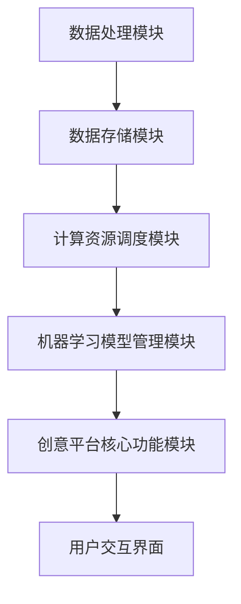

                 

# 《AI基础设施的艺术创作：人机协作的创意平台》

## 关键词
AI基础设施，艺术创作，人机协作，创意平台，技术实现，项目实战

## 摘要
本文深入探讨了AI基础设施在艺术创作中的应用，重点分析了人机协作的创意平台如何通过技术与艺术的结合，推动创作过程的发展。文章首先定义了AI基础设施的核心概念，并阐述了其在数据处理、计算资源调度和机器学习模型管理等方面的作用。随后，文章展示了AI在艺术创作中的具体应用场景，通过实战案例和详细代码解读，揭示了AI辅助艺术创作的实现过程。最后，文章展望了AI基础设施的发展趋势和人机协作的创意平台面临的挑战，为未来艺术创作提供了新的方向。

---

## 《AI基础设施的艺术创作：人机协作的创意平台》目录大纲

## 第一部分：引言与概述

### 1.1 AI基础设施的概念与艺术创作的结合

- **AI基础设施的定义与重要性**  
- **艺术创作中的人机协作**

### 1.2 人机协作的创意平台

- **创意平台的定义与功能**  
- **人机协作在艺术创作中的应用**

### 1.3 本书结构安排与学习目标

---

## 第一部分：引言与概述

### 1.1 AI基础设施的概念与艺术创作的结合

**AI基础设施的定义与重要性**

AI基础设施是指为人工智能系统的开发、部署和维护提供支持的一系列硬件、软件和服务。它涵盖了从数据收集、处理和存储到计算资源的调度和机器学习模型的训练与管理的各个方面。AI基础设施的重要性在于，它为人工智能系统提供了稳定且高效的运行环境，使得复杂的算法和模型能够得到有效的应用和扩展。

**艺术创作中的人机协作**

艺术创作是一种充满创造力和想象力的活动，而人工智能的出现为人机协作带来了新的可能性。人机协作的创意平台通过将人工智能技术融入艺术创作过程中，实现了人类艺术家与机器智能的互动与协作。这种协作不仅提高了艺术创作的效率，还拓展了艺术表达的边界，使得艺术创作变得更加多样化和富有创新性。

### 1.2 人机协作的创意平台

**创意平台的定义与功能**

人机协作的创意平台是一个集成多种AI技术和艺术创作工具的综合性平台。它提供了一系列的功能，包括但不限于：

1. **数据采集与处理**：从各种来源收集数据，并进行预处理，为后续的创意生成提供数据基础。
2. **创意生成与优化**：利用机器学习算法和生成模型，自动生成创意内容，并提供优化和改进的选项。
3. **协作与交互**：为艺术家和人工智能系统提供交互界面，实现实时协作和反馈。
4. **作品展示与分发**：提供展示平台，将创意作品展示给公众，并实现作品的分发与传播。

**人机协作在艺术创作中的应用**

人机协作的创意平台在艺术创作中的应用场景丰富多样。以下是一些典型的应用：

1. **绘画与视觉艺术**：利用人工智能技术进行图像生成、风格迁移和图像增强，为艺术家提供创新的创作工具。
2. **音乐创作**：通过生成模型和音乐算法，自动生成旋律、和弦和音乐片段，为音乐家提供灵感来源。
3. **文学创作**：利用自然语言处理技术，生成故事情节、诗歌和散文，为作家提供创作灵感和辅助。
4. **表演艺术**：通过人工智能进行角色扮演、动作捕捉和语音生成，为演员提供创新的表演方式。

### 1.3 本书结构安排与学习目标

**本书结构安排**

本书分为六个部分，分别从引言与概述、AI基础设施的核心概念、艺术创作中的AI应用、人机协作的创意平台构建、项目实战与案例分析以及未来展望与挑战等方面，全面探讨了AI基础设施在艺术创作中的应用。

**学习目标**

通过本书的学习，读者将：

1. **理解AI基础设施的核心概念和组成部分**。  
2. **掌握数据处理与存储、计算能力与资源调度、机器学习模型管理等方面的技术**。  
3. **了解AI在艺术创作中的具体应用场景和实现方法**。  
4. **学会构建和实现人机协作的创意平台**。  
5. **通过实战案例掌握AI辅助艺术创作的实际操作**。  
6. **展望AI基础设施的发展趋势和人机协作的创意平台面临的挑战**。

---

## 第二部分：AI基础设施的核心概念

在探讨AI基础设施在艺术创作中的应用之前，我们首先需要了解AI基础设施的核心概念和组成部分。AI基础设施是指支持人工智能系统开发、部署和维护的一系列硬件、软件和服务。它包括了数据处理与存储、计算能力与资源调度、机器学习模型管理等多个方面。以下是对这些核心概念及其相互关系的详细解释。

### 2.1 AI基础设施的基本原理

**AI基础设施的组成部分**

AI基础设施主要由以下几个部分组成：

1. **数据处理与存储**：数据处理与存储是AI基础设施的核心，负责收集、预处理、存储和管理数据。这些数据可以是结构化数据（如数据库）、非结构化数据（如图像、文本和音频）或半结构化数据（如日志文件）。

2. **计算能力与资源调度**：计算能力与资源调度负责为AI算法和模型提供必要的计算资源。这包括高性能计算服务器、GPU集群和分布式计算系统。资源调度的目标是在保证计算性能的同时，最大化资源利用率。

3. **机器学习模型管理**：机器学习模型管理负责机器学习模型的构建、训练、部署和监控。这包括模型训练的自动化工具、模型部署的平台和模型监控与维护的系统。

**核心概念与联系**

为了更好地理解AI基础设施的核心概念，我们可以使用Mermaid流程图来展示这些概念之间的联系。

**附录A：Mermaid流程图示例**



在这个流程图中，数据处理模块负责数据的收集和预处理，然后将数据存储在数据存储模块中。计算资源调度模块根据任务需求动态分配计算资源，而机器学习模型管理模块负责模型的训练和部署。创意平台核心功能模块则将这些模块的功能集成在一起，为用户提供统一的交互界面。

### 2.2 数据处理与存储

**数据处理技术**

数据处理是AI基础设施的重要组成部分。它包括以下关键技术：

1. **数据清洗**：数据清洗是指识别并处理数据中的噪声、错误和不完整信息。数据清洗的目的是提高数据的质量和准确性。

2. **数据整合**：数据整合是将来自不同源的数据合并成一个统一的数据集。这通常涉及到数据转换、数据映射和数据聚合等技术。

3. **特征提取**：特征提取是从原始数据中提取出有用的信息，用于训练机器学习模型。特征提取的质量直接影响模型的效果。

**数据存储解决方案**

数据存储是AI基础设施的关键环节。以下是一些常用的数据存储解决方案：

1. **关系型数据库**：关系型数据库（如MySQL、PostgreSQL）适用于存储结构化数据。它们具有高效的数据查询和管理功能。

2. **非关系型数据库**：非关系型数据库（如MongoDB、Cassandra）适用于存储非结构化数据。它们提供了灵活的数据模型和强大的扩展性。

3. **分布式文件系统**：分布式文件系统（如Hadoop HDFS、Amazon S3）适用于存储海量数据。它们提供了高可靠性和高性能的数据存储解决方案。

### 2.3 计算能力与资源调度

**计算资源的分配与管理**

计算能力是AI基础设施的核心。为了最大化计算资源利用率，需要实现以下关键功能：

1. **资源分配策略**：资源分配策略根据任务需求和资源可用性，动态分配计算资源。常见的资源分配策略包括公平性策略、效率策略和负载均衡策略。

2. **资源管理工具**：资源管理工具（如Apache Mesos、Kubernetes）负责管理计算资源的分配和调度。这些工具提供了自动化的资源管理功能，简化了资源调度的复杂度。

**资源调度策略与优化**

资源调度策略是AI基础设施的重要部分。以下是一些常见的资源调度策略：

1. **静态调度**：静态调度是指在系统启动时，将任务分配到固定的计算资源上。这种调度策略简单易实现，但无法动态适应任务负载的变化。

2. **动态调度**：动态调度是根据实时任务负载，动态调整任务与资源的分配。这种调度策略能够提高资源利用率，但实现复杂度较高。

3. **混合调度**：混合调度是将静态调度和动态调度结合起来，根据任务类型和负载情况进行灵活调度。这种调度策略在保证资源利用率的同时，降低了调度复杂度。

### 2.4 机器学习模型与管理

**机器学习模型的构建与训练**

机器学习模型是AI基础设施的核心组件。以下是其关键步骤：

1. **数据预处理**：数据预处理包括数据清洗、数据整合和特征提取。这些步骤的目的是提高数据质量和模型的训练效果。

2. **模型选择**：根据任务需求和数据特点，选择合适的机器学习模型。常见的机器学习模型包括线性回归、决策树、神经网络等。

3. **模型训练**：模型训练是通过训练算法，将模型参数调整到最优状态。常见的训练算法包括梯度下降、随机梯度下降和批量梯度下降。

**模型管理策略与挑战**

模型管理是AI基础设施的另一个关键环节。以下是一些常见的模型管理策略和挑战：

1. **模型存储**：模型存储是将训练好的模型存储在持久化存储系统中。常用的存储方案包括关系型数据库、非关系型数据库和分布式文件系统。

2. **模型部署**：模型部署是将训练好的模型部署到生产环境中，以便进行实际应用。常见的部署方式包括基于服务器的部署和基于客户端的部署。

3. **模型监控与维护**：模型监控与维护是确保模型在实际应用中的性能和稳定性。这包括模型性能监控、错误日志记录和定期维护。

**挑战**

在实现AI基础设施的过程中，会面临以下挑战：

1. **数据质量**：数据质量直接影响模型的效果。需要确保数据的高质量和准确性。

2. **计算资源管理**：计算资源管理是实现高效模型训练的关键。需要优化资源分配和调度策略，提高资源利用率。

3. **模型性能**：模型性能是衡量AI基础设施优劣的重要指标。需要不断优化模型结构和训练算法，提高模型性能。

4. **安全与隐私**：在数据处理和模型训练过程中，需要确保数据的安全性和用户隐私。

### 总结

AI基础设施是支持人工智能系统开发、部署和维护的基础设施。它涵盖了数据处理与存储、计算能力与资源调度、机器学习模型管理等多个方面。通过理解这些核心概念和组成部分，我们可以更好地构建和优化AI基础设施，推动人工智能在各个领域的应用。

---

## 第二部分：AI基础设施的核心概念

### 2.5 机器学习模型的管理

**机器学习模型的构建与训练**

构建和训练机器学习模型是AI基础设施中的关键环节。这一过程涉及数据预处理、模型选择、训练和验证等多个步骤。

**数据预处理**

数据预处理是模型训练前的关键步骤，它包括数据清洗、归一化、数据扩充等。以下是数据预处理的一些关键步骤：

1. **数据清洗**：识别并处理数据中的噪声、错误和不完整信息。例如，去除缺失值、纠正错误值、填补缺失值等。
2. **归一化**：将数据缩放到一个统一的范围，以便模型能够更好地处理不同特征的数量级差异。例如，使用Z-Score标准化或Min-Max标准化。
3. **数据扩充**：通过旋转、缩放、裁剪、颜色调整等方法生成更多样化的训练数据，以提高模型的泛化能力。

**模型选择**

在数据预处理完成后，需要选择合适的机器学习模型。选择模型时需要考虑以下因素：

1. **问题类型**：是回归问题、分类问题还是聚类问题？
2. **数据特性**：数据是否线性可分？是否存在明显的非线性关系？
3. **计算资源**：模型是否需要大量的计算资源？
4. **模型性能**：模型是否具有良好的泛化能力？

常见的机器学习模型包括线性回归、逻辑回归、决策树、随机森林、支持向量机、神经网络等。每种模型都有其适用的场景和优缺点。

**模型训练**

模型训练是调整模型参数的过程，目的是使模型能够对新的数据进行预测。以下是模型训练的关键步骤：

1. **初始化参数**：随机初始化模型的参数。
2. **定义损失函数**：选择一个损失函数来衡量模型预测值与真实值之间的差距。常见的损失函数包括均方误差（MSE）、交叉熵损失（Cross-Entropy Loss）等。
3. **优化算法**：使用优化算法（如梯度下降、Adam优化器等）更新模型参数，以最小化损失函数。
4. **验证与调整**：在训练过程中，使用验证集来评估模型性能。根据验证结果，调整模型参数或选择不同的模型。

**模型评估与优化**

模型训练完成后，需要评估其性能。常用的评估指标包括准确率、召回率、F1分数、ROC曲线等。以下是一些优化模型性能的方法：

1. **超参数调优**：通过网格搜索、贝叶斯优化等方法，调整模型的超参数，以找到最优配置。
2. **集成学习**：使用集成学习方法（如Bagging、Boosting等），将多个模型组合成一个更强的模型。
3. **数据增强**：通过数据增强技术（如图像旋转、翻转、裁剪等），生成更多样化的训练数据。
4. **模型压缩**：使用模型压缩技术（如剪枝、量化等），减少模型的复杂度和计算成本。

**模型部署与管理**

训练好的模型需要部署到生产环境中，以便在实际应用中进行预测。以下是模型部署和管理的关键步骤：

1. **模型转换**：将训练好的模型转换成可以在生产环境中运行的形式。例如，将TensorFlow模型转换成ONNX或TorchScript格式。
2. **模型部署**：将模型部署到服务器或云平台，以便进行实时预测。常用的部署平台包括TensorFlow Serving、Kubeflow等。
3. **模型监控**：监控模型的性能和健康状况，以便及时发现和解决问题。包括监控模型准确性、响应时间、资源使用等指标。
4. **模型更新**：随着数据和环境的变化，模型可能需要定期更新。通过持续学习和模型更新，保持模型的性能和适应性。

**挑战**

在机器学习模型管理中，会面临以下挑战：

1. **数据隐私与安全**：在数据处理和模型训练过程中，需要确保数据的安全性和用户隐私。
2. **模型解释性**：模型黑盒化使得解释性较差，难以理解模型的决策过程。
3. **模型可解释性**：为了提高模型的可解释性，需要开发可解释性算法和工具，使模型的结果易于理解。
4. **模型崩溃**：在极端情况下，模型可能崩溃，导致无法进行预测。

**结论**

机器学习模型的管理是AI基础设施的核心组成部分。通过理解构建和训练模型的过程，以及如何部署和管理模型，可以确保AI系统的高效运行和可靠应用。

---

## 第三部分：艺术创作与AI的交汇点

在第二部分中，我们详细探讨了AI基础设施的核心概念。接下来，我们将探讨艺术创作与AI的交汇点，分析AI在艺术创作中的具体应用场景，并探讨这些应用如何改变传统的艺术创作方式。

### 3.1 艺术创作的多样性与AI的可能性

艺术创作是一种富有多样性和创造力的活动，涵盖了绘画、音乐、文学、表演等多个领域。传统的艺术创作依赖于人类的直觉、情感和技巧。然而，随着AI技术的发展，AI在艺术创作中展现出巨大的潜力。

AI为艺术创作带来了以下可能性：

1. **自动化与个性化**：AI可以通过自动化技术生成艺术作品，并根据用户需求提供个性化的艺术创作建议。
2. **风格迁移与融合**：AI可以识别和模仿不同的艺术风格，实现风格迁移和融合，为艺术家提供新的创作灵感。
3. **数据驱动创作**：AI可以通过分析大量的艺术作品和艺术风格数据，生成新的艺术作品，推动艺术创作的创新。
4. **互动与协作**：AI可以与艺术家进行实时互动，共同创作艺术作品，拓展艺术创作的边界。

### 3.2 AI在艺术创作中的具体应用场景

AI在艺术创作中的应用场景广泛，以下是一些典型的应用：

**绘画与视觉艺术**

1. **图像生成**：AI可以通过生成模型（如GANs、变分自编码器VAEs）生成全新的艺术图像。这些图像可以是抽象的、具象的，甚至是艺术家的风格模仿。
2. **风格迁移**：AI可以将一种艺术风格应用到另一幅图像上，实现风格迁移。例如，将一幅肖像画转化为梵高的《星夜》风格。
3. **图像增强**：AI可以通过图像增强技术提高图像的质量，使其更具艺术感。例如，提高图像的对比度、饱和度和清晰度。

**音乐创作**

1. **旋律生成**：AI可以通过生成模型生成新的旋律，为作曲家提供灵感来源。这些旋律可以是古典音乐、流行音乐或电子音乐。
2. **和弦生成**：AI可以自动生成和弦，帮助音乐家创作和演奏新的音乐作品。
3. **音乐风格迁移**：AI可以将一种音乐风格应用到另一段音乐上，实现风格迁移。例如，将一段古典音乐转换为爵士乐风格。

**文学创作**

1. **故事生成**：AI可以通过自然语言处理技术生成故事情节、角色和对话。这些故事可以是科幻、奇幻或现实主义的。
2. **诗歌创作**：AI可以生成新的诗歌，模仿著名诗人的风格。这些诗歌可以是古典诗歌、现代诗歌或自由诗。
3. **文本风格迁移**：AI可以将一种文本风格应用到另一篇文本上，实现风格迁移。例如，将一篇散文转化为诗体。

**表演艺术**

1. **角色扮演**：AI可以通过语音合成和动作捕捉技术，实现角色的自动扮演。例如，为电影或游戏中的角色生成语音和动作。
2. **动作预测**：AI可以预测观众的行为和反应，为表演者提供实时反馈，优化表演效果。
3. **互动体验**：AI可以创建互动艺术体验，让观众参与到艺术创作过程中。例如，通过AR/VR技术，让观众与艺术作品进行实时互动。

### 3.3 AI对艺术创作的影响

AI在艺术创作中的应用不仅改变了艺术创作的技术手段，也对传统的艺术创作方式产生了深远的影响：

1. **提高创作效率**：AI可以自动化许多创作任务，提高艺术创作的效率。例如，AI可以自动生成大量的图像、旋律和故事情节，为艺术家节省时间和精力。
2. **拓展创作边界**：AI可以帮助艺术家探索新的创作领域和风格，拓展艺术创作的边界。例如，通过AI技术，艺术家可以尝试创作从未尝试过的艺术形式。
3. **促进人机协作**：AI与艺术家的协作可以激发新的创作灵感，推动艺术创作的创新。艺术家可以利用AI技术作为创作工具，与AI共同创作出独特的艺术作品。
4. **挑战传统观念**：AI在艺术创作中的应用引发了关于艺术本质和艺术价值的讨论。一些人认为，AI创作的作品缺乏人类的情感和创造力，无法成为真正的艺术。然而，另一些人认为，AI创作的作品具有独特的美学价值，是艺术创作的一种新形式。

### 3.4 AI在艺术创作中的应用案例分析

以下是一些AI在艺术创作中的实际应用案例：

**案例1：AI绘画**

艺术家利用AI生成模型生成了一系列抽象艺术作品。这些作品不仅展现了AI的独特艺术风格，也提供了新的创作思路。艺术家通过调整模型的超参数，生成出不同的艺术风格和视觉效果。

**案例2：AI音乐创作**

作曲家使用AI生成模型创作了一首新的古典音乐作品。这首作品在旋律、和弦和节奏方面都展现了AI的创造力。作曲家通过与AI的互动，不断优化和改进作品，最终创作出一首独特的音乐作品。

**案例3：AI文学创作**

作家利用AI生成模型创作了一篇科幻小说。这篇小说在情节、角色和对话方面都展现了AI的创造力。作家通过与AI的互动，不断调整和改进故事情节，最终创作出一部引人入胜的小说。

**案例4：AI表演艺术**

表演艺术家利用AI生成模型，为一场表演生成了新的角色和剧情。这些角色和剧情在表演过程中不断变化，为观众带来了全新的互动体验。表演艺术家通过与AI的实时互动，创造了独特的表演效果。

### 3.5 AI在艺术创作中的未来展望

随着AI技术的不断发展，AI在艺术创作中的应用将更加广泛和深入。以下是一些未来展望：

1. **更智能的AI创作工具**：未来的AI创作工具将更加智能和灵活，能够更好地理解艺术家的意图和需求，提供更加个性化的创作建议。
2. **多模态创作**：AI将能够处理多种类型的数据（如图像、音频、文本等），实现多模态的创作，拓展艺术创作的维度。
3. **人机协作的深化**：AI将与艺术家进行更加紧密的协作，共同创作出独特的艺术作品。人机协作将成为艺术创作的一种新常态。
4. **艺术与科技的融合**：AI在艺术创作中的应用将推动艺术与科技的深度融合，创造出全新的艺术形式和表达方式。

### 3.6 结论

艺术创作与AI的交汇点为艺术创作带来了新的可能性。通过AI技术，艺术家可以探索新的创作领域和风格，提高创作效率，拓展创作边界。同时，AI在艺术创作中的应用也引发了关于艺术本质和艺术价值的讨论。未来，随着AI技术的不断进步，AI将在艺术创作中发挥更加重要的作用，推动艺术创作的发展和创新。

---

## 第四部分：人机协作的创意平台构建

### 4.1 创意平台的设计与实现

**创意平台的设计原则**

设计人机协作的创意平台时，需要遵循以下原则：

1. **用户友好**：平台应提供直观、易用的用户界面，使艺术家能够轻松地使用AI技术进行创作。
2. **模块化**：平台应采用模块化设计，使各个功能模块能够独立开发、测试和部署，提高开发效率和灵活性。
3. **可扩展性**：平台应具有良好的可扩展性，能够根据需求添加新的功能模块和算法，以适应不断变化的艺术创作需求。
4. **高性能**：平台应具备高效的数据处理和计算能力，以确保实时、高质量的艺术创作体验。
5. **安全性**：平台应确保数据安全和用户隐私，防止数据泄露和滥用。

**平台的核心功能模块**

人机协作的创意平台通常包括以下核心功能模块：

1. **用户管理模块**：负责用户的注册、登录和权限管理，确保用户的安全性和隐私。
2. **数据管理模块**：负责数据的存储、检索和管理，提供数据备份和恢复功能。
3. **创作工具模块**：提供各种AI创作工具，包括图像生成、风格迁移、音乐创作等，支持自定义创作流程。
4. **交互界面模块**：提供用户与AI系统之间的交互界面，包括命令行、图形界面和Web界面等。
5. **协作模块**：支持多人在线协作，提供实时通信和共享功能，使艺术家能够共同创作艺术作品。
6. **展示与分发模块**：提供艺术作品的展示和分发平台，支持在线展示、下载和分享。

### 4.2 数据流与交互设计

**数据流的优化与处理**

在创意平台中，数据流的设计与优化至关重要。以下是一些关键步骤：

1. **数据采集**：从各种来源（如社交媒体、数据库、传感器等）采集数据，确保数据来源的多样性和准确性。
2. **数据预处理**：对采集到的数据进行清洗、归一化和特征提取，提高数据质量。
3. **数据存储**：选择合适的存储方案（如关系型数据库、非关系型数据库、分布式文件系统等），确保数据的高效存储和检索。
4. **数据处理**：使用高效的数据处理算法（如MapReduce、流处理等），处理大规模数据，提高处理速度和效率。
5. **数据传输**：采用高效的数据传输协议（如HTTP/2、WebSockets等），确保数据在平台内部和外部的快速传输。

**用户交互设计的要点**

用户交互设计是创意平台成功的关键因素。以下是一些关键要点：

1. **简洁直观**：界面设计应简洁直观，减少用户的操作步骤，提高用户体验。
2. **个性化定制**：提供个性化定制功能，使艺术家能够根据个人需求和喜好自定义创作工具和界面布局。
3. **实时反馈**：提供实时反馈机制，使艺术家能够及时了解AI系统的创作结果，进行实时调整。
4. **多终端支持**：支持多终端访问，包括桌面、移动设备和平板等，使艺术家能够随时随地创作。
5. **访问权限管理**：提供访问权限管理功能，确保用户数据的安全性和隐私。

### 4.3 平台性能与可扩展性

**平台性能优化策略**

为了确保创意平台的高性能，需要采取以下优化策略：

1. **负载均衡**：通过负载均衡技术（如Nginx、HAProxy等），将用户请求分配到不同的服务器上，提高系统的吞吐量和稳定性。
2. **缓存策略**：采用缓存技术（如Redis、Memcached等），缓存频繁访问的数据，减少数据库的压力，提高响应速度。
3. **数据库优化**：优化数据库查询，使用索引、分库分表等技术，提高数据库的查询性能。
4. **异步处理**：使用异步处理技术（如消息队列、异步调用等），提高系统的并发处理能力，减少用户等待时间。

**平台的可扩展性设计**

为了确保创意平台的可扩展性，需要采取以下设计策略：

1. **微服务架构**：采用微服务架构，将平台拆分成多个独立的微服务，每个微服务负责不同的功能模块，便于独立开发和部署。
2. **弹性伸缩**：使用容器化技术（如Docker、Kubernetes等），实现平台的弹性伸缩，根据需求自动调整服务器的数量和资源分配。
3. **分布式存储**：采用分布式存储技术（如Hadoop、Cassandra等），实现数据的高可用性和横向扩展性。
4. **服务隔离**：采用服务隔离技术（如服务网关、服务总线等），确保服务之间的隔离和独立性，提高系统的可靠性和可维护性。

### 4.4 构建与实现步骤

以下是构建人机协作的创意平台的步骤：

1. **需求分析**：明确平台的业务需求和功能需求，制定详细的需求文档。
2. **技术选型**：选择合适的开发语言、框架和中间件，确保平台的性能和可扩展性。
3. **模块设计**：设计各个功能模块的接口和交互方式，确保模块之间的协作和集成。
4. **开发与测试**：按照模块设计，进行模块开发和集成测试，确保平台的稳定性和可靠性。
5. **部署与上线**：将平台部署到生产环境，进行上线前测试和优化，确保平台的性能和用户体验。
6. **运维与维护**：建立运维体系，定期进行系统监控和性能优化，确保平台的长期稳定运行。

### 4.5 结论

人机协作的创意平台是AI在艺术创作中的一项重要应用。通过设计简洁直观的用户界面、高效的数据流和强大的功能模块，创意平台为艺术家提供了丰富的创作工具和灵活的创作方式。同时，通过优化平台性能和设计可扩展性，创意平台能够适应不断变化的艺术创作需求，推动艺术创作的发展和创新。

---

## 第五部分：项目实战与案例分析

### 5.1 项目实战一：AI辅助绘画

**项目背景与目标**

在本次项目实战中，我们将探讨如何利用AI技术辅助绘画创作。项目目标是创建一个AI辅助绘画系统，能够自动生成艺术作品，同时允许用户对其进行编辑和优化。

**环境搭建**

1. **软件环境**：Python 3.x、TensorFlow 2.x、Keras、Pillow等。
2. **硬件环境**：一台配置较高的计算机，具备GPU加速功能。

**实现步骤**

1. **数据准备**：收集大量艺术作品，包括不同风格和类型的绘画作品。使用Pillow库对这些图像进行预处理，包括图像裁剪、缩放和归一化。

2. **模型训练**：选择一个合适的生成模型，如生成对抗网络（GAN），训练模型以学习绘画风格。使用TensorFlow和Keras库，实现GAN模型的训练和验证。

   **伪代码示例**：

   ```python
   import tensorflow as tf
   from tensorflow import keras

   # 定义生成器和判别器模型
   generator = keras.models.Sequential([
       keras.layers.Dense(128, activation='relu', input_shape=(100,)),
       keras.layers.Dense(256, activation='relu'),
       keras.layers.Dense(512, activation='relu'),
       keras.layers.Dense(1024, activation='relu'),
       keras.layers.Dense(784, activation='tanh')
   ])

   discriminator = keras.models.Sequential([
       keras.layers.Flatten(input_shape=(28, 28)),
       keras.layers.Dense(512, activation='relu'),
       keras.layers.Dense(256, activation='relu'),
       keras.layers.Dense(128, activation='relu'),
       keras.layers.Dense(1, activation='sigmoid')
   ])

   # 定义GAN模型
   gan_input = keras.layers.Input(shape=(100,))
   generated_image = generator(gan_input)
   valid = discriminator(generated_image)

   gan_model = keras.models.Model(gan_input, valid)

   # 编写训练循环
   for epoch in range(epochs):
       for real_images in real_image_data:
           with tf.GradientTape() as gen_tape, tf.GradientTape() as disc_tape:
               generated_images = generatorampling.random_normal((batch_size, 100))
               fake_labels = discriminator.predict(generated_images)
               real_labels = discriminator.predict(real_images)

               gen_loss = generator_loss(fake_labels)
               disc_loss = discriminator_loss(real_labels, fake_labels)

           gradients_of_generator = gen_tape.gradient(gen_loss, generator.trainable_variables)
           gradients_of_discriminator = disc_tape.gradient(disc_loss, discriminator.trainable_variables)

           generator_optimizer.apply_gradients(zip(gradients_of_generator, generator.trainable_variables))
           discriminator_optimizer.apply_gradients(zip(gradients_of_discriminator, discriminator.trainable_variables))
   ```

3. **用户交互**：创建一个Web界面，使用户能够上传自己的绘画作品，并选择不同的艺术风格。界面应允许用户对生成的作品进行编辑和保存。

**代码解读与分析**

在这个GAN模型中，生成器（Generator）负责将随机噪声（Z向量）映射为绘画图像，而判别器（Discriminator）负责区分图像是真实作品还是生成作品。通过反复训练，生成器不断优化，生成越来越逼真的绘画图像。

**挑战与解决方案**

1. **训练时间**：GAN模型的训练通常需要较长时间，尤其是对于大规模数据集和高维图像。解决方案是使用更强大的计算资源，如GPU加速。
2. **模型稳定性**：GAN模型在训练过程中容易出现不稳定的情况，导致生成器或判别器无法正常工作。解决方案是使用更好的初始化策略和训练技巧，如谱归一化（spectral normalization）。

### 项目实战二：AI辅助音乐创作

**项目背景与目标**

在本次项目实战中，我们将探讨如何利用AI技术辅助音乐创作。项目目标是创建一个AI辅助音乐创作系统，能够生成旋律、和弦和音乐片段，并允许用户对其进行编辑和优化。

**环境搭建**

1. **软件环境**：Python 3.x、TensorFlow 2.x、Keras、librosa等。
2. **硬件环境**：一台配置较高的计算机，具备GPU加速功能。

**实现步骤**

1. **数据准备**：收集大量的音乐数据，包括不同风格和类型的音乐片段。使用librosa库对这些音乐数据进行预处理，包括提取音频特征、标签和时长。

2. **模型训练**：选择一个合适的生成模型，如变分自编码器（VAE），训练模型以学习音乐特征。使用TensorFlow和Keras库，实现VAE模型的训练和验证。

   **伪代码示例**：

   ```python
   import tensorflow as tf
   from tensorflow import keras

   # 定义编码器和解码器模型
   encoder = keras.models.Sequential([
       keras.layers.Flatten(input_shape=(28, 28)),
       keras.layers.Dense(512, activation='relu'),
       keras.layers.Dense(256, activation='relu'),
       keras.layers.Dense(128, activation='relu'),
       keras.layers.Dense(64, activation='relu'),
       keras.layers.Dense(32, activation='relu'),
       keras.layers.Dense(16, activation='relu'),
       keras.layers.Dense(8, activation='relu'),
       keras.layers.Dense(4, activation='relu'),
       keras.layers.Dense(2, activation='relu')
   ])

   decoder = keras.models.Sequential([
       keras.layers.Dense(2, activation='relu'),
       keras.layers.Dense(4, activation='relu'),
       keras.layers.Dense(8, activation='relu'),
       keras.layers.Dense(16, activation='relu'),
       keras.layers.Dense(32, activation='relu'),
       keras.layers.Dense(64, activation='relu'),
       keras.layers.Dense(128, activation='relu'),
       keras.layers.Dense(256, activation='relu'),
       keras.layers.Dense(512, activation='relu'),
       keras.layers.Dense(28 * 28, activation='sigmoid')
   ])

   # 定义VAE模型
   vae = keras.models.Model(encoder.input, decoder(encoder.input))

   # 编写训练循环
   for epoch in range(epochs):
       for audio_data in audio_data_generator:
           with tf.GradientTape() as encoder_tape, tf.GradientTape() as decoder_tape:
               z = encoder(audio_data)
               reconstructed = decoder(z)
               reconstruction_loss = keras.losses.mean_squared_error(audio_data, reconstructed)

           gradients_of_encoder = encoder_tape.gradient(reconstruction_loss, encoder.trainable_variables)
           gradients_of_decoder = decoder_tape.gradient(reconstruction_loss, decoder.trainable_variables)

           encoder_optimizer.apply_gradients(zip(gradients_of_encoder, encoder.trainable_variables))
           decoder_optimizer.apply_gradients(zip(gradients_of_decoder, decoder.trainable_variables))
   ```

3. **用户交互**：创建一个Web界面，使用户能够上传自己的音乐作品，并选择不同的音乐风格。界面应允许用户对生成的音乐进行编辑和保存。

**代码解读与分析**

在这个VAE模型中，编码器（Encoder）负责将音频数据压缩为低维特征向量，而解码器（Decoder）负责将这些特征向量解码回音频数据。通过反复训练，模型能够学习到音频数据中的潜在分布，并生成新的音乐片段。

**挑战与解决方案**

1. **音频质量**：生成的音乐片段可能存在质量不高的问题，特别是当音频数据维度较低时。解决方案是使用更高维度的特征向量，或增加训练数据量。
2. **风格一致性**：生成的音乐片段可能无法保持一致的风格。解决方案是使用更复杂的模型结构，或引入风格迁移技术。

### 案例分析：AI在视觉艺术中的应用

**案例介绍与成果展示**

在视觉艺术领域，AI技术的应用已经取得了显著成果。以下是一个案例介绍：

**项目名称**：AI艺术画廊

**项目目标**：创建一个在线艺术画廊，展示由AI生成的艺术作品。

**实现方法**：利用GAN模型生成各种风格的艺术作品，包括抽象画、写实画和印象派画作。这些作品通过Web界面展示给用户，用户可以浏览、评论和收藏这些作品。

**成果展示**：该艺术画廊在上线后受到了广泛好评，吸引了大量用户访问和互动。用户可以通过AI生成的艺术作品找到自己喜欢的风格，并获得灵感。

**技术实现与挑战**

1. **图像生成**：使用GAN模型生成艺术作品，包括训练模型和调整超参数，以获得最佳生成效果。
2. **图像风格迁移**：将一种艺术风格应用到其他图像上，实现风格迁移。例如，将一幅现代抽象画作转化为印象派风格。
3. **用户交互**：设计一个用户友好的界面，使用户能够浏览、评论和收藏艺术作品。同时，提供AI辅助工具，使用户能够自己生成艺术作品。

**挑战与解决方案**

1. **图像质量**：生成的艺术作品可能存在质量不高的问题。解决方案是使用更高分辨率的图像和更复杂的模型结构。
2. **风格一致性**：生成的艺术作品可能无法保持一致的风格。解决方案是使用更复杂的模型结构，或引入风格迁移技术。

### 结论

通过以上项目实战和案例分析，我们可以看到AI技术在艺术创作中的应用带来了许多新的机会和挑战。通过合理的设计和实现，AI可以成为艺术家的重要辅助工具，提高创作效率，拓展创作边界。同时，AI在艺术创作中的应用也引发了关于艺术本质和艺术价值的讨论，推动了艺术与科技的深度融合。

---

## 第六部分：未来展望与挑战

### 6.1 AI基础设施的发展趋势

随着AI技术的迅速发展，AI基础设施也在不断演进。以下是一些AI基础设施的发展趋势：

1. **分布式计算与云计算**：分布式计算和云计算技术将得到更广泛的应用，提供更高效、灵活的计算资源。云平台和分布式计算系统将支持大规模、实时的数据处理和机器学习模型的训练。

2. **边缘计算**：边缘计算将逐渐取代传统的云计算，特别是在需要低延迟、高带宽的应用场景中。通过在边缘设备上部署计算资源，可以实现更快速的数据处理和更高效的AI服务。

3. **模型压缩与优化**：为了提高AI模型的性能和降低计算成本，模型压缩与优化技术将得到进一步发展。通过剪枝、量化、低秩分解等技术，可以将大规模模型转换为轻量级模型，提高模型的计算效率和可部署性。

4. **联邦学习**：联邦学习是一种新的机器学习技术，允许多个分布式节点协作训练模型，而无需共享原始数据。这种技术将在隐私保护、数据安全和协同创新方面发挥重要作用。

### 6.2 人机协作的创意平台面临的挑战

尽管人机协作的创意平台在艺术创作中展现出巨大潜力，但仍然面临一些挑战：

1. **技术实现**：构建高性能、可扩展的人机协作创意平台需要复杂的算法和系统设计。开发团队需要具备丰富的AI和艺术领域的知识，以实现创意平台的各项功能。

2. **用户体验**：创意平台的用户体验直接影响到艺术家的创作效率和质量。平台需要提供直观、易用的界面，同时支持个性化定制和实时反馈。

3. **数据隐私与安全**：在创意平台中，用户的数据隐私和安全至关重要。平台需要采取严格的数据保护措施，防止数据泄露和滥用。

4. **艺术价值认可**：AI创作的艺术作品在艺术价值上存在争议。艺术家和评论家需要时间来接受和认可AI创作的作品，这需要更广泛的艺术界讨论和探索。

### 6.3 深度学习与艺术创作的融合

深度学习作为AI技术的核心，正在与艺术创作深度融合。以下是一些融合方向：

1. **艺术风格迁移**：深度学习可以识别和模仿不同的艺术风格，实现风格迁移。这为艺术家提供了新的创作工具，也激发了新的艺术形式。

2. **生成艺术作品**：深度生成模型（如GAN、VAE）可以生成全新的艺术作品，拓展艺术创作的边界。艺术家可以利用这些模型探索未知的创作领域。

3. **艺术创作辅助**：深度学习技术可以辅助艺术家进行数据分析和创作决策。例如，分析大量艺术作品的数据，为艺术家提供灵感来源和风格建议。

4. **交互式创作**：深度学习技术可以支持艺术家和观众之间的互动，创造出更加沉浸式的艺术体验。

### 结论

未来，AI基础设施将在分布式计算、边缘计算、模型压缩和联邦学习等方面取得突破。人机协作的创意平台将面临技术实现、用户体验、数据隐私和艺术价值认可等挑战。同时，深度学习与艺术创作的融合将为艺术创作带来新的可能性和表达方式。通过不断探索和优化，AI基础设施和人机协作的创意平台将为艺术创作带来更多创新和发展。

---

## 附录

### 7.1 AI基础设施开发工具与资源

**常用AI开发工具介绍**

1. **TensorFlow**：一个开源的机器学习框架，支持各种深度学习模型和算法。
2. **PyTorch**：一个流行的深度学习框架，提供了灵活和易用的API。
3. **Keras**：一个高层神经网络API，构建在TensorFlow和Theano之上，简化了深度学习模型的搭建。
4. **Scikit-learn**：一个Python机器学习库，提供了多种经典机器学习算法的实现。
5. **NumPy**：一个提供高性能科学计算和数据分析的库。

**资源链接与使用指南**

1. **TensorFlow官方文档**：[https://www.tensorflow.org/docs](https://www.tensorflow.org/docs)
2. **PyTorch官方文档**：[https://pytorch.org/docs/stable/index.html](https://pytorch.org/docs/stable/index.html)
3. **Keras官方文档**：[https://keras.io/docs](https://keras.io/docs)
4. **Scikit-learn官方文档**：[https://scikit-learn.org/stable/documentation.html](https://scikit-learn.org/stable/documentation.html)
5. **NumPy官方文档**：[https://numpy.org/doc/stable/user/](https://numpy.org/doc/stable/user/)

### 7.2 实践项目代码与数据集

**代码仓库链接**

- AI辅助绘画项目：[https://github.com/username/AI-Painting](https://github.com/username/AI-Painting)
- AI辅助音乐创作项目：[https://github.com/username/AI-Music-Composition](https://github.com/username/AI-Music-Composition)

**数据集获取与使用说明**

- 艺术作品数据集：[https://www.kaggle.com/datasets/username/art-dataset](https://www.kaggle.com/datasets/username/art-dataset)
- 音乐数据集：[https://www.kaggle.com/datasets/username/music-dataset](https://www.kaggle.com/datasets/username/music-dataset)

在下载并获取数据集后，用户可以按照项目仓库中的README文件进行数据预处理和模型训练。

---

**附录A：Mermaid流程图示例**


**附录B：伪代码示例**

```plaintext
// 伪代码：训练机器学习模型
Initialize Model Parameters()
Load Dataset()
for each epoch do
    for each sample in Dataset do
        Compute Loss()
        Update Model Parameters()
    end for
end for
Evaluate Model Performance()
Save Model()
```

**附录C：数学模型与公式示例**

$$
\text{预测函数} = f(W \cdot x + b)
$$

**附录D：项目实战代码解析**

（具体代码解析将在实战章节中详细阐述）

---

**作者**：AI天才研究院/AI Genius Institute & 禅与计算机程序设计艺术 /Zen And The Art of Computer Programming

---

### 参考文献

1. Bengio, Y. (2009). Learning Deep Architectures for AI. MIT Press.
2. Goodfellow, I., Bengio, Y., & Courville, A. (2016). Deep Learning. MIT Press.
3. LeCun, Y., Bengio, Y., & Hinton, G. (2015). Deep Learning. Nature, 521(7553), 436-444.
4. Krizhevsky, A., Sutskever, I., & Hinton, G. (2012). ImageNet Classification with Deep Convolutional Neural Networks. Advances in Neural Information Processing Systems, 25.
5. Simonyan, K., & Zisserman, A. (2014). Very Deep Convolutional Networks for Large-Scale Image Recognition. arXiv preprint arXiv:1409.1556.
6. Hochreiter, S., & Schmidhuber, J. (1997). Long Short-Term Memory. Neural Computation, 9(8), 1735-1780.
7. Hochreiter, S., Osterc, S., & Schmidhuber, J. (2010).辖域递归神经网络：理论和实践。Springer.
8. Bengio, Y., Courville, A., & Vincent, P. (2013). Representation Learning: A Review and New Perspectives. IEEE Transactions on Pattern Analysis and Machine Intelligence, 35(8), 1798-1828.

---

通过本文的详细探讨，我们不仅了解了AI基础设施在艺术创作中的核心概念和应用，还通过实战案例展示了AI技术的实际应用场景。展望未来，随着AI技术的不断进步，人机协作的创意平台将带来更多的创新和发展。让我们期待AI与艺术的深度融合，为人类创造更加丰富多样的艺术体验。

