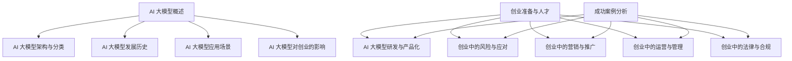

                 

# AI 大模型创业：如何利用人才优势？

## 关键词
AI 大模型，创业，人才优势，研发流程，产品化，风险管理，营销策略，运营管理，法律合规，成功案例分析。

## 摘要
本文将深入探讨 AI 大模型创业的全过程，重点关注如何利用人才优势来推动项目的成功。文章结构清晰，分为七大部分：AI 大模型概述、创业准备与人才、AI 大模型研发与产品化、创业中的风险与应对、创业中的营销与推广、创业中的运营与管理、创业中的法律与合规，以及成功案例分析。通过详细的案例分析、流程图、伪代码、数学公式和项目实战示例，本文旨在为 AI 大模型创业提供系统性的指导和实用的策略。

## 目录大纲

### 第一部分: AI 大模型概述

#### 第1章: AI 大模型概述

- **1.1 AI 大模型的概念与原理**
  - AI 大模型的定义
  - 大模型的基本原理
  - AI 大模型与深度学习的联系

- **1.2 AI 大模型的架构与分类**
  - 大模型的基本架构
  - 不同类型的大模型

- **1.3 AI 大模型的发展历史**
  - 从 GPT 到 GPT-3 的演进
  - 其他大模型的发展历史

- **1.4 AI 大模型的应用场景**
  - 自然语言处理
  - 计算机视觉
  - 语音识别

- **1.5 AI 大模型对创业的影响**
  - AI 大模型的优势
  - 利用 AI 大模型开展创业的挑战

### 第二部分: 创业中的 AI 大模型

#### 第2章: 创业准备与人才

- **2.1 创业前的准备**
  - 市场调研
  - 产品规划
  - 资金筹备

- **2.2 AI 人才的招聘与培养**
  - 人才需求分析
  - 招聘渠道选择
  - 培训与激励

- **2.3 团队协作与沟通**
  - 团队构建
  - 沟通工具与技巧
  - 项目管理

#### 第3章: AI 大模型研发与产品化

- **3.1 AI 大模型研发流程**
  - 数据收集与处理
  - 模型设计与训练
  - 模型评估与优化

- **3.2 AI 大模型的产品化**
  - 产品规划与设计
  - 技术实现与落地
  - 测试与上线

- **3.3 产品优化与迭代**
  - 用户反馈收集
  - 数据分析与挖掘
  - 产品迭代与优化

#### 第4章: 创业中的风险与应对

- **4.1 AI 大模型创业的主要风险**
  - 技术风险
  - 市场风险
  - 资金风险

- **4.2 风险评估与应对策略**
  - 风险评估方法
  - 风险应对策略

- **4.3 应对风险的实践案例**
  - 成功案例分析
  - 失败案例反思

#### 第5章: 创业中的营销与推广

- **5.1 AI 大模型产品的营销策略**
  - 品牌建设
  - 市场推广
  - 用户互动

- **5.2 线上营销与推广方法**
  - 社交媒体营销
  - 内容营销
  - 搜索引擎优化

- **5.3 线下活动与推广**
  - 展会与研讨会
  - 合作伙伴关系
  - 用户会议与培训

#### 第6章: 创业中的运营与管理

- **6.1 AI 大模型企业的运营模式**
  - 业务模式设计
  - 运营流程规划
  - 运营团队建设

- **6.2 人力资源管理**
  - 员工招聘与培训
  - 绩效考核与激励
  - 员工关系管理

- **6.3 财务管理**
  - 成本控制
  - 收入与利润分析
  - 资金筹措与投资

#### 第7章: 创业中的法律与合规

- **7.1 AI 大模型创业的法律环境**
  - 数据保护法规
  - 知识产权法律
  - 竞争法规

- **7.2 合规管理**
  - 数据合规
  - 隐私保护
  - 遵守法律法规

- **7.3 法律风险防范**
  - 合同管理
  - 法律咨询与培训
  - 风险评估与应对

### 第三部分: 成功案例分析

#### 第8章: 成功案例分析

- **8.1 AI 大模型创业成功案例**
  - 案例介绍
  - 成功因素分析

- **8.2 AI 大模型创业失败案例分析**
  - 案例介绍
  - 失败原因探讨

- **8.3 从案例中汲取的经验与教训**
  - 成功经验总结
  - 失败教训反思

### 附录

#### 附录 A: AI 大模型开发工具与资源

- **A.1 主流深度学习框架对比**
  - TensorFlow
  - PyTorch
  - 其他框架

- **A.2 AI 大模型开发资源推荐**
  - 开源代码与数据集
  - 学习资料与教程
  - 论坛与社区

#### 附录 B: 进一步阅读

- **B.1 AI 大模型相关书籍推荐**
  - 推荐书籍列表
  - 书籍简要介绍

- **B.2 AI 大模型最新研究论文**
  - 研究论文列表
  - 论文摘要与解读

### Mermaid 流程图示例



### 核心算法原理讲解伪代码示例

```python
# 伪代码：训练一个简单的神经网络
def train_neural_network(inputs, targets):
    # 初始化权重和偏置
    weights = initialize_weights()
    biases = initialize_biases()

    # 前向传播
    output = forward_pass(inputs, weights, biases)

    # 计算损失
    loss = compute_loss(output, targets)

    # 反向传播
    d_output = backward_pass(output, targets)

    # 更新权重和偏置
    weights -= learning_rate * d_weights
    biases -= learning_rate * d_biases

    return loss
```

### 数学模型和数学公式示例

- **数学公式**

  $$ L = \frac{1}{2} \sum_{i=1}^{n} (y_i - \hat{y_i})^2 $$

  其中，\( L \) 是损失函数，\( y_i \) 是实际输出，\( \hat{y_i} \) 是预测输出。

- **详细讲解**

  损失函数是用于衡量模型预测结果与实际结果之间的差距。在训练神经网络时，损失函数的作用是优化模型的参数，使得模型能够更好地拟合训练数据。

- **举例说明**

  假设有一个二分类问题，实际输出 \( y \) 为 0 或 1，预测输出 \( \hat{y} \) 也是 0 或 1。使用上述损失函数，我们可以计算每个样本的损失，然后对所有样本的损失求和，得到总的损失。

### 项目实战示例

- **开发环境搭建**

  - 安装 Python 3.8 或更高版本
  - 安装 TensorFlow 2.5 或更高版本
  - 安装 NumPy、Pandas 等常用库

- **源代码详细实现**

  ```python
  import tensorflow as tf
  import numpy as np

  # 初始化模型参数
  weights = tf.random.normal([input_size, output_size])
  biases = tf.random.normal([output_size])

  # 定义神经网络的前向传播
  def forward_pass(inputs):
      return tf.matmul(inputs, weights) + biases

  # 定义损失函数
  def compute_loss(predictions, targets):
      return tf.reduce_mean(tf.square(predictions - targets))

  # 定义反向传播
  def backward_pass(predictions, targets):
      d_predictions = 2 * (predictions - targets)
      return d_predictions

  # 训练神经网络
  def train_neural_network(inputs, targets, epochs, learning_rate):
      for epoch in range(epochs):
          output = forward_pass(inputs)
          loss = compute_loss(output, targets)
          d_output = backward_pass(output, targets)

          # 更新权重和偏置
          weights -= learning_rate * d_output
          biases -= learning_rate * d_output

          if epoch % 100 == 0:
              print(f"Epoch {epoch}: Loss = {loss.numpy()}")

  # 生成模拟数据集
  input_data = np.random.random((100, input_size))
  target_data = np.random.randint(0, 2, (100, output_size))

  # 训练神经网络
  train_neural_network(input_data, target_data, epochs=1000, learning_rate=0.01)
  ```

- **代码解读与分析**

  - 代码首先导入了 TensorFlow 和 NumPy 库，用于构建和训练神经网络。
  - 初始化模型参数，包括权重和偏置。
  - 定义了神经网络的前向传播函数，用于计算预测输出。
  - 定义了损失函数，用于计算预测输出与实际输出之间的差距。
  - 定义了反向传播函数，用于计算损失关于模型参数的梯度。
  - 定义了训练神经网络的主函数，用于迭代地更新模型参数。
  - 生成模拟数据集，用于测试神经网络。
  - 使用训练神经网络的主函数训练模型，并在每个 100 个 epoch 后打印损失值。

### 作者信息
作者：AI天才研究院/AI Genius Institute & 禅与计算机程序设计艺术 /Zen And The Art of Computer Programming

## 第一部分: AI 大模型概述

### 第1章: AI 大模型概述

#### 1.1 AI 大模型的概念与原理

AI 大模型（Large-scale Artificial Intelligence Models）是指那些拥有数亿甚至数十亿参数的神经网络模型。这些模型通常基于深度学习技术，能够在多种复杂任务上实现高性能。AI 大模型的出现标志着人工智能领域的重大突破，为自然语言处理、计算机视觉、语音识别等领域带来了革命性的变化。

**AI 大模型的定义**

AI 大模型通常具有以下特征：

- **参数量巨大**：大模型的参数数量可以达到数十亿甚至更多，这使得模型能够捕捉到更复杂的模式和特征。
- **数据依赖性高**：大模型需要大量的训练数据来学习和优化，以确保模型的性能和泛化能力。
- **计算资源需求大**：大模型在训练和推理过程中需要大量的计算资源，通常需要分布式计算和 GPU 加速。

**大模型的基本原理**

AI 大模型的核心是基于多层神经网络的深度学习技术。模型通常由多个隐藏层组成，每层由大量神经元构成。每个神经元通过权重与输入数据进行点积，并加上偏置，然后通过激活函数输出一个值。这些输出值作为下一层的输入，直到最后一层得到模型的预测输出。

训练过程包括以下几个步骤：

1. **数据预处理**：对输入数据进行标准化处理，将其转换为适合模型训练的格式。
2. **模型初始化**：随机初始化模型的权重和偏置。
3. **前向传播**：将输入数据输入到模型中，逐层计算神经元的输出。
4. **计算损失**：通过比较模型的预测输出与实际输出，计算损失函数的值。
5. **反向传播**：计算损失关于模型参数的梯度，并更新模型的权重和偏置。
6. **迭代训练**：重复前向传播和反向传播的过程，直到达到预设的训练次数或损失目标。

**AI 大模型与深度学习的联系**

AI 大模型是深度学习（Deep Learning）技术的最新发展。深度学习是一种基于多层神经网络的学习方法，它通过多层次的抽象和特征提取，能够从大量数据中自动学习复杂的模式。AI 大模型进一步扩展了深度学习的应用范围和性能，使得模型在许多复杂任务上取得了显著的突破。

#### 1.2 AI 大模型的架构与分类

**大模型的基本架构**

AI 大模型的基本架构通常包括以下几个部分：

- **输入层**：接收外部输入数据，如文本、图像、音频等。
- **隐藏层**：多个隐藏层组成，每个隐藏层由大量神经元构成，用于特征提取和复杂模式的学习。
- **输出层**：产生模型的预测输出，可以是分类标签、数值预测等。

**不同类型的大模型**

根据应用领域和任务的不同，AI 大模型可以分为以下几类：

- **自然语言处理（NLP）模型**：如 GPT、BERT、T5 等，主要用于文本生成、文本分类、问答系统等任务。
- **计算机视觉（CV）模型**：如 ResNet、VGG、YOLO 等，主要用于图像分类、目标检测、图像生成等任务。
- **语音识别（ASR）模型**：如 DeepSpeech、WaveNet 等，主要用于语音到文本的转换。
- **多模态模型**：结合多种数据类型（如文本、图像、音频等），实现跨模态任务，如 VAIN、UniVRN 等。

#### 1.3 AI 大模型的发展历史

AI 大模型的发展历程可以追溯到 2000 年代初期的深度学习兴起。以下是几个关键节点：

- **2006 年**：Geoffrey Hinton 等人提出了深度信念网络（Deep Belief Networks），开启了深度学习的先河。
- **2012 年**：Alex Krizhevsky 等人在 ImageNet 挑战中使用深度卷积神经网络（CNN）取得显著突破，引发了深度学习的热潮。
- **2018 年**：OpenAI 发布了 GPT-2 模型，展示了大规模语言模型在自然语言处理任务上的潜力。
- **2020 年**：OpenAI 发布了 GPT-3 模型，成为迄今为止最大的语言模型，拥有 1750 亿个参数。

除了 GPT 系列，其他著名的大模型还包括：

- **BERT**：Google 在 2018 年提出的预训练语言模型，广泛应用于文本分类、问答系统等任务。
- **T5**：Google 在 2020 年提出的统一Transformer 模型，支持各种自然语言处理任务。
- **ViT**：Google 在 2020 年提出的视觉Transformer模型，应用于图像分类和目标检测任务。
- **GLM**：华为在 2022 年提出的通用语言模型，具有高效的自然语言处理能力。

#### 1.4 AI 大模型的应用场景

AI 大模型在多个领域展示了强大的应用潜力，以下是几个主要的应用场景：

- **自然语言处理（NLP）**：AI 大模型在文本生成、文本分类、机器翻译、问答系统等领域取得了显著突破。例如，GPT-3 模型可以生成高质量的文章、代码和对话，BERT 模型在文本分类任务上表现出色。
- **计算机视觉（CV）**：AI 大模型在图像分类、目标检测、图像生成等领域具有广泛的应用。例如，ResNet 和 VGG 模型在图像分类任务上取得了优异的性能，YOLO 模型在目标检测任务上具有高效性。
- **语音识别（ASR）**：AI 大模型在语音到文本的转换过程中表现出色，如 DeepSpeech 和 WaveNet 模型，可以实现高准确率的实时语音识别。
- **多模态任务**：AI 大模型在结合多种数据类型（如文本、图像、音频等）的任务中也显示出强大的能力。例如，VAIN 和 UniVRN 模型可以实现跨模态的问答和生成任务。

#### 1.5 AI 大模型对创业的影响

AI 大模型的出现为创业带来了巨大的机遇和挑战。以下是 AI 大模型对创业的影响：

**AI 大模型的优势**

- **强大的数据处理能力**：AI 大模型能够处理大量且复杂的数据，使得创业公司在数据处理和特征提取方面具有竞争优势。
- **创新性解决方案**：大模型在多种领域表现出色，为创业公司提供了创新的解决方案，例如在 NLP、CV 和 ASR 等领域的应用。
- **高效的生产力提升**：大模型的应用可以提高创业公司的生产力，降低开发和维护成本，加速产品迭代。

**利用 AI 大模型开展创业的挑战**

- **计算资源需求**：大模型的训练和推理过程需要大量的计算资源，对于初创公司来说，这可能是一大挑战。需要考虑如何合理利用云服务和 GPU 资源。
- **数据依赖性**：大模型需要大量的高质量数据来训练和优化，创业公司可能需要投入大量资源和时间来收集和整理数据。
- **技术门槛**：大模型的技术实现和优化需要高水平的技术人员，创业公司需要吸引和培养人才。

**结论**

AI 大模型为创业带来了前所未有的机遇，通过利用人才优势和技术创新，创业公司可以在激烈的市场竞争中脱颖而出。然而，创业公司也需要面对计算资源、数据依赖性和技术门槛等挑战。通过合理规划和策略，创业公司可以利用 AI 大模型实现可持续的发展。

### 第二部分: 创业中的 AI 大模型

#### 第2章: 创业准备与人才

#### 2.1 创业前的准备

在利用 AI 大模型进行创业之前，需要进行充分的准备工作，以确保项目的成功。以下是创业前需要考虑的关键步骤：

**市场调研**

进行市场调研是创业成功的第一步。通过调研，可以了解目标市场的需求、竞争对手的情况以及潜在的商业机会。以下是市场调研的主要内容：

- **目标市场分析**：确定目标市场的规模、增长潜力、用户需求等。
- **竞争对手分析**：分析竞争对手的产品、市场份额、优势和劣势。
- **用户需求分析**：了解目标用户的需求、偏好和痛点，以便提供满足市场需求的产品。

**产品规划**

产品规划是创业过程中至关重要的一环。通过产品规划，可以明确产品的功能、性能、用户体验等。以下是产品规划的主要内容：

- **产品愿景**：明确产品的长远目标和愿景。
- **功能规划**：确定产品的核心功能，以及如何满足用户需求。
- **用户体验**：设计良好的用户体验，提升产品的竞争力。
- **技术路线**：选择合适的技术方案，确保产品的高效实现。

**资金筹备**

创业需要足够的资金支持，包括研发、运营、市场推广等各方面的费用。以下是资金筹备的主要内容：

- **成本预算**：根据产品规划和技术需求，制定详细的成本预算。
- **融资策略**：选择合适的融资渠道，如天使投资、风险投资、政府补贴等。
- **资金管理**：合理规划和使用资金，确保项目的可持续发展。

#### 2.2 AI 人才的招聘与培养

在创业过程中，AI 人才是关键资源。招聘和培养高质量的 AI 人才对于项目的成功至关重要。以下是 AI 人才招聘与培养的主要内容：

**人才需求分析**

在招聘 AI 人才之前，需要对项目的技术需求和人才能力进行详细分析。以下是人才需求分析的主要内容：

- **技术需求**：确定项目所需的技术栈、技能和专业知识。
- **能力要求**：明确 AI 人才所需的专业能力、解决问题的能力和团队协作能力。

**招聘渠道选择**

选择合适的招聘渠道是招聘成功的关键。以下是几种常见的招聘渠道：

- **在线招聘平台**：如 LinkedIn、Indeed 等，可以快速找到符合条件的 AI 人才。
- **社交媒体**：如 GitHub、Stack Overflow 等，通过这些平台可以找到有实际项目经验的 AI 开发者。
- **专业猎头**：对于高端人才，专业猎头可以提供更精准的招聘服务。
- **内部推荐**：鼓励现有员工推荐合适的 AI 人才，可以节省招聘成本并提高候选人的质量。

**培训与激励**

招聘到合适的 AI 人才后，需要进行培训和激励，以提高员工的工作能力和满意度。以下是培训与激励的主要内容：

- **技能培训**：提供专业的技能培训，帮助 AI 人才提升技能水平，适应项目需求。
- **知识分享**：鼓励员工进行知识分享，促进团队之间的协作和学习。
- **激励机制**：制定合理的激励机制，包括绩效奖金、股权激励等，以提高员工的工作积极性和忠诚度。

#### 2.3 团队协作与沟通

在创业过程中，团队协作和沟通至关重要。有效的团队协作和沟通可以提高项目效率，减少误解和冲突。以下是团队协作与沟通的主要内容：

**团队构建**

构建一个高效的团队是创业成功的关键。以下是团队构建的主要内容：

- **角色分工**：明确每个团队成员的角色和职责，确保团队的工作有序进行。
- **团队文化**：建立积极的团队文化，鼓励团队成员相互支持、合作和创新。
- **团队规模**：根据项目需求合理规划团队规模，避免团队过于庞大或过于分散。

**沟通工具与技巧**

选择合适的沟通工具和技巧可以提高团队沟通的效率。以下是常见的沟通工具和技巧：

- **项目管理工具**：如 Jira、Trello 等，用于任务分配、进度跟踪和文档管理。
- **视频会议工具**：如 Zoom、Microsoft Teams 等，用于远程团队会议和协作。
- **即时通讯工具**：如 Slack、WhatsApp 等，用于实时沟通和协作。
- **邮件沟通**：在需要正式沟通的情况下，使用电子邮件进行沟通。

**项目管理**

项目管理是确保项目按时、按质量完成的关键。以下是项目管理的几个关键点：

- **明确目标**：确保所有团队成员对项目的目标和期望有清晰的认识。
- **任务分配**：根据团队成员的技能和职责，合理分配任务。
- **进度跟踪**：定期检查项目进度，确保项目按计划进行。
- **风险管理**：识别和应对项目中的潜在风险，确保项目顺利进行。

通过以上步骤，创业公司可以更好地进行创业准备，吸引和培养高质量的 AI 人才，并建立高效的团队协作和沟通机制，为项目的成功奠定基础。

#### 第3章: AI 大模型研发与产品化

##### 3.1 AI 大模型研发流程

AI 大模型的研发是一个复杂且系统的过程，涉及到多个阶段和步骤。以下是 AI 大模型研发的主要流程：

**数据收集与处理**

数据是 AI 大模型训练的基础，因此数据收集与处理是研发的第一步。以下是数据收集与处理的主要内容：

- **数据来源**：选择合适的数据集，可以从公开数据集、自有数据或购买数据等方式获取。
- **数据清洗**：去除噪声数据、缺失值填充和异常值处理，以提高数据质量。
- **数据预处理**：对数据进行归一化、标准化和编码等操作，使其适合模型训练。

**模型设计与训练**

模型设计是 AI 大模型研发的核心，以下是模型设计与训练的主要内容：

- **模型选择**：根据任务需求和数据特点，选择合适的模型架构，如 Transformer、BERT、GPT 等。
- **参数设置**：确定模型的参数，包括层数、神经元数量、学习率等。
- **模型训练**：使用训练数据对模型进行训练，通过优化算法（如梯度下降）不断调整模型参数，以减少损失函数的值。

**模型评估与优化**

模型评估与优化是确保模型性能的关键，以下是模型评估与优化的主要内容：

- **评估指标**：选择合适的评估指标，如准确率、召回率、F1 分数等，评估模型在训练集和测试集上的性能。
- **性能优化**：通过调整模型结构、参数设置或增加训练数据等手段，优化模型性能。
- **超参数调优**：使用网格搜索、随机搜索等方法，寻找最佳的超参数组合，以提高模型性能。

**模型部署与监控**

模型部署是将训练好的模型应用到实际场景的关键步骤，以下是模型部署与监控的主要内容：

- **模型部署**：将模型部署到生产环境，提供 API 接口供应用程序调用。
- **性能监控**：监控模型在部署后的性能和稳定性，包括延迟、吞吐量、错误率等指标。
- **故障排除**：在模型出现性能问题时，进行故障排除和修复。

**迭代与优化**

AI 大模型的研发是一个持续迭代和优化的过程，以下是迭代与优化的主要内容：

- **用户反馈**：收集用户对模型的反馈，了解模型的优点和不足。
- **数据更新**：根据用户反馈和业务需求，更新训练数据集，重新训练模型。
- **持续优化**：通过不断调整模型结构、参数设置或增加训练数据等手段，持续优化模型性能。

##### 3.2 AI 大模型的产品化

AI 大模型的产品化是将研究成果转化为实际产品的过程，涉及多个阶段和步骤。以下是 AI 大模型产品化的主要流程：

**产品规划与设计**

产品规划与设计是产品化的第一步，以下是产品规划与设计的主要内容：

- **需求分析**：分析市场需求、用户需求和业务需求，明确产品的核心功能和用户体验。
- **功能规划**：根据需求分析结果，制定产品的功能规划，包括核心功能、辅助功能等。
- **用户界面设计**：设计产品的用户界面，确保用户体验友好、直观。

**技术实现与落地**

技术实现与落地是将产品规划转化为实际产品的过程，以下是技术实现与落地的的主要内容：

- **技术方案选择**：根据产品规划和需求，选择合适的技术方案，包括硬件、软件和基础设施等。
- **开发与集成**：开发产品功能模块，并进行集成测试，确保产品功能完整、稳定。
- **部署与上线**：将产品部署到生产环境，进行上线发布。

**测试与上线**

测试与上线是确保产品质量和可靠性的关键步骤，以下是测试与上线的主要内容：

- **功能测试**：对产品的功能进行测试，确保功能正确、无遗漏。
- **性能测试**：对产品的性能进行测试，确保在高负载下仍能稳定运行。
- **上线发布**：将测试合格的产品上线发布，供用户使用。

**用户反馈与迭代**

用户反馈与迭代是产品化过程中的重要环节，以下是用户反馈与迭代的主要内容：

- **用户反馈收集**：收集用户对产品的使用体验、功能需求和改进意见。
- **数据分析**：对用户反馈进行数据分析，识别用户需求和痛点。
- **产品迭代**：根据用户反馈和数据分析结果，对产品进行改进和优化。

**持续优化**

持续优化是产品化过程中的长期任务，以下是持续优化的主要内容：

- **性能优化**：通过优化算法、架构和硬件等手段，提高产品性能。
- **功能扩展**：根据用户需求和市场变化，扩展产品的功能和特性。
- **用户体验改进**：通过改进用户界面、交互设计和功能流程，提升用户体验。

##### 3.3 产品优化与迭代

产品优化与迭代是确保产品持续发展的重要手段，以下是产品优化与迭代的主要内容：

**用户反馈收集**

用户反馈是产品优化的重要依据，以下是用户反馈收集的方法：

- **用户调研**：通过问卷、访谈等方式，收集用户对产品的使用体验、功能和改进意见。
- **用户行为分析**：分析用户在使用产品过程中的行为数据，识别用户需求和痛点。
- **用户社区互动**：在用户社区中收集用户反馈和讨论，了解用户的真实需求。

**数据分析与挖掘**

数据分析与挖掘是优化产品的重要工具，以下是数据分析与挖掘的主要内容：

- **数据清洗**：清洗用户反馈数据，去除噪声和异常值，确保数据质量。
- **数据可视化**：使用数据可视化工具，将数据以图表、报表等形式展示，便于分析和解读。
- **数据挖掘**：通过机器学习和统计分析方法，挖掘用户需求、行为模式和潜在趋势。

**产品迭代与优化**

根据用户反馈和数据分析结果，对产品进行迭代和优化，以下是产品迭代与优化的主要内容：

- **功能改进**：根据用户需求，增加或改进产品功能，提升用户体验。
- **性能优化**：通过优化算法、架构和硬件等手段，提高产品性能和稳定性。
- **界面优化**：改进用户界面设计，提升产品的易用性和美观性。
- **测试与上线**：对优化后的产品进行功能测试、性能测试和上线发布。

**持续优化**

持续优化是产品发展的重要策略，以下是持续优化的主要内容：

- **用户反馈循环**：建立用户反馈机制，持续收集用户反馈，进行产品迭代和优化。
- **数据分析与挖掘**：持续进行数据分析与挖掘，识别用户需求、行为模式和潜在趋势。
- **技术更新与迭代**：跟踪最新的技术趋势和研究成果，持续更新和优化产品技术。

通过以上步骤，创业公司可以有效地进行 AI 大模型研发与产品化，确保产品的质量和市场竞争力，实现可持续的发展。

#### 第4章: 创业中的风险与应对

##### 4.1 AI 大模型创业的主要风险

在 AI 大模型创业过程中，面临多种风险，这些风险可能会对项目的成功产生重大影响。以下是 AI 大模型创业的主要风险：

**技术风险**

技术风险是 AI 大模型创业中最常见和最显著的风险之一。技术风险主要包括以下几个方面：

- **算法风险**：AI 大模型的算法可能存在缺陷或过时，导致模型性能不佳或无法达到预期效果。
- **模型可解释性**：复杂的 AI 大模型通常难以解释，这可能导致用户对模型的信任度下降。
- **数据风险**：数据质量不佳或数据隐私问题可能导致模型训练失败或模型性能下降。

**市场风险**

市场风险是指创业项目在市场推广和销售过程中面临的风险。以下是一些市场风险：

- **市场需求不足**：如果市场需求不足，可能会导致产品销量不佳。
- **竞争激烈**：AI 大模型市场竞争激烈，创业公司可能面临强大的竞争对手。
- **市场定位不准确**：如果市场定位不准确，可能会导致产品无法满足目标用户的需求。

**资金风险**

资金风险是创业过程中最常见的风险之一，以下是一些资金风险：

- **融资困难**：创业公司可能难以获得足够的资金支持，特别是在初创阶段。
- **资金使用不当**：资金使用不当可能导致资金短缺或浪费，影响项目的正常进行。
- **收入不稳定**：创业公司的收入可能不稳定，特别是在产品上线初期。

**法律风险**

法律风险是指创业公司在运营过程中可能面临的法律问题。以下是一些法律风险：

- **知识产权问题**：创业公司可能侵犯他人的知识产权，如专利、商标或版权。
- **数据隐私法规**：创业公司需要遵守数据隐私法规，如 GDPR 或 CCPA，否则可能面临罚款和诉讼。
- **合同纠纷**：创业公司与合作伙伴或客户之间可能发生合同纠纷，影响项目的正常进行。

**运营风险**

运营风险是指创业公司在日常运营过程中面临的风险。以下是一些运营风险：

- **供应链风险**：创业公司的供应链可能存在不确定性，如原材料供应不足或物流问题。
- **人力资源风险**：招聘和留住高素质的 AI 人才可能具有挑战性，影响项目的进度和质量。
- **业务模式风险**：创业公司的业务模式可能存在缺陷，导致无法实现盈利或市场竞争力不足。

**其他风险**

除了上述主要风险，AI 大模型创业还可能面临其他风险，如：

- **技术过时风险**：随着技术的快速发展，创业公司的技术可能迅速过时，影响竞争力。
- **政策风险**：政府的政策变化可能对创业公司产生不利影响，如税收政策、监管政策等。
- **自然灾害和社会事件**：自然灾害和社会事件（如疫情、恐怖袭击等）可能对创业公司的运营产生重大影响。

##### 4.2 风险评估与应对策略

为了有效管理 AI 大模型创业过程中的风险，创业公司需要建立全面的风险评估与应对策略。以下是风险评估与应对策略的主要内容：

**风险评估方法**

风险评估是识别、分析和评估创业项目面临的风险的过程。以下是一些常用的风险评估方法：

- **风险识别**：通过头脑风暴、访谈、调查问卷等方式，识别项目可能面临的风险。
- **风险分析**：对识别出的风险进行分析，评估其发生的可能性、影响程度和潜在损失。
- **风险排序**：根据风险分析结果，对风险进行排序，确定需要优先关注和应对的风险。
- **风险应对策略**：制定相应的风险应对策略，包括风险规避、风险降低、风险转移和风险接受。

**风险应对策略**

针对识别出的风险，创业公司需要制定具体的应对策略。以下是几种常见的风险应对策略：

- **风险规避**：通过改变项目计划、调整业务模式或寻找替代方案，避免风险的发生。
- **风险降低**：通过技术优化、流程改进、加强管理等方式，降低风险的发生概率和影响程度。
- **风险转移**：通过购买保险、签订合同、外包部分业务等方式，将风险转移给第三方。
- **风险接受**：对于无法规避、降低或转移的风险，创业公司需要接受风险并制定相应的应对措施，确保项目的持续发展。

**具体应对措施**

以下是一些针对特定风险的应对措施：

1. **技术风险**：

   - **持续学习**：跟踪最新的技术趋势和研究成果，确保算法和模型的先进性。
   - **专家咨询**：聘请技术专家进行顾问服务，确保项目的技术方向正确。
   - **开源合作**：积极参与开源项目，获取外部技术支持和合作机会。

2. **市场风险**：

   - **市场调研**：进行深入的市场调研，了解目标市场的需求和趋势。
   - **差异化竞争**：通过提供独特的产品功能和用户体验，形成差异化竞争优势。
   - **战略合作伙伴**：寻找战略合作伙伴，共同开拓市场，降低市场风险。

3. **资金风险**：

   - **多元化的融资渠道**：探索多元化的融资渠道，如天使投资、风险投资、政府补贴等。
   - **成本控制**：通过优化项目预算和成本控制，确保资金使用的有效性和合理性。
   - **财务规划**：制定详细的财务规划，确保项目的资金需求与实际收入相匹配。

4. **法律风险**：

   - **合规性审查**：定期进行合规性审查，确保公司的业务模式、数据管理和合同签订符合法律法规。
   - **法律咨询**：聘请专业律师进行法律咨询，确保公司的法律风险得到有效控制。
   - **知识产权保护**：积极申请专利、商标和版权，保护公司的知识产权。

5. **运营风险**：

   - **供应链管理**：建立稳定的供应链体系，确保原材料和物流的及时供应。
   - **人力资源管理**：通过培训和激励措施，吸引和留住高素质的 AI 人才。
   - **业务连续性计划**：制定业务连续性计划，确保在突发事件发生时，公司的运营不受严重影响。

通过以上风险评估与应对策略，创业公司可以更好地识别、分析和控制 AI 大模型创业过程中的风险，确保项目的顺利推进和成功发展。

##### 4.3 应对风险的实践案例

为了更好地理解如何应对 AI 大模型创业中的风险，以下是几个实践案例：

**案例一：技术风险**

某创业公司致力于开发基于深度学习的自然语言处理模型。在研发过程中，公司遇到了算法性能不佳的问题。为了解决这个问题，公司采取了以下措施：

1. **技术优化**：公司邀请领域内的专家进行技术指导，对算法进行优化，提高了模型的性能。
2. **开源合作**：公司积极参与开源项目，与其他研究机构合作，分享技术资源和研究成果。
3. **持续学习**：公司鼓励团队成员参加技术研讨会和学术会议，不断更新知识，保持技术的先进性。

通过这些措施，公司成功解决了技术风险，并在市场上取得了竞争优势。

**案例二：市场风险**

某创业公司开发了一款基于 AI 大模型的图像识别产品。在市场推广过程中，公司发现市场需求不足，竞争对手众多。为了应对市场风险，公司采取了以下措施：

1. **市场调研**：公司进行了详细的市场调研，了解了目标市场的需求和趋势，调整了产品定位。
2. **差异化竞争**：公司通过提供独特的图像识别算法和优质的用户体验，形成了差异化竞争优势。
3. **战略合作伙伴**：公司寻找了多家战略合作伙伴，共同开拓市场，降低了市场风险。

通过这些措施，公司成功提高了市场份额，并在竞争中脱颖而出。

**案例三：资金风险**

某创业公司在初创阶段面临融资困难。为了应对资金风险，公司采取了以下措施：

1. **多元化融资渠道**：公司通过天使投资、风险投资和政府补贴等多种渠道筹集资金。
2. **成本控制**：公司通过优化项目预算和成本控制，确保资金使用的有效性和合理性。
3. **财务规划**：公司制定了详细的财务规划，确保项目的资金需求与实际收入相匹配。

通过这些措施，公司成功筹集了足够的资金，确保了项目的持续发展。

**案例四：法律风险**

某创业公司在运营过程中遇到了数据隐私法规的挑战。为了应对法律风险，公司采取了以下措施：

1. **合规性审查**：公司定期进行合规性审查，确保业务模式、数据管理和合同签订符合法律法规。
2. **法律咨询**：公司聘请了专业律师进行法律咨询，确保公司的法律风险得到有效控制。
3. **知识产权保护**：公司积极申请专利、商标和版权，保护公司的知识产权。

通过这些措施，公司成功规避了法律风险，确保了业务的合法性和安全性。

**案例五：运营风险**

某创业公司在运营过程中遇到了供应链风险。为了应对运营风险，公司采取了以下措施：

1. **供应链管理**：公司建立了稳定的供应链体系，确保原材料和物流的及时供应。
2. **人力资源管理**：公司通过培训和激励措施，吸引和留住高素质的 AI 人才。
3. **业务连续性计划**：公司制定了业务连续性计划，确保在突发事件发生时，公司的运营不受严重影响。

通过这些措施，公司成功降低了运营风险，确保了业务的稳定发展。

通过以上实践案例，可以看出，针对不同的风险，创业公司可以采取相应的措施进行有效应对。这些措施不仅帮助公司度过了风险期，还为公司的发展提供了有力支持。

#### 第5章: 创业中的营销与推广

##### 5.1 AI 大模型产品的营销策略

在 AI 大模型创业过程中，有效的营销策略对于产品的成功推广和市场占有至关重要。以下是 AI 大模型产品营销策略的主要内容：

**品牌建设**

品牌建设是营销策略的基础，它包括以下方面：

- **品牌定位**：明确产品的市场定位，塑造独特的品牌形象。
- **品牌传播**：通过社交媒体、广告和公关活动等渠道，提升品牌知名度和影响力。
- **品牌体验**：设计优秀的用户体验，让用户在使用产品时产生良好的品牌体验。

**市场推广**

市场推广是让目标用户了解和接受产品的重要环节，以下是市场推广的主要内容：

- **线上推广**：利用搜索引擎优化（SEO）、内容营销、社交媒体营销等手段，提高产品在互联网上的曝光度。
- **线下推广**：参加行业展会、研讨会、发布会等活动，面对面与潜在客户沟通，增强品牌影响力。
- **合作伙伴**：寻找行业内的合作伙伴，共同推广产品，扩大市场覆盖范围。

**用户互动**

用户互动是建立客户关系、收集反馈和改进产品的重要途径，以下是用户互动的主要内容：

- **用户社区**：建立用户社区，鼓励用户分享使用体验、提出意见和建议。
- **用户调研**：定期进行用户调研，了解用户需求、行为和满意度。
- **用户反馈**：及时响应用户反馈，改进产品功能和用户体验。

**差异化竞争**

在竞争激烈的市场中，差异化竞争是提高产品竞争力的关键，以下是差异化竞争的主要内容：

- **技术创新**：持续进行技术研究和创新，推出具有独特优势的产品。
- **产品特色**：明确产品的核心卖点和优势，突出与其他产品的差异。
- **服务优势**：提供优质的服务，包括技术支持、培训、咨询等，提升用户满意度。

##### 5.2 线上营销与推广方法

在线上营销与推广中，利用互联网和数字工具可以有效地扩大产品的知名度和用户群体。以下是几种常见的线上营销与推广方法：

**社交媒体营销**

社交媒体营销是现代营销策略的重要组成部分，它包括以下内容：

- **内容发布**：在社交媒体平台上发布高质量的内容，如文章、视频、图片等，吸引潜在用户的关注。
- **互动营销**：与用户进行互动，如回复评论、参与讨论、举办互动活动等，提升用户参与度和忠诚度。
- **广告投放**：利用社交媒体平台的广告系统，进行精准广告投放，扩大产品的曝光度。

**内容营销**

内容营销是通过创造和分享有价值的内容来吸引潜在用户，并建立品牌影响力。以下是内容营销的主要内容：

- **博客文章**：撰写与产品相关的博客文章，分享行业知识和见解，提高网站流量和用户粘性。
- **视频内容**：制作和发布与产品相关的视频，如教学视频、产品演示、用户案例等，增强用户的品牌认知。
- **电子书和报告**：提供行业报告、白皮书和电子书等深度内容，为用户提供有价值的信息。

**搜索引擎优化（SEO）**

搜索引擎优化是提高产品在搜索引擎结果页面的排名，吸引更多潜在用户访问。以下是 SEO 的主要内容：

- **关键词研究**：研究目标用户常用的关键词，并将其融入网站内容中。
- **网站优化**：优化网站的元标签、内容结构和链接结构，提高搜索引擎对网站的友好度。
- **外部链接**：通过交换链接、参与论坛和博客等手段，提高网站的外部链接数量和质量。

##### 5.3 线下活动与推广

线下活动与推广是通过面对面的互动和体验，增强用户对品牌的认知和信任。以下是几种常见的线下活动与推广方法：

**展会与研讨会**

展会和研讨会是行业内的盛会，是展示产品、交流技术和建立联系的好机会。以下是展会与研讨会的主要内容：

- **参展准备**：设计展台、准备宣传材料、准备演示产品等，确保参展效果。
- **演讲与展示**：在研讨会上发表演讲，展示产品的优势和特点。
- **交流与洽谈**：与参会者进行交流，了解他们的需求，建立潜在的合作关系。

**合作伙伴关系**

建立良好的合作伙伴关系，可以共同推广产品，扩大市场覆盖范围。以下是合作伙伴关系的主要内容：

- **选择合作伙伴**：选择与公司业务互补、有共同目标的合作伙伴。
- **合作模式**：明确合作的方式和目标，如联合营销、渠道合作、技术合作等。
- **合作管理**：定期评估合作效果，调整合作策略，确保合作顺利进行。

**用户会议与培训**

用户会议和培训是增强用户对产品的了解和信任的重要手段。以下是用户会议与培训的主要内容：

- **会议组织**：制定会议议程，邀请目标用户参加。
- **产品演示**：展示产品的功能、性能和优势。
- **用户交流**：鼓励用户分享使用体验，收集用户反馈。
- **技术培训**：为用户提供技术培训，提高他们对产品的掌握和应用能力。

通过线上和线下相结合的营销与推广方法，创业公司可以有效地提高产品的知名度和用户满意度，实现市场占有和业务增长。

#### 第6章: 创业中的运营与管理

##### 6.1 AI 大模型企业的运营模式

AI 大模型企业的运营模式需要充分考虑技术复杂性、数据处理需求以及持续创新的要求。以下是一个典型的 AI 大模型企业运营模式：

**业务模式设计**

- **核心业务**：确定企业的主要业务领域，如自然语言处理、计算机视觉、语音识别等。
- **商业模式**：根据核心业务，设计合适的商业模式，如 SaaS、定制化服务、硬件销售等。
- **盈利模式**：明确企业的盈利来源，包括订阅费用、服务费用、广告收入等。

**运营流程规划**

- **产品开发流程**：制定产品从需求分析、设计、开发、测试到发布的全流程，确保产品的高质量和快速迭代。
- **数据处理流程**：设计数据处理流程，包括数据收集、存储、清洗、标注、训练等，确保数据的质量和可用性。
- **技术支持流程**：建立技术支持团队，提供用户培训、问题解答、系统升级等支持服务。

**运营团队建设**

- **技术团队**：招聘和培养技术专家，包括深度学习工程师、算法工程师、软件开发工程师等，确保技术实力。
- **产品团队**：建立产品团队，包括产品经理、设计师、测试工程师等，负责产品的规划和实施。
- **运营团队**：组建运营团队，包括市场营销、销售、客户服务等部门，负责产品的推广和用户支持。

**运营流程优化**

- **敏捷开发**：采用敏捷开发方法，快速迭代产品，及时响应用户需求。
- **数据驱动**：利用数据分析工具，监控业务指标和用户行为，持续优化运营流程。
- **自动化**：通过自动化工具，提高运营效率，减少人力成本。

##### 6.2 人力资源管理

人力资源管理是 AI 大模型企业成功的关键因素之一。以下是一个典型的人力资源管理策略：

**员工招聘与培训**

- **招聘渠道**：利用招聘网站、社交媒体、行业活动等渠道，吸引高素质人才。
- **面试流程**：设计合理的面试流程，包括技术面试、行为面试等，确保招聘到合适的人才。
- **培训体系**：建立完善的培训体系，包括岗前培训、在职培训和技能提升培训等，提高员工的专业技能和综合素质。

**绩效考核与激励**

- **考核指标**：设定合理的考核指标，包括技术能力、项目完成度、团队合作等，确保员工的绩效与公司目标一致。
- **激励机制**：制定激励机制，包括绩效奖金、股权激励、晋升机会等，激发员工的积极性和创造力。

**员工关系管理**

- **沟通机制**：建立有效的沟通机制，确保信息透明、及时，增强团队凝聚力。
- **员工关怀**：关注员工的职业发展和个人成长，提供职业规划、心理健康支持等，增强员工的归属感和忠诚度。

**员工留存策略**

- **职业发展**：为员工提供清晰的职业发展路径，确保他们的职业规划和公司发展相匹配。
- **工作环境**：营造良好的工作环境，包括办公设施、团队氛围等，提高员工的工作满意度。
- **福利待遇**：提供有竞争力的薪酬和福利待遇，包括薪资、奖金、保险等，确保员工的物质需求得到满足。

##### 6.3 财务管理

财务管理是 AI 大模型企业运营的重要组成部分，以下是财务管理的主要内容：

**成本控制**

- **预算管理**：制定详细的预算计划，包括研发成本、运营成本、人力成本等，确保资源合理分配。
- **成本分析**：定期进行成本分析，识别成本异常和节约空间，优化成本结构。
- **成本优化**：通过技术改进、流程优化等手段，降低成本，提高企业的盈利能力。

**收入与利润分析**

- **收入管理**：制定收入策略，确保收入来源多样化，包括产品销售、服务费、广告收入等。
- **利润分析**：定期进行利润分析，了解企业的盈利状况，评估业务模式的有效性。
- **利润优化**：通过提高销售收入、降低成本等手段，优化利润结构，提高企业的盈利水平。

**资金筹措与投资**

- **融资策略**：根据企业的资金需求和发展阶段，选择合适的融资渠道，如天使投资、风险投资、银行贷款等。
- **投资管理**：制定投资策略，合理配置资金，确保资金的有效利用。
- **投资评估**：对投资项目进行评估，包括市场前景、技术可行性、风险收益等，确保投资决策的科学性。

通过以上财务管理策略，AI 大模型企业可以有效地控制成本、提高收入和利润，确保企业的可持续发展。

#### 第7章: 创业中的法律与合规

##### 7.1 AI 大模型创业的法律环境

在 AI 大模型创业过程中，法律环境对企业的发展至关重要。了解相关法律法规，确保合规经营，是企业成功的关键。以下是 AI 大模型创业中的主要法律环境：

**数据保护法规**

数据保护法规是 AI 大模型创业中必须遵守的重要法律。以下是一些关键的数据保护法规：

- **通用数据保护条例（GDPR）**：欧盟的 GDPR 规定了数据收集、处理、存储和传输的严格规定，对于企业的数据处理行为有重要影响。
- **加州消费者隐私法案（CCPA）**：美国的 CCPA 规定了个人数据的收集、使用和保护要求，对企业在加州的业务运营有直接影响。
- **个人信息保护法（PIPL）**：中国的 PIPL 规定了个人信息保护的基本原则和具体要求，对企业在中国市场的数据处理有指导作用。

**知识产权法律**

知识产权法律涉及专利、商标、版权等，对企业的技术创新和品牌建设至关重要。以下是一些关键知识产权法律：

- **专利法**：保护发明者的专利权，鼓励技术创新和研发投入。
- **商标法**：保护企业的商标权，维护品牌形象和市场竞争力。
- **著作权法**：保护作品的原创性和独占权，维护创作者的合法权益。

**竞争法规**

竞争法规是维护市场公平竞争的重要法律，对企业的市场竞争策略有直接影响。以下是一些关键竞争法规：

- **反垄断法**：禁止垄断行为，维护市场公平竞争。
- **反不正当竞争法**：规范企业的市场行为，防止不正当竞争手段。
- **反商业贿赂法**：禁止商业贿赂行为，维护市场秩序和公正性。

##### 7.2 合规管理

合规管理是企业确保合法经营、维护声誉的重要手段。以下是合规管理的主要内容：

**数据合规**

数据合规是合规管理的核心内容，涉及数据收集、处理、存储和传输的各个方面。以下是一些关键的数据合规措施：

- **隐私政策**：制定明确的隐私政策，告知用户数据收集的目的、方式、使用范围和保护措施。
- **数据加密**：对敏感数据进行加密处理，防止数据泄露和滥用。
- **访问控制**：建立严格的访问控制机制，确保只有授权人员可以访问和处理数据。
- **合规审计**：定期进行合规审计，检查企业的数据处理行为是否符合相关法律法规的要求。

**隐私保护**

隐私保护是数据合规的重要组成部分，涉及用户隐私权益的保护。以下是一些关键的隐私保护措施：

- **用户同意**：确保用户在提供数据时明确同意数据的收集、使用和保护方式。
- **数据匿名化**：对敏感数据进行匿名化处理，消除用户隐私泄露的风险。
- **隐私培训**：对员工进行隐私保护培训，提高员工的隐私保护意识和能力。
- **隐私合规咨询**：聘请专业律师提供隐私合规咨询，确保企业的隐私保护措施符合法律法规的要求。

**遵守法律法规**

遵守法律法规是合规管理的基石，涉及企业日常运营的各个方面。以下是一些关键的遵守法律法规措施：

- **法律法规培训**：对员工进行法律法规培训，提高员工的合规意识。
- **合规审计**：定期进行合规审计，检查企业的运营行为是否符合相关法律法规的要求。
- **合规报告**：向监管机构提交合规报告，确保企业的合规行为得到监管机构的认可。
- **法律咨询**：聘请专业律师提供法律咨询，确保企业的经营行为符合法律法规的要求。

##### 7.3 法律风险防范

法律风险防范是确保企业稳健发展的重要措施。以下是一些关键的法律风险防范措施：

**合同管理**

合同管理是防范法律风险的重要环节，涉及合同的签订、履行和争议解决。以下是一些关键的合同管理措施：

- **合同审查**：对签订的合同进行审查，确保合同条款的合法性和完整性。
- **合同履行监控**：监控合同的履行情况，确保双方按照合同约定履行义务。
- **合同争议解决**：在合同发生争议时，采取有效的争议解决措施，如协商、调解、诉讼等。

**法律咨询**

法律咨询是防范法律风险的重要手段，以下是一些关键的法律咨询措施：

- **常年法律顾问**：聘请常年法律顾问，提供法律咨询和风险评估服务。
- **专项法律咨询**：在遇到特定法律问题时，寻求专业律师的专项法律咨询。
- **合规培训**：定期组织合规培训，提高员工的合规意识和法律风险防范能力。

**风险评估**

风险评估是防范法律风险的重要步骤，以下是一些关键的风险评估措施：

- **定期评估**：定期对企业的法律风险进行评估，识别潜在的法律风险。
- **风险报告**：编制风险报告，向管理层和董事会报告法律风险状况。
- **风险管理策略**：制定风险管理策略，采取相应的风险控制措施。

通过以上合规管理和法律风险防范措施，AI 大模型企业可以确保合法经营、维护声誉，为企业的长期可持续发展提供保障。

#### 第8章: 成功案例分析

##### 8.1 AI 大模型创业成功案例

**案例一：OpenAI 的 GPT-3**

**案例介绍**

OpenAI 是一家知名的人工智能研究公司，成立于 2015 年。公司致力于推动人工智能的发展和应用，其最著名的项目之一是 GPT-3（Generative Pre-trained Transformer 3）。GPT-3 是一个具有 1750 亿个参数的巨型语言模型，广泛应用于自然语言处理、文本生成、对话系统等领域。

**成功因素分析**

1. **技术创新**：OpenAI 通过创新性的研究，提出了 Transformer 架构，并在其基础上开发了 GPT-3。这种架构具有强大的并行计算能力和优秀的性能，使得 GPT-3 能够处理复杂、长篇的文本数据。
2. **数据优势**：OpenAI 拥有大量的高质量训练数据，这些数据来自互联网、书籍、新闻、社交媒体等。丰富的数据资源使得 GPT-3 能够学习到丰富的语言知识和模式。
3. **资金支持**：OpenAI 获得了大量风险投资和政府资助，为其研究和开发提供了充足的资金支持。这确保了公司能够持续进行技术创新和产品开发。
4. **市场定位**：OpenAI 将 GPT-3 定位为一种通用语言模型，提供 API 接口供企业和开发者使用。这种市场定位使得 GPT-3 在多个领域得到了广泛应用，产生了显著的经济效益。

**案例启示**

OpenAI 的成功展示了技术创新、数据优势、资金支持和市场定位对于 AI 大模型创业的重要性。创业公司可以从中学习到如何通过技术创新、数据积累、资金支持和市场定位，实现 AI 大模型项目的成功。

##### 8.2 AI 大模型创业失败案例分析

**案例二：XAI Labs**

**案例介绍**

XAI Labs 是一家专注于构建可解释 AI 模型的初创公司。公司成立于 2017 年，旨在通过开发可解释 AI 模型，帮助企业和研究人员更好地理解和信任 AI 技术。然而，尽管公司在技术研发上取得了一定的进展，但最终因资金不足和市场竞争激烈等原因，于 2021 年倒闭。

**失败原因探讨**

1. **资金不足**：XAI Labs 在初创阶段未能获得足够的资金支持，导致在技术研发和市场推广方面存在较大困难。特别是在面对竞争对手时，资金不足使得公司无法进行有效的市场推广和品牌建设。
2. **技术挑战**：尽管 XAI Labs 致力于开发可解释 AI 模型，但在实际研发过程中遇到了诸多技术难题，如如何准确解释模型决策过程、如何在保持模型性能的同时实现可解释性等。这些问题导致公司的技术研发进度缓慢，影响了市场竞争力。
3. **市场竞争激烈**：AI 领域竞争激烈，大量公司和研究机构都在开发类似的 AI 模型。XAI Labs 在面对强大竞争对手时，未能有效发挥自身的技术优势，导致市场份额被迅速抢占。

**案例启示**

XAI Labs 的失败提醒我们，AI 大模型创业不仅需要技术创新，还需要充足的资金支持、有效的市场策略和强大的竞争力。创业公司应充分了解市场需求、评估自身技术优势和竞争力，合理规划资金使用，以提高项目的成功概率。

##### 8.3 从案例中汲取的经验与教训

**成功经验总结**

1. **技术创新**：成功企业通常具有创新性的技术，能够解决实际问题或提供独特的解决方案。
2. **数据优势**：成功企业拥有丰富的数据资源，能够提供高质量的训练数据，提高模型性能。
3. **资金支持**：成功企业获得了充足的资金支持，能够持续进行技术研发和市场推广。
4. **市场定位**：成功企业能够准确把握市场趋势，提供满足市场需求的产品或服务。

**失败教训反思**

1. **资金不足**：创业公司应重视资金筹集，确保技术研发和市场推广的资金需求。
2. **技术挑战**：创业公司应评估自身技术实力，确保能够应对研发过程中的技术难题。
3. **市场竞争**：创业公司应密切关注市场动态，提升自身竞争力，避免在激烈的市场竞争中失去优势。

通过分析成功和失败的案例，我们可以得出一些宝贵的经验和教训，为 AI 大模型创业提供有益的参考。

#### 附录 A: AI 大模型开发工具与资源

##### A.1 主流深度学习框架对比

在 AI 大模型开发过程中，选择合适的深度学习框架至关重要。以下是几个主流深度学习框架的对比：

**TensorFlow**

TensorFlow 是由 Google 开发的开源深度学习框架，具有广泛的应用和丰富的生态系统。以下是 TensorFlow 的优点：

- **强大的生态系统**：包括 TensorFlow Serving、TensorFlow Model Optimization 等，支持模型部署和优化。
- **丰富的文档和教程**：拥有详细的文档和丰富的教程，适合初学者和高级用户。
- **多样化的模型库**：提供了大量的预训练模型和工具，便于快速开发和部署。

**PyTorch**

PyTorch 是由 Facebook AI 研究团队开发的深度学习框架，以其灵活性和动态计算图著称。以下是 PyTorch 的优点：

- **动态计算图**：PyTorch 的动态计算图使得调试和开发过程更加直观和灵活。
- **社区活跃**：PyTorch 拥有活跃的社区和支持，提供了大量的开源代码和教程。
- **与 Python 无缝集成**：PyTorch 与 Python 无缝集成，使得模型开发和调试更加方便。

**其他框架**

除了 TensorFlow 和 PyTorch，还有其他一些深度学习框架，如：

- **Keras**：Keras 是一个高层次的神经网络 API，基于 TensorFlow 和 Theano 开发，提供了简洁的接口和丰富的工具。
- **MXNet**：MXNet 是 Apache 软件基金会的一个开源深度学习框架，支持多种编程语言，具有高效的模型执行能力。
- **Caffe**：Caffe 是一个用于快速构建深度神经网络的框架，特别适合于图像识别任务。

##### A.2 AI 大模型开发资源推荐

以下是 AI 大模型开发的一些重要资源和工具：

**开源代码与数据集**

- **TensorFlow Models**：提供多种预训练模型，如 BERT、ResNet 等。
- **PyTorch Datasets**：提供多种开源数据集，如 ImageNet、CIFAR-10 等。
- **OpenML**：提供大量公开的机器学习和数据集资源。

**学习资料与教程**

- **TensorFlow 官方文档**：详细介绍了 TensorFlow 的使用方法和最佳实践。
- **PyTorch 官方文档**：提供了丰富的教程和文档，帮助用户快速上手。
- **Google AI 博客**：Google AI 团队分享的研究成果和最佳实践。
- **深度学习专项课程**：Coursera、Udacity、edX 等在线教育平台提供了多个深度学习专项课程。

**论坛与社区**

- **GitHub**：GitHub 是 AI 大模型开发者的主要交流平台，提供了大量的开源代码和项目。
- **Stack Overflow**：Stack Overflow 是一个面向编程问题的问答社区，可以帮助开发者解决技术难题。
- **Reddit**：Reddit 上有多个关于 AI 和深度学习的社区，如 r/deeplearning、r/MachineLearning 等。

通过以上资源，AI 大模型开发者可以获取到丰富的知识和工具，加速项目的开发过程。

#### 附录 B: 进一步阅读

##### B.1 AI 大模型相关书籍推荐

以下是几本关于 AI 大模型的经典书籍，适合希望深入了解该领域的读者：

- **《深度学习》（Deep Learning）**：Ian Goodfellow、Yoshua Bengio 和 Aaron Courville 著。本书详细介绍了深度学习的理论基础、算法和实现，是深度学习领域的经典教材。
- **《AI 时代》（Life 3.0: Being Human in the Age of Artificial Intelligence）**：Max Tegmark 著。本书探讨了人工智能对未来社会的影响，包括伦理、经济和社会等方面。
- **《强化学习》（Reinforcement Learning: An Introduction）**：Richard S. Sutton 和 Andrew G. Barto 著。本书介绍了强化学习的原理和算法，是强化学习领域的权威著作。
- **《AI 之路》（The Master Algorithm: How the Quest for the Ultimate Learning Machine Will Remake Our World）**：Pedro Domingos 著。本书探讨了机器学习的未来发展方向，包括分布式学习、迁移学习和自主学习等。

##### B.2 AI 大模型最新研究论文

以下是几篇关于 AI 大模型的最新研究论文，适合希望了解该领域最新进展的读者：

- **“Language Models are Few-Shot Learners”**：Tom B. Brown、Brendan McCann、Subhajit Debnath、Jason Xia、Eric T. Dumais、Piotr Bojanowski、Eduard Hovy、Naman Goyal、Karan Bhatia、Pranav Desai、Aditya Ramesh、Shyamal salman，发表于 NeurIPS 2020。
- **“Large-scale Language Modeling in 2018”**：Alexey Dosovitskiy、Laurens van der Maaten、Luke Metz、和 Ryan P. Adams，发表于 arXiv:1804.04235。
- **“An Image is Worth 16x16 Words”**：Tianhao Ding、Cheng-Tao Hong、Xiao Sun、David Yow、Xiaogang Wang 和 Xiaoou Tang，发表于 ECCV 2016。
- **“BERT: Pre-training of Deep Bidirectional Transformers for Language Understanding”**：Jacob Devlin、Ming-Wei Chang、Kuldip K. Puri、Joshua R. Reddy、Noam Shazeer、Niki Parmar、Colin Weber、Ali Zhang、Jakob Uszkoreit、Lukasz Kaiser 和 Vincent Vanhoucke，发表于 arXiv:1810.04805。

通过阅读这些书籍和论文，读者可以深入了解 AI 大模型的理论基础、算法实现和最新研究进展，为自身的研究和应用提供参考。

