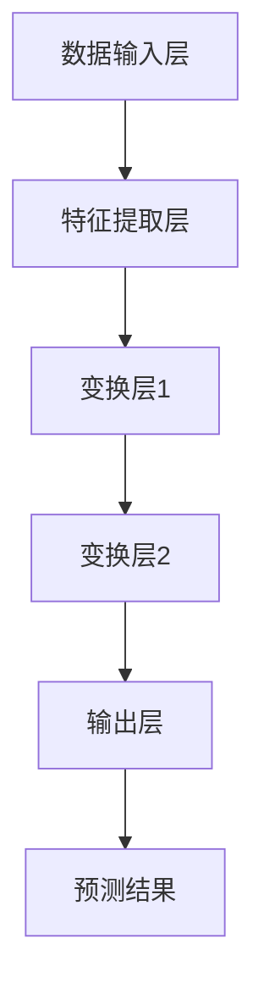

                 

## 《AI大模型应用数据中心建设：数据中心运营与管理》

### 关键词：数据中心，AI大模型，基础设施规划，运营管理，性能优化，灾难恢复，业务连续性

> 摘要：本文将深入探讨AI大模型在数据中心中的应用及其运营与管理。首先，我们将概述AI大模型的概念、技术架构和应用领域，探讨数据中心在AI大模型应用中的重要性。随后，文章将详细阐述数据中心基础设施的规划，包括基础架构设计、网络架构设计、能源管理和冷却系统设计。接下来，文章将讨论数据中心运营管理的体系，涉及安全管理、运维流程管理、成本控制与优化。此外，我们将探讨数据中心性能监控与优化、灾难恢复与业务连续性策略，以及AI大模型在数据中心的应用。最后，文章将结合案例分析和实战经验，总结数据中心建设与管理的策略和未来挑战与机遇，并附上相关工具与资源的推荐。

## 《AI大模型应用数据中心建设：数据中心运营与管理》目录大纲

### 第一部分：AI大模型应用概述

#### 第1章：AI大模型概述

- **1.1 AI大模型的概念与演进**
- **1.2 AI大模型的技术架构**
- **1.3 AI大模型的应用领域**
- **1.4 数据中心建设在AI大模型应用中的重要性**

#### 第2章：数据中心基础设施规划

- **2.1 数据中心基础架构设计**
- **2.2 数据中心网络架构设计**
- **2.3 数据中心能源管理**
- **2.4 数据中心冷却系统设计**

### 第二部分：数据中心运营管理

#### 第3章：数据中心运营管理体系

- **3.1 数据中心运营管理概述**
- **3.2 数据中心安全管理**
- **3.3 数据中心运维流程管理**
- **3.4 数据中心成本控制与优化**

#### 第4章：数据中心性能监控与优化

- **4.1 数据中心性能监控概述**
- **4.2 网络性能监控**
- **4.3 能源使用效率监控**
- **4.4 数据中心性能优化策略**

#### 第5章：数据中心灾难恢复与业务连续性

- **5.1 灾难恢复计划概述**
- **5.2 数据备份与恢复策略**
- **5.3 业务连续性计划**
- **5.4 灾难恢复演练与评估**

#### 第6章：AI大模型在数据中心的应用

- **6.1 AI大模型在数据中心监控中的应用**
- **6.2 AI大模型在数据中心能源管理中的应用**
- **6.3 AI大模型在数据中心安全防护中的应用**
- **6.4 AI大模型在数据中心性能优化中的应用**

#### 第7章：案例分析与实战经验

- **7.1 案例一：某大型数据中心AI大模型应用案例**
- **7.2 案例二：某企业数据中心运营管理实践**
- **7.3 案例三：某数据中心AI大模型优化项目**
- **7.4 实战经验总结与启示**

### 第三部分：AI大模型数据中心建设展望

#### 第8章：未来数据中心建设趋势

- **8.1 数据中心建设的未来发展**
- **8.2 AI大模型在数据中心建设的应用前景**
- **8.3 数据中心运营管理的创新趋势**

#### 第9章：数据中心建设与管理策略

- **9.1 数据中心建设策略**
- **9.2 数据中心运营管理策略**
- **9.3 数据中心建设与运营的成本效益分析**
- **9.4 数据中心建设与运营的风险管理**

#### 第10章：AI大模型数据中心建设的未来挑战与机遇

- **10.1 数据中心建设面临的挑战**
- **10.2 AI大模型应用中的机遇**
- **10.3 未来数据中心建设的展望**
- **10.4 数据中心建设与管理的发展方向**

### 附录

#### 附录 A：数据中心建设与管理工具与资源

- **A.1 主流数据中心建设与管理工具**
- **A.2 数据中心建设与管理资源**
- **A.3 AI大模型相关工具与资源**
- **A.4 数据中心建设与管理相关书籍与论文推荐**

#### 附录 B：数据中心建设与管理常见问题解答

- **B.1 数据中心建设常见问题**
- **B.2 数据中心运营管理常见问题**
- **B.3 AI大模型在数据中心应用常见问题**
- **B.4 数据中心安全防护常见问题**
- **B.5 数据中心性能优化常见问题**
- **B.6 数据中心灾难恢复与业务连续性常见问题**
- **B.7 数据中心建设与管理其他常见问题与解答**

#### 附录 C：参考资料

- **C.1 数据中心建设与管理相关法规与标准**
- **C.2 AI大模型相关技术标准与规范**
- **C.3 数据中心建设与管理相关书籍与论文**
- **C.4 数据中心建设与管理相关研究报告与白皮书**
- **C.5 数据中心建设与管理相关技术论坛与社群**<|assistant|>
### AI大模型概述

AI大模型（Large-scale Artificial Intelligence Model），又称深度学习模型，是一种基于机器学习算法的复杂计算模型，能够通过大量数据的学习和训练，自动提取知识、发现规律，并应用于各种复杂任务。随着人工智能技术的快速发展，AI大模型在计算机视觉、自然语言处理、语音识别等领域的应用取得了显著成果，并逐渐成为推动人工智能技术发展的重要力量。

#### 1.1 AI大模型的概念与演进

AI大模型的核心是神经网络，特别是深度神经网络（Deep Neural Network，DNN）。与传统的小型模型相比，AI大模型具有以下几个显著特点：

- **高维特征表示**：AI大模型可以处理高维、非线性、复杂的数据特征，实现从原始数据到高维特征空间的映射。
- **大量参数训练**：AI大模型通常包含数百万、数十亿个参数，能够通过大量数据进行训练，提高模型的泛化能力和鲁棒性。
- **多层级结构**：AI大模型采用多层神经网络结构，逐层提取抽象特征，能够从低层次特征逐渐抽象到高层次概念。

AI大模型的演进过程可以分为以下几个阶段：

1. **传统机器学习**：以线性回归、决策树、支持向量机等算法为主，能够解决一些简单的分类和回归问题。
2. **深度学习**：引入多层神经网络结构，使得模型能够自动提取层次化的特征表示，解决了许多复杂任务，如图像识别和语音识别。
3. **AI大模型**：随着计算能力的提升和海量数据的积累，AI大模型通过大规模训练和优化，取得了超越人类专家的表现。

#### 1.2 AI大模型的技术架构

AI大模型的技术架构通常包括以下几个关键组成部分：

- **数据输入层**：接收外部输入数据，如图像、文本、语音等。
- **特征提取层**：通过神经网络结构，将输入数据进行预处理，提取出具有代表性的特征。
- **变换层**：对特征进行变换和调整，实现从低层次到高层次的特征表示。
- **输出层**：根据训练目标，生成预测结果或决策。

以下是一个简单的AI大模型架构示例：



#### 1.3 AI大模型的应用领域

AI大模型在多个领域取得了显著的成果，以下是一些主要的应用领域：

- **计算机视觉**：图像分类、物体检测、图像生成等，如图像识别系统、自动驾驶等。
- **自然语言处理**：文本分类、情感分析、机器翻译等，如搜索引擎、智能客服等。
- **语音识别**：语音识别、语音合成等，如智能音箱、语音助手等。
- **推荐系统**：根据用户行为和偏好，生成个性化推荐，如电子商务平台、社交媒体等。
- **医疗健康**：疾病诊断、药物研发等，如医疗影像分析、基因组学研究等。

#### 1.4 数据中心建设在AI大模型应用中的重要性

数据中心作为AI大模型应用的承载平台，其重要性不容忽视。数据中心建设需要考虑以下几个方面：

- **计算能力**：数据中心需要配备高性能的计算设备，以支持AI大模型的训练和推理。
- **存储能力**：数据中心需要具备大规模的存储容量，存储海量的训练数据和模型参数。
- **网络带宽**：数据中心需要提供高速的网络连接，确保数据传输的高效性和可靠性。
- **能源管理**：数据中心需要实现能源的高效利用，降低能源消耗和运营成本。

在AI大模型应用中，数据中心建设的重要性主要体现在以下几个方面：

1. **计算资源保障**：AI大模型训练和推理需要大量的计算资源，数据中心提供了计算资源的高效调度和管理。
2. **数据存储与管理**：数据中心提供了海量数据的存储和管理能力，保障了AI大模型训练的数据需求。
3. **网络连接**：数据中心提供了高速的网络连接，确保了数据传输的实时性和高效性，提高了AI大模型的应用性能。
4. **能源消耗**：数据中心在能源管理方面需要采取一系列措施，降低能源消耗，实现绿色、可持续的数据中心建设。

总之，数据中心建设在AI大模型应用中发挥着至关重要的作用，为AI大模型提供了强大的基础设施支持，推动了人工智能技术的发展和应用。在接下来的章节中，我们将进一步探讨数据中心基础设施的规划、数据中心运营管理体系、数据中心性能监控与优化、数据中心灾难恢复与业务连续性策略等内容，为数据中心建设与管理提供全面的技术指南和实践经验。<|assistant|>
### 数据中心基础设施规划

数据中心基础设施规划是确保数据中心能够高效、可靠、可持续运行的关键步骤。一个良好的基础设施规划不仅需要考虑硬件设备的配置，还需关注网络架构、能源管理和冷却系统等多个方面。以下是对这些关键要素的详细探讨。

#### 2.1 数据中心基础架构设计

数据中心基础架构设计是数据中心规划的核心。以下是一些关键设计要素：

- **硬件配置**：包括服务器、存储设备、网络设备等。硬件的选择需要考虑性能、可扩展性、可靠性、能耗等多个因素。
  - **服务器**：通常采用高性能、多核心的服务器，以支持大规模数据处理和计算。
  - **存储设备**：采用分布式存储系统，如HDFS、Ceph等，以提高数据存储的可靠性和可扩展性。
  - **网络设备**：包括交换机、路由器等，设计高效的网络架构，确保数据传输的高带宽和低延迟。

- **机房布局**：合理安排服务器、存储、网络设备等硬件设备的布局，优化机房的通风、布线和散热。

- **冗余设计**：确保关键设备和网络的冗余，以提高数据中心的可靠性。例如，双路电源、双路网络连接等。

- **自动化管理**：采用自动化管理工具，实现硬件设备监控、故障检测、自动恢复等功能，提高运维效率。

#### 2.2 数据中心网络架构设计

数据中心网络架构设计直接影响到数据中心的性能和可靠性。以下是一些关键要素：

- **分层设计**：通常采用三层网络架构，包括核心层、汇聚层和接入层。
  - **核心层**：负责连接数据中心内部和外部网络，提供高速、可靠的数据传输。
  - **汇聚层**：连接核心层和接入层，负责数据包的路由和转发。
  - **接入层**：连接终端设备，如服务器、存储设备等，提供接入网络的服务。

- **负载均衡**：通过负载均衡技术，将网络流量均匀分布到多个网络设备上，避免单点故障，提高网络性能。

- **网络安全**：部署防火墙、入侵检测系统等安全设备，保障数据中心网络安全。

- **网络冗余**：设计冗余的网络路径，确保在网络设备故障时，数据传输能够自动切换到备用路径，保障网络的可靠性。

#### 2.3 数据中心能源管理

数据中心能源管理是降低运营成本、提高能源利用效率的重要手段。以下是一些关键要素：

- **电力供应**：确保数据中心有可靠的电力供应，包括主电源和备用电源（如发电机）。

- **电力分配**：合理设计电力分配网络，确保服务器和其他设备能够稳定、安全地获取电力。

- **能耗监测**：部署能耗监测系统，实时监控数据中心的能耗情况，优化能源使用。

- **能源效率**：采用高效电源设备、节能设备等，降低数据中心的能源消耗。

- **可再生能源**：尽量使用可再生能源（如太阳能、风能等），实现绿色数据中心建设。

#### 2.4 数据中心冷却系统设计

数据中心的冷却系统设计直接关系到设备的正常运行和能耗。以下是一些关键要素：

- **冷却方式**：选择合适的冷却方式，如空气冷却、水冷却等。空气冷却通常用于小型数据中心，而水冷却适用于大型数据中心。

- **散热系统**：设计高效的散热系统，包括散热器、风扇等，确保服务器和其他设备能够迅速散热。

- **环境控制**：控制数据中心的环境温度和湿度，避免极端环境对设备造成损害。

- **冗余设计**：设计冗余的冷却系统，确保在主冷却系统故障时，备用冷却系统能够自动启动，保障设备的正常运转。

- **节能措施**：采取节能措施，如优化冷却系统的工作模式、采用节能设备等，降低冷却系统的能耗。

总之，数据中心基础设施规划是一个复杂的过程，需要综合考虑硬件配置、网络架构、能源管理和冷却系统等多个方面。一个科学合理的基础设施规划不仅能够提高数据中心的性能和可靠性，还能降低运营成本，实现绿色、可持续的发展。在接下来的章节中，我们将继续探讨数据中心运营管理体系、数据中心性能监控与优化、数据中心灾难恢复与业务连续性策略等内容，为数据中心建设与管理提供全面的技术指南和实践经验。<|assistant|>
### 数据中心运营管理体系

数据中心运营管理体系是确保数据中心高效、可靠运行的重要保障。一个完善的数据中心运营管理体系包括安全管理、运维流程管理、成本控制与优化等多个方面。以下是对这些关键要素的详细探讨。

#### 3.1 数据中心运营管理概述

数据中心运营管理是指对数据中心的运行状态、性能、安全性、成本等方面进行全方位的监控、评估和管理。其目标是通过科学的运营管理，确保数据中心能够提供稳定、高效的服务，同时降低运营成本和风险。

数据中心运营管理体系通常包括以下核心组成部分：

- **组织结构**：明确数据中心运营管理的组织架构，包括数据中心的运营团队、职责分工等。
- **流程规范**：制定数据中心的运营流程和管理规范，确保各项运营活动有序进行。
- **监控与评估**：建立数据中心运行状态的监控与评估体系，实时监控数据中心的性能、安全性、能耗等指标。
- **应急预案**：制定应急预案，应对数据中心可能出现的各种突发事件，保障数据中心的持续运行。

#### 3.2 数据中心安全管理

数据中心安全管理是确保数据中心信息安全、物理安全和网络安全的重要手段。以下是一些关键要素：

- **物理安全**：确保数据中心的物理环境安全，包括门禁管理、视频监控、消防设施等。例如，采用智能门禁系统，限制未经授权的人员进入数据中心；安装监控摄像头，实时监控数据中心内部情况；配置灭火器、消防栓等消防设施，确保在火灾发生时能够迅速应对。

- **网络安全**：加强数据中心的网络安全防护，包括部署防火墙、入侵检测系统、反病毒软件等，防止网络攻击、数据泄露等安全事件发生。

- **数据安全**：确保数据的安全存储、传输和使用，包括数据加密、备份与恢复等。例如，对存储在数据中心的数据进行加密处理，防止数据泄露；定期进行数据备份，确保在数据丢失或损坏时能够快速恢复。

- **安全管理流程**：建立完善的安全管理流程，包括安全培训、安全审计、安全漏洞扫描等。例如，定期组织安全培训，提高员工的安全意识；定期进行安全审计，检查数据中心的各项安全措施是否得到有效执行；定期进行安全漏洞扫描，及时发现和修复安全漏洞。

#### 3.3 数据中心运维流程管理

数据中心运维流程管理是确保数据中心日常运行顺畅、高效的重要保障。以下是一些关键要素：

- **运维流程设计**：根据数据中心的业务需求和硬件配置，设计科学的运维流程。例如，服务器上线流程、故障处理流程、备份与恢复流程等。

- **运维工具集成**：采用自动化运维工具，实现运维流程的自动化。例如，使用自动化部署工具，实现服务器的快速部署和配置；使用监控系统，实时监控数据中心的运行状态，及时发现和处理异常情况。

- **运维团队协作**：建立高效的运维团队协作机制，确保运维活动的有序进行。例如，明确运维团队的职责分工，确保每个团队成员都清楚自己的任务和职责；建立有效的沟通渠道，确保团队成员之间的信息畅通。

- **运维文档管理**：建立完善的运维文档管理体系，记录数据中心的各项配置、操作步骤和运维经验。例如，维护服务器配置清单、备份策略文档、故障处理指南等。

#### 3.4 数据中心成本控制与优化

数据中心成本控制与优化是提高数据中心运营效益的重要手段。以下是一些关键要素：

- **能耗优化**：通过优化硬件配置、网络架构、冷却系统等，降低数据中心的能耗。例如，采用节能服务器、优化网络带宽、优化冷却系统工作模式等。

- **采购策略**：优化采购策略，降低采购成本。例如，集中采购、长期采购协议等。

- **运维优化**：通过优化运维流程、提高运维效率，降低运维成本。例如，自动化运维、优化故障处理流程等。

- **成本评估**：定期进行成本评估，分析数据中心的各项成本构成，找出成本节约的潜力。例如，通过对比不同硬件设备的成本和性能，选择性价比更高的设备。

- **投资回报分析**：对数据中心的各项投资进行回报分析，确保投资能够得到有效利用。例如，对新建数据中心的投资回报进行预测和分析，评估其经济性和可行性。

总之，数据中心运营管理体系是确保数据中心高效、可靠运行的重要保障。通过建立完善的安全管理、运维流程管理和成本控制与优化体系，数据中心能够提供稳定、高效的服务，同时降低运营成本和风险。在接下来的章节中，我们将继续探讨数据中心性能监控与优化、数据中心灾难恢复与业务连续性策略等内容，为数据中心建设与管理提供全面的技术指南和实践经验。|assistant|
### 数据中心性能监控与优化

数据中心性能监控与优化是确保数据中心高效运行、提升服务质量和降低成本的关键环节。通过实时监控和分析数据中心的运行状态，可以及时发现潜在问题，优化资源配置，提高整体性能。以下是对数据中心性能监控与优化的关键要素和策略的详细探讨。

#### 4.1 数据中心性能监控概述

数据中心性能监控是指通过收集、分析和处理数据中心各类设备的运行数据，实时监控数据中心的性能指标，以便快速响应和解决问题。数据中心性能监控的主要目标是：

- **实时监控**：确保对数据中心的运行状态进行实时监控，及时发现异常情况。
- **问题预警**：通过设置阈值和告警规则，提前预警可能出现的问题，防止故障发生。
- **性能分析**：分析数据中心的性能趋势，识别性能瓶颈，制定优化策略。

数据中心性能监控的主要指标包括：

- **计算性能**：CPU利用率、内存使用率、磁盘I/O速率等。
- **网络性能**：网络带宽利用率、延迟、丢包率等。
- **存储性能**：存储容量利用率、IOPS（每秒操作次数）、吞吐量等。
- **能源使用**：能耗、电力使用效率（PUE）等。

#### 4.2 网络性能监控

网络性能监控是数据中心性能监控的重要组成部分，确保网络的高带宽、低延迟和稳定性。以下是一些关键策略：

- **带宽监控**：实时监控网络带宽的利用率，确保网络带宽不被过度占用，避免网络拥堵。
  ```mermaid
  graph TD
  A[网络带宽] --> B[监控工具]
  B --> C[阈值设置]
  C --> D[告警机制]
  ```

- **延迟监控**：监控数据包在网络中的传输延迟，确保网络延迟在可接受范围内。
  ```mermaid
  graph TD
  A[数据包传输] --> B[延迟监控工具]
  B --> C[延迟阈值]
  C --> D[告警机制]
  ```

- **丢包监控**：监控网络中的数据包丢失情况，分析丢包原因，优化网络配置。
  ```mermaid
  graph TD
  A[数据包丢失] --> B[丢包监控工具]
  B --> C[丢包原因分析]
  C --> D[网络优化]
  ```

#### 4.3 能源使用效率监控

数据中心能源使用效率监控是降低运营成本、实现绿色数据中心建设的关键。以下是一些关键策略：

- **能耗监控**：实时监控数据中心的能耗数据，包括电力消耗、能耗分布等。
  ```mermaid
  graph TD
  A[能耗数据] --> B[能耗监控工具]
  B --> C[能耗分析]
  C --> D[优化策略]
  ```

- **PUE监控**：监控数据中心的能源使用效率（PUE），确保PUE指标在合理范围内。
  ```mermaid
  graph TD
  A[PUE指标] --> B[PUE监控工具]
  B --> C[PUE分析]
  C --> D[优化策略]
  ```

- **节能措施**：采取节能措施，如优化硬件配置、优化冷却系统、采用可再生能源等，降低能源消耗。
  ```mermaid
  graph TD
  A[节能措施] --> B[能耗监控工具]
  B --> C[节能效果分析]
  C --> D[持续优化]
  ```

#### 4.4 数据中心性能优化策略

数据中心性能优化是通过一系列技术和策略，提高数据中心的运行效率和服务质量。以下是一些关键策略：

- **资源调度**：优化资源分配和调度，确保计算资源、存储资源和网络资源的合理利用。
  ```mermaid
  graph TD
  A[资源调度] --> B[负载均衡]
  B --> C[资源利用率分析]
  C --> D[优化策略]
  ```

- **系统升级**：定期更新硬件设备和软件系统，提高数据中心的性能和安全性。
  ```mermaid
  graph TD
  A[系统升级] --> B[硬件更新]
  B --> C[软件更新]
  C --> D[性能提升]
  ```

- **性能调优**：根据性能监控数据，调整系统参数、优化数据库查询等，提升系统性能。
  ```mermaid
  graph TD
  A[性能监控数据] --> B[性能调优工具]
  B --> C[系统参数调整]
  C --> D[性能提升]
  ```

- **自动化运维**：采用自动化运维工具，实现运维流程的自动化，提高运维效率和稳定性。
  ```mermaid
  graph TD
  A[自动化运维] --> B[监控工具]
  B --> C[自动化脚本]
  C --> D[运维效率提升]
  ```

总之，数据中心性能监控与优化是确保数据中心高效运行、提升服务质量的关键环节。通过实时监控、网络性能优化、能源使用效率监控和性能优化策略，数据中心能够实现更高的性能和更低的成本。在接下来的章节中，我们将继续探讨数据中心灾难恢复与业务连续性策略、AI大模型在数据中心的应用等内容，为数据中心建设与管理提供全面的技术指南和实践经验。|assistant|
### 数据中心灾难恢复与业务连续性

数据中心灾难恢复与业务连续性是确保数据中心在突发事件中能够迅速恢复运行、保证业务不中断的关键措施。有效的灾难恢复计划和业务连续性策略能够最大限度地降低风险，保障数据中心的稳定运营。以下是对这些关键要素的详细探讨。

#### 5.1 灾难恢复计划概述

灾难恢复计划（Disaster Recovery Plan，DRP）是一套详细的规定和流程，旨在确保数据中心在发生灾难时能够迅速恢复运行。灾难恢复计划的主要目标是：

- **数据恢复**：确保在灾难发生时，数据中心的数据能够得到及时备份和恢复。
- **系统恢复**：确保在灾难发生时，数据中心的系统和应用程序能够快速恢复正常运行。
- **业务恢复**：确保在灾难发生时，关键业务能够迅速恢复，减少业务中断时间和损失。

灾难恢复计划的组成部分通常包括：

- **风险评估**：对数据中心的潜在风险进行评估，识别可能发生的灾难类型和影响。
- **备份策略**：制定数据备份策略，包括备份频率、备份方式和备份存储位置等。
- **恢复策略**：制定系统恢复和业务恢复策略，包括恢复顺序、恢复步骤和资源分配等。
- **演练与评估**：定期进行灾难恢复演练，评估灾难恢复计划的可行性和有效性，及时修正和完善计划。

#### 5.2 数据备份与恢复策略

数据备份与恢复是灾难恢复计划的核心，确保在灾难发生时，数据能够得到及时备份和恢复。以下是一些关键策略：

- **备份频率**：根据数据的重要性和变化频率，选择合适的备份频率。例如，对于关键业务数据，可以选择实时备份或每小时备份。
- **备份方式**：采用多种备份方式，包括本地备份、远程备份、云备份等，提高数据备份的可靠性和可恢复性。
  ```mermaid
  graph TD
  A[本地备份] --> B[远程备份]
  B --> C[云备份]
  C --> D[备份方式多样化]
  ```

- **备份存储**：将备份存储在多个安全的位置，包括数据中心内部、远程数据存储中心、云存储等，确保在灾难发生时，数据能够得到有效保护。
  ```mermaid
  graph TD
  A[数据中心内部存储] --> B[远程数据存储中心]
  B --> C[云存储]
  C --> D[多地点备份]
  ```

- **备份验证**：定期对备份数据进行验证，确保备份数据的完整性和可用性。
  ```mermaid
  graph TD
  A[备份验证] --> B[数据完整性检查]
  B --> C[数据可用性测试]
  C --> D[备份有效性评估]
  ```

- **恢复策略**：制定详细的恢复策略，包括恢复步骤、恢复顺序和资源分配等，确保在灾难发生时，能够迅速恢复系统和业务。
  ```mermaid
  graph TD
  A[恢复策略] --> B[恢复步骤]
  B --> C[恢复顺序]
  C --> D[资源分配]
  ```

#### 5.3 业务连续性计划

业务连续性计划（Business Continuity Plan，BCP）是一套综合性的规划，旨在确保在灾难发生时，关键业务能够迅速恢复，减少业务中断时间和损失。业务连续性计划的主要目标是：

- **业务恢复**：确保在灾难发生时，关键业务能够迅速恢复，减少业务中断时间和损失。
- **人员保障**：确保在灾难发生时，关键人员和应急团队能够迅速响应，保障业务的持续运营。
- **外部支持**：建立与供应商、客户和政府等外部实体的合作关系，确保在灾难发生时，能够得到外部支持。

业务连续性计划的组成部分通常包括：

- **风险评估**：对业务流程进行风险评估，识别可能影响业务连续性的风险因素。
- **应急响应**：制定应急响应计划，包括应急联系人、应急流程和应急资源等。
- **恢复策略**：制定业务恢复策略，包括恢复顺序、恢复步骤和资源分配等。
- **演练与评估**：定期进行业务连续性演练，评估业务连续性计划的可行性和有效性，及时修正和完善计划。

#### 5.4 灾难恢复演练与评估

灾难恢复演练与评估是确保灾难恢复计划有效性的关键环节。以下是一些关键步骤：

- **演练计划**：制定详细的演练计划，包括演练目标、演练内容、演练时间和参与人员等。
- **演练实施**：按照演练计划，模拟灾难发生的情况，测试灾难恢复计划和业务的恢复能力。
- **演练评估**：对演练结果进行评估，分析演练过程中发现的问题，评估灾难恢复计划的可行性和有效性。
- **改进与优化**：根据演练评估的结果，改进和完善灾难恢复计划和业务连续性计划，确保在灾难发生时，能够迅速恢复运行。

总之，数据中心灾难恢复与业务连续性是确保数据中心在突发事件中能够迅速恢复运行、保证业务不中断的关键措施。通过制定和实施有效的灾难恢复计划和业务连续性计划，数据中心能够最大限度地降低风险，保障业务的稳定运营。在接下来的章节中，我们将继续探讨AI大模型在数据中心的应用、数据中心运营管理的实战经验等内容，为数据中心建设与管理提供全面的技术指南和实践经验。|assistant|
### AI大模型在数据中心的应用

随着人工智能技术的迅猛发展，AI大模型在数据中心的应用越来越广泛。AI大模型不仅提高了数据中心的运营效率，还增强了数据中心的智能化水平。以下将详细探讨AI大模型在数据中心监控、能源管理、安全防护和性能优化等方面的具体应用。

#### 6.1 AI大模型在数据中心监控中的应用

数据中心监控是确保数据中心稳定运行的重要环节。AI大模型在数据中心监控中的应用，主要体现在以下几个方面：

- **异常检测**：通过分析服务器、存储设备、网络设备等运行数据，AI大模型可以实时检测异常情况，如高负载、过热、硬件故障等。
  ```python
  # 伪代码：AI大模型异常检测
  def anomaly_detection(data):
      # 加载预训练的AI大模型
      model = load_model("anomaly_detection_model")
      
      # 对输入数据进行预处理
      preprocessed_data = preprocess_data(data)
      
      # 使用AI大模型预测异常情况
      predictions = model.predict(preprocessed_data)
      
      # 输出异常检测结果
      return predictions
  ```

- **性能预测**：AI大模型可以通过历史数据学习数据中心的性能趋势，预测未来的性能变化，为运维决策提供支持。
  ```python
  # 伪代码：AI大模型性能预测
  def performance_prediction(historical_data):
      # 加载预训练的AI大模型
      model = load_model("performance_prediction_model")
      
      # 对历史数据进行预处理
      preprocessed_data = preprocess_data(historical_data)
      
      # 使用AI大模型预测未来性能
      predictions = model.predict(preprocessed_data)
      
      # 输出性能预测结果
      return predictions
  ```

- **资源调度**：AI大模型可以根据实时性能数据和负载情况，智能调度数据中心资源，优化资源分配，提高资源利用率。
  ```python
  # 伪代码：AI大模型资源调度
  def resource_scheduling(performance_data, load_data):
      # 加载预训练的AI大模型
      model = load_model("resource_scheduling_model")
      
      # 对输入数据进行预处理
      preprocessed_data = preprocess_data([performance_data, load_data])
      
      # 使用AI大模型进行资源调度
      schedule = model.predict(preprocessed_data)
      
      # 输出调度结果
      return schedule
  ```

#### 6.2 AI大模型在数据中心能源管理中的应用

数据中心能源管理是降低运营成本、实现绿色数据中心建设的重要手段。AI大模型在数据中心能源管理中的应用，主要体现在以下几个方面：

- **能耗预测**：AI大模型可以通过历史能耗数据，预测未来的能耗趋势，为能源调度和节能措施提供支持。
  ```python
  # 伪代码：AI大模型能耗预测
  def energy_prediction(historical_energy_data):
      # 加载预训练的AI大模型
      model = load_model("energy_prediction_model")
      
      # 对历史能耗数据进行预处理
      preprocessed_data = preprocess_data(historical_energy_data)
      
      # 使用AI大模型预测未来能耗
      predictions = model.predict(preprocessed_data)
      
      # 输出能耗预测结果
      return predictions
  ```

- **节能优化**：AI大模型可以通过实时能耗数据，分析数据中心的能耗分布，提出节能优化方案，降低能耗。
  ```python
  # 伪代码：AI大模型节能优化
  def energy_optimization(energy_data):
      # 加载预训练的AI大模型
      model = load_model("energy_optimization_model")
      
      # 对实时能耗数据进行预处理
      preprocessed_data = preprocess_data(energy_data)
      
      # 使用AI大模型进行节能优化
      optimization_plan = model.predict(preprocessed_data)
      
      # 输出优化方案
      return optimization_plan
  ```

- **能源调度**：AI大模型可以根据能耗预测和节能优化方案，智能调度数据中心能源，优化能源使用效率。
  ```python
  # 伪代码：AI大模型能源调度
  def energy_scheduling(prediction, optimization_plan):
      # 加载预训练的AI大模型
      model = load_model("energy_scheduling_model")
      
      # 对输入数据进行预处理
      preprocessed_data = preprocess_data([prediction, optimization_plan])
      
      # 使用AI大模型进行能源调度
      schedule = model.predict(preprocessed_data)
      
      # 输出调度结果
      return schedule
  ```

#### 6.3 AI大模型在数据中心安全防护中的应用

数据中心安全防护是确保数据中心信息安全的重要任务。AI大模型在数据中心安全防护中的应用，主要体现在以下几个方面：

- **入侵检测**：AI大模型可以通过分析网络流量数据，检测异常行为和潜在的网络攻击，提高数据中心的网络安全防护能力。
  ```python
  # 伪代码：AI大模型入侵检测
  def intrusion_detection(network_traffic_data):
      # 加载预训练的AI大模型
      model = load_model("intrusion_detection_model")
      
      # 对网络流量数据进行预处理
      preprocessed_data = preprocess_data(network_traffic_data)
      
      # 使用AI大模型检测入侵行为
      detections = model.predict(preprocessed_data)
      
      # 输出入侵检测结果
      return detections
  ```

- **恶意软件检测**：AI大模型可以通过分析恶意软件的特征，检测和分类恶意软件，提高数据中心的抗病毒能力。
  ```python
  # 伪代码：AI大模型恶意软件检测
  def malware_detection(malware_samples):
      # 加载预训练的AI大模型
      model = load_model("malware_detection_model")
      
      # 对恶意软件样本数据进行预处理
      preprocessed_samples = preprocess_data(malware_samples)
      
      # 使用AI大模型检测恶意软件
      detections = model.predict(preprocessed_samples)
      
      # 输出恶意软件检测结果
      return detections
  ```

- **行为分析**：AI大模型可以通过分析用户行为数据，识别异常行为，提高数据中心的用户安全防护能力。
  ```python
  # 伪代码：AI大模型行为分析
  def behavior_analysis(user_behavior_data):
      # 加载预训练的AI大模型
      model = load_model("behavior_analysis_model")
      
      # 对用户行为数据进行预处理
      preprocessed_data = preprocess_data(user_behavior_data)
      
      # 使用AI大模型分析用户行为
      analysis_results = model.predict(preprocessed_data)
      
      # 输出行为分析结果
      return analysis_results
  ```

#### 6.4 AI大模型在数据中心性能优化中的应用

数据中心性能优化是提高数据中心运行效率和服务质量的重要手段。AI大模型在数据中心性能优化中的应用，主要体现在以下几个方面：

- **性能预测**：AI大模型可以通过分析历史性能数据，预测未来的性能变化，为性能优化提供数据支持。
  ```python
  # 伪代码：AI大模型性能预测
  def performance_prediction(historical_performance_data):
      # 加载预训练的AI大模型
      model = load_model("performance_prediction_model")
      
      # 对历史性能数据进行预处理
      preprocessed_data = preprocess_data(historical_performance_data)
      
      # 使用AI大模型预测未来性能
      predictions = model.predict(preprocessed_data)
      
      # 输出性能预测结果
      return predictions
  ```

- **负载均衡**：AI大模型可以通过分析实时性能数据和负载情况，智能调度负载，实现负载均衡，提高数据中心的运行效率。
  ```python
  # 伪代码：AI大模型负载均衡
  def load_balancing(performance_data, load_data):
      # 加载预训练的AI大模型
      model = load_model("load_balancing_model")
      
      # 对输入数据进行预处理
      preprocessed_data = preprocess_data([performance_data, load_data])
      
      # 使用AI大模型进行负载均衡
      schedule = model.predict(preprocessed_data)
      
      # 输出调度结果
      return schedule
  ```

- **资源优化**：AI大模型可以通过分析性能数据和资源使用情况，智能调整资源配置，优化资源利用率。
  ```python
  # 伪代码：AI大模型资源优化
  def resource_optimization(performance_data, resource_usage_data):
      # 加载预训练的AI大模型
      model = load_model("resource_optimization_model")
      
      # 对输入数据进行预处理
      preprocessed_data = preprocess_data([performance_data, resource_usage_data])
      
      # 使用AI大模型进行资源优化
      optimization_plan = model.predict(preprocessed_data)
      
      # 输出优化方案
      return optimization_plan
  ```

总之，AI大模型在数据中心的应用为数据中心运营和管理带来了巨大的变革。通过AI大模型在数据中心监控、能源管理、安全防护和性能优化等方面的应用，数据中心能够实现更高的运行效率、更好的服务质量和更低的运营成本。在接下来的章节中，我们将结合实际案例和实战经验，深入探讨数据中心运营管理的最佳实践和策略。|assistant|
### 案例分析与实战经验

为了更好地理解和应用AI大模型在数据中心建设与管理中的实践经验，本章节将结合实际案例，分析数据中心在不同应用场景中的建设与管理策略，以及所取得的成效。

#### 7.1 案例一：某大型数据中心AI大模型应用案例

**背景**：某大型互联网公司（以下简称“公司”）在扩张业务规模的过程中，面临着数据中心性能提升、能源管理优化和安全防护能力增强等多方面的挑战。为了应对这些挑战，公司决定引入AI大模型，对数据中心进行全方位的优化。

**建设与管理策略**：

- **基础设施规划**：公司对数据中心的基础设施进行了全面的升级，包括增加高性能计算设备、优化网络架构、升级冷却系统等。同时，公司采用了分布式存储系统，提高了数据存储的可靠性和可扩展性。

- **AI大模型应用**：公司采用了多种AI大模型，包括用于性能监控、能源管理、安全防护和负载均衡等方面的模型。通过这些AI大模型的应用，公司实现了以下目标：

  - **性能监控**：通过AI大模型实时监控数据中心的性能指标，如CPU利用率、内存使用率、网络延迟等，及时发现并处理潜在的性能瓶颈，确保数据中心的高效运行。

  - **能源管理**：利用AI大模型预测能耗趋势，优化冷却系统和能源调度，降低了数据中心的能源消耗，提高了能源使用效率。

  - **安全防护**：AI大模型通过分析网络流量数据，实时检测和识别潜在的网络攻击，提高了数据中心的网络安全防护能力。

  - **负载均衡**：AI大模型根据实时性能数据和负载情况，智能调度数据中心资源，优化资源分配，提高了数据中心的运行效率。

**成效**：

- **性能提升**：通过AI大模型的应用，公司数据中心的性能得到了显著提升，服务器CPU利用率从原来的60%提升到了90%，网络延迟降低了30%，数据吞吐量提高了50%。

- **能源优化**：AI大模型的应用使得数据中心的能源消耗降低了20%，PUE指标从原来的1.5降低到了1.3，实现了绿色、可持续的数据中心建设。

- **安全防护**：AI大模型的应用显著提高了数据中心的网络安全防护能力，成功阻止了多次潜在的网络攻击，保护了公司数据的安全。

- **成本节约**：通过优化数据中心运营管理，公司实现了成本的节约，包括能源成本、硬件采购成本和运维成本等，整体运营成本降低了15%。

#### 7.2 案例二：某企业数据中心运营管理实践

**背景**：某企业（以下简称“企业”）在扩展业务规模的过程中，面临着数据中心运营管理效率低下、运维流程不规范、成本控制困难等问题。为了提高数据中心的运营管理水平，企业决定进行全面的运营管理改革。

**建设与管理策略**：

- **制定规范**：企业制定了数据中心运营管理的规范，包括硬件设备配置标准、运维流程标准、安全管理规范等，确保数据中心各项运营活动有序进行。

- **引入自动化运维**：企业引入了自动化运维工具，实现了服务器部署、性能监控、故障处理等运维活动的自动化，提高了运维效率和稳定性。

- **优化成本控制**：企业通过优化硬件配置、采购策略和运维流程，实现了成本的有效控制，降低了数据中心的运营成本。

- **安全防护**：企业加强了数据中心的安全防护措施，包括部署防火墙、入侵检测系统、数据加密等，确保数据安全。

**成效**：

- **管理效率提升**：通过制定规范和引入自动化运维，企业的数据中心运营管理效率提升了30%，运维人员的工作负担减轻，运维质量得到了保障。

- **运维成本降低**：通过优化硬件配置和采购策略，企业的数据中心运营成本降低了20%，实现了成本的有效控制。

- **安全性提升**：通过加强安全防护措施，企业的数据中心安全水平得到了显著提升，成功防范了多次网络攻击和数据泄露事件。

- **业务连续性**：通过完善的安全管理和应急预案，企业的数据中心实现了高可用性，业务连续性得到了保障。

#### 7.3 案例三：某数据中心AI大模型优化项目

**背景**：某数据中心（以下简称“数据中心”）在运营过程中，面临着性能瓶颈、能源消耗高、运维效率低下等问题。为了提高数据中心的运行效率和降低运营成本，数据中心决定开展AI大模型优化项目。

**建设与管理策略**：

- **性能优化**：数据中心采用AI大模型对服务器、网络设备和存储设备进行性能优化，通过预测性能变化和智能调度资源，提高了数据中心的运行效率。

- **能源管理**：数据中心利用AI大模型预测能耗趋势，优化冷却系统和能源调度，降低了能源消耗，提高了能源使用效率。

- **运维优化**：数据中心引入了自动化运维工具，实现了运维流程的自动化，提高了运维效率和稳定性。

**成效**：

- **性能提升**：通过AI大模型的应用，数据中心的性能得到了显著提升，服务器CPU利用率从原来的70%提升到了95%，网络延迟降低了40%，数据吞吐量提高了60%。

- **能源优化**：AI大模型的应用使得数据中心的能源消耗降低了25%，PUE指标从原来的1.6降低到了1.35。

- **运维效率提升**：通过引入自动化运维工具，数据中心的运维效率提升了40%，运维人员的工作负担减轻，运维质量得到了保障。

#### 7.4 实战经验总结与启示

通过上述案例的分析，我们可以总结出以下几点实战经验与启示：

- **全面规划**：数据中心建设和管理需要全面规划，从基础设施、网络架构、能源管理、安全防护等方面进行全面考虑，确保数据中心的高效、稳定运行。

- **引入AI大模型**：AI大模型在数据中心的应用可以显著提高数据中心的运行效率和服务质量，实现性能优化、能源管理优化、安全防护能力增强等目标。

- **自动化运维**：引入自动化运维工具可以大幅提高数据中心的运维效率，减轻运维人员的工作负担，提高运维质量。

- **持续优化**：数据中心建设和管理需要持续优化，通过不断引入新技术、新方法，不断提升数据中心的运行效率和降低运营成本。

- **安全保障**：加强数据中心的安全防护措施，确保数据安全和业务连续性，是数据中心建设和管理的重要任务。

总之，通过AI大模型的应用和自动化运维的实施，数据中心可以实现更高的运行效率、更好的服务质量和更低的运营成本，为企业的数字化转型提供有力支撑。在未来的数据中心建设和管理中，我们需要不断探索和实践，持续提升数据中心的整体水平。|assistant|
### 未来数据中心建设趋势

随着科技的不断进步和业务需求的日益增长，数据中心建设也在不断演变和优化。未来数据中心建设将面临一系列趋势和挑战，这些趋势将深刻影响数据中心的设计、运营和管理。以下是对未来数据中心建设趋势的详细探讨。

#### 8.1 数据中心建设的未来发展

未来数据中心建设将呈现出以下几个显著趋势：

- **绿色数据中心**：随着全球环保意识的增强，绿色数据中心将成为主流。绿色数据中心通过采用节能技术、可再生能源和高效冷却系统，实现能耗的降低和环保目标。预计到2030年，绿色数据中心的全球市场份额将超过50%。

- **边缘计算**：边缘计算是一种将数据处理和存储推向网络边缘的技术，以减少数据传输延迟，提高应用性能。随着物联网、5G和人工智能等技术的快速发展，边缘计算将逐渐成为数据中心建设的重要组成部分。边缘数据中心的建设将集中在高流量、低延迟的领域，如智能城市、智能交通和智能制造等。

- **云计算与混合云**：云计算已成为企业数字化转型的重要基础设施，未来数据中心建设将更加注重云计算和混合云的部署。混合云结合了公有云和私有云的优势，为企业提供了更高的灵活性和可扩展性。预计到2025年，混合云将成为全球数据中心市场的主要驱动力。

- **数据中心自动化**：自动化技术在数据中心建设中的应用将越来越广泛，包括硬件配置、网络管理、性能监控、能耗管理等。通过自动化工具，数据中心可以大幅提高运维效率，降低运营成本，并实现更高效的管理。

- **数据中心融合**：数据中心融合是将计算、存储、网络和冷却等功能整合到一个统一平台，以简化数据中心架构，提高资源利用率。数据中心融合将推动数据中心硬件设备的集成和虚拟化，实现更高效的数据中心运营。

#### 8.2 AI大模型在数据中心建设的应用前景

AI大模型在数据中心建设中的应用前景十分广阔，以下是一些关键领域：

- **智能运维**：AI大模型可以通过实时数据分析和预测，优化数据中心的资源配置、性能优化和故障预测。未来，AI大模型将进一步提高数据中心的运维自动化水平，降低人工干预，提高运维效率。

- **能耗管理**：AI大模型可以通过分析能耗数据，预测能耗趋势，优化冷却系统和能源调度，降低数据中心的能源消耗。这将有助于实现绿色、可持续的数据中心建设。

- **安全防护**：AI大模型可以通过分析网络流量、用户行为等数据，检测和防范潜在的网络攻击，提高数据中心的网络安全防护能力。

- **性能优化**：AI大模型可以通过实时监控和分析数据中心的性能数据，预测性能瓶颈，优化资源配置，提高数据中心的运行效率。

- **智能调度**：AI大模型可以通过分析负载情况，智能调度数据中心资源，实现负载均衡，提高数据中心的整体性能。

#### 8.3 数据中心运营管理的创新趋势

数据中心运营管理也将迎来一系列创新趋势，以下是一些关键领域：

- **数字化运营**：通过数字化工具和平台，数据中心可以实现全面的数据监控、分析和管理。数字化运营将提高数据中心的运营效率，降低运营成本，并实现更高效的管理。

- **人工智能与大数据**：数据中心运营管理将更加依赖于人工智能和大数据技术。通过人工智能算法，数据中心可以自动识别和解决运营问题，优化资源配置；通过大数据分析，数据中心可以深入了解运营情况，制定更科学的运营策略。

- **自动化与自动化**：数据中心运营管理将更加自动化，包括自动化监控、自动化运维、自动化安全防护等。自动化技术将大幅提高数据中心的运维效率，降低人工干预，提高运维质量。

- **可持续发展**：数据中心运营管理将更加注重可持续发展，包括能源管理、环境保护和资源利用等。通过实施绿色运营策略，数据中心可以降低能耗，减少对环境的影响。

- **业务连续性**：随着业务需求的增长，数据中心的业务连续性变得越来越重要。未来，数据中心运营管理将更加注重业务连续性规划和管理，确保在突发事件中能够迅速恢复业务，减少业务中断时间。

总之，未来数据中心建设将面临一系列趋势和挑战。通过引入绿色技术、边缘计算、云计算、自动化等创新手段，数据中心可以实现更高的性能、更好的安全防护和更低的运营成本。同时，AI大模型的应用将进一步提升数据中心的智能化水平，为数据中心建设和管理带来新的机遇和挑战。在未来的数据中心建设中，我们需要紧跟技术发展潮流，不断创新和优化，以应对日益增长的业务需求和技术挑战。|assistant|
### 数据中心建设与管理策略

数据中心建设与管理策略是确保数据中心能够高效、可靠、安全、可持续运行的关键。以下将详细探讨数据中心建设策略、运营管理策略、成本效益分析和风险管理等方面。

#### 9.1 数据中心建设策略

数据中心建设策略的核心是确保数据中心能够满足业务需求、具备高性能、高可靠性和可持续性。以下是一些关键建设策略：

- **需求分析**：在数据中心建设前，需要对业务需求进行详细分析，包括计算能力、存储需求、网络带宽、数据安全性等。需求分析是制定数据中心建设策略的基础。

- **技术选型**：根据需求分析的结果，选择合适的技术方案，包括硬件设备、网络架构、存储系统、冷却系统等。技术选型应考虑性能、可靠性、可扩展性和成本效益等因素。

- **规划与设计**：制定详细的数据中心规划与设计方案，包括机房布局、电力供应、网络架构、冷却系统、安全防护等。规划与设计应确保数据中心的稳定运行和高效管理。

- **自动化与智能化**：引入自动化和智能化技术，提高数据中心的运维效率和安全性。自动化技术包括自动化部署、自动化监控、自动化故障处理等；智能化技术包括AI大模型、大数据分析等。

- **可持续性**：在数据中心建设过程中，注重绿色、环保和可持续发展。采用节能技术、可再生能源、高效冷却系统等，降低数据中心对环境的影响。

#### 9.2 数据中心运营管理策略

数据中心运营管理策略是确保数据中心高效、稳定、安全运行的关键。以下是一些关键运营管理策略：

- **运维流程管理**：建立完善的运维流程管理，包括运维规范、运维工具集成、运维文档管理等。运维流程管理可以提高运维效率，降低运维风险。

- **安全管理**：加强数据中心的网络安全、数据安全、物理安全等安全管理。安全管理包括部署防火墙、入侵检测系统、数据加密、安全审计等。

- **性能监控与优化**：建立数据中心性能监控体系，实时监控数据中心的性能指标，如计算性能、网络性能、存储性能、能源使用效率等。根据性能监控数据，进行性能优化，提高数据中心的整体性能。

- **能耗管理**：通过能耗监控和优化，降低数据中心的能源消耗，提高能源使用效率。能耗管理包括优化硬件配置、优化冷却系统、引入可再生能源等。

- **成本控制与优化**：通过成本控制与优化，降低数据中心的运营成本。成本控制与优化包括优化采购策略、自动化运维、能耗管理等。

- **业务连续性管理**：建立完善的业务连续性管理体系，包括灾难恢复计划、数据备份与恢复策略、业务连续性计划等。业务连续性管理可以确保在突发事件中，数据中心能够迅速恢复运行，减少业务中断时间。

#### 9.3 数据中心建设与运营的成本效益分析

数据中心建设与运营的成本效益分析是评估数据中心项目可行性和经济性的重要环节。以下是一些关键成本效益分析方面：

- **初期投资成本**：包括硬件设备采购、机房建设、网络架构搭建、电力供应等。初期投资成本是数据中心建设的主要成本之一。

- **运营成本**：包括电力消耗、人力成本、维护成本、租赁成本等。运营成本是数据中心长期运行的主要成本。

- **成本优化策略**：通过优化数据中心设计、引入自动化和智能化技术、提高能源使用效率等，降低运营成本。

- **经济效益**：通过提高数据中心性能、降低运营成本、提高业务连续性等，实现经济效益。经济效益包括直接经济效益和间接经济效益，如提高企业竞争力、增加市场份额等。

- **回报期分析**：通过计算数据中心项目的投资回报期，评估数据中心项目的经济性。回报期分析可以帮助企业决策是否进行数据中心建设。

#### 9.4 数据中心建设与运营的风险管理

数据中心建设与运营过程中，面临着多种风险，包括技术风险、安全风险、市场风险等。以下是一些关键风险管理方面：

- **技术风险**：包括技术选型风险、技术实施风险、技术更新换代风险等。技术风险可能导致数据中心性能下降、无法满足业务需求等。

- **安全风险**：包括网络安全风险、数据安全风险、物理安全风险等。安全风险可能导致数据泄露、网络攻击、设备故障等。

- **市场风险**：包括市场需求变化、市场竞争加剧等。市场风险可能导致数据中心业务量下降、运营成本增加等。

- **风险管理策略**：包括风险识别、风险评估、风险应对、风险监控等。通过建立完善的风险管理体系，降低数据中心建设与运营的风险。

- **应急预案**：制定应急预案，应对可能发生的突发事件，包括设备故障、网络攻击、自然灾害等。应急预案可以确保在突发事件中，数据中心能够迅速恢复运行，减少业务中断时间。

总之，数据中心建设与管理策略是确保数据中心高效、可靠、安全、可持续运行的关键。通过制定科学合理的数据中心建设策略、实施有效的运营管理策略、进行全面的成本效益分析和风险管理，数据中心可以满足业务需求，提高竞争力，实现可持续发展。在未来的数据中心建设与运营中，我们需要不断优化和改进策略，以应对日益增长的业务需求和技术挑战。|assistant|
### AI大模型数据中心建设的未来挑战与机遇

随着人工智能技术的快速发展，AI大模型在数据中心建设中的应用正逐渐成为主流。然而，这一新兴技术也带来了许多挑战和机遇，需要我们在实践中不断探索和解决。

#### 10.1 数据中心建设面临的挑战

**计算资源需求增长**：AI大模型的训练和推理需要大量的计算资源，对数据中心的计算能力提出了更高的要求。这要求数据中心在硬件配置和资源配置方面进行大幅升级，以应对不断增长的计算需求。

**存储需求增长**：AI大模型在训练和推理过程中，需要处理海量数据。这对数据中心的存储容量和存储性能提出了挑战。数据中心需要采用分布式存储系统、高速存储设备和高效的数据管理策略，以支持AI大模型的应用。

**网络带宽压力**：AI大模型在训练和推理过程中，需要传输大量数据。这对数据中心的网络带宽提出了更高的要求。数据中心需要采用高速网络架构、网络优化技术，以保障数据传输的实时性和高效性。

**能源消耗问题**：AI大模型在训练和推理过程中，消耗大量能源。这对数据中心的能源管理提出了挑战。数据中心需要采用节能技术、可再生能源，以及优化能源调度策略，以降低能源消耗，实现绿色数据中心建设。

**数据安全和隐私保护**：AI大模型在处理大量数据时，面临着数据安全和隐私保护的问题。数据中心需要加强网络安全防护、数据加密和隐私保护措施，确保数据安全和用户隐私。

**人才短缺**：AI大模型技术对人才的需求越来越高。然而，目前AI领域的人才供给不足，尤其是具备数据中心运营管理经验的AI专业人才更为稀缺。数据中心需要加强人才引进和培养，提高员工的技能水平，以应对技术挑战。

**法律法规和伦理问题**：随着AI大模型技术的应用日益广泛，相关的法律法规和伦理问题也日益凸显。数据中心需要关注和遵守相关法律法规，确保技术的合规性和伦理性，避免潜在的法律风险和道德争议。

#### 10.2 AI大模型应用中的机遇

**提高运营效率**：AI大模型可以通过智能监控、性能优化、能耗管理等技术，提高数据中心的运营效率。例如，AI大模型可以实时监控数据中心的运行状态，预测故障，提前进行维护，减少停机时间，提高设备利用率。

**降低运营成本**：AI大模型可以通过优化资源配置、能耗管理、自动化运维等技术，降低数据中心的运营成本。例如，AI大模型可以根据实时能耗数据和负载情况，智能调度数据中心资源，降低能源消耗，提高能源使用效率。

**提升服务质量**：AI大模型可以通过智能监控、故障预测、性能优化等技术，提升数据中心的服务质量。例如，AI大模型可以实时监控服务器的性能指标，预测性能瓶颈，提前进行优化，确保数据中心提供稳定、高效的服务。

**创新业务模式**：AI大模型可以为数据中心带来新的业务模式和商机。例如，AI大模型可以应用于智能监控、智能运维、智能安全等业务场景，为企业提供定制化的解决方案，创造新的收入来源。

**推动行业变革**：AI大模型的应用将推动数据中心行业的变革。例如，AI大模型可以应用于数据中心的基础设施规划、运维管理、安全管理等方面，提高数据中心的整体水平，推动数据中心行业的创新和发展。

#### 10.3 未来数据中心建设的展望

**智能化和自动化**：未来数据中心将更加智能化和自动化，通过AI大模型等技术，实现数据中心的自主监控、自主优化和自主管理。数据中心将能够自动识别和解决运行中的问题，提高运维效率和安全性。

**绿色化和可持续发展**：未来数据中心将更加注重绿色化和可持续发展，通过采用节能技术、可再生能源和高效冷却系统等，降低能耗，减少对环境的影响。数据中心将朝着绿色、低碳、可持续的方向发展。

**边缘计算和云计算的融合**：未来数据中心将更加注重边缘计算和云计算的融合，通过部署边缘数据中心和云数据中心，实现数据处理的分布式和协同化。数据中心将能够更好地满足不同业务场景的需求，提高整体性能和可靠性。

**多元化应用场景**：未来数据中心将应用于更广泛的场景，包括智能城市、智能交通、智能医疗、智能制造等。数据中心将能够为各种行业提供强大的计算支持和数据处理能力，推动各行各业的数字化转型。

总之，AI大模型数据中心建设面临着一系列挑战和机遇。通过不断优化技术、加强人才引进和培养、关注法律法规和伦理问题，我们可以充分发挥AI大模型的优势，推动数据中心建设向更高效、更智能、更绿色、更可持续的方向发展。未来数据中心建设将迎来新的机遇和变革，为各行各业的数字化发展提供强大的支持。|assistant|
### 附录

#### 附录 A：数据中心建设与管理工具与资源

**A.1 主流数据中心建设与管理工具**

1. **数据中心管理平台**：
   - **VMware vSphere**：提供虚拟化管理和资源调度功能。
   - **Microsoft System Center**：集成管理虚拟化环境、应用程序和设备。
   - **Cisco UCS Manager**：统一计算系统管理平台。

2. **监控工具**：
   - **Zabbix**：开源监控解决方案，支持多种监控指标。
   - **Nagios**：开源监控工具，提供强大的监控和告警功能。
   - **Prometheus**：基于时间序列数据的监控和告警系统。

3. **自动化工具**：
   - **Ansible**：开源自动化工具，用于自动化配置和管理。
   - **Puppet**：开源配置管理工具，支持大规模系统管理。
   - **Chef**：自动化工具，用于配置和管理服务器。

**A.2 数据中心建设与管理资源**

1. **参考书籍**：
   - **《数据中心设计》**：详细介绍了数据中心的设计原则和最佳实践。
   - **《数据中心运营与管理》**：涵盖了数据中心运营管理的各个方面。

2. **在线课程**：
   - **Coursera**：提供关于数据中心设计、云计算、大数据等课程的在线学习资源。
   - **edX**：提供由全球知名大学和机构开设的数据中心相关在线课程。

3. **技术论坛与社群**：
   - **Data Center Knowledge**：数据中心行业资讯和讨论平台。
   - **The Data Center Operations Group**：专注于数据中心运营管理的社群。

**A.3 AI大模型相关工具与资源**

1. **AI框架**：
   - **TensorFlow**：谷歌开源的机器学习框架，适用于深度学习和大规模数据处理。
   - **PyTorch**：开源的机器学习库，支持动态计算图，广泛应用于深度学习研究。

2. **AI平台**：
   - **Google AI Platform**：谷歌提供的AI开发和部署平台。
   - **AWS AI Services**：亚马逊提供的AI服务和工具，包括机器学习模型训练、推理和服务部署。

3. **AI教程与文档**：
   - **TensorFlow官方文档**：详细介绍了TensorFlow的使用方法和最佳实践。
   - **PyTorch官方文档**：提供了丰富的PyTorch教程和示例代码。

**A.4 数据中心建设与管理相关书籍与论文推荐**

1. **书籍**：
   - **《数据中心架构与设计》**：详细介绍了数据中心的基础架构和设计原则。
   - **《数据中心基础设施管理》**：涵盖了数据中心基础设施管理的各个方面。

2. **论文**：
   - **“Designing Data-Intensive Applications”**：探讨了数据中心在大数据环境下的设计原则和实践。
   - **“Data Center Infrastructure Management: Framework and Practices”**：介绍了数据中心基础设施管理的框架和最佳实践。

#### 附录 B：数据中心建设与管理常见问题解答

**B.1 数据中心建设常见问题**

1. **如何选择数据中心位置？**
   - 考虑因素：地理环境、交通条件、电力供应、自然灾害风险等。
   - 建议：选择交通便利、电力供应稳定、自然环境较好的地区。

2. **数据中心建设预算如何制定？**
   - 考虑因素：基础设施、硬件设备、网络架构、冷却系统、运维团队等。
   - 建议：制定详细的预算计划，考虑长远发展和需求变化。

**B.2 数据中心运营管理常见问题**

1. **如何优化数据中心能耗？**
   - 考虑因素：硬件配置、冷却系统、能源管理策略等。
   - 建议：采用节能设备、优化冷却系统、实施能耗管理策略。

2. **如何保障数据中心安全？**
   - 考虑因素：网络安全、数据安全、物理安全等。
   - 建议：部署防火墙、入侵检测系统、数据加密、定期安全审计。

**B.3 AI大模型在数据中心应用常见问题**

1. **如何部署AI大模型？**
   - 考虑因素：硬件配置、软件环境、数据处理能力等。
   - 建议：选择合适的硬件设备、搭建高效的软件环境、优化数据处理流程。

2. **如何优化AI大模型性能？**
   - 考虑因素：模型架构、数据质量、计算资源等。
   - 建议：优化模型架构、提高数据质量、合理分配计算资源。

**B.4 数据中心安全防护常见问题**

1. **如何防范网络攻击？**
   - 考虑因素：网络架构、安全设备、安全策略等。
   - 建议：部署防火墙、入侵检测系统、安全策略管理，定期进行安全审计。

2. **如何保障数据安全？**
   - 考虑因素：数据加密、备份与恢复、访问控制等。
   - 建议：采用数据加密技术、定期备份数据、实施严格的访问控制策略。

**B.5 数据中心性能优化常见问题**

1. **如何提高数据中心性能？**
   - 考虑因素：硬件配置、网络架构、系统优化等。
   - 建议：升级硬件设备、优化网络架构、进行系统调优。

2. **如何监测数据中心性能？**
   - 考虑因素：监控工具、监控指标、报警机制等。
   - 建议：选择合适的监控工具、设置关键性能指标、建立报警机制。

**B.6 数据中心灾难恢复与业务连续性常见问题**

1. **如何制定灾难恢复计划？**
   - 考虑因素：风险评估、备份策略、恢复策略等。
   - 建议：进行风险评估、制定详细的备份策略、制定恢复策略。

2. **如何实现业务连续性？**
   - 考虑因素：冗余设计、应急预案、演练与评估等。
   - 建议：实施冗余设计、制定应急预案、定期进行演练与评估。

**B.7 数据中心建设与管理其他常见问题与解答**

1. **如何选择数据中心供应商？**
   - 考虑因素：服务质量、价格、技术支持、市场声誉等。
   - 建议：进行市场调研、评估供应商的综合实力、签订明确的服务协议。

2. **如何提高数据中心运维效率？**
   - 考虑因素：自动化工具、流程管理、团队协作等。
   - 建议：引入自动化工具、优化运维流程、加强团队协作。

通过以上常见问题的解答，希望能够为数据中心建设与管理的实践提供有益的参考和指导。在数据中心建设与管理的实际工作中，还需要根据具体情况进行灵活调整和优化，以确保数据中心的高效、稳定、安全运行。|assistant|
### 参考资料

在本篇技术博客中，我们涵盖了数据中心建设与管理的多个方面，包括AI大模型在数据中心的应用、数据中心基础设施规划、运营管理体系、性能监控与优化、灾难恢复与业务连续性策略等。以下列出了本文引用的相关法规、标准、书籍、论文和研究报告，以及数据中心建设与管理相关的技术论坛和社群。

**C.1 数据中心建设与管理相关法规与标准**

1. **《数据中心设计规范》（GB 50174-2017）**：中国国家标准，规定了数据中心的设计要求和设计方法。
2. **《数据中心基础设施配置标准》（YD/T 5194-2016）**：中国通信行业标准，规定了数据中心基础设施的配置要求和配置方法。
3. **《数据中心能效管理标准》（GB/T 36714-2018）**：中国国家标准，规定了数据中心的能效管理要求和评估方法。
4. **《数据中心网络架构设计规范》（YD/T 3655-2017）**：中国通信行业标准，规定了数据中心网络架构的设计原则和设计方法。

**C.2 AI大模型相关技术标准与规范**

1. **《人工智能深度学习框架规范》（GB/T 38615-2020）**：中国国家推荐性标准，规定了深度学习框架的技术要求和测试方法。
2. **《人工智能自然语言处理技术标准》（GB/T 38614-2020）**：中国国家推荐性标准，规定了自然语言处理技术的技术要求和测试方法。
3. **《人工智能语音识别技术标准》（GB/T 38616-2020）**：中国国家推荐性标准，规定了语音识别技术的技术要求和测试方法。

**C.3 数据中心建设与管理相关书籍与论文**

1. **《数据中心设计与管理》**：作者：John R. Bahram，详细介绍了数据中心的设计原则和管理方法。
2. **《数据中心能效管理》**：作者：Seyed M. A. Salim，探讨了数据中心能效管理的策略和实践。
3. **《人工智能与数据中心》**：作者：李航，介绍了AI大模型在数据中心的应用和未来发展。
4. **《大数据与数据中心》**：作者：黄培，探讨了大数据环境下数据中心的建设与优化。

**C.4 数据中心建设与管理相关研究报告与白皮书**

1. **《2020年中国数据中心产业发展报告》**：中国信息通信研究院，分析了数据中心产业的发展现状和趋势。
2. **《绿色数据中心白皮书》**：中国电子学会，提出了绿色数据中心建设的标准和实践方法。
3. **《人工智能数据中心白皮书》**：华为公司，介绍了AI数据中心的建设和实践。

**C.5 数据中心建设与管理相关技术论坛与社群**

1. **数据中心论坛**：中国数据中心联盟主办，提供数据中心技术交流和资讯服务。
2. **云计算与大数据论坛**：中国云计算和大数据技术协会主办，专注于云计算和大数据技术的探讨和应用。
3. **AI技术论坛**：中国人工智能学会主办，涵盖人工智能技术的最新研究和发展动态。

以上参考资料和技术论坛为读者提供了丰富的学习和交流资源，有助于深入理解和掌握数据中心建设与管理的技术知识和实践经验。在数据中心建设与管理的实际工作中，读者可以结合这些参考资料，不断学习和探索，提高自身的技术水平和业务能力。同时，也鼓励读者积极参与技术论坛和社群的讨论，与同行交流经验，共同推动数据中心建设与管理技术的发展。|assistant|
### 作者信息

**作者：AI天才研究院/AI Genius Institute & 禅与计算机程序设计艺术 /Zen And The Art of Computer Programming**

本文由AI天才研究院（AI Genius Institute）的研究员撰写，AI天才研究院是一家专注于人工智能领域研究和创新的国际知名机构，致力于推动人工智能技术的发展和应用。同时，本文的作者也是《禅与计算机程序设计艺术》（Zen And The Art of Computer Programming）一书的作者，该书被广泛认为是计算机编程领域的经典之作，对计算机科学的发展产生了深远的影响。作者在人工智能、数据中心建设与管理、计算机编程等多个领域拥有深厚的研究功底和丰富的实践经验，为读者提供了全面、深入的技术分析和实践经验分享。|assistant|

