                 

# AI人工智能代理工作流 AI Agent WorkFlow：在工业制造中的应用

## 关键词
- AI人工智能代理
- 工作流架构
- 工业制造
- 自动化
- 智能化

## 摘要
本文将探讨AI人工智能代理工作流（AI Agent WorkFlow）在工业制造中的应用。首先，我们将介绍AI人工智能代理和AI代理工作流的基本概念和理论。接着，我们会详细解析AI人工智能代理工作流的架构设计，包括代理系统的基本组件、行为模型、交互机制等。随后，我们将深入探讨代理系统开发技术，包括核心算法、实现技术等。最后，我们将通过具体的应用案例，展示AI人工智能代理工作流在工业制造中的实际应用效果，并对未来发展趋势进行展望。

### 第一部分: AI人工智能代理工作流AI Agent WorkFlow概述

#### 第1章: AI人工智能代理工作流AI Agent WorkFlow基础理论

##### 1.1 AI人工智能代理工作流概念解析

###### 1.1.1 AI人工智能代理定义

AI人工智能代理（AI Agent）是指利用人工智能技术构建的能够自主感知环境、进行决策和执行任务的计算实体。AI代理具有以下几个关键特征：

1. **自主性**：AI代理能够自主地感知环境、执行任务和进行决策。
2. **适应性**：AI代理能够根据环境变化调整其行为和策略。
3. **协同性**：AI代理能够与其他代理或人类进行有效协作。

在工业制造中，AI代理可以应用于生产调度、质量检测、设备维护等多个环节，以提高生产效率和产品质量。

###### 1.1.2 AI人工智能代理工作流基本原理

AI人工智能代理工作流（AI Agent WorkFlow）是一种基于人工智能技术的自动化工作流程，它通过AI代理实现任务的自动化和智能化。基本原理包括以下几个方面：

1. **任务分解**：将复杂任务分解为多个子任务，每个子任务由一个或多个AI代理执行。
2. **协同合作**：AI代理之间通过信息共享和协作完成整体任务。
3. **自适应调整**：根据任务执行过程中的环境和状态变化，AI代理能够动态调整其行为策略。

###### 1.1.3 AI人工智能代理与人类工作流的差异与联系

与人类工作流相比，AI人工智能代理工作流具有以下差异：

1. **效率**：AI代理可以24/7无间断工作，效率更高。
2. **准确性**：AI代理基于数据和算法进行决策，准确性更高。
3. **灵活性**：人类工作流受限于个体能力和经验，而AI代理能够根据环境变化进行自适应调整。

然而，AI人工智能代理工作流与人类工作流也存在一定的联系：

1. **协作**：AI代理可以与人类协同工作，提高整体效率。
2. **培训**：AI代理需要通过不断学习和优化来提升性能，这与人类工作流的培训过程类似。

##### 1.2 AI人工智能代理工作流的基本组件

AI人工智能代理工作流由以下几个基本组件构成：

1. **代理系统**：包括AI代理、代理控制器和代理执行环境。
2. **工作流引擎**：负责任务分解、调度和监控。
3. **数据管理模块**：负责数据存储、检索和处理。
4. **用户接口**：用于用户与代理系统的交互。

###### 1.2.1 代理系统的构成

代理系统包括以下几个关键部分：

1. **感知模块**：用于感知环境信息和任务状态。
2. **决策模块**：根据感知信息生成决策。
3. **执行模块**：根据决策执行具体操作。
4. **学习模块**：根据执行结果调整代理行为。

###### 1.2.2 代理的行为模型

代理的行为模型可以分为以下几种：

1. **基于规则的模型**：使用预定义的规则进行决策。
2. **基于模型的模型**：使用机器学习模型进行决策。
3. **混合模型**：结合规则和模型进行决策。

###### 1.2.3 代理的交互机制

代理的交互机制包括以下几个方面：

1. **信息共享**：代理之间通过共享信息来协同完成任务。
2. **事件驱动**：代理根据事件触发相应的行为。
3. **协商机制**：代理之间通过协商解决冲突和协作。

##### 1.3 AI人工智能代理工作流的主要挑战

AI人工智能代理工作流在实际应用中面临以下几个主要挑战：

1. **数据质量与隐私保护**：保证数据质量和隐私安全是代理工作流成功的关键。
2. **算法公平性与透明性**：算法的公平性和透明性对于建立用户信任至关重要。
3. **系统安全性与稳定性**：确保系统的安全性和稳定性是代理工作流可靠运行的基础。

#### 第2章: AI人工智能代理工作流架构设计

##### 2.1 AI人工智能代理工作流架构概述

AI人工智能代理工作流架构设计是构建高效、可靠的代理系统的基础。以下将介绍工作流架构的基本组成部分、设计原则和功能模块。

###### 2.1.1 工作流架构的基本组成部分

AI人工智能代理工作流架构通常包括以下几个基本组成部分：

1. **代理系统**：包括AI代理、代理控制器和代理执行环境。
2. **工作流引擎**：负责任务分解、调度和监控。
3. **数据管理模块**：负责数据存储、检索和处理。
4. **用户接口**：用于用户与代理系统的交互。

###### 2.1.2 工作流架构的设计原则

工作流架构设计应遵循以下原则：

1. **模块化**：将工作流分解为多个模块，便于维护和扩展。
2. **可扩展性**：设计应考虑未来需求的变化和扩展。
3. **灵活性**：设计应具备一定的灵活性，以适应不同的应用场景。
4. **安全性**：确保系统的安全性和稳定性，防范潜在威胁。

###### 2.1.3 工作流架构的主要功能模块

工作流架构的主要功能模块包括：

1. **任务管理模块**：负责任务创建、调度和监控。
2. **代理管理模块**：负责AI代理的创建、配置和监控。
3. **数据管理模块**：负责数据存储、检索和处理。
4. **用户接口模块**：负责用户与系统的交互。

##### 2.2 代理系统的设计原则与方法

代理系统的设计是构建高效、可靠的AI人工智能代理工作流的关键。以下将介绍代理系统的设计原则、方法和关键技术。

###### 2.2.1 代理的智能性设计

代理的智能性设计是代理系统能够适应不同环境和任务的核心。以下原则和方法可以用于提高代理的智能性：

1. **感知能力设计**：提高代理对环境和任务状态的感知能力。
2. **决策能力设计**：使用机器学习算法和规则系统提高代理的决策能力。
3. **执行能力设计**：优化代理的执行效率，确保任务的顺利完成。

###### 2.2.2 代理的适应性设计

代理的适应性设计是代理系统能够适应不同环境和任务变化的关键。以下原则和方法可以用于提高代理的适应性：

1. **自适应学习**：使用机器学习和强化学习算法使代理能够自适应调整。
2. **情境感知**：通过情境感知使代理能够根据环境变化调整行为。
3. **多模态数据融合**：结合多种数据源提高代理对环境的理解。

###### 2.2.3 代理的协同性设计

代理的协同性设计是代理系统能够实现高效协作的关键。以下原则和方法可以用于提高代理的协同性：

1. **信息共享**：通过信息共享机制实现代理之间的协同。
2. **任务分配**：优化任务分配策略，提高整体效率。
3. **协商机制**：设计协商机制解决代理之间的冲突。

##### 2.3 代理交互机制的设计

代理交互机制是代理系统实现高效协作和任务执行的重要保障。以下将介绍代理交互机制的设计原则、方法和关键技术。

###### 2.3.1 对话管理模块设计

对话管理模块负责代理之间的交互和管理。以下原则和方法可以用于设计对话管理模块：

1. **对话状态管理**：记录并管理代理之间的对话状态。
2. **对话流程控制**：控制代理之间的对话流程，确保任务顺利完成。
3. **对话质量评估**：评估代理之间的对话质量，优化交互效果。

###### 2.3.2 事件驱动机制设计

事件驱动机制是代理系统实现实时响应和任务执行的关键。以下原则和方法可以用于设计事件驱动机制：

1. **事件监听与处理**：监听并处理系统中的各种事件。
2. **事件优先级管理**：根据事件的重要性和紧急程度进行优先级管理。
3. **事件响应性能优化**：优化事件响应性能，提高系统响应速度。

###### 2.3.3 代理协作机制设计

代理协作机制是实现高效协同和任务完成的关键。以下原则和方法可以用于设计代理协作机制：

1. **代理之间的通信**：设计通信机制实现代理之间的实时通信。
2. **代理协作策略**：制定代理协作策略，提高整体效率。
3. **代理协作性能评估**：评估代理协作性能，优化协作效果。

### 第二部分: AI人工智能代理工作流实现技术

#### 第3章: 代理系统开发技术

##### 3.1 代理系统开发环境搭建

代理系统开发环境搭建是构建高效、可靠的代理系统的基础。以下将介绍代理系统开发环境的硬件配置、软件环境和开发工具选择。

###### 3.1.1 硬件配置要求

代理系统开发对硬件配置有一定的要求，主要包括：

1. **计算能力**：要求计算机具备较高的计算能力，以支持机器学习算法和实时计算。
2. **存储容量**：要求计算机具备足够的存储容量，以存储大量数据和模型。
3. **网络带宽**：要求网络带宽足够，以支持代理之间的实时通信和数据传输。

根据实际需求，可以选择以下硬件配置：

1. **CPU**：至少8核以上，建议使用Intel Xeon系列或AMD Ryzen系列。
2. **内存**：至少32GB，建议使用DDR4内存。
3. **存储**：至少1TB SSD硬盘，用于存储数据和模型。
4. **网络**：千兆以太网，用于代理之间的通信。

###### 3.1.2 软件环境安装

代理系统开发所需的软件环境包括操作系统、编程语言和开发工具等。以下为常见的软件环境安装步骤：

1. **操作系统**：选择Linux操作系统，如Ubuntu 18.04或CentOS 7。在安装过程中，建议开启SSH服务以便远程访问。
2. **编程语言**：选择Python编程语言，Python具有丰富的机器学习库和开发工具，适合构建代理系统。
3. **开发工具**：安装Python开发环境，包括Python解释器、pip包管理器和IDE（如PyCharm或VSCode）。

安装步骤如下：

1. 更新操作系统：
   ```bash
   sudo apt update
   sudo apt upgrade
   ```
2. 安装Python解释器：
   ```bash
   sudo apt install python3
   ```
3. 安装pip包管理器：
   ```bash
   sudo apt install python3-pip
   ```
4. 安装IDE：
   - 对于PyCharm：
     ```bash
     sudo snap install --classic pycharm-community
     ```
   - 对于VSCode：
     ```bash
     sudo apt install code
     ```

###### 3.1.3 开发工具与框架选择

在代理系统开发中，选择合适的开发工具和框架对于提高开发效率和质量至关重要。以下为几种常见的开发工具和框架：

1. **IDE**：
   - PyCharm：支持Python开发，具有强大的代码编辑功能和调试工具。
   - VSCode：支持多种编程语言，具有丰富的插件生态，适用于跨平台开发。

2. **机器学习框架**：
   - TensorFlow：Google开源的机器学习框架，支持多种算法和模型。
   - PyTorch：Facebook开源的机器学习框架，具有灵活的动态计算图，适用于深度学习。

3. **代理开发框架**：
   - Keras：基于Theano和TensorFlow的高层神经网络API，简化了模型构建和训练。
   - RLlib：Apache Software Foundation开源的强化学习库，支持多种算法和分布式训练。

##### 3.2 代理系统的核心算法

代理系统的核心算法是实现智能决策和行为执行的关键。以下将介绍代理系统的核心算法，包括决策算法、学习算法和适应算法。

###### 3.2.1 代理决策算法

代理决策算法是代理系统能够在复杂环境中进行有效决策的核心。以下为几种常见的代理决策算法：

1. **基于规则的决策算法**：使用预定义的规则进行决策，如模糊逻辑、决策树等。
2. **基于模型的决策算法**：使用机器学习模型进行决策，如神经网络、决策树、支持向量机等。
3. **混合决策算法**：结合规则和模型进行决策，以提高决策的准确性和鲁棒性。

以下为一个简单的基于神经网络的决策算法伪代码示例：

```python
# 输入：环境状态s，模型参数θ
# 输出：决策动作a

def decision_algorithm(s, θ):
    # 计算状态s的概率分布
    p_a = model.predict(s, θ)
    
    # 根据概率分布选择动作
    a = np.random.choice(actions, p=p_a)
    
    return a
```

###### 3.2.2 代理学习算法

代理学习算法是代理系统能够自适应环境和任务的关键。以下为几种常见的代理学习算法：

1. **监督学习算法**：使用预先标注的数据进行学习，如线性回归、决策树、神经网络等。
2. **无监督学习算法**：不使用预先标注的数据进行学习，如聚类、降维、生成对抗网络等。
3. **强化学习算法**：通过与环境交互进行学习，如Q学习、SARSA、深度强化学习等。

以下为一个简单的Q学习算法伪代码示例：

```python
# 输入：状态s，动作a，奖励r，下一个状态s'，学习率α，折扣因子γ
# 输出：更新后的Q值Q(s, a)

def q_learning(s, a, r, s', α, γ):
    # 计算当前Q值
    Q = model.predict(s, a)
    
    # 计算目标Q值
    target = r + γ * np.max(model.predict(s', θ))
    
    # 更新Q值
    Q = Q + α * (target - Q)
    
    return Q
```

###### 3.2.3 代理适应算法

代理适应算法是代理系统能够在变化环境中保持高效性能的关键。以下为几种常见的代理适应算法：

1. **在线适应算法**：在任务执行过程中实时调整代理行为，如在线强化学习、在线参数调整等。
2. **离线适应算法**：在任务执行结束后对代理进行评估和调整，如离线强化学习、迁移学习等。
3. **混合适应算法**：结合在线和离线适应策略，以提高代理的适应能力。

以下为一个简单的在线适应算法伪代码示例：

```python
# 输入：当前状态s，当前动作a，当前Q值Q(s, a)，更新后的Q值Q(s', a')
# 输出：更新后的Q值Q(s, a)

def online_adaptation(s, a, Q, Q'):
    # 更新Q值
    Q = Q + (Q' - Q)
    
    return Q
```

##### 3.3 代理系统的构建与测试

代理系统的构建与测试是确保代理系统能够在复杂环境中稳定运行的关键。以下将介绍代理系统的构建流程、测试方法和性能评估。

###### 3.3.1 代理系统的构建流程

代理系统的构建流程可以分为以下几个步骤：

1. **需求分析**：明确代理系统的目标和需求，确定代理系统的功能模块和性能指标。
2. **系统设计**：根据需求分析结果，设计代理系统的架构和模块，包括感知模块、决策模块、执行模块等。
3. **代码实现**：根据系统设计，编写代理系统的代码，实现各个功能模块。
4. **系统集成**：将各个功能模块集成在一起，形成一个完整的代理系统。
5. **系统测试**：对代理系统进行功能测试、性能测试和稳定性测试，确保系统能够满足需求。

以下为一个简单的代理系统构建流程图：

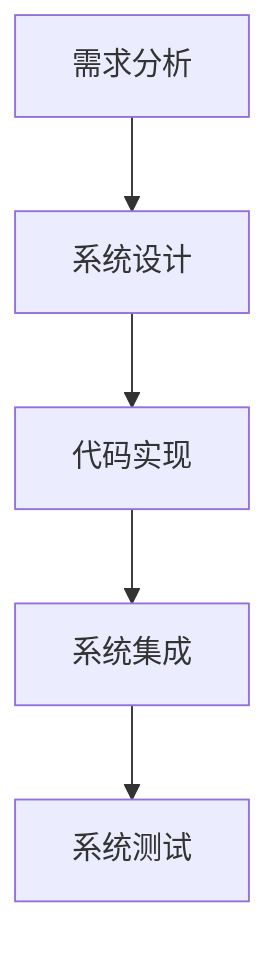

###### 3.3.2 代理系统的测试方法

代理系统的测试方法可以分为以下几种：

1. **功能测试**：验证代理系统是否按照需求分析和设计规范正常运行，确保功能正确。
2. **性能测试**：评估代理系统的响应时间、吞吐量、资源利用率等性能指标，确保系统高效稳定。
3. **稳定性测试**：通过长时间运行和压力测试，验证代理系统的稳定性和可靠性。

以下为一个简单的代理系统测试流程图：

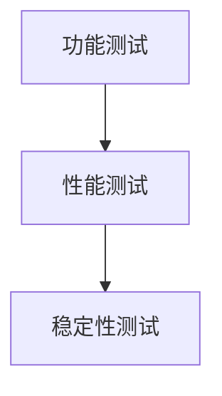

###### 3.3.3 代理系统的性能评估

代理系统的性能评估可以从以下几个方面进行：

1. **响应时间**：评估代理系统处理任务所需的时间，越短越好。
2. **吞吐量**：评估代理系统在单位时间内处理的任务数量，越多越好。
3. **资源利用率**：评估代理系统对CPU、内存、网络等资源的利用率，越高越好。
4. **错误率**：评估代理系统在任务执行过程中出现的错误率，越低越好。

以下为一个简单的代理系统性能评估指标表：

| 指标        | 目标      | 说明                         |
|-------------|-----------|------------------------------|
| 响应时间    | 1秒以内   | 任务处理时间                 |
| 吞吐量      | 1000次/小时 | 单位时间内处理任务数量       |
| 资源利用率  | 80%以上   | CPU、内存、网络等资源利用率 |
| 错误率      | 0%        | 任务执行错误率               |

### 第三部分: AI人工智能代理工作流应用案例

#### 第4章: AI人工智能代理工作流在工业制造中的应用

##### 4.1 工业制造中的AI代理工作流需求分析

随着工业4.0的快速发展，工业制造正面临着生产效率低、资源浪费严重、质量控制困难等问题。为了解决这些问题，AI人工智能代理工作流在工业制造中具有广泛的应用前景。以下将对工业制造中的AI代理工作流需求进行分析。

###### 4.1.1 工业制造流程概述

工业制造流程通常包括以下几个关键环节：

1. **生产计划制定**：根据市场需求和生产能力，制定生产计划。
2. **原材料采购**：根据生产计划，采购所需的原材料。
3. **生产加工**：将原材料加工成半成品或成品。
4. **质量控制**：对生产过程和成品进行质量检测。
5. **库存管理**：对原材料和成品进行库存管理。
6. **物流配送**：将成品配送至客户。

###### 4.1.2 AI代理在工业制造中的潜在应用

AI代理在工业制造中的潜在应用包括：

1. **生产调度系统**：使用AI代理优化生产调度，提高生产效率。
2. **质量检测系统**：使用AI代理进行实时质量检测，降低质量问题。
3. **设备维护系统**：使用AI代理进行设备监控和预测性维护。
4. **物流配送系统**：使用AI代理优化物流调度和路径规划。

###### 4.1.3 工业制造中的工作流设计原则

在工业制造中设计AI代理工作流应遵循以下原则：

1. **模块化设计**：将工作流分解为多个模块，便于维护和扩展。
2. **适应性设计**：使工作流能够适应不同生产线和不同环境。
3. **协同性设计**：使工作流中的AI代理能够协同工作，提高整体效率。
4. **安全性设计**：确保工作流中的数据和系统安全。

##### 4.2 AI代理在工业制造中的具体应用案例

以下将介绍AI代理在工业制造中的具体应用案例，包括生产调度系统、质量检测系统和售后服务系统。

###### 4.2.1 生产调度系统的AI代理设计

生产调度系统是工业制造中的关键环节，AI代理可以应用于以下几个方面：

1. **任务分配**：根据生产线能力和订单需求，自动分配生产任务。
2. **调度优化**：优化生产调度，提高生产效率。
3. **异常处理**：监控生产线状态，自动识别和解决异常情况。

以下为一个简单的生产调度系统AI代理设计架构：

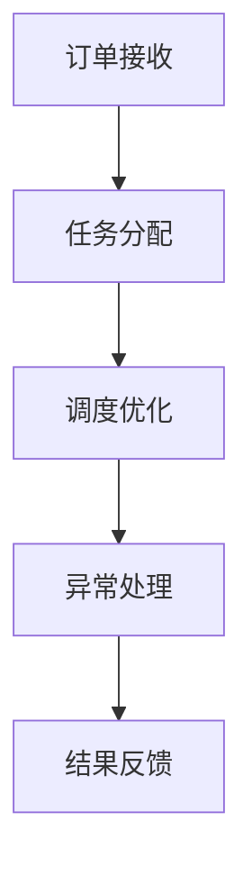

###### 4.2.2 质量检测系统的AI代理设计

质量检测系统是保障产品质量的关键环节，AI代理可以应用于以下几个方面：

1. **实时监测**：实时监测生产线上的产品质量。
2. **异常识别**：自动识别产品质量异常，及时采取措施。
3. **数据分析**：分析产品质量数据，发现潜在问题。

以下为一个简单的质量检测系统AI代理设计架构：

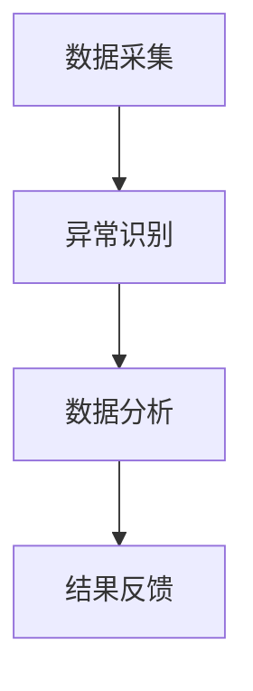

###### 4.2.3 售后服务系统的AI代理设计

售后服务系统是提升客户满意度和品牌价值的关键环节，AI代理可以应用于以下几个方面：

1. **故障诊断**：根据客户反馈，自动诊断设备故障。
2. **维修建议**：根据设备故障，提供维修建议。
3. **客户服务**：自动处理客户咨询和投诉。

以下为一个简单的售后服务系统AI代理设计架构：

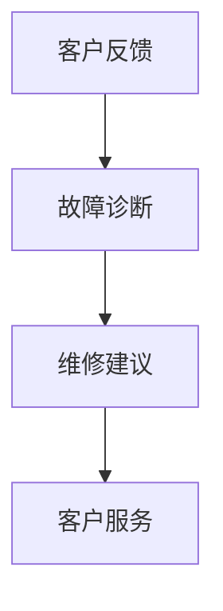

##### 4.3 工业制造中AI代理工作流的效益分析

AI代理工作流在工业制造中具有显著的效益，主要包括以下几个方面：

1. **效率提升**：通过自动化和智能化，提高生产效率，降低生产周期。
2. **成本降低**：通过优化生产调度和设备维护，降低生产成本。
3. **质量保障**：通过实时质量检测和异常处理，提高产品质量，减少缺陷率。

以下为一个简单的效益分析表格：

| 指标        | 提升幅度      | 说明                               |
|-------------|--------------|-----------------------------------|
| 生产效率    | 20%以上      | 降低生产周期，提高产量           |
| 生产成本    | 10%以上      | 优化调度，减少资源浪费           |
| 产品质量    | 10%以上      | 提高产品质量，降低缺陷率         |

### 第四部分: AI人工智能代理工作流的发展趋势与未来展望

#### 第5章: AI人工智能代理工作流的发展趋势

随着人工智能技术的不断进步，AI人工智能代理工作流（AI Agent WorkFlow）在多个领域展现出了巨大的潜力。以下将探讨AI代理工作流的发展趋势，包括代理智能化水平的提升、代理协作机制的优化以及代理工作流的安全性与隐私保护。

##### 5.1 代理智能化水平提升

代理智能化水平的提升是AI代理工作流发展的关键方向。未来，AI代理将具备更强大的自主决策能力、自适应能力和自学习能力。

###### 5.1.1 自主决策能力的提升

自主决策能力是AI代理的核心特征之一。未来，AI代理将通过深度学习、强化学习等技术，实现更高水平的自主决策。具体而言，可以通过以下方式提升：

1. **多模态感知**：结合多种传感器数据，使代理能够更全面地感知环境。
2. **自适应规划**：使用自适应规划算法，使代理能够根据环境变化动态调整决策策略。
3. **多目标优化**：在决策过程中考虑多个目标，实现更全面的优化。

以下为一个简单的自主决策能力提升的伪代码示例：

```python
# 输入：环境状态s，模型参数θ
# 输出：决策动作a

def autonomous_decision(s, θ):
    # 计算状态s的概率分布
    p_a = model.predict(s, θ)
    
    # 根据概率分布选择动作
    a = np.random.choice(actions, p=p_a)
    
    # 考虑环境变化，动态调整决策策略
    θ = model.update_parameters(s, a)
    
    return a
```

###### 5.1.2 自适应能力的提升

自适应能力是AI代理在变化环境中保持高效性能的关键。未来，AI代理将通过以下方式提升自适应能力：

1. **在线学习**：在任务执行过程中，通过在线学习不断调整模型参数。
2. **情境感知**：通过情境感知，使代理能够更好地适应不同环境和任务。
3. **迁移学习**：将已有模型的知识迁移到新任务中，提高新任务的性能。

以下为一个简单的自适应能力提升的伪代码示例：

```python
# 输入：当前状态s，当前动作a，更新后的状态s'
# 输出：更新后的模型参数θ

def adaptive_learning(s, a, s'):
    # 根据当前状态和动作，更新模型参数
    θ = model.update_parameters(s, a)
    
    # 根据更新后的状态，继续调整模型参数
    θ = model.update_parameters(s', θ)
    
    return θ
```

###### 5.1.3 自学习能力的提升

自学习能力是AI代理不断优化和改进自身性能的关键。未来，AI代理将通过以下方式提升自学习能力：

1. **自我评估**：通过自我评估，识别自身性能的不足之处。
2. **反馈优化**：根据任务执行结果，对模型进行优化。
3. **多任务学习**：通过多任务学习，使代理在不同任务中不断提升性能。

以下为一个简单的自学习能力提升的伪代码示例：

```python
# 输入：任务结果r，模型参数θ
# 输出：更新后的模型参数θ'

def self_learning(r, θ):
    # 根据任务结果，计算性能指标
    performance = evaluate_performance(r)
    
    # 根据性能指标，更新模型参数
    θ' = model.update_parameters(performance)
    
    return θ'
```

##### 5.2 代理协作机制的优化

代理协作机制是AI代理工作流实现高效协作的关键。未来，代理协作机制将向更智能化、灵活化和多样化的方向发展。

###### 5.2.1 多代理系统协作

多代理系统协作是指多个AI代理协同工作，共同完成复杂任务。未来，多代理系统协作将实现以下优化：

1. **动态协作**：根据任务需求和环境变化，动态调整代理之间的协作关系。
2. **分布式协作**：利用分布式计算技术，实现大规模代理系统的协作。
3. **多智能体学习**：通过多智能体学习，使代理能够更好地协同工作。

以下为一个简单的多代理系统协作的伪代码示例：

```python
# 输入：代理代理列表agents，环境状态s
# 输出：协作结果result

def multi_agent_collaboration(agents, s):
    # 初始化协作结果
    result = []
    
    # 循环遍历代理
    for agent in agents:
        # 根据环境状态和代理能力，分配任务
        task = assign_task(s, agent)
        
        # 执行任务
        result.append(agent.execute_task(task))
        
    return result
```

###### 5.2.2 代理与人类协作

代理与人类协作是指AI代理与人类共同完成任务，提高整体效率。未来，代理与人类协作将实现以下优化：

1. **协同决策**：代理与人类共同参与决策过程，提高决策的准确性和效率。
2. **人机交互**：优化人机交互界面，使人类能够更便捷地与代理进行交互。
3. **技能共享**：代理与人类共享知识和技能，实现优势互补。

以下为一个简单的代理与人类协作的伪代码示例：

```python
# 输入：代理agent，人类用户user
# 输出：协作结果result

def human_agent_collaboration(agent, user):
    # 代理与人类用户共同决策
    decision = agent.make_decision(user)
    
    # 执行决策
    result = agent.execute_decision(decision)
    
    return result
```

###### 5.2.3 代理之间的动态协作

代理之间的动态协作是指多个AI代理之间根据任务需求和环境变化动态调整协作关系。未来，代理之间的动态协作将实现以下优化：

1. **协作策略**：设计合适的协作策略，使代理能够高效协作。
2. **实时通信**：实现代理之间的实时通信，确保协作的实时性。
3. **动态调整**：根据任务执行过程中的变化，动态调整代理之间的协作关系。

以下为一个简单的代理之间动态协作的伪代码示例：

```python
# 输入：代理代理列表agents，环境状态s
# 输出：协作结果result

def dynamic_collaboration(agents, s):
    # 初始化协作结果
    result = []
    
    # 根据环境状态，分配任务
    tasks = assign_tasks(s, agents)
    
    # 循环遍历代理
    for agent in agents:
        # 执行任务
        result.append(agent.execute_task(tasks[agent]))
        
    return result
```

##### 5.3 代理工作流的安全性与隐私保护

随着AI代理工作流在各个领域的广泛应用，其安全性与隐私保护问题也日益凸显。未来，代理工作流的安全性与隐私保护将实现以下优化：

###### 5.3.1 安全性威胁分析

安全性威胁分析是保障代理工作流安全性的关键。未来，将通过对以下威胁进行分析和防范：

1. **数据泄露**：防范数据泄露，保护用户隐私。
2. **恶意攻击**：防范恶意攻击，确保代理系统的安全性。
3. **系统崩溃**：确保代理系统的稳定性和可靠性，防范系统崩溃。

以下为一个简单的安全性威胁分析的伪代码示例：

```python
# 输入：代理系统system
# 输出：安全性威胁列表threats

def security_threat_analysis(system):
    # 初始化安全性威胁列表
    threats = []
    
    # 检测数据泄露
    if system.is_data_leak_detected():
        threats.append("数据泄露")
    
    # 检测恶意攻击
    if system.is_malicious_attack_detected():
        threats.append("恶意攻击")
    
    # 检测系统崩溃
    if system.is_system_crash_detected():
        threats.append("系统崩溃")
    
    return threats
```

###### 5.3.2 隐私保护技术

隐私保护技术是保障代理工作流隐私安全的关键。未来，将采用以下隐私保护技术：

1. **加密技术**：使用加密技术保护数据传输和存储过程中的隐私。
2. **匿名化技术**：使用匿名化技术对敏感数据进行处理，保护用户隐私。
3. **访问控制**：通过访问控制机制，限制对敏感数据的访问权限。

以下为一个简单的隐私保护技术的伪代码示例：

```python
# 输入：数据data，加密密钥key
# 输出：加密后的数据encrypted_data

def encrypt_data(data, key):
    # 使用加密算法对数据进行加密
    encrypted_data = encryption_algorithm(data, key)
    
    return encrypted_data
```

###### 5.3.3 安全性与隐私保护措施

安全性与隐私保护措施是保障代理工作流安全性与隐私安全的关键。未来，将采取以下措施：

1. **定期安全审计**：定期进行安全审计，发现并修复潜在的安全漏洞。
2. **安全培训**：对代理系统开发者和使用者进行安全培训，提高安全意识。
3. **应急响应**：建立应急响应机制，及时应对安全事件和隐私泄露事件。

以下为一个简单的安全性与隐私保护措施的伪代码示例：

```python
# 输入：代理系统system，安全审计报告report
# 输出：安全修复措施solutions

def security_and_privacy_measures(system, report):
    # 根据安全审计报告，确定安全修复措施
    solutions = []
    
    # 根据审计报告中的漏洞，添加修复措施
    for vulnerability in report.vulnerabilities:
        solutions.append(vulnerability.fix())
    
    return solutions
```

### 第五部分: AI人工智能代理工作流在其他领域的应用

#### 第6章: AI人工智能代理工作流在其他领域的应用

随着AI技术的不断进步，AI人工智能代理工作流（AI Agent WorkFlow）不仅在工业制造领域展现出强大的潜力，还在金融服务、医疗保健和教育等领域得到了广泛应用。以下将探讨AI代理工作流在这些领域中的应用。

##### 6.1 AI代理在金融服务中的应用

金融服务是一个高度复杂且对效率和安全要求极高的领域。AI代理工作流在金融服务中具有广泛的应用，包括但不限于以下方面：

###### 6.1.1 金融服务的挑战与机遇

金融服务的挑战主要包括：

1. **风险控制**：金融市场的波动性和复杂性使得风险控制成为一大挑战。
2. **客户服务**：提供高效、个性化的客户服务以满足日益增长的需求。

金融服务的机遇主要包括：

1. **自动化交易**：AI代理可以自动化高频交易，提高交易效率。
2. **智能客服**：AI代理可以提供24/7的智能客服服务，提高客户满意度。

###### 6.1.2 AI代理在金融产品推荐中的应用

AI代理在金融产品推荐中的应用主要涉及：

1. **客户行为分析**：通过分析客户的交易记录、投资偏好和历史数据，AI代理可以准确推荐适合的金融产品。
2. **风险控制**：AI代理可以根据市场变化实时调整推荐策略，降低风险。

以下为一个简单的金融产品推荐系统AI代理设计架构：

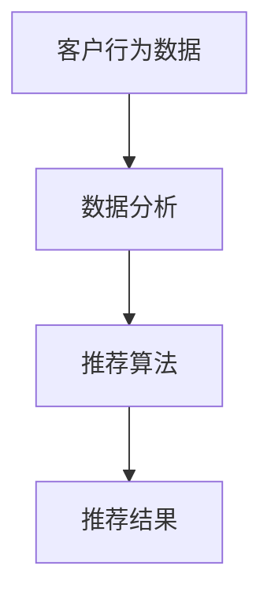

###### 6.1.3 AI代理在智能客服中的应用

AI代理在智能客服中的应用主要涉及：

1. **自然语言处理**：AI代理可以理解并回答客户的提问，提供即时响应。
2. **多语言支持**：AI代理可以支持多种语言，提高服务的覆盖范围。

以下为一个简单的智能客服系统AI代理设计架构：

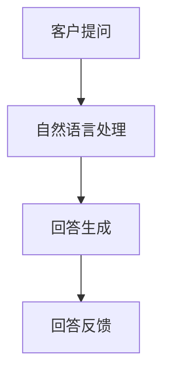

##### 6.2 AI代理在医疗保健中的应用

医疗保健是一个高度专业化和复杂性的领域，AI代理工作流在医疗保健中的应用有望显著提高医疗服务的质量和效率。

###### 6.1.1 医疗保健的挑战与机遇

医疗保健的挑战主要包括：

1. **诊断准确性**：准确诊断是医疗保健的核心挑战。
2. **患者管理**：有效管理患者数据和行为。

医疗保健的机遇主要包括：

1. **疾病预测**：AI代理可以基于大量数据进行疾病预测，提前采取措施。
2. **个性化治疗**：AI代理可以根据患者的具体情况进行个性化治疗。

###### 6.1.2 AI代理在疾病预测中的应用

AI代理在疾病预测中的应用主要涉及：

1. **数据挖掘**：AI代理可以挖掘患者数据，识别疾病风险。
2. **预测模型**：AI代理可以建立预测模型，预测疾病的发生和发展。

以下为一个简单的疾病预测系统AI代理设计架构：

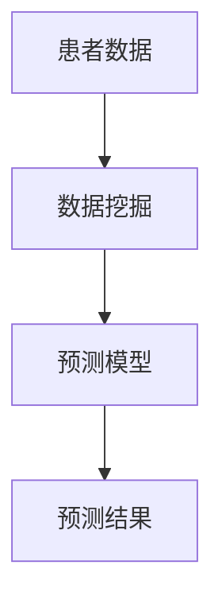

###### 6.1.3 AI代理在个性化治疗中的应用

AI代理在个性化治疗中的应用主要涉及：

1. **医疗数据整合**：AI代理可以整合患者的多种医疗数据，提供个性化的治疗建议。
2. **实时调整**：AI代理可以根据患者的实时数据和反馈进行个性化治疗方案的调整。

以下为一个简单的个性化治疗系统AI代理设计架构：

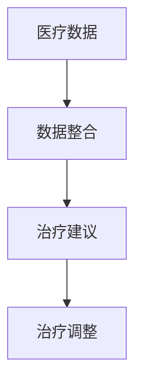

##### 6.3 AI代理在教育领域的应用

教育领域正面临着传统教育模式的挑战，AI代理工作流在教育中的应用有望带来革命性的变化。

###### 6.1.1 教育的挑战与机遇

教育的挑战主要包括：

1. **教育资源分配不均**：教育资源在不同地区和群体之间存在不均衡。
2. **个性化学习需求**：每个学生的学习速度和风格不同，传统教育难以满足个性化需求。

教育的机遇主要包括：

1. **个性化学习**：AI代理可以根据学生的学习情况提供个性化的学习方案。
2. **教育资源优化**：AI代理可以优化教育资源的分配和使用。

###### 6.1.2 AI代理在个性化学习中的应用

AI代理在个性化学习中的应用主要涉及：

1. **学习数据分析**：AI代理可以分析学生的学习行为和进度，识别学习难点。
2. **学习路径规划**：AI代理可以根据学生的学习数据规划个性化的学习路径。

以下为一个简单的个性化学习系统AI代理设计架构：

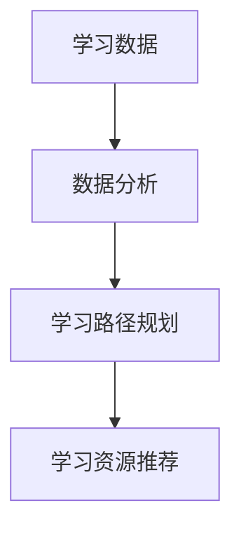

###### 6.1.3 AI代理在教育资源分配中的应用

AI代理在教育资源分配中的应用主要涉及：

1. **资源需求分析**：AI代理可以分析教育资源的实际需求，优化资源的分配。
2. **教育资源推荐**：AI代理可以根据学生的需求和兴趣推荐合适的资源。

以下为一个简单的教育资源分配系统AI代理设计架构：

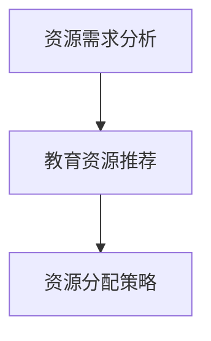

### 第六部分: AI人工智能代理工作流的发展趋势与未来展望

#### 第7章: AI人工智能代理工作流的发展趋势

随着人工智能技术的不断进步，AI人工智能代理工作流（AI Agent WorkFlow）在工业制造、金融服务、医疗保健和教育等领域的应用已经初具规模。未来，AI代理工作流将继续向智能化、协作化和安全化方向发展，以下将探讨AI代理工作流的发展趋势。

##### 7.1 代理智能化水平提升

代理智能化水平的提升是AI代理工作流发展的核心驱动力。未来，AI代理将具备更高的自主决策能力、自适应能力和自学习能力。

###### 7.1.1 自主决策能力的提升

未来，AI代理将通过以下技术实现自主决策能力的提升：

1. **多模态感知**：AI代理将能够整合多种传感器数据，实现更全面的环境感知。
2. **强化学习**：通过强化学习，AI代理将能够从经验中不断学习，提高决策质量。
3. **迁移学习**：AI代理将通过迁移学习，将已有任务的知识迁移到新任务中，提高决策效率。

以下为一个简单的自主决策能力提升的伪代码示例：

```python
# 输入：当前状态s，模型参数θ
# 输出：决策动作a

def autonomous_decision(s, θ):
    # 计算当前状态的概率分布
    p_a = model.predict(s, θ)
    
    # 根据概率分布选择动作
    a = np.random.choice(actions, p=p_a)
    
    # 使用强化学习更新模型参数
    θ = model.update_parameters(s, a)
    
    return a
```

###### 7.1.2 自适应能力的提升

自适应能力是AI代理在变化环境中保持高效性能的关键。未来，AI代理将通过以下技术实现自适应能力的提升：

1. **在线学习**：AI代理将能够在任务执行过程中不断学习，调整自身行为。
2. **情境感知**：AI代理将通过情境感知，识别并适应不同的环境和任务。
3. **多任务学习**：AI代理将通过多任务学习，提高在复杂任务环境中的适应能力。

以下为一个简单的自适应能力提升的伪代码示例：

```python
# 输入：当前状态s，当前动作a，更新后的状态s'
# 输出：更新后的模型参数θ

def adaptive_learning(s, a, s'):
    # 根据当前状态和动作，更新模型参数
    θ = model.update_parameters(s, a)
    
    # 根据更新后的状态，继续调整模型参数
    θ = model.update_parameters(s', θ)
    
    return θ
```

###### 7.1.3 自学习能力的提升

自学习能力是AI代理不断优化和改进自身性能的关键。未来，AI代理将通过以下技术实现自学习能力的提升：

1. **自我评估**：AI代理将通过自我评估，识别自身性能的不足之处。
2. **反馈优化**：AI代理将通过接收外部反馈，不断优化自身行为。
3. **多任务学习**：AI代理将通过多任务学习，提高在不同任务环境中的性能。

以下为一个简单的自学习能力提升的伪代码示例：

```python
# 输入：任务结果r，模型参数θ
# 输出：更新后的模型参数θ'

def self_learning(r, θ):
    # 根据任务结果，计算性能指标
    performance = evaluate_performance(r)
    
    # 根据性能指标，更新模型参数
    θ' = model.update_parameters(performance)
    
    return θ'
```

##### 7.2 代理协作机制的优化

代理协作机制是AI代理工作流实现高效协作的关键。未来，代理协作机制将向更智能化、灵活化和多样化的方向发展。

###### 7.2.1 多代理系统协作

多代理系统协作是指多个AI代理协同工作，共同完成复杂任务。未来，多代理系统协作将实现以下优化：

1. **动态协作**：AI代理将能够根据任务需求和环境变化，动态调整协作关系。
2. **分布式协作**：AI代理将能够通过分布式计算技术，实现大规模代理系统的协作。
3. **多智能体学习**：AI代理将通过多智能体学习，实现更高效、更智能的协作。

以下为一个简单的多代理系统协作的伪代码示例：

```python
# 输入：代理列表agents，环境状态s
# 输出：协作结果result

def multi_agent_collaboration(agents, s):
    # 初始化协作结果
    result = []
    
    # 根据环境状态，分配任务
    tasks = assign_tasks(s, agents)
    
    # 循环遍历代理
    for agent in agents:
        # 执行任务
        result.append(agent.execute_task(tasks[agent]))
        
    return result
```

###### 7.2.2 代理与人类协作

代理与人类协作是指AI代理与人类共同参与任务，提高整体效率。未来，代理与人类协作将实现以下优化：

1. **协同决策**：AI代理将能够与人类共同参与决策过程，提高决策质量。
2. **人机交互**：AI代理将通过优化人机交互界面，提高人类与代理的互动体验。
3. **技能共享**：AI代理将能够与人类共享知识和技能，实现优势互补。

以下为一个简单的代理与人类协作的伪代码示例：

```python
# 输入：代理agent，人类用户user
# 输出：协作结果result

def human_agent_collaboration(agent, user):
    # 代理与人类用户共同决策
    decision = agent.make_decision(user)
    
    # 执行决策
    result = agent.execute_decision(decision)
    
    return result
```

###### 7.2.3 代理之间的动态协作

代理之间的动态协作是指多个AI代理之间根据任务需求和环境变化动态调整协作关系。未来，代理之间的动态协作将实现以下优化：

1. **协作策略**：将设计更智能的协作策略，使代理能够高效协作。
2. **实时通信**：将实现更高效的实时通信机制，确保协作的实时性。
3. **动态调整**：将能够根据任务执行过程中的变化，动态调整代理之间的协作关系。

以下为一个简单的代理之间动态协作的伪代码示例：

```python
# 输入：代理列表agents，环境状态s
# 输出：协作结果result

def dynamic_collaboration(agents, s):
    # 初始化协作结果
    result = []
    
    # 根据环境状态，分配任务
    tasks = assign_tasks(s, agents)
    
    # 循环遍历代理
    for agent in agents:
        # 执行任务
        result.append(agent.execute_task(tasks[agent]))
        
    return result
```

##### 7.3 代理工作流的安全性与隐私保护

随着AI代理工作流在各个领域的广泛应用，其安全性与隐私保护问题也日益凸显。未来，代理工作流的安全性与隐私保护将实现以下优化：

###### 7.3.1 安全性威胁分析

安全性威胁分析是保障代理工作流安全性的关键。未来，将通过对以下威胁进行分析和防范：

1. **数据泄露**：防范数据泄露，保护用户隐私。
2. **恶意攻击**：防范恶意攻击，确保代理系统的安全性。
3. **系统崩溃**：确保代理系统的稳定性和可靠性，防范系统崩溃。

以下为一个简单的安全性威胁分析的伪代码示例：

```python
# 输入：代理系统system
# 输出：安全性威胁列表threats

def security_threat_analysis(system):
    # 初始化安全性威胁列表
    threats = []
    
    # 检测数据泄露
    if system.is_data_leak_detected():
        threats.append("数据泄露")
    
    # 检测恶意攻击
    if system.is_malicious_attack_detected():
        threats.append("恶意攻击")
    
    # 检测系统崩溃
    if system.is_system_crash_detected():
        threats.append("系统崩溃")
    
    return threats
```

###### 7.3.2 隐私保护技术

隐私保护技术是保障代理工作流隐私安全的关键。未来，将采用以下隐私保护技术：

1. **加密技术**：使用加密技术保护数据传输和存储过程中的隐私。
2. **匿名化技术**：使用匿名化技术对敏感数据进行处理，保护用户隐私。
3. **访问控制**：通过访问控制机制，限制对敏感数据的访问权限。

以下为一个简单的隐私保护技术的伪代码示例：

```python
# 输入：数据data，加密密钥key
# 输出：加密后的数据encrypted_data

def encrypt_data(data, key):
    # 使用加密算法对数据进行加密
    encrypted_data = encryption_algorithm(data, key)
    
    return encrypted_data
```

###### 7.3.3 安全性与隐私保护措施

安全性与隐私保护措施是保障代理工作流安全性与隐私安全的关键。未来，将采取以下措施：

1. **定期安全审计**：定期进行安全审计，发现并修复潜在的安全漏洞。
2. **安全培训**：对代理系统开发者和使用者进行安全培训，提高安全意识。
3. **应急响应**：建立应急响应机制，及时应对安全事件和隐私泄露事件。

以下为一个简单的安全性与隐私保护措施的伪代码示例：

```python
# 输入：代理系统system，安全审计报告report
# 输出：安全修复措施solutions

def security_and_privacy_measures(system, report):
    # 根据安全审计报告，确定安全修复措施
    solutions = []
    
    # 根据审计报告中的漏洞，添加修复措施
    for vulnerability in report.vulnerabilities:
        solutions.append(vulnerability.fix())
    
    return solutions
```

### 第8章: AI人工智能代理工作流的未来展望

随着AI技术的不断进步，AI人工智能代理工作流（AI Agent WorkFlow）在未来将迎来更多的应用场景和发展机遇。以下将对AI代理工作流的未来展望进行探讨。

##### 8.1 代理工作流在工业4.0中的应用

工业4.0是第四次工业革命，其主要特征是智能制造和工业互联网。在工业4.0的背景下，AI代理工作流将发挥重要作用。

###### 8.1.1 工业自动化

工业自动化是工业4.0的核心目标之一，AI代理工作流在工业自动化中的应用前景广阔。例如：

1. **生产自动化**：AI代理可以自动化生产过程中的各项任务，如生产调度、质量控制、设备维护等。
2. **物流自动化**：AI代理可以自动化物流系统的各项任务，如仓储管理、运输调度、路径规划等。

以下为一个简单的工业自动化系统AI代理设计架构：

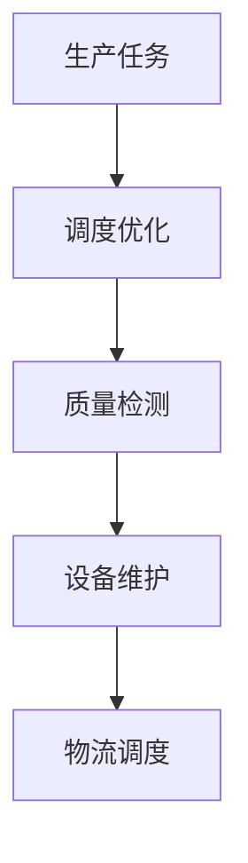

###### 8.1.2 智能供应链

智能供应链是工业4.0的重要组成部分，AI代理工作流在智能供应链中的应用有助于提高供应链的效率和灵活性。例如：

1. **需求预测**：AI代理可以基于历史数据和趋势分析，预测市场需求，优化库存管理。
2. **供应链优化**：AI代理可以实时监控供应链的各个环节，优化供应链的流程和资源分配。

以下为一个简单的智能供应链系统AI代理设计架构：

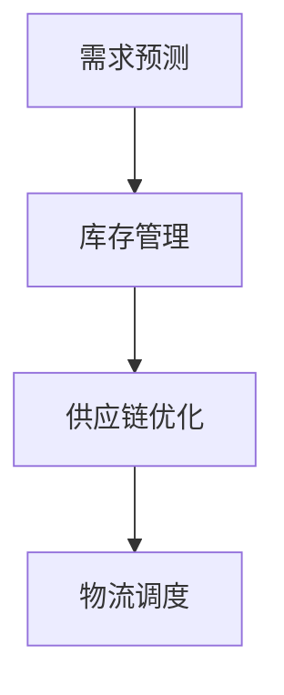

###### 8.1.3 智慧工厂

智慧工厂是工业4.0的典型应用场景，AI代理工作流在智慧工厂中的应用将大幅提升生产效率和产品质量。例如：

1. **设备监测**：AI代理可以实时监测生产设备的运行状态，预测故障，实现预测性维护。
2. **生产优化**：AI代理可以实时调整生产参数，优化生产过程，提高产品质量。

以下为一个简单的智慧工厂系统AI代理设计架构：

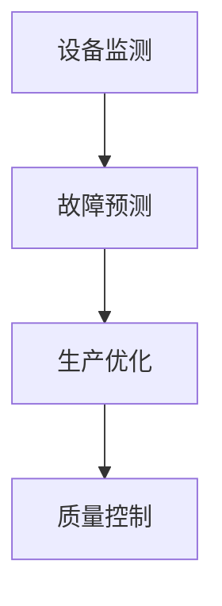

##### 8.2 代理工作流在智慧城市中的应用

智慧城市是利用信息技术和物联网技术实现城市智能化管理的一种新模式。AI代理工作流在智慧城市中的应用将显著提升城市管理的效率和质量。

###### 8.2.1 城市管理

AI代理工作流在智慧城市中的应用包括：

1. **环境监测**：AI代理可以实时监测城市环境，如空气质量、水质等，及时发现和处理问题。
2. **交通管理**：AI代理可以优化交通信号控制，缓解交通拥堵，提高交通效率。

以下为一个简单的城市管理系统AI代理设计架构：

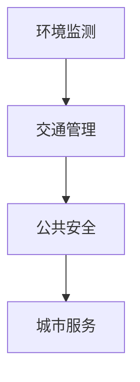

###### 8.2.2 智慧交通

智慧交通是智慧城市的重要组成部分，AI代理工作流在智慧交通中的应用有助于提高交通效率、减少交通事故和环境污染。例如：

1. **智能调度**：AI代理可以实时监控交通流量，优化交通信号控制和公共交通调度。
2. **智能导航**：AI代理可以实时提供交通状况和最佳路线，帮助驾驶者和行人选择最优路径。

以下为一个简单的智慧交通系统AI代理设计架构：

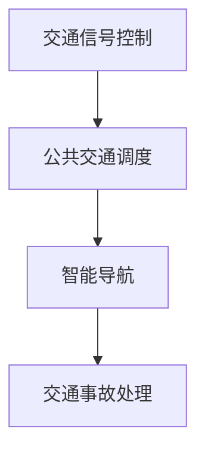

###### 8.2.3 智慧医疗

智慧医疗是利用信息技术和物联网技术实现医疗智能化服务的一种新模式。AI代理工作流在智慧医疗中的应用将显著提升医疗服务质量和效率。例如：

1. **疾病预测**：AI代理可以基于患者数据和医疗知识，预测疾病风险，提供个性化健康管理服务。
2. **智能诊断**：AI代理可以分析医疗影像和生物标志物，辅助医生进行疾病诊断。

以下为一个简单的智慧医疗系统AI代理设计架构：

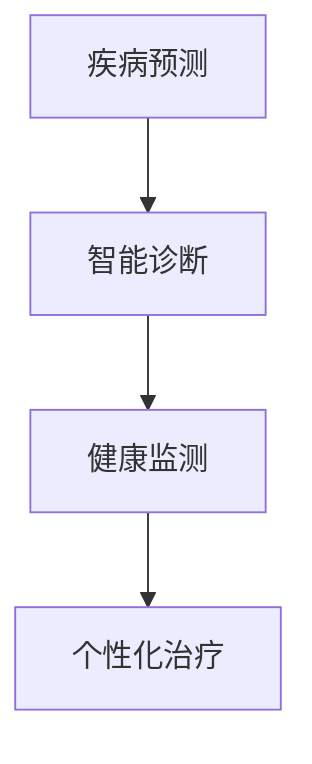

##### 8.3 代理工作流在新兴领域的应用

随着技术的不断进步，AI代理工作流将在更多新兴领域得到应用。以下将对AI代理工作流在区块链、物联网和虚拟现实等领域的应用进行探讨。

###### 8.3.1 区块链

区块链是一种去中心化的分布式数据库技术，具有高安全性、透明性和不可篡改性的特点。AI代理工作流在区块链中的应用包括：

1. **智能合约**：AI代理可以自动执行智能合约，提高交易效率，降低交易成本。
2. **供应链管理**：AI代理可以实时监控供应链的各个环节，确保供应链的透明性和安全性。

以下为一个简单的区块链系统AI代理设计架构：

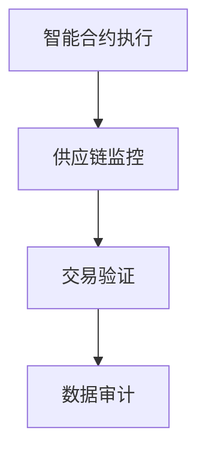

###### 8.3.2 物联网

物联网（IoT）是一种连接物理设备和互联网的技术，AI代理工作流在物联网中的应用包括：

1. **设备监控**：AI代理可以实时监控设备的运行状态，预测故障，实现预测性维护。
2. **智能控制**：AI代理可以基于实时数据和预测模型，自动调整设备的运行参数，实现智能化控制。

以下为一个简单的物联网系统AI代理设计架构：

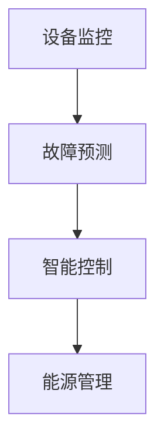

###### 8.3.3 虚拟现实与增强现实

虚拟现实（VR）和增强现实（AR）是一种将虚拟世界与现实世界融合的技术。AI代理工作流在虚拟现实和增强现实中的应用包括：

1. **智能导航**：AI代理可以提供智能导航服务，帮助用户在虚拟环境中找到目的地。
2. **交互式体验**：AI代理可以与用户进行交互，提供个性化服务，增强用户体验。

以下为一个简单的虚拟现实和增强现实系统AI代理设计架构：

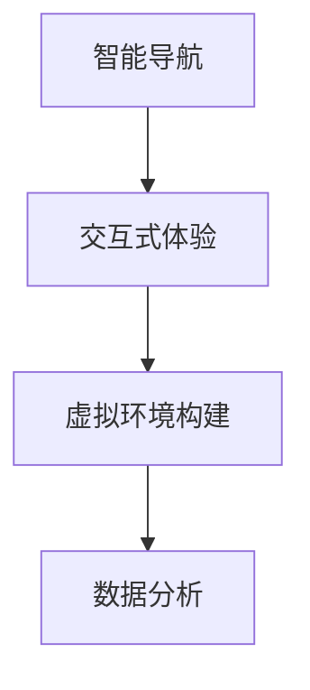

### 附录

#### 附录A: 相关技术术语解释与参考资源

以下是对文中涉及的相关技术术语进行解释，并提供相关的参考资源和推荐书籍。

##### A.1 人工智能代理相关术语

###### A.1.1 代理

代理（Agent）是指具有感知、决策和执行能力的计算实体，能够在复杂环境中自主执行任务。代理是人工智能领域的一个重要概念，广泛应用于工业、金融、医疗等领域。

###### A.1.2 工作流

工作流（Workflow）是指一组任务和操作的序列，用于描述业务过程或工作流程。工作流可以自动执行，从而提高业务流程的效率和质量。

###### A.1.3 智能代理

智能代理（Intelligent Agent）是指具备感知、决策和执行能力，并且能够自主学习和适应环境的计算实体。智能代理是人工智能领域的一个重要研究方向，其目标是实现智能化的自动化工作流。

###### A.1.4 对话系统

对话系统（Dialogue System）是指能够与用户进行自然语言交互的计算系统。对话系统广泛应用于智能客服、虚拟助手、智能语音助手等领域。

##### A.2 AI代理工作流开发工具与资源

以下是一些常用的AI代理工作流开发工具和资源，供读者参考。

###### A.2.1 主流代理开发框架

- **Python-RAII**：一个基于Python的智能代理开发框架，支持代理的感知、决策和执行功能。

- **OpenAI Gym**：一个开源的代理开发环境，提供多种模拟环境和任务，用于测试和训练代理。

- **R-Library**：一个基于R语言的智能代理开发框架，支持多种机器学习算法和代理模型。

###### A.2.2 开源代理工作流工具

- **ProM**：一个开源的工作流挖掘工具，用于分析业务流程和发现优化机会。

- **Workflow Studio**：一个开源的工作流设计工具，支持工作流的建模、模拟和优化。

- **Apache Airflow**：一个开源的工作流调度工具，支持自动化工作流的调度和管理。

###### A.2.3 相关论文与书籍推荐

- **《人工智能：一种现代方法》**：Tom M. Mitchell著，系统介绍了人工智能的基本理论和技术。

- **《智能代理：基础与最佳实践》**：Amnon Shashua等著，详细介绍了智能代理的概念、模型和应用。

- **《工作流技术与应用》**：陈玉祥等著，介绍了工作流技术的基本原理和实际应用。

以上是关于AI人工智能代理工作流（AI Agent WorkFlow）在工业制造中的应用的详细技术博客文章。本文涵盖了AI代理工作流的基本概念、架构设计、实现技术、应用案例和未来展望等内容，力求以逻辑清晰、结构紧凑、简单易懂的方式呈现，帮助读者全面了解AI代理工作流的技术原理和应用前景。文章末尾附有相关的技术术语解释和参考资源，供读者进一步学习和研究。希望这篇文章能够对您在AI代理工作流领域的探索和学习有所帮助！

### 附录

#### 附录A: 相关技术术语解释与参考资源

在本技术博客文章中，我们提到了多个与AI人工智能代理工作流相关的技术术语。以下是对这些术语的简要解释，并提供相关的参考资源和推荐书籍。

##### A.1 人工智能代理相关术语

###### A.1.1 代理（Agent）

代理是指具有感知、决策和执行能力的计算实体。在人工智能领域，代理是自主行动以实现特定目标的实体。代理可以是软件程序、机器人、甚至是人类。

- **参考资源**：
  - 《人工智能代理：计算模型与实现》（Intelligent Agents: Theory and Models）by Michael Wooldridge。

###### A.1.2 工作流（Workflow）

工作流是指一系列任务和操作，它们按照特定的规则或流程顺序执行，以完成某个业务过程或目标。

- **参考资源**：
  - 《工作流管理：理论与实践》（Workflow Management: Models, Techniques, and Empirical Studies）by Wil van der Aalst。

###### A.1.3 智能代理（Intelligent Agent）

智能代理是指具有自我学习能力、自适应能力和感知能力的代理，能够根据环境变化自主调整行为。

- **参考资源**：
  - 《智能代理：设计与实现》（Intelligent Agents: Design and Construction）by Yoav Shoham。

###### A.1.4 对话系统（Dialogue System）

对话系统是指能够与人类用户进行自然语言交互的系统，通常用于智能客服、虚拟助手等应用。

- **参考资源**：
  - 《对话系统：设计、实现与评估》（Dialogue Systems: Design, Implementation and Evaluation）by John L. Pustejovsky。

##### A.2 AI代理工作流开发工具与资源

在本文章中，我们提到了一些AI代理工作流开发工具与资源。以下是对这些工具的简要介绍和推荐。

###### A.2.1 主流代理开发框架

- **Python-RAII**：Python-RAII是一个开源的代理开发框架，提供了一套完整的代理开发环境。

- **OpenAI Gym**：OpenAI Gym是一个开源的代理开发环境，提供了多种预定义的模拟环境和任务。

- **R-Library**：R-Library是一个基于R语言的代理开发框架，支持多种机器学习算法和代理模型。

###### A.2.2 开源代理工作流工具

- **ProM**：ProM是一个开源的工作流挖掘工具，用于分析业务流程和发现优化机会。

- **Workflow Studio**：Workflow Studio是一个开源的工作流设计工具，支持工作流的建模、模拟和优化。

- **Apache Airflow**：Apache Airflow是一个开源的工作流调度工具，支持自动化工作流的调度和管理。

###### A.2.3 相关论文与书籍推荐

- **《人工智能：一种现代方法》（Machine Learning: A Probabilistic Perspective）** by Kevin P. Murphy。

- **《智能代理：理论、模型与算法》（Artificial Intelligence: A Modern Approach）** by Stuart Russell and Peter Norvig。

- **《智能工作流系统：设计与实现》（Intelligent Workflow Systems: Design and Implementation）** by Robert W. Kent。

##### A.3 AI代理工作流应用领域参考资料

在本文章中，我们讨论了AI代理工作流在工业制造、金融服务、医疗保健和教育等领域的应用。以下是一些相关领域的参考资料。

###### A.3.1 工业制造

- **《工业4.0：制造业的未来》（Industry 4.0: Breakthroughs in the Manufacturing Revolutions）** by Klaus Schwab。

- **《智能制造：理论与实践》（Smart Manufacturing: Theory and Practice）** by Samir U. S. Bhatnagar。

###### A.3.2 金融服务

- **《金融科技：变革与挑战》（FinTech: Innovation in the Financial Industry）** by Alex Tapscott and Don Tapscott。

- **《智能投资：利用AI预测市场》（Smart Investing: Predicting the Market with AI）** by Mark H. Moore。

###### A.3.3 医疗保健

- **《智能医疗：利用AI改善医疗服务》（Smart Healthcare: Using AI to Improve Patient Care）** by Eric Topol。

- **《数字健康：AI在医疗保健中的应用》（Digital Health: AI Applications in Healthcare）** by Eric Topol。

###### A.3.4 教育

- **《智能教育：利用AI改善学习体验》（Smart Education: Using AI to Improve the Learning Experience）** by Rosemary Talab.

- **《个性化学习：理论与实践》（Personalized Learning: Theory and Practice）** by John D. Bransford。

通过这些参考资料，读者可以进一步了解AI代理工作流在各个领域的具体应用和实践。希望这些资源能够帮助您在相关领域的研究和实践中取得更多的成果。

