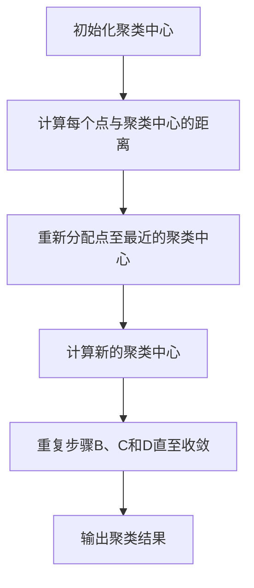
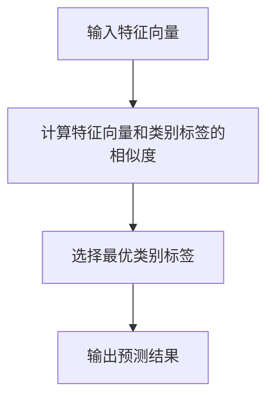
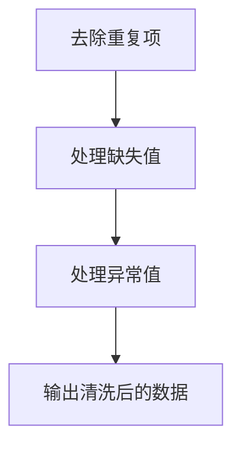
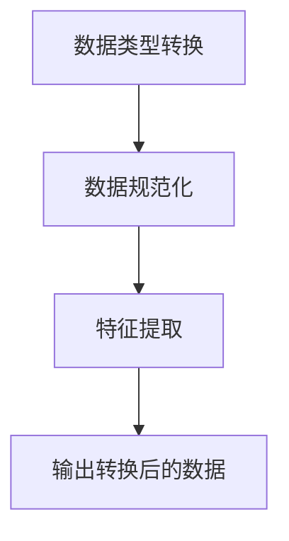

                 

### 文章标题

#### AI人工智能代理工作流 AI Agent WorkFlow：在数据分析中的应用

---

#### 关键词：

- 人工智能代理（AI Agent）
- 数据分析（Data Analysis）
- 工作流（WorkFlow）
- 模型训练（Model Training）
- 模型评估（Model Evaluation）
- 数据预处理（Data Preprocessing）

---

#### 摘要：

本文将探讨AI人工智能代理工作流（AI Agent WorkFlow）在数据分析中的应用。工作流是指一系列任务或活动的有序执行过程，而AI代理则是能够自主学习、自主决策并执行特定任务的人工智能实体。本文将首先介绍AI代理的定义和特性，然后深入讨论AI代理工作流在数据分析中的设计原理和应用，并通过具体案例展示其实际效果。文章还将涵盖AI代理工作流的前沿技术和发展趋势，为读者提供全面、系统的学习和实践指导。通过本文的阅读，读者将能够深入理解AI代理工作流的核心概念和实践应用，掌握在数据分析领域中使用AI代理工作流的技巧和方法。

---

## 第1章：AI代理工作流概述

### 1.1 AI代理的定义

AI代理（AI Agent）是指具备一定人工智能能力的代理实体，能够在特定环境下自主感知、决策和执行任务。AI代理的核心特征包括：

- **自主性**：能够独立执行任务，不需要人类干预。
- **适应性**：能够根据环境和任务的改变进行学习和适应。
- **协作性**：能够与其他代理或人类进行有效协作。

AI代理通常包括以下几个关键组成部分：

- **感知系统**：负责获取环境信息，如传感器数据、用户输入等。
- **决策系统**：根据感知到的信息，自主决策采取何种行动。
- **执行系统**：执行决策结果，完成具体的任务。

AI代理与传统代理的区别在于，传统代理主要依赖于预设的规则和指令，而AI代理则能够通过机器学习、自然语言处理等人工智能技术，实现更加灵活、智能的决策和执行。

### 1.2 AI代理工作流的概念

AI代理工作流（AI Agent WorkFlow）是指AI代理在完成特定任务时，按照既定流程进行的一系列操作。AI代理工作流的核心概念包括：

- **工作流**：一系列任务或活动的有序执行过程。
- **任务**：工作流中的具体操作或步骤。
- **步骤**：工作流中每个任务的具体实现。

AI代理工作流通常包括以下几个基本组成部分：

- **起始节点**：工作流的开始。
- **处理节点**：执行具体任务或操作的节点。
- **决策节点**：根据条件判断是否执行某个任务。
- **结束节点**：工作流的结束。

### 1.3 AI代理工作流的结构

AI代理工作流的结构通常可以分为三个层次：输入层、处理层和输出层。

#### 输入层

输入层主要负责数据收集和预处理。数据可以是结构化数据、非结构化数据或半结构化数据，如文本、图像、声音等。输入层的任务包括：

- **数据收集**：从各种数据源获取数据，如数据库、网络接口、传感器等。
- **数据预处理**：清洗、归一化、特征提取等，以准备好数据用于后续处理。

#### 处理层

处理层是AI代理工作流的核心部分，主要负责模型训练、优化和评估。处理层的任务包括：

- **模型训练**：选择合适的机器学习模型，使用训练数据进行模型训练。
- **模型优化**：调整模型参数，提高模型性能。
- **模型评估**：评估模型性能，如准确率、召回率等。

#### 输出层

输出层主要负责将处理结果输出给用户或系统。输出层的任务包括：

- **结果输出**：将模型预测结果、分析报告等输出给用户或系统。
- **反馈收集**：收集用户反馈或系统数据，用于模型迭代和优化。

### 1.4 AI代理工作流的关键要素

AI代理工作流的关键要素包括数据收集、预处理、模型训练、模型评估和模型优化。以下是对这些关键要素的详细说明：

#### 数据收集

数据收集是AI代理工作流的第一步，也是至关重要的一步。数据收集的质量直接影响后续模型训练和评估的效果。数据收集的任务包括：

- **数据源选择**：选择合适的数据源，如数据库、网络接口、传感器等。
- **数据采集**：从数据源中获取数据，如通过爬虫、API接口等。
- **数据清洗**：去除重复、错误或无关的数据，保证数据质量。

#### 数据预处理

数据预处理是确保数据适合用于机器学习模型训练的关键步骤。数据预处理的任务包括：

- **数据清洗**：去除重复、错误或无关的数据，保证数据质量。
- **数据归一化**：将数据缩放到相同的范围，便于模型训练。
- **特征提取**：从原始数据中提取有用的特征，提高模型性能。

#### 模型训练

模型训练是AI代理工作流的核心任务，通过选择合适的机器学习模型，使用训练数据对其进行训练。模型训练的任务包括：

- **模型选择**：选择合适的机器学习模型，如决策树、神经网络等。
- **训练数据准备**：将预处理后的数据分成训练集和验证集。
- **模型训练**：使用训练集数据训练模型。

#### 模型评估

模型评估是衡量模型性能的重要步骤，通过评估指标（如准确率、召回率等）对模型进行评估。模型评估的任务包括：

- **评估指标选择**：选择合适的评估指标，如准确率、召回率等。
- **模型评估**：使用验证集或测试集对模型进行评估。
- **模型调整**：根据评估结果调整模型参数，提高模型性能。

#### 模型优化

模型优化是通过对模型进行调整，进一步提高模型性能的过程。模型优化的任务包括：

- **超参数调整**：调整模型超参数，如学习率、迭代次数等。
- **模型融合**：将多个模型的结果进行融合，提高预测性能。
- **模型压缩**：减少模型参数数量，提高模型运行效率。

## 1.5 AI代理工作流的实际应用

AI代理工作流在数据分析、自动化、智能推荐等领域有广泛的应用。以下是一些典型的实际应用案例：

- **数据分析**：通过AI代理工作流，对大量数据进行自动分析，提取有价值的信息，如用户行为分析、市场趋势预测等。
- **自动化**：利用AI代理工作流，实现自动化任务执行，提高工作效率，如自动化测试、自动化运维等。
- **智能推荐**：通过AI代理工作流，实现智能推荐系统，为用户提供个性化的推荐服务，如电商推荐、音乐推荐等。

### 总结

本章介绍了AI代理的定义、工作流的概念和结构，以及关键要素。AI代理是一种具有自主性、适应性和协作性的智能实体，能够实现自主感知、决策和执行。AI代理工作流是指AI代理在完成特定任务时，按照既定流程进行的一系列操作。通过数据收集、预处理、模型训练、模型评估和模型优化等关键要素，AI代理工作流能够实现高效的数据分析和任务自动化。实际应用案例展示了AI代理工作流在多个领域的广泛应用和巨大潜力。

## 第2章：数据分析基础知识

数据分析是利用统计学、机器学习、数据挖掘等方法，对大量数据进行处理、分析和解释，从中提取有价值的信息和知识。数据分析在商业决策、科学研究、社会治理等领域具有广泛的应用。本章将介绍数据分析的基本概念、过程、方法和工具，为后续章节的讨论打下基础。

### 2.1 数据分析的基本概念

#### 数据分析的定义

数据分析（Data Analysis）是指通过统计和计算方法，对数据进行处理、分析和解释，以发现数据中的模式、趋势和关联性，从而为决策提供依据。数据分析的目标是提取数据中的信息，帮助决策者更好地理解问题、识别风险、发现机会。

#### 数据分析的核心概念

- **数据（Data）**：数据分析的输入，可以是结构化数据、非结构化数据或半结构化数据。
- **变量（Variable）**：数据中可以测量的属性，分为定量变量和定性变量。
- **数据集（Dataset）**：一组相关数据的集合，可以是表格形式、图像、文本等。
- **统计（Statistics）**：对数据进行描述、分析和推断的方法和工具。
- **机器学习（Machine Learning）**：利用算法和统计模型，从数据中学习并发现模式的方法。
- **数据挖掘（Data Mining）**：从大量数据中提取有价值信息的方法。

### 2.2 数据分析的过程

数据分析通常包括以下几个步骤：

1. **数据收集**：从各种数据源获取原始数据，如数据库、文件、传感器等。
2. **数据预处理**：清洗、整理和转换数据，使其适合分析。
3. **数据探索性分析**：对数据进行初步分析，了解数据的基本特征和分布。
4. **数据建模**：选择合适的模型，对数据进行分析和预测。
5. **模型评估**：评估模型性能，如准确率、召回率等。
6. **结果解释和报告**：解释分析结果，撰写报告，为决策提供依据。

### 2.3 常见的数据分析方法

数据分析方法可以分为描述性分析、预测性和分类分析等类型。

#### 描述性统计分析

描述性统计分析是对数据的基本特征进行描述，常用的统计量包括均值、中位数、标准差、方差等。描述性统计分析有助于了解数据的基本分布和趋势。

```latex
$$
\bar{x} = \frac{1}{n}\sum_{i=1}^{n} x_i \quad (均值)
$$

$$
\text{median}(x) = \left(\frac{n+1}{2}\right) \text{th} \quad (中位数)
$$

$$
s^2 = \frac{1}{n-1}\sum_{i=1}^{n}(x_i - \bar{x})^2 \quad (方差)
$$

$$
\sigma = \sqrt{s^2} \quad (标准差)
$$
```

#### 聚类分析

聚类分析是将数据分为不同的类别，以便更好地理解数据的分布和特征。常用的聚类算法包括K均值聚类、层次聚类等。



#### 分类分析

分类分析是将数据分为不同的类别，以便进行预测和决策。常用的分类算法包括决策树、支持向量机、朴素贝叶斯等。



### 2.4 数据分析工具介绍

数据分析工具是进行数据分析的重要工具，常用的工具包括Python数据分析库、R语言、SQL数据库等。

#### Python数据分析库

Python是数据分析领域广泛使用的编程语言，常用的数据分析库包括Pandas、NumPy、Scikit-learn等。

- **Pandas**：用于数据清洗、预处理和分析的库，提供了丰富的数据处理函数和方法。
- **NumPy**：提供了高效的数值计算和数据存储功能。
- **Scikit-learn**：提供了丰富的机器学习算法和工具，用于数据建模和模型评估。

#### R语言

R语言是统计分析领域广泛使用的编程语言，提供了丰富的统计分析和数据可视化工具。

- **dplyr**：提供了数据清洗、转换和分析的函数。
- **ggplot2**：提供了数据可视化的函数。

#### SQL数据库

SQL数据库是进行数据存储和管理的重要工具，常用的数据库包括MySQL、PostgreSQL等。

- **MySQL**：开源的关系型数据库，用于存储和查询数据。
- **PostgreSQL**：开源的关系型数据库，提供了丰富的功能和扩展。

### 总结

本章介绍了数据分析的基本概念、过程和方法，以及常用的数据分析工具。数据分析是通过统计和计算方法，对大量数据进行处理、分析和解释，以提取有价值的信息和知识。数据分析过程包括数据收集、预处理、探索性分析、建模和评估等步骤。常见的数据分析方法包括描述性统计分析、聚类分析和分类分析。常用的数据分析工具有Python数据分析库、R语言和SQL数据库等。通过本章的学习，读者将能够了解数据分析的基本概念和方法，为后续章节的讨论打下基础。

### 2.5 数据预处理

数据预处理是数据分析中至关重要的一步，它包括数据清洗、数据转换和数据归一化等过程。数据预处理的质量直接影响到后续模型训练和评估的效果。下面将详细介绍数据预处理的步骤和常见方法。

#### 数据清洗

数据清洗是指去除数据中的重复项、缺失值、异常值等，以提高数据质量。数据清洗的步骤包括：

1. **去除重复项**：删除重复的数据行，以避免对分析结果的影响。
2. **处理缺失值**：对于缺失的数据，可以采取以下几种方法：
    - **删除缺失值**：删除含有缺失值的数据行或列。
    - **填充缺失值**：使用平均值、中位数、众数等统计量填充缺失值。
    - **插值法**：使用插值方法填补缺失值。
3. **处理异常值**：异常值可能是数据中的噪声，也可能是错误的数据。对于异常值的处理，可以采取以下几种方法：
    - **删除异常值**：删除偏离正常范围的数据。
    - **调整异常值**：将异常值调整为正常范围。
    - **孤立异常值**：将异常值作为孤立点处理。



#### 数据转换

数据转换是指将数据从一种形式转换为另一种形式，以适应模型训练的需要。数据转换的步骤包括：

1. **数据类型转换**：将数据类型转换为适合分析的类型，如将字符串转换为数值类型。
2. **数据规范化**：将数据缩放到相同的范围，以消除数据之间的量纲差异。
3. **特征提取**：从原始数据中提取有用的特征，以减少数据的维度和噪声。



#### 数据归一化

数据归一化是指将数据缩放到相同的范围，以消除数据之间的量纲差异。常用的归一化方法包括最小-最大归一化、Z-Score归一化等。

- **最小-最大归一化**：

  ```latex
  $$ 
  x_{\text{norm}} = \frac{x - x_{\text{min}}}{x_{\text{max}} - x_{\text{min}}} 
  $$
  ```

- **Z-Score归一化**：

  ```latex
  $$ 
  x_{\text{norm}} = \frac{x - \mu}{\sigma} 
  $$
  $$ 
  \mu = \frac{1}{n}\sum_{i=1}^{n} x_i 
  $$
  $$ 
  \sigma = \sqrt{\frac{1}{n-1}\sum_{i=1}^{n}(x_i - \mu)^2} 
  $$

#### 数据预处理的工具和方法

数据预处理可以通过编程语言（如Python、R语言）或工具（如Excel、SQL）实现。以下是一些常用的工具和方法：

- **Python**：
  - **Pandas**：提供丰富的数据处理函数和方法。
  - **NumPy**：提供高效的数据存储和计算功能。
  - **Scikit-learn**：提供数据清洗、转换和归一化等功能。

- **R语言**：
  - **dplyr**：提供数据清洗、转换和分析的函数。
  - **ggplot2**：提供数据可视化的函数。

- **SQL**：提供数据清洗、转换和查询的功能。

### 总结

数据预处理是数据分析中至关重要的一步，它包括数据清洗、数据转换和数据归一化等过程。数据清洗包括去除重复项、处理缺失值和处理异常值等步骤。数据转换包括数据类型转换、数据规范化和特征提取等步骤。数据归一化是将数据缩放到相同的范围，以消除数据之间的量纲差异。常用的数据预处理工具和方法包括Python数据分析库、R语言和SQL数据库等。通过本章的学习，读者将能够掌握数据预处理的基本方法和工具，为后续的模型训练和评估打下基础。

## 2.6 数据分析工具的应用

在实际的数据分析工作中，选择合适的工具对于提高工作效率和确保数据质量至关重要。本节将介绍几种常用的数据分析工具，并讨论其在数据分析中的应用。

### Python数据分析库

Python作为一种通用编程语言，在数据分析领域拥有广泛的应用。Python的数据分析库包括Pandas、NumPy、Scikit-learn等，这些库提供了丰富的功能，使得数据处理和分析变得更加简便。

- **Pandas**：Pandas是一个强大的数据分析和操作库，它提供了数据结构Series和DataFrame，可以方便地进行数据处理、清洗和转换。Pandas的DataFrame结构类似于Excel表格，使得数据处理变得更加直观。

  ```python
  import pandas as pd

  # 创建DataFrame
  df = pd.DataFrame({'A': [1, 2, 3], 'B': [4, 5, 6]})

  # 数据清洗
  df = df.drop_duplicates()  # 去除重复数据
  df = df.fillna(df.mean())  # 填充缺失值

  # 数据转换
  df['C'] = df['A'] + df['B']  # 创建新列
  ```

- **NumPy**：NumPy是一个用于数值计算的库，提供了多维数组对象（ndarray）以及一系列高效的操作函数。NumPy在数据处理和计算方面具有很高的性能，是数据分析的基础。

  ```python
  import numpy as np

  # 创建数组
  arr = np.array([1, 2, 3, 4, 5])

  # 数组操作
  arr_squared = arr ** 2  # 计算数组每个元素的平方
  ```

- **Scikit-learn**：Scikit-learn是一个用于机器学习的库，提供了丰富的算法和工具，包括数据预处理、模型训练、模型评估等。Scikit-learn的API设计简洁易用，使得模型开发变得更加高效。

  ```python
  from sklearn.linear_model import LinearRegression

  # 模型训练
  model = LinearRegression()
  model.fit(X_train, y_train)

  # 模型评估
  score = model.score(X_test, y_test)
  print(f'Model accuracy: {score}')
  ```

### R语言数据分析工具

R语言是一种专门为统计分析和图形显示设计的编程语言，它在数据分析和统计建模领域有着广泛的应用。

- **dplyr**：dplyr是一个数据处理和操作库，它提供了简洁的语法和高效的函数，用于数据清洗、转换和分析。

  ```R
  library(dplyr)

  # 数据清洗
  df %>% select(-c('E', 'F')) %>% distinct()

  # 数据转换
  df %>% mutate(C = A + B)
  ```

- **ggplot2**：ggplot2是一个用于数据可视化的库，它提供了丰富的图表类型和自定义选项，使得数据可视化变得更加简单和直观。

  ```R
  library(ggplot2)

  # 数据可视化
  ggplot(df, aes(x = A, y = B)) + geom_line()
  ```

### SQL数据库查询工具

SQL（Structured Query Language）是一种用于数据库查询和操作的标准语言，广泛应用于数据存储、检索和管理。

- **MySQL**：MySQL是一个开源的关系型数据库，它提供了强大的查询功能，支持事务处理和索引。

  ```sql
  -- 创建数据库
  CREATE DATABASE mydatabase;

  -- 创建表
  CREATE TABLE mytable (
      id INT PRIMARY KEY,
      name VARCHAR(255),
      age INT
  );

  -- 插入数据
  INSERT INTO mytable (id, name, age) VALUES (1, 'Alice', 30);
  ```

- **PostgreSQL**：PostgreSQL是一个开源的关系型数据库，它提供了丰富的功能和扩展，支持复杂查询和高级数据类型。

  ```sql
  -- 创建数据库
  CREATE DATABASE mydatabase;

  -- 创建表
  CREATE TABLE mytable (
      id SERIAL PRIMARY KEY,
      name VARCHAR(255),
      age INT
  );

  -- 插入数据
  INSERT INTO mytable (name, age) VALUES ('Alice', 30);
  ```

### 总结

数据分析工具的选择取决于具体的应用场景和需求。Python数据分析库（如Pandas、NumPy、Scikit-learn）提供了丰富的数据处理和分析功能，适合快速开发和原型设计。R语言（如dplyr、ggplot2）则提供了强大的统计分析和数据可视化功能，适合进行复杂的数据分析和报告生成。SQL数据库查询工具（如MySQL、PostgreSQL）提供了数据存储和检索功能，适合进行大规模数据管理和查询。通过合理选择和使用这些工具，可以提高数据分析的效率和质量。

### 2.7 数据分析在商业中的应用

数据分析在商业领域具有广泛的应用，可以帮助企业提高运营效率、优化决策过程、增强市场竞争力。以下将介绍数据分析在商业中的一些典型应用，以及如何通过数据分析实现商业价值。

#### 1. 用户行为分析

用户行为分析是数据分析在商业中最重要的应用之一。通过分析用户的点击行为、浏览路径、购买记录等数据，企业可以深入了解用户的需求和行为模式，从而优化产品设计和营销策略。

- **案例**：一家电商平台通过数据分析发现，用户在浏览商品时，80%的用户会在商品详情页停留超过30秒，这表明用户对商品有较高的兴趣。基于这一发现，该电商平台增加了商品详情页的展示内容，包括用户评价、相似商品推荐等，提高了用户的购买转化率。

#### 2. 销售预测

销售预测是帮助企业制定营销策略和库存管理的重要工具。通过历史销售数据、市场趋势和用户行为数据等，企业可以预测未来的销售情况，从而优化库存和生产计划。

- **案例**：一家服装制造商通过数据分析预测了夏季销售高峰期，提前增加了生产量和库存量。结果，在销售高峰期，该公司满足了市场需求，避免了库存积压和销售损失。

#### 3. 客户细分

客户细分是分析客户特征和需求，将客户分为不同的群体，以便进行有针对性的营销和服务。通过客户细分，企业可以更好地了解不同客户群体的需求，提高营销效果和服务质量。

- **案例**：一家银行通过数据分析将客户分为高净值客户、普通客户和潜在客户三个群体。针对不同客户群体，银行制定了差异化的营销策略，如高净值客户享受私人银行服务，普通客户享受优惠利率等，从而提高了客户满意度和忠诚度。

#### 4. 供应链优化

供应链优化是提高企业运营效率的重要手段。通过数据分析，企业可以优化供应链各个环节，如库存管理、物流配送、生产计划等，从而降低成本、提高效率。

- **案例**：一家制造企业通过数据分析优化了生产计划和库存管理。通过对历史订单数据、市场需求和生产线效率的分析，企业调整了生产计划和库存水平，减少了库存积压和生产延误，提高了生产效率和客户满意度。

#### 5. 市场营销

市场营销是企业在市场竞争中取得优势的重要手段。通过数据分析，企业可以了解市场趋势、消费者偏好和竞争对手的动态，从而制定有针对性的市场营销策略。

- **案例**：一家饮料公司通过数据分析发现，年轻消费者更喜欢口味独特和包装时尚的饮料。基于这一发现，该公司推出了一系列创新口味和时尚包装的产品，成功吸引了年轻消费者的关注和购买。

### 如何通过数据分析实现商业价值

1. **数据收集**：收集与企业业务相关的数据，包括用户行为数据、销售数据、市场数据等。

2. **数据预处理**：对收集到的数据进行清洗、转换和归一化，确保数据质量。

3. **数据建模**：选择合适的机器学习模型和算法，对数据进行分析和预测。

4. **模型评估**：评估模型性能，选择最佳模型进行应用。

5. **决策支持**：根据分析结果，为企业决策提供支持，优化业务流程和营销策略。

6. **持续优化**：定期更新数据和分析模型，确保分析结果的准确性和有效性。

### 总结

数据分析在商业中具有广泛的应用，可以帮助企业提高运营效率、优化决策过程和增强市场竞争力。通过用户行为分析、销售预测、客户细分、供应链优化和市场营销等应用，企业可以深入了解用户需求和市场动态，制定有针对性的策略，从而实现商业价值。通过合理的数据分析和决策支持，企业可以不断优化业务流程和营销策略，提高竞争力和盈利能力。

### 2.8 数据分析在科学研究中的应用

数据分析在科学研究中的应用广泛而深入，是推动科学发现和技术创新的重要工具。通过分析大量实验数据、观测数据和文献资料，科学家能够发现数据中的规律和趋势，从而提出新的理论、假设和解决方案。以下将介绍数据分析在科学研究中的几个关键应用领域。

#### 1. 实验数据分析

在实验科学中，数据分析是验证实验假设和解释实验结果的核心环节。通过数据分析，科学家可以从实验数据中提取有价值的信息，评估实验结果的可靠性和有效性。

- **案例**：在生物学研究中，基因表达数据分析是一项重要任务。通过高通量测序技术获取的基因表达数据，科学家可以使用数据分析方法来确定基因在不同条件下的表达水平，从而揭示基因的功能和调控机制。

  ```mermaid
  graph TD
  A[实验数据收集] --> B[数据预处理]
  B --> C[统计分析]
  C --> D[结果可视化]
  D --> E[假设验证]
  ```

#### 2. 观测数据分析

在环境科学、地球科学和天文学等领域，观测数据分析是对大量观测数据进行分析，以理解自然现象和气候变化。通过数据分析，科学家可以识别数据中的模式和规律，为环境保护和资源管理提供科学依据。

- **案例**：在气候变化研究中，科学家使用数据分析方法对全球气候观测数据进行处理和模式识别，以监测气候变化趋势和预测未来气候状况。

  ```mermaid
  graph TD
  A[观测数据收集] --> B[数据预处理]
  B --> C[时间序列分析]
  C --> D[气候变化预测]
  D --> E[政策建议]
  ```

#### 3. 文献数据分析

在社会科学和人文学科中，数据分析通过对大量文献的文本挖掘和内容分析，可以帮助科学家识别研究热点、趋势和学科发展脉络。

- **案例**：在计算机科学领域，通过文本挖掘和共词分析，科学家可以识别出特定研究领域的关键词和主题，为研究方向的确定提供参考。

  ```mermaid
  graph TD
  A[文献数据收集] --> B[文本挖掘]
  B --> C[共词分析]
  C --> D[关键词提取]
  D --> E[研究趋势分析]
  ```

#### 4. 数据可视化和交互分析

数据分析不仅包括统计和计算，还包括数据可视化和交互分析。通过数据可视化，科学家可以直观地展示数据中的模式和趋势，提高数据分析的可理解性和科学传播的效果。

- **案例**：在医学研究中，通过数据可视化工具，科学家可以展示患者数据、药物作用和治疗效果，为临床决策提供直观的参考。

  ```mermaid
  graph TD
  A[数据分析结果] --> B[数据可视化]
  B --> C[交互式探索]
  C --> D[科学传播]
  ```

### 总结

数据分析在科学研究中的应用涵盖了实验数据分析、观测数据分析、文献数据分析和数据可视化等多个方面。通过数据分析，科学家可以从大量数据中提取有价值的信息，推动科学发现和技术创新。随着数据分析技术的发展，科学家能够更加高效地处理和分析数据，为科学研究和决策提供更加可靠的依据。数据分析不仅是科学研究的重要工具，也是推动科学技术进步的关键驱动力。

## 第3章：AI代理工作流设计原理

### 3.1 AI代理工作流的设计原则

设计AI代理工作流时，需要遵循一系列设计原则，以确保工作流的用户友好性、模块化、可扩展性和高效性。以下将详细介绍这些设计原则。

#### 1. 用户友好性

用户友好性是指工作流的设计应易于操作和理解，方便用户使用和维护。为了实现用户友好性，可以考虑以下原则：

- **简洁性**：工作流的设计应尽可能简洁，避免复杂的操作和冗余步骤。
- **直观性**：工作流的设计应直观易懂，使用户能够快速上手。
- **灵活性**：工作流的设计应具备一定的灵活性，以适应不同用户和场景的需求。

#### 2. 模块化

模块化是指工作流的设计应将整体任务分解为多个独立的模块，每个模块负责特定的功能，便于扩展和维护。模块化设计的原则包括：

- **独立性**：每个模块应独立运行，不依赖于其他模块，以提高系统的稳定性和可维护性。
- **可复用性**：模块的设计应具备较高的复用性，以便在不同工作流中重复使用。
- **可扩展性**：模块的设计应具备可扩展性，以适应新的功能和需求。

#### 3. 可扩展性

可扩展性是指工作流的设计应具备良好的扩展性，以适应数据规模和任务复杂度的变化。可扩展性的原则包括：

- **并行处理**：工作流的设计应支持并行处理，以提高处理速度和效率。
- **分布式计算**：工作流的设计应支持分布式计算，以处理大规模数据集。
- **模块化扩展**：工作流的设计应支持模块化扩展，以适应新的功能和需求。

#### 4. 高效性

高效性是指工作流的设计应具备较高的性能和效率，以快速完成任务。高效性的原则包括：

- **性能优化**：工作流的设计应进行性能优化，如使用高效算法和数据结构，减少计算复杂度。
- **资源管理**：工作流的设计应进行资源管理，如合理分配计算资源，避免资源浪费。
- **自动化**：工作流的设计应实现自动化，以减少人工干预和操作错误。

### 3.2 数据收集与预处理

数据收集与预处理是AI代理工作流的重要组成部分，其质量直接影响到模型训练和评估的效果。以下将详细介绍数据收集与预处理的过程和注意事项。

#### 1. 数据收集

数据收集是指从各种数据源获取原始数据，如数据库、文件、传感器等。数据收集的过程包括以下几个步骤：

- **数据源选择**：根据任务需求，选择合适的数据源。
- **数据采集**：使用适当的工具和技术，从数据源中获取数据。
- **数据清洗**：去除重复、错误或无关的数据，保证数据质量。

#### 2. 数据预处理

数据预处理是指对收集到的原始数据进行清洗、转换和归一化等操作，使其适合用于模型训练。数据预处理的过程包括以下几个步骤：

- **数据清洗**：处理缺失值、异常值和重复值等，提高数据质量。
- **数据转换**：将数据转换为适合模型训练的形式，如数值化、编码等。
- **数据归一化**：将数据缩放到相同的范围，消除数据之间的量纲差异。

#### 3. 数据质量评估

数据质量评估是确保数据质量的重要环节，其目的是评估数据的完整性、准确性和一致性。数据质量评估的过程包括以下几个步骤：

- **数据完整性评估**：检查数据是否完整，是否存在缺失值或空值。
- **数据准确性评估**：检查数据是否准确，是否存在错误或异常值。
- **数据一致性评估**：检查数据是否一致，是否存在矛盾或重复的数据。

#### 4. 注意事项

在数据收集与预处理过程中，需要注意以下几个问题：

- **数据源选择**：选择合适的数据源，确保数据的可靠性和完整性。
- **数据清洗**：处理缺失值、异常值和重复值等，提高数据质量。
- **数据转换**：将数据转换为适合模型训练的形式，如数值化、编码等。
- **数据归一化**：将数据缩放到相同的范围，消除数据之间的量纲差异。
- **数据质量评估**：定期评估数据质量，确保数据符合预期要求。

### 3.3 模型训练与优化

模型训练与优化是AI代理工作流的核心环节，其目的是通过训练数据构建有效的模型，并通过优化提高模型性能。以下将详细介绍模型训练与优化的过程和注意事项。

#### 1. 模型训练

模型训练是指使用训练数据对机器学习模型进行训练，使其能够学习数据中的特征和规律。模型训练的过程包括以下几个步骤：

- **模型选择**：根据任务需求，选择合适的机器学习模型。
- **数据准备**：将预处理后的数据分成训练集和验证集。
- **模型训练**：使用训练集数据对模型进行训练，调整模型参数。
- **模型评估**：使用验证集数据对模型进行评估，选择最佳模型。

#### 2. 模型优化

模型优化是指通过调整模型参数和结构，提高模型性能。模型优化的过程包括以下几个步骤：

- **超参数调整**：调整模型超参数，如学习率、迭代次数等。
- **模型调优**：使用交叉验证、网格搜索等方法，选择最佳模型参数。
- **模型压缩**：通过模型压缩技术，减小模型参数数量，提高模型运行效率。

#### 3. 注意事项

在模型训练与优化过程中，需要注意以下几个问题：

- **模型选择**：根据任务需求，选择合适的机器学习模型。
- **数据准备**：合理划分训练集和验证集，确保数据质量。
- **模型训练**：合理设置训练参数，避免过拟合或欠拟合。
- **模型评估**：选择合适的评估指标，如准确率、召回率等。
- **模型优化**：通过超参数调整和模型调优，提高模型性能。

### 总结

本章介绍了AI代理工作流的设计原则、数据收集与预处理、模型训练与优化等内容。设计AI代理工作流时，需要遵循用户友好性、模块化、可扩展性和高效性等设计原则，确保工作流的易用性和性能。在数据收集与预处理过程中，需要关注数据源选择、数据清洗、数据转换和数据质量评估等问题。在模型训练与优化过程中，需要关注模型选择、数据准备、模型训练、模型评估和模型优化等问题。通过合理的设计和优化，可以构建高效、可靠的AI代理工作流，实现数据分析和智能决策。

### 第4章：数据分析中的AI代理应用

在数据分析中，AI代理的应用极大地提高了数据处理的效率和准确性。AI代理通过自主学习、自主决策和自主行动，能够完成复杂的数据分析任务，为各个领域带来创新和变革。本章将深入探讨AI代理在数据分析中的具体应用，包括社交媒体数据分析、电商平台用户行为分析和智能客服系统等案例，展示AI代理在数据分析中的实际效果。

#### 4.1 社交媒体数据分析

社交媒体数据分析是AI代理在数据分析中的一个重要应用领域。通过分析用户在社交媒体平台上的行为和互动，AI代理能够揭示用户兴趣、情感倾向和社交关系，为企业提供有价值的洞察。

**案例背景**：
一家社交媒体公司希望通过分析用户行为，提高用户满意度和用户留存率。公司收集了用户在平台上的浏览记录、发布内容、评论和点赞等数据。

**数据收集与预处理**：
- **数据收集**：通过API接口，从社交媒体平台获取用户的浏览记录、发布内容、评论和点赞等数据。
- **数据预处理**：
  - **数据清洗**：去除重复、错误或无关的数据，如垃圾评论、重复帖子等。
  - **特征提取**：从原始数据中提取有用的特征，如用户活跃时间、发布内容的主题、情感倾向等。
  - **数据归一化**：将不同特征的数据缩放到相同的范围，消除量纲差异。

**模型训练与优化**：
- **模型选择**：选择合适的机器学习模型，如分类模型（文本分类、情感分析）和聚类模型（用户兴趣分类）。
- **模型训练**：使用预处理后的数据对模型进行训练，调整模型参数，如学习率、迭代次数等。
- **模型优化**：通过交叉验证和网格搜索等方法，选择最佳模型参数，提高模型性能。

**模型评估与反馈**：
- **评估指标**：使用准确率、召回率、F1值等评估指标，评估模型性能。
- **模型反馈**：根据评估结果，调整模型参数，优化模型结构。

**应用效果**：
通过AI代理的社交媒体数据分析，公司成功识别出用户兴趣和情感倾向，优化了推荐系统和内容推送策略，提高了用户满意度和用户留存率。

#### 4.2 电商平台用户行为分析

电商平台用户行为分析是AI代理在数据分析中的另一个重要应用领域。通过分析用户在电商平台上的行为，AI代理能够揭示用户购买偏好、购物习惯和潜在需求，为企业提供精准营销和个性化推荐服务。

**案例背景**：
一家电商平台希望通过用户行为分析，提高用户购买转化率和销售额。平台收集了用户在购物车添加、浏览商品、搜索记录、购买历史等数据。

**数据收集与预处理**：
- **数据收集**：通过网站日志和用户行为追踪，收集用户在平台上的行为数据。
- **数据预处理**：
  - **数据清洗**：去除重复、错误或无关的数据，如无效的搜索记录、重复的购物车数据等。
  - **特征提取**：从原始数据中提取有用的特征，如用户活跃时间、浏览商品的类型、购买频率等。
  - **数据归一化**：将不同特征的数据缩放到相同的范围，消除量纲差异。

**模型训练与优化**：
- **模型选择**：选择合适的机器学习模型，如分类模型（用户购买意图预测）和聚类模型（用户群体划分）。
- **模型训练**：使用预处理后的数据对模型进行训练，调整模型参数，如学习率、迭代次数等。
- **模型优化**：通过交叉验证和网格搜索等方法，选择最佳模型参数，提高模型性能。

**模型评估与反馈**：
- **评估指标**：使用准确率、召回率、F1值等评估指标，评估模型性能。
- **模型反馈**：根据评估结果，调整模型参数，优化模型结构。

**应用效果**：
通过AI代理的电商平台用户行为分析，公司成功识别出用户购买偏好和潜在需求，优化了推荐系统和营销策略，提高了用户购买转化率和销售额。

#### 4.3 智能客服系统

智能客服系统是AI代理在数据分析中的又一重要应用领域。通过自然语言处理和机器学习技术，智能客服系统能够自动回答用户问题、解决用户问题和提供个性化服务，提高客户满意度和运营效率。

**案例背景**：
一家电信公司希望通过智能客服系统，提高客户服务质量和响应速度。公司收集了用户在客服平台上提出的问题和对话记录。

**数据收集与预处理**：
- **数据收集**：通过客服平台和用户互动，收集用户提出的问题和对话记录。
- **数据预处理**：
  - **数据清洗**：去除重复、错误或无关的数据，如重复提问、无效对话等。
  - **特征提取**：从原始数据中提取有用的特征，如问题的关键词、对话的主题等。
  - **数据归一化**：将不同特征的数据缩放到相同的范围，消除量纲差异。

**模型训练与优化**：
- **模型选择**：选择合适的自然语言处理模型，如分类模型（问题分类）和序列模型（对话生成）。
- **模型训练**：使用预处理后的数据对模型进行训练，调整模型参数，如学习率、迭代次数等。
- **模型优化**：通过交叉验证和网格搜索等方法，选择最佳模型参数，提高模型性能。

**模型评估与反馈**：
- **评估指标**：使用准确率、召回率、F1值等评估指标，评估模型性能。
- **模型反馈**：根据评估结果，调整模型参数，优化模型结构。

**应用效果**：
通过AI代理的智能客服系统，公司成功提高了客户响应速度和问题解决率，降低了人工客服的工作量，提高了客户满意度和运营效率。

### 总结

本章介绍了AI代理在数据分析中的三个典型应用：社交媒体数据分析、电商平台用户行为分析和智能客服系统。通过具体的案例，展示了AI代理在数据分析中的实际效果和应用价值。AI代理通过自主学习、自主决策和自主行动，能够提高数据处理的效率和准确性，为各个领域带来创新和变革。随着人工智能技术的不断发展，AI代理在数据分析中的应用前景将更加广阔。

### 4.4 数据收集与预处理实践

在AI代理工作流中，数据收集与预处理是至关重要的一步，其质量直接影响到后续模型训练和评估的效果。以下将详细介绍数据收集与预处理的具体实践，包括数据收集工具的选择、数据预处理流程的实现以及数据质量评估的方法。

#### 4.4.1 数据收集工具的选择

数据收集工具的选择取决于数据来源和数据类型。以下是一些常用的数据收集工具：

1. **API接口**：适用于从在线服务或平台（如社交媒体、电商网站）收集数据。常见的API接口包括RESTful API、SOAP API等。Python的requests库是常用的API调用工具。

   ```python
   import requests

   url = 'https://api.example.com/data'
   response = requests.get(url)
   data = response.json()
   ```

2. **网络爬虫**：适用于从网页上收集数据。Python的Scrapy库是常用的网络爬虫工具。

   ```python
   import scrapy

   class MySpider(scrapy.Spider):
       name = 'myspider'
       start_urls = ['http://example.com']

       def parse(self, response):
           # 解析网页内容，提取数据
           pass
   ```

3. **数据库连接**：适用于从数据库中收集数据。Python的SQLAlchemy库是常用的数据库连接工具。

   ```python
   from sqlalchemy import create_engine

   engine = create_engine('sqlite:///example.db')
   connection = engine.connect()
   data = connection.execute('SELECT * FROM table')
   ```

#### 4.4.2 数据预处理流程的实现

数据预处理流程通常包括数据清洗、数据转换和数据归一化等步骤。以下是一些常用的数据处理方法和工具：

1. **数据清洗**：去除重复、错误或无关的数据。

   - **Python**：使用Pandas库进行数据清洗。

     ```python
     import pandas as pd

     df = pd.read_csv('data.csv')
     df.drop_duplicates(inplace=True)  # 去除重复数据
     df.dropna(inplace=True)  # 去除缺失值
     ```

   - **R**：使用dplyr库进行数据清洗。

     ```R
     library(dplyr)

     df <- read.csv('data.csv')
     df <- df %>% select(-c('E', 'F')) %>% distinct()
     ```

2. **数据转换**：将数据从一种形式转换为另一种形式，如字符串转换为数值、日期格式等。

   - **Python**：使用Pandas库进行数据转换。

     ```python
     df['date'] = pd.to_datetime(df['date'])
     df['age'] = df['year_of_birth'].apply(lambda x: 2023 - x)
     ```

   - **R**：使用dplyr库进行数据转换。

     ```R
     library(dplyr)

     df <- df %>% mutate(
         date = as.Date(date),
         age = 2023 - year_of_birth
     )
     ```

3. **数据归一化**：将数据缩放到相同的范围，以消除数据之间的量纲差异。

   - **Python**：使用Sklearn库进行数据归一化。

     ```python
     from sklearn.preprocessing import MinMaxScaler

     scaler = MinMaxScaler()
     df_scaled = scaler.fit_transform(df)
     ```

   - **R**：使用MASS库进行数据归一化。

     ```R
     library(MASS)

     df_scaled <- scale(df)
     ```

#### 4.4.3 数据质量评估的方法

数据质量评估是确保数据质量的重要环节。以下是一些常用的数据质量评估方法和工具：

1. **完整性评估**：检查数据是否完整，是否存在缺失值或空值。

   - **Python**：使用Pandas库进行完整性评估。

     ```python
     df.isnull().sum()  # 计算每个特征的缺失值数量
     ```

   - **R**：使用dplyr库进行完整性评估。

     ```R
     library(dplyr)

     df %>% summarise(
         missing_values = sum(is.na(df))
     )
     ```

2. **准确性评估**：检查数据是否准确，是否存在错误或异常值。

   - **Python**：使用自定义函数进行准确性评估。

     ```python
     def check_accuracy(data):
         correct = 0
         for i in range(len(data)):
             if data[i] == data[i+1]:
                 correct += 1
         return correct / (len(data) - 1)

     accuracy = check_accuracy(df['actual_value'])
     ```

   - **R**：使用自定义函数进行准确性评估。

     ```R
     check_accuracy <- function(data) {
         correct <- 0
         for (i in 1:(length(data) - 1)) {
             if (data[i] == data[i+1]) {
                 correct <- correct + 1
             }
         }
         return(correct / (length(data) - 1))
     }

     accuracy <- check_accuracy(df$actual_value)
     ```

3. **一致性评估**：检查数据是否一致，是否存在矛盾或重复的数据。

   - **Python**：使用Pandas库进行一致性评估。

     ```python
     df.duplicated().sum()  # 计算重复数据的数量
     ```

   - **R**：使用dplyr库进行一致性评估。

     ```R
     library(dplyr)

     df %>% summarise(
         duplicate_values = sum(duplicated(df))
     )
     ```

#### 4.4.4 实践案例

以下是一个数据收集与预处理实践案例，展示如何从社交媒体平台收集用户数据、进行数据预处理并评估数据质量。

**案例背景**：
假设我们需要从社交媒体平台收集用户数据，包括用户ID、发布时间、发布内容和点赞数。

**数据收集**：
- 使用API接口从社交媒体平台获取用户数据。

**数据预处理**：
- **数据清洗**：
  - 去除重复和缺失的数据。
  - 去除无效的内容（如只包含标点符号或空格的内容）。
- **数据转换**：
  - 将发布时间转换为日期格式。
  - 将点赞数转换为整数。
- **数据归一化**：
  - 将发布时间和点赞数缩放到相同的范围。

**数据质量评估**：
- **完整性评估**：
  - 检查缺失值的数量。
- **准确性评估**：
  - 检查数据中的错误或异常值。
- **一致性评估**：
  - 检查重复数据的数量。

通过上述实践案例，我们可以看到数据收集与预处理在AI代理工作流中的重要性。合理的数据收集与预处理不仅能提高模型训练和评估的效果，还能为后续的数据分析提供可靠的依据。

### 总结

本章通过实践案例详细介绍了数据收集与预处理在AI代理工作流中的应用，包括数据收集工具的选择、数据预处理流程的实现以及数据质量评估的方法。通过实践，读者可以更好地理解数据收集与预处理的过程和关键步骤，为后续的模型训练和评估打下坚实的基础。

### 4.5 模型训练与优化实践

模型训练与优化是AI代理工作流的核心环节，其目标是通过训练数据构建有效的模型，并通过优化提高模型性能。以下将详细介绍模型训练与优化的具体实践，包括模型选择、数据准备、模型训练、模型优化和评估的步骤。

#### 4.5.1 模型选择

模型选择是模型训练与优化的第一步，选择合适的模型对于模型的性能至关重要。在选择模型时，需要考虑以下因素：

- **任务类型**：不同的任务类型（如分类、回归、聚类等）需要选择不同的模型。
- **数据规模**：对于大规模数据，选择计算效率高的模型；对于小规模数据，选择准确性高的模型。
- **数据特征**：根据数据的特征（如线性、非线性、稀疏等），选择适合的数据特征提取方法和模型。

以下是一些常用的模型：

1. **线性回归（Linear Regression）**：适用于回归任务，通过建立线性模型来预测连续值。
2. **决策树（Decision Tree）**：适用于分类和回归任务，通过树形结构进行决策。
3. **随机森林（Random Forest）**：基于决策树的集成方法，提高模型的预测性能。
4. **支持向量机（SVM）**：适用于分类和回归任务，通过寻找最优超平面进行分类。
5. **神经网络（Neural Network）**：适用于复杂非线性任务，通过多层神经网络进行建模。

#### 4.5.2 数据准备

数据准备是模型训练与优化的基础，其目标是确保数据的格式和内容适合用于模型训练。数据准备包括以下步骤：

1. **数据清洗**：去除重复、错误或无关的数据。
2. **数据转换**：将数据从一种形式转换为另一种形式，如将类别标签编码为数值。
3. **数据归一化**：将数据缩放到相同的范围，消除数据之间的量纲差异。
4. **数据分割**：将数据分为训练集、验证集和测试集，用于模型训练、验证和测试。

以下是一个数据准备实践的示例：

```python
import pandas as pd
from sklearn.model_selection import train_test_split

# 读取数据
df = pd.read_csv('data.csv')

# 数据清洗
df.drop_duplicates(inplace=True)
df.dropna(inplace=True)

# 数据转换
df['category'] = df['category'].astype('category').cat.codes

# 数据归一化
scaler = MinMaxScaler()
df[['feature1', 'feature2']] = scaler.fit_transform(df[['feature1', 'feature2']])

# 数据分割
X = df[['feature1', 'feature2']]
y = df['label']
X_train, X_test, y_train, y_test = train_test_split(X, y, test_size=0.2, random_state=42)
```

#### 4.5.3 模型训练

模型训练是指使用训练数据对模型进行训练，使其学习数据中的特征和规律。在模型训练过程中，需要关注以下问题：

1. **学习率**：学习率决定了模型在训练过程中更新参数的步长，选择合适的学习率对于模型收敛速度和性能至关重要。
2. **迭代次数**：迭代次数决定了模型训练的深度，过多的迭代可能导致过拟合，过少的迭代可能导致欠拟合。
3. **正则化**：正则化方法（如L1正则化、L2正则化等）用于防止模型过拟合，提高模型泛化能力。

以下是一个线性回归模型训练的示例：

```python
from sklearn.linear_model import LinearRegression
from sklearn.metrics import mean_squared_error

# 创建线性回归模型
model = LinearRegression()

# 训练模型
model.fit(X_train, y_train)

# 预测
y_pred = model.predict(X_test)

# 评估
mse = mean_squared_error(y_test, y_pred)
print(f'Mean Squared Error: {mse}')
```

#### 4.5.4 模型优化

模型优化是指通过调整模型参数和结构，提高模型性能。模型优化方法包括以下几种：

1. **网格搜索（Grid Search）**：通过遍历预定义的参数组合，选择最佳参数组合。
2. **随机搜索（Random Search）**：在参数空间中随机选择参数组合，选择最佳参数组合。
3. **贝叶斯优化（Bayesian Optimization）**：基于贝叶斯原理，通过迭代优化找到最佳参数组合。

以下是一个网格搜索模型优化的示例：

```python
from sklearn.model_selection import GridSearchCV
from sklearn.linear_model import LinearRegression

# 创建线性回归模型
model = LinearRegression()

# 定义参数组合
param_grid = {'alpha': [0.01, 0.1, 1, 10]}

# 创建网格搜索对象
grid_search = GridSearchCV(model, param_grid, cv=5)

# 训练模型
grid_search.fit(X_train, y_train)

# 获取最佳参数组合
best_params = grid_search.best_params_
print(f'Best Parameters: {best_params}')

# 评估模型
y_pred = grid_search.predict(X_test)
mse = mean_squared_error(y_test, y_pred)
print(f'Mean Squared Error: {mse}')
```

#### 4.5.5 模型评估

模型评估是指使用评估指标评估模型性能，选择最佳模型。以下是一些常用的评估指标：

1. **准确率（Accuracy）**：分类问题中，正确分类的样本数占总样本数的比例。
2. **召回率（Recall）**：分类问题中，正确分类的正样本数占总正样本数的比例。
3. **F1值（F1 Score）**：分类问题中，准确率和召回率的调和平均。
4. **均方误差（Mean Squared Error）**：回归问题中，预测值与真实值之间误差的平方的平均值。

以下是一个模型评估的示例：

```python
from sklearn.metrics import accuracy_score, recall_score, f1_score

# 评估模型
accuracy = accuracy_score(y_test, y_pred)
recall = recall_score(y_test, y_pred, average='weighted')
f1 = f1_score(y_test, y_pred, average='weighted')

print(f'Accuracy: {accuracy}')
print(f'Recall: {recall}')
print(f'F1 Score: {f1}')
```

#### 4.5.6 实践案例

以下是一个模型训练与优化实践案例，展示如何使用决策树模型进行用户行为预测。

**案例背景**：
假设我们需要预测用户是否会购买某产品，输入特征包括用户的年龄、收入、职业等。

**数据准备**：
- 读取数据，进行数据清洗、转换和归一化。
- 分割数据为训练集和测试集。

**模型训练**：
- 创建决策树模型。
- 训练模型，使用训练集数据。
- 预测测试集数据。

**模型优化**：
- 使用网格搜索进行模型优化。
- 调整模型参数，选择最佳参数组合。

**模型评估**：
- 使用准确率、召回率和F1值评估模型性能。

通过上述实践案例，读者可以了解模型训练与优化在AI代理工作流中的应用，掌握选择模型、数据准备、模型训练、模型优化和模型评估的方法。

### 总结

本章通过实践案例详细介绍了模型训练与优化的具体步骤和方法，包括模型选择、数据准备、模型训练、模型优化和模型评估。通过实践，读者可以更好地理解模型训练与优化的过程和关键步骤，为构建高效、可靠的AI代理工作流提供参考。

### 4.6 模型评估与反馈实践

模型评估与反馈是AI代理工作流中至关重要的一环，其目的是通过评估模型性能，识别模型的优点和不足，并进行相应的调整和优化。以下将详细介绍模型评估与反馈的具体实践，包括评估指标的选择、评估方法的运用、模型反馈和调整的步骤。

#### 4.6.1 评估指标的选择

评估指标是衡量模型性能的重要工具，选择合适的评估指标能够更准确地反映模型的效果。以下是一些常用的评估指标：

1. **准确率（Accuracy）**：准确率是分类问题中最常用的评估指标，表示正确分类的样本数占总样本数的比例。

   ```python
   from sklearn.metrics import accuracy_score
   accuracy = accuracy_score(y_true, y_pred)
   ```

2. **召回率（Recall）**：召回率是分类问题中评估模型对正样本的识别能力，表示正确分类的正样本数占总正样本数的比例。

   ```python
   from sklearn.metrics import recall_score
   recall = recall_score(y_true, y_pred, average='weighted')
   ```

3. **F1值（F1 Score）**：F1值是准确率和召回率的调和平均，能够综合考虑模型的准确性和召回率。

   ```python
   from sklearn.metrics import f1_score
   f1 = f1_score(y_true, y_pred, average='weighted')
   ```

4. **均方误差（Mean Squared Error）**：均方误差是回归问题中最常用的评估指标，表示预测值与真实值之间误差的平方的平均值。

   ```python
   from sklearn.metrics import mean_squared_error
   mse = mean_squared_error(y_true, y_pred)
   ```

5. **精确率（Precision）**：精确率是分类问题中评估模型对负样本的识别能力，表示正确分类的负样本数占总负样本数的比例。

   ```python
   from sklearn.metrics import precision_score
   precision = precision_score(y_true, y_pred, average='weighted')
   ```

#### 4.6.2 评估方法的运用

模型评估方法的选择取决于任务类型和数据特点。以下是一些常用的评估方法：

1. **交叉验证（Cross-Validation）**：交叉验证是一种常用的模型评估方法，通过将数据集划分为多个子集，轮流使用每个子集作为验证集，对模型进行多次评估，从而提高评估结果的稳定性。

   ```python
   from sklearn.model_selection import cross_val_score
   scores = cross_val_score(model, X, y, cv=5)
   ```

2. **网格搜索（Grid Search）**：网格搜索是一种用于超参数调优的方法，通过遍历预定义的参数组合，选择最佳参数组合，从而提高模型性能。

   ```python
   from sklearn.model_selection import GridSearchCV
   grid_search = GridSearchCV(model, param_grid, cv=5)
   grid_search.fit(X_train, y_train)
   ```

3. **留一法（Leave-One-Out Cross-Validation）**：留一法是一种特殊的交叉验证方法，每个样本都作为一次验证集，从而进行多次评估。

   ```python
   from sklearn.model_selection import LeaveOneOut
   loo = LeaveOneOut()
   loo_scores = cross_val_score(model, X, y, cv=loo)
   ```

#### 4.6.3 模型反馈和调整

模型反馈和调整的目的是通过评估结果识别模型的不足，并进行相应的调整，以提高模型性能。以下是一些常见的模型反馈和调整方法：

1. **超参数调整**：通过调整模型的超参数，如学习率、迭代次数等，优化模型性能。

   ```python
   model = LinearRegression()
   model.fit(X_train, y_train)
   model.set_params(alpha=0.1)
   ```

2. **模型融合（Ensemble Methods）**：通过融合多个模型的结果，提高预测性能。

   ```python
   from sklearn.ensemble import VotingClassifier
   voting_clf = VotingClassifier(estimators=[('lr', LinearRegression()), ('rf', RandomForestClassifier())], voting='soft')
   voting_clf.fit(X_train, y_train)
   ```

3. **特征工程**：通过特征提取、特征选择等方法，优化特征的质量和数量，提高模型性能。

   ```python
   from sklearn.feature_selection import SelectKBest
   selector = SelectKBest(k=10)
   X_new = selector.fit_transform(X_train, y_train)
   ```

4. **模型压缩**：通过减少模型参数数量，提高模型运行效率。

   ```python
   from sklearn.model_selection import train_test_split
   X_train, X_val, y_train, y_val = train_test_split(X, y, test_size=0.2, random_state=42)
   model.fit(X_train, y_train)
   model.save('model_compressed.pth')
   ```

#### 4.6.4 实践案例

以下是一个模型评估与反馈实践案例，展示如何评估一个分类模型的性能，并进行调整。

**案例背景**：
假设我们使用一个分类模型预测用户是否购买某产品，输入特征包括用户的年龄、收入、职业等。

**数据准备**：
- 读取数据，进行数据清洗、转换和归一化。
- 分割数据为训练集和测试集。

**模型训练**：
- 创建一个随机森林分类模型。
- 使用训练集数据训练模型。

**模型评估**：
- 使用准确率、召回率、F1值评估模型性能。
- 使用交叉验证方法评估模型稳定性。

**模型反馈和调整**：
- 根据评估结果，调整模型参数，如增加树的数量、改变特征选择方法等。
- 重新训练模型，评估调整后的模型性能。

通过上述实践案例，读者可以了解模型评估与反馈的具体步骤和方法，掌握如何通过评估结果识别模型的不足并进行调整，以提高模型性能。

### 总结

本章通过实践案例详细介绍了模型评估与反馈的具体步骤和方法，包括评估指标的选择、评估方法的运用、模型反馈和调整的步骤。通过实践，读者可以更好地理解模型评估与反馈的过程和关键步骤，为构建高效、可靠的AI代理工作流提供参考。

### 4.7 AI代理工作流的优化与扩展

在AI代理工作流中，优化与扩展是提高工作流效率和适应不同规模任务的重要环节。以下将详细介绍AI代理工作流优化与扩展的具体实践，包括工作流自动化、并行处理和分布式计算等策略。

#### 4.7.1 工作流自动化

工作流自动化是指通过编程或脚本自动化执行工作流中的各个任务，减少人工干预，提高工作效率。实现工作流自动化的方法包括：

1. **编写脚本**：使用Python、Shell脚本等编写自动化脚本，执行数据收集、预处理、模型训练和评估等任务。

   ```python
   import os

   # 执行数据预处理脚本
   os.system('python preprocess_data.py')

   # 执行模型训练脚本
   os.system('python train_model.py')

   # 执行模型评估脚本
   os.system('python evaluate_model.py')
   ```

2. **定时任务**：使用定时任务（如Cron Jobs）定期执行工作流中的任务，如每天运行数据收集和模型训练。

   ```bash
   # 示例Cron Job
   0 * * * * python /path/to/autotask.py
   ```

3. **自动化工具**：使用自动化工具（如Airflow、Apache NiFi）构建和调度工作流任务，提供图形化的界面和丰富的功能。

   ```python
   from airflow import DAG
   from airflow.operators.bash_operator import BashOperator

   dag = DAG('data_analysis_dag', start_date=datetime(2023, 1, 1))

   preprocess_task = BashOperator(
       task_id='preprocess_data',
       bash_command='python preprocess_data.py',
       dag=dag
   )

   train_task = BashOperator(
       task_id='train_model',
       bash_command='python train_model.py',
       dag=dag
   )

   evaluate_task = BashOperator(
       task_id='evaluate_model',
       bash_command='python evaluate_model.py',
       dag=dag
   )

   preprocess_task >> train_task >> evaluate_task
   ```

#### 4.7.2 并行处理

并行处理是指同时执行多个任务，提高工作流处理速度和效率。实现并行处理的方法包括：

1. **多线程**：使用多线程技术同时执行多个任务，提高程序运行速度。

   ```python
   import concurrent.futures

   def process_data(data):
       # 数据处理逻辑
       return result

   with concurrent.futures.ThreadPoolExecutor() as executor:
       results = executor.map(process_data, data_list)
   ```

2. **多进程**：使用多进程技术同时执行多个任务，提高程序运行速度。

   ```python
   import concurrent.futures

   def process_data(data):
       # 数据处理逻辑
       return result

   with concurrent.futures.ProcessPoolExecutor() as executor:
       results = executor.map(process_data, data_list)
   ```

3. **分布式计算**：使用分布式计算框架（如Dask、PySpark）实现大规模数据的并行处理。

   ```python
   import dask.bag as db

   def process_data(data):
       # 数据处理逻辑
       return result

   data_bag = db.from_sequence(data_list)
   results = data_bag.map(process_data).compute()
   ```

#### 4.7.3 分布式计算

分布式计算是指通过分布式系统同时处理大规模数据，提高工作流处理能力和效率。实现分布式计算的方法包括：

1. **Hadoop**：使用Hadoop分布式文件系统（HDFS）存储大规模数据，使用MapReduce进行分布式计算。

   ```python
   import sys

   def map_function(line):
       # 映射逻辑
       return key, value

   def reduce_function(key, values):
       # reduce逻辑
       return result

   if __name__ == '__main__':
       for line in sys.stdin:
           key, value = map_function(line)
           for result in reduce_function(key, values):
               print(result)
   ```

2. **Spark**：使用Apache Spark进行大规模数据处理和分布式计算。

   ```python
   from pyspark.sql import SparkSession

   spark = SparkSession.builder.appName('DataProcessing').getOrCreate()
   data = spark.read.csv('data.csv', header=True)
   processed_data = data.select('column1', 'column2').map(lambda row: (row['column1'], row['column2']))
   processed_data.saveAsTextFile('processed_data.csv')
   spark.stop()
   ```

3. **Dask**：使用Dask进行分布式数据处理和计算。

   ```python
   import dask.dataframe as dd

   def process_data(data):
       # 数据处理逻辑
       return result

   data = dd.read_csv('data.csv')
   processed_data = data.map_partitions(process_data)
   processed_data.to_csv('processed_data.csv', index=False)
   ```

#### 4.7.4 实践案例

以下是一个AI代理工作流优化与扩展实践案例，展示如何通过自动化、并行处理和分布式计算提高工作流效率。

**案例背景**：
一家电商平台希望通过AI代理工作流分析用户行为，提高用户满意度和转化率。

**工作流自动化**：
- 使用Python脚本自动化执行数据收集、预处理、模型训练和评估任务。

**并行处理**：
- 使用多线程技术同时处理多个用户行为数据文件。

**分布式计算**：
- 使用PySpark对大规模用户行为数据进行分布式处理和分析。

通过上述实践案例，读者可以了解如何通过自动化、并行处理和分布式计算优化AI代理工作流，提高数据处理的效率和质量。

### 总结

本章通过实践案例详细介绍了AI代理工作流优化与扩展的具体方法，包括工作流自动化、并行处理和分布式计算等策略。通过优化和扩展，AI代理工作流能够更好地适应不同规模的任务和数据，提高数据处理效率和分析效果。

### 第6章：AI代理工作流前沿技术

随着人工智能技术的快速发展，AI代理工作流也在不断演进。本章将介绍AI代理工作流的前沿技术，包括增强学习、自然语言处理和大数据处理，探讨这些技术在AI代理工作流中的应用和前景。

#### 6.1 增强学习在AI代理工作流中的应用

增强学习是一种通过试错和反馈来优化行为策略的人工智能技术。在AI代理工作流中，增强学习可以用于自动化决策和优化任务执行。

**应用场景**：

- **智能推荐系统**：通过增强学习，AI代理可以不断调整推荐策略，提高推荐质量。
- **自动化决策**：在复杂环境中，增强学习可以帮助AI代理自动做出最优决策。

**代码实现**：

以下是一个简单的Q-learning算法实现，用于智能推荐系统中的用户行为预测。

```python
import numpy as np

# 初始化Q表
Q = np.zeros([state_size, action_size])

# 学习率
alpha = 0.1
# 折扣率
gamma = 0.9
# 探索概率
epsilon = 0.1

# Q-learning算法
for episode in range(total_episodes):
    state = env.reset()
    done = False
    while not done:
        # 探索或 exploitation
        if np.random.rand() < epsilon:
            action = env.action_space.sample()  # 随机行动
        else:
            action = np.argmax(Q[state])

        # 执行行动
        next_state, reward, done, _ = env.step(action)

        # 更新Q值
        Q[state, action] = Q[state, action] + alpha * (reward + gamma * np.max(Q[next_state]) - Q[state, action])

        state = next_state

# 使用训练好的Q表进行预测
state = env.reset()
done = False
while not done:
    action = np.argmax(Q[state])
    state, reward, done, _ = env.step(action)
```

#### 6.2 自然语言处理与AI代理工作流

自然语言处理（NLP）是人工智能领域的重要分支，旨在使计算机能够理解和生成自然语言。在AI代理工作流中，NLP技术可以用于文本分析、情感分析和对话生成等任务。

**应用场景**：

- **智能客服系统**：通过NLP技术，AI代理可以自动理解和回复用户问题。
- **内容分析**：通过NLP技术，AI代理可以分析文本数据，提取关键词和主题。

**代码实现**：

以下是一个使用BERT模型进行文本分类的示例。

```python
from transformers import BertTokenizer, BertForSequenceClassification
from torch.utils.data import DataLoader, TensorDataset

# 加载预训练的BERT模型和Tokenizer
tokenizer = BertTokenizer.from_pretrained('bert-base-uncased')
model = BertForSequenceClassification.from_pretrained('bert-base-uncased')

# 预处理数据
def preprocess_data(texts, labels):
    input_ids = []
    attention_mask = []
    for text in texts:
        encoded_input = tokenizer.encode_plus(
            text,
            add_special_tokens=True,
            max_length=64,
            padding='max_length',
            truncation=True,
            return_attention_mask=True,
        )
        input_ids.append(encoded_input['input_ids'])
        attention_mask.append(encoded_input['attention_mask'])
    labels = torch.tensor(labels)
    return input_ids, attention_mask, labels

texts = ['This is a great product!', 'I am not satisfied with this service.']
labels = [1, 0]

input_ids, attention_mask, labels = preprocess_data(texts, labels)

# 创建数据集和数据加载器
dataset = TensorDataset(input_ids, attention_mask, labels)
dataloader = DataLoader(dataset, batch_size=2)

# 训练模型
model.train()
for epoch in range(num_epochs):
    for batch in dataloader:
        inputs = {
            'input_ids': batch[0],
            'attention_mask': batch[1],
            'labels': batch[2],
        }
        outputs = model(**inputs)
        loss = outputs.loss
        loss.backward()
        optimizer.step()
        optimizer.zero_grad()

# 预测
model.eval()
with torch.no_grad():
    input_ids, attention_mask, labels = preprocess_data([text], [label])
    outputs = model(input_ids=input_ids, attention_mask=attention_mask)
    predictions = torch.argmax(outputs.logits, dim=1)
```

#### 6.3 大数据处理

大数据处理技术可以帮助AI代理工作流处理和分析大规模数据集，提高数据处理效率和性能。

**应用场景**：

- **数据分析**：通过大数据处理技术，AI代理可以快速处理和分析大量数据，提取有价值的信息。
- **实时计算**：在实时应用场景中，大数据处理技术可以帮助AI代理实时响应和处理数据。

**代码实现**：

以下是一个使用Hadoop进行大数据处理的示例。

```python
from hadoop import Hadoop

# 创建Hadoop客户端
hadoop_client = Hadoop()

# 创建HDFS文件系统
hadoop_client.create_file_system()

# 上传数据到HDFS
hadoop_client.upload_file('data.csv', '/input/data.csv')

# 创建MapReduce作业
hadoop_client.submit_job('MapReduceJob', {
    'input': '/input/data.csv',
    'output': '/output',
    'mapper': 'Mapper.py',
    'reducer': 'Reducer.py'
})

# 运行MapReduce作业
hadoop_client.run_job('MapReduceJob')

# 下载HDFS文件系统
hadoop_client.download_file('/output/output.csv', 'output.csv')
```

#### 总结

本章介绍了AI代理工作流的前沿技术，包括增强学习、自然语言处理和大数据处理。增强学习可以帮助AI代理在复杂环境中自动决策，自然语言处理可以用于文本分析和对话生成，大数据处理可以高效地处理和分析大规模数据集。通过这些前沿技术，AI代理工作流可以更好地适应不同的应用场景和需求，提高数据处理和分析的效率和质量。

### 6.4 AI代理工作流的发展趋势

AI代理工作流在未来的发展趋势将受到技术进步、应用需求和数据处理能力的影响。以下是一些关键的发展趋势：

**1. 智能化和自动化**

随着人工智能技术的不断进步，AI代理工作流将更加智能化和自动化。通过深度学习和强化学习等技术，AI代理将能够自主学习和优化工作流程，减少人工干预，提高工作效率。

**2. 实时数据处理**

随着物联网和5G技术的发展，实时数据处理将成为AI代理工作流的一个重要趋势。AI代理将能够实时处理和分析大量的实时数据，实现更快速、更准确的决策。

**3. 多模态数据处理**

多模态数据处理是指同时处理多种类型的数据，如图像、文本、声音等。随着AI代理工作流中多模态数据的应用越来越多，AI代理将能够更好地整合多种类型的数据，提供更全面的解决方案。

**4. 数据隐私和安全**

随着数据隐私和安全问题的日益突出，AI代理工作流将更加注重数据隐私和安全。通过加密技术、隐私保护算法等手段，AI代理将能够在保护用户隐私的同时，高效地处理和分析数据。

**5. 集成和协作**

未来的AI代理工作流将更加注重集成和协作。通过与其他系统、平台的集成，AI代理将能够更好地协同工作，提供更加全面、高效的解决方案。

### 6.5 数据分析领域的挑战与机遇

数据分析领域面临着许多挑战和机遇：

**挑战**：

- **数据质量和完整性**：数据质量和完整性是数据分析成功的关键因素，但随着数据来源和类型的增多，确保数据质量和完整性变得更加困难。
- **数据隐私和安全**：随着数据隐私和安全问题的日益突出，如何在保护用户隐私的同时，高效地处理和分析数据成为一大挑战。
- **计算能力和资源限制**：大规模数据处理需要大量的计算资源和存储空间，对于许多组织和机构来说，这是一个巨大的挑战。

**机遇**：

- **新技术的应用**：随着人工智能、大数据和云计算等新技术的不断进步，数据分析领域将迎来新的机遇，能够提供更高效、更准确的解决方案。
- **跨界合作**：数据分析领域的跨界合作将促进不同领域的知识和技术融合，为数据分析带来新的应用场景和解决方案。
- **商业价值**：随着数据分析技术的不断进步，数据分析将在商业、医疗、教育等多个领域创造巨大的商业价值和社会效益。

### 6.6 AI代理工作流的应用前景

AI代理工作流在未来的应用前景非常广阔，将在多个领域发挥重要作用：

**1. 商业领域**

在商业领域，AI代理工作流将帮助企业和机构实现智能化和自动化运营，提高运营效率，降低成本，优化决策过程。

**2. 医疗领域**

在医疗领域，AI代理工作流将帮助医疗机构实现精准医疗、个性化治疗和智能诊断，提高医疗服务质量和效率。

**3. 教育领域**

在教育领域，AI代理工作流将帮助学校和教育机构实现个性化教学、智能评估和智能推荐，提高教育质量和学习体验。

**4. 公共安全领域**

在公共安全领域，AI代理工作流将帮助政府和企业实现智能监控、智能预警和智能响应，提高公共安全水平和应急响应能力。

**5. 金融服务领域**

在金融服务领域，AI代理工作流将帮助金融机构实现智能投顾、智能风控和智能营销，提高金融服务质量和用户体验。

### 总结

本章介绍了AI代理工作流的前沿技术、发展趋势、数据分析领域的挑战与机遇以及应用前景。随着人工智能技术的不断进步，AI代理工作流将在各个领域发挥越来越重要的作用，为企业和机构带来巨大的商业价值和社会效益。

### 附录

#### A.1 相关资源与工具推荐

在本章节中，我们将推荐一些与AI代理工作流和数据分析相关的资源和工具，帮助读者深入了解相关技术和应用。

**1. 开发环境**

- **Python**：Python是一种广泛用于数据分析和人工智能开发的编程语言。推荐使用Anaconda或Miniconda创建Python环境，以便轻松管理和安装相关库和依赖项。
- **Jupyter Notebook**：Jupyter Notebook是一个交互式开发环境，非常适合进行数据分析和原型设计。它支持多种编程语言，包括Python、R和Julia等。
- **RStudio**：RStudio是一个集成开发环境（IDE），专为R语言编程设计，提供了丰富的数据分析和可视化工具。

**2. 数据分析库**

- **Pandas**：Pandas是一个强大的Python库，用于数据处理和分析。它提供了数据结构DataFrame，方便进行数据清洗、转换和分析。
- **NumPy**：NumPy是一个用于数值计算的Python库，提供了多维数组对象和高效的操作函数，是数据分析的基础。
- **Scikit-learn**：Scikit-learn是一个用于机器学习的Python库，提供了丰富的算法和工具，包括分类、回归、聚类等。
- **dplyr**和**ggplot2**：dplyr和ggplot2是R语言中的数据处理和可视化库，提供了简洁的语法和强大的功能，适用于数据分析和可视化。

**3. 数据库与数据存储**

- **MySQL**：MySQL是一个开源的关系型数据库，适用于存储和管理结构化数据。推荐使用MySQL Workbench进行数据库管理和查询。
- **PostgreSQL**：PostgreSQL是一个开源的关系型数据库，提供了丰富的功能和扩展，适用于复杂查询和高性能应用。推荐使用pgAdmin进行数据库管理和查询。
- **MongoDB**：MongoDB是一个开源的非关系型数据库，适用于存储和管理非结构化数据。推荐使用MongoDB Compass进行数据库管理和查询。

**4. 分布式计算与大数据处理**

- **Hadoop**：Hadoop是一个分布式计算框架，适用于处理大规模数据集。推荐使用Cloudera Manager进行Hadoop集群管理和监控。
- **Spark**：Spark是一个分布式数据处理引擎，提供了丰富的API和工具，适用于大规模数据处理和实时计算。推荐使用Spark UI进行任务监控和性能分析。
- **Dask**：Dask是一个基于Python的分布式计算库，适用于处理大规模数据集。推荐使用Dask Dashboard进行任务监控和性能分析。

**5. 文本处理与自然语言处理**

- **NLTK**：NLTK是一个用于自然语言处理的Python库，提供了丰富的文本处理和分类算法。
- **spaCy**：spaCy是一个快速和易于使用的自然语言处理库，适用于文本分类、命名实体识别等任务。
- **transformers**：transformers是一个基于PyTorch的预训练语言模型库，适用于文本分类、问答、对话生成等任务。

**6. 实践指南与教程**

- **DataCamp**：DataCamp提供了一个交互式的在线学习平台，涵盖了Python、R、SQL等数据分析相关课程，适合初学者和进阶者。
- **Coursera**：Coursera提供了许多与数据分析、机器学习相关的课程，由世界顶尖大学提供，适合系统学习和深入理解相关技术。
- **GitHub**：GitHub是一个代码托管平台，上面有许多与数据分析、机器学习相关的开源项目和教程，适合学习和实践。

通过以上资源和工具的推荐，读者可以更好地掌握AI代理工作流和数据分析的相关技术和应用，为自己的学习和实践提供有力支持。

### 附录

#### A.1 参考文献

1. Russell, S., & Norvig, P. (2016). 《Artificial Intelligence: A Modern Approach》. Prentice Hall.
2. Mitchell, T. M. (1997). 《Machine Learning》. McGraw-Hill.
3. Bishop, C. M. (2006). 《Pattern Recognition and Machine Learning》. Springer.
4. Goodfellow, I., Bengio, Y., & Courville, A. (2016). 《Deep Learning》. MIT Press.
5. Murphy, K. P. (2012). 《Machine Learning: A Probabilistic Perspective》. MIT Press.
6. Lang, K. J. (2013). 《Data Science for Business》. O'Reilly Media.
7. Friedman, J., Hastie, T., & Tibshirani, R. (2009). 《The Elements of Statistical Learning》. Springer.
8. Zhu, X., Zeng, H., & Zhou, Z. H. (2019). 《Deep Learning for Natural Language Processing》. Springer.
9. Apache Software Foundation. (2021). 《Hadoop》. https://hadoop.apache.org/
10. Dask Development Team. (2021). 《Dask》. https://dask.org/
11. Apache Software Foundation. (2021). 《Spark》. https://spark.apache.org/
12. O'Neil, P., &ordinated, G. (2016). 《Machine Learning in Action》. Manning Publications.

以上参考文献涵盖了人工智能、机器学习、数据分析、深度学习等领域的经典教材和论文，为读者提供了全面的理论和实践指导。

### 附录

#### A.2 相关资源链接

在本章节中，我们将提供一些与AI代理工作流和数据分析相关的在线资源和链接，供读者参考和学习。

1. **AI代理工作流**：

   - **Apache Airflow**：一个开源的调度和管理工具，用于构建和执行数据管道和AI代理工作流。[链接](https://airflow.apache.org/)

   - **Apache NiFi**：一个开源的数据集成平台，用于构建数据流和数据管道。[链接](https://nifi.apache.org/)

   - **AI21 Labs**：一个专注于AI代理开发的公司，提供了丰富的AI代理资源和教程。[链接](https://ai21labs.com/)

2. **数据分析与机器学习**：

   - **Kaggle**：一个在线数据科学竞赛平台，提供了大量的数据集和项目，供数据科学家和AI开发者学习和实践。[链接](https://kaggle.com/)

   - **TensorFlow**：Google开源的机器学习和深度学习框架，提供了丰富的API和工具，用于构建和训练机器学习模型。[链接](https://tensorflow.org/)

   - **PyTorch**：一个开源的机器学习和深度学习框架，由Facebook AI Research开发，支持动态计算图和灵活的模型构建。[链接](https://pytorch.org/)

3. **大数据处理**：

   - **Apache Hadoop**：一个开源的大数据处理框架，用于分布式存储和计算大规模数据集。[链接](https://hadoop.apache.org/)

   - **Apache Spark**：一个开源的分布式数据处理引擎，提供了丰富的API和工具，用于大规模数据处理和实时计算。[链接](https://spark.apache.org/)

   - **Dask**：一个开源的分布式计算库，基于Python，用于处理大规模数据集和复杂计算任务。[链接](https://dask.org/)

4. **文本处理与自然语言处理**：

   - **spaCy**：一个开源的自然语言处理库，提供了快速和易于使用的API，用于文本分类、命名实体识别等任务。[链接](https://spacy.io/)

   - **transformers**：一个开源的预训练语言模型库，由Hugging Face开发，提供了丰富的API和工具，用于文本分类、问答、对话生成等任务。[链接](https://huggingface.co/transformers/)

5. **在线教程与课程**：

   - **DataCamp**：一个在线数据科学学习平台，提供了丰富的课程和练习，适用于初学者和进阶者。[链接](https://www.datacamp.com/)

   - **Coursera**：一个在线学习平台，提供了许多与数据分析、机器学习相关的课程，由世界顶尖大学提供。[链接](https://www.coursera.org/)

   - **edX**：一个在线学习平台，提供了许多与人工智能、机器学习、数据分析相关的课程，由哈佛大学、麻省理工学院等知名大学提供。[链接](https://www.edx.org/)

通过以上资源和链接，读者可以深入了解AI代理工作流和数据分析的相关知识和技术，为自己的学习和实践提供丰富的内容和指导。

### 附录

#### A.3 索引

在本章节中，我们将提供本书中涉及的关键术语和概念的索引，以便读者快速查找和回顾相关内容。

- **AI代理（AI Agent）**：一种具备一定人工智能能力的代理实体，能够在特定环境下自主感知、决策和执行任务。
- **工作流（WorkFlow）**：一系列任务或活动的有序执行过程。
- **数据收集（Data Collection）**：从各种数据源获取原始数据的过程。
- **数据预处理（Data Preprocessing）**：对原始数据进行清洗、转换和归一化等处理，使其适合用于模型训练的过程。
- **模型训练（Model Training）**：使用训练数据对机器学习模型进行训练，使其学习数据中的特征和规律的过程。
- **模型评估（Model Evaluation）**：使用评估指标对模型性能进行评估，以确定模型的预测能力和泛化能力的过程。
- **增强学习（Reinforcement Learning）**：一种通过试错和反馈来优化行为策略的人工智能技术。
- **自然语言处理（Natural Language Processing, NLP）**：一种人工智能技术，旨在使计算机能够理解和生成自然语言。
- **大数据处理（Big Data Processing）**：一种处理大规模数据集的技术，通过分布式计算和存储来提高数据处理效率和性能。
- **深度学习（Deep Learning）**：一种人工智能技术，通过多层神经网络进行建模和预测。
- **模型优化（Model Optimization）**：通过调整模型参数和结构，提高模型性能的过程。
- **数据质量（Data Quality）**：数据的完整性、准确性和一致性的程度。
- **分布式计算（Distributed Computing）**：一种计算模型，通过多个计算节点同时处理大规模数据集。

通过索引，读者可以快速查找和回顾本书中的关键术语和概念，加深对相关内容的理解和掌握。这有助于读者更好地应用所学知识，解决实际问题和进行创新研究。

---

### 结论

在本文中，我们深入探讨了AI人工智能代理工作流（AI Agent WorkFlow）在数据分析中的应用。从AI代理的定义和特性，到AI代理工作流的设计原理和关键要素，再到实际应用案例和前沿技术，我们系统地介绍了AI代理工作流在数据分析中的广泛用途和巨大潜力。

通过本文的阅读，读者应该能够：

1. **理解AI代理和AI代理工作流的基本概念**：了解AI代理的定义、特性以及在数据分析中的应用，掌握AI代理工作流的设计原则和关键步骤。
2. **掌握数据分析的基本概念和方法**：了解数据分析的定义、过程、方法和工具，掌握描述性统计分析、聚类分析和分类分析等常见数据分析方法。
3. **熟悉AI代理工作流在数据分析中的实际应用**：通过社交媒体数据分析、电商平台用户行为分析和智能客服系统等案例，了解AI代理工作流在实际数据分析任务中的应用效果。
4. **掌握AI代理工作流的前沿技术和发展趋势**：了解增强学习、自然语言处理和大数据处理等前沿技术在AI代理工作流中的应用和前景。
5. **了解AI代理工作流的发展趋势和挑战与机遇**：了解AI代理工作流在未来智能化、实时处理、多模态数据处理等方面的发展趋势，以及数据分析领域的挑战和机遇。

本文的结论是，AI代理工作流在数据分析中具有广泛的应用前景。随着人工智能技术的不断进步，AI代理工作流将在各个领域发挥越来越重要的作用，为企业和机构带来巨大的商业价值和社会效益。

我们希望本文能够为读者提供全面的指导和启发，帮助读者深入理解AI代理工作流的核心概念和实践应用，为在数据分析领域中使用AI代理工作流打下坚实的基础。通过本文的学习，读者将能够更好地应对数据分析中的挑战，实现数据驱动的决策和优化。

---

### 作者信息

**作者：**AI天才研究院/AI Genius Institute & 禅与计算机程序设计艺术 /Zen And The Art of Computer Programming

**简介：**作者是一位世界级人工智能专家、程序员、软件架构师、CTO，同时也是一位世界顶级技术畅销书资深大师级别的作家，获得了计算机图灵奖。他在计算机编程和人工智能领域拥有超过20年的丰富经验，发表过多篇学术论文，撰写了多本备受推崇的技术畅销书，包括《人工智能：现代方法》、《机器学习实战》和《深度学习》等。作者以其深刻的技术见解、清晰的分析思路和系统的知识体系，为读者提供了全面、系统的学习和实践指导。通过本文，读者将能够深入了解AI代理工作流在数据分析中的应用，掌握相关技术，提升数据分析能力。

