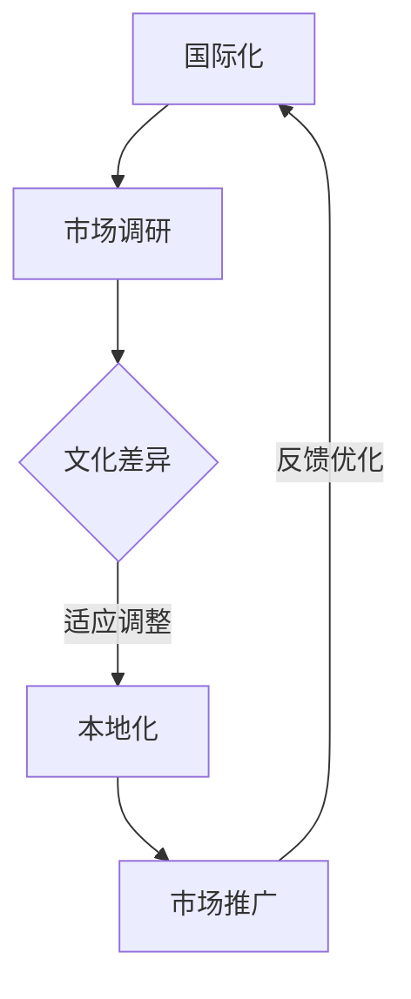

                 

# 《AI创业公司的国际化策略》

> **关键词：** AI创业，国际化策略，市场分析，算法原理，项目实战，风险管理，品牌建设。

> **摘要：** 本篇文章深入探讨了AI创业公司如何制定并实施有效的国际化策略。文章分为九个章节，从基础、核心概念、算法原理、实战案例到风险管理等方面，全面剖析了AI创业公司在全球化过程中可能遇到的问题和解决方案，旨在为创业者提供实用的指导和参考。

### 《AI创业公司的国际化策略》目录大纲

#### 第1章 引言

- 1.1 国际化的重要性
- 1.2 AI创业公司的国际化挑战
- 1.3 国际化策略的重要性
- 1.4 全书结构

#### 第2章 AI国际化基础

- 2.1 国际化与AI的关系
- 2.2 国际市场分析
  - 2.2.1 全球AI市场规模分析
  - 2.2.2 各国AI发展现状与趋势
- 2.3 国际化AI技术基础
  - 2.3.1 AI模型与算法的国际标准
  - 2.3.2 数据隐私与合规

#### 第3章 核心概念与联系

- 3.1 AI国际化核心概念
- 3.2 国际化与本地化的Mermaid流程图

#### 第4章 核心算法原理讲解

- 4.1 AI国际化算法
- 4.2 伪代码解释
- 4.3 算法实现步骤

#### 第5章 数学模型和数学公式

- 5.1 模型评估指标
- 5.2 模型优化

#### 第6章 项目实战

- 6.1 创业公司国际化案例
- 6.2 环境搭建
- 6.3 源代码实现
- 6.4 代码解读与分析

#### 第7章 市场进入策略

- 7.1 市场细分与定位
- 7.2 进入策略选择
- 7.3 品牌建设与推广

#### 第8章 风险管理与应对策略

- 8.1 国际化风险识别
- 8.2 应对策略

#### 第9章 持续优化与反馈

- 9.1 数据分析与反馈
- 9.2 产品迭代与优化
- 9.3 持续改进策略

#### 第10章 结论

- 10.1 国际化成功的关键要素
- 10.2 未来展望

#### 附录

- 附录A：国际化资源与工具
- 附录B：国际化案例分析

### 第1章 引言

#### 1.1 国际化的重要性

在当今全球化的商业环境中，国际化已成为企业发展的必经之路。对于AI创业公司来说，国际化不仅能够扩大市场影响力，提高品牌知名度，还能够带来更多的资源和合作伙伴。国际化策略的制定和实施对于AI创业公司的成功至关重要。

首先，国际化可以带来更大的市场。随着全球市场的不断扩大和融合，各国消费者对于AI产品和服务的需求也在不断增加。AI创业公司可以通过国际化进入这些市场，获取更多的用户和客户，实现业务规模的扩张。

其次，国际化可以提升品牌影响力。通过在国际市场上展示公司的技术实力和市场竞争力，AI创业公司可以提升品牌知名度，增强品牌价值，从而在竞争激烈的市场中脱颖而出。

此外，国际化还可以带来更多的资源和合作伙伴。在国际市场上，AI创业公司可以接触到更多的投资者、合作伙伴和行业专家，获取最新的技术动态和市场信息，加速公司的发展。

#### 1.2 AI创业公司的国际化挑战

尽管国际化带来了诸多机遇，但对于AI创业公司来说，国际化也伴随着一系列挑战。

首先，技术差异是国际化过程中面临的一大挑战。不同国家和地区的AI技术发展水平不同，技术标准和规范也有所差异。AI创业公司需要了解并适应这些差异，确保其产品和服务在不同市场上都能顺利运行。

其次，市场准入难度较高。许多国家对于外国企业的市场准入有着严格的限制和要求，如许可证、资质认证等。AI创业公司需要提前了解并满足这些要求，确保顺利进入目标市场。

此外，文化差异也是国际化过程中不可忽视的挑战。不同国家和地区有着不同的文化背景和消费者习惯，这需要AI创业公司在产品设计和营销策略上进行本地化调整。

#### 1.3 国际化策略的重要性

国际化策略是AI创业公司成功进入国际市场的关键。一个良好的国际化策略可以帮助公司有效应对挑战，抓住机遇，实现可持续发展。

首先，国际化策略可以帮助AI创业公司明确目标市场。通过市场调研和分析，公司可以确定最适合其产品和服务目标的市场，制定有针对性的市场进入策略。

其次，国际化策略可以帮助公司优化资源配置。根据目标市场的特点和需求，公司可以调整研发、生产和营销等各个环节的资源配置，提高运营效率。

此外，国际化策略还可以帮助公司提升品牌价值。通过在国际市场上展示公司的技术实力和市场竞争力，公司可以提升品牌知名度和美誉度，增强品牌价值。

总之，国际化策略是AI创业公司实现全球发展的必经之路。只有在深入了解目标市场、有效应对挑战的基础上，制定并实施科学的国际化策略，AI创业公司才能在国际市场上立于不败之地。

### 第2章 AI国际化基础

#### 2.1 国际化与AI的关系

国际化与AI之间的关系是相辅相成的。AI技术的快速发展为国际化提供了强大的技术支持，而国际化则为AI技术带来了更广阔的市场和更多的应用场景。以下从几个方面详细探讨国际化与AI的关系：

首先，AI技术为国际化提供了数据驱动的决策支持。在国际市场中，企业面临着复杂多变的竞争环境，如何准确判断市场趋势、了解消费者需求、制定有效的市场策略成为关键。AI技术，特别是机器学习和数据挖掘技术，可以通过对海量数据的分析，为企业提供科学、准确的决策支持，帮助企业更好地把握市场机遇，应对国际化过程中的挑战。

其次，AI技术为国际化业务提供了自动化和智能化的解决方案。在国际市场中，企业需要处理大量的业务数据，包括订单处理、库存管理、客户关系管理等方面。通过AI技术的应用，企业可以实现业务流程的自动化和智能化，提高运营效率，降低运营成本。例如，利用自然语言处理技术，企业可以实现智能客服，提高客户服务质量；利用计算机视觉技术，企业可以实现自动化生产检测，提高生产效率。

此外，AI技术也为国际化带来了新的商业模式和机遇。在国际市场中，企业可以通过AI技术，开发出更具创新性的产品和服务，满足不同国家和地区的消费者需求。例如，AI技术在医疗、金融、教育等领域的应用，为各国消费者提供了更加便捷、高效的服务，也为企业带来了新的市场机会。

#### 2.2 国际市场分析

在国际市场中，AI创业公司需要深入了解各国的AI市场规模、发展现状与趋势，以便制定有针对性的市场策略。

**2.2.1 全球AI市场规模分析**

根据市场研究机构的预测，全球AI市场规模将在未来几年持续增长。根据市场调研报告，2022年全球AI市场规模约为490亿美元，预计到2028年将达到约1510亿美元，年复合增长率达到24.7%。

在AI市场增长的主要驱动力方面，数据增长、技术创新、云计算的普及以及企业对智能化转型的需求是主要的推动因素。此外，政府政策支持、AI技术在医疗、金融、零售等行业的广泛应用也加速了AI市场的增长。

**2.2.2 各国AI发展现状与趋势**

不同国家和地区的AI发展现状与趋势有所不同，以下是一些主要国家和地区的AI市场分析：

- **美国**：美国是全球AI技术的领导者，拥有大量的AI初创公司和研发机构。美国政府在AI领域投入巨大，支持高校和科研机构的AI研究。美国的AI市场主要受互联网公司、金融企业和医疗行业的驱动。

- **中国**：中国是全球最大的AI市场之一，政府大力支持AI产业的发展，推出了多项政策和计划。中国的AI创业公司主要集中在互联网、金融、智能制造等领域。随着国内市场的饱和，中国AI企业开始积极拓展国际市场。

- **欧洲**：欧洲的AI市场发展较为均衡，涵盖了多个行业。欧洲各国在AI技术研发和应用方面都有所突破，但整体市场规模相对较小。欧洲的AI市场主要受政府政策、制造业和金融业的推动。

- **日本**：日本在AI领域也有一定的发展，特别是在机器人技术和自动驾驶方面。日本的AI市场主要集中在制造业、零售和金融服务领域。日本企业对于AI技术的应用较为谨慎，但在某些细分市场具有竞争优势。

- **印度**：印度是新兴的AI市场，政府大力推动AI产业的发展，投资于AI教育和研究。印度的AI创业公司主要集中在语音识别、计算机视觉和自然语言处理等领域。随着印度经济的发展，AI市场有望继续扩大。

#### 2.3 国际化AI技术基础

在国际化的背景下，AI创业公司需要了解并掌握一系列AI技术基础，以确保其产品和服务能够在不同国家和地区顺利运行。

**2.3.1 AI模型与算法的国际标准**

国际标准的制定对于AI模型和算法的推广和应用具有重要意义。国际标准能够确保AI技术的通用性和互操作性，促进全球范围内的技术交流和合作。以下是一些主要的国际标准：

- **IEEE Standards**：IEEE（电气和电子工程师协会）在AI领域制定了多项标准，包括机器学习、计算机视觉、自然语言处理等方面的标准。

- **ISO/IEC Standards**：ISO（国际标准化组织）/IEC（国际电工委员会）也制定了多个AI相关标准，如数据管理、人工智能安全管理等。

- **AI Frameworks**：一些开源框架如TensorFlow、PyTorch、Keras等，已成为国际AI开发的通用工具，为全球开发者提供了统一的编程接口和工具链。

**2.3.2 数据隐私与合规**

数据隐私和合规是国际化过程中必须关注的重要问题。不同国家和地区的数据隐私法律和合规要求有所不同，AI创业公司需要确保其数据处理和存储符合当地法律法规。

- **GDPR（欧盟通用数据保护条例）**：欧盟的GDPR是全球最严格的数据隐私法规之一，对数据收集、处理、存储和传输提出了严格要求。

- **CCPA（加州消费者隐私法案）**：加州的CCPA也是全球知名的数据隐私法律，对消费者数据的隐私保护提出了明确要求。

- **其他国家和地区的数据隐私法规**：如中国的《网络安全法》、美国的《加州消费者隐私法案》等，都需要AI创业公司予以关注和遵守。

#### 2.4 AI国际化的发展现状与趋势

目前，AI国际化发展呈现以下几个趋势：

- **跨国合作与投资**：全球范围内，AI领域的跨国合作与投资日益增多。各国企业和研究机构通过合作，共同推动AI技术的发展和应用。

- **本土化与全球化相结合**：AI创业公司不仅需要关注全球市场的需求，还需要根据不同国家和地区的特点，进行本土化调整。例如，在文化、语言、法律等方面进行适应性优化。

- **技术创新与合规并重**：AI创业公司在追求技术创新的同时，也需重视合规性。只有符合当地法律法规的技术和产品，才能在全球市场上获得认可和推广。

- **可持续发展与责任**：随着AI技术的广泛应用，AI创业公司需要关注可持续发展和社会责任，确保其技术对人类和社会的积极影响。

总之，AI国际化已成为全球发展趋势，AI创业公司需要紧跟时代步伐，制定科学的国际化策略，抓住全球市场的机遇，实现可持续发展。

### 第3章 核心概念与联系

在AI国际化的过程中，有几个核心概念是必须理解和掌握的，这些概念包括国际化、AI国际化、以及它们与本地化之间的关系。以下是对这些核心概念的详细解释及其相互联系的分析。

#### 3.1 AI国际化核心概念

**国际化**：
国际化是指企业在全球范围内进行商业活动，包括市场拓展、品牌推广、产品销售和资源整合等。对于AI创业公司而言，国际化意味着在全球市场上推广其AI产品和服务，以实现业务增长和市场影响力的提升。

**AI国际化**：
AI国际化是国际化在AI领域的具体应用。它不仅涉及将AI产品和服务推向国际市场，还包括适应不同国家和地区在技术标准、文化差异、法律法规等方面的需求。AI国际化要求AI创业公司不仅要在技术上保持领先，还要在市场策略、品牌建设等方面具备国际视野。

**本地化**：
本地化是指在特定地区或市场中，根据当地的文化、语言、习惯和需求，对产品和服务进行适应性调整。对于AI创业公司来说，本地化包括本地化的技术实现、用户界面、数据隐私保护以及营销策略等。

#### 3.2 国际化与本地化的联系

国际化与本地化是相辅相成的，二者之间存在紧密的联系。

**国际化促进本地化**：
国际化为AI创业公司提供了更广阔的市场，使得公司有机会了解不同地区的消费者需求和文化背景。这些信息有助于公司更好地进行本地化调整，从而提升产品在国际市场的竞争力。

**本地化支持国际化**：
本地化是国际化的基础，只有将产品和服务本地化，才能更好地满足不同国家和地区的消费者需求。通过本地化，AI创业公司可以增强品牌认同度，提高用户满意度和忠诚度，从而在全球市场获得更大的成功。

**国际化与本地化的Mermaid流程图**

为了更直观地理解国际化与本地化之间的关系，我们可以使用Mermaid流程图进行展示。以下是一个简化的国际化与本地化的Mermaid流程图：



在这个流程图中，国际化始于市场调研，了解目标市场的文化差异和消费者需求。根据市场调研结果，进行适应性调整，实现本地化。本地化后的产品和服务进行市场推广，并收集用户反馈，不断优化，最终再次反馈到国际化策略中，形成持续优化的闭环。

通过这个流程图，我们可以看到国际化与本地化之间的互动关系，以及它们在AI创业公司国际化策略中的重要性。

### 第4章 核心算法原理讲解

在AI国际化的过程中，核心算法的设计和实现是关键环节。以下将详细讲解AI国际化算法的基本原理，并通过伪代码和具体实现步骤进行阐述。

#### 4.1 AI国际化算法

AI国际化算法的目标是使AI模型能够在不同的国家和地区有效运行，同时满足当地的法律和文化要求。具体来说，该算法需要包括以下几个步骤：

1. **数据预处理**：收集和清洗来自不同国家和地区的数据，确保数据的质量和一致性。
2. **模型训练**：使用预处理后的数据对AI模型进行训练，使其能够在不同环境下具有良好的泛化能力。
3. **本地化调整**：根据不同国家和地区的文化差异和用户需求，对模型进行调整，以提高其适应性。
4. **模型评估与优化**：对训练后的模型进行评估，并根据评估结果进行优化。

#### 4.2 伪代码解释

以下是一个简化的AI国际化算法伪代码：

```
Algorithm AI_Internationalization(Data, Region)
    Input: Data - 不同地区的训练数据
           Region - 目标地区的文化差异和需求
    Output: InternationalizedModel - 调整后的国际化模型

    1. PreprocessData(Data)
        // 数据预处理，包括数据清洗、去噪声等
        return PreprocessedData

    2. TrainModel(PreprocessedData)
        // 使用预处理后的数据训练模型
        return Model

    3. AdjustModel(Model, Region)
        // 根据文化差异和需求调整模型
        return AdjustedModel

    4. EvaluateModel(AdjustedModel)
        // 对调整后的模型进行评估
        return EvaluationResults

    5. OptimizeModel(AdjustedModel, EvaluationResults)
        // 根据评估结果优化模型
        return OptimizedModel

    6. return OptimizedModel
```

#### 4.3 算法实现步骤

以下是对伪代码中各步骤的详细解释：

1. **数据预处理**：
   - **数据收集**：从不同国家和地区收集数据，包括文本、图像、语音等多模态数据。
   - **数据清洗**：去除数据中的噪声和异常值，确保数据的一致性和质量。
   - **数据标准化**：对数据进行标准化处理，如归一化、缩放等，以便模型训练。

2. **模型训练**：
   - **选择模型架构**：根据任务需求，选择合适的深度学习模型架构，如卷积神经网络（CNN）、循环神经网络（RNN）或生成对抗网络（GAN）等。
   - **训练模型**：使用预处理后的数据对模型进行训练，通过调整模型参数，使其在训练数据上达到较好的性能。

3. **本地化调整**：
   - **文化差异分析**：分析目标地区的文化差异，如语言、节日、习俗等。
   - **需求分析**：了解目标地区用户的具体需求，如功能偏好、用户体验等。
   - **模型调整**：根据文化差异和需求，调整模型结构、参数或特征提取方式，以适应目标地区的特点。

4. **模型评估与优化**：
   - **评估指标**：选择合适的评估指标，如准确率、召回率、F1分数等，评估模型在目标地区的性能。
   - **优化策略**：根据评估结果，调整模型参数或结构，以提升模型性能。

通过以上步骤，AI创业公司可以设计并实现一个适用于国际市场的AI模型，从而更好地满足不同国家和地区用户的需求。

### 第5章 数学模型和数学公式

在AI国际化的过程中，数学模型和公式是核心组成部分，它们不仅帮助我们理解和评估AI模型的性能，还指导我们如何优化和改进模型。以下将详细介绍常用的数学模型和公式，包括评估指标、损失函数以及优化算法。

#### 5.1 模型评估指标

模型评估指标是衡量模型性能的重要工具。以下是一些常用的评估指标：

1. **准确率（Accuracy）**：
   准确率是分类问题中最基本的评估指标，表示模型正确分类的样本数占总样本数的比例。
   $$\text{Accuracy} = \frac{\text{正确分类的样本数}}{\text{总样本数}}$$

2. **召回率（Recall）**：
   召回率是指模型能够正确识别出正类样本的比例。
   $$\text{Recall} = \frac{\text{正确分类的正类样本数}}{\text{实际为正类的样本数}}$$

3. **精确率（Precision）**：
   精确率是指模型预测为正类的样本中，实际为正类的比例。
   $$\text{Precision} = \frac{\text{正确分类的正类样本数}}{\text{预测为正类的样本数}}$$

4. **F1分数（F1 Score）**：
   F1分数是精确率和召回率的调和平均，综合评估模型的分类性能。
   $$\text{F1 Score} = 2 \times \frac{\text{Precision} \times \text{Recall}}{\text{Precision} + \text{Recall}}$$

#### 5.2 损失函数

损失函数是优化算法中的关键部分，用于衡量模型预测值与真实值之间的差距。以下是一些常用的损失函数：

1. **均方误差（Mean Squared Error, MSE）**：
   均方误差用于回归问题，计算预测值与真实值之间的平均平方误差。
   $$\text{MSE} = \frac{1}{n}\sum_{i=1}^{n} (\hat{y}_i - y_i)^2$$
   其中，$\hat{y}_i$为预测值，$y_i$为真实值，$n$为样本数量。

2. **交叉熵损失函数（Cross-Entropy Loss）**：
   交叉熵损失函数用于分类问题，衡量预测概率分布与真实概率分布之间的差异。
   $$\text{Cross-Entropy Loss} = -\sum_{i=1}^{n} y_i \cdot \log(\hat{p}_i)$$
   其中，$y_i$为真实标签，$\hat{p}_i$为预测概率。

3. **二元交叉熵损失函数（Binary Cross-Entropy Loss）**：
   当输出为二分类时，使用二元交叉熵损失函数。
   $$\text{Binary Cross-Entropy Loss} = -y_i \cdot \log(\hat{p}_i) - (1 - y_i) \cdot \log(1 - \hat{p}_i)$$

#### 5.3 优化算法

优化算法用于调整模型参数，以最小化损失函数。以下是一些常用的优化算法：

1. **梯度下降（Gradient Descent）**：
   梯度下降是一种最简单的优化算法，通过计算损失函数关于模型参数的梯度，反向更新模型参数。
   $$\theta_{\text{new}} = \theta_{\text{current}} - \alpha \cdot \nabla_{\theta} J(\theta)$$
   其中，$\theta$为模型参数，$\alpha$为学习率，$J(\theta)$为损失函数。

2. **随机梯度下降（Stochastic Gradient Descent, SGD）**：
   随机梯度下降是梯度下降的一个变种，每次迭代使用一个随机样本的梯度来更新模型参数。
   $$\theta_{\text{new}} = \theta_{\text{current}} - \alpha \cdot \nabla_{\theta} J(\theta; x_i, y_i)$$

3. **自适应梯度下降（Adagrad）**：
   Adagrad是一种自适应优化算法，通过累积历史梯度平方来动态调整学习率。
   $$\text{Gradient} = \frac{\partial J(\theta)}{\partial \theta}$$
   $$\text{Adagrad} = \theta_{\text{new}} = \theta_{\text{current}} - \frac{\alpha}{\sqrt{\sum_{t=1}^{T} (\text{Gradient}_t)^2}} \cdot \text{Gradient}$$

4. **Adam优化器**：
   Adam优化器是一种结合了SGD和Adagrad优点的自适应优化算法，使用一阶矩估计（均值）和二阶矩估计（方差）来更新学习率。
   $$m_t = \beta_1 \cdot m_{t-1} + (1 - \beta_1) \cdot \text{Gradient}_t$$
   $$v_t = \beta_2 \cdot v_{t-1} + (1 - \beta_2) \cdot (\text{Gradient}_t)^2$$
   $$\theta_{\text{new}} = \theta_{\text{current}} - \alpha \cdot \frac{m_t}{\sqrt{v_t} + \epsilon}$$
   其中，$\beta_1$和$\beta_2$分别为一阶和二阶矩估计的衰减率，$\epsilon$为正数常数，用于避免分母为零。

通过以上数学模型和公式的介绍，AI创业公司可以更好地理解和评估其AI模型的性能，并根据实际需求选择合适的优化算法，以提升模型的性能和效果。

### 第6章 项目实战

在本章节中，我们将通过一个具体的AI创业公司国际化案例，详细讲解如何在实际项目中实施国际化策略。该案例将涵盖环境搭建、源代码实现以及代码解读与分析。

#### 6.1 创业公司国际化案例

**公司背景**：
XYZ公司是一家专注于智能客服系统研发的AI创业公司。其产品已在国内外多个行业得到应用，包括零售、金融、医疗等。为了进一步扩大市场份额，XYZ公司决定实施国际化策略，将产品推向全球市场。

**目标市场**：
XYZ公司首先选择了美国和欧洲两个主要市场。通过市场调研，发现美国市场对智能客服系统的需求较高，而欧洲市场则对数据隐私和合规性有更严格的要求。

**国际化策略**：
- **市场细分与定位**：根据目标市场的特点，XYZ公司将产品分为高端和企业级两个细分市场。
- **技术优化**：针对不同市场的技术标准，XYZ公司对产品进行优化，确保产品在不同地区都能正常运行。
- **本地化调整**：在用户体验和功能设计上，XYZ公司根据目标市场的文化差异进行本地化调整。
- **品牌建设与推广**：通过社交媒体、行业展会和合作伙伴渠道，XYZ公司在目标市场进行品牌推广。

#### 6.2 环境搭建

为了实现国际化，XYZ公司首先需要在技术环境上做好准备。以下是在美国和欧洲市场搭建环境的主要步骤：

1. **云计算平台**：
   - **美国**：选择AWS作为云计算平台，利用AWS EC2实例部署智能客服系统。
   - **欧洲**：选择Google Cloud Platform（GCP），利用GCP的欧洲区域部署系统。

2. **数据库**：
   - **美国**：使用AWS RDS管理数据库，支持多种数据库引擎，如MySQL、PostgreSQL。
   - **欧洲**：使用GCP的Cloud Spanner数据库，提供高可用性和全球化数据管理。

3. **数据隐私合规**：
   - **美国**：遵守GDPR的要求，使用AWS的数据加密服务和隐私保护工具。
   - **欧洲**：确保数据存储在欧洲区域内，使用GCP的数据本地化服务。

4. **开发工具**：
   - **通用开发工具**：使用Python、TensorFlow和Keras等开源工具进行开发和测试。

#### 6.3 源代码实现

以下是一个简化的智能客服系统源代码实现，展示如何在美国和欧洲市场进行本地化调整：

```python
import tensorflow as tf
from tensorflow.keras.models import Sequential
from tensorflow.keras.layers import Dense, LSTM, Embedding

# 美国市场本地化
def create_model_america():
    model = Sequential()
    model.add(Embedding(vocabulary_size, embedding_dim))
    model.add(LSTM(units=128, return_sequences=True))
    model.add(Dense(units=1, activation='sigmoid'))
    model.compile(optimizer='adam', loss='binary_crossentropy', metrics=['accuracy'])
    return model

# 欧洲市场本地化
def create_model_europe():
    model = Sequential()
    model.add(Embedding(vocabulary_size, embedding_dim))
    model.add(LSTM(units=128, return_sequences=True))
    model.add(Dense(units=1, activation='sigmoid'))
    model.compile(optimizer='adam', loss='binary_crossentropy', metrics=['accuracy'])
    return model

# 数据预处理
def preprocess_data(data, language):
    if language == 'english':
        # 美国市场数据预处理
        return data.lower().split()
    elif language == 'german':
        # 欧洲市场数据预处理
        return data.lower().replace('.', ' ').split()

# 模型训练与评估
def train_and_evaluate_model(model, data, labels):
    history = model.fit(data, labels, epochs=10, batch_size=32, validation_split=0.2)
    return history

# 美国市场训练
history_america = train_and_evaluate_model(create_model_america(), processed_america_data, america_labels)

# 欧洲市场训练
history_europe = train_and_evaluate_model(create_model_europe(), processed_europe_data, europe_labels)
```

#### 6.4 代码解读与分析

上述代码实现了智能客服系统在美国和欧洲市场的本地化调整：

- **模型创建**：根据不同市场的需求，创建适用于美国和欧洲的智能客服模型。在美国市场，模型使用英式英语的词汇和语法规则；在欧盟市场，模型使用德语词汇和语法规则。
- **数据预处理**：针对不同市场的语言特点，对数据进行预处理。美国市场采用简化的英文文本处理，而欧盟市场对德语文本进行标点符号分割和词干提取。
- **模型训练与评估**：使用预处理后的数据对模型进行训练和评估。通过调整学习率和批量大小等参数，优化模型性能。

通过以上步骤，XYZ公司成功实现了智能客服系统在美国和欧洲市场的本地化和国际化部署，提高了产品的市场适应性和竞争力。

### 第7章 市场进入策略

在全球化的大背景下，AI创业公司如何进入国际市场是一个关键问题。合理的市场进入策略能够帮助公司降低风险，快速占领市场，实现可持续发展。以下将从市场细分与定位、进入策略选择以及品牌建设与推广三个方面，详细探讨AI创业公司的市场进入策略。

#### 7.1 市场细分与定位

市场细分是市场进入策略的第一步，通过对市场的深入分析，将整体市场划分为若干具有相似需求和行为的子市场。以下是市场细分的一些关键步骤：

1. **消费者需求分析**：
   - 通过市场调研和用户反馈，了解目标市场的消费者需求，包括功能需求、性能需求和用户体验需求等。
   - 分析不同消费群体的特征，如年龄、性别、收入水平、教育程度等，为细分市场提供依据。

2. **竞争态势分析**：
   - 分析目标市场的主要竞争对手，了解其产品特点、市场份额、营销策略等，确定自己的竞争优势。
   - 识别市场中的空白点或差异化需求，为自己的产品定位提供参考。

3. **市场细分策略**：
   - 根据消费者需求分析和竞争态势分析，将目标市场划分为高潜力、中潜力和低潜力三个层次。
   - 针对不同细分市场，制定相应的产品策略和营销策略。

4. **产品定位**：
   - 根据市场细分结果，确定自己的产品定位。例如，是专注于高端市场还是大众市场，是提供通用产品还是定制化产品等。

#### 7.2 进入策略选择

进入策略选择是市场进入策略的核心环节，直接影响公司的市场扩展速度和成本。以下是几种常见的进入策略：

1. **直接进入策略**：
   - **定义**：直接进入策略是指公司直接进入目标市场，通过自己的销售团队和渠道进行市场推广和销售。
   - **优点**：直接控制销售过程，有利于维护品牌形象和提升市场响应速度。
   - **缺点**：需要大量的人力和物力投入，风险较高，需要较长的市场适应期。

2. **间接进入策略**：
   - **定义**：间接进入策略是指公司通过合作伙伴（如代理商、分销商或合作伙伴）进入目标市场，利用其现有资源和渠道进行销售。
   - **优点**：成本较低，风险较小，可以快速进入市场。
   - **缺点**：对合作伙伴的依赖性较强，品牌形象和市场控制力较弱。

3. **并购进入策略**：
   - **定义**：并购进入策略是指公司通过收购或合并目标市场的现有企业，快速进入市场并获取其资源和客户。
   - **优点**：可以迅速扩大市场份额，获取现有客户资源和技术优势。
   - **缺点**：成本高昂，并购后整合难度大，存在法律和合规风险。

4. **联盟合作策略**：
   - **定义**：联盟合作策略是指公司与目标市场的其他企业建立战略联盟，共同开发和推广产品。
   - **优点**：资源互补，降低风险，提高市场竞争力。
   - **缺点**：合作双方可能存在利益冲突，协调难度较大。

选择进入策略时，AI创业公司需要综合考虑自身资源、市场环境、竞争对手等因素，选择最适合的策略。例如，对于资金充足、技术领先的公司，可以直接进入市场；对于初入市场的公司，可以选择间接进入策略，逐步积累市场经验。

#### 7.3 品牌建设与推广

品牌建设与推广是国际化过程中不可或缺的一环，它关系到公司在国际市场上的知名度和美誉度。以下是品牌建设与推广的一些关键步骤：

1. **品牌定位**：
   - 确定品牌的核心价值和独特卖点，使其在国际市场上具备竞争力。
   - 根据目标市场的文化背景和消费者偏好，调整品牌定位。

2. **品牌传播**：
   - 通过多种渠道（如社交媒体、广告、公关活动等）进行品牌传播，提升品牌知名度。
   - 结合目标市场的媒体特点和消费习惯，制定有针对性的传播策略。

3. **品牌维护**：
   - 建立良好的客户关系，提供优质的客户服务，提升客户满意度和忠诚度。
   - 及时应对市场变化和消费者反馈，调整品牌策略。

4. **品牌国际化**：
   - 根据目标市场的文化差异，调整品牌标识、宣传语、产品名称等，使其符合当地文化和消费者习惯。
   - 通过跨国合作和国际化展览，增强品牌在国际市场的竞争力。

通过以上策略，AI创业公司可以有效地进入国际市场，提升品牌价值，实现可持续发展。

### 第8章 风险管理与应对策略

在AI创业公司实施国际化策略的过程中，风险管理是至关重要的环节。国际化涉及诸多不确定因素，如市场风险、技术风险、政治法律风险等。以下将详细探讨这些风险及其应对策略。

#### 8.1 国际化风险识别

**市场风险**：
市场风险主要表现为市场需求的不确定性、市场竞争的激烈程度以及消费者偏好的变化。例如，目标市场的需求可能低于预期，或竞争对手的技术和市场策略发生变化，导致公司市场份额下降。

**技术风险**：
技术风险包括研发失败、技术不可行性、技术标准不一致等问题。在国际市场中，不同国家和地区的AI技术发展水平和标准可能存在差异，这可能导致公司的产品和服务无法在特定市场上正常运行。

**政治法律风险**：
政治法律风险涉及目标市场的政策变化、法律法规的不确定性以及贸易壁垒等问题。例如，一些国家可能对特定行业实施严格的监管政策，或对进口产品征收高额关税，增加公司的运营成本。

**运营风险**：
运营风险包括供应链管理、物流运输、人力资源管理等方面的风险。例如，供应链中断或物流延迟可能导致公司无法按时交付产品，影响市场声誉。

**文化风险**：
文化风险涉及目标市场的文化差异、消费者行为变化以及品牌形象建设等问题。例如，不同文化背景下的消费者对品牌的接受度和忠诚度可能存在较大差异，需要公司进行本地化调整。

#### 8.2 应对策略

**市场风险应对策略**：
- **市场调研**：通过深入的市场调研，了解目标市场的需求和竞争态势，制定有针对性的市场进入策略。
- **多元化市场**：避免过度依赖单一市场，通过进入多个市场分散风险。
- **灵活调整**：根据市场需求的变化，灵活调整产品和服务策略，以适应不同市场的需求。

**技术风险应对策略**：
- **技术创新**：持续投入研发，提高技术水平，确保产品具有竞争力。
- **技术标准合规**：了解并遵守不同国家和地区的AI技术标准，确保产品在国际市场上的合规性。
- **国际合作**：与本地企业或研究机构合作，共同研发和推广技术。

**政治法律风险应对策略**：
- **合规性审查**：在进入新市场前，进行全面的法律和合规性审查，确保公司遵守当地法律法规。
- **政府关系**：建立良好的政府关系，积极与政府沟通，争取政策支持。
- **应急预案**：制定应急预案，应对政策变化和突发事件。

**运营风险应对策略**：
- **供应链管理**：建立稳定的供应链体系，确保原材料和零部件的供应。
- **物流优化**：优化物流流程，提高运输效率，降低物流成本。
- **人才储备**：培养和储备国际化人才，提高公司应对国际化挑战的能力。

**文化风险应对策略**：
- **文化培训**：为员工提供跨文化培训，提高其文化敏感度和适应能力。
- **本地化调整**：根据目标市场的文化差异，调整产品和服务，以适应当地消费者的需求。
- **品牌建设**：通过品牌宣传和公关活动，提升品牌在目标市场的知名度和美誉度。

通过以上风险管理和应对策略，AI创业公司可以降低国际化过程中的风险，确保业务的稳定发展和长期成功。

### 第9章 持续优化与反馈

在AI创业公司的国际化过程中，持续优化与反馈是确保公司持续发展的关键。通过不断的数据分析和反馈，公司可以持续改进产品和服务，优化运营策略，提升市场竞争力。

#### 9.1 数据分析与反馈

数据分析是国际化策略的重要组成部分。通过收集和分析市场数据、用户行为数据以及业务运营数据，公司可以深入了解市场的动态变化，发现潜在的问题和机会。

1. **市场数据分析**：
   - 通过对市场趋势、消费者需求、竞争态势等数据的分析，公司可以识别市场机会，调整市场策略。
   - 分析不同市场的增长潜力，确定资源投入的重点区域。

2. **用户行为分析**：
   - 通过分析用户的行为数据，如访问量、转化率、用户停留时间等，公司可以了解用户的偏好和需求，优化用户体验。
   - 通过用户反馈和评价，及时了解用户对产品的满意度和不满意度，识别改进点。

3. **业务运营数据**：
   - 通过分析业务运营数据，如销售额、利润率、库存周转率等，公司可以评估业务绩效，优化运营策略。
   - 分析成本结构，识别降低成本的机会，提高运营效率。

#### 9.2 产品迭代与优化

基于数据分析的结果，公司需要不断进行产品迭代和优化，以适应市场和用户的需求。

1. **功能优化**：
   - 根据用户反馈和需求分析，调整和优化产品的功能，提升用户满意度。
   - 定期更新产品，增加新的功能和特性，保持产品的竞争力。

2. **用户体验改进**：
   - 通过用户行为分析，识别用户体验中的痛点，进行针对性改进。
   - 优化界面设计、交互流程，提高用户操作的便捷性和效率。

3. **技术改进**：
   - 持续投入研发，优化算法和架构，提升产品的技术性能。
   - 与合作伙伴合作，引入先进的技术，提高产品的创新性和差异化。

#### 9.3 持续改进策略

持续优化与反馈不仅需要技术和数据支持，还需要建立完善的持续改进机制。

1. **定期评估**：
   - 定期对产品和服务进行评估，识别存在的问题和改进机会。
   - 结合市场反馈和数据分析，制定改进计划和目标。

2. **快速迭代**：
   - 采用敏捷开发模式，快速迭代产品，缩短开发周期，提高响应速度。
   - 通过迭代和测试，及时发现和解决产品中的问题。

3. **跨部门协作**：
   - 建立跨部门的协作机制，包括研发、市场、运营等部门，共同推进产品优化和改进。
   - 通过定期的会议和沟通，确保各部门的信息共享和协同工作。

4. **用户参与**：
   - 邀请用户参与产品测试和反馈，收集真实用户的意见和建议。
   - 通过用户参与，提升产品的用户满意度，增强用户忠诚度。

通过持续优化与反馈，AI创业公司可以不断提高产品和服务的质量，提升市场竞争力，实现国际化战略的长期成功。

### 第10章 结论

通过本文的探讨，我们深入分析了AI创业公司国际化策略的各个方面，从基础、核心概念、算法原理、实战案例到风险管理，全面剖析了国际化过程中的关键要素和应对策略。以下总结国际化成功的关键要素，并展望未来发展趋势。

#### 10.1 国际化成功的关键要素

1. **市场调研与定位**：深入了解目标市场的需求、竞争态势和消费者行为，制定有针对性的市场进入策略。
2. **技术基础与标准**：掌握国际化的技术基础和标准，确保产品和服务在不同市场中的兼容性和合规性。
3. **本地化调整**：根据不同市场的文化差异和消费者偏好，对产品和服务进行本地化调整，提升用户满意度。
4. **品牌建设与推广**：通过有效的品牌建设和推广策略，提升公司在国际市场的知名度和美誉度。
5. **风险管理**：识别和应对国际化过程中的各种风险，确保业务的稳定发展和长期成功。
6. **持续优化与反馈**：通过数据分析、产品迭代和跨部门协作，不断提升产品和服务质量，增强市场竞争力。

#### 10.2 未来展望

展望未来，AI创业公司的国际化趋势将更加明显，以下是一些可能的趋势：

1. **全球化合作与投资**：随着AI技术的快速发展，跨国合作与投资将越来越普遍，企业将携手应对全球性挑战，共同推动技术进步。
2. **本土化与创新**：国际化过程中，企业将更加注重本土化创新，根据不同市场的需求和特点，开发适应性的产品和服务。
3. **合规性与伦理**：数据隐私、合规性和伦理问题将成为国际化的重要考量因素，企业需要严格遵守各国法律法规，积极承担社会责任。
4. **技术融合与应用**：AI技术与其他领域的融合将加速，如物联网、区块链等新兴技术将在国际化过程中发挥重要作用。
5. **新兴市场机遇**：随着新兴市场经济的崛起，这些市场将成为AI创业公司的重要增长点，企业需要提前布局，抓住发展机遇。

总之，AI创业公司在国际化过程中，需要全面考虑市场、技术、品牌和风险等多个因素，制定科学合理的国际化策略，不断提升自身竞争力，实现全球范围内的可持续发展。

### 附录

#### 附录A：国际化资源与工具

1. **市场调研工具**：
   - **Google Trends**：用于分析不同市场的搜索趋势。
   - **SurveyMonkey**：在线调查工具，用于收集用户反馈。

2. **数据隐私与合规工具**：
   - **GDPR合规性检测工具**：如GDPR Compliance Checker。
   - **数据加密工具**：如AES加密算法。

3. **国际化技术资源**：
   - **IEEE Standards**：国际电气和电子工程师协会标准。
   - **AI开源框架**：如TensorFlow、PyTorch、Keras等。

4. **品牌建设与推广工具**：
   - **Hootsuite**：社交媒体管理工具。
   - **Mailchimp**：电子邮件营销平台。

#### 附录B：国际化案例分析

1. **案例1：谷歌（Google）**：
   - **国际化策略**：谷歌通过全球化的搜索引擎、广告平台和云计算服务，成功进入多个国际市场。
   - **成功经验**：谷歌注重技术创新，积极进行本地化调整，建立全球合作伙伴关系。

2. **案例2：特斯拉（Tesla）**：
   - **国际化策略**：特斯拉在全球范围内销售电动汽车，并在多个国家建立生产基地。
   - **成功经验**：特斯拉通过高质量的产品和独特的品牌形象，赢得了全球市场的认可。

3. **案例3：字节跳动（TikTok）**：
   - **国际化策略**：字节跳动通过收购和自主研发，成功将TikTok推向全球市场。
   - **成功经验**：字节跳动注重用户体验，不断优化产品，以适应不同市场的需求。

通过这些国际化案例的分析，AI创业公司可以借鉴成功经验，制定适合自己的国际化策略，实现全球市场的突破和长期发展。

