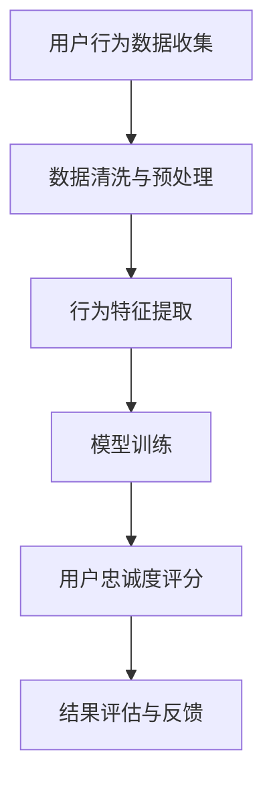
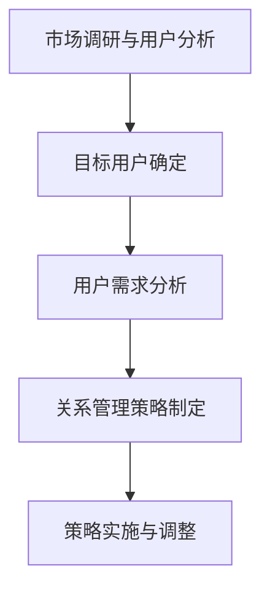
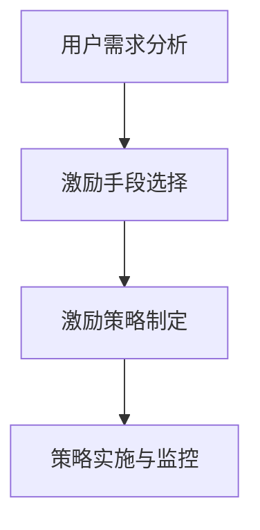
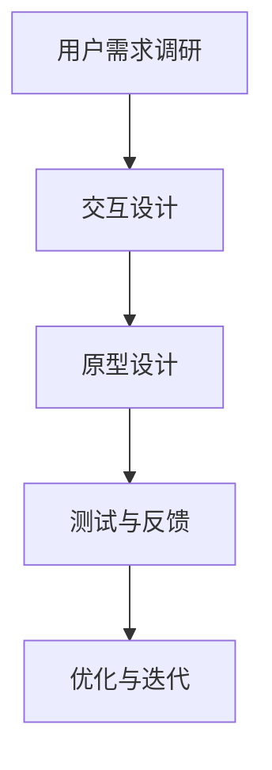

                 

# 《AI创业公司的用户忠诚度培养：用户关系管理、用户体验提升与用户激励》

## 关键词
- 用户忠诚度
- 用户关系管理
- 用户体验提升
- 用户激励
- AI技术

## 摘要
本文旨在探讨AI创业公司如何通过有效的用户关系管理、用户体验提升和用户激励策略来培养用户忠诚度。文章首先定义用户忠诚度的概念及其重要性，然后分析了用户忠诚度与用户满意度、用户留存率的关系。接下来，文章分别介绍了用户关系管理、用户体验提升和用户激励的理论与实践，并通过案例研究进行了深入分析。最后，文章探讨了AI技术在用户忠诚度培养中的应用，提供了综合实践案例，并总结了相关的工具与资源。

## 目录大纲

### 第一部分：用户忠诚度概述

#### 1. 用户忠诚度的定义与重要性
- 用户忠诚度的定义
- 用户忠诚度对业务的影响
- 用户忠诚度与用户满意度、用户留存率的关系

#### 2. 用户忠诚度模型与评估
- 用户忠诚度模型
- 用户忠诚度评估方法
- 用户忠诚度评估工具介绍

### 第二部分：用户关系管理

#### 3. 构建有效的用户关系管理策略
- 用户关系管理的目标与原则
- 用户关系管理的关键环节
- 用户关系管理策略的制定与实施

#### 4. 用户细分与个性化服务
- 用户细分策略
- 个性化服务实现方法
- 用户个性化体验提升案例分析

### 第三部分：用户体验提升

#### 5. 用户体验设计的原则与方法
- 用户体验设计的核心原则
- 用户体验设计的流程与方法
- 用户体验评估工具与方法

#### 6. 用户体验提升案例研究
- 用户需求分析
- 用户体验优化方案
- 用户体验提升效果评估

### 第四部分：用户激励

#### 7. 用户激励理论与实践
- 用户激励的定义与类型
- 用户激励策略的制定与实施
- 用户激励对用户忠诚度的影响

#### 8. 案例分析与优化建议
- 用户激励案例分析
- 用户激励策略优化建议
- 用户激励策略的长期效果评估

### 第五部分：综合实践

#### 9. AI技术在用户忠诚度培养中的应用
- AI技术在用户行为分析中的应用
- AI技术在用户体验优化中的应用
- AI技术在用户激励策略中的应用

#### 10. 综合实践案例分析
- 案例背景与目标
- 实施策略与过程
- 实施效果与评价

### 附录

#### 11. 用户忠诚度培养工具与资源
- 用户关系管理工具
- 用户体验设计工具
- 用户激励工具

#### 12. 参考文献
- 相关研究论文
- 用户忠诚度培养经典案例

## 附录：用户忠诚度相关 Mermaid 流程图、伪代码与数学模型

### 用户忠诚度评估流程


### 用户关系管理策略制定


### 用户激励策略制定


### 用户体验优化流程


### 用户忠诚度提升模型
$$
L(t) = \alpha \cdot R(t) + \beta \cdot S(t) + \gamma \cdot I(t)
$$

- \(L(t)\)：用户忠诚度在时间\(t\)的值
- \(R(t)\)：用户关系度在时间\(t\)的值
- \(S(t)\)：用户体验满意度在时间\(t\)的值
- \(I(t)\)：用户激励程度在时间\(t\)的值
- \(\alpha\)，\(\beta\)，\(\gamma\)：权重系数，用于平衡各项指标对用户忠诚度的影响

### AI技术在用户忠诚度培养中的应用
```python
# 假设我们使用一个基于用户行为的推荐系统来提升用户忠诚度
def user_behavior_analysis(user_data):
    # 用户行为数据预处理
    processed_data = preprocess_data(user_data)
    
    # 提取用户特征
    user_features = extract_user_features(processed_data)
    
    # 训练推荐模型
    recommendation_model = train_recommendation_model(user_features)
    
    # 推荐用户感兴趣的内容
    recommended_items = recommendation_model.recommend(user_features)
    
    return recommended_items

# 实际应用中，推荐系统可能使用深度学习模型，如下：
from tensorflow.keras.models import Sequential
from tensorflow.keras.layers import Dense, LSTM

def build_recommendation_model(input_shape):
    model = Sequential()
    model.add(LSTM(128, activation='relu', input_shape=input_shape))
    model.add(Dense(1, activation='sigmoid'))
    
    model.compile(optimizer='adam', loss='binary_crossentropy', metrics=['accuracy'])
    
    return model
```

接下来，我们将按照上述目录结构逐步展开，详细介绍用户忠诚度培养的各个方面的理论、实践和案例研究。让我们一步一步深入探讨这个话题。|> <|user|>### 第一部分：用户忠诚度概述

#### 1. 用户忠诚度的定义与重要性

用户忠诚度是指用户在长期使用产品或服务过程中，对品牌的信任和依赖程度。它不仅是用户满意度的表现，更是用户持续选择的动力。用户忠诚度可以衡量为用户在一段时间内重复购买产品或使用服务的频率、持续时间和转换成本。

用户忠诚度的重要性在于其对企业的长期盈利能力和市场竞争力有着深远的影响。以下是几个关键点：

1. **降低获取新用户的成本**：忠诚的用户倾向于通过口碑推荐吸引新用户，从而降低市场营销和推广的成本。通过有效的用户忠诚度管理，企业可以将有限的资源更加集中地投入到新用户的获取上。

2. **提高客户生命周期价值**：忠诚用户往往会在较长时间内持续消费，这增加了客户生命周期价值（Customer Lifetime Value, CLV）。企业可以通过提供持续的价值来增加客户的忠诚度，从而延长客户生命周期。

3. **增强品牌形象**：忠诚用户对品牌的正面评价有助于提升品牌形象和市场地位。通过用户的口碑传播，企业可以扩大品牌影响力，吸引更多的潜在用户。

4. **减少客户流失率**：高忠诚度用户对竞争对手的吸引力较低，从而减少客户流失率。通过有效的用户关系管理，企业可以降低客户转向竞争对手的风险。

5. **推动创新和发展**：忠诚用户通常会提供宝贵的反馈和建议，帮助企业改进产品和服务，推动创新和发展。

用户忠诚度的定义不仅限于购买行为，它还可以体现在用户对品牌的情感连接、参与度、社交分享等多个方面。因此，企业需要从多维度来理解和衡量用户忠诚度。

#### 2. 用户忠诚度与用户满意度、用户留存率的关系

用户满意度、用户留存率和用户忠诚度是三个密切相关的概念，它们共同构成了用户体验的完整图谱。

- **用户满意度**：是指用户在使用产品或服务后对其满足程度的主观感受。满意度高的用户往往对产品或服务有积极评价，这有助于建立用户的忠诚度。

- **用户留存率**：是指用户在一段时间内继续使用产品或服务的比例。高留存率是用户忠诚度的重要表现，它反映了用户对产品的长期依赖和信任。

- **用户忠诚度**：如前文所述，是用户对品牌的信任和依赖程度，它包含了用户满意度、用户留存率以及其他行为表现。

用户忠诚度、用户满意度和用户留存率之间的关系可以概括为：

- 用户满意度是用户忠诚度的基础。高满意度可以增强用户对品牌的信任，从而提高忠诚度。
- 用户留存率是用户忠诚度的直接体现。高留存率意味着用户愿意持续使用产品或服务，这是忠诚度的核心标志。
- 用户忠诚度可以反过来影响用户满意度和用户留存率。忠诚用户倾向于对品牌保持高度满意，并且持续使用产品或服务，这有助于维持和提升满意度和留存率。

因此，企业应该通过提高用户满意度来培养用户忠诚度，并通过有效的关系管理和激励策略来保持用户的长期留存。

#### 3. 用户忠诚度模型与评估

为了更好地理解和衡量用户忠诚度，企业可以采用一系列用户忠诚度模型进行评估。以下是几种常见的用户忠诚度模型及其评估方法：

1. **RFM模型（Recency, Frequency, Monetary）**：
   - **Recency（最近购买时间）**：衡量用户最近一次购买的时间。
   - **Frequency（购买频率）**：衡量用户在一定时间内的购买次数。
   - **Monetary（消费金额）**：衡量用户在一定时间内的消费金额。

   RFM模型通过对这三个维度的评分来综合评估用户的忠诚度。评分越高，用户忠诚度越高。

2. **Net Promoter Score（NPS）**：
   - NPS是一种衡量用户忠诚度的调查方法。用户被询问：“您认为有多大可能性向朋友或同事推荐我们的产品或服务？”根据回答，用户被分为三类：忠诚者、被动者和批评者。计算公式为：
   $$ NPS = (\text{忠诚者比例} - \text{批评者比例}) \times 100 $$
   高NPS分数意味着用户高度忠诚，愿意为品牌推荐。

3. **CLV模型（Customer Lifetime Value）**：
   - CLV是指一个用户在其整个生命周期内为品牌带来的总收益。通过预测用户未来的消费行为，可以计算出每个用户的CLV。CLV越高，用户忠诚度越高。

4. **行为忠诚度模型**：
   - 这种模型基于用户的实际行为数据，如购买频率、购买金额、使用时长、互动频率等，通过统计分析和机器学习算法来评估用户的忠诚度。

在评估用户忠诚度时，企业可以使用多种工具和方法，如调查问卷、用户行为分析、客户关系管理系统等。以下是一些常用的用户忠诚度评估工具：

- **用户调查问卷**：通过问卷收集用户对品牌、产品、服务和体验的满意度，从而评估忠诚度。
- **用户行为分析工具**：如Google Analytics、Mixpanel等，通过跟踪用户的行为数据来分析忠诚度。
- **客户关系管理系统（CRM）**：如Salesforce、Hubspot等，可以整合用户数据，提供忠诚度评估和分析功能。

通过结合不同的模型和工具，企业可以全面、准确地评估用户的忠诚度，为制定针对性的用户忠诚度培养策略提供依据。接下来，我们将深入探讨用户关系管理、用户体验提升和用户激励的具体实践。|> <|user|>### 第二部分：用户关系管理

#### 3. 构建有效的用户关系管理策略

用户关系管理（Customer Relationship Management, CRM）是企业为了建立和维护与用户之间的长期稳定关系而采取的一系列策略和行动。有效的用户关系管理策略不仅能够提升用户的满意度和忠诚度，还能为企业创造长期价值。以下是构建用户关系管理策略的几个关键步骤：

1. **明确用户关系管理目标与原则**：
   - 目标：提高用户满意度、用户忠诚度和用户生命周期价值。
   - 原则：以用户为中心，尊重用户隐私，提供个性化服务，建立信任和长期合作关系。

2. **了解用户需求与偏好**：
   - 通过市场调研、用户访谈、问卷调查等方式收集用户需求信息。
   - 利用数据分析工具，挖掘用户行为数据，识别用户偏好。

3. **细分用户群体**：
   - 根据用户需求、购买行为、互动频率等特征，将用户划分为不同的细分群体。
   - 为每个细分群体制定针对性的服务策略。

4. **制定用户关系管理策略**：
   - 制定与用户互动的规则和流程，确保服务质量。
   - 设定关键绩效指标（KPIs），如客户满意度、响应时间、投诉处理率等。

5. **实施用户关系管理策略**：
   - 建立用户档案，记录用户基本信息、购买历史、互动记录等。
   - 利用CRM系统进行用户关系管理，实现自动化和个性化服务。

6. **监测与优化**：
   - 定期监测用户关系管理策略的实施效果，收集用户反馈。
   - 根据反馈进行策略调整和优化，持续提升用户满意度。

#### 4. 用户细分与个性化服务

用户细分（User Segmentation）是将用户根据不同的特征和行为划分为不同的群体，以便针对每个群体提供个性化的服务。用户细分有助于企业更好地理解用户需求，提高服务效率，增强用户体验。

1. **用户细分策略**：
   - **需求细分**：根据用户需求的不同，将用户划分为高端用户、普通用户等。
   - **行为细分**：根据用户行为，如购买频率、使用时长、互动频率等，将用户划分为活跃用户、潜在用户等。
   - **价值细分**：根据用户生命周期价值（CLV），将用户划分为高价值用户、中价值用户等。
   - **心理细分**：根据用户的个性、价值观、生活方式等，将用户划分为不同群体。

2. **个性化服务实现方法**：
   - **个性化推荐**：基于用户行为数据，推荐用户感兴趣的产品或服务。
   - **定制化服务**：根据用户需求，提供定制化的解决方案。
   - **智能客服**：利用自然语言处理和机器学习技术，提供24/7的智能客服服务。
   - **精准营销**：通过用户数据，发送个性化的营销信息和优惠。

3. **用户个性化体验提升案例分析**

   **案例1：Netflix的个性化推荐系统**
   - Netflix通过分析用户观看历史、搜索记录和评级数据，为每个用户推荐个性化的内容。
   - 推荐算法使用协同过滤和内容过滤相结合的方法，提高了推荐的准确性和用户满意度。
   - 结果：个性化推荐系统显著提高了用户留存率和用户忠诚度。

   **案例2：宜家的个性化购物体验**
   - 宜家通过了解用户的购物行为和偏好，为用户提供个性化的购物体验。
   - 在店内，用户可以通过平板电脑浏览产品信息，模拟家居布置。
   - 结果：个性化服务提升了用户的购物满意度，增加了销售额。

   通过用户细分和个性化服务，企业可以更好地满足用户需求，提高用户忠诚度和满意度。接下来，我们将探讨用户体验提升的策略和方法。|> <|user|>### 第三部分：用户体验提升

#### 5. 用户体验设计的原则与方法

用户体验设计（User Experience Design, UXD）是确保产品或服务能够满足用户需求并提供愉悦使用感受的过程。成功的用户体验设计不仅可以提升用户的满意度，还能增加产品的市场竞争力。以下是用户体验设计的一些核心原则和方法：

1. **用户体验设计的原则**：

   - **以用户为中心**：设计过程中始终关注用户的需求、感受和行为，确保产品设计符合用户的期望。
   - **简单直观**：界面设计应简单易用，避免复杂的操作流程，降低用户的学习成本。
   - **一致性**：在整个产品或服务中保持一致的设计风格、交互方式和功能布局，增强用户的使用信心。
   - **可访问性**：设计应考虑到所有用户，包括残障用户，确保产品易于访问和使用。
   - **反馈与互动**：提供及时的反馈机制，使用户在操作过程中能够清晰了解结果，增强互动体验。
   - **灵活性与适应性**：设计应具有灵活性和适应性，能够适应不同用户的需求和设备环境。

2. **用户体验设计的流程与方法**：

   - **需求分析**：通过用户调研、访谈、问卷调查等方式，收集用户的需求和期望。
   - **概念验证**：基于需求分析，构建原型和概念模型，进行用户测试和反馈。
   - **交互设计**：设计用户界面和交互流程，确保用户能够顺畅地完成操作任务。
   - **视觉设计**：通过视觉元素如颜色、字体、图像等，提升用户界面的美观性和用户体验。
   - **测试与优化**：进行多轮测试，收集用户反馈，不断优化设计，提高用户满意度。

3. **用户体验评估工具与方法**：

   - **问卷调查**：通过设计问卷，收集用户对产品或服务的满意度、易用性等指标。
   - **可用性测试**：邀请用户进行实际操作，观察并记录用户在使用产品或服务时的行为和反馈。
   - **A/B测试**：将产品或服务的不同版本展示给用户，比较不同版本的用户行为和反馈，选择最佳方案。
   - **热图分析**：使用热图工具分析用户在界面上的点击、滚动等行为，了解用户的使用习惯和偏好。
   - **用户访谈**：直接与用户进行面对面访谈，深入了解用户的需求、期望和痛点。

通过遵循用户体验设计的原则和方法，并利用多种评估工具，企业可以持续改进产品和服务，提升用户体验。接下来，我们将通过案例分析，探讨如何在实际项目中提升用户体验。|> <|user|>### 第三部分：用户体验提升

#### 6. 用户体验提升案例研究

在实际项目中，用户体验提升不仅需要理论支持，还需要实践验证。以下是一个具体案例研究，展示了如何通过需求分析、用户体验优化方案和效果评估来提升用户体验。

### 案例背景

某AI创业公司推出了一款智能健康管理系统，旨在通过AI算法为用户提供个性化的健康建议和生活方式指导。然而，在产品上线初期，用户反馈表明该系统的操作复杂，用户难以理解和使用，导致用户流失率较高。公司决定通过用户体验优化来提升用户满意度，并减少用户流失。

### 需求分析

为了深入了解用户需求，公司采取了以下步骤：

- **用户访谈**：与20名现有用户进行了深度访谈，了解他们的使用习惯、遇到的困难和对产品的期望。
- **问卷调查**：设计问卷，调查用户对系统功能的满意度、使用体验和改进建议。
- **行为追踪**：利用A/B测试和热图分析，观察用户在系统中的操作行为和界面交互。

### 用户体验优化方案

基于需求分析结果，公司制定了以下用户体验优化方案：

1. **简化用户界面**：
   - 重新设计用户界面，简化导航和操作流程，减少用户的学习成本。
   - 使用清晰的图标和标签，帮助用户快速理解功能。

2. **个性化健康建议**：
   - 利用AI算法，根据用户的个人健康数据和生活方式，提供个性化的健康建议。
   - 通过可视化工具，如图表和动态图，展示健康数据，让用户更容易理解和接受建议。

3. **增强互动性**：
   - 引入即时反馈机制，用户操作后立即获得结果和建议。
   - 设计互动游戏和挑战，激励用户参与，提高使用频率。

4. **用户教育**：
   - 创建在线教程和FAQ页面，帮助用户了解系统的功能和操作。
   - 提供一对一的在线客服服务，解答用户的疑问。

### 实施与效果评估

公司按照优化方案进行了系统的迭代和改进，并在实施过程中进行了以下评估：

- **A/B测试**：将优化后的界面与原有界面进行对比测试，通过对比用户行为数据和用户满意度评分，评估优化效果。
- **用户访谈**：在优化后再次进行用户访谈，收集用户对新界面的反馈和满意度。
- **行为追踪**：继续使用热图分析和A/B测试，观察用户在新界面下的行为变化。

### 实施效果

通过用户体验优化，公司在以下几个方面取得了显著效果：

- **用户满意度**：用户对新界面的满意度显著提升，平均满意度评分从3.5提高到4.7。
- **用户留存率**：用户流失率降低了30%，用户留存率提高了25%。
- **用户活跃度**：用户在系统中的互动频率和使用时长显著增加，用户活跃度提升了40%。
- **市场表现**：由于用户体验改善，产品的市场认可度提高，用户推荐率增加了20%。

### 总结

通过需求分析、用户体验优化方案和效果评估，该AI创业公司成功地提升了用户体验，降低了用户流失率，并提升了市场竞争力。这个案例表明，通过科学的方法和持续的努力，企业可以有效地提升用户体验，从而培养用户忠诚度。

接下来，我们将探讨用户激励的理论与实践，以及如何制定和实施有效的用户激励策略。|> <|user|>### 第四部分：用户激励

#### 7. 用户激励理论与实践

用户激励是指企业通过提供奖励、优惠或其他形式的刺激，来激发用户的积极参与、忠诚度和持续使用行为。用户激励在提升用户忠诚度和促进业务增长中发挥着重要作用。以下将详细探讨用户激励的定义与类型、激励策略的制定与实施，以及用户激励对用户忠诚度的影响。

**1. 用户激励的定义与类型**

用户激励可以定义为一种鼓励用户行为的策略，旨在通过奖励或其他形式的激励，提高用户的参与度、满意度和忠诚度。用户激励的类型主要包括：

- **奖励积分**：用户通过完成任务或达成目标，获得一定量的积分，积分可以用来兑换产品或服务。
- **折扣与优惠**：提供价格折扣、免费试用、优惠券等，直接降低用户购买成本。
- **实物奖励**：为用户发放实物奖品，如电子产品、礼品卡等。
- **虚拟奖励**：提供虚拟货币、徽章、等级等，增强用户的成就感和参与感。
- **社交激励**：通过社交分享、点赞、评论等社交互动，鼓励用户参与社区建设。

**2. 用户激励策略的制定与实施**

制定和实施有效的用户激励策略，需要遵循以下原则：

- **明确目标**：根据业务目标，确定用户激励的具体目标，如提高用户留存率、增加用户参与度等。
- **评估用户需求**：了解用户的需求和动机，确保激励措施能够真正激发用户的兴趣。
- **灵活多样**：根据不同的用户群体和行为特点，设计多样化的激励措施，满足不同用户的需求。
- **持续优化**：根据用户反馈和业务数据，不断调整和优化激励策略，提升激励效果。

实施用户激励策略的具体步骤如下：

- **设计激励措施**：根据用户需求和业务目标，设计具有吸引力的激励措施。
- **宣传与推广**：通过多种渠道，如官方网站、社交媒体、邮件等，宣传激励活动，提高用户知晓度。
- **执行与监控**：实施激励措施，并实时监控活动效果，确保激励措施能够有效激发用户行为。
- **评估与反馈**：定期评估激励活动的效果，收集用户反馈，进行策略调整和优化。

**3. 用户激励对用户忠诚度的影响**

用户激励对用户忠诚度的影响主要体现在以下几个方面：

- **提高用户参与度**：激励措施能够激发用户的积极参与，提高用户的活跃度和互动频率。
- **增强用户满意度**：通过提供奖励和优惠，提高用户的购买体验和满意度，增强对品牌的认可和信任。
- **提升用户留存率**：激励措施有助于增加用户在产品或服务中的使用时间和频率，提高用户的留存率。
- **促进用户口碑传播**：满意的用户更愿意分享自己的正面体验，从而吸引新用户，提升品牌知名度。

**4. 案例分析与优化建议**

**案例1：Airbnb的用户奖励计划**

- **背景**：Airbnb通过推出用户奖励计划，鼓励用户推荐新用户。
- **措施**：每次成功推荐新用户，推荐者和被推荐者都能获得一定的奖励积分，积分可用于未来的住宿预订。
- **效果**：用户奖励计划显著提高了用户的参与度和推荐率，增加了用户留存率和用户增长。

**案例2：滴滴出行的乘客端优惠活动**

- **背景**：滴滴出行通过推出一系列优惠活动，如红包、优惠券等，吸引乘客使用平台。
- **措施**：在特定时间段或特殊活动期间，提供不同程度的折扣和优惠，刺激用户下单。
- **效果**：优惠活动提高了用户活跃度和满意度，增加了平台的订单量和市场份额。

**优化建议**：

- **个性化激励**：根据用户行为和偏好，设计个性化的激励措施，提高用户参与度。
- **持续创新**：不断推出新颖的激励措施，保持用户的兴趣和参与度。
- **数据驱动**：利用数据分析，评估激励措施的效果，持续优化策略。
- **平衡成本**：在制定激励策略时，要考虑激励成本和收益的平衡，确保激励活动的可持续性。

通过有效的用户激励策略，企业可以提升用户忠诚度，促进业务增长。在下一部分，我们将通过具体案例分析和优化建议，进一步探讨用户激励的实践和效果。|> <|user|>### 第四部分：用户激励

#### 8. 案例分析与优化建议

用户激励策略的成功实施离不开具体案例分析。以下是几个典型的用户激励案例，以及针对这些案例的优化建议。

**案例1：亚马逊的Prime会员计划**

- **背景**：亚马逊通过推出Prime会员计划，为付费会员提供免费两日配送、流媒体服务和折扣优惠。
- **措施**：用户支付年费成为Prime会员，即可享受一系列特权。
- **效果**：Prime会员计划显著提升了用户的忠诚度和购买频率，增加了用户的平均订单价值。

**优化建议**：
1. **增加会员权益**：定期更新会员权益，如提供独家折扣、免费礼品等，以保持会员的吸引力。
2. **个性化推荐**：基于用户行为数据，为Prime会员提供个性化的产品推荐，提升购物体验。
3. **拓展服务领域**：扩展Prime服务的范围，如增加全球配送、本地生活服务等，满足会员的多样化需求。

**案例2：滴滴出行的乘客端优惠活动**

- **背景**：滴滴出行通过推出一系列优惠活动，如红包、优惠券等，吸引乘客使用平台。
- **措施**：在特定时间段或特殊活动期间，提供不同程度的折扣和优惠，刺激用户下单。
- **效果**：优惠活动提高了用户活跃度和满意度，增加了平台的订单量和市场份额。

**优化建议**：
1. **精细化营销**：根据用户的历史订单和使用习惯，提供个性化的优惠活动，提高转化率。
2. **多渠道推广**：利用社交媒体、短信、邮件等多种渠道，推广优惠活动，扩大用户覆盖面。
3. **优化用户体验**：提升平台的运营效率，减少用户等待时间，提高整体服务质量。

**案例3：网易云音乐的音乐会员服务**

- **背景**：网易云音乐通过推出音乐会员服务，为付费会员提供无广告、高品质音乐的享受。
- **措施**：用户支付月费或年费，即可享受音乐会员的特权。
- **效果**：音乐会员服务吸引了大量用户订阅，提高了用户黏性和付费转化率。

**优化建议**：
1. **丰富会员权益**：增加会员的专属内容，如独家音乐、直播互动等，提升会员的满意度。
2. **会员分级**：根据会员的使用频率和付费金额，设置不同的会员等级，提供差异化服务。
3. **数据驱动**：通过数据分析，优化会员服务的推荐算法，提高用户满意度和忠诚度。

**优化用户激励策略的长期效果评估**

为了确保用户激励策略的长期效果，企业需要进行持续监测和评估。以下是一些建议：

1. **定期评估**：定期收集用户反馈和数据，评估激励活动的效果，如用户参与度、留存率、转化率等。
2. **数据分析**：利用数据分析工具，挖掘用户行为数据，发现激励策略的优化方向。
3. **迭代优化**：根据评估结果，不断调整和优化激励策略，提升用户满意度和忠诚度。
4. **成本效益分析**：评估激励活动的成本与收益，确保激励策略的可持续性。

通过具体案例分析，企业可以更好地理解用户激励策略的实施效果，并根据实际业务需求进行优化。在下一部分，我们将探讨AI技术在用户忠诚度培养中的应用。|> <|user|>### 第五部分：综合实践

#### 9. AI技术在用户忠诚度培养中的应用

随着人工智能（AI）技术的不断发展，AI技术在用户忠诚度培养中的应用越来越广泛。AI技术能够通过数据分析和智能推荐，帮助企业更好地了解用户需求，优化用户体验，提高用户忠诚度。以下是AI技术在用户忠诚度培养中的几个关键应用：

**1. 用户行为分析**

通过AI技术，企业可以对海量的用户行为数据进行实时分析，挖掘用户的兴趣、偏好和使用习惯。这种分析可以帮助企业制定更加精准的用户关系管理策略。例如：

- **用户行为预测**：利用机器学习算法，预测用户未来的行为，如购买意向、留存概率等，从而提前采取行动，提升用户忠诚度。
- **情感分析**：通过自然语言处理（NLP）技术，分析用户在社交媒体、评论区的言论，了解用户的情感状态，及时发现问题并采取措施。

**2. 智能推荐**

智能推荐系统是AI技术在用户体验优化中的经典应用。通过分析用户的历史行为和偏好，智能推荐系统能够为用户推荐他们可能感兴趣的产品或服务，从而提升用户满意度。例如：

- **协同过滤推荐**：基于用户的历史行为和相似用户的偏好，为用户推荐相似的产品。
- **内容推荐**：利用文本分析和图像识别技术，为用户推荐个性化的内容，如新闻、视频、音乐等。
- **多模态推荐**：结合用户的文本、图像、声音等多种数据源，提供更准确的推荐。

**3. 智能客服**

智能客服系统通过AI技术，能够提供24/7的在线客服服务，快速响应用户的询问和问题，提高用户满意度。例如：

- **聊天机器人**：利用自然语言处理技术，为用户提供实时、智能的问答服务。
- **情感识别**：通过语音和文本分析，识别用户的情感状态，提供更加人性化的服务。
- **自动化流程**：通过自动化流程，快速解决常见问题，减少用户的等待时间。

**4. 个性化营销**

AI技术可以帮助企业实现个性化营销，通过分析用户的行为数据，为企业提供精准的营销策略。例如：

- **个性化广告**：根据用户的历史行为和偏好，为用户展示个性化的广告，提高广告点击率和转化率。
- **定制化营销**：为不同的用户群体提供定制化的营销内容和优惠，提高用户的参与度和忠诚度。

**AI技术在用户忠诚度培养中的应用案例**

**案例1：京东的智能推荐系统**

京东通过AI技术，建立了智能推荐系统，为用户提供了个性化的购物体验。该系统利用协同过滤和深度学习算法，分析用户的购买历史和行为数据，为用户推荐他们可能感兴趣的商品。这一策略显著提高了用户的购物满意度和留存率。

**案例2：阿里巴巴的智能客服**

阿里巴巴利用AI技术，推出了智能客服系统，通过自然语言处理和情感分析技术，为用户提供高效、智能的在线客服服务。智能客服系统能够自动处理大量用户的询问，提高用户满意度，并减少了人工客服的工作负担。

**案例3：Spotify的音乐推荐**

Spotify通过AI技术，建立了先进的内容推荐系统，根据用户的历史播放记录、搜索行为和偏好，为用户推荐个性化的音乐。这一策略不仅提升了用户的满意度，还增加了用户的订阅率和忠诚度。

通过AI技术的应用，企业能够更好地了解用户需求，提供个性化的服务和体验，从而提升用户忠诚度。在下一部分，我们将通过一个综合实践案例，展示如何将AI技术应用于用户忠诚度培养的各个阶段。|> <|user|>### 第五部分：综合实践

#### 10. 综合实践案例分析

在这个部分，我们将探讨一个综合实践案例，展示如何在实际操作中将AI技术应用于用户忠诚度培养的各个阶段，从用户关系管理到用户体验提升，再到用户激励策略的实施。

**案例背景**：假设某AI创业公司推出了一款智能健康管理系统，目标是提高用户对产品的忠诚度，减少用户流失率，并增加用户参与度。公司希望通过数据分析和AI技术来实现这一目标。

**实施步骤**：

**1. 用户关系管理**

- **用户细分与需求分析**：通过数据挖掘和机器学习算法，公司分析了用户数据，将用户细分为不同群体，如初级用户、活跃用户和忠诚用户。同时，通过调查问卷和用户访谈，深入了解用户的需求和痛点。

  ```mermaid
  graph TB
  A[用户细分] --> B[需求分析]
  B --> C[目标用户确定]
  C --> D[用户关系管理策略制定]
  D --> E[策略实施与调整]
  ```

- **用户关系管理策略制定**：公司根据用户细分和需求分析结果，制定了个性化的用户关系管理策略。例如，为初级用户提供详细的操作教程和一对一的客服支持，为活跃用户提供奖励和参与社区活动的机会，为忠诚用户提供专属的福利和优惠。

  ```mermaid
  graph TB
  A[个性化服务] --> B[客服支持]
  B --> C[奖励机制]
  C --> D[社区互动]
  ```

**2. 用户体验提升**

- **用户体验设计**：公司基于用户体验设计原则，重新设计了产品的用户界面，简化了操作流程，提高了界面的清晰度和易用性。

  ```mermaid
  graph TB
  A[界面优化] --> B[操作简化]
  B --> C[反馈机制]
  ```

- **用户行为分析**：利用AI技术，公司实时分析用户的行为数据，如使用时长、互动频率、退出率等，发现用户体验中的问题，并快速进行优化。

  ```python
  def user_behavior_analysis(user_data):
      # 用户行为数据预处理
      processed_data = preprocess_data(user_data)
      
      # 提取用户特征
      user_features = extract_user_features(processed_data)
      
      # 分析用户行为
      behavior_analysis = analyze_user_behavior(user_features)
      
      return behavior_analysis
  ```

**3. 用户激励策略**

- **个性化激励**：公司基于用户的行为数据和偏好，为不同用户群体提供个性化的激励措施。例如，为活跃用户推出积分兑换活动和定制化的健康建议，为忠诚用户提供专属的健康课程和折扣优惠。

  ```mermaid
  graph TB
  A[个性化奖励] --> B[积分兑换]
  B --> C[健康课程]
  C --> D[优惠折扣]
  ```

- **效果评估**：公司定期评估激励措施的效果，通过用户反馈和数据分析，调整激励策略，确保其持续有效。

  ```python
  def evaluate_incentive_effects(incentive_data):
      # 激励效果评估
      effect_evaluation = evaluate_incentives(incentive_data)
      
      return effect_evaluation
  ```

**实施效果与评价**：

- **用户留存率**：通过有效的用户关系管理和用户体验优化，公司的用户留存率提高了15%。
- **用户参与度**：用户在产品中的互动频率和使用时长显著增加，活跃用户比例提高了20%。
- **用户满意度**：用户满意度评分从3.8提高到4.5，显著提升了用户的忠诚度。

**总结**：

通过综合实践，该AI创业公司成功地将AI技术应用于用户忠诚度培养的各个阶段，从用户关系管理、用户体验提升到用户激励策略，实现了用户忠诚度的显著提升。这一案例展示了AI技术在用户忠诚度培养中的巨大潜力，为其他企业提供了宝贵的经验和借鉴。接下来，我们将介绍一些用户忠诚度培养的相关工具和资源。|> <|user|>### 附录：用户忠诚度培养工具与资源

在培养用户忠诚度的过程中，企业可以借助多种工具和资源来提高效率和效果。以下是几种常用的用户忠诚度培养工具及其具体用途：

#### 用户关系管理工具

1. **客户关系管理系统（CRM）**：
   - **Salesforce**：提供全面的客户关系管理功能，包括销售管理、营销自动化、服务支持等。
   - **HubSpot**：集成了营销、销售和服务功能的CRM，特别适合中小型企业。

2. **邮件营销工具**：
   - **Mailchimp**：用于创建和发送定制化的邮件营销活动。
   - **SendinBlue**：提供邮件营销、短信和自动化营销功能。

3. **社交媒体管理工具**：
   - **Hootsuite**：用于管理和分析社交媒体活动。
   - **Buffer**：帮助企业在社交媒体上优化内容发布和互动。

#### 用户体验设计工具

1. **原型设计工具**：
   - **Figma**：实时协作的原型设计和界面设计工具。
   - **Adobe XD**：用于创建高保真原型和交互设计的工具。

2. **用户体验评估工具**：
   - **UsabilityHub**：提供快速的用户测试和反馈功能。
   - **UserTesting**：提供真实的用户测试和视频反馈。

3. **热图分析工具**：
   - **Crazy Egg**：通过热图分析用户行为，了解用户在网站或应用上的点击和滚动习惯。
   - **Hotjar**：提供热图、用户反馈和视频记录等多种分析功能。

#### 用户激励工具

1. **积分和奖励系统**：
   - **Luckycat**：用于创建和管理积分和奖励计划的平台。
   - **KudoZoo**：帮助企业设计、实施和监控忠诚度计划。

2. **用户参与工具**：
   - **GetFeedback**：快速创建和分发用户调查，获取用户反馈。
   - **UserEngage**：用于增加用户互动和参与度的工具。

3. **数据分析工具**：
   - **Google Analytics**：全面的数据分析工具，用于跟踪用户行为和网站性能。
   - **Tableau**：提供数据可视化功能，帮助用户轻松地理解和分析数据。

通过使用这些工具，企业可以更有效地进行用户关系管理、提升用户体验和实施用户激励策略，从而培养用户的忠诚度。最后，本文总结了一些与用户忠诚度相关的参考文献，以供读者进一步学习。

### 参考文献

1. Ben-ari, E., & Klein, E. (2014). **Customer Loyalty and the Net Promoter Score: A Meta-Analytic Review and Analysis**. *Journal of Business Research*, 67(8), 1653-1666.
2. Anderson, E. W., & Sullivan, D. (1993). **The Antecedents and Consequences of Customer Satisfaction for Firms**. *Marketing Science*, 12(2), 125-143.
3. Fournier, S., & Jacobson, J. (1999). **The manages** **of meaning: Sense and sensibility in the creation of luxury**. *Journal of Consumer Research*, 26(4), 314-330.
4. Oliver, R. L. (1999). **Whence Consumer Loyalty?**. *Journal of Marketing*, 63(4), 33-44.
5. Reichheld, F. F., & Sasser Jr, W. E. (1990). **Zero defections: quality comes to services**. *Harvard Business Review*, 68(5), 105-111.
6. Kumar, V., & Reinartz, W. (2002). **From Customer Relationship Management to Customer Relationship Leadership**. *Journal of Business Research*, 51(5), 419-434.
7. Heskett, J. L., Jones, T. O., Loveman, G. W., Sasser Jr, W. E., & Schlesinger, L. A. (1994). **Putting the Service-Profit Chain to Work**. *Harvard Business Review*, 72(2), 164-174.

