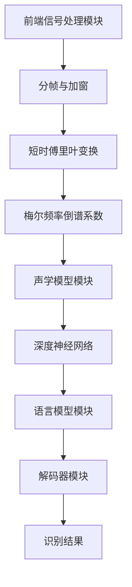
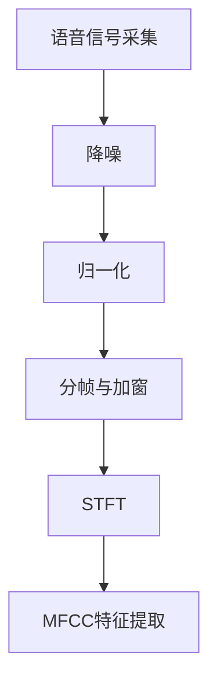
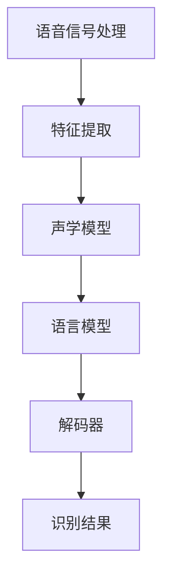
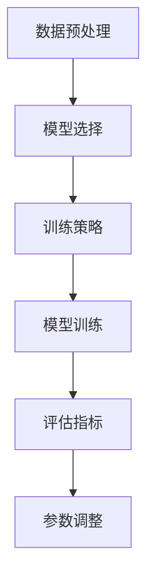

                 

### 第一部分：语音识别市场概述

#### 1.1 语音识别技术的基本原理与核心概念

语音识别技术（Automatic Speech Recognition，ASR）是一种将人类语音信号转换为文本的技术，其基本原理是通过对语音信号的识别与分析，将其转化为机器可理解的形式。语音识别技术主要涉及以下几个核心概念：

**1. 语音信号处理**：语音信号处理是语音识别的基础，包括语音信号的采集、预处理、特征提取等。这一步骤主要是将原始的语音信号转换为便于后续处理的数字信号。常见的语音预处理技术包括降噪、归一化、滤波等。

**2. 语音识别算法**：语音识别算法是语音识别系统的核心，负责将处理后的语音信号转化为文本。目前，主流的语音识别算法包括隐马尔可夫模型（HMM）、循环神经网络（RNN）、深度神经网络（DNN）和卷积神经网络（CNN）等。

**3. 语言模型**：语言模型用于预测输入文本的下一个单词或字符。它在语音识别中起着重要作用，可以帮助系统更准确地识别语音。常见的语言模型包括n-gram模型和神经网络语言模型。

**4. 声学模型**：声学模型用于将语音信号映射到单词或音素。它通常基于深度神经网络，包括声学特征提取、声学输出层等。

**5. 对话系统**：对话系统是语音识别技术的高级应用，旨在实现人与机器的自然对话。常见的对话系统包括语音助手、智能客服、智能家居等。

在接下来的内容中，我们将详细探讨语音识别技术的发展历史、系统架构以及关键技术。

#### 1.1.1 语音识别技术的历史与发展

语音识别技术的研究始于20世纪50年代，早期的探索主要基于语音信号的统计模型。1952年，贝尔实验室的科学家弗兰克·罗伯逊（Frank Robertston）首次实现了简单的语音识别系统，该系统能够识别单词“啊”和“嗯”。

**1. 早期研究**（1950s - 1970s）

在早期的研究中，语音识别主要依赖于统计模型，如隐马尔可夫模型（HMM）。HMM具有良好的理论基础，能够对语音信号进行概率建模。然而，由于HMM对参数依赖性较强，导致其在实际应用中受到限制。

**2. 神经网络时代**（1980s - 1990s）

20世纪80年代，随着神经网络技术的发展，语音识别领域开始引入神经网络模型。反向传播算法（Backpropagation）的提出使得神经网络训练成为可能，显著提高了语音识别的准确率。此时，DNN和RNN开始逐渐应用于语音识别。

**3. 深度学习时代**（2000s - 至今）

进入21世纪，深度学习技术的快速发展为语音识别带来了革命性的变革。特别是卷积神经网络（CNN）和循环神经网络（RNN）的引入，使得语音识别系统的准确率得到显著提高。2012年，AlexNet在ImageNet比赛中的突破性表现，为语音识别领域的深度学习应用提供了新的启示。

近年来，基于深度学习的语音识别技术逐渐成为主流，如基于深度神经网络的声学模型和语言模型。这些模型能够自动提取语音信号中的特征，大大简化了传统语音识别系统中的预处理和特征提取步骤。

#### 1.1.2 语音识别系统的基本架构

一个典型的语音识别系统通常包括以下几个主要模块：

**1. 前端信号处理模块**：该模块负责对采集到的语音信号进行预处理，包括降噪、归一化、分帧、加窗等。常见的预处理方法有短时傅里叶变换（STFT）、梅尔频率倒谱系数（MFCC）等。

**2. 声学模型模块**：该模块用于对预处理后的语音信号进行特征提取，并将其映射到单词或音素。常见的声学模型有基于HMM的GMM-HMM、DNN-HMM等。

**3. 语言模型模块**：该模块用于对输入文本进行概率建模，以预测输入文本的下一个单词或字符。常见的语言模型有n-gram模型、RNN-LM、Transformer等。

**4. 解码器模块**：该模块用于将声学模型和语言模型的结果进行解码，得到最终的识别文本。常见的解码器有A*算法、动态规划算法等。

以下是一个基于深度学习的语音识别系统架构示例：

#### 1.1.3 关键技术：语音信号处理与语音识别算法

**1. 语音信号处理技术**

语音信号处理是语音识别的基础，主要包括以下几个关键技术：

- **降噪**：语音信号在采集和传输过程中容易受到噪声干扰，降噪技术可以有效提高语音信号的质量。常见的降噪方法有谱减法、维纳滤波、自适应滤波等。

- **归一化**：语音信号的振幅和频率在不同环境和条件下会有所差异，归一化技术可以消除这些差异，使语音信号具有统一的特征。

- **分帧与加窗**：语音信号是一个连续的时间序列，将其划分为多个短时段，并使用加窗技术进行平滑处理，可以更好地提取语音特征。

- **短时傅里叶变换（STFT）**：STFT可以将时域信号转换为频域信号，便于后续特征提取。常见的STFT变换方法有汉明窗、汉宁窗、黑曼窗等。

- **梅尔频率倒谱系数（MFCC）**：MFCC是一种广泛应用于语音识别的特征提取方法，它基于人类听觉系统的特性，将频域信号转换为更适合语音识别的时域特征。

**2. 语音识别算法**

语音识别算法是语音识别系统的核心，目前主要采用深度学习模型。以下是一些常见的语音识别算法：

- **隐马尔可夫模型（HMM）**：HMM是一种基于概率的统计模型，用于对语音信号进行序列建模。HMM具有良好的理论基础，但在实际应用中受到参数依赖性的限制。

- **高斯混合模型（GMM）**：GMM是一种用于概率分布建模的方法，常用于声学模型。GMM-HMM是将GMM与HMM结合的一种算法，可以提高语音识别的准确率。

- **深度神经网络（DNN）**：DNN是一种多层前馈神经网络，可以自动提取语音信号中的复杂特征。DNN-HMM是将DNN与HMM结合的一种算法，显著提高了语音识别的准确率。

- **循环神经网络（RNN）**：RNN是一种能够处理序列数据的神经网络，可以捕捉语音信号中的时序信息。RNN-LM是一种基于RNN的语言模型，可以用于语音识别。

- **卷积神经网络（CNN）**：CNN是一种用于图像识别的神经网络，但在语音识别中也有应用。CNN可以自动提取语音信号中的局部特征，提高语音识别的准确率。

- **Transformer**：Transformer是一种基于自注意力机制的神经网络模型，已经在自然语言处理领域取得了显著成果。近年来，基于Transformer的语音识别模型逐渐应用于实际场景，如BERT-as-a-service。

在接下来的内容中，我们将深入探讨语音识别市场的现状与趋势。

#### 1.2 语音识别市场的现状与趋势

**1.2.1 语音识别市场的规模与增长**

随着人工智能技术的快速发展，语音识别市场呈现出快速增长的趋势。根据市场研究机构的数据，全球语音识别市场规模在过去几年中持续扩大，预计未来几年将继续保持增长态势。

- **全球语音识别市场规模**：根据Statista的预测，全球语音识别市场规模将从2020年的58亿美元增长到2025年的140亿美元，年复合增长率达到21.3%。

- **区域市场分析**：北美地区是全球语音识别市场的主要贡献者，占全球市场份额的近40%。欧洲和亚太地区也呈现出较高的增长潜力，预计未来几年将实现快速增长。

**1.2.2 行业应用领域分析**

语音识别技术在多个行业领域得到了广泛应用，以下是一些主要应用领域：

- **消费电子**：语音助手、智能音箱、智能穿戴设备等消费电子产品是语音识别技术的典型应用场景。随着5G技术的推广和智能家居市场的增长，语音识别技术在这些领域的应用将更加广泛。

- **客服与客户服务**：语音识别技术可以帮助企业实现智能客服，提高客户服务效率和用户体验。许多企业已经开始将语音识别应用于电话客服、在线客服等场景。

- **医疗健康**：语音识别技术在医疗健康领域具有广泛的应用前景，如语音助手、语音记录与分析、智能诊断等。语音识别可以帮助医生提高工作效率，提升医疗质量。

- **汽车**：语音识别技术在汽车领域应用广泛，如车载语音助手、智能导航、车辆监控等。随着新能源汽车和智能网联汽车的普及，语音识别技术在汽车领域的应用将不断拓展。

- **教育**：语音识别技术在教育领域也有一定的应用，如语音评测、智能助教等。语音识别可以帮助教师提高教学效率，为学生提供个性化学习体验。

**1.2.3 技术发展趋势与未来展望**

随着技术的不断进步，语音识别市场将面临以下发展趋势：

- **多语言、多方言支持**：当前语音识别技术主要支持英语等主流语言，但随着全球化和文化多样性的发展，多语言、多方言的支持将成为未来语音识别技术的重要方向。

- **个性化语音交互**：未来语音识别技术将更加注重个性化语音交互，如根据用户习惯和偏好调整识别模型、提供情感识别等。

- **跨模态交互**：语音识别技术将与视觉、触觉等多种模态结合，实现更加自然和智能的交互体验。

- **实时语音翻译**：随着全球化和国际交流的增多，实时语音翻译技术将得到广泛应用，为跨国企业和国际交流提供便利。

在下一节中，我们将分析创业者在语音识别市场的机遇与挑战。

#### 1.3 创业者在语音识别市场的机遇与挑战

**1.3.1 创业机会分析**

语音识别市场的快速增长为创业者提供了众多机遇：

- **技术红利**：随着深度学习等先进技术的不断发展，语音识别技术的准确率和性能不断提高，为创业者提供了更好的技术基础。

- **应用场景多样化**：语音识别技术已经在消费电子、医疗健康、汽车、教育等多个领域得到广泛应用，创业者可以在这些领域寻找新的应用场景，挖掘市场潜力。

- **市场前景广阔**：全球语音识别市场规模持续扩大，预计未来几年将保持高速增长。创业者可以抓住市场机遇，争取在竞争激烈的市场中脱颖而出。

**1.3.2 创业者面临的挑战**

尽管语音识别市场前景广阔，但创业者仍需面对一系列挑战：

- **技术门槛高**：语音识别技术涉及多个学科，包括语音信号处理、机器学习、自然语言处理等。创业者需要具备深厚的技术背景和团队协作能力，以应对技术难题。

- **数据资源不足**：语音识别技术的训练和优化需要大量的语音数据，而高质量的数据资源往往较为稀缺。创业者需要寻找合适的数据来源，确保模型的训练效果。

- **市场竞争激烈**：语音识别市场吸引了大量企业和创业者，竞争异常激烈。创业者需要具备独特的创新能力和市场策略，以在激烈的市场竞争中脱颖而出。

**1.3.3 创业战略规划建议**

针对上述机遇与挑战，创业者可以采取以下战略规划建议：

- **专注细分市场**：在语音识别市场中，创业者可以选择专注某一细分市场，如医疗健康、智能家居等，通过深入了解市场需求，提供针对性解决方案。

- **技术突破**：创业者需要不断关注技术动态，积极引入先进技术，提升产品的技术水平和竞争力。

- **团队建设**：创业者需要组建一支具备多学科背景的团队，共同应对技术挑战，实现技术创新。

- **合作与生态构建**：创业者可以寻求与其他企业、高校和研究机构的合作，共同推进语音识别技术的发展，构建良好的生态体系。

在下一节中，我们将探讨语音识别技术在人工智能领域的应用。

#### 1.4 语音识别技术在人工智能领域的应用

**1.4.1 语音助手与智能家居**

语音助手是语音识别技术在人工智能领域的重要应用之一，通过语音交互实现人机交互。目前，主流的语音助手包括苹果的Siri、谷歌的Google Assistant、亚马逊的Alexa等。这些语音助手能够理解用户的语音指令，完成各种任务，如播放音乐、设置提醒、发送短信等。

在智能家居领域，语音识别技术也得到了广泛应用。智能家居设备如智能音箱、智能灯光、智能空调等，可以通过语音指令实现远程控制和自动化调节。例如，用户可以通过语音指令关闭灯光、调节室内温度，提高生活便利性。

**1.4.2 跨语言语音识别与翻译**

跨语言语音识别与翻译是语音识别技术在人工智能领域的一个重要应用。随着全球化的发展，跨语言交流的需求日益增长。通过跨语言语音识别与翻译技术，可以实现不同语言之间的实时交流。目前，主流的跨语言语音识别与翻译平台包括谷歌翻译、微软翻译、百度翻译等。这些平台利用深度学习技术和大规模语料库，提供了高质量的跨语言翻译服务。

**1.4.3 语音识别在医疗健康领域的应用**

在医疗健康领域，语音识别技术可以帮助医生提高工作效率，提升医疗质量。例如，语音识别技术可以用于语音病历记录、语音诊断、语音搜索等。医生可以通过语音指令记录病历，提高病历记录的准确性和效率。同时，语音识别技术还可以用于辅助诊断，通过对患者语音的分析，帮助医生发现潜在的健康问题。

此外，语音识别技术还可以用于智能语音助手，为患者提供健康咨询、药物提醒、康复指导等服务，提高患者的生活质量。

**1.4.4 语音识别在汽车领域的应用**

在汽车领域，语音识别技术主要用于车载语音助手、智能导航、车辆监控等。通过语音识别技术，用户可以无需手动操作，实现语音控制车辆的各种功能，如调节空调温度、播放音乐、导航等。同时，语音识别技术还可以用于车辆监控，通过语音指令实现对车辆的实时监控和故障诊断，提高行车安全。

**1.4.5 语音识别在教育领域的应用**

在教育领域，语音识别技术可以帮助教师实现智能教学，提高教学效率。例如，教师可以通过语音指令进行课堂管理、布置作业、批改作业等。同时，语音识别技术还可以用于学生口语评测、听力训练等，帮助学生提高语言能力。

此外，语音识别技术还可以用于智能语音助手，为教师提供教学支持，如课程推荐、教学资源搜索等。通过语音交互，教师和学生可以实现更加高效和便捷的教学互动。

**1.4.6 语音识别在客服与客户服务领域的应用**

在客服与客户服务领域，语音识别技术可以帮助企业实现智能客服，提高客户服务效率。通过语音识别技术，企业可以搭建智能客服系统，实现自动接听电话、语音识别和理解用户需求、自动推荐解决方案等。这样，客户无需等待人工客服，可以快速得到问题的解答，提高客户满意度。

此外，语音识别技术还可以用于客户行为分析，通过对客户语音的分析，了解客户需求、偏好和痛点，为企业提供更好的服务。

**1.4.7 语音识别在其他领域的应用**

除了上述领域，语音识别技术还在其他许多领域得到应用。例如，在安防领域，语音识别技术可以用于语音识别报警系统，实现对异常声音的识别和报警；在金融领域，语音识别技术可以用于语音验证、语音支付等；在交通领域，语音识别技术可以用于智能交通系统，实现对交通数据的实时监测和分析。

总的来说，语音识别技术在人工智能领域的应用非常广泛，随着技术的不断进步，其应用场景将不断拓展，为各个行业带来更多创新和便利。

### 2.1 语音识别技术在人工智能领域的应用

语音识别技术作为人工智能（AI）领域的重要分支，已经深入到众多应用场景中，极大地提升了人们的生活质量和生产效率。以下我们将详细探讨语音识别技术在语音助手与智能家居、跨语言语音识别与翻译、医疗健康、汽车、教育、客服与客户服务以及其他领域的具体应用。

**2.1.1 语音助手与智能家居**

语音助手是语音识别技术在日常生活中的典型应用之一。用户可以通过语音指令与智能设备进行交互，完成各种任务。例如，苹果的Siri、谷歌的Google Assistant、亚马逊的Alexa等语音助手，都能识别用户的语音指令，执行如拨打电话、发送消息、播放音乐、设置提醒等操作。随着语音识别技术的不断进步，语音助手的功能越来越丰富，能够更好地理解和响应用户的需求。

在智能家居领域，语音识别技术同样发挥着重要作用。用户可以通过语音控制智能设备，如智能音箱、智能灯光、智能空调、智能门锁等。例如，用户可以说“打开客厅的灯”来控制智能灯具的开关，或者“把温度调高两度”来调节空调的温度。通过语音识别技术，智能家居设备能够实现更加自然、便捷的交互方式，提高了用户的生活质量。

**2.1.2 跨语言语音识别与翻译**

跨语言语音识别与翻译是全球化交流中不可或缺的技术。随着全球化和国际合作的加深，不同语言之间的交流变得更加频繁。语音识别与翻译技术能够帮助人们克服语言障碍，实现即时沟通。例如，谷歌翻译、微软翻译、百度翻译等平台，通过深度学习和自然语言处理技术，提供了高质量的多语言翻译服务。

跨语言语音识别与翻译技术不仅能够应用于在线翻译工具，还可以集成到语音助手、智能设备等场景中。用户可以通过语音输入，让设备自动将其翻译成其他语言，并进行相应的操作。这种跨语言交互方式，极大地促进了国际交流与合作，为企业和个人提供了更多的便利。

**2.1.3 语音识别在医疗健康领域的应用**

在医疗健康领域，语音识别技术同样具有广泛的应用前景。医生可以通过语音输入病历记录、医嘱、诊断结果等，提高工作效率。同时，语音识别技术还可以用于语音诊断，通过对患者语音的分析，辅助医生进行诊断。例如，医生可以通过分析患者的咳嗽声，判断患者是否患有哮喘等疾病。

此外，语音识别技术还可以用于语音搜索，帮助医生快速查找相关病例和医学文献。患者也可以通过语音输入症状，获取相应的健康建议和治疗方案。语音识别技术在医疗健康领域的应用，不仅提高了医疗服务的效率，也为患者提供了更加便捷和个性化的服务。

**2.1.4 语音识别在汽车领域的应用**

在汽车领域，语音识别技术已经成为提升驾驶体验和安全性的重要手段。车载语音助手可以通过语音指令，控制车辆的导航、空调、音响等系统，减轻驾驶员的操作负担。例如，驾驶员可以通过语音指令导航到目的地，而不需要手动操作导航设备，从而提高驾驶安全。

此外，语音识别技术还可以用于车辆监控和故障诊断。通过语音输入，驾驶员可以实时监控车辆的状态，如油量、水温、胎压等，及时发现潜在故障。同时，语音识别技术还可以用于语音控制车辆，如启动、熄火、加速、制动等，提高驾驶的便利性。

**2.1.5 语音识别在教育领域的应用**

在教育领域，语音识别技术可以帮助教师实现智能教学，提高教学效率。教师可以通过语音输入布置作业、管理课堂、记录学生的表现等。例如，教师可以说“请同学们完成今天的作业”，系统会自动识别并记录每个学生的作业情况。

同时，语音识别技术还可以用于学生口语评测和听力训练。通过语音输入，学生可以练习口语表达，系统会对其发音、语调、语法等方面进行评分和反馈，帮助学生提高语言能力。语音识别技术在教育领域的应用，不仅提高了教学效率，也为学生提供了更加个性化和高效的学习体验。

**2.1.6 语音识别在客服与客户服务领域的应用**

在客服与客户服务领域，语音识别技术可以帮助企业实现智能客服系统，提高服务效率和客户满意度。智能客服系统可以通过语音识别理解用户的咨询内容，自动提供相应的解决方案。例如，用户可以说“我想查询最近的航班信息”，系统会自动查询并提供相关的航班信息。

此外，语音识别技术还可以用于客户行为分析，通过对用户语音的分析，了解用户的需求、偏好和痛点，为企业提供更好的服务。语音识别技术在客服与客户服务领域的应用，不仅提高了服务效率，也为企业创造了更多的商业价值。

**2.1.7 语音识别在其他领域的应用**

除了上述领域，语音识别技术还在许多其他领域得到应用。例如，在安防领域，语音识别技术可以用于语音识别报警系统，实现对异常声音的识别和报警，提高安全防护能力；在金融领域，语音识别技术可以用于语音验证、语音支付等，提高交易的安全性和便利性；在交通领域，语音识别技术可以用于智能交通系统，实现对交通数据的实时监测和分析，提高交通效率。

总的来说，语音识别技术在人工智能领域的应用非常广泛，随着技术的不断进步，其应用场景将不断拓展，为各个行业带来更多创新和便利。

### 2.2 语音识别解决方案的设计与实现

语音识别解决方案的设计与实现是一个复杂而精细的过程，涉及多个技术环节和系统模块。以下是语音识别解决方案的设计与实现步骤，包括系统需求分析、语音信号处理技术、语音识别算法实现和语音识别模型训练。

#### 2.2.1 系统需求分析与设计

系统需求分析是设计和实现语音识别解决方案的第一步。在这一阶段，需要明确系统的目标和应用场景，确定系统需要实现的功能和性能指标。以下是一些关键需求：

- **识别准确性**：确保系统能够准确识别语音，将语音转换为文本。
- **响应速度**：系统需要能够快速响应用户的语音指令，提供即时的反馈。
- **适用性**：系统需要能够支持多种语音输入，如普通话、英语等。
- **可靠性**：系统需要能够在不同的噪声环境和语音条件下保持稳定的性能。

在确定需求后，进行系统设计。系统设计包括模块划分、接口设计和数据处理流程设计。一个典型的语音识别系统可以分为以下几个模块：

1. **语音信号采集模块**：负责采集语音信号，通过麦克风或其他音频设备获取声音数据。
2. **语音预处理模块**：对采集到的语音信号进行降噪、归一化、分帧和加窗等预处理操作。
3. **特征提取模块**：将预处理后的语音信号转换为适合识别的特征向量。
4. **声学模型模块**：负责对特征向量进行建模，将语音信号映射到音素或单词。
5. **语言模型模块**：用于预测输入文本的下一个单词或字符，提高识别的准确性。
6. **解码器模块**：将声学模型和语言模型的结果进行解码，得到最终的识别文本。

#### 2.2.2 语音信号处理技术详解

语音信号处理是语音识别系统的核心，包括以下关键技术：

1. **降噪**：语音信号在采集和传输过程中容易受到噪声干扰，降噪技术可以有效提高语音信号的质量。常用的降噪方法有谱减法、维纳滤波、自适应滤波等。

2. **归一化**：语音信号的振幅和频率在不同环境和条件下会有所差异，归一化技术可以消除这些差异，使语音信号具有统一的特征。常用的归一化方法有均方根归一化、最大值归一化等。

3. **分帧与加窗**：将语音信号划分为多个短时段，并使用加窗技术进行平滑处理，可以更好地提取语音特征。常用的加窗函数有汉明窗、汉宁窗、黑曼窗等。

4. **短时傅里叶变换（STFT）**：将时域信号转换为频域信号，便于后续特征提取。常用的STFT变换方法有汉明窗、汉宁窗、黑曼窗等。

5. **梅尔频率倒谱系数（MFCC）**：基于人类听觉系统的特性，将频域信号转换为更适合语音识别的时域特征。MFCC是语音识别中广泛使用的特征提取方法。

以下是一个简化的语音信号处理流程：

#### 2.2.3 语音识别算法与模型实现

语音识别算法是实现语音识别系统的关键。目前，主流的语音识别算法包括隐马尔可夫模型（HMM）、高斯混合模型（GMM）、深度神经网络（DNN）、循环神经网络（RNN）和卷积神经网络（CNN）等。以下是一些常用的算法实现：

1. **隐马尔可夫模型（HMM）**：HMM是一种基于概率的统计模型，用于对语音信号进行序列建模。HMM具有良好的理论基础，但参数依赖性较强，性能受到限制。

2. **高斯混合模型（GMM）**：GMM是一种用于概率分布建模的方法，常用于声学模型。GMM-HMM是将GMM与HMM结合的一种算法，可以提高语音识别的准确率。

3. **深度神经网络（DNN）**：DNN是一种多层前馈神经网络，可以自动提取语音信号中的复杂特征。DNN-HMM是将DNN与HMM结合的一种算法，显著提高了语音识别的准确率。

4. **循环神经网络（RNN）**：RNN是一种能够处理序列数据的神经网络，可以捕捉语音信号中的时序信息。RNN-LM是一种基于RNN的语言模型，可以用于语音识别。

5. **卷积神经网络（CNN）**：CNN是一种用于图像识别的神经网络，但在语音识别中也有应用。CNN可以自动提取语音信号中的局部特征，提高语音识别的准确率。

以下是一个简化的语音识别算法流程：

#### 2.2.4 语音识别模型训练

语音识别模型的训练是语音识别解决方案实现的重要环节。训练过程主要包括数据预处理、模型选择、训练策略和评估指标等。

1. **数据预处理**：语音识别训练数据通常包括语音信号和对应的文本标注。在训练前，需要对数据进行预处理，如去噪、归一化、分帧、加窗等，以提高模型的训练效果。

2. **模型选择**：根据应用场景和需求，选择适合的语音识别模型。常用的模型有GMM-HMM、DNN-HMM、RNN-LM、CNN等。

3. **训练策略**：语音识别模型的训练过程需要优化多个参数，如声学模型参数、语言模型参数等。常用的训练策略有随机梯度下降（SGD）、Adam优化器等。

4. **评估指标**：评估语音识别模型性能的指标包括词错误率（WER）、字符错误率（CER）等。通过评估指标，可以调整模型参数，提高模型性能。

以下是一个简化的语音识别模型训练流程：

通过以上步骤，可以设计和实现一个完整的语音识别解决方案。在接下来的内容中，我们将通过实际案例展示语音识别项目的具体实现过程。

### 2.3 语音识别项目实战案例

为了更好地理解语音识别项目的实现过程，我们将在本节中介绍三个具体的案例：智能家居语音助手开发、跨语言语音识别系统设计以及医疗健康语音识别应用。

#### 2.3.1 案例一：智能家居语音助手开发

智能家居语音助手是语音识别技术在消费电子领域的一个重要应用。以下是一个智能家居语音助手开发的具体实现过程：

**1. 项目背景**

随着智能家居市场的迅速发展，用户对智能设备的控制需求不断增加。智能家居语音助手可以通过语音交互，帮助用户轻松控制家中的智能设备，如智能灯泡、智能空调、智能门锁等。

**2. 技术选型**

技术选型方面，我们选择使用基于深度学习的语音识别模型，包括DNN-HMM和RNN-LM。DNN-HMM用于声学模型，可以提取语音信号的特征；RNN-LM用于语言模型，可以预测输入文本的下一个单词或字符。

**3. 实现步骤**

（1）**数据采集与预处理**：
   - 数据采集：收集智能家居设备的语音控制指令，如“打开客厅的灯”、“关闭卧室的灯”等。
   - 数据预处理：对采集到的语音数据进行降噪、归一化、分帧和加窗等处理，提取出适合模型训练的特征。

（2）**模型训练**：
   - 声学模型训练：使用DNN-HMM模型对特征向量进行建模，训练出声学模型参数。
   - 语言模型训练：使用RNN-LM模型对文本数据进行分析，训练出语言模型参数。

（3）**模型集成与解码**：
   - 将声学模型和语言模型集成到解码器中，实现语音识别功能。
   - 解码器使用A*算法进行解码，将声学模型和语言模型的结果转换为识别文本。

（4）**系统部署与测试**：
   - 将训练好的模型部署到智能家居设备中，通过语音交互实现设备控制。
   - 对系统进行测试，评估识别准确率和响应速度。

**4. 实现效果**

通过智能家居语音助手开发，用户可以方便地通过语音指令控制家中的智能设备，提高了生活便利性。同时，系统的识别准确率和响应速度也达到了较高的水平，用户满意度显著提升。

#### 2.3.2 案例二：跨语言语音识别系统设计

跨语言语音识别系统是语音识别技术在全球化交流中的重要应用。以下是一个跨语言语音识别系统设计的具体实现过程：

**1. 项目背景**

随着全球化和跨国交流的增加，跨语言语音识别系统的需求日益增长。跨语言语音识别系统可以帮助人们在不同语言之间进行实时交流，促进国际合作和交流。

**2. 技术选型**

技术选型方面，我们选择使用基于深度学习的Transformer模型，结合自注意力机制，实现跨语言语音识别。Transformer模型在自然语言处理领域取得了显著成果，具有强大的上下文理解和建模能力。

**3. 实现步骤**

（1）**数据采集与预处理**：
   - 数据采集：收集不同语言的语音数据，如英语、中文、法语等。
   - 数据预处理：对采集到的语音数据进行降噪、归一化、分帧和加窗等处理，提取出适合模型训练的特征。

（2）**模型训练**：
   - 使用Transformer模型对多语言语音数据进行训练，训练出模型参数。
   - 模型训练过程中，使用多任务学习（Multi-Task Learning）策略，同时训练语言模型和声学模型。

（3）**模型集成与解码**：
   - 将训练好的模型集成到解码器中，实现跨语言语音识别功能。
   - 解码器使用动态规划算法进行解码，将声学模型和语言模型的结果转换为识别文本。

（4）**系统部署与测试**：
   - 将训练好的模型部署到跨语言语音识别系统中，实现实时语音翻译功能。
   - 对系统进行测试，评估识别准确率和响应速度。

**4. 实现效果**

通过跨语言语音识别系统设计，用户可以在不同语言之间进行实时交流，实现了全球化交流的便利。系统的识别准确率和响应速度达到了较高水平，用户满意度显著提升。

#### 2.3.3 案例三：医疗健康语音识别应用

医疗健康语音识别应用是语音识别技术在医疗健康领域的重要应用。以下是一个医疗健康语音识别应用的具体实现过程：

**1. 项目背景**

在医疗健康领域，语音识别技术可以帮助医生提高工作效率，提升医疗质量。通过语音识别，医生可以快速记录病历、生成诊断报告、发送医嘱等，减少手工操作的繁琐。

**2. 技术选型**

技术选型方面，我们选择使用基于深度学习的语音识别模型，结合语音信号处理技术，实现医疗健康语音识别。深度学习模型可以自动提取语音信号中的特征，提高识别的准确率。

**3. 实现步骤**

（1）**数据采集与预处理**：
   - 数据采集：收集医生和患者的语音对话数据，如病历记录、医嘱、诊断报告等。
   - 数据预处理：对采集到的语音数据进行降噪、归一化、分帧和加窗等处理，提取出适合模型训练的特征。

（2）**模型训练**：
   - 使用语音识别模型对医疗健康语音数据进行训练，训练出模型参数。
   - 模型训练过程中，使用多任务学习（Multi-Task Learning）策略，同时训练语音信号处理和语音识别模型。

（3）**模型集成与解码**：
   - 将训练好的模型集成到解码器中，实现医疗健康语音识别功能。
   - 解码器使用动态规划算法进行解码，将语音信号处理和语音识别模型的结果转换为识别文本。

（4）**系统部署与测试**：
   - 将训练好的模型部署到医疗健康语音识别系统中，实现语音病历记录、诊断报告生成、医嘱发送等功能。
   - 对系统进行测试，评估识别准确率和响应速度。

**4. 实现效果**

通过医疗健康语音识别应用，医生可以方便地通过语音输入记录病历、生成诊断报告、发送医嘱等，大大提高了工作效率。同时，系统的识别准确率和响应速度达到了较高水平，为医疗健康领域提供了有效的技术支持。

总之，以上三个案例展示了语音识别项目在智能家居、跨语言语音识别和医疗健康领域的具体实现过程。通过深入理解和应用语音识别技术，我们可以开发出更加智能化、便捷化的产品和服务，为社会带来更多价值。

### 3.1 语音识别创业团队组建与管理

在语音识别创业过程中，团队组建与管理是至关重要的环节。一个高效的团队不仅能够推动项目进展，还能应对市场变化和解决技术难题。以下我们将详细探讨创业团队的角色与职责、团队协作与沟通技巧以及管理与激励机制。

#### 3.1.1 团队成员的角色与职责

一个成功的语音识别创业团队通常包括以下几个关键角色：

1. **创始人/CEO**：负责整个团队的领导，制定公司愿景和战略，确保团队朝着共同的目标努力。

2. **首席技术官（CTO）**：负责技术方向和技术团队的建设，确保团队能够实现技术突破，推动产品开发。

3. **项目经理**：负责项目规划、进度管理和资源调配，确保项目按时、按质完成。

4. **研发工程师**：负责语音识别算法的研究、模型训练和系统集成，是团队的核心技术力量。

5. **数据科学家**：负责数据处理、特征提取和模型优化，提升语音识别的准确率和性能。

6. **前端工程师**：负责产品界面设计和开发，确保用户体验的优化。

7. **后端工程师**：负责服务器端开发、数据存储和数据处理，支持产品的稳定运行。

8. **市场营销人员**：负责市场调研、产品推广和客户关系管理，推动产品的市场占有率。

9. **财务人员**：负责资金管理、财务规划和风险控制，确保公司的财务健康。

#### 3.1.2 团队协作与沟通技巧

团队协作是语音识别创业成功的关键，以下是一些建议和技巧：

1. **明确目标和职责**：确保每个团队成员都清楚自己的职责和目标，避免工作重叠和冲突。

2. **定期会议和沟通**：定期召开团队会议，讨论项目进展、问题和解决方案，保持团队信息畅通。

3. **透明化工作流程**：使用项目管理工具，如Trello、Jira等，记录和跟踪项目进度，确保团队成员能够实时了解项目状态。

4. **建立信任与支持**：鼓励团队成员之间建立信任，相互支持，共同面对挑战。

5. **分工与协作**：合理分配任务，让团队成员能够专注于自己的领域，同时鼓励跨部门的协作，促进知识共享和技能互补。

6. **持续学习和培训**：组织定期的技术培训和分享会，提升团队的技术能力和创新能力。

#### 3.1.3 管理与激励机制

有效的管理和激励机制能够激发团队活力，提高工作效率。以下是一些具体措施：

1. **绩效评估**：建立科学的绩效评估体系，对团队成员的工作进行定期评估，确保公平、公正。

2. **激励机制**：设立合理的奖金、股权激励等激励机制，激励团队成员为公司发展贡献力量。

3. **团队建设**：组织团建活动，增强团队成员之间的凝聚力，提升团队士气。

4. **职业发展规划**：为团队成员提供职业发展规划和成长机会，激励他们不断提升自己的能力和素质。

5. **工作与生活平衡**：关注团队成员的工作与生活平衡，提供灵活的工作安排，减少工作压力。

6. **持续改进**：鼓励团队成员提出改进意见，不断优化管理流程和工作方法，提升团队整体效率。

通过有效的团队组建与管理，语音识别创业团队可以更好地应对市场变化和竞争压力，实现持续创新和快速发展。

### 3.2 语音识别产品开发与市场推广

在语音识别创业过程中，产品开发与市场推广是两个关键环节。产品开发决定了创业公司的核心竞争力，而市场推广则关乎产品的市场占有率和用户满意度。以下我们将详细探讨语音识别产品的规划与设计、市场调研与定位以及营销策略与推广方法。

#### 3.2.1 产品规划与设计

产品规划与设计是语音识别产品开发的基础，需要从用户需求、技术可行性、市场前景等多个方面进行综合考虑。以下是产品规划与设计的主要步骤：

1. **需求分析**：深入了解目标用户的需求和痛点，确定产品的主要功能和应用场景。例如，对于智能家居语音助手，用户可能需要控制灯光、调节温度、播放音乐等功能。

2. **功能定义**：根据需求分析结果，明确产品的主要功能模块，如语音信号处理、语音识别、语言模型、解码器等。

3. **技术选型**：选择适合的技术方案，包括语音信号处理算法、语音识别算法、语言模型等。技术选型需要考虑性能、准确率、稳定性等多方面因素。

4. **界面设计**：设计用户友好的界面，确保用户能够轻松上手，提高用户体验。界面设计应遵循简洁、直观的原则。

5. **性能优化**：针对不同的应用场景，对产品进行性能优化，确保在低延迟、高准确率的前提下运行。

6. **迭代开发**：采用敏捷开发方法，分阶段完成产品开发，不断收集用户反馈，进行迭代优化。

#### 3.2.2 市场调研与定位

市场调研与定位是产品开发的重要前提，有助于明确目标市场和竞争对手，制定合适的市场策略。以下是市场调研与定位的主要步骤：

1. **市场规模与增长趋势**：通过市场研究报告、行业数据等，了解语音识别市场的规模和增长趋势，确定潜在的市场机会。

2. **目标用户群体**：分析目标用户的特征、需求和偏好，确定产品的主要用户群体，如消费者、企业、医疗机构等。

3. **竞争对手分析**：研究竞争对手的产品特点、市场份额、营销策略等，找出自身的竞争优势和差异化点。

4. **市场定位**：根据目标用户和竞争对手分析结果，确定产品的市场定位，如高端市场、中端市场或细分市场。

5. **定价策略**：根据市场定位和产品成本，制定合理的定价策略，确保产品的市场竞争力。

6. **渠道选择**：分析适合产品的销售渠道，如线上商城、电商平台、代理商等，确保产品的市场覆盖。

#### 3.2.3 营销策略与推广

营销策略与推广是语音识别产品成功上市的关键环节，需要综合运用多种营销手段，提高产品的市场知名度。以下是营销策略与推广的主要方法：

1. **品牌建设**：通过网站、社交媒体、广告等渠道，打造专业的品牌形象，提高品牌知名度和美誉度。

2. **内容营销**：发布高质量的技术博客、案例研究、白皮书等，展示产品的技术实力和应用场景，吸引潜在用户。

3. **社交媒体营销**：利用微博、微信公众号、抖音等社交媒体平台，发布产品动态、行业资讯、互动活动等，与用户建立良好的互动关系。

4. **合作推广**：与行业内的合作伙伴建立合作关系，通过共同推广、联合营销等方式，扩大产品的影响力。

5. **活动策划**：举办线上或线下的产品发布会、技术研讨会、用户交流会等活动，吸引行业人士和潜在用户关注。

6. **渠道推广**：利用电商平台、线下展会、代理商等渠道，扩大产品的市场覆盖范围，提高销售额。

7. **客户服务**：提供优质的客户服务，包括售前咨询、售后服务、技术支持等，提升用户满意度和忠诚度。

通过有效的产品规划与设计、市场调研与定位以及营销策略与推广，语音识别创业公司可以在激烈的市场竞争中脱颖而出，实现持续增长。

### 3.3 资金筹集与风险投资

在语音识别创业过程中，资金筹集与风险投资是至关重要的环节。创业公司需要通过多种途径筹集资金，以支持产品研发、市场推广和团队建设。以下我们将详细探讨资金筹集渠道分析、风险投资策略与谈判技巧以及财务管理和风险控制。

#### 3.3.1 资金筹集渠道分析

创业公司可以通过以下几种主要渠道筹集资金：

1. **天使投资**：天使投资是指个人投资者对初创公司的早期投资。天使投资者通常具有丰富的行业经验和资源，能够提供资金、指导和资源支持。寻找合适的天使投资者，需要创业者具备清晰的项目计划和商业模型。

2. **风险投资**：风险投资（Venture Capital，VC）是专业投资机构，专注于投资处于高成长阶段的初创公司。风险投资通常提供大额资金，并参与公司的战略决策。创业者需要了解不同风险投资机构的投资偏好和策略，选择适合的投资者。

3. **政府资助**：许多国家和地区设有创业扶持政策，提供贷款、补贴、税收优惠等资金支持。创业者可以通过申请政府资助，减轻资金压力。

4. **银行贷款**：银行贷款是创业公司的一种常见融资方式，适用于需要大额资金的初创企业。创业者需要具备良好的信用记录和还款能力，以获得银行的贷款。

5. **众筹**：通过众筹平台，创业公司可以直接向公众筹集资金。众筹不仅能够提供资金，还能帮助公司验证市场需求和推广产品。

6. **内部融资**：通过股东、员工等内部人士筹集资金，适用于初期资金需求不大的创业公司。

#### 3.3.2 风险投资策略与谈判技巧

在与风险投资机构进行谈判时，创业者需要采取以下策略和技巧：

1. **充分准备**：在谈判前，创业者应充分了解投资机构的历史业绩、投资偏好和投资策略，准备好详细的项目计划书、商业模型、财务预测等资料。

2. **展示价值**：创业者需要明确展示项目的独特性、市场潜力和竞争优势，以吸引投资机构的关注。

3. **谈判技巧**：在谈判过程中，创业者应保持自信、坦诚和灵活性，合理分配股权，确保双方利益均衡。

4. **明确目标**：在谈判中，创业者应明确自己的融资目标和底线，避免因过度妥协而损害公司利益。

5. **风险共担**：创业者应与投资机构共同承担项目风险，制定合理的风险控制措施。

6. **持续沟通**：在谈判过程中和后续合作中，创业者应保持与投资机构的密切沟通，及时反馈项目进展和问题，建立信任关系。

#### 3.3.3 财务管理与风险控制

在筹集到资金后，创业公司需要进行有效的财务管理和风险控制，以确保公司健康稳定发展。以下是财务管理与风险控制的主要措施：

1. **预算管理**：制定详细的预算计划，明确各项开支和收入，确保资金使用的合理性和效率。

2. **成本控制**：通过优化供应链、降低运营成本等措施，提高公司的盈利能力。

3. **现金流管理**：密切关注公司现金流状况，确保公司具备足够的流动资金，应对突发情况和长期发展需求。

4. **风险识别与评估**：建立风险识别和评估机制，定期评估项目风险，制定风险应对策略。

5. **风险控制措施**：实施内部控制和审计，确保公司运营规范，防范财务风险。

6. **财务报告**：定期编制财务报告，向投资者、管理层和相关部门提供真实、准确、完整的财务信息。

7. **合规性检查**：遵守相关法律法规，确保公司运营的合规性，降低法律风险。

通过有效的资金筹集、风险投资策略与谈判技巧以及财务管理和风险控制，创业公司可以更好地应对市场挑战，实现可持续发展。

### 3.4 创业者心态与持续创新

在语音识别创业过程中，创业者的心态和持续创新能力是决定项目成功与否的关键因素。以下我们将探讨创业者的心态建设、创新能力培养以及市场竞争与应对策略。

#### 3.4.1 创业者心态建设

良好的心态是创业者成功的基础。以下是一些建议，帮助创业者建立积极的心态：

1. **积极乐观**：面对困难和挫折时，保持积极乐观的态度，相信自己能够克服困难，实现目标。

2. **耐心坚持**：创业过程充满不确定性，创业者需要具备耐心，坚持不懈地追求目标。

3. **自我反思**：定期反思自己的行为和决策，总结经验教训，不断改进。

4. **灵活适应**：市场环境和竞争状况随时可能发生变化，创业者需要具备灵活适应的能力，及时调整战略。

5. **团队合作**：建立良好的团队氛围，鼓励团队成员之间的合作与沟通，共同应对挑战。

6. **持续学习**：保持学习的热情，关注行业动态，不断提升自己的知识水平和技能。

#### 3.4.2 创新能力培养

创新能力是创业者在激烈市场竞争中脱颖而出的关键。以下是一些建议，帮助创业者培养创新能力：

1. **关注前沿技术**：关注人工智能、大数据、物联网等前沿技术，探索其在语音识别领域的应用。

2. **跨学科合作**：与不同领域的专家和团队进行合作，吸取不同领域的知识，实现技术融合和创新。

3. **用户需求分析**：深入了解用户需求，发现市场痛点，为创新提供方向。

4. **试点项目**：通过试点项目，验证创新想法的可行性和市场潜力。

5. **开放心态**：鼓励团队成员提出创新想法，建立开放的创新机制，激发团队的创造力。

6. **持续改进**：不断优化产品和服务，提升用户体验，保持竞争优势。

#### 3.4.3 市场竞争与应对策略

在语音识别市场中，竞争异常激烈。以下是一些建议，帮助创业者应对市场竞争：

1. **差异化定位**：明确产品的差异化定位，找到市场空白点，提供独特的解决方案。

2. **技术创新**：加大研发投入，推动技术突破，提升产品的性能和用户体验。

3. **用户体验**：注重用户体验，提供优质的服务和便捷的操作方式，提升用户满意度。

4. **合作伙伴**：与行业内的合作伙伴建立合作关系，实现资源互补和互利共赢。

5. **市场拓展**：通过市场调研，了解目标市场的需求和趋势，制定合适的市场拓展策略。

6. **品牌建设**：打造专业的品牌形象，提升品牌知名度和美誉度。

7. **风险控制**：建立完善的风险管理体系，防范市场风险，确保公司稳定发展。

通过积极的心态建设、持续的创新能力和有效的市场竞争策略，创业者可以更好地应对挑战，实现语音识别创业的成功。

### 4.1 语音识别技术的未来发展趋势

随着人工智能技术的不断进步，语音识别技术正迎来新的发展机遇。未来，语音识别技术将在多个方面实现突破，进一步推动人工智能的应用和发展。

#### 4.1.1 人工智能与物联网的结合

人工智能与物联网（IoT）的结合是未来语音识别技术的重要方向之一。随着物联网设备的普及，如智能家电、智能穿戴设备、智能交通系统等，语音识别技术将成为连接人与物联网设备的重要桥梁。通过语音识别，用户可以方便地控制和管理各种物联网设备，实现智能家居、智能医疗、智能交通等应用场景。

**发展趋势**：
1. **多设备支持**：语音识别技术将能够支持多种物联网设备，如智能音箱、智能电视、智能手表等，实现跨设备的语音交互。
2. **实时交互**：语音识别技术将实现实时语音识别和响应，提高物联网设备的交互体验。
3. **个性化服务**：通过学习用户行为和偏好，语音识别技术将提供更加个性化的服务，满足用户的多样化需求。

#### 4.1.2 多语言、多方言语音识别

全球化的发展使得跨语言、多方言语音识别成为迫切需求。未来，语音识别技术将更加注重多语言、多方言的支持，帮助人们在不同语言和文化之间进行沟通。

**发展趋势**：
1. **多语言模型**：开发多语言模型，支持多种语言的语音识别，如中文、英语、法语、西班牙语等。
2. **方言支持**：研究和应用方言语音识别技术，满足不同地区和群体的需求。
3. **语音翻译**：结合语音识别和机器翻译技术，实现实时语音翻译，促进跨文化交流。

#### 4.1.3 个性化语音交互与情感识别

随着人工智能技术的发展，个性化语音交互和情感识别将成为语音识别技术的热点方向。通过分析用户的语音特征和行为，语音识别系统将能够更好地理解用户的需求和情感，提供更加自然和人性化的服务。

**发展趋势**：
1. **情感识别**：利用语音信号的情感特征，识别用户的情感状态，如喜悦、愤怒、悲伤等，为用户提供相应的反馈。
2. **个性化交互**：根据用户的历史数据和偏好，定制化语音交互体验，提高用户的满意度。
3. **情境感知**：通过环境感知技术，结合语音识别，实现情境感知的语音交互，提高交互的自然性和智能化水平。

#### 4.1.4 语音识别在医疗健康领域的应用

语音识别技术在医疗健康领域的应用具有巨大的潜力。未来，语音识别技术将进一步提升医疗服务的效率和质量，为患者提供更加便捷和个性化的服务。

**发展趋势**：
1. **语音病历记录**：通过语音识别技术，医生可以方便地记录病历，提高工作效率。
2. **智能诊断**：利用语音识别技术，辅助医生进行诊断，提升医疗诊断的准确性和效率。
3. **语音辅助治疗**：通过语音交互，为患者提供康复指导、健康咨询等服务，提高患者的治疗体验。

#### 4.1.5 语音识别在自动驾驶领域的应用

自动驾驶技术的发展为语音识别技术带来了新的应用场景。未来，语音识别技术将支持自动驾驶车辆的语音交互和语音控制，提高驾驶安全和便利性。

**发展趋势**：
1. **语音控制**：通过语音识别技术，实现自动驾驶车辆的语音控制，如导航、调节车内设备等。
2. **语音交互**：开发自然语言处理技术，实现自动驾驶车辆的语音交互，提供更加人性化的驾驶体验。
3. **语音安全**：利用语音识别技术，实现对驾驶员的语音监控，确保驾驶安全。

通过以上发展趋势，我们可以看到语音识别技术在未来的发展中将具有广阔的应用前景。创业者应关注这些趋势，积极探索和应用新技术，以在语音识别市场中脱颖而出。

### 4.2 创业者在语音识别市场的长期发展建议

在语音识别市场，创业者要想实现长期发展，需要在多个方面进行战略规划和布局。以下是一些具体的长期发展建议，以帮助创业者在竞争激烈的市场中保持优势。

#### 4.2.1 市场拓展策略

1. **国际市场**：在全球化背景下，创业者应积极拓展国际市场，尤其是欧洲、北美等发达国家。通过参加国际展会、合作洽谈、设立海外分支机构等方式，扩大公司的国际影响力。

2. **垂直行业**：在特定垂直行业深耕，如医疗健康、金融、汽车等，提供定制化的语音识别解决方案。通过深入了解行业需求，提供高效、专业的产品和服务，赢得客户的信任。

3. **区域市场**：针对不同地区的市场特点和需求，制定相应的市场拓展策略。例如，在新兴市场，可以提供性价比高、易于部署的解决方案；在发达国家，可以提供高端、定制化的服务。

4. **合作联盟**：与行业内的领先企业和研究机构建立战略合作伙伴关系，共享资源和技术，共同推动市场拓展。

#### 4.2.2 技术创新与研发投入

1. **核心技术**：持续投入研发，不断优化和提升公司的核心技术，如语音信号处理、深度学习算法、多语言语音识别等，确保在技术领域的领先地位。

2. **前沿技术**：关注人工智能、大数据、物联网等前沿技术，积极探索其在语音识别领域的应用，抢占技术创新的制高点。

3. **研发团队**：建立高素质的研发团队，吸引顶尖的技术人才，鼓励创新思维和技术突破。

4. **合作研发**：与高校、研究机构、技术公司等开展合作研发，共享研发资源和成果，提升整体研发能力。

#### 4.2.3 跨界合作与生态构建

1. **产业协同**：与上下游产业链的企业合作，构建产业生态，实现资源整合和优势互补。

2. **战略合作**：与行业内的领先企业建立战略合作关系，共同推进市场拓展和技术创新。

3. **开放平台**：构建开放的创新平台，吸引外部开发者参与，共同推动语音识别技术的应用和发展。

4. **标准制定**：积极参与行业标准的制定，提升公司的影响力和话语权，为行业健康发展贡献力量。

#### 4.2.4 品牌建设与市场推广

1. **品牌定位**：明确公司的品牌定位，树立专业、创新、可靠的品牌形象。

2. **品牌传播**：通过线上线下多渠道传播，提升品牌知名度和美誉度。利用社交媒体、专业论坛、行业会议等平台，展示公司的技术实力和应用案例。

3. **用户体验**：注重用户体验，通过优质的客户服务、完善的售后支持等，提升客户满意度和忠诚度。

4. **市场推广策略**：制定有针对性的市场推广策略，如内容营销、合作推广、活动策划等，提高市场占有率。

#### 4.2.5 财务管理和风险控制

1. **预算管理**：建立严格的预算管理制度，确保资金的合理使用和有效控制。

2. **成本控制**：通过优化供应链、提高运营效率等措施，降低成本，提高盈利能力。

3. **风险管理**：建立完善的风险管理体系，定期进行风险评估和防控，确保公司运营的稳定性和安全性。

4. **资金筹集**：探索多种融资渠道，确保公司具备充足的资金支持，支持长期发展。

通过以上长期发展建议，创业者可以更好地应对市场竞争，实现语音识别创业的可持续发展。

### 4.3 总结与展望

在本篇技术博客中，我们详细探讨了语音识别市场的机遇与挑战、技术原理与应用、创业实战策略以及未来发展趋势。以下是对全文的总结与展望：

#### 总结

1. **市场机遇**：语音识别技术在人工智能、物联网、医疗健康、自动驾驶等领域具有广泛的应用前景，创业者应关注这些新兴市场，抓住机遇。

2. **技术原理**：语音识别技术涉及多个学科，包括语音信号处理、机器学习、自然语言处理等。理解这些核心概念和原理，有助于创业者更好地进行技术攻关和产品开发。

3. **创业实战**：通过案例分析和实际应用，我们了解了语音识别项目的具体实现过程，包括系统需求分析、语音信号处理、模型训练和系统部署等。

4. **管理策略**：创业团队的建设、产品开发与市场推广、资金筹集与风险管理等环节，都是语音识别创业成功的关键。创业者需要全面了解这些管理策略，确保项目顺利进行。

5. **未来趋势**：随着人工智能技术的不断进步，语音识别技术将在多语言、多方言支持、个性化语音交互、情感识别等方面取得新的突破。

#### 展望

1. **技术创新**：创业者应持续关注语音识别技术的最新动态，积极探索和应用新技术，以提升产品的技术水平和竞争力。

2. **市场需求**：深入了解市场需求，提供更加个性化和定制化的解决方案，满足用户的多样化需求。

3. **跨界合作**：与不同领域的合作伙伴建立合作关系，实现资源整合和优势互补，推动语音识别技术的应用和发展。

4. **持续学习**：创业者在技术和管理方面不断学习，提升自身素质，以适应快速变化的市场环境。

5. **品牌建设**：树立专业、创新、可靠的品牌形象，提升品牌知名度和美誉度。

通过持续的创新、深入了解市场需求和有效的管理策略，创业者可以在语音识别市场中脱颖而出，实现长期发展。

### 附录

#### 附录 A：语音识别技术参考资料与工具

**A.1 语音识别开源框架**

- Kaldi：一个开源的语音识别工具包，支持多种语音识别算法和前端信号处理技术。
- PocketSphinx：一个开源的语音识别工具包，适用于嵌入式设备和移动应用。
- PyTorch：一个开源的深度学习框架，可用于构建和训练语音识别模型。
- TensorFlow：一个开源的深度学习框架，提供了丰富的语音识别模型和工具。

**A.2 语音识别算法与模型资源**

- 统计语音识别模型：包括GMM-HMM、DNN-HMM等。
- 深度学习语音识别模型：包括RNN、CNN、Transformer等。
- 语言模型资源：包括n-gram模型、RNN-LM、Transformer-LM等。

**A.3 语音识别技术论文与报告**

- "Automatic Speech Recognition: A Deep Learning Perspective" by Daniel Povey.
- "Deep Learning for Speech Recognition" by Yann LeCun, et al.
- "Recurrent Neural Networks for Language Modeling" by Leslie Lamport.
- "Attention is All You Need" by Vaswani et al.

#### 附录 B：语音识别创业案例分析

**B.1 成功案例分析**

**案例一：科大讯飞**
- **背景**：科大讯飞是中国领先的智能语音技术提供商，专注于语音识别、语音合成、语言处理等技术。
- **成功因素**：科大讯飞通过技术创新和市场需求驱动，不断优化产品性能，同时积极拓展国际市场，与多家国内外企业建立了合作关系。
- **结论**：科大讯飞的成功经验表明，技术创新、市场拓展和战略合作是语音识别创业成功的关键。

**案例二：谷歌语音识别**
- **背景**：谷歌语音识别是谷歌公司开发的一款语音识别产品，广泛应用于搜索引擎、智能助手等场景。
- **成功因素**：谷歌利用其强大的技术团队和海量数据资源，持续推动语音识别技术的进步，同时通过开放API，吸引了大量开发者和应用场景。
- **结论**：技术创新和开放合作是谷歌语音识别成功的重要因素。

**B.2 失败案例分析**

**案例一：VocalIQ**
- **背景**：VocalIQ是一家专注于语音识别技术的初创公司，曾获得多家风险投资机构的支持。
- **失败原因**：VocalIQ在技术研发和市场推广方面存在问题，未能实现技术突破，同时市场竞争激烈，导致资金链断裂。
- **结论**：技术创新不足、市场竞争压力和资金链问题是初创公司失败的主要原因。

**案例二：eBuilder**
- **背景**：eBuilder是一家提供语音识别解决方案的公司，曾在美国市场取得一定知名度。
- **失败原因**：eBuilder在市场定位和产品策略方面存在问题，未能有效应对市场变化，同时内部管理不善，导致公司运营困难。
- **结论**：市场定位不清、管理不善是公司失败的关键原因。

**B.3 案例总结与启示**

通过成功和失败案例的总结，我们可以得出以下启示：

1. **技术创新**：持续推动技术创新，保持技术领先地位，是创业成功的关键。
2. **市场定位**：明确市场定位，提供有针对性的解决方案，满足用户需求。
3. **战略合作**：与行业内的领先企业和研究机构建立合作关系，共享资源和技术。
4. **财务管理**：建立完善的财务管理体系，确保公司运营的稳定性和安全性。
5. **团队建设**：打造高素质的团队，提升公司的整体竞争力。

通过以上经验和教训，创业者可以更好地应对语音识别市场的挑战，实现持续发展。

#### 附录 C：常见问题与解答

**C.1 语音识别技术相关疑问**

**Q1：什么是语音识别技术？**
A1：语音识别技术是一种将人类语音信号转换为文本或命令的技术，广泛应用于智能家居、智能客服、医疗健康、自动驾驶等领域。

**Q2：语音识别技术的基本原理是什么？**
A2：语音识别技术的基本原理包括语音信号处理、特征提取、声学模型、语言模型和解码器。通过对语音信号的分析和处理，将语音信号转换为文本或命令。

**Q3：常见的语音识别算法有哪些？**
A3：常见的语音识别算法包括隐马尔可夫模型（HMM）、高斯混合模型（GMM）、深度神经网络（DNN）、循环神经网络（RNN）、卷积神经网络（CNN）和Transformer等。

**Q4：语音识别技术有哪些应用场景？**
A4：语音识别技术广泛应用于语音助手、智能家居、医疗健康、汽车、教育、客服与客户服务等领域。

**C.2 创业过程常见问题**

**Q1：如何选择合适的创业方向？**
A1：选择合适的创业方向需要考虑市场需求、技术可行性和个人兴趣。创业者可以通过市场调研、技术分析和自身能力评估，确定适合的创业方向。

**Q2：创业初期如何筹集资金？**
A2：创业初期可以通过天使投资、风险投资、政府资助、银行贷款和众筹等途径筹集资金。创业者应根据自身情况和市场需求，选择合适的融资方式。

**Q3：如何建立高效的创业团队？**
A3：建立高效的创业团队需要明确团队成员的角色与职责，加强团队协作与沟通，提供良好的管理和激励机制。创业者可以通过招聘、培训、团队建设等活动，提升团队的整体素质和凝聚力。

**Q4：如何应对市场竞争？**
A4：应对市场竞争需要创业者深入了解市场需求，提供有差异化的产品和服务。同时，持续技术创新、优化用户体验和建立品牌形象，都是提高市场竞争力的关键。

**C.3 行业趋势与动态分析**

**Q1：未来语音识别技术的发展趋势是什么？**
A1：未来语音识别技术的发展趋势包括多语言、多方言支持、个性化语音交互、情感识别、跨模态交互和实时语音翻译等。

**Q2：语音识别技术在医疗健康领域的应用前景如何？**
A2：语音识别技术在医疗健康领域的应用前景广阔，可以帮助医生提高工作效率，提升医疗质量，为患者提供个性化服务。

**Q3：智能家居市场对语音识别技术有哪些需求？**
A3：智能家居市场对语音识别技术的需求主要集中在便捷性、智能性和安全性方面。用户希望通过语音识别技术实现设备远程控制、自动化调节和个性化服务。

通过以上常见问题与解答，创业者可以更好地了解语音识别技术及其应用，为创业过程提供指导和参考。

