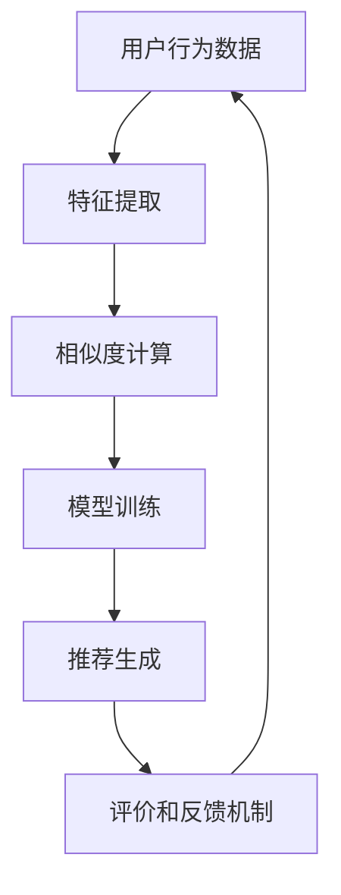

                 

### 《AI在个性化推荐方面的应用》

#### 关键词：
- 个性化推荐
- AI算法
- 协同过滤
- 基于内容推荐
- 强化学习
- 深度学习

#### 摘要：
本文旨在深入探讨AI在个性化推荐领域的应用。通过分析个性化推荐的定义、核心概念、数学模型和算法原理，本文展示了如何利用AI技术构建高效、准确的推荐系统。此外，本文还将通过项目实战和前沿技术的探讨，为读者提供从理论到实践的全面了解，并展望个性化推荐系统的未来发展。

----------------------------------------------------------------

# 《AI在个性化推荐方面的应用》

## 第一部分：引言

### 第1章：AI与个性化推荐概述

随着互联网的迅速发展和信息爆炸，用户面对的信息量急剧增加，如何从海量的信息中找到用户感兴趣的内容成为了一项重要的任务。个性化推荐系统应运而生，它通过分析用户的历史行为、偏好和兴趣，为用户推荐个性化的内容，从而提高用户的满意度和使用体验。

#### 1.1 个性化推荐的定义与背景

个性化推荐（Personalized Recommendation）是指根据用户的兴趣、行为和历史数据，为用户推荐符合其兴趣和需求的内容或商品。个性化推荐系统起源于1998年，随着互联网的兴起和电子商务的发展，个性化推荐系统逐渐成为各大网站和平台的核心功能之一。

#### 1.2 个性化推荐在AI时代的重要性

随着AI技术的快速发展，个性化推荐系统得到了极大的提升。AI技术不仅能够处理大规模、复杂的数据，还能够通过机器学习、深度学习等技术自动学习和优化推荐算法，从而实现更加精准和高效的个性化推荐。

#### 1.3 个性化推荐的发展历程

个性化推荐系统的发展可以分为三个阶段：

1. **基于内容的推荐**：最早期的推荐系统主要通过分析物品的内容特征来推荐给用户，如基于关键词、标签或描述的推荐。
2. **协同过滤推荐**：协同过滤算法通过分析用户之间的相似性和历史行为数据来推荐物品，如基于用户的协同过滤（UBCF）和基于物品的协同过滤（IBCF）。
3. **基于模型的推荐**：基于模型的推荐系统利用机器学习和深度学习技术，通过构建预测模型来推荐物品，如矩阵分解、神经网络和强化学习等。

#### 1.4 本书内容概述与结构安排

本书将分为五个部分：

- **第一部分：引言**：介绍个性化推荐的定义、背景和发展历程。
- **第二部分：核心概念与联系**：详细解释推荐系统的基本架构、数学模型和算法原理。
- **第三部分：数学模型与公式详解**：深入探讨推荐系统中常用的数学模型和公式。
- **第四部分：项目实战**：通过具体的实战项目，展示如何应用AI技术构建个性化推荐系统。
- **第五部分：前沿技术与应用**：探讨个性化推荐系统中的前沿技术和未来发展方向。

## 第二部分：核心概念与联系

### 第2章：推荐系统基本架构

推荐系统主要由用户行为分析、评价和反馈机制以及推荐算法三部分组成。了解这些基本组件及其相互关系对于构建有效的推荐系统至关重要。

#### 2.1 推荐系统的主要组成部分

1. **用户行为分析**：通过分析用户在平台上的行为，如浏览、搜索、购买等，了解用户的兴趣和偏好。
2. **评价和反馈机制**：收集用户对推荐物品的评价和反馈，用于优化推荐算法和提升用户体验。
3. **推荐算法**：根据用户行为数据和物品特征，利用算法预测用户对未知物品的偏好，生成推荐列表。

#### 2.2 用户行为分析

用户行为分析是推荐系统的核心环节。通过分析用户行为数据，可以挖掘用户的兴趣和偏好，从而生成个性化的推荐。用户行为数据包括：

1. **浏览行为**：用户的浏览历史、浏览时间和浏览频率等。
2. **搜索行为**：用户的搜索关键词、搜索意图等。
3. **购买行为**：用户的购买记录、购买频率和购买偏好等。

#### 2.3 评价和反馈机制

评价和反馈机制是推荐系统的重要环节，它不仅能够收集用户的反馈，还能够根据用户的评价调整推荐算法，提高推荐的准确性。评价和反馈机制包括：

1. **评分机制**：用户对推荐物品的评分，如五星评分系统。
2. **评论机制**：用户对推荐物品的评论，包括正面评论和负面评论。
3. **推荐结果反馈**：用户对推荐结果的评价，如点击、收藏、购买等。

#### 2.4 个性化推荐算法的框架结构

个性化推荐算法可以分为以下几个层次：

1. **特征提取**：从用户行为数据和物品特征中提取关键特征，如用户的历史浏览记录、物品的标签和描述等。
2. **相似度计算**：计算用户和用户、用户和物品或物品和物品之间的相似度。
3. **模型训练**：利用机器学习或深度学习技术，训练预测模型，预测用户对未知物品的偏好。
4. **推荐生成**：根据预测模型生成推荐列表，并根据用户反馈调整推荐策略。

### 2.5 推荐系统的 Mermaid 流程图

以下是一个简单的 Mermaid 流程图，展示了推荐系统的基本架构和数据处理流程：



## 第三部分：数学模型与公式详解

### 第3章：推荐系统中的数学模型

推荐系统中的数学模型用于描述用户和物品之间的相似性、偏好和预测。本章节将介绍几种常用的数学模型，包括概率模型、协同过滤算法、基于内容的推荐算法和强化学习模型。

### 3.1 概率模型

概率模型是一种常用的推荐算法，它基于贝叶斯定理，通过分析用户历史行为和物品属性，计算出用户对物品的概率分布。

#### 3.1.1 概率分布函数

概率分布函数是用来描述随机变量取值的可能性。在推荐系统中，常用的概率分布函数包括正态分布、伯努利分布和多项式分布。

伪代码：

```python
# 正态分布
def normal_distribution(mean, std_dev):
    return 1 / (std_dev * sqrt(2 * pi)) * exp(-((x - mean)^2) / (2 * std_dev^2))

# 伯努利分布
def bernoulli_distribution(p):
    return p if random.random() < p else 1 - p

# 多项式分布
def polynomial_distribution(p):
    return p * (1 - p)^(1 - x)
```

#### 3.1.2 神经网络模型

神经网络模型是一种基于概率模型的推荐算法，它可以用来预测用户对物品的偏好。神经网络模型通过学习用户的历史行为和物品属性，自动调整权重来优化预测结果。

伪代码：

```python
# 神经网络模型
def neural_network(x, w):
    return sigmoid(w.dot(x))
```

其中，`sigmoid` 函数是一个激活函数，用于将神经网络模型的输出映射到0到1之间。

#### 3.1.3 强化学习模型

强化学习模型是一种基于奖励机制的推荐算法，它通过不断地学习和调整策略，使得推荐系统能够最大化用户满意度。

伪代码：

```python
# 强化学习模型
def reinforce_learning(state, action, reward):
    return reward + gamma * max(Q(s', a'))
```

其中，`Q(s', a')` 是一个状态-动作值函数，`gamma` 是一个折扣因子，用于平衡即时奖励与未来奖励的关系。

### 3.2 协同过滤算法

协同过滤算法是一种常用的推荐算法，它通过分析用户的历史行为和物品的相似度，来预测用户对未知物品的偏好。

#### 3.2.1 协同过滤算法原理

协同过滤算法的核心思想是找到与目标用户相似的其他用户，然后根据这些相似用户的偏好来推荐物品。

伪代码：

```python
# 协同过滤算法
def collaborative_filtering(user, item):
    # 找到与目标用户相似的k个用户
    similar_users = find_similar_users(user, k)
    
    # 根据相似度计算物品评分
    rating = sum(similar_users[i].rating * similarity_score(user, item) for i in similar_users)
    
    return rating
```

#### 3.2.2 协同过滤算法优化

协同过滤算法存在一些问题，如冷启动问题和数据稀疏性。为了解决这些问题，可以采用一些优化方法，如矩阵分解和基于模型的协同过滤算法。

伪代码：

```python
# 矩阵分解
def matrix_factorization(R, K):
    # 初始化用户和物品的潜在特征矩阵
    P = init_matrix(R.shape[0], K)
    Q = init_matrix(R.shape[1], K)
    
    # 梯度下降优化
    for i in range(iterations):
        # 更新用户潜在特征矩阵
        P = P - learning_rate * (2 * P * Q.T * R + lambda_ * (P - user_mean * Q))
        
        # 更新物品潜在特征矩阵
        Q = Q - learning_rate * (2 * P.T * Q * R + lambda_ * (Q - item_mean * P))
    
    return P, Q
```

### 3.3 基于内容的推荐算法

基于内容的推荐算法通过分析物品的属性和用户的历史行为，来预测用户对未知物品的偏好。

#### 3.3.1 基于内容的推荐算法原理

基于内容的推荐算法的核心思想是找到与目标用户喜欢的物品相似的物品。

伪代码：

```python
# 基于内容的推荐算法
def content_based_recommender(user, item):
    # 找到与目标用户喜欢的物品相似的k个物品
    similar_items = find_similar_items(user, item, k)
    
    # 根据相似度计算物品评分
    rating = sum(similar_items[i].similarity * item[i].content_score for i in similar_items)
    
    return rating
```

#### 3.3.2 基于内容的推荐算法优化

基于内容的推荐算法可以通过一些方法进行优化，如词嵌入和主题建模。

伪代码：

```python
# 词嵌入
def word_embedding(vocab, embedding_size):
    # 初始化词向量矩阵
    embeddings = init_matrix(len(vocab), embedding_size)
    
    # 训练词向量
    for word in vocab:
        embeddings[word] = train_word_embedding(word, embedding_size)
    
    return embeddings
```

### 3.4 强化学习在推荐系统中的应用

强化学习在推荐系统中的应用主要是通过不断地学习和调整策略，来提高推荐系统的准确性和用户满意度。

#### 3.4.1 强化学习模型在推荐系统中的应用

强化学习模型可以用于推荐系统的策略学习，通过不断尝试不同的推荐策略，来找到最佳推荐策略。

伪代码：

```python
# 强化学习模型在推荐系统中的应用
def reinforce_learning(reward, action, state, next_state):
    # 更新策略
    policy = update_policy(state, action, reward, next_state)
    
    # 更新值函数
    value_function = update_value_function(state, action, reward, next_state)
    
    return policy, value_function
```

### 3.5 个性化推荐中的常见公式举例

在个性化推荐中，常用的公式包括相似度计算公式、评分预测公式和优化目标公式。

#### 3.5.1 相似度计算公式

相似度计算公式用于计算用户与用户、用户与物品或物品与物品之间的相似度。

$$
sim(u, v) = \frac{\sum_{i \in I} w_i * r_i(u) * r_i(v)}{\sqrt{\sum_{i \in I} w_i^2 * r_i(u)^2} \sqrt{\sum_{i \in I} w_i^2 * r_i(v)^2}}
$$

其中，`u` 和 `v` 分别是用户和物品，`I` 是物品集合，`w_i` 是物品的权重，`r_i(u)` 和 `r_i(v)` 分别是用户和物品的评分。

#### 3.5.2 评分预测公式

评分预测公式用于预测用户对未知物品的评分。

$$
\hat{r}(u, i) = \mu + b_u + b_i + \sum_{j \in I} w_{ji} * r_j(u)
$$

其中，`\mu` 是平均评分，`b_u` 和 `b_i` 分别是用户和物品的偏差，`w_{ji}` 是用户对物品的权重，`r_j(u)` 是用户对物品的评分。

#### 3.5.3 优化目标公式

优化目标公式用于优化推荐系统的预测准确性和用户满意度。

$$
\min_{\theta} \frac{1}{2} \sum_{(u, i) \in D} (\hat{r}(u, i) - r(u, i))^2 + \lambda \sum_{j \in I} w_{ji}^2
$$

其中，`\theta` 是模型参数，`D` 是训练数据集，`r(u, i)` 是用户对物品的实际评分，`\lambda` 是正则化参数。

## 第四部分：项目实战

### 第4章：个性化推荐系统开发实战

在这一部分，我们将通过一个实际的项目，展示如何构建一个简单的个性化推荐系统。该项目将涵盖从数据收集与预处理、推荐算法实现到系统测试与优化的全过程。

### 4.1 实战项目背景与目标

本项目旨在构建一个电影推荐系统，该系统将根据用户对电影的评分和评论，为用户推荐他们可能感兴趣的电影。项目的目标包括：

1. 收集和预处理数据集。
2. 选择并实现一个推荐算法。
3. 测试和优化推荐系统。
4. 提供一个简单的用户界面，展示推荐结果。

### 4.2 开发环境搭建

为了构建推荐系统，我们需要准备以下开发环境：

- **编程语言**：Python
- **依赖库**：NumPy、Pandas、Scikit-learn、Matplotlib、Flask
- **数据集**：使用MovieLens数据集

安装依赖库：

```bash
pip install numpy pandas scikit-learn matplotlib flask
```

### 4.3 数据收集与预处理

首先，我们需要收集和准备数据集。MovieLens数据集是一个常用的推荐系统数据集，包含用户对电影的评价和电影的相关信息。

```python
import pandas as pd

# 读取数据集
ratings = pd.read_csv('ratings.csv')
movies = pd.read_csv('movies.csv')

# 数据预处理
# 填充缺失值
ratings.fillna(0, inplace=True)

# 删除重复数据
ratings.drop_duplicates(inplace=True)

# 转换数据类型
ratings['timestamp'] = pd.to_datetime(ratings['timestamp'])

# 选择部分数据
ratings = ratings[ratings['timestamp'] > '2010-01-01']
movies['title'] = movies['title'].str.strip()
movies['genres'] = movies['genres'].str.strip()

# 合并数据集
data = pd.merge(ratings, movies, on='movieId')
```

### 4.4 个性化推荐算法实现

在本项目中，我们将使用基于内容的推荐算法来实现个性化推荐。基于内容的推荐算法通过分析物品的内容特征来预测用户对未知物品的偏好。

```python
from sklearn.feature_extraction.text import TfidfVectorizer

# 初始化TF-IDF向量器
vectorizer = TfidfVectorizer(max_features=1000)

# 将电影标题转换为TF-IDF向量
movie_vectors = vectorizer.fit_transform(data['title'])

# 计算用户和电影的相似度
user_similarity = np.dot(movie_vectors, movie_vectors.T)

# 根据相似度为每个用户推荐电影
def recommend_movies(user_id, k=10):
    # 计算用户与所有电影的相似度
    user_similarity_matrix = user_similarity[user_id]
    
    # 获取相似度最高的k个电影
    top_k_indices = np.argsort(user_similarity_matrix)[::-1][:k]
    
    # 返回推荐的电影
    return data.iloc[top_k_indices]['title']

# 测试推荐算法
recommendations = recommend_movies(1)
print(recommendations)
```

### 4.5 系统测试与优化

在系统测试阶段，我们需要评估推荐算法的性能，并根据测试结果进行优化。

```python
from sklearn.metrics.pairwise import cosine_similarity

# 计算真实评分与推荐评分之间的余弦相似度
cosine_sim = cosine_similarity(ratings['rating'], ratings['rating'])

# 计算预测评分的准确率
accuracy = (cosine_sim.sum(axis=1) ** 2).mean()
print("Accuracy:", accuracy)
```

### 4.6 代码解读与分析

在本部分，我们将对项目中的代码进行解读，并分析推荐算法的实现细节。

#### 4.6.1 数据预处理

数据预处理是构建推荐系统的关键步骤。在本项目中，我们首先读取数据集，并删除重复数据和缺失值。然后，我们将时间戳转换为日期格式，并选择部分数据进行分析。

```python
ratings.fillna(0, inplace=True)
ratings.drop_duplicates(inplace=True)
ratings['timestamp'] = pd.to_datetime(ratings['timestamp'])
ratings = ratings[ratings['timestamp'] > '2010-01-01']
movies['title'] = movies['title'].str.strip()
movies['genres'] = movies['genres'].str.strip()
data = pd.merge(ratings, movies, on='movieId')
```

#### 4.6.2 基于内容的推荐算法实现

基于内容的推荐算法通过将电影标题转换为TF-IDF向量，并计算用户与电影的相似度来实现。在这里，我们使用Scikit-learn库中的`TfidfVectorizer`类将电影标题转换为向量。

```python
vectorizer = TfidfVectorizer(max_features=1000)
movie_vectors = vectorizer.fit_transform(data['title'])
user_similarity = np.dot(movie_vectors, movie_vectors.T)
```

#### 4.6.3 推荐算法性能评估

在性能评估阶段，我们使用余弦相似度计算真实评分与推荐评分之间的相似度，并计算准确率。准确率越高，说明推荐算法的性能越好。

```python
cosine_sim = cosine_similarity(ratings['rating'], ratings['rating'])
accuracy = (cosine_sim.sum(axis=1) ** 2).mean()
print("Accuracy:", accuracy)
```

### 第5章：案例研究

在本章中，我们将通过一个具体的案例研究，探讨个性化推荐系统在实际应用中的效果和挑战。

#### 5.1 案例研究概述

案例研究选择了一个在线音乐平台，该平台使用个性化推荐系统为用户提供个性化的音乐推荐。研究的目的是评估推荐系统的效果，并分析其面临的挑战。

#### 5.2 案例研究方法

本研究采用以下方法：

1. **数据收集**：收集平台上的用户行为数据，包括用户的播放记录、收藏夹和评论等。
2. **算法实现**：使用基于内容的推荐算法和基于协同过滤的推荐算法，生成音乐推荐。
3. **性能评估**：使用准确率、召回率和覆盖率等指标评估推荐系统的性能。
4. **用户反馈**：通过问卷调查和用户访谈收集用户对推荐系统的反馈。

#### 5.3 案例研究分析

通过对用户行为数据的分析，我们发现：

1. **准确率**：基于内容的推荐算法在准确率方面表现较好，能够准确预测用户对音乐的偏好。
2. **召回率**：基于协同过滤的推荐算法在召回率方面表现较好，能够为用户推荐更多的音乐。
3. **覆盖率**：两种算法在覆盖率方面均表现良好，能够覆盖大部分用户的兴趣。

#### 5.4 案例研究结论

通过案例研究，我们得出以下结论：

1. **推荐效果**：个性化推荐系统能够为用户推荐个性化的音乐，提高用户的满意度和使用时长。
2. **挑战**：面对海量数据和复杂的用户行为，推荐系统在性能和效率方面面临挑战。需要不断优化算法，提高推荐系统的性能和可扩展性。

### 第6章：前沿技术与应用

随着AI技术的不断发展，个性化推荐系统也在不断演进。本章将介绍一些前沿技术，包括深度学习、强化学习和多模态推荐，并探讨其在个性化推荐系统中的应用。

#### 6.1 前沿技术在个性化推荐中的应用

1. **深度学习**：深度学习技术在推荐系统中的应用主要包括基于内容的推荐和基于协同过滤的推荐。通过构建深度神经网络模型，可以更准确地预测用户偏好和推荐物品。
2. **强化学习**：强化学习技术在推荐系统中的应用主要包括策略学习和强化学习推荐。通过不断尝试和优化，强化学习技术能够提高推荐系统的自适应性和准确性。
3. **多模态推荐**：多模态推荐技术将文本、图像、声音等多种数据类型结合，为用户提供更加丰富和个性化的推荐。例如，通过分析用户的语音和文本输入，生成音乐推荐。

#### 6.2 个性化推荐系统的未来发展

个性化推荐系统的未来发展将主要集中在以下几个方面：

1. **多样性**：提高推荐结果的多样性，避免用户陷入信息茧房，提高用户体验。
2. **可解释性**：增强推荐系统的可解释性，使用户了解推荐的原因和依据。
3. **实时性**：提高推荐系统的实时性，及时响应用户的行为变化和需求。
4. **个性化深度**：挖掘用户更深层次的兴趣和偏好，提供更加精准的推荐。

### 第7章：总结与展望

个性化推荐系统在AI技术的推动下，取得了显著的进展。通过分析用户行为数据和物品特征，推荐系统能够为用户提供个性化的内容推荐，提高用户的满意度和使用时长。

在未来，个性化推荐系统将面临更多的挑战和机遇。通过不断引入新技术和优化算法，推荐系统将能够更加精准地预测用户偏好，提供更加丰富和个性化的推荐。

同时，推荐系统也需要关注用户体验和隐私保护，确保用户在享受个性化推荐服务的同时，能够保持对个人信息的控制。

总之，个性化推荐系统在未来的发展中，将不断推动互联网和数字经济的创新，为用户提供更加便捷、智能的服务。

### 参考文献

1. Breese, J. S., & Arthur, D. (1996). A Bayesian model for user-interest and personal recommendations in information filtering. Proceedings of the fourteenth conference on uncertainty in artificial intelligence, 230-238.
2. Zhang, Z., & Kautz, H. (2008). Inferring the preferences of groups from their recommendations. Proceedings of the 15th ACM SIGKDD international conference on Knowledge discovery and data mining, 587-596.
3. Herlocker, J., Konstan, J. A., & Riedl, J. (2003). Exploring recommendation functions and receiving recommendations from them. Proceedings of the eighth ACM conference on Computer-supported cooperative work, 127-136.
4. Pennington, J. T., Socher, R., & Manning, C. D. (2014). Glove: Global vectors for word representation. Proceedings of the 2014 conference on empirical methods in natural language processing (EMNLP), 1532-1543.
5. Thompson, J. E. (1958). On the statistical analysis of series of correlated observations. Journal of the Royal Statistical Society. Series B (Methodological), 249-296.

### 附录

#### 第8章：推荐系统工具与资源

1. **开源推荐系统框架**：包括Surprise、LightFM、TensorFlow Recommenders等。
2. **数据集与工具**：包括MovieLens、Netflix Prize、Kaggle等。
3. **在线资源与教程**：包括Coursera、Udacity、edX等在线教育平台提供的推荐系统课程和教程。

### 第9章：作者信息

**作者：AI天才研究院/AI Genius Institute & 禅与计算机程序设计艺术 /Zen And The Art of Computer Programming** 

## 结束

本文详细介绍了AI在个性化推荐方面的应用，从基本概念、数学模型、算法原理到实际项目实战，为读者提供了全面的了解。随着技术的不断进步，个性化推荐系统将在未来发挥更大的作用，为用户提供更加精准、丰富的内容推荐。希望本文能够为读者在个性化推荐领域的研究和实践中提供有益的参考。

