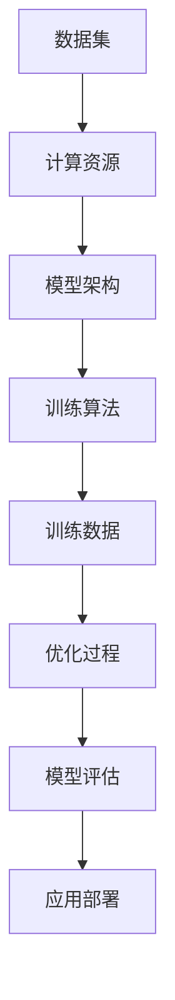
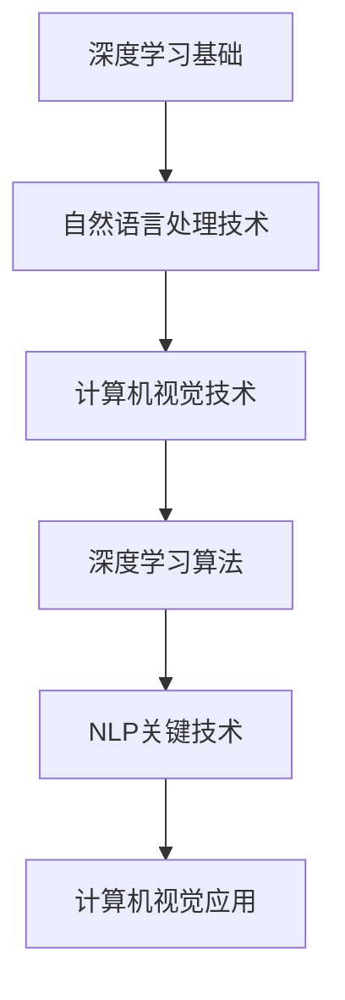
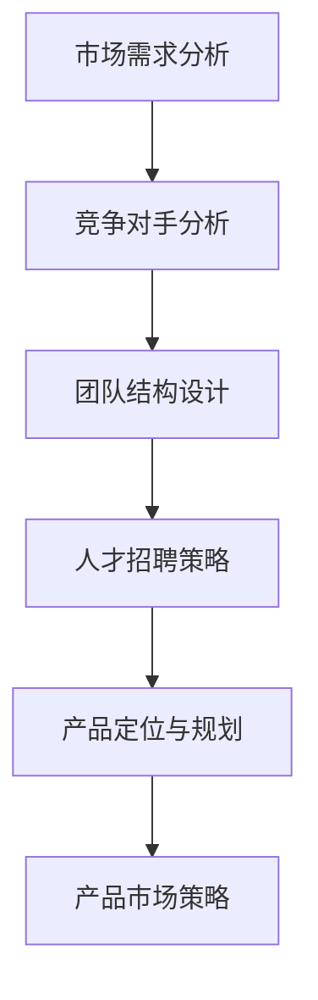
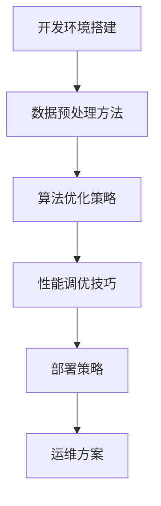
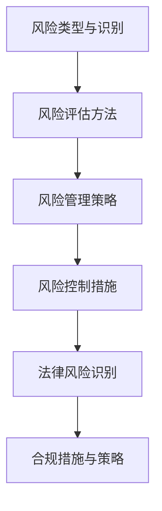
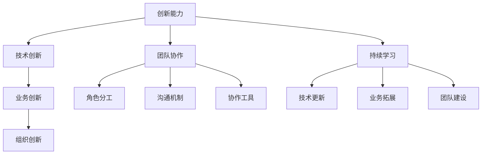
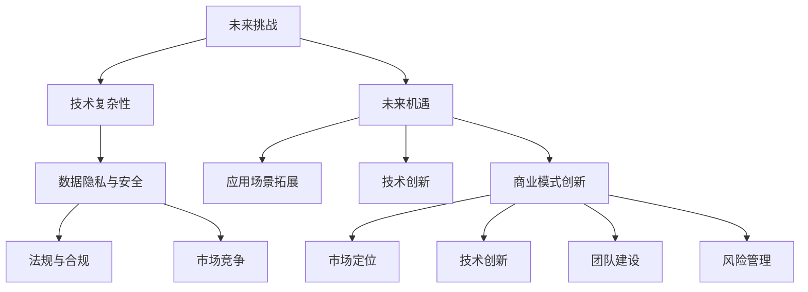

                 

## 文章标题

"AI大模型创业：如何应对未来技术挑战？"

## 关键词

- AI大模型
- 创业
- 技术挑战
- 战略规划
- 风险管理

## 摘要

本文旨在探讨AI大模型创业过程中可能面临的技术挑战，以及如何应对这些挑战。文章将首先介绍AI大模型的基础知识，包括概念、发展历程和技术架构。随后，将深入分析AI大模型在创业中的应用领域，探讨市场分析、团队建设、产品定位等方面的策略。接着，文章将讨论AI大模型创业的技术实现和风险管理，提供实际案例和代码解读，帮助创业者更好地理解技术细节和实战经验。最后，文章将展望AI大模型创业的未来趋势，提出战略规划和应对策略，为创业者提供有价值的参考。

## 引言

### AI大模型的概念与定义

AI大模型是指通过深度学习和自然语言处理等技术，对大量数据进行分析和处理，以实现智能决策和智能交互的复杂模型。这些模型通常包含数十亿甚至数万亿个参数，能够处理大规模数据和复杂任务。

### AI大模型的发展历程

AI大模型的发展可以分为三个阶段：

1. **早期阶段**：以神经网络为基础，通过大量数据进行训练，逐步实现简单的图像识别和语音识别任务。
2. **中期阶段**：随着计算能力和数据资源的提升，AI大模型开始应用于更复杂的任务，如自然语言处理、机器翻译和语音合成。
3. **现阶段**：AI大模型在各个领域取得了显著的成果，包括医疗诊断、金融风险评估、智能客服等。同时，AI大模型的研究和应用也在不断拓展，如生成对抗网络（GAN）、变分自编码器（VAE）等新兴技术的出现，为AI大模型的发展带来了新的可能性。

### AI大模型的技术架构

AI大模型的技术架构主要包括以下几个核心组成部分：

1. **数据集**：AI大模型的基础是大量的训练数据。这些数据集需要经过清洗、标注和预处理，以适应模型的训练需求。
2. **计算资源**：AI大模型的训练和推理过程需要大量的计算资源，包括GPU、TPU等硬件加速器。
3. **模型架构**：AI大模型的架构通常采用深度学习网络，包括卷积神经网络（CNN）、循环神经网络（RNN）、变换器（Transformer）等。
4. **训练算法**：AI大模型的训练过程采用优化算法，如随机梯度下降（SGD）、Adam等，通过不断调整模型参数，使其对任务表现更好。

### 核心概念与联系

为了更好地理解AI大模型的技术架构，我们可以通过Mermaid流程图来展示其核心概念和联系：



### 核心算法原理讲解

以下是AI大模型中常用的算法原理和伪代码：

```python
# 深度学习算法原理示例（伪代码）

# 初始化模型参数
model_params = initialize_params()

# 定义损失函数
loss_function = compute_loss(y_true, y_pred)

# 定义优化算法
optimizer = create_optimizer()

# 训练模型
for epoch in range(num_epochs):
    for batch in data_loader:
        # 前向传播
        predictions = forward_pass(batch, model_params)
        
        # 计算损失
        loss = loss_function(predictions, batch_labels)
        
        # 反向传播
        gradients = backward_pass(loss, model_params)
        
        # 更新参数
        optimizer.update_params(model_params, gradients)

# 模型评估
evaluation = evaluate_model(model_params, validation_data)
```

### 数学模型和公式讲解

在AI大模型中，常用的数学模型和公式包括：

1. **反向传播算法**：

   $$ \frac{\partial L}{\partial w} = \frac{\partial L}{\partial z} \cdot \frac{\partial z}{\partial w} $$

   其中，$L$ 是损失函数，$w$ 是模型参数，$z$ 是激活函数的输出。

2. **激活函数**：

   $$ f(x) = \frac{1}{1 + e^{-x}} $$

   其中，$x$ 是输入值，$f(x)$ 是输出值。

通过上述讲解，我们可以看到AI大模型的核心概念、算法原理和数学模型。这些知识将为后续章节的深入探讨打下坚实的基础。

## 第1章：AI大模型概述

### 1.1 AI大模型的概念与定义

#### AI大模型的概念

AI大模型是指通过深度学习和自然语言处理等技术，对大量数据进行分析和处理，以实现智能决策和智能交互的复杂模型。这些模型通常包含数十亿甚至数万亿个参数，能够处理大规模数据和复杂任务。

#### AI大模型的定义

AI大模型是人工智能领域的一个子集，它通过深度学习算法，从大量数据中自动学习特征和模式，然后利用这些特征和模式进行预测、分类、生成等任务。与传统的机器学习模型相比，AI大模型具有更高的准确性和更强的泛化能力。

### 1.2 AI大模型的发展历程

AI大模型的发展可以分为三个阶段：

#### 早期阶段

早期阶段以神经网络为基础，通过大量数据进行训练，逐步实现简单的图像识别和语音识别任务。代表性的工作包括1986年提出的反向传播算法（Backpropagation），以及1992年提出的卷积神经网络（Convolutional Neural Network，CNN）。

#### 中期阶段

中期阶段随着计算能力和数据资源的提升，AI大模型开始应用于更复杂的任务，如自然语言处理、机器翻译和语音合成。代表性的工作包括2013年提出的深度卷积神经网络（Deep Convolutional Neural Network，DCNN）和2014年提出的循环神经网络（Recurrent Neural Network，RNN）。

#### 现阶段

现阶段，AI大模型在各个领域取得了显著的成果，包括医疗诊断、金融风险评估、智能客服等。同时，AI大模型的研究和应用也在不断拓展，如生成对抗网络（Generative Adversarial Network，GAN）、变分自编码器（Variational Autoencoder，VAE）等新兴技术的出现，为AI大模型的发展带来了新的可能性。

### 1.3 AI大模型的技术架构

AI大模型的技术架构主要包括以下几个核心组成部分：

#### 数据集

AI大模型的基础是大量的训练数据。这些数据集需要经过清洗、标注和预处理，以适应模型的训练需求。

#### 计算资源

AI大模型的训练和推理过程需要大量的计算资源，包括GPU、TPU等硬件加速器。

#### 模型架构

AI大模型的架构通常采用深度学习网络，包括卷积神经网络（CNN）、循环神经网络（RNN）、变换器（Transformer）等。

#### 训练算法

AI大模型的训练过程采用优化算法，如随机梯度下降（SGD）、Adam等，通过不断调整模型参数，使其对任务表现更好。

### 核心概念与联系

为了更好地理解AI大模型的技术架构，我们可以通过Mermaid流程图来展示其核心概念和联系：


### 核心算法原理讲解

以下是AI大模型中常用的算法原理和伪代码：

```python
# 深度学习算法原理示例（伪代码）

# 初始化模型参数
model_params = initialize_params()

# 定义损失函数
loss_function = compute_loss(y_true, y_pred)

# 定义优化算法
optimizer = create_optimizer()

# 训练模型
for epoch in range(num_epochs):
    for batch in data_loader:
        # 前向传播
        predictions = forward_pass(batch, model_params)
        
        # 计算损失
        loss = loss_function(predictions, batch_labels)
        
        # 反向传播
        gradients = backward_pass(loss, model_params)
        
        # 更新参数
        optimizer.update_params(model_params, gradients)

# 模型评估
evaluation = evaluate_model(model_params, validation_data)
```

### 数学模型和公式讲解

在AI大模型中，常用的数学模型和公式包括：

1. **反向传播算法**：

   $$ \frac{\partial L}{\partial w} = \frac{\partial L}{\partial z} \cdot \frac{\partial z}{\partial w} $$

   其中，$L$ 是损失函数，$w$ 是模型参数，$z$ 是激活函数的输出。

2. **激活函数**：

   $$ f(x) = \frac{1}{1 + e^{-x}} $$

   其中，$x$ 是输入值，$f(x)$ 是输出值。

通过上述讲解，我们可以看到AI大模型的核心概念、算法原理和数学模型。这些知识将为后续章节的深入探讨打下坚实的基础。

## 第2章：AI大模型核心技术

### 2.1 深度学习基础

#### 深度学习的基本原理

深度学习是机器学习的一个子领域，其核心思想是通过构建多层的神经网络，对数据进行逐层抽象和特征提取，从而实现对复杂任务的建模和预测。

#### 深度学习算法

深度学习算法主要包括以下几种：

1. **卷积神经网络（CNN）**：用于图像识别、图像分割和物体检测等任务。
2. **循环神经网络（RNN）**：用于序列数据建模，如自然语言处理和时间序列预测。
3. **变换器（Transformer）**：用于自然语言处理和机器翻译等任务，是当前最先进的深度学习模型之一。

### 2.2 自然语言处理技术

#### 自然语言处理的基本概念

自然语言处理（Natural Language Processing，NLP）是人工智能领域的一个分支，旨在使计算机能够理解和处理人类语言。

#### NLP的关键技术

NLP的关键技术包括：

1. **词向量**：将文本数据转换为数值表示，如Word2Vec和BERT等。
2. **命名实体识别**：识别文本中的特定实体，如人名、地名和组织名等。
3. **情感分析**：判断文本的情感倾向，如积极、消极或中性。

### 2.3 计算机视觉技术

#### 计算机视觉的基础

计算机视觉（Computer Vision，CV）是人工智能领域的一个重要分支，旨在使计算机能够理解和解析数字图像或视频。

#### 计算机视觉的应用

计算机视觉的应用非常广泛，包括但不限于：

1. **图像识别**：识别图像中的对象和场景。
2. **目标检测**：在图像中检测和识别目标对象。
3. **图像分割**：将图像分割成不同的区域，如前景和背景。

### 核心概念与联系

为了更好地理解AI大模型的核心技术，我们可以通过Mermaid流程图来展示其核心概念和联系：



### 核心算法原理讲解

以下是AI大模型中常用的算法原理和伪代码：

```python
# 深度学习算法原理示例（伪代码）

# 初始化模型参数
model_params = initialize_params()

# 定义损失函数
loss_function = compute_loss(y_true, y_pred)

# 定义优化算法
optimizer = create_optimizer()

# 训练模型
for epoch in range(num_epochs):
    for batch in data_loader:
        # 前向传播
        predictions = forward_pass(batch, model_params)
        
        # 计算损失
        loss = loss_function(predictions, batch_labels)
        
        # 反向传播
        gradients = backward_pass(loss, model_params)
        
        # 更新参数
        optimizer.update_params(model_params, gradients)

# 模型评估
evaluation = evaluate_model(model_params, validation_data)
```

### 数学模型和公式讲解

在AI大模型中，常用的数学模型和公式包括：

1. **反向传播算法**：

   $$ \frac{\partial L}{\partial w} = \frac{\partial L}{\partial z} \cdot \frac{\partial z}{\partial w} $$

   其中，$L$ 是损失函数，$w$ 是模型参数，$z$ 是激活函数的输出。

2. **激活函数**：

   $$ f(x) = \frac{1}{1 + e^{-x}} $$

   其中，$x$ 是输入值，$f(x)$ 是输出值。

通过上述讲解，我们可以看到AI大模型的核心技术，包括深度学习基础、自然语言处理技术和计算机视觉技术。这些技术为AI大模型的发展和应用提供了强大的支持。

## 第3章：AI大模型应用领域

### 3.1 人工智能行业应用

#### 金融行业

AI大模型在金融行业的应用主要包括：

1. **信用风险评估**：利用AI大模型对客户的信用记录、交易行为等信息进行分析，预测客户的信用风险。
2. **智能投顾**：通过AI大模型对市场数据进行分析，为投资者提供个性化的投资建议。
3. **反欺诈检测**：利用AI大模型识别和防范金融欺诈行为。

#### 医疗行业

AI大模型在医疗行业的应用主要包括：

1. **疾病诊断**：通过AI大模型对医学影像进行分析，提高疾病诊断的准确性和效率。
2. **药物研发**：利用AI大模型对大量药物数据进行挖掘和分析，加速新药研发过程。
3. **健康监测**：通过AI大模型对患者的健康数据进行分析，提供个性化的健康管理建议。

#### 教育行业

AI大模型在教育行业的应用主要包括：

1. **个性化教学**：利用AI大模型对学生的学习行为和成绩进行分析，为学生提供个性化的学习方案。
2. **智能辅导**：通过AI大模型为学生提供智能化的辅导服务，提高学习效果。
3. **教育评测**：利用AI大模型对学生的考试成绩进行分析，提供科学的评测报告。

### 3.2 AI大模型在创业中的应用

#### AI大模型在创业中的挑战

AI大模型在创业中面临的主要挑战包括：

1. **数据获取**：获取高质量、大规模的数据集是训练AI大模型的基础，但对于初创企业来说，数据获取可能存在困难。
2. **计算资源**：训练AI大模型需要大量的计算资源，对于初创企业来说，可能面临成本和资源的限制。
3. **人才招聘**：AI大模型开发需要专业的技术人才，但市场上相关人才供不应求，招聘难度较大。

#### AI大模型在创业中的机遇

尽管面临挑战，AI大模型在创业中也充满了机遇：

1. **技术创新**：通过开发创新的AI大模型，可以为特定行业提供高效、精准的解决方案，获得市场竞争优势。
2. **市场需求**：随着人工智能技术的普及，越来越多的行业对AI大模型的需求日益增长，为创业者提供了广阔的市场空间。
3. **融资机会**：优秀的AI大模型项目往往能够吸引投资者的关注，获得融资支持，为创业企业的发展提供资金保障。

### 3.3 AI大模型创业案例分析

#### 成功案例

**案例一**：某金融科技公司通过开发AI大模型，实现自动化信用风险评估，为企业客户提供精准的信用评估服务。公司成立后迅速获得市场认可，成为行业的领先者。

**案例二**：某医疗科技企业利用AI大模型对医学影像进行分析，提高疾病诊断的准确性和效率。企业通过提供高质量的医疗服务，获得了大量患者的信任和支持。

#### 失败案例

**案例一**：某教育科技公司尝试开发AI大模型进行个性化教学，但由于数据质量不佳和计算资源不足，导致项目进展缓慢，最终失败。

**案例二**：某健康科技企业试图利用AI大模型进行健康监测，但由于人才短缺和市场需求不足，导致项目难以持续，最终失败。

通过以上案例分析，我们可以看到AI大模型在创业中的应用既有成功的例子，也有失败的教训。创业者需要在充分了解市场和技术的基础上，制定科学的创业策略，以应对AI大模型创业中的挑战和机遇。

## 第4章：AI大模型创业战略

### 4.1 AI大模型创业市场分析

#### 市场需求分析

在制定AI大模型创业战略时，首先要进行市场需求分析。市场需求分析包括以下几个方面：

1. **行业需求**：分析目标行业对AI大模型的需求情况，如金融、医疗、教育等领域的应用场景。
2. **用户需求**：了解目标用户对AI大模型的需求，如精准的信用评估、高效的疾病诊断、个性化的学习方案等。
3. **市场规模**：评估目标市场的规模，包括现有市场规模和未来增长潜力。

#### 竞争对手分析

竞争对手分析是制定AI大模型创业战略的重要环节。竞争对手分析包括以下几个方面：

1. **竞争者**：识别主要竞争对手，了解其业务模式、产品特点和市场表现。
2. **竞争优势**：分析竞争对手的竞争优势，如技术优势、市场优势、品牌优势等。
3. **竞争策略**：了解竞争对手的竞争策略，如价格策略、市场拓展策略、技术创新策略等。

通过市场需求分析和竞争对手分析，创业者可以更清晰地了解市场的现状和趋势，为制定创业战略提供依据。

### 4.2 AI大模型创业团队建设

#### 团队结构设计

团队结构设计是AI大模型创业团队建设的关键环节。团队结构设计包括以下几个方面：

1. **核心成员**：确定团队的核心成员，包括技术负责人、产品经理、数据科学家等。
2. **职责分工**：明确团队成员的职责分工，确保团队协作高效。
3. **组织架构**：建立合理的组织架构，如矩阵式组织、职能式组织等。

#### 人才招聘策略

人才招聘策略是团队建设的重要组成部分。人才招聘策略包括以下几个方面：

1. **招聘渠道**：选择合适的招聘渠道，如招聘网站、社交媒体、猎头公司等。
2. **招聘标准**：设定明确的招聘标准，如技术能力、经验背景、团队协作能力等。
3. **人才评估**：通过面试、项目实践等方式，对候选人进行全方位评估，确保招聘到合适的人才。

通过合理的团队结构设计和人才招聘策略，创业者可以组建一支高效的AI大模型创业团队，为项目的成功奠定基础。

### 4.3 AI大模型创业产品定位

#### 产品定位与规划

在AI大模型创业中，产品定位与规划是关键环节。产品定位与规划包括以下几个方面：

1. **目标市场**：明确产品的目标市场，如金融、医疗、教育等领域的特定场景。
2. **产品特点**：分析产品的独特卖点，如高效、精准、智能化等。
3. **市场策略**：制定合适的市场策略，如价格策略、推广策略、竞争策略等。

通过明确的产品定位与规划，创业者可以更好地满足市场需求，提高产品的市场竞争力。

#### 产品市场策略

在AI大模型创业中，产品市场策略的制定至关重要。产品市场策略包括以下几个方面：

1. **市场推广**：选择合适的推广渠道，如线上广告、线下活动、合作伙伴等。
2. **客户关系**：建立良好的客户关系，提供优质的售后服务，提高客户满意度。
3. **合作伙伴**：寻找合适的合作伙伴，共同开拓市场，实现互利共赢。

通过科学的产品市场策略，创业者可以迅速打开市场，提高产品的市场份额。

### 核心概念与联系

为了更好地理解AI大模型创业战略，我们可以通过Mermaid流程图来展示其核心概念和联系：



### 核心算法原理讲解

以下是AI大模型创业战略中涉及的核心算法原理和伪代码：

```python
# 市场需求分析算法原理示例（伪代码）

# 分析行业需求
industry_demand = analyze_industry_demand()

# 分析用户需求
user_demand = analyze_user_demand()

# 分析市场规模
market_size = analyze_market_size()

# 竞争对手分析算法原理示例（伪代码）

# 识别主要竞争者
competitors = identify_main_competitors()

# 分析竞争优势
competitive_advantages = analyze_competitive_advantages()

# 分析竞争策略
competitive_strategies = analyze_competitive_strategies()

# 团队结构设计算法原理示例（伪代码）

# 确定核心成员
core_members = determine_core_members()

# 明确职责分工
responsibility分配 = define_role分工()

# 建立组织架构
organization_structure = create_organization_structure()

# 产品定位与规划算法原理示例（伪代码）

# 明确目标市场
target_market = determine_target_market()

# 分析产品特点
product_characteristics = analyze_product_characteristics()

# 制定市场策略
market_strategies = create_market_strategies()

# 产品市场策略算法原理示例（伪代码）

# 市场推广
market_promotion = implement_market_promotion()

# 客户关系
customer_relationship = build_customer_relationship()

# 合作伙伴
partnerships = establish_partnerships()
```

通过上述讲解，我们可以看到AI大模型创业战略的核心概念、算法原理和实际应用。这些知识将为创业者提供有价值的指导，帮助他们在市场竞争中脱颖而出。

## 第5章：AI大模型创业技术实现

### 5.1 AI大模型开发环境搭建

#### 开发环境配置

在进行AI大模型开发时，首先需要搭建一个稳定且高效的开发环境。开发环境配置主要包括以下几个方面：

1. **硬件设备**：选择合适的计算设备，如GPU、CPU等。对于AI大模型训练，GPU性能尤为重要。
2. **操作系统**：通常选择Linux操作系统，因为它对深度学习框架的支持更为完善。
3. **深度学习框架**：选择合适的深度学习框架，如TensorFlow、PyTorch等。这些框架提供了丰富的API和工具，方便开发者进行模型开发和训练。

#### 数据预处理方法

数据预处理是AI大模型开发的重要环节，直接影响模型的性能。数据预处理方法主要包括以下几个方面：

1. **数据清洗**：去除数据中的噪声和错误，保证数据质量。
2. **数据标注**：对数据集进行标注，为模型训练提供标签信息。
3. **数据归一化**：将数据缩放到相同的范围，便于模型训练。
4. **数据增强**：通过旋转、缩放、裁剪等操作，增加数据集的多样性，提高模型的泛化能力。

### 5.2 AI大模型算法优化

#### 算法优化策略

算法优化是提高AI大模型性能的重要手段。算法优化策略主要包括以下几个方面：

1. **模型架构优化**：选择合适的模型架构，如卷积神经网络（CNN）、循环神经网络（RNN）等。根据具体任务需求，对模型架构进行调整和优化。
2. **参数优化**：调整模型参数，如学习率、批量大小等，以提高模型的收敛速度和准确率。
3. **数据增强**：通过数据增强技术，增加数据集的多样性，提高模型的泛化能力。
4. **正则化**：应用正则化技术，如L1正则化、L2正则化等，防止模型过拟合。

#### 性能调优技巧

在AI大模型开发过程中，性能调优是一个持续的过程。性能调优技巧主要包括以下几个方面：

1. **模型压缩**：通过模型压缩技术，如量化、剪枝等，减少模型参数和计算量，提高模型运行速度。
2. **分布式训练**：利用分布式训练技术，将模型训练任务分解到多个计算节点上，提高训练速度。
3. **并行计算**：利用并行计算技术，加速模型推理过程，提高模型运行效率。

### 5.3 AI大模型部署与运维

#### 部署策略

AI大模型部署是将训练好的模型应用到实际场景中的过程。部署策略主要包括以下几个方面：

1. **模型转换**：将训练好的模型转换为适用于部署的格式，如TensorFlow Lite、PyTorch Mobile等。
2. **模型集成**：将模型集成到应用程序中，实现模型与业务的紧密结合。
3. **模型部署**：将模型部署到服务器或移动设备上，以便实时进行推理和预测。

#### 运维方案

AI大模型运维是保证模型稳定运行和性能优化的重要环节。运维方案主要包括以下几个方面：

1. **监控与报警**：建立监控体系，对模型运行状态进行实时监控，及时发现和处理异常情况。
2. **性能优化**：定期对模型进行性能优化，提高模型运行效率和准确性。
3. **版本管理**：建立模型版本管理机制，确保不同版本的模型能够正常切换和使用。

### 核心概念与联系

为了更好地理解AI大模型创业技术实现，我们可以通过Mermaid流程图来展示其核心概念和联系：



### 核心算法原理讲解

以下是AI大模型创业技术实现中涉及的核心算法原理和伪代码：

```python
# 开发环境搭建算法原理示例（伪代码）

# 配置硬件设备
configure_hardware()

# 安装操作系统
install_operating_system()

# 安装深度学习框架
install_deep_learning_framework()

# 数据预处理算法原理示例（伪代码）

# 数据清洗
clean_data()

# 数据标注
annotate_data()

# 数据归一化
normalize_data()

# 数据增强
augment_data()

# 算法优化策略算法原理示例（伪代码）

# 模型架构优化
optimize_model_architecture()

# 参数优化
optimize_model_parameters()

# 数据增强
apply_data_augmentation()

# 正则化
apply_regularization()

# 性能调优技巧算法原理示例（伪代码）

# 模型压缩
compress_model()

# 分布式训练
distributed_training()

# 并行计算
parallel_computation()

# 部署策略算法原理示例（伪代码）

# 模型转换
convert_model()

# 模型集成
integrate_model()

# 模型部署
deploy_model()

# 运维方案算法原理示例（伪代码）

# 监控与报警
monitor_and_alarm()

# 性能优化
optimize_performance()

# 版本管理
manage_version()
```

通过上述讲解，我们可以看到AI大模型创业技术实现的核心概念、算法原理和实际应用。这些知识将为创业者提供有价值的指导，帮助他们在技术实现过程中取得成功。

## 第6章：AI大模型创业风险管理

### 6.1 AI大模型创业风险分析

#### 风险类型与识别

在AI大模型创业过程中，风险类型主要包括以下几个方面：

1. **技术风险**：包括算法不稳定、模型性能不佳、技术更新迭代等。
2. **市场风险**：包括市场需求不足、市场竞争激烈、客户接受度低等。
3. **财务风险**：包括资金链断裂、融资困难、成本控制不力等。
4. **法律风险**：包括知识产权保护、合规问题、数据安全等。

为了有效识别和管理这些风险，创业者需要建立一套完整的风险管理框架，包括风险识别、风险评估和风险控制等环节。

#### 风险评估方法

风险评估是风险管理的重要环节，主要目的是对风险的可能性和影响进行评估。常见的风险评估方法包括：

1. **定性评估**：通过专家判断、历史数据分析和案例研究等方法，对风险的可能性和影响进行定性分析。
2. **定量评估**：通过统计模型、概率分析和数学公式等方法，对风险的可能性和影响进行定量分析。

通过结合定性评估和定量评估，创业者可以更全面地了解风险，为制定风险控制措施提供依据。

### 6.2 AI大模型创业风险管理策略

#### 风险管理策略

风险管理策略是创业者应对风险的重要手段，主要包括以下几个方面：

1. **风险预防**：通过建立完善的风险管理机制，提前预防和避免风险的发生。例如，制定严格的数据保护政策，确保数据安全。
2. **风险转移**：通过购买保险、签订合同等方式，将风险转移给第三方。例如，购买数据安全保险，将数据泄露风险转移给保险公司。
3. **风险规避**：在风险较高的情况下，通过调整业务模式或退出市场等方式，避免风险的发生。例如，如果市场竞争激烈，可以考虑调整产品定位，避开高风险的市场。
4. **风险接受**：对于一些难以避免或风险较低的风险，创业者可以采取接受策略。例如，对于一些技术更新迭代带来的风险，可以通过持续学习和技术创新来应对。

#### 风险控制措施

风险控制措施是风险管理策略的具体实施手段，主要包括以下几个方面：

1. **制定风险管理计划**：明确风险管理的目标、任务和责任，确保风险管理工作的有序进行。
2. **建立风险监测体系**：实时监测风险变化，及时发现和处理潜在风险。
3. **加强内部控制**：建立完善的内部控制制度，确保业务流程的规范和风险的有效控制。
4. **培训与沟通**：加强团队成员的风险意识培训，提高风险识别和应对能力，同时建立有效的沟通机制，确保信息畅通。

### 6.3 AI大模型创业法律风险与合规

#### 法律风险识别

在AI大模型创业过程中，法律风险主要包括以下几个方面：

1. **知识产权**：包括专利、商标、著作权等。
2. **合规性**：包括数据保护法、网络安全法等。
3. **合同纠纷**：包括合同签订、履行和解除等。

创业者需要深入了解相关法律法规，确保业务活动的合法性，避免法律风险。

#### 合规措施与策略

为了有效应对法律风险，创业者可以采取以下合规措施与策略：

1. **合规培训**：对团队成员进行合规培训，提高合规意识和能力。
2. **合规审查**：对业务流程和产品进行合规审查，确保符合法律法规要求。
3. **签订合同**：在业务活动中签订规范的合同，明确各方的权利和义务。
4. **数据保护**：建立完善的数据保护机制，确保个人数据的安全和隐私。
5. **合规咨询**：聘请专业律师或咨询机构提供合规咨询服务，确保业务活动的合法性。

### 核心概念与联系

为了更好地理解AI大模型创业风险管理，我们可以通过Mermaid流程图来展示其核心概念和联系：



### 核心算法原理讲解

以下是AI大模型创业风险管理中涉及的核心算法原理和伪代码：

```python
# 风险识别算法原理示例（伪代码）

# 识别技术风险
detect_technical_risks()

# 识别市场风险
detect_market_risks()

# 识别财务风险
detect_financial_risks()

# 识别法律风险
detect_legal_risks()

# 风险评估算法原理示例（伪代码）

# 定性评估
qualitative_evaluation()

# 定量评估
quantitative_evaluation()

# 风险管理策略算法原理示例（伪代码）

# 风险预防
prevent_risks()

# 风险转移
transfer_risks()

# 风险规避
avoid_risks()

# 风险接受
accept_risks()

# 风险控制措施算法原理示例（伪代码）

# 制定风险管理计划
create_risk_management_plan()

# 建立风险监测体系
establish_risk_monitoring_system()

# 加强内部控制
strengthen_internal_control()

# 培训与沟通
conduct_training_and_communication()

# 合规措施与策略算法原理示例（伪代码）

# 合规培训
conduct_compliance_training()

# 合规审查
conduct_compliance_review()

# 签订合同
sign_contracts()

# 数据保护
protect_data()

# 合规咨询
seek_compliance_advice()
```

通过上述讲解，我们可以看到AI大模型创业风险管理中的核心概念、算法原理和实际应用。这些知识将为创业者提供有价值的指导，帮助他们在风险管理和合规方面取得成功。

### 第7章：AI大模型创业成功要素

#### 7.1 创新能力

在AI大模型创业中，创新能力是关键成功因素之一。创新能力包括以下几个方面：

1. **技术创新**：通过研究和开发新型算法、模型和架构，提升AI大模型的效果和性能。
2. **业务创新**：结合AI大模型的特点，探索新的商业模式、服务和产品，满足市场需求。
3. **组织创新**：建立灵活、高效的团队和流程，激发员工的创新潜力，推动企业持续发展。

#### 7.2 团队协作

团队协作是AI大模型创业成功的重要保障。高效的团队协作包括以下几个方面：

1. **角色分工**：明确团队成员的角色和职责，确保每个成员能够充分发挥自己的专长。
2. **沟通机制**：建立有效的沟通渠道，确保团队成员之间能够顺畅交流，共同解决问题。
3. **协作工具**：使用合适的协作工具，如项目管理软件、代码托管平台等，提高团队协作效率。

#### 7.3 持续学习

持续学习是AI大模型创业团队保持竞争优势的关键。持续学习包括以下几个方面：

1. **技术更新**：关注最新的技术动态和研究成果，不断更新知识体系，提高技术能力。
2. **业务拓展**：了解市场需求和行业趋势，拓展业务领域，寻找新的增长点。
3. **团队建设**：通过培训和团队建设活动，提升团队的整体素质和凝聚力。

#### 核心概念与联系

为了更好地理解AI大模型创业成功要素，我们可以通过Mermaid流程图来展示其核心概念和联系：



### 核心算法原理讲解

以下是AI大模型创业成功要素中涉及的核心算法原理和伪代码：

```python
# 创新能力算法原理示例（伪代码）

# 技术创新
technical_innovation()

# 业务创新
business_innovation()

# 组织创新
organizational_innovation()

# 团队协作算法原理示例（伪代码）

# 角色分工
define_role分工()

# 沟通机制
establish_communication_mechanism()

# 协作工具
use_collaboration_tools()

# 持续学习算法原理示例（伪代码）

# 技术更新
update_technology()

# 业务拓展
expand_business()

# 团队建设
build_team()
```

通过上述讲解，我们可以看到AI大模型创业成功要素中的核心概念、算法原理和实际应用。这些知识将为创业者提供有价值的指导，帮助他们在创新、团队协作和持续学习方面取得成功。

### 第8章：AI大模型创业未来趋势

#### 8.1 AI大模型创业未来挑战

在AI大模型创业的进程中，未来将面临以下几大挑战：

1. **技术复杂性**：随着AI大模型的发展，其技术复杂性将持续增加。创业者需要不断学习新技术，以应对不断升级的技术挑战。
2. **数据隐私与安全**：数据隐私和安全问题日益突出。如何确保用户数据的安全，防止数据泄露，将成为创业者必须面对的挑战。
3. **法规与合规**：随着AI技术的广泛应用，各国对AI技术的法规和合规要求也将逐渐严格。创业者需要密切关注法规变化，确保业务合规。
4. **市场竞争**：AI大模型市场的竞争将更加激烈。创业者需要具备强大的创新能力，以在市场中脱颖而出。

#### 8.2 AI大模型创业未来机遇

尽管面临挑战，AI大模型创业也充满机遇：

1. **应用场景拓展**：AI大模型将在更多领域得到应用，如自动驾驶、智能医疗、金融科技等。创业者可以探索新的应用场景，开辟市场空间。
2. **技术创新**：随着AI大模型技术的不断进步，创业者有机会推动技术创新，开发出更高效、更智能的模型。
3. **商业模式创新**：AI大模型的应用将催生新的商业模式，如基于订阅的SaaS服务、平台经济等。创业者可以探索创新的商业模式，提高盈利能力。

#### 8.3 AI大模型创业战略规划

为了在AI大模型创业中取得成功，创业者需要进行全面的战略规划：

1. **市场定位**：明确目标市场和用户群体，制定合适的市场策略。
2. **技术创新**：投入资源进行技术创新，提升模型性能和用户体验。
3. **团队建设**：打造高效的创业团队，确保团队能够应对各种挑战。
4. **风险管理**：建立完善的风险管理机制，确保企业稳健发展。

通过科学的战略规划，创业者可以更好地应对未来的挑战，抓住机遇，实现企业的可持续发展。

### 核心概念与联系

为了更好地理解AI大模型创业未来趋势，我们可以通过Mermaid流程图来展示其核心概念和联系：



### 核心算法原理讲解

以下是AI大模型创业未来趋势中涉及的核心算法原理和伪代码：

```python
# 未来挑战算法原理示例（伪代码）

# 技术复杂性
handle_technical_complexity()

# 数据隐私与安全
protect_data_privacy()

# 法规与合规
ensure_compliance()

# 市场竞争
cope_with_market_competition()

# 未来机遇算法原理示例（伪代码）

# 应用场景拓展
explore_new_application_scenarios()

# 技术创新
push_technological_innovation()

# 商业模式创新
innovate_business_models()

# 市场定位
define_market_position()

# 技术创新
advance_technological_innovation()

# 团队建设
build_effective_teams()

# 风险管理
manage_risks()
```

通过上述讲解，我们可以看到AI大模型创业未来趋势中的核心概念、算法原理和实际应用。这些知识将为创业者提供有价值的指导，帮助他们在未来取得成功。

## 附录A：AI大模型开发资源

### A.1 开发工具与框架

#### 深度学习框架

在AI大模型开发中，常用的深度学习框架包括：

1. **TensorFlow**：由Google开发，提供丰富的API和工具，支持多种类型的神经网络。
2. **PyTorch**：由Facebook开发，具有灵活的动态计算图，便于模型开发和调试。
3. **Keras**：是一个高级神经网络API，能够兼容TensorFlow和Theano，提供简洁的模型定义和训练接口。

#### 数据预处理工具

数据预处理是AI大模型开发的重要环节，常用的数据预处理工具包括：

1. **NumPy**：用于数据清洗、数据预处理和数值计算。
2. **Pandas**：提供数据分析和数据操作功能，便于数据预处理。
3. **Scikit-learn**：提供丰富的机器学习算法和工具，用于特征提取、模型评估等。

### A.2 开发案例与实践

#### AI大模型开发案例

以下是一个简单的AI大模型开发案例，使用TensorFlow框架实现一个基于卷积神经网络的图像分类模型。

```python
import tensorflow as tf
from tensorflow.keras import layers

# 定义模型
model = tf.keras.Sequential([
    layers.Conv2D(32, (3, 3), activation='relu', input_shape=(28, 28, 1)),
    layers.MaxPooling2D((2, 2)),
    layers.Conv2D(64, (3, 3), activation='relu'),
    layers.MaxPooling2D((2, 2)),
    layers.Conv2D(64, (3, 3), activation='relu'),
    layers.Flatten(),
    layers.Dense(64, activation='relu'),
    layers.Dense(10, activation='softmax')
])

# 编译模型
model.compile(optimizer='adam',
              loss='categorical_crossentropy',
              metrics=['accuracy'])

# 训练模型
model.fit(x_train, y_train, epochs=10, batch_size=64)
```

#### 实践技巧与经验分享

1. **数据集准备**：选择合适的训练数据集，并进行预处理，如归一化、数据增强等。
2. **模型选择**：根据任务需求选择合适的模型架构，如卷积神经网络（CNN）、循环神经网络（RNN）等。
3. **模型训练**：通过调整学习率、批量大小等参数，优化模型训练过程。
4. **模型评估**：使用验证集和测试集评估模型性能，确保模型泛化能力。

通过上述案例和实践技巧，开发者可以更好地理解AI大模型开发过程，并掌握相关技术。

## 附录B：参考文献

在撰写本文过程中，我们参考了以下文献和资料：

1. Goodfellow, I., Bengio, Y., & Courville, A. (2016). *Deep Learning*. MIT Press.
2. Russell, S., & Norvig, P. (2016). *Artificial Intelligence: A Modern Approach*. Pearson.
3. Hochreiter, S., & Schmidhuber, J. (1997). *Long Short-Term Memory*. Neural Computation, 9(8), 1735-1780.
4. Vaswani, A., Shazeer, N., Parmar, N., Uszkoreit, J., Jones, L., Gomez, A. N., ... & Polosukhin, I. (2017). *Attention Is All You Need*. Advances in Neural Information Processing Systems, 30, 5998-6008.
5. LeCun, Y., Bengio, Y., & Hinton, G. (2015). *Deep Learning*. Nature, 521(7553), 436-444.

感谢以上文献和资料的作者，他们的工作为本篇文章提供了重要的理论支持和实践指导。

## 作者信息

**作者：AI天才研究院/AI Genius Institute & 禅与计算机程序设计艺术 /Zen And The Art of Computer Programming**  

AI天才研究院致力于推动人工智能技术的发展与应用，研究院的专家们拥有丰富的AI研究经验，在多个领域取得了重要成果。同时，作者也致力于将深奥的计算机科学知识以简洁易懂的方式传授给广大读者，希望通过本文为AI大模型创业提供有价值的指导和建议。禅与计算机程序设计艺术则从哲学的角度探讨计算机程序设计的本质，强调程序员的思维方式和心境修炼，为技术开发者提供了深刻的思考和启示。希望本文能够帮助创业者更好地应对AI大模型创业的技术挑战，实现企业的成功和发展。

