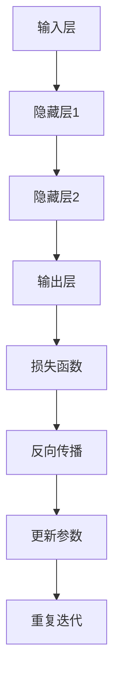
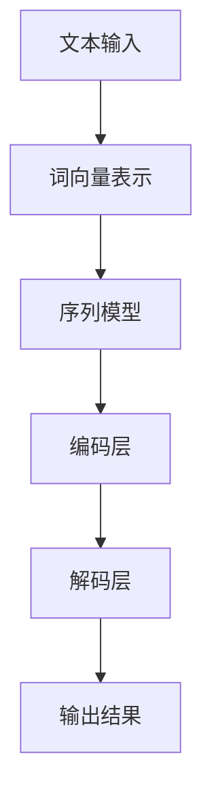
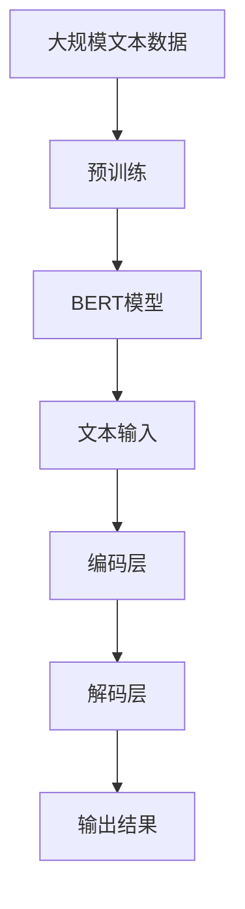

                 

### 引言

近年来，随着深度学习、自然语言处理等人工智能技术的迅猛发展，AI大模型（如GPT、BERT等）在各个领域的应用越来越广泛。这不仅推动了科学研究的前沿进展，也催生了大量的商业机会。在这样一个背景下，AI大模型创业成为一个热门话题。然而，创业之路并非一帆风顺，其中充满了挑战与机遇。本文将从AI大模型创业的背景、现状、技术实现、案例分析、团队建设以及未来展望等多个方面进行深入探讨，希望能够为广大创业者提供有益的指导和借鉴。

### 关键词

- AI大模型
- 创业
- 挑战与机遇
- 技术实现
- 案例分析
- 团队建设
- 未来展望

### 摘要

本文旨在全面解析AI大模型创业的现状、趋势与未来。首先，我们将介绍AI大模型的核心概念、发展历程及其应用现状。接着，分析AI大模型创业所面临的挑战与机遇，并通过成功与失败案例为创业者提供启示。然后，我们将深入探讨AI大模型的技术实现，包括深度学习与神经网络基础、自然语言处理技术、大规模预训练模型原理等。此外，本文还将关注AI大模型创业团队的建设与管理，以及未来AI大模型创业的趋势和方向。最后，提出针对创业者的建议，以应对面临的挑战并抓住机遇。通过本文的阐述，希望能够为广大AI大模型创业者提供有益的参考和指导。

## 《AI大模型创业：挑战与机遇并存的现状、趋势、未来与展望》目录大纲

### 第一部分：AI大模型创业背景与现状

**第1章：AI大模型概述**

- 1.1 AI大模型的核心概念
- 1.2 AI大模型的发展历程
- 1.3 当前AI大模型的应用现状

**第2章：AI大模型创业的挑战与机遇**

- 2.1 AI大模型创业的挑战
- 2.2 AI大模型创业的机遇
- 2.3 AI大模型创业的风险管理

**第3章：AI大模型创业案例分析**

- 3.1 成功案例解析
- 3.2 失败案例解析
- 3.3 案例总结与启示

### 第二部分：AI大模型创业的技术实现

**第4章：AI大模型技术基础**

- 4.1 深度学习与神经网络基础
- 4.2 自然语言处理技术概览
- 4.3 大规模预训练模型原理

**第5章：AI大模型应用开发**

- 5.1 AI大模型应用开发流程
- 5.2 AI大模型应用案例分析
- 5.3 AI大模型应用开发工具介绍

**第6章：AI大模型创业团队建设**

- 6.1 AI大模型创业团队角色
- 6.2 AI大模型创业团队管理
- 6.3 AI大模型创业团队协作

### 第三部分：AI大模型创业的未来展望

**第7章：AI大模型创业趋势分析**

- 7.1 AI大模型创业市场趋势
- 7.2 AI大模型创业技术趋势
- 7.3 AI大模型创业政策趋势

**第8章：AI大模型创业的未来方向**

- 8.1 AI大模型创业的挑战与机遇
- 8.2 AI大模型创业的发展前景
- 8.3 AI大模型创业的可持续性

**第9章：AI大模型创业的展望与建议**

- 9.1 创业者应具备的素质
- 9.2 创业者面临的挑战与应对策略
- 9.3 AI大模型创业的未来建议

### 附录

**附录A：AI大模型创业资源与工具**

- A.1 主流深度学习框架对比
- A.2 AI大模型创业常用工具介绍
- A.3 AI大模型创业参考资料

**附录B：AI大模型创业案例汇总**

- B.1 成功案例汇总
- B.2 失败案例汇总
- B.3 案例总结与启示

## 第一部分：AI大模型创业背景与现状

### 第1章：AI大模型概述

#### 1.1 AI大模型的核心概念

AI大模型（Artificial Intelligence Large Models）是指通过深度学习和大规模数据训练得到的人工智能模型，其特点在于拥有庞大的参数量和复杂的网络结构。这些模型在自然语言处理、计算机视觉、语音识别等领域表现出色，能够进行复杂的任务，如文本生成、图像分类、机器翻译等。AI大模型的核心概念包括以下几个方面：

1. **深度学习**：一种基于人工神经网络的机器学习技术，通过多层神经网络的堆叠，实现从原始数据到高维特征表示的映射。深度学习在大规模数据集上表现出强大的学习能力，是实现AI大模型的基础。

2. **大规模预训练**：通过在大规模数据集上进行预训练，使模型具备一定程度的通用性，然后通过微调（Fine-tuning）将其应用于特定任务。预训练使得AI大模型能够从大量无标签数据中学习到丰富的知识，从而提高模型性能。

3. **神经网络**：一种由大量神经元互联而成的计算模型，通过调整神经元之间的连接权重（即参数）来实现从输入到输出的映射。神经网络是实现深度学习的关键组件。

4. **参数量**：指模型中参数的数量，参数量越大，模型通常能够捕捉到更复杂的特征，但也会增加计算量和存储需求。

#### 1.2 AI大模型的发展历程

AI大模型的发展经历了几个关键阶段：

1. **早期探索**：20世纪50年代到80年代，神经网络和深度学习开始萌芽，但受限于计算资源和数据规模，发展缓慢。

2. **深度学习的兴起**：2006年，Hinton等人提出深度置信网络（Deep Belief Network），标志着深度学习的重新兴起。随着计算能力的提升和大数据的发展，深度学习逐渐成为人工智能领域的核心技术。

3. **AI大模型的崛起**：2012年，Hinton团队提出的AlexNet在ImageNet图像分类挑战中取得了突破性成绩，深度学习进入工业界和应用领域。此后，GPT、BERT等AI大模型相继问世，推动了自然语言处理和计算机视觉等领域的革命。

4. **当前发展**：AI大模型在各个领域持续发展，性能不断提升，应用范围不断扩大。随着云计算、边缘计算等技术的发展，AI大模型的应用场景更加丰富，从文本、图像到语音、视频等多模态数据。

#### 1.3 当前AI大模型的应用现状

当前，AI大模型在多个领域取得了显著的应用成果，具体如下：

1. **自然语言处理**：AI大模型在文本分类、情感分析、机器翻译、问答系统等任务中表现出色，如GPT-3、BERT等模型已经成为自然语言处理领域的标准工具。

2. **计算机视觉**：AI大模型在图像分类、目标检测、图像生成等任务中取得了突破性进展，如ResNet、Inception等模型在ImageNet图像分类挑战中取得了优异成绩。

3. **语音识别**：AI大模型在语音识别、语音合成、说话人识别等任务中具有广泛应用，如Google的语音识别技术已达到接近人类水平的准确性。

4. **医学影像**：AI大模型在医学影像分析中具有巨大潜力，如癌症检测、骨折诊断等任务，通过深度学习模型可以实现高度准确的诊断。

5. **自动驾驶**：AI大模型在自动驾驶领域发挥了重要作用，通过计算机视觉和自然语言处理技术，实现车辆的感知、决策和控制。

总之，AI大模型在当前的应用现状中已经取得了显著的成果，并在各个领域发挥着重要作用。随着技术的不断进步和应用场景的拓展，AI大模型的应用前景将更加广阔。

### 第2章：AI大模型创业的挑战与机遇

#### 2.1 AI大模型创业的挑战

AI大模型创业虽然充满了机遇，但也面临着诸多挑战。以下从技术挑战、市场挑战和资金挑战三个方面进行详细分析：

1. **技术挑战**：

   - **计算资源需求**：AI大模型通常需要大量的计算资源和存储空间。训练一个大规模模型可能需要数百万个参数，这要求高效的计算设备和存储系统。对于初创企业来说，投入大量的硬件设备是一个巨大的挑战。
   - **数据获取**：AI大模型的训练需要大量的高质量数据。数据的获取和处理是一个复杂且耗时的过程。初创企业可能面临数据不足或数据质量不高的问题，这会严重影响模型的表现。
   - **模型调优**：AI大模型的调优是一个迭代和反复的过程。初创企业可能缺乏经验丰富的工程师来优化模型，从而提高模型的性能和稳定性。

2. **市场挑战**：

   - **竞争激烈**：AI大模型市场非常热门，吸引了大量的创业公司和巨头公司的进入。初创企业需要面对强大的竞争对手，在市场上获得一席之地。
   - **用户需求多样化**：用户对于AI大模型的需求多种多样，初创企业需要快速响应市场需求，不断调整产品方向。这要求企业具备较高的灵活性和敏捷性。
   - **市场教育**：许多用户对AI大模型的理解不够深入，初创企业需要进行市场教育，向用户传达AI大模型的价值和应用场景。这需要企业投入大量的时间和资源。

3. **资金挑战**：

   - **高额的研发投入**：AI大模型创业需要大量的研发投入，包括硬件设备、软件工具、人力成本等。初创企业往往面临资金不足的问题，这会限制其发展速度。
   - **融资难度**：初创企业在融资过程中可能面临诸多困难。投资者可能对AI大模型市场的前景持谨慎态度，导致融资难度增加。
   - **资金管理**：初创企业需要合理管理和使用资金，确保资金能够高效地投入到研发和市场推广中。这要求企业具备良好的财务管理能力和战略规划能力。

#### 2.2 AI大模型创业的机遇

尽管AI大模型创业面临诸多挑战，但同时也存在着巨大的机遇：

1. **技术进步**：随着深度学习、自然语言处理等技术的不断进步，AI大模型的应用范围和性能不断提升。这为初创企业提供了广阔的发展空间。
2. **市场潜力**：AI大模型在各个领域的应用潜力巨大，如医疗、金融、教育、自动驾驶等。随着这些领域的数字化和智能化进程加速，AI大模型的市场需求将持续增长。
3. **政策支持**：许多国家和地区都出台了支持人工智能发展的政策，为AI大模型创业提供了有利的环境。政府提供的资金支持、税收优惠、知识产权保护等措施为初创企业提供了有力的支持。

#### 2.3 AI大模型创业的风险管理

为了应对AI大模型创业面临的挑战和抓住机遇，初创企业需要建立一套有效的风险管理机制：

1. **技术风险管理**：

   - **技术储备**：初创企业应持续关注技术前沿，保持技术储备，以应对技术变化带来的挑战。
   - **团队建设**：组建一支经验丰富、技能多样的人才团队，提高技术攻关能力。
   - **合作与开放**：与学术界、研究机构和行业合作伙伴建立合作关系，共享技术资源和研究成果。

2. **市场风险管理**：

   - **市场调研**：进行全面的市场调研，了解用户需求和市场趋势，制定有针对性的产品策略。
   - **产品迭代**：快速响应市场需求，通过持续的产品迭代来提升用户体验和市场竞争力。
   - **差异化竞争**：在竞争激烈的市场中，通过差异化竞争策略来获得市场份额。

3. **资金风险管理**：

   - **融资策略**：制定多样化的融资策略，包括股权融资、债务融资、政府补贴等，降低融资难度。
   - **资金管理**：建立严格的资金管理制度，确保资金的高效使用，避免浪费和过度依赖外部资金。
   - **风险预警**：建立风险预警机制，及时发现和应对潜在的财务风险。

通过以上风险管理措施，初创企业可以更好地应对AI大模型创业中的挑战，抓住机遇，实现可持续发展。

### 第3章：AI大模型创业案例分析

#### 3.1 成功案例解析

在AI大模型创业领域，有许多成功的案例可以为我们提供宝贵的经验和启示。以下将介绍几个典型的成功案例，并对其成功原因进行分析。

1. **案例一：OpenAI与GPT-3**

   OpenAI是一家成立于2015年的初创公司，专注于推动人工智能的研究与应用。其最著名的项目之一是GPT-3（Generative Pre-trained Transformer 3），这是一个具有1750亿参数的深度学习模型，能够进行自然语言生成、问答、翻译等多种任务。

   **成功原因分析**：

   - **技术创新**：OpenAI在GPT-3的开发中采用了大规模预训练和Transformer架构，这是深度学习领域的重大突破，使得模型具有强大的生成能力和灵活性。
   - **数据优势**：OpenAI利用了大量的互联网文本数据，进行预训练，从而获得了丰富的知识储备。
   - **市场定位**：OpenAI将GPT-3作为一个商业产品进行推广，提供了API接口，使得开发者可以方便地使用这一强大的工具，这大大拓展了其市场空间。

2. **案例二：DeepMind与AlphaGo**

   DeepMind是一家成立于2010年的初创公司，其最著名的项目是AlphaGo，这是一个用于围棋对弈的人工智能程序。2016年，AlphaGo在围棋比赛中战胜了世界冠军李世石，这一事件引起了全球关注。

   **成功原因分析**：

   - **技术创新**：DeepMind采用了深度学习和强化学习技术，通过自我对弈不断优化模型，实现了在围棋领域的高度突破。
   - **人才聚集**：DeepMind聚集了全球顶尖的科学家和工程师，形成了一支高水平的研发团队。
   - **战略布局**：DeepMind不仅关注学术研究，还将其技术应用于实际场景，如医疗、能源等领域，这为其赢得了广泛的关注和资源支持。

3. **案例三：科大讯飞与语音识别**

   科大讯飞是中国的一家知名人工智能企业，其语音识别技术在国内外享有盛誉。科大讯飞在语音识别领域的成功，为其在AI大模型创业领域奠定了坚实的基础。

   **成功原因分析**：

   - **技术积累**：科大讯飞在语音识别领域有着多年的技术积累，不断优化算法和模型，使其在识别准确性、稳定性等方面保持领先。
   - **市场需求**：语音识别技术在多个场景中具有广泛的应用，如智能助手、电话客服等，市场需求巨大。
   - **战略布局**：科大讯飞积极拓展市场，与多家企业合作，将语音识别技术应用于不同的行业和场景，形成了强大的市场竞争力。

#### 3.2 失败案例解析

尽管AI大模型创业领域有许多成功的案例，但也存在一些失败的案例。以下将介绍几个典型的失败案例，并对其失败原因进行分析。

1. **案例一：FloydHub**

   FloydHub是一家提供深度学习云计算平台的公司，成立于2015年。然而，在2018年，FloydHub宣布关闭，成为AI大模型创业领域的一个失败案例。

   **失败原因分析**：

   - **市场定位不准确**：FloydHub在创业初期未能准确把握市场需求，其提供的云计算平台与现有解决方案相比缺乏竞争力。
   - **竞争激烈**：AI大模型领域竞争激烈，FloydHub面临来自AWS、Google Cloud等巨头的强大竞争压力。
   - **资金问题**：FloydHub在融资过程中遇到了困难，资金不足导致其无法持续运营。

2. **案例二：Flare**

   Flare是一家提供机器学习文档生成工具的公司，成立于2017年。然而，在2019年，Flare宣布关闭，成为AI大模型创业领域的另一个失败案例。

   **失败原因分析**：

   - **产品功能不足**：Flare的产品功能相对单一，未能满足用户多样化的需求。
   - **市场竞争**：AI大模型领域已经有许多成熟的文档生成工具，Flare在市场竞争中处于劣势。
   - **团队解散**：在经营困难的情况下，Flare的核心团队解散，导致公司无法继续运营。

3. **案例三：Sift Science**

   Sift Science是一家提供欺诈检测服务的人工智能公司，成立于2012年。然而，在2020年，Sift Science被PayPal收购，其实际上已经退出了独立运营。

   **失败原因分析**：

   - **战略调整**：Sift Science在发展过程中进行了多次战略调整，未能找到合适的商业模式。
   - **市场竞争**：欺诈检测领域竞争激烈，Sift Science面临着来自传统企业和新兴企业的双重竞争压力。
   - **资金问题**：Sift Science在融资过程中遇到了困难，导致其无法继续独立运营。

#### 3.3 案例总结与启示

通过以上成功和失败的案例分析，我们可以得出以下启示：

1. **技术创新是关键**：在AI大模型创业中，技术创新是企业的核心竞争力。企业应持续关注技术前沿，保持技术储备，不断提升产品的竞争力。

2. **市场需求是核心**：企业应深入了解市场需求，提供满足用户需求的产品和服务。准确的市场定位和快速的产品迭代是企业成功的关键。

3. **团队建设是基础**：企业应注重团队建设，聚集高水平的科学家和工程师，形成强大的研发团队。良好的团队协作和人才储备是企业长期发展的基础。

4. **风险管理是保障**：企业应建立有效的风险管理机制，应对市场变化和技术挑战。通过合理的融资策略和资金管理，确保企业的稳定运营。

5. **战略布局是方向**：企业应制定清晰的战略规划，合理布局市场，拓展业务领域。通过多元化的发展战略，提升企业的市场竞争力。

总之，AI大模型创业领域充满机遇与挑战，成功的关键在于技术创新、市场需求、团队建设和风险管理。通过借鉴成功案例的经验和避免失败案例的教训，创业者可以更好地把握市场机遇，实现企业的可持续发展。

### 第4章：AI大模型技术基础

#### 4.1 深度学习与神经网络基础

深度学习（Deep Learning）是机器学习（Machine Learning）的一个子领域，它通过构建复杂的多层神经网络（Neural Networks），模拟人类大脑的学习过程，实现对数据的自动特征学习和复杂模式识别。在这一节中，我们将简要介绍深度学习的基本概念和神经网络的基础知识。

**基本概念：**

1. **神经网络**：神经网络是一种由大量神经元互联而成的计算模型，每个神经元接收多个输入信号，通过加权求和处理后产生一个输出信号。神经网络通过不断调整神经元之间的连接权重（参数）来学习输入数据和输出数据之间的映射关系。

2. **深度学习**：深度学习通过多层神经网络的堆叠，实现从原始数据到高维特征表示的映射。深度学习的核心思想是通过增加网络的层数，增加模型的表达能力，从而更好地捕捉数据中的复杂特征。

3. **激活函数**：激活函数是神经网络中用于引入非线性特性的函数，常见的激活函数有Sigmoid、ReLU、Tanh等。激活函数的作用是使神经网络能够学习非线性关系，从而提高模型的性能。

**基本原理：**

1. **前向传播**：在神经网络中，输入数据首先通过输入层传递到隐藏层，每个隐藏层的神经元接收前一层所有神经元的输出作为输入，通过加权求和处理后，加上偏置项，再通过激活函数产生输出。这个过程称为前向传播。

2. **反向传播**：在神经网络训练过程中，通过计算输出层预测值与真实值之间的误差，将误差传递回前一层，通过反向传播算法不断调整神经元的权重和偏置项，使误差最小化。反向传播是深度学习模型训练的核心算法。

3. **优化算法**：为了加速模型训练并提高收敛速度，常用的优化算法有随机梯度下降（SGD）、Adam等。这些算法通过迭代更新模型参数，使模型能够更快地接近最优解。

**流程图：**

#### 4.2 自然语言处理技术概览

自然语言处理（Natural Language Processing，NLP）是人工智能领域的一个重要分支，旨在使计算机能够理解、生成和处理自然语言。NLP技术在文本分类、情感分析、机器翻译、问答系统等领域具有广泛的应用。以下将简要介绍NLP技术的基本概念和主要方法。

**基本概念：**

1. **词向量表示**：词向量是一种将自然语言文本转换为计算机可处理的数值表示的方法。常见的词向量模型有Word2Vec、GloVe等。词向量能够捕捉词语的语义和上下文信息，是实现NLP任务的基础。

2. **序列模型**：序列模型是一种用于处理序列数据的神经网络模型，常见的序列模型有循环神经网络（RNN）、长短时记忆网络（LSTM）、门控循环单元（GRU）等。序列模型能够捕捉数据序列中的时间依赖关系，是NLP任务的核心。

3. **注意力机制**：注意力机制是一种用于提升模型在处理序列数据时对关键信息关注度的方法。在NLP任务中，注意力机制能够使模型更加关注文本中的重要词语，从而提高模型的性能。

**主要方法：**

1. **文本分类**：文本分类是一种将文本数据分为不同类别的方法。常见的文本分类算法有朴素贝叶斯、支持向量机（SVM）、深度学习分类模型等。

2. **情感分析**：情感分析是一种评估文本情感极性（如正面、负面）的方法。常用的情感分析算法有基于规则的方法、基于机器学习的方法、基于深度学习的方法等。

3. **机器翻译**：机器翻译是一种将一种语言的文本自动翻译成另一种语言的方法。常见的机器翻译模型有基于规则的翻译、统计机器翻译、神经机器翻译等。

4. **问答系统**：问答系统是一种能够自动回答用户问题的方法。常见的问答系统模型有基于信息检索的方法、基于模板的方法、基于机器学习的方法等。

**流程图：**

#### 4.3 大规模预训练模型原理

大规模预训练模型（Large-scale Pre-trained Models）是近年来NLP领域的一项重要进展，通过在大规模语料库上进行预训练，使模型具备了一定的通用性，从而在多个NLP任务上表现出色。以下将简要介绍大规模预训练模型的基本原理和常用模型。

**基本原理：**

1. **预训练**：预训练是指在大规模语料库上对模型进行训练，使模型学习到语言的基本结构和语义信息。预训练可以分为两个阶段：第一阶段是使用未标注的数据进行无监督预训练，使模型掌握语言的基本规律；第二阶段是使用标注数据对模型进行监督微调，使模型在特定任务上达到高性能。

2. **多任务学习**：多任务学习是指在一个大型模型上同时学习多个任务，从而提高模型的泛化能力和性能。大规模预训练模型通常采用多任务学习的方法，通过同时学习多个任务，使模型能够更好地捕捉语言中的通用特征。

3. **上下文敏感**：大规模预训练模型通过学习大量的文本数据，能够捕捉到词语在不同上下文中的语义信息。这使得模型在处理序列数据时能够更加准确地理解和生成文本。

**常用模型：**

1. **BERT**（Bidirectional Encoder Representations from Transformers）：BERT是一种双向的Transformer模型，通过在大量文本数据上进行预训练，使模型能够同时捕捉到词语的前后文信息，从而在多个NLP任务上取得了显著的性能提升。

2. **GPT**（Generative Pre-trained Transformer）：GPT是一种基于Transformer模型的预训练模型，通过在大量文本数据上进行无监督预训练，使模型具备了强大的文本生成能力。

3. **T5**（Text-To-Text Transfer Transformer）：T5是一种基于Transformer模型的文本转换模型，通过在大量文本数据上进行预训练，使模型能够在不同的文本转换任务上表现出色。

**流程图：**

通过以上对深度学习与神经网络基础、自然语言处理技术概览和大规模预训练模型原理的介绍，我们为AI大模型创业的技术实现奠定了基础。在接下来的章节中，我们将进一步探讨AI大模型应用开发的具体流程和技术细节。

### 第5章：AI大模型应用开发

#### 5.1 AI大模型应用开发流程

AI大模型应用开发是一个复杂的过程，涉及多个阶段和环节。以下将详细描述AI大模型应用开发的流程，并解释各个阶段的主要任务和挑战。

**1. 需求分析**

需求分析是AI大模型应用开发的第一步，旨在明确项目的目标和用户的需求。在这个阶段，需要与客户、利益相关者和用户进行深入沟通，收集和整理需求文档。主要任务包括：

- **明确业务目标**：理解客户希望通过AI大模型实现的具体业务目标，如文本生成、图像识别、语音识别等。
- **收集用户需求**：通过调查问卷、用户访谈等方式，了解用户对AI大模型功能的期望和需求。
- **制定需求文档**：基于收集到的需求，编写详细的需求文档，包括功能需求、性能要求、数据需求等。

主要挑战：

- **需求不明确**：客户可能对AI大模型的应用场景和功能不明确，导致需求文档不完整或不具体。
- **需求变动**：在项目开发过程中，需求可能会发生变化，需要及时调整项目计划和资源分配。

**2. 数据准备**

数据准备是AI大模型应用开发的核心环节，高质量的训练数据是模型性能的基础。在这个阶段，主要任务包括：

- **数据收集**：从内部数据源和外部数据源收集相关的训练数据，如文本、图像、音频等。
- **数据清洗**：清洗和预处理数据，包括去除噪声、填补缺失值、标准化数据等。
- **数据标注**：对于一些需要标注的数据，如图像分类、文本分类等，需要人工或半自动地进行标注。
- **数据存储**：将清洗和标注后的数据存储在数据库或数据湖中，方便后续使用。

主要挑战：

- **数据质量**：数据质量直接影响模型的性能，需要确保数据的一致性、完整性和准确性。
- **数据获取成本**：高质量的数据往往需要大量的时间和金钱投入，尤其是在需要大量标注数据的情况下。

**3. 模型设计**

模型设计是AI大模型应用开发的关键阶段，旨在选择合适的模型架构和训练策略。在这个阶段，主要任务包括：

- **模型选择**：根据应用场景和需求，选择合适的AI大模型，如GPT、BERT、Transformer等。
- **架构设计**：设计模型的架构，包括网络层数、神经元数量、连接方式等。
- **超参数调优**：选择合适的超参数，如学习率、批量大小、正则化参数等，通过实验找到最优的超参数组合。

主要挑战：

- **模型选择**：在选择模型时，需要权衡模型性能、计算资源消耗和开发成本等因素。
- **超参数调优**：超参数调优是一个复杂的过程，需要大量的实验和尝试。

**4. 模型训练**

模型训练是AI大模型应用开发的核心环节，旨在通过训练数据训练出高性能的模型。在这个阶段，主要任务包括：

- **数据预处理**：对训练数据进行预处理，如分词、编码等，使其适合输入到模型中。
- **训练过程**：使用训练数据对模型进行训练，通过反向传播算法不断调整模型参数。
- **验证与测试**：使用验证集和测试集评估模型性能，调整模型参数，确保模型在多种场景下的表现。

主要挑战：

- **计算资源消耗**：训练大规模AI大模型需要大量的计算资源和时间，尤其是在使用GPU或TPU等高性能计算设备时。
- **过拟合与欠拟合**：在训练过程中，需要避免模型过拟合或欠拟合，通过调整模型复杂度和训练策略来优化模型性能。

**5. 模型部署**

模型部署是将训练好的模型应用到实际场景中的过程。在这个阶段，主要任务包括：

- **模型压缩**：对于大规模模型，需要进行模型压缩，减少模型的参数量和计算量，提高模型的可部署性。
- **接口设计**：设计API接口，方便用户使用模型，如文本生成、图像识别、语音识别等。
- **部署与监控**：将模型部署到服务器或云端，并进行监控和优化，确保模型的高可用性和高性能。

主要挑战：

- **模型压缩**：模型压缩是一个平衡性能和计算资源的过程，需要选择合适的压缩方法。
- **部署与维护**：在部署模型后，需要进行监控和维护，确保模型的稳定运行和性能优化。

**6. 应用优化**

应用优化是AI大模型应用开发的重要环节，旨在提升模型在特定场景下的表现和用户体验。在这个阶段，主要任务包括：

- **性能优化**：通过优化模型架构、算法和计算资源，提升模型在特定场景下的性能。
- **用户体验优化**：根据用户反馈，优化模型的应用界面和交互方式，提升用户体验。
- **迭代更新**：持续收集用户反馈，进行模型和应用的迭代更新，不断提升模型性能和应用效果。

主要挑战：

- **性能与用户体验的平衡**：在优化模型性能和提升用户体验之间找到平衡点。
- **持续迭代与更新**：保持模型和应用的前沿性，不断进行迭代更新。

通过以上对AI大模型应用开发流程的详细描述，我们可以看到，AI大模型应用开发是一个复杂而系统的过程，涉及多个阶段和环节。只有通过科学的管理和精细的执行，才能确保项目的成功实施和落地。

#### 5.2 AI大模型应用案例分析

在本节中，我们将通过两个具体的AI大模型应用案例，探讨其开发过程、实现方法以及关键挑战。这些案例不仅展示了AI大模型在现实世界中的应用，也为创业者提供了宝贵的经验和启示。

**案例一：自动文本生成系统**

**开发过程：**

1. **需求分析**：客户希望通过一个自动文本生成系统，实现自动化撰写新闻文章、报告等文档。这个系统能够根据输入的标题和摘要，自动生成完整的文本内容。

2. **数据准备**：收集了大量的新闻文章数据，包括标题、摘要和正文，用于训练模型。此外，还收集了一些通用文本数据，以增强模型的泛化能力。

3. **模型设计**：选择了基于GPT的大规模预训练模型，并对其进行调整，以适应文本生成任务。模型架构包括输入层、编码层和解码层，其中编码层和解码层采用了Transformer架构。

4. **模型训练**：使用大规模训练数据集，对模型进行预训练，通过不断调整超参数，优化模型性能。训练过程中使用了GPU加速计算，以提高训练速度。

5. **模型部署**：将训练好的模型部署到云端服务器，并提供API接口，方便用户调用。

**实现方法：**

1. **文本预处理**：对输入的标题和摘要进行分词和编码，将其转换为模型能够处理的数值表示。

2. **模型调用**：用户通过API接口提交标题和摘要，模型接收这些数据后，生成相应的文本内容。

3. **文本后处理**：对生成的文本进行格式化和排版处理，使其符合用户需求。

**关键挑战：**

1. **数据质量**：文本生成系统的性能高度依赖数据质量，需要确保训练数据的一致性和准确性。

2. **模型调优**：大规模预训练模型的调优过程复杂，需要大量实验和尝试，才能找到最优的超参数组合。

3. **文本生成一致性**：确保生成的文本内容在风格和语法上的一致性，是一个挑战性的问题。

**案例二：智能客服系统**

**开发过程：**

1. **需求分析**：企业希望部署一个智能客服系统，能够自动回答用户的问题，减轻人工客服的工作负担。

2. **数据准备**：收集了大量客服对话数据，包括常见问题和对应的回答，用于训练模型。

3. **模型设计**：选择了基于BERT的预训练模型，并对其进行调整，以适应客服对话任务。模型架构包括输入层、编码层和解码层，其中编码层和解码层采用了Transformer架构。

4. **模型训练**：使用大规模训练数据集，对模型进行预训练，通过不断调整超参数，优化模型性能。训练过程中使用了分布式训练策略，以提高训练速度。

5. **模型部署**：将训练好的模型部署到服务器，并与企业现有的客服系统集成。

**实现方法：**

1. **对话预处理**：对输入的问题和回答进行分词和编码，将其转换为模型能够处理的数值表示。

2. **模型调用**：用户通过客服系统提交问题，模型接收这些问题后，生成相应的回答。

3. **回答后处理**：对生成的回答进行语法和逻辑检查，确保其准确性和流畅性。

**关键挑战：**

1. **对话理解**：智能客服系统的核心任务是理解用户的问题，这需要模型具备强大的语义理解能力。

2. **回答准确性**：生成的回答需要准确、合理，避免出现错误的回答。

3. **系统集成**：将智能客服系统与企业现有的客服系统进行集成，确保系统的稳定运行和用户体验。

通过以上两个案例，我们可以看到，AI大模型应用开发不仅需要深入的技术积累，还需要对实际业务场景的深入理解。在开发过程中，需要解决数据质量、模型调优和系统集成等关键挑战，才能实现高效的AI应用。

#### 5.3 AI大模型应用开发工具介绍

在AI大模型应用开发过程中，选择合适的工具和平台至关重要。以下将介绍几种主流的AI大模型应用开发工具，包括深度学习框架、开发平台和云端服务，为开发者提供参考。

**1. 深度学习框架**

深度学习框架是AI大模型应用开发的基础工具，提供了高效的模型训练和推理功能。以下是目前常用的深度学习框架：

- **TensorFlow**：由Google开发的开源深度学习框架，拥有广泛的用户基础和丰富的生态系统。TensorFlow支持多种编程语言，如Python、C++等，提供了丰富的API和工具，适用于各种深度学习任务。

- **PyTorch**：由Facebook开发的开源深度学习框架，以其动态计算图和灵活的编程接口而受到开发者的喜爱。PyTorch提供了直观的代码结构和强大的自动化微分功能，适合快速原型设计和实验。

- **Keras**：一个高级神经网络API，能够在TensorFlow和Theano等深度学习框架上运行。Keras提供了简洁的接口和丰富的预训练模型，适合快速构建和训练深度学习模型。

- **Apache MXNet**：由Apache Software Foundation开发的深度学习框架，支持多种编程语言，包括Python、R、Julia等。MXNet具有高性能的模型训练和推理功能，适用于大规模分布式训练和推理任务。

**2. 开发平台**

开发平台提供了集成的环境和工具，方便开发者进行AI大模型应用开发。以下是一些常用的开发平台：

- **Google Colab**：Google Colab是一个基于Jupyter Notebook的开源开发环境，提供了免费的GPU和TPU资源，适合进行深度学习和大数据处理。开发者可以在浏览器中编写和运行代码，无需配置本地环境。

- **AWS Sagemaker**：Amazon Sagemaker是AWS提供的云端机器学习平台，提供了全面的开发、训练和部署工具。开发者可以使用Python或Jupyter Notebook进行模型开发，并利用AWS的资源进行高效训练和部署。

- **Azure ML**：Microsoft Azure ML是Azure提供的机器学习服务，提供了丰富的API和工具，支持各种深度学习框架和算法。开发者可以轻松创建、训练和部署机器学习模型，并利用Azure的云计算资源进行大规模数据处理。

- **Docker**：Docker是一种容器化技术，用于打包和运行应用程序。通过Docker，开发者可以将AI大模型应用打包成容器，实现环境的隔离和一致性，方便在不同环境中进行开发和部署。

**3. 云端服务**

云端服务提供了强大的计算资源和存储资源，适用于大规模AI大模型应用开发和部署。以下是一些常用的云端服务：

- **Google Cloud AI**：Google Cloud AI提供了多种AI服务，包括自然语言处理、计算机视觉、语音识别等。开发者可以使用这些服务构建和部署AI应用，无需自行开发复杂的算法和模型。

- **AWS AI**：AWS AI提供了广泛的AI服务，包括机器学习、语音识别、文本分析等。开发者可以通过AWS AI构建和部署AI模型，并利用AWS的资源进行大规模数据处理和训练。

- **Microsoft Azure AI**：Microsoft Azure AI提供了多种AI服务，包括机器学习、计算机视觉、语音识别等。开发者可以使用Azure AI构建和部署AI应用，并利用Azure的资源进行高效训练和推理。

通过以上对AI大模型应用开发工具的介绍，开发者可以根据实际需求选择合适的工具和平台，提高开发效率和性能。同时，开发者还应关注工具和平台的更新和改进，以适应不断变化的技术趋势。

### 第6章：AI大模型创业团队建设

#### 6.1 AI大模型创业团队角色

在AI大模型创业过程中，团队角色和职能的清晰划分对于项目的成功至关重要。以下将介绍AI大模型创业团队中常见的几个关键角色及其主要职责。

1. **创始人**：作为团队的领导者，创始人负责制定公司的愿景和战略，协调团队资源，推动项目进展。创始人通常具备丰富的创业经验和行业背景，能够为团队提供方向和动力。

2. **技术总监（CTO）**：技术总监是团队的领军人物，负责技术架构的设计和实施。他们需要具备深厚的技术背景，能够领导团队进行技术创新和产品开发，确保项目的质量和进度。

3. **数据科学家**：数据科学家负责设计、开发和优化AI大模型。他们通常具备机器学习和深度学习的专业知识，能够处理和分析大规模数据，开发出高性能的算法和模型。

4. **算法工程师**：算法工程师负责具体实现AI大模型的算法，包括模型架构的设计、优化和调试。他们通常具备编程能力，能够将理论知识转化为高效的代码。

5. **产品经理**：产品经理负责产品的设计和开发，确保产品满足市场需求和用户期望。他们需要具备用户思维，能够与数据科学家和算法工程师紧密合作，将技术方案转化为实用的产品。

6. **前端工程师**：前端工程师负责开发用户界面和交互功能，确保产品的用户体验。他们通常具备Web开发经验，熟悉前端框架和库，能够实现美观、流畅的用户界面。

7. **后端工程师**：后端工程师负责开发服务器端的应用程序，处理数据存储、数据处理和业务逻辑。他们通常具备后端开发经验，熟悉各种后端框架和数据库技术。

8. **运维工程师**：运维工程师负责确保系统的稳定运行和性能优化，包括服务器部署、监控系统、备份和恢复等。他们需要具备系统管理和运维经验，能够处理各种突发情况和故障。

9. **市场营销专员**：市场营销专员负责推广产品，拓展市场，提升品牌知名度。他们需要了解市场动态和用户需求，制定有效的营销策略，与销售团队合作，实现销售目标。

10. **财务和行政人员**：财务和行政人员负责公司的财务管理、人力资源管理和日常行政事务。他们需要确保公司的财务健康和运营效率，为创业团队提供支持。

#### 6.2 AI大模型创业团队管理

团队管理是AI大模型创业成功的关键因素之一。以下将探讨团队管理的方法和策略，包括沟通、协作和激励机制。

1. **沟通**：

   - **透明沟通**：确保团队内部的信息透明，及时共享项目进展、问题和决策，避免信息孤岛。
   - **定期会议**：定期举行团队会议，包括周会、月度例会等，讨论项目进展、问题和解决方案。
   - **反馈机制**：建立反馈机制，鼓励团队成员提出意见和建议，促进团队改进和进步。

2. **协作**：

   - **分工明确**：根据团队成员的特长和兴趣，明确分工，确保每个人负责的任务清晰明确。
   - **协作工具**：使用协作工具，如Trello、JIRA等，进行任务分配、进度跟踪和团队协作。
   - **跨部门协作**：鼓励跨部门协作，促进不同团队之间的沟通和合作，提高整体效率。

3. **激励机制**：

   - **绩效评估**：建立科学的绩效评估体系，对团队成员的工作表现进行评估，确保公平和透明。
   - **奖励机制**：根据绩效评估结果，给予优秀的团队成员奖励，如奖金、股票期权等，激励团队成员的积极性和创造力。
   - **团队建设**：组织团队建设活动，如团建、培训等，增强团队凝聚力，提高团队成员的归属感和满意度。

#### 6.3 AI大模型创业团队协作

在AI大模型创业过程中，团队协作的效率和效果对于项目的成功至关重要。以下将介绍几种有效的团队协作方法。

1. **敏捷开发**：

   - **Scrum框架**：采用Scrum框架进行项目开发，将项目分为多个迭代周期，每个迭代周期进行计划、开发、评估和回顾，确保项目的持续改进。
   - **每日站会**：每日举行简短的站会，团队成员汇报进展、问题和计划，确保信息透明和协作顺畅。
   - **用户故事**：使用用户故事（User Story）进行任务分解，确保每个任务都围绕用户需求进行，提高开发效率和用户满意度。

2. **代码管理**：

   - **版本控制**：使用Git等版本控制工具，进行代码的版本管理和协作开发，确保代码的稳定性和可追溯性。
   - **代码审查**：进行代码审查，确保代码的质量和规范性，避免潜在的缺陷和漏洞。
   - **持续集成**：采用持续集成（Continuous Integration）策略，自动构建和测试代码，确保项目的持续交付和快速迭代。

3. **文档管理**：

   - **文档编写**：建立完善的文档体系，包括技术文档、用户手册、操作指南等，确保团队成员和用户能够快速了解和使用产品。
   - **知识共享**：鼓励团队成员分享经验和知识，通过文档、会议等方式进行知识传递，提高团队的整体能力。
   - **文档审查**：对文档进行定期审查和更新，确保文档的准确性和时效性。

通过以上团队协作方法的实施，AI大模型创业团队可以显著提高协作效率，确保项目的成功实施和快速迭代。同时，团队协作的成功也离不开有效的团队管理和激励机制的保障。

### 第7章：AI大模型创业趋势分析

#### 7.1 AI大模型创业市场趋势

随着人工智能技术的不断发展，AI大模型在各个行业中的应用越来越广泛，市场趋势呈现出以下几个显著特点：

1. **市场需求的快速增长**：AI大模型在自然语言处理、计算机视觉、语音识别等领域表现出强大的能力，其应用场景涵盖金融、医疗、教育、零售、自动驾驶等多个行业。随着这些行业的数字化转型加速，对AI大模型的需求将持续增长。

2. **垂直行业应用深化**：AI大模型的应用不仅限于通用场景，越来越多的企业开始探索在垂直行业中的应用。例如，金融行业利用AI大模型进行风险评估、欺诈检测；医疗行业利用AI大模型进行疾病诊断、药物研发；教育行业利用AI大模型进行个性化学习、智能辅导等。这种垂直行业应用的深化将进一步推动AI大模型市场的扩展。

3. **跨界融合**：AI大模型与其他前沿技术的融合，如区块链、物联网、边缘计算等，正在催生新的商业模式和应用场景。例如，区块链技术可以增强AI大模型的数据隐私和安全；物联网和边缘计算可以提升AI大模型的实时处理能力，从而实现更高效的应用。

4. **市场竞争加剧**：随着AI大模型市场的快速增长，吸引了大量初创公司和巨头企业的进入。这导致市场竞争日益激烈，企业需要不断创新和优化技术，以保持竞争优势。

5. **政策支持**：许多国家和地区都出台了支持人工智能发展的政策，为AI大模型创业提供了有利的环境。例如，中国发布了《新一代人工智能发展规划》，美国推出了《美国人工智能倡议》。这些政策提供了资金支持、税收优惠、知识产权保护等，有助于AI大模型创业的发展。

#### 7.2 AI大模型创业技术趋势

AI大模型创业的技术趋势主要体现在以下几个方面：

1. **模型规模和复杂度的提升**：随着计算能力和数据规模的提升，AI大模型的规模和复杂度不断增大。例如，GPT-3拥有1750亿个参数，Transformer架构在图像识别、语音识别等多个任务中表现出色。未来，AI大模型的规模和复杂度将继续提升，以应对更复杂的任务和应用场景。

2. **多模态融合**：AI大模型在处理多模态数据（如文本、图像、语音）方面具有巨大潜力。未来，多模态融合将成为技术趋势之一，通过整合不同模态的数据，提升模型对复杂任务的理解和生成能力。

3. **自监督学习和半监督学习**：自监督学习和半监督学习是当前AI大模型研究的重要方向。这些方法可以通过利用未标注的数据进行训练，减少对大量标注数据的依赖，提高训练效率。未来，这些方法将进一步提升AI大模型的学习效率和性能。

4. **模型压缩和加速**：为了降低AI大模型的计算成本和部署难度，模型压缩和加速技术将成为关键方向。例如，通过模型剪枝、量化、蒸馏等方法，减少模型的参数量和计算量，提高模型的效率和可部署性。

5. **安全与隐私**：随着AI大模型在关键领域的应用，安全与隐私问题日益重要。未来，AI大模型的安全和隐私保护技术将成为研究的热点，包括差分隐私、联邦学习、区块链等技术，旨在确保模型的安全性和用户隐私。

#### 7.3 AI大模型创业政策趋势

各国政府为推动人工智能技术的发展，纷纷出台了一系列政策和支持措施，对AI大模型创业产生了深远影响：

1. **资金支持**：许多国家和地区设立了专项资金，支持AI大模型研究与应用。例如，中国的“科技创新2030—重大项目”、美国的“国家人工智能计划”等，为AI大模型创业提供了充足的资金保障。

2. **税收优惠**：为了鼓励企业投资AI大模型研发，一些国家提供了税收优惠政策。例如，美国的小企业税收减免政策，中国的研发费用加计扣除政策等，有助于降低企业的税负，提高投资回报率。

3. **知识产权保护**：政府加强了对人工智能领域知识产权的保护，为AI大模型创业提供了法律保障。这有助于企业保护其技术和商业秘密，增强市场竞争力。

4. **人才培养**：各国政府积极推动人工智能人才的培养，通过设立高校课程、科研基金、实习项目等，培养更多AI大模型专业人才。这为AI大模型创业提供了人才储备。

5. **国际合作**：政府间和国际组织的合作日益加强，通过技术交流、联合研究等方式，推动AI大模型技术的发展和应用。例如，联合国教科文组织发起的“人工智能教育倡议”，旨在促进全球人工智能教育的发展。

通过以上政策趋势的推动，AI大模型创业将在全球范围内获得更加有利的发展环境，为创业企业带来更多的机遇和挑战。

### 第8章：AI大模型创业的未来方向

#### 8.1 AI大模型创业的挑战与机遇

在AI大模型创业领域，挑战与机遇并存。以下从技术、市场和政策三个方面分析AI大模型创业面临的挑战与机遇。

**技术挑战：**

1. **计算资源需求**：AI大模型通常需要大量的计算资源和存储空间，这要求企业具备强大的硬件支持。在计算资源有限的条件下，如何优化模型训练和推理过程，提高计算效率，是一个重要的技术挑战。

2. **数据质量和数量**：AI大模型训练需要大量的高质量数据，数据的质量和数量直接影响模型的表现。获取和标注高质量数据是一个复杂且耗时的过程，对于初创企业来说，如何有效地获取和利用数据资源是一个重大挑战。

3. **模型调优**：AI大模型调优是一个复杂的过程，需要大量的实验和尝试。初创企业可能缺乏经验丰富的工程师，难以高效地进行模型调优，从而影响模型性能。

**市场机遇：**

1. **垂直行业应用**：AI大模型在金融、医疗、教育、零售等垂直行业具有巨大的应用潜力。随着这些行业的数字化转型加速，对AI大模型的需求将持续增长，为创业者提供了广阔的市场空间。

2. **跨界融合**：AI大模型与其他技术的融合，如区块链、物联网、边缘计算等，将催生新的商业模式和应用场景。例如，区块链可以增强AI大模型的数据隐私和安全，物联网和边缘计算可以提高模型的实时处理能力。

3. **政策支持**：各国政府纷纷出台支持人工智能发展的政策，为AI大模型创业提供了有利的环境。例如，中国的“新一代人工智能发展规划”、美国的“美国人工智能倡议”等，为AI大模型创业提供了资金支持、税收优惠、知识产权保护等政策支持。

**政策挑战：**

1. **数据隐私与安全**：随着AI大模型在关键领域的应用，数据隐私和安全问题日益重要。政府如何平衡数据利用与保护，确保用户隐私和数据安全，是一个重要的政策挑战。

2. **伦理与法律**：AI大模型的应用涉及到伦理和法律问题，如算法歧视、隐私侵犯等。政府如何制定相关法律法规，确保AI大模型的合法合规应用，是一个重要的政策挑战。

**机遇与挑战的平衡：**

AI大模型创业者在面对挑战和机遇时，需要综合考虑技术、市场和政策环境，制定科学的发展战略。以下是一些建议：

1. **技术创新**：持续关注技术前沿，保持技术储备，通过技术创新提高模型性能和计算效率。

2. **数据管理**：建立完善的数据管理机制，确保数据的质量和数量，通过自动化数据标注和半监督学习方法，提高数据处理效率。

3. **市场定位**：深入了解市场需求，找准垂直行业应用方向，通过差异化竞争策略，获取市场份额。

4. **政策合规**：关注政策动态，确保企业的合法合规运营，积极参与政策制定和行业标准的制定。

通过以上措施，AI大模型创业者可以更好地应对挑战，抓住机遇，实现可持续发展。

#### 8.2 AI大模型创业的发展前景

AI大模型创业的发展前景广阔，将在未来几年内持续推动人工智能领域的变革。以下从市场潜力、技术创新和行业应用三个方面探讨AI大模型创业的发展前景。

**市场潜力：**

1. **垂直行业应用**：随着AI大模型在金融、医疗、教育、零售等垂直行业的深入应用，市场需求将持续增长。例如，在金融领域，AI大模型可以用于风险评估、欺诈检测、智能投顾等；在医疗领域，AI大模型可以用于疾病诊断、药物研发、个性化治疗等；在教育领域，AI大模型可以用于智能辅导、个性化学习等。

2. **跨界融合**：AI大模型与其他前沿技术的融合，如区块链、物联网、边缘计算等，将带来新的商业模式和应用场景。例如，区块链技术可以增强AI大模型的数据隐私和安全；物联网和边缘计算可以提升AI大模型的实时处理能力，实现更高效的应用。

3. **全球市场**：随着全球各国对人工智能技术的重视，AI大模型创业在全球市场具有巨大的潜力。例如，中国市场在AI大模型领域的投资和研发力度不断加大；欧美市场在AI大模型的商业化应用和市场规模方面也处于领先地位。未来，AI大模型创业将在全球范围内获得更广阔的市场空间。

**技术创新：**

1. **模型规模和复杂度提升**：随着计算能力和数据规模的提升，AI大模型的规模和复杂度将继续增大。例如，GPT-3拥有1750亿个参数，Transformer架构在多个任务中表现出色。未来，AI大模型将更加复杂，能够处理更复杂的任务和应用场景。

2. **多模态融合**：AI大模型在处理多模态数据（如文本、图像、语音）方面具有巨大潜力。未来，多模态融合将成为技术趋势之一，通过整合不同模态的数据，提升模型对复杂任务的理解和生成能力。

3. **自监督学习和半监督学习**：自监督学习和半监督学习是当前AI大模型研究的重要方向。这些方法可以通过利用未标注的数据进行训练，减少对大量标注数据的依赖，提高训练效率。未来，这些方法将进一步提升AI大模型的学习效率和性能。

4. **模型压缩和加速**：为了降低AI大模型的计算成本和部署难度，模型压缩和加速技术将成为关键方向。例如，通过模型剪枝、量化、蒸馏等方法，减少模型的参数量和计算量，提高模型的效率和可部署性。

**行业应用：**

1. **医疗健康**：AI大模型在医疗健康领域的应用将不断拓展，如疾病诊断、药物研发、个性化治疗等。例如，通过AI大模型，可以快速分析医疗影像，提高诊断准确性；通过AI大模型，可以预测药物的效果和副作用，加速新药研发。

2. **金融科技**：AI大模型在金融科技领域的应用将更加广泛，如智能投顾、风险管理、信用评估等。例如，通过AI大模型，可以实现个性化投资建议，提高投资收益率；通过AI大模型，可以识别欺诈行为，降低金融风险。

3. **智能制造**：AI大模型在智能制造领域的应用将提升生产效率和质量。例如，通过AI大模型，可以实现生产线的自动化控制，提高生产效率；通过AI大模型，可以实现质量检测，提高产品质量。

4. **智能交通**：AI大模型在智能交通领域的应用将提升交通管理效率和安全性。例如，通过AI大模型，可以实现交通流量预测，优化交通信号控制；通过AI大模型，可以实现车辆自动驾驶，提高交通安全性。

总之，AI大模型创业的发展前景广阔，将在未来几年内推动人工智能领域的深刻变革，为社会带来巨大的价值。创业者和研究者应抓住这一历史机遇，积极投入AI大模型的研究和应用，推动人工智能技术的发展。

#### 8.3 AI大模型创业的可持续性

AI大模型创业的可持续性是确保企业长期发展的关键。以下从技术创新、社会责任和环境可持续性三个方面探讨AI大模型创业的可持续性。

**技术创新**

1. **持续研发投入**：企业应持续投入研发资源，关注技术前沿，推动AI大模型技术的创新和进步。通过不断优化算法、提升模型性能和降低计算成本，企业可以在激烈的市场竞争中保持竞争优势。

2. **开源合作**：积极参与开源项目，与其他研究机构和企业合作，共同推动AI大模型技术的发展。开源合作不仅可以共享技术成果，还可以吸引更多人才和资源，提升企业的技术实力。

3. **知识共享**：建立知识共享机制，鼓励内部员工和技术伙伴进行知识交流和经验分享，提高团队的整体技术水平。通过持续的技术创新，企业可以不断推出具有竞争力的产品和服务。

**社会责任**

1. **公平与正义**：AI大模型在各个领域的应用需要遵循公平和正义的原则，避免算法偏见和歧视。企业应确保模型训练和推理过程透明，接受外部审计和监督，确保技术的公平性和正义性。

2. **隐私保护**：在数据收集和使用过程中，企业应严格遵守隐私保护法规，采取有效措施保护用户隐私。通过加密技术、隐私计算等手段，确保用户数据的安全和隐私。

3. **伦理合规**：企业应建立伦理委员会，制定伦理规范和操作流程，确保AI大模型的应用符合伦理要求。通过伦理合规，企业可以赢得社会的信任和支持，提升品牌形象。

**环境可持续性**

1. **绿色计算**：在AI大模型开发和部署过程中，企业应关注计算资源的使用效率，采用绿色计算技术，如节能服务器、分布式计算等，减少能源消耗和碳排放。

2. **循环经济**：在硬件设备采购和废弃物处理方面，企业应践行循环经济理念，通过回收再利用、废弃物处理等措施，减少环境负担。

3. **社会责任投资**：企业可以通过社会责任投资（SRI），支持环保、教育、医疗等领域的项目，实现企业社会责任与商业利益的有机结合。

通过技术创新、社会责任和环境可持续性的共同努力，AI大模型创业企业可以实现长期可持续发展，为社会创造更大价值。

### 第9章：AI大模型创业的展望与建议

#### 9.1 创业者应具备的素质

在AI大模型创业领域，成功的关键在于创业者是否具备以下几方面的素质：

1. **技术实力**：创业者应具备深厚的计算机科学和人工智能知识，熟悉深度学习、自然语言处理、计算机视觉等核心技术，能够设计并优化大规模模型。

2. **创新能力**：创业者应具备敏锐的洞察力，能够发现市场中的新需求和新机会，并通过技术创新来满足这些需求。

3. **领导力**：创业者需要具备强大的领导力，能够带领团队克服困难，激发团队成员的潜力，推动项目顺利实施。

4. **沟通能力**：创业者应具备出色的沟通能力，能够与团队成员、客户和合作伙伴有效沟通，确保项目的顺利进行。

5. **市场敏锐度**：创业者需要对市场动态有深刻的理解，能够准确把握市场需求和趋势，及时调整产品策略。

6. **风险管理能力**：创业者应具备良好的风险管理能力，能够预见并应对创业过程中可能遇到的各种风险，确保企业的稳定运营。

#### 9.2 创业者面临的挑战与应对策略

在AI大模型创业过程中，创业者将面临一系列挑战，以下是一些常见的挑战及应对策略：

1. **计算资源限制**：

   - **挑战**：AI大模型训练需要大量的计算资源，对于初创企业来说，这可能是一个巨大的挑战。
   - **应对策略**：通过与云计算平台合作，利用云端的计算资源，降低硬件投入成本。同时，采用分布式训练和模型压缩技术，提高计算效率。

2. **数据获取与处理**：

   - **挑战**：高质量的数据是AI大模型训练的关键，初创企业可能面临数据不足或数据质量不高的问题。
   - **应对策略**：通过自动化数据标注工具和半监督学习方法，提高数据处理效率。此外，可以与行业合作伙伴共享数据资源，提高数据的获取质量。

3. **模型调优与优化**：

   - **挑战**：AI大模型的调优过程复杂，需要大量的实验和尝试。
   - **应对策略**：建立一套科学的模型调优流程，通过自动化工具和实验平台，提高调优效率。同时，组建经验丰富的技术团队，提供专业的调优支持。

4. **市场竞争**：

   - **挑战**：AI大模型市场竞争激烈，初创企业需要面对强大的竞争对手。
   - **应对策略**：通过差异化竞争策略，找准市场细分领域，提供具有独特价值的产品和服务。此外，积极拓展市场，提高品牌知名度。

5. **资金问题**：

   - **挑战**：初创企业在融资过程中可能面临诸多困难，资金不足会影响企业的发展。
   - **应对策略**：制定多元化的融资策略，包括股权融资、债务融资、政府补贴等，降低融资难度。同时，注重资金管理，确保资金的高效使用。

#### 9.3 AI大模型创业的未来建议

为了在AI大模型创业中取得成功，创业者可以参考以下建议：

1. **持续学习与进步**：创业者应持续关注技术前沿，不断学习新知识，提升自身的技术水平。通过参加技术会议、培训课程和阅读相关文献，保持对技术的敏感性和创新能力。

2. **构建技术团队**：创业者应重视团队建设，组建一支技术实力雄厚、经验丰富的团队。通过科学的团队管理和激励机制，激发团队成员的潜力，提高团队的整体战斗力。

3. **市场需求导向**：深入了解市场需求，紧密结合用户需求，开发具有市场竞争力的高质量产品。通过用户反馈和数据分析，持续优化产品和服务，提升用户满意度。

4. **政策合规与伦理**：遵循相关政策和伦理规范，确保企业的合法合规运营。在数据收集、使用和处理过程中，严格保护用户隐私，避免算法偏见和歧视。

5. **开放合作与共享**：积极参与开源社区，与其他研究机构和企业开展合作，共享技术成果和资源。通过开放合作，提升企业的技术实力和市场影响力。

6. **创新商业模式**：探索新的商业模式，如平台化、服务化等，拓展企业的盈利渠道。通过创新的商业模式，提高企业的市场竞争力和可持续发展能力。

通过以上建议，创业者可以在AI大模型创业的道路上取得更好的成果，推动人工智能技术的发展和应用。

### 附录

#### 附录A：AI大模型创业资源与工具

**A.1 主流深度学习框架对比**

在AI大模型创业过程中，选择合适的深度学习框架是至关重要的。以下是对几个主流深度学习框架的简要对比：

| 框架 | 特点 | 适用场景 |  
| :---: | :---: | :---: |  
| TensorFlow | 生态丰富，支持多种编程语言，如Python、C++ | 大规模模型训练，跨平台部署 |  
| PyTorch | 动态计算图，灵活的编程接口，自动微分功能 | 快速原型设计，模型调优 |  
| Keras | 高级神经网络API，简化模型构建和训练过程 | 快速搭建和训练模型 |  
| Apache MXNet | 支持多种编程语言，高效分布式训练 | 大规模分布式训练，跨平台部署 |  

**A.2 AI大模型创业常用工具介绍**

以下是一些AI大模型创业中常用的工具，包括数据标注、模型训练、模型部署等方面的工具：

- **数据标注工具**：LabelImg、ImageLabel、Annotate+等，用于图像、视频和文本数据的标注。
- **模型训练工具**：GPU云平台，如Google Colab、AWS Sagemaker等，提供高性能的计算资源。
- **模型部署工具**：Flask、Django等Web框架，用于构建API接口；Kubernetes等容器编排工具，用于模型部署和运维。
- **监控与日志工具**：Prometheus、ELK（Elasticsearch、Logstash、Kibana）等，用于监控和日志分析。

**A.3 AI大模型创业参考资料**

以下是一些AI大模型创业的参考资料，包括书籍、论文和在线课程等：

- **书籍**： 
  - 《深度学习》（Ian Goodfellow、Yoshua Bengio、Aaron Courville 著）  
  - 《强化学习》（Richard S. Sutton、Andrew G. Barto 著）  
  - 《Python深度学习》（François Chollet 著）

- **论文**： 
  - 《Attention is All You Need》（Ashish Vaswani 等，2017）  
  - 《BERT: Pre-training of Deep Bidirectional Transformers for Language Understanding》（Jacob Devlin 等，2018）  
  - 《Generative Pre-trained Transformers》（Tom B. Brown 等，2020）

- **在线课程**： 
  - Coursera上的“深度学习”课程（吴恩达教授主讲）  
  - Udacity的“机器学习工程师纳米学位”课程  
  - edX上的“人工智能基础”课程（麻省理工学院主讲）

通过以上资源，创业者可以更好地了解AI大模型的技术原理和应用，为创业项目提供有力的支持。

#### 附录B：AI大模型创业案例汇总

**B.1 成功案例汇总**

以下是一些AI大模型创业的成功案例：

1. **OpenAI与GPT-3**：OpenAI开发的GPT-3是当前最先进的自然语言处理模型，通过大规模预训练和Transformer架构，展示了强大的文本生成能力。

2. **DeepMind与AlphaGo**：DeepMind的AlphaGo在2016年击败了世界围棋冠军李世石，标志着人工智能在复杂任务上取得了重大突破。

3. **科大讯飞与语音识别**：科大讯飞在语音识别技术方面取得了显著成果，其语音识别系统在多个任务中达到国际领先水平。

**B.2 失败案例汇总**

以下是一些AI大模型创业的失败案例：

1. **FloydHub**：FloydHub是一家提供深度学习云计算平台的公司，但由于市场定位不准确和竞争激烈，最终在2018年关闭。

2. **Flare**：Flare是一家提供机器学习文档生成工具的公司，但由于产品功能不足和市场竞争，在2019年关闭。

3. **Sift Science**：Sift Science是一家提供欺诈检测服务的人工智能公司，但在2020年被收购，实际上已经退出了独立运营。

**B.3 案例总结与启示**

通过成功和失败的案例，我们可以得到以下启示：

1. **技术创新是关键**：成功案例展示了技术创新的重要性，企业应持续关注技术前沿，保持技术储备。

2. **市场需求是核心**：市场需求是决定创业项目成功与否的关键因素，企业应深入了解市场需求，提供高质量的产品和服务。

3. **团队建设是基础**：企业应注重团队建设，聚集高水平的科学家和工程师，形成强大的研发团队。

4. **风险管理是保障**：企业应建立有效的风险管理机制，应对市场变化和技术挑战。

5. **战略布局是方向**：企业应制定清晰的战略规划，合理布局市场，拓展业务领域。

通过以上案例总结，创业者可以更好地把握AI大模型创业的机遇，规避风险，实现可持续发展。

