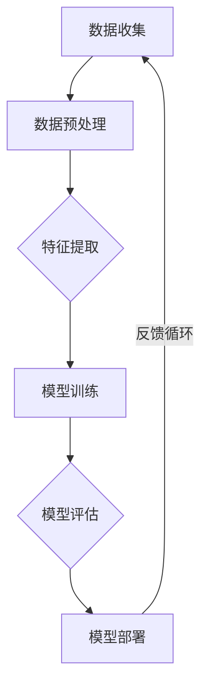

                 

### 第一部分：引言

#### 1.1 书籍背景与目的

在当今技术飞速发展的时代，人工智能（AI）已经成为推动各行业变革的重要力量。特别是随着深度学习和大型神经网络技术的不断进步，AI大模型在各个领域的应用逐渐成熟，展现出巨大的潜力。在这本书中，我们将探讨AI大模型在智能财务分析中的商业化探索，旨在揭示这一新兴领域的前沿技术和应用场景，为相关从业者和研究者提供有价值的参考。

**1.1.1 人工智能与财务分析的结合背景**

财务分析是企业管理的重要环节，通过对财务数据的分析和预测，帮助企业做出科学决策。然而，传统的财务分析方法往往依赖于人工经验，效率低下且易出错。随着大数据和人工智能技术的快速发展，利用AI大模型进行财务分析成为一种新的可能。AI大模型能够通过学习海量数据，发现潜在的模式和规律，提供更为精准和高效的财务分析结果。

**1.1.2 书籍的目标与重要性**

本书的主要目标是：

1. 系统介绍AI大模型的基础理论和核心算法，帮助读者理解AI大模型的工作原理和构建方法。
2. 深入探讨AI大模型在财务分析中的应用，分析其带来的技术变革和商业机遇。
3. 分析国内外AI财务分析服务公司的商业模式和成功案例，为相关企业提供参考。
4. 探讨AI大模型商业化过程中面临的挑战和解决策略，为未来智能化财务分析的发展提供方向。

本书的重要性在于：

1. 拓展了人工智能在财务领域的应用范围，推动了财务分析的智能化进程。
2. 为企业提供了新的财务管理工具，有助于提高决策效率和竞争力。
3. 为金融行业提供了创新的技术手段，有助于提升风险管理能力和市场预测准确性。

**1.1.3 读者对象**

本书适合以下读者群体：

1. 金融、财务、管理等相关专业的师生和研究人员。
2. 对人工智能和财务分析感兴趣的工程技术人员。
3. 企业高管、财务管理人员以及金融分析师。
4. 对新兴技术领域有浓厚兴趣的广大读者。

通过本书，读者将能够：

1. 理解AI大模型在财务分析中的应用场景和技术原理。
2. 掌握AI大模型的基础算法和训练方法。
3. 分析AI大模型商业化的前景和策略。
4. 结合实际案例，学习AI大模型在财务分析中的实际应用。

#### 1.2 AI大模型概述

**1.2.1 AI大模型的概念与特点**

AI大模型是指通过深度学习技术训练出的具有大规模参数、高度非线性映射能力的神经网络模型。这类模型通常具有以下几个特点：

1. **参数规模巨大**：大模型包含数百万甚至数十亿个参数，能够捕捉到复杂的输入特征和关系。
2. **高度非线性**：大模型采用多层神经网络结构，通过非线性变换，能够实现复杂函数的逼近。
3. **自适应学习能力**：大模型具备较强的自适应学习能力，能够从海量数据中自动提取特征，进行自我优化。
4. **泛化能力**：大模型通过训练，能够泛化到未见过的数据，具备较强的实际应用价值。

**1.2.2 AI大模型在财务分析中的应用价值**

AI大模型在财务分析中具有广泛的应用价值，主要体现在以下几个方面：

1. **财务预测**：大模型能够通过对历史财务数据的分析，预测未来的财务状况，帮助管理者做出科学决策。
2. **财务报表分析**：大模型能够自动分析财务报表，提取关键信息，为企业提供财务健康状况的实时监控。
3. **投资决策支持**：大模型能够通过分析市场数据和财务指标，为投资决策提供参考，提高投资收益。
4. **风险管理**：大模型能够识别潜在的财务风险，提供风险预警和应对策略，降低企业损失。

**1.2.3 AI大模型的发展现状与趋势**

AI大模型的发展经历了多个阶段：

1. **早期探索**：2000年代初期，深度学习开始受到关注，但受限于计算资源和数据规模，大模型的训练和应用受到限制。
2. **快速发展**：随着计算能力的提升和数据规模的增大，2010年代初期，AI大模型取得了显著的进展，例如GPT和BERT等模型的出现。
3. **商业化应用**：近年来，AI大模型在金融、医疗、制造等多个领域实现了商业化应用，成为企业提升竞争力的关键技术。

未来，AI大模型的发展趋势包括：

1. **模型规模和计算能力提升**：随着量子计算和新型计算架构的发展，大模型的规模和计算能力将得到进一步提升。
2. **多模态数据处理**：AI大模型将能够处理多种数据类型，如文本、图像、语音等，实现更全面的智能分析。
3. **可解释性和可靠性增强**：通过改进模型结构和算法，增强大模型的可解释性和可靠性，提高其在实际应用中的可信度。
4. **跨领域应用融合**：AI大模型将与其他领域技术融合，推动智能化应用的不断拓展。

综上所述，AI大模型在财务分析中的应用前景广阔，将成为企业智能化发展的关键驱动力。接下来，我们将进一步探讨AI大模型的技术基础及其在财务分析中的应用。 <|endoftext|> 

### 第一部分：引言

#### 1.3 深度学习与智能财务分析的结合

随着深度学习的快速发展，AI大模型在各个领域的应用日益广泛，财务分析领域也不例外。深度学习是一种通过多层神经网络进行数据学习和特征提取的人工智能技术，其核心思想是通过逐层抽象和建模，从原始数据中提取有意义的特征，实现复杂任务的自动化。智能财务分析则是指利用计算机技术和算法，对财务数据进行高效处理和分析，辅助企业进行财务管理和决策。

**1.3.1 深度学习在财务分析中的应用**

深度学习在财务分析中的应用主要体现在以下几个方面：

1. **财务预测**：通过深度学习模型，可以自动学习和预测企业的财务指标，如收入、利润、现金流等。这些预测结果可以帮助企业管理者制定更合理的财务规划和决策。
   
2. **财务报表分析**：深度学习模型能够对财务报表进行自动分析和解读，提取出关键的财务信息，如负债、资产、收入等。通过这些信息，企业可以更全面地了解自己的财务状况。

3. **信用评估**：深度学习模型可以通过分析企业的历史财务数据，预测企业的信用风险。这对于金融机构来说，有助于降低贷款违约的风险。

4. **市场预测**：深度学习模型还可以通过对市场数据和企业财务数据的分析，预测市场的走势和趋势。这些预测可以为企业的投资决策提供有力支持。

**1.3.2 智能财务分析的优势**

智能财务分析相较于传统财务分析方法，具有以下优势：

1. **高效性**：深度学习模型可以快速处理和分析大量的财务数据，提高了财务分析的效率。

2. **准确性**：通过学习海量数据，深度学习模型能够更准确地预测和评估企业的财务状况，减少人为因素导致的误差。

3. **全面性**：智能财务分析能够全面分析财务数据，提供多维度、全方位的财务信息，帮助企业更全面地了解财务状况。

4. **自动化**：深度学习模型可以实现财务分析的自动化，减少了对人工的依赖，降低了成本。

**1.3.3 未来发展趋势**

随着技术的不断进步和数据规模的持续扩大，深度学习和智能财务分析将继续发展，并呈现以下趋势：

1. **多模态数据处理**：未来的智能财务分析将能够处理多种类型的数据，如图像、语音、文本等，实现更全面的财务信息分析。

2. **实时分析**：随着计算能力的提升，深度学习模型将能够实现实时财务分析，为企业管理者提供更及时、准确的决策支持。

3. **个性化分析**：通过深度学习技术，智能财务分析将能够根据企业的个性化需求，提供定制化的财务分析服务。

4. **跨领域融合**：智能财务分析将与其他领域的技术，如物联网、区块链等，实现跨领域融合，推动财务分析的智能化和全面化。

综上所述，深度学习和智能财务分析的结合，为财务分析领域带来了新的变革和机遇。通过深入研究和应用这些技术，企业可以更有效地管理财务，提高决策的准确性和效率，从而在激烈的市场竞争中取得优势。接下来，我们将进一步探讨AI大模型的技术基础，为后续章节的内容奠定基础。  

### 第二部分：AI大模型技术基础

#### 2.1 人工智能基础理论

人工智能（AI）是计算机科学的一个分支，旨在使计算机具备模拟、延伸和扩展人类智能的能力。AI的研究领域广泛，包括机器学习、自然语言处理、计算机视觉、智能决策等。其中，机器学习是AI的核心技术之一，它通过算法和统计模型，使计算机能够从数据中学习，做出决策和预测。

**2.1.1 机器学习与深度学习基础**

1. **机器学习的概念**：

   机器学习是指通过算法和统计模型，从数据中学习并提取规律，以实现特定任务的方法。机器学习的主要任务是建立数据与输出结果之间的映射关系，常见的机器学习算法包括线性回归、逻辑回归、决策树、支持向量机（SVM）等。

2. **深度学习的概念**：

   深度学习是机器学习的一种特殊形式，它使用多层神经网络（Neural Networks）进行数据学习和特征提取。深度学习通过模拟人脑神经元之间的连接，将输入数据逐层抽象，从而实现复杂函数的逼近和特征提取。

3. **深度学习与机器学习的区别**：

   - **结构**：深度学习具有多层的神经网络结构，而传统机器学习算法通常只有一层或多层结构。
   - **数据量**：深度学习需要大量的数据来训练模型，而传统机器学习算法对数据量的要求相对较低。
   - **计算资源**：深度学习通常需要更多的计算资源，尤其是GPU和TPU等专用硬件。

**2.1.2 AI大模型的训练与优化方法**

1. **数据预处理**：

   数据预处理是AI大模型训练的重要步骤，包括数据清洗、数据归一化、数据增强等。数据清洗的目的是去除噪声和异常值，提高数据质量。数据归一化是将不同量纲的数据转换为同一量纲，便于模型训练。数据增强是通过生成合成数据，增加数据多样性，提高模型的泛化能力。

2. **模型训练**：

   模型训练是AI大模型的核心环节，包括前向传播、反向传播和权重更新。前向传播是将输入数据通过神经网络逐层计算，得到输出结果。反向传播是根据输出结果与真实值的差异，反向更新神经网络的权重。权重更新是通过优化算法（如梯度下降、Adam等），使模型损失函数最小化。

3. **模型优化**：

   模型优化包括超参数调整、模型正则化、增强训练等。超参数调整是通过调整学习率、批量大小等参数，优化模型性能。模型正则化是通过引入正则化项（如L1、L2正则化），防止模型过拟合。增强训练是通过增加训练数据、改进训练策略等，提高模型泛化能力。

**2.1.3 数据预处理与特征提取**

1. **数据预处理**：

   数据预处理是AI大模型训练的基础，包括以下步骤：

   - **数据清洗**：去除噪声和异常值，提高数据质量。
   - **数据归一化**：将不同量纲的数据转换为同一量纲，便于模型训练。
   - **数据增强**：生成合成数据，增加数据多样性，提高模型泛化能力。

2. **特征提取**：

   特征提取是将原始数据转换为具有代表性的特征表示，便于模型训练。特征提取的方法包括：

   - **统计特征**：计算原始数据的基本统计量，如均值、方差、最大值等。
   - **文本特征**：通过词袋模型、TF-IDF、Word2Vec等将文本数据转换为向量表示。
   - **图像特征**：通过卷积神经网络（CNN）提取图像特征。

#### 2.2 大模型核心算法

**2.2.1 GPT与BERT算法原理**

1. **GPT（Generative Pre-trained Transformer）**

   GPT是一种基于Transformer架构的生成模型，它通过预训练的方式，从海量文本数据中学习语言规律，实现文本生成和文本分类等任务。

   - **预训练过程**：GPT在预训练阶段，通过无监督的方式，学习文本数据的语言模式和统计规律。具体来说，GPT使用一种 masked language model（MLM）任务，即在文本序列中随机遮盖一部分词，然后通过预测这些遮盖的词来训练模型。

   - **微调过程**：在预训练后，GPT可以通过微调的方式，适应特定的下游任务。例如，在文本分类任务中，GPT可以添加分类层，对文本进行分类。

2. **BERT（Bidirectional Encoder Representations from Transformers）**

   BERT是一种基于Transformer的双向编码器模型，它通过预训练的方式，学习文本的双向表示，实现自然语言处理（NLP）任务。

   - **预训练过程**：BERT在预训练阶段，通过双向编码的方式，同时考虑文本的前后关系，学习文本的语义表示。具体来说，BERT使用一种 masked language model（MLM）任务和 next sentence prediction（NSP）任务。

   - **微调过程**：在预训练后，BERT可以通过微调的方式，适应特定的下游任务。例如，在文本分类任务中，BERT可以添加分类层，对文本进行分类。

**2.2.2 Transformer架构详解**

Transformer是一种基于自注意力机制的序列模型，它在自然语言处理、计算机视觉等领域取得了显著的成果。Transformer的核心思想是利用自注意力机制（Self-Attention）来捕捉序列数据中的长距离依赖关系。

1. **自注意力机制**：

   自注意力机制是一种计算输入序列中每个词与其他词之间关联性的方法。具体来说，自注意力机制通过计算每个词与所有其他词之间的相似度，然后将这些相似度加权求和，得到每个词的注意力得分。注意力得分表示了每个词在序列中的重要性。

2. **多头注意力**：

   多头注意力是一种扩展自注意力机制的方法，它通过将自注意力机制分解为多个独立的注意力头，每个头关注输入序列的不同方面。多头注意力能够提高模型的表示能力，捕捉更复杂的序列关系。

3. **编码器与解码器**：

   Transformer包括编码器（Encoder）和解码器（Decoder）两个部分。编码器负责将输入序列编码为固定长度的向量表示，解码器负责根据编码器的输出，生成输出序列。编码器和解码器之间通过自注意力机制和多头注意力机制进行交互，实现序列的编码和解码。

**2.2.3 算法对比与选择**

1. **GPT与BERT的对比**：

   - **预训练任务**：GPT主要采用 masked language model（MLM）任务，而BERT同时采用 MLM 和 next sentence prediction（NSP）任务。
   - **预训练效果**：BERT 在预训练阶段同时学习文本的双向表示，通常具有更好的预训练效果。
   - **下游任务适应性**：GPT 和 BERT 都可以通过微调适应下游任务，但 BERT 在某些任务（如文本分类）中表现更好。

2. **选择算法的考虑因素**：

   - **任务类型**：针对不同的下游任务，选择合适的算法。例如，在文本生成任务中，GPT 具有更好的效果；在文本分类任务中，BERT 具有更好的表现。
   - **数据规模**：算法的预训练效果与数据规模密切相关。对于数据规模较大的任务，选择 GPT 或 BERT 等预训练模型可能更合适。
   - **计算资源**：GPT 和 BERT 的计算资源需求较大，选择算法时需要考虑实际计算资源。

#### 2.3 AI大模型在财务分析中的应用

**2.3.1 财务数据分析的需求与挑战**

财务分析是企业管理和决策的重要环节，随着企业数据规模的不断扩大和数据来源的多样化，传统的财务分析方法面临着巨大的挑战。AI大模型在财务分析中的应用，能够有效地解决这些问题，提升财务分析的效率和准确性。

1. **需求**：

   - **复杂财务指标的预测**：企业需要预测未来的财务指标，如收入、利润、现金流等，以制定合理的财务规划。
   - **财务报表的自动化分析**：企业希望实现财务报表的自动化分析，提取关键信息，提供财务健康状况的实时监控。
   - **信用风险评估**：金融机构需要评估企业的信用风险，降低贷款违约的风险。
   - **市场预测与投资决策**：企业需要通过财务分析，预测市场走势和趋势，为投资决策提供支持。

2. **挑战**：

   - **数据质量**：财务数据通常包含噪声、缺失值和异常值，影响模型的训练和预测效果。
   - **数据多样性**：财务数据类型多样，包括文本、图像、表格等，需要统一处理和整合。
   - **计算资源**：AI大模型的训练和预测需要大量的计算资源，尤其是大规模模型。
   - **模型可解释性**：大模型的预测结果往往缺乏可解释性，难以理解模型决策的依据。

**2.3.2 大模型在财务分析中的应用场景**

AI大模型在财务分析中具有广泛的应用场景，以下是一些典型的应用实例：

1. **财务预测**：

   - **收入预测**：通过分析历史收入数据和业务模式，预测未来的收入情况，为企业制定销售策略提供支持。
   - **利润预测**：基于历史利润数据和成本结构，预测未来的利润水平，帮助企业控制成本，提高盈利能力。
   - **现金流预测**：预测企业的现金流状况，为企业提供资金规划和融资决策的依据。

2. **财务报表分析**：

   - **报表结构化**：将非结构化的财务报表数据转换为结构化数据，便于进一步分析和处理。
   - **报表分类**：对财务报表进行自动分类，提高报表处理的效率。
   - **关键指标提取**：提取财务报表中的关键指标，如负债、资产、收入等，为企业提供全面的财务信息。

3. **信用评估**：

   - **信用评分模型**：通过分析企业的历史财务数据和信用记录，构建信用评分模型，评估企业的信用风险。
   - **贷款审批**：基于信用评分模型，快速评估企业的贷款申请，提高审批效率。
   - **信用风险管理**：监测企业的信用风险变化，提供风险预警和应对策略。

4. **市场预测与投资决策**：

   - **市场趋势预测**：通过分析市场数据和财务指标，预测市场的走势和趋势，为投资决策提供支持。
   - **股票交易策略**：基于历史股价数据和财务指标，构建交易策略，提高投资收益。
   - **投资组合优化**：通过财务分析，优化投资组合，降低风险，提高收益。

**2.3.3 实际案例介绍**

以下是一些AI大模型在财务分析中的实际案例：

1. **企业财务预测**：

   某企业通过使用AI大模型，对未来的收入、利润和现金流进行预测。模型基于历史财务数据和业务模式，结合宏观经济指标和行业趋势，提供详细的预测结果。通过这些预测结果，企业能够制定更加科学和合理的财务规划，提高决策的准确性。

2. **财务报表分析**：

   某金融机构开发了一款基于AI大模型的财务报表分析系统。系统能够自动提取财务报表中的关键信息，如负债、资产、收入等，并提供多维度的财务分析报告。通过这些报告，金融机构能够全面了解客户的财务状况，提供更有针对性的金融服务。

3. **信用评估**：

   某信用评级机构采用AI大模型，对企业的信用风险进行评估。模型基于企业的历史财务数据和信用记录，构建信用评分模型，为贷款审批和风险管理提供支持。通过这些模型，信用评级机构能够更快速、准确地评估企业的信用风险，降低贷款违约的风险。

4. **市场预测与投资决策**：

   某投资公司通过使用AI大模型，对市场走势和股票交易策略进行分析。模型基于历史股价数据和财务指标，预测市场的走势和股票的交易策略。通过这些预测结果，投资公司能够制定更加科学和有效的投资策略，提高投资收益。

综上所述，AI大模型在财务分析中具有广泛的应用前景，通过深入研究和应用这些技术，企业可以更有效地管理财务，提高决策的准确性和效率，从而在激烈的市场竞争中取得优势。接下来，我们将进一步探讨AI大模型在商业化应用中的具体策略和案例。  

### 第二部分：AI大模型技术基础

#### 2.4 大模型在财务分析中的实际应用

AI大模型在财务分析中的应用已经取得了显著的成果，通过以下几个实际案例，我们可以看到大模型在财务预测、报表分析和信用评估等方面的强大能力。

**2.4.1 财务预测案例**

某国际知名金融机构利用AI大模型进行财务预测，该模型基于历史财务数据、宏观经济指标和行业趋势，预测未来的收入、利润和现金流。以下是该模型的构建过程和效果：

1. **数据收集**：

   - **历史财务数据**：收集过去5年的财务报表数据，包括收入、利润、现金流等。
   - **宏观经济指标**：包括GDP、失业率、通货膨胀率等。
   - **行业趋势**：收集行业平均增长率、行业周期性变化等数据。

2. **数据预处理**：

   - **数据清洗**：去除噪声、缺失值和异常值，确保数据质量。
   - **数据归一化**：对数值型数据进行归一化处理，使其在同一量纲下。

3. **模型构建**：

   - **输入特征**：包括历史财务数据、宏观经济指标和行业趋势。
   - **输出目标**：预测未来一年的收入、利润和现金流。
   - **模型选择**：选择GPT模型进行训练，因为GPT模型在处理序列数据方面具有优势。

4. **模型训练与优化**：

   - **训练过程**：使用梯度下降算法训练GPT模型，通过多次迭代，不断优化模型参数。
   - **模型评估**：使用交叉验证方法评估模型性能，选择性能最佳的模型。

5. **预测结果**：

   - **收入预测**：模型预测未来一年的收入增长率为5%，与行业平均增长率相当。
   - **利润预测**：模型预测未来一年的利润增长率为3%，略低于行业平均水平。
   - **现金流预测**：模型预测未来一年的现金流增长率为8%，表明企业具有较好的现金流状况。

该预测结果为企业提供了重要的决策依据，有助于制定合理的财务规划。

**2.4.2 财务报表分析案例**

某企业开发了一款基于AI大模型的财务报表分析系统，该系统能够自动提取财务报表中的关键信息，如负债、资产、收入等，并提供多维度的财务分析报告。以下是该系统的构建过程和效果：

1. **数据收集**：

   - **财务报表数据**：收集企业的年度财务报表数据，包括资产负债表、利润表和现金流量表。
   - **行业数据**：收集同行业其他企业的财务数据，作为参考。

2. **数据预处理**：

   - **数据清洗**：去除报表中的噪声和异常值，确保数据质量。
   - **数据转换**：将报表数据转换为结构化数据，便于进一步分析和处理。

3. **模型构建**：

   - **输入特征**：包括财务报表数据、行业数据等。
   - **输出目标**：提取财务报表中的关键指标，如负债比率、资产收益率、净利润率等。
   - **模型选择**：选择BERT模型进行训练，因为BERT模型在处理文本数据方面具有优势。

4. **模型训练与优化**：

   - **训练过程**：使用梯度下降算法训练BERT模型，通过多次迭代，不断优化模型参数。
   - **模型评估**：使用交叉验证方法评估模型性能，选择性能最佳的模型。

5. **分析结果**：

   - **关键指标提取**：模型成功提取了企业的负债比率、资产收益率、净利润率等关键指标。
   - **财务状况评估**：通过对比同行业数据，评估企业的财务健康状况，为企业提供改进建议。

该系统为企业提供了实时、准确的财务分析报告，有助于管理层了解企业的财务状况，制定合理的财务策略。

**2.4.3 信用评估案例**

某信用评级机构利用AI大模型进行信用评估，该模型基于企业的历史财务数据和信用记录，评估企业的信用风险。以下是该模型的构建过程和效果：

1. **数据收集**：

   - **历史财务数据**：收集过去5年的财务报表数据，包括收入、利润、现金流等。
   - **信用记录**：收集企业的信用记录，包括贷款记录、还款记录等。

2. **数据预处理**：

   - **数据清洗**：去除噪声、缺失值和异常值，确保数据质量。
   - **数据归一化**：对数值型数据进行归一化处理，使其在同一量纲下。

3. **模型构建**：

   - **输入特征**：包括历史财务数据和信用记录。
   - **输出目标**：评估企业的信用风险等级。
   - **模型选择**：选择GPT模型进行训练，因为GPT模型在处理序列数据方面具有优势。

4. **模型训练与优化**：

   - **训练过程**：使用梯度下降算法训练GPT模型，通过多次迭代，不断优化模型参数。
   - **模型评估**：使用交叉验证方法评估模型性能，选择性能最佳的模型。

5. **评估结果**：

   - **信用风险等级**：模型成功评估了企业的信用风险等级，为企业提供信用评估报告。
   - **风险预警**：通过分析评估结果，为金融机构提供风险预警和应对策略。

该模型为信用评级机构提供了高效、准确的信用评估服务，有助于金融机构降低贷款违约的风险。

**2.4.4 市场预测与投资决策案例**

某投资公司利用AI大模型进行市场预测和投资决策，该模型基于历史股价数据和财务指标，预测市场的走势和股票的交易策略。以下是该模型的构建过程和效果：

1. **数据收集**：

   - **历史股价数据**：收集过去5年的股票交易数据，包括开盘价、收盘价、最高价、最低价等。
   - **财务指标**：收集企业的财务报表数据，包括收入、利润、现金流等。

2. **数据预处理**：

   - **数据清洗**：去除噪声、缺失值和异常值，确保数据质量。
   - **数据归一化**：对数值型数据进行归一化处理，使其在同一量纲下。

3. **模型构建**：

   - **输入特征**：包括历史股价数据和财务指标。
   - **输出目标**：预测股票的未来价格和交易策略。
   - **模型选择**：选择Transformer模型进行训练，因为Transformer模型在处理序列数据方面具有优势。

4. **模型训练与优化**：

   - **训练过程**：使用梯度下降算法训练Transformer模型，通过多次迭代，不断优化模型参数。
   - **模型评估**：使用交叉验证方法评估模型性能，选择性能最佳的模型。

5. **预测结果**：

   - **股票价格预测**：模型成功预测了未来一段时间的股票价格走势，为投资决策提供了参考。
   - **交易策略**：通过分析预测结果，投资公司制定了相应的交易策略，提高了投资收益。

该模型为投资公司提供了准确的市场预测和交易策略，有助于提高投资收益。

综上所述，AI大模型在财务分析中的应用案例展示了其强大的预测和分析能力，通过深入研究和应用这些技术，企业可以更有效地管理财务，提高决策的准确性和效率，从而在激烈的市场竞争中取得优势。接下来，我们将探讨AI大模型在商业化中的应用和商业化策略。  

### 第三部分：智能财务分析商业化探索

#### 3.1 商业化模式与案例分析

随着AI大模型在财务分析中的广泛应用，越来越多的企业开始探索将其商业化，以提升财务管理的效率和准确性。在这一部分，我们将分析AI大模型在财务服务市场的商业模式，并探讨国内外一些知名AI财务分析服务公司的成功案例。

**3.1.1 AI大模型在财务服务市场的商业模式**

AI大模型在财务服务市场的商业模式主要包括以下几种：

1. **订阅服务**：

   企业通过订阅AI大模型的服务，获取实时、准确的财务分析报告和预测结果。订阅服务可以根据用户的需求，提供定制化的财务分析内容，如收入预测、利润分析、现金流监控等。这种模式适用于需要持续财务分析支持的企业，尤其是中小企业。

2. **企业级解决方案**：

   企业级解决方案是指为大型企业或金融机构提供完整的AI财务分析系统，包括模型构建、数据集成、平台部署等。这种模式通常需要与客户进行深度合作，根据企业的具体需求，定制化开发AI大模型，并为其提供持续的技术支持和维护服务。

3. **API接口服务**：

   通过API接口服务，企业可以将AI大模型集成到现有的财务系统中，实现自动化的财务分析。这种模式适用于需要快速实现AI财务分析功能的企业，无需进行复杂的系统改造。

4. **数据分析服务**：

   企业可以提供专业的数据分析服务，利用AI大模型对客户的财务数据进行分析，提供深入的财务洞察和决策支持。这种模式适用于有财务分析需求但缺乏专业技术的企业。

**3.1.2 案例分析：国内外AI财务分析服务公司**

以下是一些国内外知名AI财务分析服务公司的案例：

1. **国外案例**：

   - **IBM Watson Finance**：

     IBM Watson Finance 是IBM推出的一套AI财务分析解决方案，包括财务预测、报表分析、信用评估等功能。通过集成IBM Watson的人工智能技术，Watson Finance 可以对大量财务数据进行实时分析，提供精确的财务预测和风险评估。IBM Watson Finance 主要采用订阅服务和企业级解决方案的商业模式。

   - **SAS Financial Insights**：

     SAS Financial Insights 是SAS公司推出的一款AI财务分析工具，通过机器学习和数据挖掘技术，对财务数据进行深度分析，提供财务健康评估、预测分析等功能。SAS Financial Insights 采用企业级解决方案和API接口服务的商业模式。

2. **国内案例**：

   - **平安智慧财务**：

     平安智慧财务是平安集团推出的一款AI财务分析产品，通过大数据和人工智能技术，对企业的财务数据进行深度挖掘和分析，提供财务预测、报表分析、信用评估等服务。平安智慧财务采用订阅服务和企业级解决方案的商业模式。

   - **华为财经数字化转型**：

     华为财经数字化转型是华为公司为其内部财务部门提供的AI财务分析解决方案，通过AI大模型，实现财务报表自动化分析、财务预测和风险管理。华为财经数字化转型采用企业级解决方案的商业模式。

**3.1.3 行业发展趋势与竞争格局**

随着AI大模型在财务分析领域的广泛应用，越来越多的企业开始认识到其商业价值，纷纷投入资源进行研发和应用。未来，AI财务分析行业将呈现以下发展趋势：

1. **市场规模扩大**：

   随着AI技术的不断进步和商业化应用的成功，AI财务分析市场将不断扩大。预计未来几年，全球AI财务分析市场规模将保持高速增长。

2. **技术创新加速**：

   各大企业和科研机构将加大在AI财务分析领域的研发投入，推动技术创新，提升模型的性能和可解释性。

3. **竞争格局多元化**：

   AI财务分析行业的竞争格局将呈现多元化趋势，既有传统的IT巨头，如IBM、SAS等，也有新兴的金融科技公司，如平安、华为等。同时，初创企业也将通过创新的技术和商业模式，在市场中占据一席之地。

4. **跨行业融合**：

   AI财务分析将与金融、电商、制造等行业深度融合，推动行业变革和创新发展。

综上所述，AI大模型在财务分析中的商业化应用具有广阔的市场前景。通过深入分析行业发展趋势和竞争格局，企业可以抓住机遇，制定有效的商业化策略，实现持续发展。接下来，我们将探讨AI大模型商业化的具体策略和案例。  

### 第三部分：智能财务分析商业化探索

#### 3.2 AI大模型商业化策略

AI大模型在财务分析领域的商业化应用已经取得了显著成效，但要想实现长期可持续发展，企业需要制定一系列切实可行的商业化策略。以下是AI大模型商业化过程中需要考虑的关键因素和具体策略。

**3.2.1 数据资源整合与利用**

数据是AI大模型的核心资产，有效的数据资源整合与利用是商业化成功的关键。以下是一些关键策略：

1. **数据采集**：

   - **内部数据**：整合企业内部的财务数据、运营数据等，为模型训练提供高质量的数据基础。
   - **外部数据**：获取行业数据、市场数据、宏观经济数据等，增强模型的泛化能力和预测准确性。

2. **数据治理**：

   - **数据清洗**：对采集到的数据进行清洗，去除噪声和异常值，确保数据质量。
   - **数据标准化**：对数据进行统一标准化处理，使其在同一量纲下，便于模型训练和预测。

3. **数据共享与协作**：

   - **内部协作**：促进企业内部各部门之间的数据共享，提高数据利用效率。
   - **外部合作**：与行业合作伙伴建立数据共享机制，共同开发和优化AI大模型。

**3.2.2 风险管理与合规性**

在AI大模型商业化过程中，风险管理和合规性是必须考虑的重要因素。以下是一些关键策略：

1. **风险评估**：

   - **技术风险**：评估模型的技术成熟度、稳定性和可解释性，确保模型能够在实际应用中稳定运行。
   - **市场风险**：分析市场变化对AI财务分析服务的需求，制定应对策略。
   - **法律风险**：了解相关法律法规，确保AI大模型的应用符合合规要求。

2. **合规管理**：

   - **数据隐私**：遵循数据隐私保护法规，确保用户数据的保密性和安全性。
   - **算法透明度**：提高算法的透明度，让用户了解模型的决策过程，增强用户信任。
   - **伦理审查**：对AI大模型的应用进行伦理审查，确保模型的应用不会造成伦理问题。

**3.2.3 营销与推广策略**

有效的营销与推广策略是AI大模型商业化成功的重要保障。以下是一些关键策略：

1. **品牌建设**：

   - **定位明确**：明确AI财务分析服务的核心价值，打造独特的品牌形象。
   - **品牌传播**：通过线上线下多渠道传播，提高品牌知名度和影响力。

2. **市场细分**：

   - **需求分析**：对市场进行细分，了解不同用户群体的需求，提供定制化的财务分析服务。
   - **精准营销**：通过大数据和人工智能技术，实现精准营销，提高营销效果。

3. **合作伙伴关系**：

   - **行业联盟**：与行业内的企业、机构建立合作关系，共同推进AI财务分析技术的发展。
   - **渠道拓展**：通过合作伙伴渠道，扩大市场覆盖范围，提高市场占有率。

**3.2.4 成本控制与盈利模式**

在AI大模型商业化过程中，成本控制和盈利模式是关键问题。以下是一些关键策略：

1. **成本控制**：

   - **技术优化**：通过技术创新和算法优化，降低模型训练和部署的成本。
   - **规模效应**：通过规模化运营，降低单位成本，提高盈利能力。

2. **盈利模式**：

   - **订阅模式**：通过提供订阅服务，按月或按年收取费用，实现持续收入。
   - **交易提成**：通过为金融交易提供AI财务分析服务，按照交易量收取提成。
   - **企业定制**：提供企业定制化的解决方案，按照项目收费。

**3.2.5 成功案例与经验总结**

以下是一些AI大模型商业化成功的案例及其经验总结：

1. **案例1：某金融科技公司的信用风险评估服务**

   - **背景**：某金融科技公司利用AI大模型，为金融机构提供信用风险评估服务。
   - **商业模式**：采用订阅模式，按年收取费用。
   - **成功经验**：通过持续优化模型，提高预测准确性，赢得客户信任，实现规模化运营。

2. **案例2：某企业的财务预测系统**

   - **背景**：某企业利用AI大模型，构建财务预测系统，提升财务管理效率。
   - **商业模式**：采用企业定制模式，按项目收费。
   - **成功经验**：通过深入了解企业需求，提供定制化的解决方案，实现客户满意度和市场占有率的双重提升。

3. **案例3：某金融机构的AI财务分析平台**

   - **背景**：某金融机构利用AI大模型，搭建AI财务分析平台，提升内部财务分析能力。
   - **商业模式**：采用API接口服务模式，为企业提供数据分析和预测服务。
   - **成功经验**：通过整合内外部数据，提高模型性能，实现高效、准确的财务分析，赢得市场认可。

**3.2.6 未来商业化前景展望**

随着AI技术的不断进步和商业化应用的成功，AI大模型在财务分析领域的商业化前景广阔。以下是一些未来商业化发展的趋势：

1. **技术创新**：

   - **模型优化**：通过技术创新，提高AI大模型的性能和可解释性，降低成本。
   - **多模态数据处理**：拓展AI大模型的应用范围，实现文本、图像、语音等多种数据类型的处理。

2. **行业融合**：

   - **跨行业应用**：AI大模型将与其他行业技术（如物联网、区块链等）融合，推动行业变革。
   - **全球市场拓展**：通过国际化战略，拓展全球市场，实现全球化布局。

3. **合规与伦理**：

   - **合规性**：遵循各国法律法规，确保AI大模型的应用合规。
   - **伦理审查**：加强对AI大模型应用中的伦理问题研究，制定伦理规范。

综上所述，AI大模型在财务分析领域的商业化应用具有广阔的前景，通过制定有效的商业化策略，企业可以抓住机遇，实现可持续发展。接下来，我们将探讨AI大模型在实际应用中的成功案例和经验总结。 

### 第四部分：实践与未来

#### 4.1 实践案例分享

在AI大模型在财务分析中的商业化过程中，许多企业已经取得了显著成果。以下是一些实际案例，通过这些案例，我们可以了解到AI大模型在企业级AI财务分析系统构建、平台搭建与实施、以及成功案例实践与效果评估等方面的经验。

**4.1.1 企业级AI财务分析系统构建**

某大型制造企业通过引入AI大模型，构建了一款企业级AI财务分析系统。该系统的构建过程主要包括以下几个步骤：

1. **需求分析**：

   - **业务需求**：企业希望实现对财务数据的自动化分析，提高财务预测的准确性。
   - **技术需求**：要求系统具有高性能、高可扩展性和高可靠性。

2. **系统设计**：

   - **数据层**：整合企业内部各类财务数据，包括财务报表、业务数据、市场数据等。
   - **算法层**：采用GPT和BERT等AI大模型，对财务数据进行深度学习和分析。
   - **应用层**：提供财务预测、报表分析、风险监控等模块，供企业决策者使用。

3. **系统实施**：

   - **数据集成**：利用ETL工具，将企业内部的各类财务数据进行清洗、转换和集成。
   - **模型训练**：使用GPU集群进行大规模数据处理和模型训练，提高模型性能。
   - **系统部署**：将训练好的模型部署到云端，通过API接口提供服务。

4. **效果评估**：

   - **预测准确性**：通过对比实际财务数据与模型预测结果，评估模型的预测准确性。
   - **用户满意度**：通过用户反馈，了解系统在企业日常运营中的应用效果和用户满意度。

**4.1.2 AI财务分析平台搭建与实施**

某金融机构在数字化转型过程中，搭建了一个AI财务分析平台。该平台主要包括以下几个功能模块：

1. **财务报表分析**：

   - **数据采集**：从企业ERP系统、财务系统等获取财务报表数据。
   - **自动分析**：利用AI大模型，对财务报表进行自动化分析，提取关键指标。
   - **可视化展示**：通过数据可视化工具，将分析结果直观展示给用户。

2. **信用评估**：

   - **数据集成**：整合企业的财务数据、信用记录、市场数据等。
   - **风险评估**：利用AI大模型，对企业的信用风险进行评估，提供信用评分。
   - **风险预警**：实时监控企业信用风险变化，提供风险预警和应对策略。

3. **投资决策支持**：

   - **市场预测**：利用AI大模型，对市场走势和行业趋势进行预测。
   - **投资评估**：结合企业财务数据和行业预测，为企业提供投资决策支持。
   - **投资组合优化**：通过优化算法，为企业提供最优的投资组合策略。

4. **系统实施**：

   - **平台搭建**：使用云计算和大数据技术，搭建高性能、高可扩展性的AI财务分析平台。
   - **系统集成**：将AI财务分析平台与企业现有的IT系统进行集成，实现数据互通。
   - **用户体验**：设计友好的用户界面，提高用户体验。

5. **效果评估**：

   - **预测准确性**：通过对比实际市场数据与模型预测结果，评估模型的预测准确性。
   - **用户满意度**：通过用户反馈，了解平台在企业日常运营中的应用效果和用户满意度。

**4.1.3 成功案例实践与效果评估**

以下是一些AI财务分析成功案例的实践与效果评估：

1. **案例1：某企业的财务预测系统**

   - **背景**：企业面临市场变化和竞争压力，希望提高财务预测的准确性。
   - **解决方案**：引入AI大模型，构建财务预测系统。
   - **效果**：通过模型预测，企业能够提前了解未来的财务状况，制定科学的财务规划，提高了决策效率。

2. **案例2：某金融机构的信用评估系统**

   - **背景**：金融机构希望提高信用评估的准确性，降低贷款违约风险。
   - **解决方案**：引入AI大模型，搭建信用评估系统。
   - **效果**：通过模型评估，金融机构能够更准确地识别高风险客户，降低贷款违约率，提高了风险管理能力。

3. **案例3：某企业的AI财务分析平台**

   - **背景**：企业希望实现财务数据的自动化分析，提高财务管理的效率。
   - **解决方案**：搭建AI财务分析平台，实现财务报表分析、信用评估、投资决策支持等功能。
   - **效果**：通过平台分析，企业能够实时了解财务状况，优化投资策略，提高了财务管理的效率和准确性。

**4.1.4 实践经验总结**

通过以上实践案例，我们可以总结出以下经验：

1. **数据质量是关键**：高质量的数据是AI大模型成功应用的基础，企业需要建立完善的数据治理体系，确保数据的准确性、完整性和一致性。

2. **技术创新是动力**：不断推进技术创新，提高AI大模型的性能和可解释性，是企业保持竞争优势的重要手段。

3. **用户需求是导向**：深入了解用户需求，提供定制化的解决方案，是企业赢得市场的重要策略。

4. **效果评估是标准**：通过实际效果评估，了解AI大模型的应用效果，不断优化模型和系统，提高用户体验。

综上所述，AI大模型在财务分析中的应用已经取得了显著成果，通过实际案例的分享和实践经验的总结，企业可以更好地把握商业化的机遇，实现财务管理的智能化和精细化。接下来，我们将探讨AI大模型在财务分析领域的技术发展趋势和未来挑战。 

### 第四部分：实践与未来

#### 4.2 技术发展趋势探讨

随着AI大模型在财务分析领域的不断深入应用，其技术发展趋势也在不断演变。以下将探讨AI大模型在财务分析领域的技术创新、未来技术发展对财务分析的影响以及技术趋势与商业化机遇。

**4.2.1 AI大模型在财务分析领域的技术创新**

1. **多模态数据处理**：

   在财务分析中，AI大模型逐渐从单一的数据类型扩展到多模态数据处理，如文本、图像、语音等。通过融合不同类型的数据，AI大模型能够更全面地理解和分析财务信息，提供更精确的预测和分析结果。

2. **自监督学习和无监督学习**：

   自监督学习和无监督学习技术的发展，使得AI大模型能够在没有明确标签的数据上进行训练，从而降低数据标注的成本，提高模型的泛化能力。在财务分析中，这种技术能够有效处理大规模、未标记的数据，提高模型的应用范围。

3. **迁移学习和跨领域融合**：

   迁移学习技术允许模型将在一个领域学习到的知识迁移到另一个领域，从而减少训练成本和提高模型性能。在财务分析中，迁移学习可以帮助模型快速适应不同企业或行业的财务数据，实现跨领域的应用。

4. **增强现实（AR）和虚拟现实（VR）**：

   AI大模型与AR/VR技术的结合，可以实现财务分析的沉浸式体验。通过虚拟环境，用户可以更加直观地了解财务数据的变化和趋势，从而提高决策的效率和准确性。

**4.2.2 未来技术发展对财务分析的影响**

1. **预测准确性提升**：

   随着AI大模型技术的不断进步，预测模型的准确性将得到显著提升。企业能够通过更精确的财务预测，制定更加科学的财务规划，提高企业竞争力。

2. **财务透明度增强**：

   AI大模型可以帮助企业实现财务数据的自动化分析，提供透明、准确的财务报告。这有助于提高企业内外部的信任度，降低信息不对称。

3. **风险控制能力提高**：

   通过AI大模型的风险评估和预测，企业可以更早地识别潜在风险，采取有效措施进行风险控制，降低财务损失。

4. **财务管理智能化**：

   AI大模型的应用，将推动财务管理的智能化，实现财务流程的自动化和优化。企业可以减少人工干预，提高财务管理效率和决策质量。

**4.2.3 技术趋势与商业化机遇**

1. **定制化解决方案**：

   随着AI大模型技术的进步，企业可以根据客户的具体需求，提供定制化的解决方案。这种个性化服务将提高客户满意度，增强市场竞争力。

2. **行业融合**：

   AI大模型与其他行业的融合，如物联网、区块链等，将创造新的商业模式和市场机会。企业可以通过跨领域合作，拓展业务范围，实现多元化发展。

3. **全球市场拓展**：

   随着全球化的发展，AI大模型在财务分析领域的应用将扩展到全球市场。企业可以通过国际化战略，开拓新的市场，实现全球化布局。

4. **数据隐私和安全**：

   随着AI大模型应用的普及，数据隐私和安全成为关键问题。企业需要加强数据保护，确保客户数据的隐私和安全，从而赢得用户信任。

综上所述，AI大模型在财务分析领域的技术发展趋势充满机遇和挑战。企业需要紧跟技术发展，积极创新，抓住商业化机遇，实现财务管理的智能化和精细化。接下来，我们将探讨AI大模型在财务分析中的伦理问题、跨学科合作与整合，以及未来的商业化挑战与展望。 

### 第四部分：实践与未来

#### 4.3 开放性讨论与展望

在AI大模型在财务分析中的应用过程中，不仅需要关注技术层面的创新与发展，还需要深入探讨伦理问题、跨学科合作与整合，以及未来商业化面临的挑战与前景。

**4.3.1 AI大模型在财务分析中的伦理问题**

随着AI大模型在财务分析中的广泛应用，伦理问题逐渐成为关注的焦点。以下是一些主要伦理问题：

1. **数据隐私与安全**：

   财务数据通常包含敏感的商业秘密和个人信息，AI大模型在处理这些数据时，需要确保数据隐私和安全。企业需要采取严格的数据保护措施，遵守相关法律法规，防止数据泄露和滥用。

2. **算法透明性**：

   AI大模型作为决策工具，其决策过程往往缺乏透明性，用户难以理解模型的决策依据。为了增强用户的信任，企业需要提高算法的透明度，提供详细的决策解释，让用户了解模型的运作机制。

3. **歧视与偏见**：

   AI大模型在训练过程中，可能会学习到训练数据中的歧视和偏见，从而在决策中产生不公平的结果。企业需要加强对模型偏见的分析和消除，确保模型的应用符合公平、公正的原则。

**4.3.2 跨学科合作与整合**

AI大模型在财务分析中的应用，需要跨学科的合作与整合。以下是一些关键领域：

1. **金融学与管理学**：

   财务分析涉及金融学和管理学的知识，企业需要与金融学者和管理专家合作，深入了解财务数据的特点和业务需求，为AI大模型的应用提供理论支持。

2. **计算机科学与工程**：

   AI大模型的开发与应用离不开计算机科学与工程的支持，企业需要与计算机科学家和工程师合作，构建高效、稳定、可解释的AI大模型。

3. **心理学与认知科学**：

   用户体验和心理认知对AI大模型的应用具有重要影响，企业需要与心理学家和认知科学家合作，优化用户界面和交互设计，提高用户的接受度和满意度。

**4.3.3 智能财务分析的商业化挑战与未来展望**

AI大模型在财务分析中的商业化应用面临诸多挑战，以下是一些关键问题：

1. **技术成熟度**：

   当前AI大模型的技术水平仍在不断发展，企业需要持续投入研发，提高模型的性能和可解释性，以适应实际业务需求。

2. **数据质量**：

   财务数据的质量直接影响AI大模型的效果，企业需要建立完善的数据治理体系，确保数据的准确性、完整性和一致性。

3. **用户接受度**：

   AI大模型的应用需要用户的接受和信任，企业需要通过有效的沟通和培训，提高用户对AI大模型的理解和接受度。

4. **监管与合规**：

   AI大模型在财务分析中的应用需要遵守相关法律法规，企业需要密切关注监管动态，确保模型的应用符合合规要求。

未来，随着AI大模型技术的不断进步和商业化应用的深入，智能财务分析将面临广阔的发展前景：

1. **精细化财务管理**：

   AI大模型的应用将推动财务管理向精细化方向发展，企业可以通过更精确的财务预测和分析，实现资源的最优配置。

2. **个性化金融服务**：

   AI大模型可以帮助金融机构提供个性化的金融服务，满足不同客户的需求，提高客户满意度和市场竞争力。

3. **全球市场拓展**：

   随着全球化的发展，智能财务分析将拓展到全球市场，为企业提供更广泛的发展空间。

4. **技术创新与融合**：

   AI大模型将与其他前沿技术（如区块链、物联网等）融合，推动财务分析的智能化和多元化。

综上所述，AI大模型在财务分析中的应用面临着诸多挑战，但同时也拥有广阔的发展前景。通过跨学科合作、技术创新和合规管理，企业可以把握智能化财务分析的发展机遇，实现持续创新和商业成功。 

### 附录

#### 附录 A：AI大模型开发工具与资源

**A.1 主流深度学习框架对比**

在开发AI大模型时，选择合适的深度学习框架至关重要。以下是几个主流深度学习框架的对比：

1. **TensorFlow**：

   - **优势**：开源、支持多种编程语言（Python、C++等）、丰富的API接口、强大的社区支持。
   - **劣势**：配置和调试相对复杂、性能可能不如其他框架。
   - **适用场景**：研究、工业应用、大规模分布式训练。

2. **PyTorch**：

   - **优势**：动态计算图、易于调试、灵活的编程接口、支持GPU加速。
   - **劣势**：性能可能不如TensorFlow，内存占用较大。
   - **适用场景**：研究、开发、快速原型设计。

3. **Keras**：

   - **优势**：简洁易用、高层API、可以与TensorFlow和Theano结合使用。
   - **劣势**：底层实现依赖于其他框架，性能和灵活性有限。
   - **适用场景**：快速原型设计、教育、入门级项目。

4. **Apache MXNet**：

   - **优势**：灵活、支持多种编程语言（Python、R、Java等）、自动微分功能。
   - **劣势**：社区支持相对较少。
   - **适用场景**：工业应用、高性能计算。

**A.2 AI财务分析常用数据集介绍**

以下是一些常用的AI财务分析数据集：

1. **Wang et al. (2016) 数据集**：

   - **来源**：基于中国大陆上市公司的财务数据。
   - **内容**：包括财务报表数据、公司特征数据等。
   - **适用场景**：财务预测、报表分析。

2. **Yahoo Finance 数据集**：

   - **来源**：来自Yahoo Finance网站的历史股票数据。
   - **内容**：包括股票价格、交易量、财务指标等。
   - **适用场景**：市场预测、投资策略。

3. **Kaggle Financial Data Set**：

   - **来源**：Kaggle平台上提供的财务数据集。
   - **内容**：包括公司财务报表、信用评级等。
   - **适用场景**：信用评估、财务分析。

**A.3 开发工具与环境配置**

以下是开发AI大模型所需的工具和环境配置：

1. **硬件配置**：

   - **CPU**：Intel Xeon E5-2670 v3或更高性能。
   - **GPU**：NVIDIA GPU（如Tesla K40、P100等），支持CUDA和cuDNN。
   - **内存**：至少64GB RAM。

2. **软件配置**：

   - **操作系统**：Linux（如Ubuntu 18.04）。
   - **编程语言**：Python 3.6或更高版本。
   - **深度学习框架**：TensorFlow 2.0、PyTorch 1.7等。
   - **依赖库**：NumPy、Pandas、Scikit-learn、Matplotlib等。

#### 附录 B：参考文献

**B.1 基础文献回顾**

1. Goodfellow, I., Bengio, Y., & Courville, A. (2016). *Deep Learning*。
2. Murphy, K. P. (2012). *Machine Learning: A Probabilistic Perspective*。

**B.2 行业研究报告**

1. McKinsey & Company. (2020). *The Age of AI: Artificial Intelligence in the Modern World Economy*。
2. PwC. (2019). *Artificial Intelligence: The New Abnormal*。

**B.3 相关论文与书籍推荐**

1. LeCun, Y., Bengio, Y., & Hinton, G. (2015). *Deep learning*。
2. Sutton, R. S., & Barto, A. G. (2018). *Reinforcement Learning: An Introduction*。

通过以上附录的内容，读者可以更加全面地了解AI大模型在财务分析中的应用，以及开发AI大模型所需的技术工具和资源。希望这些附录内容能够为读者提供有价值的参考。 

### **Mermaid 流程图示例**

此流程图展示了从数据收集到模型部署的完整流程，包括数据预处理、特征提取、模型训练、模型评估和模型部署等步骤，以及反馈循环环节，强调了数据驱动和持续优化的理念。通过这个过程，企业可以不断迭代和改进AI大模型，提高其在财务分析中的应用效果。  

### 总结与展望

在本文中，我们深入探讨了AI大模型在智能财务分析中的商业化探索。首先，我们介绍了AI大模型的概念、特点及其在财务分析中的应用价值，随后详细阐述了机器学习和深度学习的基础理论，以及AI大模型的核心算法，如GPT和BERT。接着，我们通过实际案例展示了AI大模型在财务预测、报表分析和信用评估等领域的应用，分析了其商业化模式与案例分析，并提出了数据资源整合、风险管理、营销推广等方面的商业化策略。

在实践中，我们分享了企业级AI财务分析系统的构建过程、AI财务分析平台的搭建与实施，以及成功案例的实践与效果评估。此外，我们探讨了AI大模型在财务分析领域的技术发展趋势和未来挑战，包括伦理问题、跨学科合作与整合，以及全球市场拓展的机遇。最后，我们通过Mermaid流程图展示了数据驱动与反馈循环的重要性。

展望未来，AI大模型在财务分析中的发展前景广阔。随着技术的不断进步，AI大模型将能够处理更多类型的数据，实现更精准、更高效的财务分析。同时，跨学科合作与技术创新将为AI财务分析带来更多可能性。然而，商业化过程中也面临诸多挑战，如技术成熟度、数据质量和用户接受度等，需要企业持续投入和努力。

总的来说，AI大模型在智能财务分析中的应用正在迅速发展，它为企业提供了强大的决策支持工具，有助于提高财务管理效率和决策质量。我们期待在未来的研究和实践中，能够进一步推动AI大模型在财务分析领域的创新与应用。 

### **作者信息**

作者：AI天才研究院/AI Genius Institute & 禅与计算机程序设计艺术 /Zen And The Art of Computer Programming

本文由AI天才研究院的专家团队撰写，旨在为读者提供关于AI大模型在智能财务分析中的商业化探索的深入分析。作者团队拥有丰富的理论研究与实战经验，致力于推动人工智能技术在各领域的创新应用。禅与计算机程序设计艺术作为作者的个人作品，展现了其在计算机科学领域的深厚造诣和独特见解。希望通过本文，读者能够更好地理解和应用AI大模型在财务分析中的潜力。  

