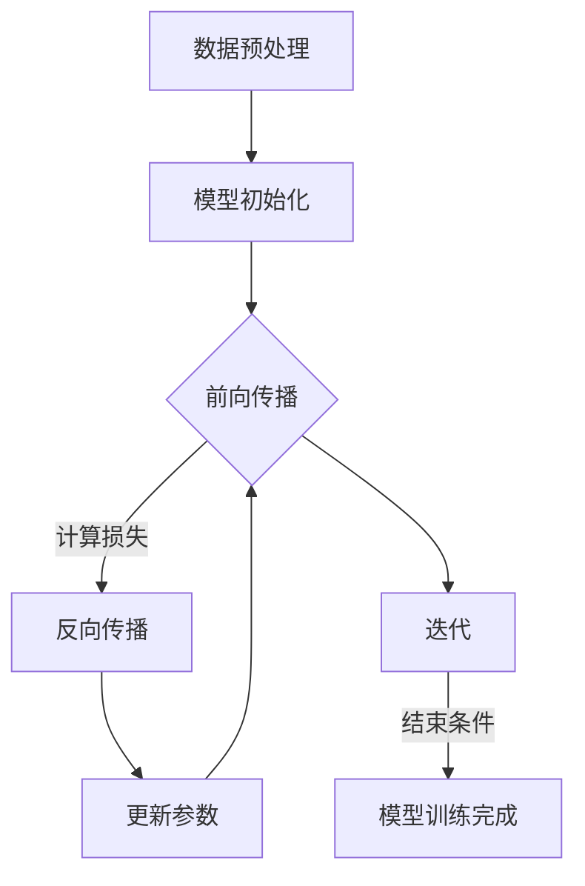

                 

# AI大模型时代的新编程范式

> 关键词：AI大模型、编程范式、深度学习、神经网络、自然语言处理、预训练、迁移学习、数学基础、开发工具、优化调参、安全与伦理、未来趋势

> 摘要：本文将深入探讨AI大模型时代的新编程范式。通过分析AI大模型的基础、原理、数学基础、应用案例、开发工具、优化与调参以及面临的挑战与未来趋势，本文旨在为读者提供一个全面而深刻的理解，帮助程序员和开发者掌握AI大模型时代的编程技术和方法。

### 第一部分: AI大模型时代的新编程范式基础

#### 第1章: AI大模型时代的新编程范式概述

##### 1.1 AI大模型时代的新编程范式概述

**1.1.1 什么是AI大模型时代**

AI大模型时代指的是以深度学习和神经网络为代表的人工智能技术，通过大规模预训练和迁移学习，使得模型在特定领域表现出超越人类水平的能力。这一时代标志着人工智能从弱智能向强智能的转型，也带来了编程范式的新变革。

**1.1.2 AI大模型与编程范式的变革**

AI大模型时代对传统编程范式产生了深远影响。首先，编程语言和工具发生了变化，以支持更高效的模型开发和训练。其次，开发流程也发生了转变，从传统的手写代码模式转向基于数据驱动的自动化流程。此外，AI大模型时代的编程更注重数据预处理、模型优化和调参等环节。

**1.1.3 AI大模型时代编程范式的新特点**

AI大模型时代编程范式具有以下几个新特点：

1. **数据驱动**：数据成为模型开发的中心，数据的质量和数量直接影响模型的性能。
2. **自动化**：自动化工具和框架大大提高了模型开发和部署的效率。
3. **可解释性**：模型的可解释性变得越来越重要，以应对安全、伦理和透明度等问题。
4. **跨领域融合**：AI大模型的应用跨越多个领域，需要跨学科的编程技能。

##### 1.2 AI大模型的核心技术基础

**1.2.1 深度学习与神经网络基础**

深度学习是AI大模型的核心技术之一，基于多层神经网络的结构，能够自动提取数据的特征表示。神经网络由多个神经元组成，通过前向传播和反向传播算法进行训练。

**1.2.2 自然语言处理技术概览**

自然语言处理（NLP）是AI大模型的重要应用领域，涉及文本分类、机器翻译、情感分析等任务。NLP技术包括词嵌入、编码器-解码器模型、Transformer等。

**1.2.3 大规模预训练模型原理**

大规模预训练模型通过在大量无标签数据上进行预训练，然后在小数据集上进行微调，从而实现出色的性能。预训练技术包括GPT、BERT、T5等模型。

##### 1.3 AI大模型的应用领域与前景

**1.3.1 AI大模型的应用领域**

AI大模型在多个领域表现出强大的能力，包括自然语言处理、计算机视觉、语音识别、医疗诊断等。

**1.3.2 AI大模型时代的发展机遇与挑战**

AI大模型时代为各行各业带来了巨大的机遇，但同时也面临一些挑战，如数据隐私、模型安全、伦理问题等。

**1.3.3 企业在AI大模型时代的转型策略**

企业需要在AI大模型时代进行战略转型，包括技术升级、人才引进、业务模式创新等。

#### 第2章: AI大模型的基本原理

##### 2.1 AI大模型的定义与分类

**2.1.1 AI大模型的定义**

AI大模型是指具有大规模参数、强大泛化能力和广泛应用场景的深度学习模型。

**2.1.2 AI大模型的分类**

AI大模型可以分为语言模型、图像模型、语音模型等，每种模型具有不同的结构和应用场景。

**2.1.3 AI大模型的核心特点**

AI大模型具有高参数量、大规模训练数据、自动化调参等特点。

##### 2.2 AI大模型的基本架构

**2.2.1 AI大模型的基本结构**

AI大模型通常由输入层、隐藏层和输出层组成，通过多层神经网络实现。

**2.2.2 AI大模型的层次结构**

AI大模型可以分为自底向上的层次结构和自顶向下的层次结构，适用于不同的应用场景。

**2.2.3 AI大模型的训练过程**

AI大模型的训练过程包括数据预处理、模型初始化、前向传播、反向传播和参数更新等步骤。

##### 2.3 AI大模型的学习机制

**2.3.1 自监督学习与预训练**

自监督学习是指利用未标注数据进行的模型训练，预训练是在大量无标签数据上进行模型训练。

**2.3.2 迁移学习与微调**

迁移学习是指将预训练模型在小数据集上进行微调，以适应特定任务。

**2.3.3 模型优化与调参**

模型优化包括优化算法、损失函数和正则化方法，调参包括超参数调整和模型调优。

##### 2.4 AI大模型的数学基础

**2.4.1 神经网络中的数学基础**

神经网络中的数学基础包括概率论、线性代数和最优化理论。

**2.4.2 AI大模型中的数学模型**

AI大模型中的数学模型包括神经网络的数学公式、损失函数和优化算法。

**2.4.3 数学模型的应用与解释**

数学模型在神经网络中的应用包括概率分布函数、线性代数和最优化理论。

#### 第3章: AI大模型的数学基础

##### 3.1 神经网络中的数学基础

**3.1.1 概率论基础**

概率论基础包括概率分布、条件概率和贝叶斯公式等。

**3.1.2 线性代数基础**

线性代数基础包括矩阵运算、线性方程组和特征值等。

**3.1.3 最优化理论**

最优化理论包括优化问题、梯度下降和牛顿法等。

##### 3.2 AI大模型中的数学模型

**3.2.1 神经网络中的数学公式**

神经网络中的数学公式包括激活函数、权重更新和损失函数等。

**3.2.2 损失函数与优化算法**

损失函数与优化算法包括均方误差、交叉熵和Adam优化器等。

**3.2.3 模型评估与改进**

模型评估与改进包括准确率、召回率和F1分数等评估指标。

##### 3.3 数学模型的应用与解释

**3.3.1 概率分布函数的应用**

概率分布函数在神经网络中的应用包括正态分布、泊松分布等。

**3.3.2 线性代数在神经网络中的应用**

线性代数在神经网络中的应用包括矩阵运算、特征提取等。

**3.3.3 最优化理论在模型训练中的应用**

最优化理论在模型训练中的应用包括梯度下降、动量优化等。

##### 3.4 数学模型在实际项目中的应用

**3.4.1 语言模型中的数学模型**

语言模型中的数学模型包括词嵌入、长短时记忆网络（LSTM）等。

**3.4.2 图像模型中的数学模型**

图像模型中的数学模型包括卷积神经网络（CNN）、残差网络等。

**3.4.3 其他应用领域中的数学模型**

其他应用领域中的数学模型包括生成对抗网络（GAN）、强化学习等。

#### 第4章: AI大模型的应用案例

##### 4.1 自然语言处理应用案例

**4.1.1 语言模型案例**

语言模型案例包括GPT-3、BERT等模型，这些模型在自然语言生成、文本分类等任务上表现出色。

**4.1.2 文本分类案例**

文本分类案例包括情感分析、新闻分类等任务，通过预训练和微调实现高性能。

**4.1.3 机器翻译案例**

机器翻译案例包括神经机器翻译（NMT）、Transformer等模型，大幅提高了翻译质量。

##### 4.2 计算机视觉应用案例

**4.2.1 图像分类案例**

图像分类案例包括ImageNet挑战、ResNet等模型，成功应用于物体识别、场景分类等任务。

**4.2.2 目标检测案例**

目标检测案例包括YOLO、SSD等模型，实现了实时目标检测和识别。

**4.2.3 图像生成案例**

图像生成案例包括生成对抗网络（GAN）、StyleGAN等模型，可以生成逼真的图像和视频。

##### 4.3 其他领域应用案例

**4.3.1 音频处理案例**

音频处理案例包括语音识别、音乐生成等任务，利用深度学习技术实现高效处理。

**4.3.2 量子计算案例**

量子计算案例包括量子神经网络（QNN）、量子机器学习等，探索量子计算机在AI领域的应用。

**4.3.3 医疗诊断案例**

医疗诊断案例包括医学图像分析、疾病预测等任务，通过深度学习模型实现高效诊断。

#### 第5章: AI大模型的开发工具与框架

##### 5.1 深度学习框架概述

**5.1.1 TensorFlow**

TensorFlow是Google开发的深度学习框架，具有丰富的功能和广泛的社区支持。

**5.1.2 PyTorch**

PyTorch是Facebook开发的深度学习框架，具有灵活的动态图结构和简洁的API。

**5.1.3 其他深度学习框架**

其他深度学习框架包括Keras、Theano、MXNet等，各自具有独特的优势和适用场景。

##### 5.2 开发工具与环境配置

**5.2.1 环境配置与工具选择**

环境配置与工具选择包括Python环境、深度学习库和GPU支持等。

**5.2.2 开发工具的使用方法**

开发工具的使用方法包括数据预处理、模型训练和评估等。

**5.2.3 调试与优化技巧**

调试与优化技巧包括代码调试、模型优化和性能调优等。

##### 5.3 实践项目与代码实现

**5.3.1 项目需求分析**

项目需求分析包括明确任务目标、数据来源和性能指标等。

**5.3.2 代码实现与解释**

代码实现与解释包括模型设计、训练过程和结果分析等。

**5.3.3 项目部署与优化**

项目部署与优化包括模型部署、性能优化和持续改进等。

#### 第6章: AI大模型的优化与调参

##### 6.1 模型优化方法

**6.1.1 优化算法**

优化算法包括梯度下降、Adam、SGD等，用于加速模型训练。

**6.1.2 损失函数优化**

损失函数优化包括均方误差、交叉熵等，用于评估模型性能。

**6.1.3 模型正则化**

模型正则化包括Dropout、权重正则化等，用于防止过拟合。

##### 6.2 调参技巧

**6.2.1 超参数调整**

超参数调整包括学习率、批量大小等，用于提高模型性能。

**6.2.2 调参策略**

调参策略包括网格搜索、贝叶斯优化等，用于高效搜索最优超参数。

**6.2.3 实践经验分享**

实践经验分享包括调参经验、常用技巧和最佳实践等。

##### 6.3 模型评估与改进

**6.3.1 评估指标**

评估指标包括准确率、召回率、F1分数等，用于衡量模型性能。

**6.3.2 评估方法**

评估方法包括交叉验证、留出法等，用于确保评估的可靠性和有效性。

**6.3.3 模型改进策略**

模型改进策略包括数据增强、模型集成等，用于提高模型性能。

#### 第7章: AI大模型的时代挑战与未来趋势

##### 7.1 AI大模型的安全与伦理问题

**7.1.1 模型偏见与歧视**

模型偏见与歧视是指模型在训练过程中吸收了人类偏见，导致不公平决策。

**7.1.2 模型可解释性**

模型可解释性是指模型决策过程的透明度，对于安全性和可信度至关重要。

**7.1.3 数据隐私保护**

数据隐私保护是指确保训练数据和模型参数的安全，防止数据泄露和滥用。

##### 7.2 AI大模型的时代机遇

**7.2.1 产业变革**

AI大模型为各行各业带来巨大变革，如医疗、金融、制造等。

**7.2.2 创业机会**

AI大模型时代为创业者提供丰富机会，如自动驾驶、智能客服等。

**7.2.3 教育变革**

AI大模型时代推动教育变革，个性化学习和智能教育平台兴起。

##### 7.3 AI大模型的未来趋势

**7.3.1 大模型的发展方向**

大模型的发展方向包括更高效的训练算法、更强大的泛化能力等。

**7.3.2 人工智能的未来展望**

人工智能的未来展望包括通用人工智能（AGI）、人机协同等。

**7.3.3 企业在AI大模型时代的战略布局**

企业在AI大模型时代的战略布局包括技术创新、人才培养、业务转型等。

### 总结

AI大模型时代带来了编程范式的新变革，为程序员和开发者带来了新的挑战和机遇。通过本文的深入探讨，我们了解了AI大模型的基础、原理、数学基础、应用案例、开发工具、优化与调参以及面临的挑战与未来趋势。希望本文能为读者提供一个全面而深刻的理解，帮助大家掌握AI大模型时代的编程技术和方法。

#### 参考文献

1. Goodfellow, I., Bengio, Y., & Courville, A. (2016). *Deep Learning*.
2. LeCun, Y., Bengio, Y., & Hinton, G. (2015). *Deep Learning*.
3. Bengio, Y. (2009). *Learning Deep Architectures for AI*.
4. Russell, S., & Norvig, P. (2020). *Artificial Intelligence: A Modern Approach*.
5. Hochreiter, S., & Schmidhuber, J. (1997). *Long Short-Term Memory*.
6. Simonyan, K., & Zisserman, A. (2014). *Very Deep Convolutional Networks for Large-Scale Image Recognition*.
7. Vaswani, A., Shazeer, N., Parmar, N., Uszkoreit, J., Jones, L., Gomez, A. N., ... & Polosukhin, I. (2017). *Attention is All You Need*.
8. Brown, T., et al. (2020). *Language Models are Few-Shot Learners*.
9. Yosinski, J., Clune, J., Bengio, Y., & Lipson, H. (2014). *How Transferable are Features in Deep Neural Networks?*.
10. OpenAI. (2020). *GPT-3: Pre-training of Deep Language Models for Natural Language Processing*.

### 附录

#### Mermaid流程图

以下是AI大模型训练过程的Mermaid流程图：



#### 伪代码

以下是神经网络训练过程的伪代码：

```python
# 初始化模型参数
weights = initialize_weights()

# 模型训练
while not convergence:
    for x, y in dataset:
        # 前向传播
        output = forward_propagation(x, weights)
        
        # 计算损失
        loss = compute_loss(output, y)
        
        # 反向传播
        delta_weights = backward_propagation(output, y, weights)
        
        # 更新参数
        weights -= learning_rate * delta_weights
        
        # 检查收敛
        if check_convergence(weights):
            break

# 模型评估
accuracy = evaluate_model(model, test_data)
print("Accuracy:", accuracy)
```

#### 数学公式

以下是神经网络中的几个重要数学公式：

$$
z = \sigma(Wx + b)
$$

$$
\delta = \frac{\partial L}{\partial z}
$$

$$
\delta_w = \frac{\partial L}{\partial w}
$$

$$
w_{new} = w - \alpha \delta_w
$$

#### 代码案例

以下是一个简单的神经网络模型实现案例：

```python
import numpy as np

# 初始化参数
weights = np.random.rand(input_size, hidden_size)
bias = np.random.rand(hidden_size)
output_weights = np.random.rand(hidden_size, output_size)
output_bias = np.random.rand(output_size)

# 激活函数
def sigmoid(x):
    return 1 / (1 + np.exp(-x))

# 前向传播
def forward_propagation(x):
    hidden_layer_input = np.dot(x, weights) + bias
    hidden_layer_output = sigmoid(hidden_layer_input)
    
    output_layer_input = np.dot(hidden_layer_output, output_weights) + output_bias
    output_layer_output = sigmoid(output_layer_input)
    
    return output_layer_output

# 反向传播
def backward_propagation(x, y, output):
    output_error = output - y
    output_delta = output_error * sigmoid_derivative(output)
    
    hidden_error = output_delta.dot(output_weights.T)
    hidden_delta = hidden_error * sigmoid_derivative(hidden_layer_output)
    
    return hidden_delta, output_error

# 训练模型
for epoch in range(epochs):
    for x, y in dataset:
        output = forward_propagation(x)
        hidden_delta, output_error = backward_propagation(x, y, output)
        
        # 更新参数
        output_weights -= learning_rate * hidden_layer_output.T.dot(output_error)
        output_bias -= learning_rate * output_error
        weights -= learning_rate * x.T.dot(hidden_delta)
        bias -= learning_rate * hidden_delta

# 评估模型
accuracy = evaluate_model(model, test_data)
print("Accuracy:", accuracy)
```

### 附录二

#### 开发环境搭建

以下是一个简单的开发环境搭建步骤：

1. 安装Python环境：`pip install python`
2. 安装深度学习库：`pip install tensorflow` 或 `pip install pytorch`
3. 配置GPU支持：根据所选深度学习库的文档进行配置，如TensorFlow GPU版本需要安装CUDA和cuDNN。
4. 验证环境：运行示例代码，确保环境配置正确。

#### 项目部署与优化

以下是一个简单的项目部署和优化步骤：

1. 模型转换：将训练好的模型转换为可以部署的格式，如TensorFlow Lite或PyTorch TorchScript。
2. 部署模型：将模型部署到服务器或移动设备，可以使用TensorFlow Serving、TensorFlow Lite、PyTorch Mobile等工具。
3. 性能优化：通过减少模型大小、使用量化技术、模型剪枝等手段提高模型性能。
4. 持续改进：收集用户反馈，持续优化模型和部署流程，提高用户体验。

### 作者信息

作者：AI天才研究院/AI Genius Institute & 禅与计算机程序设计艺术 /Zen And The Art of Computer Programming

### 结语

AI大模型时代带来了编程范式的新变革，为程序员和开发者带来了新的挑战和机遇。本文通过深入探讨AI大模型的基础、原理、数学基础、应用案例、开发工具、优化与调参以及面临的挑战与未来趋势，旨在为读者提供一个全面而深刻的理解。希望本文能帮助读者掌握AI大模型时代的编程技术和方法，为未来的技术发展贡献力量。

