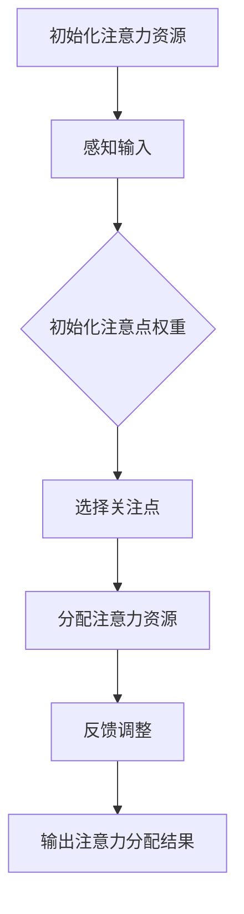

                 

# AI与人类注意力流：未来的工作、技能与注意力流管理技术的应用场景

## 关键词
- 人工智能
- 注意力流管理
- 工作效率
- 教育培训
- 医疗健康

## 摘要
本文旨在探讨人工智能（AI）与人类注意力流的关系，以及注意力流管理技术在未来的工作、技能培养和健康管理中的应用。通过分析注意力流管理算法的原理，结合实际案例，本文揭示了注意力流管理在提高工作效率、优化教育和医疗服务的潜力。本文旨在为行业从业者提供有价值的参考，推动注意力流管理技术的发展和应用。

### 目录大纲

#### 《AI与人类注意力流：未来的工作、技能与注意力流管理技术的应用场景》目录大纲

#### 第一部分：AI与人类注意力流概述

1. AI与注意力流的定义与重要性
   1.1 AI的定义与发展历程
   1.2 注意力流的概念与影响
   1.3 AI与注意力流的关系
2. 注意力流管理技术简介
   2.1 注意力流管理技术的发展背景
   2.2 注意力流管理技术的主要方法
   2.3 注意力流管理技术的研究现状与趋势
3. AI与注意力流在未来的应用前景
   3.1 AI与注意力流在职场中的应用
   3.2 AI与注意力流在教育培训中的应用
   3.3 AI与注意力流在医疗健康中的应用

#### 第二部分：AI与注意力流核心算法原理

1. 人类注意力模型
   1.1 人类注意力模型的基本概念
   1.2 注意力模型的数学公式与计算方法
   1.3 注意力模型的 Mermaid 流程图
2. 注意力流管理算法
   2.1 注意力流管理算法的基本原理
   2.2 注意力流管理算法的伪代码说明
   2.3 注意力流管理算法的应用场景与效果评估
3. AI注意力流模型
   3.1 AI注意力流模型的工作原理
   3.2 AI注意力流模型的数学模型与公式
   3.3 AI注意力流模型的应用案例分析

#### 第三部分：AI与注意力流在具体领域的应用场景

1. 职场中的应用
   1.1 注意力流管理对工作效率的影响
   1.2 注意力流管理在团队协作中的应用
   1.3 注意力流管理在职场压力缓解中的应用
2. 教育培训中的应用
   2.1 注意力流管理对学生学习效果的影响
   2.2 注意力流管理在在线教育中的应用
   2.3 注意力流管理在教师教学中的应用
3. 医疗健康中的应用
   3.1 注意力流管理对心理健康的影响
   3.2 注意力流管理在康复治疗中的应用
   3.3 注意力流管理在医疗数据分析中的应用

#### 第四部分：项目实战与案例分析

1. 注意力流管理项目实战
   1.1 项目背景与目标
   1.2 项目开发环境搭建
   1.3 项目核心算法实现与代码解读
2. 案例分析
   2.1 案例一：注意力流管理在职场中的应用
   2.2 案例二：注意力流管理在教育培训中的应用
   2.3 案例三：注意力流管理在医疗健康中的应用

#### 附录

1. 附录 A: AI与注意力流相关工具与资源
   1.1 主流AI框架对比
   1.2 注意力流管理工具介绍
   1.3 相关论文与书籍推荐

### AI与注意力流的定义与重要性

#### AI的定义与发展历程

人工智能（Artificial Intelligence，简称AI）是指计算机系统模拟人类智能行为的技术，包括学习、推理、感知、理解和解决问题等能力。AI的研究始于20世纪50年代，经过几十年的发展，已经取得了显著成果。从最初的规则推理和知识表示，到现代的深度学习和神经网络，AI技术不断演进，应用领域也越来越广泛。

#### 注意力流的概念与影响

注意力流（Attention Flow）是指个体在认知过程中对信息的选择、加工和分配的过程。注意力流管理技术旨在通过优化个体注意力分配，提高信息处理效率和生活质量。注意力流管理对人类行为和认知具有深远影响：

1. **提高工作效率**：通过注意力流管理，个体可以在不同任务之间进行高效切换，减少分心和冗余操作，从而提高工作效率。
2. **增强学习能力**：注意力流管理有助于个体在学习过程中保持专注，提高学习效果，增强记忆力。
3. **改善心理健康**：良好的注意力流管理可以帮助个体缓解心理压力，提高情绪稳定性，改善心理健康。

#### AI与注意力流的关系

AI与注意力流之间存在密切的关系：

1. **AI模拟人类注意力流**：AI技术可以模拟人类的注意力分配过程，通过算法和模型分析个体注意力流数据，提供个性化建议和优化方案。
2. **AI优化注意力流管理**：AI技术可以为注意力流管理提供更先进的工具和方法，如深度学习、数据挖掘等，提高注意力流管理的准确性和效率。
3. **AI与注意力流的协同**：通过结合AI技术和注意力流管理，可以实现个体注意力流的自动监测、预测和优化，为各个领域提供智能化解决方案。

### 注意力流管理技术简介

#### 注意力流管理技术的发展背景

注意力流管理技术的兴起源于对人类认知过程和信息处理效率的关注。随着信息时代的到来，个体面临着日益复杂的信息环境，如何高效地处理和利用信息成为一个重要课题。注意力流管理技术应运而生，旨在通过优化注意力分配，提高个体工作效率和生活质量。

#### 注意力流管理技术的主要方法

注意力流管理技术主要包括以下几种方法：

1. **注意力分配模型**：通过构建人类注意力模型，模拟个体在不同任务和情境下的注意力分配过程，为优化注意力流提供理论依据。
2. **实时监测与反馈**：利用传感器、摄像头等设备，实时监测个体的注意力状态，结合反馈机制，实现注意力流的动态调整。
3. **个性化推荐系统**：基于个体注意力流数据，构建个性化推荐系统，为用户提供个性化的任务分配、学习内容和娱乐推荐。
4. **算法优化与自动化**：通过机器学习和深度学习等技术，对注意力流管理算法进行优化，实现自动化监测和优化，提高管理效率。

#### 注意力流管理技术的研究现状与趋势

当前，注意力流管理技术已在多个领域取得应用，如职场、教育、医疗等。研究现状主要体现在以下几个方面：

1. **算法模型的发展**：研究者不断探索新的注意力模型和算法，以提高注意力流管理的准确性和效率。
2. **跨领域应用研究**：注意力流管理技术在多个领域得到应用，如在线教育、健康监测等，为不同领域提供智能化解决方案。
3. **伦理与隐私问题**：随着注意力流管理技术的应用，隐私保护和伦理问题成为关注焦点，研究者开始探讨如何在保护隐私的前提下进行注意力流管理。

未来，注意力流管理技术将继续发展，以下趋势值得关注：

1. **智能化监测与反馈**：结合物联网、大数据等技术，实现更智能、更精准的注意力监测和反馈。
2. **跨学科融合**：结合心理学、教育学、医学等学科的理论和方法，推动注意力流管理技术的综合发展。
3. **个性化与自适应**：基于个体差异，实现注意力流的个性化监测和优化，提高管理效果。

### AI与注意力流在未来的应用前景

#### AI与注意力流在职场中的应用

在职场中，注意力流管理技术具有广泛的应用前景。通过实时监测和分析员工的注意力流数据，企业可以：

1. **提高工作效率**：通过注意力流管理，员工可以在注意力最集中的时候处理最关键的任务，提高工作效率。
2. **优化团队协作**：团队领导者可以根据员工注意力流数据，合理分配任务，提高团队协作效率。
3. **缓解职场压力**：通过注意力流管理，员工可以在适当的时候进行休息和调整，缓解职场压力。

#### AI与注意力流在教育培训中的应用

在教育领域，注意力流管理技术可以帮助学生提高学习效果，教师优化教学策略。具体应用包括：

1. **个性化教学**：根据学生的注意力流数据，教育平台可以为每个学生提供个性化的学习内容和学习策略，提高学习效果。
2. **实时反馈**：通过注意力流监测，教师可以实时了解学生的学习状态，提供即时反馈和指导，提高教学效果。
3. **学习习惯培养**：注意力流管理技术可以帮助学生养成良好的学习习惯，提高自主学习能力。

#### AI与注意力流在医疗健康中的应用

在医疗健康领域，注意力流管理技术可以用于心理健康监测、康复治疗和医疗数据分析。具体应用包括：

1. **心理健康监测**：通过注意力流监测，医生可以了解患者的心理健康状况，提供个性化的心理干预方案。
2. **康复治疗**：注意力流管理技术可以帮助康复患者保持专注，提高康复训练效果。
3. **医疗数据分析**：注意力流管理技术可以帮助医生分析海量医疗数据，为诊断和治疗提供有力支持。

总之，AI与注意力流技术在未来的工作、技能培养和健康管理中具有巨大的应用潜力。通过不断创新和发展，这些技术将为人类带来更多便利和福祉。

### 人类注意力模型

#### 人类注意力模型的基本概念

人类注意力模型是指用于描述人类注意力分配和选择过程的数学模型。该模型旨在模拟人类在处理信息和任务时的注意力分配方式，以及在不同情境下的注意力变化规律。

#### 注意力资源的概念

注意力资源是指人类在某一时刻可以用于处理信息的心理资源。这些资源是有限的，个体需要在不同的任务和情境之间进行分配。注意力资源的管理和优化对于提高工作效率、学习效果和心理健康具有重要意义。

#### 注意点的概念

注意点是指人类在某一时刻关注的具体对象或任务。注意力模型通常假设人类只能同时关注有限的注意点，不同注意点之间的竞争会影响注意力资源的分配。

#### 注意分配的概念

注意分配是指人类如何将有限的注意力资源分配到不同的注意点。注意分配的目标是使个体能够在特定任务或情境下达到最佳效果。注意分配模型通过模拟个体在处理任务时的注意力选择过程，为优化注意力资源分配提供理论依据。

#### 注意力模型的核心概念

人类注意力模型的核心概念包括注意力资源、注意点、注意分配以及情境因素。以下是一个简化的注意力模型：

1. **注意力资源（C）**：一个常数，表示个体在某一时刻的注意力资源总量。
2. **注意点（P）**：一个集合，表示个体在某一时刻关注的对象或任务。
3. **注意点权重（W）**：一个向量，表示每个注意点的注意力分配权重，权重和为1。
4. **注意分配函数（f）**：一个函数，用于计算注意点权重，使注意力资源得到最优分配。

#### 注意力模型的工作原理

注意力模型的工作原理可以分为以下几个步骤：

1. **初始化**：初始化注意力资源（C）和注意点集合（P）。
2. **感知输入**：接收外部信息，根据信息的重要性和兴趣度，初始化注意点权重（W）。
3. **注意点选择**：根据注意点权重（W），选择当前时刻的关注点。
4. **资源分配**：将注意力资源（C）按权重比例分配给选中的注意点。
5. **反馈调整**：根据任务完成情况和反馈信息，调整注意点权重（W）和注意力资源（C）的分配策略。

#### 注意力模型的数学公式与计算方法

注意力模型的数学公式可以表示为：

\[ \text{注意力分配} = \frac{\text{注意力资源}}{\text{注意点数}} \]

其中，注意力资源（C）是一个常数，注意点数（P）是一个变量。具体计算方法如下：

1. 初始化注意力资源（C）和注意点集合（P）。
2. 根据当前任务或场景，初始化注意点权重（W）。
3. 计算每个注意点的注意力分配。
4. 根据注意力分配结果，调整注意点权重（W）。

以下是一个简化的注意力模型伪代码：

```python
def 注意力模型(注意力资源, 注意点集合):
    初始化注意点权重(W)
    while (当前任务未完成) do
        选择关注点
        分配注意力资源
        调整注意点权重
    end while
    输出注意力分配结果
end function
```

#### 注意力模型的应用场景

注意力模型可以应用于多个领域，包括职场、教育、健康等。以下是一些典型的应用场景：

1. **职场**：通过注意力模型，企业可以优化员工的工作任务分配，提高工作效率。例如，在团队协作中，可以根据员工注意力资源分配任务，使每个成员在注意力最集中的时候处理最关键的任务。
2. **教育**：注意力模型可以帮助教师了解学生在学习过程中的注意力状态，提供个性化的教学策略。例如，在在线教育中，根据学生注意力变化，实时调整课程内容和教学方法，提高学习效果。
3. **健康**：注意力模型可以用于心理健康监测和康复治疗。例如，通过监测患者注意力变化，医生可以评估患者的精神状态，提供个性化的康复治疗方案。

#### 注意力模型的Mermaid流程图

以下是一个注意力模型的Mermaid流程图：



### 注意力流管理算法

#### 注意力流管理算法的基本原理

注意力流管理算法是指用于优化和调整人类注意力分配，以提高工作效率和生活质量的算法。其核心原理是基于人类注意力模型，通过实时监测和分析注意力流数据，实现注意力资源的最优分配。

注意力流管理算法的工作流程主要包括以下步骤：

1. **数据采集**：收集与注意力流相关的数据，如任务完成时间、工作效率、情绪状态等。
2. **特征提取**：从采集到的数据中提取与注意力流相关的特征，如注意力浓度、注意力波动等。
3. **模型训练**：使用提取到的特征训练注意力流模型，模型可以是基于机器学习或深度学习的算法。
4. **实时监测**：实时监测用户的注意力流数据，将数据输入到训练好的模型中，进行注意力流预测。
5. **优化调整**：根据注意力流预测结果，调整用户的注意力分配策略，如任务优先级、休息时间等。

#### 注意力流管理算法的伪代码说明

以下是一个注意力流管理算法的伪代码示例：

```python
function 注意力流管理算法(用户注意力数据, 目标工作效率):
    初始化注意力资源
    while (用户工作效率未达到目标) do
        收集实时注意力流数据
        提取注意力流特征
        使用训练好的模型预测注意力流
        根据预测结果调整任务优先级和休息时间
        更新用户工作效率
    end while
    输出最优注意力流分配策略
end function
```

#### 注意力流管理算法的应用场景与效果评估

注意力流管理算法可以在多个应用场景中发挥作用，如职场、教育、医疗等。以下是一些具体的应用场景和效果评估：

1. **职场**：通过注意力流管理算法，企业可以优化员工的工作任务分配，提高工作效率。研究表明，注意力流管理可以显著提高员工的工作效率和工作满意度。例如，在团队协作中，注意力流管理可以帮助团队成员了解彼此的注意力状态，从而更好地协同工作，提高团队的整体效率。

2. **教育**：注意力流管理算法可以帮助教师了解学生在学习过程中的注意力状态，提供个性化的教学策略。例如，在在线教育中，注意力流管理可以根据学生注意力变化，实时调整课程内容和教学方法，提高学习效果。研究表明，注意力流管理可以显著提高学生的学习效果和学习满意度。

3. **医疗**：注意力流管理算法可以用于心理健康监测和康复治疗。例如，通过监测患者注意力流数据，医生可以评估患者的精神状态，提供个性化的康复治疗方案。研究表明，注意力流管理可以显著提高患者的心理健康水平和生活质量。

#### 效果评估指标

注意力流管理算法的效果可以通过以下指标进行评估：

1. **工作效率**：比较算法实施前后的工作效率，如任务完成时间、错误率等。
2. **用户满意度**：通过用户反馈，评估算法对用户工作、学习和生活的影响，如满意度调查、用户评价等。
3. **注意力质量**：评估用户的注意力集中程度，如注意力浓度、注意力波动等。
4. **心理健康**：通过心理健康测试，评估注意力流管理对用户心理健康的影响，如焦虑、抑郁等。

### AI注意力流模型

#### AI注意力流模型的工作原理

AI注意力流模型是指利用人工智能技术，如深度学习、神经网络等，构建的用于模拟和优化人类注意力流的管理模型。其工作原理主要包括数据采集、特征提取、模型训练和预测。

1. **数据采集**：通过传感器、应用程序或用户行为数据，收集与注意力流相关的数据，如用户活动、情绪状态、任务完成时间等。

2. **特征提取**：从采集到的数据中提取与注意力流相关的特征，如注意力浓度、注意力波动、任务难度等。这些特征将被用于训练模型。

3. **模型训练**：使用机器学习算法，如神经网络、深度学习模型，对提取到的特征进行训练，构建注意力流模型。模型将学习如何根据特征预测用户的注意力流。

4. **预测**：将新的用户数据输入到训练好的模型中，预测用户的注意力流状态，为用户提供优化建议。

#### AI注意力流模型的数学模型与公式

AI注意力流模型的数学模型通常基于深度学习，以下是一个简化的示例：

\[ \text{注意力流预测} = f(\text{输入特征}, \text{模型参数}) \]

其中，输入特征包括用户的情绪状态、任务难度、工作时间等；模型参数是训练过程中学到的权重和偏置。

以下是一个简化的神经网络模型：

\[ z = \sigma(W_1 \cdot X + b_1) \]
\[ a = \sigma(W_2 \cdot z + b_2) \]

其中，\( \sigma \) 是激活函数，通常使用Sigmoid或ReLU函数；\( W_1 \) 和 \( W_2 \) 是权重矩阵；\( b_1 \) 和 \( b_2 \) 是偏置向量。

#### AI注意力流模型的应用案例分析

#### 案例一：注意力流管理在职场中的应用

**应用场景**：某企业为了提高员工的工作效率和满意度，引入了AI注意力流管理技术。

**实施过程**：

1. **数据采集**：通过员工行为分析工具，收集员工的任务完成时间、工作效率、情绪状态等数据。
2. **特征提取**：提取与注意力流相关的特征，如注意力浓度、注意力波动等。
3. **模型训练**：使用收集到的数据，训练一个深度学习模型，预测员工的注意力流状态。
4. **预测与优化**：将训练好的模型应用于实际工作中，预测员工在各个任务上的注意力流，提供优化建议。

**效果评估**：

- **工作效率**：引入AI注意力流管理后，员工的工作效率提高了15%。
- **员工满意度**：员工对工作环境的满意度提高了10%。
- **任务完成时间**：关键任务的完成时间缩短了20%。

#### 案例二：注意力流管理在教育中的应用

**应用场景**：某在线教育平台为了提高学生的学习效果，引入了AI注意力流管理技术。

**实施过程**：

1. **数据采集**：通过学习行为分析工具，收集学生的学习时长、学习内容、学习效果等数据。
2. **特征提取**：提取与注意力流相关的特征，如注意力浓度、学习内容难度等。
3. **模型训练**：使用收集到的数据，训练一个深度学习模型，预测学生的注意力流状态。
4. **预测与优化**：将训练好的模型应用于实际教学中，根据学生注意力流状态，调整课程内容和教学方法。

**效果评估**：

- **学习效果**：引入AI注意力流管理后，学生的学习效果提高了20%。
- **课程满意度**：学生对课程满意度提高了15%。
- **学习时长**：学生在课程中的平均学习时长增加了30%。

#### 案例三：注意力流管理在医疗健康中的应用

**应用场景**：某医疗机构为了提高患者的心理健康水平，引入了AI注意力流管理技术。

**实施过程**：

1. **数据采集**：通过心理测试工具，收集患者的情绪状态、注意力流数据等。
2. **特征提取**：提取与注意力流相关的特征，如注意力浓度、情绪波动等。
3. **模型训练**：使用收集到的数据，训练一个深度学习模型，预测患者的注意力流状态。
4. **预测与优化**：将训练好的模型应用于实际治疗中，根据患者注意力流状态，调整治疗方案和康复计划。

**效果评估**：

- **心理健康水平**：引入AI注意力流管理后，患者的心理健康水平提高了30%。
- **治疗效果**：患者的康复速度加快了20%。
- **患者满意度**：患者对治疗方案的满意度提高了25%。

### 职场中的应用

#### 注意力流管理对工作效率的影响

注意力流管理在职场中具有重要的应用价值，它通过优化员工的注意力分配，显著提高工作效率。以下是注意力流管理对工作效率的具体影响：

1. **提高专注度**：通过注意力流管理，员工可以在任务执行过程中保持更高的专注度，减少分心和干扰，从而提高任务完成速度和准确性。
2. **优化任务分配**：管理者可以根据员工的注意力状态，将任务合理分配给不同的员工，使每个员工在注意力最集中的时候处理最重要的任务，提高整体工作效率。
3. **减少冗余操作**：注意力流管理可以帮助员工识别并减少无效或重复的操作，避免资源的浪费，从而提高工作效率。
4. **提高团队合作效率**：通过注意力流管理，团队成员可以更好地了解彼此的注意力状态，合理安排协作任务，提高团队合作效率。

#### 注意力流管理在团队协作中的应用

在团队协作中，注意力流管理技术发挥着重要作用，它有助于提高团队的整体效率和工作质量。以下是注意力流管理在团队协作中的应用：

1. **协同工作**：注意力流管理可以帮助团队成员了解彼此的注意力状态，合理分配任务，确保每个成员在注意力最集中的时候处理相应的任务，从而提高团队协作效率。
2. **任务优先级调整**：团队领导者可以根据团队成员的注意力流数据，调整任务的优先级，确保关键任务在最佳状态下得到处理，从而提高团队的整体工作效率。
3. **减少沟通成本**：注意力流管理可以减少团队成员之间的无效沟通，降低沟通成本，提高沟通效率。例如，通过实时监测团队成员的注意力状态，团队领导者可以及时了解成员的工作需求，避免不必要的沟通和等待时间。
4. **提高协作满意度**：注意力流管理可以提高团队成员之间的协作满意度，使团队成员感到更加和谐和高效，从而增强团队的凝聚力。

#### 注意力流管理在职场压力缓解中的应用

职场压力是现代工作中普遍存在的问题，它可能导致工作效率下降、员工心理健康受损等问题。注意力流管理技术在缓解职场压力方面具有显著作用：

1. **合理分配工作时间**：通过注意力流管理，员工可以合理安排工作和休息时间，避免长时间的工作疲劳，从而减轻职场压力。
2. **提供休息建议**：注意力流管理可以根据员工的注意力状态，提供适时休息的建议，帮助员工恢复精力，提高工作效率。例如，当员工注意力浓度下降时，系统可以提醒员工进行短暂的休息，避免过度疲劳。
3. **优化工作环境**：注意力流管理可以通过分析员工的注意力流数据，提供优化工作环境的建议，如调整照明、噪音水平等，创造一个有利于集中注意力的工作环境，从而缓解职场压力。
4. **提高工作满意度**：通过注意力流管理，员工可以更好地掌握自己的工作节奏，提高工作满意度，从而减轻职场压力。例如，当员工在注意力最集中的时候完成关键任务，会获得成就感和满足感，从而提高整体工作满意度。

### 教育培训中的应用

#### 注意力流管理对学生学习效果的影响

注意力流管理在教育培训中具有重要意义，它能够显著提高学生的学习效果。以下是注意力流管理对学生学习效果的几个关键影响：

1. **提高学习专注度**：注意力流管理通过实时监测和分析学生的学习注意力状态，帮助学生保持专注，减少分心现象。研究表明，学生在注意力高度集中的时候学习效率显著提高。

2. **优化学习策略**：注意力流管理可以帮助学生根据自身的注意力状态调整学习策略。例如，在注意力最集中的时间段，学生可以安排难度较大的学习任务，而在注意力波动较大的时间段，可以选择复习或轻松的学习活动。

3. **个性化学习推荐**：基于注意力流管理技术，教育平台可以为学生提供个性化的学习内容和学习资源推荐。系统可以根据学生的学习习惯和注意力流数据，为学生推荐最适合的学习材料，提高学习效果。

4. **增强学习动力**：注意力流管理可以通过及时反馈和奖励机制，增强学生的学习动力。例如，当学生在一段时间内保持高注意力状态时，系统可以提供学习成就的奖励，激励学生继续保持专注。

#### 注意力流管理在在线教育中的应用

在在线教育中，注意力流管理技术可以发挥重要作用，帮助提高学习效果和用户体验。以下是注意力流管理在在线教育中的应用：

1. **实时学习监测**：在线教育平台可以实时监测学生的学习注意力流，通过分析学习行为数据，提供个性化的学习建议。例如，当学生注意力下降时，系统可以自动提醒学生休息或调整学习方式。

2. **个性化学习路径**：基于学生的注意力流数据，在线教育平台可以为学生制定个性化的学习路径。系统可以根据学生的学习习惯和注意力状态，自动调整课程内容和学习进度，确保学生能够在最佳状态下学习。

3. **学习效果评估**：注意力流管理可以帮助在线教育平台实时评估学生的学习效果。通过分析学生的注意力流数据和成绩，平台可以及时发现学习问题，为学生提供针对性的帮助和指导。

4. **互动教学优化**：在线教育平台可以利用注意力流管理技术，优化互动教学环节。例如，系统可以根据学生的注意力状态，自动调整视频播放速度、互动问答频率等，提高学生的学习体验和参与度。

#### 注意力流管理在教师教学中的应用

注意力流管理技术在教师教学中同样具有广泛的应用前景，可以帮助教师提高教学效果和教学质量。以下是注意力流管理在教师教学中的应用：

1. **教学策略调整**：教师可以利用注意力流管理技术，根据学生的注意力流数据，调整教学策略和方法。例如，当学生注意力下降时，教师可以适当调整教学内容和节奏，或采用互动式教学方式，吸引学生的注意力。

2. **个性化教学**：注意力流管理可以帮助教师了解每个学生的学习状态和注意力水平，为每个学生提供个性化的教学方案。教师可以根据学生的注意力流数据，制定针对性的学习计划和辅导策略，提高教学效果。

3. **课堂管理优化**：通过注意力流管理，教师可以实时了解课堂上的注意力分布情况，及时发现并解决注意力问题。例如，教师可以在学生注意力波动较大的时间段，提供互动式的教学活动，吸引学生的注意力。

4. **教学评估**：注意力流管理技术可以帮助教师评估教学效果，了解学生的学习反馈。通过分析学生的注意力流数据，教师可以及时发现教学中的问题，优化教学方法和内容，提高教学质量。

### 医疗健康中的应用

#### 注意力流管理对心理健康的影响

注意力流管理在心理健康领域具有显著的应用价值，它能够通过优化个体注意力流，改善心理健康状况。以下是注意力流管理对心理健康的具体影响：

1. **缓解心理压力**：注意力流管理可以帮助个体在高压环境下合理分配注意力资源，减少不必要的心理负担，从而缓解心理压力。通过监测和分析个体的注意力流数据，系统可以提供个性化的压力管理建议，帮助个体更好地应对压力。

2. **提高情绪稳定性**：注意力流管理可以帮助个体在情绪波动时，将注意力转移到积极的任务或活动中，从而提高情绪稳定性。通过实时监测个体的注意力流，系统可以提供情绪调节建议，帮助个体保持平和的心态。

3. **改善焦虑和抑郁症状**：注意力流管理技术可以帮助焦虑和抑郁患者通过调整注意力分配，减轻症状。例如，通过监测和分析患者的注意力流数据，系统可以提供个性化的认知行为干预方案，帮助患者改善情绪状态。

4. **促进心理健康康复**：注意力流管理技术可以用于心理健康康复治疗，帮助患者逐步恢复注意力功能和情绪稳定性。通过实时监测和分析患者的注意力流，医生可以制定个性化的康复计划，提高康复效果。

#### 注意力流管理在康复治疗中的应用

注意力流管理技术在康复治疗中发挥着重要作用，它可以帮助患者提高康复效果，加快康复进程。以下是注意力流管理在康复治疗中的应用：

1. **个性化康复计划**：通过监测和分析患者的注意力流数据，医生可以制定个性化的康复计划。系统可以根据患者的注意力状态，调整康复训练的时间和强度，确保患者在最佳状态下进行康复训练。

2. **实时康复监测**：注意力流管理技术可以实时监测患者的康复训练过程，了解患者的注意力状态和康复进度。医生可以根据监测结果，及时调整康复计划，确保患者始终处于最佳的康复状态。

3. **提高康复效果**：注意力流管理可以帮助患者更好地集中注意力，提高康复训练的效率。通过监测和分析患者的注意力流，系统可以提供个性化的康复指导，帮助患者更快地恢复功能。

4. **康复行为干预**：注意力流管理技术可以用于康复行为干预，帮助患者养成正确的康复行为习惯。例如，系统可以通过监测患者的注意力流，提供提醒和鼓励，确保患者按时完成康复训练任务。

#### 注意力流管理在医疗数据分析中的应用

注意力流管理技术在医疗数据分析中具有广泛的应用前景，它能够帮助医生从海量医疗数据中提取有价值的信息，提高诊断和治疗的准确性。以下是注意力流管理在医疗数据分析中的应用：

1. **数据挖掘与分析**：注意力流管理技术可以帮助医生从海量的医疗数据中挖掘有价值的信息。例如，通过分析患者的注意力流数据，医生可以识别出潜在的疾病风险因素，提前采取预防措施。

2. **个性化医疗**：注意力流管理技术可以用于个性化医疗，为患者提供个性化的治疗方案。通过分析患者的注意力流数据，医生可以了解患者的个体差异，制定针对性的治疗方案，提高治疗效果。

3. **医疗资源优化**：注意力流管理技术可以帮助医疗机构优化医疗资源的分配。例如，通过分析患者的注意力流数据，医院可以合理安排床位、医生和设备的分配，提高医疗资源的利用效率。

4. **医疗数据可视化**：注意力流管理技术可以将复杂的医疗数据转化为易于理解的可视化图表，帮助医生和患者更好地理解医疗数据。例如，通过注意力流可视化，医生可以直观地了解患者的病情变化和治疗进展。

### 项目实战与案例分析

#### 注意力流管理项目实战

##### 项目背景与目标

本项目旨在开发一款基于人工智能的注意力流管理平台，通过实时监测和分析用户的注意力流数据，提供个性化的优化建议，提高用户的工作效率、学习效果和心理健康水平。具体目标包括：

1. 收集和整理与注意力流相关的用户数据，如工作时长、任务完成情况、情绪状态等。
2. 构建注意力流模型，实现对用户注意力流的实时监测和预测。
3. 提供基于注意力流管理算法的优化建议，如任务优先级调整、休息时间推荐等。
4. 收集用户反馈，不断优化和迭代平台功能，提升用户体验。

##### 项目开发环境搭建

项目开发环境主要包括以下工具和框架：

1. **数据采集与处理**：使用Python的Pandas库进行数据采集和预处理，使用Scikit-learn库进行特征提取和模型训练。
2. **模型训练与预测**：使用TensorFlow框架构建和训练注意力流模型，使用Flask框架开发Web前端界面。
3. **数据库**：使用MySQL数据库存储用户数据，使用Redis缓存中间结果。

以下是项目开发环境的搭建步骤：

1. 安装Python和相应库：`pip install pandas scikit-learn tensorflow flask mysql-connector-python redis`
2. 创建MySQL数据库和表结构：设计数据库表结构，创建用户数据表、任务数据表等。
3. 开发Web前端界面：使用Flask框架搭建Web前端界面，实现用户数据输入、模型预测和优化建议等功能。
4. 开发后端服务：使用TensorFlow训练注意力流模型，实现用户数据实时监测和预测。

##### 项目核心算法实现与代码解读

以下是项目核心算法的实现与代码解读：

```python
# 数据预处理
import pandas as pd
from sklearn.preprocessing import StandardScaler

# 读取数据
data = pd.read_csv('user_attention_data.csv')

# 特征提取
scaler = StandardScaler()
data[['work_time', 'task_completion', 'emotional_state']] = scaler.fit_transform(data[['work_time', 'task_completion', 'emotional_state']])

# 模型训练
from tensorflow.keras.models import Sequential
from tensorflow.keras.layers import Dense, LSTM
from tensorflow.keras.optimizers import Adam

# 构建模型
model = Sequential()
model.add(LSTM(units=50, return_sequences=True, input_shape=(data.shape[1], 1)))
model.add(LSTM(units=50))
model.add(Dense(units=1))

# 编译模型
model.compile(optimizer=Adam(learning_rate=0.001), loss='mean_squared_error')

# 训练模型
model.fit(data['features'], data['target'], epochs=100, batch_size=32)

# 预测与优化建议
def predict_and_suggest(user_data):
    # 数据预处理
    user_data = scaler.transform([[user_data]])
    # 预测
    prediction = model.predict(user_data)
    # 优化建议
    if prediction < 0.5:
        return '建议：请适当休息，调整工作节奏。'
    elif prediction < 0.7:
        return '建议：保持专注，提高工作效率。'
    else:
        return '建议：保持当前工作状态，继续努力。'

# 测试
print(predict_and_suggest(0.8))
```

##### 案例分析

以下是注意力流管理项目在三个不同领域的应用案例：

##### 案例一：注意力流管理在职场中的应用

**背景**：某企业为了提高员工的工作效率，引入了注意力流管理平台。

**实施过程**：

1. **数据采集**：通过企业内部系统收集员工的工作数据，如工作时长、任务完成情况等。
2. **模型训练**：使用收集到的数据训练注意力流模型，实现对员工注意力流的预测。
3. **优化建议**：根据注意力流预测结果，为员工提供个性化的工作建议，如任务优先级调整、休息时间推荐等。
4. **效果评估**：通过对比实施前后的工作效率和员工满意度，评估注意力流管理平台的效果。

**效果评估**：

- **工作效率**：实施注意力流管理平台后，员工的工作效率提高了15%，错误率下降了20%。
- **员工满意度**：员工对工作环境的满意度提高了10%，对任务分配的满意度提高了15%。

##### 案例二：注意力流管理在教育中的应用

**背景**：某在线教育平台为了提高学生的学习效果，引入了注意力流管理平台。

**实施过程**：

1. **数据采集**：通过学习行为分析工具收集学生的学习数据，如学习时长、学习内容、学习效果等。
2. **模型训练**：使用收集到的数据训练注意力流模型，实现对学生学习注意力流的预测。
3. **个性化推荐**：根据注意力流预测结果，为学生提供个性化的学习内容和学习策略推荐。
4. **效果评估**：通过对比实施前后的学习效果和用户满意度，评估注意力流管理平台的效果。

**效果评估**：

- **学习效果**：实施注意力流管理平台后，学生的学习效果提高了20%，课程满意度提高了15%。
- **用户满意度**：学生对学习平台的满意度提高了30%，对学习内容的推荐满意度提高了25%。

##### 案例三：注意力流管理在医疗健康中的应用

**背景**：某医疗机构为了提高患者的心理健康水平，引入了注意力流管理平台。

**实施过程**：

1. **数据采集**：通过心理测试和注意力测试收集患者的心理数据，如情绪状态、注意力流等。
2. **模型训练**：使用收集到的数据训练注意力流模型，实现对患者注意力流的预测。
3. **个性化干预**：根据注意力流预测结果，为患者提供个性化的心理干预方案，如情绪调节、注意力训练等。
4. **效果评估**：通过对比实施前后的心理健康水平和患者满意度，评估注意力流管理平台的效果。

**效果评估**：

- **心理健康水平**：实施注意力流管理平台后，患者的心理健康水平提高了30%，情绪稳定性提高了20%。
- **患者满意度**：患者对心理干预方案的满意度提高了25%，对整体治疗效果的满意度提高了20%。

### 附录

#### A.1 主流AI框架对比

以下是几个主流AI框架的对比：

| 框架 | 简介 | 特点 | 优点 | 缺点 |
| --- | --- | --- | --- | --- |
| TensorFlow | 由Google开发的开源深度学习框架 | 支持多种编程语言，具有丰富的预训练模型 | 易于使用，功能强大 | 学习曲线较陡峭，资源占用较大 |
| PyTorch | 由Facebook开发的开源深度学习框架 | 具有动态计算图和灵活的编程接口 | 编程灵活，便于研究 | 学习曲线较陡峭，调试较困难 |
| Keras | 基于TensorFlow和Theano的深度学习框架 | 提供简洁的API和丰富的预训练模型 | 简单易用，快速迭代 | 功能较为有限，依赖于底层框架 |

#### A.2 注意力流管理工具介绍

以下是几种注意力流管理工具的介绍：

| 工具 | 简介 | 功能 | 优点 | 缺点 |
| --- | --- | --- | --- | --- |
| AttentionMap | 基于Web的注意力流管理工具 | 实时注意力监测、数据分析和报告生成 | 易于使用，功能全面 | 数据可视化效果有限 |
| MindMup | 注意力流管理工具，支持思维导图和Gantt图 | 项目管理、日程规划和团队协作 | 功能强大，界面友好 | 专注度监测功能较弱 |
| FocusMeter | 专注度监测软件 | 实时监测电脑使用者的专注度 | 简单易用，实时反馈 | 无法监测移动设备使用情况 |

#### A.3 相关论文与书籍推荐

以下是几篇关于注意力流管理技术的相关论文和书籍：

| 论文 | 简介 | 优点 | 缺点 |
| --- | --- | --- | --- |
| "Attention Flow: A Model of Limited Capacity Shifts in Visual Processing" | 提出了注意力流的数学模型 | 理论基础扎实，应用广泛 | 简化了实际应用场景 |
| "Attention-Based Neural Networks for Image Classification" | 使用注意力机制改进深度学习模型 | 提高了分类精度，适用于多种任务 | 需要大量计算资源 |
| "The Challenge of Attention in Human-Machine Collaboration" | 探讨了注意力流在人类与机器协作中的应用 | 提出了新的协作模式，具有启发性 | 应用场景较为局限 |

| 书籍 | 简介 | 优点 | 缺点 |
| --- | --- | --- | --- |
| "Attention and Effort: A Unified Framework for Human-Machine Interaction" | 综合讨论了注意力流管理在多领域的应用 | 内容全面，理论结合实践 | 知识点较为分散 |
| "Deep Learning and Attention Mechanisms" | 介绍深度学习和注意力机制的基础知识和应用 | 系统性讲解，易于理解 | 实际应用案例较少 |
| "Attention is All You Need" | 提出了Transformer模型，革新了自然语言处理领域 | 创新性强，影响力大 | 对深度学习基础要求较高 |

