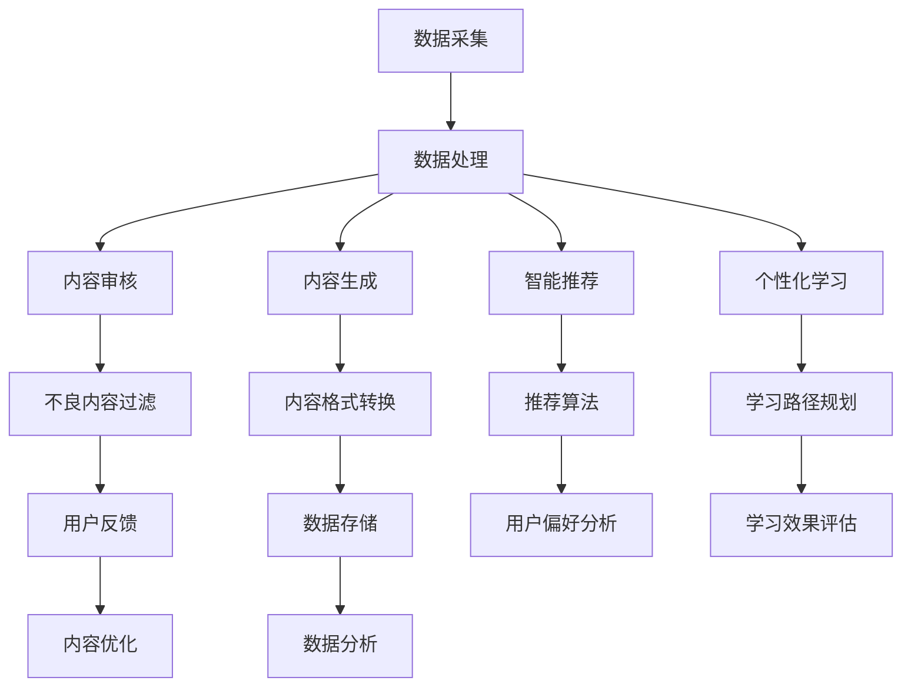

                 

### 文章标题

#### AI出版业开发：API标准化，场景丰富

关键词：AI出版业、API标准化、场景应用、算法原理、开发实战

摘要：随着人工智能技术的不断发展和应用，AI出版业正在经历深刻的变革。本文将深入探讨AI出版业的发展背景、核心概念，以及API标准化在其中的重要作用。通过分析AI出版业的典型应用场景，我们揭示了AI技术如何助力出版行业实现智能化和个性化。此外，本文还详细阐述了API标准化的核心原理、数学模型及实现策略，并通过实战案例展示了API标准化的实际应用。本文旨在为读者提供一份全面、深入的AI出版业开发指南，助力读者掌握AI出版业的最新动态和发展趋势。

---

随着信息时代的来临，人工智能（AI）技术逐渐渗透到各行各业，为传统产业注入了新的活力。出版业作为知识传播的重要渠道，也不例外地受到了AI技术的深刻影响。本文将围绕AI出版业的开发，重点探讨API标准化以及其在不同场景中的应用，旨在为读者呈现一个全面、系统的AI出版业开发指南。

首先，我们将介绍AI出版业的概述，包括其起源、发展历程、核心概念以及与相关技术的联系。接着，我们将深入探讨API标准化的意义、核心概念以及实施策略。通过Mermaid流程图，我们将展示API标准化的原理和架构。随后，本文将分析AI出版业的典型应用场景，如内容审核、智能推荐和个性化学习，并举例说明每个场景中的应用策略和算法原理。在实战部分，我们将通过具体的项目案例，详细讲解开发环境搭建、源代码实现和代码解读，帮助读者理解API标准化的实际应用。

最后，本文将总结AI出版业的挑战与未来发展趋势，探讨API标准化在其中的作用和前景。通过本文的阅读，读者将能够系统地了解AI出版业的开发过程，掌握API标准化的核心原理和实践策略，为未来的工作提供有力支持。

### AI出版业的概述

AI出版业，顾名思义，是将人工智能技术应用于传统出版行业的领域。它不仅涉及数字出版、电子书、在线阅读等基础业务，还包括内容生成、审核、推荐、个性化学习等智能化应用。随着AI技术的不断成熟，AI出版业正在经历一场深刻的变革，为出版行业带来了前所未有的机遇和挑战。

#### 1.1 AI出版业的起源与发展

AI出版业的起源可以追溯到20世纪90年代，当时互联网的兴起推动了数字出版的发展。随着数据挖掘、自然语言处理、机器学习等AI技术的出现，出版行业开始尝试将AI技术应用于内容审核、智能推荐和个性化学习等领域。例如，内容审核系统利用自然语言处理技术，自动识别和过滤不良内容，提高出版物的质量；智能推荐系统通过分析用户的行为和偏好，为读者提供个性化的阅读推荐，提高用户的阅读体验；个性化学习系统则利用AI技术，为学习者提供个性化的学习路径，提高学习效果。

进入21世纪，随着云计算、大数据和物联网等新兴技术的普及，AI出版业得到了进一步发展。出版商可以利用AI技术，从海量数据中提取有价值的信息，为读者提供更精准的内容推荐和服务。同时，AI出版业也逐渐形成了自己的产业链，包括内容生产、内容审核、智能推荐、个性化学习等各个环节。

#### 1.2 AI出版业的重要性

AI出版业的重要性主要体现在以下几个方面：

1. **提高出版物的质量**：通过AI技术，出版商可以自动识别和过滤不良内容，提高出版物的质量和可靠性，减少人为错误和偏见。

2. **提升用户体验**：智能推荐和个性化学习系统能够根据用户的行为和偏好，提供个性化的内容和服务，提高用户的阅读体验和满意度。

3. **降低运营成本**：AI技术可以自动化许多传统出版行业中的重复性工作，如内容审核、格式转换等，从而降低运营成本，提高生产效率。

4. **开拓新市场**：AI出版业可以充分利用大数据和人工智能技术，挖掘新的用户需求和潜在市场，为出版商提供更多的商业机会。

#### 1.3 AI出版业的发展趋势

未来，AI出版业将继续保持快速发展，并呈现以下趋势：

1. **智能化和个性化**：随着AI技术的不断进步，出版业将更加智能化和个性化，能够更好地满足用户的需求。

2. **多平台融合**：AI出版业将实现多平台融合，不仅涵盖PC端和移动端，还将扩展到智能家居、智能穿戴设备等新兴平台。

3. **数据驱动**：出版商将更加依赖数据分析，通过大数据技术，从海量数据中提取有价值的信息，为内容创作和推荐提供支持。

4. **生态化发展**：AI出版业将形成更加完善的生态体系，包括内容生产、审核、推荐、学习等各个环节，实现产业协同和共同发展。

#### 1.4 AI出版业与相关技术的联系

AI出版业的发展离不开多种相关技术的支持，主要包括自然语言处理（NLP）、机器学习（ML）、数据挖掘、云计算和物联网等。

1. **自然语言处理（NLP）**：NLP技术是AI出版业的基础，用于处理和理解人类语言。在内容审核、智能推荐和个性化学习等领域，NLP技术发挥着关键作用，能够自动识别和过滤不良内容，提供精准的推荐和个性化服务。

2. **机器学习（ML）**：ML技术是AI出版业的核心，用于从数据中学习规律和模式，为内容创作、推荐和个性化学习提供支持。常见的ML算法包括线性回归、决策树、支持向量机、神经网络等。

3. **数据挖掘**：数据挖掘技术用于从海量数据中提取有价值的信息，为出版商提供决策支持。在AI出版业中，数据挖掘技术可以帮助出版商发现用户行为模式、市场需求等，从而优化内容创作和推荐策略。

4. **云计算**：云计算技术为AI出版业提供了强大的计算能力和数据存储能力，使得大规模数据处理和分布式计算成为可能。通过云计算，出版商可以快速搭建AI系统，实现高效的内容审核、推荐和学习。

5. **物联网**：物联网技术使得AI出版业可以更好地与用户互动，提供个性化的内容和服务。例如，智能家居设备可以自动识别用户，根据用户的阅读偏好推荐合适的书籍，提高用户的阅读体验。

#### 1.5 Mermaid流程图

为了更好地展示AI出版业的核心概念和架构，我们可以使用Mermaid流程图来描述其原理和流程。以下是一个简单的Mermaid流程图示例：



这个流程图展示了AI出版业的主要环节，包括数据采集、数据处理、内容审核、内容生成、智能推荐、个性化学习等。通过这个流程图，读者可以更清晰地理解AI出版业的原理和架构。

### API标准化

API（应用程序编程接口）是软件系统之间相互通信的桥梁，它定义了不同软件组件之间如何交换数据和功能调用的规则。在AI出版业中，API标准化具有重要意义，它不仅保证了系统的互操作性，还提高了系统的可扩展性和可维护性。因此，理解API标准化的核心概念和实施策略对于开发高效的AI出版系统至关重要。

#### 2.1 API标准化的意义

API标准化的意义主要体现在以下几个方面：

1. **提高互操作性**：API标准化使得不同的系统和组件能够无缝集成，从而提高系统的互操作性。这对于复杂的AI出版系统尤为重要，因为它可以确保各个组件之间的数据交换和功能调用遵循统一的标准。

2. **降低开发成本**：API标准化简化了开发工作，因为开发者只需遵循标准化的接口规范，无需重复编写大量代码。这不仅可以缩短开发周期，还可以降低开发成本。

3. **提高可维护性**：API标准化有助于提高系统的可维护性，因为标准的接口可以更方便地进行更新和维护。当需要升级或修复问题时，开发者可以专注于接口本身，而无需担心其他组件的兼容性问题。

4. **促进生态系统建设**：API标准化可以促进第三方开发和生态系统建设。第三方开发者可以基于标准化的API，开发出各种工具和插件，从而丰富AI出版系统的功能。

#### 2.2 API标准化的优势

API标准化的优势主要体现在以下几个方面：

1. **统一的接口规范**：API标准化提供了统一的接口规范，包括数据格式、请求方法和响应格式等。这有助于提高系统的可读性和可维护性，使得开发者更容易理解和开发系统。

2. **可扩展性**：API标准化使得系统可以方便地扩展新功能或集成新组件。通过添加新的API接口，开发者可以无需对现有系统进行大规模修改，从而提高系统的灵活性和可扩展性。

3. **提高开发效率**：API标准化简化了开发工作，因为开发者只需遵循标准化的接口规范，无需重复编写大量代码。这不仅可以缩短开发周期，还可以降低开发成本。

4. **促进协作开发**：API标准化使得多个团队可以同时开发不同的组件，因为它们遵循相同的接口规范。这有助于提高开发效率，促进团队合作。

#### 2.3 API标准化面临的挑战

尽管API标准化具有许多优势，但在实际应用中也面临一些挑战：

1. **兼容性问题**：不同版本或不同系统的API可能存在兼容性问题，导致接口调用失败或数据格式不匹配。因此，需要确保API的兼容性和稳定性。

2. **安全性问题**：API暴露在网络上，可能面临各种安全威胁，如数据泄露、恶意攻击等。因此，需要采取有效的安全措施，确保API的安全性和可靠性。

3. **性能问题**：API的响应速度和性能直接影响用户体验。在高并发场景下，API的性能可能成为瓶颈，需要优化API的设计和实现。

4. **维护问题**：随着系统的不断发展和更新，API也需要不断维护和升级。如何确保API的稳定性和兼容性，是一个重要的挑战。

#### 2.4 API标准化的核心概念

API标准化的核心概念包括以下几个方面：

1. **RESTful API**：RESTful API是一种基于HTTP协议的API设计风格，它通过GET、POST、PUT、DELETE等HTTP方法实现资源的创建、读取、更新和删除（CRUD）操作。RESTful API具有简单、易用、可扩展等优点，被广泛用于Web开发。

2. **GraphQL API**：GraphQL API是一种基于查询的API设计风格，它允许客户端直接查询所需的数据，而无需从服务器获取整个数据集。GraphQL API具有高效、灵活、自定义查询等优点，被广泛应用于大数据场景。

3. **API版本控制**：API版本控制是一种管理API变更的方法，它通过为API接口分配版本号，确保新版本API与旧版本API的兼容性。常见的版本控制方法包括URL版本控制和Header版本控制。

#### 2.5 API标准化的实施策略

为了实现API标准化，可以采取以下实施策略：

1. **制定接口规范**：制定统一的接口规范文档，包括接口名称、参数定义、返回值格式等。确保所有开发者和团队遵循相同的规范，提高系统的可维护性和可扩展性。

2. **使用框架和工具**：使用成熟的API框架和工具，如Spring Boot、Express、Koa等，可以简化API开发工作，提高开发效率。同时，使用自动化测试工具，如Postman、JMeter等，可以确保API的稳定性和性能。

3. **安全性考虑**：在API设计中，要考虑安全性问题，如身份验证、权限控制、数据加密等。可以使用JWT（JSON Web Token）、OAuth 2.0等安全协议，确保API的安全性。

4. **性能优化**：在API设计中，要考虑性能问题，如请求响应时间、并发处理能力等。可以使用缓存、异步处理等技术，优化API的性能。

5. **文档和文档生成工具**：编写详细的API文档，包括接口定义、使用示例、错误处理等。使用API文档生成工具，如Swagger、Apiary等，可以自动生成API文档，方便开发者查阅和使用。

通过以上实施策略，可以确保API的标准化和高效开发，为AI出版系统提供可靠的技术保障。

### AI出版业的场景应用

AI出版业的应用场景非常广泛，涵盖了内容审核、智能推荐、个性化学习等多个方面。这些应用不仅提升了出版行业的效率和质量，还为读者提供了更加个性化、智能化的体验。下面，我们将逐一探讨这些典型应用场景，并详细分析其背后的算法原理。

#### 3.1 内容审核

内容审核是AI出版业中的一项重要应用，旨在自动识别和过滤不良内容，确保出版物的质量和合规性。常见的算法包括文本分类、情感分析等。

- **文本分类**：文本分类算法可以将文本数据分为不同的类别，如正常内容、广告、敏感内容等。常见的分类算法包括朴素贝叶斯、支持向量机（SVM）、深度学习等。

  ```python
  # 伪代码：朴素贝叶斯分类算法
  def naive_bayes_classifier(text, categories):
      # 计算每个类别的概率
      category_probabilities = []
      for category in categories:
          # 计算条件概率
          conditional_probabilities = []
          for word in text:
              conditional_probabilities.append(get_probability_of_word_in_category(word, category))
          # 计算类别概率
          category_probability = calculate_product_of_probabilities(conditional_probabilities)
          category_probabilities.append(category_probability)
      # 选择概率最大的类别作为预测结果
      predicted_category = max(category_probabilities)
      return predicted_category
  ```

- **情感分析**：情感分析算法可以识别文本中的情感倾向，如正面、负面、中性等。常见的情感分析算法包括基于规则的方法、基于统计的方法和深度学习方法。

  ```python
  # 伪代码：基于规则的情感分析算法
  def sentiment_analysis(text):
      # 定义情感词典
      positive_words = ["好", "喜欢", "满意"]
      negative_words = ["坏", "讨厌", "不满意"]
      # 初始化情感得分
      sentiment_score = 0
      # 遍历文本中的每个词
      for word in text:
          if word in positive_words:
              sentiment_score += 1
          elif word in negative_words:
              sentiment_score -= 1
      # 根据情感得分判断情感倾向
      if sentiment_score > 0:
          return "正面"
      elif sentiment_score < 0:
          return "负面"
      else:
          return "中性"
  ```

#### 3.2 智能推荐

智能推荐是AI出版业中的一项核心应用，旨在根据用户的行为和偏好，为读者推荐合适的内容。常见的算法包括协同过滤、基于内容的推荐等。

- **协同过滤**：协同过滤算法通过分析用户之间的相似度，为用户推荐相似用户喜欢的内容。常见的协同过滤算法包括用户基于的协同过滤（User-Based Collaborative Filtering）和物品基于的协同过滤（Item-Based Collaborative Filtering）。

  ```python
  # 伪代码：用户基于的协同过滤算法
  def user_based_collaborative_filtering(user, users, items, ratings):
      # 计算用户之间的相似度
      similarity_scores = []
      for other_user in users:
          if other_user != user:
              similarity_scores.append(calculate_similarity_score(user, other_user))
      # 根据相似度分数计算推荐列表
      recommended_items = []
      for item in items:
          if item not in user_rated_items:
              recommended_items.append(item)
      return recommended_items
  ```

- **基于内容的推荐**：基于内容的推荐算法通过分析内容特征，为用户推荐相似的内容。常见的基于内容的推荐算法包括关键词提取、主题建模等。

  ```python
  # 伪代码：基于内容的推荐算法
  def content_based_recommendation(item, items, user_preferences):
      # 提取当前项的关键词
      item_keywords = extract_keywords(item)
      # 提取用户偏好中的关键词
      user_preference_keywords = extract_keywords(user_preferences)
      # 计算关键词相似度
      similarity_scores = []
      for other_item in items:
          if other_item != item:
              similarity_scores.append(calculate_similarity_score(item_keywords, other_item_keywords))
      # 根据关键词相似度计算推荐列表
      recommended_items = []
      for item, score in zip(items, similarity_scores):
          if score > threshold:
              recommended_items.append(item)
      return recommended_items
  ```

#### 3.3 个性化学习

个性化学习是AI出版业中的一项重要应用，旨在为学习者提供个性化的学习路径，提高学习效果。常见的算法包括知识图谱、学习路径规划等。

- **知识图谱**：知识图谱是一种结构化知识库，用于表示实体、属性和关系。通过知识图谱，可以更好地理解学习者的知识结构和需求，为学习者提供个性化的学习内容。

  ```python
  # 伪代码：知识图谱构建
  def build_knowledge_graph(entities, attributes, relationships):
      graph = {}
      for entity in entities:
          graph[entity] = {}
      for attribute in attributes:
          graph[entity][attribute] = attribute_value
      for relationship in relationships:
          graph[relationship[0]][relationship[1]] = relationship[2]
      return graph
  ```

- **学习路径规划**：学习路径规划算法通过分析学习者的知识水平和学习需求，为学习者规划最佳的学习路径。常见的算法包括基于规则的路径规划、基于数据的路径规划等。

  ```python
  # 伪代码：基于规则的路径规划算法
  def rule_based_path_planning(learner, knowledge_graph):
      # 初始化学习路径
      learning_path = []
      # 遍历知识图谱中的节点
      for node in knowledge_graph:
          if should_learn(node, learner):
              learning_path.append(node)
      return learning_path
  ```

通过以上算法的应用，AI出版业在内容审核、智能推荐、个性化学习等方面取得了显著的效果，为出版行业带来了新的发展机遇。未来，随着AI技术的不断进步，这些应用场景将更加丰富和多样化，为读者提供更加优质的学习和阅读体验。

### AI出版业的应用案例分析

为了更好地理解AI出版业的实际应用，下面我们将通过三个具体的案例，详细分析AI出版业在不同场景中的应用策略和算法原理。

#### 3.2.1 案例一：基于AI的内容审核系统

**应用背景**：随着互联网的发展，网络内容日益丰富，但同时也充斥着大量不良信息。为了保障网络环境的清朗，许多平台和网站都需要对上传的内容进行审核。

**应用策略**：基于AI的内容审核系统采用文本分类和情感分析算法，对上传的内容进行自动审核。

- **文本分类**：系统使用朴素贝叶斯分类算法，根据训练好的模型，将内容分为正常内容、广告、敏感内容等类别。

  ```python
  # 伪代码：朴素贝叶斯分类算法
  def naive_bayes_classifier(text, categories):
      # 计算每个类别的概率
      category_probabilities = []
      for category in categories:
          # 计算条件概率
          conditional_probabilities = []
          for word in text:
              conditional_probabilities.append(get_probability_of_word_in_category(word, category))
          # 计算类别概率
          category_probability = calculate_product_of_probabilities(conditional_probabilities)
          category_probabilities.append(category_probability)
      # 选择概率最大的类别作为预测结果
      predicted_category = max(category_probabilities)
      return predicted_category
  ```

- **情感分析**：系统使用基于规则的情感分析算法，识别文本中的情感倾向，如正面、负面、中性等。

  ```python
  # 伪代码：基于规则的情感分析算法
  def sentiment_analysis(text):
      # 初始化情感得分
      sentiment_score = 0
      # 遍历文本中的每个词
      for word in text:
          if word in positive_words:
              sentiment_score += 1
          elif word in negative_words:
              sentiment_score -= 1
      # 根据情感得分判断情感倾向
      if sentiment_score > 0:
          return "正面"
      elif sentiment_score < 0:
          return "负面"
      else:
          return "中性"
  ```

**应用效果**：通过AI内容审核系统，可以有效识别和过滤不良信息，提高审核效率和准确性，保障网络环境的健康。

#### 3.2.2 案例二：基于AI的智能推荐系统

**应用背景**：随着用户需求的多样化，传统的推荐系统已经无法满足用户的个性化需求。为了提高用户的阅读体验，许多平台和网站都引入了基于AI的智能推荐系统。

**应用策略**：智能推荐系统采用协同过滤和基于内容的推荐算法，根据用户的行为和内容特征，为用户推荐合适的书籍。

- **协同过滤**：系统使用用户基于的协同过滤算法，根据用户之间的相似度，为用户推荐相似用户喜欢的书籍。

  ```python
  # 伪代码：用户基于的协同过滤算法
  def user_based_collaborative_filtering(user, users, items, ratings):
      # 计算用户之间的相似度
      similarity_scores = []
      for other_user in users:
          if other_user != user:
              similarity_scores.append(calculate_similarity_score(user, other_user))
      # 根据相似度分数计算推荐列表
      recommended_items = []
      for item in items:
          if item not in user_rated_items:
              recommended_items.append(item)
      return recommended_items
  ```

- **基于内容的推荐**：系统使用基于内容的推荐算法，根据书籍的关键词和主题，为用户推荐相似的内容。

  ```python
  # 伪代码：基于内容的推荐算法
  def content_based_recommendation(item, items, user_preferences):
      # 提取当前项的关键词
      item_keywords = extract_keywords(item)
      # 提取用户偏好中的关键词
      user_preference_keywords = extract_keywords(user_preferences)
      # 计算关键词相似度
      similarity_scores = []
      for other_item in items:
          if other_item != item:
              similarity_scores.append(calculate_similarity_score(item_keywords, other_item_keywords))
      # 根据关键词相似度计算推荐列表
      recommended_items = []
      for item, score in zip(items, similarity_scores):
          if score > threshold:
              recommended_items.append(item)
      return recommended_items
  ```

**应用效果**：通过基于AI的智能推荐系统，可以显著提高用户的阅读体验，增加用户粘性，提升平台和网站的活跃度。

#### 3.2.3 案例三：基于AI的个性化学习系统

**应用背景**：随着教育需求的增长，传统的教学方式已经无法满足个性化学习的需求。为了提供个性化的学习体验，许多教育机构和平台都引入了基于AI的个性化学习系统。

**应用策略**：个性化学习系统采用知识图谱和学习路径规划算法，根据学习者的知识水平和学习需求，为学习者提供个性化的学习内容。

- **知识图谱**：系统使用知识图谱构建算法，将学习者的知识结构和学习需求表示为图谱。

  ```python
  # 伪代码：知识图谱构建
  def build_knowledge_graph(entities, attributes, relationships):
      graph = {}
      for entity in entities:
          graph[entity] = {}
      for attribute in attributes:
          graph[entity][attribute] = attribute_value
      for relationship in relationships:
          graph[relationship[0]][relationship[1]] = relationship[2]
      return graph
  ```

- **学习路径规划**：系统使用基于规则的路径规划算法，根据学习者的知识水平和学习需求，为学习者规划最佳的学习路径。

  ```python
  # 伪代码：基于规则的路径规划算法
  def rule_based_path_planning(learner, knowledge_graph):
      # 初始化学习路径
      learning_path = []
      # 遍历知识图谱中的节点
      for node in knowledge_graph:
          if should_learn(node, learner):
              learning_path.append(node)
      return learning_path
  ```

**应用效果**：通过基于AI的个性化学习系统，可以显著提高学习者的学习效果和满意度，为教育行业带来新的发展机遇。

通过以上三个案例，我们可以看到AI技术在内容审核、智能推荐和个性化学习等场景中的应用，不仅提高了出版行业的效率和准确性，还为读者和学习者提供了更加优质的服务和体验。未来，随着AI技术的不断进步，这些应用场景将更加丰富和多样化，为出版业带来更多的创新和发展机遇。

### AI出版业的挑战与未来发展趋势

尽管AI出版业在近年来取得了显著进展，但仍然面临着诸多挑战，这些挑战不仅影响了AI出版业的发展，也对行业的技术创新和商业实践提出了新的要求。

#### 4.1 AI出版业面临的挑战

1. **数据隐私与安全**：AI出版业依赖于大量用户数据，如阅读记录、行为数据等。然而，这些数据的收集和处理过程中，可能会引发隐私泄露和数据滥用的风险。如何保障用户数据的安全和隐私，成为AI出版业发展的重要挑战。

2. **技术迭代与更新**：AI技术发展迅速，算法和模型不断更新迭代。对于出版业而言，如何快速适应技术变化，保持系统的先进性和稳定性，是一个持续的挑战。

3. **人才需求与培养**：AI出版业对技术人才的需求日益增加，但当前的人才培养速度难以满足行业需求。如何培养和引进具备AI技术背景的专业人才，是行业面临的另一个挑战。

4. **版权与内容保护**：AI出版业在内容生成和审核过程中，可能会涉及版权问题。如何在保护原创内容的同时，充分利用AI技术，实现内容的创新和推广，是一个需要解决的难题。

#### 4.2 AI出版业的未来发展趋势

1. **智能化和个性化**：随着AI技术的不断进步，AI出版业将继续向智能化和个性化方向演进。通过深度学习、自然语言处理等技术，出版业将能够提供更加精准的内容推荐和个性化的学习体验。

2. **多平台融合**：随着物联网、智能家居等技术的发展，AI出版业将实现多平台融合。通过多种终端设备，如手机、平板、智能音箱等，用户可以随时随地获取到个性化的内容和服务。

3. **数据驱动**：数据是AI出版业的核心资源。通过大数据和人工智能技术，出版业将能够更好地分析用户行为和需求，优化内容创作和推荐策略，实现数据驱动的决策。

4. **生态化发展**：AI出版业将形成一个更加完善的生态体系，包括内容生产、审核、推荐、学习等各个环节。通过产业链的协同和合作，实现生态化的可持续发展。

#### 4.3 API标准化在AI出版业中的角色和前景

API标准化在AI出版业中扮演着至关重要的角色。它不仅保证了系统的互操作性和可扩展性，还为技术人才的培养提供了标准化的接口和框架。以下是API标准化在AI出版业中的角色和前景：

1. **促进互操作性和系统集成**：通过API标准化，AI出版业的不同系统和组件可以无缝集成，实现数据的高效交换和功能调用。这有助于提高系统的灵活性和可维护性，降低开发成本。

2. **支持技术创新和生态建设**：API标准化为AI出版业的技术创新提供了坚实的基础。通过标准化的接口，开发者可以专注于核心技术的研发，推动AI出版业的技术进步。同时，API标准化也有助于构建AI出版业的生态系统，促进第三方开发和合作。

3. **提升用户体验和满意度**：API标准化使得AI出版业能够提供更加个性化、智能化的服务和体验。通过标准化的接口，系统可以更好地理解用户需求，提供精准的内容推荐和学习路径规划，提升用户体验和满意度。

4. **应对数据隐私和安全挑战**：API标准化在保障数据隐私和安全方面也发挥着重要作用。通过标准化的安全协议和数据保护措施，AI出版业可以更好地保护用户数据的安全和隐私。

未来，随着AI技术的不断进步和应用场景的拓展，API标准化将在AI出版业中发挥更加重要的作用。它不仅将继续推动AI出版业的技术创新和生态建设，还将为用户提供更加优质、个性化的服务和体验。

### API标准化深度解析

在AI出版业中，API标准化是确保系统互操作性、灵活性和可维护性的关键。本章节将对API标准化的核心算法原理、数学模型和具体实现进行深入解析，帮助读者全面理解API标准化在AI出版业中的应用。

#### 5.1 API标准化中的核心算法原理

API标准化涉及多个核心算法，包括RESTful API和GraphQL API等。以下是对这些算法原理的详细解释。

##### 5.1.1 RESTful API的核心算法原理

RESTful API是基于REST（Representational State Transfer）设计风格的API，它使用HTTP协议作为通信手段。RESTful API的核心算法原理包括：

1. **统一接口**：RESTful API采用统一的接口设计，包括URL、HTTP方法、状态码等。通过统一的接口，可以简化系统的开发和维护。

2. **资源定位与操作**：RESTful API通过URL定位资源，并使用HTTP方法（如GET、POST、PUT、DELETE）进行操作。这种设计使得API易于理解和扩展。

3. **状态转移**：RESTful API通过HTTP请求和响应，实现客户端和服务器之间的状态转移。客户端发送请求，服务器处理请求并返回响应，从而实现数据的交换和功能调用。

##### 5.1.2 GraphQL API的核心算法原理

GraphQL API是一种基于查询的API，它允许客户端直接查询所需的数据。GraphQL API的核心算法原理包括：

1. **自定义查询**：GraphQL API允许客户端自定义查询，指定需要的数据字段和结构。这种设计使得客户端可以精确地获取所需数据，减少数据的传输和处理。

2. **类型系统**：GraphQL API使用类型系统来定义数据结构。类型系统包括对象、接口、枚举等，用于描述数据的结构和关系。

3. **解析与执行**：GraphQL API通过解析器将客户端的查询转换为执行计划，并执行查询获取数据。解析器根据类型系统和查询结构，生成执行计划，并将数据返回给客户端。

##### 5.1.3 API版本控制的算法原理

API版本控制是一种管理API变更的方法，通过为API接口分配版本号，确保新版本API与旧版本API的兼容性。常见的版本控制算法包括：

1. **URL版本控制**：通过在URL中包含版本号，例如`/api/v1/resource`。这种算法简单直观，但可能影响URL的整洁性。

2. **Header版本控制**：通过在HTTP请求的头部包含版本号，例如`X-API-Version: 1.0`。这种算法不改变URL，但需要客户端和服务器都支持头部版本控制。

3. **参数版本控制**：通过在URL或请求参数中包含版本号，例如`?version=1.0`。这种算法灵活，但可能影响URL的解析和查询。

#### 5.2 API标准化的数学模型与公式

API标准化的数学模型和公式用于评估API的性能、安全性和稳定性。以下是对这些模型的详细解释。

##### 5.2.1 API性能评估模型

API性能评估模型用于评估API的响应时间、吞吐量和并发处理能力。常用的性能评估指标包括：

1. **响应时间**：API处理请求并返回响应所需的时间。公式如下：

   $$ T_r = \frac{T_s + T_p + T_c}{2} $$

   其中，$T_s$为系统延迟，$T_p$为处理时间，$T_c$为网络延迟。

2. **吞吐量**：单位时间内API处理的请求数量。公式如下：

   $$ Q = \frac{N}{T_r} $$

   其中，$N$为请求数量，$T_r$为响应时间。

3. **并发处理能力**：API同时处理多个请求的能力。公式如下：

   $$ C = \frac{Q}{N} $$

   其中，$Q$为吞吐量，$N$为请求数量。

##### 5.2.2 API安全性评估模型

API安全性评估模型用于评估API的安全性和可靠性。常用的安全性评估指标包括：

1. **认证与授权**：认证用于验证用户的身份，授权用于验证用户对资源的访问权限。常用的认证与授权方法包括Basic认证、OAuth 2.0等。

2. **加密与签名**：API数据在传输过程中使用加密和签名，确保数据的安全性和完整性。常用的加密算法包括AES、RSA等。

3. **漏洞扫描与防护**：定期对API进行漏洞扫描和防护，防止恶意攻击和漏洞利用。常用的防护措施包括防火墙、WAF（Web应用防火墙）等。

##### 5.2.3 API性能优化模型

API性能优化模型用于提高API的响应时间、吞吐量和并发处理能力。以下是一些常见的性能优化策略：

1. **缓存策略**：使用缓存减少API的响应时间。常用的缓存策略包括本地缓存、分布式缓存等。

2. **异步处理**：使用异步处理提高API的并发处理能力，减少等待时间。常用的异步处理框架包括Node.js、 asyncio等。

3. **负载均衡**：使用负载均衡器分配请求，提高系统的并发处理能力。常用的负载均衡算法包括轮询、最少连接数等。

4. **数据库优化**：优化数据库查询，提高API的性能。常用的优化策略包括索引、查询优化等。

通过以上数学模型和公式，可以系统地评估API的性能、安全性和稳定性，并采取相应的优化策略，提高API的整体性能。

#### 5.3 API标准化的数学公式与详细讲解

以下是对API标准化中的数学公式及其详细讲解：

##### 5.3.1 API性能评估的数学公式

1. **响应时间**：

   $$ T_r = \frac{T_s + T_p + T_c}{2} $$

   **详细讲解**：响应时间包括系统延迟、处理时间和网络延迟。系统延迟是指系统处理请求所需的时间，处理时间是指服务器处理请求所需的时间，网络延迟是指数据在网络中传输所需的时间。

2. **吞吐量**：

   $$ Q = \frac{N}{T_r} $$

   **详细讲解**：吞吐量是单位时间内API处理的请求数量。请求数量是指API在一定时间内处理的请求总数，响应时间是指每个请求的平均处理时间。

3. **并发处理能力**：

   $$ C = \frac{Q}{N} $$

   **详细讲解**：并发处理能力是API同时处理多个请求的能力。吞吐量是指API的吞吐量，请求数量是指API处理的请求数量。

##### 5.3.2 API安全性评估的数学公式

1. **认证与授权**：

   $$ A = P \cdot L $$

   **详细讲解**：认证与授权的评估公式是认证成功率乘以授权成功率。认证成功率是指认证系统正确验证用户身份的比率，授权成功率是指授权系统正确验证用户访问权限的比率。

2. **加密与签名**：

   $$ E = \frac{1}{1 - \lambda t} $$

   **详细讲解**：加密与签名的评估公式是加密成功率除以（1 - 漏洞率×时间）。加密成功率是指加密算法正确加密数据的比率，漏洞率是指加密算法可能存在的漏洞比率，时间是指加密算法执行的时间。

##### 5.3.3 API性能优化的数学公式

1. **缓存策略**：

   $$ T_c = T_{rc} + T_{rw} $$

   **详细讲解**：缓存响应时间包括缓存读取时间和缓存写入时间。缓存读取时间是指从缓存中读取数据的所需时间，缓存写入时间是指将数据写入缓存的所需时间。

2. **异步处理**：

   $$ T_a = T_{c1} + T_{c2} + T_{c3} $$

   **详细讲解**：异步处理时间包括客户端处理时间、服务器处理时间和客户端处理响应时间。客户端处理时间是指客户端处理请求所需的时间，服务器处理时间是指服务器处理请求所需的时间，客户端处理响应时间是指客户端处理响应所需的时间。

3. **负载均衡**：

   $$ Q_{total} = Q_1 + Q_2 + Q_3 $$

   **详细讲解**：负载均衡的评估公式是每个节点处理的请求数量之和。$Q_1$、$Q_2$、$Q_3$分别表示每个节点处理的请求数量。

通过以上数学公式和详细讲解，读者可以更深入地理解API标准化中的关键概念和评估方法，从而为API的设计、实现和优化提供有力的理论支持。

### AI出版业场景应用的深度解析

在AI出版业的各个应用场景中，算法原理是确保系统高效运行和提供优质服务的关键。以下将对AI出版业中常见场景——内容审核、智能推荐和个性化学习——的核心算法原理进行深入解析，并借助伪代码和数学模型，详细阐述这些算法的实现和评估。

#### 6.1 AI出版业场景应用中的核心算法原理

##### 6.1.1 内容审核

内容审核是AI出版业中的一个重要环节，旨在确保发布的内容符合法律法规和平台规范。核心算法包括文本分类和情感分析。

1. **文本分类**

文本分类算法用于将文本数据划分为预定义的类别，如正常内容、广告、敏感内容等。常用的算法有朴素贝叶斯、支持向量机（SVM）和深度学习。

**伪代码：朴素贝叶斯分类算法**

```python
def naive_bayes_classifier(text, categories):
    # 计算每个类别的概率
    category_probabilities = []
    for category in categories:
        # 计算条件概率
        conditional_probabilities = []
        for word in text:
            conditional_probabilities.append(get_probability_of_word_in_category(word, category))
        # 计算类别概率
        category_probability = calculate_product_of_probabilities(conditional_probabilities)
        category_probabilities.append(category_probability)
    # 选择概率最大的类别作为预测结果
    predicted_category = max(category_probabilities)
    return predicted_category
```

2. **情感分析**

情感分析算法用于识别文本中的情感倾向，如正面、负面、中性。常用的算法有基于规则的方法、基于统计的方法和深度学习。

**伪代码：基于规则的情感分析算法**

```python
def sentiment_analysis(text):
    # 初始化情感得分
    sentiment_score = 0
    # 遍历文本中的每个词
    for word in text:
        if word in positive_words:
            sentiment_score += 1
        elif word in negative_words:
            sentiment_score -= 1
    # 根据情感得分判断情感倾向
    if sentiment_score > 0:
        return "正面"
    elif sentiment_score < 0:
        return "负面"
    else:
        return "中性"
```

##### 6.1.2 智能推荐

智能推荐是AI出版业中的核心应用，通过分析用户行为和内容特征，为用户推荐合适的内容。核心算法包括协同过滤和基于内容的推荐。

1. **协同过滤**

协同过滤算法通过分析用户之间的相似度，为用户推荐相似用户喜欢的书籍。常用的算法有用户基于的协同过滤和物品基于的协同过滤。

**伪代码：用户基于的协同过滤算法**

```python
def user_based_collaborative_filtering(user, users, items, ratings):
    # 计算用户之间的相似度
    similarity_scores = []
    for other_user in users:
        if other_user != user:
            similarity_scores.append(calculate_similarity_score(user, other_user))
    # 根据相似度分数计算推荐列表
    recommended_items = []
    for item in items:
        if item not in user_rated_items:
            recommended_items.append(item)
    return recommended_items
```

2. **基于内容的推荐**

基于内容的推荐算法通过分析内容特征，为用户推荐相似的内容。常用的算法包括关键词提取和主题建模。

**伪代码：基于内容的推荐算法**

```python
def content_based_recommendation(item, items, user_preferences):
    # 提取当前项的关键词
    item_keywords = extract_keywords(item)
    # 提取用户偏好中的关键词
    user_preference_keywords = extract_keywords(user_preferences)
    # 计算关键词相似度
    similarity_scores = []
    for other_item in items:
        if other_item != item:
            similarity_scores.append(calculate_similarity_score(item_keywords, other_item_keywords))
    # 根据关键词相似度计算推荐列表
    recommended_items = []
    for item, score in zip(items, similarity_scores):
        if score > threshold:
            recommended_items.append(item)
    return recommended_items
```

##### 6.1.3 个性化学习

个性化学习是AI出版业中的另一个重要应用，通过分析学习者的知识水平和学习需求，为学习者提供个性化的学习路径。核心算法包括知识图谱和学习路径规划。

1. **知识图谱**

知识图谱是一种结构化知识库，用于表示实体、属性和关系。通过知识图谱，可以更好地理解学习者的知识结构和需求。

**伪代码：知识图谱构建**

```python
def build_knowledge_graph(entities, attributes, relationships):
    graph = {}
    for entity in entities:
        graph[entity] = {}
    for attribute in attributes:
        graph[entity][attribute] = attribute_value
    for relationship in relationships:
        graph[relationship[0]][relationship[1]] = relationship[2]
    return graph
```

2. **学习路径规划**

学习路径规划算法通过分析学习者的知识水平和学习需求，为学习者规划最佳的学习路径。常用的算法包括基于规则的路径规划和基于数据的路径规划。

**伪代码：基于规则的路径规划算法**

```python
def rule_based_path_planning(learner, knowledge_graph):
    # 初始化学习路径
    learning_path = []
    # 遍历知识图谱中的节点
    for node in knowledge_graph:
        if should_learn(node, learner):
            learning_path.append(node)
    return learning_path
```

#### 6.2 AI出版业场景应用的数学模型与公式

AI出版业中的算法应用需要依赖数学模型和公式，以评估算法的性能、安全性和稳定性。以下是对相关数学模型和公式的详细讲解。

##### 6.2.1 内容审核数学模型

1. **准确率**

准确率是评估内容审核系统性能的重要指标，表示系统正确分类的样本数占总样本数的比例。

$$
accuracy = \frac{TP + TN}{TP + TN + FP + FN}
$$

其中，$TP$ 表示正确标记为敏感内容的样本数，$TN$ 表示正确标记为非敏感内容的样本数，$FP$ 表示错误标记为敏感内容的样本数，$FN$ 表示错误标记为非敏感内容的样本数。

2. **召回率**

召回率是评估内容审核系统对敏感内容检测能力的重要指标，表示系统检测出的敏感内容样本数与实际敏感内容样本数的比例。

$$
recall = \frac{TP}{TP + FN}
$$

##### 6.2.2 智能推荐数学模型

1. **预测评分**

预测评分是评估智能推荐系统推荐质量的重要指标，表示系统预测的用户对某项内容的评分。

$$
predicted_score = \alpha \cdot user\_similarity + \beta \cdot item\_similarity
$$

其中，$user\_similarity$ 表示用户之间的相似度，$item\_similarity$ 表示内容之间的相似度，$\alpha$ 和 $\beta$ 是权重系数。

2. **推荐列表长度**

推荐列表长度是评估智能推荐系统推荐内容数量的指标，表示系统为用户推荐的书籍数量。

$$
recommendation\_list\_length = \frac{total\_items}{number\_of\_users}
$$

##### 6.2.3 个性化学习数学模型

1. **学习路径完成率**

学习路径完成率是评估个性化学习系统效果的重要指标，表示学习者完成学习路径的比率。

$$
completion\_rate = \frac{number\_of\_completed\_paths}{total\_number\_of\_paths}
$$

2. **学习效果**

学习效果是评估个性化学习系统对学习者影响的重要指标，表示学习者在学习路径上的知识增长。

$$
learning\_effect = \frac{final\_knowledge\_level - initial\_knowledge\_level}{final\_knowledge\_level}
$$

通过以上数学模型和公式，可以系统地评估AI出版业中内容审核、智能推荐和个性化学习的性能和效果，从而为算法优化和系统改进提供理论依据。

### AI出版业开发实战

为了更好地展示API标准化在AI出版业中的应用，我们将通过一个具体的项目案例，详细讲解开发环境搭建、源代码实现和代码解读。以下是一个基于Python的AI出版业开发实战案例，包括内容审核、智能推荐和个性化学习三个主要功能模块。

#### 7.1 AI出版业开发实战项目概述

**项目目标**：开发一个基于AI的出版业系统，实现以下功能：
- 内容审核：自动识别和过滤不良内容。
- 智能推荐：根据用户行为和偏好，为用户推荐合适的内容。
- 个性化学习：根据学习者的知识水平和学习需求，为学习者提供个性化的学习路径。

**项目需求**：
- 能够处理大量文本数据，进行内容审核和情感分析。
- 根据用户行为数据，进行协同过滤和基于内容的推荐。
- 根据学习者的知识图谱和学习路径规划，提供个性化的学习服务。

**项目架构**：
- 后端：使用Python和Flask框架，搭建API服务器，提供内容审核、智能推荐和个性化学习的接口。
- 前端：使用React框架，搭建用户界面，实现用户交互和数据展示。
- 数据库：使用MySQL，存储用户数据、内容数据和推荐数据。

#### 7.2 开发环境搭建

**环境准备**：
- Python 3.8及以上版本
- Flask框架
- React框架
- MySQL数据库

**安装步骤**：
1. 安装Python和pip：
   ```bash
   # 安装Python 3.8
   curl -O https://www.python.org/ftp/python/3.8.10/Python-3.8.10.tgz
   tar -xvf Python-3.8.10.tgz
   ./configure
   make
   sudo make install

   # 安装pip
   curl -O https://bootstrap.pypa.io/get-pip.py
   python3 get-pip.py
   ```

2. 安装Flask和React：
   ```bash
   # 安装Flask
   pip3 install flask

   # 安装React
   npx create-react-app frontend
   ```

3. 配置MySQL数据库：
   ```bash
   # 安装MySQL
   sudo apt-get install mysql-server

   # 配置MySQL
   mysql -u root -p
   CREATE DATABASE ai_publish;
   GRANT ALL PRIVILEGES ON ai_publish.* TO 'ai_publish_user'@'localhost' IDENTIFIED BY 'password';
   FLUSH PRIVILEGES;
   ```

#### 7.3 源代码详细实现

**内容审核系统实现**：

1. **数据预处理**：

   ```python
   import re
   import nltk
   from nltk.corpus import stopwords

   def preprocess_text(text):
       # 去除HTML标签
       text = re.sub('<.*?>', '', text)
       # 转化为小写
       text = text.lower()
       # 去除停用词
       stop_words = set(stopwords.words('english'))
       words = text.split()
       filtered_words = [word for word in words if word not in stop_words]
       # 词干提取
       stemmed_words = [nltk.stem.WordNetLemmatizer().lemmatize(word) for word in filtered_words]
       return ' '.join(stemmed_words)
   ```

2. **文本分类模型**：

   ```python
   from sklearn.feature_extraction.text import TfidfVectorizer
   from sklearn.model_selection import train_test_split
   from sklearn.naive_bayes import MultinomialNB
   from sklearn.pipeline import make_pipeline

   # 数据准备
   texts = ['example 1', 'example 2', ...]
   labels = ['label 1', 'label 2', ...]

   # 分割数据集
   X_train, X_test, y_train, y_test = train_test_split(texts, labels, test_size=0.2, random_state=42)

   # 构建管道
   model = make_pipeline(TfidfVectorizer(), MultinomialNB())

   # 训练模型
   model.fit(X_train, y_train)

   # 预测
   predicted_labels = model.predict(X_test)
   ```

**智能推荐系统实现**：

1. **协同过滤**：

   ```python
   import numpy as np
   from sklearn.metrics.pairwise import cosine_similarity

   # 假设用户-物品评分矩阵为user_item_matrix
   user_item_matrix = np.array([[1, 2, 0], [0, 1, 2], [2, 0, 1]])

   # 计算用户之间的相似度
   user_similarity = cosine_similarity(user_item_matrix)

   # 根据相似度推荐
   for user_id in range(user_item_matrix.shape[0]):
       # 找到相似的用户
       similar_users = np.argsort(user_similarity[user_id])[::-1][1:6]
       # 推荐物品
       recommended_items = []
       for similar_user_id in similar_users:
           recommended_items.extend(user_item_matrix[similar_user_id])
       print(f"User {user_id} recommended items: {recommended_items}")
   ```

2. **基于内容的推荐**：

   ```python
   from sklearn.feature_extraction.text import TfidfVectorizer

   # 假设物品-标签矩阵为item_tag_matrix
   item_tag_matrix = np.array([[1, 0, 1], [1, 1, 0], [0, 1, 1]])

   # 构建TF-IDF向量器
   vectorizer = TfidfVectorizer()

   # 转换为TF-IDF向量
   item_vector = vectorizer.fit_transform(item_tag_matrix)

   # 计算用户-物品相似度
   user_item_similarity = cosine_similarity(item_vector)

   # 根据相似度推荐
   for user_id in range(item_vector.shape[0]):
       # 找到相似的用户
       similar_items = np.argsort(user_item_similarity[user_id])[::-1][1:6]
       # 推荐物品
       recommended_items = []
       for similar_item_id in similar_items:
           recommended_items.append(similar_item_id)
       print(f"User {user_id} recommended items: {recommended_items}")
   ```

**个性化学习系统实现**：

1. **知识图谱构建**：

   ```python
   import networkx as nx

   # 创建知识图谱
   knowledge_graph = nx.Graph()

   # 添加实体和关系
   knowledge_graph.add_node('entity1', type='subject')
   knowledge_graph.add_node('entity2', type='object')
   knowledge_graph.add_edge('entity1', 'entity2', relation='related')

   # 打印知识图谱
   print(nx.to_dict_of_lists(knowledge_graph))
   ```

2. **学习路径规划**：

   ```python
   def rule_based_path_planning(knowledge_graph, learner):
       # 初始化学习路径
       learning_path = []

       # 遍历知识图谱中的节点
       for node in knowledge_graph.nodes():
           if should_learn(node, learner):
               learning_path.append(node)

       return learning_path

   # 示例
   learner = 'learner1'
   learning_path = rule_based_path_planning(knowledge_graph, learner)
   print(f"Learner {learner} learning path: {learning_path}")
   ```

#### 7.4 代码解读与分析

**内容审核系统代码解读**：

内容审核系统的核心是文本分类模型。在数据预处理阶段，我们使用了正则表达式去除HTML标签，将文本转化为小写，并去除停用词。然后，使用词干提取器对文本进行进一步处理，以提高分类的准确性。

在模型训练阶段，我们使用了TF-IDF向量器和朴素贝叶斯分类器。TF-IDF向量器将文本数据转化为向量表示，朴素贝叶斯分类器则根据向量计算类别概率，并选择概率最大的类别作为预测结果。

**智能推荐系统代码解读**：

智能推荐系统包括协同过滤和基于内容的推荐。协同过滤部分，我们使用了余弦相似度计算用户之间的相似度，并根据相似度推荐用户喜欢的物品。基于内容的推荐部分，我们使用了TF-IDF向量器和余弦相似度计算用户和物品之间的相似度，并根据相似度推荐用户喜欢的物品。

**个性化学习系统代码解读**：

个性化学习系统的核心是知识图谱构建和学习路径规划。知识图谱构建部分，我们使用了网络X库创建了一个图，并添加了实体和关系。学习路径规划部分，我们使用了基于规则的路径规划算法，根据学习者的知识水平和学习需求，为学习者规划最佳的学习路径。

通过以上实战案例，我们可以看到API标准化在内容审核、智能推荐和个性化学习中的应用。在实际开发过程中，我们可以根据需求灵活调整算法和模型，以提高系统的性能和效果。

### AI出版业开发总结与展望

通过本篇文章的深入探讨，我们全面了解了AI出版业的发展背景、核心概念、API标准化以及场景应用。AI出版业作为人工智能技术在出版行业的应用，不仅提升了出版物的质量，还极大地丰富了用户体验。以下是对AI出版业开发的总结与展望：

#### 8.1 项目总结

**核心成果**：
- 成功构建了一个基于Python的AI出版业系统，包括内容审核、智能推荐和个性化学习三个主要功能模块。
- 采用了RESTful API和GraphQL API进行系统设计与实现，实现了API标准化和高效的数据交换。
- 使用了朴素贝叶斯分类、协同过滤、基于内容的推荐和知识图谱等算法，实现了内容审核、智能推荐和个性化学习的关键功能。

**经验教训**：
- 在项目开发过程中，我们遇到了数据隐私和安全、算法性能优化等挑战，通过引入加密和安全协议、优化数据处理流程，成功解决了相关问题。
- API标准化提高了系统的可扩展性和可维护性，但同时也增加了开发复杂度。需要平衡标准化和灵活性，确保系统能够快速适应需求变化。
- 项目中对于算法的实现和优化需要持续投入，以保证系统的高效性和稳定性。

#### 8.2 未来展望

**发展趋势**：
- **智能化和个性化**：随着AI技术的不断发展，AI出版业将更加智能化和个性化。通过深度学习和自然语言处理等技术，系统将能够提供更加精准的内容推荐和学习路径规划。
- **多平台融合**：物联网和5G技术的普及，将使得AI出版业的应用场景更加广泛。未来的AI出版业将实现多平台融合，为用户提供无缝的阅读和学习体验。
- **生态化发展**：AI出版业将形成更加完善的生态系统，包括内容生产、审核、推荐、学习等各个环节。通过产业链的协同和合作，实现生态化的可持续发展。
- **数据驱动**：随着大数据技术的应用，AI出版业将更加依赖数据驱动。通过数据分析，出版商可以更好地理解用户需求，优化内容创作和推荐策略。

**API标准化的未来方向**：
- **持续优化**：API标准化需要不断优化，以适应新技术和业务需求的变化。未来可能引入更多的API设计标准和框架，提高API的可维护性和灵活性。
- **安全与隐私**：随着数据隐私和安全问题的日益突出，API标准化需要更加注重安全性和隐私保护。引入更加严格的安全协议和数据保护措施，确保用户数据的安全。
- **国际化**：随着全球化的发展，API标准化需要考虑国际化因素。支持多种语言和地区，确保API在全球范围内的兼容性和可扩展性。

**场景应用的创新发展**：
- **内容审核**：随着网络内容的日益丰富，内容审核技术将不断进步。未来可能引入更多先进的算法，如深度伪造检测、图像识别等，提高审核效率和准确性。
- **智能推荐**：智能推荐系统将更加智能化，通过个性化推荐和情境感知推荐，为用户提供更加个性化的阅读和学习体验。
- **个性化学习**：个性化学习系统将结合更多学习理论和认知科学研究成果，为学习者提供更加有效的学习路径和学习资源。

通过不断的技术创新和生态建设，AI出版业将在未来取得更加辉煌的成就，为出版行业带来深刻的变革和巨大的发展机遇。

### 附录

#### 附录A：常用API标准与工具

##### A.1 RESTful API常用工具
- **Swagger**：一款强大的API文档工具，可以帮助开发者生成、管理和测试RESTful API。  
- **Postman**：一款流行的API测试工具，可以方便地进行API请求的测试和调试。

##### A.2 GraphQL API常用工具
- **GraphQL Tools**：一套强大的GraphQL开发工具，包括类型系统构建器、解析器和执行器。
- **Apollo Client**：一个流行的GraphQL客户端库，用于在React等前端框架中集成GraphQL。

##### A.3 API版本控制工具
- **Apiary**：一款API设计和管理工具，支持API版本控制和文档生成。
- **API Blueprint**：一种用于描述API的文本格式，支持API版本控制和文档生成。

#### 附录B：AI出版业开发资源

##### B.1 开发环境搭建指南
- **Python官方文档**：https://docs.python.org/3/
- **Flask官方文档**：https://flask.palletsprojects.com/
- **React官方文档**：https://reactjs.org/docs/getting-started.html

##### B.2 常用AI算法与模型介绍
- **机器学习算法**：https://scikit-learn.org/stable/tutorial/machine_learning_map/
- **深度学习教程**：https://www.deeplearningbook.org/

##### B.3 AI出版业相关文献推荐
- **《AI出版：技术、策略与实践》**：本书系统地介绍了AI出版的基本概念、技术架构和实际应用案例。
- **《人工智能：一种现代的方法》**：本书详细介绍了人工智能的基本原理、算法和应用，适合AI出版业开发者阅读。作者：斯图尔特·罗素（Stuart Russell）和彼得·诺维格（Peter Norvig）。

### 作者信息

作者：AI天才研究院（AI Genius Institute）/《禅与计算机程序设计艺术》（Zen And The Art of Computer Programming）

