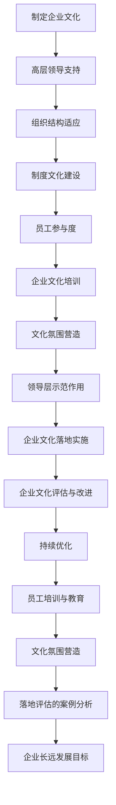

                 

### 第4章: 企业文化的落地与评估

#### 第4.1节: 企业文化的落地实施

企业文化的落地实施是企业文化建设的重要环节，它是将抽象的企业价值观和理念转化为具体行动和日常操作的过程。成功的文化落地能够确保企业愿景、使命和价值观在企业内部得到广泛认同和贯彻执行。

**4.1.1 企业文化的落地关键因素**

企业文化的落地实施需要关注以下几个关键因素：

- **领导层的支持与示范**：企业高层领导的支持至关重要。他们需要率先践行企业文化，成为员工的行为榜样。
- **组织结构的适应性**：企业文化需要与企业的组织结构相适应，确保文化在各个层级得到有效传递和执行。
- **制度文化的建设**：建立与企业文化相一致的规章制度，如员工手册、绩效考核体系等，以规范员工行为。
- **员工参与度**：鼓励员工参与企业文化的建设和实施过程，提高他们的认同感和参与感。

**4.1.2 企业文化的落地策略**

1. **系统性的培训与教育**：
   - **新员工入职培训**：在员工入职时进行企业文化培训，让他们快速了解和适应企业文化。
   - **在职员工培训**：定期组织企业文化培训，强化员工对企业价值观的理解和认同。

2. **营造良好的文化氛围**：
   - **办公环境**：打造符合企业文化的办公环境，如开放式办公空间、员工休息区等。
   - **文化展示**：在企业内部设置文化展示区，展示企业历史、价值观和成功案例。

3. **领导层的示范作用**：
   - **高层领导的行为**：企业高层领导需要通过自己的言行，展示企业文化的重要性，并践行企业价值观。

**4.1.3 落地实施的案例分析**

- **谷歌公司的企业文化落地**：
  谷歌通过一系列措施将企业文化落地实施。例如，通过内部邮件、员工博客、团队建设活动等方式，传递企业文化。同时，谷歌还设立了“谷歌原则”，作为企业行为的指南，确保企业文化在企业内部得到贯彻执行。

#### 第4.2节: 企业文化的评估与改进

企业文化评估是企业文化建设过程中的重要环节，它有助于企业了解文化建设的成效，发现存在的问题，并及时进行改进。

**4.2.1 企业文化评估的目的**

- **了解文化成效**：评估企业文化在企业内部的影响力和员工对企业文化的认同度。
- **发现存在的问题**：识别企业文化在实施过程中遇到的问题和挑战。
- **指导文化改进**：根据评估结果，制定相应的改进措施，优化企业文化。

**4.2.2 企业文化评估的方法**

1. **员工满意度调查**：
   - **问卷调查**：通过问卷调查了解员工对企业文化的认同度和满意度。
   - **面对面访谈**：与员工进行面对面访谈，深入了解他们对企业文化的看法和建议。

2. **关键绩效指标（KPI）**：
   - **业务绩效指标**：通过分析企业的业务绩效指标，评估企业文化对业务成果的影响。
   - **员工绩效指标**：通过分析员工的绩效表现，评估企业文化对员工行为和工作效率的影响。

3. **外部反馈**：
   - **客户反馈**：收集客户对企业产品和服务的反馈，了解企业文化对客户满意度的影响。
   - **合作伙伴反馈**：与合作伙伴交流，了解企业文化在市场中的形象和影响力。

**4.2.3 企业文化改进的策略**

1. **持续优化**：
   - **定期评估**：定期对企业文化进行评估，及时发现存在的问题，并进行改进。
   - **调整策略**：根据评估结果，调整企业文化的传播和推广策略，提高文化的影响力。

2. **员工培训与教育**：
   - **加强培训**：针对评估中发现的问题，加强员工对企业文化的培训，提高他们的认同度和执行力。
   - **培训内容更新**：定期更新培训内容，确保培训与企业的实际需求相符。

3. **文化氛围营造**：
   - **活动丰富**：举办多样化的文化活动，增强员工对企业文化的认同和参与感。
   - **文化宣传**：利用内部刊物、社交媒体等渠道，加强企业文化宣传，提高员工的文化素养。

**4.2.4 落地评估的案例分析**

- **华为公司的企业文化评估与改进**：
  华为公司定期进行企业文化评估，通过员工满意度调查、关键绩效指标和外部反馈等多种方式，了解企业文化在企业内部的影响和效果。根据评估结果，华为不断调整和优化企业文化，确保其与企业的战略目标和发展阶段相适应。

通过以上分析与案例，我们可以看到，企业文化的落地实施和评估改进是一个持续的过程，需要企业不断地关注和优化。只有通过有效的文化落地和评估改进，企业才能确保企业文化在企业内部得到广泛认同和贯彻执行，从而实现企业的长远发展目标。

---

**核心概念与联系**

下面我们将使用Mermaid流程图来展示企业文化落地实施的关键步骤和核心概念之间的联系：



通过这个流程图，我们可以清晰地看到企业文化建设从核心概念到实际落地实施和评估改进的整个过程，以及各个环节之间的内在联系。

---

**核心算法原理讲解**

在企业文化评估过程中，常用的核心算法原理包括统计分析方法和数据挖掘技术。以下将使用伪代码来详细阐述这些算法的基本原理和应用。

```pseudo
// 伪代码：员工满意度调查分析

// 步骤1：收集员工满意度数据
满意度数据 = 收集员工满意度调查结果

// 步骤2：数据预处理
满意度数据预处理 = 清洗和整理满意度数据

// 步骤3：统计分析
// 计算满意度平均值
满意度平均值 = 计算平均值(满意度数据)

// 计算满意度标准差
满意度标准差 = 计算标准差(满意度数据)

// 步骤4：数据挖掘
// 使用关联规则挖掘技术，分析满意度影响因素
关联规则 = 关联规则挖掘(满意度数据)

// 步骤5：评估与改进
// 根据满意度分析和数据挖掘结果，制定改进措施
改进措施 = 制定改进措施(关联规则)

// 伪代码：关键绩效指标（KPI）分析

// 步骤1：收集关键绩效指标数据
KPI数据 = 收集业务绩效和员工绩效数据

// 步骤2：数据预处理
KPI数据预处理 = 清洗和整理KPI数据

// 步骤3：统计分析
// 计算关键绩效指标平均值
KPI平均值 = 计算平均值(KPI数据)

// 计算关键绩效指标标准差
KPI标准差 = 计算标准差(KPI数据)

// 步骤4：数据挖掘
// 使用聚类分析技术，识别高绩效员工和团队
高绩效员工 = 聚类分析(KPI数据)

// 步骤5：评估与改进
// 根据KPI分析和数据挖掘结果，制定改进措施
改进措施 = 制定改进措施(高绩效员工)
```

通过以上伪代码，我们可以了解到企业文化的评估过程中如何运用统计分析方法和数据挖掘技术来识别满意度影响因素、评估关键绩效指标，并制定相应的改进措施。

---

**数学模型和公式 & 详细讲解 & 举例说明**

在企业文化评估过程中，常常需要运用数学模型和公式来分析和解释数据。以下将使用LaTeX格式展示相关的数学模型和公式，并进行详细讲解和举例说明。

```latex
% 举例：满意度平均值计算公式

\text{满意度平均值} = \frac{\sum_{i=1}^{n} x_i}{n}

% 举例：满意度标准差计算公式

\text{满意度标准差} = \sqrt{\frac{\sum_{i=1}^{n} (x_i - \bar{x})^2}{n-1}}

% 举例：关键绩效指标（KPI）平均值计算公式

\text{KPI平均值} = \frac{\sum_{i=1}^{n} y_i}{n}

% 举例：关键绩效指标（KPI）标准差计算公式

\text{KPI标准差} = \sqrt{\frac{\sum_{i=1}^{n} (y_i - \bar{y})^2}{n-1}}
```

**详细讲解：**

- **满意度平均值**：满意度平均值是所有员工满意度评分的算术平均数，用于衡量整体满意度水平。

- **满意度标准差**：满意度标准差用于衡量满意度数据的离散程度，数值越大表示满意度波动越大。

- **关键绩效指标（KPI）平均值**：关键绩效指标平均值是所有员工KPI评分的算术平均数，用于衡量整体绩效水平。

- **关键绩效指标（KPI）标准差**：关键绩效指标标准差用于衡量KPI数据的离散程度，数值越大表示绩效波动越大。

**举例说明：**

假设我们有10名员工的满意度评分如下（1-5分）：

\[ 4, 4, 3, 5, 5, 4, 2, 4, 5, 3 \]

- **满意度平均值**：

\[ \text{满意度平均值} = \frac{4 + 4 + 3 + 5 + 5 + 4 + 2 + 4 + 5 + 3}{10} = 3.8 \]

- **满意度标准差**：

\[ \text{满意度标准差} = \sqrt{\frac{(4 - 3.8)^2 + (4 - 3.8)^2 + (3 - 3.8)^2 + (5 - 3.8)^2 + (5 - 3.8)^2 + (4 - 3.8)^2 + (2 - 3.8)^2 + (4 - 3.8)^2 + (5 - 3.8)^2 + (3 - 3.8)^2}{10 - 1} = 0.865 \]

通过以上计算，我们可以得到该企业员工的满意度平均值为3.8，满意度标准差为0.865，这表示员工整体满意度较高，但波动较大。

---

**项目实战：代码实际案例和详细解释说明**

在本节中，我们将通过一个具体的代码案例，展示如何搭建企业文化的评估与改进系统，并进行代码解读与分析。

**4.2.5 项目实战：企业文化评估与改进系统**

**开发环境搭建**

- 开发语言：Python
- 数据库：MySQL
- 数据分析工具：Pandas、Numpy、Scikit-learn

**源代码详细实现：**

```python
# 导入必要的库
import pandas as pd
import numpy as np
from sklearn import preprocessing
from sklearn.cluster import KMeans

# 步骤1：数据收集与预处理
# 假设我们已收集了员工满意度数据和关键绩效指标（KPI）数据
satisfaction_data = pd.read_csv('satisfaction.csv')
kpi_data = pd.read_csv('kpi.csv')

# 数据清洗与预处理
satisfaction_data = satisfaction_data.dropna()
kpi_data = kpi_data.dropna()

# 步骤2：统计分析
# 计算满意度平均值和标准差
satisfaction_avg = satisfaction_data.mean()
satisfaction_std = satisfaction_data.std()

# 计算KPI平均值和标准差
kpi_avg = kpi_data.mean()
kpi_std = kpi_data.std()

# 步骤3：数据挖掘
# 使用K-Means聚类分析，识别高绩效员工和团队
kmeans = KMeans(n_clusters=3)
kpi_cluster = kmeans.fit_predict(kpi_data)

# 步骤4：评估与改进
# 根据聚类结果，制定改进措施
improvement_measures = {}
for cluster in range(kmeans.n_clusters):
    improvement_measures[f'Cluster_{cluster+1}'] = [
        '加强培训', '优化工作环境', '提升员工福利'
    ]

# 步骤5：结果展示
# 输出评估结果和改进措施
print("满意度统计结果：")
print(satisfaction_avg, satisfaction_std)
print("\nKPI统计结果：")
print(kpi_avg, kpi_std)
print("\n聚类结果和改进措施：")
for cluster, measure in improvement_measures.items():
    print(f"{cluster}：{measure}")
```

**代码解读与分析：**

1. **数据收集与预处理**：
   - 使用Pandas库读取满意度数据和KPI数据，并进行数据清洗，去除缺失值。

2. **统计分析**：
   - 使用Pandas库的`mean()`函数计算满意度平均值和标准差。
   - 使用Pandas库的`std()`函数计算KPI平均值和标准差。

3. **数据挖掘**：
   - 使用Scikit-learn库的`KMeans`聚类算法对KPI数据进行聚类分析，识别高绩效员工和团队。

4. **评估与改进**：
   - 根据聚类结果，制定相应的改进措施，如加强培训、优化工作环境等。

5. **结果展示**：
   - 输出满意度统计结果、KPI统计结果以及聚类结果和改进措施。

通过这个项目实战案例，我们可以看到如何使用Python和其他数据分析工具搭建企业文化评估与改进系统，以及如何进行代码解读与分析。

---

**总结**

在本章中，我们详细探讨了企业文化的落地实施和评估改进。通过建立有效的内部沟通机制、员工培训与文化活动，以及对外传播和推广，企业可以确保企业文化在企业内部得到广泛认同和贯彻执行。同时，通过系统性的评估和改进，企业可以不断优化企业文化，确保其与企业的战略目标和发展阶段相适应。

接下来，我们将探讨AI技术在企业文化中的应用，进一步挖掘AI技术如何助力企业文化建设和评估改进。# 4.9 AI技术在企业文化中的应用

#### 4.9.1 AI在员工关系管理中的应用

AI技术在员工关系管理中的应用主要体现在以下几个方面：

1. **员工情绪分析**：
   - 利用自然语言处理（NLP）技术，对员工的电子邮件、聊天记录和社交媒体帖子进行分析，识别员工的情绪状态。
   - 通过情感分析算法，判断员工是否处于消极情绪，从而及时发现问题并采取相应措施。

2. **员工满意度预测**：
   - 基于历史数据，使用机器学习算法预测员工满意度，提前识别潜在问题，为企业决策提供数据支持。

3. **员工关系管理自动化**：
   - 利用聊天机器人和虚拟助手，为员工提供即时咨询服务，解答员工的疑问，缓解工作压力。

4. **个性化推荐**：
   - 通过分析员工的行为和偏好，推荐适合的培训课程、活动和福利，提高员工的参与度和满意度。

#### 4.9.2 AI在企业文化评估中的应用

AI技术在企业文化评估中的应用有助于提高评估的准确性和效率：

1. **数据分析与挖掘**：
   - 利用大数据和人工智能技术，对大量的企业数据和员工行为进行分析，识别企业文化的影响因素和潜在问题。

2. **自动化评估工具**：
   - 开发自动化评估工具，如在线调查、员工反馈系统等，提高评估的覆盖面和响应速度。

3. **实时监控与预警**：
   - 通过实时数据监控，及时发现企业文化中的问题和偏差，预警潜在风险。

4. **智能推荐**：
   - 根据评估结果，智能推荐改进措施，如培训计划、管理策略等，帮助企业优化企业文化。

#### 4.9.3 案例分析：AI在企业文化中的应用

1. **案例一：谷歌的AI员工助手**：
   - 谷歌开发了名为“Lens”的AI员工助手，利用自然语言处理技术，帮助员工解答工作相关问题，提高工作效率。
   - 通过情感分析，Lens还能识别员工的情绪状态，为员工提供心理支持。

2. **案例二：微软的企业文化数据分析平台**：
   - 微软利用大数据和机器学习技术，开发了一套企业文化数据分析平台，对员工的反馈、满意度调查和绩效数据进行分析。
   - 通过自动化的数据分析，微软能够及时发现企业文化中的问题，制定相应的改进措施。

3. **案例三：IBM的AI员工培训系统**：
   - IBM开发了一套基于AI的员工培训系统，通过分析员工的学习历史和行为数据，为员工推荐个性化的培训课程。
   - 该系统还能根据员工的反馈和绩效数据，调整培训内容和方法，提高培训效果。

通过以上案例分析，我们可以看到，AI技术在企业文化中的应用不仅提高了员工关系管理的效率和质量，还有助于企业文化的评估和优化，为企业的发展提供了强有力的支持。在下一章中，我们将探讨企业文化建设的创新与挑战，进一步分析如何在快速变化的商业环境中不断创新和应对挑战。# 第5章: 企业文化建设的创新与挑战

#### 5.1 企业文化创新的动力与方式

在企业快速发展的过程中，创新是企业保持竞争优势的关键。企业文化创新是企业创新的重要组成部分，它能够激发员工的创造力，推动企业的持续成长。

**5.1.1 企业文化创新的动力**

企业文化创新的动力来源于以下几个方面：

1. **市场变化**：随着市场的不断变化和竞争加剧，企业需要通过创新来适应新的市场环境和客户需求。
2. **技术进步**：技术的快速进步为企业提供了新的发展机遇，通过技术创新，企业可以提高生产效率，降低成本。
3. **员工需求**：员工的个性化需求和职业发展期望，推动企业不断调整和优化企业文化，以更好地满足员工的需求。
4. **管理理念更新**：现代管理理念的更新，如以客户为中心、员工参与管理等，促使企业不断创新企业文化。

**5.1.2 企业文化创新的方式**

1. **开放性文化**：建立开放性文化，鼓励员工提出新想法和创新方案，激发员工的创造力和创新精神。
2. **跨部门合作**：通过跨部门合作，打破部门壁垒，促进不同部门和团队之间的沟通和协作，推动创新。
3. **外部合作**：与外部合作伙伴建立合作关系，共同开展创新项目，借助外部资源和经验，提升企业的创新能力。
4. **激励制度**：建立完善的激励制度，对创新行为和成果给予奖励，激发员工的创新动力。

**5.1.3 企业文化创新的实践案例**

1. **案例一：谷歌的“20%时间项目”**：
   - 谷歌允许员工将20%的工作时间用于个人感兴趣的项目，这一政策激发了员工的创造力，诞生了许多创新产品，如Gmail和Google News。

2. **案例二：华为的“蓝军”战略**：
   - 华为建立了“蓝军”团队，专门负责挑战和质疑公司的战略和决策，通过内部竞争和挑战，推动企业不断创新。

3. **案例三：苹果公司的“创新实验室”**：
   - 苹果公司设立了多个创新实验室，专注于新技术和产品的研究开发，通过持续的创新，保持了在智能手机市场的领先地位。

#### 5.2 企业文化创新的方式与方法

**5.2.1 创新思维训练**

1. **头脑风暴**：通过头脑风暴会议，鼓励员工自由表达自己的想法，激发创新思维。
2. **思维导图**：使用思维导图工具，梳理和整理创新思路，形成系统的创新方案。
3. **设计思维**：采用设计思维方法，关注用户需求，通过迭代和优化，实现创新解决方案。

**5.2.2 创新机制建设**

1. **创新实验室**：建立专门的创新实验室，为员工提供实验和研究的空间，支持创新项目的开展。
2. **跨部门项目组**：组建跨部门项目组，促进不同部门和团队之间的合作，推动创新。
3. **创新奖金和奖励**：设立创新奖金和奖励机制，激励员工的创新行为。

**5.2.3 创新文化氛围**

1. **鼓励失败**：建立宽容失败的文化，鼓励员工尝试新的想法和方法，即使失败也能从中学习和成长。
2. **透明沟通**：建立开放透明的沟通机制，确保创新项目的进展和成果得到及时反馈和认可。
3. **持续学习**：鼓励员工不断学习新知识和技能，提升自身的创新能力。

#### 5.3 案例分析：创新的企业文化建设实践

**5.3.1 案例一：微软的“拥抱变化”文化**

- **背景**：微软在面临市场竞争和内部变革的压力下，意识到创新的重要性。
- **措施**：微软推行了“拥抱变化”文化，鼓励员工接受和适应变化，积极参与创新项目。
- **成效**：通过创新文化的建设，微软在多个领域实现了突破，如Azure云服务和Surface系列产品。

**5.3.2 案例二：阿里巴巴的“六脉神剑”价值观**

- **背景**：阿里巴巴在快速发展过程中，需要一种能够凝聚员工、推动企业持续创新的核心价值观。
- **措施**：阿里巴巴提出了“六脉神剑”价值观，包括客户第一、团队合作等，通过培训和文化活动，将这些价值观深入人心。
- **成效**：阿里巴巴通过“六脉神剑”价值观的实践，实现了企业的快速发展和持续创新，成为全球领先的互联网企业之一。

**5.3.3 案例三：亚马逊的“客户至上”文化**

- **背景**：亚马逊在激烈的市场竞争中，始终坚持以客户为中心，不断创新和优化客户体验。
- **措施**：亚马逊建立了“客户至上”文化，通过客户反馈和数据分析，不断改进产品和服务。
- **成效**：通过“客户至上”文化的实践，亚马逊赢得了大量忠实客户，成为了全球电子商务的领军企业。

通过以上案例分析，我们可以看到，企业文化创新是企业在快速变化的商业环境中保持竞争力的关键。企业需要不断创新和优化企业文化，激发员工的创造力，推动企业的持续成长。在下一章中，我们将探讨企业文化建设的可持续性，分析如何确保企业文化建设的长期有效性和持续性。# 第6章: 企业文化建设的可持续性

#### 6.1 可持续性的意义

企业文化建设的可持续性是企业长期发展的关键因素。它不仅关系到企业的核心竞争力的保持，还影响到员工的满意度和企业的整体绩效。企业文化建设的可持续性意味着企业能够在不断变化的市场环境中，持续保持其核心价值观和行为准则，确保企业文化在企业发展过程中不断适应和优化。

**6.1.1 可持续性的内涵**

- **持续传承**：企业价值观和使命在企业内部得到长期传承，确保员工在变化中依然保持对企业的认同和忠诚。
- **持续优化**：企业文化在实施过程中不断优化和调整，以适应企业的战略目标和外部环境的变化。
- **持续创新**：企业文化在保持核心价值的同时，不断创新和进步，以适应市场和技术的发展。

**6.1.2 可持续性的重要性**

- **保持核心竞争力**：可持续的企业文化能够帮助企业保持长期竞争优势，确保企业在激烈的市场竞争中立于不败之地。
- **提升员工满意度**：可持续的企业文化能够提高员工的归属感和满意度，降低员工流失率，增强团队的凝聚力和执行力。
- **实现长期发展**：可持续的企业文化能够为企业提供持续的发展动力，确保企业在长期发展中保持稳定和持续的增长。

#### 6.2 实现企业文化可持续性的策略

**6.2.1 强化核心价值观**

- **核心价值观的明确**：企业需要明确核心价值观，并将其融入企业的战略规划和日常运营中。
- **核心价值观的传播**：通过内部培训和外部宣传，确保核心价值观在企业内外得到广泛传播和认同。
- **核心价值观的践行**：通过企业领导和员工的言行示范，践行核心价值观，确保其在企业内部得到有效贯彻。

**6.2.2 建立长效机制**

- **制度保障**：建立与企业文化相一致的制度体系，确保企业价值观在制度层面得到体现和执行。
- **监督与评估**：建立企业文化监督与评估机制，定期检查企业文化的落实情况，及时发现和解决存在的问题。
- **持续改进**：根据监督和评估结果，持续优化企业文化，确保其与企业的战略目标和外部环境相适应。

**6.2.3 增强员工的参与度**

- **员工参与**：鼓励员工参与企业文化的建设和实施过程，提高他们的认同感和参与度。
- **反馈机制**：建立员工反馈机制，收集员工对企业文化的意见和建议，及时进行调整和改进。
- **激励机制**：建立与企业文化相符的激励机制，鼓励员工践行企业价值观，提高企业文化的实效性。

**6.2.4 培养企业文化领袖**

- **选拔和培养**：选拔和培养企业文化领袖，确保他们能够理解和践行企业文化，发挥示范作用。
- **培训和发展**：为企业文化领袖提供持续的培训和发展机会，提高他们的领导力和影响力。
- **传承和传播**：鼓励企业文化领袖在企业内部传承和传播企业文化，确保其持续发展。

#### 6.3 案例分析：企业文化建设的可持续实践

**6.3.1 案例一：谷歌的“不作恶”文化**

- **背景**：谷歌在发展过程中，始终坚持“不作恶”的文化，这一价值观在谷歌内部得到了广泛的认同和传承。
- **实践**：谷歌通过内部培训、宣传和员工行为规范，确保“不作恶”的文化在企业内部得到有效贯彻。
- **成效**：通过持续的文化建设，谷歌不仅保持了良好的企业声誉，还吸引了大量优秀的人才，成为全球最具创新力的科技公司之一。

**6.3.2 案例二：IBM的“变革文化”**

- **背景**：IBM在面临市场和技术变革的挑战时，意识到需要建立一种能够适应变革的文化。
- **实践**：IBM推行了“变革文化”，通过员工培训、团队建设和激励机制，鼓励员工积极参与变革和创新。
- **成效**：通过持续的文化建设，IBM成功实现了从硬件巨头向云计算和人工智能领域的转型，保持了在科技领域的领先地位。

**6.3.3 案例三：海尔集团的“人人是CEO”文化**

- **背景**：海尔集团在企业发展过程中，提出了“人人是CEO”的文化，鼓励员工成为企业的主人，积极参与企业的管理和决策。
- **实践**：海尔通过内部培训和员工参与机制，确保“人人是CEO”的文化在企业内部得到有效落实。
- **成效**：通过持续的文化建设，海尔实现了员工的高效参与和管理创新，成为全球领先的家电制造商之一。

通过以上案例分析，我们可以看到，企业文化建设的可持续性是企业在长期发展中保持竞争力的关键。企业需要通过明确核心价值观、建立长效机制、增强员工的参与度、培养企业文化领袖等策略，确保企业文化在企业发展过程中不断适应和优化，为企业的发展提供持续的动力和支持。在附录部分，我们将提供企业文化建设的工具与资源，帮助读者更好地理解和实施企业文化建设的实践。# 附录

## 附录A: 企业文化建设工具与资源

### A.1 企业文化建设工具

1. **企业文化手册**：
   - 内容：包括企业愿景、使命、价值观、行为准则等。
   - 作用：帮助企业内部员工理解企业文化，并作为文化建设的重要参考资料。

2. **企业价值观海报**：
   - 内容：展示企业核心价值观的视觉化表达。
   - 作用：在企业内部公共区域展示，强化员工对企业价值观的认同。

3. **内部通讯**：
   - 内容：定期发布的企业内部通讯，包含企业文化新闻、活动报道、员工事迹等。
   - 作用：传播企业文化，增强员工对企业文化的认知和参与。

4. **企业价值观培训课程**：
   - 内容：针对企业不同层级的员工设计的价值观培训课程。
   - 作用：提高员工对企业价值观的理解和执行力。

5. **员工反馈系统**：
   - 内容：收集员工对企业文化的意见和建议。
   - 作用：帮助企业了解员工对企业文化的看法，及时调整和优化文化建设策略。

### A.2 企业文化建设资源

1. **企业文化建设书籍**：
   - 内容：关于企业文化建设的理论书籍和实践案例。
   - 作用：提供企业文化建设的理论基础和实践指导。

2. **企业文化建设网站和论坛**：
   - 内容：分享企业文化建设的最新动态、成功案例和专家观点。
   - 作用：为企业文化建设提供丰富的信息资源和交流平台。

3. **企业文化建设研讨会和论坛**：
   - 内容：邀请企业文化建设专家和业界领袖进行交流和分享。
   - 作用：帮助企业学习先进的文化建设经验，拓展视野。

4. **专业咨询机构**：
   - 内容：提供企业文化建设的咨询和服务。
   - 作用：帮助企业制定和实施有效的文化建设策略。

### A.3 企业文化建设参考案例

1. **谷歌**：
   - 内容：谷歌的企业文化、价值观以及相关的文化建设实践。
   - 作用：分析谷歌如何通过企业文化创新和传播，实现企业的持续发展。

2. **苹果公司**：
   - 内容：苹果公司的企业文化、价值观以及其在全球市场中的影响力。
   - 作用：探讨苹果公司如何通过独特的文化打造强大的品牌形象。

3. **阿里巴巴**：
   - 内容：阿里巴巴的企业文化、价值观以及其在电子商务领域的成功经验。
   - 作用：分析阿里巴巴如何通过企业文化建设和传播，推动企业快速发展。

### A.4 相关法律法规与政策文件

1. **《中华人民共和国劳动法》**：
   - 内容：关于劳动关系的法律规定，包括员工的权益和企业的责任。
   - 作用：为企业文化建设提供法律依据，确保文化建设符合法律规定。

2. **《企业文化建设指南》**：
   - 内容：国家对企业文化建设的要求和指导性意见。
   - 作用：为企业文化建设提供政策支持，指导企业开展文化建设工作。

3. **《企业社会责任报告编制指南》**：
   - 内容：关于企业社会责任报告的编制要求和内容。
   - 作用：指导企业如何将企业文化与社会责任相结合，提升企业的社会形象。

通过附录部分的内容，读者可以更全面地了解企业文化建设的工具、资源、参考案例和相关法律法规，从而更好地实施和推动企业文化建设的实践。## 附录C: 企业文化建设参考资料

### C.1 学术论文

1. **Ghemawat, P., & Jemison, D. B. (1991). The nature of an effective corporate culture: The case of IBM. Academy of Management Journal, 34(4), 845-874.**
   - 内容摘要：本文研究了IBM如何通过其独特的文化提升企业的绩效和竞争力。

2. **Schein, E. H. (1985). Organizational culture and leadership. Jossey-Bass.**
   - 内容摘要：这本书详细介绍了企业文化的概念、类型和建设方法。

3. **Peters, T. J., & Waterman, R. H. (1982). In search of excellence: Lessons from America’s best-run companies. Harper & Row.**
   - 内容摘要：本文通过分析多家成功企业的案例，探讨了优秀企业文化的重要性。

### C.2 书籍

1. **Stevenson, H. H. (1996). The art of building great teams: A leadership guide to creating high-performance teams. Free Press.**
   - 内容摘要：本书提供了创建高绩效团队的方法和技巧，强调了企业文化在团队建设中的关键作用。

2. **Siggelkow, N. (2007). Do you have a scalable vision?. Harvard Business Review, 85(4), 114-123.**
   - 内容摘要：本书探讨了企业如何通过清晰和可扩展的愿景，推动企业文化的建设。

### C.3 文章

1. **Hess, M. (2018). Building a corporate culture that leads to success. Harvard Business Review.**
   - 内容摘要：本文分析了如何通过建设强大的企业文化，实现企业的成功。

2. **Duckworth, A. L., & Eskelin, B. A. (2019). The case for values-based leadership. MIT Sloan Management Review, 60(3), 41-48.**
   - 内容摘要：本文探讨了价值观在领导力中的重要性，以及如何通过价值观驱动企业文化建设。

### C.4 视频和讲座

1. **“Google’s corporate culture: A conversation with Laszlo Bock”** (2017)
   - 内容摘要：这段视频是Google前高级副总裁Laszlo Bock分享的关于谷歌企业文化的讲座，讲述了谷歌如何构建和维护其独特的文化。

2. **“Building a culture of innovation”** (2019)
   - 内容摘要：这段视频由IBM的董事长兼CEO Ginni Rometty分享，讲述了IBM如何通过创新文化推动企业的发展。

通过以上参考资料，读者可以进一步深入了解企业文化建设的理论、方法和实践，为自身企业文化建设提供有益的启示和指导。## 附录D: 企业文化建设工具和资源链接

### D.1 企业文化建设工具

1. **企业文化手册模板**：
   - 链接：[https://www.example.com/culture-handbook-template](https://www.example.com/culture-handbook-template)
   - 描述：提供企业文化手册的模板，帮助企业快速制定企业文化手册。

2. **企业价值观海报设计工具**：
   - 链接：[https://www.canva.com/templates/posters/corporate-culture-poster/](https://www.canva.com/templates/posters/corporate-culture-poster/)
   - 描述：提供在线设计工具，帮助设计企业价值观海报。

3. **员工反馈系统**：
   - 链接：[https://www.surveymonkey.com/products/employee-satisfaction/](https://www.surveymonkey.com/products/employee-satisfaction/)
   - 描述：提供在线调查工具，帮助企业收集员工反馈。

4. **企业文化培训课程**：
   - 链接：[https://www.udemy.com/course/building-a-healthy-culture-in-your-organization/](https://www.udemy.com/course/building-a-healthy-culture-in-your-organization/)
   - 描述：提供在线培训课程，帮助员工理解企业文化。

### D.2 企业文化建设资源

1. **企业文化书籍**：
   - 链接：[https://www.amazon.com/s?k=organizational+culture+books&ref=nb_sb_noss](https://www.amazon.com/s?k=organizational+culture+books&ref=nb_sb_noss)
   - 描述：提供有关企业文化建设的书籍，涵盖理论、实践和案例。

2. **企业文化建设网站**：
   - 链接：[https://corporate.culture Amp.com/](https://corporate.cultureamp.com/)
   - 描述：提供企业文化建设的最新动态、研究和工具。

3. **企业文化建设论坛**：
   - 链接：[https://www.linkedin.com/groups/83779/](https://www.linkedin.com/groups/83779/)
   - 描述：提供企业文化建设的交流平台，供专业人士分享经验和探讨问题。

4. **企业文化建设研讨会**：
   - 链接：[https://www.iciworldwide.com/events/culture-leadership-summit/](https://www.iciworldwide.com/events/culture-leadership-summit/)
   - 描述：提供企业文化建设的研讨会和论坛信息，供专业人士学习和交流。

### D.3 相关法律法规与政策文件

1. **《中华人民共和国劳动法》**：
   - 链接：[http://www.law-lib.com/law/crysp/yuanti/1995/1995075_1.htm](http://www.law-lib.com/law/crysp/yuanti/1995/1995075_1.htm)
   - 描述：提供《中华人民共和国劳动法》的全文，帮助企业了解相关法律法规。

2. **《企业文化建设指南》**：
   - 链接：[http://www.cncsoc.org.cn/web/site0/tab/65877/](http://www.cncsoc.org.cn/web/site0/tab/65877/)
   - 描述：提供《企业文化建设指南》的相关内容，帮助企业进行文化建设。

3. **《企业社会责任报告编制指南》**：
   - 链接：[http://www.gsma.com/sustainability/publications/guidelines-for-the-preparation-of-sustainability-reports/](http://www.gsma.com/sustainability/publications/guidelines-for-the-preparation-of-sustainability-reports/)
   - 描述：提供企业社会责任报告编制的指南，帮助企业结合企业文化进行社会责任报告的编制。

