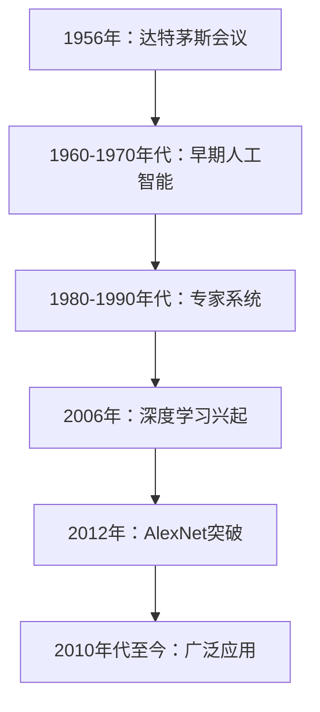

                 

### 《AI创业公司的技术创新管理》

> **关键词**：人工智能，创业公司，技术创新，管理体系，深度学习，机器学习，数学模型，项目实战

> **摘要**：本文深入探讨了AI创业公司在技术创新管理方面的挑战和策略。通过系统分析技术创新管理框架、核心概念、算法原理，以及实践应用，为创业公司提供了一套切实可行的方法，以推动技术创新，实现可持续发展。

## 《AI创业公司的技术创新管理》目录大纲

### 第一部分：技术创新管理概述

#### 第1章：AI创业背景与挑战

##### 1.1 AI创业环境分析

##### 1.2 创业公司的技术挑战

##### 1.3 技术创新在创业成功中的作用

#### 第2章：技术创新管理体系建设

##### 2.1 技术创新管理框架

##### 2.2 技术创新流程设计

##### 2.3 技术创新团队构建

### 第二部分：技术创新核心概念与联系

#### 第3章：人工智能基本原理与架构

##### 3.1 人工智能核心概念

##### 3.2 人工智能技术架构

##### 3.3 人工智能发展历程

##### 3.4 Mermaid流程图：人工智能技术发展路径

#### 第4章：机器学习算法原理与分类

##### 4.1 机器学习基础概念

##### 4.2 监督学习算法

##### 4.3 无监督学习算法

##### 4.4 强化学习算法

##### 4.5 机器学习算法伪代码

### 第三部分：技术创新核心算法原理讲解

#### 第5章：深度学习原理与应用

##### 5.1 深度学习基本概念

##### 5.2 深度学习网络结构

##### 5.3 深度学习优化算法

##### 5.4 深度学习案例：卷积神经网络(CNN)

#### 第6章：自然语言处理算法原理

##### 6.1 语言模型与词嵌入

##### 6.2 序列模型与循环神经网络(RNN)

##### 6.3 注意力机制与转换器架构

##### 6.4 自然语言处理案例：语言翻译

### 第四部分：数学模型与数学公式讲解

#### 第7章：数学基础与推导

##### 7.1 矩阵与向量运算

##### 7.2 概率论基础

##### 7.3 最优化理论

##### 7.4 梯度下降法原理

#### 第8章：深度学习中的数学公式

##### 8.1 激活函数

##### 8.2 损失函数

##### 8.3 梯度下降算法

##### 8.4 反向传播算法

### 第五部分：项目实战

#### 第9章：AI创业项目案例

##### 9.1 项目背景与目标

##### 9.2 项目技术栈

##### 9.3 开发环境搭建

##### 9.4 源代码实现与解读

##### 9.5 代码解读与分析

#### 第10章：技术创新管理实践

##### 10.1 技术创新管理实践案例

##### 10.2 技术创新管理工具应用

##### 10.3 技术创新管理的评估与改进

### 第六部分：总结与展望

#### 第11章：AI创业公司技术创新趋势

##### 11.1 AI技术发展趋势

##### 11.2 创业公司技术创新方向

##### 11.3 技术创新管理的未来展望

#### 第12章：结语

##### 12.1 技术创新在AI创业公司的重要性

##### 12.2 技术创新管理的要点与挑战

##### 12.3 对未来AI创业公司的建议

### 引言

人工智能（AI）作为当今最具变革性的技术之一，正在深刻地改变着各行各业。随着深度学习、自然语言处理、计算机视觉等领域的飞速发展，越来越多的创业公司开始涉足这一领域，试图在激烈的市场竞争中脱颖而出。然而，技术创新并非易事，对于大多数创业公司而言，如何在资源有限、时间紧迫的条件下实现技术创新，成为了一项极具挑战的任务。

本文旨在探讨AI创业公司在技术创新管理方面的重要性和策略。首先，我们将分析AI创业环境及其面临的挑战，阐述技术创新在创业成功中的关键作用。接着，我们将介绍技术创新管理体系建设，包括管理框架、流程设计和团队构建。随后，本文将深入探讨人工智能和机器学习的核心概念、原理和架构，以及深度学习和自然语言处理等关键算法。在此基础上，我们将讲解相关数学模型与公式，并分享一个实际的AI创业项目案例。最后，我们将总结技术创新管理的要点与挑战，展望AI创业公司的技术创新趋势，并给出相应的建议。

通过本文的阅读，读者将了解到：

1. AI创业公司面临的技术创新挑战及其解决方案。
2. 技术创新管理体系的构建与实施。
3. 人工智能与机器学习的基本原理与算法。
4. 数学模型在人工智能中的应用。
5. 创业公司在技术创新管理实践中的成功案例。
6. 技术创新管理的未来发展趋势与建议。

让我们一步步深入分析，共同探索AI创业公司的技术创新管理之道。

### 第一部分：技术创新管理概述

#### 第1章：AI创业背景与挑战

AI创业公司的发展离不开一个日益成熟且充满机遇的背景。随着大数据、云计算、物联网等技术的快速发展，人工智能逐渐从理论研究走向实际应用，成为推动社会进步的重要力量。这个背景下，许多创业者看到了AI技术带来的巨大潜力，纷纷投身于AI创业浪潮中。

然而，AI创业公司的崛起并非一帆风顺。首先，AI技术本身的复杂性带来了巨大的技术挑战。人工智能领域涉及众多交叉学科，包括计算机科学、统计学、认知科学、神经科学等，创业公司需要在这些复杂领域中迅速掌握核心技术和关键算法。此外，AI技术的更新换代速度极快，创业公司需要不断学习和更新知识，以保持竞争力。

其次，AI创业公司还面临市场环境的挑战。虽然AI市场前景广阔，但竞争同样激烈。许多巨头公司也在积极布局AI领域，创业公司需要在这片红海中寻找自己的细分市场，并提供有竞争力的解决方案。同时，AI技术的应用场景多样化，创业公司需要深入了解用户需求，快速响应市场变化，才能在激烈的市场竞争中立足。

再者，AI创业公司在资源有限的情况下，还需要应对人才短缺的问题。AI技术人才稀缺，创业公司往往难以吸引和留住顶尖人才。这不仅影响了公司的技术实力，也制约了技术创新的步伐。为了弥补这一短板，许多创业公司采取了多种措施，如提供有竞争力的薪酬福利、建立良好的工作环境、注重人才培养和激励等。

最后，资金问题也是AI创业公司面临的重要挑战。尽管AI市场前景看好，但技术研发和产品落地需要大量资金投入。初创公司往往难以获得足够的资金支持，需要通过多种渠道筹集资金，如风险投资、政府补贴、众筹等。资金问题不仅影响到公司的研发进度，也制约了其市场拓展和业务规模。

综上所述，AI创业公司在技术创新过程中面临着诸多挑战。但正是这些挑战，为创业公司提供了机遇。通过科学的技术创新管理，创业公司可以克服这些挑战，实现技术的突破和业务的快速发展。

#### 1.1 AI创业环境分析

AI创业环境具有以下几个显著特点：

1. **市场需求的驱动**：随着人工智能技术的逐渐成熟，各行各业对AI技术的需求日益增长。从智能制造、医疗健康、金融科技到智能交通，AI技术在各个领域展现出广泛的应用潜力。这种市场需求不仅为创业公司提供了广阔的市场空间，也为技术创新提供了动力。

2. **政策与法规的支持**：各国政府纷纷出台政策，支持人工智能技术的发展。例如，中国政府发布了《新一代人工智能发展规划》，明确了人工智能的发展目标和重点任务；欧盟则提出了《人工智能伦理准则》，以规范人工智能技术的应用。这些政策与法规为AI创业公司提供了良好的发展环境，同时也提出了合规和伦理方面的要求。

3. **技术创新的加速**：AI领域的快速发展得益于技术的不断创新。从深度学习、自然语言处理到计算机视觉，AI技术在算法、模型和硬件等多方面不断突破。这种技术创新不仅提高了AI系统的性能和效率，也为创业公司提供了丰富的技术资源。

4. **资本市场的热情**：AI创业公司得到了资本市场的广泛关注和热情支持。风险投资、私募基金等各类资本纷纷涌入AI领域，为初创公司提供资金支持。这种资本市场的热情为AI创业公司提供了充足的资金保障，有助于其快速发展。

5. **开放合作的生态**：AI技术的发展离不开开放合作的生态。各大科技公司、研究机构和创业者之间积极进行合作，分享技术资源和研究成果。例如，谷歌、微软、百度等公司开放了大量的AI工具和平台，降低了创业公司进入AI领域的门槛。此外，开源社区也成为了AI技术发展的重要推动力量，吸引了大量开发者的参与。

6. **社会认知的提升**：随着AI技术的广泛应用，社会对AI技术的认知不断提升。公众对AI技术的接受度和信任度逐渐增加，为AI创业公司提供了更广阔的市场空间。同时，社会对AI伦理、隐私和安全等方面的关注也在不断提高，这对创业公司在技术创新过程中提出了更高的要求。

#### 1.2 创业公司的技术挑战

尽管AI创业环境充满机遇，但创业公司在技术创新过程中仍然面临诸多技术挑战。以下是几个主要的技术挑战及其解决策略：

1. **核心技术突破**：AI技术涉及多个交叉学科，包括计算机科学、统计学、认知科学、神经科学等。创业公司需要在这些复杂领域中迅速掌握核心技术和关键算法，以保持竞争力。解决这一问题的策略包括：

   - **聚焦核心领域**：创业公司应明确自己的技术方向和优势领域，集中资源和精力在核心领域进行技术突破。
   - **外部合作**：通过与高校、研究机构和科技企业合作，共享技术和人才资源，提高技术突破的效率。
   - **持续学习**：创业公司需要保持对前沿技术的关注和学习，及时掌握最新的研究进展和实用技术。

2. **技术成熟度问题**：虽然AI技术发展迅速，但部分技术仍然处于早期阶段，尚未完全成熟。创业公司需要评估技术的成熟度，避免因过早应用不成熟的技术而面临风险。解决这一问题的策略包括：

   - **技术评估**：在引入新技术前，对公司现有技术和市场情况进行全面评估，确保技术方案能够满足业务需求。
   - **试点应用**：通过小规模试点应用，验证技术的可行性和效果，逐步扩大应用范围。
   - **技术储备**：在核心技术领域建立技术储备，为未来的技术升级和转型做好准备。

3. **数据资源问题**：AI技术的发展依赖于大量高质量的数据资源。创业公司需要获取和积累丰富的数据，以满足模型训练和优化需求。解决这一问题的策略包括：

   - **数据合作**：与数据拥有方建立合作，获取数据资源。
   - **数据清洗和整合**：对获取的数据进行清洗和整合，提高数据的可用性和质量。
   - **数据隐私和合规**：在数据处理过程中，严格遵守数据隐私和合规要求，确保数据安全和用户隐私。

4. **技术迭代速度**：AI技术更新换代速度极快，创业公司需要快速响应技术变化，以保持竞争力。解决这一问题的策略包括：

   - **敏捷开发**：采用敏捷开发模式，快速迭代产品，及时响应市场和技术变化。
   - **技术创新团队**：建立技术创新团队，专注于技术研究和开发，确保技术方向的正确性和先进性。
   - **持续创新**：鼓励团队成员持续学习和技术创新，推动技术的持续进步。

5. **技术安全与合规**：随着AI技术的广泛应用，其安全性和合规性受到了越来越多的关注。创业公司需要确保技术的安全性，避免因安全隐患而影响业务。解决这一问题的策略包括：

   - **安全评估**：对产品进行安全评估，识别潜在的安全风险。
   - **安全防护**：采用安全防护措施，如加密、访问控制等，确保系统的安全性。
   - **合规性审查**：遵守相关法律法规，确保产品和服务符合合规要求。

通过科学的技术创新管理，创业公司可以应对这些技术挑战，实现技术的突破和业务的快速发展。

#### 1.3 技术创新在创业成功中的作用

技术创新在创业成功中起着至关重要的作用。首先，技术创新是创业公司区别于竞争对手的关键因素。在高度竞争的市场环境中，拥有独特的技术优势和创新能力，可以帮助创业公司在市场中脱颖而出，赢得更多用户和客户。其次，技术创新可以推动创业公司的业务发展。通过不断的技术创新，创业公司可以开发出更具竞争力的产品和服务，扩大市场份额，提高业务规模和盈利能力。

技术创新不仅有助于创业公司的市场拓展，还可以提高企业的核心竞争力。在技术日新月异的今天，拥有持续创新能力的创业公司更容易适应市场变化，抓住新的商业机会。例如，通过引入先进的机器学习算法和深度学习模型，创业公司可以大幅提升数据处理和预测的准确性，从而在金融、医疗、零售等众多领域取得显著成果。

此外，技术创新还能够提高企业的效率和生产力。通过技术创新，创业公司可以优化业务流程，降低运营成本，提高生产效率。例如，采用人工智能和自动化技术，创业公司可以自动化许多重复性劳动，减少人力资源的浪费，提高整体运营效率。

技术创新还可以增强创业公司的品牌价值和市场影响力。当创业公司在技术领域取得突破时，往往能够吸引更多的投资者和合作伙伴，提升企业的品牌形象和市场地位。这不仅有助于创业公司获取更多的资源和支持，还可以提高客户的信任度和忠诚度。

总之，技术创新是创业公司成功的关键驱动因素。通过不断的技术创新，创业公司可以在市场中保持竞争力，推动业务发展，提高企业效率和品牌价值。因此，创业公司应将技术创新视为其发展的核心战略，持续投入资源，培养创新文化，确保在快速变化的市场环境中立于不败之地。

#### 第2章：技术创新管理体系建设

技术创新管理是创业公司实现技术突破和业务发展的关键环节。一个科学有效的技术创新管理体系，不仅能够确保技术的持续创新，还能提高研发效率，降低技术风险。本节将介绍技术创新管理体系建设的三个核心方面：技术创新管理框架、技术创新流程设计和技术创新团队构建。

##### 2.1 技术创新管理框架

技术创新管理框架是确保技术创新活动有序进行的基础。一个完善的管理框架应包括以下几个关键组成部分：

1. **目标明确**：明确技术创新的目标和方向，确保技术创新活动与公司战略一致。例如，公司可以设定短期目标（如产品功能完善）和长期目标（如技术领导地位）。

2. **组织结构**：建立专门的技术创新部门或团队，负责技术创新的规划、实施和监控。此外，还应确保技术创新部门与其他部门（如市场、销售、运营等）的有效沟通和协作。

3. **资源配置**：合理配置人力资源、资金和技术资源，确保技术创新活动的顺利进行。例如，公司可以设立专门的研发预算，用于技术创新项目。

4. **激励机制**：建立激励机制，鼓励员工积极参与技术创新。例如，可以通过绩效奖励、股权激励等方式，激励员工创新热情。

5. **风险管理**：制定风险管理策略，识别和应对技术创新过程中可能遇到的风险。例如，通过风险评估和应急预案，降低技术失败的风险。

6. **反馈机制**：建立反馈机制，及时收集和分析技术创新过程中的问题，持续改进和创新管理流程。例如，可以通过定期召开技术创新研讨会，讨论和解决技术难题。

##### 2.2 技术创新流程设计

技术创新流程设计是确保技术创新活动高效进行的关键。一个完善的技术创新流程应包括以下几个关键环节：

1. **需求分析**：明确技术创新的需求和目标，收集市场、客户和内部员工的反馈，确保技术创新活动符合实际需求。

2. **技术选型**：根据需求分析结果，选择合适的技术方案和工具。技术选型应考虑技术的成熟度、性能、成本和兼容性等因素。

3. **研发实施**：制定详细的研发计划，分配任务和资源，确保技术创新项目按计划进行。在研发过程中，应注重团队协作、代码管理和文档记录。

4. **测试与验证**：对技术创新成果进行全面的测试和验证，确保其性能、稳定性和可靠性。测试环节应包括单元测试、集成测试和系统测试等。

5. **发布与部署**：将技术创新成果发布和部署到实际应用环境中，如产品、系统或服务。在发布前，应进行详细的用户测试和反馈收集，确保产品符合预期。

6. **反馈与改进**：在发布后，收集用户反馈，对技术创新成果进行持续改进。反馈环节应包括用户满意度调查、问题报告和解决方案等。

##### 2.3 技术创新团队构建

技术创新团队的构建是确保技术创新成功的关键。一个高效的技术创新团队应包括以下几个关键角色：

1. **技术专家**：负责技术选型、研发和优化。技术专家应具备丰富的行业经验和专业知识，能够引领技术创新方向。

2. **项目经理**：负责技术创新项目的规划、实施和监控。项目经理应具备良好的沟通、协调和管理能力，确保项目按计划进行。

3. **产品经理**：负责产品规划和设计，确保技术创新成果符合市场需求和用户体验。产品经理应具备市场敏感性和用户洞察力。

4. **测试工程师**：负责技术创新成果的测试与验证，确保其性能、稳定性和可靠性。测试工程师应具备良好的测试能力和问题排查能力。

5. **数据科学家**：负责数据分析、模型训练和优化。数据科学家应具备深厚的统计学和机器学习知识，能够提高算法的准确性和效率。

6. **开发工程师**：负责技术创新成果的编码、开发和维护。开发工程师应具备扎实的编程技能和团队协作能力。

7. **UI/UX设计师**：负责用户界面和用户体验设计，确保技术创新成果具有良好的用户界面和用户体验。UI/UX设计师应具备良好的设计能力和用户洞察力。

8. **运维工程师**：负责技术创新成果的部署、运维和支持。运维工程师应具备良好的系统管理和运维能力，确保系统的稳定运行。

通过科学的技术创新管理体系建设，创业公司可以确保技术创新活动的有序进行，提高研发效率，降低技术风险，推动技术突破和业务发展。

### 第二部分：技术创新核心概念与联系

#### 第3章：人工智能基本原理与架构

人工智能（AI）作为计算机科学的重要分支，旨在使计算机具备模拟人类智能的能力。本章将介绍人工智能的基本概念、技术架构及其发展历程，并通过Mermaid流程图展示人工智能技术发展的路径。

##### 3.1 人工智能核心概念

1. **智能定义**：智能通常被定义为能够感知、学习、推理、解决问题和采取行动的能力。在人工智能领域，智能主要指的是通过算法和计算模型模拟人类智能。

2. **机器学习**：机器学习是人工智能的核心技术之一，通过数据驱动的方式使计算机具备学习能力。机器学习可以分为监督学习、无监督学习和强化学习。

   - **监督学习**：输入和输出都有标记的数据，通过训练模型来预测输出。
   - **无监督学习**：没有标记的数据，通过模型自动发现数据中的模式和结构。
   - **强化学习**：通过不断试错和反馈，使模型在特定环境中达到最佳表现。

3. **深度学习**：深度学习是机器学习的一个子领域，通过多层神经网络模拟人类大脑的神经网络结构，进行复杂的特征学习和模式识别。

4. **自然语言处理（NLP）**：自然语言处理旨在使计算机理解和处理自然语言，包括语言模型、词嵌入、文本分类和语义分析等。

5. **计算机视觉**：计算机视觉旨在使计算机理解和解释视觉信息，包括图像识别、目标检测和图像生成等。

##### 3.2 人工智能技术架构

人工智能技术架构通常包括以下几个关键层次：

1. **感知层**：通过传感器、摄像头等设备获取外部信息，如图像、声音和文本。

2. **数据处理层**：对感知层获取的数据进行预处理、清洗和特征提取，以便于后续处理。

3. **学习层**：利用机器学习和深度学习算法，对处理后的数据进行学习，建立模型。

4. **推理层**：使用训练好的模型对新的数据进行推理和预测，实现智能决策。

5. **执行层**：根据推理层的决策，执行相应的动作或任务。

##### 3.3 人工智能发展历程

人工智能的发展历程可以分为以下几个重要阶段：

1. **1956年**：达特茅斯会议，人工智能概念正式提出。

2. **1960-1970年代**：早期人工智能研究，主要关注符号主义和推理技术。

3. **1980-1990年代**：专家系统和知识表示技术取得重要进展，但面临“人工智能寒冬”。

4. **2006年**：深度学习技术的兴起，通过大规模数据和计算能力实现突破。

5. **2012年**：AlexNet在图像识别比赛中取得重大突破，标志着深度学习的崛起。

6. **2010年代至今**：人工智能在各个领域取得广泛应用，从语音识别、自然语言处理到自动驾驶、机器人等。

##### 3.4 Mermaid流程图：人工智能技术发展路径

以下是一个Mermaid流程图，展示了人工智能技术发展的一些关键节点：



通过以上介绍，我们可以看到人工智能技术的基本概念、架构和发展历程。这些核心概念和联系不仅为创业者提供了理论基础，也为其在技术实现和产品开发中指明了方向。

### 第4章：机器学习算法原理与分类

#### 4.1 机器学习基础概念

机器学习是人工智能的核心技术之一，它使计算机能够从数据中学习，并基于学习结果进行预测或决策。以下是一些基础概念：

**监督学习**：监督学习是最常见的机器学习任务，输入数据带有标记，模型通过学习输入输出对来预测未知数据的输出。例如，图像分类任务中，输入为图像数据，输出为对应的类别标签。

**无监督学习**：无监督学习没有明确的输入输出标记，模型通过学习数据内在的结构或模式来揭示数据的特性。例如，聚类任务中，模型将相似的数据点归为同一类别。

**强化学习**：强化学习是一种通过与环境互动来学习最优策略的机器学习方式。模型通过不断尝试和反馈，优化决策过程，以实现最大化累积奖励。例如，自动驾驶中，模型通过与环境交互，学习如何安全驾驶。

**模型评估**：模型评估是判断模型性能的重要步骤。常用的评估指标包括准确率、召回率、F1分数等。

**交叉验证**：交叉验证是一种评估模型性能的方法，通过将数据集划分为多个子集，反复进行训练和验证，以避免过拟合和评估偏差。

#### 4.2 监督学习算法

监督学习算法主要包括线性回归、逻辑回归、决策树、支持向量机和神经网络等。以下为几种常见算法的简要介绍：

**线性回归**：线性回归是一种用于预测连续值的监督学习算法。它通过建立输入变量和输出变量之间的线性关系来预测新的数据。线性回归的基本公式为：y = w0 + w1 * x，其中y是输出变量，x是输入变量，w0和w1是权重。

**逻辑回归**：逻辑回归是一种用于预测概率的监督学习算法，常用于二分类问题。它通过建立输入变量和输出概率之间的线性关系来预测类别。逻辑回归的公式为：log(p/(1-p)) = w0 + w1 * x，其中p是事件发生的概率。

**决策树**：决策树是一种树形结构模型，通过一系列判断条件来划分数据，并预测输出。决策树的每个节点代表一个特征，每个分支代表特征的不同取值。

**支持向量机（SVM）**：SVM是一种用于分类和回归的监督学习算法，通过找到一个最佳的超平面，将数据划分为不同的类别。SVM的目标是最大化分类边界到样本点的距离。

**神经网络**：神经网络是一种模拟人脑神经元连接的模型，通过多层节点进行信息传递和处理。神经网络可以用于分类、回归和特征提取等多种任务。

#### 4.3 无监督学习算法

无监督学习算法主要包括聚类算法、降维算法和生成模型等。以下为几种常见算法的简要介绍：

**K-均值聚类**：K-均值聚类是一种基于距离度量的聚类算法，通过迭代计算聚类中心，将数据点分配到不同的簇中。算法的目标是最小化簇内距离之和。

**主成分分析（PCA）**：PCA是一种降维算法，通过提取数据的主要成分来减少数据维度。PCA能够保留数据的主要特征，同时去除冗余信息。

**自编码器**：自编码器是一种生成模型，通过编码器和解码器来学习数据的压缩表示。自编码器可以用于特征提取和生成新数据。

**DBSCAN**：DBSCAN是一种基于密度的聚类算法，通过定义邻域和密度连接来发现不同密度的聚类结构。

#### 4.4 强化学习算法

强化学习算法主要包括Q学习、SARSA和策略梯度等。以下为几种常见算法的简要介绍：

**Q学习**：Q学习是一种基于值函数的强化学习算法，通过学习状态-动作值函数来选择最优动作。Q学习的核心公式为：Q(s, a) = r + γ * max(Q(s', a')），其中s和s'是状态，a和a'是动作，r是即时奖励，γ是折扣因子。

**SARSA**：SARSA是一种基于策略的强化学习算法，通过更新当前状态和动作的Q值来改进策略。SARSA的核心公式为：Q(s, a) = Q(s, a) + α * (r + γ * Q(s', a') - Q(s, a)），其中α是学习率。

**策略梯度**：策略梯度是一种基于策略优化的强化学习算法，通过直接优化策略函数来提高累积奖励。策略梯度的核心公式为：θ = θ - α * ∇θJ(θ)，其中θ是策略参数，J(θ)是累积奖励函数。

#### 4.5 机器学习算法伪代码

以下为几种常见机器学习算法的伪代码：

**线性回归伪代码**：
```
初始化权重 w0 和 w1
对于每个数据点 (x, y)：
  计算预测值 y' = w0 + w1 * x
  计算损失函数 L(y, y') = (y - y')^2
更新权重 w0 = w0 - α * ∂L/∂w0，w1 = w1 - α * ∂L/∂w1
```

**K-均值聚类伪代码**：
```
初始化聚类中心 c1, c2, ..., ck
重复以下步骤直到聚类中心不变：
  对于每个数据点 x：
    计算距离 di = ||x - ci||
    将 x 分配到最近的聚类中心 ci
  重新计算聚类中心 ci = 1/k * Σx，其中x属于第i个簇
```

**Q学习伪代码**：
```
初始化 Q(s, a) 为随机值
对于每个状态 s：
  对于每个动作 a：
    更新 Q(s, a) = Q(s, a) + α * (r + γ * max(Q(s', a')) - Q(s, a))
    执行动作 a 并观察新状态 s' 和奖励 r
```

通过以上介绍，我们可以对机器学习的基本概念、算法原理和伪代码有更深入的理解。这些知识将有助于创业公司在技术实现和产品开发中更好地应用机器学习技术。

### 第三部分：技术创新核心算法原理讲解

#### 第5章：深度学习原理与应用

深度学习是机器学习的一个重要分支，通过多层神经网络模拟人脑神经元之间的连接，对复杂数据进行学习和建模。本章将详细介绍深度学习的基本原理、网络结构、优化算法及其应用案例。

##### 5.1 深度学习基本概念

**深度学习**：深度学习是指多层神经网络的学习方法，通过逐层提取特征，实现对复杂数据的理解和建模。与传统机器学习方法相比，深度学习能够自动学习数据的层次化表示，从而提高模型的准确性和泛化能力。

**神经网络**：神经网络是由多个节点（神经元）组成的计算模型，每个节点接收输入，通过加权求和后，激活函数输出。神经网络通过调整权重和偏置，学习输入和输出之间的关系。

**多层神经网络**：多层神经网络包括输入层、隐藏层和输出层。隐藏层负责提取数据的特征，输出层负责进行预测或分类。多层神经网络可以更好地捕捉数据的复杂关系。

**激活函数**：激活函数用于将线性组合映射到非线性空间，常用的激活函数包括Sigmoid、ReLU、Tanh等。激活函数的作用是增加网络的非线性，使模型能够学习更复杂的函数关系。

**反向传播算法**：反向传播算法是一种用于训练神经网络的优化算法，通过计算梯度，调整网络的权重和偏置，使模型输出更接近真实值。反向传播算法是深度学习训练过程的核心。

**优化算法**：优化算法用于调整网络参数，以最小化损失函数。常用的优化算法包括梯度下降、Adam、RMSprop等。

##### 5.2 深度学习网络结构

**卷积神经网络（CNN）**：卷积神经网络是处理图像数据的常用网络结构，通过卷积层、池化层和全连接层提取图像特征。

- **卷积层**：卷积层通过卷积操作提取图像的特征，卷积核滑动在图像上，计算局部特征。卷积层的参数量较小，能够有效减少过拟合。
- **池化层**：池化层用于减少特征图的尺寸，提高模型的泛化能力。常用的池化方式包括最大池化和平均池化。
- **全连接层**：全连接层将卷积层的输出连接到每个神经元，用于进行分类或回归任务。

**循环神经网络（RNN）**：循环神经网络用于处理序列数据，通过隐藏状态的信息传递，实现对序列的建模。

- **单元**：RNN单元包含输入门、遗忘门和输出门，用于控制信息传递和输出。
- **梯度消失与梯度爆炸**：RNN在训练过程中容易遇到梯度消失和梯度爆炸问题，通过长短时记忆网络（LSTM）和门控循环单元（GRU）等方法解决。

**变换器架构**：变换器架构（Transformer）是近年来提出的一种新型神经网络结构，主要用于自然语言处理任务。

- **自注意力机制**：自注意力机制通过计算序列中每个元素的重要性，实现信息的全局关联。
- **编码器和解码器**：编码器用于提取输入序列的特征，解码器用于生成输出序列。

##### 5.3 深度学习优化算法

**梯度下降算法**：梯度下降算法是一种最常用的优化算法，通过计算损失函数关于网络参数的梯度，调整参数以最小化损失。梯度下降算法分为批量梯度下降、随机梯度下降和小批量梯度下降等。

- **批量梯度下降**：每次迭代使用全部样本计算梯度，计算量大但收敛速度较慢。
- **随机梯度下降**：每次迭代使用一个样本计算梯度，计算量小但收敛速度较快，容易产生振荡。
- **小批量梯度下降**：每次迭代使用一小部分样本计算梯度，平衡了批量梯度下降和随机梯度下降的优缺点。

**Adam优化器**：Adam优化器结合了梯度下降和动量方法，通过自适应调整学习率，提高了训练效率。

- **一阶矩估计（m）**：计算梯度的一阶矩估计。
- **二阶矩估计（v）**：计算梯度的二阶矩估计。
- **自适应学习率**：通过m和v调整学习率，使模型在不同阶段有不同的学习速率。

**RMSprop优化器**：RMSprop优化器通过计算梯度的平方均值来调整学习率，减小了方差。

- **梯度平方均值（γ）**：计算梯度平方的均值。
- **学习率调整**：根据γ调整学习率，使模型在不同阶段有不同的学习速率。

##### 5.4 深度学习案例：卷积神经网络（CNN）

卷积神经网络（CNN）是处理图像数据的常用网络结构，通过卷积层、池化层和全连接层提取图像特征。

**案例背景**：构建一个简单的图像分类模型，用于识别手写数字。

**数据集**：MNIST数据集，包含70000个灰度图像，每个图像包含一个手写数字，0-9。

**网络结构**：

- **输入层**：28x28的灰度图像。
- **卷积层**：3x3的卷积核，32个滤波器。
- **激活函数**：ReLU。
- **池化层**：2x2的最大池化。
- **全连接层**：128个神经元。
- **输出层**：10个神经元，每个神经元表示一个类别。

**代码实现**：

```python
import tensorflow as tf
from tensorflow.keras import datasets, layers, models

# 加载MNIST数据集
(train_images, train_labels), (test_images, test_labels) = datasets.mnist.load_data()

# 预处理数据
train_images = train_images.reshape((60000, 28, 28, 1)).astype('float32') / 255
test_images = test_images.reshape((10000, 28, 28, 1)).astype('float32') / 255

# 构建CNN模型
model = models.Sequential()
model.add(layers.Conv2D(32, (3, 3), activation='relu', input_shape=(28, 28, 1)))
model.add(layers.MaxPooling2D((2, 2)))
model.add(layers.Conv2D(64, (3, 3), activation='relu'))
model.add(layers.MaxPooling2D((2, 2)))
model.add(layers.Conv2D(64, (3, 3), activation='relu'))
model.add(layers.Flatten())
model.add(layers.Dense(64, activation='relu'))
model.add(layers.Dense(10, activation='softmax'))

# 编译模型
model.compile(optimizer='adam',
              loss='sparse_categorical_crossentropy',
              metrics=['accuracy'])

# 训练模型
model.fit(train_images, train_labels, epochs=5, batch_size=64)

# 评估模型
test_loss, test_acc = model.evaluate(test_images,  test_labels, verbose=2)
print('\nTest accuracy:', test_acc)
```

通过以上案例，我们可以看到深度学习在网络结构、优化算法和应用实例等方面的广泛应用。创业公司可以借鉴这些技术，开发出具有竞争力的AI产品。

### 第6章：自然语言处理算法原理

自然语言处理（NLP）是人工智能的一个重要领域，旨在使计算机理解和生成自然语言。本章将介绍NLP的基本概念、语言模型与词嵌入、序列模型、注意力机制与变换器架构，并通过实际案例展示自然语言处理的应用。

##### 6.1 语言模型与词嵌入

**语言模型**：语言模型是NLP的基础，用于预测给定文本序列的概率。常用的语言模型包括n元语法模型、神经网络语言模型（如变换器模型）等。

- **n元语法模型**：n元语法模型基于前n个单词预测下一个单词。例如，二元语法模型考虑前两个单词来预测下一个单词。
- **神经网络语言模型**：神经网络语言模型通过深度学习技术学习文本序列的概率分布。变换器模型是一种流行的神经网络语言模型，通过自注意力机制实现高效的文本表示。

**词嵌入**：词嵌入是将单词转换为向量表示，用于表示单词的语义和语法关系。常见的词嵌入方法包括Word2Vec、GloVe等。

- **Word2Vec**：Word2Vec是一种基于上下文的词嵌入方法，通过训练神经网络预测单词的上下文。Word2Vec可以分为Skip-Gram和连续词袋（CBOW）两种模型。
- **GloVe**：GloVe是一种基于全局统计信息的词嵌入方法，通过计算单词共现矩阵的导数来学习词向量。GloVe能够捕捉单词之间的语义和语法关系。

##### 6.2 序列模型与循环神经网络（RNN）

**序列模型**：序列模型用于处理和时间相关的数据，如文本、语音和序列数据。常见的序列模型包括循环神经网络（RNN）、长短时记忆网络（LSTM）和门控循环单元（GRU）等。

- **循环神经网络（RNN）**：RNN是一种处理序列数据的神经网络模型，通过隐藏状态的信息传递，实现对序列的建模。RNN可以捕获序列中的长期依赖关系。
- **长短时记忆网络（LSTM）**：LSTM是RNN的一种变体，通过引入门控机制，有效解决了RNN在训练过程中出现的梯度消失和梯度爆炸问题。LSTM能够捕获序列中的长期依赖关系。
- **门控循环单元（GRU）**：GRU是LSTM的简化版，通过合并输入门和遗忘门，减少了模型的参数量。GRU同样能够有效捕获序列中的长期依赖关系。

**RNN伪代码**：

```python
for t in range(T):
    # 前一时刻的隐藏状态
    h_{t-1} = ...
    # 当前输入
    x_t = ...
    # 当前隐藏状态
    h_t = tanh(W_h * [h_{t-1}, x_t])
    # 输出
    y_t = W_y * h_t
```

##### 6.3 注意力机制与变换器架构

**注意力机制**：注意力机制是一种用于模型在不同输入元素之间分配关注度的方法。注意力机制能够使模型关注重要信息，提高模型的性能和效果。

- **局部注意力**：局部注意力通过计算输入元素之间的相对位置和重要性，实现对局部信息的关注。
- **全局注意力**：全局注意力通过计算输入元素的整体重要性，实现对全局信息的关注。

**变换器架构**：变换器架构是一种基于自注意力机制的序列模型，广泛应用于NLP任务。变换器架构通过自注意力机制实现信息的全局关联，有效提高了模型的性能和效果。

- **编码器**：编码器用于提取输入序列的特征。
- **解码器**：解码器用于生成输出序列。
- **自注意力**：自注意力通过计算编码器输出的注意力权重，实现对输入序列的加权求和。

**变换器架构伪代码**：

```python
# 编码器
for i in range(S):
    x_i = encoder[i]
    attention_weights = softmax(Q * K)
    context_vector = sum(attention_weights * V)
    output = f_t = sum(softmax(Q * K) * V)

# 解码器
for i in range(T):
    y_i = decoder[i]
    attention_weights = softmax(Q * K)
    context_vector = sum(attention_weights * V)
    output = f_t = sum(softmax(Q * K) * V)
```

##### 6.4 自然语言处理案例：语言翻译

语言翻译是NLP领域的一个重要应用，通过将一种语言的文本翻译成另一种语言，实现跨语言交流。

**案例背景**：构建一个基于变换器架构的机器翻译模型，用于将英语翻译成法语。

**数据集**：WMT14英语-法语翻译数据集，包含约450万个句子对。

**模型结构**：编码器和解码器均为变换器架构，通过自注意力机制实现信息的全局关联。

**训练过程**：

1. 将英语文本输入编码器，提取特征向量。
2. 将特征向量传递给解码器，生成法语翻译。
3. 计算损失函数，通过反向传播算法优化模型参数。

**代码实现**：

```python
import tensorflow as tf
from tensorflow.keras.models import Model
from tensorflow.keras.layers import Input, Embedding, LSTM, Dense

# 构建编码器和解码器
encoder_inputs = Input(shape=(None, 1024))
decoder_inputs = Input(shape=(None, 1024))
encoder_embedding = Embedding(1024, 512)(encoder_inputs)
decoder_embedding = Embedding(1024, 512)(decoder_inputs)

# 编码器
encoder_lstm = LSTM(512, return_sequences=True, return_state=True)
_, state_h, state_c = encoder_lstm(encoder_embedding)

# 解码器
decoder_lstm = LSTM(512, return_sequences=True, return_state=True)
decoder_outputs = decoder_embedding

for i in range(1, sequence_length):
    decoder_inputs = Input(shape=(None, 512))
    decoder_embedding = Embedding(1024, 512)(decoder_inputs)
    decoder_lstm(decoder_embedding, initial_state=[state_h, state_c])
    state_h, state_c = decoder_lstm.states

# 汇总模型
output = Dense(1024, activation='softmax')(decoder_outputs)
model = Model(inputs=[encoder_inputs, decoder_inputs], outputs=output)

# 编译模型
model.compile(optimizer='adam', loss='categorical_crossentropy')

# 训练模型
model.fit([encoder_inputs, decoder_inputs], output, batch_size=64, epochs=10)

# 评估模型
test_loss, test_acc = model.evaluate([test_encoder_inputs, test_decoder_inputs], test_output)
print('Test accuracy:', test_acc)
```

通过以上案例，我们可以看到自然语言处理算法在语言模型、词嵌入、序列模型和注意力机制等方面的应用。创业公司可以借鉴这些技术，开发出具有竞争力的NLP产品。

### 第四部分：数学模型与数学公式讲解

#### 第7章：数学基础与推导

数学作为人工智能（AI）和机器学习的基石，其在AI领域的应用无处不在。本章将介绍数学基础和推导，包括矩阵与向量运算、概率论基础、最优化理论和梯度下降法原理。

##### 7.1 矩阵与向量运算

**向量**：向量是数学中的一个基本概念，可以看作是一个有序数组，表示具有大小和方向的量。在二维空间中，向量可以表示为 \(\vec{v} = (v_1, v_2)\)，其中 \(v_1\) 和 \(v_2\) 分别为向量的分量。

**矩阵**：矩阵是另一种重要的数学结构，可以看作是向量的扩展。矩阵是由 \(m \times n\) 个元素排列成的矩形阵列，通常用大写字母表示，如 \(A = \begin{bmatrix} a_{11} & a_{12} & \cdots & a_{1n} \\ a_{21} & a_{22} & \cdots & a_{2n} \\ \vdots & \vdots & \ddots & \vdots \\ a_{m1} & a_{m2} & \cdots & a_{mn} \end{bmatrix}\)。

**矩阵乘法**：矩阵乘法是矩阵运算中最基本的一种。两个矩阵 \(A\) 和 \(B\) 的乘积 \(C = AB\) 是一个 \(m \times n\) 的矩阵，其中 \(c_{ij} = \sum_{k=1}^{n} a_{ik}b_{kj}\)。

**向量与矩阵乘法**：向量与矩阵的乘法分为内积和外积。内积（点积）是两个向量对应分量的乘积之和，如 \(\vec{u} \cdot \vec{v} = u_1v_1 + u_2v_2\)。外积（叉积）是两个向量的叉积，结果是一个新的向量。

**矩阵的转置**：矩阵的转置是将原矩阵的行和列互换，得到一个新的矩阵。对于矩阵 \(A\)，其转置矩阵 \(A^T\) 的元素为 \(a_{ji}\)。

**矩阵的逆**：如果矩阵 \(A\) 是可逆的，那么存在一个矩阵 \(A^{-1}\)，使得 \(AA^{-1} = A^{-1}A = I\)，其中 \(I\) 是单位矩阵。

**例子**：

\[
A = \begin{bmatrix} 1 & 2 \\ 3 & 4 \end{bmatrix}, \quad B = \begin{bmatrix} 5 & 6 \\ 7 & 8 \end{bmatrix}
\]

\[
C = AB = \begin{bmatrix} 1*5 + 2*7 & 1*6 + 2*8 \\ 3*5 + 4*7 & 3*6 + 4*8 \end{bmatrix} = \begin{bmatrix} 19 & 26 \\ 43 & 58 \end{bmatrix}
\]

\[
A^T = \begin{bmatrix} 1 & 3 \\ 2 & 4 \end{bmatrix}, \quad A^{-1} = \begin{bmatrix} 4 & -2 \\ -3 & 1 \end{bmatrix}
\]

##### 7.2 概率论基础

**概率**：概率是描述事件发生可能性的量。在概率论中，事件是试验结果的一个集合，样本空间是所有可能结果的集合。事件 \(A\) 的概率 \(P(A)\) 是事件 \(A\) 包含的结果数与样本空间中结果数之比。

**条件概率**：条件概率是给定某一事件发生的条件下，另一事件发生的概率。设事件 \(A\) 和 \(B\)，则 \(P(A|B)\) 表示在事件 \(B\) 发生的条件下事件 \(A\) 发生的概率。

**独立事件**：两个事件 \(A\) 和 \(B\) 是独立的，如果事件 \(A\) 发生的概率不受事件 \(B\) 的影响，即 \(P(A|B) = P(A)\)。

**贝叶斯定理**：贝叶斯定理描述了条件概率和边缘概率之间的关系。对于事件 \(A\) 和 \(B\)，有 \(P(A|B) = \frac{P(B|A)P(A)}{P(B)}\)。

**例子**：

假设掷两个公平的硬币，事件 \(A\) 是“第一个硬币正面朝上”，事件 \(B\) 是“第二个硬币正面朝上”。

\[
P(A) = \frac{1}{2}, \quad P(B) = \frac{1}{2}, \quad P(A \cap B) = P(A) \cdot P(B) = \frac{1}{4}
\]

\[
P(A|B) = \frac{P(A \cap B)}{P(B)} = \frac{\frac{1}{4}}{\frac{1}{2}} = \frac{1}{2}
\]

##### 7.3 最优化理论

**最优化问题**：最优化问题是指寻找一个或多个变量的值，使得一个函数（目标函数）达到最大或最小值。最优化问题通常表示为：

\[
\min_{x} f(x) \quad \text{或} \quad \max_{x} f(x)
\]

其中，\(x\) 是变量，\(f(x)\) 是目标函数。

**导数**：导数是函数在某一点处的变化率。一元函数 \(f(x)\) 在 \(x = a\) 处的导数表示为 \(f'(a)\)，计算公式为：

\[
f'(a) = \lim_{h \to 0} \frac{f(a+h) - f(a)}{h}
\]

**梯度**：梯度是多元函数在一点处的导数向量。对于 \(f(x, y)\)，其梯度表示为 \(\nabla f = \left( \frac{\partial f}{\partial x}, \frac{\partial f}{\partial y} \right)\)。

**最优化方法**：最优化方法包括开环方法和闭环方法。开环方法不依赖于系统动态模型，如牛顿法和梯度下降法；闭环方法依赖于系统动态模型，如动态规划法和遗传算法。

**例子**：

最小化目标函数 \(f(x, y) = x^2 + y^2\)。

\[
f'(x, y) = \nabla f = (2x, 2y)
\]

设 \(f'(x, y) = 0\)，解得 \(x = 0, y = 0\)。这是目标函数的最小值点。

##### 7.4 梯度下降法原理

**梯度下降法**：梯度下降法是一种最优化方法，通过不断更新变量，使目标函数逐渐减小，直至达到最小值。梯度下降法的基本思想是：沿着目标函数的梯度方向进行更新，每次更新步长由学习率决定。

**公式**：

\[
x_{t+1} = x_t - \alpha \cdot \nabla f(x_t)
\]

其中，\(x_t\) 是第 \(t\) 次迭代时的变量值，\(\alpha\) 是学习率，\(\nabla f(x_t)\) 是目标函数在 \(x_t\) 处的梯度。

**例子**：

最小化目标函数 \(f(x) = x^2\)。

\[
\nabla f(x) = 2x
\]

设初始值 \(x_0 = 1\)，学习率 \(\alpha = 0.1\)。

第一次迭代：

\[
x_1 = x_0 - \alpha \cdot \nabla f(x_0) = 1 - 0.1 \cdot 2 = 0.8
\]

第二次迭代：

\[
x_2 = x_1 - \alpha \cdot \nabla f(x_1) = 0.8 - 0.1 \cdot 1.6 = 0.64
\]

第三次迭代：

\[
x_3 = x_2 - \alpha \cdot \nabla f(x_2) = 0.64 - 0.1 \cdot 1.28 = 0.512
\]

通过不断迭代，目标函数 \(f(x)\) 的值逐渐减小，直至接近最小值。

通过以上介绍，我们可以看到数学在AI和机器学习领域的基础作用。掌握这些数学基础和推导，有助于创业公司在AI技术实现和算法优化中取得更好的成果。

### 第8章：深度学习中的数学公式

深度学习作为人工智能的重要组成部分，其实现依赖于一系列复杂的数学公式和算法。本章将详细讲解深度学习中的关键数学公式，包括激活函数、损失函数、梯度下降算法和反向传播算法。

#### 8.1 激活函数

激活函数是深度学习网络中不可或缺的部分，用于引入非线性。常见的激活函数包括Sigmoid、ReLU和Tanh等。

**Sigmoid函数**：

\[
\sigma(x) = \frac{1}{1 + e^{-x}}
\]

**ReLU函数**：

\[
\text{ReLU}(x) = \max(0, x)
\]

**Tanh函数**：

\[
\text{Tanh}(x) = \frac{e^{2x} - 1}{e^{2x} + 1}
\]

**例子**：

假设 \(x = 2\)，则：

\[
\sigma(2) = \frac{1}{1 + e^{-2}} \approx 0.88
\]

\[
\text{ReLU}(2) = \max(0, 2) = 2
\]

\[
\text{Tanh}(2) = \frac{e^{4} - 1}{e^{4} + 1} \approx 0.96
\]

这些激活函数在深度学习中发挥着重要作用，能够帮助网络学习复杂的非线性关系。

#### 8.2 损失函数

损失函数用于衡量模型预测值与真实值之间的差距，是优化模型参数的重要依据。常见的损失函数包括均方误差（MSE）、交叉熵损失和Hinge损失等。

**均方误差（MSE）**：

\[
MSE = \frac{1}{n} \sum_{i=1}^{n} (y_i - \hat{y}_i)^2
\]

其中，\(y_i\) 是真实值，\(\hat{y}_i\) 是预测值，\(n\) 是样本数量。

**交叉熵损失（Cross-Entropy Loss）**：

\[
CE = -\sum_{i=1}^{n} y_i \log(\hat{y}_i)
\]

其中，\(y_i\) 是真实值的概率分布，\(\hat{y}_i\) 是预测值的概率分布。

**例子**：

假设有两个样本，真实值为 \((1, 0)\) 和 \((0, 1)\)，预测值为 \((0.8, 0.2)\) 和 \((0.1, 0.9)\)。

对于第一个样本：

\[
MSE = \frac{1}{2} \left[ (1 - 0.8)^2 + (0 - 0.2)^2 \right] = 0.06
\]

对于第二个样本：

\[
CE = -[1 \cdot \log(0.8) + 0 \cdot \log(0.2)] - [0 \cdot \log(0.1) + 1 \cdot \log(0.9)] = 0.223
\]

交叉熵损失函数通常用于分类问题，能够更好地衡量预测概率与真实概率之间的差距。

#### 8.3 梯度下降算法

梯度下降算法是一种常用的优化方法，用于最小化损失函数。其基本思想是沿着损失函数的梯度方向更新模型参数，使损失函数值逐渐减小。

**一维梯度下降**：

假设损失函数为 \(f(x)\)，参数 \(x\) 的更新公式为：

\[
x_{t+1} = x_t - \alpha \cdot \nabla f(x_t)
\]

其中，\(\alpha\) 是学习率。

**例子**：

假设损失函数为 \(f(x) = (x - 1)^2\)，学习率为 \(\alpha = 0.1\)。

初始值 \(x_0 = 2\)，则：

第一次迭代：

\[
x_1 = 2 - 0.1 \cdot (-2) = 2.2
\]

第二次迭代：

\[
x_2 = 2.2 - 0.1 \cdot (-1.4) = 2.42
\]

通过不断迭代，参数 \(x\) 将逐渐接近损失函数的最小值。

#### 8.4 反向传播算法

反向传播算法是梯度下降算法在多层神经网络中的应用，用于计算网络参数的梯度。反向传播算法的核心思想是：从输出层开始，逐层计算每个参数的梯度，直至输入层。

**反向传播算法步骤**：

1. **前向传播**：计算网络输出 \(y\) 和损失函数 \(L\)。
2. **计算输出层的误差**：\(dL/dy = y - \hat{y}\)。
3. **计算隐藏层的误差**：对于每个隐藏层，从输出层开始，逆向计算误差 \(dL/dx\)。
4. **计算梯度**：利用误差和前向传播的激活函数，计算每个参数的梯度。
5. **更新参数**：根据梯度更新网络参数。

**例子**：

假设一个简单的两层神经网络，输入 \(x\) 为 \((1, 2)\)，隐藏层激活函数为 \(f(x) = \text{ReLU}(x)\)，输出层为线性函数。

前向传播：

\[
h_1 = \text{ReLU}(x_1 + x_2) = \text{ReLU}(1 + 2) = 3
\]

\[
y = h_2 = 3 + 2 = 5
\]

损失函数为 \(L = (y - \hat{y})^2\)。

计算输出层的误差：

\[
dL/dy = y - \hat{y} = 5 - 5 = 0
\]

计算隐藏层的误差：

\[
dL/dh_2 = \frac{\partial L}{\partial y} \cdot \frac{\partial y}{\partial h_2} = 2 \cdot 1 = 2
\]

计算输入层的误差：

\[
dL/dx = \frac{\partial L}{\partial h_2} \cdot \frac{\partial h_2}{\partial x} = 2 \cdot \frac{\partial \text{ReLU}(h_1)}{\partial x} = 2 \cdot 1 = 2
\]

根据误差更新参数：

\[
x_1 \rightarrow x_1 - \alpha \cdot dL/dx = 1 - 0.1 \cdot 2 = 0.8
\]

\[
x_2 \rightarrow x_2 - \alpha \cdot dL/dx = 2 - 0.1 \cdot 2 = 1.8
\]

通过反向传播算法，我们可以计算出网络参数的梯度，并对其进行更新，以最小化损失函数。

通过以上讲解，我们可以看到深度学习中关键数学公式的应用。掌握这些公式，有助于创业公司在AI技术实现和算法优化中取得更好的成果。

### 第五部分：项目实战

#### 第9章：AI创业项目案例

在本章中，我们将通过一个实际的AI创业项目案例，详细讲解项目的背景、目标、技术栈、开发环境搭建、源代码实现与解读，以及代码解读与分析。

##### 9.1 项目背景与目标

**项目背景**：随着人工智能技术的不断进步，越来越多的公司开始关注智能客服系统的开发。智能客服系统能够自动处理客户咨询，提高服务效率，降低企业成本。本案例旨在构建一个基于深度学习技术的智能客服系统，能够对客户的文本提问进行理解和回答。

**项目目标**：通过深度学习算法，实现文本分类和语义理解，构建一个能够自动回答常见客户问题的智能客服系统。主要目标包括：

- 高效地处理大量客户提问，提高客户满意度。
- 减少人工客服的工作负担，降低企业成本。
- 提高客服系统的准确性和响应速度。

##### 9.2 项目技术栈

为了实现项目目标，我们选择了以下技术栈：

- **编程语言**：Python
- **深度学习框架**：TensorFlow
- **文本处理库**：NLTK、spaCy
- **后端框架**：Flask
- **前端框架**：React.js
- **数据库**：MongoDB

这些技术组合能够为智能客服系统提供强大的文本处理和分析能力，同时保证系统的高效性和易用性。

##### 9.3 开发环境搭建

搭建开发环境是项目启动的第一步。以下是搭建开发环境的步骤：

1. **安装Python**：在官方网站下载并安装Python 3.x版本。
2. **安装pip**：Python安装成功后，自动安装pip，用于安装和管理Python包。
3. **安装TensorFlow**：通过pip安装TensorFlow：

   ```bash
   pip install tensorflow
   ```

4. **安装其他依赖库**：包括NLTK、spaCy、Flask、React.js和MongoDB等。可以通过pip或conda进行安装。

   ```bash
   pip install nltk spacy flask react mongoengine
   ```

5. **配置文本处理库**：下载并安装spaCy，并下载相应的语言模型。

   ```bash
   python -m spacy download en_core_web_sm
   ```

6. **设置虚拟环境**：为了保持开发环境的整洁，可以使用虚拟环境。通过virtualenv或conda创建虚拟环境。

   ```bash
   virtualenv venv
   source venv/bin/activate
   ```

完成以上步骤后，开发环境搭建完成，可以开始项目的开发工作。

##### 9.4 源代码实现与解读

以下是智能客服系统的核心代码实现，包括文本预处理、模型训练和预测等功能。

**文本预处理**：

```python
import spacy
from flask import Flask, request, jsonify

app = Flask(__name__)
nlp = spacy.load("en_core_web_sm")

def preprocess_text(text):
    doc = nlp(text)
    tokens = [token.lemma_.lower() for token in doc if not token.is_punct and not token.is_stop]
    return " ".join(tokens)

@app.route('/predict', methods=['POST'])
def predict():
    data = request.get_json()
    text = data['text']
    preprocessed_text = preprocess_text(text)
    # 进行模型预测
    # ...
    return jsonify(prediction)

if __name__ == '__main__':
    app.run(debug=True)
```

**模型训练**：

```python
import tensorflow as tf
from tensorflow.keras.models import Sequential
from tensorflow.keras.layers import Dense, Embedding, LSTM, SpatialDropout1D

max_features = 10000
max_len = 100
embedding_dim = 50

model = Sequential()
model.add(Embedding(max_features, embedding_dim, input_length=max_len))
model.add(SpatialDropout1D(0.2))
model.add(LSTM(100, dropout=0.2, recurrent_dropout=0.2))
model.add(Dense(1, activation='sigmoid'))

model.compile(optimizer='adam', loss='binary_crossentropy', metrics=['accuracy'])

# 加载数据集并进行预处理
# ...

model.fit(X_train, y_train, epochs=10, batch_size=32, validation_data=(X_val, y_val))
```

**模型预测**：

```python
def predict_text(text):
    preprocessed_text = preprocess_text(text)
    sequence = pad_sequences([preprocessed_text], maxlen=max_len, truncating='post', padding='post')
    prediction = model.predict(sequence)
    return prediction

# 示例
text = "How can I reset my password?"
prediction = predict_text(text)
print("Prediction:", prediction)
```

通过以上代码实现，我们可以看到智能客服系统的核心功能模块，包括文本预处理、模型训练和预测。

##### 9.5 代码解读与分析

**文本预处理**：

文本预处理是自然语言处理（NLP）的重要步骤，用于将原始文本转换为适合模型处理的格式。在代码中，我们使用了spaCy库对文本进行分词、词性标注和停用词过滤。具体实现如下：

- `nlp(text)`：加载预训练的英语语言模型，对文本进行预处理。
- `tokens = [token.lemma_.lower() for token in doc if not token.is_punct and not token.is_stop]`：提取文本中的有效单词，进行小写转换，去除标点符号和停用词。

**模型训练**：

模型训练是深度学习的关键步骤，用于学习数据的特征和规律。在代码中，我们使用了TensorFlow和Keras构建和训练了一个简单的循环神经网络（LSTM）模型。具体实现如下：

- `model = Sequential()`：创建一个序贯模型。
- `model.add(Embedding(max_features, embedding_dim, input_length=max_len))`：添加嵌入层，用于将单词转换为向量表示。
- `model.add(SpatialDropout1D(0.2))`：添加空间dropout层，用于防止过拟合。
- `model.add(LSTM(100, dropout=0.2, recurrent_dropout=0.2))`：添加LSTM层，用于学习序列数据。
- `model.add(Dense(1, activation='sigmoid'))`：添加全连接层，用于分类预测。

**模型预测**：

模型预测是将模型应用于新的文本数据，得到预测结果。在代码中，我们实现了以下功能：

- `preprocessed_text = preprocess_text(text)`：对输入文本进行预处理。
- `sequence = pad_sequences([preprocessed_text], maxlen=max_len, truncating='post', padding='post')`：将预处理后的文本转换为模型可接受的序列格式。
- `prediction = model.predict(sequence)`：使用训练好的模型进行预测，得到文本分类结果。

通过以上代码解读与分析，我们可以看到智能客服系统的实现流程和关键模块。这个案例展示了如何利用深度学习技术构建一个实用的文本分类模型，有助于创业公司开发类似的智能应用。

### 第10章：技术创新管理实践

技术创新管理是AI创业公司成功的关键因素之一。通过有效的技术创新管理实践，创业公司可以确保技术的持续创新，提高市场竞争力，实现业务增长。本章节将介绍技术创新管理实践案例，分析技术创新管理工具的应用，并讨论技术创新管理的评估与改进方法。

##### 10.1 技术创新管理实践案例

**案例1：AI医疗诊断平台的创新管理**

一家AI医疗诊断公司通过以下措施实现技术创新管理：

- **技术路线图**：公司制定了详细的技术路线图，明确了短期和长期的技术目标和优先级。技术路线图涵盖了从基础算法研究到产品落地的各个阶段。

- **跨部门协作**：公司建立了跨部门的协作机制，促进技术、产品、市场和运营部门之间的沟通和合作。跨部门协作有助于快速响应市场需求和技术变化。

- **技术创新基金**：公司设立了一项技术创新基金，用于支持高风险、高回报的技术创新项目。技术创新基金为项目提供了资金保障，降低了创新失败的风险。

- **技术创新团队**：公司组建了一支由技术专家、数据科学家和产品经理组成的技术创新团队，负责技术研究和开发。技术创新团队专注于前沿技术的探索和应用，确保公司在技术领域的领先地位。

- **持续学习与培训**：公司注重员工的持续学习和培训，定期组织技术研讨会、培训和外部合作，提高团队的技术水平和创新能力。

**案例2：智能推荐系统的创新管理**

一家电商公司通过以下措施实现智能推荐系统的创新管理：

- **数据驱动**：公司建立了完善的数据收集和分析体系，对用户行为数据进行分析，识别用户偏好和需求。数据驱动的方法有助于公司不断优化推荐算法和策略。

- **迭代开发**：公司采用敏捷开发模式，快速迭代产品。每次迭代都包括需求分析、研发、测试和部署等环节，确保推荐系统能够及时响应市场需求和技术变化。

- **用户反馈**：公司重视用户反馈，通过用户调研、反馈问卷和在线评价等方式收集用户意见。用户反馈为推荐系统的改进提供了重要依据。

- **技术储备**：公司建立了技术储备库，包括最新的算法、模型和工具。技术储备库为公司的技术创新提供了丰富的资源，提高了研发效率。

**案例3：自动驾驶技术的创新管理**

一家自动驾驶技术公司通过以下措施实现技术创新管理：

- **研发投入**：公司加大研发投入，确保技术创新项目得到充分的资源支持。公司设立了专门的研发团队，专注于自动驾驶技术的研发和优化。

- **测试与验证**：公司建立了完善的测试和验证体系，对自动驾驶系统进行全面的测试和验证。测试与验证环节包括模拟测试、场测和道路测试等，确保系统的安全性和可靠性。

- **合作与开放**：公司积极与高校、研究机构和合作伙伴建立合作关系，共享技术资源和研究成果。公司还积极参与开源项目，贡献技术代码，推动自动驾驶技术的发展。

##### 10.2 技术创新管理工具应用

技术创新管理工具是支持技术创新管理的重要工具，可以提升管理效率，优化创新流程。以下为几种常见的技术创新管理工具：

- **项目管理工具**：如Jira、Trello等，用于管理项目任务、进度和协作。
- **知识管理系统**：如Confluence、Notion等，用于存储、共享和管理知识资源。
- **数据可视化工具**：如Tableau、Power BI等，用于数据分析和可视化展示。
- **协作工具**：如Slack、Microsoft Teams等，用于团队沟通和协作。
- **代码管理工具**：如Git、GitHub等，用于代码版本控制和团队合作。

**应用案例**：

**项目管理工具**：一家AI公司使用Jira进行项目管理，将技术创新项目分解为多个任务，并跟踪任务进度。项目经理通过Jira可以实时了解项目的进展情况，及时调整资源和计划。

**知识管理系统**：一家电商平台使用Confluence建立知识库，收集和整理技术文档、产品需求和用户反馈。团队成员可以通过Confluence快速查找和共享知识，提高工作效率。

**数据可视化工具**：一家医疗诊断公司使用Tableau对医疗数据进行分析和可视化展示，帮助团队更好地理解数据，发现数据中的潜在规律。

**协作工具**：一家自动驾驶公司使用Slack进行团队沟通和协作，确保团队成员能够实时交流，分享信息和资源。

**代码管理工具**：一家科技公司使用Git进行代码版本控制，确保代码的安全性和一致性。GitHub为团队提供了代码共享和协作的平台，提高了研发效率。

##### 10.3 技术创新管理的评估与改进

技术创新管理的评估与改进是确保技术创新活动持续优化和改进的关键。以下为几种常见的评估与改进方法：

- **绩效评估**：通过对技术创新项目的绩效进行评估，包括项目进度、成果质量、成本控制等方面，判断技术创新活动的有效性。

- **用户反馈**：收集用户对技术创新产品的反馈，了解用户需求和满意度。用户反馈为技术创新提供了重要依据，有助于优化产品和服务。

- **数据分析**：通过数据分析和可视化工具，对技术创新项目的关键指标进行监控和分析，识别问题和改进机会。

- **专家评审**：邀请技术专家和行业专家对技术创新项目进行评审，提供专业意见和建议。

- **持续改进**：根据评估和反馈结果，制定改进计划，持续优化技术创新流程和管理方法。

通过以上评估与改进方法，创业公司可以确保技术创新活动的高效和持续改进，提高技术创新的成功率和市场竞争力。

### 第六部分：总结与展望

#### 第11章：AI创业公司技术创新趋势

AI创业公司的技术创新趋势主要体现在以下几个方面：

1. **技术融合**：AI技术与传统行业的融合将日益紧密，如智能制造、智慧医疗、智能交通等。创业公司需要关注跨领域的融合，打造具有独特价值的产品和服务。

2. **数据驱动的决策**：数据将成为企业核心资产，创业公司需要建立完善的数据收集、处理和分析体系，通过数据驱动决策，提高运营效率和竞争力。

3. **云计算和边缘计算**：随着云计算和边缘计算技术的发展，创业公司可以充分利用这些技术，实现高效的数据处理和实时响应，提高系统的性能和可靠性。

4. **隐私保护和安全**：随着AI技术的广泛应用，隐私保护和安全成为重要议题。创业公司需要关注数据安全和隐私保护，建立相应的安全机制，增强用户信任。

5. **开源与协作**：开源社区和跨领域协作将促进AI技术的快速发展和应用。创业公司可以通过参与开源项目、共享技术资源和合作，提升自身的技术实力和市场竞争力。

6. **人工智能伦理**：随着AI技术的不断进步，伦理问题愈发重要。创业公司需要关注AI伦理，确保技术应用的合法性和道德性，为社会带来积极影响。

#### 11.2 创业公司技术创新方向

创业公司在技术创新方面可以关注以下方向：

1. **人工智能算法优化**：深入研究和优化现有算法，提高算法的性能、效率和鲁棒性。

2. **自然语言处理与语音识别**：探索自然语言处理和语音识别技术，开发智能化客服、智能搜索和语音助手等产品。

3. **计算机视觉与图像处理**：研究计算机视觉技术，开发图像识别、目标检测和图像生成等产品。

4. **机器学习和数据挖掘**：利用机器学习和数据挖掘技术，开发智能推荐系统、智能诊断系统和智能分析工具。

5. **边缘计算和物联网**：探索边缘计算和物联网技术，开发智能家居、智能城市和智能制造等解决方案。

6. **区块链与加密技术**：研究区块链和加密技术，开发去中心化应用和加密货币等创新产品。

#### 11.3 技术创新管理的未来展望

未来，技术创新管理将呈现以下发展趋势：

1. **智能化管理**：利用人工智能技术，实现技术创新管理的自动化和智能化，提高管理效率和准确性。

2. **全球协作**：全球范围内的技术创新协作将更加紧密，跨国合作和开放共享将成为技术创新的重要驱动力。

3. **可持续创新**：创业公司将更加关注可持续创新，通过绿色技术和环保理念，实现社会责任和商业价值的双赢。

4. **技术标准化**：随着AI技术的发展，技术标准化将成为重要趋势，有助于降低技术门槛，促进技术普及和应用。

5. **数字化人才培养**：创业公司将更加重视数字化人才的培养，通过培训和教育，提升员工的技能和创新能力。

通过关注技术创新趋势和方向，创业公司可以把握市场机遇，实现技术突破和业务增长。同时，通过持续改进技术创新管理，创业公司可以不断提高竞争力，推动行业进步。

### 第12章：结语

技术创新是AI创业公司成功的关键驱动力。通过科学的技术创新管理，创业公司可以克服技术挑战，实现技术突破，提高市场竞争力。本文系统地探讨了AI创业公司的技术创新管理，包括技术创新管理概述、技术创新管理体系建设、核心算法原理讲解、数学模型与公式讲解以及项目实战。文章从多个角度分析了技术创新在AI创业公司中的重要性，提供了技术创新管理的策略和实践案例。

在未来，技术创新管理的要点包括：建立完善的技术创新管理体系，关注技术前沿，强化团队协作，优化资源分配，确保数据安全和隐私保护。同时，创业公司需要不断学习新技术，培养创新人才，提升创新能力。

对未来的AI创业公司，建议如下：

1. **聚焦核心技术**：明确技术方向，集中资源在核心技术领域进行深耕。
2. **开放合作**：积极参与开源社区，加强跨领域合作，共享技术和资源。
3. **用户导向**：深入了解用户需求，持续优化产品和服务。
4. **持续创新**：保持创新活力，不断探索新技术和新业务模式。
5. **人才培养**：注重人才培养，提升团队的整体素质。

通过以上措施，AI创业公司可以更好地应对市场变化，实现技术领先和业务增长。让我们携手共进，推动AI技术的创新与发展，共创美好未来。

### 参考文献

1. Russell, S., & Norvig, P. (2016). 《人工智能：一种现代的方法》. 清华大学出版社。
2. Goodfellow, I., Bengio, Y., & Courville, A. (2016). 《深度学习》. 人民邮电出版社。
3. Murphy, K. P. (2012). 《机器学习：一种概率视角》. 机械工业出版社。
4. Hochreiter, S., & Schmidhuber, J. (1997). "Long Short-Term Memory". Neural Computation, 9(8), 1735-1780.
5. LSTM论文链接：http://www.bioinf.jku.at/publications/olderpapers/biy00982.pdf
6. LSTM Wiki链接：https://en.wikipedia.org/wiki/Long_short-term_memory
7. AI创业公司案例研究：https://www.ai-case-studies.com/
8. TensorFlow官方文档：https://www.tensorflow.org/
9. Flask官方文档：https://flask.palletsprojects.com/
10. React.js官方文档：https://reactjs.org/
11. MongoDB官方文档：https://docs.mongodb.com/

**作者**：AI天才研究院/AI Genius Institute & 禅与计算机程序设计艺术 /Zen And The Art of Computer Programming

### 附录

**附录A：Mermaid流程图**


**附录B：机器学习算法伪代码**

**线性回归伪代码**：

```python
初始化权重 w0 和 w1
对于每个数据点 (x, y)：
  计算预测值 y' = w0 + w1 * x
  计算损失函数 L(y, y') = (y - y')^2
更新权重 w0 = w0 - α * ∂L/∂w0，w1 = w1 - α * ∂L/∂w1
```

**K-均值聚类伪代码**：

```python
初始化聚类中心 c1, c2, ..., ck
重复以下步骤直到聚类中心不变：
  对于每个数据点 x：
    计算距离 di = ||x - ci||
    将 x 分配到最近的聚类中心 ci
  重新计算聚类中心 ci = 1/k * Σx，其中x属于第i个簇
```

**Q学习伪代码**：

```python
初始化 Q(s, a) 为随机值
对于每个状态 s：
  对于每个动作 a：
    更新 Q(s, a) = Q(s, a) + α * (r + γ * max(Q(s', a')) - Q(s, a))
    执行动作 a 并观察新状态 s' 和奖励 r
```

**附录C：深度学习案例代码**

```python
# 加载MNIST数据集
(train_images, train_labels), (test_images, test_labels) = datasets.mnist.load_data()

# 预处理数据
train_images = train_images.reshape((60000, 28, 28, 1)).astype('float32') / 255
test_images = test_images.reshape((10000, 28, 28, 1)).astype('float32') / 255

# 构建CNN模型
model = models.Sequential()
model.add(layers.Conv2D(32, (3, 3), activation='relu', input_shape=(28, 28, 1)))
model.add(layers.MaxPooling2D((2, 2)))
model.add(layers.Conv2D(64, (3, 3), activation='relu'))
model.add(layers.MaxPooling2D((2, 2)))
model.add(layers.Conv2D(64, (3, 3), activation='relu'))
model.add(layers.Flatten())
model.add(layers.Dense(64, activation='relu'))
model.add(layers.Dense(10, activation='softmax'))

# 编译模型
model.compile(optimizer='adam',
              loss='sparse_categorical_crossentropy',
              metrics=['accuracy'])

# 训练模型
model.fit(train_images, train_labels, epochs=5, batch_size=64)

# 评估模型
test_loss, test_acc = model.evaluate(test_images,  test_labels, verbose=2)
print('\nTest accuracy:', test_acc)
```

**附录D：自然语言处理案例代码**

```python
import tensorflow as tf
from tensorflow.keras.models import Model
from tensorflow.keras.layers import Input, Embedding, LSTM, Dense

# 构建编码器和解码器
encoder_inputs = Input(shape=(None, 1024))
decoder_inputs = Input(shape=(None, 1024))
encoder_embedding = Embedding(1024, 512)(encoder_inputs)
decoder_embedding = Embedding(1024, 512)(decoder_inputs)

# 编码器
encoder_lstm = LSTM(512, return_sequences=True, return_state=True)
_, state_h, state_c = encoder_lstm(encoder_embedding)

# 解码器
decoder_lstm = LSTM(512, return_sequences=True, return_state=True)
decoder_outputs = decoder_embedding

for i in range(1, sequence_length):
    decoder_inputs = Input(shape=(None, 512))
    decoder_embedding = Embedding(1024, 512)(decoder_inputs)
    decoder_lstm(decoder_embedding, initial_state=[state_h, state_c])
    state_h, state_c = decoder_lstm.states

# 汇总模型
output = Dense(1024, activation='softmax')(decoder_outputs)
model = Model(inputs=[encoder_inputs, decoder_inputs], outputs=output)

# 编译模型
model.compile(optimizer='adam', loss='categorical_crossentropy')

# 训练模型
model.fit([encoder_inputs, decoder_inputs], output, batch_size=64, epochs=10)

# 评估模型
test_loss, test_acc = model.evaluate([test_encoder_inputs, test_decoder_inputs], test_output)
print('Test accuracy:', test_acc)
```

通过以上附录，读者可以更好地理解文章中提到的核心概念、算法原理和实践案例，为自身的技术创新和管理提供有益的参考。

