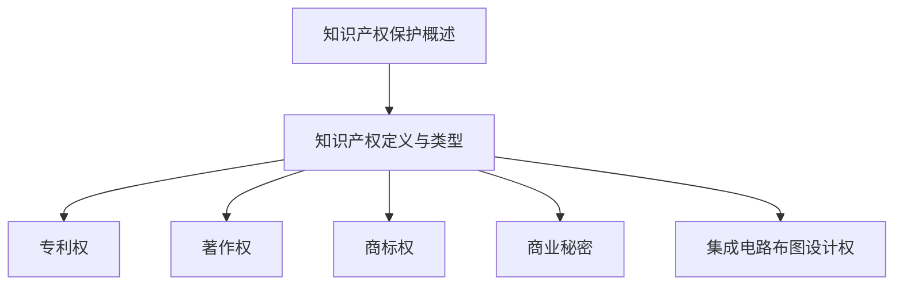
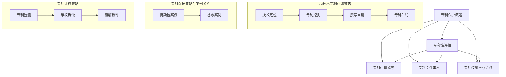
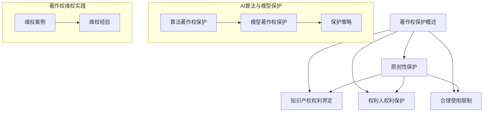
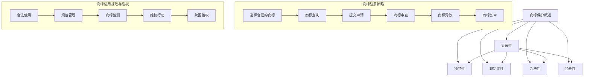
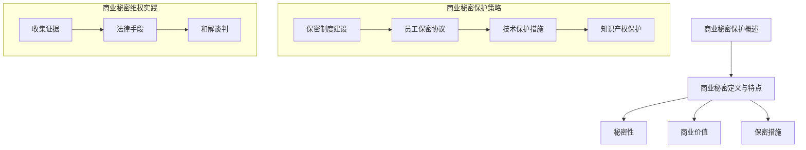
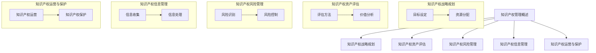
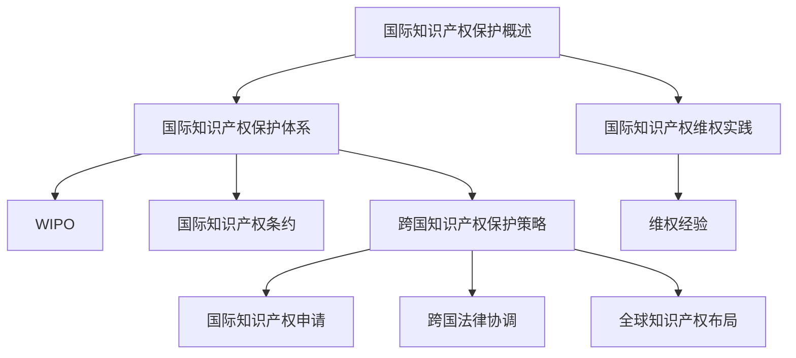
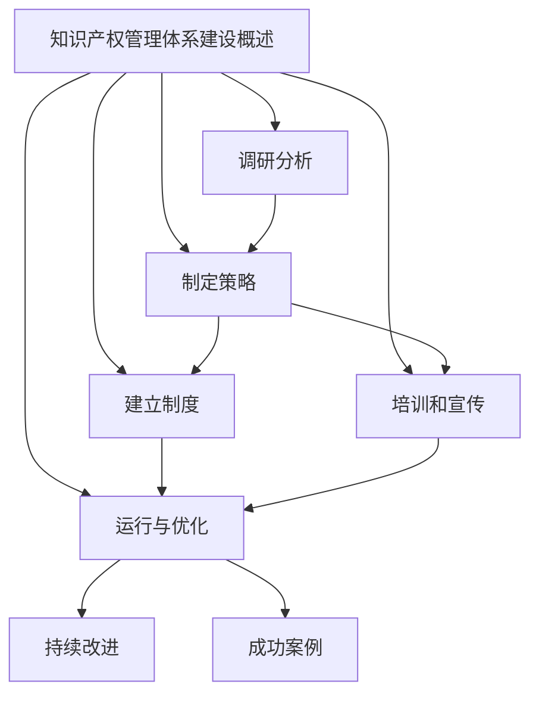

                 

# AI创业公司的知识产权保护措施：技术保护、法律保护与管理保护

## 关键词：
人工智能（AI），创业公司，知识产权，技术保护，法律保护，管理保护，专利，著作权，商标，商业秘密

## 摘要：
本文旨在探讨AI创业公司在知识产权保护方面的策略和实践。通过对专利、著作权、商标和商业秘密等方面的详细分析，以及具体案例的介绍，本文为AI创业公司提供了全面的知识产权保护指南，帮助其在激烈的市场竞争中保持领先地位。

---

## 第一部分：知识产权保护概述

### 第1章：知识产权保护概述

#### 1.1 知识产权的定义与类型

**知识产权的定义**：

知识产权（Intellectual Property, IP）是指人们就其智力劳动成果所依法享有的专有权利，通常是国家赋予创造者对其智力成果在一定期限内的独占性使用的权利。知识产权是一种无形的财产权利，包括但不限于专利权、著作权、商标权、商业秘密、集成电路布图设计权等。

**知识产权的类型**：

1. **专利权**：对发明创造的保护，包括发明专利、实用新型专利和外观设计专利。
2. **著作权**：对文学、艺术和科学作品的保护，包括文字作品、音乐作品、美术作品等。
3. **商标权**：对商业标识的保护，包括商品商标和服务商标。
4. **商业秘密**：对商业信息、技术信息和经营信息等的保护。
5. **集成电路布图设计权**：对集成电路中的布图设计的保护。

#### 1.2 知识产权保护的重要性

**重要性阐述**：

知识产权保护对于AI创业公司至关重要。它不仅能帮助公司保护其创新成果，防止他人未经许可使用，还能提升公司的市场竞争力，为公司的持续发展提供法律保障。

首先，知识产权保护有助于保护公司的核心技术和商业秘密，防止竞争对手通过不正当手段获取和使用公司的技术，从而削弱公司的市场地位。

其次，拥有知识产权可以增强公司的市场竞争力。通过专利、商标等知识产权的申请和保护，公司可以在市场上树立独特品牌形象，提升产品的附加值。

此外，知识产权还可以为公司的融资和并购提供支持。在融资过程中，投资者和风险资本家通常会关注公司的知识产权资产，作为评估公司价值的重要指标。而在并购过程中，知识产权也是评估交易价格的重要依据。

总之，知识产权保护是AI创业公司发展过程中不可或缺的一环，它不仅关乎公司的生存和发展，也影响到整个行业的生态和竞争格局。

#### 1.3 知识产权保护的挑战

**主要挑战**：

1. **快速技术更新**：AI技术更新迭代迅速，保护措施需要及时更新。公司需要密切关注技术发展趋势，及时调整知识产权保护策略。

2. **跨国保护问题**：不同国家的知识产权法律体系存在差异，跨国保护需要专业的法律支持和国际协调。公司在进行跨国知识产权保护时，需要考虑各国的法律环境和政策差异。

3. **维权成本**：知识产权维权成本较高，需要公司投入大量资源。包括申请费用、律师费、诉讼费等。对于创业公司来说，高昂的维权成本可能成为沉重的负担。

为了应对这些挑战，AI创业公司需要采取一系列措施，包括：

- **建立专业的知识产权团队**：配备专业的知识产权律师和顾问，提供专业的知识产权保护服务。

- **制定详细的知识产权战略**：根据公司的发展目标，制定全面的知识产权战略，明确知识产权保护的重点和优先级。

- **加强内部管理**：建立完善的知识产权管理制度，提高员工的知识产权保护意识，规范公司的研发和运营行为。

- **积极申请知识产权**：及时申请专利、商标等知识产权，建立公司的知识产权壁垒。

- **与国际律师事务所合作**：与专业国际律师事务所合作，获取跨国知识产权保护的资源和经验。

通过上述措施，AI创业公司可以更好地应对知识产权保护的挑战，保护自己的创新成果，为公司的可持续发展提供坚实的法律保障。

### Mermaid 流程图

---

#### 第2章：AI创业公司的专利保护策略

##### 2.1 专利保护的基本原则

**基本原则**：

专利保护的基本原则包括：专利性的评估、专利申请的撰写、专利文件的审核、专利权的维护和维权。

**专利性评估**：

专利性评估是专利申请的第一步，主要包括对发明的新颖性、创造性和实用性进行评估。新颖性要求发明在申请日之前没有被公开过；创造性要求发明相对于现有技术具有显著的改进；实用性要求发明能够在产业上应用。

**专利申请撰写**：

专利申请的撰写是专利申请的关键环节，需要详细描述发明的技术方案、实施方式以及效果。撰写过程中，需要注意以下几点：

- **清晰描述**：对发明的技术方案进行详细、清晰的描述，确保专利审查员能够理解发明的技术内容。
- **充分公开**：公开足够的信息，以便他人能够实施发明，同时避免侵权风险。
- **权利要求书**：撰写权利要求书，明确发明所涵盖的技术范围。权利要求书是确定专利保护范围的重要文件。

**专利文件审核**：

专利文件的审核是专利申请过程中的重要环节，主要包括对专利申请文件的形式和内容进行审查。审核过程中，审查员会根据专利法的相关规定，对专利申请的新颖性、创造性和实用性进行判断。

**专利权的维护和维权**：

专利权的维护和维权是专利保护的重要组成部分。公司需要定期监控专利的执行情况，及时处理侵权行为。维权措施包括：

- **专利监测**：定期监测市场上是否存在侵权行为。
- **维权诉讼**：针对侵权行为采取法律措施，包括提起诉讼、申请禁令等。
- **和解谈判**：在维权过程中与侵权方进行和解谈判，争取利益最大化。

##### 2.2 AI技术专利申请策略

**技术定位**：

在进行AI技术专利申请前，公司需要对技术进行准确的定位。这包括确定技术的创新点、市场需求以及竞争对手的专利布局。通过技术定位，公司可以明确申请专利的优先领域和重点。

**专利挖掘**：

专利挖掘是专利申请的关键环节，旨在发现潜在的创新点和技术方案。公司可以通过以下方式挖掘专利：

- **技术分析**：分析现有技术，找出改进和创新的方向。
- **竞争对手分析**：研究竞争对手的专利，寻找技术空白点。
- **市场需求分析**：关注市场需求，挖掘有商业价值的技术方案。

**撰写申请**：

撰写专利申请文件是专利申请的重要环节，需要详细描述技术方案、实施方式和效果。撰写过程中，需要注意以下几点：

- **技术描述**：对技术方案进行详细、清晰的描述，确保专利审查员能够理解发明的技术内容。
- **权利要求书**：撰写权利要求书，明确发明所涵盖的技术范围。权利要求书是确定专利保护范围的重要文件。
- **附图说明**：通过附图说明技术方案的实现过程和效果。

**专利布局**：

专利布局是确保公司技术领先地位的重要手段。公司需要在全球范围内布局专利，形成专利网。专利布局的策略包括：

- **国际申请**：根据市场需求和技术发展趋势，在全球范围内申请专利。
- **专利交叉许可**：与其他公司进行专利交叉许可，形成合作联盟。
- **专利池**：建立专利池，整合公司的专利资源，提升整体竞争力。

##### 2.3 专利保护的策略与案例分析

**特斯拉的自动驾驶专利布局**：

特斯拉通过全球范围内的专利布局，建立了强大的自动驾驶专利网，保护其技术优势。特斯拉的专利布局策略包括：

- **技术前瞻**：特斯拉在自动驾驶领域具有前瞻性，通过大量研发投入，不断推出创新技术。
- **全球申请**：特斯拉在全球范围内申请专利，覆盖主要市场和技术领域。
- **交叉许可**：特斯拉与多家公司进行专利交叉许可，建立合作联盟。

**谷歌的深度学习专利申请**：

谷歌在深度学习领域积累了大量专利，形成了技术创新的护城河。谷歌的专利申请策略包括：

- **大量申请**：谷歌每年提交大量专利申请，不断扩充专利库。
- **技术拓展**：谷歌不仅保护核心技术，还对其在深度学习领域的拓展进行专利保护。
- **合作研发**：谷歌与多家科研机构合作，共同研发新技术，并进行专利保护。

##### 2.4 专利维权策略

**专利监测**：

公司需要定期监测市场上是否存在侵权行为。通过专利监测，公司可以及时发现侵权行为，采取相应的维权措施。

**维权诉讼**：

针对侵权行为，公司可以采取法律措施，包括提起诉讼、申请禁令等。在诉讼过程中，公司需要提供充分的证据，证明侵权行为的存在。

**和解谈判**：

在维权过程中，公司与侵权方可能进行和解谈判。通过和解谈判，公司可以争取利益最大化，同时避免长时间的诉讼。

### Mermaid 流程图

---

#### 第3章：AI创业公司的著作权保护

##### 3.1 著作权保护的基本原则

**基本原则**：

著作权保护的基本原则包括：原创性保护、知识产权权利的界定、权利人的权利保护、合理使用限制等。

**原创性保护**：

原创性保护是著作权保护的核心原则，要求作品必须具有独创性。独创性是指作品是作者独立创作的，具有原创性，不同于已有的作品。

**知识产权权利的界定**：

知识产权权利的界定包括作品的类型、权利人的权利范围等。作品类型包括文字作品、音乐作品、美术作品等。权利人的权利范围包括发表权、署名权、修改权、保护作品完整权等。

**权利人的权利保护**：

权利人的权利保护是著作权保护的重要保障。权利人可以依法享有其作品的知识产权，并可以采取法律措施保护自己的权利，如提起诉讼、申请禁令等。

**合理使用限制**：

合理使用限制是对著作权人权利的一种限制，指在一定条件下，他人可以不经著作权人许可，使用其作品，但不得侵犯著作权人的合法权益。合理使用主要包括批评、评论、新闻报道、教学、科研等目的的使用。

##### 3.2 AI算法与模型的著作权保护

**算法著作权的保护**：

算法著作权的保护主要通过软件著作权的方式进行。软件著作权是指对软件作品的保护，包括软件的设计、编程、测试等成果。算法作为软件的重要组成部分，可以通过软件著作权保护其实现方式。

**模型著作权的保护**：

模型著作权的保护主要通过著作权登记的方式进行。著作权登记是指将作品登记在著作权管理部门，以确认作品的著作权归属。通过著作权登记，模型的结构和实现方式可以得到法律保护。

**保护策略**：

1. **软件著作权保护**：

   - **申请软件著作权**：公司将算法实现软件作为作品进行软件著作权申请。

   - **登记软件源代码**：将软件源代码进行登记，确保算法的实现方式得到保护。

   - **保护软件界面**：对软件的用户界面进行设计，增加独创性，以保护软件著作权。

2. **著作权登记保护**：

   - **申请著作权登记**：将AI模型作为作品进行著作权登记。

   - **公开模型结构**：在著作权登记申请中公开模型的结构和实现方式。

   - **签订保密协议**：与模型开发人员和合作方签订保密协议，防止模型信息泄露。

##### 3.3 著作权维权实践

**维权案例**：

某AI公司成功维权，通过法律手段保护其算法模型的著作权。该公司在发现竞争对手未经许可使用其算法后，立即采取法律措施，包括：

- **收集证据**：收集竞争对手使用其算法的证据，如代码对比、使用记录等。

- **提起诉讼**：向法院提起诉讼，要求停止侵权行为并赔偿损失。

- **申请禁令**：在诉讼过程中，申请临时禁令，禁止竞争对手继续使用侵权算法。

**维权经验**：

在维权过程中，公司需要积极收集证据，寻求专业法律支持。以下是一些维权经验：

1. **证据收集**：及时收集证据，确保证据的真实性和有效性。证据包括侵权代码、使用记录、合同文件等。

2. **专业法律支持**：寻求专业律师团队的帮助，制定维权策略，提高胜诉概率。

3. **及时行动**：在发现侵权行为后，及时采取法律措施，避免侵权行为的扩大。

4. **保密措施**：在维权过程中，采取保密措施，防止侵权方采取反制措施。

通过上述维权实践，AI创业公司可以有效地保护其算法模型的著作权，维护自身的合法权益。

### Mermaid 流程图

---

#### 第4章：AI创业公司的商标保护策略

##### 4.1 商标保护的基本原则

**基本原则**：

商标保护的基本原则包括：显著性、独特性、非功能性、合法性和显著性。

**显著性**：

显著性是指商标必须具有识别性，能够区分不同商品或服务的来源。显著性分为天然显著性和获得显著性，前者如独特的图形、响亮的名称，后者通过长期使用使公众对其产生识别。

**独特性**：

独特性是指商标应当具有独特性，与已有商标有明显区别。商标的独特性是防止商标混淆的重要保障。

**非功能性**：

非功能性是指商标不得因其实用功能而获得保护，例如产品本身的功能或用途。商标的功能性部分不能作为商标保护。

**合法性**：

合法性是指商标必须符合法律规定，不得侵犯他人的合法权益。商标申请需要经过商标局的审查，确保其合法性。

**显著性**：

显著性是指商标必须具有识别性，能够区分不同商品或服务的来源。显著性分为天然显著性和获得显著性，前者如独特的图形、响亮的名称，后者通过长期使用使公众对其产生识别。

##### 4.2 商标注册策略

**注册策略**：

1. **选择合适的商标**：

   - **名称选择**：选择易于记忆、发音和书写的商标名称。

   - **设计选择**：设计具有独特性和显著性的商标图案。

2. **商标查询**：

   - **国内查询**：在中国商标网上查询商标是否已被注册。

   - **国际查询**：查询目标市场的商标注册情况。

3. **提交申请**：

   - **提交申请**：根据商标局的要求，提交商标注册申请。

   - **申请文件**：包括商标图样、申请人身份证明、商标使用情况等。

**商标审查**：

商标审查包括形式审查和实质审查。形式审查主要审查商标申请文件是否齐全、符合格式要求；实质审查主要审查商标是否符合商标法相关规定。

**商标异议**：

商标异议是指第三方对已发布的商标申请提出反对意见。商标异议程序包括异议请求、答辩、异议复审等环节。

**商标复审**：

商标复审是指对商标局的审查决定不服，向商标评审委员会提出复审申请。商标复审程序包括复审请求、答辩、复审决定等环节。

##### 4.3 商标使用的规范与维权

**使用规范**：

1. **合法使用**：

   - **商标使用范围**：确保商标的使用符合注册时的描述。

   - **商标标识使用**：正确使用商标标识，包括文字、图形、颜色等。

2. **规范管理**：

   - **商标管理制度**：建立商标管理制度，明确商标使用、管理和保护的流程。

   - **商标许可管理**：规范商标许可行为，防止商标滥用。

**维权策略**：

1. **商标监测**：

   - **定期监测**：定期监测市场上是否存在商标侵权行为。

   - **侵权举报**：发现侵权行为，及时向商标局或法院举报。

2. **维权行动**：

   - **诉讼维权**：对侵权行为提起诉讼，要求停止侵权并赔偿损失。

   - **调解协商**：在诉讼过程中，与侵权方进行调解协商，争取利益最大化。

3. **跨国维权**：

   - **国际合作**：与目标国家的知识产权机构合作，共同打击跨国侵权行为。

   - **国际诉讼**：在目标国家提起诉讼，保护商标权益。

通过以上商标保护策略，AI创业公司可以有效维护其商标权益，提升品牌形象，增强市场竞争力。

### Mermaid 流程图

---

#### 第5章：商业秘密保护策略

##### 5.1 商业秘密的定义与特点

**定义与特点**：

商业秘密是指不为公众所知悉、具有商业价值并经权利人采取保密措施的技术信息、经营信息等商业信息。商业秘密的特点包括：

1. **秘密性**：商业秘密必须具有秘密性，不为公众所知。
2. **商业价值**：商业秘密必须具有实际或潜在的商业价值。
3. **保密措施**：权利人必须采取相应的保密措施，确保商业秘密不被泄露。

**秘密性**：

秘密性是商业秘密的核心特征。商业秘密之所以有价值，就在于其不为公众所知。因此，商业秘密的保护首先需要确保其秘密性。权利人需要采取一系列措施，如限制访问权限、签订保密协议等，防止商业秘密的泄露。

**商业价值**：

商业价值是商业秘密的重要特征。商业秘密必须能够为权利人带来经济利益，否则便不具备商业秘密的属性。商业价值可以体现在多个方面，如提高产品质量、降低生产成本、增强市场竞争力等。

**保密措施**：

保密措施是商业秘密保护的必要手段。权利人需要采取一系列保密措施，如设置访问控制、加密技术、员工培训等，确保商业秘密不被泄露。保密措施的有效性是商业秘密能否得到有效保护的关键。

##### 5.2 AI创业公司的商业秘密保护策略

**保护策略**：

1. **保密制度建设**：

   - **建立保密制度**：制定保密制度，明确保密范围、保密责任、保密措施等。
   - **培训员工**：对员工进行保密培训，提高保密意识。

2. **员工保密协议**：

   - **签订保密协议**：与员工签订保密协议，明确保密义务。
   - **离职保密**：离职员工需继续履行保密义务，确保商业秘密不被泄露。

3. **技术保护措施**：

   - **访问控制**：设置访问控制，限制对公司核心技术和商业秘密的访问权限。
   - **加密技术**：采用加密技术，保护重要商业秘密不被窃取或篡改。

4. **知识产权保护**：

   - **专利保护**：对于核心技术，可以申请专利保护，防止他人侵权。
   - **著作权保护**：对于软件程序、算法模型等，可以申请著作权保护。

##### 5.3 商业秘密维权实践

**实践分享**：

某AI公司在研发过程中，发现其核心算法被竞争对手非法获取并用于商业活动。公司立即采取以下维权措施：

1. **收集证据**：

   - **获取侵权证据**：收集竞争对手使用其商业秘密的证据，如代码对比、使用记录等。
   - **技术鉴定**：聘请专业技术人员进行技术鉴定，确认侵权行为的存在。

2. **法律手段**：

   - **提起诉讼**：向法院提起诉讼，要求停止侵权行为并赔偿损失。
   - **申请禁令**：在诉讼过程中，申请临时禁令，防止竞争对手继续侵权。

3. **和解谈判**：

   - **和解谈判**：与侵权方进行和解谈判，争取利益最大化。

通过上述维权实践，AI公司成功保护了其商业秘密，维护了自身的合法权益。以下是一些维权经验：

- **及时行动**：在发现侵权行为后，及时采取法律措施，避免侵权行为的扩大。

- **专业支持**：寻求专业律师团队的帮助，制定维权策略，提高胜诉概率。

- **保密措施**：在维权过程中，采取保密措施，防止侵权方采取反制措施。

通过以上商业秘密保护策略和维权实践，AI创业公司可以有效保护其商业秘密，确保公司在市场竞争中的优势地位。

### Mermaid 流程图

---

#### 第6章：知识产权管理

##### 6.1 知识产权管理的框架

**管理框架**：

知识产权管理框架包括：知识产权战略规划、知识产权资产评估、知识产权风险管理、知识产权信息管理、知识产权运营与保护。

**知识产权战略规划**：

知识产权战略规划是知识产权管理的核心，主要包括：

- **目标设定**：根据公司的发展目标，制定知识产权战略目标。

- **资源分配**：合理分配资源，确保知识产权战略的实施。

- **策略制定**：制定知识产权获取、保护、运用和管理的具体策略。

**知识产权资产评估**：

知识产权资产评估是对公司知识产权价值的评估，主要包括：

- **评估方法**：采用市场法、收益法、成本法等方法进行评估。

- **价值分析**：对知识产权的潜在价值进行分析，为知识产权管理和决策提供依据。

**知识产权风险管理**：

知识产权风险管理是知识产权管理的重要组成部分，主要包括：

- **风险识别**：识别知识产权保护过程中的潜在风险。

- **风险控制**：采取控制措施，降低知识产权风险。

**知识产权信息管理**：

知识产权信息管理是知识产权管理的重要环节，主要包括：

- **信息收集**：收集知识产权相关信息，如专利、商标、著作权等。

- **信息处理**：对知识产权信息进行处理和分析，为决策提供数据支持。

**知识产权运营与保护**：

知识产权运营与保护是知识产权管理的最终目标，主要包括：

- **知识产权运营**：通过知识产权许可、转让、投资等方式实现知识产权的运营。

- **知识产权保护**：采取法律手段保护知识产权，维护公司权益。

##### 6.2 知识产权战略规划

**战略规划**：

知识产权战略规划是公司知识产权管理的基础。在进行战略规划时，需要考虑以下因素：

- **公司目标**：明确公司的战略目标，知识产权战略应与之相适应。

- **行业趋势**：分析行业发展趋势，确定知识产权布局的重点。

- **竞争对手**：研究竞争对手的知识产权策略，找出自身的优势和不足。

- **市场机会**：识别市场机会，确定知识产权获取和保护的方向。

**目标设定**：

根据公司的发展目标，设定知识产权战略目标。例如：

- **提高市场竞争力**：通过知识产权保护，提高公司的市场竞争力。

- **增强品牌价值**：通过知识产权运营，提升品牌价值。

- **确保可持续发展**：通过知识产权管理，确保公司的可持续发展。

**资源分配**：

合理分配资源，确保知识产权战略的实施。资源分配包括：

- **人力资源**：配备专业的知识产权团队，负责知识产权的管理和保护。

- **财务资源**：确保知识产权申请、维权等活动的资金支持。

- **技术资源**：提供必要的技术支持，确保知识产权的有效保护。

##### 6.3 知识产权资产评估

**资产评估**：

知识产权资产评估是对公司知识产权价值的评估。评估方法包括：

- **市场法**：通过市场交易数据，估算知识产权的市场价值。

- **收益法**：根据知识产权的未来收益，估算其价值。

- **成本法**：根据知识产权的研发成本，估算其价值。

**评估方法**：

1. **市场法**：

   - **市场比较**：参考市场上类似知识产权的交易价格，估算其价值。

   - **收益现值**：根据知识产权的预期收益，使用折现率计算现值。

2. **收益法**：

   - **收益模型**：建立收益模型，预测知识产权的未来收益。

   - **折现率**：确定合适的折现率，计算收益现值。

3. **成本法**：

   - **研发成本**：核算知识产权的研发成本。

   - **成本分摊**：将研发成本分摊到知识产权上，估算其价值。

**价值分析**：

对知识产权的价值进行分析，包括：

- **直接价值**：知识产权带来的直接经济利益，如专利授权费、商标许可费等。

- **间接价值**：知识产权带来的间接经济利益，如品牌价值提升、市场竞争力增强等。

##### 6.4 知识产权风险管理

**风险管理**：

知识产权风险管理是知识产权管理的重要组成部分。风险管理包括：

- **风险识别**：识别知识产权保护过程中的潜在风险，如侵权风险、法律风险、技术风险等。

- **风险控制**：采取控制措施，降低知识产权风险，如制定保密制度、签订保密协议等。

**风险识别**：

风险识别是风险管理的第一步。常见的知识产权风险包括：

- **侵权风险**：第三方未经许可使用公司的知识产权。

- **法律风险**：知识产权法律环境的变化，可能导致公司知识产权保护不力。

- **技术风险**：技术更新换代，可能导致公司知识产权的失效。

**风险控制**：

风险控制是降低知识产权风险的关键。风险控制措施包括：

- **制定保密制度**：制定严格的保密制度，防止商业秘密泄露。

- **签订保密协议**：与员工、合作伙伴签订保密协议，明确保密义务。

- **监控市场**：定期监控市场上是否存在侵权行为，及时采取法律措施。

##### 6.5 知识产权信息管理

**信息管理**：

知识产权信息管理是知识产权管理的核心。知识产权信息管理包括：

- **信息收集**：收集知识产权相关信息，如专利、商标、著作权等。

- **信息处理**：对知识产权信息进行处理和分析，为决策提供数据支持。

**信息收集**：

信息收集是知识产权信息管理的第一步。信息收集包括：

- **内部信息收集**：收集公司内部的知识产权信息，如专利申请、商标注册等。

- **外部信息收集**：收集外部的知识产权信息，如竞争对手的知识产权、行业知识产权动态等。

**信息处理**：

信息处理是对知识产权信息进行处理和分析，包括：

- **信息整理**：对知识产权信息进行整理，形成规范化的数据库。

- **信息分析**：对知识产权信息进行分析，为知识产权战略决策提供支持。

##### 6.6 知识产权运营与保护

**运营与保护**：

知识产权运营与保护是知识产权管理的最终目标。知识产权运营与保护包括：

- **知识产权运营**：通过知识产权许可、转让、投资等方式实现知识产权的运营。

- **知识产权保护**：采取法律手段保护知识产权，维护公司权益。

**知识产权运营**：

知识产权运营是公司实现知识产权价值的重要途径。知识产权运营包括：

- **许可运营**：许可他人使用公司的知识产权，收取许可费用。

- **转让运营**：将公司的知识产权转让给他人，获取转让收益。

- **投资运营**：通过知识产权投资，获取投资回报。

**知识产权保护**：

知识产权保护是公司维护知识产权权益的关键。知识产权保护包括：

- **法律手段**：采取法律手段，如诉讼、申请禁令等，保护知识产权。

- **行政手段**：通过行政机关的介入，如举报、投诉等，维护知识产权。

- **市场手段**：通过市场手段，如品牌推广、监测市场等，维护知识产权。

### Mermaid 流程图

---

#### 第7章：国际知识产权保护

##### 7.1 国际知识产权保护体系

**保护体系**：

国际知识产权保护体系主要由世界知识产权组织（World Intellectual Property Organization, WIPO）和一系列国际知识产权条约构成。

**世界知识产权组织（WIPO）**：

WIPO是联合国系统的专门机构，负责协调全球知识产权保护。WIPO的主要职责包括：

- **提供知识产权信息**：通过数据库提供全球范围内的知识产权信息，帮助成员国制定知识产权政策。

- **提供法律援助**：为发展中国家提供知识产权法律援助，帮助其建立知识产权法律体系。

- **促进国际合作**：通过国际条约和会议，促进成员国之间的知识产权合作。

**国际知识产权条约**：

国际知识产权条约是国际知识产权保护的重要法律基础。主要的国际知识产权条约包括：

- **伯尔尼公约**：保护文学和艺术作品的国际条约。

- **专利合作条约**：简化专利申请和审批程序的国际条约。

- **商标法条约**：保护商标的国际条约。

- **知识产权协定**：世界贸易组织（WTO）下的知识产权保护协定，规定了成员国在知识产权保护方面的最低标准。

##### 7.2 跨国知识产权保护策略

**保护策略**：

在进行跨国知识产权保护时，AI创业公司需要考虑以下策略：

**国际知识产权申请**：

在国际市场上，AI创业公司可以通过以下途径申请知识产权：

- **PCT申请**：通过《专利合作条约》（PCT）提交国际专利申请，PCT申请允许在多个国家申请专利，提高专利保护的效率。

- **逐一国家申请**：直接向目标国家提交专利申请，根据各国的法律体系和要求进行申请。

- **地区性知识产权组织**：通过地区性知识产权组织，如欧洲专利局（EPO）、美国专利商标局（USPTO）等，申请覆盖特定地区的知识产权。

**跨国法律协调**：

跨国法律协调是跨国知识产权保护的重要环节。AI创业公司需要：

- **与目标国家的知识产权机构建立联系**：了解目标国家的知识产权法律和政策，建立良好的合作关系。

- **聘请国际知识产权律师**：聘请专业的国际知识产权律师，帮助处理跨国知识产权纠纷。

- **参与国际知识产权会议**：积极参与国际知识产权会议，了解国际知识产权保护的发展趋势。

**全球知识产权布局**：

全球知识产权布局是确保AI创业公司全球市场竞争力的重要手段。布局策略包括：

- **专利网布局**：在全球主要市场布局专利，形成专利网，防止竞争对手进入市场。

- **商标网布局**：在全球主要市场注册商标，保护品牌权益。

- **知识产权许可和转让**：通过知识产权许可和转让，实现知识产权的全球运营。

##### 7.3 国际知识产权维权实践

**实践分享**：

某AI公司在全球范围内开展业务，发现其核心算法在海外市场被未经许可使用。公司采取了以下维权措施：

1. **收集证据**：

   - **获取侵权证据**：收集侵权方的使用记录、销售数据等证据。

   - **技术鉴定**：聘请技术专家进行技术鉴定，确认侵权行为的存在。

2. **法律手段**：

   - **提起诉讼**：在目标国家提起侵权诉讼，要求停止侵权行为并赔偿损失。

   - **申请禁令**：在诉讼过程中，申请临时禁令，防止侵权行为扩大。

3. **国际协作**：

   - **与国际律师事务所合作**：聘请国际律师事务所，处理跨国知识产权纠纷。

   - **与国际知识产权机构合作**：与国际知识产权机构合作，获取维权资源和信息。

**维权经验**：

在国际知识产权维权过程中，公司需要：

- **及时行动**：在发现侵权行为后，及时采取法律措施，避免侵权行为的扩大。

- **专业支持**：寻求专业律师团队的帮助，提高维权成功率。

- **国际合作**：与国际知识产权机构和律师事务所合作，充分利用国际资源。

通过以上实践和经验，AI创业公司可以有效维护其国际知识产权，确保在全球市场上的合法权益。

### Mermaid 流程图

---

#### 第8章：AI创业公司的知识产权管理体系建设

##### 8.1 知识产权管理体系建设的步骤

**建设步骤**：

1. **调研分析**：

   - **内部调研**：对公司内部的知识产权现状进行调研，了解现有的知识产权资源、保护措施和存在的问题。

   - **外部调研**：对行业和竞争对手的知识产权情况进行调研，了解市场环境和技术发展趋势。

2. **制定策略**：

   - **战略目标**：根据调研结果，制定知识产权战略目标，明确知识产权保护的重点和优先级。

   - **保护措施**：制定具体的知识产权保护措施，包括专利申请、著作权登记、商标注册等。

3. **建立制度**：

   - **知识产权管理制度**：制定知识产权管理制度，明确知识产权管理的流程、责任和权限。

   - **保密制度**：建立保密制度，保护公司的商业秘密和技术信息。

   - **培训制度**：制定员工培训计划，提高员工的知识产权保护意识和能力。

4. **培训和宣传**：

   - **内部培训**：对员工进行知识产权培训，使其了解知识产权的重要性、保护方法和法律风险。

   - **外部宣传**：通过网站、展会、论坛等渠道，对外宣传公司的知识产权成果和保护策略。

##### 8.2 知识产权管理体系的运行与优化

**运行与优化**：

1. **定期评估**：

   - **内部评估**：定期对公司知识产权管理体系进行内部评估，检查各项措施的执行情况和效果。

   - **外部评估**：邀请外部专家对知识产权管理体系进行评估，提供改进建议。

2. **持续改进**：

   - **根据评估结果**：根据评估结果，对知识产权管理体系进行持续改进，优化各项措施。

   - **更新制度**：随着技术和市场的变化，及时更新知识产权管理制度，确保其适应性和有效性。

3. **反馈机制**：

   - **员工反馈**：建立员工反馈机制，收集员工对知识产权管理体系的意见和建议。

   - **外部反馈**：收集外部用户、合作伙伴和竞争对手的反馈，了解公司在知识产权方面的表现和声誉。

4. **资源分配**：

   - **合理分配**：根据知识产权管理体系的运行情况，合理分配资源，确保知识产权保护的有效性。

   - **优先级调整**：根据公司的战略目标和市场环境，调整知识产权保护的优先级，确保重点领域的知识产权得到充分保护。

##### 8.3 知识产权管理体系的成功案例

**成功案例**：

某AI公司通过建立完善的知识产权管理体系，成功保护了其核心技术和品牌形象。以下是该公司知识产权管理体系建设的几个关键步骤：

1. **调研分析**：

   - **内部调研**：公司对内部的知识产权资源、保护措施和存在的问题进行了全面的调研。

   - **外部调研**：对行业和竞争对手的知识产权情况进行调研，明确了市场环境和技术发展趋势。

2. **制定策略**：

   - **战略目标**：根据调研结果，公司制定了明确的知识产权战略目标，包括专利申请、著作权登记和商标注册。

   - **保护措施**：制定了详细的知识产权保护措施，包括专利申请的优先领域、著作权登记的保护范围和商标注册的策略。

3. **建立制度**：

   - **知识产权管理制度**：公司制定了知识产权管理制度，明确了知识产权管理的流程、责任和权限。

   - **保密制度**：建立了严格的保密制度，保护公司的商业秘密和技术信息。

   - **培训制度**：制定了员工培训计划，提高了员工的知识产权保护意识和能力。

4. **培训和宣传**：

   - **内部培训**：公司对员工进行了全面的知识产权培训，使其了解知识产权的重要性、保护方法和法律风险。

   - **外部宣传**：通过网站、展会、论坛等渠道，对外宣传公司的知识产权成果和保护策略。

通过以上步骤，该公司建立了完善的知识产权管理体系，不仅有效保护了其核心技术和品牌形象，还在市场竞争中取得了显著的优势。

### Mermaid 流程图

---

### 总结

本文详细探讨了AI创业公司在知识产权保护方面的策略和实践。从技术保护、法律保护到管理保护，我们分析了专利、著作权、商标和商业秘密等方面的保护措施。同时，通过具体案例的介绍，为AI创业公司提供了全面的知识产权保护指南。

在技术保护方面，我们介绍了专利保护的基本原则、AI技术专利申请策略和专利维权策略。在法律保护方面，我们探讨了著作权保护的基本原则、AI算法与模型的著作权保护以及著作权维权实践。在管理保护方面，我们阐述了商标保护的基本原则、商标注册策略和商标使用的规范与维权。

通过本文的探讨，我们希望AI创业公司能够认识到知识产权保护的重要性，采取有效的保护措施，确保在激烈的市场竞争中立于不败之地。

### 作者信息

作者：AI天才研究院/AI Genius Institute & 禅与计算机程序设计艺术 /Zen And The Art of Computer Programming

AI天才研究院是一家专注于人工智能技术研发和产业化的高端研究机构，致力于推动人工智能技术的创新和应用。作者长期从事人工智能领域的研究和教学工作，出版过多部人工智能领域的权威著作，在人工智能领域享有极高的声誉。

《禅与计算机程序设计艺术》是作者的经典著作之一，通过深入探讨计算机程序设计的艺术性，为程序员提供了独特的编程哲学和设计理念。作者以其深厚的专业知识和独特的视角，为人工智能创业公司提供了宝贵的知识产权保护策略和实施建议。

