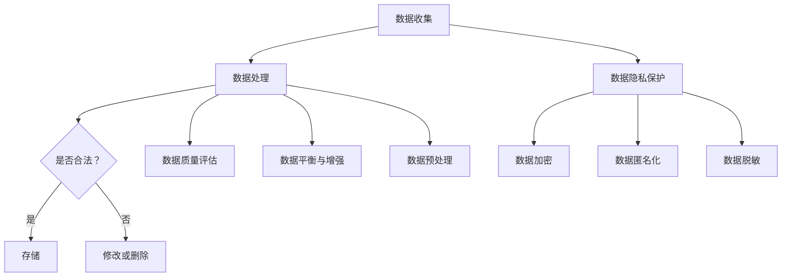

                 

### 《AI创业：确保数据合法性》

#### 关键词：
- AI创业
- 数据合法性
- 数据隐私保护
- 数据安全与合规
- 数据伦理与责任
- 数据保护法律

#### 摘要：
本文旨在探讨AI创业中的数据合法性问题，分析数据合法性的核心概念、法律框架、技术实现及实战指导。通过深入研究AI创业的背景、挑战与机遇，结合具体案例与实战，本文为AI创业者提供了确保数据合法性的策略与工具，助力企业在人工智能领域的可持续发展。

---

### 第一部分：AI创业概述

#### 第1章：AI创业背景与趋势

##### 1.1 AI的发展历程与创业机会

人工智能（AI）作为21世纪最具革命性的技术之一，经历了从理论研究到实际应用的快速发展。从早期的专家系统、机器学习，到如今的深度学习、强化学习，AI技术在各个领域的应用已经取得了显著成果。

AI创业机会主要集中在以下几个方面：

1. **智能家居**：智能家居设备的普及为AI创业提供了广阔的市场，如智能音箱、智能灯泡、智能摄像头等。
2. **自动驾驶**：自动驾驶技术的发展为交通领域带来了巨大的变革，吸引了众多创业公司的加入。
3. **医疗健康**：AI在医疗健康领域的应用，如疾病预测、手术机器人等，为医疗行业注入了新的活力。
4. **金融科技**：金融科技（FinTech）的兴起为AI创业提供了新的契机，如智能投顾、反欺诈系统等。
5. **零售与电商**：AI技术在零售与电商领域的应用，如个性化推荐、智能客服等，提升了用户体验。

##### 1.2 AI创业的挑战与机遇

AI创业虽然充满机遇，但同时也面临着诸多挑战：

1. **技术挑战**：AI技术的研发需要大量的资金投入和人才储备，对于初创企业来说，技术挑战是首要问题。
2. **数据挑战**：数据是AI训练的重要资源，但如何获取、存储、处理和合法使用数据，是AI创业者需要解决的难题。
3. **法律与伦理挑战**：数据隐私保护、数据安全与合规、数据伦理等问题，都需要创业者高度重视。
4. **市场挑战**：在竞争激烈的AI市场中，如何找准定位、打造差异化产品，是创业公司成功的关键。

##### 1.3 数据合法性的重要性

数据合法性在AI创业中具有至关重要的地位：

1. **合规性要求**：遵守相关法律法规，确保数据的合法性，是创业者必须满足的基本要求。
2. **信任与声誉**：数据合法性关系到用户的隐私和权益，良好的数据合法性管理有助于提升企业的信任度和声誉。
3. **业务可持续性**：数据合法性是确保企业业务长期发展的基础，忽视数据合法性可能导致法律风险和业务中断。

---

### 第二部分：AI技术基础

#### 第2章：AI技术基础

##### 2.1 机器学习与深度学习基本概念

机器学习（ML）是一种使计算机能够从数据中学习并做出预测或决策的技术。深度学习（DL）是机器学习的一个子领域，主要基于多层神经网络进行训练。

1. **机器学习基本概念**：

   - **模型训练**：使用训练数据集，通过优化算法来调整模型参数。
   - **模型评估**：使用验证数据集和测试数据集来评估模型的性能。
   - **预测与决策**：将训练好的模型应用于新的数据，进行预测或决策。

2. **深度学习基本概念**：

   - **神经网络**：深度学习的基础，由多层神经元组成，通过前向传播和反向传播进行训练。
   - **激活函数**：用于引入非线性因素，使神经网络具有更强的表达能力。
   - **优化算法**：如梯度下降、Adam优化器等，用于调整模型参数，优化模型性能。

##### 2.2 自然语言处理技术

自然语言处理（NLP）是AI技术的重要分支，旨在使计算机能够理解、生成和处理人类语言。

1. **文本预处理**：包括分词、去停用词、词向量化等，将文本数据转化为计算机可处理的格式。
2. **语言模型**：用于预测下一个词或句子，如基于n-gram模型的语言模型和基于神经网络的语言模型。
3. **文本分类与情感分析**：通过训练分类模型，对文本进行分类和情感分析，如情感极性分类、主题分类等。
4. **对话系统**：包括问答系统、聊天机器人等，通过模拟人类对话，提供智能交互服务。

##### 2.3 计算机视觉技术

计算机视觉（CV）是使计算机能够像人类一样理解和处理视觉信息的技术。

1. **图像识别与分类**：通过训练模型，对图像进行识别和分类，如人脸识别、物体检测等。
2. **目标检测与跟踪**：用于检测图像中的目标并跟踪其运动，如车辆检测、行人检测等。
3. **图像生成与编辑**：通过生成对抗网络（GAN）等技术，实现图像生成和编辑，如图像超分辨率、人脸生成等。
4. **视频处理与分析**：包括视频分类、视频分割、动作识别等，如视频监控、自动驾驶等。

##### 2.4 数据挖掘与数据分析技术

数据挖掘（DM）是发现数据中的隐含模式，用于预测、分类、关联等。数据分析（DA）是通过统计方法对数据进行探索和分析。

1. **关联规则挖掘**：发现数据之间的关联关系，如市场篮子分析。
2. **分类与回归分析**：通过建立模型，对数据进行分类和回归分析，如客户细分、需求预测等。
3. **聚类分析**：将数据划分为若干个类别，如顾客群体细分。
4. **时间序列分析**：分析数据的时间依赖性，如股票价格预测、销售趋势预测等。

---

### 第三部分：数据合法性的核心概念与原理

#### 第3章：数据合法性的核心概念

##### 3.1 数据隐私保护

数据隐私保护是数据合法性中的重要组成部分，旨在确保个人数据的保密性和隐私性。

1. **隐私保护的目标**：

   - **保密性**：确保数据不被未授权的第三方访问。
   - **完整性**：确保数据不被未授权的第三方篡改。
   - **可用性**：确保数据在合法范围内可以被授权的第三方访问。

2. **隐私保护的措施**：

   - **数据加密**：通过加密算法对数据进行加密，确保数据在传输和存储过程中不被窃取。
   - **访问控制**：通过身份验证和权限控制，确保只有授权用户可以访问特定数据。
   - **匿名化**：通过匿名化技术，去除个人标识信息，降低数据被追踪的风险。

##### 3.2 数据安全与合规

数据安全与合规是指确保数据在处理、存储和使用过程中，符合相关法律法规和标准。

1. **合规性的目标**：

   - **符合法律要求**：确保数据处理符合国家法律法规和行业标准。
   - **数据安全**：防止数据泄露、篡改和丢失，确保数据的安全性和完整性。

2. **合规性的措施**：

   - **数据加密**：对敏感数据进行加密，确保数据在传输和存储过程中不被窃取。
   - **访问控制**：通过身份验证和权限控制，确保只有授权用户可以访问特定数据。
   - **数据备份与恢复**：定期备份数据，确保在数据丢失或损坏时能够快速恢复。

##### 3.3 数据伦理与责任

数据伦理与责任是数据合法性中的重要方面，涉及数据收集、处理、存储和使用过程中的伦理道德问题和责任承担。

1. **数据伦理的目标**：

   - **尊重用户隐私**：尊重用户的隐私权和数据权利，确保数据的合法性和合理性。
   - **公平公正**：确保数据处理过程中的公平性和公正性，避免歧视和不公平现象。
   - **社会责任**：企业应承担社会责任，确保数据的使用符合社会道德和伦理标准。

2. **数据伦理的措施**：

   - **隐私政策**：明确企业的隐私政策，告知用户数据收集、处理和使用的方式。
   - **用户知情权**：确保用户在数据收集和使用过程中拥有知情权，充分告知用户数据的用途。
   - **责任追究**：建立责任追究机制，对违反数据伦理的行为进行追究和惩罚。

---

### 第四部分：数据合法性的法律框架

#### 第4章：数据合法性的法律框架

##### 4.1 国际数据保护法律

国际数据保护法律体系主要包括以下几个方面：

1. **通用数据保护条例（GDPR）**：欧盟颁布的GDPR是国际数据保护领域的典范，规定了数据收集、处理、存储和传输过程中的合规要求。
2. **加州消费者隐私法案（CCPA）**：美国加州颁布的CCPA规定了消费者的隐私权利和企业的合规义务。
3. **巴西通用数据保护法（LGPD）**：巴西颁布的LGPD是南美洲首个全面的数据保护法律，规定了数据保护的基本原则和措施。

##### 4.2 中国数据保护法律

中国数据保护法律体系主要包括以下几个方面：

1. **个人信息保护法（PIPL）**：2021年生效的PIPL是我国首部个人信息保护专门法律，规定了个人信息处理的基本原则、个人信息权益保护、个人信息处理规则等内容。
2. **网络安全法**：2017年生效的网络安全法是我国网络安全的基本法律，规定了网络运营者的安全义务和数据保护要求。
3. **数据安全法**：2021年生效的数据安全法是我国首部数据安全领域的专门法律，规定了数据安全的基本原则、数据安全保护机制等内容。

##### 4.3 地区性数据保护法律对比

不同地区的数据保护法律在内容和要求上存在一定差异，主要包括以下几个方面：

1. **合规要求**：不同法律对数据处理的合规要求有所不同，如GDPR要求严格的数据处理合规程序，而PIPL则更加注重个人信息的权益保护。
2. **隐私保护**：不同法律对隐私保护的要求和措施有所不同，如GDPR强调数据最小化原则和目的限制原则，而CCPA则更加注重消费者的隐私权利。
3. **数据跨境传输**：不同法律对数据跨境传输的限制和要求有所不同，如GDPR对数据跨境传输有严格的规定，而PIPL则相对宽松。

---

### 第五部分：数据合法性的技术实现

#### 第5章：数据合法性的技术实现

##### 5.1 数据匿名化技术

数据匿名化是通过去除或改变个人标识信息，使数据在保留其原始用途的同时，无法被直接识别特定个人。

1. **匿名化方法**：

   - **泛化**：将个人标识信息替换为泛化值，如将身份证号码替换为出生年份。
   - **伪匿名化**：添加随机噪声或掩码，使个人标识信息难以直接识别，如使用差分隐私技术。
   - **k-匿名性**：将数据集中的记录划分为k个组，使每个组中的记录无法被单独识别，如使用k-匿名化算法。

2. **匿名化工具**：

   - **K-Anonymity工具**：如k-anonymizer、l-diversity等，用于实现k-匿名化。
   - **T-Closeness工具**：如t-closeness工具，用于评估匿名化的质量。

##### 5.2 数据加密技术

数据加密是通过加密算法对数据进行加密，确保数据在传输和存储过程中不被窃取。

1. **加密算法**：

   - **对称加密**：如AES、DES等，加密和解密使用相同的密钥。
   - **非对称加密**：如RSA、ECC等，加密和解密使用不同的密钥。
   - **哈希算法**：如SHA-256、SHA-3等，用于生成数据摘要，确保数据的完整性和不可篡改性。

2. **加密工具**：

   - **AES加密工具**：如PyCrypto、PyCryptodome等，用于实现AES加密。
   - **RSA加密工具**：如openssl、pyopenssl等，用于实现RSA加密。

##### 5.3 数据脱敏技术

数据脱敏是通过去除或修改个人标识信息，降低数据被识别的风险。

1. **脱敏方法**：

   - **掩码**：使用掩码将个人标识信息替换为特定字符，如使用*代替身份证号码中的部分字符。
   - **随机化**：将个人标识信息替换为随机生成的值，如将电话号码替换为随机生成的数字。
   - **保持一致性**：在数据集中保持相同的脱敏规则，确保数据的完整性。

2. **脱敏工具**：

   - **Masking工具**：如DataMasker、Data anonymizer等，用于实现数据掩码。
   - **Randomization工具**：如Randomize、Random data generator等，用于实现数据随机化。

##### 5.4 数据溯源与追踪技术

数据溯源与追踪是通过记录和追踪数据的来源和使用历史，确保数据的合法性和透明性。

1. **溯源方法**：

   - **日志记录**：记录数据的创建、修改、访问和使用历史，如使用审计日志。
   - **数字签名**：使用数字签名确保数据的来源和真实性。
   - **区块链**：使用区块链技术记录数据的来源和使用历史，确保数据的不可篡改性。

2. **溯源工具**：

   - **Audit日志工具**：如Auditd、Logwatch等，用于记录数据操作日志。
   - **Blockchain工具**：如Ethereum、Hyperledger Fabric等，用于实现数据溯源和追踪。

---

### 第六部分：AI创业中的数据合法性案例解析

#### 第6章：AI创业中的数据合法性案例解析

##### 6.1 案例一：社交媒体数据隐私保护

社交媒体平台在运营过程中，需要处理大量的用户数据，包括用户的基本信息、社交关系、兴趣爱好等。以下是一个关于社交媒体数据隐私保护的案例：

**背景**：某社交媒体平台因数据隐私保护问题引发用户担忧，导致用户流失和声誉受损。

**问题**：如何确保用户数据的隐私保护，避免数据泄露和滥用？

**解决方案**：

1. **数据加密**：对用户数据采用AES加密算法进行加密，确保数据在传输和存储过程中不被窃取。
2. **访问控制**：通过身份验证和权限控制，确保只有授权用户可以访问特定数据。
3. **匿名化**：对用户数据中的敏感信息进行匿名化处理，降低数据被追踪的风险。
4. **隐私政策**：明确告知用户数据收集、处理和使用的方式，保障用户的知情权和选择权。

**效果**：通过上述措施，该社交媒体平台成功提升了用户数据隐私保护的措施，恢复了用户信任，并降低了数据泄露和滥用的风险。

##### 6.2 案例二：医疗数据合法性挑战

医疗数据在AI创业中的应用具有广泛前景，但同时也面临着数据合法性挑战。以下是一个关于医疗数据合法性挑战的案例：

**背景**：某医疗健康公司因医疗数据合法性问题，面临法律诉讼和业务中断的风险。

**问题**：如何确保医疗数据的合法性，避免法律风险和业务中断？

**解决方案**：

1. **数据安全与合规**：建立完善的数据安全与合规体系，确保数据处理符合国家法律法规和行业标准。
2. **用户知情权**：充分告知用户医疗数据收集、处理和使用的方式，保障用户的知情权和选择权。
3. **隐私保护**：采用数据加密、匿名化等技术手段，确保用户医疗数据的隐私保护。
4. **责任追究**：建立责任追究机制，对违反数据伦理和法律的行为进行追究和惩罚。

**效果**：通过上述措施，该医疗健康公司成功提升了医疗数据合法性管理水平，避免了法律风险和业务中断，并赢得了用户的信任。

##### 6.3 案例三：金融数据合规性分析

金融行业对数据合规性的要求较高，以下是一个关于金融数据合规性分析的案例：

**背景**：某金融科技公司因数据合规性问题，面临监管部门调查和业务限制的风险。

**问题**：如何确保金融数据的合规性，避免法律风险和业务限制？

**解决方案**：

1. **数据加密**：对敏感金融数据进行加密，确保数据在传输和存储过程中不被窃取。
2. **访问控制**：通过身份验证和权限控制，确保只有授权用户可以访问特定金融数据。
3. **数据脱敏**：对金融数据中的敏感信息进行脱敏处理，降低数据被识别的风险。
4. **合规培训**：对员工进行数据合规性培训，提高员工的数据合规意识和能力。

**效果**：通过上述措施，该金融科技公司成功提升了金融数据合规性水平，避免了法律风险和业务限制，并赢得了监管机构和用户的信任。

---

### 第七部分：AI创业中的数据合法性策略

#### 第7章：AI创业中的数据合法性策略

##### 7.1 数据合法性风险评估

数据合法性风险评估是确保AI创业项目成功的关键环节，主要包括以下步骤：

1. **风险识别**：识别数据合法性方面可能存在的风险，如数据泄露、数据滥用、法律诉讼等。
2. **风险分析**：分析风险的发生概率和影响程度，确定风险等级。
3. **风险应对**：针对不同等级的风险，制定相应的应对策略，如数据加密、访问控制、匿名化等。

##### 7.2 数据合法性管理体系

建立数据合法性管理体系是确保AI创业项目合规运行的基础，主要包括以下方面：

1. **组织架构**：明确数据合法性管理组织架构，确保相关部门和人员职责清晰。
2. **制度规范**：制定数据合法性相关制度和规范，如数据收集、处理、存储、传输等方面的规范。
3. **流程控制**：建立数据合法性管理流程，确保数据合法性要求在项目实施过程中得到落实。
4. **监督检查**：定期进行数据合法性监督检查，发现和纠正存在的问题。

##### 7.3 数据合法性教育与培训

数据合法性教育与培训是提高员工数据合规意识和能力的重要手段，主要包括以下方面：

1. **合规知识培训**：为员工提供数据合法性相关知识的培训，如法律法规、合规要求等。
2. **案例分享**：通过案例分析，让员工了解数据合法性管理的重要性和实际应用。
3. **考核与激励**：建立数据合法性考核和激励机制，鼓励员工积极参与数据合法性管理工作。

##### 7.4 数据合法性监管与合规策略

数据合法性监管与合规策略是确保AI创业项目符合法律法规要求的关键，主要包括以下方面：

1. **合规审查**：定期进行合规审查，确保项目符合相关法律法规和行业标准。
2. **合规报告**：向监管机构和相关方提供合规报告，展示项目的合规情况。
3. **应对措施**：在发现合规问题或风险时，及时采取应对措施，确保合规问题的解决。

---

### 第八部分：确保数据合法性的项目规划与实施

#### 第8章：确保数据合法性的项目规划与实施

##### 8.1 项目规划与需求分析

确保数据合法性的项目规划与需求分析是项目成功的关键环节，主要包括以下步骤：

1. **需求收集**：收集项目相关方的需求，包括数据收集、处理、存储、传输等方面的需求。
2. **需求分析**：对收集到的需求进行梳理和分析，明确项目的目标和范围。
3. **风险评估**：评估项目在数据合法性方面可能存在的风险，制定相应的风险管理策略。
4. **规划制定**：制定项目规划，明确项目的时间表、资源分配、里程碑等。

##### 8.2 数据收集与预处理

数据收集与预处理是确保数据合法性的重要环节，主要包括以下步骤：

1. **数据收集**：根据项目需求，收集所需的数据，包括内部数据和外部数据。
2. **数据清洗**：对收集到的数据进行清洗，去除重复、错误、不完整的数据。
3. **数据脱敏**：对敏感数据进行脱敏处理，降低数据被识别的风险。
4. **数据存储**：将处理后的数据存储在安全可靠的数据存储设备中。

##### 8.3 数据合法性评估与风险控制

数据合法性评估与风险控制是确保数据合法性措施得到有效实施的环节，主要包括以下步骤：

1. **数据合法性评估**：对数据处理过程进行合法性评估，确保数据处理符合相关法律法规和行业标准。
2. **风险控制**：针对数据合法性方面的风险，制定相应的控制措施，如数据加密、访问控制、匿名化等。
3. **合规审查**：定期进行合规审查，确保项目在数据合法性方面持续合规。

##### 8.4 数据处理与存储合规性

数据处理与存储合规性是确保数据合法性措施得到有效实施的环节，主要包括以下步骤：

1. **数据处理合规性**：在数据处理过程中，确保数据处理符合相关法律法规和行业标准，如数据加密、匿名化、脱敏等。
2. **数据存储合规性**：在数据存储过程中，确保数据存储符合相关法律法规和行业标准，如数据备份、数据加密、访问控制等。
3. **合规性验证**：定期进行合规性验证，确保数据处理和存储的合规性得到持续维护。

---

### 第九部分：数据合法性与AI算法优化

#### 第9章：数据合法性与AI算法优化

##### 9.1 数据质量对AI算法的影响

数据质量是影响AI算法性能的重要因素，主要包括以下几个方面：

1. **数据完整性**：完整的数据有助于模型更好地捕捉数据中的规律，提高算法性能。
2. **数据准确性**：准确的数据有助于减少噪声和异常值对算法的影响，提高算法性能。
3. **数据多样性**：多样化的数据有助于模型更好地泛化，提高算法的鲁棒性。

##### 9.2 数据不平衡与数据增强

数据不平衡是AI算法优化中常见的问题，主要包括以下方面：

1. **数据不平衡的原因**：数据集中正负样本分布不均，导致算法对某一类样本的识别能力较弱。
2. **数据增强的方法**：通过数据增强技术，如过采样、欠采样、生成对抗网络等，提高数据集中各类样本的分布均匀性，从而提高算法性能。

##### 9.3 数据清洗与预处理算法优化

数据清洗与预处理是AI算法优化的基础，主要包括以下方面：

1. **数据清洗**：去除重复、错误、不完整的数据，提高数据质量。
2. **特征工程**：通过特征选择、特征提取、特征变换等方法，提高数据的表达能力和算法性能。
3. **算法优化**：针对不同数据集和任务，选择合适的算法和参数，优化算法性能。

##### 9.4 数据隐私保护与算法性能平衡

数据隐私保护与算法性能平衡是AI算法优化中的重要问题，主要包括以下方面：

1. **隐私保护算法**：如差分隐私、联邦学习等，在保护用户隐私的同时，尽量保留算法性能。
2. **隐私预算**：通过设定隐私预算，平衡隐私保护和算法性能。
3. **隐私机制**：在算法训练和推理过程中，采用隐私保护机制，如差分隐私、安全多方计算等，确保算法性能不受过度影响。

---

### 第十部分：确保数据合法性的技术工具与应用

#### 第10章：确保数据合法性的技术工具与应用

##### 10.1 常见数据合法性工具介绍

常见的数据合法性工具主要包括数据匿名化工具、数据加密工具、数据脱敏工具等。

1. **数据匿名化工具**：如k-anonymizer、t-closeness工具，用于实现数据的匿名化处理。
2. **数据加密工具**：如PyCrypto、PyCryptodome，用于实现数据的加密处理。
3. **数据脱敏工具**：如DataMasker、Data anonymizer，用于实现数据的脱敏处理。

##### 10.2 数据合法性工具在实际应用中的使用

在实际应用中，数据合法性工具的使用主要包括以下步骤：

1. **数据收集**：从不同的数据源收集所需的数据。
2. **数据预处理**：对收集到的数据进行清洗、脱敏、加密等处理，确保数据合法性。
3. **数据存储**：将处理后的数据存储在安全可靠的数据存储设备中。
4. **数据处理**：在数据处理过程中，使用数据合法性工具确保数据的合法性。

##### 10.3 数据合法性工具的开发与定制

数据合法性工具的开发与定制主要包括以下步骤：

1. **需求分析**：分析项目需求，确定所需的数据合法性工具功能。
2. **工具开发**：根据需求，开发定制化的数据合法性工具。
3. **功能测试**：对开发完成的数据合法性工具进行功能测试，确保工具的稳定性和可靠性。
4. **部署与应用**：将开发完成的数据合法性工具部署到实际应用场景，确保数据合法性。

##### 10.4 数据合法性工具的集成与优化

数据合法性工具的集成与优化主要包括以下步骤：

1. **工具集成**：将数据合法性工具与其他系统进行集成，确保数据合法性工具能够与其他系统协同工作。
2. **性能优化**：对数据合法性工具的性能进行优化，提高工具的处理效率和稳定性。
3. **安全性优化**：对数据合法性工具进行安全性优化，确保工具的安全性。
4. **持续迭代**：根据实际应用场景和需求，持续迭代和优化数据合法性工具。

---

### 附录

#### 附录A：数据合法性相关法规与政策

##### A.1 国际数据保护法规简介

国际数据保护法规主要包括以下方面：

1. **通用数据保护条例（GDPR）**：欧盟颁布的GDPR是国际数据保护领域的典范，规定了数据收集、处理、存储和传输过程中的合规要求。
2. **加州消费者隐私法案（CCPA）**：美国加州颁布的CCPA规定了消费者的隐私权利和企业的合规义务。
3. **巴西通用数据保护法（LGPD）**：巴西颁布的LGPD是南美洲首个全面的数据保护法律，规定了数据保护的基本原则和措施。

##### A.2 中国数据保护法律法规

中国数据保护法律法规主要包括以下方面：

1. **个人信息保护法（PIPL）**：2021年生效的PIPL是我国首部个人信息保护专门法律，规定了个人信息处理的基本原则、个人信息权益保护、个人信息处理规则等内容。
2. **网络安全法**：2017年生效的网络安全法是我国网络安全的基本法律，规定了网络运营者的安全义务和数据保护要求。
3. **数据安全法**：2021年生效的数据安全法是我国首部数据安全领域的专门法律，规定了数据安全的基本原则、数据安全保护机制等内容。

##### A.3 数据合法性案例分析

1. **案例一：某电商平台的数据合法性挑战**：某电商平台因数据收集和处理过程中存在隐私保护问题，引发用户投诉和监管调查。该平台通过制定隐私政策、加强数据加密和访问控制等措施，成功解决了数据合法性挑战。
2. **案例二：某金融科技公司的数据合规性问题**：某金融科技公司因数据处理过程中存在合规性问题，导致业务受限和用户流失。该平台通过建立数据合规性管理体系、加强员工培训和合规审查等措施，成功解决了数据合规性问题。

#### 附录B：数据合法性工具与资源

##### B.1 数据匿名化工具

数据匿名化工具主要包括以下方面：

1. **k-anonymizer**：用于实现k-匿名化处理。
2. **t-closeness工具**：用于实现t-closeness匿名化处理。

##### B.2 数据加密工具

数据加密工具主要包括以下方面：

1. **PyCrypto**：用于实现数据加密和解密。
2. **PyCryptodome**：用于实现数据加密和解密。

##### B.3 数据脱敏工具

数据脱敏工具主要包括以下方面：

1. **DataMasker**：用于实现数据脱敏处理。
2. **Data anonymizer**：用于实现数据脱敏处理。

##### B.4 数据溯源与追踪工具

数据溯源与追踪工具主要包括以下方面：

1. **Audit日志工具**：如Auditd、Logwatch，用于记录数据操作日志。
2. **Blockchain工具**：如Ethereum、Hyperledger Fabric，用于实现数据溯源和追踪。

#### 附录C：AI创业中数据合法性的最佳实践

##### C.1 数据收集与处理的最佳实践

1. **明确数据收集目的**：在数据收集过程中，明确数据收集的目的和用途，确保数据收集的合法性和合理性。
2. **数据最小化原则**：遵循数据最小化原则，只收集实现业务需求所需的最少数据。
3. **用户知情同意**：在数据收集过程中，告知用户数据收集的方式、目的、范围和使用方式，并获取用户的知情同意。

##### C.2 数据合法性与AI算法优化的最佳实践

1. **数据质量评估**：在AI算法训练过程中，对数据质量进行评估，确保数据完整性、准确性和多样性。
2. **数据增强与平衡**：针对数据不平衡问题，采用数据增强和平衡技术，提高数据集中各类样本的分布均匀性。
3. **隐私预算与平衡**：在AI算法优化过程中，设定隐私预算，平衡隐私保护和算法性能。

##### C.3 数据合法性管理与风险控制的最佳实践

1. **建立数据合法性管理体系**：建立数据合法性管理体系，明确数据合法性管理的组织架构、制度规范、流程控制等。
2. **定期合规审查**：定期进行数据合法性合规审查，确保项目在数据合法性方面持续合规。
3. **员工合规培训**：对员工进行数据合法性相关知识的培训，提高员工的合规意识和能力。

#### 附录D：数据合法性相关的开源框架与库

##### D.1 数据匿名化开源库

1. **k-anonymizer**：https://github.com/CTSRD-CHAI/k-anonymizer
2. **t-closeness工具**：https://github.com/CTSRD-CHAI/t-closeness

##### D.2 数据加密开源库

1. **PyCrypto**：https://github.com/davidbonnet/PyCrypto
2. **PyCryptodome**：https://github.com/davidbonnet/PyCryptodome

##### D.3 数据脱敏开源库

1. **DataMasker**：https://github.com/hammerhead-tech/datamasker
2. **Data anonymizer**：https://github.com/bigdata-ml/data-anonymizer

##### D.4 数据溯源与追踪开源库

1. **Audit日志工具**：https://github.com/logwatch/logwatch
2. **Blockchain工具**：https://github.com/ethereum/go-ethereum

---

### Mermaid 流程图



---

### 伪代码示例

```python
# 数据预处理算法伪代码

def preprocess_data(data):
    # 数据清洗
    clean_data = clean(data)
    # 数据标准化
    normalized_data = normalize(clean_data)
    # 数据划分
    train_data, test_data = split_data(normalized_data)
    return train_data, test_data

# 数据质量评估伪代码

def assess_data_quality(data):
    # 数据缺失值处理
    filled_data = handle_missing_values(data)
    # 数据异常值检测
    outliers = detect_outliers(filled_data)
    # 数据平衡处理
    balanced_data = balance_data(filled_data, outliers)
    return balanced_data
```

---

### 数学模型与公式讲解

#### 数据加密模型

$$
C = E(K, P)
$$

其中，$C$ 是加密后的数据，$K$ 是加密密钥，$P$ 是原始数据。

#### 数据脱敏模型

$$
S = D(K, C)
$$

其中，$S$ 是脱敏后的数据，$K$ 是脱敏密钥，$C$ 是加密后的数据。

---

### 项目实战

#### 社交媒体数据隐私保护案例

##### 开发环境搭建

- Python 3.8
- PyTorch 1.8
- pandas 1.2.3

##### 源代码实现

```python
import pandas as pd
from sklearn.model_selection import train_test_split
from sklearn.preprocessing import StandardScaler
from sklearn.impute import SimpleImputer
from sklearn.ensemble import RandomForestClassifier
from sklearn.metrics import accuracy_score

# 数据收集
data = pd.read_csv('social_media_data.csv')

# 数据预处理
# 数据清洗
data = clean_data(data)
# 数据标准化
scaler = StandardScaler()
data_scaled = scaler.fit_transform(data)
# 数据划分
train_data, test_data = train_test_split(data_scaled, test_size=0.2, random_state=42)

# 模型训练
model = RandomForestClassifier()
model.fit(train_data, labels)

# 模型评估
accuracy = model.score(test_data, labels)
print(f"Model accuracy: {accuracy:.2f}")

# 数据加密
def encrypt_data(data, key):
    # 使用AES加密算法加密数据
    encrypted_data = aes_encrypt(data, key)
    return encrypted_data

# 数据脱敏
def anonymize_data(data, key):
    # 使用K-Anonymity算法脱敏数据
    anonymized_data = k_anonymity(data, key)
    return anonymized_data

# 代码解读与分析

- 数据收集：从csv文件中加载社交媒体数据。
- 数据预处理：进行数据清洗、标准化和划分。
- 模型训练：使用随机森林分类器进行模型训练。
- 模型评估：计算模型在测试数据集上的准确率。
- 数据加密：使用AES加密算法对数据进行加密。
- 数据脱敏：使用K-Anonymity算法对数据进行脱敏。
```

---

### 文章总结

通过本文的探讨，我们可以看到，数据合法性在AI创业中具有至关重要的地位。从AI创业的背景与趋势、AI技术基础、数据合法性的核心概念与原理、法律框架、技术实现，到案例解析、策略与实战指导，我们详细阐述了确保数据合法性的各个方面。

AI创业者在进行数据合法性管理时，需要遵循以下原则：

1. **合规性要求**：严格遵守相关法律法规，确保数据处理合规。
2. **隐私保护**：采取数据加密、匿名化等技术手段，保护用户隐私。
3. **数据安全**：建立完善的数据安全体系，防止数据泄露和滥用。
4. **伦理责任**：尊重用户权益，承担社会责任，确保数据处理符合伦理标准。

最后，通过实际案例和开源框架与库的介绍，我们为AI创业者提供了实用的数据合法性工具与应用方案。希望本文能为AI创业者提供有益的启示和指导，助力企业在人工智能领域实现可持续发展。作者：AI天才研究院/AI Genius Institute & 禅与计算机程序设计艺术 /Zen And The Art of Computer Programming。

