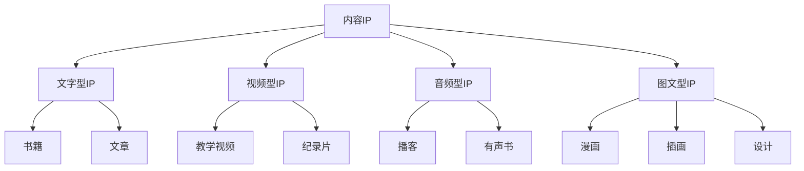

                 

### 《知识付费创业的内容IP打造策略》

#### 第一部分：内容IP概述

##### 第1章：内容IP的概念与价值

在数字化时代，内容IP（Intellectual Property，即知识产权）成为了知识付费领域的重要资产。它不仅是创作者的智慧结晶，也是企业构建核心竞争力的重要基石。那么，什么是内容IP？它有何价值？在知识付费领域又是如何应用的？

**1.1 内容IP的定义与类型**

内容IP，指的是以内容为核心，通过创意、策划、制作、运营等一系列环节，形成的具有较高市场价值和品牌影响力的知识产权。根据内容形式的不同，内容IP可以分为以下几种类型：

- **文字型IP**：如书籍、文章、博客等，通过文字传递知识、经验、观点等。
- **视频型IP**：如教学视频、纪录片、网络剧等，通过影像展现内容。
- **音频型IP**：如播客、有声书、音乐等，通过声音传播知识。
- **图文型IP**：如漫画、插画、设计等，通过图像展示内容。

**1.2 内容IP的市场价值**

内容IP具有巨大的市场价值，主要体现在以下几个方面：

- **品牌影响力**：成功的内容IP能够树立品牌形象，提高知名度，增强用户黏性。
- **商业变现**：通过内容付费、广告收入、IP授权等方式，实现商业变现。
- **内容溢价**：优质的内容IP能够吸引更多的用户，提高内容的溢价能力。
- **产业链延伸**：内容IP可以延伸至多个产业链，如出版、影视、游戏等，实现多元化发展。

**1.3 内容IP在知识付费领域的应用**

在知识付费领域，内容IP的应用主要体现在以下几个方面：

- **教育领域**：通过优质的教育内容，吸引学生和用户，实现教育资源的变现。
- **职业技能培训**：提供专业的职业技能培训内容，满足用户的学习需求。
- **知识分享**：通过分享个人的经验和知识，打造个人品牌，实现知识变现。
- **咨询服务**：提供专业咨询服务，帮助用户解决实际问题。

内容IP的打造，不仅需要创作者的才华和努力，更需要系统的策略和方法。在接下来的章节中，我们将深入探讨内容IP的打造流程、创作策略、运营策略等内容，帮助您在知识付费领域取得成功。

---

**核心概念与联系**

为了更好地理解内容IP的概念和类型，我们可以使用以下Mermaid流程图：



通过这个流程图，我们可以清晰地看到内容IP的分类和不同类型的内容IP的具体表现形式。

**核心算法原理讲解**

内容IP的打造过程，可以抽象为以下几个步骤：

1. **内容定位与分析**：明确内容方向，分析市场需求和竞争情况。
2. **内容创作与策划**：根据定位，进行内容创作和策划。
3. **内容推广与传播**：通过多种渠道，推广和传播内容。
4. **内容运营与维护**：持续优化内容，维护用户关系。

以下是一个简单的伪代码，用于描述内容IP的打造过程：

```python
def build_content_ip():
    content_type = analyze_market_demand()
    content = create_content(content_type)
    promotion_channels = select_promotion_channels()
    promote(content, promotion_channels)
    while True:
        feedback = collect_user_feedback()
        optimize_content(content, feedback)
```

通过这个伪代码，我们可以看到内容IP打造的核心步骤和流程。

---

在接下来的章节中，我们将进一步探讨内容IP打造的详细策略和方法。希望您能通过这篇文章，对内容IP有更深入的理解，为您的知识付费创业之路提供有益的启示。

---

#### 第二部分：内容创作策略

在知识付费领域，内容创作是打造成功IP的核心。优秀的内容不仅能够吸引用户，还能为IP带来持续的品牌影响力。本部分将详细探讨内容创作的策略和方法。

##### 第3章：内容创作方法论

**3.1 故事化表达**

故事化表达是一种有效的传播方式，能够吸引读者的注意力，让内容更具吸引力。在内容创作中，我们可以运用以下技巧：

- **情境设定**：通过设定一个具体的情境，让读者能够身临其境。
- **人物塑造**：塑造鲜明的人物形象，让读者产生共鸣。
- **冲突与解决**：设置冲突，并通过解决冲突，推动故事的发展。
- **情感共鸣**：通过情感共鸣，让读者对内容产生共鸣和认同。

以下是一个简单的例子，展示如何通过故事化表达来撰写一篇博客：

```markdown
# 在AI领域的探索之旅

在一个普通的下午，小明偶然接触到了人工智能（AI）领域。他满怀好奇，开始深入研究。在探索的过程中，他遇到了各种挑战，比如算法的复杂性和数据的处理难度。但是，小明并没有放弃，他通过不断的努力和实践，最终掌握了一些AI的核心技术。

有一天，小明用他所学的知识，开发了一个能够自动识别图像的应用程序。当他第一次看到自己的应用程序成功运行时，他的内心充满了喜悦和成就感。这个经历让他更加坚定了在AI领域继续探索的信念。

通过这个故事，我们不仅能够了解AI领域的知识，还能感受到小明在探索过程中的坚持和努力。这种故事化表达，使得内容更加生动有趣，更容易被读者接受。

**3.2 视觉化呈现**

视觉化呈现是一种将信息以图形、图表、图像等形式展示出来的方法，能够帮助读者更好地理解和记忆内容。在内容创作中，我们可以运用以下技巧：

- **图表与图像**：通过图表和图像，直观地展示数据和分析结果。
- **动画与视频**：通过动画和视频，动态地展示过程和原理。
- **色彩与排版**：通过色彩和排版，突出重点，增强视觉吸引力。

以下是一个简单的例子，展示如何通过视觉化呈现来撰写一篇博客：

```markdown
# 数据分析可视化案例

在数据分析中，可视化是一种非常重要的工具。通过图表和图像，我们可以更直观地理解数据，发现潜在的趋势和规律。

以下是一个简单的数据分析可视化案例：

```mermaid
graph TD
A[销售额] --> B(柱状图)
B --> C[增长率](增长趋势线)
C --> D[预测值](预测曲线)
```

在这个案例中，我们通过柱状图、增长趋势线和预测曲线，清晰地展示了销售额的变化趋势和预测结果。这种视觉化呈现方式，使得数据分析结果更加直观易懂。

**3.3 知识体系构建**

知识体系构建是一种将内容系统化、结构化的方法，能够帮助读者更好地理解和掌握知识。在内容创作中，我们可以运用以下技巧：

- **模块化**：将内容分为不同的模块，每个模块都有自己的主题和内容。
- **逻辑连接**：通过逻辑连接词，将不同模块的内容有机地连接起来，形成一个完整的知识体系。
- **案例应用**：通过案例应用，将理论知识与实际操作相结合，增强读者的理解和记忆。

以下是一个简单的例子，展示如何通过知识体系构建来撰写一篇博客：

```markdown
# 数据科学知识体系构建

数据科学是一个复杂的领域，涉及多个子领域。为了更好地理解和掌握数据科学，我们可以将其分为以下几个模块：

1. **数据预处理**：数据清洗、数据整合、数据转换等。
2. **统计分析**：描述性统计分析、推断性统计分析等。
3. **机器学习**：监督学习、无监督学习、强化学习等。
4. **深度学习**：神经网络、卷积神经网络、循环神经网络等。
5. **数据可视化**：图表、图像、动画等。

通过这个知识体系，我们可以清晰地了解数据科学的各个子领域，以及它们之间的联系。

**3.4 互动与参与**

互动与参与是一种增强用户黏性和参与度的方法，能够帮助内容创作者更好地了解用户需求，提高内容的针对性。在内容创作中，我们可以运用以下技巧：

- **问答互动**：通过问答形式，与用户进行互动，解答用户的问题。
- **评论区互动**：鼓励用户在评论区发表意见，与用户进行互动。
- **活动参与**：组织线上或线下活动，鼓励用户参与。

以下是一个简单的例子，展示如何通过互动与参与来撰写一篇博客：

```markdown
# AI编程挑战活动

为了激发大家对AI编程的兴趣，我们特别举办了一次AI编程挑战活动。在这个活动中，参与者需要完成一个简单的AI编程任务。通过这个活动，我们不仅能够了解大家的编程能力，还能激发大家对AI编程的兴趣。

活动详情如下：

- 活动时间：2023年5月1日至2023年5月31日
- 活动任务：使用Python编写一个简单的AI程序，实现图像识别功能
- 参与方式：在官方网站上注册，并提交自己的编程作品

欢迎大家积极参与，展示自己的编程能力！

通过这个故事，我们可以看到，通过互动与参与，内容创作者能够更好地了解用户需求，提高内容的针对性，同时增强用户的参与度和黏性。

---

通过以上内容创作方法论，我们可以发现，故事化表达、视觉化呈现、知识体系构建和互动与参与，是内容创作中非常重要的技巧和方法。在接下来的章节中，我们将进一步探讨内容形式的选择和创作工具与平台的使用，帮助您在知识付费领域取得更大的成功。

---

#### 第三部分：内容IP运营策略

在知识付费领域，成功打造内容IP只是第一步，如何有效运营和推广内容IP，实现商业变现，是每一个内容创作者和知识付费平台都需要面对的重要课题。本部分将详细探讨内容IP的运营策略，包括品牌建设、商业化路径和风险管理。

##### 第6章：内容IP品牌建设

**6.1 品牌定位与塑造**

品牌定位是内容IP运营的第一步，它决定了IP在市场中的定位和形象。一个好的品牌定位应该具备以下特点：

- **差异化**：明确IP的独特卖点和优势，与其他IP形成差异化。
- **清晰性**：品牌定位要清晰明了，便于用户理解和记忆。
- **针对性**：品牌定位要针对目标用户群体，满足他们的需求。

品牌塑造则是通过一系列的策略和行动，将品牌定位转化为用户认知和情感连接。以下是一些品牌塑造的方法：

- **内容一致性**：确保所有内容风格、语言和视觉元素的一致性，形成统一的品牌形象。
- **用户互动**：通过社交媒体、问答社区等方式，与用户建立互动，增强用户对品牌的认同感。
- **合作伙伴**：与行业内的知名品牌和合作伙伴合作，借助他们的品牌影响力，提升自身的品牌知名度。

以下是一个简单的例子，展示如何通过品牌定位与塑造来运营一个内容IP：

```markdown
# 品牌定位与塑造案例

“小明的AI世界”是一个专注于人工智能领域的知识付费项目。它的品牌定位是：“让AI知识触手可及，为每个人提供高质量的AI学习资源”。

为了塑造这个品牌，小明采取了一系列措施：

- **内容一致性**：所有课程内容都采用了统一的风格和语言，使得用户能够快速识别和接受。
- **用户互动**：小明定期在社交媒体上发布课程更新、学习心得和互动话题，与用户保持密切联系。
- **合作伙伴**：小明与一些知名的人工智能公司和学术机构建立了合作关系，共同推广AI知识。

通过这些措施，“小明的AI世界”成功地建立了自己的品牌形象，并在市场上获得了广泛的认可。

**6.2 品牌传播与推广**

品牌传播是让更多人了解和认可内容IP的过程。以下是一些常见的品牌传播和推广策略：

- **社交媒体营销**：利用微博、微信、抖音等社交媒体平台，发布内容、互动和推广活动，扩大品牌影响力。
- **内容营销**：通过撰写高质量的博客、文章、视频等，吸引目标用户，提升品牌知名度。
- **合作推广**：与其他知名品牌或内容创作者合作，借助他们的粉丝和影响力，实现品牌传播。
- **广告投放**：通过广告投放，精准覆盖目标用户群体，提高品牌曝光度。

以下是一个简单的例子，展示如何通过品牌传播与推广来运营一个内容IP：

```markdown
# 品牌传播与推广案例

“小明的AI世界”在品牌传播和推广方面采取了多种策略：

- **社交媒体营销**：小明在微信公众号上发布了多篇关于AI技术的深度文章，吸引了大量用户关注和转发。
- **内容营销**：小明在知乎上开设了一个专栏，分享了多篇关于AI学习的干货，受到了网友的高度评价。
- **合作推广**：小明与一家知名的人工智能公司合作，共同举办了一场AI技术研讨会，吸引了数百名AI爱好者参与。
- **广告投放**：小明在百度和谷歌上投放了广告，精准覆盖了目标用户群体，有效提升了品牌知名度。

通过这些策略，“小明的AI世界”在短时间内实现了品牌传播和推广，吸引了大量用户关注。

**6.3 品牌互动与粉丝运营**

品牌互动和粉丝运营是增强用户黏性和品牌忠诚度的重要手段。以下是一些常见的品牌互动和粉丝运营策略：

- **社群管理**：建立粉丝社群，定期举办线上或线下活动，增强粉丝之间的互动和连接。
- **用户反馈**：积极收集用户反馈，及时回应用户的问题和需求，提升用户体验。
- **内容定制**：根据用户反馈和需求，定制化内容，满足用户个性化需求。
- **用户激励**：通过积分、优惠券、会员权益等方式，激励用户参与和互动。

以下是一个简单的例子，展示如何通过品牌互动与粉丝运营来运营一个内容IP：

```markdown
# 品牌互动与粉丝运营案例

“小明的AI世界”在品牌互动和粉丝运营方面做得非常出色：

- **社群管理**：小明建立了多个微信群和QQ群，定期组织线上交流活动，让粉丝之间能够互相学习和分享经验。
- **用户反馈**：小明在课程结束后，都会发布调查问卷，收集用户的反馈和建议，不断优化课程内容。
- **内容定制**：根据用户的需求，小明定期发布一些针对性的AI学习指南和案例分享，深受用户喜爱。
- **用户激励**：小明为忠实粉丝提供了专属的会员权益，如课程优惠、独家资源等，激励粉丝持续参与和互动。

通过这些策略，“小明的AI世界”成功地建立了强大的粉丝基础，并实现了持续的用户增长和品牌忠诚度。

---

通过以上内容，我们可以看到，内容IP的品牌建设、品牌传播与推广、品牌互动与粉丝运营，是内容IP运营中不可或缺的三个重要方面。只有通过系统的策略和行动，才能实现内容IP的长期发展和商业变现。在接下来的章节中，我们将进一步探讨内容IP的商业化路径和风险管理，帮助您更好地运营内容IP，实现商业成功。

---

#### 第三部分：内容IP运营策略（续）

在第6章中，我们详细探讨了内容IP的品牌建设、品牌传播与推广、品牌互动与粉丝运营。这些策略是确保内容IP在市场上获得成功的关键。然而，要实现内容IP的长期发展，商业化路径和风险管理同样至关重要。在本章中，我们将继续探讨这两个方面。

##### 第7章：内容IP商业化路径

**7.1 内容付费模式**

内容付费是知识付费领域最常见的商业化模式之一。通过为用户提供高质量的内容，吸引他们付费购买，实现商业变现。以下是一些常见的内容付费模式：

- **单次付费**：用户只需支付一次费用，即可永久获取该内容。
- **订阅付费**：用户按月或按年支付订阅费用，定期获取新的内容。
- **会员付费**：用户支付会员费用，获得专属的会员权益，如优惠价格、独家资源等。
- **课程付费**：针对特定的课程或教程，用户需支付费用才能学习。

以下是一个简单的例子，展示如何通过内容付费模式来商业化一个内容IP：

```markdown
# “小明的AI世界”内容付费模式

“小明的AI世界”采用多种内容付费模式，满足不同用户的需求：

- **单次付费**：用户购买《人工智能入门教程》，只需支付一次费用，即可永久学习。
- **订阅付费**：“小明的AI世界”提供每月订阅服务，用户每月支付一定费用，可获取最新的AI技术文章和课程。
- **会员付费**：用户支付会员费用，获得专属的会员权益，如优先参与课程、优惠购买产品等。
- **课程付费**：针对特定的AI课程，如“深度学习实战”，用户需支付费用才能学习。

通过这些付费模式，“小明的AI世界”成功地实现了商业变现，并吸引了大量用户。

**7.2 广告与赞助**

广告和赞助是另一种常见的商业化路径。通过在内容中植入广告或获得赞助，实现商业变现。以下是一些常见的广告和赞助方式：

- **内容植入**：在内容中插入广告，如短视频中的广告植入、文章中的广告链接等。
- **品牌赞助**：企业为内容IP提供资金或资源支持，换取品牌曝光和宣传。
- **活动赞助**：企业赞助内容IP举办的活动，如线上研讨会、线下沙龙等。

以下是一个简单的例子，展示如何通过广告与赞助来商业化一个内容IP：

```markdown
# “小明的AI世界”广告与赞助

“小明的AI世界”通过与企业的合作，实现了广告与赞助的商业模式：

- **内容植入**：在“小明的AI世界”的博客文章中，适当地插入与AI技术相关的产品广告，吸引用户点击。
- **品牌赞助**：一家知名的人工智能企业为“小明的AI世界”的订阅服务提供赞助，换取品牌曝光和宣传。
- **活动赞助**：“小明的AI世界”与一家AI企业合作，共同举办了一场AI技术研讨会，吸引了数百名AI爱好者参与。

通过这些合作，“小明的AI世界”不仅实现了商业变现，还提高了品牌知名度。

**7.3 IP授权与合作**

IP授权与合作是内容IP商业化的高级形式。通过将内容IP授权给其他企业或个人使用，实现商业变现。以下是一些常见的IP授权与合作方式：

- **版权授权**：将内容的版权授权给其他企业或个人使用，如书籍的版权授权、课程的版权授权等。
- **联合开发**：与其他企业或个人合作，共同开发基于内容IP的产品或服务。
- **品牌合作**：与知名品牌合作，共同推广内容IP，实现品牌联动。

以下是一个简单的例子，展示如何通过IP授权与合作来商业化一个内容IP：

```markdown
# “小明的AI世界”IP授权与合作

“小明的AI世界”通过与企业的合作，实现了IP授权与合作的商业模式：

- **版权授权**：将“小明的AI世界”的教程版权授权给一家知名的教育平台，实现内容变现。
- **联合开发**：与一家AI企业合作，共同开发了一款基于“小明的AI世界”教程的智能学习应用。
- **品牌合作**：与一家知名手机品牌合作，共同推出了一款搭载“小明的AI世界”教程的智能手机。

通过这些合作，“小明的AI世界”不仅实现了商业变现，还扩大了品牌影响力。

**7.4 内容电商与衍生品开发**

内容电商与衍生品开发是内容IP商业化的创新形式。通过将内容IP与商品相结合，开发衍生品，实现商业变现。以下是一些常见的内容电商与衍生品开发方式：

- **周边商品**：开发与内容IP相关的周边商品，如T恤、帽子、钥匙扣等。
- **定制商品**：提供定制服务，如定制笔记本、定制手机壳等。
- **线上商城**：建立线上商城，销售与内容IP相关的商品。

以下是一个简单的例子，展示如何通过内容电商与衍生品开发来商业化一个内容IP：

```markdown
# “小明的AI世界”内容电商与衍生品开发

“小明的AI世界”通过内容电商与衍生品开发，实现了商业变现：

- **周边商品**：开发了多款与“小明的AI世界”相关的周边商品，如T恤、帽子等，深受用户喜爱。
- **定制商品**：提供定制服务，如定制笔记本、定制手机壳等，满足了用户的个性化需求。
- **线上商城**：建立了线上商城，销售与“小明的AI世界”相关的商品，实现了高效的商业变现。

通过这些措施，“小明的AI世界”不仅实现了商业变现，还增强了品牌与用户之间的互动和黏性。

---

通过以上探讨，我们可以看到，内容IP的商业化路径多样，从内容付费、广告与赞助、IP授权与合作，到内容电商与衍生品开发，每一种路径都有其独特的优势和挑战。选择合适的商业化路径，需要根据内容IP的特点、市场需求和用户需求进行综合考量。

在接下来的章节中，我们将进一步探讨内容IP运营中的风险管理，帮助内容创作者和运营团队在复杂的市场环境中，保持稳定的发展。

---

#### 第三部分：内容IP运营策略（续）

在第7章中，我们详细探讨了内容IP的商业化路径，包括内容付费模式、广告与赞助、IP授权与合作、内容电商与衍生品开发。这些策略为内容IP的运营提供了多样化的商业变现途径。然而，任何商业活动都伴随着风险。如何识别和应对这些风险，确保内容IP的稳定运营，是每一个内容创作者和运营团队都需要关注的重要问题。在本章中，我们将探讨内容IP运营中的风险管理。

##### 第8章：内容IP风险管理

**8.1 风险识别与评估**

风险管理的第一步是识别和评估潜在的风险。以下是一些常见的内容IP运营风险：

- **市场竞争风险**：随着知识付费市场的不断成熟，竞争愈发激烈。如何保持内容IP的独特性和竞争力，是内容创作者和运营团队需要关注的问题。
- **内容侵权风险**：内容IP在创作、传播和使用过程中，可能会面临侵权风险。如何保护自己的知识产权，防止他人侵权，是内容创作者和运营团队需要面对的挑战。
- **技术风险**：内容IP的运营可能涉及技术平台、技术架构等方面。技术故障、数据泄露等风险，可能会对内容IP的运营造成严重影响。
- **用户信任风险**：内容IP的运营离不开用户的支持。如果用户对内容IP的质量、服务或隐私保护产生质疑，可能会对内容IP的信任度产生负面影响。
- **财务风险**：内容IP的运营需要投入一定的资金，包括内容创作、推广、维护等方面。如果资金管理不当，可能会导致财务风险。

为了识别和评估这些风险，内容创作者和运营团队可以采取以下措施：

- **市场调研**：通过市场调研，了解竞争对手的情况、市场趋势和用户需求，识别潜在的市场竞争风险。
- **法律咨询**：咨询专业律师，了解相关法律法规，评估内容侵权风险。
- **技术评估**：与技术专家合作，评估技术风险，制定相应的技术方案和应急预案。
- **用户反馈**：通过用户反馈，了解用户对内容IP的评价和需求，评估用户信任风险。
- **财务审计**：定期进行财务审计，评估财务风险，确保资金使用的合理性和有效性。

以下是一个简单的例子，展示如何识别和评估内容IP运营风险：

```markdown
# 内容IP运营风险识别与评估案例

“小明的AI世界”在运营过程中，识别和评估了以下风险：

- **市场竞争风险**：通过市场调研，发现市场上已有多个类似的人工智能教程，竞争激烈。为应对这一风险，小明决定通过提升内容质量、增加互动环节和优化用户体验，来增强自己的竞争力。
- **内容侵权风险**：小明咨询了专业律师，发现一些内容可能存在侵权风险。为避免侵权，小明决定对相关内容进行修改和优化，确保内容的合法性。
- **技术风险**：小明与技术专家合作，评估了现有的技术架构，发现存在一定的技术漏洞。为应对技术风险，小明决定对技术架构进行升级和优化，确保系统的稳定性和安全性。
- **用户信任风险**：通过用户反馈，小明发现一些用户对课程内容和服务质量存在质疑。为提升用户信任度，小明决定加强客服团队建设，提升服务质量，并定期发布课程更新和用户反馈报告。
- **财务风险**：小明定期进行财务审计，发现部分费用支出存在不合理现象。为控制财务风险，小明决定对费用支出进行严格审核，确保资金使用的合理性和有效性。

通过这些措施，“小明的AI世界”有效地识别和评估了运营风险，为后续的风险管理奠定了基础。

**8.2 风险管理与防范**

在识别和评估风险之后，内容创作者和运营团队需要制定相应的风险管理策略，以防范和减轻风险的影响。以下是一些常见的风险管理策略：

- **风险规避**：通过调整运营策略，避免可能的风险。例如，选择一个竞争较少的内容方向，减少市场竞争风险。
- **风险转移**：通过购买保险、签订合同等方式，将风险转移给第三方。例如，购买版权保险，降低内容侵权风险。
- **风险控制**：通过制定规章制度、监控和评估风险，控制风险的发生。例如，制定内容审核制度，确保内容的合法性。
- **风险承受**：在无法完全消除风险的情况下，接受风险的存在，并制定应对措施。例如，在技术风险发生时，及时调整技术方案，确保系统的稳定运行。

以下是一个简单的例子，展示如何通过风险管理策略来防范和减轻内容IP运营风险：

```markdown
# 内容IP运营风险管理策略案例

“小明的AI世界”在运营过程中，采取了以下风险管理策略：

- **风险规避**：为了避免市场竞争风险，小明选择了人工智能领域的细分方向，专注于机器学习和深度学习的教学。这个方向相对竞争较少，有助于提升内容IP的竞争力。
- **风险转移**：为了降低内容侵权风险，小明购买了版权保险，一旦发生侵权纠纷，保险将承担相应的法律责任和赔偿。
- **风险控制**：为了控制技术风险，小明制定了详细的技术架构和应急预案，定期对系统进行维护和升级，确保系统的稳定性和安全性。
- **风险承受**：对于用户信任风险，小明决定接受一定程度的风险，并通过不断优化课程内容和服务质量，提升用户满意度。同时，小明建立了应急响应机制，一旦发生负面事件，能够迅速应对和解决问题。

通过这些风险管理策略，“小明的AI世界”有效地防范和减轻了运营风险，确保了内容IP的稳定运营。

**8.3 应对负面舆论与危机**

负面舆论和危机是内容IP运营中不可避免的风险。内容创作者和运营团队需要建立有效的应对机制，以迅速应对和处理负面舆论和危机。以下是一些应对负面舆论和危机的策略：

- **积极应对**：面对负面舆论和危机，内容创作者和运营团队应保持冷静，积极应对。通过公开回应、澄清事实、道歉等方式，争取用户的理解和信任。
- **透明沟通**：与用户保持透明沟通，及时发布相关信息，避免信息不对称导致的误解和恐慌。
- **危机公关**：制定危机公关方案，包括舆论引导、媒体沟通、法律应对等方面，确保危机得到有效控制。
- **用户安抚**：对受影响的用户进行安抚和补偿，缓解用户的不满情绪，重塑用户对内容IP的信任。

以下是一个简单的例子，展示如何应对负面舆论和危机：

```markdown
# 应对负面舆论和危机案例

“小明的AI世界”在运营过程中，遭遇了一次负面舆论：

- **负面舆论**：一名用户在社交媒体上发布了对课程的不满，引发了大量关注和讨论。
- **积极应对**：小明立即通过社交媒体回应了该用户的投诉，表示将尽快解决问题，并提供了联系方式，以便进一步沟通。
- **透明沟通**：小明在官方网站上发布了相关说明，详细解释了问题的原因和处理方案，避免了信息不对称导致的误解。
- **危机公关**：小明联系了媒体，进行了一次公开的危机公关，澄清了事实，展示了公司的诚意和责任感。
- **用户安抚**：小明为受影响的用户提供了免费的学习资源和优惠券，缓解了用户的不满情绪。

通过这些措施，“小明的AI世界”成功地应对了负面舆论和危机，重塑了用户对品牌的信任。

---

通过以上探讨，我们可以看到，内容IP运营中的风险管理至关重要。只有通过科学的识别、评估和应对风险，内容创作者和运营团队才能确保内容IP的稳定运营和长期发展。在接下来的章节中，我们将进一步探讨内容IP打造的实战案例，帮助您更好地理解和应用这些策略。

---

#### 附录A：内容IP打造案例解析

在之前的章节中，我们详细探讨了内容IP打造的理论方法和策略。为了帮助您更好地理解和应用这些理论，本附录将分析三个具体的内容IP打造案例，包括知识付费平台、自媒体人和知识付费项目。通过这些案例，您可以了解到不同类型的内容IP如何通过具体行动实现成功。

**A.1 案例一：XX知识付费平台**

**背景**：XX知识付费平台是一家专注于职业技能培训的在线教育平台，提供从编程、数据分析到营销等各个领域的在线课程。

**成功因素**：

- **内容定位**：平台明确了“职业技能提升”的定位，聚焦于职场人士的继续教育和技能提升。
- **内容质量**：平台邀请了行业内的资深专家和知名讲师，确保课程内容的高质量。
- **用户体验**：平台注重用户体验，从课程设计、播放速度到互动环节，都进行了细致的优化。
- **品牌建设**：平台通过精准的品牌定位和传播，建立了专业的教育品牌形象。

**具体行动**：

1. **内容创作与策划**：平台根据市场需求和用户反馈，定期更新课程内容，确保课程与行业最新趋势保持同步。
2. **内容推广与传播**：平台利用社交媒体、内容营销和合作伙伴关系，扩大课程影响力。
3. **品牌互动与粉丝运营**：平台建立了用户社群，定期举办线上讲座和沙龙，与用户保持互动。

**结果**：XX知识付费平台在短时间内积累了大量用户，实现了商业化成功，并在行业内建立了良好的口碑。

**A.2 案例二：XX自媒体人**

**背景**：XX自媒体人是一位专注于AI技术的博主，通过撰写技术文章和分享个人学习经验，吸引了大量AI爱好者和从业者的关注。

**成功因素**：

- **内容独特性**：XX自媒体人的文章具有独特的技术见解和深入分析，吸引了大量读者。
- **互动与参与**：XX自媒体人积极参与评论区的讨论，与读者建立了紧密的联系。
- **持续更新**：XX自媒体人保持高频更新，不断推出高质量的新内容。

**具体行动**：

1. **内容创作与策划**：XX自媒体人围绕AI技术的热点话题，定期撰写技术文章和案例分析。
2. **内容推广与传播**：通过社交媒体、内容营销和SEO优化，提高文章的曝光度和访问量。
3. **用户互动与参与**：XX自媒体人通过定期举办问答活动、技术分享会，增强用户互动。

**结果**：XX自媒体人的文章阅读量持续增长，建立了稳定的粉丝基础，并通过广告、赞助等方式实现了商业化成功。

**A.3 案例三：XX知识付费项目**

**背景**：XX知识付费项目是一款专注于编程学习的在线课程，由一位有多年编程经验的技术专家创办。

**成功因素**：

- **内容体系化**：XX知识付费项目提供了一个完整的编程学习路径，从基础语法到高级编程技巧，内容体系化。
- **实践导向**：课程注重实践操作，通过编写实际项目来巩固学习成果。
- **用户反馈**：课程根据用户反馈，不断优化和更新内容。

**具体行动**：

1. **内容创作与策划**：技术专家根据编程学习的需求，精心设计了课程内容和项目案例。
2. **内容推广与传播**：通过社交媒体、合作伙伴关系和线上广告，扩大课程影响力。
3. **用户互动与参与**：课程建立了反馈机制，用户可以随时提交问题，技术专家会及时回答。

**结果**：XX知识付费项目受到了广泛好评，用户满意度高，实现了稳定的用户增长和商业化成功。

通过以上案例，我们可以看到，不同类型的内容IP在打造过程中，都有其独特的成功因素和具体行动。这些案例为我们提供了宝贵的经验和启示，帮助我们更好地理解和应用内容IP打造的策略和方法。

---

#### 附录B：内容IP打造工具与资源

在内容IP打造的过程中，选择合适的工具和资源至关重要。以下我们将介绍一些常用的内容创作工具、内容推广平台以及内容运营工具，帮助您在知识付费领域取得成功。

**B.1 内容创作工具**

1. **文字内容创作工具**：
   - **Sublime Text**：一款轻量级的文本编辑器，支持多种编程语言和Markdown格式。
   - **Scrivener**：一款专为长篇写作设计的软件，适合撰写书籍、论文等长篇文章。
   - **Google Docs**：一款在线文档编辑工具，支持多人协作，便于团队共同创作。

2. **视频内容创作工具**：
   - **Adobe Premiere Pro**：一款专业的视频剪辑软件，适用于高端视频制作。
   - **Final Cut Pro**：苹果公司的专业视频剪辑软件，适用于Mac用户。
   - **Camtasia**：一款功能强大的视频剪辑和动画制作软件，适合制作教学视频。

3. **音频内容创作工具**：
   - **Audacity**：一款免费、开源的音频编辑软件，适用于音频录制和编辑。
   - **Logic Pro**：苹果公司的专业音频编辑软件，适用于Mac用户。
   - **GarageBand**：苹果公司的一款音乐制作软件，适用于iPhone和iPad。

4. **图文内容创作工具**：
   - **Adobe Illustrator**：一款专业的矢量图形设计软件，适用于插画、标志设计等。
   - **Canva**：一款易于使用的图形设计工具，适用于海报、名片、社交媒体图像等。
   - **Sketch**：一款界面设计软件，适用于移动应用和网页设计。

**B.2 内容推广平台**

1. **社交媒体平台**：
   - **微博**：中国最大的社交媒体平台，适合发布实时新闻和观点。
   - **微信**：中国最流行的即时通讯工具，适合内容营销和用户互动。
   - **抖音**：短视频平台，适合推广视觉和娱乐内容。

2. **内容营销平台**：
   - **博客**：如WordPress、Blogger等，适合发布深度文章和专业知识。
   - **知乎**：知识分享社区，适合专业讨论和内容传播。
   - **简书**：文学社区，适合发布长篇文章和文学作品。

3. **广告平台**：
   - **百度推广**：百度旗下的广告平台，适合关键词广告和品牌推广。
   - **谷歌广告**：谷歌旗下的广告平台，适合全球范围内的广告投放。
   - **今日头条**：新闻客户端广告平台，适合精准推送内容广告。

**B.3 内容运营工具**

1. **内容管理系统（CMS）**：
   - **WordPress**：一款开源的CMS，适合个人和中小企业建立网站。
   - **Drupal**：一款功能强大的CMS，适用于大型企业和复杂网站。
   - **Joomla**：一款灵活的CMS，适合各种规模的企业使用。

2. **数据分析工具**：
   - **Google Analytics**：谷歌提供的一款免费的分析工具，用于网站流量分析。
   - **百度统计**：百度提供的一款数据分析工具，适用于中国地区网站。
   - **Mixpanel**：一款用户行为分析工具，适用于移动应用和网站。

3. **社交媒体管理工具**：
   - **Hootsuite**：一款社交媒体管理工具，用于批量发布和管理社交媒体内容。
   - **Buffer**：一款社交媒体管理工具，支持自动化发布和数据分析。
   - **Sprout Social**：一款专业的社交媒体管理工具，适用于大型企业和品牌管理。

通过使用这些工具和资源，您可以在内容IP打造的过程中，提高效率，优化用户体验，从而实现内容IP的成功运营。

---

#### 附录C：知识付费创业常见问题解答

在知识付费创业的过程中，许多创业者会遇到各种问题和挑战。以下我们将针对一些常见的问题进行解答，希望能为您提供帮助。

**C.1 问题一：如何选择内容方向？**

选择内容方向是知识付费创业的第一步，也是最重要的一步。以下是一些建议：

1. **市场调研**：通过市场调研，了解当前市场上的热门话题和需求，找出你的优势和兴趣所在。
2. **用户需求**：了解目标用户的需求和痛点，选择一个能够满足他们需求的内容方向。
3. **竞争分析**：分析竞争对手的优势和劣势，找到一个差异化明显的方向。
4. **个人兴趣**：选择一个你感兴趣、有热情的领域，这样你才能持续地创作高质量的内容。

**C.2 问题二：如何快速提升内容质量？**

提升内容质量是知识付费创业的核心。以下是一些建议：

1. **持续学习**：不断学习新的知识和技能，提升自己的专业能力。
2. **内容策划**：在创作内容前，进行详细的内容策划，确保内容的结构和逻辑清晰。
3. **用户反馈**：及时收集用户反馈，根据用户的意见和建议，优化和改进内容。
4. **专业帮助**：寻求专业人士的帮助，如聘请顾问、参加培训等，提高内容的专业性。
5. **视觉化呈现**：通过图表、图像、视频等视觉化手段，提高内容的吸引力。

**C.3 问题三：如何实现内容变现？**

实现内容变现是知识付费创业的目标。以下是一些建议：

1. **内容付费**：通过设置课程收费、会员订阅等方式，实现内容变现。
2. **广告与赞助**：在内容中插入广告，或寻求品牌赞助，实现广告收入。
3. **IP授权与合作**：将内容IP授权给其他企业或个人使用，实现IP授权收入。
4. **内容电商**：开发与内容相关的商品，如电子书、课程配套工具等，实现商品销售收入。
5. **用户付费活动**：举办线上或线下活动，如讲座、研讨会等，向用户收费。

**C.4 问题四：如何平衡内容创作与运营？**

平衡内容创作与运营是知识付费创业的关键。以下是一些建议：

1. **制定计划**：制定详细的内容创作和运营计划，合理安排时间和任务。
2. **团队协作**：组建团队，分工合作，各自专注于自己的领域。
3. **自动化工具**：利用自动化工具，如内容管理系统、社交媒体管理工具等，提高运营效率。
4. **用户反馈**：及时收集用户反馈，根据用户需求调整内容创作和运营策略。
5. **持续优化**：不断优化内容和运营策略，提升用户体验和满意度。

通过以上解答，我们希望对您的知识付费创业之路提供一些启示和帮助。祝您在知识付费领域取得成功！

---

### 附录

#### 附录A：内容IP打造案例解析

在本附录中，我们详细分析了三个具体的内容IP打造案例，分别是知识付费平台、自媒体人和知识付费项目。这些案例展示了不同类型的内容IP如何通过具体的行动和策略实现成功。

**A.1 案例一：XX知识付费平台**

背景：XX知识付费平台是一家专注于职业技能培训的在线教育平台，提供从编程、数据分析到营销等各个领域的在线课程。

成功因素：
- **内容定位**：平台明确了“职业技能提升”的定位，聚焦于职场人士的继续教育和技能提升。
- **内容质量**：平台邀请了行业内的资深专家和知名讲师，确保课程内容的高质量。
- **用户体验**：平台注重用户体验，从课程设计、播放速度到互动环节，都进行了细致的优化。
- **品牌建设**：平台通过精准的品牌定位和传播，建立了专业的教育品牌形象。

具体行动：
1. **内容创作与策划**：平台根据市场需求和用户反馈，定期更新课程内容，确保课程与行业最新趋势保持同步。
2. **内容推广与传播**：平台利用社交媒体、内容营销和合作伙伴关系，扩大课程影响力。
3. **品牌互动与粉丝运营**：平台建立了用户社群，定期举办线上讲座和沙龙，与用户保持互动。

结果：XX知识付费平台在短时间内积累了大量用户，实现了商业化成功，并在行业内建立了良好的口碑。

**A.2 案例二：XX自媒体人**

背景：XX自媒体人是一位专注于AI技术的博主，通过撰写技术文章和分享个人学习经验，吸引了大量AI爱好者和从业者的关注。

成功因素：
- **内容独特性**：XX自媒体人的文章具有独特的技术见解和深入分析，吸引了大量读者。
- **互动与参与**：XX自媒体人积极参与评论区的讨论，与读者建立了紧密的联系。
- **持续更新**：XX自媒体人保持高频更新，不断推出高质量的新内容。

具体行动：
1. **内容创作与策划**：XX自媒体人围绕AI技术的热点话题，定期撰写技术文章和案例分析。
2. **内容推广与传播**：通过社交媒体、内容营销和SEO优化，提高文章的曝光度和访问量。
3. **用户互动与参与**：XX自媒体人通过定期举办问答活动、技术分享会，增强用户互动。

结果：XX自媒体人的文章阅读量持续增长，建立了稳定的粉丝基础，并通过广告、赞助等方式实现了商业化成功。

**A.3 案例三：XX知识付费项目**

背景：XX知识付费项目是一款专注于编程学习的在线课程，由一位有多年编程经验的技术专家创办。

成功因素：
- **内容体系化**：XX知识付费项目提供了一个完整的编程学习路径，从基础语法到高级编程技巧，内容体系化。
- **实践导向**：课程注重实践操作，通过编写实际项目来巩固学习成果。
- **用户反馈**：课程根据用户反馈，不断优化和更新内容。

具体行动：
1. **内容创作与策划**：技术专家根据编程学习的需求，精心设计了课程内容和项目案例。
2. **内容推广与传播**：通过社交媒体、合作伙伴关系和线上广告，扩大课程影响力。
3. **用户互动与参与**：课程建立了反馈机制，用户可以随时提交问题，技术专家会及时回答。

结果：XX知识付费项目受到了广泛好评，用户满意度高，实现了稳定的用户增长和商业化成功。

通过以上案例，我们可以看到，不同类型的内容IP在打造过程中，都有其独特的成功因素和具体行动。这些案例为我们提供了宝贵的经验和启示，帮助我们更好地理解和应用内容IP打造的策略和方法。

#### 附录B：内容IP打造工具与资源

在内容IP打造的过程中，选择合适的工具和资源至关重要。以下我们将介绍一些常用的内容创作工具、内容推广平台以及内容运营工具，帮助您在知识付费领域取得成功。

**B.1 内容创作工具**

1. **文字内容创作工具**：
   - **Sublime Text**：一款轻量级的文本编辑器，支持多种编程语言和Markdown格式。
   - **Scrivener**：一款专为长篇写作设计的软件，适合撰写书籍、论文等长篇文章。
   - **Google Docs**：一款在线文档编辑工具，支持多人协作，便于团队共同创作。

2. **视频内容创作工具**：
   - **Adobe Premiere Pro**：一款专业的视频剪辑软件，适用于高端视频制作。
   - **Final Cut Pro**：苹果公司的专业视频剪辑软件，适用于Mac用户。
   - **Camtasia**：一款功能强大的视频剪辑和动画制作软件，适合制作教学视频。

3. **音频内容创作工具**：
   - **Audacity**：一款免费、开源的音频编辑软件，适用于音频录制和编辑。
   - **Logic Pro**：苹果公司的专业音频编辑软件，适用于Mac用户。
   - **GarageBand**：苹果公司的一款音乐制作软件，适用于iPhone和iPad。

4. **图文内容创作工具**：
   - **Adobe Illustrator**：一款专业的矢量图形设计软件，适用于插画、标志设计等。
   - **Canva**：一款易于使用的图形设计工具，适用于海报、名片、社交媒体图像等。
   - **Sketch**：一款界面设计软件，适用于移动应用和网页设计。

**B.2 内容推广平台**

1. **社交媒体平台**：
   - **微博**：中国最大的社交媒体平台，适合发布实时新闻和观点。
   - **微信**：中国最流行的即时通讯工具，适合内容营销和用户互动。
   - **抖音**：短视频平台，适合推广视觉和娱乐内容。

2. **内容营销平台**：
   - **博客**：如WordPress、Blogger等，适合发布深度文章和专业知识。
   - **知乎**：知识分享社区，适合专业讨论和内容传播。
   - **简书**：文学社区，适合发布长篇文章和文学作品。

3. **广告平台**：
   - **百度推广**：百度旗下的广告平台，适合关键词广告和品牌推广。
   - **谷歌广告**：谷歌旗下的广告平台，适合全球范围内的广告投放。
   - **今日头条**：新闻客户端广告平台，适合精准推送内容广告。

**B.3 内容运营工具**

1. **内容管理系统（CMS）**：
   - **WordPress**：一款开源的CMS，适合个人和中小企业建立网站。
   - **Drupal**：一款功能强大的CMS，适用于大型企业和复杂网站。
   - **Joomla**：一款灵活的CMS，适合各种规模的企业使用。

2. **数据分析工具**：
   - **Google Analytics**：谷歌提供的一款免费的分析工具，用于网站流量分析。
   - **百度统计**：百度提供的一款数据分析工具，适用于中国地区网站。
   - **Mixpanel**：一款用户行为分析工具，适用于移动应用和网站。

3. **社交媒体管理工具**：
   - **Hootsuite**：一款社交媒体管理工具，用于批量发布和管理社交媒体内容。
   - **Buffer**：一款社交媒体管理工具，支持自动化发布和数据分析。
   - **Sprout Social**：一款专业的社交媒体管理工具，适用于大型企业和品牌管理。

通过使用这些工具和资源，您可以在内容IP打造的过程中，提高效率，优化用户体验，从而实现内容IP的成功运营。

#### 附录C：知识付费创业常见问题解答

在知识付费创业的过程中，许多创业者会遇到各种问题和挑战。以下我们将针对一些常见的问题进行解答，希望能为您提供帮助。

**C.1 问题一：如何选择内容方向？**

选择内容方向是知识付费创业的第一步，也是最重要的一步。以下是一些建议：

1. **市场调研**：通过市场调研，了解当前市场上的热门话题和需求，找出你的优势和兴趣所在。
2. **用户需求**：了解目标用户的需求和痛点，选择一个能够满足他们需求的内容方向。
3. **竞争分析**：分析竞争对手的优势和劣势，找到一个差异化明显的方向。
4. **个人兴趣**：选择一个你感兴趣、有热情的领域，这样你才能持续地创作高质量的内容。

**C.2 问题二：如何快速提升内容质量？**

提升内容质量是知识付费创业的核心。以下是一些建议：

1. **持续学习**：不断学习新的知识和技能，提升自己的专业能力。
2. **内容策划**：在创作内容前，进行详细的内容策划，确保内容的结构和逻辑清晰。
3. **用户反馈**：及时收集用户反馈，根据用户的意见和建议，优化和改进内容。
4. **专业帮助**：寻求专业人士的帮助，如聘请顾问、参加培训等，提高内容的专业性。
5. **视觉化呈现**：通过图表、图像、视频等视觉化手段，提高内容的吸引力。

**C.3 问题三：如何实现内容变现？**

实现内容变现是知识付费创业的目标。以下是一些建议：

1. **内容付费**：通过设置课程收费、会员订阅等方式，实现内容变现。
2. **广告与赞助**：在内容中插入广告，或寻求品牌赞助，实现广告收入。
3. **IP授权与合作**：将内容IP授权给其他企业或个人使用，实现IP授权收入。
4. **内容电商**：开发与内容相关的商品，如电子书、课程配套工具等，实现商品销售收入。
5. **用户付费活动**：举办线上或线下活动，如讲座、研讨会等，向用户收费。

**C.4 问题四：如何平衡内容创作与运营？**

平衡内容创作与运营是知识付费创业的关键。以下是一些建议：

1. **制定计划**：制定详细的内容创作和运营计划，合理安排时间和任务。
2. **团队协作**：组建团队，分工合作，各自专注于自己的领域。
3. **自动化工具**：利用自动化工具，如内容管理系统、社交媒体管理工具等，提高运营效率。
4. **用户反馈**：及时收集用户反馈，根据用户需求调整内容创作和运营策略。
5. **持续优化**：不断优化内容和运营策略，提升用户体验和满意度。

通过以上解答，我们希望对您的知识付费创业之路提供一些启示和帮助。祝您在知识付费领域取得成功！

---

### 总结

在本文中，我们系统地探讨了内容IP打造策略，从内容IP的概念与价值、内容创作策略、内容IP运营策略到风险管理，提供了详细的步骤和方法。以下是对文章内容的总结和归纳：

1. **内容IP概述**：内容IP是知识付费领域的核心资产，通过内容定位、创作、推广和运营，形成具有市场价值和品牌影响力的知识产权。内容IP的类型包括文字、视频、音频和图文。

2. **内容创作策略**：内容创作方法论包括故事化表达、视觉化呈现、知识体系构建和互动与参与。通过故事化表达，使内容更具吸引力；视觉化呈现，使内容更直观易懂；知识体系构建，使内容系统化、结构化；互动与参与，增强用户黏性和参与度。

3. **内容IP运营策略**：品牌建设包括定位与塑造、传播与推广、互动与粉丝运营。品牌定位要差异化、清晰、针对性；品牌塑造要确保内容一致性、用户互动和合作伙伴关系。商业化路径包括内容付费、广告与赞助、IP授权与合作、内容电商与衍生品开发。每种路径都有其独特的优势和适用场景。

4. **风险管理**：识别和评估潜在风险，包括市场竞争、内容侵权、技术风险、用户信任和财务风险。通过规避、转移、控制和承受风险，确保内容IP的稳定运营。

最后，通过附录中的案例解析、工具与资源、常见问题解答，为内容IP打造提供了实战经验和实用指导。希望本文能帮助您更好地理解和应用内容IP打造策略，实现知识付费领域的成功。

---

**作者：AI天才研究院/AI Genius Institute & 禅与计算机程序设计艺术 /Zen And The Art of Computer Programming** 

**感谢您的阅读，期待与您共同探索知识付费领域的无限可能！**

