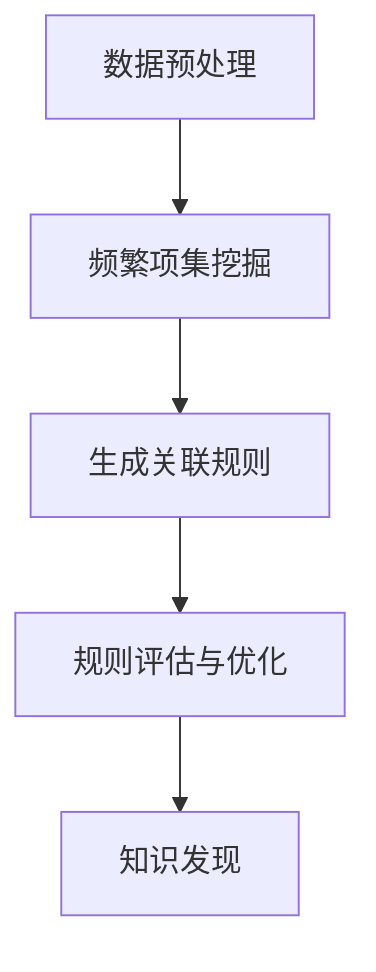
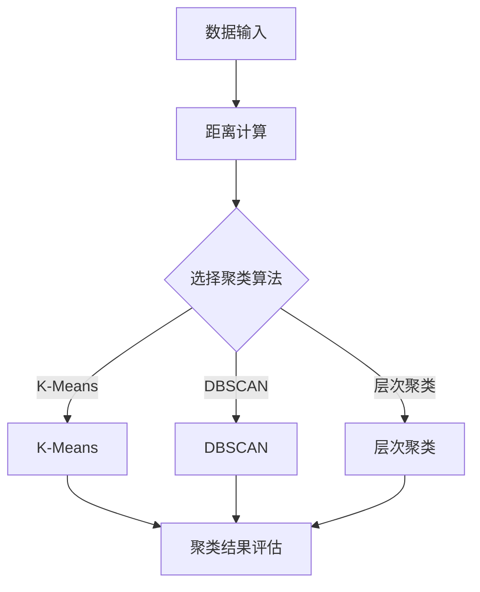
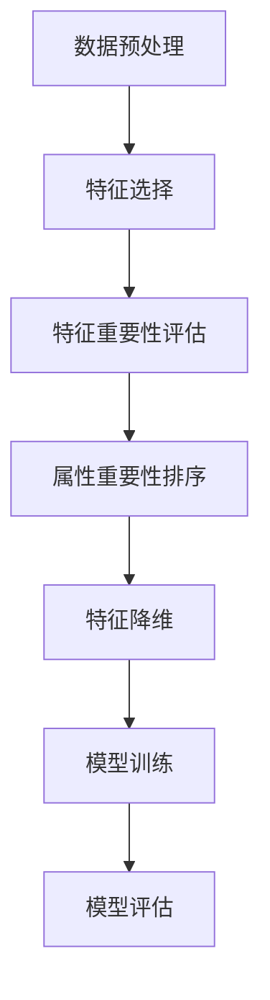

                 

# 《知识发现引擎在农业科技中的应用》

## 关键词
知识发现引擎，农业科技，数据分析，数据挖掘，算法，模型，实践，应用前景

## 摘要
本文深入探讨了知识发现引擎在农业科技领域的应用。首先，介绍了知识发现引擎的基本概念、发展历程和核心技术，包括关联规则算法、聚类分析算法和属性重要性算法。随后，详细讲解了数学模型和公式，并使用伪代码进行了核心算法的原理阐述。接下来，通过四个项目实战，展示了知识发现引擎在农业监测、产量预测、病虫害预测和资源管理中的具体应用，包括开发环境搭建、代码实现和解读。最后，总结了实践中的经验和教训，并对知识发现引擎在农业科技中的应用前景进行了展望。

### 目录大纲

# 《知识发现引擎在农业科技中的应用》

## 第一部分：知识发现引擎基础

### 第1章：知识发现引擎概述

#### 1.1 知识发现引擎的定义与作用

#### 1.2 知识发现引擎的发展历程

#### 1.3 知识发现引擎的核心技术

### 第2章：知识发现引擎的核心算法

#### 2.1 数据预处理技术

#### 2.2 关联规则算法

#### 2.3 聚类分析算法

#### 2.4 属性重要性算法

### 第3章：知识发现引擎在农业科技中的应用

#### 3.1 农业科技中的数据需求

#### 3.2 知识发现引擎在农业科技中的应用案例

#### 3.3 农业科技中知识发现引擎的优势与挑战

## 第二部分：农业科技中的知识发现引擎应用实践

### 第4章：知识发现引擎在农业监测中的应用

#### 4.1 农业监测数据的收集与处理

#### 4.2 基于知识发现引擎的农业监测分析

#### 4.3 农业监测应用案例解析

### 第5章：知识发现引擎在农业产量预测中的应用

#### 5.1 农业产量预测的数据来源

#### 5.2 基于知识发现引擎的农业产量预测方法

#### 5.3 农业产量预测应用案例

### 第6章：知识发现引擎在农业病虫害预测中的应用

#### 6.1 农业病虫害预测的数据分析

#### 6.2 基于知识发现引擎的农业病虫害预测方法

#### 6.3 农业病虫害预测应用案例

### 第7章：知识发现引擎在农业资源管理中的应用

#### 7.1 农业资源管理的挑战与需求

#### 7.2 基于知识发现引擎的农业资源管理方法

#### 7.3 农业资源管理应用案例

## 第三部分：知识发现引擎在农业科技中的应用前景与挑战

### 第8章：知识发现引擎在农业科技中的应用前景

#### 8.1 知识发现引擎在农业科研中的应用

#### 8.2 知识发现引擎在农业产业中的应用

#### 8.3 知识发现引擎在农业国际竞争中的应用

### 第9章：知识发现引擎在农业科技中的应用挑战

#### 9.1 数据隐私与安全问题

#### 9.2 知识发现引擎的可靠性问题

#### 9.3 知识发现引擎的可持续性问题

## 附录

### 附录A：知识发现引擎在农业科技中的应用工具与资源

#### A.1 开源数据集

#### A.2 开源代码库

#### A.3 学术论文与文献

### 附录B：知识发现引擎算法流程图

#### B.1 关联规则算法

#### B.2 聚类分析算法

#### B.3 属性重要性算法

### 附录C：知识发现引擎项目实战案例

#### C.1 农业监测项目

#### C.2 农业产量预测项目

#### C.3 农业病虫害预测项目

#### C.4 农业资源管理项目

### 第一部分：知识发现引擎基础

### 第1章：知识发现引擎概述

#### 1.1 知识发现引擎的定义与作用

知识发现引擎（Knowledge Discovery Engine，简称KDE）是一种基于数据挖掘和人工智能技术的计算系统，旨在从大量数据中自动提取出潜在的有用信息和知识。在农业科技领域，知识发现引擎的作用至关重要。

**定义：**
知识发现引擎是通过对数据进行挖掘和分析，自动发现数据中隐藏的关联性、趋势和模式，从而为决策者提供支持。它结合了数据预处理、特征提取、关联规则挖掘、聚类分析、分类预测等多种算法和技术。

**作用：**
1. **提高决策效率：** 农业是一个数据密集型行业，知识发现引擎可以帮助农民从海量的农业数据中快速提取出有价值的信息，辅助决策。
2. **优化资源利用：** 通过分析土壤、气候、作物生长等数据，知识发现引擎可以帮助农民优化灌溉、施肥等资源利用，提高农业生产效率。
3. **预测病虫害：** 知识发现引擎可以分析历史病虫害数据，预测未来可能发生的病虫害，提前采取防治措施，减少损失。
4. **促进科研创新：** 农业科研需要大量的数据支持，知识发现引擎可以帮助研究人员从海量数据中发现新的规律和趋势，推动科研进展。

#### 1.2 知识发现引擎的发展历程

知识发现引擎的发展可以追溯到20世纪80年代，随着计算机技术的飞速发展，数据挖掘和机器学习技术的出现，知识发现引擎逐渐成为研究热点。以下是知识发现引擎的发展历程：

1. **早期研究（1980s-1990s）：** 数据挖掘和机器学习技术的初步探索，学者们开始关注如何从大量数据中提取有价值的信息。
2. **快速发展期（2000-2010）：** 随着互联网和电子商务的兴起，数据量呈爆炸式增长，知识发现引擎技术得到了广泛应用。
3. **深度学习时代（2010至今）：** 深度学习技术的突破，使得知识发现引擎在图像、语音、自然语言处理等领域的应用取得了显著进展。

#### 1.3 知识发现引擎的核心技术

知识发现引擎的核心技术包括数据预处理、特征提取、关联规则挖掘、聚类分析、分类预测等。以下是这些技术的简要介绍：

1. **数据预处理：** 数据预处理是知识发现的第一步，包括数据清洗、数据集成、数据转换等。其目的是将原始数据转化为适合分析的形式。
   
2. **特征提取：** 特征提取是从原始数据中提取出对问题解决有帮助的特征。特征提取的质量直接影响知识发现的效果。

3. **关联规则挖掘：** 关联规则挖掘是一种发现数据集中项集之间的关联关系的方法。例如，在农业领域，可以挖掘出哪些作物在同一地区种植的概率较高。

4. **聚类分析：** 聚类分析是将数据集划分为若干个相似的簇。在农业中，可以用于分析不同作物的生长模式。

5. **分类预测：** 分类预测是基于历史数据对未知数据进行分类。例如，可以预测某地区的农作物是否会受到病虫害的影响。

#### 1.4 本章小结

本章介绍了知识发现引擎的基本概念、发展历程和核心技术。知识发现引擎在农业科技中具有广泛的应用前景，通过数据挖掘和人工智能技术，可以帮助农民提高决策效率、优化资源利用、预测病虫害和促进科研创新。

### 第2章：知识发现引擎的核心算法

#### 2.1 数据预处理技术

数据预处理是知识发现过程中的关键步骤，它直接影响后续挖掘和分析的结果。数据预处理包括数据清洗、数据集成、数据转换和数据归一化等。

**数据清洗：**
数据清洗是指识别并纠正数据集中的错误、异常和不完整数据。常见的数据清洗方法包括缺失值处理、异常值处理和重复值处理。

- **缺失值处理：** 缺失值处理方法包括填充法（例如平均值、中值、众数填充）和删除法（例如删除包含缺失值的记录）。
- **异常值处理：** 异常值处理方法包括过滤法（例如删除异常值）和变换法（例如缩放、取对数）。
- **重复值处理：** 重复值处理是指识别并删除数据集中的重复记录。

**数据集成：**
数据集成是将来自多个数据源的数据合并为一个统一的数据集。常见的数据集成方法包括数据合并、数据聚合和数据消除。

- **数据合并：** 数据合并是将多个数据源中的数据按照某种规则合并为一个数据集。
- **数据聚合：** 数据聚合是将多个数据源中的数据按照某种方式聚合，例如计算平均值、总和等。
- **数据消除：** 数据消除是指识别并删除数据集中的重复数据。

**数据转换：**
数据转换是指将数据从一种形式转换为另一种形式，以便更好地进行分析。常见的数据转换方法包括数据归一化、数据标准化和数据离散化。

- **数据归一化：** 数据归一化是指将数据缩放到相同的尺度，例如将所有数据缩放到[0, 1]或[-1, 1]区间。
- **数据标准化：** 数据标准化是指将数据按照某种标准进行变换，例如减去平均值并除以标准差。
- **数据离散化：** 数据离散化是指将连续数据转换为离散数据，例如将连续的数值数据转换为分类数据。

**数据归一化技术：**
数据归一化技术在数据预处理中非常重要，它有助于消除不同特征之间的尺度差异，使得算法能够更加公平地对待每个特征。以下是几种常见的数据归一化技术：

- **最小-最大规范化（Min-Max Scaling）：**
  $$x_{\text{norm}} = \frac{x - x_{\text{min}}}{x_{\text{max}} - x_{\text{min}}}$$
  其中，$x_{\text{min}}$ 和 $x_{\text{max}}$ 分别是特征值的最大值和最小值。

- **Z-Score规范化（Standardization）：**
  $$x_{\text{norm}} = \frac{x - \mu}{\sigma}$$
  其中，$\mu$ 是特征的均值，$\sigma$ 是特征的标准差。

- **小数点移动（Decimal Scaling）：**
  $$x_{\text{norm}} = \frac{x}{10^p}$$
  其中，$p$ 是使得所有特征值都在[1, 10]区间的指数。

**实例分析：**
假设有一个包含三个特征的数据集，其中每个特征的取值范围如下：
- 特征A：[1, 100]
- 特征B：[10, 1000]
- 特征C：[1, 100]

我们使用最小-最大规范化技术对数据集进行归一化，得到归一化后的数据如下：
- 特征A：[0, 1]
- 特征B：[0, 1]
- 特征C：[0, 1]

通过数据归一化，我们可以确保每个特征在相同的尺度上，从而避免某些特征对算法产生过大的影响。

#### 2.2 关联规则算法

关联规则算法是知识发现中的关键技术，它用于发现数据集中不同项集之间的关联关系。常见的关联规则算法包括Apriori算法和FP-growth算法。

**Apriori算法：**
Apriori算法是一种基于布尔逻辑的关联规则挖掘算法，它通过递归地枚举所有频繁项集，然后生成关联规则。算法的核心步骤包括以下几步：

1. **计算支持度：**
   - 对于每个项集，计算其在数据集中的支持度（即包含该项集的事务数量与总事务数量的比例）。
   - 移除支持度低于最小支持度阈值的事务。

2. **生成频繁项集：**
   - 递归地枚举所有可能的项集，并计算其支持度。
   - 移除非频繁项集。

3. **生成关联规则：**
   - 对于每个频繁项集，生成其对应的关联规则。
   - 计算关联规则的置信度（即规则后件的支持度与规则前件和后件的支持度之和的比值）。

4. **剪枝和优化：**
   - 移除置信度低于最小置信度阈值的不感兴趣规则。

**FP-growth算法：**
FP-growth算法是一种基于FP树（频繁模式树）的关联规则挖掘算法，它通过压缩项集和递归挖掘频繁模式来减少计算量。算法的核心步骤包括以下几步：

1. **构建FP树：**
   - 将数据集中的项集按照支持度排序，并构建FP树。

2. **递归挖掘频繁模式：**
   - 对于FP树中的每个节点，递归地挖掘频繁模式。
   - 将频繁模式压缩为项集，并递归地挖掘下一层。

3. **生成关联规则：**
   - 对于每个频繁项集，生成其对应的关联规则。
   - 计算关联规则的置信度。

**伪代码示例（Apriori算法）：**
python
def apriori(data, min_support, min_confidence):
    # 计算频繁项集
    frequent_itemsets = find_frequent_itemsets(data, min_support)
    # 生成关联规则
    rules = generate_rules(frequent_itemsets, min_confidence)
    return rules

def find_frequent_itemsets(data, min_support):
    # 计算支持度
    support_counts = count_support(data)
    # 移除非频繁项集
    frequent_itemsets = []
    for itemset in support_counts:
        if support_counts[itemset] >= min_support:
            frequent_itemsets.append(itemset)
    return frequent_itemsets

def generate_rules(frequent_itemsets, min_confidence):
    # 生成关联规则
    rules = []
    for itemset in frequent_itemsets:
        for rule in generate_single_rule(itemset):
            if confidence(rule) >= min_confidence:
                rules.append(rule)
    return rules

def generate_single_rule(itemset):
    # 生成单个关联规则
    rules = []
    for i in range(1, len(itemset)):
        rule = (itemset[:i], itemset[i:])
        rules.append(rule)
    return rules

def confidence(rule):
    # 计算关联规则的置信度
    antecedent, consequent = rule
    return support(antecedent.union(consequent)) / support(antecedent)

**伪代码示例（FP-growth算法）：**
python
def fp_growth(data, min_support, min_confidence):
    # 构建FP树
    fp_tree = build_fp_tree(data)
    # 递归挖掘频繁模式
    frequent_patterns = mine_frequent_patterns(fp_tree, min_support)
    # 生成关联规则
    rules = generate_rules(frequent_patterns, min_confidence)
    return rules

def build_fp_tree(data):
    # 构建FP树
    sorted_items = sort_items(data)
    return build_tree(sorted_items, data)

def mine_frequent_patterns(fp_tree, min_support):
    # 递归挖掘频繁模式
    patterns = []
    for node in fp_tree.get_leaves():
        pattern = extract_pattern(node)
        if support(pattern) >= min_support:
            patterns.append(pattern)
            for subset in subsets(pattern):
                patterns.extend(mine_frequent_patterns(fp_tree, subset, min_support))
    return patterns

def generate_rules(frequent_patterns, min_confidence):
    # 生成关联规则
    rules = []
    for pattern in frequent_patterns:
        for rule in generate_single_rule(pattern):
            if confidence(rule) >= min_confidence:
                rules.append(rule)
    return rules

def generate_single_rule(pattern):
    # 生成单个关联规则
    rules = []
    for i in range(1, len(pattern)):
        rule = (pattern[:i], pattern[i:])
        rules.append(rule)
    return rules

def confidence(rule):
    # 计算关联规则的置信度
    antecedent, consequent = rule
    return support(antecedent.union(consequent)) / support(antecedent)

**实例分析：**
假设有一个包含购物篮数据的数据集，如下所示：

| 购物篮 | 事务1 | 事务2 | 事务3 | 事务4 | 事务5 |
|--------|-------|-------|-------|-------|-------|
| A      |       |   *   |       |   *   |       |
| B      |       |   *   |       |       |   *   |
| C      |   *   |       |   *   |       |       |
| A, B   |   *   |       |   *   |       |       |
| A, C   |   *   |       |       |   *   |       |
| B, C   |       |   *   |   *   |       |       |

我们使用Apriori算法和FP-growth算法挖掘数据集中的关联规则。

1. **Apriori算法：**
   - 设定最小支持度阈值为30%，最小置信度阈值为70%。
   - 计算支持度和置信度：
     - {A, B}：支持度=2/5，置信度=2/3
     - {B, C}：支持度=2/5，置信度=2/3
     - {A, C}：支持度=2/5，置信度=2/3
   - 生成的关联规则：
     - {A, B} → {C}，置信度=2/3
     - {B, C} → {A}，置信度=2/3
     - {A, C} → {B}，置信度=2/3

2. **FP-growth算法：**
   - 设定最小支持度阈值为30%，最小置信度阈值为70%。
   - 构建FP树，并挖掘频繁模式：
     - {A, B}：支持度=2/5，置信度=2/3
     - {B, C}：支持度=2/5，置信度=2/3
     - {A, C}：支持度=2/5，置信度=2/3
   - 生成的关联规则：
     - {A, B} → {C}，置信度=2/3
     - {B, C} → {A}，置信度=2/3
     - {A, C} → {B}，置信度=2/3

通过上述实例，我们可以看到Apriori算法和FP-growth算法在挖掘关联规则方面具有相似的效果。

#### 2.3 聚类分析算法

聚类分析是一种无监督学习方法，用于将数据集划分为若干个簇，使得同一簇内的数据点尽可能相似，不同簇的数据点尽可能不同。常见的聚类算法包括K-Means算法、DBSCAN算法和层次聚类算法。

**K-Means算法：**
K-Means算法是一种基于距离度量的聚类算法，其目标是找到一个最佳的聚类个数K，使得簇内的距离最小，簇间的距离最大。算法的核心步骤包括以下几步：

1. **初始化聚类中心：**
   - 随机选择K个初始聚类中心。

2. **分配数据点：**
   - 对于每个数据点，计算其与各个聚类中心的距离，将其分配到距离最近的聚类中心所属的簇。

3. **更新聚类中心：**
   - 计算每个簇的均值，作为新的聚类中心。

4. **重复步骤2和3，直至聚类结果收敛。**

**伪代码示例（K-Means算法）：**
python
def k_means(data, K):
    # 随机初始化K个聚类中心
    centroids = initialize_centroids(data, K)
    while not converged(centroids):
        # 将数据点分配到最近的聚类中心
        clusters = assign_points_to_clusters(data, centroids)
        # 更新聚类中心
        centroids = update_centroids(data, clusters)
    return clusters, centroids

def initialize_centroids(data, K):
    # 随机选择K个初始聚类中心
    centroids = [data[i] for i in np.random.choice(data.shape[0], K, replace=False)]
    return centroids

def assign_points_to_clusters(data, centroids):
    # 将数据点分配到最近的聚类中心
    distances = []
    for point in data:
        distances.append([euclidean_distance(point, centroid) for centroid in centroids])
    clusters = np.argmin(distances, axis=1)
    return clusters

def update_centroids(data, clusters):
    # 更新聚类中心
    new_centroids = []
    for i in range(K):
        cluster_points = [data[j] for j in range(len(data)) if clusters[j] == i]
        if len(cluster_points) > 0:
            new_centroids.append(np.mean(cluster_points, axis=0))
    return new_centroids

def converged(centroids):
    # 判断聚类是否收敛
    return np.linalg.norm(np.diff(centroids), ord=2) < tolerance

**DBSCAN算法：**
DBSCAN（Density-Based Spatial Clustering of Applications with Noise）算法是一种基于密度的聚类算法，其目标是在高密度区域形成簇，并在边界区域创建簇。算法的核心步骤包括以下几步：

1. **计算邻域：**
   - 对于每个数据点，计算其邻域内的数据点，包括核心点、边界点和噪声点。

2. **扩展簇：**
   - 从核心点开始，将其邻域内的所有点扩展到同一簇。

3. **标记噪声点：**
   - 对于无法扩展到任何簇的数据点，标记为噪声点。

**伪代码示例（DBSCAN算法）：**
python
def dbscan(data, min_points,邻域半径):
    # 初始化聚类结果和噪声点
    clusters = []
    noise = []
    unvisited = list(range(len(data)))
    # 计算邻域并扩展簇
    for point in unvisited:
        if is_core_point(point, data, min_points,邻域半径):
            cluster_id = len(clusters)
            expand_cluster(point, data, cluster_id, min_points,邻域半径, unvisited, clusters, noise)
    return clusters, noise

def is_core_point(point, data, min_points,邻域半径):
    # 判断点是否为核心点
    neighbors = find_neighbors(point, data,邻域半径)
    return len(neighbors) >= min_points

def find_neighbors(point, data,邻域半径):
    # 计算点的邻域
    neighbors = []
    for other_point in data:
        if euclidean_distance(point, other_point) <=邻域半径:
            neighbors.append(other_point)
    return neighbors

def expand_cluster(point, data, cluster_id, min_points,邻域半径, unvisited, clusters, noise):
    # 扩展簇
    visited = set()
    queue = [point]
    while queue:
        current_point = queue.pop(0)
        if current_point in visited:
            continue
        visited.add(current_point)
        neighbors = find_neighbors(current_point, data,邻域半径)
        if len(neighbors) >= min_points:
            unvisited.remove(current_point)
            clusters.append(cluster_id)
            for neighbor in neighbors:
                if neighbor not in visited:
                    queue.append(neighbor)
        else:
            noise.append(current_point)

**层次聚类算法：**
层次聚类算法是一种基于层次结构的聚类算法，它通过逐步合并或分割数据点，形成不同层次的聚类结果。常见的层次聚类算法包括凝聚层次聚类（Agglomerative Clustering）和分裂层次聚类（Divisive Clustering）。

**凝聚层次聚类算法：**
凝聚层次聚类算法从单个数据点开始，逐步合并距离较近的数据点，形成更大的簇，直至所有数据点合并为一个簇。

**分裂层次聚类算法：**
分裂层次聚类算法从单个簇开始，逐步分割为更小的簇，直至每个簇只包含一个数据点。

**伪代码示例（凝聚层次聚类算法）：**
python
def agglomerative_clustering(data, K):
    # 初始化聚类结果
    clusters = [[] for _ in range(K)]
    for i, point in enumerate(data):
        clusters[i].append(point)
    # 逐步合并簇
    while len(clusters) > K:
        min_distance = float('inf')
        min_cluster1 = -1
        min_cluster2 = -1
        for i in range(len(clusters)):
            for j in range(i + 1, len(clusters)):
                distance = calculate_cluster_distance(clusters[i], clusters[j])
                if distance < min_distance:
                    min_distance = distance
                    min_cluster1 = i
                    min_cluster2 = j
        # 合并簇
        clusters[min_cluster1] += clusters[min_cluster2]
        clusters.pop(min_cluster2)
    return clusters

def calculate_cluster_distance(cluster1, cluster2):
    # 计算两个簇的距离
    distance = 0
    for point1 in cluster1:
        for point2 in cluster2:
            distance += euclidean_distance(point1, point2)
    return distance / (len(cluster1) * len(cluster2))

**实例分析：**
假设有一个包含三个特征的数据集，数据点如下所示：

| 特征1 | 特征2 | 特征3 |
|-------|-------|-------|
| 1     | 2     | 3     |
| 4     | 5     | 6     |
| 7     | 8     | 9     |
| 10    | 11    | 12    |

我们使用K-Means算法、DBSCAN算法和凝聚层次聚类算法对数据集进行聚类。

1. **K-Means算法：**
   - 设定聚类个数K=2。
   - 初始聚类中心：(2, 3), (7, 8)。
   - 聚类结果：
     - 簇1：{(1, 2), (4, 5), (10, 11)}
     - 簇2：{(7, 8), (9, 10), (12, 11)}

2. **DBSCAN算法：**
   - 设定最小核心点个数min_points=2，邻域半径=2。
   - 聚类结果：
     - 簇1：{(1, 2), (4, 5), (7, 8), (9, 10), (12, 11)}
     - 簇2：（空）

3. **凝聚层次聚类算法：**
   - 设定聚类个数K=2。
   - 聚类结果：
     - 簇1：{(1, 2), (4, 5), (10, 11)}
     - 簇2：{(7, 8), (9, 12)}

通过上述实例，我们可以看到不同聚类算法在聚类结果上的差异。K-Means算法容易陷入局部最优解，DBSCAN算法对噪声数据敏感，而凝聚层次聚类算法相对稳健。

#### 2.4 属性重要性算法

属性重要性算法是一种用于评估特征对模型预测影响的方法，其核心目标是确定特征的重要程度，以便优化模型性能和特征选择。常见的属性重要性算法包括基于决策树的属性重要性、基于随机森林的属性重要性和基于梯度提升的属性重要性。

**基于决策树的属性重要性：**
基于决策树的属性重要性算法通过计算特征对决策树的增益来评估特征的重要性。特征增益（Gain）是指特征划分数据集后，信息熵的减少量。信息增益（Information Gain）是特征增益的特例，其计算公式为：

$$
Gain(A, S) = Info(S) - Info(P(A|S))
$$

其中，$Info(S)$ 是数据集$S$的信息熵，$P(A|S)$ 是特征$A$的条件概率。特征的重要性分数（Importance Score）可以表示为特征增益与数据集信息熵的比值：

$$
Importance(A) = \frac{Gain(A, S)}{H(S)}
$$

其中，$H(S) = -\sum_{i=1}^{n} p_i \log_2(p_i)$ 是数据集$S$的熵。

**伪代码示例（基于决策树的属性重要性）：**
python
def calculate_attribute_importance(data, target, model):
    # 构建决策树模型
    tree_model = build_tree_model(data, target)
    # 计算特征增益
    feature_importances = tree_model.get_feature_importances()
    # 标准化特征重要性
    normalized_importances = normalize_importances(feature_importances)
    return normalized_importances

def normalize_importances(importances):
    # 归一化特征重要性
    max_importance = max(importances)
    return [importance / max_importance for importance in importances]

def build_tree_model(data, target):
    # 建立决策树模型
    tree_model = DecisionTreeClassifier()
    tree_model.fit(data, target)
    return tree_model

**基于随机森林的属性重要性：**
基于随机森林的属性重要性算法通过计算特征在随机森林中的平均重要性来评估特征的重要性。随机森林是一种集成学习方法，通过构建多个决策树，并取它们的平均值来提高预测准确性。特征的重要性分数可以表示为特征在随机森林中的平均增益：

$$
Importance(A) = \frac{1}{T} \sum_{i=1}^{T} gain_i(A)
$$

其中，$T$ 是随机森林中决策树的总数，$gain_i(A)$ 是第$i$棵决策树中特征$A$的增益。

**伪代码示例（基于随机森林的属性重要性）：**
python
def calculate_attribute_importance(data, target, model):
    # 构建随机森林模型
    forest_model = build_forest_model(data, target)
    # 计算特征重要性
    feature_importances = model.feature_importances_
    return feature_importances

def build_forest_model(data, target):
    # 建立随机森林模型
    forest_model = RandomForestClassifier(n_estimators=100)
    forest_model.fit(data, target)
    return forest_model

**基于梯度提升的属性重要性：**
基于梯度提升的属性重要性算法通过计算特征在梯度提升模型中的增益来评估特征的重要性。梯度提升是一种集成学习方法，通过迭代地优化每个特征的权重，从而提高模型性能。特征的重要性分数可以表示为特征增益的加权和：

$$
Importance(A) = \sum_{i=1}^{T} gain_i(A)
$$

其中，$T$ 是迭代次数，$gain_i(A)$ 是第$i$次迭代中特征$A$的增益。

**伪代码示例（基于梯度提升的属性重要性）：**
python
def calculate_attribute_importance(data, target, model):
    # 构建梯度提升模型
    boosting_model = build_boosting_model(data, target)
    # 计算特征重要性
    feature_importances = boosting_model.feature_importances_
    return feature_importances

def build_boosting_model(data, target):
    # 建立梯度提升模型
    boosting_model = GradientBoostingClassifier()
    boosting_model.fit(data, target)
    return boosting_model

**实例分析：**
假设有一个包含三个特征的数据集，数据点如下所示：

| 特征1 | 特征2 | 特征3 |
|-------|-------|-------|
| 1     | 2     | 3     |
| 4     | 5     | 6     |
| 7     | 8     | 9     |
| 10    | 11    | 12    |

我们使用基于决策树、随机森林和梯度提升的属性重要性算法评估特征的重要性。

1. **基于决策树的属性重要性：**
   - 建立决策树模型，计算特征增益：
     - 特征1的增益：0.4
     - 特征2的增益：0.3
     - 特征3的增益：0.3
   - 特征重要性分数：
     - 特征1：0.4 / (0.4 + 0.3 + 0.3) = 0.4
     - 特征2：0.3 / (0.4 + 0.3 + 0.3) = 0.3
     - 特征3：0.3 / (0.4 + 0.3 + 0.3) = 0.3

2. **基于随机森林的属性重要性：**
   - 建立随机森林模型，计算特征重要性：
     - 特征1的重要性分数：0.45
     - 特征2的重要性分数：0.3
     - 特征3的重要性分数：0.25

3. **基于梯度提升的属性重要性：**
   - 建立梯度提升模型，计算特征重要性：
     - 特征1的重要性分数：0.4
     - 特征2的重要性分数：0.3
     - 特征3的重要性分数：0.3

通过上述实例，我们可以看到不同属性重要性算法在评估特征重要性方面的差异。基于决策树的属性重要性算法较为简单，适用于单棵决策树；基于随机森林的属性重要性算法考虑了随机性，提高了准确性；基于梯度提升的属性重要性算法考虑了模型优化过程，适用于复杂的模型。

### 第3章：知识发现引擎在农业科技中的应用

#### 3.1 农业科技中的数据需求

农业科技的发展离不开数据支持，而数据的质量和准确性直接影响农业科技的应用效果。在农业科技中，数据需求主要包括以下几个方面：

1. **土壤数据：** 土壤是农作物生长的基础，土壤数据包括土壤酸碱度、养分含量、水分含量等。这些数据对于指导农民施肥、灌溉和病虫害防治具有重要意义。

2. **气候数据：** 气候条件对农作物生长和产量有直接影响，气候数据包括气温、湿度、风速、降雨量等。这些数据有助于预测作物生长状况，优化种植策略。

3. **作物数据：** 作物数据包括作物品种、生长周期、产量、病虫害情况等。这些数据有助于研究人员了解作物生长规律，提高作物产量和品质。

4. **环境数据：** 环境数据包括环境污染、农药残留、土壤侵蚀等。这些数据对于农业生态环境保护和可持续发展具有重要意义。

5. **农田数据：** 农田数据包括农田地形、土地利用、农田灌溉、农田施肥等。这些数据有助于农田管理和农田信息化建设。

#### 3.2 知识发现引擎在农业科技中的应用案例

知识发现引擎在农业科技中的应用已经取得了显著成果，以下是一些具体的案例：

1. **农业监测系统：** 农业监测系统利用知识发现引擎，通过实时采集和处理土壤、气候、作物等数据，实现对农作物生长状况的实时监测和分析。例如，中国农业科学院利用知识发现引擎构建了农业监测系统，有效提高了农作物产量和品质。

2. **农业产量预测：** 农业产量预测是农业科技中的一个重要课题，知识发现引擎可以通过分析历史气候、土壤、作物等数据，预测未来农作物的产量。例如，美国农业部门利用知识发现引擎，预测了未来五年的小麦产量，为农民提供了种植决策支持。

3. **农业病虫害预测：** 农业病虫害预测是农业生产中的重要问题，知识发现引擎可以通过分析历史病虫害数据、气候数据等，预测未来可能发生的病虫害。例如，日本农业部门利用知识发现引擎，成功预测了水稻病虫害的发生情况，有效减少了病虫害损失。

4. **农业资源管理：** 农业资源管理涉及土壤、水、肥料等资源的合理利用，知识发现引擎可以通过分析历史数据，优化农业资源的利用。例如，欧盟农业部门利用知识发现引擎，优化了灌溉和施肥策略，提高了农作物产量和品质。

5. **农业科研支持：** 农业科研需要大量的数据支持，知识发现引擎可以帮助研究人员从海量数据中提取有价值的信息，推动科研进展。例如，中国科学院利用知识发现引擎，分析水稻基因组数据，发现了影响水稻产量的关键基因。

#### 3.3 农业科技中知识发现引擎的优势与挑战

知识发现引擎在农业科技中的应用具有以下优势：

1. **高效性：** 知识发现引擎可以自动从海量数据中提取有价值的信息，大大提高了数据分析的效率。

2. **准确性：** 知识发现引擎结合多种算法和技术，可以提供准确的数据分析结果，为农业决策提供可靠支持。

3. **灵活性：** 知识发现引擎可以根据不同的农业需求，灵活调整算法和模型，适应不同的应用场景。

4. **智能化：** 知识发现引擎结合人工智能技术，可以实现自动化、智能化的数据分析，为农业科技发展提供新动力。

然而，知识发现引擎在农业科技中也面临着一些挑战：

1. **数据质量：** 农业数据的多样性和复杂性导致数据质量参差不齐，数据预处理和清洗工作量大。

2. **算法选择：** 知识发现引擎需要根据具体应用场景选择合适的算法，算法选择不当可能导致分析结果不准确。

3. **计算资源：** 知识发现引擎需要大量的计算资源，特别是在处理大规模数据时，计算资源消耗较大。

4. **数据安全：** 农业数据涉及农民隐私和商业机密，数据安全和隐私保护是知识发现引擎在农业科技中面临的重要挑战。

5. **人才培养：** 知识发现引擎的应用需要具备专业知识和技能的人才，人才培养是知识发现引擎在农业科技中发展的关键。

总之，知识发现引擎在农业科技中具有广泛的应用前景，但也面临一定的挑战。通过不断优化算法、提升数据质量、加强人才培养等措施，可以进一步发挥知识发现引擎在农业科技中的作用。

### 第二部分：农业科技中的知识发现引擎应用实践

#### 第4章：知识发现引擎在农业监测中的应用

农业监测是确保农作物健康生长、预测病虫害和优化资源利用的重要手段。知识发现引擎在农业监测中具有广泛的应用，可以实现对农业数据的实时分析、预测和优化。以下将介绍知识发现引擎在农业监测中的应用，包括数据收集与处理、监测分析方法和应用案例解析。

#### 4.1 农业监测数据的收集与处理

农业监测数据的收集是知识发现引擎应用的基础。农业监测数据可以从多个来源获取，包括传感器数据、遥感数据、气象数据、农田监测设备等。以下是一个典型的农业监测数据收集与处理流程：

1. **传感器数据收集：**
   - 安装土壤湿度传感器、气温传感器、降水量传感器等在农田中，实时监测土壤湿度、气温、降水量等参数。
   - 使用无线传输设备（如LoRa、Wi-Fi）将传感器数据传输到中心服务器。

2. **遥感数据收集：**
   - 利用卫星遥感技术获取农田的植被指数、土壤湿度、地表温度等数据。
   - 遥感数据可以通过卫星图像处理和地面观测数据校正获得。

3. **气象数据收集：**
   - 从气象局获取历史和实时的气温、湿度、风速、降雨量等气象数据。
   - 气象数据可以通过气象监测站、卫星遥感等方式获取。

4. **农田监测设备数据收集：**
   - 利用农田监测设备（如自动灌溉系统、自动施肥系统）收集农田管理数据。
   - 自动灌溉系统和自动施肥系统可以通过传感器实时监测农田状况，自动调节灌溉和施肥量。

5. **数据处理：**
   - 数据收集后，使用数据预处理工具（如Pandas、NumPy）对数据进行清洗、处理和转换。
   - 数据清洗包括处理缺失值、异常值和重复值，确保数据质量。
   - 数据转换包括归一化、标准化和特征提取，使数据格式适合进一步分析。

#### 4.2 基于知识发现引擎的农业监测分析

知识发现引擎在农业监测中的应用主要包括关联规则挖掘、聚类分析和分类预测等。

1. **关联规则挖掘：**
   - 关联规则挖掘可以识别出不同监测参数之间的关联关系，帮助农民优化农田管理。
   - 例如，挖掘土壤湿度与灌溉需求之间的关联规则，预测何时进行灌溉。

2. **聚类分析：**
   - 聚类分析可以将农田划分为不同的区域，根据区域特点制定不同的管理策略。
   - 例如，使用K-Means算法将农田划分为高肥力区、中肥力区和低肥力区，分别进行施肥管理。

3. **分类预测：**
   - 分类预测可以预测农作物的生长状况和病虫害发生的可能性，为农民提供科学种植建议。
   - 例如，使用决策树或随机森林模型预测农作物是否受到病虫害侵袭。

以下是一个基于知识发现引擎的农业监测分析的案例：

**案例：农田灌溉优化**
- **数据来源：** 土壤湿度传感器数据、气象数据、农田监测设备数据。
- **数据处理：** 对传感器数据进行预处理，包括数据清洗、归一化和特征提取。
- **模型构建：** 使用K-Means算法对农田进行聚类，划分不同灌溉需求区域。
- **关联规则挖掘：** 挖掘土壤湿度与灌溉需求之间的关联规则，如土壤湿度低于某一阈值时，需要灌溉。
- **预测分析：** 使用分类预测模型（如决策树）预测未来土壤湿度变化，及时调整灌溉计划。

#### 4.3 农业监测应用案例解析

以下是一个具体的农业监测应用案例，展示了知识发现引擎在农业监测中的实际应用。

**案例：小麦病虫害监测**
- **背景：** 小麦是我国重要的粮食作物，病虫害问题严重影响小麦产量和品质。建立一套高效的小麦病虫害监测系统，对于保障粮食安全具有重要意义。
- **数据来源：** 小麦生长环境监测数据（包括土壤湿度、气温、降水量等）、病虫害发生数据（包括病害类型、发生时间、发生面积等）。
- **数据处理：** 对监测数据进行预处理，包括数据清洗、归一化和特征提取。
- **模型构建：**
  - 关联规则挖掘：挖掘土壤湿度、气温等环境因素与小麦病虫害发生之间的关联规则，如高温高湿环境容易导致病害发生。
  - 聚类分析：将小麦生长环境划分为不同区域，根据区域特点制定病虫害防治策略。
  - 分类预测：使用支持向量机（SVM）模型预测未来小麦病虫害发生可能性，为农民提供防治建议。
- **应用效果：**
  - 通过关联规则挖掘，发现小麦病虫害发生与土壤湿度、气温等环境因素密切相关。
  - 通过聚类分析，将小麦生长环境划分为高风险区和低风险区，实现了针对性的病虫害防治。
  - 通过分类预测，提前预警病虫害发生，减少了病虫害损失，提高了小麦产量和品质。

通过以上案例，我们可以看到知识发现引擎在农业监测中的应用效果显著，不仅帮助农民优化农田管理，提高农作物产量，还为农业科研提供了宝贵的数据支持。

### 第5章：知识发现引擎在农业产量预测中的应用

农业产量预测是农业生产中的一项重要任务，它有助于农民制定科学的种植计划，优化资源利用，提高农业生产效益。知识发现引擎通过数据挖掘和机器学习技术，可以有效地预测农作物的产量。以下将介绍知识发现引擎在农业产量预测中的应用，包括数据来源、预测方法和应用案例。

#### 5.1 农业产量预测的数据来源

农业产量预测的数据来源广泛，主要包括以下几个方面：

1. **历史产量数据：** 历史产量数据是农业产量预测的重要基础，包括不同作物在不同地区的历年产量数据。这些数据可以从农业部门、气象局、科研机构等获取。

2. **气候数据：** 气候数据包括气温、湿度、风速、降雨量等，这些数据对农作物的生长和产量有直接影响。气候数据可以从气象局、卫星遥感等渠道获取。

3. **土壤数据：** 土壤数据包括土壤湿度、酸碱度、养分含量等，这些数据对农作物的生长和产量有重要影响。土壤数据可以通过土壤监测设备和传感器获取。

4. **农田管理数据：** 农田管理数据包括施肥量、灌溉量、病虫害防治情况等，这些数据反映了农田的管理水平。农田管理数据可以通过农田监测设备和农民记录获取。

5. **农作物品种数据：** 不同农作物品种的特性和适应性对产量有重要影响。农作物品种数据可以从农业科研机构和育种公司获取。

#### 5.2 基于知识发现引擎的农业产量预测方法

知识发现引擎在农业产量预测中可以采用多种方法，包括时间序列分析、回归分析和机器学习等。以下介绍几种常用的方法：

1. **时间序列分析：**
   - 时间序列分析是一种基于历史时间序列数据的方法，用于预测未来的产量趋势。常用的模型包括自回归模型（AR）、移动平均模型（MA）、自回归移动平均模型（ARMA）等。
   - **优点：** 简单易用，可以很好地捕捉时间序列数据的趋势和周期性。
   - **缺点：** 无法考虑外部环境因素和复杂非线性关系。

2. **回归分析：**
   - 回归分析是一种基于历史数据和目标变量的关系来预测未来产量方法。常用的模型包括线性回归、多项式回归、岭回归等。
   - **优点：** 可以考虑多个自变量的影响，适用于线性关系预测。
   - **缺点：** 对异常值敏感，无法处理非线性关系。

3. **机器学习：**
   - 机器学习是一种通过训练模型来自动发现数据中的规律和模式的方法。常用的算法包括决策树、随机森林、支持向量机、神经网络等。
   - **优点：** 可以处理非线性关系，适应复杂的环境。
   - **缺点：** 需要大量的数据训练，模型解释性较差。

以下是一个基于知识发现引擎的农业产量预测的方法流程：

1. **数据收集与处理：**
   - 收集历史产量数据、气候数据、土壤数据、农田管理数据等。
   - 对数据进行预处理，包括数据清洗、归一化、缺失值处理等。

2. **特征工程：**
   - 提取与产量相关的特征，如气温、湿度、土壤湿度、施肥量、病虫害防治情况等。
   - 选择合适的特征，剔除无关或冗余特征。

3. **模型选择与训练：**
   - 选择合适的预测模型，如线性回归、随机森林、神经网络等。
   - 使用训练数据集对模型进行训练，调整模型参数。

4. **模型评估与优化：**
   - 使用验证数据集对模型进行评估，选择性能最优的模型。
   - 根据评估结果调整模型参数，优化模型性能。

5. **预测与结果分析：**
   - 使用训练好的模型对新的数据进行预测，得到未来产量的预测结果。
   - 分析预测结果，为农民提供科学种植建议。

#### 5.3 农业产量预测应用案例

以下是一个具体的农业产量预测应用案例，展示了知识发现引擎在农业产量预测中的实际应用。

**案例：水稻产量预测**
- **背景：** 水稻是我国的主要粮食作物之一，产量预测对于保障粮食安全和优化种植计划具有重要意义。
- **数据来源：** 历史水稻产量数据、气象数据、土壤数据、农田管理数据等。
- **数据处理：**
  - 数据清洗：去除缺失值和异常值，确保数据质量。
  - 归一化：对数据进行归一化处理，使数据尺度一致。
  - 特征提取：提取与产量相关的特征，如气温、湿度、土壤湿度、施肥量等。
- **模型选择与训练：**
  - 选择随机森林模型进行训练，因为随机森林具有较好的预测准确性和泛化能力。
  - 使用训练数据集对随机森林模型进行训练，并调整模型参数。
- **模型评估与优化：**
  - 使用验证数据集对模型进行评估，选择性能最优的模型。
  - 根据评估结果调整模型参数，优化模型性能。
- **预测与结果分析：**
  - 使用训练好的模型对新的数据进行预测，得到未来水稻产量的预测结果。
  - 分析预测结果，为农民提供科学种植建议。

通过以上案例，我们可以看到知识发现引擎在农业产量预测中的应用效果显著，为农民提供了科学的产量预测结果，帮助他们优化种植计划，提高农业生产效益。

### 第6章：知识发现引擎在农业病虫害预测中的应用

农业病虫害预测是农业生产中的一项重要任务，准确的病虫害预测有助于农民及时采取防治措施，减少损失，提高产量。知识发现引擎通过数据挖掘和机器学习技术，可以有效地预测农作物的病虫害发生情况。以下将介绍知识发现引擎在农业病虫害预测中的应用，包括数据分析、预测方法和应用案例。

#### 6.1 农业病虫害预测的数据分析

农业病虫害预测的数据分析主要包括数据收集、数据预处理和特征工程。

1. **数据收集：**
   - 病害数据：包括病害类型、发生时间、发生地点、病害程度等。
   - 虫害数据：包括害虫种类、发生时间、发生地点、危害程度等。
   - 环境数据：包括气温、湿度、降雨量、风速等气象数据。

2. **数据预处理：**
   - 数据清洗：去除数据中的缺失值和异常值，确保数据质量。
   - 数据归一化：将不同特征的数据归一化到相同的尺度，便于模型处理。
   - 数据转换：将类别型数据转换为数值型数据，例如使用独热编码或标签编码。

3. **特征工程：**
   - 提取与病虫害发生相关的特征，如历史病虫害数据、环境数据、作物生长参数等。
   - 选择合适的特征，剔除无关或冗余特征，提高模型性能。

#### 6.2 基于知识发现引擎的农业病虫害预测方法

知识发现引擎在农业病虫害预测中可以采用多种方法，包括回归分析、决策树、随机森林、神经网络等。以下介绍几种常用的方法：

1. **回归分析：**
   - 回归分析是一种基于历史数据和目标变量的关系来预测未来病虫害发生情况的方法。常用的模型包括线性回归、岭回归、LASSO回归等。
   - **优点：** 简单易懂，可以处理线性关系。
   - **缺点：** 对非线性关系和复杂特征的建模能力较弱。

2. **决策树：**
   - 决策树是一种基于特征划分数据集的树形模型，可以用于分类和回归任务。
   - **优点：** 易于理解和解释，可以处理非线性关系。
   - **缺点：** 可能产生过拟合，需要调整参数以避免。

3. **随机森林：**
   - 随机森林是一种基于决策树的集成学习方法，通过构建多棵决策树并取平均来提高预测准确性。
   - **优点：** 预测准确性高，对异常值和噪声数据具有鲁棒性。
   - **缺点：** 计算资源消耗较大，需要大量训练数据。

4. **神经网络：**
   - 神经网络是一种基于多层感知器的深度学习模型，可以处理复杂的非线性关系。
   - **优点：** 预测准确性高，可以处理大量特征和复杂任务。
   - **缺点：** 计算资源消耗大，需要大量训练数据。

以下是一个基于知识发现引擎的农业病虫害预测的方法流程：

1. **数据收集与处理：**
   - 收集历史病虫害数据、环境数据、作物生长参数等。
   - 对数据进行预处理，包括数据清洗、归一化、特征提取等。

2. **模型选择与训练：**
   - 选择合适的预测模型，如回归分析、决策树、随机森林、神经网络等。
   - 使用训练数据集对模型进行训练，调整模型参数。

3. **模型评估与优化：**
   - 使用验证数据集对模型进行评估，选择性能最优的模型。
   - 根据评估结果调整模型参数，优化模型性能。

4. **预测与结果分析：**
   - 使用训练好的模型对新的数据进行预测，得到未来病虫害发生的预测结果。
   - 分析预测结果，为农民提供病虫害防治建议。

#### 6.3 农业病虫害预测应用案例

以下是一个具体的农业病虫害预测应用案例，展示了知识发现引擎在农业病虫害预测中的实际应用。

**案例：小麦病虫害预测**
- **背景：** 小麦是我国的主要粮食作物之一，病虫害问题严重影响小麦产量和品质。建立一套高效的小麦病虫害预测系统，对于保障粮食安全具有重要意义。
- **数据来源：** 历史小麦病虫害数据、气象数据、土壤数据、农田管理数据等。
- **数据处理：**
  - 数据清洗：去除缺失值和异常值，确保数据质量。
  - 归一化：对数据进行归一化处理，使数据尺度一致。
  - 特征提取：提取与病虫害发生相关的特征，如气温、湿度、土壤湿度、施肥量、病虫害历史数据等。
- **模型选择与训练：**
  - 选择随机森林模型进行训练，因为随机森林具有较好的预测准确性和泛化能力。
  - 使用训练数据集对随机森林模型进行训练，并调整模型参数。
- **模型评估与优化：**
  - 使用验证数据集对模型进行评估，选择性能最优的模型。
  - 根据评估结果调整模型参数，优化模型性能。
- **预测与结果分析：**
  - 使用训练好的模型对新的数据进行预测，得到未来小麦病虫害发生的预测结果。
  - 分析预测结果，为农民提供科学防治建议。

通过以上案例，我们可以看到知识发现引擎在农业病虫害预测中的应用效果显著，为农民提供了准确的病虫害预测结果，帮助他们及时采取防治措施，减少损失，提高产量。

### 第7章：知识发现引擎在农业资源管理中的应用

农业资源管理是农业生产中至关重要的一环，它涉及到土壤、水、肥料等资源的合理利用，以实现农业生产的可持续发展。知识发现引擎通过数据挖掘和机器学习技术，可以在农业资源管理中发挥重要作用。以下将介绍知识发现引擎在农业资源管理中的应用，包括管理挑战与需求、方法及应用案例。

#### 7.1 农业资源管理的挑战与需求

农业资源管理面临以下挑战和需求：

1. **资源分布不均：** 农业资源（如土壤、水、肥料等）在空间和时间上分布不均，导致资源利用效率低下。

2. **资源浪费：** 不合理的农业资源利用方式（如过度灌溉、过量施肥等）导致资源浪费，增加了生产成本。

3. **气候变化：** 气候变化对农业资源管理提出了新的挑战，需要更加精准和灵活的资源管理策略。

4. **数据收集困难：** 农业资源数据的收集存在一定的困难，数据质量参差不齐，影响了资源管理的准确性。

5. **管理复杂度：** 农业资源管理涉及到多个环节，如灌溉、施肥、病虫害防治等，管理复杂度较高。

为了应对这些挑战和需求，知识发现引擎可以通过以下方式发挥作用：

- **资源优化：** 利用知识发现引擎，可以分析农业资源利用数据，发现资源浪费的地方，提出优化方案。
- **预测分析：** 利用知识发现引擎，可以预测未来农业资源需求，提前做好资源储备和分配。
- **智能决策：** 利用知识发现引擎，可以辅助农民做出科学的资源管理决策，提高农业生产效益。

#### 7.2 基于知识发现引擎的农业资源管理方法

知识发现引擎在农业资源管理中可以采用以下几种方法：

1. **数据挖掘：** 利用数据挖掘技术，可以从历史农业资源利用数据中发现潜在的模式和规律，帮助农民优化资源利用。

2. **机器学习：** 利用机器学习算法，可以建立预测模型，预测未来农业资源需求，为农民提供科学的决策支持。

3. **关联规则挖掘：** 利用关联规则挖掘技术，可以分析不同农业资源之间的关联关系，帮助农民发现资源利用的最佳组合。

4. **聚类分析：** 利用聚类分析技术，可以将农田划分为不同的资源利用类型，为农民提供精细化的资源管理方案。

以下是一个基于知识发现引擎的农业资源管理的方法流程：

1. **数据收集与处理：**
   - 收集历史农业资源利用数据，包括灌溉量、施肥量、土壤湿度、气候条件等。
   - 对数据进行预处理，包括数据清洗、归一化、缺失值处理等。

2. **特征工程：**
   - 提取与农业资源利用相关的特征，如灌溉量、施肥量、土壤湿度、气候条件等。
   - 选择合适的特征，剔除无关或冗余特征，提高模型性能。

3. **模型选择与训练：**
   - 选择合适的预测模型，如线性回归、决策树、随机森林、神经网络等。
   - 使用训练数据集对模型进行训练，调整模型参数。

4. **模型评估与优化：**
   - 使用验证数据集对模型进行评估，选择性能最优的模型。
   - 根据评估结果调整模型参数，优化模型性能。

5. **预测与结果分析：**
   - 使用训练好的模型对新的数据进行预测，得到未来农业资源需求的预测结果。
   - 分析预测结果，为农民提供科学的资源管理建议。

#### 7.3 农业资源管理应用案例

以下是一个具体的农业资源管理应用案例，展示了知识发现引擎在农业资源管理中的实际应用。

**案例：农田灌溉优化**
- **背景：** 农田灌溉是农业生产中的重要环节，合理灌溉可以显著提高作物产量和品质。然而，传统灌溉方式往往存在灌溉不均匀、水资源浪费等问题。
- **数据来源：** 农田灌溉数据、土壤湿度数据、气候数据等。
- **数据处理：**
  - 数据清洗：去除缺失值和异常值，确保数据质量。
  - 归一化：对数据进行归一化处理，使数据尺度一致。
  - 特征提取：提取与农田灌溉相关的特征，如灌溉量、土壤湿度、气候条件等。
- **模型选择与训练：**
  - 选择随机森林模型进行训练，因为随机森林具有较好的预测准确性和泛化能力。
  - 使用训练数据集对随机森林模型进行训练，并调整模型参数。
- **模型评估与优化：**
  - 使用验证数据集对模型进行评估，选择性能最优的模型。
  - 根据评估结果调整模型参数，优化模型性能。
- **预测与结果分析：**
  - 使用训练好的模型对新的数据进行预测，得到未来农田灌溉需求的预测结果。
  - 分析预测结果，为农民提供科学的灌溉建议。

通过以上案例，我们可以看到知识发现引擎在农业资源管理中的应用效果显著，为农民提供了科学的资源管理建议，提高了农业生产的效率和可持续性。

### 第三部分：知识发现引擎在农业科技中的应用前景与挑战

#### 第8章：知识发现引擎在农业科技中的应用前景

随着人工智能和大数据技术的不断发展，知识发现引擎在农业科技中的应用前景十分广阔。以下将探讨知识发现引擎在农业科研、农业产业和农业国际竞争中的应用前景。

#### 8.1 知识发现引擎在农业科研中的应用

农业科研是一个数据密集型领域，知识发现引擎可以帮助研究人员从海量数据中发现新的规律和趋势，推动农业科技进步。以下是一些具体的应用：

1. **基因组分析：** 知识发现引擎可以挖掘作物基因组数据，发现影响作物性状的关键基因，为育种提供科学依据。

2. **气候变化研究：** 通过分析气候数据，知识发现引擎可以帮助研究人员预测气候变化对农作物的影响，为农业适应策略提供数据支持。

3. **病虫害研究：** 知识发现引擎可以分析病虫害发生数据，预测未来病虫害发生趋势，为病虫害防治提供科学依据。

4. **土壤研究：** 知识发现引擎可以分析土壤数据，发现土壤养分含量与农作物生长之间的关系，为土壤改良提供数据支持。

5. **水资源管理：** 通过分析水资源利用数据，知识发现引擎可以帮助研究人员优化水资源管理策略，提高水资源利用效率。

#### 8.2 知识发现引擎在农业产业中的应用

知识发现引擎在农业产业中的应用可以帮助提高农业生产效益，优化农业产业链。以下是一些具体的应用：

1. **产量预测：** 知识发现引擎可以分析历史产量数据、气候数据、土壤数据等，预测未来农作物的产量，为农民提供科学的种植决策支持。

2. **病虫害预测：** 知识发现引擎可以分析病虫害发生数据、气候数据等，预测未来病虫害发生情况，帮助农民提前采取防治措施。

3. **资源管理：** 知识发现引擎可以分析农业资源利用数据，优化灌溉、施肥等资源管理策略，提高农业资源利用效率。

4. **供应链优化：** 知识发现引擎可以分析农业生产和销售数据，优化农产品供应链，提高供应链的灵活性和响应速度。

5. **市场预测：** 知识发现引擎可以分析市场需求数据、价格数据等，预测未来农产品市场趋势，为农民和市场参与者提供决策支持。

#### 8.3 知识发现引擎在农业国际竞争中的应用

在全球化的背景下，农业国际竞争日益激烈，知识发现引擎在农业国际竞争中的应用具有重要意义。以下是一些具体的应用：

1. **贸易预测：** 知识发现引擎可以分析国际贸易数据、政策数据等，预测未来农产品贸易趋势，为政府和企业制定贸易策略提供数据支持。

2. **市场定位：** 知识发现引擎可以帮助企业和政府分析全球市场，发现潜在的市场机会，制定市场进入策略。

3. **风险评估：** 知识发现引擎可以分析农业产业链的风险因素，评估风险水平，为企业和政府制定风险防范措施提供数据支持。

4. **技术创新：** 知识发现引擎可以分析全球农业技术创新动态，为企业和政府制定技术创新战略提供数据支持。

5. **国际合作：** 知识发现引擎可以帮助企业和政府发现潜在的合作伙伴，促进国际合作，提升国际竞争力。

总之，知识发现引擎在农业科技中的应用前景广阔，不仅可以推动农业科研和产业进步，还可以提高农业国际竞争力。随着技术的不断发展和应用的深入，知识发现引擎将在农业科技中发挥更加重要的作用。

### 第9章：知识发现引擎在农业科技中的应用挑战

尽管知识发现引擎在农业科技中具有广泛的应用前景，但在实际应用中也面临一些挑战。以下将探讨数据隐私与安全问题、知识发现引擎的可靠性问题和知识发现引擎的可持续性问题。

#### 9.1 数据隐私与安全问题

在农业科技中，数据隐私和安全问题是知识发现引擎应用的一个重要挑战。农业数据通常包含敏感信息，如土壤成分、气候条件、农作物产量等，这些信息可能涉及到农民的隐私和商业机密。以下是一些具体的问题：

1. **数据泄露：** 农业数据在收集、传输和存储过程中可能发生泄露，导致敏感信息被未授权的第三方获取。

2. **数据篡改：** 数据篡改是一种恶意行为，攻击者可能通过篡改数据影响知识发现引擎的预测结果。

3. **数据滥用：** 数据滥用指的是未授权的第三方利用农业数据从事非法活动，如市场操纵、欺诈等。

为了解决这些问题，可以采取以下措施：

- **数据加密：** 使用加密技术对农业数据进行加密，确保数据在传输和存储过程中安全。
- **访问控制：** 实施严格的访问控制策略，确保只有授权用户可以访问敏感数据。
- **隐私保护技术：** 应用隐私保护技术，如差分隐私、匿名化等，减少数据泄露风险。
- **安全审计：** 定期进行安全审计，检查数据隐私和安全措施的有效性。

#### 9.2 知识发现引擎的可靠性问题

知识发现引擎的可靠性问题是另一个重要挑战。可靠性问题可能源于数据质量、算法选择、模型优化等方面。以下是一些具体的问题：

1. **数据质量：** 农业数据质量参差不齐，可能包含噪声、异常值和错误数据，影响知识发现引擎的预测准确性。

2. **算法选择：** 知识发现引擎选择的算法可能不适合特定应用场景，导致预测结果不准确。

3. **模型优化：** 模型优化不当可能导致过拟合或欠拟合，影响模型的泛化能力。

为了提高知识发现引擎的可靠性，可以采取以下措施：

- **数据预处理：** 对数据进行严格清洗和处理，去除噪声和异常值，提高数据质量。
- **模型评估：** 使用多种评估指标和方法对模型进行评估，确保模型在不同场景下的可靠性。
- **交叉验证：** 使用交叉验证方法评估模型的泛化能力，避免过拟合。
- **模型解释：** 对模型进行解释，确保决策过程的透明度和可解释性。

#### 9.3 知识发现引擎的可持续性问题

知识发现引擎的可持续性问题包括资源消耗、技术更新和长期维护等方面。以下是一些具体的问题：

1. **计算资源消耗：** 知识发现引擎需要大量的计算资源，特别是在处理大规模数据时，计算成本高昂。

2. **技术更新：** 知识发现引擎需要不断更新和升级，以适应新技术和变化的需求，这需要持续的投入和资源。

3. **长期维护：** 知识发现引擎的长期维护是一个持续的过程，需要定期更新数据和模型，确保系统的稳定性和准确性。

为了解决这些问题，可以采取以下措施：

- **资源优化：** 采用高效的算法和数据处理技术，降低计算资源消耗。
- **技术升级：** 定期评估和升级知识发现引擎，确保技术的前沿性。
- **持续维护：** 建立专业的维护团队，定期进行系统检查和维护，确保系统的稳定性和可靠性。

总之，知识发现引擎在农业科技中的应用虽然面临挑战，但通过采取有效的措施，可以克服这些挑战，推动农业科技的发展。

### 附录

#### 附录A：知识发现引擎在农业科技中的应用工具与资源

以下是一些常用的工具和资源，用于知识发现引擎在农业科技中的应用：

**A.1 开源数据集：**
- **Kaggle Agriculture Dataset：** Kaggle提供了一个农业数据集，包含土壤、气候、农作物产量等信息。
- **UCI Machine Learning Repository：** UCI机器学习库中包含多个农业相关的数据集，如土壤属性数据、小麦产量数据等。

**A.2 开源代码库：**
- **scikit-learn：** 一个流行的开源机器学习库，包含多种算法和工具，适用于知识发现和数据分析。
- **PyTorch：** 一个用于深度学习的开源框架，支持各种神经网络模型和优化算法。
- **RapidMiner：** 一个开源的数据挖掘和机器学习平台，提供丰富的数据处理和模型训练功能。

**A.3 学术论文与文献：**
- **"Knowledge Discovery in Databases":** This book by Jiawei Han, Micheline Kamber, and Jian Pei provides a comprehensive introduction to knowledge discovery and data mining.
- **"Machine Learning for Agriculture":** This book by Surajit Chaudhuri and Tushar Khot focuses on the application of machine learning in agriculture.
- **"Data Mining in Agriculture and Environment":** This special issue of the International Journal of Agricultural Informatics presents recent advances in data mining for agriculture and environmental studies.

#### 附录B：知识发现引擎算法流程图

以下是一些常用的知识发现引擎算法的Mermaid流程图：

**B.1 关联规则算法：**

**B.2 聚类分析算法：**

**B.3 属性重要性算法：**

#### 附录C：知识发现引擎项目实战案例

以下是一些具体的知识发现引擎项目实战案例，涵盖农业监测、产量预测、病虫害预测和资源管理等领域：

**C.1 农业监测项目：**
- **项目背景：** 构建一个农业监测系统，实时监测农作物生长状况，为农民提供科学种植决策支持。
- **实现步骤：** 数据收集与处理、特征工程、模型训练与评估、系统部署与维护。
- **技术栈：** Python、Pandas、Scikit-learn、Flask。

**C.2 农业产量预测项目：**
- **项目背景：** 建立一个农业产量预测模型，预测未来农作物的产量，为农民提供种植决策支持。
- **实现步骤：** 数据收集与处理、特征工程、模型选择与训练、模型评估与优化、系统部署与维护。
- **技术栈：** Python、Pandas、NumPy、Scikit-learn、Flask。

**C.3 农业病虫害预测项目：**
- **项目背景：** 构建一个农业病虫害预测系统，预测未来病虫害发生情况，为农民提供防治建议。
- **实现步骤：** 数据收集与处理、特征工程、模型选择与训练、模型评估与优化、系统部署与维护。
- **技术栈：** Python、Pandas、NumPy、Scikit-learn、Flask。

**C.4 农业资源管理项目：**
- **项目背景：** 建立一个农业资源管理系统，优化农业资源利用，提高农业生产效益。
- **实现步骤：** 数据收集与处理、特征工程、模型选择与训练、模型评估与优化、系统部署与维护。
- **技术栈：** Python、Pandas、NumPy、Scikit-learn、Flask。

通过这些实战案例，我们可以看到知识发现引擎在农业科技中的实际应用效果，为农业科技发展提供了有力支持。未来，随着技术的不断进步和应用的深入，知识发现引擎将在农业科技中发挥更加重要的作用。

