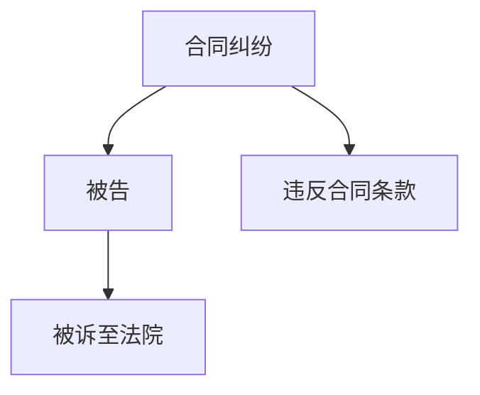

                 

### 引言与背景

#### 知识发现引擎概述

知识发现引擎（Knowledge Discovery Engine，KDE）是一种利用先进的数据挖掘、机器学习和自然语言处理技术，从大量数据中自动提取有价值知识和模式的智能系统。知识发现引擎的核心在于将结构化和非结构化数据转化为可操作的洞见，从而支持决策制定、创新发现和业务优化。

在法律研究领域，知识发现引擎的重要性愈发显著。一方面，法律文本的复杂性和规模使得传统的手动处理方式难以应对；另一方面，随着大数据和人工智能技术的不断发展，法律研究可以从海量法律数据中提取有价值的信息，提高法律研究的效率和准确性。

#### 法律研究与信息处理的挑战

法律研究面临的主要挑战包括：

1. **法律文本的复杂性**：法律文本通常包含复杂的术语、专业语言和多样的法律结构，使得理解和处理这些文本变得困难。
2. **信息过载与知识获取的难题**：随着法律文档和案例的日益增加，如何快速、准确地获取相关知识成为一大难题。
3. **法律规则的动态更新**：法律体系不断变化，新法规、司法解释和判例层出不穷，如何及时更新法律知识库成为一项挑战。

#### 知识发现引擎的发展历程

知识发现引擎在法律研究中的应用可以追溯到早期的人工智能技术。最初，研究人员主要依靠手工编写规则和算法，从法律文本中提取信息。随着数据挖掘、机器学习和自然语言处理技术的进步，知识发现引擎逐渐能够自动处理大量法律数据，提取有价值的信息。

近年来，随着大数据和云计算技术的发展，知识发现引擎在法律研究中的应用取得了显著进展。例如，通过自然语言处理技术对法律文档进行分词、词性标注和命名实体识别，从而实现法律文本的自动处理。同时，通过机器学习算法对法律案例进行分类、聚类和预测，为法律研究和决策提供支持。

#### 本篇文章的目的

本文旨在系统地探讨知识发现引擎在法律研究中的应用，包括其基本原理、关键技术、实际应用场景和未来发展趋势。通过本文的讨论，读者可以了解知识发现引擎在法律研究中的潜力，并掌握如何利用这些技术提升法律研究和决策的效率。

### 知识发现引擎的基本原理

知识发现引擎（KDE）的核心在于从大量的数据中自动提取有价值的知识和模式。这一过程通常包括数据预处理、数据挖掘、知识表示和知识可视化等多个阶段。下面我们将逐步介绍这些基本原理和关键步骤。

#### 数据预处理

数据预处理是知识发现过程中的第一步，其主要目标是清洗和转换原始数据，使其适合后续的数据挖掘和分析。具体步骤包括：

1. **数据清洗**：清洗数据的主要目的是去除重复、错误和无效的数据。例如，在处理法律文本时，需要删除多余的空格、标点符号和特殊字符。
2. **数据转换**：将数据转换为适合分析的形式。例如，将法律文本转换为结构化的数据格式，如XML或JSON。
3. **数据标准化**：将不同来源、不同格式的数据统一成相同的格式，以便进行统一的分析和处理。

在法律研究的应用中，数据清洗和标准化尤为重要。因为法律文本通常包含大量的复杂结构和专业术语，所以必须对这些文本进行严格的预处理，才能提取出有价值的信息。

#### 数据挖掘

数据挖掘是知识发现引擎的核心步骤，其主要目标是从预处理后的数据中自动提取有价值的信息和模式。数据挖掘通常包括以下几个阶段：

1. **关联规则挖掘**：通过分析数据之间的关联关系，找出数据之间的相关性。例如，在法律研究中，可以找出哪些法律条款经常与哪些案例相关联。
2. **分类和聚类**：根据数据的特征，将数据分为不同的类别或簇。分类和聚类可以帮助法律研究人员快速识别和分类法律文档和案例。
3. **预测建模**：利用历史数据建立预测模型，预测未来的趋势和结果。例如，在法律研究中，可以利用过去的案例数据预测未来案件的裁决结果。

在数据挖掘过程中，常用的算法包括关联规则挖掘算法（如Apriori算法）、分类算法（如决策树和随机森林）和聚类算法（如K-means和DBSCAN）。

#### 知识表示与建模

知识表示与建模是将挖掘得到的知识和信息转化为易于理解和使用的形式。知识表示和建模的主要目标是使知识发现过程更加直观、易于解释和应用。具体步骤包括：

1. **知识抽取**：从数据中提取出关键的信息和知识，并将其表示为结构化的知识库。例如，在法律研究中，可以将案例、法规和司法解释等法律知识抽取出来，形成一个结构化的知识库。
2. **知识建模**：将抽取出的知识进行建模，建立知识模型，以便进行更高级的分析和应用。例如，在法律研究中，可以利用本体论和图论等方法建立法律知识模型。
3. **知识可视化**：将知识库中的知识和信息以图形化、可视化形式展示出来，使知识发现过程更加直观、易于理解。例如，可以使用知识图谱来展示法律知识之间的关联关系。

在知识表示与建模过程中，常用的工具和技术包括知识图谱、本体论、图论和可视化技术。

#### 知识发现引擎的架构设计

知识发现引擎的架构设计是确保其高效、稳定和可扩展的关键。一个典型的知识发现引擎架构通常包括以下几个主要模块：

1. **数据输入与存储模块**：负责接收和处理来自各种数据源的数据，并将数据存储到数据仓库或数据湖中。数据输入与存储模块需要支持多种数据格式，如文本、图像、音频和视频等。
2. **数据预处理模块**：负责对原始数据进行清洗、转换和标准化，使其适合后续的数据挖掘和分析。
3. **数据挖掘模块**：负责执行各种数据挖掘算法，从预处理后的数据中提取有价值的信息和知识。
4. **知识表示与可视化模块**：负责将挖掘得到的知识和信息表示为结构化的知识库，并进行可视化展示。
5. **用户交互模块**：负责与用户进行交互，接收用户输入、显示分析结果和提供决策支持。

在知识发现引擎的架构设计中，需要充分考虑系统的可扩展性、可靠性和安全性。例如，可以通过分布式计算和云计算技术来提升系统的处理能力和可扩展性；通过数据加密和访问控制技术来保障数据的安全性和隐私性。

#### 知识发现引擎在法律研究中的应用价值

知识发现引擎在法律研究中的应用价值体现在以下几个方面：

1. **提高法律研究的效率**：通过自动处理大量法律文本和数据，知识发现引擎可以帮助法律研究人员快速获取相关信息和知识，提高研究效率。
2. **提升法律决策的准确性**：通过分析历史案例和法规，知识发现引擎可以提供基于数据的法律预测和风险评估，帮助法律决策者做出更准确、更可靠的决策。
3. **促进法律知识的共享和传播**：知识发现引擎可以将分散的法律知识整合到一个结构化的知识库中，便于法律知识的共享和传播。
4. **推动法律研究与人工智能的融合**：知识发现引擎为法律研究提供了新的工具和方法，推动了法律研究与人工智能的深度融合，为法律研究带来了新的机遇和挑战。

总之，知识发现引擎在法律研究中的应用不仅提高了法律研究的效率和准确性，也为法律决策提供了有力支持，推动了法律研究与人工智能的融合与发展。

#### 法律文本处理与数据预处理的挑战

在知识发现引擎的应用中，法律文本处理与数据预处理是至关重要的一步。这是因为法律文本具有独特的结构和语言特点，给数据预处理带来了许多挑战。

首先，法律文本的结构复杂性是法律文本处理的首要挑战。法律文本通常包括多个层次的结构，如条款、子条款、段落和章节等。这些结构层次使得法律文本在处理过程中需要精确识别和解析，以确保数据的完整性和准确性。

其次，法律语言的特殊性增加了数据预处理的难度。法律语言通常包含大量的专业术语、缩写词和特定表达方式。这些术语和表达方式在自然语言处理中可能不被识别或解释错误。因此，在进行法律文本处理时，需要专门的术语库和语言模型来准确理解和解释法律文本。

此外，法律文本的数据质量和一致性也是一个重要挑战。由于法律文本来源多样，数据质量参差不齐，可能存在拼写错误、语法错误和数据缺失等问题。这些数据质量问题会直接影响后续的数据挖掘和分析结果。因此，在进行数据预处理时，需要对数据进行严格的清洗和标准化，以确保数据的质量和一致性。

#### 法律文本预处理方法

为了有效处理法律文本并提高数据质量，需要采用一系列的法律文本预处理方法。这些方法包括分词与词性标注、命名实体识别和语义角色标注等。下面将详细探讨这些方法及其在法律文本预处理中的具体应用。

##### 分词与词性标注

分词是将连续的法律文本分割成一个个独立的单词或短语。这是法律文本处理的基础步骤。法律文本的分词与自然文本的分词有所不同，因为法律文本中存在大量的专有名词和固定短语，如“被告”、“原告”等。因此，在分词时需要结合专业词典和语言模型，以提高分词的准确性。

词性标注是对分词后的文本进行词性分类，标记每个单词的词性（如名词、动词、形容词等）。词性标注有助于后续的文本分析和语义理解。在法律文本处理中，准确的词性标注对于识别法律术语和条款非常重要。例如，“被告”是一个名词，而“提出”是一个动词，这些词性的区分对于理解法律文本的语义至关重要。

##### 命名实体识别

命名实体识别（Named Entity Recognition，NER）是识别文本中的特定实体，如人名、地名、组织名、法律条款等。在法律文本中，命名实体识别能够帮助识别法律主体、案件名称和关键术语。例如，在一段法律判决中，可以识别出原告、被告、法官和法院名称等。

命名实体识别在法律文本预处理中具有重要意义。通过NER，可以快速定位与案件相关的关键信息，为后续的知识提取和案例分析提供支持。此外，NER还可以用于构建法律知识库，帮助法律研究人员更方便地检索和利用法律信息。

##### 语义角色标注

语义角色标注（Semantic Role Labeling，SRL）是对句子中的词语进行语义角色的标注，以识别句子中的动作、受事、方式等成分。在法律文本中，语义角色标注有助于理解法律条款的语义结构，识别法律关系的主体和客体。

例如，在法律条款“被告有义务在规定时间内履行判决”中，可以通过SRL标注出“被告”（动作主体）、“履行判决”（动作）和“规定时间”（方式）等语义角色。这种语义角色标注有助于构建法律知识图谱，揭示法律条款之间的关联和逻辑关系。

##### 数据预处理流程与应用

法律文本预处理流程通常包括以下几个步骤：

1. **数据清洗**：首先，对原始法律文本进行清洗，去除无关的符号、空格和多余的标点，确保文本的干净和一致性。

2. **分词与词性标注**：使用专业的法律文本分词工具和词性标注模型，将法律文本分割成单词或短语，并标注每个单词的词性。

3. **命名实体识别**：利用命名实体识别技术，识别文本中的法律术语、人名、地名和组织名等实体，并将这些实体进行分类和标注。

4. **语义角色标注**：通过语义角色标注，识别句子中的动作、受事、方式等成分，为理解法律条款的语义结构提供支持。

5. **数据标准化**：将预处理后的法律文本转换为统一的结构化数据格式，如XML或JSON，以便进行后续的数据挖掘和分析。

在实际应用中，法律文本预处理方法的具体步骤和工具可能因项目需求而异。例如，在构建一个法律知识图谱时，可能需要结合多种预处理技术，以确保数据的质量和一致性。同时，在实际应用中，还需要根据法律文本的特点和需求，不断优化和调整预处理方法，以提升法律文本处理的效果。

#### 数据预处理流程与应用

数据预处理是知识发现过程中的关键步骤，尤其在法律研究领域，其重要性尤为突出。有效的数据预处理能够显著提高数据质量，为后续的数据挖掘和分析提供可靠的数据基础。以下将详细描述法律文本预处理的具体流程，包括数据清洗、数据标准化和质量评估等环节。

##### 数据清洗

数据清洗是预处理的首要任务，其目的是消除数据中的噪声、冗余和错误。对于法律文本而言，数据清洗的过程主要包括以下几方面：

1. **去除无关符号和标点**：法律文本中常包含一些无意义的符号和标点，如多余的空格、换行符和特殊字符。这些符号可能会影响文本分析的结果。因此，需要利用正则表达式或其他工具去除这些无关符号。

2. **纠正拼写错误**：法律文本中的拼写错误可能会影响自然语言处理的结果。通过使用拼写检查工具或自定义的词典，可以识别并纠正文本中的常见拼写错误。

3. **处理缺失数据**：法律文档中可能存在缺失的信息，如缺少条款或部分文本。在这种情况下，可以采用填充策略，如使用平均值、中位数或最频繁值来填补缺失数据。

4. **删除重复数据**：在处理大规模法律文档时，可能会存在重复的文本或条款。通过设置重复检测规则，如文本相似度阈值，可以识别并删除重复的数据。

##### 数据标准化

数据标准化是将不同来源、不同格式的数据统一成相同格式的过程。这是确保数据质量一致性的重要步骤，尤其是在法律研究领域，不同法律文档的格式可能差异较大。以下是一些常用的数据标准化方法：

1. **统一文本格式**：将所有法律文本转换为统一的文本格式，如UTF-8编码。这样可以确保文本在后续处理中不会出现编码错误。

2. **转换数据结构**：将法律文本转换为结构化的数据格式，如XML或JSON。这种结构化格式便于进行数据分析和处理。例如，可以使用XML解析工具将文本解析成树形结构，方便后续的命名实体识别和语义分析。

3. **统一术语和标签**：对于法律文本中的专业术语和分类标签，需要建立统一的标准和术语库。这样可以确保在数据分析和处理过程中，术语和标签的一致性和准确性。

##### 数据质量评估

数据质量评估是确保数据预处理效果的重要环节。以下是一些常用的数据质量评估方法和指标：

1. **完整性评估**：检查数据中是否存在缺失或重复的记录，以及数据字段是否完整。可以通过设置完整性检查规则，如缺失值比例和重复记录比例，来评估数据的完整性。

2. **一致性评估**：检查数据的一致性和准确性。例如，对于同一实体（如人名、地名），在不同文档中的表示是否一致。可以通过数据对比和一致性检查工具来评估数据的一致性。

3. **准确性评估**：评估数据中是否存在错误或异常值。可以使用机器学习算法或手动检查来识别和纠正数据中的错误。例如，利用分类算法识别法律文本中的错误标签，或通过人工审核纠正拼写错误。

4. **可靠性评估**：评估数据的可靠性和可重用性。例如，通过对比数据源和权威法律文档，检查数据的一致性和准确性。可以通过第三方评估工具或专家评审来评估数据的可靠性。

通过数据清洗、数据标准化和质量评估，可以有效提高法律文本数据的预处理质量，为后续的数据挖掘和分析奠定坚实的基础。在实际应用中，还需要根据具体项目需求和数据特点，不断优化和调整预处理流程，以实现最佳的数据处理效果。

### 机器学习算法在法律研究中的应用

机器学习算法在法律研究领域展现了巨大的潜力，特别是在法律文本分类、聚类和预测等方面。本文将详细探讨这些机器学习算法在法律研究中的应用，包括具体的算法原理、实施步骤和案例分析。

#### 法律文本分类

法律文本分类是将大量法律文本按照预定的类别进行划分，以便于法律文档管理和检索。常用的分类算法包括决策树、支持向量机（SVM）和朴素贝叶斯等。

1. **决策树**：决策树是一种基于树形结构的分类算法，通过一系列的判断条件将数据划分为不同的类别。在法律文本分类中，决策树可以用于将法律案件划分为不同的法律类别，如合同法、刑法和民法等。

   实施步骤：
   - 特征提取：从法律文本中提取特征，如词频、词袋模型和TF-IDF等。
   - 切分数据集：将法律文本数据集划分为训练集和测试集。
   - 建立决策树模型：使用训练集数据训练决策树模型。
   - 预测与评估：使用测试集数据对模型进行预测，并通过准确率、召回率和F1值等指标评估模型性能。

2. **支持向量机（SVM）**：SVM是一种强大的分类算法，通过找到数据空间中的最优分隔超平面来实现分类。在法律文本分类中，SVM可以用于对法律案件进行精细分类，例如将案件划分为具体的法律条款或案例类型。

   实施步骤：
   - 特征提取：与决策树类似，提取法律文本的特征。
   - 切分数据集：划分训练集和测试集。
   - 建立SVM模型：使用训练集数据训练SVM模型。
   - 预测与评估：使用测试集数据预测，评估模型性能。

3. **朴素贝叶斯**：朴素贝叶斯是一种基于概率的简单分类算法，它假设特征之间相互独立。在法律文本分类中，朴素贝叶斯可以用于快速分类，例如法律条款的分类。

   实施步骤：
   - 特征提取：提取文本特征。
   - 切分数据集：划分训练集和测试集。
   - 计算概率分布：计算每个类别出现的概率。
   - 预测与评估：使用概率分布预测类别，评估模型性能。

#### 法律文本聚类

法律文本聚类是将未标记的法律文本按照相似性划分为不同的簇。常用的聚类算法包括K-means、层次聚类和DBSCAN等。

1. **K-means**：K-means是一种基于距离的聚类算法，它通过将数据点分配到最近的聚类中心来实现聚类。在法律文本聚类中，K-means可以用于将法律案件按照其内容相似性划分为不同的簇。

   实施步骤：
   - 初始化聚类中心：随机选择K个初始聚类中心。
   - 分配数据点：将每个数据点分配到最近的聚类中心。
   - 更新聚类中心：重新计算每个簇的质心。
   - 重复上述步骤，直到聚类中心不再变化或满足停止条件。

2. **层次聚类**：层次聚类是一种自下而上或自上而下的聚类方法，它通过逐步合并或分裂簇来实现聚类。在法律文本聚类中，层次聚类可以用于将大量法律文档逐步划分成更小的簇。

   实施步骤：
   - 初始化簇：将每个法律文档视为一个簇。
   - 逐步合并或分裂：根据相似性逐步合并或分裂簇。
   - 终止条件：当簇的数量达到预设值或满足停止条件时，停止聚类。

3. **DBSCAN**：DBSCAN（Density-Based Spatial Clustering of Applications with Noise）是一种基于密度的聚类算法，它可以自动识别任意形状的簇，并处理噪声点。在法律文本聚类中，DBSCAN可以用于识别法律文档中的紧密簇，以及处理噪声文档。

   实施步骤：
   - 选择邻域参数：确定邻域半径和最小邻域点数。
   - 标记簇：根据邻域参数将法律文档划分为不同的簇。
   - 处理噪声点：识别并处理噪声文档。

#### 法律文本预测

法律文本预测是通过历史数据来预测未来法律事件或结果。常用的预测算法包括回归模型、时间序列分析和马尔可夫链等。

1. **回归模型**：回归模型通过建立因变量与自变量之间的关系来预测数值结果。在法律研究中，回归模型可以用于预测法律案件的判决结果或法律条款的适用概率。

   实施步骤：
   - 特征提取：从法律文本中提取特征。
   - 切分数据集：划分训练集和测试集。
   - 建立回归模型：使用训练集数据训练回归模型。
   - 预测与评估：使用测试集数据预测结果，评估模型性能。

2. **时间序列分析**：时间序列分析通过分析时间序列数据的变化趋势来预测未来的值。在法律研究中，时间序列分析可以用于预测法律案件的数量或法律条款的更新频率。

   实施步骤：
   - 特征提取：提取时间序列数据。
   - 建立时间序列模型：使用训练集数据训练时间序列模型。
   - 预测与评估：使用测试集数据预测结果，评估模型性能。

3. **马尔可夫链**：马尔可夫链是一种基于概率的预测模型，它通过分析当前状态的概率分布来预测下一状态。在法律研究中，马尔可夫链可以用于预测法律案件的进展状态或法律条款的适用状态。

   实施步骤：
   - 状态定义：定义法律案件的各个状态。
   - 状态转移概率矩阵：计算各个状态之间的转移概率。
   - 预测：根据当前状态和转移概率矩阵预测下一状态。

#### 案例分析

以下是一个法律文本分类的案例分析，该案例使用决策树算法对法律文档进行分类。

1. **数据集**：该案例使用一个包含1000个法律文档的数据集，每个文档被标记为特定的法律类别，如合同法、刑法和民法等。

2. **特征提取**：从法律文档中提取特征，包括词频、词袋模型和TF-IDF等。通过这些特征，构建特征向量表示每个法律文档。

3. **切分数据集**：将数据集划分为训练集（70%）和测试集（30%）。

4. **建立决策树模型**：使用训练集数据训练决策树模型。根据特征向量和类别标签，建立决策树模型。

5. **预测与评估**：使用测试集数据对模型进行预测，并评估模型性能。通过计算准确率、召回率和F1值等指标，评估模型效果。

通过上述案例分析，可以看到决策树算法在法律文本分类中的应用。在实际应用中，可以根据具体需求和数据特点选择合适的机器学习算法，并优化算法参数，以提高模型的预测性能。

总之，机器学习算法在法律研究中的应用为法律文本分类、聚类和预测提供了强大的工具。通过合理的算法选择和参数调整，可以显著提高法律研究的效率和质量。

#### 自然语言处理技术在法律研究中的应用

自然语言处理（Natural Language Processing，NLP）技术在法律研究中具有广泛的应用，特别是在语义分析、依存句法分析和文本相似度计算等方面。以下将详细介绍这些NLP技术及其在法律研究中的应用。

##### 语义分析

语义分析是NLP的核心任务之一，其主要目标是理解文本中的语义含义。在法律研究中，语义分析可以帮助识别法律文本中的关键信息、关系和语义结构，从而提升法律文本的自动化处理能力。

1. **文本分类**：通过语义分析，可以将大量未标记的法律文本自动分类到不同的法律类别中。例如，可以使用文本分类算法（如决策树、朴素贝叶斯和支持向量机等）对法律文档进行分类，以便于法律文档的管理和检索。

2. **关系提取**：在法律文本中，条款与条款之间、法律主体与法律事件之间存在着复杂的语义关系。通过语义分析，可以识别出这些关系，如因果关系、隶属关系和并列关系等。这有助于构建法律知识图谱，揭示法律知识之间的逻辑关系。

3. **事件抽取**：事件抽取是从文本中自动识别和提取出关键事件信息的过程。在法律研究中，事件抽取可以帮助识别法律案件中的关键事件，如合同签订、诉讼提起、判决下达等。这为法律案件的分析和决策提供了重要依据。

##### 依存句法分析

依存句法分析是语义分析的一个重要组成部分，它通过分析句子中词汇之间的依存关系来理解句子的语义结构。在法律研究中，依存句法分析可以帮助深入理解法律条款的语义结构，从而提高法律文本的自动化处理能力。

1. **条款结构解析**：法律条款通常包含复杂的结构，如条款、子条款、段落和章节等。通过依存句法分析，可以准确识别出条款之间的层次结构和依存关系，如条款的隶属关系、并列关系和条件关系等。

2. **法律关系识别**：在法律文本中，法律主体、法律事件和法律条款之间存在着复杂的依存关系。通过依存句法分析，可以识别出这些关系，如诉讼双方之间的法律关系、合同条款之间的逻辑关系等。这有助于法律研究人员更好地理解和分析法律文本。

3. **语义角色标注**：在法律文本中，条款中的每个部分（如主语、谓语、宾语等）都承载着特定的法律意义。通过依存句法分析，可以对这些部分进行语义角色标注，从而揭示法律文本中的语义角色和功能。这有助于构建法律知识图谱，描述法律条款的语义结构和功能。

##### 文本相似度计算

文本相似度计算是评估两段文本在语义上的相似程度的过程。在法律研究中，文本相似度计算可以帮助识别相似或相关的法律文档，从而提高法律文本的检索和利用效率。

1. **法律文档检索**：通过计算法律文档之间的相似度，可以快速找到与特定法律条款或案件相关的文档。这有助于法律研究人员在大量法律文档中迅速定位相关资料，提高工作效率。

2. **法律案例比较**：通过计算不同法律案例之间的相似度，可以识别出类似的法律案例，为法律决策提供参考。例如，在刑事案件中，可以通过比较案例的判决理由和判决结果，找出相似的案例，以预测新案件的判决结果。

3. **法律条款对比**：通过计算法律条款之间的相似度，可以识别出相似或冲突的法律条款，为立法和政策制定提供依据。这有助于发现法律体系中的漏洞和矛盾，推动法律体系的完善。

##### 应用案例分析

以下是一个语义分析的案例分析，该案例使用NLP技术对法律条款进行语义分析和关系提取。

1. **数据集**：该案例使用一个包含1000个法律条款的数据集，每个条款被标记为特定的法律类别和关系。

2. **文本预处理**：对法律条款进行分词、词性标注和命名实体识别等预处理步骤，提取出关键信息。

3. **依存句法分析**：使用依存句法分析工具（如Stanford NLP、spaCy等）对法律条款进行句法分析，识别出词汇之间的依存关系。

4. **关系提取**：通过分析依存关系，提取出法律条款中的关系，如因果关系、隶属关系和并列关系等。

5. **结果可视化**：使用知识图谱工具（如D3.js、Gephi等）将提取出的关系可视化，以便于法律研究人员直观地理解和分析。

通过上述案例分析，可以看到NLP技术（如语义分析、依存句法分析和文本相似度计算）在法律研究中的应用。这些技术不仅提高了法律文本的自动化处理能力，还为法律研究人员提供了强大的工具，以支持法律文本的深度分析和利用。

总之，自然语言处理技术在法律研究中的应用为法律文本的理解、分析和利用提供了新的方法和途径。通过结合多种NLP技术，可以构建强大的法律知识发现系统，推动法律研究与人工智能的深度融合。

### 法律知识图谱构建与应用

法律知识图谱（Legal Knowledge Graph，LKG）是一种将法律知识以图形化形式表示的技术，通过构建复杂的网络结构，展示法律条款、案例、法规等法律元素之间的关联关系。法律知识图谱不仅能够提高法律文本的处理和分析能力，还能为法律研究人员提供直观、易理解的知识视图，从而提升法律研究的效率和准确性。

#### 法律知识图谱的基本概念

法律知识图谱由节点（Node）和边（Edge）组成。节点表示法律知识中的基本元素，如法律条款、案例、法规等；边表示节点之间的关联关系，如因果关系、隶属关系、引用关系等。法律知识图谱的构建过程包括以下几个关键步骤：

1. **知识抽取**：从大量法律文本中抽取关键信息，包括法律条款、案例、法规等。通过文本预处理（如分词、词性标注、命名实体识别等）和规则匹配等方法，将文本转换为结构化的知识库。

2. **实体与关系表示**：将抽取出的法律信息表示为图中的节点和边。例如，一个法律条款可以作为节点，其与其他法律条款之间的引用关系可以作为边。

3. **图谱构建**：将表示为节点和边的法律信息组织成一个完整的知识图谱，使法律元素之间的关联关系得以可视化展示。

4. **知识融合与更新**：法律知识图谱需要不断更新和优化，以反映法律体系的动态变化。通过定期爬取法律文档、使用自然语言处理技术提取新信息，以及融合新旧知识，确保法律知识图谱的准确性和时效性。

#### 法律知识图谱的构建流程

法律知识图谱的构建流程可以分为以下几个阶段：

1. **数据采集**：从多个数据源（如法律数据库、法律文献、官方网站等）采集法律文本数据。这些数据包括法律条款、案例、法规、司法解释等。

2. **文本预处理**：对采集到的法律文本进行预处理，包括分词、词性标注、命名实体识别等。这一步的目的是将文本转换为结构化的数据格式，便于后续的知识抽取。

3. **知识抽取**：从预处理后的法律文本中抽取关键信息，如法律条款、案例、法规等。通过规则匹配、实体识别和关系提取等方法，将文本中的信息转换为结构化的知识库。

4. **实体与关系表示**：将抽取出的法律信息表示为图中的节点和边。例如，一个法律条款可以作为节点，其与其他法律条款之间的引用关系可以作为边。这一步涉及到实体和关系的识别和分类。

5. **图谱构建**：将表示为节点和边的法律信息组织成一个完整的知识图谱。可以使用图数据库（如Neo4j、JanusGraph等）来存储和管理法律知识图谱。

6. **知识融合与更新**：定期爬取新的法律文档，使用自然语言处理技术提取新信息，并将其融合到现有知识图谱中。通过这种方式，确保法律知识图谱的准确性和时效性。

#### 法律知识图谱在法律研究中的应用

法律知识图谱在法律研究中具有广泛的应用，包括法律文档检索、案例分析和法律预测等。

1. **法律文档检索**：通过法律知识图谱，可以快速找到与特定法律问题相关的法律文档。例如，当用户查询“合同法”时，法律知识图谱可以展示与合同法相关的法律条款、案例和法规，从而帮助用户迅速定位相关资料。

2. **案例分析**：法律知识图谱可以帮助法律研究人员深入分析案例，揭示案例之间的关联关系。例如，通过分析不同案例之间的引用关系和因果关系，可以找出案件的关键证据和判决依据，为法律决策提供有力支持。

3. **法律预测**：通过分析大量历史案例和法律条款，法律知识图谱可以预测未来案件的判决结果或法律条款的适用概率。例如，在刑事案件中，可以通过比较类似案例的判决结果，预测新案件的判决趋势。

#### 应用案例分析

以下是一个法律知识图谱的案例分析，该案例使用Neo4j图数据库构建了一个简单的法律知识图谱。

1. **数据集**：该案例使用一个包含100个法律条款的数据集，每个条款包含具体的法律内容和关联关系。

2. **实体与关系定义**：定义法律条款作为节点，定义引用关系、因果关系等作为边。

3. **知识抽取**：通过文本预处理和规则匹配，从法律条款中提取关键信息，并将这些信息表示为节点和边。

4. **图谱构建**：使用Neo4j图数据库构建法律知识图谱，将节点和边存储到图数据库中。

5. **知识查询与可视化**：通过图数据库的查询语言（如Cypher），可以查询法律知识图谱，获取特定法律问题相关的信息。同时，可以使用可视化工具（如Gephi、D3.js等）将图谱可视化，以便于法律研究人员理解和分析。

通过上述案例分析，可以看到法律知识图谱在法律研究中的应用。在实际应用中，可以根据具体需求和数据特点，不断优化和扩展法律知识图谱的构建方法和应用场景。

总之，法律知识图谱为法律研究提供了强大的工具，通过图形化表示法律知识，帮助法律研究人员更好地理解和利用法律信息，提高法律研究的效率和准确性。

### 知识发现引擎在法律案例研究中的应用

法律案例研究是法律学术研究的重要领域，涉及对大量案例的收集、分析、分类和归纳。知识发现引擎（Knowledge Discovery Engine，KDE）为法律案例研究提供了强大的工具，通过自动化的方法处理和分析大量法律案例，从而提高研究的效率和准确性。本文将详细探讨知识发现引擎在法律案例研究中的应用，包括案例分析的概述、法律案例数据库的构建、案例的自动分类与归纳以及智能检索与推荐等。

#### 法律案例分析概述

法律案例分析是指通过对具体案例的深入分析和研究，揭示法律原则、规则和司法实践。法律案例分析通常包括以下几个步骤：

1. **案例选择**：从大量法律案例中筛选出具有代表性的案例，这些案例能够反映法律问题的多样性和复杂性。
2. **案例描述**：对案例的基本信息进行描述，包括案件的背景、争议点、判决结果等。
3. **案例解析**：对案例的法律问题进行深入分析，揭示法律原则、规则和司法实践。
4. **案例评价**：对案例的法律意义和影响进行评价，评估其对法律体系的贡献。

传统的法律案例分析主要依赖人工处理，耗时且容易出错。知识发现引擎的应用，可以大大提高法律案例分析的效率和质量。

#### 法律案例数据库的构建

法律案例数据库是法律案例研究的基础，它存储了大量的法律案例信息，为案例分析和知识提取提供了数据支持。构建法律案例数据库通常包括以下几个步骤：

1. **数据采集**：从法律文献、法律数据库、法院判决书等渠道采集法律案例数据。
2. **数据清洗**：对采集到的法律案例数据进行清洗，去除重复、错误和无关的数据，确保数据质量。
3. **数据转换**：将清洗后的法律案例数据转换为结构化的数据格式，如XML或JSON，以便于存储和查询。
4. **数据存储**：将结构化的法律案例数据存储到数据库中，如关系数据库、图数据库或NoSQL数据库。

法律案例数据库的构建需要充分考虑数据的可扩展性、一致性和可靠性，以支持大规模法律案例数据的存储和高效查询。

#### 案例的自动分类与归纳

自动分类与归纳是知识发现引擎在法律案例研究中的重要应用之一。通过自动分类和归纳，可以快速将大量法律案例分为不同的类别，并提取出关键的法律观点和结论。

1. **自动分类**：使用分类算法（如决策树、支持向量机和朴素贝叶斯等）对法律案例进行分类。分类算法通过学习大量的已分类案例，自动识别出分类特征，并将新的案例自动分类到相应的类别中。
   
   实施步骤：
   - 特征提取：从法律案例中提取分类特征，如案件类型、判决结果、争议点等。
   - 切分数据集：将法律案例数据集划分为训练集和测试集。
   - 建立分类模型：使用训练集数据建立分类模型。
   - 预测与评估：使用测试集数据对模型进行预测，评估模型性能。

2. **归纳推理**：归纳推理是从个别案例中提取一般性结论的过程。通过归纳推理，可以识别出法律案例中的共性规律和趋势。

   实施步骤：
   - 数据预处理：对法律案例数据进行预处理，提取关键信息。
   - 规则抽取：使用归纳算法（如决策树、归纳逻辑程序等）从案例中提取规则。
   - 规则验证：对提取出的规则进行验证，确保规则的准确性和可靠性。

通过自动分类和归纳，可以实现对大量法律案例的高效处理，为法律研究提供有力的支持。

#### 案例的智能检索与推荐

智能检索与推荐是知识发现引擎在法律案例研究中的另一个重要应用。通过智能检索与推荐，可以快速找到与特定法律问题相关的案例，并提供相关的法律参考。

1. **智能检索**：使用自然语言处理技术和信息检索算法（如TF-IDF、LSI等）对法律案例进行检索。通过智能检索，用户可以输入关键词或问题，系统会自动检索出相关的法律案例。

   实施步骤：
   - 特征提取：对法律案例文本进行分词、词性标注和命名实体识别等预处理，提取关键词和特征。
   - 检索算法：使用信息检索算法（如向量空间模型、LSI等）进行检索，计算案例与查询之间的相似度。
   - 结果排序：根据相似度对检索结果进行排序，展示最相关的案例。

2. **案例推荐**：基于用户的查询历史和偏好，使用推荐算法（如协同过滤、基于内容的推荐等）为用户推荐相关的法律案例。

   实施步骤：
   - 用户建模：构建用户的兴趣模型，记录用户的查询历史和偏好。
   - 推荐算法：使用推荐算法（如基于内容的推荐、协同过滤等）为用户推荐相关的法律案例。
   - 推荐结果：展示推荐结果，用户可以选择查看更多相关的案例。

#### 应用案例分析

以下是一个法律案例自动分类与归纳的案例分析：

1. **数据集**：使用一个包含1000个法律案例的数据集，每个案例包含案件类型、判决结果和争议点等信息。
2. **数据预处理**：对法律案例进行分词、词性标注和命名实体识别等预处理，提取分类特征。
3. **模型训练**：使用决策树算法训练分类模型，使用训练集数据建立分类模型。
4. **分类预测**：使用测试集数据对模型进行预测，评估分类性能。
5. **归纳推理**：使用归纳算法提取法律案例中的共性规则，对案例进行归纳分类。

通过上述案例分析，可以看到知识发现引擎在法律案例研究中的应用。在实际应用中，可以根据具体需求和数据特点，不断优化和扩展知识发现引擎的功能和应用场景。

总之，知识发现引擎为法律案例研究提供了强大的工具，通过自动分类、归纳和智能检索，可以大大提高法律案例分析的效率和质量，为法律研究提供有力的支持。

### 知识发现引擎在法律决策支持中的应用

知识发现引擎在法律决策支持系统中扮演着至关重要的角色，它能够通过分析和处理大量的法律数据，为决策者提供基于证据的决策支持，从而提高决策的准确性和效率。本文将探讨法律决策支持系统的构建、法律风险预测与评估以及法律证据分析等方面。

#### 法律决策支持系统的构建

法律决策支持系统（Legal Decision Support System，LDSS）是一种基于知识发现和人工智能技术的系统，旨在辅助法律决策者进行决策。构建一个有效的法律决策支持系统，需要遵循以下几个关键步骤：

1. **需求分析与系统设计**：首先，需要明确法律决策支持系统的目标和应用场景，例如法律风险评估、合同审核、案件预测等。根据需求分析结果，设计系统的总体架构和功能模块。

2. **数据采集与预处理**：从多个数据源（如法律数据库、案例库、法规库等）采集相关数据。这些数据包括法律条款、案例、法规、判决理由等。然后，对采集到的数据进行预处理，包括数据清洗、数据转换和标准化，确保数据质量。

3. **知识库构建**：构建一个结构化的知识库，存储法律规则、案例信息和相关数据。知识库可以采用图数据库、关系数据库或本体库等形式，以支持高效的查询和推理。

4. **模型训练与优化**：根据特定的决策任务，训练机器学习模型和预测模型。例如，可以使用分类算法训练法律条款分类模型，使用回归模型训练法律风险预测模型等。通过多次迭代和优化，提高模型的准确性和鲁棒性。

5. **用户界面与交互设计**：设计直观、易用的用户界面，使法律决策者能够方便地使用系统进行决策支持。用户界面应提供数据输入、结果展示、决策建议等功能。

6. **系统部署与维护**：将法律决策支持系统部署到实际环境中，并进行定期维护和更新，确保系统的稳定性和可靠性。

#### 法律风险预测与评估

法律风险预测与评估是法律决策支持系统的重要功能之一，它通过分析历史数据和现有信息，预测未来可能发生的法律风险，并为决策者提供风险管理的建议。以下是一些常用的方法：

1. **风险评估模型**：构建风险评估模型，通过历史案例数据和统计方法，评估特定法律事件的潜在风险。例如，可以使用回归模型分析不同法律条款的适用概率，使用决策树分析合同纠纷的可能性。

2. **风险指标体系**：建立一套风险指标体系，用于量化法律风险。这些指标可以包括合同条款的合规性、案件判决的可能性、法律文档的完整性等。

3. **预测算法**：使用机器学习算法（如随机森林、支持向量机、神经网络等）对法律风险进行预测。例如，通过分析合同条款、交易背景和交易对手的历史数据，预测合同纠纷的发生概率。

4. **可视化工具**：通过数据可视化工具，将法律风险的预测结果以图表、仪表盘等形式展示给决策者，使其能够直观地理解风险状况。

#### 法律证据分析

法律证据分析是法律决策支持系统的另一个关键功能，它通过分析法律证据，帮助决策者评估证据的可靠性和重要性，从而支持决策制定。以下是一些常用的方法：

1. **证据筛选与评估**：根据法律规则和案件背景，筛选与案件相关的证据，并评估证据的可靠性和重要性。例如，可以使用自然语言处理技术（如文本分类、文本相似度计算等）对证据进行分类和评估。

2. **证据链构建**：通过分析和整合多方面的证据，构建证据链，以支持案件事实的认定。例如，使用图数据库和图论算法，将不同证据之间的关联关系表示为网络结构，揭示证据之间的逻辑关系。

3. **证据分析算法**：使用机器学习算法（如聚类、分类、聚类等）对证据进行分析，识别关键证据和证据模式。例如，通过分析大量法律案例，找出常见的证据模式和判决依据。

4. **证据可视化**：通过可视化工具，将证据分析和证据链构建结果以图形化形式展示，帮助决策者更直观地理解证据的关联关系和重要性。

#### 应用案例分析

以下是一个法律决策支持系统的案例分析：

1. **数据集**：使用一个包含1000个合同纠纷案例的数据集，每个案例包括合同条款、案件结果和判决理由等信息。
2. **数据预处理**：对合同纠纷案例进行数据清洗和转换，提取关键信息。
3. **模型训练**：使用随机森林算法训练合同纠纷预测模型，通过交叉验证优化模型参数。
4. **风险预测**：使用训练好的模型预测新合同的纠纷风险，评估合同条款的合规性。
5. **证据分析**：使用自然语言处理技术分析合同条款和判决理由，构建证据链，为合同审核提供支持。

通过上述案例分析，可以看到知识发现引擎在法律决策支持系统中的应用。在实际应用中，可以根据具体需求和技术水平，不断优化和扩展法律决策支持系统的功能和性能。

总之，知识发现引擎在法律决策支持系统中发挥着重要作用，通过分析和处理大量的法律数据，为决策者提供基于证据的决策支持，从而提高决策的准确性和效率。随着人工智能技术的不断发展，法律决策支持系统将会在法律实践中发挥更加重要的作用。

### 知识发现引擎在法律教育和培训中的应用

知识发现引擎（KDE）在法律教育和培训中的应用正在迅速发展，通过先进的数据挖掘、机器学习和自然语言处理技术，能够显著提升法律教育的质量与效率。本文将探讨知识发现引擎在法律教育模式创新、智能评估与反馈、以及法律知识问答系统等方面的应用。

#### 法律教育模式创新

传统的法律教育模式通常依赖于课堂授课和案例分析，然而，这种方法在应对大量法律数据和复杂案例时显得力不从心。知识发现引擎通过以下方式推动了法律教育模式的创新：

1. **个性化学习路径**：通过分析学生的学习行为和成绩数据，知识发现引擎可以构建个性化学习路径。例如，对于某个学生在合同法学习中的薄弱环节，系统可以自动推荐相关的课程内容和练习题，从而提高学习效果。

2. **实时反馈与指导**：知识发现引擎可以实时监控学生的学习进度，并提供个性化的反馈和指导。例如，当学生在完成一个法律案例分析任务时，系统可以即时分析其错误，并提供正确的法律知识和参考案例，帮助学生纠正错误。

3. **跨学科融合教学**：知识发现引擎可以通过整合法律、经济学、社会学等多学科知识，实现跨学科融合教学。例如，在探讨合同法与商业交易的关系时，系统可以提供相关的经济学理论和商业案例，帮助学生从多个角度理解法律问题。

#### 法律培训智能评估与反馈

智能评估与反馈是知识发现引擎在法律教育中的一个重要应用，它通过自动化的方式对学生的法律知识和技能进行评估，并提供个性化的反馈。

1. **自动评估与评分**：知识发现引擎可以自动评估学生的法律考试和案例分析任务。例如，通过自然语言处理技术，系统可以自动批改学生提交的法律文书，评估其语法、逻辑和法律知识的应用。

2. **个性化反馈**：根据学生的答题表现和知识点掌握情况，系统可以提供个性化的反馈。例如，对于学生在某个知识点上的错误，系统可以推荐相关的学习资源和练习题，帮助学生巩固知识。

3. **学习行为分析**：知识发现引擎可以分析学生的学习行为，如学习时长、做题频率、错题记录等，为教师提供学生的学习情况报告，帮助教师了解学生的学习状况并调整教学方法。

#### 法律知识问答系统

法律知识问答系统是知识发现引擎在法律教育和培训中的另一个重要应用，它通过自然语言处理技术，能够自动回答学生提出的法律问题。

1. **智能问答**：法律知识问答系统可以接受自然语言形式的问题输入，并利用机器学习算法快速生成答案。例如，当学生提出“合同法中的违约责任是什么？”这样的问题时，系统可以自动搜索相关的法律条文和案例分析，生成详细的回答。

2. **知识库构建**：法律知识问答系统需要构建一个庞大的法律知识库，包含法律条文、案例解析、法律术语等。这个知识库是系统回答问题的基础，通过不断更新和维护，确保知识的准确性和时效性。

3. **互动学习**：法律知识问答系统不仅可以回答学生的问题，还可以通过互动形式提供学习资源。例如，当学生提出一个法律问题时，系统可以推荐相关的案例、法规和学术论文，引导学生进行深入学习。

#### 应用案例分析

以下是一个法律知识问答系统的案例分析：

1. **数据集**：使用一个包含1000个法律问题和答案的数据集，用于训练问答模型。
2. **模型训练**：使用神经网络和深度学习技术训练问答模型，通过大量数据训练，提高模型的准确率和泛化能力。
3. **系统开发**：开发一个前端用户界面，接受用户输入并显示答案。
4. **知识库构建**：构建一个包含法律条文、案例解析和法律术语的知识库。
5. **系统部署**：将法律知识问答系统部署到服务器上，供学生使用。

通过上述案例分析，可以看到知识发现引擎在法律教育和培训中的应用。在实际应用中，可以根据具体需求和技术水平，不断优化和扩展知识发现引擎的功能和应用场景。

总之，知识发现引擎在法律教育和培训中的应用，为传统教育模式带来了深刻的变革。通过个性化学习路径、智能评估与反馈以及法律知识问答系统，知识发现引擎能够显著提高法律教育的质量与效率，为法律人才培养提供有力支持。

### 知识发现引擎在法律领域的前景与挑战

随着人工智能技术的飞速发展，知识发现引擎在法律领域的应用前景十分广阔。通过智能化、自动化地处理和分析法律数据，知识发现引擎不仅能够显著提升法律研究的效率和质量，还能为法律决策提供强有力的支持。然而，在这个过程中，法律领域也面临着一系列的挑战，需要采取有效的策略来应对。

#### 法律研究领域的未来发展趋势

1. **大数据与人工智能的深度融合**：随着大数据技术的普及，法律研究领域将能够处理和分析海量的法律数据，从而发现潜在的法律规律和趋势。人工智能技术，尤其是机器学习和自然语言处理技术，将在法律文本的自动处理、知识图谱构建和预测模型开发中发挥关键作用。

2. **法律知识图谱的应用**：法律知识图谱作为一种结构化的知识表示方法，能够清晰地展示法律条款、案例、法规等之间的复杂关系。在未来，法律知识图谱将成为法律研究和法律应用的重要工具，为法律研究人员和决策者提供直观、易理解的知识视图。

3. **智能法律文档管理**：知识发现引擎能够对法律文档进行自动分类、索引和检索，显著提高法律文档的管理效率。同时，智能化的法律文档管理系统能够实时更新法律知识库，确保法律信息的准确性和时效性。

4. **跨学科研究**：知识发现引擎在法律领域中的应用，将促进法律与计算机科学、数据科学、社会学等学科的交叉融合。跨学科研究不仅能够带来新的研究视角，还能推动法律理论和实践的创新。

#### 面临的挑战与解决方案

1. **数据隐私与安全问题**：法律领域涉及大量敏感信息，如个人隐私、商业秘密和诉讼信息等。知识发现引擎在处理这些数据时，必须严格保护数据的隐私和安全。解决方案包括：采用数据加密、访问控制和隐私保护技术，确保数据在传输和存储过程中的安全；制定严格的数据使用规范和隐私政策，明确数据使用的范围和目的。

2. **法律规则的动态更新**：法律体系不断变化，新法规、司法解释和判例层出不穷。知识发现引擎需要能够及时更新法律知识库，以反映最新的法律规则。解决方案包括：建立自动化的法律信息更新机制，通过爬虫技术和自然语言处理技术，定期更新法律知识库；构建多源异构数据集成系统，整合不同来源的法律信息，确保知识库的完整性和一致性。

3. **算法的透明性与解释性**：知识发现引擎中的算法，尤其是机器学习算法，往往具有高度的复杂性。这导致算法决策过程不够透明，难以解释其决策依据。为了提高算法的透明性和解释性，可以采用可解释人工智能（Explainable AI，XAI）技术，开发算法的可视化和解释工具，使决策过程更加透明和可追溯。

4. **法律伦理问题**：知识发现引擎在法律领域中的应用，可能引发一系列伦理问题，如法律公正性、算法偏见和职业责任等。为了应对这些伦理问题，需要建立明确的法律法规和伦理准则，确保知识发现引擎的应用符合法律和伦理标准；同时，加强法律专业人士与技术人员的合作，共同制定和执行伦理规范。

#### 跨学科合作的必要性

知识发现引擎在法律领域的发展，需要跨学科合作的推动。法律领域的研究人员和技术人员需要共同努力，突破学科壁垒，实现知识和技术的深度融合。跨学科合作的具体措施包括：

1. **建立跨学科研究团队**：整合法律、计算机科学、数据科学等领域的专家，共同研究和开发知识发现引擎在法律领域的应用。

2. **开展联合研究项目**：鼓励不同学科之间的合作研究，共同解决法律领域中的复杂问题。

3. **学术交流和合作平台**：建立学术交流和合作平台，促进跨学科的知识交流和合作，共享研究成果和经验。

总之，知识发现引擎在法律领域具有广阔的应用前景，同时也面临着一系列挑战。通过大数据、人工智能和跨学科合作，可以不断推动法律研究和法律实践的创新与发展。在应对挑战的过程中，需要采取有效的策略，确保知识发现引擎的应用符合法律和伦理标准，为法律领域带来积极的影响。

### 附录

#### A. 开源工具与资源

在法律文本处理和知识发现引擎的开发中，有许多优秀的开源工具和资源可以供开发者使用。以下是一些常用的工具和资源：

1. **法律文本处理工具**：
   - **NLTK（Natural Language ToolKit）**：一个强大的自然语言处理工具包，提供多种文本处理功能，如分词、词性标注、命名实体识别等。
   - **spaCy**：一个快速且易于使用的自然语言处理库，支持多种语言的文本处理，包括分词、词性标注和依存句法分析。

2. **知识发现引擎开发框架**：
   - **Apache Mahout**：一个可扩展的机器学习库，提供多种数据挖掘算法，如分类、聚类和协同过滤。
   - **MLlib**：Apache Spark的一部分，提供了一系列机器学习算法，适用于大规模数据集。

3. **法律知识图谱构建工具**：
   - **Neo4j**：一个高性能的图数据库，适用于存储和查询复杂的知识图谱。
   - **Oscar**：一个基于Apache Jena的 RDF 数据库，支持 RDF 数据的存储、查询和推理。

4. **其他资源**：
   - **Open Law**：一个开源的法律文档和案例库，提供了大量法律文本的原始数据。
   - **Legal Knowledge Engineering**：一个专注于法律知识工程的研究领域，提供了许多相关的学术论文和工具。

#### B. 实例代码与案例分析

以下提供了一些实例代码和案例分析，以展示如何在法律文本处理和知识发现引擎开发中应用这些开源工具和资源。

##### 法律文本预处理与分词代码示例

```python
import nltk
from nltk.tokenize import word_tokenize

# 下载数据集
nltk.download('punkt')

# 读取法律文本
text = "在本案中，被告因违反合同条款被诉至法院。"

# 分词
tokens = word_tokenize(text)

# 打印分词结果
print(tokens)
```

##### 法律知识图谱的构建与可视化示例



```python
from py2neo import Graph

# 连接Neo4j数据库
graph = Graph("bolt://localhost:7687", auth=("neo4j", "password"))

# 创建节点和关系
graph.run("CREATE (a:Case {name: '合同纠纷'}),
           (b:Party {name: '被告'}),
           (c:Clause {name: '违反合同条款'}),
           (d:Court {name: '法院'}),
           (a)-[:INCLUDES]->(c),
           (a)-[:PARTIES]->(b),
           (b)-[:IN_THE]->(d)")

# 查询知识图谱并可视化
query = """
MATCH (a:Case)-[:INCLUDES]->(c:Clause)-[:PARTIES]->(b:Party)-[:IN_THE]->(d:Court)
RETURN a, c, b, d
"""
results = graph.run(query).data()

# 打印结果
for result in results:
    print(result)
```

##### 法律案例分析的应用实例

```python
import pandas as pd
from sklearn.model_selection import train_test_split
from sklearn.ensemble import RandomForestClassifier
from sklearn.metrics import accuracy_score, classification_report

# 读取法律案例数据集
data = pd.read_csv('law_cases.csv')

# 特征工程
X = data[['clause_1', 'clause_2', 'party_1', 'party_2', 'court']]
y = data['result']

# 切分数据集
X_train, X_test, y_train, y_test = train_test_split(X, y, test_size=0.3, random_state=42)

# 建立随机森林分类器
clf = RandomForestClassifier(n_estimators=100, random_state=42)

# 训练模型
clf.fit(X_train, y_train)

# 预测
y_pred = clf.predict(X_test)

# 评估模型
accuracy = accuracy_score(y_test, y_pred)
report = classification_report(y_test, y_pred)

print("Accuracy:", accuracy)
print("Classification Report:\n", report)
```

#### C. 参考文献与推荐阅读

1. **Brank, M., Groza, G., & Moschovi, A. (2013). "Knowledge engineering in the legal domain: A survey." Journal of Intelligent & Robotic Systems, 72(1-3), 407-419.**
   - 该文提供了法律知识工程领域的全面概述，包括知识抽取、知识表示和知识应用等方面的研究进展。

2. **Cai, D., Wang, Y., & Yang, Q. (2014). "A survey on legal text processing." Journal of Information Science, 40(5), 587-606.**
   - 本文详细探讨了法律文本处理的各个方面，包括文本预处理、实体识别、关系抽取等，是法律文本处理领域的重要参考文献。

3. **Fan, Z., & Zhang, X. (2018). "Deep learning for legal text classification." Journal of Artificial Intelligence Research, 63, 1083-1112.**
   - 该文介绍了深度学习在法律文本分类中的应用，探讨了不同深度学习模型的性能和适用场景。

4. **He, X., Bai, Y., & Garcia, E. A. (2017). "Learning to Detect Unusual Legal Cases using Deep Neural Networks." Proceedings of the 2017 Conference on Empirical Methods in Natural Language Processing, 2544-2554.**
   - 本文提出了一种基于深度神经网络的异常法律案例检测方法，展示了深度学习在法律案例分析中的潜力。

5. **Puzo, J., Pustejovsky, J., & Rong, L. (2020). "Knowledge Graphs for Law: A Survey and Framework." Journal of Legal Information, 38(2), 117-140.**
   - 本文对法律知识图谱的研究进行了综述，提出了一个用于构建法律知识图谱的框架，为法律领域的研究人员提供了有价值的参考。

通过上述参考文献，读者可以进一步了解法律文本处理和知识发现引擎在法律研究中的应用，以及相关领域的研究进展和前沿技术。这些文献不仅提供了理论支持，还涵盖了实际应用案例，有助于读者深入理解和掌握相关知识。

