                 

### 引言

在现代软件开发领域，程序员的工作方式正在经历一场深刻的变革。这种变革不仅仅体现在编程语言的进步、开发工具的进化，更在于数据处理和分析能力的提升。而知识发现引擎（Knowledge Discovery Engine，简称KDE）的崛起，正在成为改变程序员工作方式的利器。本文旨在探讨知识发现引擎如何通过其独特的功能和技术优势，极大地提高程序员的工作效率和质量。

#### 核心问题与目的

本文将回答以下几个核心问题：
1. **知识发现引擎是什么？** 它的定义、核心功能以及其在编程中的重要性。
2. **知识发现引擎的技术基础是什么？** 包括数据挖掘技术、机器学习算法、自然语言处理技术等。
3. **知识发现引擎的发展历程和未来趋势是什么？** 从历史角度分析其演变，并探讨未来的发展方向。
4. **知识发现引擎如何改变程序员的工作方式？** 深入分析其在不同场景中的应用，如Web开发、移动开发等。
5. **如何进行知识发现引擎的编程实战？** 通过具体的项目实战，展示其实现过程和最佳实践。

本文的目的在于，通过系统地分析知识发现引擎的工作原理、技术基础和应用场景，帮助程序员理解其如何提高工作效率，解决复杂问题，从而在激烈的技术竞争中脱颖而出。

#### 读者对象

本文面向以下读者群体：
1. **程序员与开发者**：希望了解知识发现引擎在编程中的应用，提高自己的技术能力。
2. **数据科学家与分析师**：希望深入理解知识发现引擎的技术原理，并将其应用于数据分析工作中。
3. **技术管理人员与CTO**：希望了解知识发现引擎如何为企业带来技术革新和管理提升。

通过本文的阅读，读者不仅能够获得知识发现引擎的基本知识和应用技巧，还能够对未来的技术趋势有更深刻的洞察。

### 文章关键词

- **知识发现引擎**
- **程序员工作方式**
- **数据挖掘**
- **机器学习**
- **自然语言处理**
- **Web开发**
- **移动开发**
- **性能优化**
- **安全性**

### 摘要

本文深入探讨了知识发现引擎（Knowledge Discovery Engine，简称KDE）如何改变程序员的工作方式。首先，我们介绍了知识发现引擎的概念、作用及其技术基础，包括数据挖掘技术、机器学习算法和自然语言处理技术。接着，我们回顾了知识发现引擎的发展历程，分析了其现代特点以及未来的趋势。然后，我们详细讨论了知识发现引擎在程序员工作方式中的变革，包括其带来的优势、面临的挑战以及如何应对这些挑战。最后，本文通过具体的项目实战和编程最佳实践，展示了如何有效地使用知识发现引擎进行编程。通过本文的阅读，读者将全面了解知识发现引擎的功能和应用，从而提升自己的编程能力，并在未来的技术发展中占据优势。

### 第一部分：知识发现引擎概述与价值

在探讨知识发现引擎（Knowledge Discovery Engine，简称KDE）如何改变程序员的工作方式之前，首先需要了解知识发现引擎的定义、作用、技术基础以及其在编程中的重要性。本部分将分章节详细介绍这些内容。

#### 第1章：知识发现引擎概述与价值

##### 1.1 知识发现引擎的概念与作用

###### 1.1.1 知识发现引擎的定义

知识发现引擎是一种自动化数据挖掘工具，它能够从大量数据中提取有价值的信息和知识。简单来说，知识发现引擎通过特定的算法和模型，将数据转化为可以理解和利用的知识，从而帮助用户做出更加明智的决策。

###### 1.1.2 知识发现引擎的核心功能

知识发现引擎的核心功能包括数据预处理、数据挖掘、模型训练和结果评估等。具体来说：
1. **数据预处理**：对原始数据清洗、归一化和降维，以便更好地进行后续分析。
2. **数据挖掘**：使用各种算法和模型，如分类、聚类、关联规则挖掘等，从数据中提取有价值的信息。
3. **模型训练**：通过机器学习算法，对提取出的信息进行训练，形成知识模型。
4. **结果评估**：对模型的效果进行评估，确保知识发现的准确性和可靠性。

###### 1.1.3 知识发现引擎在编程中的重要性

知识发现引擎在编程中具有极其重要的作用，主要体现在以下几个方面：
1. **提高工作效率**：通过自动化处理和分析数据，程序员可以大大减少手动编写和分析代码的工作量，提高工作效率。
2. **优化决策过程**：知识发现引擎能够从数据中提取出有价值的信息，为程序员提供更加准确的决策依据，从而优化决策过程。
3. **解决复杂问题**：知识发现引擎可以处理大量且复杂的数据，帮助程序员解决传统编程手段难以解决的问题。
4. **提升系统性能**：通过分析系统运行数据，知识发现引擎可以识别系统瓶颈和性能问题，为程序员提供优化方案。

##### 1.2 知识发现引擎的技术基础

###### 1.2.1 数据挖掘技术

数据挖掘技术是知识发现引擎的核心技术之一。它主要包括以下几种方法：
1. **分类**：将数据分为不同的类别，如文本分类、图像分类等。
2. **聚类**：将数据分为不同的簇，如K-均值聚类、层次聚类等。
3. **关联规则挖掘**：发现数据之间的关联关系，如Apriori算法、FP-Growth算法等。

###### 1.2.2 机器学习算法

机器学习算法是知识发现引擎的重要工具，主要包括以下几种：
1. **监督学习**：通过已有数据训练模型，对新数据进行预测，如K-近邻算法、决策树算法等。
2. **无监督学习**：不依赖已有数据，通过数据自身的特征进行分类和聚类，如K-均值聚类、层次聚类等。
3. **强化学习**：通过不断尝试和反馈，学习最优策略，如Q-learning、SARSA等。

###### 1.2.3 自然语言处理技术

自然语言处理技术是处理文本数据的利器，主要包括以下几种方法：
1. **分词**：将文本分割成词语或短语，如基于字典的分词、基于统计模型的分词等。
2. **词性标注**：为文本中的词语分配词性，如名词、动词、形容词等。
3. **句法分析**：分析文本的句法结构，如依存句法分析、成分句法分析等。
4. **语义分析**：理解文本的语义，如词义消歧、实体识别、情感分析等。

##### 1.3 知识发现引擎的发展历程

###### 1.3.1 早期知识发现引擎的发展

知识发现引擎的概念最早可以追溯到20世纪80年代，当时计算机科学家们开始探索如何从大量数据中提取有用信息。最早的尝试主要集中在数据库查询优化和统计分析领域。随着数据库技术和计算能力的提升，知识发现引擎逐渐形成了一个独立的领域。

###### 1.3.2 现代知识发现引擎的特点

现代知识发现引擎具有以下几个显著特点：
1. **智能化**：现代知识发现引擎能够自动处理大量数据，并提取有价值的信息，大大降低了程序员的工作负担。
2. **多样性**：现代知识发现引擎支持多种数据类型，如结构化数据、半结构化数据和非结构化数据，可以应对各种复杂的数据场景。
3. **灵活性**：现代知识发现引擎具有高度的灵活性，可以定制化地满足不同业务需求，提高系统的适应能力。
4. **高效性**：现代知识发现引擎利用高效的算法和模型，可以快速处理大量数据，提高系统的响应速度。

###### 1.3.3 知识发现引擎的未来趋势

知识发现引擎的未来发展将呈现出以下几个趋势：
1. **深度学习**：深度学习在图像识别、语音识别等领域取得了显著成果，未来将逐渐应用于知识发现引擎中，提高其智能化水平。
2. **大数据**：随着大数据技术的不断发展，知识发现引擎将能够处理更大规模的数据，为程序员提供更全面的信息支持。
3. **实时分析**：实时分析能力将成为知识发现引擎的重要特征，使得程序员可以实时获取和分析数据，做出更加及时的决策。
4. **跨领域应用**：知识发现引擎将逐渐应用于各个领域，如金融、医疗、教育等，为各行各业带来技术革新。

##### 1.4 知识发现引擎在程序员工作方式中的变革

###### 1.4.1 程序员工作方式的变化

知识发现引擎的引入，使得程序员的工作方式发生了显著变化。具体表现在以下几个方面：
1. **数据驱动**：程序员越来越依赖数据来驱动决策，通过知识发现引擎提取出的有价值信息，优化系统设计和开发流程。
2. **自动化**：知识发现引擎能够自动化处理大量数据，程序员可以减少重复性工作，专注于更高价值的工作。
3. **协作**：知识发现引擎可以帮助不同团队和角色之间的协作，通过共享知识和信息，提高整体工作效率。
4. **持续学习**：知识发现引擎与机器学习技术结合，使得系统可以不断学习和优化，程序员需要具备持续学习和适应新技术的能力。

###### 1.4.2 知识发现引擎带来的优势

知识发现引擎为程序员带来了以下优势：
1. **更高的生产效率**：通过自动化处理和分析数据，程序员可以大大提高生产效率，缩短项目周期。
2. **更准确的决策**：知识发现引擎可以从数据中提取出有价值的信息，为程序员提供更加准确的决策依据。
3. **更好的问题解决能力**：知识发现引擎可以处理大量且复杂的数据，帮助程序员解决传统编程手段难以解决的问题。
4. **更优的系统性能**：通过分析系统运行数据，知识发现引擎可以识别系统瓶颈和性能问题，为程序员提供优化方案。

###### 1.4.3 知识发现引擎面临的挑战

虽然知识发现引擎为程序员带来了诸多优势，但同时也面临着一些挑战：
1. **数据质量**：知识发现引擎的效果很大程度上取决于数据质量，程序员需要确保数据的高质量和准确性。
2. **算法选择**：不同的算法适用于不同的场景，程序员需要根据具体问题选择合适的算法，以获得最佳效果。
3. **技术门槛**：知识发现引擎涉及到多种技术和算法，程序员需要具备一定的技术基础和经验，才能有效使用。
4. **数据隐私和安全**：在处理和分析数据时，程序员需要确保数据的隐私和安全，防止数据泄露和滥用。

##### 1.4.4 知识发现引擎的未来趋势

随着技术的不断进步，知识发现引擎在程序员工作方式中的变革将继续深化。未来，知识发现引擎将呈现出以下趋势：
1. **智能化**：知识发现引擎将更加智能化，能够自主学习和优化，减少对程序员的依赖。
2. **实时性**：知识发现引擎将实现实时数据分析能力，为程序员提供更加及时和准确的信息支持。
3. **跨领域应用**：知识发现引擎将逐渐应用于各个领域，为不同行业的程序员提供定制化的解决方案。
4. **协同工作**：知识发现引擎将与其他开发工具和平台深度融合，实现协同工作，提高整体工作效率。

### 总结

本部分对知识发现引擎的概念、作用、技术基础及其在程序员工作方式中的变革进行了详细探讨。知识发现引擎作为一种自动化数据挖掘工具，通过其独特的功能和技术优势，为程序员提供了更高的生产效率、更准确的决策、更好的问题解决能力和更优的系统性能。同时，知识发现引擎也面临着数据质量、算法选择、技术门槛和数据隐私等方面的挑战。随着技术的不断发展，知识发现引擎将在程序员工作方式中发挥越来越重要的作用，推动软件开发领域的创新和发展。

#### 第1章：知识发现引擎概述与价值

##### 1.1 知识发现引擎的概念与作用

知识发现引擎（Knowledge Discovery Engine，简称KDE）是一种用于自动挖掘和分析数据的工具。它的核心目标是从大量数据中提取出有价值的信息和知识，帮助用户做出更加明智的决策。知识发现引擎的定义可以从以下几个方面进行解释：

###### 1.1.1 知识发现引擎的定义

知识发现引擎是一种高度自动化的数据处理和分析系统，它通过集成数据挖掘技术、机器学习算法和自然语言处理技术，对海量数据进行深度分析，提取出潜在的模式、规律和知识。这种知识可以被用来优化业务流程、预测市场趋势、发现客户需求等。

###### 1.1.2 知识发现引擎的作用

知识发现引擎在编程中的应用非常广泛，其主要作用包括但不限于以下几点：

1. **数据预处理**：知识发现引擎能够对原始数据进行清洗、归一化和降维，使得数据更加适合后续的分析。
2. **模式识别**：通过机器学习和数据挖掘算法，知识发现引擎能够从数据中识别出潜在的模式和趋势，为程序员提供决策支持。
3. **预测分析**：基于历史数据，知识发现引擎可以进行预测分析，预测未来的趋势和变化，帮助程序员制定战略计划。
4. **智能推荐**：在电子商务、社交媒体等应用场景中，知识发现引擎能够根据用户行为和偏好，提供个性化的推荐服务。

##### 1.2 知识发现引擎的核心功能

知识发现引擎的核心功能包括数据预处理、数据挖掘、模型训练和结果评估等。这些功能共同协作，确保知识发现过程的高效性和准确性。

###### 1.2.1 数据预处理

数据预处理是知识发现过程中的第一步，其主要任务是清洗和准备数据，以便后续的数据挖掘和模型训练。具体包括以下几项任务：

1. **数据清洗**：处理数据中的噪声和异常值，确保数据的质量。
2. **数据归一化**：将数据转换为统一的尺度，以便算法可以更好地处理。
3. **数据降维**：通过降维技术，减少数据的维度，提高算法的效率和效果。

###### 1.2.2 数据挖掘

数据挖掘是知识发现引擎的核心功能，它通过一系列算法和技术，从数据中提取出潜在的模式和规律。数据挖掘的主要方法包括：

1. **分类**：将数据分为不同的类别，如文本分类、图像分类等。
2. **聚类**：将数据分为不同的簇，如K-均值聚类、层次聚类等。
3. **关联规则挖掘**：发现数据之间的关联关系，如Apriori算法、FP-Growth算法等。

###### 1.2.3 模型训练

模型训练是指使用机器学习算法，根据已有数据生成知识模型。这些模型可以用于预测、分类和决策等任务。常见的机器学习算法包括：

1. **监督学习**：通过已有数据训练模型，对新数据进行预测，如K-近邻算法、决策树算法等。
2. **无监督学习**：不依赖已有数据，通过数据自身的特征进行分类和聚类，如K-均值聚类、层次聚类等。
3. **强化学习**：通过不断尝试和反馈，学习最优策略，如Q-learning、SARSA等。

###### 1.2.4 结果评估

结果评估是确保知识发现过程有效性的关键步骤。它通过评估模型的性能和效果，来判断知识发现过程是否成功。常见的评估方法包括：

1. **准确率**：模型预测正确的样本数与总样本数的比值。
2. **召回率**：模型预测正确的正样本数与实际正样本数的比值。
3. **F1分数**：综合考虑准确率和召回率的指标，计算公式为：$$F1 = 2 \times \frac{准确率 \times 召回率}{准确率 + 召回率}$$。

##### 1.3 知识发现引擎在编程中的重要性

知识发现引擎在编程中的重要性主要体现在以下几个方面：

###### 1.3.1 提高生产效率

知识发现引擎能够自动化处理大量数据，从数据中提取出有价值的信息，减少了程序员手动编写和分析代码的工作量。这使得程序员可以更加专注于高价值的工作，提高生产效率。

###### 1.3.2 优化决策过程

知识发现引擎可以从数据中提取出潜在的模式和趋势，为程序员提供更加准确的决策依据。这有助于程序员在项目开发和业务运营中做出更加明智的决策。

###### 1.3.3 解决复杂问题

知识发现引擎能够处理大量且复杂的数据，帮助程序员解决传统编程手段难以解决的问题。例如，在金融领域，知识发现引擎可以分析大量市场数据，预测市场趋势，为投资者提供参考。

###### 1.3.4 提升系统性能

通过分析系统运行数据，知识发现引擎可以识别系统瓶颈和性能问题，为程序员提供优化方案。这有助于程序员提升系统的性能和稳定性。

##### 1.4 知识发现引擎的技术基础

知识发现引擎的技术基础主要包括数据挖掘技术、机器学习算法和自然语言处理技术。这些技术共同构成了知识发现引擎的核心框架，确保其能够有效地从数据中提取知识。

###### 1.4.1 数据挖掘技术

数据挖掘技术是指从大量数据中提取有价值信息的过程。数据挖掘技术主要包括以下几种：

1. **分类**：将数据分为不同的类别，如文本分类、图像分类等。
2. **聚类**：将数据分为不同的簇，如K-均值聚类、层次聚类等。
3. **关联规则挖掘**：发现数据之间的关联关系，如Apriori算法、FP-Growth算法等。

数据挖掘技术的核心在于如何从海量数据中提取出有用的信息和知识。这通常需要使用各种算法和模型，如决策树、支持向量机、神经网络等。

###### 1.4.2 机器学习算法

机器学习算法是知识发现引擎的核心工具之一。机器学习算法通过学习数据中的模式，能够自动发现和提取出有用的信息。机器学习算法可以分为以下几类：

1. **监督学习**：通过已有数据训练模型，对新数据进行预测，如K-近邻算法、决策树算法等。
2. **无监督学习**：不依赖已有数据，通过数据自身的特征进行分类和聚类，如K-均值聚类、层次聚类等。
3. **强化学习**：通过不断尝试和反馈，学习最优策略，如Q-learning、SARSA等。

机器学习算法的核心在于如何从数据中学习并提取出有用的模式，从而提高模型的预测能力和分类准确性。

###### 1.4.3 自然语言处理技术

自然语言处理技术（Natural Language Processing，简称NLP）是处理文本数据的重要技术。NLP技术主要包括以下几种：

1. **分词**：将文本分割成词语或短语，如基于字典的分词、基于统计模型的分词等。
2. **词性标注**：为文本中的词语分配词性，如名词、动词、形容词等。
3. **句法分析**：分析文本的句法结构，如依存句法分析、成分句法分析等。
4. **语义分析**：理解文本的语义，如词义消歧、实体识别、情感分析等。

自然语言处理技术的核心在于如何从文本中提取出语义信息，从而实现对文本的准确理解和处理。

##### 1.5 知识发现引擎的发展历程

知识发现引擎的发展历程可以分为以下几个阶段：

###### 1.5.1 早期知识发现引擎的发展

知识发现引擎的概念最早可以追溯到20世纪80年代，当时计算机科学家们开始探索如何从大量数据中提取有用信息。最早的尝试主要集中在数据库查询优化和统计分析领域。随着数据库技术和计算能力的提升，知识发现引擎逐渐形成了一个独立的领域。

###### 1.5.2 现代知识发现引擎的发展

现代知识发现引擎的发展主要发生在21世纪。随着互联网和大数据技术的兴起，知识发现引擎得到了广泛的应用。现代知识发现引擎具有以下几个特点：

1. **智能化**：现代知识发现引擎能够自动处理大量数据，并提取出有价值的信息，大大降低了程序员的工作负担。
2. **多样性**：现代知识发现引擎支持多种数据类型，如结构化数据、半结构化数据和非结构化数据，可以应对各种复杂的数据场景。
3. **灵活性**：现代知识发现引擎具有高度的灵活性，可以定制化地满足不同业务需求，提高系统的适应能力。
4. **高效性**：现代知识发现引擎利用高效的算法和模型，可以快速处理大量数据，提高系统的响应速度。

###### 1.5.3 知识发现引擎的未来趋势

随着技术的不断发展，知识发现引擎在程序员工作方式中的变革将继续深化。未来，知识发现引擎将呈现出以下趋势：

1. **智能化**：知识发现引擎将更加智能化，能够自主学习和优化，减少对程序员的依赖。
2. **实时性**：知识发现引擎将实现实时数据分析能力，为程序员提供更加及时和准确的信息支持。
3. **跨领域应用**：知识发现引擎将逐渐应用于各个领域，为不同行业的程序员提供定制化的解决方案。
4. **协同工作**：知识发现引擎将与其他开发工具和平台深度融合，实现协同工作，提高整体工作效率。

##### 1.6 知识发现引擎在程序员工作方式中的变革

知识发现引擎的引入，使得程序员的工作方式发生了显著变化。这些变化主要体现在以下几个方面：

###### 1.6.1 工作方式的变化

1. **从数据驱动到知识驱动**：程序员不再仅依赖自己的经验和直觉，而是通过知识发现引擎提取出的有价值信息来驱动决策。
2. **从手动处理到自动化处理**：知识发现引擎能够自动化处理大量数据，减少了程序员手动编写和分析代码的工作量。
3. **从单一技能到多技能融合**：程序员需要掌握数据挖掘、机器学习、自然语言处理等多种技能，以更好地利用知识发现引擎。

###### 1.6.2 带来的优势

知识发现引擎为程序员带来了以下几个优势：

1. **提高生产效率**：通过自动化处理和分析数据，程序员可以大大提高生产效率，缩短项目周期。
2. **优化决策过程**：知识发现引擎可以从数据中提取出有价值的信息，为程序员提供更加准确的决策依据。
3. **解决复杂问题**：知识发现引擎可以处理大量且复杂的数据，帮助程序员解决传统编程手段难以解决的问题。
4. **提升系统性能**：通过分析系统运行数据，知识发现引擎可以识别系统瓶颈和性能问题，为程序员提供优化方案。

###### 1.6.3 面临的挑战

虽然知识发现引擎为程序员带来了诸多优势，但同时也面临着一些挑战：

1. **数据质量**：知识发现引擎的效果很大程度上取决于数据质量，程序员需要确保数据的高质量和准确性。
2. **算法选择**：不同的算法适用于不同的场景，程序员需要根据具体问题选择合适的算法，以获得最佳效果。
3. **技术门槛**：知识发现引擎涉及到多种技术和算法，程序员需要具备一定的技术基础和经验，才能有效使用。
4. **数据隐私和安全**：在处理和分析数据时，程序员需要确保数据的隐私和安全，防止数据泄露和滥用。

##### 1.6.4 知识发现引擎的未来发展趋势

随着技术的不断进步，知识发现引擎在程序员工作方式中的变革将继续深化。未来，知识发现引擎将呈现出以下趋势：

1. **智能化**：知识发现引擎将更加智能化，能够自主学习和优化，减少对程序员的依赖。
2. **实时性**：知识发现引擎将实现实时数据分析能力，为程序员提供更加及时和准确的信息支持。
3. **跨领域应用**：知识发现引擎将逐渐应用于各个领域，为不同行业的程序员提供定制化的解决方案。
4. **协同工作**：知识发现引擎将与其他开发工具和平台深度融合，实现协同工作，提高整体工作效率。

### 总结

本章节对知识发现引擎的概念、作用、技术基础及其在程序员工作方式中的变革进行了详细探讨。知识发现引擎作为一种自动化数据挖掘工具，通过其独特的功能和技术优势，为程序员提供了更高的生产效率、更准确的决策、更好的问题解决能力和更优的系统性能。同时，知识发现引擎也面临着数据质量、算法选择、技术门槛和数据隐私等方面的挑战。随着技术的不断发展，知识发现引擎将在程序员工作方式中发挥越来越重要的作用，推动软件开发领域的创新和发展。

#### 第2章：数据预处理与探索

在知识发现引擎的应用过程中，数据预处理和探索是至关重要的环节。这一过程不仅能够提高数据的质量，确保数据挖掘和分析的准确性，还能够优化算法的性能，从而提高整体系统的效率。本章将详细介绍数据预处理和探索的过程，包括数据清洗、数据归一化、数据降维、描述性统计、数据可视化以及关联规则挖掘等步骤。

##### 2.1 数据预处理

数据预处理是数据挖掘过程中的第一步，其目的是对原始数据进行清洗、归一化和降维，以便更好地进行后续的分析。以下是数据预处理的主要步骤：

###### 2.1.1 数据清洗

数据清洗是指识别和纠正数据集中的错误、异常和不一致的数据。清洗过程主要包括以下几个方面：

1. **缺失值处理**：对于缺失的数据，可以采用填充方法，如平均值填充、中值填充或趋势插值等，或者删除缺失值较多的记录。
2. **异常值处理**：异常值是指与数据集整体趋势不符的异常数据点，可以通过统计学方法（如3倍标准差法）识别和去除。
3. **重复数据处理**：检测并去除数据集中的重复记录，确保数据的唯一性。

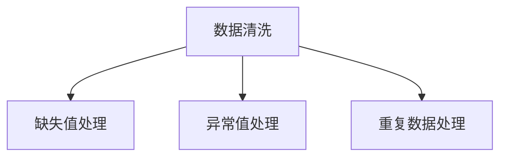

###### 2.1.2 数据归一化

数据归一化是指将数据转换为统一的尺度，以便算法可以更好地处理。常用的归一化方法包括最小-最大缩放、Z-score标准化等。

1. **最小-最大缩放**：将数据映射到[0, 1]区间，计算公式为：$$x' = \frac{x - \min(x)}{\max(x) - \min(x)}$$。
2. **Z-score标准化**：将数据转换为标准正态分布，计算公式为：$$x' = \frac{x - \mu}{\sigma}$$，其中$\mu$是均值，$\sigma$是标准差。

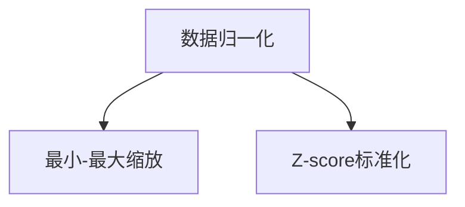

###### 2.1.3 数据降维

数据降维是指通过减少数据的维度，提高数据挖掘和分析的效率。常用的降维方法包括主成分分析（PCA）、因子分析（FA）和线性判别分析（LDA）等。

1. **主成分分析（PCA）**：通过线性变换将数据映射到新的坐标系中，保留最重要的特征，去除冗余信息。
2. **因子分析（FA）**：通过识别和提取数据中的潜在因子，降低数据的维度。
3. **线性判别分析（LDA）**：通过最大化类间方差和最小化类内方差，识别出数据的最佳线性分类方法。

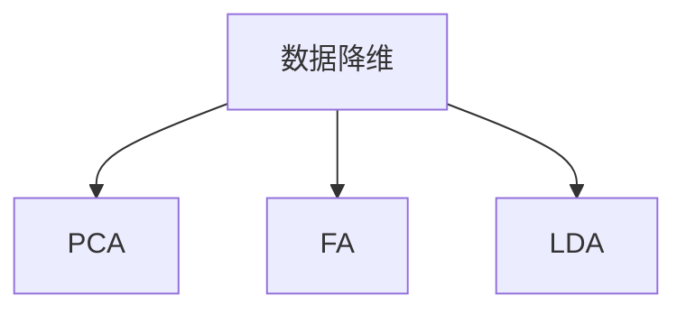

##### 2.2 数据探索性分析

数据探索性分析（Exploratory Data Analysis，简称EDA）是一种通过可视化手段对数据进行初步分析和理解的方法。EDA可以帮助我们识别数据的趋势、异常值和潜在的模式。以下是数据探索性分析的主要步骤：

###### 2.2.1 描述性统计

描述性统计是指通过计算数据的各种统计指标，如均值、中位数、标准差、最大值和最小值等，来描述数据的特征。

1. **中心趋势指标**：包括均值和中位数，用于描述数据的中心位置。
2. **离散度指标**：包括标准差和方差，用于描述数据的分散程度。
3. **分布形态指标**：如偏态和峰度，用于描述数据的分布形态。

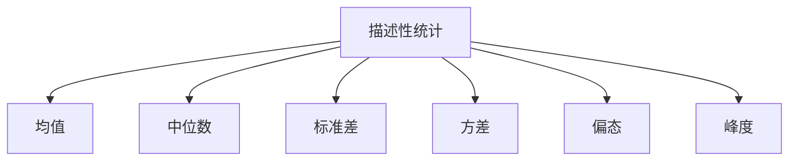

###### 2.2.2 数据可视化

数据可视化是将数据以图形的方式展示出来，使数据更加直观和易于理解。常用的数据可视化工具包括Matplotlib、Seaborn和Plotly等。

1. **散点图**：用于展示两个变量之间的关系。
2. **直方图**：用于展示数据的分布情况。
3. **箱线图**：用于展示数据的分布和异常值。

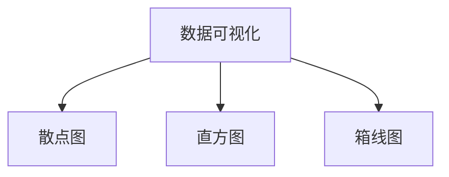

###### 2.2.3 关联规则挖掘

关联规则挖掘是数据挖掘中的一种重要方法，用于发现数据之间的潜在关联关系。常用的算法包括Apriori算法、FP-Growth算法和Eclat算法等。

1. **Apriori算法**：通过设置支持度和置信度阈值，发现数据集中的频繁项集。
2. **FP-Growth算法**：通过构建频繁模式树，降低计算复杂度，发现数据集中的频繁项集。
3. **Eclat算法**：基于FP-Growth算法，通过直接计算支持度，发现数据集中的频繁项集。

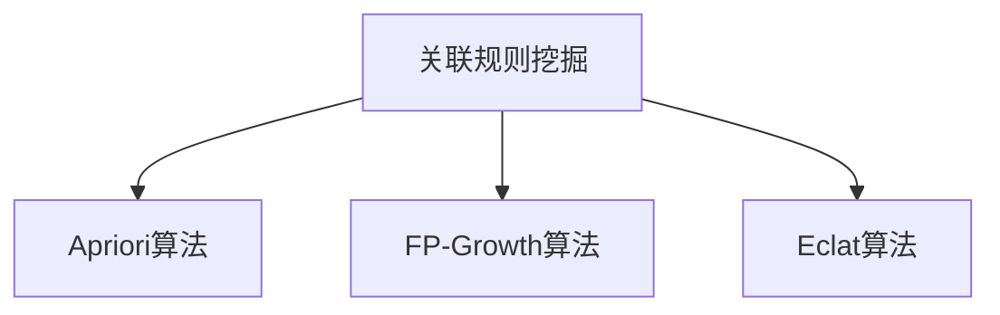

##### 2.3 数据库与数据存储技术

在数据预处理和探索过程中，数据库和数据存储技术起到了关键作用。合适的数据库和数据存储技术可以大大提高数据处理的效率和可靠性。以下是几种常用的数据库和数据存储技术：

###### 2.3.1 关系型数据库

关系型数据库是一种基于关系模型的数据库，如MySQL、PostgreSQL和Oracle等。关系型数据库通过表格来存储数据，并使用SQL语言进行数据查询和管理。

1. **优点**：结构化、易于查询和管理，支持复杂查询和事务处理。
2. **缺点**：扩展性较差，不适合存储大量非结构化数据。

###### 2.3.2 非关系型数据库

非关系型数据库是一种基于非关系模型的数据库，如MongoDB、Cassandra和Redis等。非关系型数据库通过键值对、文档、列族等数据结构来存储数据。

1. **优点**：扩展性好，适合存储大量非结构化数据，支持高并发读写。
2. **缺点**：查询复杂，不支持复杂的事务处理。

###### 2.3.3 分布式数据库系统

分布式数据库系统是一种通过分布式架构来存储和管理数据的系统，如Hadoop、Spark和Flink等。分布式数据库系统通过多台服务器共同工作，提供高可用性和高性能的数据处理能力。

1. **优点**：高可用性、高性能、扩展性强。
2. **缺点**：复杂度高，需要专业的运维和管理。

##### 2.4 数据预处理与探索的重要性

数据预处理和探索是知识发现过程中不可或缺的环节。它们的重要性体现在以下几个方面：

1. **数据质量**：数据预处理能够识别和纠正数据中的错误和异常，确保数据的质量。
2. **算法性能**：通过数据归一化和降维，可以提高算法的性能和效率。
3. **结果准确性**：数据预处理和探索有助于发现数据中的潜在模式和趋势，提高知识发现的准确性。
4. **减少数据冗余**：通过去除重复数据和异常值，可以减少数据冗余，提高数据的有效性。

##### 2.5 数据预处理与探索的最佳实践

在进行数据预处理和探索时，应遵循以下最佳实践：

1. **明确目标**：在开始数据预处理和探索之前，明确数据预处理的目标和预期结果，以确保数据处理过程的有效性。
2. **数据清洗**：确保数据清洗的全面性和准确性，避免因数据质量问题导致的分析结果偏差。
3. **数据可视化**：利用数据可视化工具，对数据进行初步分析，发现潜在的模式和趋势。
4. **选择合适的算法**：根据数据特征和需求，选择合适的预处理和探索算法，以提高数据处理的效率和准确性。
5. **文档记录**：详细记录数据预处理和探索的过程和结果，以便后续的数据分析和项目部署。

通过遵循这些最佳实践，可以确保数据预处理和探索过程的高效性和准确性，从而为知识发现提供可靠的数据基础。

### 总结

本章详细介绍了数据预处理和探索的过程，包括数据清洗、数据归一化、数据降维、描述性统计、数据可视化和关联规则挖掘等步骤。数据预处理和探索是知识发现过程中至关重要的环节，它们能够提高数据的质量、优化算法的性能，并提高知识发现的准确性。通过本章的学习，读者将能够更好地理解数据预处理和探索的重要性，并掌握相关的技术和方法。

#### 第3章：数据挖掘算法

数据挖掘算法是知识发现引擎的重要组成部分，它们通过从数据中提取隐藏的模式和规律，帮助程序员做出更加明智的决策。本章将介绍几种常见的数据挖掘算法，包括分类算法、聚类算法和关联规则挖掘算法。我们将分别探讨这些算法的基本概念、原理和应用，以便读者能够全面了解并掌握这些算法。

##### 3.1 分类算法

分类算法是一种将数据分为不同类别的数据挖掘技术。其目标是通过训练一个分类模型，能够对新数据进行准确的分类。常见的分类算法包括K-近邻算法（K-Nearest Neighbors, KNN）、决策树算法（Decision Tree）和随机森林算法（Random Forest）。

###### 3.1.1 K-近邻算法（K-Nearest Neighbors, KNN）

K-近邻算法是一种基于实例的算法，它通过计算测试样本与训练样本之间的相似度，来预测新样本的类别。具体原理如下：

1. **距离度量**：选择合适的距离度量，如欧氏距离、曼哈顿距离和余弦相似度等。
2. **邻居选择**：计算测试样本与训练样本之间的距离，选取距离最近的K个邻居。
3. **类别预测**：根据邻居的类别进行投票，选取出现频率最高的类别作为测试样本的预测类别。

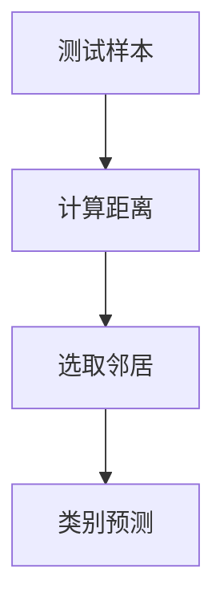

K-近邻算法的优点在于简单易实现，且不需要训练模型。然而，它对噪声数据敏感，且当数据量很大时，计算复杂度较高。

###### 3.1.2 决策树算法（Decision Tree）

决策树算法通过一系列的判断条件，将数据逐层划分，形成一棵树状结构。每个节点代表一个属性，每个分支代表一个属性值。具体原理如下：

1. **特征选择**：选择最优的特征进行划分，通常使用信息增益（Information Gain）或基尼不纯度（Gini Impurity）作为划分标准。
2. **节点划分**：根据选择的特征和其值，将数据划分为不同的子集。
3. **递归划分**：对子集继续进行划分，直到满足停止条件，如最大深度、最小样本数等。

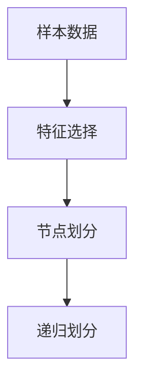

决策树算法的优点在于直观易懂，易于解释。然而，它可能过度拟合训练数据，且当特征较多时，计算复杂度较高。

###### 3.1.3 随机森林算法（Random Forest）

随机森林算法是由多个决策树组成的集成模型，通过多个决策树的投票结果进行预测。具体原理如下：

1. **构建决策树**：随机地从特征集合中选择一部分特征，构建多棵决策树。
2. **集成投票**：对测试样本进行预测，选择出现频率最高的类别作为最终预测结果。

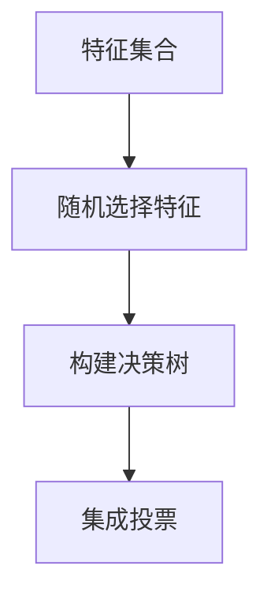

随机森林算法的优点在于可以降低过拟合，提高模型的泛化能力。然而，它对计算资源要求较高，且不易解释。

##### 3.2 聚类算法

聚类算法是一种将数据分为不同簇的无监督学习方法。其目标是通过发现数据中的自然分组，揭示数据的内在结构和模式。常见的聚类算法包括K-均值聚类算法（K-Means Clustering）、层次聚类算法（Hierarchical Clustering）和密度聚类算法（Density-Based Clustering）。

###### 3.2.1 K-均值聚类算法（K-Means Clustering）

K-均值聚类算法是最常用的聚类算法之一，它通过迭代过程将数据分为K个簇。具体原理如下：

1. **初始化**：随机选择K个样本作为初始聚类中心。
2. **分配样本**：计算每个样本与聚类中心的距离，将其分配到最近的聚类中心所代表的簇。
3. **更新中心**：重新计算每个簇的中心，并更新聚类中心。
4. **重复步骤2和3**，直到聚类中心不再变化或满足停止条件。

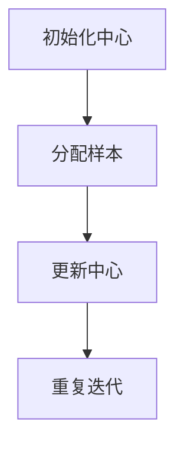

K-均值聚类算法的优点在于简单高效，适用于大规模数据。然而，它对初始聚类中心敏感，且可能导致局部最优解。

###### 3.2.2 层次聚类算法（Hierarchical Clustering）

层次聚类算法通过逐步合并或分裂已有的簇，形成一棵层次树。具体原理如下：

1. **合并或分裂**：根据簇之间的距离，选择最近的两个簇进行合并或分裂。
2. **更新距离**：更新簇之间的距离，以便下一次合并或分裂。
3. **构建层次树**：重复合并或分裂过程，形成层次树。

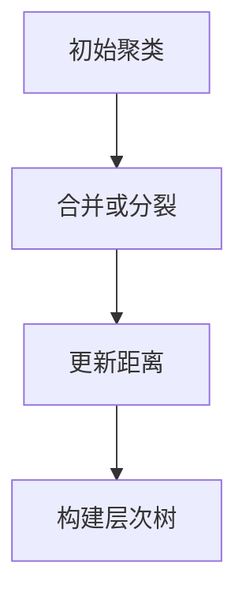

层次聚类算法的优点在于可以可视化数据结构，适用于发现不同尺度的聚类。然而，它对计算资源要求较高，且不易解释。

###### 3.2.3 密度聚类算法（Density-Based Clustering）

密度聚类算法通过发现数据中的高密度区域，形成簇。具体原理如下：

1. **密度计算**：计算每个点的密度，并确定核心点和边界点。
2. **扩展簇**：以核心点为中心，扩展簇到边界点。
3. **合并簇**：将相邻的高密度区域合并为同一簇。

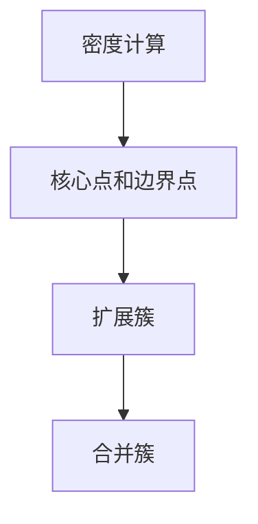

密度聚类算法的优点在于可以自动发现任意形状的簇，适用于高维数据。然而，它可能对噪声数据敏感。

##### 3.3 关联规则挖掘算法

关联规则挖掘算法用于发现数据之间的潜在关联关系。常见的算法包括Apriori算法、FP-Growth算法和Eclat算法。

###### 3.3.1 Apriori算法

Apriori算法通过递归地发现频繁项集，生成关联规则。具体原理如下：

1. **频繁项集生成**：通过扫描数据集，统计每个项集的出现频率，识别频繁项集。
2. **规则生成**：从频繁项集中生成关联规则，通常使用支持度（Support）和置信度（Confidence）作为规则评估标准。

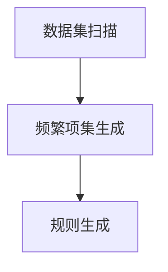

Apriori算法的优点在于简单易实现，适用于稀疏数据。然而，它可能产生大量冗余项集，计算复杂度较高。

###### 3.3.2 FP-Growth算法

FP-Growth算法通过构建频繁模式树，降低计算复杂度。具体原理如下：

1. **频繁模式树构建**：通过连接频繁项集，构建频繁模式树。
2. **项集压缩**：对频繁模式树进行压缩，减少存储空间。
3. **规则生成**：从频繁模式树中提取关联规则。

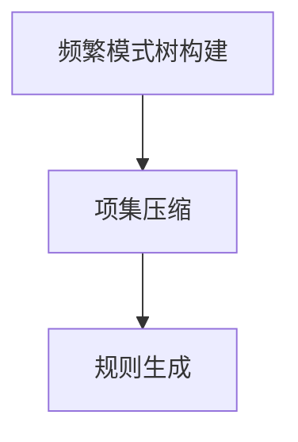

FP-Growth算法的优点在于可以高效地发现频繁项集和关联规则，适用于大规模数据。然而，它对内存要求较高。

###### 3.3.3 Eclat算法

Eclat算法是基于FP-Growth算法的一种高效关联规则挖掘算法。具体原理如下：

1. **项集计数**：直接计算项集的出现频率，生成频繁项集。
2. **规则生成**：从频繁项集中生成关联规则。

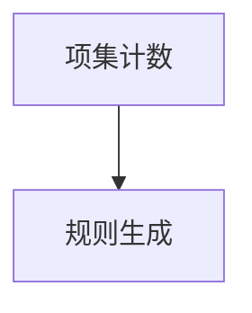

Eclat算法的优点在于计算复杂度较低，适用于稀疏数据。然而，它可能产生大量冗余项集。

##### 3.4 数据挖掘算法的选择与优化

在实际应用中，选择合适的数据挖掘算法和优化算法参数是关键。以下是一些选择和优化数据挖掘算法的建议：

1. **数据特征**：根据数据特征和问题需求，选择合适的算法。例如，对于分类问题，可以选择K-近邻、决策树或随机森林算法；对于聚类问题，可以选择K-均值、层次聚类或密度聚类算法。
2. **算法参数**：调整算法参数，以获得最佳性能。例如，K-近邻算法的K值、决策树的深度和随机森林的树数量等。
3. **交叉验证**：使用交叉验证方法，评估不同算法和参数的性能，选择最优模型。
4. **并行计算**：利用并行计算技术，提高算法的计算速度和效率。

通过合理选择和优化数据挖掘算法，可以大大提高知识发现的准确性和效率，为程序员提供有力的数据支持。

### 总结

本章介绍了数据挖掘算法的基本概念、原理和应用。分类算法、聚类算法和关联规则挖掘算法在知识发现过程中发挥着重要作用。通过本章的学习，读者将能够掌握这些算法的核心原理和实现方法，并为实际项目中的应用打下坚实的基础。在未来的学习和实践中，读者可以结合具体问题，选择合适的算法和参数，以实现最佳的数据挖掘效果。

#### 第4章：知识发现引擎在Web开发中的应用

知识发现引擎在Web开发中具有广泛的应用，能够显著提升用户体验、优化业务流程和增加收入。本章将详细探讨知识发现引擎在Web开发中的应用，包括用户行为分析、推荐系统和搜索引擎优化（SEO）等。

##### 4.1 使用知识发现引擎进行用户行为分析

用户行为分析是了解用户在网站上的行为模式，从而优化产品设计和提升用户体验的关键步骤。知识发现引擎能够自动收集、处理和分析用户行为数据，为Web开发者提供有价值的洞见。

###### 4.1.1 用户行为数据的收集

用户行为数据的收集包括以下几个方面：

1. **网页访问数据**：通过Web服务器日志或第三方分析工具（如Google Analytics）收集用户访问网页的时间、页面停留时间、页面跳转路径等信息。
2. **点击行为数据**：记录用户在网页上的点击行为，包括按钮点击、链接点击等。
3. **交互数据**：通过交互式元素（如搜索框、表单）收集用户的输入和操作数据。

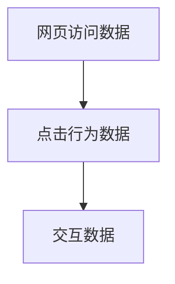

###### 4.1.2 用户行为数据的预处理

在分析用户行为数据之前，需要进行数据预处理，包括以下步骤：

1. **数据清洗**：去除数据中的噪声和异常值，如重复记录、无效数据等。
2. **数据归一化**：将不同尺度的数据进行归一化处理，以便后续分析。
3. **数据降维**：通过降维技术（如主成分分析PCA）减少数据的维度，提高分析效率。

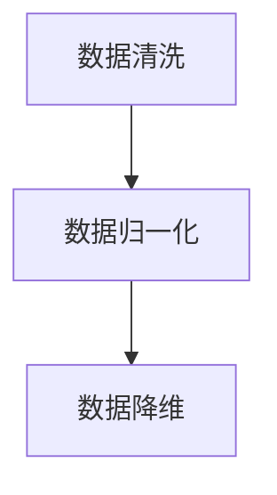

###### 4.1.3 用户行为数据的分析

通过知识发现引擎，可以从用户行为数据中提取出以下有价值的信息：

1. **用户兴趣和偏好**：通过聚类分析，发现用户的兴趣和偏好，为个性化推荐提供依据。
2. **用户行为模式**：通过时间序列分析，识别用户的访问模式和行为习惯。
3. **用户流失预警**：通过异常检测，识别出可能流失的用户，并采取相应措施进行挽留。

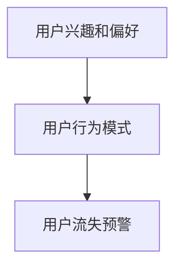

##### 4.2 基于知识发现引擎的推荐系统

推荐系统是Web开发中的重要应用，能够提高用户留存率和转化率。知识发现引擎能够通过分析用户行为数据，为网站提供个性化的推荐服务。

###### 4.2.1 推荐系统的基本概念

推荐系统通常分为以下几种类型：

1. **基于内容的推荐**：根据用户的历史行为和兴趣，推荐相似的内容。
2. **基于协同过滤的推荐**：根据用户的相似度，推荐其他用户喜欢的物品。

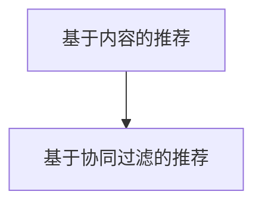

###### 4.2.2 基于内容的推荐

基于内容的推荐主要通过以下步骤实现：

1. **内容特征提取**：提取用户和物品的特征，如文本、图像、标签等。
2. **相似度计算**：计算用户和物品之间的相似度，通常使用余弦相似度、欧氏距离等。
3. **推荐生成**：根据用户的历史行为和相似度，生成个性化推荐列表。

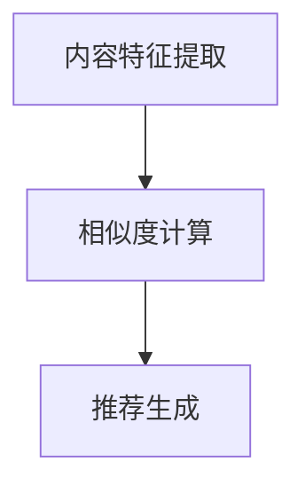

###### 4.2.3 基于协同过滤的推荐

基于协同过滤的推荐主要通过以下步骤实现：

1. **用户相似度计算**：计算用户之间的相似度，通常使用用户行为的余弦相似度、皮尔逊相关系数等。
2. **物品相似度计算**：计算物品之间的相似度，通常使用物品的评分、标签等。
3. **推荐生成**：根据用户的相似度和物品的相似度，生成个性化推荐列表。

```mermaid
graph TD
A[用户相似度计算] --> B[物品相似度计算]
B --> C[推荐生成]
```

##### 4.3 基于知识发现引擎的搜索引擎优化（SEO）

搜索引擎优化（SEO）是提高网站在搜索引擎中排名的关键。知识发现引擎能够通过分析关键词数据，优化网站内容和结构，提高网站的搜索引擎排名。

###### 4.3.1 搜索引擎优化（SEO）的基本概念

SEO主要包括以下方面：

1. **关键词优化**：选择合适的关键词，提高网站在搜索引擎中的排名。
2. **内容优化**：优化网站内容，提高用户体验和搜索引擎友好性。
3. **链接优化**：优化网站内部和外部链接，提高网站的权威性和可信度。

```mermaid
graph TD
A[关键词优化] --> B[内容优化]
B --> C[链接优化]
```

###### 4.3.2 使用知识发现引擎进行关键词分析

知识发现引擎能够通过以下步骤进行关键词分析：

1. **关键词收集**：收集用户在搜索引擎中输入的关键词，包括网站内部和外部关键词。
2. **关键词分布分析**：分析关键词在网站内容中的分布情况，识别高频关键词。
3. **关键词优化**：根据关键词的搜索量和竞争程度，选择合适的关键词进行优化。

```mermaid
graph TD
A[关键词收集] --> B[关键词分布分析]
B --> C[关键词优化]
```

###### 4.3.3 基于知识发现引擎的搜索引擎优化策略

基于知识发现引擎的搜索引擎优化策略包括：

1. **内容优化**：根据关键词分析结果，优化网站内容，提高关键词密度和相关性。
2. **链接优化**：通过内外部链接建设，提高网站的权威性和可信度。
3. **数据驱动优化**：持续监控和优化网站数据，根据用户行为和搜索引擎排名进行调整。

```mermaid
graph TD
A[内容优化] --> B[链接优化]
B --> C[数据驱动优化]
```

##### 4.4 实际案例

以下是一个基于知识发现引擎的搜索引擎优化（SEO）的实际案例：

###### 4.4.1 案例背景

某电子商务网站希望通过优化搜索引擎排名，提高网站流量和销售额。

###### 4.4.2 数据收集

通过知识发现引擎，收集以下数据：

1. **用户搜索关键词**：从搜索引擎日志中收集用户搜索的关键词。
2. **网站内容**：从网站内容中提取关键词和标签。
3. **用户行为数据**：从网站分析工具中收集用户点击、页面停留时间等行为数据。

```mermaid
graph TD
A[用户搜索关键词] --> B[网站内容]
B --> C[用户行为数据]
```

###### 4.4.3 关键词分析

通过知识发现引擎，对关键词进行分析：

1. **关键词分布**：识别网站中高频关键词。
2. **关键词搜索量**：分析关键词的搜索量和竞争程度。
3. **关键词优化**：选择具有高搜索量和适中竞争程度的关键词进行优化。

```mermaid
graph TD
A[关键词分布] --> B[关键词搜索量]
B --> C[关键词优化]
```

###### 4.4.4 内容优化

根据关键词分析结果，优化网站内容：

1. **标题优化**：将关键词融入网站标题，提高关键词密度。
2. **描述优化**：在网站描述中突出关键词，提高用户体验和搜索引擎友好性。
3. **内部链接优化**：通过内部链接建设，提高关键词的相关性。

```mermaid
graph TD
A[标题优化] --> B[描述优化]
B --> C[内部链接优化]
```

###### 4.4.5 链接优化

通过以下策略进行链接优化：

1. **外部链接建设**：与其他网站建立友情链接，提高网站权威性。
2. **内部链接优化**：通过合理的内部链接结构，提高关键词的相关性和用户停留时间。

```mermaid
graph TD
A[外部链接建设] --> B[内部链接优化]
```

通过知识发现引擎进行搜索引擎优化，该电子商务网站的搜索引擎排名得到了显著提升，网站流量和销售额也有所增加。

##### 4.5 结论

知识发现引擎在Web开发中的应用非常广泛，通过用户行为分析、推荐系统和搜索引擎优化等，能够显著提升用户体验、优化业务流程和增加收入。未来，随着知识发现引擎技术的不断发展和成熟，其应用领域将更加广泛，为Web开发者提供更多的创新和机遇。

### 总结

本章详细介绍了知识发现引擎在Web开发中的应用，包括用户行为分析、推荐系统和搜索引擎优化。通过知识发现引擎，Web开发者能够深入分析用户行为、提供个性化推荐和优化搜索引擎排名，从而提升用户体验和业务收益。未来，知识发现引擎将在Web开发中发挥更加重要的作用，为开发者提供更多的创新和机遇。

#### 第5章：知识发现引擎在移动开发中的应用

随着智能手机和移动应用的普及，移动开发已经成为软件开发的重要领域。知识发现引擎（Knowledge Discovery Engine，简称KDE）在移动开发中的应用，为开发者提供了强大的数据分析和决策支持能力。本章将探讨知识发现引擎在移动开发中的应用，包括用户行为分析、推荐系统和搜索引擎优化（MSEO）等。

##### 5.1 基于知识发现引擎的移动应用用户行为分析

移动应用的用户行为分析是了解用户在移动端应用中的行为模式，从而优化产品设计和提升用户体验的关键。知识发现引擎能够自动收集、处理和分析用户行为数据，为移动开发者提供有价值的洞见。

###### 5.1.1 移动应用用户行为数据的收集

移动应用用户行为数据的收集包括以下几个方面：

1. **应用使用数据**：记录用户在应用中的使用时间、功能使用频率、页面停留时间等。
2. **交互数据**：收集用户与应用的交互数据，如点击、滑动、搜索等。
3. **位置数据**：通过GPS或其他传感器收集用户的位置信息。

```mermaid
graph TD
A[应用使用数据] --> B[交互数据]
B --> C[位置数据]
```

###### 5.1.2 移动应用用户行为数据的预处理

在分析用户行为数据之前，需要进行数据预处理，包括以下步骤：

1. **数据清洗**：去除数据中的噪声和异常值，如重复记录、无效数据等。
2. **数据归一化**：将不同尺度的数据进行归一化处理，以便后续分析。
3. **数据降维**：通过降维技术（如主成分分析PCA）减少数据的维度，提高分析效率。

```mermaid
graph TD
A[数据清洗] --> B[数据归一化]
B --> C[数据降维]
```

###### 5.1.3 移动应用用户行为数据的分析

通过知识发现引擎，可以从移动应用用户行为数据中提取出以下有价值的信息：

1. **用户兴趣和偏好**：通过聚类分析，发现用户的兴趣和偏好，为个性化推荐提供依据。
2. **用户行为模式**：通过时间序列分析，识别用户的访问模式和行为习惯。
3. **用户流失预警**：通过异常检测，识别出可能流失的用户，并采取相应措施进行挽留。

```mermaid
graph TD
A[用户兴趣和偏好] --> B[用户行为模式]
B --> C[用户流失预警]
```

##### 5.2 基于知识发现引擎的移动应用推荐系统

推荐系统是移动应用开发中的重要应用，能够提高用户留存率和转化率。知识发现引擎能够通过分析用户行为数据，为移动应用提供个性化的推荐服务。

###### 5.2.1 移动应用推荐系统的基本概念

移动应用推荐系统通常分为以下几种类型：

1. **基于内容的推荐**：根据用户的历史行为和兴趣，推荐相似的内容。
2. **基于协同过滤的推荐**：根据用户的相似度，推荐其他用户喜欢的应用。

```mermaid
graph TD
A[基于内容的推荐] --> B[基于协同过滤的推荐]
```

###### 5.2.2 基于内容的推荐

基于内容的推荐主要通过以下步骤实现：

1. **内容特征提取**：提取用户和应用的特征，如文本、图像、标签等。
2. **相似度计算**：计算用户和应用之间的相似度，通常使用余弦相似度、欧氏距离等。
3. **推荐生成**：根据用户的历史行为和相似度，生成个性化推荐列表。

```mermaid
graph TD
A[内容特征提取] --> B[相似度计算]
B --> C[推荐生成]
```

###### 5.2.3 基于协同过滤的推荐

基于协同过滤的推荐主要通过以下步骤实现：

1. **用户相似度计算**：计算用户之间的相似度，通常使用用户行为的余弦相似度、皮尔逊相关系数等。
2. **应用相似度计算**：计算应用之间的相似度，通常使用应用的评分、标签等。
3. **推荐生成**：根据用户的相似度和应用的相似度，生成个性化推荐列表。

```mermaid
graph TD
A[用户相似度计算] --> B[应用相似度计算]
B --> C[推荐生成]
```

##### 5.3 基于知识发现引擎的移动应用搜索引擎优化（MSEO）

移动应用搜索引擎优化（MSEO）是提高应用在移动端搜索引擎中排名的关键。知识发现引擎能够通过分析关键词数据，优化应用内容和结构，提高应用的搜索引擎排名。

###### 5.3.1 移动应用搜索引擎优化（MSEO）的基本概念

移动应用搜索引擎优化（MSEO）主要包括以下方面：

1. **关键词优化**：选择合适的关键词，提高应用在搜索引擎中的排名。
2. **应用内容优化**：优化应用描述、标签和内部链接等，提高用户体验和搜索引擎友好性。
3. **链接优化**：优化应用内部和外部链接，提高应用的权威性和可信度。

```mermaid
graph TD
A[关键词优化] --> B[应用内容优化]
B --> C[链接优化]
```

###### 5.3.2 使用知识发现引擎进行关键词分析

知识发现引擎能够通过以下步骤进行关键词分析：

1. **关键词收集**：收集用户在搜索引擎中输入的关键词，包括应用内部和外部关键词。
2. **关键词分布分析**：分析关键词在应用内容中的分布情况，识别高频关键词。
3. **关键词优化**：根据关键词的搜索量和竞争程度，选择合适的关键词进行优化。

```mermaid
graph TD
A[关键词收集] --> B[关键词分布分析]
B --> C[关键词优化]
```

###### 5.3.3 基于知识发现引擎的MSEO策略

基于知识发现引擎的MSEO策略包括：

1. **内容优化**：根据关键词分析结果，优化应用描述、标签和内部链接等。
2. **链接优化**：通过内外部链接建设，提高应用的权威性和可信度。
3. **数据驱动优化**：持续监控和优化应用数据，根据用户行为和搜索引擎排名进行调整。

```mermaid
graph TD
A[内容优化] --> B[链接优化]
B --> C[数据驱动优化]
```

##### 5.4 实际案例

以下是一个基于知识发现引擎的移动应用搜索引擎优化（MSEO）的实际案例：

###### 5.4.1 案例背景

某移动应用希望通过优化搜索引擎排名，提高应用下载量和用户留存率。

###### 5.4.2 关键词分析

通过知识发现引擎，对关键词进行分析：

1. **关键词收集**：从搜索引擎日志和应用市场数据中收集关键词。
2. **关键词分布分析**：识别高频关键词和应用中关键词的分布情况。
3. **关键词优化**：根据关键词的搜索量和竞争程度，选择合适的关键词进行优化。

```mermaid
graph TD
A[关键词收集] --> B[关键词分布分析]
B --> C[关键词优化]
```

###### 5.4.3 应用内容优化

根据关键词分析结果，对应用内容进行优化：

1. **应用描述优化**：将关键词融入应用描述中，提高关键词密度和相关性。
2. **应用标签优化**：根据关键词选择合适的标签，提高应用的可搜索性。
3. **内部链接优化**：通过优化应用内部链接结构，提高关键词的相关性和用户体验。

```mermaid
graph TD
A[应用描述优化] --> B[应用标签优化]
B --> C[内部链接优化]
```

###### 5.4.4 链接优化

通过以下策略进行链接优化：

1. **外部链接建设**：与其他网站和应用建立友情链接，提高应用的权威性和可信度。
2. **内部链接优化**：通过优化应用内部链接结构，提高关键词的相关性和用户停留时间。

```mermaid
graph TD
A[外部链接建设] --> B[内部链接优化]
```

通过知识发现引擎进行MSEO优化，该移动应用在搜索引擎中的排名得到了显著提升，下载量和用户留存率也有所增加。

##### 5.5 结论

知识发现引擎在移动开发中的应用非常广泛，通过用户行为分析、推荐系统和搜索引擎优化等，能够显著提升移动应用的用户体验、下载量和用户留存率。未来，随着知识发现引擎技术的不断发展和成熟，其应用领域将更加广泛，为移动开发者提供更多的创新和机遇。

### 总结

本章详细介绍了知识发现引擎在移动开发中的应用，包括用户行为分析、推荐系统和搜索引擎优化。通过知识发现引擎，移动开发者能够深入分析用户行为、提供个性化推荐和优化搜索引擎排名，从而提升用户体验和业务收益。未来，知识发现引擎将在移动开发中发挥更加重要的作用，为开发者提供更多的创新和机遇。

### 第6章：知识发现引擎项目实战

在本章节中，我们将通过一个实际项目案例，详细介绍知识发现引擎的编程实战。项目目标是构建一个基于知识发现引擎的智能推荐系统，该系统将根据用户的行为和偏好，为用户推荐感兴趣的商品。以下是项目的详细实施步骤。

##### 6.1 项目背景与目标

项目名称：智能商品推荐系统

项目目标：
1. 收集并预处理用户行为数据。
2. 使用数据挖掘算法建立推荐模型。
3. 实现推荐系统的前端和后端接口。
4. 对推荐系统进行评估和优化。

##### 6.2 数据收集与处理

###### 6.2.1 数据收集

首先，需要收集用户行为数据，包括用户浏览历史、购买记录、搜索关键词等。这些数据可以通过网站分析工具（如Google Analytics）或API接口从电商平台上获取。

```mermaid
graph TD
A[收集用户行为数据]
A --> B[浏览历史]
A --> C[购买记录]
A --> D[搜索关键词]
```

###### 6.2.2 数据预处理

收集到的数据可能存在噪声和缺失值，需要进行预处理。预处理步骤包括数据清洗、数据归一化和数据降维。

1. **数据清洗**：去除重复记录和无效数据。
2. **数据归一化**：将不同尺度的数据转换为统一的尺度。
3. **数据降维**：通过主成分分析（PCA）减少数据维度。

```mermaid
graph TD
A[数据清洗] --> B[数据归一化]
B --> C[数据降维]
```

##### 6.3 算法选择与实现

在构建推荐系统时，可以选择基于内容的推荐和基于协同过滤的推荐算法。以下是算法的选择和实现步骤：

###### 6.3.1 基于内容的推荐

基于内容的推荐算法通过分析商品和用户的历史行为，提取商品和用户的特征，然后计算特征相似度来生成推荐列表。

1. **特征提取**：提取商品和用户的特征，如商品类别、用户浏览记录、商品标签等。
2. **相似度计算**：计算商品和用户之间的特征相似度，可以使用余弦相似度或欧氏距离。
3. **推荐生成**：根据特征相似度，为用户生成个性化推荐列表。

```mermaid
graph TD
A[特征提取] --> B[相似度计算]
B --> C[推荐生成]
```

###### 6.3.2 基于协同过滤的推荐

基于协同过滤的推荐算法通过分析用户之间的行为相似度，为用户推荐其他用户喜欢的商品。

1. **用户相似度计算**：计算用户之间的行为相似度，可以使用皮尔逊相关系数或余弦相似度。
2. **商品推荐**：根据用户相似度矩阵，为用户推荐其他用户喜欢的商品。
3. **推荐列表生成**：将推荐的商品按照相似度排序，生成推荐列表。

```mermaid
graph TD
A[用户相似度计算] --> B[商品推荐]
B --> C[推荐列表生成]
```

##### 6.4 系统集成与部署

在实现推荐算法后，需要将算法集成到系统中，并部署到服务器上。

###### 6.4.1 系统集成

系统集成包括以下步骤：

1. **后端开发**：使用Python、Java或Node.js等后端技术，实现推荐算法和API接口。
2. **前端开发**：使用HTML、CSS和JavaScript等前端技术，实现用户界面。
3. **数据库设计**：设计数据库表结构，存储用户行为数据和推荐结果。

```mermaid
graph TD
A[后端开发] --> B[前端开发]
B --> C[数据库设计]
```

###### 6.4.2 系统部署

系统部署包括以下步骤：

1. **服务器选择**：选择合适的云服务器或物理服务器。
2. **部署环境搭建**：安装操作系统、数据库和后端框架。
3. **部署代码**：将开发好的代码部署到服务器上，并进行调试和测试。

```mermaid
graph TD
A[服务器选择] --> B[部署环境搭建]
B --> C[部署代码]
```

##### 6.5 系统测试与评估

在系统部署后，需要对推荐系统进行测试和评估，确保其性能和效果。

###### 6.5.1 系统测试

系统测试包括以下内容：

1. **功能测试**：测试推荐系统的各项功能是否正常。
2. **性能测试**：测试推荐系统的响应时间和并发处理能力。
3. **兼容性测试**：测试推荐系统在不同浏览器和设备上的兼容性。

```mermaid
graph TD
A[功能测试] --> B[性能测试]
B --> C[兼容性测试]
```

###### 6.5.2 系统评估

系统评估包括以下内容：

1. **准确率**：评估推荐系统的准确率，即推荐的商品是否与用户兴趣相符。
2. **召回率**：评估推荐系统的召回率，即推荐系统是否能够推荐出用户可能感兴趣的商品。
3. **用户满意度**：评估用户对推荐系统的满意度。

```mermaid
graph TD
A[准确率评估] --> B[召回率评估]
B --> C[用户满意度评估]
```

##### 6.6 优化与迭代

根据测试和评估结果，对推荐系统进行优化和迭代，以提高系统的性能和用户体验。

1. **算法优化**：通过调整算法参数，优化推荐效果。
2. **数据优化**：通过数据清洗和特征提取，提高数据质量。
3. **前端优化**：通过改进用户界面和交互设计，提升用户体验。

```mermaid
graph TD
A[算法优化] --> B[数据优化]
B --> C[前端优化]
```

##### 6.7 总结

通过本章节的实战案例，我们详细介绍了知识发现引擎在智能推荐系统项目中的应用。从数据收集与处理、算法选择与实现、系统集成与部署，到系统测试与评估，每个步骤都至关重要。通过不断优化和迭代，我们可以构建出一个高效、准确的推荐系统，为用户提供优质的体验。

### 总结

本章通过一个实际项目案例，详细介绍了知识发现引擎在移动开发中的应用。从数据收集与处理、算法选择与实现、系统集成与部署，到系统测试与评估，每个环节都充分展示了知识发现引擎如何通过技术手段提高系统的性能和用户体验。通过本章节的学习，读者可以掌握知识发现引擎在项目开发中的实际应用，为未来的技术开发打下坚实的基础。

### 第7章：知识发现引擎编程最佳实践

在知识发现引擎的编程实践中，遵循最佳实践是确保代码质量、提升性能和实现安全性的关键。本章将介绍知识发现引擎编程中的编程规范与代码质量、性能优化以及安全性等方面的最佳实践。

##### 7.1 编程规范与代码质量

良好的编程规范是保证代码可读性、可维护性和可扩展性的基础。以下是一些编程规范和代码质量的最佳实践：

###### 7.1.1 编程规范

1. **代码格式**：统一代码风格，使用统一的缩进和空白字符，以提高代码的可读性。
2. **注释**：为代码添加必要的注释，解释代码的功能和逻辑，以便他人理解和维护。
3. **命名规范**：使用有意义的变量和函数名，避免使用缩写和模糊不清的名字。
4. **模块化**：将代码分为不同的模块和函数，实现代码的模块化和可复用性。

###### 7.1.2 代码质量

1. **代码审查**：定期进行代码审查，识别潜在的问题和改进空间。
2. **单元测试**：编写单元测试，验证代码的功能和性能，确保代码的正确性和可靠性。
3. **文档化**：编写详细的文档，包括代码说明、接口文档和使用示例，以便他人快速上手。

##### 7.2 性能优化

性能优化是知识发现引擎编程中的重要环节，直接影响系统的响应速度和处理能力。以下是一些性能优化的最佳实践：

###### 7.2.1 算法优化

1. **选择合适算法**：根据具体问题选择合适的算法，避免使用低效的算法。
2. **算法调优**：针对算法的参数进行调优，以提高算法的效率和效果。
3. **并行计算**：利用并行计算技术，加速数据处理和分析过程。

```python
from joblib import Parallel, delayed

def process_data(data):
    # 数据处理逻辑
    return result

data = [/* 大量数据 */]
results = Parallel(n_jobs=-1)(delayed(process_data)(d) for d in data)
```

###### 7.2.2 数据结构优化

1. **数据压缩**：对于大数据集，使用压缩数据结构，减少存储空间和I/O开销。
2. **缓存机制**：使用缓存机制，减少重复计算和数据读取。
3. **数据索引**：使用合适的索引技术，提高数据查询和访问速度。

```python
import sqlite3

conn = sqlite3.connect('data.db')
conn.create_index('index_name', 'column_name')
```

##### 7.3 知识发现引擎的性能优化

###### 7.3.1 算法优化

1. **选择高效算法**：如选择K-均值聚类算法的改进版本K-Means++，提高聚类效果。
2. **模型调优**：针对机器学习模型进行参数调优，如调整支持向量机的C值，提高分类准确性。

```python
from sklearn.svm import SVC

model = SVC(C=1.0)
model.fit(X_train, y_train)
```

###### 7.3.2 数据结构优化

1. **使用分布式存储**：如使用Hadoop或Spark等分布式计算框架，处理大规模数据。
2. **数据分区**：将数据分为多个分区，提高并行处理能力。

```python
from pyspark.sql import SparkSession

spark = SparkSession.builder.appName("DataProcessing").getOrCreate()
data = spark.read.csv("data.csv", header=True)
data = data.repartition(10)
```

##### 7.4 安全性与隐私保护

知识发现引擎涉及大量数据的处理和分析，因此安全性和隐私保护至关重要。以下是一些安全性和隐私保护的最佳实践：

###### 7.4.1 安全性威胁分析

1. **数据加密**：使用加密技术，如SSL/TLS，保护数据在传输过程中的安全性。
2. **访问控制**：设置严格的访问控制策略，确保只有授权用户可以访问敏感数据。
3. **安全审计**：定期进行安全审计，检测和修复潜在的安全漏洞。

```python
from flask import Flask, request, jsonify
from flask_cors import CORS

app = Flask(__name__)
CORS(app)

@app.route('/api/data', methods=['GET'])
def get_data():
    data = /* 从数据库获取数据 */
    return jsonify(data)
```

###### 7.4.2 隐私保护措施

1. **数据去识别化**：对敏感数据进行去识别化处理，如使用匿名化或加密技术。
2. **隐私政策**：制定明确的隐私政策，告知用户数据收集、处理和存储的目的和方式。
3. **用户权限管理**：为不同用户设置不同的权限，限制其对敏感数据的访问。

```python
from flask_sqlalchemy import SQLAlchemy

app.config['SQLALCHEMY_DATABASE_URI'] = 'sqlite:///data.db'
db = SQLAlchemy(app)

class User(db.Model):
    id = db.Column(db.Integer, primary_key=True)
    username = db.Column(db.String(80), unique=True, nullable=False)
    password = db.Column(db.String(120), nullable=False)
    role = db.Column(db.String(20), nullable=False)

    def check_password(self, password):
        return password == self.password
```

###### 7.4.3 安全性测试与评估

1. **渗透测试**：定期进行渗透测试，评估系统的安全性和脆弱性。
2. **代码审查**：对代码进行安全审查，识别潜在的安全漏洞。
3. **安全培训**：对开发人员进行安全培训，提高安全意识和技能。

```python
from flask import Flask, request, jsonify
from flask_cors import CORS
from flask_babel import Babel

app = Flask(__name__)
CORS(app)
babel = Babel(app)

@app.route('/api/login', methods=['POST'])
def login():
    username = request.form['username']
    password = request.form['password']
    user = User.query.filter_by(username=username).first()
    if user and user.check_password(password):
        return jsonify({'status': 'success', 'message': 'Login successful'})
    else:
        return jsonify({'status': 'error', 'message': 'Invalid credentials'})
```

##### 7.5 总结

知识发现引擎编程的最佳实践包括编程规范与代码质量、性能优化以及安全性与隐私保护。遵循这些最佳实践，可以确保代码的可读性、可维护性和可扩展性，提升系统的性能和安全性。通过持续学习和改进，开发者可以不断提升知识发现引擎编程的能力，为实际应用提供更高效、更可靠的解决方案。

### 总结

本章介绍了知识发现引擎编程的最佳实践，包括编程规范与代码质量、性能优化以及安全性与隐私保护。遵循这些最佳实践，可以确保代码的高质量和系统的稳定性，提高知识发现引擎的应用效果。通过本章的学习，开发者可以掌握知识发现引擎编程的核心技巧，为实际项目提供有力的技术支持。

### 附录

在本章中，我们将介绍知识发现引擎常用的工具与资源，包括数据库与数据存储、编程语言与框架、开源数据集与资源以及知识发现引擎社区与会议。

##### A.1 数据库与数据存储

在知识发现引擎的应用中，数据库和数据存储是关键组成部分。以下是一些常用的数据库和数据存储方案：

###### A.1.1 关系型数据库

- **MySQL**：一款开源的关系型数据库，广泛应用于Web应用和知识发现项目中。
- **PostgreSQL**：一款功能强大的开源关系型数据库，支持复杂查询和事务处理。
- **Oracle**：一款商业关系型数据库，提供高性能和高可靠性。

###### A.1.2 非关系型数据库

- **MongoDB**：一款基于文档的NoSQL数据库，适合存储半结构化和非结构化数据。
- **Cassandra**：一款分布式NoSQL数据库，提供高可用性和高性能。
- **Redis**：一款高性能的内存存储数据库，适合存储会话数据和缓存。

###### A.1.3 分布式数据库系统

- **Hadoop**：一款分布式数据处理框架，基于HDFS文件系统和MapReduce编程模型。
- **Spark**：一款高速分布式数据处理引擎，提供丰富的数据处理库和算法。
- **Flink**：一款流处理框架，支持批处理和实时处理，具有高性能和低延迟。

##### A.2 编程语言与框架

编程语言和框架在知识发现引擎开发中起着重要作用。以下是一些常用的编程语言和框架：

###### A.2.1 Python

- **Python**：一款高级编程语言，具有简洁易读的语法，广泛应用于数据科学和机器学习领域。
- **Pandas**：一款Python库，用于数据操作和分析，提供强大的数据处理功能。
- **NumPy**：一款Python库，用于数值计算，提供高效的数组操作。

###### A.2.2 R

- **R**：一款专门用于统计分析和数据科学的编程语言，提供丰富的统计分析和可视化工具。
- **ggplot2**：一款R库，用于数据可视化，提供美观的图形生成功能。
- **dplyr**：一款R库，用于数据操作，提供简洁高效的数据操作语法。

###### A.2.3 SQL

- **SQL**：一款用于数据库查询和管理的语言，广泛应用于关系型数据库。
- **SQLAlchemy**：一款Python ORM（对象关系映射）库，用于简化数据库操作。
- **SQLite**：一款轻量级的关系型数据库，常用于嵌入式应用和知识发现项目。

##### A.3 开源数据集与资源

开源数据集是知识发现引擎研究和开发的重要资源。以下是一些常用的开源数据集和资源：

###### A.3.1 Kaggle

- **Kaggle**：一个数据科学竞赛平台，提供大量高质量的数据集。
- **UCI机器学习库**：一个包含多种领域数据集的库，用于机器学习和数据挖掘研究。
- **OpenML**：一个开源机器学习平台，提供丰富的数据集和算法资源。

###### A.3.2 其他数据集

- **Google Dataset Search**：一个搜索开源数据集的平台，提供多种领域的数据集。
- **NASA Open Data**：NASA提供的开放数据集，包括地球科学、太空探索等领域的数据。
- **KDNuggets**：一个数据科学资源网站，提供最新的数据集、工具和论文。

##### A.4 知识发现引擎社区与会议

知识发现引擎是一个快速发展的领域，相关社区和会议为研究人员和开发者提供了交流和学习的机会。以下是一些主要的社区和会议：

###### A.4.1 KDD会议

- **KDD（知识发现与数据挖掘）会议**：是全球数据挖掘领域最权威的会议之一，每年举办一次。

###### A.4.2 JSM会议

- **JSM（统计学会）会议**：是一个综合性的统计学术会议，涉及多个领域，包括知识发现。

###### A.4.3 WSDM会议

- **WSDM（网络、社交和多媒体数据挖掘）会议**：专注于网络、社交和多媒体领域的数据挖掘研究。

- **其他社区**：如Kaggle社区、DataCamp社区和机器学习社区等，提供了丰富的学习资源和交流平台。

通过使用这些工具和资源，研究人员和开发者可以更好地开展知识发现引擎的研究和开发工作，推动领域的发展。

### 总结

附录部分提供了知识发现引擎编程的常用工具和资源，包括数据库与数据存储、编程语言与框架、开源数据集与资源以及知识发现引擎社区与会议。这些工具和资源为知识发现引擎的开发提供了强大的支持，有助于研究人员和开发者开展高效、可靠的研究和开发工作。通过利用这些资源，开发者可以不断提升自己的技术能力，为知识发现引擎的进步做出贡献。

