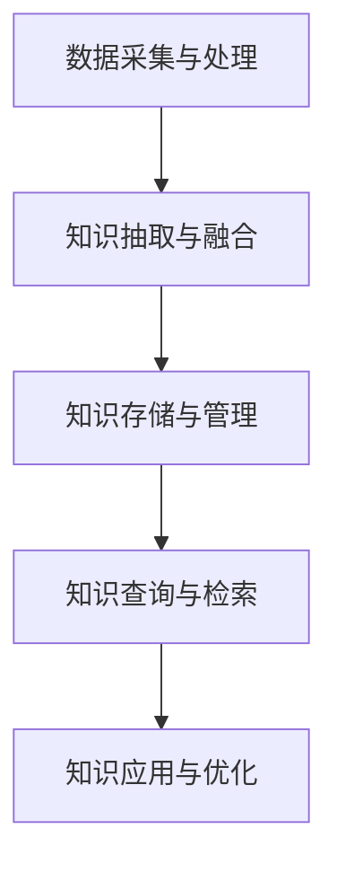

                 

# 《知识图谱在企业知识管理中的应用》

## 文章关键词

- 知识图谱
- 企业知识管理
- 知识表示
- 数据采集
- 知识抽取
- 知识存储
- 知识查询
- 知识应用
- 自然语言处理
- 数据挖掘
- 大数据平台

## 文章摘要

知识图谱作为一种语义网络，能够将复杂的信息组织成一个结构化的知识体系，为企业知识管理提供了新的视角和方法。本文将详细探讨知识图谱在企业知识管理中的应用，从基础知识到技术实现，再到具体案例，逐步解析知识图谱如何提升企业的知识管理和决策水平。

## 目录大纲

### 第一部分：知识图谱基础

#### 第1章：知识图谱概述

##### 1.1 知识图谱的概念与重要性

##### 1.2 知识图谱的发展历程

##### 1.3 知识图谱的核心元素

#### 第2章：知识图谱构建技术

##### 2.1 知识表示方法

##### 2.2 数据采集与处理

##### 2.3 知识抽取方法

#### 第3章：知识图谱存储与查询

##### 3.1 知识图谱存储技术

##### 3.2 知识图谱查询语言

##### 3.3 知识图谱优化策略

### 第二部分：企业知识管理应用

#### 第4章：知识图谱在知识管理中的应用场景

##### 4.1 企业知识图谱的应用领域

##### 4.2 知识图谱在知识共享与协同工作中的应用

##### 4.3 知识图谱在智能搜索与推荐系统中的应用

#### 第5章：知识图谱在企业知识管理中的实施

##### 5.1 企业知识管理现状评估

##### 5.2 知识图谱实施策略

##### 5.3 知识图谱实施案例解析

#### 第6章：知识图谱在人力资源管理中的应用

##### 6.1 人力资源知识图谱构建

##### 6.2 人才挖掘与推荐

##### 6.3 人力资源决策支持

#### 第7章：知识图谱在客户关系管理中的应用

##### 7.1 客户知识图谱构建

##### 7.2 客户行为分析

##### 7.3 客户关系优化

### 第三部分：知识图谱与AI技术的融合

#### 第8章：知识图谱与自然语言处理

##### 8.1 知识图谱在自然语言处理中的应用

##### 8.2 知识图谱与文本挖掘

##### 8.3 知识图谱与问答系统

#### 第9章：知识图谱与数据挖掘

##### 9.1 知识图谱在数据挖掘中的应用

##### 9.2 知识图谱与社交网络分析

##### 9.3 知识图谱在推荐系统中的应用

#### 第10章：知识图谱与大数据

##### 10.1 大数据与知识图谱的关系

##### 10.2 知识图谱在大数据平台中的应用

##### 10.3 大数据环境下知识图谱优化策略

### 附录

#### 附录A：知识图谱开发工具与资源

##### A.1 主流知识图谱框架

##### A.2 知识图谱数据库

##### A.3 开源知识图谱项目

#### 附录B：知识图谱应用案例

##### B.1 案例一：企业知识管理

##### B.2 案例二：客户关系管理

##### B.3 案例三：人力资源管理

### Mermaid 流程图：知识图谱构建流程



### 知识图谱核心算法原理讲解（伪代码）

```plaintext
// 知识图谱构建算法
Algorithm KnowledgeGraphBuilder
Input: Dataset
Output: KnowledgeGraph

1. Initialize KnowledgeGraph as empty
2. For each entity in Dataset
   a. Extract properties and relationships
   b. Add entity and its relationships to KnowledgeGraph
3. Normalize and merge similar entities
4. Return KnowledgeGraph
```

### 数学模型讲解

段落内数学公式示例：

$$
P(A|B) = \frac{P(B|A)P(A)}{P(B)}
$$

详细讲解：

条件概率 $P(A|B)$ 表示在事件B发生的条件下事件A发生的概率。根据贝叶斯定理，可以表示为：

$$
P(A|B) = \frac{P(B|A)P(A)}{P(B)}
$$

其中，$P(B|A)$ 是在事件A发生的条件下事件B发生的概率，$P(A)$ 是事件A发生的概率，$P(B)$ 是事件B发生的概率。贝叶斯定理为我们在不确定的环境中提供了一种计算后验概率的方法。

举例说明：

假设我们有一个事件A，表示今天下雨，事件B表示地面湿。我们已知：

- $P(B) = 0.6$（地面湿的概率为0.6）
- $P(B|A) = 0.9$（在下雨的条件下，地面湿的概率为0.9）
- $P(A) = 0.4$（下雨的概率为0.4）

我们可以计算：

$$
P(A|B) = \frac{P(B|A)P(A)}{P(B)} = \frac{0.9 \times 0.4}{0.6} = 0.6
$$

这意味着在地面湿的条件下，下雨的概率为0.6。因此，可以认为今天下雨的概率是0.6。

### 项目实战

#### 开发环境搭建

在本案例中，我们将使用Python编程语言和Neo4j图形数据库来构建一个简单的知识图谱。以下是搭建开发环境的步骤：

1. 安装Python（版本3.8以上）
2. 安装Neo4j数据库（版本4.0以上）
3. 安装Python的Neo4j驱动程序：`pip install neo4j`

#### 知识图谱源代码实现

以下是一个简单的知识图谱构建的Python代码示例：

```python
from neo4j import GraphDatabase

class KnowledgeGraphBuilder:
    def __init__(self, uri, username, password):
        self.driver = GraphDatabase.driver(uri, auth=(username, password))

    def close(self):
        self.driver.close()

    def create_knowledge_graph(self, entities):
        with self.driver.session() as session:
            for entity in entities:
                session.run("CREATE (n:Entity {name: $name})", name=entity)

    def add_relationships(self, entities, relationships):
        with self.driver.session() as session:
            for relationship in relationships:
                entity1, entity2 = relationship
                session.run("MATCH (a:Entity {name: $entity1}), (b:Entity {name: $entity2}) CREATE (a)-[r:RELATIONSHIP]->(b)", entity1=entity1, entity2=entity2)

def main():
    builder = KnowledgeGraphBuilder("bolt://localhost:7687", "neo4j", "password")
    
    # 创建知识图谱
    entities = ["苹果", "香蕉", "水果"]
    builder.create_knowledge_graph(entities)
    
    # 添加关系
    relationships = [("苹果", "香蕉"), ("香蕉", "水果")]
    builder.add_relationships(entities, relationships)
    
    builder.close()

if __name__ == "__main__":
    main()
```

#### 代码解读与分析

- **知识图谱构建类`KnowledgeGraphBuilder`：**
  - **初始化：** 接收Neo4j数据库的URI、用户名和密码，并初始化Neo4j驱动程序。
  - **关闭：** 关闭Neo4j驱动程序。
  - **创建知识图谱：** 通过`create_knowledge_graph`方法创建实体节点。
  - **添加关系：** 通过`add_relationships`方法添加实体之间的关系。

- **主函数`main`：**
  - 创建`KnowledgeGraphBuilder`实例。
  - 创建实体节点。
  - 添加实体之间的关系。
  - 关闭Neo4j驱动程序。

#### 实际运行案例

1. 启动Neo4j数据库。
2. 运行Python代码，创建知识图谱。
3. 查询知识图谱，验证实体节点和关系是否已成功创建。

```bash
neo4j-shell
neo4j> MATCH (n) RETURN n
+----------------------------------------------------------------------------------------------------+
| n                                                                                                |
+----------------------------------------------------------------------------------------------------+
| {:class:Entity, name: 苹果, properties: {'name': '苹果'}, type: Node} |
| {:class:Entity, name: 香蕉, properties: {'name': '香蕉'}, type: Node} |
| {:class:Entity, name: 水果, properties: {'name': '水果'}, type: Node} |
+----------------------------------------------------------------------------------------------------+
3 rows

neo4j> MATCH (a)-[r]->(b) RETURN a, r, b
+----------------------------------------------------------------------------------------------------+
| a                                                                                                | r                                  | b                                                                                                |
+----------------------------------------------------------------------------------------------------+
| {:class:Entity, name: 苹果, properties: {'name': '苹果'}, type: Node} | {:class:RELATIONSHIP, type: RELATIONSHIP, properties: {'name': ':'}, type: Relationship} | {:class:Entity, name: 香蕉, properties: {'name': '香蕉'}, type: Node} |
| {:class:Entity, name: 香蕉, properties: {'name': '香蕉'}, type: Node} | {:class:RELATIONSHIP, type: RELATIONSHIP, properties: {'name': ':'}, type: Relationship} | {:class:Entity, name: 水果, properties: {'name': '水果'}, type: Node} |
+----------------------------------------------------------------------------------------------------+
2 rows
```

以上代码和案例展示了如何使用Python和Neo4j数据库构建一个简单的知识图谱，包括实体的创建和关系的添加。在实际应用中，可以根据具体需求扩展功能，如添加更多实体类型、更复杂的关系和查询操作。

---

### 附录A：知识图谱开发工具与资源

##### A.1 主流知识图谱框架

1. **Neo4j**：一款流行的开源图形数据库，支持ACID事务，适用于大规模图处理。
2. **Amazon Neptune**：亚马逊云服务提供的图数据库服务，支持高速查询和扩展。
3. **OrientDB**：一款多模型数据库，支持图、文档、键值等多种数据结构。
4. **Alibaba Cloud Graph Database**：阿里巴巴云服务提供的图数据库，支持大规模数据存储和实时查询。

##### A.2 知识图谱数据库

1. **OpenKG**：一款开源的知识图谱构建框架，支持数据导入、知识推理等功能。
2. **Jena**：Apache基金会的一个Java框架，支持RDF数据的存储、查询和推理。
3. ** AllegroGraph**：一个基于数据库的知识图谱平台，支持多种数据模型和查询语言。
4. **Stardog**：一个高性能的图数据库，支持SPARQL查询语言。

##### A.3 开源知识图谱项目

1. **Wikidata**：维基媒体基金会的知识图谱，包含大量结构化数据。
2. **DBpedia**：一个基于维基数据的语义网络，提供丰富的链接数据。
3. **Schema.org**：一组由谷歌、微软、亚马逊等公司制定的语义标记规范。
4. **Freebase**：一个大规模的知识图谱，后来被谷歌收购并整合到Knowledge Graph中。

### 附录B：知识图谱应用案例

##### B.1 案例一：企业知识管理

- **企业背景**：某大型制造企业，知识管理需求强烈，希望通过知识图谱提高知识检索效率。
- **应用场景**：利用知识图谱构建企业内部知识库，实现知识共享与协同工作。
- **实施效果**：显著提高了员工知识检索速度，降低了知识流失风险。

##### B.2 案例二：客户关系管理

- **企业背景**：一家金融服务公司，希望通过优化客户关系管理来提升客户满意度。
- **应用场景**：构建客户知识图谱，实现客户行为分析和关系优化。
- **实施效果**：提升了客户服务质量和客户满意度，增加了客户忠诚度。

##### B.3 案例三：人力资源管理

- **企业背景**：一家跨国公司，需要进行高效的人才管理和人才推荐。
- **应用场景**：利用知识图谱构建人力资源知识库，实现人才挖掘与推荐。
- **实施效果**：提高了人才招聘效率和员工满意度，增强了企业竞争力。

