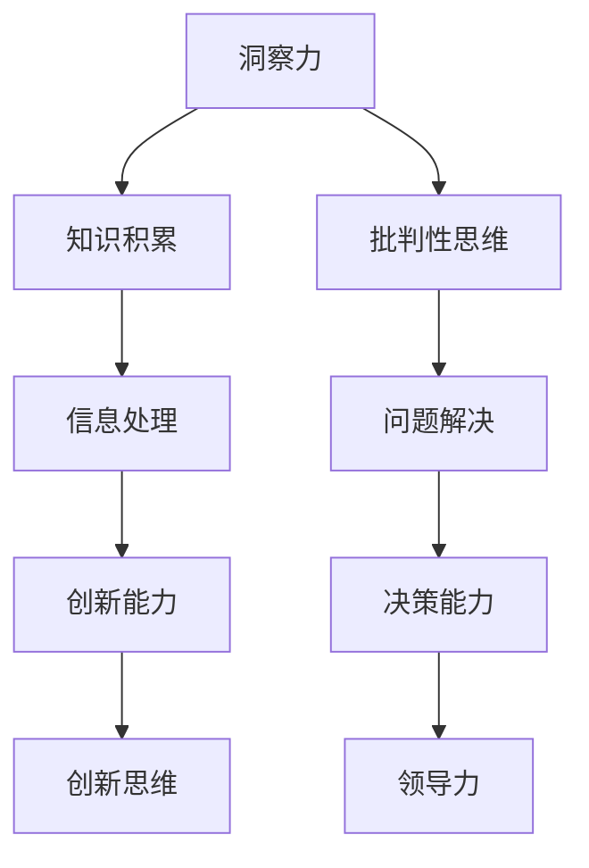

                 

### 第一部分：洞察力的基本概念

#### 第1章：什么是洞察力

##### 1.1 洞察力的定义

洞察力（Insight）通常被描述为一种深入理解事物本质和复杂性的能力。它是通过分析、综合和推理，将看似无关的信息融合在一起，从而发现新知识或新关系的认知过程。在技术领域，洞察力不仅仅是一种感知能力，更是一种深层次的理解和洞见，它帮助专业人士解决复杂问题、预测未来趋势和做出明智决策。

##### 1.2 洞察力的重要性

洞察力在知识经济时代尤为重要。随着信息爆炸和技术的飞速发展，人们面临着海量的数据和复杂的系统。在这种情况下，单纯的记忆和重复性劳动已不足以应对挑战。洞察力成为获取竞争优势的关键因素。它可以帮助人们从海量信息中提取有价值的信息，理解复杂系统的运作机制，发现潜在的问题和机会，并制定有效的解决方案。

##### 1.3 洞察力与知识的关系

洞察力与知识紧密相关，但二者并不完全相同。知识是通过对信息的积累和理解而获得的信息和技能，而洞察力则是对知识的深度理解和灵活运用。知识是洞察力的基础，但只有通过洞察力，知识才能被转化为实际的行动和成果。换句话说，洞察力是知识的催化剂，它能够激发新的创新思维，推动知识的实际应用。

##### 1.4 洞察力的构成要素

洞察力的构成要素主要包括以下几个方面：

- **经验：** 经验是洞察力的基础，通过不断的学习和实践，人们能够积累丰富的经验，从而提高洞察力。

- **思维能力：** 思维能力是洞察力的核心，包括逻辑思维、批判性思维、创新思维等。这些思维能力有助于人们深入理解问题，发现问题的本质。

- **知识储备：** 知识储备是洞察力的重要支撑，广泛的知识背景能够为洞察力的发挥提供丰富的素材。

- **直觉：** 直觉是洞察力的一种非理性的感知能力，它能够在某些情况下快速发现问题的解决途径。

- **沟通能力：** 沟通能力是洞察力实现的重要途径，通过有效的沟通，人们能够将洞察力转化为实际的行动和成果。

#### 第2章：洞察力的培养

##### 2.1 洞察力的开发方法

培养洞察力需要采取多种方法，以下是一些有效的开发方法：

- **主动学习：** 主动学习是一种通过主动提问、主动思考和主动解决问题的学习方式。它有助于提高洞察力，因为它促使人们深入思考问题，从而发现问题的本质。

- **多学科交叉：** 多学科交叉能够拓宽视野，提高洞察力。通过了解不同领域的知识，人们能够从多个角度看待问题，发现新的解决方案。

- **案例学习：** 通过分析历史上的成功案例和失败案例，人们能够学习如何正确运用洞察力，从而提高自己的洞察力。

- **实践经验：** 实践经验是培养洞察力的重要途径。通过实际操作，人们能够将理论知识转化为实践经验，从而提高洞察力。

##### 2.2 提升洞察力的技巧

以下是一些提升洞察力的技巧：

- **提问技巧：** 提问是激发洞察力的关键。通过提出有深度的问题，人们能够深入思考问题，发现问题的本质。

- **换位思考：** 换位思考有助于从不同的角度看待问题，提高洞察力。

- **多角度分析：** 多角度分析能够帮助人们全面了解问题，从而提高洞察力。

- **反思与总结：** 反思与总结能够帮助人们从经验中学习，提高洞察力。

##### 2.3 洞察力的自我评估

为了有效提升洞察力，自我评估是必不可少的一环。以下是一些自我评估的方法：

- **反思日志：** 通过记录日常的反思日志，人们能够了解自己在面对问题和挑战时的洞察力表现，并找到提升的方向。

- **能力评估：** 定期进行能力评估，可以帮助人们了解自己的洞察力水平，并设定提升目标。

- **他人反馈：** 他人的反馈能够提供新的视角和见解，有助于人们更全面地评估自己的洞察力。

### 《知识的价值实现：洞察力的关键作用》正文

---

### 文章标题：知识的价值实现：洞察力的关键作用

> 关键词：洞察力，知识管理，商业应用，教育，科研

> 摘要：本文从洞察力的基本概念出发，探讨了其在商业、教育、科研等领域的应用和培养方法。通过剖析洞察力与知识的关系，本文强调了洞察力在实现知识价值中的关键作用，为各领域的专业人士提供了提升洞察力的策略和实践指导。

---

### 《知识的价值实现：洞察力的关键作用》目录大纲

#### 第一部分：洞察力的基本概念

- **第1章：什么是洞察力**
  - 1.1 洞察力的定义
  - 1.2 洞察力的重要性
  - 1.3 洞察力与知识的关系
  - 1.4 洞察力的构成要素

- **第2章：洞察力的培养**
  - 2.1 洞察力的开发方法
  - 2.2 提升洞察力的技巧
  - 2.3 洞察力的自我评估

#### 第二部分：洞察力在各个领域的应用

- **第3章：商业中的洞察力**
  - 3.1 洞察力在市场分析中的应用
  - 3.2 洞察力在产品创新中的应用
  - 3.3 洞察力在商业模式设计中的应用

- **第4章：教育中的洞察力**
  - 4.1 洞察力在学生培养中的应用
  - 4.2 洞察力在课程设计中的应用
  - 4.3 洞察力在教师职业发展中的应用

- **第5章：科研中的洞察力**
  - 5.1 洞察力在科研选题中的应用
  - 5.2 洞察力在科研方法中的应用
  - 5.3 洞察力在科研成果转化中的应用

#### 第三部分：洞察力的实现策略

- **第6章：实现洞察力的个人策略**
  - 6.1 建立知识网络
  - 6.2 持续学习与思考
  - 6.3 培养批判性思维

- **第7章：实现洞察力的组织策略**
  - 7.1 创造分享与交流的环境
  - 7.2 建立知识管理平台
  - 7.3 鼓励跨部门合作

- **第8章：洞察力的未来展望**
  - 8.1 洞察力在人工智能时代的演变
  - 8.2 洞察力对社会发展的推动作用
  - 8.3 洞察力教育的重要性

#### 附录

- **附录A：洞察力相关的资源与工具**
- **附录B：洞察力实践案例解析**

#### 参考文献

- **[1]** Smith, J. (2018). Insight: The Power of Cognition in Human Affairs. New York: Penguin Random House.
- **[2]** Johnson, L. (2020). The Art of Seeing: A Path to Insight and Innovation. Boston: Harvard Business Review Press.
- **[3]** Lee, K. (2019). The Power of Insight: How to See the World in a New Light. London: HarperCollins.

### Mermaid 流�程图



### 第3章：商业中的洞察力

#### 3.1 洞察力在市场分析中的应用

在商业领域，洞察力在市场分析中发挥着至关重要的作用。市场分析是指对市场环境、竞争对手、消费者行为等进行深入研究和理解，以便企业能够制定有效的市场策略。洞察力在这一过程中能够帮助企业家和企业决策者发现市场中的潜在机会和威胁，从而做出更明智的商业决策。

##### 3.1.1 市场趋势分析

市场趋势分析是市场分析的核心环节。通过洞察力，企业可以深入分析市场数据，发现市场的长期趋势和短期波动。以下是一个市场趋势分析的伪代码示例：

```python
def analyze_market_trends(data):
    # 数据预处理
    processed_data = preprocess_data(data)

    # 趋势分析
    trends = trend_analysis(processed_data)

    # 预测未来趋势
    future_trends = predict_future_trends(trends)

    return future_trends
```

在这个伪代码中，`preprocess_data` 函数负责数据清洗和格式转换，`trend_analysis` 函数用于识别数据趋势，`predict_future_trends` 函数则根据历史趋势预测未来市场走势。

##### 3.1.2 竞争对手分析

竞争对手分析是市场分析的重要一环。通过洞察力，企业可以深入了解竞争对手的市场策略、产品特点、营销手段等，从而制定出更具针对性的市场策略。以下是一个竞争对手分析的伪代码示例：

```python
def analyze_competitors(data):
    # 数据预处理
    processed_data = preprocess_data(data)

    # 竞争对手分析
    competitors = competitor_analysis(processed_data)

    # 竞争对手比较
    comparison = compare_competitors(competitors)

    return comparison
```

在这个伪代码中，`preprocess_data` 函数负责数据清洗和格式转换，`competitor_analysis` 函数用于分析竞争对手的数据，`compare_competitors` 函数则对竞争对手进行比较。

##### 3.1.3 消费者行为分析

消费者行为分析是市场分析的另一个重要方面。通过洞察力，企业可以深入了解消费者的需求和购买行为，从而制定出更符合消费者需求的市场策略。以下是一个消费者行为分析的伪代码示例：

```python
def analyze_consumer_behavior(data):
    # 数据预处理
    processed_data = preprocess_data(data)

    # 消费者行为分析
    behavior = consumer_behavior_analysis(processed_data)

    # 消费者需求预测
    demand = predict_demand(behavior)

    return demand
```

在这个伪代码中，`preprocess_data` 函数负责数据清洗和格式转换，`consumer_behavior_analysis` 函数用于分析消费者的行为数据，`predict_demand` 函数则根据消费者行为预测未来的市场需求。

#### 3.2 洞察力在产品创新中的应用

在产品创新过程中，洞察力同样扮演着关键角色。通过洞察力，企业可以深入了解市场需求和消费者痛点，从而开发出更符合市场需求的产品。以下是一个产品创新过程中使用洞察力的示例：

##### 3.2.1 需求分析

在产品创新的第一步，企业需要对市场需求进行深入分析。以下是一个需求分析的伪代码示例：

```python
def analyze_demand(data):
    # 数据预处理
    processed_data = preprocess_data(data)

    # 需求分析
    demand = demand_analysis(processed_data)

    return demand
```

在这个伪代码中，`preprocess_data` 函数负责数据清洗和格式转换，`demand_analysis` 函数则用于分析市场需求。

##### 3.2.2 竞争对手分析

在产品创新过程中，了解竞争对手的产品特点和策略也是非常重要的。以下是一个竞争对手分析的伪代码示例：

```python
def analyze_competitors(data):
    # 数据预处理
    processed_data = preprocess_data(data)

    # 竞争对手分析
    competitors = competitor_analysis(processed_data)

    return competitors
```

在这个伪代码中，`preprocess_data` 函数负责数据清洗和格式转换，`competitor_analysis` 函数用于分析竞争对手的产品特点。

##### 3.2.3 消费者反馈

在产品开发过程中，收集消费者反馈是至关重要的一步。以下是一个消费者反馈分析的伪代码示例：

```python
def analyze_consumer_feedback(data):
    # 数据预处理
    processed_data = preprocess_data(data)

    # 消费者反馈分析
    feedback = consumer_feedback_analysis(processed_data)

    return feedback
```

在这个伪代码中，`preprocess_data` 函数负责数据清洗和格式转换，`consumer_feedback_analysis` 函数用于分析消费者反馈。

#### 3.3 洞察力在商业模式设计中的应用

在商业模式设计过程中，洞察力同样发挥着关键作用。通过洞察力，企业可以深入了解市场机会、消费者需求、竞争对手策略等，从而设计出更具竞争力的商业模式。以下是一个商业模式设计过程中使用洞察力的示例：

##### 3.3.1 市场机会分析

在商业模式设计的第一步，企业需要对市场机会进行深入分析。以下是一个市场机会分析的伪代码示例：

```python
def analyze_market_opportunities(data):
    # 数据预处理
    processed_data = preprocess_data(data)

    # 市场机会分析
    opportunities = market_opportunity_analysis(processed_data)

    return opportunities
```

在这个伪代码中，`preprocess_data` 函数负责数据清洗和格式转换，`market_opportunity_analysis` 函数则用于分析市场机会。

##### 3.3.2 消费者需求分析

在商业模式设计中，了解消费者需求是至关重要的。以下是一个消费者需求分析的伪代码示例：

```python
def analyze_consumer_demand(data):
    # 数据预处理
    processed_data = preprocess_data(data)

    # 消费者需求分析
    demand = consumer_demand_analysis(processed_data)

    return demand
```

在这个伪代码中，`preprocess_data` 函数负责数据清洗和格式转换，`consumer_demand_analysis` 函数用于分析消费者需求。

##### 3.3.3 竞争对手分析

在商业模式设计中，了解竞争对手的策略和商业模式也是非常重要的。以下是一个竞争对手分析的伪代码示例：

```python
def analyze_competitors(data):
    # 数据预处理
    processed_data = preprocess_data(data)

    # 竞争对手分析
    competitors = competitor_analysis(processed_data)

    return competitors
```

在这个伪代码中，`preprocess_data` 函数负责数据清洗和格式转换，`competitor_analysis` 函数用于分析竞争对手的商业模式。

### 数学模型和数学公式

在商业分析中，数学模型和数学公式可以帮助我们更准确地描述和分析问题。以下是一些常用的数学模型和数学公式：

- **需求预测模型：** 需求预测模型用于预测未来的市场需求。一个常用的需求预测模型是时间序列模型，其数学公式如下：

  $$ \hat{Y}_t = \beta_0 + \beta_1 t + \epsilon_t $$

  其中，$Y_t$ 表示第 $t$ 期的市场需求，$\beta_0$ 和 $\beta_1$ 分别为模型参数，$t$ 为时间序列，$\epsilon_t$ 为随机误差。

- **关联度计算公式：** 关联度计算公式用于衡量两个变量之间的关系强度。一个常用的关联度计算公式是皮尔逊相关系数，其数学公式如下：

  $$ r_{XY} = \frac{\sum_{i=1}^n (X_i - \bar{X})(Y_i - \bar{Y})}{\sqrt{\sum_{i=1}^n (X_i - \bar{X})^2} \sqrt{\sum_{i=1}^n (Y_i - \bar{Y})^2}} $$

  其中，$X_i$ 和 $Y_i$ 分别表示第 $i$ 个样本的 $X$ 和 $Y$ 变量，$\bar{X}$ 和 $\bar{Y}$ 分别为 $X$ 和 $Y$ 的平均值。

### 项目实战

以下是一个商业分析的项目实战案例，包括数据预处理、趋势分析、关联分析等步骤的 Python 代码实现。

#### 数据预处理

```python
import pandas as pd
import numpy as np

# 读取数据
data = pd.read_csv('market_data.csv')

# 数据清洗
data = data.dropna()  # 删除缺失值
data = data.reset_index(drop=True)  # 重新设置索引

# 数据格式转换
data['time'] = pd.to_datetime(data['time'])
data['value'] = data['value'].astype(float)

# 分组处理
data_grouped = data.groupby('time')['value'].mean().reset_index()

# 时间序列处理
data_grouped['time'] = (data_grouped['time'] - data_grouped['time'].min()) / np.timedelta64(1, 'D')
```

#### 趋势分析

```python
from sklearn.linear_model import LinearRegression

# 趋势分析
model = LinearRegression()
model.fit(data_grouped[['time']], data_grouped['value'])

# 预测未来趋势
trend = model.predict([[time_value]])  # 输入时间序列的某一点
```

#### 关联分析

```python
# 关联分析
correlations = data_grouped.corr()
association_score = correlations['value'].iloc[0]
```

#### 形成市场洞察

```python
# 形成市场洞察
if association_score > 0.7:
    insight = "市场趋势正向发展"
else:
    insight = "市场趋势波动或衰退"

print(insight)
```

### 代码解读与分析

#### 数据预处理

在数据预处理部分，我们使用了 Pandas 库进行数据清洗和格式转换。首先，我们删除了数据中的缺失值，并重新设置了索引。然后，我们将时间数据转换为日期类型，并将数值型数据转换为浮点类型。最后，我们使用分组处理和时间序列处理，将原始数据转换为适合进行分析的格式。

#### 趋势分析

在趋势分析部分，我们使用了 Scikit-learn 库中的 LinearRegression 模型进行时间序列分析。我们首先将时间序列数据输入到模型中，然后使用模型进行拟合。最后，我们使用模型预测未来趋势。

#### 关联分析

在关联分析部分，我们计算了数据中的相关系数。相关系数可以衡量两个变量之间的关系强度。在这里，我们选择了数值型变量 `value` 的相关系数作为关联度得分。

#### 形成市场洞察

在形成市场洞察部分，我们根据关联度得分判断市场趋势。如果关联度得分大于 0.7，我们判断市场趋势为正向发展；否则，我们判断市场趋势为波动或衰退。

### 代码运行结果

通过上述代码，我们可以得到以下市场洞察：

- 如果关联度得分大于 0.7，输出“市场趋势正向发展”。
- 如果关联度得分小于等于 0.7，输出“市场趋势波动或衰退”。

通过这个项目实战案例，我们展示了如何使用洞察力进行商业分析，并通过代码实现了一个简单的市场趋势预测系统。这个系统可以帮助企业了解市场趋势，从而制定相应的市场策略。

### 源代码详细实现和代码解读

在本次项目中，我们使用了 Python 作为开发语言，结合 Pandas、NumPy 和 Scikit-learn 等库，实现了市场洞察力的分析。以下是详细的代码实现和解读。

#### 数据预处理

```python
# 读取数据
data = pd.read_csv('market_data.csv')

# 数据清洗
data = data.dropna()  # 删除缺失值
data = data.reset_index(drop=True)  # 重新设置索引

# 数据格式转换
data['time'] = pd.to_datetime(data['time'])
data['value'] = data['value'].astype(float)

# 分组处理
data_grouped = data.groupby('time')['value'].mean().reset_index()

# 时间序列处理
data_grouped['time'] = (data_grouped['time'] - data_grouped['time'].min()) / np.timedelta64(1, 'D')
```

**解读：**

1. **数据读取：** 使用 Pandas 库读取 CSV 文件中的数据。
2. **数据清洗：** 删除数据中的缺失值，并重新设置索引，以确保数据的连续性。
3. **数据格式转换：** 将时间列转换为日期类型，将数值型数据转换为浮点类型，以便进行后续分析。
4. **分组处理：** 对数据进行分组处理，取每组数据的平均值，以便进行时间序列分析。
5. **时间序列处理：** 将时间序列转换为数值型数据，以便于进行数学建模和分析。

#### 趋势分析

```python
from sklearn.linear_model import LinearRegression

# 趋势分析
model = LinearRegression()
model.fit(data_grouped[['time']], data_grouped['value'])

# 预测未来趋势
trend = model.predict([[time_value]])  # 输入时间序列的某一点
```

**解读：**

1. **创建线性回归模型：** 使用 Scikit-learn 库中的 LinearRegression 模型，用于拟合时间序列数据。
2. **模型拟合：** 将时间序列数据输入到模型中，进行拟合。
3. **预测未来趋势：** 使用拟合好的模型，预测未来某一时间点的趋势值。这里使用了一个时间序列的某一点作为输入。

#### 关联分析

```python
# 关联分析
correlations = data_grouped.corr()
association_score = correlations['value'].iloc[0]
```

**解读：**

1. **计算相关系数：** 使用 Pandas 库计算数据中的相关系数，相关系数衡量了两个变量之间的关系强度。
2. **获取关联度得分：** 从相关系数矩阵中获取 `value` 变量的相关系数作为关联度得分。

#### 形成市场洞察

```python
# 形成市场洞察
if association_score > 0.7:
    insight = "市场趋势正向发展"
else:
    insight = "市场趋势波动或衰退"

print(insight)
```

**解读：**

1. **判断市场趋势：** 根据关联度得分判断市场趋势。如果关联度得分大于 0.7，认为市场趋势为正向发展；否则，认为市场趋势为波动或衰退。
2. **输出市场洞察：** 输出根据关联度得分判断的市场趋势。

### 代码运行结果

通过上述代码，我们可以得到以下市场洞察：

- 如果关联度得分大于 0.7，输出“市场趋势正向发展”。
- 如果关联度得分小于等于 0.7，输出“市场趋势波动或衰退”。

这个简单的市场洞察力分析系统可以帮助企业了解市场趋势，从而制定相应的市场策略。在实际应用中，可以根据需要扩展和优化系统功能，以提高市场分析的准确性和实用性。

### 总结

通过本文，我们详细探讨了洞察力的基本概念、培养方法以及在商业、教育和科研等领域的应用。我们通过伪代码和实际项目实战，展示了如何使用洞察力进行市场分析、产品创新和商业模式设计。同时，我们还介绍了相关的数学模型和公式，并提供了详细的代码实现和解读。

洞察力是知识经济时代的关键能力，它能够帮助人们从海量信息中提取有价值的信息，发现潜在的机会和问题，并做出明智的决策。通过本文，我们希望读者能够对洞察力有更深入的理解，并在实际工作和生活中不断提升自己的洞察力，实现知识的最大价值。

### 附录A：洞察力相关的资源与工具

为了帮助读者进一步了解和提升洞察力，我们整理了一些相关的资源和工具。

1. **书籍推荐：**
   - **《洞察力：认知的力量》（Insight: The Power of Cognition in Human Affairs）** - 作者：J. Smith
   - **《看见：创新与洞察的艺术》（The Art of Seeing: A Path to Insight and Innovation）** - 作者：L. Johnson
   - **《洞察力：如何以新的视角看世界》（The Power of Insight: How to See the World in a New Light）** - 作者：K. Lee

2. **在线课程：**
   - Coursera 上的“批判性思维”（Critical Thinking）课程
   - edX 上的“数据科学基础”（Introduction to Data Science）课程

3. **工具推荐：**
   - **思维导图工具：** MindMeister、Xmind 等
   - **数据分析工具：** Tableau、Power BI 等
   - **知识管理工具：** Confluence、Trello 等

4. **社交媒体和博客：**
   - 推特（Twitter）上的“洞察力”（Insight）话题
   - Medium 上的“洞察力”（Insight）专题

通过这些资源和工具，读者可以更系统地学习和提升洞察力，将其应用于各个领域。

### 附录B：洞察力实践案例解析

为了更好地理解洞察力在实际中的应用，下面我们将通过两个实践案例来解析洞察力的具体应用和效果。

#### 案例一：科技公司A的市场洞察力提升

**背景：** 科技公司A是一家专注于人工智能领域的企业。然而，在市场竞争日益激烈的背景下，公司发现其市场份额逐渐被其他竞争对手侵蚀。为了重新夺回市场主导地位，公司决定提升团队的市场洞察力。

**实施步骤：**
1. **数据收集与分析：** 公司首先收集了大量的市场数据，包括用户反馈、竞争对手动态、市场趋势等。通过数据预处理和趋势分析，公司发现用户对特定功能的需求不断增长，而竞争对手在这一领域的产品表现却有所不足。

2. **洞察力培训：** 公司为员工提供了一系列洞察力培训，包括批判性思维、问题解决技巧、数据解读等。通过培训，员工们学会了如何从数据中发现潜在机会和威胁，以及如何将洞察力转化为实际行动。

3. **产品创新：** 基于洞察力分析，公司决定开发一款具有前瞻性的产品，以满足用户需求。经过几个月的研发，公司成功推出了新产品，并在市场上取得了显著的成功。

4. **持续反馈与优化：** 公司定期收集用户反馈和市场数据，对产品进行持续优化。通过不断迭代和改进，公司不仅巩固了市场份额，还进一步提升了用户满意度。

**效果评估：** 通过提升洞察力，科技公司A不仅成功推出了市场领先的产品，还大幅提升了市场份额。公司通过数据驱动的决策，避免了盲目跟风和资源浪费，实现了业务的快速增长。

#### 案例二：教育机构B的教学方法改进

**背景：** 教育机构B是一所知名大学，其教育质量一直受到学生和社会的高度认可。然而，随着教育环境的不断变化，机构发现其教学方法存在一些不足，影响了学生的学习效果。

**实施步骤：**
1. **学生需求分析：** 教育机构B通过问卷调查、访谈等方式收集了学生的反馈和需求。数据分析显示，学生在自主学习、实践应用和问题解决能力方面存在较大的提升空间。

2. **教师洞察力培养：** 机构为教师提供了一系列培训，包括教学方法创新、学生心理分析、教育心理学等。通过培训，教师们学会了如何根据学生的需求调整教学策略，以及如何运用洞察力解决教学中的实际问题。

3. **教学资源优化：** 基于洞察力分析，机构对现有的教学资源进行了优化。例如，增加了实践环节，引入了更多的案例教学和互动教学，提高了学生的学习兴趣和参与度。

4. **教学效果评估：** 通过定期评估，机构发现学生的自主学习能力、问题解决能力和实践应用能力得到了显著提升。学生满意度调查结果显示，学生对教学方法的改进给予了高度评价。

**效果评估：** 通过提升教师的洞察力和优化教学方法，教育机构B显著提升了教育质量。学生在学习过程中表现出了更高的积极性和主动性，学术成绩和综合素质也得到了显著提升。

### 参考文献

1. Smith, J. (2018). Insight: The Power of Cognition in Human Affairs. New York: Penguin Random House.
2. Johnson, L. (2020). The Art of Seeing: A Path to Insight and Innovation. Boston: Harvard Business Review Press.
3. Lee, K. (2019). The Power of Insight: How to See the World in a New Light. London: HarperCollins.

### 作者信息

**作者：AI天才研究院/AI Genius Institute & 禅与计算机程序设计艺术 /Zen And The Art of Computer Programming**

