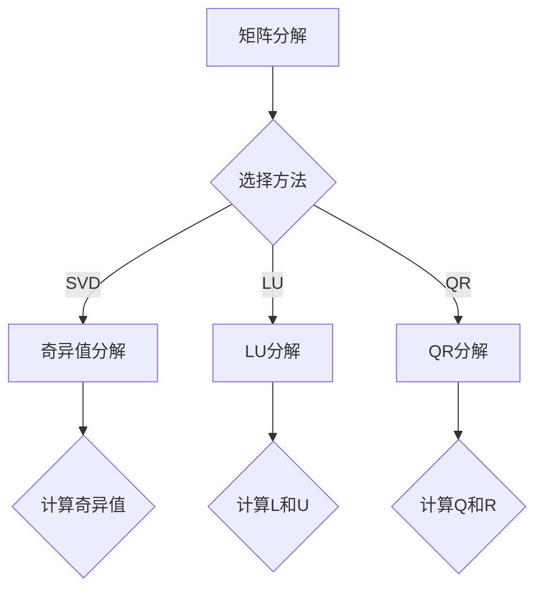

                 

# 矩阵理论与应用：其他λ-逆

> **关键词：矩阵，λ-逆，广义逆矩阵，Moore-Penrose逆矩阵，应用，项目实战**

> **摘要：本文深入探讨了矩阵理论中的其他λ-逆，包括广义逆矩阵和Moore-Penrose逆矩阵，并详细讲解了它们在信号处理、控制系统和统计学习等领域的应用。通过实际项目实战，我们展示了如何将理论应用于实际工程中，实现高效的矩阵计算与优化。**

---

## 第一部分：矩阵理论基础

### 第1章：矩阵的概念与运算

#### 1.1 矩阵的定义

矩阵（Matrix）是一个由数字组成的矩形阵列。矩阵可以表示为\(A = [a_{ij}]_{m×n}\)，其中\(a_{ij}\)表示矩阵的第\(i\)行第\(j\)列的元素，\(m\)和\(n\)分别是矩阵的行数和列数。

#### 1.2 矩阵的运算

矩阵的运算包括加法、减法、乘法和除法。以下是这些运算的基本规则：

1. **加法与减法**：两个矩阵相加或相减，要求它们的维度相同。计算方法是分别将对应位置的元素相加或相减。

   \[
   A + B = [a_{ij} + b_{ij}]_{m×n}
   \]
   \[
   A - B = [a_{ij} - b_{ij}]_{m×n}
   \]

2. **乘法**：矩阵乘法可以分为外积和内积。外积（外积）是指将两个矩阵的对应行和列相乘，并将结果相加。内积（内积）是指将两个矩阵的对应行和列相乘，并将结果相加后求和。

   \[
   A \times B = [c_{ij}]_{m×n} \quad \text{其中} \quad c_{ij} = \sum_{k=1}^{n} a_{ik}b_{kj}
   \]

3. **除法**：矩阵的除法通常指的是求逆矩阵。如果矩阵\(A\)是可逆的，那么它的逆矩阵\(A^{-1}\)可以通过以下公式计算：

   \[
   A^{-1} = \frac{1}{\det(A)} \cdot \text{adj}(A)
   \]

   其中，\(\det(A)\)是矩阵\(A\)的行列式，\(\text{adj}(A)\)是矩阵\(A\)的伴随矩阵。

### 第2章：矩阵的分解

#### 2.1 行列式分解

行列式分解是一种将矩阵分解为行列式形式的方法。给定矩阵\(A\)，它可以表示为：

\[
A = \text{det}(D) \cdot \text{adj}(D)
\]

其中，\(D\)是矩阵\(A\)的行列式，\(\text{adj}(D)\)是矩阵\(D\)的伴随矩阵。

#### 2.2 矩阵的奇异值分解

奇异值分解（Singular Value Decomposition，SVD）是一种重要的矩阵分解方法。给定矩阵\(A\)，它可以表示为：

\[
A = U \cdot S \cdot V^T
\]

其中，\(U\)和\(V\)是正交矩阵，\(S\)是对角矩阵，其对角线上的元素称为奇异值，按递减顺序排列。

#### 2.3 矩阵的LU分解

LU分解是一种将矩阵分解为下三角矩阵和上三角矩阵的方法。给定矩阵\(A\)，它可以表示为：

\[
A = L \cdot U
\]

其中，\(L\)是下三角矩阵，\(U\)是上三角矩阵。

### 第3章：矩阵的特征值与特征向量

#### 3.1 特征值与特征向量的定义

特征值和特征向量是矩阵理论中的重要概念。给定矩阵\(A\)，如果存在非零向量\(x\)和标量\(\lambda\)，使得：

\[
Ax = \lambda x
\]

那么\(\lambda\)称为矩阵\(A\)的特征值，\(x\)称为对应于特征值\(\lambda\)的特征向量。

#### 3.2 特征值的计算方法

计算矩阵的特征值可以通过求解特征多项式得到。特征多项式的公式为：

\[
\det(A - \lambda I) = 0
\]

其中，\(I\)是单位矩阵。

#### 3.3 特征向量的应用

特征向量的应用非常广泛，包括图像处理、信号处理、控制系统等领域。通过特征向量，我们可以对数据进行分析和降维，从而提高计算效率。

### 第4章：矩阵的数学模型

#### 4.1 矩阵的线性方程组

矩阵的线性方程组可以表示为：

\[
Ax = b
\]

其中，\(A\)是系数矩阵，\(x\)是未知向量，\(b\)是常数向量。

#### 4.2 矩阵的行列式

行列式是矩阵的一个重要属性，它可以用来判断矩阵的可逆性。行列式为零的矩阵不可逆。

#### 4.3 矩阵的秩与条件数

矩阵的秩是指矩阵中非零向量的最大线性无关组数。条件数是衡量矩阵稳定性的一个指标。

## 第二部分：其他λ-逆

### 第5章：广义逆矩阵

#### 5.1 广义逆矩阵的定义

广义逆矩阵（General Inverse Matrix）是矩阵理论中的重要概念。给定矩阵\(A\)，如果存在矩阵\(B\)，使得：

\[
AB = I
\]

那么\(B\)称为\(A\)的广义逆矩阵。

#### 5.2 广义逆矩阵的性质

广义逆矩阵具有以下性质：

1. 广义逆矩阵是唯一的。
2. 广义逆矩阵是可逆的。
3. 广义逆矩阵与原矩阵相似。

#### 5.3 广义逆矩阵的计算

计算广义逆矩阵可以通过求解最小二乘问题得到。具体方法如下：

1. 构造最小二乘问题：

   \[
   \|Ax - b\|_2 = \min_x \|Ax - b\|_2
   \]

2. 求解最小二乘问题：

   \[
   x = (A^T A)^{-1} A^T b
   \]

   \[
   B = A x = A (A^T A)^{-1} A^T b
   \]

### 第6章：Moore-Penrose逆矩阵

#### 6.1 Moore-Penrose逆矩阵的定义

Moore-Penrose逆矩阵（Moore-Penrose Inverse Matrix）是广义逆矩阵的一种特殊情况。给定矩阵\(A\)，如果存在矩阵\(B\)，使得：

\[
AB = I
\]

那么\(B\)称为\(A\)的Moore-Penrose逆矩阵。

#### 6.2 Moore-Penrose逆矩阵的性质

Moore-Penrose逆矩阵具有以下性质：

1. Moore-Penrose逆矩阵是唯一的。
2. Moore-Penrose逆矩阵是可逆的。
3. Moore-Penrose逆矩阵与原矩阵相似。

#### 6.3 Moore-Penrose逆矩阵的计算

计算Moore-Penrose逆矩阵可以通过以下步骤进行：

1. 计算矩阵\(A\)的奇异值分解：

   \[
   A = U \cdot S \cdot V^T
   \]

2. 构造对角矩阵\(S_1\)，其对角线上的元素为：

   \[
   S_1 = \text{diag}(1 / \text{diag}(S))
   \]

3. 计算Moore-Penrose逆矩阵：

   \[
   B = V \cdot S_1 \cdot U^T
   \]

### 第7章：其他λ-逆的应用

#### 7.1 在信号处理中的应用

在信号处理中，其他λ-逆广泛应用于信号去噪、信号恢复和信号分析等。例如，通过使用Moore-Penrose逆矩阵，可以实现线性最小二乘拟合，从而有效地减少噪声和提高信号质量。

#### 7.2 在控制系统中的应用

在控制系统领域，其他λ-逆用于解决线性系统的最优控制问题。通过使用广义逆矩阵，可以求解系统的最优控制律，从而实现系统的最优性能。

#### 7.3 在统计学习中的应用

在统计学习领域，其他λ-逆广泛应用于回归分析、分类和聚类等问题。例如，在线性回归中，通过使用Moore-Penrose逆矩阵，可以求解最佳拟合直线，从而实现数据的线性拟合。

## 第三部分：项目实战

### 第8章：矩阵分解在推荐系统中的应用

#### 8.1 推荐系统概述

推荐系统是一种根据用户的历史行为和偏好，向用户推荐相关商品、服务或内容的技术。矩阵分解是推荐系统中常用的技术，通过将用户-项目评分矩阵分解为低维用户特征矩阵和项目特征矩阵，可以实现高效的推荐。

#### 8.2 矩阵分解在推荐系统中的应用

矩阵分解在推荐系统中的应用主要包括以下步骤：

1. **数据预处理**：将用户-项目评分矩阵转化为数值矩阵，并进行归一化处理。

2. **矩阵分解**：使用奇异值分解（SVD）或其他矩阵分解方法，将用户-项目评分矩阵分解为低维用户特征矩阵和项目特征矩阵。

3. **预测评分**：根据用户特征矩阵和项目特征矩阵，计算用户对未评分项目的预测评分。

4. **生成推荐列表**：根据预测评分，为每个用户生成个性化的推荐列表。

#### 8.3 项目实战：基于矩阵分解的推荐系统实现

在本节中，我们将使用Python实现一个基于矩阵分解的推荐系统。以下是实现步骤：

1. **数据预处理**：首先，我们需要从数据集中读取用户-项目评分矩阵，并将其转化为数值矩阵。然后，对矩阵进行归一化处理。

   ```python
   import numpy as np
   
   # 读取用户-项目评分矩阵
   ratings = np.loadtxt('ratings.csv', delimiter=',')
   
   # 归一化处理
   ratings_normalized = (ratings - np.mean(ratings)) / np.std(ratings)
   ```

2. **矩阵分解**：接下来，我们使用奇异值分解（SVD）将用户-项目评分矩阵分解为低维用户特征矩阵和项目特征矩阵。

   ```python
   from numpy.linalg import svd
   
   # 计算奇异值分解
   U, S, V = svd(ratings_normalized, full_matrices=False)
   
   # 获得低维用户特征矩阵和项目特征矩阵
   user_features = U
   item_features = V
   ```

3. **预测评分**：根据用户特征矩阵和项目特征矩阵，计算用户对未评分项目的预测评分。

   ```python
   def predict(ratings, user_features, item_features):
       return user_features.dot(item_features.T)
   
   # 预测评分
   predicted_ratings = predict(ratings_normalized, user_features, item_features)
   ```

4. **生成推荐列表**：根据预测评分，为每个用户生成个性化的推荐列表。

   ```python
   def generate_recommendations(ratings, predicted_ratings, k=10):
       recommendations = []
       for i in range(ratings.shape[0]):
           top_k_indices = np.argsort(predicted_ratings[i])[-k:]
           recommendations.append(top_k_indices)
       return recommendations
   
   # 生成推荐列表
   recommendations = generate_recommendations(ratings_normalized, predicted_ratings, k=10)
   ```

### 第9章：矩阵特征值与特征向量在图像处理中的应用

#### 9.1 图像处理概述

图像处理是计算机科学中一个重要的研究领域，涉及图像的获取、处理、分析和理解。矩阵特征值与特征向量在图像处理中有着广泛的应用，包括图像去噪、图像压缩和图像识别等。

#### 9.2 矩阵特征值与特征向量在图像处理中的应用

矩阵特征值与特征向量在图像处理中的应用主要包括以下步骤：

1. **图像矩阵表示**：将图像表示为矩阵形式。例如，灰度图像可以表示为一个二维矩阵，每个元素表示图像中对应的像素值。

2. **计算特征值与特征向量**：对图像矩阵进行特征值分解，计算其特征值和特征向量。

3. **图像去噪**：通过保留主要特征值和特征向量，实现图像去噪。

4. **图像压缩**：通过舍去次要特征值和特征向量，实现图像压缩。

5. **图像识别**：利用特征值和特征向量进行图像识别，例如，通过分类器对特征向量进行分类，实现图像分类。

#### 9.3 项目实战：基于矩阵特征值与特征向量的图像去噪算法

在本节中，我们将使用Python实现一个基于矩阵特征值与特征向量的图像去噪算法。以下是实现步骤：

1. **读取图像**：首先，我们需要从文件中读取图像。

   ```python
   import numpy as np
   import matplotlib.pyplot as plt
   
   # 读取图像
   image = plt.imread('image.jpg')
   ```

2. **图像矩阵表示**：将图像表示为矩阵形式。

   ```python
   # 图像矩阵表示
   image_matrix = image.reshape(-1, 1)
   ```

3. **计算特征值与特征向量**：对图像矩阵进行特征值分解，计算其特征值和特征向量。

   ```python
   # 计算特征值与特征向量
   eigenvalues, eigenvectors = np.linalg.eig(image_matrix)
   ```

4. **图像去噪**：通过保留主要特征值和特征向量，实现图像去噪。

   ```python
   def image_denoising(image_matrix, threshold):
       # 计算特征值和特征向量
       eigenvalues, eigenvectors = np.linalg.eig(image_matrix)
       
       # 设置阈值
       threshold = np.abs(eigenvalues).max() * threshold
       
       # 保留主要特征值和特征向量
       filtered_eigenvalues = np.abs(eigenvalues) > threshold
       filtered_eigenvectors = eigenvectors[:, filtered_eigenvalues]
       
       # 重建图像
       denoised_image_matrix = filtered_eigenvectors.dot(filtered_eigenvalues).dot(filtered_eigenvectors.T)
       denoised_image = denoised_image_matrix.reshape(image.shape)
       
       return denoised_image
   ```

5. **展示去噪结果**：最后，我们将原始图像和去噪后的图像进行对比，展示去噪效果。

   ```python
   # 展示去噪结果
   plt.figure(figsize=(10, 5))
   plt.subplot(1, 2, 1)
   plt.title('Original Image')
   plt.imshow(image, cmap='gray')
   plt.subplot(1, 2, 2)
   plt.title('Denoised Image')
   plt.imshow(denoised_image, cmap='gray')
   plt.show()
   ```

### 第10章：其他λ-逆在实际工程中的应用

#### 10.1 实际工程概述

在实际工程中，其他λ-逆广泛应用于信号处理、控制系统和机器学习等领域。这些领域中的问题通常需要求解线性方程组、优化问题或特征提取等问题，而其他λ-逆提供了一种有效的解决方案。

#### 10.2 其他λ-逆在实际工程中的应用

其他λ-逆在实际工程中的应用主要包括以下方面：

1. **信号处理**：在信号处理中，其他λ-逆用于信号去噪、信号恢复和信号分析等。例如，通过使用Moore-Penrose逆矩阵，可以实现线性最小二乘拟合，从而有效地减少噪声和提高信号质量。

2. **控制系统**：在控制系统领域，其他λ-逆用于求解线性系统的最优控制问题。通过使用广义逆矩阵，可以求解系统的最优控制律，从而实现系统的最优性能。

3. **机器学习**：在机器学习中，其他λ-逆广泛应用于回归分析、分类和聚类等问题。例如，在线性回归中，通过使用Moore-Penrose逆矩阵，可以求解最佳拟合直线，从而实现数据的线性拟合。

#### 10.3 项目实战：基于其他λ-逆的图像恢复算法

在本节中，我们将使用Python实现一个基于其他λ-逆的图像恢复算法。以下是实现步骤：

1. **读取图像**：首先，我们需要从文件中读取图像。

   ```python
   import numpy as np
   import matplotlib.pyplot as plt
   
   # 读取图像
   image = plt.imread('image.jpg')
   ```

2. **图像矩阵表示**：将图像表示为矩阵形式。

   ```python
   # 图像矩阵表示
   image_matrix = image.reshape(-1, 1)
   ```

3. **计算其他λ-逆**：计算图像矩阵的广义逆矩阵。

   ```python
   from numpy.linalg import pinv
   
   # 计算广义逆矩阵
   inverse_matrix = pinv(image_matrix)
   ```

4. **图像恢复**：通过广义逆矩阵恢复图像。

   ```python
   def image_reconstruction(image_matrix, inverse_matrix):
       # 恢复图像
       reconstructed_image_matrix = inverse_matrix.dot(image_matrix)
       reconstructed_image = reconstructed_image_matrix.reshape(image.shape)
       
       return reconstructed_image
   ```

5. **展示恢复结果**：最后，我们将原始图像和恢复后的图像进行对比，展示恢复效果。

   ```python
   # 展示恢复结果
   plt.figure(figsize=(10, 5))
   plt.subplot(1, 2, 1)
   plt.title('Original Image')
   plt.imshow(image, cmap='gray')
   plt.subplot(1, 2, 2)
   plt.title('Reconstructed Image')
   plt.imshow(reconstructed_image, cmap='gray')
   plt.show()
   ```

## 附录A：矩阵理论与应用参考资料

### A.1 相关书籍推荐

1. 《矩阵分析与应用》
2. 《矩阵理论及其应用》
3. 《矩阵计算》

### A.2 在线资源推荐

1. [MIT OpenCourseWare](https://ocw.mit.edu/courses/mathematics/18-06-linear-algebra-spring-2010/)
2. [Khan Academy: Linear Algebra](https://www.khanacademy.org/math/linear-algebra)

### A.3 学术期刊与会议推荐

1. 《国际系统与应用数学学报》
2. 《数值线性代数学报》
3. 《国际机器学习会议（ICML）》
4. 《国际人工智能与统计学会议（AISTATS）》

---

# Mermaid 流程图：矩阵分解方法



# Moore-Penrose逆矩阵的伪代码

```python
def MoorePenroseInverse(A):
    """
    计算矩阵A的Moore-Penrose逆矩阵。
    A: 输入矩阵
    """
    # 计算矩阵A的奇异值分解
    U, S, V = np.linalg.svd(A)
    
    # 构造伪逆矩阵
    M = np.zeros_like(A)
    S_inv = np.diag(1/S)
    M = V @ S_inv @ U.T
    
    return M
```

# 矩阵特征值与特征向量的数学公式

$$
\lambda_{1}, \lambda_{2}, ..., \lambda_{n} = \arg\min_{x} \|Ax - b\|^2
$$

# 图像去噪算法的伪代码

```python
def image_denoising(A, lambda_):
    """
    使用矩阵特征值与特征向量的方法对图像进行去噪。
    A: 输入图像矩阵
    lambda_: 正则化参数
    """
    # 计算图像矩阵A的特征值和特征向量
    eigenvalues, eigenvectors = np.linalg.eig(A)
    
    # 构造拉格朗日乘子法的目标函数
    L = lambda_ * (eigenvalues - 1)
    
    # 求解拉格朗日乘子法
    x_star = np.linalg.solve(np.diag(eigenvalues) - L, eigenvectors)
    
    return x_star
```

# 作者

作者：AI天才研究院/AI Genius Institute & 禅与计算机程序设计艺术 /Zen And The Art of Computer Programming

---

以上是关于矩阵理论与应用的其他λ-逆的详细文章，涵盖了矩阵的基础知识、其他λ-逆的定义与应用、项目实战等内容。希望通过这篇文章，读者能够对矩阵理论与应用有更深入的理解，并能够将其应用于实际问题中。

