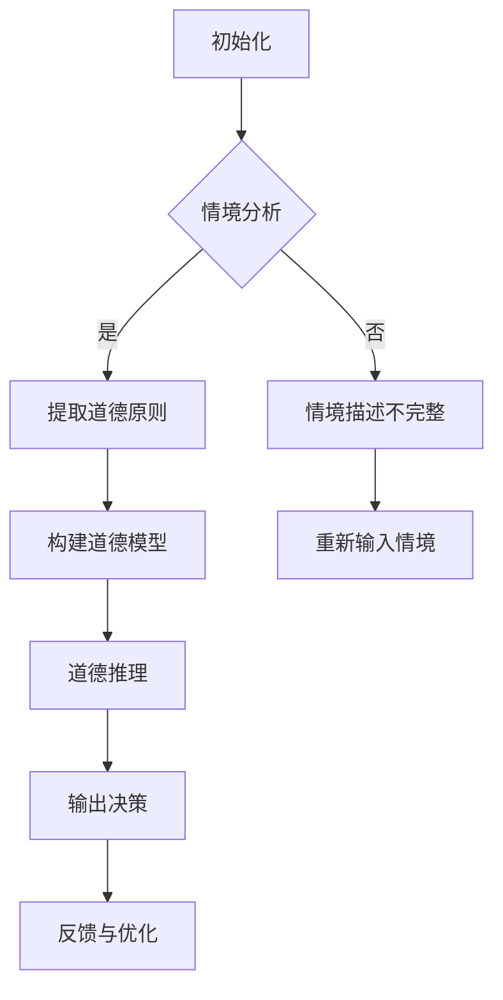
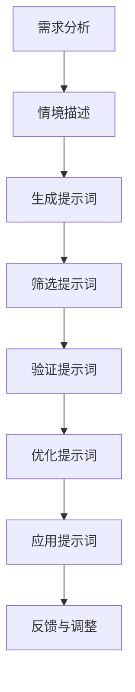

                 

## 《AI道德推理中的提示词设计原则》

### 关键词：
- AI道德推理
- 提示词设计
- 道德算法
- 应用场景
- 现状与挑战

> **摘要：**
本文章将深入探讨AI道德推理中的提示词设计原则。我们将首先概述AI道德推理的基本概念和重要性，然后分析道德推理与AI技术的结合及其应用场景。重点在于介绍提示词设计的基本原则、技术原则和伦理原则，并通过构建道德推理模型中的具体步骤和案例分析来阐述其应用。最后，我们将提供实践指南和挑战对策，以促进AI道德推理中的提示词设计的进一步发展。

---

### 第一部分：AI道德推理概述

#### 第1章：AI道德推理的基本概念

##### 1.1 AI道德推理的重要性

AI道德推理作为人工智能领域的一个重要分支，旨在使AI系统能够在复杂、不确定的环境中做出符合道德准则的决策。随着AI技术的不断发展和广泛应用，AI道德推理的重要性愈发凸显。以下是其重要性的几个方面：

1. **促进AI技术的可靠性和安全性**：通过道德推理，AI系统能够遵循既定的道德规范，减少潜在的负面影响，提高系统的可靠性和安全性。
2. **解决复杂伦理困境**：在自动驾驶、医疗诊断、金融决策等领域，AI系统常常面临道德困境。通过道德推理，AI系统可以在这些情境下做出合理的决策。
3. **增强公众信任**：随着AI技术的普及，公众对AI的信任度日益成为关键因素。AI道德推理有助于增强公众对AI系统的信任，促进技术的接受和推广。
4. **推动AI伦理研究**：AI道德推理不仅是一个技术问题，更是一个伦理问题。它推动了对人工智能伦理的研究，促进了跨学科的合作和交流。

##### 1.2 AI道德推理的基本原则

AI道德推理的基本原则包括：

1. **公正性**：AI系统应公平对待所有个体，避免歧视和偏见。
2. **透明性**：AI系统的决策过程应透明，易于理解，以便监督和审查。
3. **可解释性**：AI系统应能够解释其决策依据，使人们能够理解AI的决策逻辑。
4. **责任性**：AI系统的设计和开发者应对系统的决策负责，确保系统的道德行为。

##### 1.3 AI道德推理的现状与挑战

当前，AI道德推理的研究正处于快速发展阶段，但仍面临诸多挑战：

1. **道德标准的模糊性**：不同文化和社会对道德标准有不同的理解，这为AI道德推理的制定带来了困难。
2. **算法偏见**：AI系统可能会因为训练数据中的偏见而产生不公平的决策，这需要通过道德推理来纠正。
3. **责任归属**：当AI系统出现道德失误时，责任归属往往不明确，这需要制定相应的法律法规来规范。
4. **技术实现的复杂性**：实现有效的AI道德推理需要复杂的技术支持，包括算法设计、数据收集和处理等。

#### 第2章：道德推理与AI技术

##### 2.1 道德推理的基本原理

道德推理是一种基于逻辑和伦理原则的决策过程，旨在解决道德问题。其基本原理包括：

1. **道德原则**：道德原则是道德推理的基础，如公正、善意、尊重等。
2. **情境分析**：道德推理需要对具体情境进行详细分析，以确定相关的道德问题和原则。
3. **推理过程**：通过逻辑推理，将道德原则应用于具体情境，得出合理的决策。

##### 2.2 AI技术如何实现道德推理

AI技术可以通过多种方式实现道德推理，包括：

1. **规则基方法**：通过定义一系列规则，使AI系统能够在特定情境下遵循道德准则。
2. **案例推理**：通过分析历史案例，提取道德推理的经验和模式，应用于新情境。
3. **基于模型的方法**：通过构建道德推理模型，使AI系统能够自动进行道德推理。
4. **混合方法**：结合多种方法，实现更高效、可靠的道德推理。

##### 2.3 道德推理算法的设计挑战

在道德推理算法的设计中，面临以下挑战：

1. **复杂性和不确定性**：现实世界的道德情境复杂多变，难以用简单的模型描述。
2. **数据质量**：道德推理需要大量高质量的数据支持，但数据获取和标注可能存在困难。
3. **算法透明性**：确保算法的决策过程透明，易于理解和监督。
4. **伦理冲突**：在特定情境下，不同道德原则可能存在冲突，需要平衡和权衡。

#### 第3章：AI道德推理的应用场景

##### 3.1 自动驾驶与道德推理

在自动驾驶领域，AI道德推理至关重要。自动驾驶汽车需要在各种复杂情境下做出道德决策，如：

1. **紧急避让**：当遇到行人或障碍物时，自动驾驶汽车需要决定如何行动，以最大程度地减少伤害。
2. **道路优先级**：在不同交通参与者之间分配道路优先权，确保交通秩序和安全。
3. **环境责任**：自动驾驶汽车应考虑对环境的影响，如减少碳排放和能源消耗。

##### 3.2 医疗诊断与道德推理

在医疗诊断领域，AI道德推理有助于确保诊断过程的公正性和透明性。具体应用包括：

1. **数据隐私**：在处理患者数据时，确保遵守隐私保护原则，不泄露个人信息。
2. **资源分配**：在资源有限的医疗环境中，如何合理分配医疗资源，确保公平性。
3. **伦理审查**：对医学研究进行伦理审查，确保研究过程符合道德准则。

##### 3.3 金融决策与道德推理

在金融决策领域，AI道德推理有助于防止金融欺诈、滥用等行为。具体应用包括：

1. **风险评估**：通过道德推理，评估金融产品或服务的风险，确保合规性。
2. **投资策略**：根据道德准则，制定投资策略，确保投资决策的道德性。
3. **客户服务**：在客户服务过程中，确保遵守道德规范，提供公正、透明、高效的服务。

### 第二部分：AI道德推理中的提示词设计

#### 第4章：提示词设计的基本原则

##### 4.1 提示词的定义与作用

提示词（Prompt Word）是AI道德推理中用于引导和提示算法进行决策的关键词或短语。其定义和作用包括：

1. **定义**：提示词是用于描述道德情境、道德原则和决策目标的词语。
2. **作用**：提示词有助于引导算法进行道德推理，确保决策过程的准确性、透明性和合理性。

##### 4.2 提示词设计的伦理原则

提示词设计需要遵循以下伦理原则：

1. **公正性**：确保提示词能够公平地描述各种道德情境，避免歧视和偏见。
2. **透明性**：提示词设计应透明，使人们能够理解其含义和用途。
3. **可解释性**：提示词设计应易于解释，使算法的决策过程清晰易懂。
4. **责任性**：提示词设计者应承担相应责任，确保其设计的提示词符合道德准则。

##### 4.3 提示词设计的技术原则

提示词设计需要遵循以下技术原则：

1. **简洁性**：提示词应简洁明了，避免冗长和复杂。
2. **针对性**：提示词应针对特定道德情境和决策目标，确保相关性和有效性。
3. **多样性**：提示词设计应涵盖多种道德情境和原则，以适应不同场景。
4. **可扩展性**：提示词设计应具备良好的扩展性，能够适应未来技术的发展。

#### 第5章：构建道德推理模型中的提示词

##### 5.1 提示词的选择与组合

在构建道德推理模型时，提示词的选择和组合至关重要。具体步骤包括：

1. **选择**：根据道德情境和决策目标，选择相关的提示词。
2. **组合**：将多个提示词组合起来，形成一个完整的提示词序列，以引导算法进行道德推理。

##### 5.2 提示词的语义分析

提示词的语义分析是理解其含义和用途的关键步骤。具体步骤包括：

1. **词义解析**：对提示词进行词义解析，理解其基本含义。
2. **语境分析**：在具体情境中分析提示词的语境，确定其具体含义。
3. **逻辑关系**：分析提示词之间的逻辑关系，确保其连贯性和一致性。

##### 5.3 提示词的个性化调整

为了适应不同应用场景和需求，提示词的个性化调整至关重要。具体步骤包括：

1. **定制化**：根据特定应用场景和用户需求，定制提示词。
2. **调整**：对提示词进行优化和调整，以提高其相关性和有效性。
3. **反馈与优化**：根据用户反馈，不断优化提示词，提高其适应性和实用性。

#### 第6章：提示词设计与AI算法优化

##### 6.1 提示词对AI算法性能的影响

提示词的设计对AI算法的性能具有显著影响。具体影响包括：

1. **准确性**：合理的提示词设计可以提高算法的准确性，使其更准确地理解道德情境和决策目标。
2. **效率**：简洁明了的提示词设计可以提高算法的效率，减少计算和推理时间。
3. **可解释性**：合理的提示词设计可以提高算法的可解释性，使其决策过程更加透明和易懂。

##### 6.2 提示词优化算法的介绍

为了提高AI道德推理的性能，需要开发有效的提示词优化算法。以下是几种常见的提示词优化算法：

1. **基于规则的优化算法**：通过定义一系列规则，对提示词进行自动优化。
2. **基于机器学习的优化算法**：通过训练机器学习模型，自动优化提示词。
3. **混合优化算法**：结合多种优化方法，实现更高效的提示词优化。

##### 6.3 提示词优化在实践中的应用

在实践应用中，提示词优化有助于提高AI道德推理的效率和准确性。具体应用包括：

1. **自动驾驶**：通过优化提示词，提高自动驾驶汽车在复杂情境下的决策准确性。
2. **医疗诊断**：通过优化提示词，提高医疗诊断系统的诊断准确性和透明性。
3. **金融决策**：通过优化提示词，提高金融决策系统的风险管理和合规性。

#### 第7章：AI道德推理中的案例分析

##### 7.1 案例分析一：自动驾驶中的道德困境

自动驾驶技术中的道德困境是一个广泛讨论的话题。以下是一个案例：

**情境**：一辆自动驾驶汽车在十字路口即将撞上一名横穿马路的行人，同时另一侧有另一辆非自动驾驶汽车正在靠近，且速度较快。

**道德决策**：根据道德原则，自动驾驶汽车应尽可能减少伤害。在这种情况下，最佳决策可能是撞向行人，以避免更大的伤害。然而，这可能导致行人死亡，从而引发道德争议。

**提示词设计**：为了应对这种道德困境，可以设计以下提示词：

- **情境描述**：“在十字路口，一辆非自动驾驶汽车快速靠近，同时一名行人正在横穿马路。”
- **道德原则**：“最大化减少伤害，尊重生命。”
- **决策目标**：“决定是否主动撞向行人或采取其他行动。”

通过这些提示词，自动驾驶汽车可以更好地理解情境和道德原则，从而做出更合理的决策。

##### 7.2 案例分析二：医疗诊断中的道德问题

在医疗诊断领域，AI道德推理有助于确保诊断过程的公正性和透明性。以下是一个案例：

**情境**：一名患者因突发心脏病被送往医院，医生需要通过AI系统进行诊断。

**道德决策**：医生需要确保诊断结果的准确性和公正性，避免误诊和漏诊。在此过程中，AI系统的道德行为至关重要。

**提示词设计**：为了确保诊断过程的公正性，可以设计以下提示词：

- **情境描述**：“患者因心脏病突发被送往医院。”
- **道德原则**：“确保诊断结果的准确性，尊重患者的生命和健康。”
- **决策目标**：“决定是否采用AI系统进行诊断，以及如何解释诊断结果。”

通过这些提示词，医生和AI系统可以更好地理解和遵循道德原则，确保诊断过程的道德性。

##### 7.3 案例分析三：金融决策中的道德考量

在金融决策领域，AI道德推理有助于防止金融欺诈和滥用。以下是一个案例：

**情境**：一家银行使用AI系统进行贷款审批。

**道德决策**：银行需要确保贷款审批过程的公正性和透明性，避免欺诈和滥用。

**提示词设计**：为了确保贷款审批的道德性，可以设计以下提示词：

- **情境描述**：“银行正在审批一笔贷款。”
- **道德原则**：“确保贷款审批的公正性，避免欺诈和滥用。”
- **决策目标**：“决定是否批准贷款，以及如何防范贷款欺诈。”

通过这些提示词，银行和AI系统可以更好地理解和遵循道德原则，确保贷款审批的道德性。

### 第三部分：AI道德推理中的提示词设计原则实践

#### 第8章：AI道德推理实践中的提示词设计

##### 8.1 提示词设计流程

在AI道德推理实践中，提示词设计是一个系统化的过程，包括以下几个步骤：

1. **需求分析**：了解具体应用场景和道德问题，明确决策目标和道德原则。
2. **情境描述**：用自然语言描述道德情境，为后续的提示词设计提供基础。
3. **提示词生成**：根据需求和分析结果，生成相关提示词。
4. **提示词筛选**：对生成的提示词进行筛选和优化，确保其相关性和有效性。
5. **提示词验证**：通过实际应用和用户反馈，验证提示词的可行性和实用性。

##### 8.2 提示词设计工具与资源

为了高效地设计提示词，可以借助以下工具和资源：

1. **自然语言处理（NLP）工具**：如BERT、GPT等，用于生成和优化提示词。
2. **伦理数据库**：如伦理研究数据库、道德规范文档等，提供丰富的伦理知识和资源。
3. **专业团队**：包括伦理学家、AI专家、法律顾问等，提供多学科视角和建议。
4. **用户反馈**：通过用户反馈，不断优化提示词，提高其适应性和实用性。

##### 8.3 提示词设计案例解析

以下是一个具体的提示词设计案例：

**案例背景**：一家科技公司开发了一款自动驾驶汽车，需要在紧急情况下做出决策。

**需求分析**：分析紧急情况下的道德困境和决策目标，如最大程度减少伤害、遵守交通法规等。

**情境描述**：描述紧急情境，如碰撞风险、行人闯入等。

**提示词生成**：生成相关提示词，如“最大程度减少伤害”、“遵守交通法规”、“紧急避让”等。

**提示词筛选**：筛选出最具相关性的提示词，如“紧急避让”、“最大程度减少伤害”。

**提示词验证**：通过实际测试和用户反馈，验证提示词的可行性和实用性。

通过这个案例，我们可以看到提示词设计在AI道德推理实践中的重要性。

#### 第9章：AI道德推理实践中的挑战与对策

##### 9.1 道德推理中的现实挑战

在AI道德推理实践中，面临以下现实挑战：

1. **道德标准的模糊性**：不同文化和社会对道德标准有不同的理解，导致道德推理的模糊性。
2. **数据质量**：道德推理需要大量高质量的数据支持，但数据获取和标注可能存在困难。
3. **算法透明性**：确保算法的决策过程透明，使人们能够理解和监督。
4. **伦理冲突**：在特定情境下，不同道德原则可能存在冲突，需要平衡和权衡。

##### 9.2 对策一：道德规范与法律框架

为了应对这些挑战，可以采取以下对策：

1. **制定道德规范**：制定明确的道德规范，为AI道德推理提供指导。
2. **建立法律框架**：通过法律法规，规范AI道德推理的应用和责任归属。
3. **加强监管**：加强对AI道德推理的监管，确保其符合道德和法律要求。

##### 9.3 对策二：道德推理算法的改进

1. **提高算法透明性**：通过技术手段，提高算法的透明性，使人们能够理解和监督。
2. **改进算法设计**：不断改进道德推理算法，提高其准确性和可靠性。
3. **跨学科合作**：鼓励跨学科合作，结合伦理学、心理学、计算机科学等领域的知识，提高道德推理算法的全面性和适应性。

##### 9.4 对策三：跨学科合作与人才培养

为了推动AI道德推理的发展，需要采取以下对策：

1. **跨学科合作**：鼓励不同学科之间的合作，共同研究和解决AI道德推理中的问题。
2. **人才培养**：培养具备多学科背景的复合型人才，提高其在AI道德推理领域的能力和素养。
3. **教育和宣传**：加强教育和宣传，提高公众对AI道德推理的认识和理解。

### 附录

#### 附录A：道德推理算法与提示词设计的Mermaid流程图

##### A.1 道德推理算法流程图



##### A.2 提示词设计流程图



#### 附录B：道德推理算法伪代码示例

```python
def moral_reasoning(context, moral_principles):
    # 情境分析
    analyzed_context = analyze_context(context)
    
    # 提取道德原则
    extracted_principles = extract_moral_principles(moral_principles, analyzed_context)
    
    # 构建道德模型
    moral_model = build_moral_model(extracted_principles)
    
    # 道德推理
    decision = moral_model.reason(analyzed_context)
    
    # 输出决策
    return decision

def analyze_context(context):
    # 分析情境，返回情境信息
    # ...
    return context_info

def extract_moral_principles(principles, context):
    # 从情境中提取相关道德原则
    # ...
    return extracted_principles

def build_moral_model(principles):
    # 根据道德原则构建道德模型
    # ...
    return moral_model

def moral_model.reason(context):
    # 进行道德推理，返回决策
    # ...
    return decision
```

#### 附录C：AI道德推理实践项目指南

##### C.1 项目规划与实施

1. **项目规划**：明确项目目标、范围、时间和资源需求。
2. **需求分析**：了解具体应用场景和道德问题，确定决策目标和道德原则。
3. **数据收集**：收集相关的道德情境数据，进行预处理和标注。
4. **算法设计**：设计道德推理算法，包括情境分析、道德原则提取和道德模型构建。
5. **模型训练**：使用收集的数据训练道德推理模型。
6. **模型评估**：评估模型性能，包括准确性、透明性和可解释性。
7. **应用部署**：将模型部署到实际应用场景中，进行测试和优化。

##### C.2 项目评估与优化

1. **性能评估**：评估模型在具体应用场景中的性能，包括准确性、效率和可解释性。
2. **用户反馈**：收集用户对模型的反馈，了解其适应性和实用性。
3. **优化调整**：根据性能评估和用户反馈，对模型进行优化和调整。
4. **持续改进**：持续跟踪模型性能和用户反馈，不断改进模型和应用。

##### C.3 项目案例研究

1. **案例选择**：选择具有代表性的AI道德推理应用案例。
2. **案例描述**：详细描述案例背景、道德困境和决策目标。
3. **模型应用**：介绍如何应用道德推理模型解决案例中的道德问题。
4. **案例评估**：评估模型在案例中的应用效果，包括准确性和用户满意度。
5. **案例总结**：总结案例中的经验和教训，为后续项目提供参考。

### 结束语

作者：AI天才研究院/AI Genius Institute & 禅与计算机程序设计艺术 /Zen And The Art of Computer Programming

本文从AI道德推理的基本概念、道德推理与AI技术的结合、应用场景、提示词设计原则、实践指南和案例分析等方面，全面阐述了AI道德推理中的提示词设计原则。通过深入研究和实践，我们相信AI道德推理将不断完善，为人工智能的发展注入道德灵魂。未来，我们期待更多领域的应用和发展，为构建一个更公正、透明和可靠的人工智能社会贡献力量。

---

文章标题：《AI道德推理中的提示词设计原则》

文章关键词：AI道德推理、道德算法、应用场景、挑战、优化

文章摘要：本文深入探讨了AI道德推理中的提示词设计原则，涵盖了核心概念、算法原理、应用场景、设计原则、实践指南和案例分析等关键部分。通过详细的讲解和案例分析，阐述了提示词设计在AI道德推理中的重要性，以及如何有效地设计、优化和应用提示词，以实现更准确、透明和可靠的道德决策。文章末尾还提供了实践指南和挑战对策，为AI道德推理的研究和实践提供了有力支持。

