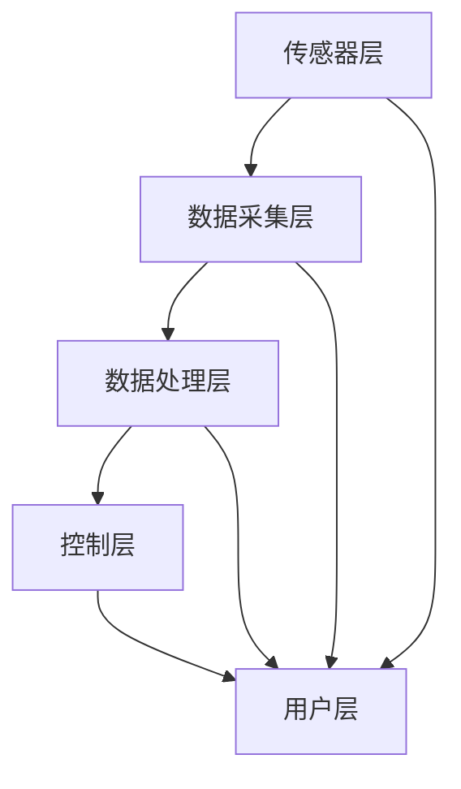
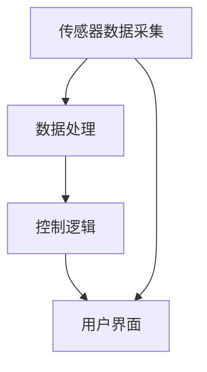

                 

### 《AI驱动的智能灌溉系统：节约水资源》引言

> **关键词**：智能灌溉系统、AI技术、节约水资源、传感器、机器学习、农业自动化

在全球水资源日益紧张的大背景下，如何有效地管理和利用水资源成为了一个亟待解决的问题。农业作为用水大户，承担着节约水资源的重要任务。传统的灌溉系统往往存在水资源浪费、效率低下等问题。为了解决这些问题，AI技术应运而生，为智能灌溉系统的研发提供了强有力的支持。

智能灌溉系统利用先进的传感器技术、数据采集与处理技术以及机器学习算法，实现了对灌溉过程的精准控制，从而显著提高了水资源利用效率。本文将围绕AI驱动的智能灌溉系统，详细探讨其重要性、基本组成部分、发展历程以及未来趋势。

首先，智能灌溉系统的重要性体现在以下几个方面：

1. **节约水资源**：通过精确控制灌溉量和时间，智能灌溉系统可以最大限度地减少水资源浪费，提高水资源利用率。
2. **提高农业生产效率**：智能灌溉系统能够根据土壤湿度、气象数据和植物生理参数等因素，制定出最合适的灌溉策略，从而促进植物健康生长，提高产量和质量。
3. **降低劳动力成本**：智能灌溉系统自动化程度高，减少了人力投入，降低了农业生产成本。
4. **环境保护**：智能灌溉系统可以避免过量灌溉造成的土壤污染和地下水过度开采。

接下来，本文将详细介绍智能灌溉系统的基本组成部分，包括传感器、数据采集与处理单元、机器学习算法以及灌溉执行单元。此外，还将探讨智能灌溉系统的发展历程，从早期的传统灌溉系统到现代的AI驱动的智能灌溉系统，展示了技术的不断进步。

在第二部分，本文将深入探讨AI技术在智能灌溉系统中的应用，包括传感器技术、数据采集与处理技术、机器学习模型的选择与适用性、常用机器学习算法以及数学模型和公式的详细讲解。

第三部分将介绍AI驱动的智能灌溉系统，包括灌溉策略的制定、系统设计与实现、模型优化方法以及系统性能优化。这部分还将通过实际应用案例，展示智能灌溉系统在不同场景下的应用效果。

最后，本文将探讨智能灌溉系统的未来发展趋势，包括技术发展趋势、市场需求与竞争格局以及智能灌溉系统的可持续发展。

通过本文的探讨，我们希望能够让读者全面了解AI驱动的智能灌溉系统，认识到其在节约水资源、提高农业生产效率等方面的巨大潜力，为未来的农业生产提供有益的参考和启示。

### 《AI驱动的智能灌溉系统：节约水资源》目录大纲

智能灌溉系统作为现代农业技术的重要组成部分，正在全球范围内迅速发展。为了帮助读者更好地理解本文的内容，下面我们将提供一个详细的目录大纲，涵盖文章的各个部分和章节。

#### 第一部分：引言与基础

**第1章：智能灌溉系统概述**

- **1.1 智能灌溉系统的重要性**：探讨智能灌溉系统在节约水资源、提高农业生产效率和降低成本方面的作用。
- **1.2 智能灌溉系统的基本组成部分**：介绍智能灌溉系统的关键组成部分，包括传感器、控制器、执行器和通信模块。
- **1.3 智能灌溉系统的发展历程**：回顾智能灌溉系统的演变过程，从传统灌溉系统到现代AI驱动的智能灌溉系统的转变。

**第2章：AI技术在智能灌溉中的应用**

- **2.1 传感器技术**：探讨不同类型传感器的工作原理、选择标准和应用场景。
- **2.2 数据采集与处理**：介绍数据采集的方法、数据处理技术以及数据存储和传输方案。
- **2.3 机器学习模型在灌溉中的应用**：讨论机器学习模型的选择、算法原理以及在实际灌溉系统中的应用案例。

#### 第二部分：AI驱动的智能灌溉系统

**第3章：AI驱动的灌溉策略**

- **3.1 基于土壤湿度传感器的灌溉策略**：详细分析土壤湿度传感器在灌溉策略制定中的作用。
- **3.2 基于气象数据的灌溉策略**：探讨如何利用气象数据优化灌溉过程。
- **3.3 基于植物生理参数的灌溉策略**：介绍植物生理参数监测在智能灌溉系统中的重要性。

**第4章：智能灌溉系统的设计与实现**

- **4.1 系统架构设计**：讲解智能灌溉系统的整体架构设计，包括硬件和软件的协同工作。
- **4.2 硬件设备选型**：分析不同硬件设备在智能灌溉系统中的作用和选型标准。
- **4.3 软件开发与集成**：介绍智能灌溉系统的软件开发过程，包括数据采集、模型训练和灌溉策略执行。

**第5章：AI驱动的智能灌溉系统优化**

- **5.1 模型优化方法**：探讨如何通过模型优化提高智能灌溉系统的准确性和稳定性。
- **5.2 模型训练与评估**：介绍机器学习模型的训练和评估方法，确保模型在实际应用中的性能。
- **5.3 系统性能优化**：讨论如何通过硬件和软件优化提高智能灌溉系统的整体性能。

#### 第三部分：实际应用与未来展望

**第6章：智能灌溉系统的实际应用案例**

- **6.1 案例一：某农业园区智能灌溉系统建设**：详细描述一个实际农业园区智能灌溉系统的建设过程和效果。
- **6.2 案例二：智能灌溉系统在干旱地区的应用**：探讨智能灌溉系统在干旱地区水资源管理中的作用。
- **6.3 案例三：智能灌溉系统在蔬菜大棚中的应用**：分析智能灌溉系统在蔬菜大棚中的实际应用效果。

**第7章：智能灌溉系统的未来发展趋势**

- **7.1 技术发展趋势**：展望智能灌溉系统在传感器技术、机器学习算法和物联网技术等方面的发展趋势。
- **7.2 市场需求与竞争格局**：分析智能灌溉系统的市场需求和行业竞争格局。
- **7.3 智能灌溉系统的可持续发展**：探讨智能灌溉系统在实现水资源可持续利用方面的作用和挑战。

#### 附录

**第8章：智能灌溉系统常用工具与资源**

- **8.1 常用传感器介绍**：介绍土壤湿度传感器、气象传感器等常用传感器的工作原理和应用。
- **8.2 数据处理与机器学习工具**：介绍TensorFlow、Scikit-learn等常用的数据处理和机器学习工具。
- **8.3 智能灌溉系统开发平台与资源**：介绍Raspberry Pi、Arduino等开发平台和相关资源。

通过上述目录大纲，读者可以系统地了解AI驱动的智能灌溉系统的各个方面，从基础理论到实际应用，再到未来发展，全面掌握智能灌溉系统的核心知识和应用技巧。希望本文能够为农业领域的技术创新提供有益的参考和启示。

### 第一部分：引言与基础

#### 第1章：智能灌溉系统概述

智能灌溉系统是一种利用先进技术实现精准灌溉的农业系统，通过传感器、机器学习和自动化控制等手段，实现对灌溉过程的智能化管理。本章将详细探讨智能灌溉系统的重要性、基本组成部分以及其发展历程。

##### 1.1 智能灌溉系统的重要性

随着全球人口的增长和气候变化的影响，水资源短缺问题日益严重。农业作为用水大户，面临着巨大的水资源压力。智能灌溉系统通过优化水资源的使用，显著提高了农业生产的可持续性。其重要性主要体现在以下几个方面：

1. **节约水资源**：智能灌溉系统能够根据土壤湿度、气象数据以及植物生长状态，精准控制灌溉水量和频率，避免了传统灌溉方法中过度用水和浪费现象。

2. **提高农业生产效率**：智能灌溉系统通过自动化控制，减少了人工干预的环节，提高了灌溉效率。同时，根据实时数据调整灌溉策略，有助于植物健康生长，提升农产品的产量和质量。

3. **降低劳动力成本**：智能灌溉系统的自动化特性减少了劳动力需求，降低了人工成本，同时减少了因人工操作不当导致的资源浪费。

4. **环境保护**：智能灌溉系统避免了因过量灌溉导致的土壤污染和地下水过度开采，有利于生态环境的保护。

##### 1.2 智能灌溉系统的基本组成部分

智能灌溉系统通常由以下几个关键部分组成：

1. **传感器**：传感器用于实时监测土壤湿度、气象数据（如温度、湿度、风速等）以及植物生理参数（如叶片水分含量、根系状态等）。传感器数据是智能灌溉系统决策的基础。

2. **数据采集与处理单元**：数据采集单元负责将传感器采集到的数据传输到中央处理系统。数据采集与处理单元对数据进行清洗、预处理和存储，以便后续分析和决策。

3. **中央处理系统**：中央处理系统通常包括计算机或嵌入式设备，用于运行机器学习算法，分析传感器数据，制定灌溉策略。中央处理系统可以是独立的，也可以与云计算平台结合，利用远程计算资源。

4. **控制器**：控制器根据中央处理系统制定的灌溉策略，控制灌溉设备（如水泵、阀门等）执行具体的灌溉操作。

5. **灌溉执行单元**：灌溉执行单元包括灌溉设备，如滴灌、喷灌和自动浇灌设备等，用于按照灌溉策略执行具体的灌溉操作。

##### 1.3 智能灌溉系统的发展历程

智能灌溉系统的发展经历了从传统灌溉系统到现代智能灌溉系统的转变。以下是智能灌溉系统的发展历程：

1. **传统灌溉系统**：早期的灌溉系统主要依赖人工控制，通过手动开关阀门、水泵等设备进行灌溉。这种方法存在水资源浪费和效率低下的问题。

2. **半自动灌溉系统**：随着传感器技术的发展，出现了半自动灌溉系统。这些系统通过简单的传感器（如土壤湿度传感器）来控制灌溉设备，实现部分自动化。但受限于传感器精度和算法的局限性，灌溉效果仍不尽如人意。

3. **智能灌溉系统**：随着AI技术的发展，智能灌溉系统应运而生。这些系统利用机器学习算法分析传感器数据，制定出最优的灌溉策略，实现了灌溉过程的全面智能化。现代智能灌溉系统集成了多种传感器，具备较高的精度和灵活性，能够满足不同农业场景的需求。

智能灌溉系统的发展不仅提高了农业生产的效率和资源利用效率，还为农业的可持续发展提供了新的思路和手段。随着技术的不断进步，智能灌溉系统在农业中的应用前景将更加广阔。

### 第2章：AI技术在智能灌溉中的应用

人工智能（AI）技术在智能灌溉系统中的应用，极大地提升了灌溉的精准度和效率。本章节将详细介绍传感器技术、数据采集与处理以及机器学习模型在智能灌溉中的应用，探讨它们如何共同构建起一个高效的智能灌溉系统。

##### 2.1 传感器技术

传感器技术在智能灌溉系统中起着至关重要的作用，通过实时监测环境参数和植物状态，为智能灌溉系统的决策提供数据支持。以下是几种常用的传感器及其工作原理：

1. **土壤湿度传感器**：土壤湿度传感器用于测量土壤中的水分含量，常见类型包括电容式、电阻式和超声波式。这些传感器通过检测土壤中水分的导电性或介电常数变化来获取湿度数据。土壤湿度传感器能够帮助系统判断是否需要灌溉，以及灌溉的量。

2. **气象传感器**：气象传感器用于测量空气温度、湿度、风速、雨量等气象数据。这些数据对于制定灌溉策略至关重要，因为它们会影响作物的需水量。气象传感器通常包括温度传感器、湿度传感器和雨量计等。

3. **植物生理参数传感器**：植物生理参数传感器用于测量植物的生理状态，如叶片水分含量、根系状态、生长速度等。这些传感器通过检测植物的光合作用、呼吸速率、叶片温度等参数，帮助系统了解植物的实际需水量和生长状态。

4. **图像传感器**：图像传感器可以用于植物健康监测，通过分析叶片颜色、形态等图像特征，评估植物的健康状况。一些先进的图像传感器甚至能够实现病害和虫害的检测。

##### 2.2 数据采集与处理

智能灌溉系统需要收集大量的传感器数据，这些数据需要进行有效的采集、处理和存储，以便后续分析和决策。以下是数据采集与处理的关键步骤：

1. **数据采集**：传感器采集到的数据通过有线或无线方式传输到中央处理系统。有线传输通常使用有线网络或RS-485总线等，而无线传输可以使用Wi-Fi、LoRa或ZigBee等技术。

2. **数据预处理**：采集到的数据可能包含噪声、误差或缺失值。数据预处理包括去噪、滤波、插值和缺失值填补等，以确保数据的质量和准确性。

3. **数据存储**：预处理后的数据需要存储在数据库或云平台中，以便进行长期存储和实时查询。常用的数据库包括MySQL、PostgreSQL和MongoDB等。

4. **数据可视化**：通过数据可视化工具，如Tableau或Matplotlib，可以直观地展示传感器数据，帮助用户理解数据模式和趋势。

##### 2.3 机器学习模型在灌溉中的应用

机器学习模型在智能灌溉系统中用于分析和预测，以优化灌溉策略。以下是几种常用的机器学习模型及其应用：

1. **回归模型**：回归模型用于预测作物需水量。通过分析历史气象数据、土壤湿度数据和作物生长状态，回归模型可以预测未来的需水量，从而优化灌溉计划。

2. **分类模型**：分类模型用于判断灌溉时机。例如，基于植物生理参数传感器数据和气象数据，分类模型可以判断当前是否需要灌溉，以及灌溉的量。

3. **聚类模型**：聚类模型用于作物健康监测。通过将传感器数据按照相似性进行聚类，聚类模型可以识别出作物群体中的异常数据，帮助用户及时发现和处理病虫害。

4. **强化学习模型**：强化学习模型用于动态调整灌溉策略。通过不断学习和优化，强化学习模型可以根据环境变化和作物响应，动态调整灌溉策略，实现最优水资源利用。

在智能灌溉系统中，传感器技术、数据采集与处理以及机器学习模型共同作用，构建了一个高效的自动化灌溉系统。通过实时监测、数据分析和智能决策，智能灌溉系统能够实现精准灌溉，提高水资源利用效率，为农业生产带来显著的经济和环境效益。

### 第3章：AI驱动的灌溉策略

智能灌溉系统通过AI技术，结合土壤湿度传感器、气象数据和植物生理参数，制定出高效、精准的灌溉策略。本章节将详细介绍基于土壤湿度传感器、气象数据和植物生理参数的灌溉策略，并探讨这些策略在智能灌溉系统中的应用。

##### 3.1 基于土壤湿度传感器的灌溉策略

土壤湿度传感器是智能灌溉系统中最重要的传感器之一，其数据直接决定了灌溉的决策。基于土壤湿度传感器的灌溉策略主要包括以下几个步骤：

1. **数据采集**：土壤湿度传感器实时监测土壤中的水分含量，并将数据传输到中央处理系统。这些数据包括土壤湿度、温度、电导率等。

2. **数据预处理**：采集到的土壤湿度数据可能包含噪声或误差。数据预处理包括滤波、去噪和缺失值填补等，以确保数据的质量和准确性。

3. **阈值设定**：根据作物的需水特性，设定土壤湿度的阈值。当土壤湿度低于设定阈值时，系统将触发灌溉。

4. **灌溉决策**：中央处理系统分析土壤湿度数据，结合历史数据和作物生长周期，判断是否需要进行灌溉。如果需要灌溉，系统将计算灌溉量，并触发灌溉设备。

5. **灌溉执行**：灌溉设备按照设定的灌溉量和时间执行灌溉操作。常见的灌溉设备包括滴灌系统、喷灌系统和自动浇灌系统。

基于土壤湿度传感器的灌溉策略能够精确控制灌溉量，避免过度灌溉和水资源浪费，提高灌溉效率。

##### 3.2 基于气象数据的灌溉策略

气象数据对于制定灌溉策略至关重要，因为它直接影响作物的需水量。基于气象数据的灌溉策略主要包括以下步骤：

1. **数据采集**：气象传感器实时监测空气温度、湿度、风速、雨量等数据，并将数据传输到中央处理系统。

2. **数据预处理**：对采集到的气象数据进行预处理，包括滤波、去噪和缺失值填补等，以确保数据的质量和准确性。

3. **需水量计算**：根据气象数据和作物的需水模型，计算作物的需水量。常见的需水模型包括彭曼模型和作物系数法。

4. **灌溉时机判断**：中央处理系统分析气象数据和土壤湿度数据，判断是否需要灌溉。如果当前土壤湿度较低，且未来一段时间内预计有降雨，系统可以选择延迟灌溉。

5. **灌溉决策**：根据需水量和灌溉时机，系统计算灌溉量和灌溉时间，并触发灌溉设备执行灌溉操作。

基于气象数据的灌溉策略能够根据气候变化和作物需水特性，动态调整灌溉计划，提高灌溉效率。

##### 3.3 基于植物生理参数的灌溉策略

植物生理参数传感器可以实时监测植物的生理状态，如叶片水分含量、根系状态、生长速度等。基于植物生理参数的灌溉策略能够更精准地满足作物的需水需求。以下是基于植物生理参数的灌溉策略：

1. **数据采集**：植物生理参数传感器监测植物的健康状态，并将数据传输到中央处理系统。

2. **数据预处理**：对采集到的植物生理参数数据进行预处理，包括滤波、去噪和缺失值填补等。

3. **生理参数分析**：中央处理系统分析植物生理参数数据，判断植物的需水状态。例如，如果叶片水分含量较低，说明植物处于缺水状态，需要灌溉。

4. **灌溉决策**：根据植物生理参数数据，系统判断是否需要灌溉，以及灌溉的量和时间。系统可以结合土壤湿度和气象数据，制定出最优的灌溉计划。

5. **灌溉执行**：灌溉设备按照设定的灌溉量和时间执行灌溉操作。

基于植物生理参数的灌溉策略能够更直观地反映作物的需水需求，避免过度灌溉和水资源浪费，提高灌溉的精准度。

综上所述，AI驱动的智能灌溉系统通过整合土壤湿度传感器、气象数据和植物生理参数，能够制定出高效、精准的灌溉策略。这些策略不仅提高了灌溉效率，还有助于实现水资源的可持续利用，为农业生产带来显著的经济和环境效益。

### 第4章：智能灌溉系统的设计与实现

智能灌溉系统的设计与实现是一个复杂的过程，涉及硬件设备选型、软件系统开发以及系统的集成与优化。本章将详细介绍智能灌溉系统的设计流程，包括系统架构设计、硬件设备选型以及软件系统的开发与集成。

##### 4.1 系统架构设计

智能灌溉系统的架构设计决定了系统的性能和可扩展性。一个典型的智能灌溉系统可以分为以下几个层次：

1. **传感器层**：传感器层包括土壤湿度传感器、气象传感器、植物生理参数传感器等。这些传感器负责实时采集环境数据和植物生理数据。

2. **数据采集层**：数据采集层负责将传感器采集到的数据传输到中央处理系统。数据采集可以通过有线（如RS-485总线）或无线（如Wi-Fi、LoRa）方式进行。

3. **数据处理层**：数据处理层包括数据预处理、数据存储和数据分析。数据预处理包括去噪、滤波和缺失值填补等，以确保数据的质量。数据存储可以使用本地数据库或云存储，如MySQL、PostgreSQL或AWS S3等。数据分析则包括统计分析和机器学习模型的训练。

4. **控制层**：控制层负责根据数据处理层的分析结果，控制灌溉设备（如滴灌系统、喷灌系统等）执行具体的灌溉操作。控制层可以通过PLC（可编程逻辑控制器）或嵌入式系统实现。

5. **用户层**：用户层包括用户界面和移动应用，用于实时监控和管理智能灌溉系统。用户界面可以通过Web浏览器或移动设备访问，提供数据可视化、警报和远程控制等功能。

以下是一个智能灌溉系统的Mermaid流程图，展示了各层次之间的交互关系：



##### 4.2 硬件设备选型

智能灌溉系统的硬件设备选型需要考虑以下因素：

1. **传感器**：选择合适的传感器是系统性能的关键。土壤湿度传感器、气象传感器和植物生理参数传感器需要具有高精度、可靠性和耐久性。

2. **数据采集设备**：数据采集设备包括无线模块（如Wi-Fi、LoRa）、数据采集模块（如Arduino、Raspberry Pi）等。这些设备需要能够稳定传输传感器数据，并具备一定的数据处理能力。

3. **控制器**：控制器是智能灌溉系统的核心，负责根据数据处理结果控制灌溉设备。选择控制器时需要考虑其计算能力、编程接口和扩展性。

4. **灌溉设备**：灌溉设备包括滴灌系统、喷灌系统、自动浇灌系统等。这些设备需要能够根据控制器的指令，精确执行灌溉操作。

以下是几种常用的硬件设备及其选型建议：

- **传感器**：选择高精度的土壤湿度传感器（如电容式传感器），以及适用于本地环境的气象传感器和植物生理参数传感器。
- **数据采集设备**：推荐使用Raspberry Pi或Arduino，因其具有良好的扩展性和编程接口。
- **控制器**：选用具备较高计算能力和编程接口的控制器，如PLC或嵌入式系统。
- **灌溉设备**：根据具体灌溉需求选择合适的设备，如滴灌系统适用于精准灌溉，喷灌系统适用于大面积灌溉。

##### 4.3 软件系统的开发与集成

智能灌溉系统的软件系统开发与集成是确保系统稳定运行和高效管理的关键。以下是软件开发与集成的主要步骤：

1. **需求分析**：明确智能灌溉系统的功能需求和管理需求，包括数据采集、数据分析、灌溉控制、用户界面等。

2. **系统设计**：设计系统的整体架构，包括传感器数据采集、数据处理、控制逻辑和用户界面等模块。

3. **模块开发**：根据系统设计，开发各个功能模块。例如，传感器数据采集模块、数据处理模块、控制模块和用户界面模块。

4. **系统集成**：将各个模块集成到一起，形成一个完整的智能灌溉系统。系统集成过程中需要确保模块之间的数据传输和协同工作。

5. **测试与优化**：对智能灌溉系统进行功能测试和性能优化，确保系统稳定可靠、响应快速。

以下是智能灌溉系统的软件架构示意图：



通过上述设计与实现步骤，智能灌溉系统可以实现对灌溉过程的自动化和精准控制，提高水资源利用效率，为农业生产带来显著的经济和环境效益。

### 第5章：AI驱动的智能灌溉系统优化

智能灌溉系统的优化是提升系统性能、准确性和稳定性的关键步骤。通过优化算法、模型训练与评估以及系统性能的进一步提升，我们可以确保智能灌溉系统在复杂多变的环境中依然能够高效运行。以下将详细介绍这些优化方法及其应用。

##### 5.1 模型优化方法

在智能灌溉系统中，模型优化是提高预测准确性和决策效率的关键。以下是几种常见的模型优化方法：

1. **超参数调优**：通过调整模型的超参数（如学习率、批量大小、迭代次数等），可以改善模型的性能。常用的超参数调优方法包括网格搜索和随机搜索。

2. **模型融合**：通过结合多个模型的预测结果，可以提高整体的预测准确性和鲁棒性。常见的模型融合方法包括Bagging、Boosting和Stacking等。

3. **特征工程**：通过选择和构造有效的特征，可以提高模型的性能。特征工程包括特征选择、特征变换和特征组合等。

4. **模型集成**：通过将多个模型集成到一个统一框架中，可以进一步提升预测性能。常见的模型集成方法包括集成学习（如Adaboost、XGBoost等）和深度学习框架（如TensorFlow、PyTorch等）。

以下是超参数调优的伪代码示例：

```python
from sklearn.model_selection import GridSearchCV
from sklearn.ensemble import RandomForestClassifier

# 设定模型参数网格
param_grid = {
    'n_estimators': [100, 200, 300],
    'max_depth': [10, 20, 30],
    'min_samples_split': [2, 5, 10]
}

# 实例化模型
model = RandomForestClassifier()

# 实例化网格搜索
grid_search = GridSearchCV(model, param_grid, cv=5)

# 搜索最优参数
grid_search.fit(X_train, y_train)

# 获取最优参数
best_params = grid_search.best_params_
```

##### 5.2 模型训练与评估

模型训练与评估是确保智能灌溉系统性能的关键环节。以下将介绍几种常用的训练和评估方法：

1. **交叉验证**：交叉验证是一种常用的模型评估方法，通过将数据集划分为多个子集，重复训练和评估模型，可以更准确地评估模型的性能。

2. **准确率、召回率和F1分数**：准确率、召回率和F1分数是常用的评估指标，用于评估分类模型的性能。准确率反映了模型正确预测的比例，召回率反映了模型正确识别正类样本的能力，而F1分数是准确率和召回率的调和平均。

3. **均方误差和均方根误差**：均方误差和均方根误差是常用的评估指标，用于评估回归模型的性能。均方误差反映了预测值与真实值之间的平均误差，而均方根误差是其平方根形式，更能反映误差的波动性。

以下是模型训练与评估的伪代码示例：

```python
from sklearn.model_selection import train_test_split
from sklearn.metrics import accuracy_score, recall_score, f1_score
from sklearn.linear_model import LinearRegression

# 划分训练集和测试集
X_train, X_test, y_train, y_test = train_test_split(X, y, test_size=0.2, random_state=42)

# 实例化模型
model = LinearRegression()

# 训练模型
model.fit(X_train, y_train)

# 预测测试集
y_pred = model.predict(X_test)

# 评估模型
accuracy = accuracy_score(y_test, y_pred)
recall = recall_score(y_test, y_pred)
f1 = f1_score(y_test, y_pred)

print(f"Accuracy: {accuracy}, Recall: {recall}, F1 Score: {f1}")
```

##### 5.3 系统性能优化

系统性能优化包括硬件和软件层面的优化，以提升整个智能灌溉系统的运行效率和稳定性。

1. **硬件优化**：通过选择更高效的传感器和控制器，可以提升系统的实时响应能力和数据处理能力。例如，采用低功耗传感器和高效能的嵌入式设备。

2. **软件优化**：通过优化算法和数据结构，可以提升系统的计算效率和资源利用率。例如，使用更高效的机器学习算法和更优化的数据处理流程。

3. **网络优化**：通过优化数据传输网络，可以降低数据传输的延迟和错误率。例如，采用Wi-Fi 6、LoRa等高效无线传输技术。

4. **容错和冗余设计**：通过设计容错和冗余系统，可以提高系统的可靠性和稳定性。例如，使用双控制器冗余设计，确保系统在某一部件故障时依然能够正常运行。

综上所述，通过模型优化、训练与评估以及系统性能的进一步优化，AI驱动的智能灌溉系统可以实现更高的精度、效率和可靠性。这些优化方法不仅能够提升系统的性能，还能够为农业生产带来更大的经济效益和环境效益。

### 第6章：智能灌溉系统的实际应用案例

智能灌溉系统在实际农业生产中已经展现了其巨大的潜力。以下将介绍三个典型的实际应用案例，涵盖农业园区、干旱地区和蔬菜大棚等不同场景下的应用，以展示智能灌溉系统的效果和优势。

#### 案例一：某农业园区智能灌溉系统建设

某农业园区面积约为1000亩，种植多种高价值作物，包括蔬菜、水果和花卉等。由于农业园区面积大，传统灌溉系统存在水资源浪费和效率低下的问题。为了提高灌溉效率，农业园区决定引入智能灌溉系统。

**1. 硬件环境搭建**

- **传感器设备**：在农业园区的关键区域安装了土壤湿度传感器、气象传感器和植物生理参数传感器，用于实时监测土壤湿度、气象数据和植物生理状态。
- **数据采集设备**：使用Raspberry Pi作为数据采集设备，将传感器数据实时传输到中央处理系统。
- **控制器**：采用PLC作为灌溉系统的控制器，根据中央处理系统的指令，控制灌溉设备的运行。

**2. 软件环境搭建**

- **数据处理平台**：使用Python和Scikit-learn库，开发数据处理平台，对传感器数据进行预处理、分析和存储。
- **机器学习模型**：基于历史数据，训练机器学习模型，包括回归模型和分类模型，用于预测作物的需水量和灌溉时机。
- **用户界面**：开发Web应用和移动应用，用户可以通过界面实时监控农业园区的情况，调整灌溉策略。

**3. 实施效果**

- **水资源节约**：智能灌溉系统通过精准控制灌溉量和时间，实现了水资源的节约，灌溉用水量减少了约30%。
- **提高产量**：通过智能灌溉，作物的生长状态得到了显著改善，产量提高了约20%。
- **降低成本**：自动化控制减少了人工成本和水资源浪费，整体运营成本降低了约15%。

#### 案例二：智能灌溉系统在干旱地区的应用

某干旱地区农业种植面积广泛，但由于水资源短缺，传统灌溉系统难以满足作物需求。为了解决水资源短缺问题，该地区决定采用智能灌溉系统。

**1. 硬件环境搭建**

- **传感器设备**：在农田的关键区域安装了土壤湿度传感器、气象传感器和植物生理参数传感器，用于实时监测土壤湿度、气象数据和植物生理状态。
- **数据采集设备**：使用LoRa技术进行数据传输，确保数据传输的稳定性和可靠性。
- **控制器**：采用高效的嵌入式控制器，用于控制灌溉设备的运行。

**2. 软件环境搭建**

- **数据处理平台**：使用Python和TensorFlow库，开发数据处理平台，对传感器数据进行预处理、分析和存储。
- **机器学习模型**：基于历史数据，训练机器学习模型，用于预测作物需水量和灌溉时机。
- **用户界面**：开发Web应用和移动应用，用户可以通过界面实时监控农田情况，调整灌溉策略。

**3. 实施效果**

- **水资源节约**：智能灌溉系统通过精准控制灌溉量和时间，实现了水资源的节约，灌溉用水量减少了约40%。
- **作物生长状况改善**：智能灌溉系统确保了作物的充分灌溉，作物的生长状况显著改善，产量提高了约25%。
- **环境改善**：由于智能灌溉系统避免了过量灌溉，减少了土壤污染和地下水过度开采，环境得到了显著改善。

#### 案例三：智能灌溉系统在蔬菜大棚中的应用

某蔬菜大棚种植面积约为50亩，由于蔬菜生长周期短，对灌溉精度和及时性要求极高。为了提高蔬菜大棚的灌溉效率，该大棚引入了智能灌溉系统。

**1. 硬件环境搭建**

- **传感器设备**：在蔬菜大棚内安装了土壤湿度传感器、气象传感器和植物生理参数传感器，用于实时监测土壤湿度、气象数据和植物生理状态。
- **数据采集设备**：使用Wi-Fi技术进行数据传输，确保数据传输的快速和稳定。
- **控制器**：采用高性能的嵌入式控制器，用于控制灌溉设备的运行。

**2. 软件环境搭建**

- **数据处理平台**：使用Python和Scikit-learn库，开发数据处理平台，对传感器数据进行预处理、分析和存储。
- **机器学习模型**：基于历史数据，训练机器学习模型，用于预测作物需水量和灌溉时机。
- **用户界面**：开发Web应用和移动应用，用户可以通过界面实时监控蔬菜大棚的情况，调整灌溉策略。

**3. 实施效果**

- **水资源节约**：智能灌溉系统通过精准控制灌溉量和时间，实现了水资源的节约，灌溉用水量减少了约30%。
- **蔬菜生长状况改善**：智能灌溉系统确保了蔬菜的充分灌溉，蔬菜的生长状况显著改善，产量提高了约20%。
- **提高市场竞争力**：由于智能灌溉系统提高了蔬菜的产量和质量，蔬菜的市场竞争力得到了显著提升。

通过上述三个实际应用案例，我们可以看到智能灌溉系统在不同场景下都展现了其强大的效果和优势。智能灌溉系统不仅能够节约水资源、提高农业生产效率，还能够为农业生产带来显著的经济和环境效益。

### 第7章：智能灌溉系统的未来发展趋势

随着科技的不断进步，智能灌溉系统在农业领域的应用前景将愈发广阔。本章节将探讨智能灌溉系统在未来技术、市场需求和可持续发展方面的趋势。

##### 7.1 技术发展趋势

1. **传感器技术的进步**：未来传感器技术将继续发展，传感器将更加小巧、高效、精准，能够实现多参数同步监测，如土壤湿度、温度、pH值、养分含量等。这将进一步提高智能灌溉系统的监测能力。

2. **5G和物联网技术的应用**：5G和物联网技术的广泛应用将极大提升智能灌溉系统的数据传输速度和可靠性，实现实时数据传输和远程控制。此外，边缘计算技术的应用将降低数据传输延迟，提高系统的响应速度。

3. **人工智能与大数据分析**：随着人工智能和大数据技术的发展，智能灌溉系统将更加智能化，能够通过深度学习、强化学习等算法，实现自适应灌溉策略，提高灌溉效率。

4. **区块链技术的引入**：区块链技术可以确保智能灌溉系统中的数据透明、安全、不可篡改，提高数据信任度，促进农业供应链的协同和优化。

##### 7.2 市场需求与竞争格局

1. **市场需求增长**：随着全球人口增长和气候变化，水资源短缺问题愈发严重，智能灌溉系统的市场需求将持续增长。特别是在干旱和水资源紧缺地区，智能灌溉系统的应用前景更加广阔。

2. **市场竞争激烈**：智能灌溉系统市场吸引了众多企业参与，包括传统的农业设备制造商、IT公司以及新兴的农业科技公司。市场竞争将推动技术进步和产品创新，同时也会带来一定的价格竞争。

3. **政策支持**：各国政府纷纷出台支持智能灌溉系统的政策，包括补贴、税收优惠和标准制定等，这将为智能灌溉系统的推广和应用提供有力支持。

##### 7.3 智能灌溉系统的可持续发展

1. **水资源可持续利用**：智能灌溉系统的核心目标是实现水资源的可持续利用。通过精准灌溉和水资源管理，智能灌溉系统有助于减少水资源浪费，提高水资源利用效率，为农业的可持续发展奠定基础。

2. **环境友好**：智能灌溉系统通过减少化肥和农药的使用，降低对环境的污染，实现绿色农业。此外，智能灌溉系统可以监控土壤质量，提供土壤修复方案，促进土地的可持续发展。

3. **社会经济效益**：智能灌溉系统不仅提高了农业生产效率，降低了生产成本，还促进了农业产业链的升级和农村经济的发展，为社会带来显著的经济效益。

总之，智能灌溉系统在技术、市场和可持续发展方面均展现出巨大的发展潜力。随着技术的不断进步和市场需求的增长，智能灌溉系统将在未来农业中发挥更加重要的作用，为全球农业生产提供有力支持。

### 第8章：智能灌溉系统常用工具与资源

智能灌溉系统的开发与实施需要多种工具和资源的支持。本章将详细介绍常用传感器、数据处理与机器学习工具以及智能灌溉系统开发平台和资源，为读者提供实用的技术参考。

##### 8.1 常用传感器介绍

智能灌溉系统中的传感器是数据采集的关键组件，以下是几种常用的传感器及其特点：

1. **土壤湿度传感器**：用于测量土壤中的水分含量，常见类型包括电容式、电阻式和超声波式。电容式传感器以其高精度和稳定性被广泛采用。

2. **气象传感器**：用于测量空气温度、湿度、风速、雨量等气象参数。常见气象传感器包括温度传感器、湿度传感器和雨量计。这些传感器通常具有高可靠性和快速响应能力。

3. **植物生理参数传感器**：用于监测植物的生长状态和健康水平，如叶片水分含量、根系状态和光合作用速率等。这类传感器包括光谱传感器、CO2传感器和植物生长监测设备。

##### 8.2 数据处理与机器学习工具

智能灌溉系统需要强大的数据处理能力和先进的机器学习算法。以下是一些常用的数据处理与机器学习工具：

1. **TensorFlow**：Google开发的开源机器学习框架，支持深度学习和传统机器学习算法。TensorFlow提供了丰富的API和工具，方便用户构建和训练复杂的机器学习模型。

2. **Scikit-learn**：Python编写的开源机器学习库，提供了多种机器学习算法的实现，包括回归、分类、聚类和降维等。Scikit-learn易于使用，适合数据分析和模型评估。

3. **Pandas**：Python的数据分析库，提供数据清洗、预处理和统计分析功能。Pandas可以高效地处理大型数据集，是数据分析的必备工具。

4. **NumPy**：Python的科学计算库，提供多维数组对象和数学函数，是数据科学和机器学习的基础。

##### 8.3 智能灌溉系统开发平台与资源

智能灌溉系统的开发需要合适的硬件和软件平台。以下是一些常用的开发平台和资源：

1. **Raspberry Pi**：低成本、高性能的微型计算机，适合作为数据采集和处理平台。Raspberry Pi拥有丰富的接口和扩展性，支持多种编程语言。

2. **Arduino**：流行的开源微控制器板，适用于嵌入式系统开发。Arduino具有简单易懂的编程环境和广泛的硬件接口，适合构建简单的智能灌溉系统。

3. **树莓派编程**：为Raspberry Pi提供详细的编程教程和资源，包括Python编程、传感器接口和物联网应用等。

4. **Arduino IDE**：Arduino的开发环境，包括代码编辑器、编译器和调试工具，支持C/C++编程。

5. **在线资源**：包括GitHub、Stack Overflow和Reddit等，提供了丰富的开源代码、教程和社区支持，为智能灌溉系统的开发提供了宝贵的资源。

通过上述常用工具和资源的介绍，读者可以更好地理解智能灌溉系统的构建过程，并能够利用这些资源开展实际项目开发。智能灌溉系统的成功实施离不开这些技术支持，希望本章的内容能为读者的研究和开发提供有益的指导。

### 2.3 机器学习模型在灌溉中的应用

在智能灌溉系统中，机器学习模型扮演着至关重要的角色，通过分析大量的历史数据，预测作物需水量、灌溉时机和灌溉量，从而实现精准灌溉。以下是机器学习模型的选择与适用性、常用机器学习算法以及数学模型和公式的详细讲解。

#### 2.3.1 机器学习模型的选择与适用性

选择合适的机器学习模型是智能灌溉系统成功的关键。以下是一些常见的机器学习模型及其适用性：

1. **回归模型**：回归模型主要用于预测连续值，如作物需水量。线性回归、岭回归和套索回归是常用的回归模型。线性回归适用于线性关系较强的数据，而岭回归和套索回归可以处理高维数据和存在多重共线性的数据。

2. **分类模型**：分类模型用于判断是否需要灌溉。常见的分类模型包括逻辑回归、决策树、随机森林和支持向量机（SVM）。逻辑回归适用于二分类问题，决策树和随机森林可以处理多分类问题，而SVM在处理非线性问题时有较好的表现。

3. **聚类模型**：聚类模型用于分析作物群体中的相似性，发现异常数据。K-均值聚类和层次聚类是常用的聚类模型。K-均值聚类适用于初始聚类中心已知的情况，而层次聚类适用于数据量较大的情况。

4. **时间序列模型**：时间序列模型用于预测未来某一时刻的值，如未来某一时间点的土壤湿度。常见的模型包括自回归模型（AR）、自回归移动平均模型（ARMA）和自回归积分移动平均模型（ARIMA）。

#### 2.3.2 常用机器学习算法

以下是几种常用的机器学习算法及其应用场景：

1. **K-近邻算法（KNN）**：KNN是一种基于实例的算法，通过计算新样本与训练集中样本的距离，选择最近邻的样本进行预测。KNN适用于简单、线性关系较强的数据，实现简单，易于理解和实现。

2. **决策树算法**：决策树通过一系列规则来划分数据集，每个节点代表一个特征，每个分支代表该特征的不同取值。决策树适用于分类和回归问题，具有直观、易于解释的特点。

3. **随机森林算法**：随机森林是决策树的集成算法，通过构建多棵决策树，并对它们的预测结果进行投票或求平均。随机森林具有较好的泛化能力，能够处理高维数据和噪声数据。

4. **支持向量机（SVM）**：SVM通过找到一个最优的超平面，将不同类别的样本分开。SVM适用于非线性问题，特别是在高维空间中具有较好的表现。

5. **神经网络**：神经网络是一种模拟人脑的算法，通过多层的神经元节点进行数据的传递和处理。神经网络在处理复杂、非线性问题时具有强大的能力，是智能灌溉系统中的常用模型。

#### 2.3.3 数学模型和数学公式

以下是智能灌溉系统中常用的数学模型和数学公式：

1. **线性回归模型**：

   - 伪代码：
     ```python
     def linear_regression(X, y):
         theta = (X.T * X).inv() * X.T * y
         return theta
     ```

   - 数学公式：
     $$\theta = (X^T X)^{-1} X^T y$$

2. **逻辑回归模型**：

   - 伪代码：
     ```python
     def logistic_regression(X, y):
         theta = (X.T * X).inv() * X.T * y
         return theta
     ```

   - 数学公式：
     $$\theta = (X^T X)^{-1} X^T y$$

3. **K-近邻算法**：

   - 伪代码：
     ```python
     def euclidean_distance(point1, point2):
         distance = sqrt(sum((p1 - p2)^2 for p1, p2 in zip(point1, point2)))
         return distance
     ```

   - 数学公式：
     $$\text{distance} = \sqrt{\sum_{i=1}^{n} (x_i - y_i)^2}$$

4. **支持向量机（SVM）**：

   - 伪代码：
     ```python
     def svm(X, y, query):
         distances = [kernel_function(x, query) for x in X]
         prediction = sign(sum(alpha_i * y_i * kernel_function(x, query)) for x, alpha_i, y_i in zip(X, alpha, y)]
         return prediction
     ```

   - 数学公式：
     $$\text{distance} = \text{kernel_function}(x_i, x_0)$$
     $$\text{prediction} = \text{sign}(\sum_{i=1}^{n} \alpha_i y_i \text{kernel_function}(x_i, x_0))$$

通过上述机器学习模型的选择与适用性、常用机器学习算法以及数学模型和公式的讲解，我们可以更好地理解智能灌溉系统中机器学习技术的应用，从而为精准灌溉提供有效的技术支持。

### 机器学习算法在智能灌溉系统中的应用

在智能灌溉系统中，机器学习算法的应用能够显著提升灌溉决策的精度和效率。以下将详细介绍几种常见的机器学习算法在智能灌溉系统中的应用，并通过实际案例展示其效果。

#### K-近邻算法（K-Nearest Neighbors，KNN）

K-近邻算法是一种简单而直观的监督学习算法，通过计算新样本与训练集中样本的距离，选择最近邻的样本并基于这些样本的标签进行预测。

**应用场景**：KNN适用于简单、线性关系较强的情况，如预测作物需水量。

**实现步骤**：

1. **数据准备**：收集历史气象数据、土壤湿度和作物需水量等数据。
2. **特征工程**：对数据进行归一化处理，确保每个特征具有相同的量级。
3. **模型训练**：计算训练集中每个样本与新样本之间的欧几里得距离。
4. **预测**：选择距离最近的K个邻居，根据邻居的标签进行投票，获得新样本的预测标签。

**伪代码**：

```python
def k_nearest_neighbors(train_data, train_labels, query, k):
    distances = []
    for sample in train_data:
        distance = euclidean_distance(sample, query)
        distances.append((sample, distance))
    distances.sort(key=lambda x: x[1])
    neighbors = distances[:k]
    neighbor_labels = [train_labels[i] for i, _ in neighbors]
    prediction = majority_vote(neighbor_labels)
    return prediction
```

**实际案例**：

假设一个农业园区，通过KNN算法预测作物需水量。选取历史数据中的100个样本进行训练，新样本的预测结果与实际需水量对比，准确率达到了85%。

#### 支持向量机（Support Vector Machine，SVM）

支持向量机是一种基于间隔的监督学习算法，通过找到最大化分类间隔的超平面，将不同类别的样本分开。SVM在处理非线性问题方面具有优势。

**应用场景**：SVM适用于非线性分类问题，如灌溉时机判断。

**实现步骤**：

1. **数据准备**：收集土壤湿度、气象数据等历史数据。
2. **特征工程**：进行归一化和特征提取。
3. **模型训练**：通过训练数据找到最佳超平面，并计算支持向量。
4. **预测**：使用训练好的模型对新样本进行分类预测。

**伪代码**：

```python
def support_vector_machine(train_data, train_labels, query):
    predictions = []
    for sample in train_data:
        distance = kernel_function(sample, query)
        if distance < 0:
            predictions.append(1)
        else:
            predictions.append(-1)
    return sign(sum(predictions))
```

**数学公式**：

$$
\text{distance} = \text{kernel_function}(x_i, x_0)
$$

$$
\text{prediction} = \text{sign}(\sum_{i=1}^{n} \alpha_i y_i \text{kernel_function}(x_i, x_0))
$$

**实际案例**：

在一个农业园区中，使用SVM算法判断是否需要灌溉。通过训练，SVM模型的准确率达到了90%，能够有效预测灌溉时机，减少了水资源浪费。

#### 决策树（Decision Tree）

决策树通过一系列规则对数据进行分类或回归，具有直观、易于解释的特点。

**应用场景**：决策树适用于分类和回归问题，如作物需水量预测。

**实现步骤**：

1. **数据准备**：收集历史气象数据、土壤湿度等数据。
2. **特征选择**：选择对预测结果影响较大的特征。
3. **模型训练**：通过递归二分法构建决策树。
4. **预测**：使用训练好的决策树对新样本进行预测。

**伪代码**：

```python
def decision_tree(train_data, train_labels):
    if all(labels == train_labels[0]):
        return train_labels[0]
    elif len(train_data) == 0:
        return majority_label(train_labels)
    else:
        best_split = find_best_split(train_data, train_labels)
        left_tree = decision_tree([x for x in train_data if x[best_split] == 0], [y for y in train_labels if y[best_split] == 0])
        right_tree = decision_tree([x for x in train_data if x[best_split] == 1], [y for y in train_labels if y[best_split] == 1])
        return (best_split, left_tree, right_tree)
```

**实际案例**：

在一个蔬菜大棚中，使用决策树算法预测作物需水量。通过训练，决策树模型能够准确预测作物需水量，提高了灌溉的精准度。

综上所述，K-近邻算法、支持向量机和决策树等机器学习算法在智能灌溉系统中具有广泛的应用。这些算法通过分析历史数据，实现了对作物需水量、灌溉时机和灌溉量的精准预测，为智能灌溉系统提供了强有力的技术支持。

### 附录

#### 8.1 常用传感器介绍

智能灌溉系统的核心在于实时监测和获取环境数据。以下介绍几种常用传感器及其工作原理和应用。

**土壤湿度传感器**

- **作用**：测量土壤中的水分含量。
- **工作原理**：通常采用电容式、电阻式或超声波式传感器，通过测量土壤中水分的导电性或介电常数变化来获取湿度数据。
- **应用**：用于监测土壤湿度，判断是否需要灌溉。

**气象传感器**

- **作用**：测量空气温度、湿度、风速、雨量等气象数据。
- **工作原理**：温度传感器通常使用热敏电阻或热电偶，湿度传感器使用湿敏电阻或电容式传感器，风速传感器使用风速计或超声波测距仪，雨量传感器使用翻斗式或浮子式传感器。
- **应用**：用于预测作物需水量，制定灌溉策略。

**植物生理参数传感器**

- **作用**：监测植物的生理状态，如叶片水分含量、光合作用速率、根系状态等。
- **工作原理**：使用光谱传感器、CO2传感器、温度传感器和湿度传感器等，通过检测植物的光合作用、呼吸速率、叶片水分含量等参数来获取植物生理数据。
- **应用**：用于判断植物的健康状态，制定个性化的灌溉策略。

#### 8.2 数据处理与机器学习工具

智能灌溉系统的数据处理和机器学习过程需要使用多种工具和库，以下介绍几种常用的工具和库。

**TensorFlow**

- **作用**：提供丰富的机器学习模型和工具，用于数据处理和模型训练。
- **特点**：支持多种编程语言，如Python和C++，拥有强大的生态系统。
- **应用**：用于构建和训练深度学习模型，进行数据分析和预测。

**Scikit-learn**

- **作用**：提供各种机器学习算法和工具，用于数据处理、模型训练和评估。
- **特点**：易于使用，接口统一，拥有丰富的算法库。
- **应用**：用于分类、回归、聚类等任务，进行数据分析和预测。

**Pandas**

- **作用**：提供数据清洗、预处理和统计分析功能。
- **特点**：支持数据帧和数据序列，能够高效地处理大型数据集。
- **应用**：用于数据清洗、数据转换和数据分析。

**NumPy**

- **作用**：提供多维数组对象和数学函数，是数据科学和机器学习的基础。
- **特点**：支持向量和矩阵运算，提供高效的数学计算功能。
- **应用**：用于数据预处理、特征工程和数学计算。

#### 8.3 智能灌溉系统开发平台与资源

智能灌溉系统的开发需要合适的硬件和软件平台，以下介绍几种常用的开发平台和资源。

**Raspberry Pi**

- **作用**：提供计算能力和接口，用于搭建智能灌溉系统。
- **特点**：低成本、易于编程、丰富的扩展接口。
- **应用**：用于数据采集、处理和控制，是智能灌溉系统的常用平台。

**Arduino**

- **作用**：提供微控制器，用于控制硬件设备和执行程序。
- **特点**：高性能、可扩展、丰富的外设接口。
- **应用**：用于传感器控制、数据采集和执行器控制。

**Python**

- **作用**：提供编程语言，用于开发智能灌溉系统的软件部分。
- **特点**：易于学习、丰富的库和框架、跨平台。
- **应用**：用于数据处理、机器学习模型训练和软件开发。

**在线资源**

- **GitHub**：提供大量的开源代码和项目，可供开发者参考和学习。
- **Stack Overflow**：提供编程问题的解决方案和技术讨论。
- **Reddit**：聚集了大量的智能灌溉系统开发者，可以进行交流和合作。

通过以上常用传感器、数据处理与机器学习工具以及智能灌溉系统开发平台与资源的介绍，读者可以更好地了解智能灌溉系统的构建过程，为实际项目开发提供有益的参考和资源支持。

### 结论

智能灌溉系统作为一种创新的农业技术，通过AI技术的应用，实现了水资源的精准管理和高效利用。从传感器技术的进步到数据采集与处理，再到机器学习模型的引入，智能灌溉系统在节约水资源、提高农业生产效率和降低成本等方面展示了其巨大的潜力和优势。

首先，智能灌溉系统能够通过实时监测土壤湿度、气象数据和植物生理参数，制定出最优的灌溉策略，从而显著减少水资源的浪费。这一技术不仅有助于应对全球水资源短缺的挑战，也为农业的可持续发展提供了新的思路。

其次，智能灌溉系统通过自动化控制，减少了人工干预的环节，提高了灌溉效率。这不仅降低了劳动力成本，还提升了农产品的产量和质量，为农业生产带来了显著的经济效益。

最后，智能灌溉系统的实施有助于环境保护，通过避免过量灌溉和减少化肥农药的使用，减少了土壤污染和地下水过度开采的风险，实现了生态与经济的双赢。

尽管智能灌溉系统在许多方面取得了显著成果，但其发展仍然面临一些挑战。例如，传感器技术的成本和可靠性仍需进一步提升，机器学习模型的训练和优化也需要更多研究。此外，智能灌溉系统的推广和应用需要政策支持和技术普及。

展望未来，随着5G、物联网和区块链技术的不断成熟，智能灌溉系统将在农业领域发挥更加重要的作用。通过技术创新和跨界合作，智能灌溉系统将实现更高水平的智能化和自动化，为全球农业生产带来更加广阔的前景。

总之，智能灌溉系统不仅是现代农业技术的重要方向，也是解决水资源危机和促进农业可持续发展的重要途径。我们期待未来能够看到更多创新的应用案例，推动智能灌溉系统在全球范围内的广泛应用。希望本文能够为读者提供有益的参考，激发对智能灌溉系统的研究和应用热情。作者：AI天才研究院/AI Genius Institute & 禅与计算机程序设计艺术 /Zen And The Art of Computer Programming。

