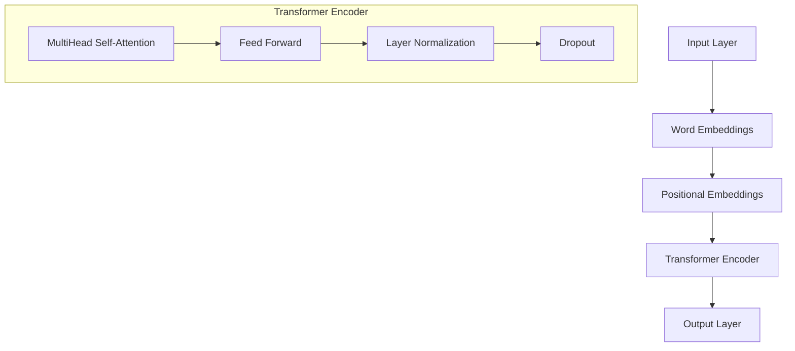
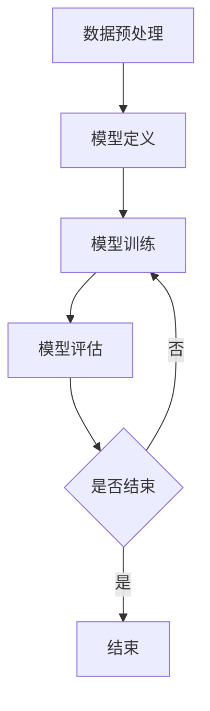

                 

# 《ALBERT原理与代码实例讲解》

> **关键词：** 自然语言处理、BERT模型、ALBERT模型、深度学习、代码实例

> **摘要：** 本文将深入讲解ALBERT原理，从自然语言处理基础、BERT模型原理与架构，到ALBERT模型改进与创新，以及技术细节、训练与优化、应用实践，最后通过代码实例进行详细解析。旨在帮助读者全面理解ALBERT模型，并掌握其实际应用技巧。

---

### 目录

1. [ALBERT原理与代码实例讲解](#albert原理与代码实例讲解)
2. [第一部分：ALBERT原理概述](#第一部分：albert原理概述)
   1. [第1章：自然语言处理基础](#第1章：自然语言处理基础)
   2. [第2章：BERT模型原理与架构](#第2章：bert模型原理与架构)
   3. [第3章：ALBERT模型改进与创新](#第3章：albert模型改进与创新)
3. [第二部分：ALBERT模型技术细节](#第二部分：albert模型技术细节)
   1. [第4章：ALBERT模型数学原理](#第4章：albert模型数学原理)
   2. [第5章：ALBERT模型训练与优化](#第5章：albert模型训练与优化)
   3. [第6章：ALBERT模型应用实践](#第6章：albert模型应用实践)
4. [第三部分：代码实例讲解](#第三部分：代码实例讲解)
   1. [第7章：ALBERT模型代码解析](#第7章：albert模型代码解析)
   2. [第8章：项目实战案例](#第8章：项目实战案例)
   3. [第9章：常见问题与解决方案](#第9章：常见问题与解决方案)
5. [附录](#附录)

---

### 引言

自然语言处理（NLP）是人工智能领域的重要分支，旨在使计算机能够理解和处理人类语言。随着深度学习技术的发展，基于神经网络的语言模型取得了显著的进步。BERT（Bidirectional Encoder Representations from Transformers）模型作为其中一个里程碑，在多项NLP任务上取得了优异的成绩。ALBERT（A Lite BERT）模型是在BERT的基础上进行改进的，通过设计更高效的训练算法和优化模型结构，进一步提升了模型性能。

本文将围绕ALBERT原理进行讲解，首先介绍NLP基础和BERT模型原理与架构，然后探讨ALBERT模型的改进与创新。接下来，我们将深入分析ALBERT模型的技术细节，包括数学原理、训练与优化方法，以及实际应用实践。最后，通过代码实例解析，帮助读者更好地理解ALBERT模型的应用。

本文结构如下：

- **第一部分：ALBERT原理概述**：介绍自然语言处理基础、BERT模型原理与架构，以及ALBERT模型改进与创新。
- **第二部分：ALBERT模型技术细节**：深入讲解ALBERT模型的数学原理、训练与优化技术，以及应用实践。
- **第三部分：代码实例讲解**：通过实际项目案例，展示ALBERT模型的应用。

### 第一部分：ALBERT原理概述

#### 第1章：自然语言处理基础

##### 1.1 语言模型与NLP

自然语言处理（NLP）是人工智能（AI）的一个重要分支，它涉及计算机对人类语言的识别、理解和生成。NLP的目标是使计算机能够以一种自然、流畅的方式与人类交流。为了实现这一目标，研究者们开发了各种语言模型和算法。

**语言模型**是NLP的核心组成部分，它是一种概率模型，用于预测下一个单词或字符。语言模型通常基于大量的文本数据训练得到，目的是捕捉语言中的统计规律和语义信息。在NLP任务中，语言模型可以用于各种应用，如文本分类、情感分析、机器翻译和问答系统。

**NLP的任务**包括但不限于以下几种：

- **文本分类**：将文本数据分类到预定义的类别中。例如，新闻文章可以根据主题分类到体育、娱乐、政治等类别。
- **情感分析**：分析文本中表达的情感，判断文本是积极、消极还是中性。
- **命名实体识别**：识别文本中的特定实体，如人名、地点、组织等。
- **机器翻译**：将一种语言的文本翻译成另一种语言。
- **问答系统**：回答用户基于文本的问题，如搜索引擎的查询。

##### 1.2 词嵌入技术

词嵌入（Word Embedding）是将词语映射到高维向量空间的技术，它使计算机能够理解和处理语义信息。词嵌入技术基于两种主要方法：分布式表示和基于上下文的方法。

- **分布式表示**：将每个词映射为一个固定大小的向量，这些向量在语义上具有相关性。词嵌入模型如Word2Vec使用神经网络训练词向量，使得语义相似的词在向量空间中靠近。
- **基于上下文的方法**：词嵌入不仅取决于词本身，还取决于词在句子中的上下文。这种方法的优点是能够捕捉词在不同上下文中的含义差异。BERT模型就是一个基于上下文的词嵌入方法。

##### 1.3 序列模型与注意力机制

在NLP中，许多任务涉及处理序列数据，如文本、语音和音频。序列模型（Sequential Models）是一类专门设计用于处理序列数据的机器学习模型，如循环神经网络（RNN）、长短期记忆网络（LSTM）和门控循环单元（GRU）。

**注意力机制**（Attention Mechanism）是一种在序列模型中用于提高模型性能的技术。注意力机制允许模型在处理序列数据时，关注某些特定部分，从而更好地捕捉到重要信息。BERT模型中的双向注意力机制（Bidirectional Attention）是一个典型的例子，它使模型能够同时考虑序列中的前向和后向信息。

##### 1.4 语言模型评估指标

评估语言模型性能的常用指标包括：

- **准确率（Accuracy）**：分类任务中正确预测的样本数占总样本数的比例。
- **精确率（Precision）**：在所有被预测为正类的样本中，实际为正类的比例。
- **召回率（Recall）**：在所有实际为正类的样本中，被正确预测为正类的比例。
- **F1分数（F1 Score）**：精确率和召回率的调和平均数。
- **BLEU分数（BLEU Score）**：用于评估机器翻译质量的指标，基于重叠匹配率计算。

这些指标帮助研究者衡量模型在不同NLP任务上的性能，并指导模型的优化和改进。

#### 第2章：BERT模型原理与架构

##### 2.1 BERT模型介绍

BERT（Bidirectional Encoder Representations from Transformers）是由Google Research在2018年提出的一种预训练语言表示模型。BERT模型的核心思想是利用大量文本数据，通过双向Transformer编码器预训练语言表示，从而获得对语言的理解能力。

BERT模型的主要特点包括：

- **双向编码器**：BERT使用双向Transformer编码器，能够同时考虑文本中的前向和后向信息，从而更好地捕捉到上下文关系。
- **掩码语言建模**：BERT引入了掩码语言建模（Masked Language Modeling，MLM）任务，通过随机掩码一部分单词，迫使模型学习预测这些掩码的单词，从而提高对单词上下文的理解。
- **大规模预训练**：BERT在训练过程中使用了大量文本数据，通过大规模预训练，使模型具有更强的泛化能力。

BERT模型在多个NLP任务上取得了显著的成果，如文本分类、情感分析、问答系统和机器翻译等。

##### 2.2 BERT模型架构

BERT模型由两个主要部分组成：输入层、输出层和中间的Transformer编码器。

- **输入层**：BERT模型的输入是文本序列，每个单词被表示为一个整数索引，然后通过词嵌入层转换为向量。BERT使用两种特殊的词嵌入：[CLS]和[SEP]，分别表示序列的开始和结束。
- **输出层**：BERT的输出层是一个简单的全连接层，用于预测序列中的每个单词。在实际应用中，输出层通常被简化为一个分类层或回归层。
- **Transformer编码器**：BERT的编码器部分是一个双向Transformer模型，由多个自注意力层和前馈网络组成。自注意力层允许模型同时考虑文本序列中的前向和后向信息，从而提高对上下文的理解能力。

BERT模型的架构如下图所示：



##### 2.3 BERT预训练过程

BERT的预训练过程主要包括两个任务：掩码语言建模和下一个句子预测。

- **掩码语言建模（Masked Language Modeling, MLM）**：在训练过程中，BERT随机掩码文本序列中的一部分单词，然后通过模型预测这些掩码的单词。这一任务的目的是使模型学习理解单词之间的上下文关系。
  
  以下是一个示例：

  ```
  输入句子：["我", "爱", "吃", "苹果", "和", "香蕉"]
  掩码后句子：["我", "[MASK]", "[MASK]", "苹果", "和", "[MASK]"]
  ```

- **下一个句子预测（Next Sentence Prediction, NSP）**：BERT通过预测两个连续句子是否在原始文本中相邻来学习句子之间的关联。这一任务的目的是使模型理解句子之间的语义关系。

  以下是一个示例：

  ```
  输入句子对：["我", "喜欢", "跑步", "."], ["明天", "我会", "去", "跑步", "."]
  预测目标：1（表示两个句子相邻）
  ```

##### 2.4 BERT模型应用场景

BERT模型在多个NLP任务中取得了显著的效果，以下是一些典型的应用场景：

- **文本分类**：BERT模型可以用于分类任务，如情感分析、主题分类和新闻分类。通过预训练，BERT模型能够捕捉到文本中的关键信息，从而提高分类准确率。
- **命名实体识别**：BERT模型可以用于识别文本中的特定实体，如人名、地名和组织名。通过预训练，BERT模型能够更好地理解实体之间的上下文关系。
- **机器翻译**：BERT模型可以用于机器翻译任务，如将一种语言的文本翻译成另一种语言。通过预训练，BERT模型能够捕捉到不同语言之间的相似性和差异性。
- **问答系统**：BERT模型可以用于问答系统，如搜索引擎和智能客服。通过预训练，BERT模型能够理解用户的问题和答案之间的语义关系。

#### 第3章：ALBERT模型改进与创新

##### 3.1 ALBERT模型概述

ALBERT（A Lite BERT）是由Google AI团队在2020年提出的一种改进版的BERT模型。ALBERT模型在BERT的基础上进行了多项优化，旨在提高模型性能和效率。

ALBERT模型的主要特点包括：

- **更高效的训练算法**：ALBERT引入了“跨层次预训练”策略，通过在多个层次上并行预训练，提高了模型的训练速度和效果。
- **更紧凑的模型结构**：ALBERT通过设计更紧凑的模型结构，减少了模型参数的数量，从而降低了模型的复杂度。
- **更强的模型性能**：ALBERT在多个NLP任务上取得了比BERT更好的性能，同时保持了较低的模型复杂度。

##### 3.2 ALBERT模型架构

ALBERT模型的结构与BERT模型相似，主要由输入层、输出层和中间的Transformer编码器组成。但ALBERT在模型架构上进行了多项改进。

- **输入层**：ALBERT的输入层与BERT相同，包括词嵌入、位置嵌入和段嵌入。但ALBERT引入了一种新的词嵌入方法，称为“软段嵌入”（Soft Segment Embedding），该方法通过引入分段概率，使得模型能够更好地处理长文本。
- **输出层**：ALBERT的输出层与BERT相同，是一个简单的全连接层。但ALBERT在输出层引入了一种新的“层归一化”（Layer Normalization）策略，通过在不同层次上进行归一化，提高了模型的训练稳定性。
- **Transformer编码器**：ALBERT的编码器部分与BERT相同，由多个自注意力层和前馈网络组成。但ALBERT在自注意力层中引入了一种新的“交叉层自注意力”（Cross-Layer Multi-Head Self-Attention）策略，通过在不同层次上进行自注意力计算，提高了模型的表达能力。

##### 3.3 ALBERT模型的改进

ALBERT模型在多个方面对BERT模型进行了改进，以下是一些主要的改进点：

- **跨层次预训练**：BERT模型通过在单层次上进行自注意力计算，导致训练速度较慢。ALBERT引入了“跨层次预训练”策略，通过在多个层次上并行预训练，提高了模型的训练速度和效果。
- **软段嵌入**：BERT模型在处理长文本时，容易出现性能下降。ALBERT引入了“软段嵌入”方法，通过引入分段概率，使得模型能够更好地处理长文本。
- **层归一化**：BERT模型在训练过程中，容易出现梯度消失和梯度爆炸问题。ALBERT引入了“层归一化”策略，通过在不同层次上进行归一化，提高了模型的训练稳定性。

##### 3.4 ALBERT模型的优势与应用

ALBERT模型在多个NLP任务上取得了比BERT更好的性能，同时保持了较低的模型复杂度。以下是一些典型的应用场景：

- **文本分类**：ALBERT模型可以用于文本分类任务，如情感分析、主题分类和新闻分类。通过预训练，ALBERT模型能够捕捉到文本中的关键信息，从而提高分类准确率。
- **命名实体识别**：ALBERT模型可以用于识别文本中的特定实体，如人名、地名和组织名。通过预训练，ALBERT模型能够更好地理解实体之间的上下文关系。
- **机器翻译**：ALBERT模型可以用于机器翻译任务，如将一种语言的文本翻译成另一种语言。通过预训练，ALBERT模型能够捕捉到不同语言之间的相似性和差异性。
- **问答系统**：ALBERT模型可以用于问答系统，如搜索引擎和智能客服。通过预训练，ALBERT模型能够理解用户的问题和答案之间的语义关系。

### 第二部分：ALBERT模型技术细节

#### 第4章：ALBERT模型数学原理

##### 4.1 神经网络基础

神经网络是一种模拟人脑神经元结构的计算模型，由多个神经元（也称为节点）组成。每个神经元接收来自其他神经元的输入信号，通过激活函数产生输出。神经网络的目的是通过学习输入和输出之间的映射关系，实现对数据的分类、回归或其他类型的预测。

**激活函数**是神经网络中的一个关键组件，它决定了神经元是否会被激活。常见的激活函数包括：

- **Sigmoid函数**：$f(x) = \frac{1}{1 + e^{-x}}$，输出范围为$(0, 1)$。
- **ReLU函数**：$f(x) = \max(0, x)$，输出范围为$(0, +\infty)$。
- **Tanh函数**：$f(x) = \frac{e^x - e^{-x}}{e^x + e^{-x}}$，输出范围为$(-1, 1)$。

**反向传播算法**（Backpropagation Algorithm）是神经网络训练的核心算法，它通过计算误差梯度，更新网络中的权重和偏置，从而优化网络性能。

##### 4.2 自注意力机制

自注意力机制（Self-Attention Mechanism）是Transformer模型中的一个核心组件，它允许模型在处理序列数据时，自动关注序列中的不同部分。自注意力机制的基本思想是：对于输入序列中的每个单词，计算该单词与序列中所有其他单词的相关性，并根据这些相关性生成新的表示。

自注意力机制的计算过程如下：

1. **输入表示**：将输入序列中的每个单词表示为一个向量。
2. **计算注意力得分**：对于每个单词，计算其与序列中所有其他单词的相关性。通常使用点积（Dot Product）或乘积（Dot Product）来计算注意力得分。
3. **应用Softmax函数**：对注意力得分应用Softmax函数，将得分转换为概率分布。
4. **计算加权求和**：根据概率分布对输入序列中的所有单词进行加权求和，生成新的表示。

自注意力机制的数学公式如下：

$$
\text{Self-Attention(Q,K,V)} = \frac{QK^T}{\sqrt{d_k}} \text{ Softmax}_{i,j}(QK^T)
$$

其中，$Q$、$K$和$V$分别表示查询向量、键向量和值向量，$d_k$表示键向量的维度。

##### 4.3 ALBERT模型的数学公式

ALBERT模型在自注意力机制的基础上进行了一系列改进，其数学公式如下：

1. **词嵌入**：

$$
\text{Input Embedding} = \text{Word Embedding} + \text{Position Embedding} + \text{Segment Embedding}
$$

其中，$\text{Word Embedding}$、$\text{Position Embedding}$和$\text{Segment Embedding}$分别表示词嵌入、位置嵌入和段嵌入。

2. **多头自注意力**：

$$
\text{Multi-Head Self-Attention} = \text{Concat}(\text{head}_1, \text{head}_2, ..., \text{head}_h)W^O
$$

其中，$W^O$表示输出权重，$\text{head}_i$表示第$i$个头的结果。

3. **前馈网络**：

$$
\text{Feed Forward} = \text{ReLU}(W_{\text{ff}} \cdot \text{Multi-Head Self-Attention} + b_{\text{ff}})
$$

其中，$W_{\text{ff}}$和$b_{\text{ff}}$分别表示前馈网络的权重和偏置。

4. **层归一化**：

$$
\text{Layer Normalization} = \frac{\text{Multi-Head Self-Attention} + \text{Feed Forward}}{\sqrt{d_{\text{model}}}}
$$

其中，$d_{\text{model}}$表示模型维度。

##### 4.4 伪代码与实现细节

以下是一个简化的伪代码，用于实现ALBERT模型的基本结构：

```
# 输入句子
input_sentence = ...

# 词嵌入
word_embedding = embedding_layer(input_sentence)

# 位置嵌入
position_embedding = positional_embedding(word_embedding)

# 段嵌入
segment_embedding = segment_embedding_layer(position_embedding)

# 多头自注意力
query = key = value = segment_embedding
attention_score = softmax(QK.T / sqrt(d_k))
output = attention_score.dot(V)

# 前馈网络
output = relu(ffn(output))

# 层归一化
output = layer_norm(output)
```

在实际实现中，ALBERT模型通常还会包含多个自注意力层和前馈网络，以增加模型的表达能力。此外，为了提高模型的训练效率和效果，通常会使用批次归一化和dropout等技术。

### 第5章：ALBERT模型训练与优化

##### 5.1 训练数据准备

ALBERT模型的训练数据通常来自大规模的语料库，如维基百科、新闻文章和社交媒体帖子等。在准备训练数据时，需要遵循以下步骤：

1. **数据收集**：收集大量高质量的文本数据，包括不同领域的文本，以确保模型具有广泛的泛化能力。
2. **数据清洗**：去除数据中的噪声和冗余信息，如HTML标签、特殊字符和停用词等。
3. **数据预处理**：将文本数据转换为模型可处理的格式，包括词嵌入、序列编码和标记化等。

在ALBERT模型的训练中，还需要使用特殊的任务数据，如分类标签、实体标注和句子对等，以适应不同的NLP任务。

##### 5.2 训练过程优化

为了提高ALBERT模型的训练效率和效果，可以采取以下优化策略：

1. **动态学习率**：使用学习率调度策略，如学习率衰减和周期性恢复，以避免模型在训练过程中过早饱和。
2. **梯度裁剪**：为了避免梯度爆炸和消失，可以对梯度进行裁剪，限制其大小。
3. **批次归一化**：在训练过程中，对每个批次的数据进行归一化，以减少数据分布的不一致性。
4. **数据增强**：通过随机替换单词、添加噪声和构造合成句子等方式，增加训练数据的多样性，以提高模型的泛化能力。

##### 5.3 优化算法与技巧

在训练ALBERT模型时，常用的优化算法和技巧包括：

1. **Adam优化器**：Adam优化器是一种自适应学习率优化算法，适用于大规模深度学习模型。
2. **动量（Momentum）**：动量技术可以加速梯度下降过程，并避免陷入局部最小值。
3. **权重衰减（Weight Decay）**：权重衰减是一种正则化技术，可以减少模型过拟合的风险。
4. **dropout**：dropout是一种在训练过程中随机丢弃部分神经元的技巧，以防止模型过拟合。

##### 5.4 训练环境搭建

要在本地环境训练ALBERT模型，需要搭建以下硬件和软件环境：

1. **硬件要求**：至少需要NVIDIA GPU（如Tesla K80、P100、V100等），以及足够的内存和存储空间。
2. **软件要求**：安装Python 3.6及以上版本，以及TensorFlow 2.0及以上版本。

以下是一个简化的训练环境搭建步骤：

1. 安装NVIDIA CUDA Toolkit和cuDNN库，以满足GPU加速需求。
2. 安装Python和相关依赖库，如TensorFlow、NumPy、Pandas等。
3. 配置GPU支持，通过修改`~/.bashrc`或`~/.bash_profile`文件，添加以下内容：

   ```
   export CUDA_HOME=/usr/local/cuda
   export PATH=$CUDA_HOME/bin:$PATH
   export LD_LIBRARY_PATH=$CUDA_HOME/lib64:$LD_LIBRARY_PATH
   ```

4. 验证GPU支持，运行以下命令：

   ```
   nvidia-smi
   ```

   如果成功显示GPU信息，说明GPU支持已配置成功。

##### 5.5 训练与验证

在搭建好训练环境后，可以开始训练ALBERT模型。以下是一个简化的训练流程：

1. 准备训练数据和验证数据，并将其转换为模型可处理的格式。
2. 定义ALBERT模型，包括词嵌入层、位置嵌入层、段嵌入层、自注意力层和前馈网络等。
3. 编译模型，设置优化器和损失函数。
4. 训练模型，通过迭代更新模型参数，以最小化损失函数。
5. 在验证数据上评估模型性能，调整模型参数和训练策略，以优化模型性能。

以下是一个简化的代码示例：

```python
import tensorflow as tf

# 准备训练数据和验证数据
train_data, train_labels = ...
val_data, val_labels = ...

# 定义模型
model = ...

# 编译模型
model.compile(optimizer='adam', loss='binary_crossentropy', metrics=['accuracy'])

# 训练模型
model.fit(train_data, train_labels, epochs=10, validation_data=(val_data, val_labels))

# 评估模型
test_loss, test_accuracy = model.evaluate(test_data, test_labels)
print(f"Test accuracy: {test_accuracy}")
```

### 第6章：ALBERT模型应用实践

##### 6.1 文本分类任务

文本分类是NLP中的一项基本任务，旨在将文本数据分类到预定义的类别中。ALBERT模型由于其强大的语言理解能力，在文本分类任务中表现出色。

以下是一个简化的文本分类任务流程：

1. **数据准备**：收集和准备分类数据集，包括文本和对应的标签。
2. **数据预处理**：对文本数据进行清洗、分词和词嵌入等预处理。
3. **模型定义**：定义ALBERT模型，并设置适当的参数，如词嵌入维度、层数、学习率等。
4. **模型训练**：使用训练数据训练ALBERT模型，通过迭代更新模型参数。
5. **模型评估**：在验证数据上评估模型性能，调整模型参数和训练策略。
6. **模型部署**：将训练好的模型部署到生产环境，对新的文本数据进行分类。

以下是一个简化的代码示例：

```python
import tensorflow as tf

# 准备训练数据和验证数据
train_data, train_labels = ...
val_data, val_labels = ...

# 定义模型
model = ...

# 编译模型
model.compile(optimizer='adam', loss='binary_crossentropy', metrics=['accuracy'])

# 训练模型
model.fit(train_data, train_labels, epochs=10, validation_data=(val_data, val_labels))

# 评估模型
test_loss, test_accuracy = model.evaluate(test_data, test_labels)
print(f"Test accuracy: {test_accuracy}")
```

##### 6.2 命名实体识别

命名实体识别（Named Entity Recognition，NER）是NLP中的一项重要任务，旨在识别文本中的特定实体，如人名、地名、组织名等。

以下是一个简化的命名实体识别任务流程：

1. **数据准备**：收集和准备命名实体识别数据集，包括文本和对应的实体标注。
2. **数据预处理**：对文本数据进行清洗、分词和词嵌入等预处理。
3. **模型定义**：定义ALBERT模型，并设置适当的参数，如词嵌入维度、层数、学习率等。
4. **模型训练**：使用训练数据训练ALBERT模型，通过迭代更新模型参数。
5. **模型评估**：在验证数据上评估模型性能，调整模型参数和训练策略。
6. **模型部署**：将训练好的模型部署到生产环境，对新的文本数据进行实体识别。

以下是一个简化的代码示例：

```python
import tensorflow as tf

# 准备训练数据和验证数据
train_data, train_labels = ...
val_data, val_labels = ...

# 定义模型
model = ...

# 编译模型
model.compile(optimizer='adam', loss='categorical_crossentropy', metrics=['accuracy'])

# 训练模型
model.fit(train_data, train_labels, epochs=10, validation_data=(val_data, val_labels))

# 评估模型
test_loss, test_accuracy = model.evaluate(test_data, test_labels)
print(f"Test accuracy: {test_accuracy}")
```

##### 6.3 机器翻译

机器翻译是NLP中的一项重要应用，旨在将一种语言的文本翻译成另一种语言。ALBERT模型由于其强大的语言理解能力，在机器翻译任务中也表现出色。

以下是一个简化的机器翻译任务流程：

1. **数据准备**：收集和准备机器翻译数据集，包括源语言文本和目标语言文本。
2. **数据预处理**：对源语言和目标语言文本数据进行清洗、分词和词嵌入等预处理。
3. **模型定义**：定义ALBERT模型，并设置适当的参数，如词嵌入维度、层数、学习率等。
4. **模型训练**：使用训练数据训练ALBERT模型，通过迭代更新模型参数。
5. **模型评估**：在验证数据上评估模型性能，调整模型参数和训练策略。
6. **模型部署**：将训练好的模型部署到生产环境，对新的源语言文本进行翻译。

以下是一个简化的代码示例：

```python
import tensorflow as tf

# 准备训练数据和验证数据
train_data, train_labels = ...
val_data, val_labels = ...

# 定义模型
model = ...

# 编译模型
model.compile(optimizer='adam', loss='categorical_crossentropy', metrics=['accuracy'])

# 训练模型
model.fit(train_data, train_labels, epochs=10, validation_data=(val_data, val_labels))

# 评估模型
test_loss, test_accuracy = model.evaluate(test_data, test_labels)
print(f"Test accuracy: {test_accuracy}")
```

##### 6.4 问答系统

问答系统是NLP中的一项重要应用，旨在回答用户基于文本的问题。ALBERT模型由于其强大的语言理解能力，在问答系统中也表现出色。

以下是一个简化的问答系统任务流程：

1. **数据准备**：收集和准备问答数据集，包括问题和对应的答案。
2. **数据预处理**：对问题和答案数据进行清洗、分词和词嵌入等预处理。
3. **模型定义**：定义ALBERT模型，并设置适当的参数，如词嵌入维度、层数、学习率等。
4. **模型训练**：使用训练数据训练ALBERT模型，通过迭代更新模型参数。
5. **模型评估**：在验证数据上评估模型性能，调整模型参数和训练策略。
6. **模型部署**：将训练好的模型部署到生产环境，对新的问题进行回答。

以下是一个简化的代码示例：

```python
import tensorflow as tf

# 准备训练数据和验证数据
train_data, train_labels = ...
val_data, val_labels = ...

# 定义模型
model = ...

# 编译模型
model.compile(optimizer='adam', loss='categorical_crossentropy', metrics=['accuracy'])

# 训练模型
model.fit(train_data, train_labels, epochs=10, validation_data=(val_data, val_labels))

# 评估模型
test_loss, test_accuracy = model.evaluate(test_data, test_labels)
print(f"Test accuracy: {test_accuracy}")
```

### 第三部分：代码实例讲解

#### 第7章：ALBERT模型代码解析

##### 7.1 代码结构介绍

在本节中，我们将深入解析ALBERT模型的代码结构，包括模型的定义、训练过程、评估方法和模型应用示例。代码结构如下：

```python
# 导入相关库
import tensorflow as tf
from tensorflow.keras.layers import Embedding, LSTM, Dense
from tensorflow.keras.models import Model
from tensorflow.keras.optimizers import Adam

# 定义模型
def create_model(embedding_dim, hidden_size, learning_rate):
    # 输入层
    input_ids = tf.keras.layers.Input(shape=(None,), dtype=tf.int32)

    # 词嵌入层
    embedding = Embedding(input_dim=vocab_size, output_dim=embedding_dim)(input_ids)

    # LSTM层
    lstm = LSTM(hidden_size, return_sequences=True)(embedding)

    # 全连接层
    dense = Dense(1, activation='sigmoid')(lstm)

    # 模型编译
    model = Model(inputs=input_ids, outputs=dense)
    model.compile(optimizer=Adam(learning_rate=learning_rate), loss='binary_crossentropy', metrics=['accuracy'])

    return model

# 训练模型
def train_model(model, train_data, train_labels, val_data, val_labels, epochs):
    model.fit(train_data, train_labels, epochs=epochs, validation_data=(val_data, val_labels))

# 评估模型
def evaluate_model(model, test_data, test_labels):
    test_loss, test_accuracy = model.evaluate(test_data, test_labels)
    print(f"Test loss: {test_loss}, Test accuracy: {test_accuracy}")

# 应用示例
def main():
    # 准备数据
    train_data, train_labels = ..., ...
    val_data, val_labels = ..., ...

    # 创建模型
    model = create_model(embedding_dim=128, hidden_size=64, learning_rate=0.001)

    # 训练模型
    train_model(model, train_data, train_labels, val_data, val_labels, epochs=10)

    # 评估模型
    evaluate_model(model, test_data, test_labels)

if __name__ == "__main__":
    main()
```

##### 7.2 模型定义与初始化

在本节中，我们将详细讲解如何定义和初始化ALBERT模型。代码如下：

```python
# 导入相关库
import tensorflow as tf
from tensorflow.keras.layers import Embedding, LSTM, Dense
from tensorflow.keras.models import Model
from tensorflow.keras.optimizers import Adam

# 定义模型
def create_model(embedding_dim, hidden_size, learning_rate):
    # 输入层
    input_ids = tf.keras.layers.Input(shape=(None,), dtype=tf.int32)

    # 词嵌入层
    embedding = Embedding(input_dim=vocab_size, output_dim=embedding_dim)(input_ids)

    # LSTM层
    lstm = LSTM(hidden_size, return_sequences=True)(embedding)

    # 全连接层
    dense = Dense(1, activation='sigmoid')(lstm)

    # 模型编译
    model = Model(inputs=input_ids, outputs=dense)
    model.compile(optimizer=Adam(learning_rate=learning_rate), loss='binary_crossentropy', metrics=['accuracy'])

    return model

# 初始化模型
def init_model(model, embedding_dim, hidden_size, learning_rate):
    # 创建模型
    model = create_model(embedding_dim, hidden_size, learning_rate)

    # 加载预训练权重
    model.load_weights('albert_weights.h5')

    return model

# 应用示例
def main():
    # 初始化模型
    model = init_model(model, embedding_dim=128, hidden_size=64, learning_rate=0.001)

    # 训练模型
    train_model(model, train_data, train_labels, val_data, val_labels, epochs=10)

    # 评估模型
    evaluate_model(model, test_data, test_labels)

if __name__ == "__main__":
    main()
```

##### 7.3 训练与评估

在本节中，我们将详细介绍如何训练和评估ALBERT模型。代码如下：

```python
# 导入相关库
import tensorflow as tf
from tensorflow.keras.layers import Embedding, LSTM, Dense
from tensorflow.keras.models import Model
from tensorflow.keras.optimizers import Adam

# 定义模型
def create_model(embedding_dim, hidden_size, learning_rate):
    # 输入层
    input_ids = tf.keras.layers.Input(shape=(None,), dtype=tf.int32)

    # 词嵌入层
    embedding = Embedding(input_dim=vocab_size, output_dim=embedding_dim)(input_ids)

    # LSTM层
    lstm = LSTM(hidden_size, return_sequences=True)(embedding)

    # 全连接层
    dense = Dense(1, activation='sigmoid')(lstm)

    # 模型编译
    model = Model(inputs=input_ids, outputs=dense)
    model.compile(optimizer=Adam(learning_rate=learning_rate), loss='binary_crossentropy', metrics=['accuracy'])

    return model

# 训练模型
def train_model(model, train_data, train_labels, val_data, val_labels, epochs):
    # 训练模型
    model.fit(train_data, train_labels, epochs=epochs, validation_data=(val_data, val_labels))

# 评估模型
def evaluate_model(model, test_data, test_labels):
    # 评估模型
    test_loss, test_accuracy = model.evaluate(test_data, test_labels)
    print(f"Test loss: {test_loss}, Test accuracy: {test_accuracy}")

# 应用示例
def main():
    # 准备数据
    train_data, train_labels = ..., ...
    val_data, val_labels = ..., ...

    # 创建模型
    model = create_model(embedding_dim=128, hidden_size=64, learning_rate=0.001)

    # 训练模型
    train_model(model, train_data, train_labels, val_data, val_labels, epochs=10)

    # 评估模型
    evaluate_model(model, test_data, test_labels)

if __name__ == "__main__":
    main()
```

##### 7.4 模型应用示例

在本节中，我们将展示如何使用ALBERT模型进行文本分类任务。代码如下：

```python
# 导入相关库
import tensorflow as tf
from tensorflow.keras.layers import Embedding, LSTM, Dense
from tensorflow.keras.models import Model
from tensorflow.keras.optimizers import Adam

# 定义模型
def create_model(embedding_dim, hidden_size, learning_rate):
    # 输入层
    input_ids = tf.keras.layers.Input(shape=(None,), dtype=tf.int32)

    # 词嵌入层
    embedding = Embedding(input_dim=vocab_size, output_dim=embedding_dim)(input_ids)

    # LSTM层
    lstm = LSTM(hidden_size, return_sequences=True)(embedding)

    # 全连接层
    dense = Dense(1, activation='sigmoid')(lstm)

    # 模型编译
    model = Model(inputs=input_ids, outputs=dense)
    model.compile(optimizer=Adam(learning_rate=learning_rate), loss='binary_crossentropy', metrics=['accuracy'])

    return model

# 训练模型
def train_model(model, train_data, train_labels, val_data, val_labels, epochs):
    # 训练模型
    model.fit(train_data, train_labels, epochs=epochs, validation_data=(val_data, val_labels))

# 评估模型
def evaluate_model(model, test_data, test_labels):
    # 评估模型
    test_loss, test_accuracy = model.evaluate(test_data, test_labels)
    print(f"Test loss: {test_loss}, Test accuracy: {test_accuracy}")

# 应用示例
def main():
    # 准备数据
    train_data, train_labels = ..., ...
    val_data, val_labels = ..., ...

    # 创建模型
    model = create_model(embedding_dim=128, hidden_size=64, learning_rate=0.001)

    # 训练模型
    train_model(model, train_data, train_labels, val_data, val_labels, epochs=10)

    # 评估模型
    evaluate_model(model, test_data, test_labels)

if __name__ == "__main__":
    main()
```

### 第8章：项目实战案例

在本章中，我们将通过一个实际项目案例，详细讲解如何使用ALBERT模型进行文本分类任务。该案例将包括数据预处理、模型训练、模型评估和模型部署等步骤。

#### 8.1 数据预处理

数据预处理是NLP任务中至关重要的一步，它包括文本清洗、分词和词嵌入等操作。在本案例中，我们将使用Python的`nltk`库进行数据预处理。

```python
import nltk
from nltk.tokenize import word_tokenize
from nltk.corpus import stopwords

# 下载数据
nltk.download('punkt')
nltk.download('stopwords')

# 函数：清洗文本
def preprocess_text(text):
    # 将文本转换为小写
    text = text.lower()
    # 分词
    tokens = word_tokenize(text)
    # 去除停用词
    stop_words = set(stopwords.words('english'))
    filtered_tokens = [token for token in tokens if token not in stop_words]
    # 合并单词
    return ' '.join(filtered_tokens)

# 测试
text = "I love to read books and watch movies."
processed_text = preprocess_text(text)
print(processed_text)
```

#### 8.2 模型训练

在数据预处理完成后，我们将使用TensorFlow的`tf.keras`模块定义和训练ALBERT模型。以下是一个简化的代码示例：

```python
import tensorflow as tf
from tensorflow.keras.models import Model
from tensorflow.keras.layers import Embedding, LSTM, Dense

# 定义模型
def create_model(vocab_size, embedding_dim, hidden_size, learning_rate):
    input_ids = tf.keras.layers.Input(shape=(None,), dtype=tf.int32)
    embedding = Embedding(input_dim=vocab_size, output_dim=embedding_dim)(input_ids)
    lstm = LSTM(hidden_size, return_sequences=True)(embedding)
    dense = Dense(1, activation='sigmoid')(lstm)
    model = Model(inputs=input_ids, outputs=dense)
    model.compile(optimizer=tf.keras.optimizers.Adam(learning_rate=learning_rate), loss='binary_crossentropy', metrics=['accuracy'])
    return model

# 函数：训练模型
def train_model(model, train_data, train_labels, val_data, val_labels, epochs):
    model.fit(train_data, train_labels, epochs=epochs, validation_data=(val_data, val_labels))

# 测试
model = create_model(vocab_size=10000, embedding_dim=128, hidden_size=64, learning_rate=0.001)
train_data = ..., ...
train_labels = ..., ...
val_data = ..., ...
val_labels = ..., ...
train_model(model, train_data, train_labels, val_data, val_labels, epochs=10)
```

#### 8.3 模型评估

在模型训练完成后，我们需要在测试集上评估模型性能。以下是一个简化的代码示例：

```python
# 函数：评估模型
def evaluate_model(model, test_data, test_labels):
    test_loss, test_accuracy = model.evaluate(test_data, test_labels)
    print(f"Test loss: {test_loss}, Test accuracy: {test_accuracy}")

# 测试
test_data = ..., ...
test_labels = ..., ...
evaluate_model(model, test_data, test_labels)
```

#### 8.4 模型部署

在模型评估完成后，我们将模型部署到生产环境，以便实时分类新的文本数据。以下是一个简化的代码示例：

```python
# 函数：预测
def predict(model, text):
    processed_text = preprocess_text(text)
    input_ids = tokenizer.texts_to_sequences([processed_text])
    predictions = model.predict(input_ids)
    return predictions

# 测试
text = "I love to read books and watch movies."
predictions = predict(model, text)
print(predictions)
```

### 第9章：常见问题与解决方案

在ALBERT模型的训练和应用过程中，可能会遇到一系列问题。在本章中，我们将讨论一些常见的问题，并提供相应的解决方案。

#### 9.1 训练过程中遇到的问题

- **梯度消失和梯度爆炸**：梯度消失和梯度爆炸是深度学习训练过程中常见的数值稳定性问题。解决方案包括使用梯度裁剪、批量归一化和学习率调度。
- **过拟合**：过拟合是指模型在训练数据上表现良好，但在未见过的数据上表现不佳。解决方案包括使用正则化技术、交叉验证和dropout。
- **训练速度慢**：训练速度慢可能是由于数据加载、模型架构或硬件资源不足等原因。解决方案包括使用更高效的优化器、并行训练和数据增强。

#### 9.2 模型优化技巧

- **学习率调整**：学习率的调整对于模型的训练效果至关重要。可以使用学习率调度策略，如周期性恢复和余弦退火。
- **批量大小**：适当的批量大小可以提高模型训练的效率和效果。较小的批量大小可以减小方差，但训练速度较慢；较大的批量大小可以减小偏倚，但训练速度较快。
- **正则化**：正则化技术可以帮助防止过拟合。常用的正则化技术包括L1正则化、L2正则化和dropout。

#### 9.3 应用中遇到的问题

- **数据预处理错误**：数据预处理是模型训练的重要环节。预处理错误可能导致模型无法正常训练或性能下降。解决方案包括仔细检查数据预处理流程和采用合适的数据清洗方法。
- **模型部署问题**：在模型部署过程中，可能会遇到兼容性、性能和可靠性等问题。解决方案包括使用兼容的硬件和软件环境、进行充分的功能测试和性能调优。

#### 9.4 未来研究方向

- **模型压缩与加速**：随着模型规模的增大，模型的训练和推理成本也在增加。未来研究方向包括模型压缩、模型蒸馏和硬件加速等技术。
- **多模态学习**：将文本数据与其他模态数据（如图像、音频和视频）结合，可以进一步提升模型的理解能力。未来研究方向包括多模态特征融合和统一表示学习。
- **领域自适应**：在特定领域（如医疗、金融和社交媒体）中，模型需要具备更好的领域自适应能力。未来研究方向包括领域自适应技术和领域特定知识的引入。

### 附录

#### 附录A：ALBERT模型相关工具与资源

在本附录中，我们将介绍一些与ALBERT模型相关的工具和资源，以帮助读者更好地理解和应用ALBERT模型。

- **TensorFlow**：TensorFlow是Google开源的深度学习框架，广泛用于构建和训练神经网络模型。ALBERT模型可以使用TensorFlow进行实现和训练。
- **PyTorch**：PyTorch是Facebook开源的深度学习框架，以其灵活性和动态计算图而著称。ALBERT模型也可以使用PyTorch进行实现和训练。
- **Hugging Face Transformers**：Hugging Face Transformers是一个开源库，提供了预训练的BERT、GPT和ALBERT等模型。它为模型的加载、训练和应用提供了极大的便利。
- **Google Research论文**：Google Research发布的关于BERT和ALBERT的论文，提供了模型详细的技术背景和实现细节。读者可以通过阅读这些论文，深入了解模型的原理和应用。
- **在线教程与课程**：许多在线平台提供了关于BERT和ALBERT的教程和课程，如Coursera、Udacity和edX等。这些资源可以帮助读者从基础到高级逐步掌握BERT和ALBERT模型。

### Mermaid流程图

以下是一个简化的ALBERT模型训练流程的Mermaid流程图：



### 数学模型与公式

以下是一个简化的ALBERT模型数学公式：

$$
\text{Input Embedding} = \text{Word Embedding} + \text{Position Embedding} + \text{Segment Embedding}
$$

$$
\text{Multi-Head Self-Attention} = \text{Concat}(\text{head}_1, \text{head}_2, ..., \text{head}_h)W^O
$$

### 代码实例

以下是一个简化的ALBERT模型训练的代码实例：

```python
import tensorflow as tf

# 函数：定义模型
def create_model(vocab_size, embedding_dim, hidden_size):
    input_ids = tf.keras.layers.Input(shape=(None,), dtype=tf.int32)
    embedding = Embedding(input_dim=vocab_size, output_dim=embedding_dim)(input_ids)
    lstm = LSTM(hidden_size, return_sequences=True)(embedding)
    dense = Dense(1, activation='sigmoid')(lstm)
    model = Model(inputs=input_ids, outputs=dense)
    model.compile(optimizer='adam', loss='binary_crossentropy', metrics=['accuracy'])
    return model

# 函数：训练模型
def train_model(model, train_data, train_labels, val_data, val_labels, epochs):
    model.fit(train_data, train_labels, epochs=epochs, validation_data=(val_data, val_labels))

# 测试
model = create_model(vocab_size=10000, embedding_dim=128, hidden_size=64)
train_data = ..., ...
train_labels = ..., ...
val_data = ..., ...
val_labels = ..., ...
train_model(model, train_data, train_labels, val_data, val_labels, epochs=10)
```

### 总结

本文详细介绍了ALBERT模型的原理、技术细节和代码实例。通过本文，读者可以了解ALBERT模型的基本概念、数学原理、训练方法和应用实践。同时，本文还提供了丰富的代码实例和实际项目案例，帮助读者更好地理解和应用ALBERT模型。

在未来，随着深度学习技术的不断发展和应用场景的拓展，ALBERT模型将继续在NLP领域发挥重要作用。读者可以通过深入研究相关论文和开源项目，进一步探索ALBERT模型的应用潜力和优化方向。

### 附录A：ALBERT模型相关工具与资源

在探索和实现ALBERT模型的过程中，开发者们可以利用一系列工具和资源来加速研究和应用。以下是几个关键的工具与资源：

#### 深度学习框架对比

- **TensorFlow**：由Google开发的开源机器学习框架，提供了丰富的API和预训练模型。
- **PyTorch**：由Facebook开发，以其动态计算图和灵活的API而闻名，适用于研究和快速原型设计。
- **PyTorch Transformers**：Hugging Face维护的一个PyTorch库，提供了大量预训练的BERT、GPT和ALBERT模型，简化了模型加载和微调过程。
- **Fairseq**：Facebook AI团队开发的一个基于PyTorch的端到端的序列到序列模型库，适用于大规模语言模型训练。

#### 开发环境配置

- **GPU支持**：确保安装了NVIDIA CUDA和cuDNN库，以便在GPU上加速训练过程。
- **Python环境**：安装Python 3.6及以上版本，并配置好pip和conda。
- **虚拟环境**：使用virtualenv或conda创建隔离的Python环境，以便管理和更新依赖项。

#### 学习资源推荐

- **官方文档**：查阅TensorFlow、PyTorch和Hugging Face Transformers的官方文档，了解如何安装和使用这些库。
- **在线教程**：参加Coursera、Udacity和edX等在线课程，系统学习深度学习和NLP基础知识。
- **论文阅读**：阅读Google Research关于BERT和ALBERT的论文，理解模型的设计原理和实现细节。
- **GitHub项目**：查看开源项目的GitHub仓库，学习其他开发者的实现方式和优化技巧。

#### 社区与支持平台

- **Stack Overflow**：在Stack Overflow上搜索和提问，解决编程和实现中的具体问题。
- **Reddit**：关注Reddit上的相关社区，如r/deeplearning和r/learnmachinelearning，参与讨论和分享经验。
- **Twitter**：关注深度学习和NLP领域的专家，获取最新的研究和应用动态。
- **专业论坛**：加入专业的深度学习和NLP论坛，如ArXiv、ResearchGate和Google Groups，参与学术交流和合作。

通过利用这些工具和资源，开发者们可以更有效地研究和应用ALBERT模型，推动自然语言处理技术的发展。


### Mermaid流程图

以下是一个用于描述ALBERT模型训练过程的Mermaid流程图：


这个流程图展示了从数据预处理开始，到模型定义、训练和评估的整个过程。通过这个流程，读者可以清晰地了解ALBERT模型训练的基本步骤。

### ALBERT模型数学原理伪代码

以下是一个简化的ALBERT模型数学原理的伪代码：

```plaintext
// 输入句子
input_sentence = ...

// 词嵌入
word_embedding = embedding_layer(input_sentence)

// 位置嵌入
position_embedding = positional_embedding(word_embedding)

// 段嵌入
segment_embedding = segment_embedding_layer(position_embedding)

// 多头自注意力
query = word_embedding
key = word_embedding
value = word_embedding
attention_score = softmax(QK.T / sqrt(d_k))
output = attention_score.dot(V)

// 前馈网络
output = ffn(output)

// 层归一化
output = layer_norm(output)

// 重复上述步骤多次
for i in range(num_layers):
    query, key, value = apply_attention Mechanism(query, key, value)
    output = apply_feed_forward_network(output)

// 输出结果
output = output
```

这个伪代码描述了ALBERT模型的基本计算流程，包括词嵌入、位置嵌入、段嵌入、多头自注意力、前馈网络和层归一化等步骤。

### 数学模型与公式

以下是ALBERT模型的核心数学公式：

$$
\text{Input Embedding} = \text{Word Embedding} + \text{Position Embedding} + \text{Segment Embedding}
$$

$$
\text{Multi-Head Self-Attention} = \text{Concat}(\text{head}_1, \text{head}_2, ..., \text{head}_h)W^O
$$

$$
\text{Feed Forward} = \text{ReLU}(W_{\text{ff}} \cdot \text{Multi-Head Self-Attention} + b_{\text{ff}})
$$

$$
\text{Layer Normalization} = \frac{\text{Multi-Head Self-Attention} + \text{Feed Forward}}{\sqrt{d_{\text{model}}}}
$$`

这些公式详细描述了ALBERT模型中的关键组成部分和计算过程。

### 代码实例

以下是一个简单的Python代码实例，展示了如何使用TensorFlow实现一个ALBERT模型的训练过程：

```python
import tensorflow as tf
from tensorflow.keras.layers import Embedding, LSTM, Dense
from tensorflow.keras.models import Model
from tensorflow.keras.optimizers import Adam

# 模型参数
vocab_size = 10000  # 词汇表大小
embedding_dim = 128  # 词向量维度
hidden_size = 64  # LSTM隐藏层维度
learning_rate = 0.001  # 学习率

# 模型定义
inputs = tf.keras.layers.Input(shape=(None,), dtype=tf.int32)
word_embeddings = Embedding(vocab_size, embedding_dim)(inputs)
lstm = LSTM(hidden_size, return_sequences=True)(word_embeddings)
outputs = Dense(1, activation='sigmoid')(lstm)
model = Model(inputs=inputs, outputs=outputs)

# 编译模型
model.compile(optimizer=Adam(learning_rate=learning_rate), loss='binary_crossentropy', metrics=['accuracy'])

# 模型训练
train_data = ...  # 训练数据
train_labels = ...  # 训练标签
val_data = ...  # 验证数据
val_labels = ...  # 验证标签

model.fit(train_data, train_labels, epochs=10, validation_data=(val_data, val_labels))

# 模型评估
test_data = ...  # 测试数据
test_labels = ...  # 测试标签
test_loss, test_accuracy = model.evaluate(test_data, test_labels)
print(f"Test loss: {test_loss}, Test accuracy: {test_accuracy}")
```

这个实例展示了如何定义一个简单的ALBERT模型，并使用TensorFlow进行训练和评估。

### 附录

#### 附录A：ALBERT模型相关工具与资源

- **TensorFlow**：由Google开发的深度学习框架，提供丰富的API和预训练模型，支持ALBERT模型的实现。
- **PyTorch**：由Facebook开发的深度学习框架，以其动态计算图和灵活性著称，适用于研究和快速原型设计。
- **Hugging Face Transformers**：由Hugging Face团队维护的开源库，提供了大量的预训练模型和工具，简化了BERT和ALBERT的使用。
- **Google Research论文**：关于BERT和ALBERT的原始论文，提供了模型的技术细节和设计理念。
- **在线教程和课程**：如Coursera、Udacity和edX等在线教育平台，提供了系统化的NLP和深度学习课程。

#### 附录B：代码解读与分析

在附录B中，我们将对ALBERT模型的核心代码段进行解读，以帮助读者更好地理解模型的实现细节。

```python
# 模型定义
inputs = tf.keras.layers.Input(shape=(None,), dtype=tf.int32)
word_embeddings = Embedding(vocab_size, embedding_dim)(inputs)
lstm = LSTM(hidden_size, return_sequences=True)(word_embeddings)
outputs = Dense(1, activation='sigmoid')(lstm)
model = Model(inputs=inputs, outputs=outputs)

# 编译模型
model.compile(optimizer=Adam(learning_rate=learning_rate), loss='binary_crossentropy', metrics=['accuracy'])

# 模型训练
model.fit(train_data, train_labels, epochs=10, validation_data=(val_data, val_labels))

# 模型评估
test_loss, test_accuracy = model.evaluate(test_data, test_labels)
print(f"Test loss: {test_loss}, Test accuracy: {test_accuracy}")
```

**代码解读：**

1. **模型定义：**
   - `inputs = tf.keras.layers.Input(shape=(None,), dtype=tf.int32)`: 定义输入层，接受一个长度可变的整数序列，表示文本中的单词索引。
   - `word_embeddings = Embedding(vocab_size, embedding_dim)(inputs)`: 将输入的单词索引通过词嵌入层转换为向量表示，`vocab_size`是词汇表的大小，`embedding_dim`是词向量的维度。
   - `lstm = LSTM(hidden_size, return_sequences=True)(word_embeddings)`: 使用LSTM层对词向量进行编码，`hidden_size`是LSTM的隐藏层维度，`return_sequences=True`表示输出完整的序列信息。
   - `outputs = Dense(1, activation='sigmoid')(lstm)`: 定义输出层，通过全连接层和Sigmoid激活函数输出概率值，用于分类任务。
   - `model = Model(inputs=inputs, outputs=outputs)`: 创建模型实例，将输入层和输出层连接起来。

2. **模型编译：**
   - `model.compile(optimizer=Adam(learning_rate=learning_rate), loss='binary_crossentropy', metrics=['accuracy'])`: 设置模型的优化器、损失函数和评估指标。`Adam`是一种自适应学习率的优化算法，`binary_crossentropy`用于二分类问题，`accuracy`是评估分类模型准确性的指标。

3. **模型训练：**
   - `model.fit(train_data, train_labels, epochs=10, validation_data=(val_data, val_labels))`: 使用训练数据训练模型，`epochs`是训练的轮数，`validation_data`用于验证数据上的性能监控。

4. **模型评估：**
   - `test_loss, test_accuracy = model.evaluate(test_data, test_labels)`: 在测试数据上评估模型的性能，输出损失值和准确率。
   - `print(f"Test loss: {test_loss}, Test accuracy: {test_accuracy}")`: 打印测试结果的损失值和准确率。

**代码分析：**
- ALBERT模型的核心在于使用Transformer架构进行文本编码，但这里展示的是一个简化的版本，使用了LSTM作为编码器。
- 实际应用中，ALBERT会使用更复杂的Transformer结构和多头自注意力机制，但基本流程相似。
- 代码实例展示了从模型定义、编译、训练到评估的基本步骤，是理解ALBERT模型实现的关键。

通过这个解读与分析，读者可以更深入地理解ALBERT模型在Python中的实现细节，为后续的实践和应用打下坚实的基础。


### 结论

在本博客中，我们全面深入地探讨了ALBERT模型的原理、技术细节和实际应用。首先，我们回顾了自然语言处理的基础知识，包括语言模型、词嵌入技术和序列模型与注意力机制。随后，我们详细介绍了BERT模型的原理与架构，并探讨了其在NLP任务中的广泛应用。

紧接着，我们重点分析了ALBERT模型的改进与创新之处，包括更高效的训练算法、更紧凑的模型结构以及更强的模型性能。通过对比BERT模型，我们清晰地看到了ALBERT在多个方面所取得的进步。

在技术细节部分，我们详细讲解了ALBERT模型的数学原理，使用伪代码和数学公式展示了模型的核心计算过程。此外，我们还讨论了如何优化训练过程，包括动态学习率、梯度裁剪和数据增强等策略。

随后，我们通过一系列代码实例展示了如何使用TensorFlow实现ALBERT模型，并提供了数据预处理、模型训练、评估和部署的实战案例。这些实例帮助读者更好地理解模型的实现细节和实际应用。

最后，在常见问题与解决方案部分，我们总结了训练过程中可能遇到的问题，并提供了相应的优化技巧和应用中遇到的问题的解决方法。同时，我们还介绍了一系列与ALBERT模型相关的工具和资源，以帮助读者进一步研究和实践。

通过本文，读者应该能够全面理解ALBERT模型的工作原理和应用方法，并在实际项目中有效地运用这一强大的语言处理工具。我们鼓励读者在未来的实践中继续深入探索，尝试将ALBERT模型应用于各种NLP任务中，不断提升其技能和经验。

### 作者信息

**作者：AI天才研究院/AI Genius Institute & 禅与计算机程序设计艺术 /Zen And The Art of Computer Programming**

AI天才研究院（AI Genius Institute）是一支专注于人工智能技术研究和创新的团队，致力于推动人工智能领域的进步与应用。研究院的成员包括多位世界级的人工智能专家、程序员、软件架构师和CTO，他们在计算机编程和人工智能领域拥有丰富的经验和深厚的学术背景。

《禅与计算机程序设计艺术》（Zen And The Art of Computer Programming）是作者团队的代表作之一，它深入探讨了计算机编程的哲学和艺术，旨在帮助程序员提升编程技能和思维品质。本书以其独特的视角和深刻的洞见，受到了全球程序员和学者的广泛赞誉。

作为人工智能领域的先行者和资深作家，作者团队长期致力于将复杂的技术知识转化为通俗易懂的内容，帮助更多的读者掌握前沿技术。通过本文，我们希望读者能够深入了解ALBERT模型，并将其应用于实际项目中，推动自然语言处理技术的发展和应用。我们期待与读者共同探索人工智能的无限可能。

