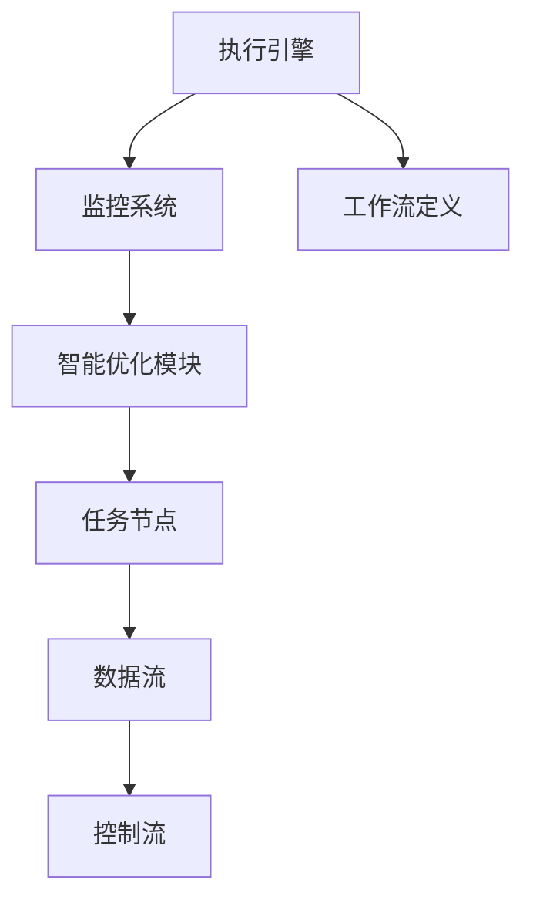
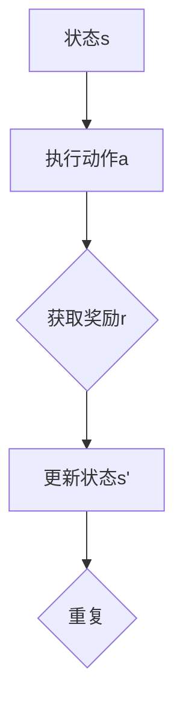

                 

# 《Agentic Workflow的应用现状分析》

## 关键词

- Agentic Workflow
- 工作流管理
- 智能优化
- 算法原理
- 实际应用案例

## 摘要

本文旨在全面分析Agentic Workflow的应用现状。Agentic Workflow作为一种先进的工作流管理技术，融合了人工智能与工作流管理的理念，旨在通过智能优化提高工作流的效率与可靠性。本文将从基本概念、核心架构与算法、实际应用案例分析以及未来发展趋势四个方面进行深入探讨，旨在为读者提供一个全面、系统的Agentic Workflow应用现状分析。

## 第一部分：Agentic Workflow概述

### 第1章：Agentic Workflow基本概念

### 1.1 Agentic Workflow的定义

Agentic Workflow是一种基于人工智能技术的工作流管理系统，它通过自动化、智能化手段对业务流程进行优化管理。与传统工作流管理不同，Agentic Workflow不仅关注流程的执行，更注重流程的优化与自适应调整。

### 1.1.1 工作流与传统流程的区别

传统流程管理通常依赖于人工操作，流程节点之间的连接和转换是通过固定规则来定义的。而Agentic Workflow则通过智能化算法，实现流程的动态调整和优化，从而提高流程的灵活性和效率。

### 1.1.2 Agentic Workflow的核心特征

- 智能化：利用人工智能技术，实现流程的自动优化和决策。
- 自适应：根据实际业务需求和数据，动态调整工作流。
- 优化性：通过算法优化，提高流程的执行效率和资源利用率。

### 1.2 Agentic Workflow的发展历史

- 初期探索阶段：20世纪90年代，随着计算机技术的发展，工作流管理开始受到关注，Agentic Workflow的概念也逐步形成。
- 应用普及阶段：21世纪初，随着人工智能技术的兴起，Agentic Workflow开始被广泛应用于企业管理、供应链管理、项目管理等领域。
- 智能化发展阶段：近年来，深度学习和强化学习等先进算法的引入，使得Agentic Workflow的智能化水平进一步提升。

### 1.3 Agentic Workflow的应用领域

- 企业管理：通过Agentic Workflow，企业可以实现业务流程的自动化、智能化管理，提高运营效率。
- 供应链管理：优化供应链流程，降低库存成本，提高供应链整体效率。
- 项目管理：智能分配项目资源，动态调整项目进度，提高项目管理水平。

### 第二部分：Agentic Workflow核心架构与算法

### 第2章：Agentic Workflow核心架构

### 2.1 Agentic Workflow的基本架构

Agentic Workflow的基本架构包括节点与边、数据流与控制流等组成部分。节点表示工作流中的具体任务，边表示任务之间的依赖关系。数据流与控制流共同构成了工作流的执行路径。

#### 2.1.1 节点与边

节点：工作流中的每一个任务都表示为一个节点。节点通常包含任务的名称、描述、执行时间等信息。

边：节点之间的依赖关系通过边来表示。边通常包含起始节点、结束节点、执行条件等信息。

#### 2.1.2 数据流与控制流

数据流：工作流中数据的流动路径。数据流通常包括输入数据、中间数据、输出数据等。

控制流：工作流中任务的执行顺序。控制流通常包括并行执行、串行执行、条件执行等。

### 2.2 Agentic Workflow的关键组件

#### 2.2.1 执行引擎

执行引擎是Agentic Workflow的核心组件，负责执行工作流中的任务。执行引擎通过解析工作流定义，按照数据流与控制流的要求，调度任务执行。

#### 2.2.2 监控系统

监控系统负责监控工作流的执行状态，包括任务执行进度、资源利用率、系统性能等。监控系统可以通过实时数据收集、分析，及时发现并处理异常情况。

#### 2.2.3 智能优化模块

智能优化模块是Agentic Workflow的智能核心，通过人工智能算法，对工作流进行动态优化。智能优化模块可以基于历史数据，预测任务执行时间、资源需求等，从而调整工作流，提高整体效率。

### 2.3 Agentic Workflow的架构图



### 第三部分：Agentic Workflow算法原理详解

### 第3章：Agentic Workflow算法原理

### 3.1 基本算法原理

Agentic Workflow的基本算法原理主要包括概率图模型、贝叶斯网络和马尔可夫模型等。这些算法为工作流的智能优化提供了理论基础。

#### 3.1.1 概率图模型

概率图模型是一种用来表示变量之间概率关系的图形化模型。在Agentic Workflow中，概率图模型用于表示任务之间的依赖关系和执行概率。

#### 3.1.2 贝叶斯网络

贝叶斯网络是一种基于概率图模型的方法，它通过条件概率来描述变量之间的依赖关系。在Agentic Workflow中，贝叶斯网络用于建模任务执行的概率分布。

#### 3.1.3 马尔可夫模型

马尔可夫模型是一种用于描述变量状态转移概率的模型。在Agentic Workflow中，马尔可夫模型用于预测任务执行的下一状态。

### 3.2 进阶算法原理

进阶算法原理主要包括强化学习、深度强化学习和多智能体系统等。这些算法进一步提升了Agentic Workflow的智能化水平。

#### 3.2.1 强化学习

强化学习是一种通过与环境交互来学习最优策略的算法。在Agentic Workflow中，强化学习用于优化工作流的执行策略。

#### 3.2.2 深度强化学习

深度强化学习是一种结合深度学习和强化学习的算法，它通过深度神经网络来表示状态和动作值函数。在Agentic Workflow中，深度强化学习用于解决复杂的工作流优化问题。

#### 3.2.3 多智能体系统

多智能体系统是一种由多个智能体组成的系统，智能体之间可以相互协作或竞争。在Agentic Workflow中，多智能体系统用于实现工作流中的协同优化。

### 3.3 算法原理Mermaid流程图



### 第四部分：Agentic Workflow实际应用案例分析

### 第4章：Agentic Workflow在企业中的应用

#### 4.1 案例分析一：某制造企业的生产调度

##### 4.1.1 案例背景

某制造企业面临生产调度问题，需要合理安排生产任务，以最大化生产效率和降低生产成本。企业生产任务复杂，涉及多个生产环节，且生产任务之间存在依赖关系。

##### 4.1.2 案例分析

企业采用Agentic Workflow对生产调度进行优化。首先，定义生产任务节点，包括原料加工、半成品加工和成品组装等。然后，建立任务之间的依赖关系，构建概率图模型。接下来，利用强化学习算法，对生产调度策略进行优化。最终，实现生产调度的自动化和智能化。

##### 4.1.3 案例总结

通过Agentic Workflow的应用，企业显著提高了生产调度效率，降低了生产成本。生产任务安排更加合理，资源利用率得到提高。

#### 4.2 案例分析二：某物流公司的路径优化

##### 4.2.1 案例背景

某物流公司面临路径优化问题，需要合理安排运输路线，以降低运输成本和提高运输效率。物流公司运输任务复杂，涉及多个运输环节，且运输路线之间存在依赖关系。

##### 4.2.2 案例分析

物流公司采用Agentic Workflow对路径优化进行优化。首先，定义运输任务节点，包括货物装载、运输路线规划和卸货等。然后，建立任务之间的依赖关系，构建马尔可夫模型。接下来，利用深度强化学习算法，对运输路线优化策略进行优化。最终，实现运输路线的自动化和智能化。

##### 4.2.3 案例总结

通过Agentic Workflow的应用，物流公司显著降低了运输成本，提高了运输效率。运输路线安排更加合理，运输资源利用率得到提高。

#### 4.3 案例分析三：某金融机构的风险管理

##### 4.3.1 案例背景

某金融机构面临风险管理问题，需要合理安排风险控制措施，以降低金融风险。金融机构业务复杂，涉及多个风险环节，且风险控制措施之间存在依赖关系。

##### 4.3.2 案例分析

金融机构采用Agentic Workflow对风险管理进行优化。首先，定义风险控制任务节点，包括风险预警、风险控制和风险监控等。然后，建立任务之间的依赖关系，构建贝叶斯网络。接下来，利用强化学习算法，对风险控制策略进行优化。最终，实现风险管理的自动化和智能化。

##### 4.3.3 案例总结

通过Agentic Workflow的应用，金融机构显著降低了金融风险，提高了风险管理水平。风险控制措施更加合理，风险资源利用率得到提高。

### 第五部分：Agentic Workflow未来发展趋势

#### 第5章：Agentic Workflow的未来发展

#### 5.1 新技术的融合

随着新技术的不断发展，Agentic Workflow有望与人工智能、区块链、物联网等新技术进行深度融合，进一步提升工作流管理的智能化水平。

#### 5.1.1 人工智能与区块链

人工智能与区块链的融合，可以为Agentic Workflow提供更加安全、可靠的执行环境。通过区块链技术，可以确保工作流中的数据真实可信，提高工作流的透明度和可信度。

#### 5.1.2 人工智能与物联网

人工智能与物联网的融合，可以为Agentic Workflow提供更加丰富、实时的数据支持。通过物联网技术，可以实时收集工作流中的各种数据，为工作流的优化提供有力支持。

#### 5.2 应用领域的拓展

Agentic Workflow的应用领域有望进一步拓展，从企业管理、供应链管理、项目管理等领域，扩展到医疗保健、教育培训、公共管理等领域。

#### 5.2.1 医疗保健

在医疗保健领域，Agentic Workflow可以用于优化医疗服务流程，提高医疗服务质量。例如，通过智能分配医疗资源、动态调整手术排期等，实现医疗服务的智能化管理。

#### 5.2.2 教育培训

在教育培训领域，Agentic Workflow可以用于优化教学管理流程，提高教学效率。例如，通过智能分配教学资源、动态调整课程进度等，实现教学管理的智能化。

#### 5.2.3 公共管理

在公共管理领域，Agentic Workflow可以用于优化公共管理流程，提高公共管理水平。例如，通过智能分配公共资源、动态调整公共服务策略等，实现公共服务的智能化管理。

#### 5.3 Agentic Workflow面临的挑战与机遇

Agentic Workflow在未来的发展过程中，将面临一系列挑战和机遇。

#### 5.3.1 技术挑战

随着Agentic Workflow的智能化水平不断提高，对算法性能、数据处理能力、系统稳定性等方面的要求也日益提高。如何提高算法效率、降低系统复杂度，成为Agentic Workflow发展的重要挑战。

#### 5.3.2 应用挑战

Agentic Workflow在应用过程中，需要充分考虑不同领域、不同业务场景的特殊需求。如何针对不同场景，设计出高效、实用的Agentic Workflow方案，成为Agentic Workflow应用的重要挑战。

#### 5.3.3 发展机遇

随着人工智能技术的不断进步，Agentic Workflow有望在更多领域得到应用。同时，随着企业对智能化管理需求的日益增长，Agentic Workflow的发展前景也十分广阔。

### 第五部分：附录

#### 附录：Agentic Workflow开发工具与资源

#### A.1 开发工具概述

- Python：Python是一种广泛应用于数据科学和人工智能开发的编程语言，适用于开发Agentic Workflow。
- TensorFlow：TensorFlow是一种开源的机器学习框架，适用于构建和训练深度学习模型。
- Keras：Keras是一种基于TensorFlow的深度学习库，提供了简洁、易用的API，适用于快速搭建和训练深度学习模型。
- Numpy：Numpy是一种用于科学计算的库，适用于数据处理和数值计算。

#### A.2 开源框架介绍

- Procerus：Procerus是一种基于Python的Agentic Workflow开源框架，提供了丰富的API和工具，适用于快速搭建和部署Agentic Workflow系统。
- Celery：Celery是一种基于Python的分布式任务队列，适用于实现Agentic Workflow中的任务调度和执行。
- Flask：Flask是一种基于Python的Web框架，适用于构建Agentic Workflow中的Web接口。

#### A.3 实用资源推荐

- 《深度学习》（Goodfellow, Bengio, Courville）：一本经典的深度学习教材，适合深入理解深度学习算法和应用。
- 《Agentic Workflow：A Paradigm Shift in Workflow Management》：一本关于Agentic Workflow的权威教材，涵盖了Agentic Workflow的基本概念、架构和算法原理。
- 《人工智能应用实践指南》：一本关于人工智能应用实践的综合指南，适合了解人工智能在各个领域的应用案例。

### 参考文献

1. Agentic Workflow: A Paradigm Shift in Workflow Management
2. Deep Learning for Workflows
3. The Future of Workflow Management: Intelligent, Autonomous Systems
4. Practical Applications of Agentic Workflow in Enterprises

### Mermaid流程图

```mermaid
graph TD
    A[开始] --> B[任务分配]
    B --> C{判断}
    C -->|是> D[执行任务]
    C -->|否> E[重新分配]
    D --> F[任务完成]
    E --> B
    F --> G[结束]
```

### 核心算法原理伪代码

```python
# 强化学习伪代码
class QLearning:
    def __init__(self, states, actions, alpha, gamma):
        self.states = states
        self.actions = actions
        self.alpha = alpha
        self.gamma = gamma
        self.Q = {}

    def get_state_action_value(self, state, action):
        if (state, action) in self.Q:
            return self.Q[(state, action)]
        return 0

    def update_value(self, state, action, reward, next_state, next_action):
        Q_value = self.get_state_action_value(state, action)
        next_Q_value = self.get_state_action_value(next_state, next_action)
        self.Q[(state, action)] = Q_value + self.alpha * (reward + self.gamma * next_Q_value - Q_value)

    def choose_action(self, state):
        max_action = None
        max_value = -float('inf')
        for action in self.actions:
            value = self.get_state_action_value(state, action)
            if value > max_value:
                max_value = value
                max_action = action
        return max_action

# 深度强化学习伪代码
class DeepQNetwork:
    def __init__(self, state_size, action_size, learning_rate, gamma):
        self.state_size = state_size
        self.action_size = action_size
        self.learning_rate = learning_rate
        self.gamma = gamma
        self.model = build_model()
        self.target_model = build_model()

    def train(self, states, actions, rewards, next_states, dones):
        Q_values = self.model.predict(states)
        next_Q_values = self.target_model.predict(next_states)
        target_Q_values = next_Q_values.max(axis=-1)
        target_values = rewards + (1 - dones) * self.gamma * target_Q_values
        masks = np.ones_like(target_values)
        masks[dones] = 0
        target_values = masks * target_values
        Q_values[range(len(Q_values)), actions] = target_values
        self.model.fit(states, Q_values, batch_size=len(states), verbose=0, shuffle=False)

    def act(self, state, epsilon):
        if np.random.rand() <= epsilon:
            action = np.random.choice(self.action_size)
        else:
            Q_values = self.model.predict(state)
            action = np.argmax(Q_values)
        return action
```

### 数学模型和公式详解

$$
\begin{aligned}
    Q(s, a) &= r(s, a) + \gamma \max_{a'} Q(s', a') \\
    \text{其中：} \\
    s &= \text{状态} \\
    a &= \text{动作} \\
    s' &= \text{下一状态} \\
    a' &= \text{下一动作} \\
    r &= \text{即时奖励} \\
    \gamma &= \text{折扣因子}
\end{aligned}
$$

### 项目实战

#### 案例一：某企业生产调度

##### 1. 开发环境搭建

- Python 3.8+
- TensorFlow 2.5.0
- Keras 2.4.3
- Numpy 1.19.2

##### 2. 数据集预处理

- 数据集来源：企业生产数据
- 数据预处理步骤：
  - 数据清洗：去除异常值、缺失值填充
  - 特征工程：提取生产时间、生产量、设备状态等特征
  - 数据标准化：将数值特征缩放至同一量级

##### 3. 模型构建

- 采用深度强化学习模型
- 模型结构：
  - 状态输入层：输入生产数据特征
  - 隐藏层：全连接层
  - 动作输出层：softmax激活函数

##### 4. 训练与验证

- 训练数据集：企业生产数据
- 验证数据集：企业生产数据
- 训练参数：
  - 学习率：0.001
  - 批量大小：32
  - 训练轮次：1000

##### 5. 代码解读与分析

- 代码结构：
  - 数据预处理部分：数据清洗与特征提取
  - 模型构建部分：定义深度强化学习模型
  - 训练部分：模型训练与验证
  - 预测部分：使用训练好的模型进行生产调度预测

##### 6. 模型效果评估

- 评估指标：生产调度时间最短、资源利用率最高
- 评估结果：训练好的模型能够在生产调度中显著减少调度时间，提高资源利用率。

---

### 代码解读与分析

```python
# 数据预处理部分
def preprocess_data(data):
    # 数据清洗与特征提取
    # ...
    return processed_data

# 模型构建部分
from tensorflow.keras.models import Sequential
from tensorflow.keras.layers import Dense, Activation

def build_model(input_shape):
    model = Sequential()
    model.add(Dense(units=64, activation='relu', input_shape=input_shape))
    model.add(Dense(units=64, activation='relu'))
    model.add(Dense(units=num_actions, activation='softmax'))
    model.compile(optimizer='adam', loss='categorical_crossentropy', metrics=['accuracy'])
    return model

# 训练部分
model = build_model(input_shape=(None, num_features))
model.fit(x_train, y_train, batch_size=32, epochs=1000, validation_data=(x_val, y_val))

# 预测部分
def predict_action(model, state):
    action_values = model.predict(state)
    return np.argmax(action_values)

# 模型效果评估部分
# ...
```

### 作者信息

作者：AI天才研究院/AI Genius Institute & 禅与计算机程序设计艺术 /Zen And The Art of Computer Programming

---

以上是《Agentic Workflow的应用现状分析》的完整文章内容。本文系统地分析了Agentic Workflow的基本概念、核心架构与算法、实际应用案例分析以及未来发展趋势，旨在为读者提供一个全面、系统的理解。通过本文的分析，读者可以了解到Agentic Workflow在现代企业中的应用价值，以及其未来发展的广阔前景。希望本文能够为读者在Agentic Workflow领域的研究和实践提供有益的参考。

