                 

# 安德烈·卡帕蒂分享AI黑客松的经验

## 关键词：AI黑客松，AI竞赛，经验分享，团队协作，技术创新，问题解决

## 摘要：
本文将分享AI领域知名专家安德烈·卡帕蒂在AI黑客松中的宝贵经验。从主题选择、技术储备、团队协作到问题解决，卡帕蒂将详细阐述他在黑客松中的心得体会，为参加AI黑客松的参与者提供有价值的指导。

## 引言

AI黑客松作为一种创新性竞赛活动，已成为人工智能领域的一大亮点。在这类活动中，参与者们在短时间内协作完成具有挑战性的项目，既锻炼了技术水平，也培养了团队协作能力。安德烈·卡帕蒂，一位在AI领域享有盛誉的专家，曾多次参与AI黑客松，并在其中取得了显著成绩。本文将基于卡帕蒂在AI黑客松中的经验，探讨如何准备和参与这类竞赛活动，并分享一些实用的技巧和策略。

## 第一部分：AI黑客松的经验概述

### 第1章: AI黑客松的基础知识

#### 1.1.1 什么是AI黑客松

AI黑客松（AI Hackathon）是一种集中时间和资源，以团队协作形式解决特定问题的竞赛活动。参与者们利用自己的技能和知识，在短时间内开发出具有创新性和实用性的AI应用。

#### 1.1.2 AI黑客松的目的

AI黑客松的目的是激发创新思维，促进技术交流，提高团队协作能力，并为参与者提供展示才华和解决问题的平台。

#### 1.1.3 AI黑客松的重要性

AI黑客松不仅有助于参与者提升技术水平，还能让他们在实践中积累宝贵的经验，结识业界同仁，拓展人脉资源。

### 第2章: AI黑客松的特点

#### 2.1.1 短时间内的高效合作

AI黑客松通常只有几天或几周的时间，要求参与者高效利用时间，迅速组建团队，分工合作，解决问题。

#### 2.1.2 实时问题解决与迭代

在AI黑客松中，参与者需要面对实际问题和挑战，通过不断地迭代和优化，实现项目目标。

#### 2.1.3 丰富的项目主题与领域

AI黑客松涵盖了各种领域，包括自然语言处理、计算机视觉、机器学习等，为参与者提供了广泛的选择。

#### 2.1.4 开放性的技术解决方案

AI黑客松鼓励参与者探索各种技术解决方案，不限框架和工具，为创新提供了广阔的空间。

### 第3章: 参加AI黑客松的益处

#### 3.1.1 技术提升

通过参与AI黑客松，参与者可以深入了解最新的AI技术和工具，提升自己的技术水平。

#### 3.1.2 团队协作

AI黑客松强调团队协作，参与者将在实践中学会如何与他人合作，共同解决问题。

#### 3.1.3 创新思维

AI黑客松的挑战性质有助于激发参与者的创新思维，培养他们解决问题的能力。

#### 3.1.4 实战经验

参与AI黑客松可以让参与者积累宝贵的实战经验，为未来的职业发展打下基础。

## 第二部分：AI黑客松的准备工作

### 第4章: 主题选择与方向确定

#### 4.1.1 市场需求分析

在参加AI黑客松之前，参与者需要对市场进行调研，了解当前的热点问题和行业需求。

#### 4.1.2 技术可行性评估

在确定主题后，参与者需要对所需技术进行可行性评估，确保有足够的技能和资源来完成项目。

#### 4.1.3 团队成员兴趣与专长匹配

组建团队时，需要考虑成员的兴趣和专长，确保团队成员能够充分发挥各自的优势。

### 第5章: 技术储备与工具了解

#### 5.1.1 常用AI技术与工具介绍

参与者需要了解常用的AI技术和工具，如深度学习框架、数据处理库等。

#### 5.1.2 技术选型与优劣分析

在确定技术方案时，需要综合考虑各种因素，如性能、易用性、社区支持等。

#### 5.1.3 工具使用技巧与实践

参与者需要掌握工具的使用技巧，并通过实践不断提高自己的技能水平。

### 第6章: 团队组建与沟通机制

#### 6.1.1 成员角色与职责分配

在团队组建过程中，需要明确成员的角色和职责，确保项目的顺利推进。

#### 6.1.2 内部沟通渠道建立

建立有效的内部沟通渠道，确保团队成员之间的信息畅通，提高协作效率。

#### 6.1.3 时间管理策略

合理的时间管理是项目成功的关键，参与者需要制定详细的时间表，确保任务按时完成。

## 第三部分：AI黑客松中的关键技术

### 第7章: 数据收集与预处理

#### 7.1.1 数据来源与获取

在AI项目中，数据的质量和数量直接影响模型的性能。参与者需要了解如何获取高质量的数据。

#### 7.1.2 数据清洗与整理

数据清洗是数据预处理的重要步骤，参与者需要掌握数据清洗的方法和技巧。

#### 7.1.3 数据增强与标注

数据增强和标注有助于提高模型的泛化能力，参与者需要了解如何进行数据增强和标注。

### 第8章: 模型选择与训练

#### 8.1.1 模型选择原则

在选择模型时，参与者需要考虑模型的性能、复杂度、可解释性等因素。

#### 8.1.2 训练策略与调优

参与者需要了解如何设计训练策略，并进行模型调优，以提高模型的性能。

#### 8.1.3 模型评估与优化

在训练完成后，参与者需要评估模型的性能，并进行优化，以确保模型达到预期效果。

### 第9章: 模型部署与测试

#### 9.1.1 模型部署方案

参与者需要了解如何将模型部署到生产环境中，并确保模型稳定运行。

#### 9.1.2 测试环境搭建

搭建测试环境是验证模型性能的重要步骤，参与者需要掌握相关技巧。

#### 9.1.3 性能分析与调优

在测试过程中，参与者需要对模型性能进行分析，并进行调优，以提高模型的应用价值。

## 第四部分：AI黑客松中的项目管理与团队协作

### 第10章: 项目计划与进度管理

#### 10.1.1 项目计划制定

参与者需要制定详细的项目计划，包括任务分工、时间安排、资源分配等。

#### 10.1.2 进度跟踪与调整

在项目执行过程中，参与者需要实时跟踪进度，并根据实际情况进行调整。

#### 10.1.3 风险管理与应对

参与者需要识别项目中的潜在风险，并制定相应的应对策略，以确保项目顺利进行。

### 第11章: 团队协作与沟通技巧

#### 11.1.1 团队角色与职责

明确团队成员的角色和职责，有助于提高团队的协作效率。

#### 11.1.2 沟通渠道与频率

建立有效的沟通渠道，并确定合适的沟通频率，以确保团队成员之间的信息畅通。

#### 11.1.3 冲突解决与协作

在团队协作过程中，冲突在所难免，参与者需要学会如何解决冲突，确保团队和谐。

### 第12章: 团队激励与文化建设

#### 12.1.1 成果展示与奖励

定期进行成果展示，并给予团队成员适当的奖励，有助于提高团队士气。

#### 12.1.2 团队氛围营造

营造积极向上的团队氛围，有助于提高团队的凝聚力和战斗力。

#### 12.1.3 成长与反思

参与者需要不断反思自己的成长过程，从实践中学习，不断提高自己的能力。

## 第五部分：AI黑客松中的创新思维与方法

### 第13章: 创新思维训练

#### 13.1.1 逻辑思维训练

逻辑思维是创新思维的基础，参与者需要通过训练提高自己的逻辑思维能力。

#### 13.1.2 设计思维方法

设计思维是一种以用户为中心的创新方法，参与者需要了解并运用设计思维。

#### 13.1.3 创新思维工具

参与者需要掌握一些创新思维工具，如头脑风暴、思维导图等，以帮助他们在实践中更好地发挥创新能力。

### 第14章: 方法论与实践

#### 14.1.1 用户研究方法

了解用户需求是项目成功的关键，参与者需要掌握用户研究的方法和技巧。

#### 14.1.2 设计迭代方法

设计迭代是一种不断改进和优化的过程，参与者需要了解并运用设计迭代方法。

#### 14.1.3 创新实践案例分析

通过分析成功案例，参与者可以学习到一些实用的创新方法和策略。

## 第六部分：AI黑客松中的问题解决与实战技巧

### 第15章: 问题定位与解决

#### 15.1.1 问题分类与分析

参与者需要学会如何对问题进行分类和分析，以便找到有效的解决方案。

#### 15.1.2 解决方案评估与选择

在找到解决方案后，参与者需要评估各种方案的优缺点，并选择最佳的方案。

#### 15.1.3 实施与优化

实施解决方案后，参与者需要对项目进行监控和优化，以确保项目成功。

### 第16章: 实战技巧与经验

#### 16.1.1 数据处理技巧

数据处理是AI项目的重要组成部分，参与者需要掌握一些数据处理技巧。

#### 16.1.2 模型优化技巧

模型优化是提高模型性能的关键，参与者需要了解并运用模型优化技巧。

#### 16.1.3 项目管理技巧

项目管理是确保项目成功的重要环节，参与者需要掌握一些项目管理技巧。

### 第17章: 失败案例分析

#### 17.1.1 失败原因分析

通过分析失败案例，参与者可以了解失败的原因，并从中吸取教训。

#### 17.1.2 启示与改进

失败并不可怕，参与者需要从失败中汲取经验，不断改进自己的能力和方法。

## 第七部分：AI黑客松的总结与反思

### 第18章: 成果展示与交流

#### 18.1.1 成果展示方法

参与者需要了解如何展示项目成果，以便获得他人的认可和反馈。

#### 18.1.2 交流与反馈

在成果展示过程中，参与者需要积极与观众进行交流，并接受他们的反馈。

#### 18.1.3 改进与优化

根据观众的反馈，参与者需要对项目进行改进和优化，以提高项目的应用价值。

### 第19章: 经验总结与反思

#### 19.1.1 个人成长与反思

参与者需要反思自己在项目中的表现，总结经验教训，不断提高自己的能力。

#### 19.1.2 团队合作与沟通总结

参与者需要总结团队合作的经验和教训，以优化团队协作流程。

#### 19.1.3 项目管理与组织经验

参与者需要总结项目管理的经验和教训，以提高项目管理能力。

### 第20章: 未来展望与规划

#### 20.1.1 AI黑客松的发展趋势

参与者需要关注AI黑客松的发展趋势，以适应未来竞争环境。

#### 20.1.2 个人职业规划

参与者需要制定个人职业规划，为未来的职业发展做好准备。

#### 20.1.3 团队发展策略

参与者需要制定团队发展策略，以提升团队的整体实力。

## 附录

### 附录 A: AI黑客松常用工具与资源

#### A.1 开发环境搭建指南

提供AI黑客松所需的开发环境搭建指南，包括软件安装和配置。

#### A.2 常用AI框架介绍

介绍常用的AI框架，如TensorFlow、PyTorch等，并提供相关文档和资源。

#### A.3 开源代码与数据集资源

提供开源代码和数据集资源，以方便参与者进行研究和开发。

### 附录 B: AI黑客松相关竞赛与活动

#### B.1 国内外知名AI黑客松活动介绍

介绍国内外知名AI黑客松活动，包括赛事规模、主题、奖项设置等。

#### B.2 参赛流程与注意事项

介绍AI黑客松的参赛流程和注意事项，帮助参与者顺利参赛。

#### B.3 竞赛题目与解析

提供AI黑客松的竞赛题目和解析，帮助参与者了解比赛内容。

### 附录 C: AI黑客松实战案例分享

#### C.1 成功案例分享

分享AI黑客松中的成功案例，包括项目背景、解决方案、成果展示等。

#### C.2 失败案例分析

分析AI黑客松中的失败案例，探讨失败原因和改进措施。

#### C.3 案例启示与思考

从成功和失败案例中汲取经验教训，为参与者提供启示和思考。

## 作者信息

作者：安德烈·卡帕蒂（Andrej Karpathy）/ AI天才研究院（AI Genius Institute）& 禅与计算机程序设计艺术（Zen And The Art of Computer Programming）。
<|imagine|>// 输出本文的Markdown格式文本
```markdown
# 安德烈·卡帕蒂分享AI黑客松的经验

## 关键词：AI黑客松，AI竞赛，经验分享，团队协作，技术创新，问题解决

## 摘要：
本文将分享AI领域知名专家安德烈·卡帕蒂在AI黑客松中的宝贵经验。从主题选择、技术储备、团队协作到问题解决，卡帕蒂将详细阐述他在黑客松中的心得体会，为参加AI黑客松的参与者提供有价值的指导。

## 引言

AI黑客松作为一种创新性竞赛活动，已成为人工智能领域的一大亮点。在这类活动中，参与者们在短时间内协作完成具有挑战性的项目，既锻炼了技术水平，也培养了团队协作能力。安德烈·卡帕蒂，一位在AI领域享有盛誉的专家，曾多次参与AI黑客松，并在其中取得了显著成绩。本文将基于卡帕蒂在AI黑客松中的经验，探讨如何准备和参与这类竞赛活动，并分享一些实用的技巧和策略。

## 第一部分：AI黑客松的经验概述

### 第1章: AI黑客松的基础知识

#### 1.1.1 什么是AI黑客松

AI黑客松（AI Hackathon）是一种集中时间和资源，以团队协作形式解决特定问题的竞赛活动。参与者们利用自己的技能和知识，在短时间内开发出具有创新性和实用性的AI应用。

#### 1.1.2 AI黑客松的目的

AI黑客松的目的是激发创新思维，促进技术交流，提高团队协作能力，并为参与者提供展示才华和解决问题的平台。

#### 1.1.3 AI黑客松的重要性

AI黑客松不仅有助于参与者提升技术水平，还能让他们在实践中积累宝贵的经验，结识业界同仁，拓展人脉资源。

### 第2章: AI黑客松的特点

#### 2.1.1 短时间内的高效合作

AI黑客松通常只有几天或几周的时间，要求参与者高效利用时间，迅速组建团队，分工合作，解决问题。

#### 2.1.2 实时问题解决与迭代

在AI黑客松中，参与者需要面对实际问题和挑战，通过不断地迭代和优化，实现项目目标。

#### 2.1.3 丰富的项目主题与领域

AI黑客松涵盖了各种领域，包括自然语言处理、计算机视觉、机器学习等，为参与者提供了广泛的选择。

#### 2.1.4 开放性的技术解决方案

AI黑客松鼓励参与者探索各种技术解决方案，不限框架和工具，为创新提供了广阔的空间。

### 第3章: 参加AI黑客松的益处

#### 3.1.1 技术提升

通过参与AI黑客松，参与者可以深入了解最新的AI技术和工具，提升自己的技术水平。

#### 3.1.2 团队协作

AI黑客松强调团队协作，参与者将在实践中学会如何与他人合作，共同解决问题。

#### 3.1.3 创新思维

AI黑客松的挑战性质有助于激发参与者的创新思维，培养他们解决问题的能力。

#### 3.1.4 实战经验

参与AI黑客松可以让参与者积累宝贵的实战经验，为未来的职业发展打下基础。

## 第二部分：AI黑客松的准备工作

### 第4章: 主题选择与方向确定

#### 4.1.1 市场需求分析

在参加AI黑客松之前，参与者需要对市场进行调研，了解当前的热点问题和行业需求。

#### 4.1.2 技术可行性评估

在确定主题后，参与者需要对所需技术进行可行性评估，确保有足够的技能和资源来完成项目。

#### 4.1.3 团队成员兴趣与专长匹配

组建团队时，需要考虑成员的兴趣和专长，确保团队成员能够充分发挥各自的优势。

### 第5章: 技术储备与工具了解

#### 5.1.1 常用AI技术与工具介绍

参与者需要了解常用的AI技术和工具，如深度学习框架、数据处理库等。

#### 5.1.2 技术选型与优劣分析

在确定技术方案时，需要综合考虑各种因素，如性能、易用性、社区支持等。

#### 5.1.3 工具使用技巧与实践

参与者需要掌握工具的使用技巧，并通过实践不断提高自己的技能水平。

### 第6章: 团队组建与沟通机制

#### 6.1.1 成员角色与职责分配

在团队组建过程中，需要明确成员的角色和职责，确保项目的顺利推进。

#### 6.1.2 内部沟通渠道建立

建立有效的内部沟通渠道，确保团队成员之间的信息畅通，提高协作效率。

#### 6.1.3 时间管理策略

合理的时间管理是项目成功的关键，参与者需要制定详细的时间表，确保任务按时完成。

## 第三部分：AI黑客松中的关键技术

### 第7章: 数据收集与预处理

#### 7.1.1 数据来源与获取

在AI项目中，数据的质量和数量直接影响模型的性能。参与者需要了解如何获取高质量的数据。

#### 7.1.2 数据清洗与整理

数据清洗是数据预处理的重要步骤，参与者需要掌握数据清洗的方法和技巧。

#### 7.1.3 数据增强与标注

数据增强和标注有助于提高模型的泛化能力，参与者需要了解如何进行数据增强和标注。

### 第8章: 模型选择与训练

#### 8.1.1 模型选择原则

在选择模型时，参与者需要考虑模型的性能、复杂度、可解释性等因素。

#### 8.1.2 训练策略与调优

参与者需要了解如何设计训练策略，并进行模型调优，以提高模型的性能。

#### 8.1.3 模型评估与优化

在训练完成后，参与者需要评估模型的性能，并进行优化，以确保模型达到预期效果。

### 第9章: 模型部署与测试

#### 9.1.1 模型部署方案

参与者需要了解如何将模型部署到生产环境中，并确保模型稳定运行。

#### 9.1.2 测试环境搭建

搭建测试环境是验证模型性能的重要步骤，参与者需要掌握相关技巧。

#### 9.1.3 性能分析与调优

在测试过程中，参与者需要对模型性能进行分析，并进行调优，以提高模型的应用价值。

## 第四部分：AI黑客松中的项目管理与团队协作

### 第10章: 项目计划与进度管理

#### 10.1.1 项目计划制定

参与者需要制定详细的项目计划，包括任务分工、时间安排、资源分配等。

#### 10.1.2 进度跟踪与调整

在项目执行过程中，参与者需要实时跟踪进度，并根据实际情况进行调整。

#### 10.1.3 风险管理与应对

参与者需要识别项目中的潜在风险，并制定相应的应对策略，以确保项目顺利进行。

### 第11章: 团队协作与沟通技巧

#### 11.1.1 团队角色与职责

明确团队成员的角色和职责，有助于提高团队的协作效率。

#### 11.1.2 沟通渠道与频率

建立有效的沟通渠道，并确定合适的沟通频率，以确保团队成员之间的信息畅通。

#### 11.1.3 冲突解决与协作

在团队协作过程中，冲突在所难免，参与者需要学会如何解决冲突，确保团队和谐。

### 第12章: 团队激励与文化建设

#### 12.1.1 成果展示与奖励

定期进行成果展示，并给予团队成员适当的奖励，有助于提高团队士气。

#### 12.1.2 团队氛围营造

营造积极向上的团队氛围，有助于提高团队的凝聚力和战斗力。

#### 12.1.3 成长与反思

参与者需要不断反思自己的成长过程，从实践中学习，不断提高自己的能力。

## 第五部分：AI黑客松中的创新思维与方法

### 第13章: 创新思维训练

#### 13.1.1 逻辑思维训练

逻辑思维是创新思维的基础，参与者需要通过训练提高自己的逻辑思维能力。

#### 13.1.2 设计思维方法

设计思维是一种以用户为中心的创新方法，参与者需要了解并运用设计思维。

#### 13.1.3 创新思维工具

参与者需要掌握一些创新思维工具，如头脑风暴、思维导图等，以帮助他们在实践中更好地发挥创新能力。

### 第14章: 方法论与实践

#### 14.1.1 用户研究方法

了解用户需求是项目成功的关键，参与者需要掌握用户研究的方法和技巧。

#### 14.1.2 设计迭代方法

设计迭代是一种不断改进和优化的过程，参与者需要了解并运用设计迭代方法。

#### 14.1.3 创新实践案例分析

通过分析成功案例，参与者可以学习到一些实用的创新方法和策略。

## 第六部分：AI黑客松中的问题解决与实战技巧

### 第15章: 问题定位与解决

#### 15.1.1 问题分类与分析

参与者需要学会如何对问题进行分类和分析，以便找到有效的解决方案。

#### 15.1.2 解决方案评估与选择

在找到解决方案后，参与者需要评估各种方案的优缺点，并选择最佳的方案。

#### 15.1.3 实施与优化

实施解决方案后，参与者需要对项目进行监控和优化，以确保项目成功。

### 第16章: 实战技巧与经验

#### 16.1.1 数据处理技巧

数据处理是AI项目的重要组成部分，参与者需要掌握一些数据处理技巧。

#### 16.1.2 模型优化技巧

模型优化是提高模型性能的关键，参与者需要了解并运用模型优化技巧。

#### 16.1.3 项目管理技巧

项目管理是确保项目成功的重要环节，参与者需要掌握一些项目管理技巧。

### 第17章: 失败案例分析

#### 17.1.1 失败原因分析

通过分析失败案例，参与者可以了解失败的原因，并从中吸取教训。

#### 17.1.2 启示与改进

失败并不可怕，参与者需要从失败中汲取经验，不断改进自己的能力和方法。

## 第七部分：AI黑客松的总结与反思

### 第18章: 成果展示与交流

#### 18.1.1 成果展示方法

参与者需要了解如何展示项目成果，以便获得他人的认可和反馈。

#### 18.1.2 交流与反馈

在成果展示过程中，参与者需要积极与观众进行交流，并接受他们的反馈。

#### 18.1.3 改进与优化

根据观众的反馈，参与者需要对项目进行改进和优化，以提高项目的应用价值。

### 第19章: 经验总结与反思

#### 19.1.1 个人成长与反思

参与者需要反思自己在项目中的表现，总结经验教训，不断提高自己的能力。

#### 19.1.2 团队合作与沟通总结

参与者需要总结团队合作的经验和教训，以优化团队协作流程。

#### 19.1.3 项目管理与组织经验

参与者需要总结项目管理的经验和教训，以提高项目管理能力。

### 第20章: 未来展望与规划

#### 20.1.1 AI黑客松的发展趋势

参与者需要关注AI黑客松的发展趋势，以适应未来竞争环境。

#### 20.1.2 个人职业规划

参与者需要制定个人职业规划，为未来的职业发展做好准备。

#### 20.1.3 团队发展策略

参与者需要制定团队发展策略，以提升团队的整体实力。

## 附录

### 附录 A: AI黑客松常用工具与资源

#### A.1 开发环境搭建指南

提供AI黑客松所需的开发环境搭建指南，包括软件安装和配置。

#### A.2 常用AI框架介绍

介绍常用的AI框架，如TensorFlow、PyTorch等，并提供相关文档和资源。

#### A.3 开源代码与数据集资源

提供开源代码和数据集资源，以方便参与者进行研究和开发。

### 附录 B: AI黑客松相关竞赛与活动

#### B.1 国内外知名AI黑客松活动介绍

介绍国内外知名AI黑客松活动，包括赛事规模、主题、奖项设置等。

#### B.2 参赛流程与注意事项

介绍AI黑客松的参赛流程和注意事项，帮助参与者顺利参赛。

#### B.3 竞赛题目与解析

提供AI黑客松的竞赛题目和解析，帮助参与者了解比赛内容。

### 附录 C: AI黑客松实战案例分享

#### C.1 成功案例分享

分享AI黑客松中的成功案例，包括项目背景、解决方案、成果展示等。

#### C.2 失败案例分析

分析AI黑客松中的失败案例，探讨失败原因和改进措施。

#### C.3 案例启示与思考

从成功和失败案例中汲取经验教训，为参与者提供启示和思考。

## 作者信息

作者：安德烈·卡帕蒂（Andrej Karpathy）/ AI天才研究院（AI Genius Institute）& 禅与计算机程序设计艺术（Zen And The Art of Computer Programming）。
```<|imagine|>// 输出本文的Mermaid流程图

```mermaid
graph TD
    AIHackathon[AI黑客松]
    Preparation[准备工作]
    KeyTechniques[关键技术]
    ProjectManagement[项目管理]
    TeamCollaboration[团队协作]
    Innovation[创新思维]
    ProblemSolving[问题解决]

    AIHackathon --> Preparation
    AIHackathon --> KeyTechniques
    AIHackathon --> ProjectManagement
    AIHackathon --> TeamCollaboration
    AIHackathon --> Innovation
    AIHackathon --> ProblemSolving

    Preparation --> PreparationOverview
    Preparation --> ThemeSelection
    Preparation --> TechnicalReserve
    Preparation --> TeamBuilding

    KeyTechniques --> DataCollection
    KeyTechniques --> ModelSelection
    KeyTechniques --> ModelTraining
    KeyTechniques --> ModelDeployment

    ProjectManagement --> ProjectPlanning
    ProjectManagement --> ProgressTracking
    ProjectManagement --> RiskManagement

    TeamCollaboration --> TeamRoles
    TeamCollaboration --> CommunicationChannels
    TeamCollaboration --> ConflictResolution

    Innovation --> LogicalThinking
    Innovation --> DesignThinking
    Innovation --> InnovationTools

    ProblemSolving --> ProblemClassification
    ProblemSolving --> SolutionEvaluation
    ProblemSolving --> ImplementationAndOptimization
```

<|imagine|>// 输出本文的伪代码
```python
# 定义AI黑客松类
class AIHackathon:
    def __init__(self, theme, team, tech_stack, data_source, project_plan):
        self.theme = theme
        self.team = team
        self.tech_stack = tech_stack
        self.data_source = data_source
        self.project_plan = project_plan

    # 准备工作
    def prepare(self):
        self.select_theme()
        self.build_team()
        self.prepare_tech()
        self.plan_project()

    # 选择主题
    def select_theme(self):
        # 分析市场需求，评估技术可行性，匹配团队成员兴趣和专长
        pass

    # 组建团队
    def build_team(self):
        # 确定团队成员角色和职责，建立有效的沟通机制
        pass

    # 准备技术
    def prepare_tech(self):
        # 研究常用AI技术，评估技术选型，了解工具使用技巧
        pass

    # 制定项目计划
    def plan_project(self):
        # 制定详细的任务分工、时间安排和资源分配
        pass

    # 关键技术
    def key_techniques(self):
        self.collect_data()
        self.select_model()
        self.train_model()
        self.deploy_model()

    # 数据收集
    def collect_data(self):
        # 获取数据源，清洗和整理数据
        pass

    # 模型选择
    def select_model(self):
        # 根据项目需求选择合适的模型
        pass

    # 模型训练
    def train_model(self):
        # 设计训练策略，进行模型调优
        pass

    # 模型部署
    def deploy_model(self):
        # 将模型部署到生产环境中，进行测试和性能分析
        pass

    # 项目管理
    def project_management(self):
        self跟踪进度()
        self风险识别()
        self调整计划()

    # 跟踪进度
    def track_progress(self):
        # 实时监控项目进度，识别潜在问题
        pass

    # 风险识别
    def identify_risk(self):
        # 识别项目中的潜在风险，制定应对策略
        pass

    # 调整计划
    def adjust_plan(self):
        # 根据实际情况调整项目计划
        pass

    # 团队协作
    def team_collaboration(self):
        self.assign_roles()
        self.improve_communication()
        self.resolve_conflicts()

    # 分配角色
    def assign_roles(self):
        # 明确团队成员的角色和职责
        pass

    # 提高沟通
    def improve_communication(self):
        # 建立有效的沟通渠道，提高沟通效率
        pass

    # 解决冲突
    def resolve_conflicts(self):
        # 学会解决团队协作中的冲突
        pass

    # 创新思维
    def innovation_thinking(self):
        self.train_logical_thinking()
        self.apply_design_thinking()
        self.use_innovation_tools()

    # 训练逻辑思维
    def train_logical_thinking(self):
        # 提高逻辑思维能力
        pass

    # 应用设计思维
    def apply_design_thinking(self):
        # 运用设计思维方法
        pass

    # 使用创新工具
    def use_innovation_tools(self):
        # 掌握创新思维工具，如头脑风暴、思维导图等
        pass

    # 问题解决
    def problem_solving(self):
        self.classify_problem()
        self.evaluate_solutions()
        self.implement_and_optimize()

    # 分类问题
    def classify_problem(self):
        # 学会分类和分析问题
        pass

    # 评估解决方案
    def evaluate_solutions(self):
        # 评估各种方案的优缺点，选择最佳方案
        pass

    # 实施和优化
    def implement_and_optimize(self):
        # 实施解决方案，监控项目，进行优化
        pass

# 创建AI黑客松实例
ai_hackathon = AIHackathon(theme="智能医疗", team=["Alice", "Bob", "Charlie"], tech_stack=["TensorFlow", "Keras"], data_source=["电子健康记录", "医疗影像"], project_plan=["任务分配", "时间安排", "资源分配"])

# 进行准备工作
ai_hackathon.prepare()

# 进行关键技术处理
ai_hackathon.key_techniques()

# 进行项目管理
ai_hackathon.project_management()

# 进行团队协作
ai_hackathon.team_collaboration()

# 进行创新思维训练
ai_hackathon.innovation_thinking()

# 进行问题解决
ai_hackathon.problem_solving()
```
```<|imagine|>// 输出本文中的数学公式和伪代码段落
### 数据预处理步骤

在深度学习项目中，数据预处理是一个至关重要的环节。以下是一个简单的数学模型来描述数据预处理的过程：

$$
\text{预处理步骤} = \left\{
\begin{aligned}
&\text{数据清洗} \\
&\text{数据增强} \\
&\text{数据标准化} \\
\end{aligned}
\right.
$$

**伪代码：**

```python
# 数据清洗
def clean_data(data):
    # 删除缺失值
    data = remove_missing_values(data)
    # 处理异常值
    data = handle_outliers(data)
    return data

# 数据增强
def augment_data(data):
    # 扩充数据集
    data = expand_dataset(data)
    # 数据变换
    data = transform_data(data)
    return data

# 数据标准化
def normalize_data(data):
    # 归一化
    data = normalize(data)
    # 标准化
    data = standardize(data)
    return data
```

### 模型训练过程

在深度学习项目中，模型训练是一个核心步骤。以下是一个简单的数学模型来描述模型训练的过程：

$$
\text{模型训练} = \left\{
\begin{aligned}
&\text{初始化模型参数} \\
&\text{前向传播} \\
&\text{后向传播} \\
&\text{更新模型参数} \\
\end{aligned}
\right.
$$

**伪代码：**

```python
# 初始化模型参数
def init_model_parameters(model):
    # 初始化权重
    model.init_weights()
    return model

# 前向传播
def forward_pass(model, inputs):
    # 计算输出
    outputs = model.forward_pass(inputs)
    return outputs

# 后向传播
def backward_pass(model, inputs, outputs, labels):
    # 计算梯度
    gradients = model.backward_pass(outputs, labels)
    # 更新参数
    model.update_parameters(gradients)
    return model
```

### 项目管理策略

在深度学习项目中，项目管理策略至关重要。以下是一个简单的数学模型来描述项目管理策略：

$$
\text{项目管理策略} = \left\{
\begin{aligned}
&\text{制定项目计划} \\
&\text{监控项目进度} \\
&\text{识别项目风险} \\
&\text{调整项目计划} \\
\end{aligned}
\right.
$$

**伪代码：**

```python
# 制定项目计划
def plan_project(project_plan):
    # 确定任务和时间安排
    project_plan.determine_tasks()
    project_plan.schedule_tasks()
    return project_plan

# 监控项目进度
def monitor_progress(project_plan):
    # 检查任务完成情况
    project_plan.check_task_completion()
    # 识别进度偏差
    project_plan.identify_progress_deviation()
    return project_plan

# 识别项目风险
def identify_risk(project_plan):
    # 识别潜在风险
    project_plan.identify_potential_risks()
    return project_plan

# 调整项目计划
def adjust_plan(project_plan):
    # 根据实际情况调整计划
    project_plan.adjust_plan()
    return project_plan
```<|imagine|>// 输出本文中的代码实际案例和详细解释说明

### 数据预处理实际案例

在本节中，我们将通过一个实际案例来展示如何进行数据预处理。以下是一个使用Python和Pandas库对数据集进行清洗、增强和标准化的示例代码。

**示例代码：**

```python
import pandas as pd
from sklearn.preprocessing import StandardScaler

# 读取数据集
data = pd.read_csv('data.csv')

# 数据清洗
# 删除缺失值
data = data.dropna()

# 处理异常值
data = data[(data['feature1'] > 0) & (data['feature1'] < 100)]

# 数据增强
# 扩充数据集
data = data.sample(n=100, replace=True)

# 数据变换
data['feature2'] = data['feature2'].map({'low': 1, 'medium': 2, 'high': 3})

# 数据标准化
scaler = StandardScaler()
data[['feature1', 'feature2']] = scaler.fit_transform(data[['feature1', 'feature2']])
```

**详细解释：**

1. **读取数据集**：使用Pandas库读取CSV文件，将其存储在DataFrame对象中。

2. **数据清洗**：
   - **删除缺失值**：使用`dropna()`方法删除包含缺失值的行。
   - **处理异常值**：将数据集过滤，只保留`feature1`在0到100之间的数据。

3. **数据增强**：
   - **扩充数据集**：使用`sample()`方法复制数据集，生成新的样本，以增加数据集的多样性。

4. **数据变换**：
   - **分类变量编码**：使用`map()`方法将分类变量`feature2`转换为数值变量，以适应机器学习模型的需求。

5. **数据标准化**：
   - **归一化**：使用`StandardScaler()`类对连续变量`feature1`和`feature2`进行归一化处理，使其均值为0，标准差为1。

### 模型训练实际案例

在本节中，我们将展示如何使用TensorFlow和Keras库训练一个简单的神经网络模型。以下是一个用于手写数字识别任务的实际案例。

**示例代码：**

```python
import numpy as np
import tensorflow as tf
from tensorflow.keras.models import Sequential
from tensorflow.keras.layers import Dense, Conv2D, Flatten, MaxPooling2D
from tensorflow.keras.datasets import mnist

# 加载数据集
(x_train, y_train), (x_test, y_test) = mnist.load_data()

# 数据预处理
# 归一化输入数据
x_train = x_train / 255.0
x_test = x_test / 255.0

# 展平图像数据
x_train = x_train.reshape(-1, 28 * 28)
x_test = x_test.reshape(-1, 28 * 28)

# 编码标签
y_train = tf.keras.utils.to_categorical(y_train, num_classes=10)
y_test = tf.keras.utils.to_categorical(y_test, num_classes=10)

# 构建模型
model = Sequential([
    Conv2D(32, kernel_size=(3, 3), activation='relu', input_shape=(28, 28, 1)),
    MaxPooling2D(pool_size=(2, 2)),
    Flatten(),
    Dense(128, activation='relu'),
    Dense(10, activation='softmax')
])

# 编译模型
model.compile(optimizer='adam', loss='categorical_crossentropy', metrics=['accuracy'])

# 训练模型
model.fit(x_train, y_train, batch_size=128, epochs=10, validation_split=0.1)
```

**详细解释：**

1. **加载数据集**：使用Keras内置的MNIST数据集。

2. **数据预处理**：
   - **归一化输入数据**：将输入数据归一化至0到1之间。
   - **展平图像数据**：将图像数据展平为一维数组，以便于输入到神经网络中。
   - **编码标签**：将标签转换为one-hot编码，以适应分类任务。

3. **构建模型**：
   - **卷积层**：使用`Conv2D`层提取图像特征。
   - **池化层**：使用`MaxPooling2D`层减小特征图的大小。
   - **展平层**：使用`Flatten`层将特征图展平为一维数组。
   - **全连接层**：使用`Dense`层进行分类。

4. **编译模型**：指定优化器、损失函数和评价指标。

5. **训练模型**：使用`fit`方法训练模型，设置批次大小、迭代次数和验证比例。

### 代码解读与分析

在本节中，我们将对上述代码进行解读，分析其实现的关键步骤和注意事项。

1. **数据预处理**：
   - **归一化**：归一化是深度学习中的一个常见步骤，有助于加速模型收敛。
   - **展平图像数据**：MNIST数据集的图像为28x28的二维数组，需要将其展平为一维数组。
   - **编码标签**：使用one-hot编码将标签转换为计算机可以处理的格式。

2. **构建模型**：
   - **卷积层**：卷积层用于提取图像的局部特征。
   - **池化层**：池化层用于减小特征图的大小，减少参数数量。
   - **全连接层**：全连接层用于将提取到的特征映射到具体的类别。

3. **编译模型**：
   - **优化器**：选择合适的优化器，如Adam优化器，以加速模型收敛。
   - **损失函数**：选择合适的损失函数，如交叉熵损失函数，以衡量模型预测与真实标签之间的差异。
   - **评价指标**：选择合适的评价指标，如准确率，以衡量模型性能。

4. **训练模型**：
   - **批次大小**：批次大小影响模型训练的速度和稳定性。
   - **迭代次数**：迭代次数影响模型训练的深度。
   - **验证比例**：设置验证比例用于在训练过程中进行模型评估。

通过上述实际案例和代码解读，我们可以更好地理解数据预处理、模型构建和训练的过程。在参与AI黑客松时，掌握这些关键步骤和技巧将有助于提高项目的成功率和创新性。```<|imagine|>// 输出本文中的核心概念与联系Mermaid流程图

```mermaid
graph TD
    AIHackathon[AI黑客松]
    Preparation[准备工作]
    DataPreprocessing[数据预处理]
    ModelTraining[模型训练]
    Evaluation[模型评估]
    Deployment[模型部署]

    AIHackathon --> Preparation
    AIHackathon --> DataPreprocessing
    AIHackathon --> ModelTraining
    AIHackathon --> Evaluation
    AIHackathon --> Deployment

    Preparation --> ProjectPlanning
    Preparation --> TeamBuilding
    Preparation --> TechnicalPreparation

    DataPreprocessing --> DataCleaning
    DataPreprocessing --> DataAugmentation
    DataPreprocessing --> DataStandardization

    ModelTraining --> ModelDesign
    ModelTraining --> ModelTrainingProcess
    ModelTraining --> ModelEvaluation

    Evaluation --> ModelTesting
    Evaluation --> ModelValidation

    Deployment --> ModelDeployment
    Deployment --> ModelMonitoring

    ModelDesign --> LayerDesign
    ModelDesign --> ActivationFunction
    ModelDesign --> Optimizer

    ModelTrainingProcess --> ForwardPropagation
    ModelTrainingProcess --> BackPropagation
    ModelTrainingProcess --> ParameterUpdate

    ModelEvaluation --> Accuracy
    ModelEvaluation --> Loss

    ModelDeployment --> ProductionEnvironment
    ModelDeployment --> TestingEnvironment

    LayerDesign --> ConvolutionalLayer
    LayerDesign --> PoolingLayer
    LayerDesign --> DenseLayer

    ActivationFunction --> ReLU
    ActivationFunction --> Sigmoid
    ActivationFunction --> Tanh

    Optimizer --> SGD
    Optimizer --> Adam
    Optimizer --> RMSprop

    ForwardPropagation --> InputProcessing
    ForwardPropagation --> FeatureExtraction
    ForwardPropagation --> OutputPrediction

    BackPropagation --> ErrorCalculation
    BackPropagation --> GradientCalculation
    BackPropagation --> ParameterAdjustment

    ParameterUpdate --> WeightUpdate
    ParameterUpdate --> BiasUpdate

    ModelTesting --> TestDataset
    ModelTesting --> TestAccuracy

    ModelValidation --> ValidationDataset
    ModelValidation --> ValidationAccuracy

    ProductionEnvironment --> DeploymentInfrastructure
    ProductionEnvironment --> MonitoringTools

    TestingEnvironment --> TestingDataset
    TestingEnvironment --> PerformanceMetrics
```


此Mermaid流程图展示了AI黑客松的核心概念和它们之间的联系。从准备工作、数据预处理、模型训练、模型评估到模型部署，每个阶段都包含了详细的子过程，帮助读者理解整个AI黑客松项目的流程。每个子过程都有相关的子节点，如数据清洗、模型设计、前向传播和反向传播等，这些都是实现AI项目的关键步骤。此图提供了一个清晰的架构视图，有助于读者在参与AI黑客松时进行有效规划和执行。```<|imagine|>// 输出本文中数学模型和公式

### 数学模型和公式

在本节中，我们将介绍AI黑客松项目中常用的数学模型和公式。以下是一些关键公式及其解释。

#### 1. 感知机（Perceptron）公式

感知机是机器学习中最基础的模型之一，其公式如下：

$$
y_{\hat{}} = \text{sign}(\sum_{i=1}^{n} w_i x_i + b)
$$

其中：
- \( y_{\hat{}} \) 是预测输出。
- \( \text{sign} \) 是符号函数，用于将输出转换为 \( +1 \) 或 \( -1 \)。
- \( w_i \) 是权重向量。
- \( x_i \) 是输入特征。
- \( b \) 是偏置项。

#### 2. 梯度下降（Gradient Descent）公式

梯度下降是一种用于训练神经网络的基本优化算法，其公式如下：

$$
w_{\text{new}} = w_{\text{old}} - \alpha \cdot \nabla_{w} J(w)
$$

其中：
- \( w_{\text{new}} \) 是更新后的权重。
- \( w_{\text{old}} \) 是当前权重。
- \( \alpha \) 是学习率。
- \( \nabla_{w} J(w) \) 是损失函数 \( J(w) \) 关于权重 \( w \) 的梯度。

#### 3. 交叉熵损失（Cross-Entropy Loss）公式

交叉熵损失是分类问题中常用的损失函数，其公式如下：

$$
J(w) = -\frac{1}{m} \sum_{i=1}^{m} y_i \cdot \log(\hat{y}_i)
$$

其中：
- \( J(w) \) 是损失函数。
- \( y_i \) 是真实标签。
- \( \hat{y}_i \) 是模型预测的概率输出。
- \( m \) 是样本数量。

#### 4. Softmax函数公式

在多分类问题中，Softmax函数用于将模型输出的概率分布转换为类别的概率分布，其公式如下：

$$
\hat{y}_i = \frac{e^{z_i}}{\sum_{j=1}^{K} e^{z_j}}
$$

其中：
- \( \hat{y}_i \) 是第 \( i \) 个类别的概率。
- \( z_i \) 是模型输出的 \( i \) 维特征值。
- \( K \) 是类别数量。

这些数学模型和公式是AI黑客松项目中不可或缺的工具，通过理解和应用这些公式，参与者可以更有效地进行模型设计和优化，提高项目的成功率。```<|imagine|>// 输出本文中各章节的核心内容

### 文章核心内容

#### 引言
- AI黑客松的定义、目的和重要性
- 安德烈·卡帕蒂的背景和经验

#### 第一部分：AI黑客松的经验概述
- AI黑客松的基础知识
- AI黑客松的特点
- 参加AI黑客松的益处

#### 第二部分：AI黑客松的准备工作
- 主题选择与方向确定
- 技术储备与工具了解
- 团队组建与沟通机制

#### 第三部分：AI黑客松中的关键技术
- 数据收集与预处理
- 模型选择与训练
- 模型部署与测试

#### 第四部分：AI黑客松中的项目管理与团队协作
- 项目计划与进度管理
- 团队协作与沟通技巧
- 团队激励与文化建设

#### 第五部分：AI黑客松中的创新思维与方法
- 创新思维训练
- 方法论与实践

#### 第六部分：AI黑客松中的问题解决与实战技巧
- 问题定位与解决
- 实战技巧与经验
- 失败案例分析

#### 第七部分：AI黑客松的总结与反思
- 成果展示与交流
- 经验总结与反思
- 未来展望与规划

#### 附录
- AI黑客松常用工具与资源
- AI黑客松相关竞赛与活动
- AI黑客松实战案例分享

本文的核心内容涵盖了AI黑客松的各个方面，从基础概念到实战技巧，为参与者提供了全面的指导。通过这些章节，读者可以系统地了解如何准备、参与和从AI黑客松中获得最大收益。```<|imagine|>// 输出本文中各个小节的具体内容

### 第一部分：AI黑客松的经验概述

#### 第1章: AI黑客松的基础知识
- **定义与目的**：解释AI黑客松的定义、目的和重要性。
- **参与人群**：介绍参与AI黑客松的人群，包括学生、专业人士和研究人员。
- **活动形式**：描述AI黑客松的常见形式，如主题式比赛、自由式竞赛等。

#### 第2章: AI黑客松的特点
- **高效合作**：讨论在短时间内高效合作的必要性和方法。
- **实时问题解决**：分析AI黑客松中的问题解决过程和挑战。
- **项目主题与领域**：介绍AI黑客松中常见的项目主题和领域。
- **技术解决方案**：探讨在AI黑客松中如何选择和实现技术解决方案。

#### 第3章: 参加AI黑客松的益处
- **技术提升**：阐述参与AI黑客松如何提升技术能力。
- **团队协作**：讨论通过AI黑客松培养团队协作能力的优势和策略。
- **创新思维**：介绍AI黑客松如何激发创新思维，提高创造力。
- **实战经验**：说明参与AI黑客松对积累实战经验的重要性。

### 第二部分：AI黑客松的准备工作

#### 第4章: 主题选择与方向确定
- **市场需求分析**：介绍如何分析市场需求，选择有潜力的项目主题。
- **技术可行性评估**：讨论如何评估所选主题的技术可行性。
- **团队成员兴趣与专长匹配**：探讨如何根据团队成员的兴趣和专长进行分工。

#### 第5章: 技术储备与工具了解
- **常用AI技术与工具**：列举并介绍常用的AI技术和工具，如TensorFlow、Keras等。
- **技术选型与优劣分析**：分析不同技术方案的优劣，选择最适合的方案。
- **工具使用技巧与实践**：分享使用AI工具的技巧和实践经验。

#### 第6章: 团队组建与沟通机制
- **成员角色与职责分配**：明确团队成员的角色和职责，确保项目顺利进行。
- **内部沟通渠道建立**：建立有效的沟通渠道，如Slack、Zoom等，确保团队协作顺畅。
- **时间管理策略**：讨论如何制定时间表，确保任务按时完成。

### 第三部分：AI黑客松中的关键技术

#### 第7章: 数据收集与预处理
- **数据来源与获取**：介绍如何获取高质量的数据。
- **数据清洗与整理**：讲解数据清洗和整理的方法，如缺失值处理、异常值检测等。
- **数据增强与标注**：讨论如何进行数据增强和标注，以提高模型的泛化能力。

#### 第8章: 模型选择与训练
- **模型选择原则**：分析如何根据项目需求选择合适的模型。
- **训练策略与调优**：介绍如何设计训练策略和进行模型调优。
- **模型评估与优化**：探讨如何评估模型性能，并进行优化。

#### 第9章: 模型部署与测试
- **模型部署方案**：讲解如何将模型部署到生产环境中。
- **测试环境搭建**：介绍测试环境搭建的步骤和技巧。
- **性能分析与调优**：讨论如何对模型性能进行分析和调优。

### 第四部分：AI黑客松中的项目管理与团队协作

#### 第10章: 项目计划与进度管理
- **项目计划制定**：阐述如何制定详细的项目计划。
- **进度跟踪与调整**：讨论如何实时跟踪项目进度，并根据实际情况进行调整。
- **风险管理与应对**：介绍如何识别和管理项目风险。

#### 第11章: 团队协作与沟通技巧
- **团队角色与职责**：明确团队成员的角色和职责，确保团队协作顺畅。
- **沟通渠道与频率**：建立有效的沟通渠道，并确定合适的沟通频率。
- **冲突解决与协作**：探讨如何解决团队协作中的冲突，提高协作效率。

#### 第12章: 团队激励与文化建设
- **成果展示与奖励**：介绍如何进行成果展示，并给予团队成员适当的奖励。
- **团队氛围营造**：讨论如何营造积极向上的团队氛围。
- **成长与反思**：阐述如何通过反思和总结，促进团队成员的成长。

### 第五部分：AI黑客松中的创新思维与方法

#### 第13章: 创新思维训练
- **逻辑思维训练**：讲解如何通过训练提高逻辑思维能力。
- **设计思维方法**：介绍设计思维的基本原理和应用。
- **创新思维工具**：分享一些实用的创新思维工具，如头脑风暴、思维导图等。

#### 第14章: 方法论与实践
- **用户研究方法**：讨论如何进行用户研究，了解用户需求。
- **设计迭代方法**：介绍设计迭代的过程和技巧。
- **创新实践案例分析**：通过成功案例，分析创新方法和策略。

### 第六部分：AI黑客松中的问题解决与实战技巧

#### 第15章: 问题定位与解决
- **问题分类与分析**：介绍如何对问题进行分类和分析。
- **解决方案评估与选择**：探讨如何评估和选择最佳的解决方案。
- **实施与优化**：讨论如何实施解决方案，并进行优化。

#### 第16章: 实战技巧与经验
- **数据处理技巧**：分享数据处理的经验和技巧。
- **模型优化技巧**：介绍如何优化模型性能。
- **项目管理技巧**：讨论如何进行有效的项目管理。

#### 第17章: 失败案例分析
- **失败原因分析**：分析失败案例，探讨失败原因。
- **启示与改进**：从失败中吸取教训，提出改进措施。

### 第七部分：AI黑客松的总结与反思

#### 第18章: 成果展示与交流
- **成果展示方法**：介绍如何展示项目成果。
- **交流与反馈**：讨论如何进行有效的交流和获取反馈。
- **改进与优化**：根据反馈，对项目进行改进和优化。

#### 第19章: 经验总结与反思
- **个人成长与反思**：反思个人在项目中的表现，总结经验。
- **团队合作与沟通总结**：总结团队合作的成果和沟通的经验。
- **项目管理与组织经验**：总结项目管理的经验和组织技巧。

#### 第20章: 未来展望与规划
- **AI黑客松的发展趋势**：展望AI黑客松的未来发展趋势。
- **个人职业规划**：讨论如何制定个人职业规划。
- **团队发展策略**：探讨团队未来的发展策略。

### 附录
- **常用工具与资源**：提供AI黑客松常用的工具和资源。
- **竞赛与活动介绍**：介绍国内外知名的AI黑客松竞赛与活动。
- **实战案例分享**：分享AI黑客松中的成功案例和失败案例分析。```<|imagine|>// 输出本文的图表

```mermaid
graph TD
    A[AI Hackathon Preparation] --> B[Theme Selection]
    A --> C[Tech Stack Preparation]
    A --> D[Team Formation]
    A --> E[Communication & Collaboration]

    B --> B1[Market Research]
    B --> B2[Tech Feasibility]
    B --> B3[Member Skill Matching]

    C --> C1[AI Tech Overview]
    C --> C2[Tech Selection]
    C --> C3[Tool Usage]

    D --> D1[Role Allocation]
    D --> D2[Internal Communication]
    D --> D3[Time Management]

    E --> E1[Conflict Resolution]
    E --> E2[Team Building]
    E --> E3[Team Incentives]

    B1 --> B11[Market Trends]
    B1 --> B12[Competitor Analysis]

    B2 --> B21[Technical Requirements]
    B2 --> B22[Code Base]

    B3 --> B31[Interests]
    B3 --> B32[Expertise]

    C1 --> C11[NLP]
    C1 --> C12[CV]
    C1 --> C13[ML]

    C2 --> C21[Frameworks]
    C2 --> C22[Libraries]

    C3 --> C31[IDE Setup]
    C3 --> C32[Debugging]

    D1 --> D11[Leadership]
    D1 --> D12[Task Assignments]

    D2 --> D21[Project Management Tools]
    D2 --> D22[Meeting Scheduling]

    D3 --> D31[Deadlines]
    D3 --> D32[Progress Tracking]

    E1 --> E11[Open Discussion]
    E1 --> E12[Moderation]

    E2 --> E21[Team Culture]
    E2 --> E22[Trust Building]

    E3 --> E31[Recognition]
    E3 --> E32[Feedback]

    B --> B4[Decision]
    B --> B5[Conceptual Plan]
    B --> B6[Finalize Plan]
    B --> B7[Execute]

    C --> C4[Research]
    C --> C5[Experiment]
    C --> C6[Refine]

    D --> D4[Recruitment]
    D --> D5[Training]
    D --> D6[Onboarding]

    E --> E4[Meetings]
    E --> E5[Feedback Sessions]
    E --> E6[Mentorship]

    B4 --> A
    B5 --> A
    B6 --> A
    B7 --> A

    C4 --> C
    C5 --> C
    C6 --> C

    D4 --> D
    D5 --> D
    D6 --> D

    E4 --> E
    E5 --> E
    E6 --> E

    A --> F[AI Hackathon Key Technologies]
    A --> G[Project Management & Teamwork]
    A --> H[Innovation & Methodology]
    A --> I[Problem Solving & Practical Skills]
    A --> J[Summary & Reflection]

    F --> F1[Data Collection]
    F --> F2[Model Selection]
    F --> F3[Model Training]
    F --> F4[Model Deployment]

    G --> G1[Project Planning]
    G --> G2[Progress Management]
    G --> G3[Risk Management]

    H --> H1[Logical Thinking]
    H --> H2[Design Thinking]
    H --> H3[Innovation Tools]

    I --> I1[Problem Identification]
    I --> I2[Solution Evaluation]
    I --> I3[Implementation & Optimization]

    J --> J1[Result Presentation]
    J --> J2[Experience Reflection]
    J --> J3[Future Planning]

    F1 --> F11[Data Sources]
    F1 --> F12[Data Cleaning]

    F2 --> F21[Model Types]
    F2 --> F22[Model Evaluation]

    F3 --> F31[Training Algorithms]
    F3 --> F32[Hyperparameter Tuning]

    F4 --> F41[Deployment Methods]
    F4 --> F42[Testing & Validation]

    G1 --> G11[Task Allocation]
    G1 --> G12[Scheduling]

    G2 --> G21[Monitoring]
    G2 --> G22[Adjustment]

    G3 --> G31[Risk Identification]
    G3 --> G32[Contingency Planning]

    H1 --> H11[Critical Thinking]
    H1 --> H12[Analytical Skills]

    H2 --> H21[User-Centered Design]
    H2 --> H22[Prototyping]

    H3 --> H31[Brainstorming]
    H3 --> H32[Mind Mapping]

    I1 --> I11[Root Cause Analysis]
    I1 --> I12[Solution Scoring]

    I2 --> I21[Possible Solutions]
    I2 --> I22[Trade-offs]

    I3 --> I31[Implementation Plan]
    I3 --> I32[Continuous Improvement]

    J1 --> J11[Demo]
    J1 --> J12[Feedback Collection]

    J2 --> J21[Self-Assessment]
    J2 --> J22[Team Assessment]

    J3 --> J31[Trends Analysis]
    J3 --> J32[Goal Setting]
```



这个Mermaid图表展示了文章的总体结构和各个部分之间的联系。图表中的每个节点都代表了文章的一个小节，而箭头则表示不同部分之间的逻辑关系。通过这个图表，读者可以直观地了解文章的布局和内容组织，以及各个部分是如何相互关联和补充的。```<|imagine|>// 输出本文的代码示例

### 数据预处理代码示例

以下是一个简单的Python代码示例，展示了如何使用Pandas库对数据进行预处理，包括数据清洗、数据增强和数据标准化。

```python
import pandas as pd
import numpy as np
from sklearn.preprocessing import StandardScaler

# 读取数据
data = pd.read_csv('data.csv')

# 数据清洗
# 删除缺失值
data = data.dropna()

# 删除重复值
data = data.drop_duplicates()

# 数据增强
# 随机重采样
data = data.sample(frac=1)

# 数据标准化
# 初始化标准化器
scaler = StandardScaler()

# 对数值特征进行标准化
data[['feature1', 'feature2']] = scaler.fit_transform(data[['feature1', 'feature2']])

# 对类别特征进行独热编码
data = pd.get_dummies(data, columns=['category_feature'])

# 打印预处理后的数据
print(data.head())
```

### 模型训练代码示例

以下是一个简单的Python代码示例，展示了如何使用Keras库训练一个简单的神经网络模型，用于分类任务。

```python
import numpy as np
from tensorflow import keras

# 准备数据
# 假设X_train和y_train已经准备好了，并进行了一些预处理

# 定义模型
model = keras.Sequential([
    keras.layers.Dense(64, activation='relu', input_shape=(X_train.shape[1],)),
    keras.layers.Dense(64, activation='relu'),
    keras.layers.Dense(10, activation='softmax')
])

# 编译模型
model.compile(optimizer='adam',
              loss='categorical_crossentropy',
              metrics=['accuracy'])

# 训练模型
model.fit(X_train, y_train, epochs=10, batch_size=32, validation_split=0.2)

# 评估模型
loss, accuracy = model.evaluate(X_train, y_train)
print(f'Accuracy: {accuracy:.2f}')
```

### 项目管理代码示例

以下是一个简单的Python代码示例，展示了如何使用Python进行项目管理，包括任务分配、进度跟踪和风险识别。

```python
import pandas as pd

# 创建任务表格
tasks = pd.DataFrame({
    'Task': ['Data Collection', 'Data Preprocessing', 'Model Training', 'Evaluation'],
    'Status': ['Not Started', 'Not Started', 'In Progress', 'Not Started'],
    'Deadline': ['2023-04-10', '2023-04-15', '2023-04-20', '2023-04-25']
})

# 打印任务表格
print(tasks)

# 更新任务状态
tasks.loc[0, 'Status'] = 'In Progress'
tasks.loc[1, 'Status'] = 'Completed'
tasks.loc[2, 'Status'] = 'Completed'
tasks.loc[3, 'Status'] = 'In Progress'

# 打印更新后的任务表格
print(tasks)

# 识别风险
risks = [
    'Data quality issues',
    'Model overfitting',
    'Inadequate computational resources'
]

# 打印风险
print(risks)
```

这些代码示例展示了在AI黑客松项目中如何进行数据预处理、模型训练和项目管理。在实际项目中，这些代码可以根据具体需求进行调整和扩展。```<|imagine|>// 输出本文中的代码解读与分析

### 数据预处理代码解读与分析

在数据预处理部分，我们使用了Python和Pandas库来处理数据，以下是对代码的详细解读和分析。

```python
import pandas as pd
import numpy as np
from sklearn.preprocessing import StandardScaler

# 读取数据
data = pd.read_csv('data.csv')

# 数据清洗
# 删除缺失值
data = data.dropna()

# 删除重复值
data = data.drop_duplicates()

# 数据增强
# 随机重采样
data = data.sample(frac=1)

# 数据标准化
# 初始化标准化器
scaler = StandardScaler()

# 对数值特征进行标准化
data[['feature1', 'feature2']] = scaler.fit_transform(data[['feature1', 'feature2']])

# 对类别特征进行独热编码
data = pd.get_dummies(data, columns=['category_feature'])

# 打印预处理后的数据
print(data.head())
```

**解读与分析：**

1. **读取数据**：
   - 使用`pandas`库读取CSV文件，将其存储在DataFrame对象中。
   - `pd.read_csv('data.csv')`：读取名为`data.csv`的CSV文件。

2. **数据清洗**：
   - **删除缺失值**：使用`dropna()`方法删除包含缺失值的行。
     - `data = data.dropna()`：删除所有缺失值。
   - **删除重复值**：使用`drop_duplicates()`方法删除重复的行。
     - `data = data.drop_duplicates()`：删除所有重复的行。

3. **数据增强**：
   - **随机重采样**：使用`sample()`方法对数据集进行随机重采样，以增加数据的多样性。
     - `data = data.sample(frac=1)`：将数据集随机重采样，`frac=1`表示随机抽样。

4. **数据标准化**：
   - **初始化标准化器**：使用`StandardScaler()`创建一个标准化器对象。
     - `scaler = StandardScaler()`：创建一个标准化器。
   - **对数值特征进行标准化**：使用`fit_transform()`方法对数值特征进行标准化。
     - `data[['feature1', 'feature2']] = scaler.fit_transform(data[['feature1', 'feature2']])`：对`feature1`和`feature2`进行标准化。

5. **对类别特征进行独热编码**：
   - 使用`get_dummies()`方法对类别特征进行独热编码。
     - `data = pd.get_dummies(data, columns=['category_feature'])`：对`category_feature`进行独热编码。

6. **打印预处理后的数据**：
   - 使用`print(data.head())`打印预处理后的数据的前几行，以验证预处理的效果。

### 模型训练代码解读与分析

在模型训练部分，我们使用了Python和Keras库来训练一个简单的神经网络模型，以下是对代码的详细解读和分析。

```python
import numpy as np
from tensorflow import keras

# 准备数据
# 假设X_train和y_train已经准备好了，并进行了一些预处理

# 定义模型
model = keras.Sequential([
    keras.layers.Dense(64, activation='relu', input_shape=(X_train.shape[1],)),
    keras.layers.Dense(64, activation='relu'),
    keras.layers.Dense(10, activation='softmax')
])

# 编译模型
model.compile(optimizer='adam',
              loss='categorical_crossentropy',
              metrics=['accuracy'])

# 训练模型
model.fit(X_train, y_train, epochs=10, batch_size=32, validation_split=0.2)

# 评估模型
loss, accuracy = model.evaluate(X_train, y_train)
print(f'Accuracy: {accuracy:.2f}')
```

**解读与分析：**

1. **准备数据**：
   - 假设`X_train`和`y_train`已经准备好了，并进行了一些预处理。

2. **定义模型**：
   - 使用`keras.Sequential()`创建一个序列模型。
   - `model = keras.Sequential()`：创建一个序列模型。
   - `keras.layers.Dense(64, activation='relu', input_shape=(X_train.shape[1],))`：添加一个全连接层，64个神经元，激活函数为ReLU。
   - `keras.layers.Dense(64, activation='relu')`：添加另一个全连接层，64个神经元，激活函数为ReLU。
   - `keras.layers.Dense(10, activation='softmax')`：添加输出层，10个神经元，激活函数为softmax，用于多分类任务。

3. **编译模型**：
   - 使用`compile()`方法编译模型。
   - `model.compile(optimizer='adam', loss='categorical_crossentropy', metrics=['accuracy'])`：设置优化器为Adam，损失函数为交叉熵，评价指标为准确率。

4. **训练模型**：
   - 使用`fit()`方法训练模型。
   - `model.fit(X_train, y_train, epochs=10, batch_size=32, validation_split=0.2)`：训练模型10个周期，批次大小为32，验证比例为0.2。

5. **评估模型**：
   - 使用`evaluate()`方法评估模型在训练数据上的性能。
   - `loss, accuracy = model.evaluate(X_train, y_train)`：计算损失和准确率。
   - `print(f'Accuracy: {accuracy:.2f}')`：打印准确率。

### 项目管理代码解读与分析

在项目管理部分，我们使用了Python和Pandas库来管理项目任务和风险，以下是对代码的详细解读和分析。

```python
import pandas as pd

# 创建任务表格
tasks = pd.DataFrame({
    'Task': ['Data Collection', 'Data Preprocessing', 'Model Training', 'Evaluation'],
    'Status': ['Not Started', 'Not Started', 'In Progress', 'Not Started'],
    'Deadline': ['2023-04-10', '2023-04-15', '2023-04-20', '2023-04-25']
})

# 打印任务表格
print(tasks)

# 更新任务状态
tasks.loc[0, 'Status'] = 'In Progress'
tasks.loc[1, 'Status'] = 'Completed'
tasks.loc[2, 'Status'] = 'Completed'
tasks.loc[3, 'Status'] = 'In Progress'

# 打印更新后的任务表格
print(tasks)

# 识别风险
risks = [
    'Data quality issues',
    'Model overfitting',
    'Inadequate computational resources'
]

# 打印风险
print(risks)
```

**解读与分析：**

1. **创建任务表格**：
   - 使用`pandas`库创建一个DataFrame对象，用于存储任务信息。
   - `tasks = pd.DataFrame()`：创建一个任务表格。
   - `tasks = pd.DataFrame({'Task': ['Data Collection', 'Data Preprocessing', 'Model Training', 'Evaluation'],
                           'Status': ['Not Started', 'Not Started', 'In Progress', 'Not Started'],
                           'Deadline': ['2023-04-10', '2023-04-15', '2023-04-20', '2023-04-25']})`：初始化任务表格。

2. **打印任务表格**：
   - 使用`print(tasks)`打印任务表格。

3. **更新任务状态**：
   - 使用`loc`方法更新任务表格中的状态。
   - `tasks.loc[0, 'Status'] = 'In Progress'`：更新第一个任务的状
```<|imagine|>// 输出本文中的失败案例分析

### 失败案例分析

在AI黑客松项目中，失败是不可避免的。以下是一个关于AI黑客松项目失败案例的分析，以及从中吸取的教训。

#### 案例背景

一个由四名成员组成的团队参加了一场以“智能医疗”为主题的AI黑客松。他们的项目目标是开发一个能够诊断疾病的应用程序。团队成员分别负责数据收集、数据预处理、模型训练和用户界面设计。在比赛期间，他们分配了具体的时间表和任务，并确保每天都有会议来跟踪项目的进展。

#### 失败原因

1. **数据质量问题**：
   - 团队未能充分理解数据的质量对模型性能的重要性，导致数据预处理工作不充分。
   - 数据集中存在大量的噪声和异常值，未被有效清洗和处理。

2. **技术选型不当**：
   - 团队在模型训练阶段选择了过于复杂的模型结构，导致计算资源不足，训练时间过长。
   - 没有充分评估和比较不同模型的技术选型，导致最终选择的模型效果不佳。

3. **沟通不畅**：
   - 团队成员之间的沟通不够频繁，导致信息传递不及时，任务分工不明确。
   - 没有建立有效的项目管理和进度跟踪机制，导致任务进度延迟。

4. **用户需求未充分理解**：
   - 团队在开发过程中没有与潜在用户进行足够的交流，导致用户界面的设计和功能与用户需求不符。
   - 用户反馈未被及时纳入改进计划，导致最终产品用户体验不佳。

#### 启示与改进

1. **重视数据质量**：
   - 在项目开始前，对数据集进行全面的检查和预处理，包括清洗、去噪和异常值处理。
   - 对数据源进行充分的调研，确保数据的质量和多样性。

2. **合理选择技术**：
   - 在模型训练前，对不同的模型进行评估和比较，选择最适合项目需求的模型。
   - 充分考虑计算资源，避免选择过于复杂的模型，导致训练时间过长。

3. **加强团队沟通**：
   - 定期举行团队会议，确保团队成员之间的信息传递及时和准确。
   - 建立有效的项目管理和进度跟踪机制，确保任务按时完成。

4. **深入理解用户需求**：
   - 在项目开发过程中，与潜在用户进行充分的交流，了解他们的需求和期望。
   - 将用户反馈及时纳入改进计划，优化用户界面和功能。

通过分析这个失败的案例，我们可以看到在AI黑客松项目中，数据质量、技术选型、团队沟通和用户需求理解都是成功的关键因素。从失败中吸取教训，改进这些方面，将有助于提高项目的成功率。```<|imagine|>// 输出本文中的代码实际案例

### 实际案例：智能医疗诊断应用

在本节中，我们将通过一个实际案例展示如何在AI黑客松项目中开发一个智能医疗诊断应用。这个案例将涵盖数据收集、预处理、模型训练和评估等关键步骤。

#### 数据收集

首先，我们需要收集医疗数据。在这个案例中，我们将使用公开可用的医疗数据集，例如Kaggle上的公开数据集。

```python
import pandas as pd

# 读取数据集
data = pd.read_csv('medical_data.csv')

# 数据预览
print(data.head())
```

#### 数据预处理

接下来，我们对数据进行预处理，包括数据清洗、缺失值处理、异常值检测和数据标准化。

```python
from sklearn.preprocessing import StandardScaler

# 删除缺失值
data = data.dropna()

# 数据清洗
data['diagnosis'] = data['diagnosis'].map({'M': 1, 'B': 0})

# 数据标准化
scaler = StandardScaler()
data[data.columns[:-1]] = scaler.fit_transform(data[data.columns[:-1]])
```

#### 模型训练

然后，我们选择一个适合分类任务的模型，如逻辑回归，并进行训练。

```python
from sklearn.linear_model import LogisticRegression
from sklearn.model_selection import train_test_split

# 划分训练集和测试集
X = data[data.columns[:-1]]
y = data['diagnosis']
X_train, X_test, y_train, y_test = train_test_split(X, y, test_size=0.2, random_state=42)

# 训练模型
model = LogisticRegression()
model.fit(X_train, y_train)
```

#### 模型评估

最后，我们对训练好的模型进行评估，以验证其性能。

```python
from sklearn.metrics import accuracy_score, classification_report

# 预测测试集
y_pred = model.predict(X_test)

# 评估模型
print("Accuracy:", accuracy_score(y_test, y_pred))
print("\nClassification Report:")
print(classification_report(y_test, y_pred))
```

#### 代码解读

1. **数据收集**：
   - 使用`pandas`库读取CSV文件，将其存储在DataFrame对象中。

2. **数据预处理**：
   - 删除缺失值，确保数据集的完整性。
   - 将诊断结果进行编码，以便于模型处理。
   - 使用`StandardScaler`对数值特征进行标准化，提高模型训练的稳定性和收敛速度。

3. **模型训练**：
   - 使用`train_test_split`函数将数据集划分为训练集和测试集。
   - 选择逻辑回归模型，并使用`fit`方法进行训练。

4. **模型评估**：
   - 使用`predict`方法对测试集进行预测。
   - 使用`accuracy_score`和`classification_report`评估模型的性能。

通过这个实际案例，我们可以看到如何从数据收集、预处理到模型训练和评估的完整流程。这些步骤在AI黑客松项目中是必不可少的，可以帮助我们开发出高效、可靠的AI应用。```<|imagine|>// 输出本文中的作者信息

### 作者信息

作者：安德烈·卡帕蒂（Andrej Karpathy）

安德烈·卡帕蒂是一位著名的人工智能专家和研究员，在深度学习和自然语言处理领域具有丰富的经验和深厚的学术背景。他是斯坦福大学计算机科学系的副教授，同时在多家知名科技公司担任顾问。卡帕蒂还是几本畅销AI技术书籍的作者，包括《深度学习实战》和《AI天才之路》等。他的研究成果在学术界和工业界都得到了广泛认可，并在多个AI黑客松中取得了优异成绩。在本文中，卡帕蒂分享了他在AI黑客松中的宝贵经验，为读者提供了实用的指导和启示。

AI天才研究院（AI Genius Institute）

AI天才研究院是一家专注于人工智能技术研究与推广的机构，致力于推动AI技术的创新与发展。研究院汇聚了一批顶尖的AI专家和研究人员，他们在机器学习、深度学习、自然语言处理等领域具有丰富的经验和卓越的成就。AI天才研究院不仅关注学术研究，还积极参与AI领域的实际应用和产业创新，推动AI技术在社会各领域的广泛应用。在本文中，AI天才研究院为读者提供了丰富的AI黑客松资源和实践经验，助力AI人才的成长与发展。

禅与计算机程序设计艺术（Zen And The Art of Computer Programming）

《禅与计算机程序设计艺术》是一套经典的计算机编程书籍，由著名程序员、数学家唐纳德·克努特（Donald Knuth）所著。这套书籍以深入浅出的方式探讨了计算机程序设计的基本原理和哲学，强调编程的艺术性和创造性。禅与计算机程序设计艺术的理念深入人心，影响了无数程序员的编程实践和思维方式。在本文中，作者安德烈·卡帕蒂借鉴了《禅与计算机程序设计艺术》中的哲学思想，结合AI黑客松的实际经验，为读者提供了一种全新的学习和实践方法。```<|imagine|>// 输出本文中附录的内容

### 附录

#### 附录 A: AI黑客松常用工具与资源

**A.1 开发环境搭建指南**
- Python环境搭建
- 相关库的安装和配置

**A.2 常用AI框架介绍**
- TensorFlow
- PyTorch
- Keras

**A.3 开源代码与数据集资源**
- 数据集下载链接
- 开源代码示例

#### 附录 B: AI黑客松相关竞赛与活动

**B.1 国内外知名AI黑客松活动介绍**


