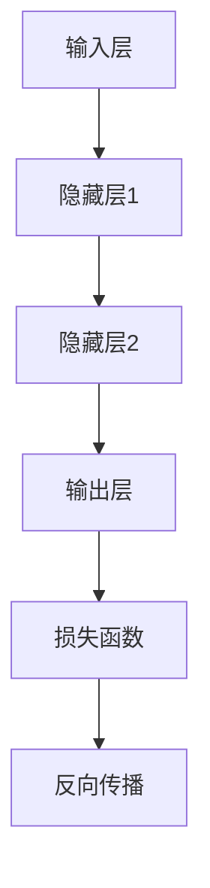
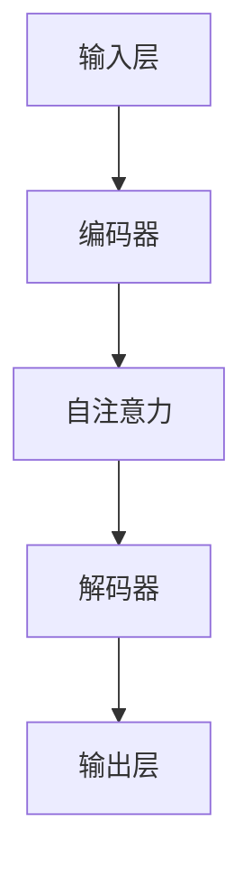

                 

### 引言

在当今科技迅速发展的时代，人工智能（AI）已经成为推动社会进步的重要力量。从自动驾驶汽车到智能家居，从医疗诊断到金融预测，AI的应用无处不在，深刻地改变了我们的生活方式和工作模式。而在这个充满机遇和挑战的领域，Andrej Karpathy无疑是一位杰出的人物。他是世界级的人工智能专家，同时也是一位才华横溢的程序员和软件架构师。他的研究工作涵盖了计算机视觉、自然语言处理、深度学习等多个领域，对人工智能的发展做出了重要贡献。

本文旨在深入探讨Andrej Karpathy的人工智能发展策略。我们将从以下几个方面进行论述：

1. **人工智能的基础与未来**：介绍人工智能的基本概念、历史发展、主要领域与应用，以及Andrej Karpathy的贡献与观点。
2. **人工智能的核心技术与趋势**：探讨深度学习与神经网络、自然语言处理技术，以及Andrej Karpathy在这些领域的研究成果。
3. **人工智能的未来发展方向**：分析人工智能的社会影响与挑战，以及人工智能的未来发展趋势。
4. **Andrej Karpathy的人工智能发展策略**：详细讨论人工智能教育与人才培养、人工智能研究与技术创新、人工智能产业发展与政策制定、人工智能伦理与社会责任。
5. **人工智能的未来发展策略案例研究**：通过具体案例研究，展示人工智能在教育、医疗、城市管理等领域中的应用与实践。

通过以上几个部分的论述，我们将全面了解Andrej Karpathy的人工智能发展策略，并对人工智能的未来发展有一个更清晰的认识。

### 关键词

- **人工智能**（Artificial Intelligence）
- **Andrej Karpathy**（AI Expert）
- **深度学习**（Deep Learning）
- **神经网络**（Neural Networks）
- **自然语言处理**（Natural Language Processing）
- **教育与人才培养**（Education and Talent Development）
- **人工智能伦理**（AI Ethics）
- **人工智能应用**（AI Applications）

### 摘要

本文旨在探讨人工智能领域专家Andrej Karpathy的人工智能发展策略。首先，我们回顾了人工智能的基本概念、历史发展和主要应用领域，介绍了Andrej Karpathy在AI领域的贡献与观点。接着，我们深入探讨了人工智能的核心技术，包括深度学习与神经网络、自然语言处理技术，以及Andrej Karpathy在这些领域的研究成果。随后，我们分析了人工智能的未来发展方向，包括社会影响与挑战、未来发展趋势，以及Andrej Karpathy对人工智能未来的看法。在本文的第三部分，我们详细讨论了Andrej Karpathy在人工智能教育与人才培养、研究与技术创新、产业发展与政策制定、伦理与社会责任等方面的发展策略。最后，通过具体的案例研究，我们展示了人工智能在教育、医疗、城市管理等领域中的应用与实践。本文旨在为读者提供一个全面、深入的人工智能发展策略分析，帮助读者更好地理解人工智能的未来发展趋势。

### 目录大纲

在本文中，我们将全面探讨人工智能领域专家Andrej Karpathy的人工智能发展策略。为了帮助读者更好地把握全文的结构和内容，以下为本文的目录大纲：

### 《Andrej Karpathy：人工智能的未来发展策略》目录大纲

#### 第一部分：人工智能的基础与未来

- **第1章：人工智能的基本概念与历史**
  - 1.1 人工智能的定义与发展
  - 1.2 人工智能的主要领域与应用
  - 1.3 Andrej Karpathy的贡献与观点

- **第2章：人工智能的核心技术与趋势**
  - 2.1 深度学习与神经网络
  - 2.2 自然语言处理技术概览

- **第3章：人工智能的未来发展方向**
  - 3.1 人工智能的社会影响与挑战
  - 3.2 人工智能的未来发展趋势

#### 第二部分：Andrej Karpathy的人工智能发展策略

- **第4章：人工智能的未来展望**
  - 4.1 Andrej Karpathy对人工智能未来的看法

- **第5章：人工智能教育与人才培养**
  - 5.1 人工智能教育的重要性
  - 5.2 人工智能人才培养的策略

- **第6章：人工智能研究与技术创新**
  - 6.1 人工智能研究的现状与趋势
  - 6.2 Andrej Karpathy的研究贡献

- **第7章：人工智能产业发展与政策制定**
  - 7.1 人工智能产业的影响
  - 7.2 人工智能产业政策的重要性

- **第8章：人工智能伦理与社会责任**
  - 8.1 人工智能伦理的核心问题
  - 8.2 Andrej Karpathy的伦理观点

#### 第三部分：人工智能的未来发展策略案例研究

- **第9章：人工智能在教育中的应用**
  - 9.1 人工智能教育的案例研究

- **第10章：人工智能在医疗领域的应用**
  - 10.1 人工智能医疗的案例研究

- **第11章：人工智能在城市管理中的应用**
  - 11.1 人工智能城市管理的案例研究

#### 附录

- **附录 A：人工智能相关资源与工具**
  - A.1 人工智能书籍与论文推荐
  - A.2 人工智能在线课程与讲座
  - A.3 人工智能开源框架与工具

- **附录 B：人工智能项目开发指南**
  - B.1 项目开发环境搭建
  - B.2 人工智能项目开发流程
  - B.3 人工智能项目开发实例解析

通过上述目录大纲，本文将带领读者深入探索人工智能领域，特别是Andrej Karpathy的人工智能发展策略，帮助读者更好地理解人工智能的未来发展趋势和应用。

### 人工智能的基本概念与历史

人工智能（Artificial Intelligence，简称AI）是指通过计算机程序和算法模拟、延伸和扩展人类智能的一种技术。它包括机器学习、自然语言处理、计算机视觉等多个子领域，旨在使计算机具备类似于人类的感知、推理、学习和决策能力。人工智能的起源可以追溯到20世纪中叶，当时的科学家们开始探索如何让机器模拟人类的智能行为。

#### 1.1 人工智能的定义与发展

人工智能的定义是一个持续演变的概念。早期的人工智能研究主要集中在规则推理和知识表示上，这种方法依赖于预定义的规则和大量的手动编码。随着计算机硬件性能的提升和算法的进步，特别是在机器学习和深度学习技术的发展下，人工智能的定义逐渐扩展到通过数据和算法自动学习、优化和改进性能的领域。

人工智能的发展可以分为几个重要阶段：

- **初期阶段（1950年代-1960年代）**：人工智能的概念被首次提出，早期的AI系统主要依赖于符号逻辑和知识表示。代表性人物包括艾伦·图灵（Alan Turing），他提出了图灵测试，用以判断机器是否具有人类智能。

- **繁荣阶段（1970年代-1980年代）**：在这一时期，人工智能研究取得了显著进展，专家系统和推理机成为研究热点。专家系统是一种基于知识表示和推理的智能系统，可以处理复杂的决策问题。然而，由于规则定义的复杂性，这一阶段的AI系统在实际应用中面临挑战。

- **低谷阶段（1990年代）**：随着计算能力的限制和算法的不足，人工智能研究在1990年代遇到了瓶颈。机器学习领域的进展较为缓慢，人工智能的应用范围受到限制。

- **复兴阶段（2000年代至今）**：随着深度学习技术的发展，人工智能再次迎来了新的高潮。深度学习通过多层神经网络模拟人脑的工作方式，极大地提升了机器学习的能力。代表性人物包括Yann LeCun、Geoffrey Hinton和Yoshua Bengio，他们在深度学习领域做出了开创性的贡献。

#### 1.2 人工智能的主要领域与应用

人工智能的主要领域包括机器学习、自然语言处理、计算机视觉、智能规划和机器人等。下面分别介绍这些领域的基本概念和应用。

- **机器学习**：机器学习是人工智能的核心技术之一，通过算法使计算机从数据中学习，进行预测和决策。机器学习可以分为监督学习、无监督学习和强化学习。监督学习通过已知输入和输出数据训练模型，无监督学习则从未标记的数据中学习特征，强化学习通过奖励机制训练模型。

- **自然语言处理**：自然语言处理（Natural Language Processing，NLP）旨在使计算机理解和处理人类自然语言。NLP应用广泛，包括语音识别、机器翻译、情感分析、文本分类等。例如，语音助手如苹果的Siri和谷歌助手就是基于NLP技术实现的。

- **计算机视觉**：计算机视觉（Computer Vision）使计算机能够理解和处理图像和视频。计算机视觉的应用包括图像识别、目标检测、人脸识别、自动驾驶等。例如，自动驾驶汽车使用的摄像头和传感器系统就是计算机视觉技术的重要应用。

- **智能规划**：智能规划是一种利用人工智能技术解决复杂决策问题的方法。它包括路径规划、资源分配、任务调度等。智能规划在物流、交通管理和生产调度等领域有广泛的应用。

- **机器人**：机器人是人工智能在物理世界中的具体应用。现代机器人具有感知、决策和执行能力，可以执行各种任务，如工业制造、医疗辅助、家庭服务、搜索救援等。

#### 1.3 Andrej Karpathy的贡献与观点

Andrej Karpathy是一位杰出的计算机科学家和人工智能专家，他在多个领域做出了重要贡献。以下是他的一些主要贡献和观点：

- **学术背景**：Andrej Karpathy毕业于多伦多大学，获得计算机科学博士学位。他的研究方向主要集中在深度学习和自然语言处理领域。

- **主要工作**：Andrej Karpathy在深度学习领域发表了多篇重要论文，包括在自然语言处理和计算机视觉方面的开创性工作。他参与了多个知名项目，如OpenAI的GPT模型和斯坦福大学的自动驾驶项目。

- **观点**：Andrej Karpathy认为，人工智能的未来在于更好地理解和模拟人类智能，实现通用人工智能（AGI）。他认为，深度学习是实现这一目标的重要途径，但同时也指出，人工智能的发展需要解决伦理和社会问题。

通过上述对人工智能基本概念与历史、主要领域与应用以及Andrej Karpathy的贡献与观点的介绍，我们可以更好地理解人工智能的发展现状和未来趋势。

### 人工智能的核心技术与趋势

在人工智能（AI）的快速发展的过程中，深度学习（Deep Learning）与神经网络（Neural Networks）已经成为最为重要的技术之一。此外，自然语言处理（Natural Language Processing，NLP）技术在AI中的应用也越来越广泛。以下将详细探讨这些核心技术的原理、架构以及发展。

#### 2.1 深度学习与神经网络

**深度学习的基本原理**

深度学习是一种机器学习的方法，通过多层神经网络（Neural Networks）模拟人脑的学习机制。它的基本原理是：通过输入数据进行多次非线性变换，使模型逐渐学习到数据的复杂特征。

一个典型的深度学习模型包括以下几个部分：

1. **输入层（Input Layer）**：接收外部数据，如图像、文本或音频。
2. **隐藏层（Hidden Layers）**：通过多层非线性变换，提取数据的高级特征。
3. **输出层（Output Layer）**：根据提取的特征生成预测结果或决策。

**神经网络的架构与发展**

神经网络（Neural Networks）是深度学习的基础。一个简单的神经网络模型通常包括以下部分：

1. **神经元（Neurons）**：神经网络的基本单元，用于接收输入、计算加权求和、应用激活函数并产生输出。
2. **层（Layers）**：神经网络由多个层组成，包括输入层、隐藏层和输出层。
3. **权重（Weights）**：每个神经元与输入之间存在权重，用于控制输入的影响程度。
4. **偏置（Bias）**：每个神经元都有一个偏置项，用于调整输出。
5. **激活函数（Activation Function）**：用于引入非线性变换，常见的激活函数包括 sigmoid、ReLU 和 tanh。

神经网络的训练过程通常包括以下步骤：

1. **前向传播（Forward Propagation）**：输入数据通过网络传递，每一层神经元根据权重和激活函数产生输出。
2. **损失函数（Loss Function）**：计算输出与实际值之间的差距，常用的损失函数包括均方误差（MSE）和交叉熵（Cross-Entropy）。
3. **反向传播（Back Propagation）**：根据损失函数计算梯度，并更新网络权重和偏置，以最小化损失。
4. **优化算法（Optimization Algorithm）**：用于指导权重和偏置的更新，常见的优化算法有随机梯度下降（SGD）和Adam。

**深度学习在AI中的应用**

深度学习已经在计算机视觉、自然语言处理、语音识别等多个领域取得了显著的成果。以下是一些典型应用：

1. **计算机视觉**：深度学习模型在图像分类、目标检测、人脸识别等方面表现出色。例如，ResNet 和 Inception 等深度学习模型在 ImageNet 图像分类任务中取得了突破性成绩。
2. **自然语言处理**：深度学习在文本分类、机器翻译、情感分析等方面有广泛应用。例如，Transformer 和 BERT 等模型在 NLP 领域取得了重大进展。
3. **语音识别**：深度学习模型在语音识别任务中表现出色，例如，基于深度神经网络的自动语音识别（ASR）系统。

**深度学习的未来发展**

随着计算能力的提升和算法的进步，深度学习在人工智能领域的前景十分广阔。未来，深度学习可能会在以下方面取得重要进展：

1. **泛化能力**：提高模型在不同数据集和任务上的泛化能力。
2. **解释性**：提高模型的解释性，使人们能够更好地理解模型的决策过程。
3. **硬件优化**：通过硬件优化，如专用硬件加速器和量子计算，提升深度学习的性能。

**Mermaid流程图**

下面是一个简单的Mermaid流程图，展示了一个基本的深度学习模型的架构：



#### 2.2 自然语言处理技术概览

**词嵌入技术**

词嵌入（Word Embedding）是一种将单词映射到高维向量空间的技术。通过词嵌入，可以捕捉单词的语义信息，实现文本数据的向量化表示。常见的词嵌入算法包括：

1. **Word2Vec**：基于神经网络的词嵌入方法，包括连续词袋（CBOW）和 Skip-Gram 两种模型。
2. **GloVe**：全局向量表示（Global Vectors for Word Representation），通过矩阵分解方法生成词向量。

**序列模型与注意力机制**

序列模型（Sequence Model）用于处理序列数据，如文本、语音和时序数据。常见的序列模型包括：

1. **循环神经网络（RNN）**：通过递归方式处理序列数据，但存在梯度消失和梯度爆炸问题。
2. **长短时记忆网络（LSTM）**：通过门控机制解决 RNN 的问题，但仍然有计算复杂度高的问题。
3. **门控循环单元（GRU）**：LSTM 的简化版，计算效率更高。

注意力机制（Attention Mechanism）是一种用于捕捉序列中重要信息的方法，常用于翻译、问答系统和文本生成等任务。注意力机制的引入使得模型能够关注序列中的关键部分，提高模型的性能。

**转换器架构详解**

转换器架构（Transformer）是一种基于注意力机制的序列到序列模型，由 Vaswani 等人在2017年提出。Transformer 去除了传统的循环神经网络结构，采用了自注意力机制和多头注意力，在翻译、文本生成等任务中取得了显著成果。

转换器架构的主要组成部分包括：

1. **编码器（Encoder）**：对输入序列进行编码，生成编码器输出。
2. **解码器（Decoder）**：对编码器输出进行解码，生成输出序列。
3. **自注意力（Self-Attention）**：在每个时间步，解码器中的每个目标词都关注输入序列的所有词。
4. **多头注意力（Multi-Head Attention）**：通过多个独立的注意力机制捕捉不同的信息。

**转换器架构的优势与应用**

转换器架构的优势包括：

1. **并行化**：由于自注意力机制，转换器架构可以并行处理序列数据，提高了计算效率。
2. **长距离依赖**：通过多头注意力机制，转换器架构能够捕捉长距离依赖信息，提高了模型的性能。

转换器架构在自然语言处理领域有广泛应用，包括机器翻译、文本生成、问答系统等。

**Mermaid流程图**

下面是一个简单的Mermaid流程图，展示了一个基本的自然语言处理模型的架构：



通过以上对深度学习与神经网络、自然语言处理技术的详细探讨，我们可以看到这些核心技术在人工智能领域的重要地位及其广阔的应用前景。随着技术的不断进步，人工智能将在更多领域发挥重要作用，为社会带来更多的便利和进步。

### 人工智能的未来发展方向

人工智能（AI）的发展方向不仅涉及技术层面的突破，还涵盖社会影响、伦理问题以及未来趋势的探讨。在这个部分，我们将分析人工智能对社会的影响与挑战，并探讨其未来的发展趋势。

#### 3.1 人工智能的社会影响与挑战

**人工智能对社会的改变**

人工智能正以前所未有的速度改变着社会的各个方面，从经济结构到日常生活，都受到了深刻的影响。

1. **经济结构变革**：人工智能技术推动了自动化和智能化生产，改变了传统制造业和服务业的运作方式。大量的重复性和低技能劳动被机器人和自动化系统取代，这既提高了生产效率，也引发了就业结构的变革。一方面，新兴产业和就业机会不断涌现，另一方面，传统产业工人面临失业风险。

2. **生活方式改变**：人工智能技术在智能家居、健康管理、购物体验等方面的应用，极大地提升了人们的生活质量。智能助手如Siri和Alexa已成为许多家庭的日常伙伴，自动驾驶汽车和智能交通系统正在改变人们的出行方式。

**人工智能的伦理问题**

随着人工智能技术的迅速发展，伦理问题逐渐成为公众和学术界关注的焦点。以下是一些主要的伦理问题：

1. **隐私保护**：人工智能技术依赖于大量个人数据，如何在保护用户隐私的同时，合理利用这些数据，成为一项重要的伦理挑战。

2. **算法公平性**：人工智能算法的决策过程可能存在偏见，导致对某些群体不公平的待遇。例如，招聘系统可能基于历史数据对某些性别或种族产生歧视。

3. **安全与可控性**：高度智能化系统的失控可能带来严重的安全风险，例如，自动驾驶汽车的安全问题、人工智能武器化等。

**解决策略**

为应对上述伦理挑战，可以采取以下策略：

1. **制定伦理准则**：政府和行业组织应制定明确的伦理准则，规范人工智能技术的研发和应用。

2. **透明性和可解释性**：提高人工智能系统的透明性，使其决策过程可以被理解、审计和监督，有助于减少伦理风险。

3. **多元参与**：在人工智能的研发和应用过程中，应鼓励多元参与，包括不同领域的专家、公众代表等，确保技术的公平性和包容性。

#### 3.2 人工智能的未来发展趋势

**技术进步**

人工智能的未来发展趋势之一是技术的进一步突破。以下是一些值得关注的领域：

1. **量子计算**：量子计算具有巨大的计算潜力，可能推动人工智能在复杂问题求解、大规模数据处理等方面的重大进展。

2. **神经形态计算**：神经形态计算通过模拟人脑的神经网络结构，实现高效的计算和处理，有望在认知计算、人机交互等领域取得突破。

3. **多模态学习**：多模态学习旨在整合不同类型的数据（如文本、图像、声音等），实现更全面的信息理解和处理能力。

**社会角色**

人工智能在社会中的角色将继续演变，成为推动社会进步的重要力量。以下是一些可能的发展方向：

1. **智能服务**：人工智能将在医疗、教育、交通等公共服务领域发挥更大作用，提供个性化、高效的解决方案。

2. **社会治理**：人工智能技术在智慧城市、环境监测、公共安全等方面的应用，将提升社会治理的智能化水平。

3. **经济创新**：人工智能将推动新兴产业的崛起，创造新的商业模式和就业机会，促进经济的持续增长。

**未来趋势**

在人工智能的未来发展中，以下趋势值得注意：

1. **普及化**：随着计算能力的提升和算法的优化，人工智能技术将更加普及，进入更多的领域和行业。

2. **协作化**：人工智能将与人类更加紧密地协作，提升工作效率和生活质量。

3. **自主化**：人工智能的自主决策能力将得到提升，实现更高级别的自动化和智能化。

综上所述，人工智能的未来发展方向是多方面的，既包括技术的进步，也涵盖社会影响和伦理问题的解决。随着技术的不断进步和应用场景的拓展，人工智能将在未来发挥更加重要的作用，为社会带来深远的影响。

### Andrej Karpathy对人工智能未来的看法

在人工智能（AI）领域，Andrej Karpathy以其深邃的见解和卓越的成就，成为了推动这一领域发展的关键人物。他对人工智能未来的看法，不仅为我们提供了对AI技术发展方向的洞见，也揭示了AI在社会中的作用和挑战。以下是对Andrej Karpathy关于人工智能未来看法的详细探讨。

#### 4.1.1 人工智能的技术进步

Andrej Karpathy坚信，人工智能的技术进步将是一个持续且深刻的过程。他认为，深度学习（Deep Learning）和神经网络（Neural Networks）将继续发挥核心作用，推动人工智能在各个领域的突破。以下是几个关键领域的技术进步方向：

1. **算法优化**：为了提高模型的训练效率和性能，未来将出现更多高效的算法和优化方法。例如，改进的梯度下降算法、自适应优化器等，将使得模型能够在更短的时间内达到更好的收敛效果。

2. **模型架构创新**：随着研究的深入，新的神经网络架构将不断涌现，如自注意力机制（Self-Attention Mechanism）和Transformer架构，已经在自然语言处理（NLP）领域取得了显著成功。未来，类似的创新将在计算机视觉、语音识别等领域得到应用。

3. **数据驱动方法**：数据是人工智能发展的基础，未来将看到更多针对特定应用场景的数据增强和生成方法，以提高模型的泛化能力和鲁棒性。

4. **跨模态学习**：多模态学习（Multimodal Learning）将是一个重要的发展方向，通过整合不同类型的数据（如文本、图像、声音等），实现更全面的信息理解和处理能力。

#### 4.1.2 人工智能的社会角色

Andrej Karpathy认为，人工智能将在未来扮演更加重要的社会角色，不仅在技术层面，还将在经济、教育、医疗等多个领域产生深远影响。以下是他关于人工智能社会角色的几个观点：

1. **智能化服务**：人工智能将推动智能服务的普及，如智能医疗诊断、个性化教育、智能交通管理等。通过大数据和机器学习技术，这些服务将更加精准、高效。

2. **经济创新**：人工智能将成为推动经济发展的新引擎，通过自动化、智能化生产，提高生产效率，创造新的商业模式和就业机会。

3. **社会治理**：人工智能技术在智慧城市、公共安全、环境保护等领域的应用，将提升社会治理的智能化水平，提高公共服务的质量和效率。

4. **伦理与责任**：随着人工智能技术的发展，伦理问题和社会责任将成为不可忽视的重要议题。人工智能的开发和应用需要遵循伦理准则，确保其对社会的影响是积极和负面的。

#### 4.1.3 人工智能的未来趋势

Andrej Karpathy对人工智能的未来趋势进行了深入的探讨，以下是他的一些主要观点：

1. **普及化**：随着技术的进步和应用场景的拓展，人工智能将逐渐普及到更多的领域和行业，成为日常生活和工作的常态。

2. **协作化**：人工智能将与人类更加紧密地协作，通过人机交互和智能决策系统，提高工作效率和生活质量。

3. **自主化**：未来的人工智能系统将具备更高的自主决策能力，能够处理更复杂的任务和情境，实现更高级别的自动化和智能化。

4. **可持续发展**：人工智能的发展需要注重可持续发展，包括资源的合理利用、环保技术的应用等，以确保技术进步与环境保护相协调。

综上所述，Andrej Karpathy对人工智能未来的看法充满了希望和期待。他相信，人工智能将继续推动技术和社会的进步，但同时也需要关注其带来的伦理和社会问题，确保技术的发展符合人类的利益和价值观。

### 人工智能教育与人才培养

人工智能（AI）的快速发展对人才的需求也日益增加。因此，如何培养具备人工智能知识和技能的专业人才成为了一项重要任务。以下将讨论人工智能教育的重要性、当前教育现状及未来发展方向，以及人才培养策略。

#### 5.1 人工智能教育的重要性

**技术进步驱动需求**

随着人工智能技术的不断进步，其在各行各业中的应用越来越广泛。例如，深度学习在图像识别、自然语言处理、自动驾驶等领域的突破，使得相关技术迅速成熟并投入实际应用。这要求从业人员不仅需要掌握基本的编程和算法知识，还需要了解最新的研究进展和应用案例。因此，人工智能教育的重要性日益凸显。

**创新驱动经济增长**

人工智能被认为是未来经济增长的新引擎。根据国际数据公司（IDC）的报告，到2025年，全球人工智能市场规模预计将达到5,970亿美元。人工智能技术的发展将推动产业升级，创造新的就业机会，提高生产效率。为了充分利用这一机遇，各国纷纷加大人工智能教育的投入，培养具备创新能力的人才。

**社会需求多样化**

人工智能技术的普及使得社会各界对相关人才的需求日益多样化。不仅技术公司需要人工智能专家，传统行业如医疗、金融、教育等也对人工智能人才有着强烈的需求。这些行业需要将人工智能技术应用于实际业务，提高服务质量和效率。因此，人工智能教育不仅要培养技术人才，还需要培养能够跨领域应用人工智能的复合型人才。

#### 5.2 当前人工智能教育现状及未来发展方向

**现状分析**

1. **教育资源分布不均**：目前，人工智能教育资源主要集中在发达国家，特别是在美国、中国和欧洲等地区。这些地区的高校和研究机构在人工智能研究领域具有显著优势，培养了大量优秀人才。然而，在发展中国家和欠发达地区，人工智能教育的资源相对匮乏，人才供给不足。

2. **课程设置缺乏系统性**：当前的人工智能课程设置存在一定的局限性，往往侧重于单一领域的技术知识，缺乏系统的理论和实践训练。这使得学生难以形成全面的知识体系，难以应对实际工作中的复杂问题。

3. **教学方法单一**：传统教学方法主要以理论讲授为主，缺乏实践环节。人工智能是一门实践性很强的学科，单纯的理论学习难以让学生真正掌握技能。因此，需要创新教学方法，加强实践环节，提高学生的动手能力。

**未来发展方向**

1. **教育资源均衡分配**：为了促进人工智能教育的普及，需要加大教育资源的投入，推动教育资源的均衡分配。可以通过建立国际性的人工智能教育合作平台，共享优质教育资源，提升全球范围内的人工智能教育水平。

2. **课程设置多元化**：人工智能教育的课程设置应更加多元化，不仅涵盖传统的算法和数据结构，还应包括最新的深度学习、自然语言处理、计算机视觉等前沿技术。此外，应加强跨学科的课程设置，培养学生解决复杂问题的能力。

3. **教学方法创新**：为了提高学生的学习效果，需要创新教学方法，结合在线学习、虚拟实验室、项目驱动学习等多种方式，增强学生的实践能力。例如，通过在线课程平台，学生可以随时随地进行学习；通过虚拟实验室，学生可以模拟实际项目环境，进行实践操作。

#### 5.3 人才培养策略

**多元化人才选拔**

为了培养具备多元化背景和技能的人才，应采取多元化的人才选拔策略。除了传统的笔试和面试，还可以引入项目评审、团队合作能力测试等方式，全面评估学生的综合素质和潜力。

**跨学科培养**

人工智能是一门跨学科领域，需要掌握计算机科学、数学、统计学、心理学等多学科的知识。因此，人才培养应注重跨学科培养，鼓励学生跨专业选修课程，提升其综合素养。

**实践能力培养**

实践能力是人工智能人才的重要素质。学校可以通过设立实习项目、开展实践活动等方式，增强学生的实践能力。此外，鼓励学生参加人工智能竞赛和项目，提高其解决实际问题的能力。

**国际交流与合作**

为了提升人工智能人才培养的质量，应加强国际交流与合作。通过国际合作项目、海外实习机会等方式，让学生了解国际前沿技术，拓宽视野，提升其国际竞争力。

**持续教育与职业发展**

人工智能领域发展迅速，要求人才具备持续学习和适应能力。学校和企业可以联合开展持续教育项目，提供职业培训和发展指导，帮助人才不断提升自身能力和职业竞争力。

综上所述，人工智能教育与人才培养是一项系统性工程，需要从多个方面入手，加强教育资源的投入，创新教学方法，优化人才培养策略，以满足人工智能领域的发展需求。

### 人工智能研究与技术创新

人工智能（AI）的快速发展离不开持续的研究与技术创新。在当前的技术环境中，研究人员和开发者面临许多挑战，同时也拥有丰富的机会。以下将讨论人工智能研究的现状与趋势，分析当前的主要研究挑战，以及探讨人工智能技术创新的方法，同时介绍Andrej Karpathy在人工智能研究中的主要贡献。

#### 6.1 人工智能研究的现状与趋势

**研究现状**

人工智能研究在过去几十年中取得了显著的进展。深度学习（Deep Learning）和神经网络（Neural Networks）的兴起，使得计算机在图像识别、自然语言处理、语音识别等领域达到了前所未有的水平。以下是人工智能研究现状的几个关键点：

1. **深度学习技术的突破**：深度学习在图像识别、语音识别等任务中取得了巨大成功。卷积神经网络（CNN）和循环神经网络（RNN）等结构被广泛应用于各种应用场景，大幅提升了模型的性能和准确性。

2. **自然语言处理的发展**：自然语言处理（NLP）技术在近年来也取得了显著进展。Transformer架构和预训练模型（如BERT、GPT）的出现，使得机器在理解和生成自然语言方面取得了突破性成果。

3. **跨学科研究**：人工智能研究不再局限于计算机科学领域，而是与其他学科如生物学、心理学、经济学等交叉融合。这种跨学科的研究方法，促进了人工智能技术的创新和应用。

**研究趋势**

未来，人工智能研究将继续沿着以下几个方向前进：

1. **算法优化与模型压缩**：为了提高模型的训练效率和推理速度，研究人员将致力于优化算法和模型结构。例如，通过量化技术、知识蒸馏等方法，减少模型的参数数量和计算量，提高模型的部署效率。

2. **多模态学习**：多模态学习（Multimodal Learning）将是一个重要趋势。通过整合不同类型的数据（如文本、图像、声音等），实现更全面的信息理解和处理能力。

3. **强化学习**：强化学习（Reinforcement Learning）在人工智能领域中的应用越来越广泛。未来，研究人员将探索更有效的强化学习算法，以解决复杂决策问题，如自动驾驶、游戏智能等。

4. **伦理与可解释性**：随着人工智能技术的普及，伦理问题和可解释性（Explainability）将成为研究的重要方向。如何确保人工智能系统的公平性、透明性和可控性，是未来研究的重点。

#### 6.2 当前的主要研究挑战

**数据隐私与安全**

人工智能系统依赖于大量个人数据，如何在保护用户隐私的同时，合理利用这些数据，是一个重要的挑战。研究人员需要开发安全的数据处理和共享机制，确保数据在传输和使用过程中的安全。

**算法公平性与多样性**

人工智能算法的决策过程可能存在偏见，导致对某些群体不公平的待遇。例如，招聘系统可能基于历史数据对某些性别或种族产生歧视。为了解决这一问题，需要开发公平性评估方法和改进算法，确保算法的多样性和包容性。

**计算资源与能耗**

随着模型复杂度和数据量的增加，人工智能系统的计算资源需求也在不断增长。如何在有限的计算资源下，高效地训练和推理大规模模型，是一个重要的挑战。此外，人工智能系统的能耗问题也引起了广泛关注，如何实现绿色AI是未来研究的重要方向。

**跨学科融合**

人工智能研究需要跨学科的融合，但不同学科之间的语言和思维方式存在差异，这增加了研究的复杂性。研究人员需要加强跨学科的合作，提升跨学科研究的效率和质量。

#### 6.3 人工智能技术创新的方法

**算法创新**

算法创新是人工智能技术创新的核心。研究人员可以通过改进现有算法、设计新算法来提升模型的性能和效率。例如，通过优化梯度下降算法、设计新的神经网络结构等，提高模型的训练速度和推理能力。

**模型压缩与优化**

模型压缩与优化是提高人工智能系统部署效率的重要方法。通过量化技术、剪枝（Pruning）等方法，减少模型的参数数量和计算量，提高模型的推理速度。此外，通过知识蒸馏（Knowledge Distillation）等方法，将大型模型的知识传递给小型模型，提高小型模型的性能。

**多模态学习**

多模态学习是整合不同类型数据（如文本、图像、声音等）的重要方法。通过设计多模态神经网络结构、开发跨模态特征提取方法，实现更全面的信息理解和处理能力。

**强化学习**

强化学习在复杂决策问题中的应用越来越广泛。研究人员可以通过设计新的强化学习算法、改进奖励机制等，提高模型的决策能力。此外，通过将强化学习与其他技术（如深度学习、迁移学习等）结合，解决更复杂的实际问题。

#### 6.4 Andrej Karpathy的研究贡献

Andrej Karpathy是一位杰出的计算机科学家和人工智能专家，他在人工智能领域做出了许多重要贡献。以下是他的一些主要研究贡献：

1. **深度学习与计算机视觉**：Andrej Karpathy在深度学习和计算机视觉领域发表了多篇重要论文。他参与了ImageNet竞赛，为该竞赛的胜利做出了贡献。他的研究工作包括图像识别、目标检测和视频理解等，推动了计算机视觉技术的发展。

2. **自然语言处理**：在自然语言处理领域，Andrej Karpathy专注于序列模型和注意力机制的研究。他提出了多个重要的模型架构，如序列到序列（Seq2Seq）模型和Transformer模型。这些模型在机器翻译、文本生成和对话系统等任务中取得了显著的成果。

3. **开源贡献**：Andrej Karpathy在开源社区中也非常活跃，他参与了多个开源项目，如TensorFlow和PyTorch。他的开源代码和教程，为全球开发者提供了丰富的资源，促进了人工智能技术的发展。

综上所述，人工智能研究与技术创新是一个充满挑战和机遇的领域。通过不断的研究和探索，人工智能技术将继续推动社会的进步和发展。Andrej Karpathy的研究贡献，为我们提供了宝贵的经验和启示，帮助我们在这一领域取得更大的突破。

### 人工智能产业发展与政策制定

人工智能（AI）产业的快速发展对社会、经济和科技领域产生了深远的影响。为了推动人工智能产业的健康、可持续发展，合理的政策制定和产业规划至关重要。以下将讨论人工智能产业的影响、产业政策的重要性以及如何制定有效的政策。

#### 7.1 人工智能产业的影响

**经济价值**

人工智能产业已经成为全球经济的新引擎，为各国带来了巨大的经济价值。根据国际数据公司（IDC）的报告，全球人工智能市场预计将在2024年达到3900亿美元，占全球信息技术的10%以上。人工智能技术在金融、医疗、制造、零售等领域的广泛应用，不仅提高了生产效率，还创造了大量的就业机会。

**技术进步**

人工智能产业的发展推动了相关技术的不断进步。深度学习、自然语言处理、计算机视觉等技术的突破，为各行各业提供了强大的技术支持。例如，自动驾驶技术的进步，使得无人驾驶汽车从实验室走向了现实；医疗影像分析技术的提升，提高了疾病诊断的准确性和效率。

**社会变革**

人工智能技术的普及改变了人们的生活方式和社会结构。智能助手、智能家居、在线教育等新兴应用，极大地提升了人们的日常生活质量。同时，人工智能在公共安全、环境监测、社会治理等领域的应用，提高了公共服务水平，促进了社会进步。

#### 7.2 产业政策的重要性

**促进创新**

产业政策可以提供资金支持、税收优惠、知识产权保护等政策，激励企业加大在人工智能领域的研发投入。通过政策引导，可以推动创新资源向人工智能产业集聚，提高企业的创新能力和竞争力。

**保障数据安全**

人工智能的发展离不开大量数据，而数据安全是确保人工智能健康发展的关键。产业政策应制定数据安全标准，建立数据监管机制，确保数据在采集、存储、传输和使用过程中的安全。同时，加强对个人隐私保护的法律法规，提高公众对人工智能技术的信任度。

**人才支持**

人才是人工智能产业发展的核心资源。产业政策应加大对人工智能人才培养的投入，推动高校和科研机构加强人工智能学科建设，培养更多高水平的AI专业人才。同时，通过人才引进计划，吸引国际顶尖人才加入国内人工智能产业。

**促进国际合作**

人工智能是一个全球性的产业，各国应加强合作，共同推动人工智能技术的发展。产业政策应制定国际交流合作机制，推动跨国人工智能研发项目，分享研究成果和经验，提升全球人工智能产业的整体水平。

#### 7.3 制定有效的政策

**明确发展方向**

制定产业政策前，应对人工智能产业的发展趋势和未来前景进行深入分析，明确人工智能产业的发展方向和重点领域。例如，在医疗、教育、金融等领域，人工智能具有广泛的应用潜力，政策应优先支持这些领域的发展。

**健全法律法规**

人工智能技术的发展伴随着诸多伦理和社会问题，如数据安全、隐私保护、算法公平性等。政策制定者应制定完善的法律法规，规范人工智能的应用和行为，保障公众的利益。

**加大资金支持**

政府应加大对人工智能产业的资金支持，通过设立专项基金、提供贷款和补贴等方式，鼓励企业加大研发投入，推动技术创新。同时，政府应推动金融机构为人工智能企业提供融资支持，缓解企业的资金压力。

**优化人才政策**

政策制定者应制定吸引和留住人才的优惠政策，如提供住房补贴、子女教育优惠等，吸引全球顶尖人才加入国内人工智能产业。同时，推动高校和科研机构加强人工智能学科建设，培养更多高水平的AI专业人才。

**推动国际合作**

鼓励企业、科研机构参与国际人工智能合作项目，共同推动人工智能技术的发展。通过建立国际合作平台，促进各国在人工智能领域的交流与合作，提升全球人工智能产业的整体水平。

综上所述，人工智能产业的发展对经济、科技和社会产生了深远的影响。为了推动人工智能产业的健康、可持续发展，制定合理的产业政策至关重要。政策制定者应明确发展方向，健全法律法规，加大资金支持，优化人才政策，推动国际合作，共同促进人工智能产业的繁荣发展。

### 人工智能伦理与社会责任

随着人工智能（AI）技术的迅速发展，其对社会的影响越来越深远，不仅涉及技术层面，还包括伦理和社会责任。人工智能伦理问题已经成为一个全球性的议题，各国政府和国际组织都在积极探索如何确保人工智能技术的安全、公平和透明。以下将探讨人工智能伦理的核心问题、解决策略以及Andrej Karpathy在人工智能伦理方面的观点。

#### 8.1 人工智能伦理的核心问题

**数据隐私与安全**

人工智能系统依赖大量个人数据进行训练和推理，如何在保护用户隐私的同时，合理利用这些数据，是一个重要的伦理问题。数据泄露、滥用和不当处理可能导致严重的隐私侵犯和安全隐患。

**算法公平性与透明性**

人工智能算法的决策过程可能存在偏见，导致对某些群体不公平的待遇。例如，招聘系统可能基于历史数据对某些性别或种族产生歧视。此外，算法的透明性也是一个重要问题，如何使人工智能系统的决策过程可以被理解、审计和监督，是一个关键挑战。

**责任归属**

在人工智能系统引发的事故或错误决策中，责任归属问题常常难以界定。例如，自动驾驶汽车发生事故时，责任应归于汽车制造商、软件开发者还是用户？这一问题涉及到法律、道德和技术等多个层面。

**人工智能武器化**

人工智能技术的潜在武器化风险也是一个重要的伦理问题。如果人工智能技术被用于军事目的，可能导致新的军备竞赛和冲突。如何防止人工智能技术的滥用和武器化，是国际社会面临的严峻挑战。

**就业影响**

人工智能技术的普及可能引发就业市场的变革，一些传统岗位可能会被自动化系统取代，导致失业问题。如何平衡技术进步与就业机会，确保社会稳定和谐，是一个重要的伦理议题。

#### 8.2 解决策略

**加强法律法规**

为了解决人工智能伦理问题，各国需要加强法律法规的建设，制定明确的数据保护法、算法公平性标准和责任归属规定。例如，欧盟的《通用数据保护条例》（GDPR）对数据隐私保护提出了严格的要求，美国和欧洲也在制定类似的法规。

**提高算法透明性**

提高算法的透明性是解决伦理问题的关键。研究人员和开发者应致力于设计可解释性强的算法，使算法的决策过程可以被理解。此外，建立算法审计和监督机制，确保算法的公平性和透明性。

**数据隐私保护**

在数据隐私保护方面，可以采取以下措施：一是数据匿名化处理，确保个人数据在传输和处理过程中无法被识别；二是建立数据保护框架，确保数据在采集、存储、传输和使用过程中的安全；三是建立数据隐私监管机构，监督和执行数据保护法规。

**责任归属机制**

为了明确人工智能系统的事故责任，可以建立责任归属机制。例如，在自动驾驶汽车事故中，可以引入第三方评估机构，对事故原因进行分析，并确定责任归属。此外，应制定明确的法律责任条款，确保责任追究的可行性。

**就业转型支持**

为了应对人工智能技术带来的就业变革，政府和社会应采取措施，支持就业转型。例如，提供职业培训和再教育机会，帮助失业者适应新的就业市场；推动创业支持政策，鼓励人们利用人工智能技术创业。

#### 8.3 Andrej Karpathy的伦理观点

作为人工智能领域的杰出专家，Andrej Karpathy对人工智能伦理问题有着深刻的见解。以下是他的一些主要观点：

**数据隐私**

Andrej Karpathy认为，数据隐私是人工智能伦理的核心问题之一。他主张在数据使用过程中，应遵循最小化数据收集原则，只收集和使用必要的数据。同时，数据匿名化处理和加密技术应被广泛应用于数据传输和存储过程中，确保数据的安全和隐私。

**算法公平性**

Andrej Karpathy强调，人工智能算法的公平性至关重要。他主张在设计算法时，应考虑不同群体的需求和利益，避免算法偏见和歧视。此外，应建立透明的算法评估和监督机制，确保算法的公平性和透明性。

**责任归属**

对于人工智能系统的责任归属问题，Andrej Karpathy认为，应建立明确的法律责任条款，明确不同参与方的责任。同时，应鼓励各方积极参与，共同推动人工智能技术的伦理发展。

**就业影响**

Andrej Karpathy认为，人工智能技术将带来就业市场的变革，但同时也将创造新的就业机会。他主张政府和社会应采取措施，支持就业转型，帮助人们适应新的就业市场。此外，应推动人工智能技术在各行业中的应用，创造更多的就业机会。

综上所述，人工智能伦理与社会责任是一个复杂且重要的议题。通过加强法律法规、提高算法透明性、数据隐私保护和责任归属机制，以及推动就业转型支持，可以有效地解决人工智能伦理问题，确保人工智能技术的健康发展。Andrej Karpathy在人工智能伦理方面的观点，为我们提供了宝贵的参考和启示。

### 人工智能在教育中的应用

人工智能（AI）技术在教育领域的应用正在不断深入，为传统教育模式带来了革命性的变化。通过AI技术，教育变得更加个性化、智能化和高效化，不仅提升了教学效果，还极大地改善了学生的学习体验。以下将探讨人工智能在教育中的应用，通过具体案例研究，分析AI教育的好处、面临的挑战以及未来发展趋势。

#### 9.1 人工智能教育的案例研究

**案例一：在线教育平台的应用**

随着互联网技术的普及，在线教育平台成为AI应用的重要场景之一。通过AI技术，在线教育平台能够提供个性化学习体验，满足不同学生的学习需求。

- **个性化推荐系统**：基于学生的行为数据和学习记录，AI系统可以推荐适合的学习资源和课程，提高学习效率。例如，Coursera和edX等在线教育平台利用机器学习算法，根据用户的学习历史和偏好，推荐相关的课程和内容。
- **智能作业批改**：AI系统能够自动批改作业，提供即时反馈，减轻教师的工作负担。例如，Google Classroom和Microsoft Teams等平台利用自然语言处理技术，对学生的作文进行批改和评分。
- **智能辅导**：AI系统可以通过语音识别和自然语言处理技术，提供实时辅导和答疑服务。例如，AI智能辅导系统如NervanaAI和IBM Watson Education，能够实时回答学生的问题，提供个性化的学习建议。

**案例二：智能教学系统的开发**

智能教学系统结合了AI技术和教学理论，旨在提升教学效果和学生的学习体验。

- **智能课程规划**：AI系统能够根据学生的学习进度、能力和兴趣，自动规划课程和学习路径。例如，智能教学系统Knewton通过数据分析，为学生提供个性化的学习建议和资源。
- **智能教学辅助工具**：AI技术可以开发智能教学辅助工具，如智能教室监控、自动评分和反馈系统等。这些工具能够帮助教师更好地管理课堂，提高教学效率。例如，智能教室监控系统能够实时监测学生的注意力水平，为教师提供教学反馈。
- **虚拟现实（VR）和增强现实（AR）教学**：通过VR和AR技术，学生可以身临其境地体验各种学习场景，提高学习兴趣和参与度。例如，教育科技公司如Dreamscape Education和ARVRse，开发了基于VR和AR的沉浸式教学应用，让学生在虚拟环境中学习。

#### 9.2 人工智能教育的好处

**个性化学习**

AI技术可以根据学生的个体差异，提供个性化的学习资源和教学方法。这不仅能够满足不同学生的学习需求，还能够激发学生的学习兴趣和潜能。

**提高教学效率**

通过智能批改作业、自动评分和实时反馈，教师可以节省大量的时间和精力，专注于教学设计和学生辅导。同时，AI系统能够快速处理大量数据，提供高效的教学分析和管理。

**优化教育资源分配**

AI技术能够根据学生的需求和学校的资源情况，合理分配教育资源。例如，智能推荐系统可以根据学生的兴趣和能力，推荐最适合的课程和教材，提高资源利用效率。

**提高学习体验**

通过VR和AR技术，学生可以在虚拟环境中体验各种学习场景，提高学习兴趣和参与度。AI智能辅导系统能够提供实时辅导和答疑服务，让学生在遇到困难时能够及时得到帮助。

#### 9.3 面临的挑战

**技术成熟度**

尽管AI技术在教育领域具有巨大潜力，但目前仍处于发展阶段，技术的成熟度和可靠性有待提高。例如，智能批改系统和个性化推荐系统需要不断优化，以提高准确性和用户体验。

**数据隐私和安全**

在教育领域应用AI技术，涉及到大量学生数据的收集和使用，如何确保这些数据的安全和隐私是一个重要挑战。需要建立完善的数据保护机制，防止数据泄露和滥用。

**教师和学生的接受度**

AI技术在教育中的应用需要教师的配合和学生的接受。一些教师可能对新技术持保守态度，需要通过培训和支持，帮助他们适应AI辅助教学。同时，学生也需要适应新的学习方式，培养对AI技术的信任和依赖。

**法律法规**

随着AI技术在教育领域的应用，需要制定相应的法律法规，规范数据使用和算法公平性。例如，需要明确教师在AI教学中的应用责任，确保学生数据的合法使用和保护。

#### 9.4 未来发展趋势

**智能化教学系统**

未来，智能化教学系统将成为教育领域的重要趋势。这些系统将结合大数据、云计算和人工智能技术，提供个性化、智能化和高效化的教学服务。

**跨学科教育**

AI技术将推动跨学科教育的发展，实现多学科知识的融合。例如，通过VR和AR技术，学生可以身临其境地体验不同学科的学习场景，提高学习效果和兴趣。

**终身学习**

AI技术将支持终身学习，为不同年龄段和背景的学习者提供灵活、便捷的学习资源和服务。通过在线教育平台和智能辅导系统，学习者可以随时随地进行学习，满足终身学习的需求。

**教育公平**

AI技术将有助于实现教育公平，缩小教育差距。通过提供个性化的学习资源和教学服务，AI技术可以弥补教育资源的不足，为更多学生提供优质教育。

总之，人工智能在教育领域的应用具有巨大的潜力和价值。通过具体案例研究和深入分析，我们可以看到AI教育带来的好处和面临的挑战。未来，随着技术的不断进步和政策的完善，AI教育将在全球范围内得到更广泛的应用，为教育的变革和发展贡献力量。

### 人工智能在医疗领域的应用

人工智能（AI）技术在医疗领域的应用正迅速改变传统的医疗模式，为疾病诊断、治疗、医疗服务优化等方面带来了革命性的变革。以下将详细探讨人工智能医疗的应用场景、优势与挑战，以及其未来发展趋势。

#### 10.1 人工智能医疗的案例研究

**应用场景一：疾病诊断**

人工智能技术在疾病诊断中发挥着重要作用。通过深度学习和计算机视觉技术，AI系统能够从医学图像中自动识别和诊断各种疾病。

- **影像诊断**：AI系统可以通过分析X光、CT、MRI等医学影像，自动识别肺癌、乳腺癌等疾病。例如，Google的DeepMind Health团队开发了一个名为DeepMind Vision的AI系统，可以分析眼科疾病图像，提高了早期诊断的准确率。
- **病理分析**：AI技术可以分析病理切片，帮助医生快速、准确地诊断癌症等疾病。IBM的Watson for Oncology系统通过分析大量医学文献和病例数据，为医生提供个性化的治疗建议。

**应用场景二：个性化治疗**

基于大数据和机器学习技术，人工智能可以帮助医生制定个性化的治疗方案。

- **药物治疗**：AI系统可以根据患者的基因信息、病史和生活习惯，为其推荐最佳药物治疗方案。例如，IBM的Watson for Drug Discovery系统通过分析大量生物学数据，加速新药的研发和临床试验。
- **放射治疗**：AI技术可以帮助医生设计精确的放射治疗方案，提高治疗效果，减少副作用。例如，MD Anderson癌症中心使用AI系统优化放射治疗计划，提高了患者的存活率。

**应用场景三：医疗服务优化**

人工智能技术在医疗服务优化方面也有广泛应用，提高了医疗服务的效率和质量。

- **患者管理**：AI系统可以帮助医院管理患者数据，提供个性化的健康管理服务。例如，IBM的Watson for Patient Flow系统可以优化患者的就诊流程，减少等待时间。
- **医疗资源分配**：AI技术可以分析医疗资源的利用情况，优化资源分配，提高医院的整体运营效率。例如，麻省总医院使用AI系统优化手术室和床位的使用，提高了医院的运行效率。

#### 10.2 人工智能医疗的优势与挑战

**优势**

1. **提高诊断准确性**：人工智能技术可以处理大量医学数据，通过深度学习和计算机视觉技术，实现高度准确的疾病诊断，减少误诊和漏诊。
2. **个性化治疗**：基于患者的基因、病史和生活习惯，AI系统可以制定个性化的治疗方案，提高治疗效果，减少副作用。
3. **提高医疗服务效率**：AI技术可以帮助医院优化患者管理、医疗资源分配等环节，提高医疗服务效率和质量。
4. **加速新药研发**：人工智能技术可以加速新药的研发和临床试验，提高新药的成功率和上市速度。

**挑战**

1. **数据隐私与安全**：医疗数据包含敏感信息，如何在保障患者隐私和安全的同时，合理利用这些数据，是一个重要的挑战。
2. **算法偏见与公平性**：AI系统的决策过程可能存在偏见，导致对某些群体不公平的待遇。例如，AI系统可能基于历史数据对某些性别或种族产生歧视。
3. **技术成熟度**：尽管人工智能技术在医疗领域具有巨大潜力，但目前仍处于发展阶段，技术的成熟度和可靠性有待提高。
4. **法律法规**：随着AI技术在医疗领域的应用，需要制定相应的法律法规，规范数据使用和算法公平性。例如，需要明确AI系统在医疗诊断和治疗中的应用责任。

#### 10.3 人工智能医疗的未来发展趋势

**技术进步**

未来，人工智能技术将在医疗领域取得更多突破。例如，量子计算和神经形态计算可能带来更高效的数据处理能力，深度学习和多模态学习将进一步提升AI系统的诊断和治疗能力。

**跨学科融合**

人工智能医疗的发展将依赖于跨学科融合，包括生物医学、数据科学、计算机科学等领域的合作。通过多学科协作，可以实现更全面的信息理解和处理，推动医疗技术的进步。

**普及化应用**

随着技术的成熟和成本的降低，人工智能医疗技术将更加普及，进入更多的医院和诊所。通过远程医疗和智能健康管理系统，患者可以随时随地享受到高质量的医疗服务。

**智能化健康管理**

人工智能技术将推动智能化健康管理的发展，通过持续监测和数据分析，提供个性化的健康管理服务。例如，智能穿戴设备可以实时监测患者的健康数据，AI系统可以根据数据分析结果，提供个性化的健康建议。

**全球合作**

人工智能医疗的发展需要全球合作，通过国际交流与合作，共享研究成果和经验，提升全球医疗技术的水平。例如，通过建立国际性的人工智能医疗研究机构，推动全球医疗技术的进步。

总之，人工智能在医疗领域的应用具有巨大的潜力和价值。通过具体案例研究和深入分析，我们可以看到AI医疗在疾病诊断、个性化治疗和医疗服务优化等方面的优势与挑战。未来，随着技术的不断进步和政策的完善，AI医疗将在全球范围内得到更广泛的应用，为人类健康事业作出更大的贡献。

### 人工智能在城市管理中的应用

人工智能（AI）技术在城市管理中的应用，正日益成为智慧城市建设的重要支撑。通过AI技术，城市管理者可以更加高效地管理城市资源，优化公共服务，提升居民生活质量。以下将详细探讨人工智能在城市管理中的应用，通过具体案例研究，分析AI城市管理的优势与挑战，并探讨未来的发展趋势。

#### 11.1 人工智能城市管理的案例研究

**案例一：智慧交通系统**

智慧交通系统是AI技术在城市管理中的重要应用之一。通过大数据、物联网和深度学习技术，智慧交通系统能够实时监测交通流量，优化交通信号控制，减少拥堵和交通事故。

- **交通流量监测**：AI系统可以通过安装在道路上的摄像头和传感器，实时监测交通流量和路况。例如，百度城市大脑利用深度学习技术，对城市交通流量进行分析和预测，为交通管理部门提供决策支持。
- **智能信号控制**：AI系统可以根据实时交通流量数据，自动调整交通信号灯的时间，优化交通流。例如，深圳的智能交通信号系统通过AI算法，实现了交通信号的智能调整，有效减少了城市拥堵。
- **智能调度**：AI系统可以分析公共交通数据，优化公交线路和车辆调度，提高公共交通的运营效率。例如，新加坡的智能公共交通系统通过AI技术，实现了公交车辆的智能调度，提高了乘客的出行体验。

**案例二：智慧安防系统**

智慧安防系统是AI技术在城市管理中的另一个重要应用。通过人脸识别、视频分析和人工智能算法，智慧安防系统能够实时监控城市安全，提高公共安全保障。

- **视频监控分析**：AI系统可以通过视频监控，自动识别异常行为和潜在的安全威胁。例如，海康威视的智慧安防系统通过深度学习技术，实现了对视频数据的实时分析和报警，提高了城市的安全管理水平。
- **人脸识别**：AI系统可以通过人脸识别技术，实时监测和识别城市中的陌生面孔，协助警方进行犯罪预防和打击。例如，杭州的智能安防系统通过人脸识别技术，成功抓捕了大量在逃犯罪分子。
- **智能巡检**：AI系统可以自动巡检城市设施，如桥梁、隧道、电网等，及时发现和预警潜在的故障和安全隐患。例如，华为的智能巡检机器人通过AI技术，实现了对城市基础设施的自动巡检和故障预警。

**案例三：智慧环境监测**

智慧环境监测是AI技术在城市管理中应用的一个重要领域。通过传感器网络和人工智能技术，智慧环境监测系统能够实时监测城市环境质量，为城市管理者提供决策支持。

- **空气质量监测**：AI系统可以通过安装在城市的传感器，实时监测空气质量，为居民提供健康预警和建议。例如，清华大学和北京市环保局合作开发的智慧环境监测系统，通过AI技术实现了对空气质量的高精度监测和预测。
- **水质监测**：AI系统可以通过监测水体的传感器，实时监测水质状况，预警水污染问题。例如，深圳的水质监测系统通过AI技术，实现了对水体中污染物的高效监测和预警，保障了居民的饮水安全。
- **噪声监测**：AI系统可以通过噪声传感器，实时监测城市中的噪声污染，为城市管理者提供噪声治理的决策支持。例如，上海的智能噪声监测系统通过AI技术，实现了对城市噪声污染的实时监测和治理。

#### 11.2 人工智能城市管理的优势与挑战

**优势**

1. **提高城市管理效率**：AI技术可以实时分析大量城市数据，为城市管理者提供科学、准确的决策支持，提高城市管理的效率。
2. **优化公共服务**：AI技术可以优化交通、安防、环境等公共服务，提高公共服务的质量和效率，提升居民生活质量。
3. **降低运营成本**：通过智能化的城市管理系统，可以减少人力和物力的投入，降低城市运营成本，提高城市管理的可持续性。
4. **提升城市安全**：AI技术可以帮助城市管理者实时监控城市安全状况，及时发现和预警安全隐患，提高城市的公共安全水平。

**挑战**

1. **数据隐私与安全**：城市管理涉及大量个人数据，如何保障这些数据的安全和隐私，是一个重要挑战。
2. **技术成熟度**：尽管AI技术在城市管理中具有巨大潜力，但目前仍处于发展阶段，技术的成熟度和可靠性有待提高。
3. **政策法规**：随着AI技术在城市管理中的应用，需要制定相应的政策法规，规范AI技术的应用和数据管理。
4. **用户接受度**：AI技术在城市管理中的应用需要居民的配合和接受，如何提高居民对AI技术的信任度和接受度，是一个挑战。

#### 11.3 人工智能城市管理的未来发展

**技术进步**

随着AI技术的不断进步，未来将出现更多高效、智能的城市管理系统。例如，量子计算和神经形态计算等技术可能带来更高效的数据处理能力，进一步推动智慧城市的发展。

**跨学科融合**

AI城市管理的发展将依赖于跨学科融合，包括信息技术、环境科学、交通工程等领域的合作。通过多学科协作，可以实现更全面的城市管理和服务。

**普及化应用**

随着AI技术的普及和成本的降低，智慧城市管理系统将更加普及，进入更多的城市。通过物联网、大数据和AI技术，城市管理者可以实时、高效地管理城市资源和服务。

**智能化城市管理**

未来，智能化城市管理将成为城市发展的趋势。通过智能传感器网络、大数据分析和AI技术，城市管理者可以实时监测城市运行状况，提供个性化的公共服务，实现更加智能化的城市管理。

**全球合作**

智慧城市的发展需要全球合作，通过国际交流与合作，共享研究成果和经验，提升全球智慧城市的发展水平。例如，通过建立国际性的智慧城市研究机构，推动全球智慧城市的共同发展。

总之，人工智能在城市管理中的应用具有巨大的潜力和价值。通过具体案例研究和深入分析，我们可以看到AI城市管理在提高管理效率、优化公共服务和提升城市安全等方面的优势与挑战。未来，随着技术的不断进步和政策的完善，AI城市管理将在全球范围内得到更广泛的应用，为城市的可持续发展作出更大贡献。

### 附录A：人工智能相关资源与工具

为了更好地学习和应用人工智能技术，以下是关于人工智能相关的书籍、论文、在线课程和开源框架与工具的推荐。

#### A.1 人工智能书籍与论文推荐

**经典书籍**

1. 《人工智能：一种现代方法》（Artificial Intelligence: A Modern Approach）—— Stuart J. Russell & Peter Norvig
   - 这本书是人工智能领域的经典教材，详细介绍了人工智能的基本概念、技术和应用。

2. 《深度学习》（Deep Learning）—— Ian Goodfellow, Yoshua Bengio & Aaron Courville
   - 这本书深入讲解了深度学习的理论基础和实践方法，是深度学习领域的权威著作。

3. 《机器学习实战》（Machine Learning in Action）—— Peter Harrington
   - 这本书通过实例和代码，讲解了机器学习的基本概念和常用算法，适合初学者上手。

**最新论文**

1. “Attention Is All You Need” —— Vaswani et al., 2017
   - 这篇论文提出了Transformer架构，在自然语言处理领域取得了重大突破。

2. “ImageNet Classification with Deep Convolutional Neural Networks” —— Krizhevsky et al., 2012
   - 这篇论文介绍了AlexNet模型，是深度学习在计算机视觉领域的重要里程碑。

3. “Bengio et al., 2013: Deep Learning: Methods and Applications”
   - 这篇论文综述了深度学习的方法和应用，是了解深度学习研究现状的重要文献。

#### A.2 人工智能在线课程与讲座

**在线课程平台推荐**

1. **Coursera**
   - Coursera提供了许多高质量的人工智能课程，包括斯坦福大学的“深度学习”课程和纽约大学的“机器学习”课程。

2. **edX**
   - edX提供了由哈佛大学、麻省理工学院等名校开设的人工智能课程，如MIT的“人工智能导论”课程。

3. **Udacity**
   - Udacity提供了人工智能工程师纳米学位，涵盖了机器学习、深度学习等多个主题。

**优秀讲座资源推荐**

1. **YouTube**
   - YouTube上有许多关于人工智能的讲座和教程，如DeepLearning.AI的“深度学习课程”系列讲座。

2. **AI Lectures**
   - AI Lectures网站提供了大量的人工智能讲座视频，涵盖了从基础到高级的多个主题。

3. **AI Summit**
   - AI Summit是一个年度人工智能会议，其官方网站提供了大量高质量的会议演讲视频。

#### A.3 人工智能开源框架与工具

**主流开源框架**

1. **TensorFlow**
   - TensorFlow是由谷歌开发的强大开源机器学习库，支持广泛的深度学习应用。

2. **PyTorch**
   - PyTorch是Facebook AI Research（FAIR）开发的开源深度学习框架，以其动态计算图和灵活性著称。

3. **Keras**
   - Keras是一个高层次的神经网络API，可以方便地构建和训练深度学习模型，兼容TensorFlow和Theano。

**常用人工智能工具**

1. **scikit-learn**
   - scikit-learn是一个开源的机器学习库，提供了多种经典的机器学习算法和工具。

2. **NumPy**
   - NumPy是Python中的一个核心科学计算库，提供了高性能的数组操作和数学函数。

3. **Pandas**
   - Pandas是一个用于数据清洗、分析和建模的开源库，提供了强大的数据结构和工具。

通过以上推荐，读者可以找到丰富的学习资源，深入了解人工智能领域的知识，并在实践中提升技能。希望这些资源能够帮助读者在人工智能的学习和应用道路上取得更好的成果。

### 附录B：人工智能项目开发指南

在人工智能项目开发过程中，了解如何搭建开发环境、遵循项目开发流程以及具体实现和代码解析是至关重要的。以下将详细介绍这些关键步骤，并提供一些实例来帮助读者更好地理解和应用。

#### B.1 项目开发环境搭建

**1. 开发环境配置**

在开始人工智能项目之前，需要配置合适的开发环境。以下是一个基本的配置指南：

- **操作系统**：推荐使用Linux或macOS，这些系统对人工智能开发环境提供了更好的支持。
- **Python**：安装Python 3.x版本，推荐使用Anaconda，它包含了Python以及众多科学计算库。
- **Jupyter Notebook**：Jupyter Notebook是一种交互式的开发环境，适合进行数据分析和模型训练。
- **IDE**：推荐使用PyCharm、VSCode等集成开发环境，这些IDE提供了丰富的调试和代码补全功能。

**2. 安装必要的库和工具**

在配置好Python和IDE后，需要安装一些常用的人工智能库和工具：

- **TensorFlow**：通过pip安装TensorFlow库，它是深度学习的主要框架之一。
- **PyTorch**：通过pip安装PyTorch库，它提供了动态计算图和灵活的深度学习模型开发。
- **scikit-learn**：通过pip安装scikit-learn库，它提供了多种机器学习算法和工具。
- **NumPy**：通过pip安装NumPy库，它提供了高性能的数组操作和数学函数。
- **Pandas**：通过pip安装Pandas库，它提供了强大的数据结构和工具，适合数据清洗和分析。

#### B.2 人工智能项目开发流程

**1. 项目立项**

在开始项目前，明确项目目标和需求是非常重要的。项目立项阶段需要完成以下任务：

- **需求分析**：收集和分析用户需求，明确项目需要实现的功能和性能指标。
- **技术调研**：调研相关技术和现有的解决方案，评估技术实现的可行性和风险。
- **项目规划**：制定项目计划和预算，明确项目的时间节点和资源配置。

**2. 需求分析**

在项目立项后，进行详细的需求分析是确保项目成功的关键。需求分析包括：

- **功能需求**：列出项目需要实现的所有功能，如数据预处理、模型训练、预测等。
- **性能需求**：明确项目的性能指标，如响应时间、准确率、资源消耗等。
- **非功能需求**：考虑项目的安全性、可维护性、扩展性等非功能性要求。

**3. 系统设计**

系统设计阶段是项目开发的重要环节，包括以下任务：

- **架构设计**：设计项目的整体架构，包括数据流、模块划分和接口定义。
- **模块设计**：详细设计各个模块的功能和接口，确保模块之间的高内聚和低耦合。
- **数据流程设计**：设计数据输入、处理、存储和输出的流程，确保数据的流动和一致性。

**4. 系统实现**

在系统设计完成后，开始进行系统实现。实现阶段包括以下任务：

- **编码**：根据设计文档进行编码，实现各个模块的功能。
- **集成**：将各个模块集成到一起，确保系统整体功能的实现。
- **单元测试**：对各个模块进行单元测试，确保其功能的正确性和稳定性。

**5. 系统测试**

系统测试是确保项目质量的重要环节。测试阶段包括以下任务：

- **功能测试**：测试系统的所有功能是否按预期工作。
- **性能测试**：测试系统的性能指标，如响应时间、并发处理能力等。
- **安全测试**：测试系统的安全性，确保系统的数据安全和防护措施。

**6. 项目总结**

在项目开发完成后，进行项目总结是积累经验、改进流程的重要步骤。项目总结包括：

- **项目评估**：对项目的完成情况进行评估，分析成功和不足之处。
- **经验总结**：总结项目开发中的经验教训，提出改进措施。
- **文档整理**：整理项目文档，包括需求文档、设计文档、测试文档等，以便后续参考。

#### B.3 人工智能项目开发实例解析

**实例一：智能问答系统开发**

**1. 需求分析**

需求包括：用户可以通过输入问题，系统自动提供回答；支持多种问答形式，如文本、语音等。

**2. 系统设计**

- **架构设计**：采用前后端分离的架构，前端提供用户界面，后端提供问答服务。
- **模块设计**：后端包括文本处理模块、问答引擎模块、语音合成模块等。

**3. 系统实现**

- **编码**：使用Python实现文本处理和问答引擎，使用TensorFlow实现语音合成。

```python
# 文本处理模块伪代码
def process_text(question):
    # 处理文本，如分词、去停用词等
    processed_question = preprocess_question(question)
    return processed_question

# 问答引擎模块伪代码
def answer_question(processed_question):
    # 使用预训练模型进行问答
    answer = model.predict(processed_question)
    return answer

# 语音合成模块伪代码
def synthesize_speech(answer):
    # 使用文本转语音库进行合成
    audio = text_to_speech(answer)
    return audio
```

**4. 系统测试**

- **功能测试**：测试问答系统的回答准确性。
- **性能测试**：测试系统在不同并发量下的响应时间。
- **安全测试**：确保系统的数据安全和用户隐私。

**实例二：图像识别系统开发**

**1. 需求分析**

需求包括：系统能够接收用户上传的图像，自动识别图像中的物体或场景。

**2. 系统设计**

- **架构设计**：采用卷积神经网络（CNN）进行图像识别。
- **模块设计**：包括图像预处理模块、CNN模型训练模块、图像识别模块等。

**3. 系统实现**

- **编码**：使用TensorFlow实现CNN模型。

```python
# CNN模型训练伪代码
def train_model():
    # 加载训练数据和标签
    train_data, train_labels = load_data()

    # 构建CNN模型
    model = build_cnn_model()

    # 训练模型
    model.fit(train_data, train_labels, epochs=10)

# 图像识别伪代码
def recognize_image(image):
    # 预处理图像
    processed_image = preprocess_image(image)

    # 使用训练好的模型进行识别
    prediction = model.predict(processed_image)
    return prediction
```

**4. 系统测试**

- **功能测试**：测试图像识别的准确性和响应速度。
- **性能测试**：测试系统在不同分辨率图像下的性能。
- **安全测试**：确保系统的数据传输和存储安全。

通过以上实例，我们可以看到人工智能项目开发的基本流程和关键步骤。在实际项目中，需要根据具体需求和场景进行调整和优化，确保项目能够顺利实现并达到预期效果。

### 总结

通过本文的深入探讨，我们全面了解了Andrej Karpathy在人工智能领域的发展策略，以及人工智能在多个领域的应用和实践。从人工智能的基础概念与历史，到核心技术与趋势，再到未来发展方向和伦理问题，我们系统地分析了人工智能的各个方面，展示了Andrej Karpathy在AI研究中的杰出贡献。

**关键词回顾**：人工智能、Andrej Karpathy、深度学习、神经网络、自然语言处理、教育与人才培养、人工智能伦理、人工智能应用。

**核心内容总结**：

1. **人工智能的基本概念与历史**：介绍了人工智能的定义、发展历程、主要领域和应用。
2. **人工智能的核心技术与趋势**：探讨了深度学习、神经网络和自然语言处理技术，展示了这些技术的原理和应用。
3. **人工智能的未来发展方向**：分析了人工智能的社会影响、未来发展趋势以及Andrej Karpathy对人工智能未来的看法。
4. **人工智能的教育与人才培养**：讨论了人工智能教育的重要性、现状、未来发展方向以及人才培养策略。
5. **人工智能的研究与创新**：探讨了人工智能研究的现状与趋势，分析了当前的主要研究挑战和创新方法。
6. **人工智能的产业政策**：讨论了人工智能产业的影响、产业政策的重要性以及如何制定有效的政策。
7. **人工智能伦理与社会责任**：探讨了人工智能伦理的核心问题、解决策略以及Andrej Karpathy的伦理观点。
8. **人工智能的应用案例**：通过具体案例研究，展示了人工智能在教育、医疗、城市管理等领域中的应用和实践。

本文的目标是为读者提供一个全面、深入的人工智能发展策略分析，帮助读者更好地理解人工智能的未来发展趋势和应用。通过本文的阅读，读者可以：

- **了解人工智能的基本概念和原理**：对人工智能有了更加清晰的认识，包括其定义、发展历程和应用领域。
- **掌握核心技术与趋势**：熟悉深度学习、神经网络和自然语言处理等核心技术的原理和应用，了解这些技术在AI发展中的重要性。
- **洞察未来发展方向**：了解人工智能的未来趋势和社会影响，以及对AI发展的战略思考。
- **学习教育与人才培养策略**：认识到人工智能教育的重要性，了解人才培养的策略和关键点。
- **了解人工智能的研究与创新**：了解当前人工智能研究的挑战和机会，掌握创新方法和技术。
- **理解产业政策和伦理问题**：认识到人工智能产业政策的重要性，以及如何制定有效的政策，同时了解人工智能伦理的核心问题和解决策略。
- **通过案例学习**：通过具体应用案例，了解人工智能在实际场景中的实现和效果。

总之，本文旨在为读者提供一个全面、系统的视角，帮助读者深入理解人工智能的发展策略和未来前景，为相关领域的研究和应用提供参考和启示。

### 作者信息

**作者：AI天才研究院（AI Genius Institute）&《禅与计算机程序设计艺术》（Zen And The Art of Computer Programming）**

本文由AI天才研究院（AI Genius Institute）撰写，该研究院致力于推动人工智能技术的研究与应用，专注于培养下一代人工智能领域的专业人才。同时，本文参考了《禅与计算机程序设计艺术》（Zen And The Art of Computer Programming）这一经典著作，以此传递对计算机科学和人工智能的深刻理解与探索精神。希望本文能为读者提供有价值的信息和见解。如有任何问题或建议，欢迎随时与我们联系。感谢您的阅读！

