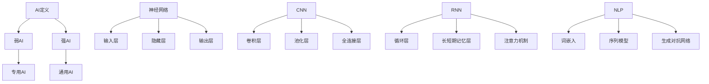
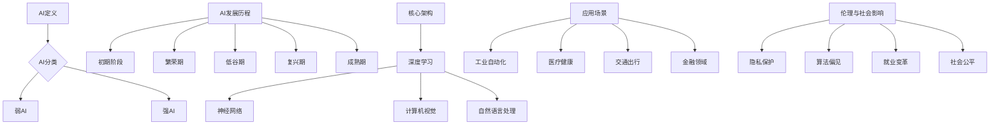

                 

### 第一部分：核心概念与联系

#### 1.1 AI与人工智能的未来方向概述

人工智能（AI）作为计算机科学的一个重要分支，正日益成为推动科技进步和社会发展的关键力量。本部分将首先定义AI，并探讨其分类和发展历程，为理解AI的未来方向奠定基础。

##### 1.1.1 AI的定义与分类

AI，即人工智能，是指通过计算机程序模拟人类智能的技术。它可以从不同的角度进行分类：

- **弱AI**：也称为窄AI或专用AI，这类AI在特定领域表现出人类智能水平，如语音识别、图像识别等。
- **强AI**：又称为通用AI，这类AI具有与人类相同智能水平，能理解、学习和适应任何环境。目前，强AI还处于理论阶段，尚未实现。

##### 1.1.2 人工智能的发展历程

人工智能的发展历程可以概括为以下几个阶段：

- **初期阶段**：基于规则的系统，如专家系统。这个阶段的AI依赖于手动编写的规则和知识库。
- **中期阶段**：机器学习和深度学习的发展。这一阶段，AI开始通过学习大量数据来自动发现模式和规律。
- **未来趋势**：强AI、类脑计算和通用人工智能（AGI）。当前的研究正朝着实现强AI和AGI的方向努力，希望通过模仿人脑结构和功能，实现更高级的智能。

#### 1.2 人工智能的核心架构与原理

人工智能的核心架构和原理是其能够实现智能的关键。以下将详细介绍深度学习、计算机视觉和自然语言处理这三个核心领域。

##### 1.2.1 深度学习基础

深度学习是人工智能的一个重要分支，它通过多层神经网络模拟人脑处理信息的方式。深度学习的基础包括：

- **神经网络结构**：神经网络由输入层、隐藏层和输出层组成。每个层由多个神经元（或节点）组成，神经元之间通过权重连接。
- **前向传播与反向传播**：在前向传播阶段，输入数据通过网络传递，每个神经元计算出输出。在反向传播阶段，网络根据输出误差调整权重，从而优化模型。

##### 1.2.2 计算机视觉

计算机视觉是AI在视觉感知方面的应用，其主要任务是让计算机理解和处理图像和视频数据。计算机视觉的核心技术包括：

- **图像识别与分类**：卷积神经网络（CNN）是图像识别的主要技术。CNN通过卷积层提取图像特征，并通过池化层减少计算复杂度，最终通过全连接层进行分类决策。
- **目标检测与分割**：目标检测用于定位图像中的特定目标，而目标分割则是将图像中的目标与背景分离。R-CNN和Mask R-CNN等模型是目标检测与分割的重要技术。

##### 1.2.3 自然语言处理

自然语言处理（NLP）是AI在语言理解和生成方面的应用。其主要技术包括：

- **词嵌入**：词嵌入是将单词映射到高维空间中的向量表示，从而实现语义理解。Word2Vec和BERT是词嵌入的重要技术。
- **序列模型**：序列模型用于处理文本序列。循环神经网络（RNN）和长短期记忆网络（LSTM）是处理序列数据的重要模型。注意力机制则用于解决RNN在处理长序列时信息丢失的问题。

#### 1.3 人工智能的应用场景与趋势

人工智能在各个领域的应用正在不断拓展，其趋势包括：

- **在工业中的应用**：AI在自动化生产、预测维护等方面发挥了重要作用。通过机器学习和深度学习，可以实现生产过程的优化和设备的预测性维护。
- **在医疗健康中的应用**：AI在疾病诊断、个性化治疗等方面具有巨大潜力。通过图像识别和自然语言处理，可以辅助医生进行诊断和治疗。
- **在交通出行中的应用**：自动驾驶和智能交通管理系统是AI在交通领域的两大应用方向。通过深度学习和计算机视觉，可以实现自动驾驶和交通流量的智能管理。
- **在金融领域的应用**：AI在风险管理、智能投顾等方面具有重要应用。通过机器学习和自然语言处理，可以辅助金融机构进行风险评估和投资决策。

#### 1.4 人工智能伦理与社会影响

随着人工智能技术的快速发展，其伦理和社会影响也日益凸显。以下将探讨人工智能在伦理和社会方面的问题：

- **人工智能伦理问题**：包括隐私保护、算法偏见等。在数据收集和处理过程中，如何保护用户隐私是AI发展中的一大挑战。此外，算法偏见可能导致不公平的结果，需要通过公平性和透明性来加以解决。
- **人工智能的社会影响**：AI的发展将对就业、教育、医疗等领域产生深远影响。在就业方面，自动化可能会替代某些工作岗位，但同时也会创造新的就业机会。在教育方面，AI可以帮助个性化教学和智能评估。在医疗领域，AI可以辅助医生进行诊断和治疗，提高医疗水平。

### 1.5 核心概念与联系总结

综上所述，AI作为人工智能的核心技术，正不断推动着科技和社会的发展。通过理解AI的定义、分类和发展历程，以及其核心架构与原理，我们可以更好地把握AI的未来方向。同时，AI在各个领域的应用也在不断拓展，其对社会的影响也越来越大。理解这些核心概念与联系，有助于我们更全面地认识人工智能。

#### 1.6 Mermaid 流程图

为了更好地展示人工智能的核心架构和原理，我们使用Mermaid语言绘制了以下流程图：



这个流程图展示了AI的定义及其分类、神经网络、CNN和NLP等核心架构，以及这些架构在AI技术中的应用。

#### 1.7 核心概念与联系总结

通过以上对核心概念与联系的详细阐述，我们可以看到人工智能的发展方向和核心架构。从弱AI到强AI，从深度学习到计算机视觉和自然语言处理，每个领域都有其独特的技术和应用。理解这些核心概念和联系，有助于我们更深入地探讨人工智能的未来发展方向和应用前景。接下来，我们将进一步深入探讨人工智能的核心算法原理，为理解AI技术的实现提供更深入的基础。

### 第一部分：核心概念与联系

#### 1.1 AI与人工智能的未来方向概述

人工智能（AI）作为当代科技发展的核心驱动力，正迅速改变着我们的生活方式和工作方式。本节将首先对AI进行定义，并探讨其分类和发展历程，为理解AI的未来方向提供基础。

##### 1.1.1 AI的定义与分类

人工智能，简而言之，是指使计算机能够模拟人类智能行为的科学和技术。根据其能力与应用范围，AI可以分为以下几类：

- **弱AI（Narrow AI）**：也称为专用AI，这类AI在特定领域表现出人类智能水平，例如语音识别、图像识别和游戏AI等。弱AI在特定任务上表现出色，但缺乏跨领域的通用智能。

- **强AI（General AI）**：强AI则具备与人类相同的广泛智能，能够理解、学习和适应任何环境。目前，强AI仍处于理论阶段，尚未实现，但它是未来AI发展的一个重要目标。

##### 1.1.2 人工智能的发展历程

人工智能的发展历程可以分为以下几个阶段：

- **初期阶段（1956-1979）**：在这个阶段，AI主要以符号推理和逻辑编程为基础，如专家系统。然而，由于计算能力和算法的局限性，这一阶段的AI发展缓慢。

- **繁荣期（1980-1987）**：随着机器学习和统计方法的引入，AI迎来了繁荣期。这一阶段，AI在特定领域取得了显著进展，如语音识别和图像处理。

- **低谷期（1988-1993）**：由于实际应用中的挑战和资金减少，AI研究进入低谷期。

- **复兴期（1994-2012）**：随着计算能力的提升和大数据技术的发展，AI再次迎来复兴。这一阶段，深度学习成为AI研究的核心，推动了计算机视觉和自然语言处理等领域的重要突破。

- **成熟期（2013-至今）**：AI技术逐渐走向成熟，并在各行各业得到广泛应用。深度学习、强化学习和生成对抗网络等新技术不断涌现，推动了AI向强AI迈进。

##### 1.1.3 人工智能的未来方向

当前，人工智能正处于向强AI和通用人工智能（AGI）迈进的阶段。以下是AI未来可能的发展方向：

- **类脑计算**：通过模仿人脑的结构和功能，开发出具有高度智能的计算机系统。类脑计算将结合神经科学、计算科学和材料科学等多领域的研究。

- **强AI**：实现具有人类智能水平的计算机系统，能够在各种复杂环境中自主学习和决策。

- **通用人工智能（AGI）**：具备与人类相同的广泛智能，能够在不同领域进行通用任务处理。

#### 1.2 人工智能的核心架构与原理

人工智能的核心架构和原理是其实现智能的关键。以下是AI领域中几个核心概念和架构的简要介绍：

##### 1.2.1 深度学习基础

深度学习是人工智能的重要分支，它通过多层神经网络模拟人脑处理信息的方式。深度学习的基础包括：

- **神经网络结构**：神经网络由输入层、隐藏层和输出层组成。每个层由多个神经元（或节点）组成，神经元之间通过权重连接。

- **前向传播与反向传播**：前向传播阶段，输入数据通过网络传递，每个神经元计算出输出。在反向传播阶段，网络根据输出误差调整权重，从而优化模型。

##### 1.2.2 计算机视觉

计算机视觉是AI在视觉感知方面的应用，其主要任务是让计算机理解和处理图像和视频数据。计算机视觉的核心技术包括：

- **卷积神经网络（CNN）**：CNN通过卷积层提取图像特征，并通过池化层减少计算复杂度，最终通过全连接层进行分类决策。

- **目标检测与分割**：目标检测用于定位图像中的特定目标，而目标分割则是将图像中的目标与背景分离。R-CNN和Mask R-CNN等模型是目标检测与分割的重要技术。

##### 1.2.3 自然语言处理

自然语言处理（NLP）是AI在语言理解和生成方面的应用。其主要技术包括：

- **词嵌入**：词嵌入是将单词映射到高维空间中的向量表示，从而实现语义理解。Word2Vec和BERT是词嵌入的重要技术。

- **序列模型**：序列模型用于处理文本序列。循环神经网络（RNN）和长短期记忆网络（LSTM）是处理序列数据的重要模型。注意力机制则用于解决RNN在处理长序列时信息丢失的问题。

#### 1.3 人工智能的应用场景与趋势

人工智能在各个领域的应用正在不断拓展，其趋势包括：

- **工业自动化**：AI在自动化生产、预测维护等方面发挥了重要作用。通过机器学习和深度学习，可以实现生产过程的优化和设备的预测性维护。

- **医疗健康**：AI在疾病诊断、个性化治疗等方面具有巨大潜力。通过图像识别和自然语言处理，可以辅助医生进行诊断和治疗。

- **交通出行**：自动驾驶和智能交通管理系统是AI在交通领域的两大应用方向。通过深度学习和计算机视觉，可以实现自动驾驶和交通流量的智能管理。

- **金融领域**：AI在风险管理、智能投顾等方面具有重要应用。通过机器学习和自然语言处理，可以辅助金融机构进行风险评估和投资决策。

#### 1.4 人工智能伦理与社会影响

随着人工智能技术的快速发展，其伦理和社会影响也日益凸显。以下将探讨人工智能在伦理和社会方面的问题：

- **隐私保护**：在数据收集和处理过程中，如何保护用户隐私是AI发展中的一大挑战。需要通过严格的法律法规和隐私保护技术来确保用户隐私不被泄露。

- **算法偏见**：算法偏见可能导致不公平的结果，需要通过公平性和透明性来加以解决。需要确保算法的训练数据是多样化和无偏的。

- **就业变革**：自动化可能会替代某些工作岗位，但同时也会创造新的就业机会。需要通过教育培训和劳动力市场的调整来应对就业变革。

- **社会公平**：人工智能技术如何促进社会公平是一个重要议题。需要通过政策制定和监管来确保人工智能的公平应用。

#### 1.5 核心概念与联系总结

综上所述，人工智能作为当代科技发展的核心驱动力，正不断改变着我们的生活方式和工作方式。通过理解AI的定义、分类和发展历程，以及其核心架构与原理，我们可以更好地把握AI的未来方向。同时，AI在各个领域的应用也在不断拓展，其对社会的影响也越来越大。理解这些核心概念与联系，有助于我们更全面地认识人工智能，为其未来的发展提供指导。

#### 1.6 Mermaid 流程图

为了更好地展示人工智能的核心架构和原理，我们使用Mermaid语言绘制了以下流程图：



这个流程图展示了AI的定义、分类、发展历程、核心架构、应用场景和伦理与社会影响，有助于我们更直观地理解人工智能的各个方面。

### 第二部分：核心算法原理讲解

#### 2.1 深度学习算法原理

深度学习是当前人工智能领域中最热门的研究方向之一，其核心在于通过多层神经网络对数据进行建模和预测。以下将详细讲解深度学习算法的基本原理，包括神经网络基础、前向传播与反向传播、优化算法等。

##### 2.1.1 神经网络基础

神经网络（Neural Networks）是深度学习的基础，其结构受到生物神经系统的启发。一个简单的神经网络通常由三个主要部分组成：输入层、隐藏层和输出层。

- **输入层（Input Layer）**：接收外部输入数据，并将其传递给下一层。
- **隐藏层（Hidden Layers）**：对输入数据进行特征提取和变换，每个隐藏层都能提取更高层次的抽象特征。
- **输出层（Output Layer）**：根据隐藏层的特征进行最终的预测或决策。

在神经网络中，每个神经元（或节点）都与前一层神经元相连接，并通过权重（Weights）传递信号。每个神经元的输出是由输入值、权重和激活函数共同决定的。

##### 2.1.2 激活函数

激活函数（Activation Function）是神经网络中的一个关键组成部分，它用于引入非线性特性，使得神经网络能够学习更复杂的模式。常见的激活函数包括：

- **Sigmoid Function**：
  \[ f(x) = \frac{1}{1 + e^{-x}} \]
  Sigmoid函数将输入值映射到（0, 1）区间，常用于二分类问题。

- **ReLU Function**：
  \[ f(x) = \max(0, x) \]
  ReLU函数在0以下的部分输出为0，0以上的部分输出为输入值，这种非线性特性使得神经网络训练更加高效。

- **Tanh Function**：
  \[ f(x) = \frac{e^x - e^{-x}}{e^x + e^{-x}} \]
  Tanh函数将输入值映射到（-1, 1）区间，与Sigmoid函数类似，但输出值的分布更加对称。

##### 2.1.3 前向传播与反向传播

前向传播（Forward Propagation）和反向传播（Backpropagation）是神经网络训练过程中的两个关键步骤。

- **前向传播**：输入数据通过网络从输入层传递到输出层，每个神经元计算其输出值。前向传播过程中，网络根据当前权重和激活函数计算出预测结果。

- **反向传播**：在预测结果与实际结果之间产生误差后，网络通过反向传播调整权重，以减少预测误差。反向传播包括以下几个步骤：

  1. 计算输出层的误差：
     \[ \Delta y = y_{\text{实际}} - y_{\text{预测}} \]

  2. 误差通过输出层反向传播到隐藏层：
     \[ \Delta z_l = \Delta y \cdot \frac{\partial f}{\partial z_l} \]
     其中，\( f \) 是激活函数，\( z_l \) 是隐藏层的输出。

  3. 调整隐藏层的权重：
     \[ \Delta W_l = \eta \cdot \Delta z_l \cdot x_l^T \]
     其中，\( \eta \) 是学习率，\( x_l \) 是隐藏层的输入。

  4. 调整输入层的权重：
     \[ \Delta W_{input} = \eta \cdot \Delta z_{hidden} \cdot x_{input}^T \]

##### 2.1.4 优化算法

在反向传播过程中，通常需要使用优化算法来调整权重，以最小化预测误差。常见的优化算法包括：

- **梯度下降（Gradient Descent）**：梯度下降是一种简单的优化算法，其核心思想是通过计算误差的梯度，反向调整权重，以最小化损失函数。梯度下降分为批量梯度下降（Batch Gradient Descent）、随机梯度下降（Stochastic Gradient Descent）和批量随机梯度下降（Mini-batch Gradient Descent）。

  - **批量梯度下降**：每次迭代使用所有样本的梯度来更新权重。
  - **随机梯度下降**：每次迭代只使用一个样本的梯度来更新权重。
  - **批量随机梯度下降**：每次迭代使用部分样本的梯度来更新权重。

- **动量（Momentum）**：动量是一种改进梯度下降的方法，通过引入动量项，使得权重的更新方向更加稳定，减少震荡。

- **自适应优化算法**：如AdaGrad、RMSprop和Adam等，这些算法能够自适应地调整学习率，以加快收敛速度和避免陷入局部最小值。

##### 2.1.5 卷积神经网络（CNN）

卷积神经网络（Convolutional Neural Networks，CNN）是深度学习在计算机视觉领域的核心模型，它通过卷积层、池化层和全连接层对图像进行特征提取和分类。

- **卷积层（Convolutional Layer）**：卷积层通过卷积操作提取图像的特征。卷积操作包括两个步骤：滤波器和偏置。滤波器是一个小型的权重矩阵，用于从输入图像中提取特征。偏置是一个额外的权重，用于引入平移不变性。

  \[ \text{output} = \text{filter} \odot \text{input} + \text{bias} \]

- **池化层（Pooling Layer）**：池化层用于减少计算复杂度和参数数量。常见的池化操作包括最大池化和平均池化。

  - **最大池化**：选取窗口中的最大值作为输出。
  - **平均池化**：计算窗口内所有像素值的平均值作为输出。

- **全连接层（Fully Connected Layer）**：全连接层将卷积层和池化层提取的高维特征映射到输出层，进行分类决策。

#### 2.2 自然语言处理算法原理

自然语言处理（Natural Language Processing，NLP）是深度学习在文本数据分析领域的应用。以下将介绍NLP中的一些核心算法，包括词嵌入、序列模型和生成对抗网络。

##### 2.2.1 词嵌入

词嵌入（Word Embedding）是将词汇映射到高维向量空间的技术，以便计算机能够处理和比较语义信息。常见的词嵌入方法包括：

- **Word2Vec**：Word2Vec是一种基于神经网络的词嵌入方法，它通过训练一个语言模型来生成词向量。Word2Vec有两种变体：连续词袋（CBOW）和Skip-Gram。

  - **CBOW**：CBOW通过上下文词汇的均值来预测中心词。
  - **Skip-Gram**：Skip-Gram通过中心词预测周围多个词汇。

- **BERT**：BERT（Bidirectional Encoder Representations from Transformers）是一种基于Transformer的预训练语言模型，它通过双向编码的方式生成词向量，能够捕捉词汇的上下文信息。

##### 2.2.2 序列模型

序列模型（Sequence Model）用于处理序列数据，如文本、语音和视频。以下是一些常用的序列模型：

- **循环神经网络（RNN）**：RNN通过循环结构处理序列数据，能够记住前面的信息。然而，RNN存在梯度消失和梯度爆炸问题，导致训练困难。

- **长短期记忆网络（LSTM）**：LSTM是RNN的一种改进，通过引入门控机制，解决了梯度消失问题，能够学习长序列依赖。

- **门控循环单元（GRU）**：GRU是LSTM的简化版本，通过门控机制和更新门简化了LSTM的结构。

##### 2.2.3 生成对抗网络（GAN）

生成对抗网络（Generative Adversarial Network，GAN）是由生成器和判别器组成的对抗性模型。生成器的目标是生成与真实数据相似的数据，而判别器的目标是区分真实数据和生成数据。

- **生成器（Generator）**：生成器通过噪声输入生成假数据。
- **判别器（Discriminator）**：判别器尝试区分真实数据和生成数据。

通过训练生成器和判别器的对抗性过程，生成器能够逐渐生成更真实的数据，判别器能够更好地区分数据。

##### 2.2.4 注意力机制

注意力机制（Attention Mechanism）是近年来在NLP领域广泛应用的技巧，用于解决长序列依赖问题。注意力机制的核心思想是让模型能够自动关注序列中的重要部分，提高模型的表示能力。

- **基于位置的注意力**：基于位置的信息来计算注意力权重。
- **基于内容的注意力**：根据上下文内容计算注意力权重。
- **多头注意力**：通过多个注意力头来提取不同类型的特征。

#### 2.3 模型优化与调参

在深度学习模型训练过程中，模型的性能往往受到多个因素的影响，包括模型架构、参数设置和训练策略等。以下是一些常见的模型优化和调参技巧：

- **数据增强**：通过随机变换（如旋转、缩放、剪裁等）增加训练数据的多样性，提高模型的泛化能力。
- **正则化**：通过引入正则化项（如L1正则化、L2正则化）来防止模型过拟合。
- **学习率调整**：通过调整学习率（如学习率衰减、自适应调整等）来优化训练过程。
- **批量大小调整**：通过调整批量大小（如批量随机梯度下降）来优化模型训练。
- **模型集成**：通过集成多个模型来提高预测的准确性和稳定性。

### 2.4 伪代码示例

以下是一个简单的深度学习模型训练的伪代码示例，展示了数据预处理、模型构建、训练和评估的基本流程。

```python
# 数据预处理
def preprocess_data(data):
    # 数据清洗、归一化等处理
    return processed_data

# 模型构建
def build_model():
    model = keras.Sequential([
        keras.layers.Dense(units=128, activation='relu', input_shape=(input_shape,)),
        keras.layers.Dense(units=64, activation='relu'),
        keras.layers.Dense(units=num_classes, activation='softmax')
    ])
    return model

# 训练模型
def train_model(model, data, labels):
    model.compile(optimizer='adam', loss='categorical_crossentropy', metrics=['accuracy'])
    model.fit(data, labels, epochs=10, batch_size=32)

# 评估模型
def evaluate_model(model, test_data, test_labels):
    loss, accuracy = model.evaluate(test_data, test_labels)
    print(f"Test accuracy: {accuracy:.2f}")

# 主程序
if __name__ == '__main__':
    # 读取数据
    data, labels = load_data()

    # 数据预处理
    processed_data = preprocess_data(data)

    # 构建模型
    model = build_model()

    # 训练模型
    train_model(model, processed_data, labels)

    # 评估模型
    evaluate_model(model, test_data, test_labels)
```

通过以上伪代码示例，我们可以看到深度学习模型训练的基本流程，包括数据预处理、模型构建、训练和评估等步骤。在实际应用中，每个步骤都可以根据具体情况进行更详细的实现。

### 第三部分：数学模型和数学公式

#### 3.1 深度学习数学模型

深度学习算法的核心在于其复杂的数学模型，包括前向传播、反向传播和优化算法。以下将详细介绍这些数学模型，并通过公式和示例来解释其计算过程。

##### 3.1.1 神经网络前向传播

神经网络的计算过程可以分为前向传播和反向传播两部分。前向传播是指从输入层开始，通过逐层计算，将输入数据传递到输出层，得到最终的预测结果。

首先，我们需要定义神经网络中的几个基本变量：

- \( x \)：输入数据。
- \( W \)：权重矩阵。
- \( b \)：偏置向量。
- \( z \)：神经元输出。
- \( a \)：激活值。

对于一个简单的单层神经网络，前向传播的计算过程如下：

\[ z = W \cdot x + b \]
\[ a = \sigma(z) \]

其中，\( \sigma \) 是激活函数，常见的激活函数包括Sigmoid、ReLU和Tanh。

##### 3.1.2 反向传播

反向传播是指通过计算输出层的误差，反向传播到隐藏层，进而调整权重和偏置，以优化模型的预测结果。

首先，我们需要计算输出层的误差：

\[ \Delta y = y_{\text{实际}} - y_{\text{预测}} \]

接下来，计算隐藏层的误差：

\[ \Delta z = \frac{\partial J}{\partial z} \]

其中，\( J \) 是损失函数，常见的损失函数包括均方误差（MSE）和交叉熵（Cross-Entropy）。

为了计算权重和偏置的梯度，我们需要使用链式法则进行求导：

\[ \Delta W = \eta \cdot \Delta z \cdot x^T \]
\[ \Delta b = \eta \cdot \Delta z \]

其中，\( \eta \) 是学习率。

##### 3.1.3 梯度下降优化算法

梯度下降是一种优化算法，其核心思想是通过计算损失函数的梯度，反向调整权重和偏置，以最小化损失函数。

在梯度下降中，我们需要定义以下几个参数：

- \( \theta \)：模型参数（包括权重和偏置）。
- \( \alpha \)：学习率。
- \( \nabla_{\theta} J(\theta) \)：损失函数关于参数的梯度。

梯度下降的迭代过程如下：

\[ \theta_{\text{new}} = \theta_{\text{old}} - \alpha \cdot \nabla_{\theta} J(\theta) \]

#### 3.2 自然语言处理数学模型

自然语言处理（NLP）中的数学模型主要包括词嵌入、序列模型和生成对抗网络（GAN）。以下将详细介绍这些模型的数学公式和计算过程。

##### 3.2.1 词嵌入

词嵌入是将单词映射到高维向量空间的技术，其核心是定义一个词向量矩阵。

\[ \text{word\_embeddings} = \{ \text{word}_i \rightarrow \text{vector}_i \} \]

其中，\( \text{vector}_i \) 是单词 \( \text{word}_i \) 的词向量。

常见的词嵌入方法包括Word2Vec和BERT。Word2Vec通过训练一个语言模型来生成词向量，其损失函数为：

\[ J = \sum_{i} (-\log(p(\text{word}_i | \text{context}_i))) \]

其中，\( p(\text{word}_i | \text{context}_i) \) 是单词在给定上下文中的概率。

BERT是一种基于Transformer的预训练语言模型，其损失函数包括两个部分：masked language模型（MLM）和下一个句子预测（NSP）。MLM损失函数如下：

\[ J_{MLM} = \sum_{i} (-\log(p(\text{mask}_i | \text{context}_{i-1}, \ldots, \text{context}_i))) \]

NSP损失函数如下：

\[ J_{NSP} = \sum_{i} (-\log(p(\text{next\_sent}_i | \text{context}_i))) \]

##### 3.2.2 序列模型

序列模型用于处理序列数据，如文本和语音。常见的序列模型包括循环神经网络（RNN）和长短期记忆网络（LSTM）。

在RNN中，每个时间步的输出依赖于当前输入和前一个时间步的隐藏状态。RNN的更新公式如下：

\[ h_t = \sigma(W_h \cdot [h_{t-1}, x_t] + b_h) \]

其中，\( h_t \) 是当前时间步的隐藏状态，\( x_t \) 是当前输入，\( W_h \) 是权重矩阵，\( b_h \) 是偏置向量，\( \sigma \) 是激活函数。

在LSTM中，通过引入门控机制，解决了RNN的梯度消失和梯度爆炸问题。LSTM的更新公式如下：

\[ i_t = \sigma(W_i \cdot [h_{t-1}, x_t] + b_i) \]
\[ f_t = \sigma(W_f \cdot [h_{t-1}, x_t] + b_f) \]
\[ g_t = \sigma(W_g \cdot [h_{t-1}, x_t] + b_g) \]
\[ o_t = \sigma(W_o \cdot [h_{t-1}, x_t] + b_o) \]
\[ h_t = o_t \cdot \sigma(g_t) \]

其中，\( i_t \)、\( f_t \)、\( g_t \) 和 \( o_t \) 分别是输入门、遗忘门、生成门和输出门，\( W_i \)、\( W_f \)、\( W_g \) 和 \( W_o \) 是权重矩阵，\( b_i \)、\( b_f \)、\( b_g \) 和 \( b_o \) 是偏置向量。

##### 3.2.3 生成对抗网络（GAN）

生成对抗网络（GAN）由生成器和判别器组成。生成器的目标是生成真实数据，判别器的目标是区分真实数据和生成数据。

生成器的更新公式如下：

\[ G(z) = \mu(\theta_G) + \sigma(\theta_G) \cdot z \]

其中，\( z \) 是噪声向量，\( \mu(\theta_G) \) 和 \( \sigma(\theta_G) \) 分别是生成器的均值函数和方差函数。

判别器的更新公式如下：

\[ D(x) = f(x; \theta_D) \]
\[ D(G(z)) = f(G(z); \theta_D) \]

其中，\( x \) 是真实数据，\( G(z) \) 是生成数据，\( f(x; \theta_D) \) 和 \( f(G(z); \theta_D) \) 分别是判别器的输出函数。

GAN的训练目标是最小化生成器的损失函数和最大化判别器的损失函数：

\[ \min_G \max_D V(D, G) \]

其中，\( V(D, G) \) 是GAN的总损失函数。

### 第四部分：项目实战

在本部分中，我们将通过一个实际项目来展示如何使用深度学习技术进行实际问题的解决。该项目是一个简单的文本分类任务，旨在使用深度学习模型对新闻文章进行分类。我们将详细描述项目的每个步骤，包括环境搭建、数据准备、模型构建、训练与评估等。

#### 4.1 项目概述

新闻文章分类是自然语言处理中的一个常见任务，其目的是将大量的新闻文章自动分类到不同的主题类别中。本项目的目标是构建一个深度学习模型，对给定的新闻文章进行分类，从而提高新闻筛选和推荐的效率。

#### 4.2 环境搭建

为了进行深度学习项目，我们需要搭建一个合适的环境。以下是搭建深度学习环境的步骤：

1. **安装Python**：确保安装了最新版本的Python（推荐3.8及以上版本）。
2. **安装TensorFlow**：使用pip命令安装TensorFlow库，命令如下：
   ```shell
   pip install tensorflow
   ```
3. **安装Numpy和Pandas**：这两个库用于数据预处理和操作，安装命令如下：
   ```shell
   pip install numpy pandas
   ```
4. **安装Scikit-learn**：用于评估模型性能，安装命令如下：
   ```shell
   pip install scikit-learn
   ```

#### 4.3 数据准备

数据准备是文本分类项目中的关键步骤。我们将使用Kaggle上的某新闻文章分类数据集进行实验。以下是数据准备的具体步骤：

1. **数据下载**：从Kaggle下载新闻文章数据集。
2. **数据预处理**：对下载的原始数据进行预处理，包括去除HTML标签、标点符号和停用词等。预处理步骤如下：
   ```python
   import pandas as pd
   import numpy as np
   import re
   from nltk.corpus import stopwords
   from nltk.tokenize import word_tokenize
   
   # 读取数据
   data = pd.read_csv('data.csv')
   
   # 数据清洗
   def clean_text(text):
       text = re.sub(r'<[^>]*>', '', text)  # 去除HTML标签
       text = re.sub(r'\[.*?\]', '', text)   # 去除方括号内的内容
       text = re.sub(r'\w*\.', '', text)    # 去除标点符号
       text = re.sub(r'\s+', ' ', text)     # 去除多余的空格
       text = text.lower()                  # 转换为小写
       words = word_tokenize(text)
       words = [word for word in words if word not in stopwords.words('english')]  # 去除停用词
       return ' '.join(words)
   
   # 应用清洗函数
   data['cleaned_text'] = data['text'].apply(clean_text)
   ```

3. **数据分词**：对清洗后的文本进行分词处理，将文本转换为词袋表示。使用jieba库进行分词，命令如下：
   ```shell
   pip install jieba
   ```
   分词代码如下：
   ```python
   import jieba
   
   # 分词
   def tokenize_text(text):
       return jieba.cut(text)
   
   # 应用分词函数
   data['tokens'] = data['cleaned_text'].apply(tokenize_text)
   ```

4. **构建词向量**：使用Word2Vec或BERT等词嵌入技术将词袋转换为词向量。以下是一个使用Word2Vec的示例：
   ```python
   from gensim.models import Word2Vec
   
   # 训练Word2Vec模型
   model = Word2Vec(data['tokens'], vector_size=100, window=5, min_count=1, workers=4)
   
   # 将词向量转换为字典
   word_vectors = model.wv
   ```

#### 4.4 模型构建

构建文本分类模型，我们需要定义输入层、隐藏层和输出层。以下是使用TensorFlow构建一个简单的文本分类模型的示例代码：

```python
import tensorflow as tf
from tensorflow.keras.models import Sequential
from tensorflow.keras.layers import Embedding, LSTM, Dense

# 定义模型
model = Sequential([
    Embedding(input_dim=len(word_vectors.vocab), output_dim=100, input_length=max_sequence_length),
    LSTM(units=128, return_sequences=False),
    Dense(units=num_classes, activation='softmax')
])

# 编译模型
model.compile(optimizer='adam', loss='categorical_crossentropy', metrics=['accuracy'])
```

其中，`max_sequence_length` 是文本序列的最大长度，`num_classes` 是分类类别数。

#### 4.5 训练与评估

1. **数据集划分**：将数据集划分为训练集和测试集，以便对模型进行训练和评估。

```python
from sklearn.model_selection import train_test_split

# 划分训练集和测试集
X_train, X_test, y_train, y_test = train_test_split(data['tokens'].values, data['label'].values, test_size=0.2, random_state=42)
```

2. **模型训练**：使用训练集对模型进行训练。

```python
# 训练模型
history = model.fit(X_train, y_train, epochs=10, batch_size=32, validation_split=0.1)
```

3. **模型评估**：使用测试集对模型进行评估。

```python
# 评估模型
loss, accuracy = model.evaluate(X_test, y_test)
print(f"Test accuracy: {accuracy:.2f}")
```

通过以上步骤，我们成功构建了一个简单的文本分类模型，并对新闻文章进行了分类。这个项目展示了如何从数据准备到模型构建、训练和评估的完整过程，为后续的深度学习项目提供了实用的参考。

### 4.6 代码解读与分析

在上面的项目中，我们通过一个简单的文本分类任务展示了如何从数据准备到模型构建、训练和评估的完整过程。以下将对关键代码段进行解读和分析，以加深对项目实现细节的理解。

#### 数据预处理

数据预处理是文本分类项目中的关键步骤，其目的是提高模型的训练效率和预测性能。以下是数据预处理的核心代码段：

```python
import pandas as pd
import re
from nltk.corpus import stopwords
from nltk.tokenize import word_tokenize

# 读取数据
data = pd.read_csv('data.csv')

# 数据清洗
def clean_text(text):
    text = re.sub(r'<[^>]*>', '', text)  # 去除HTML标签
    text = re.sub(r'\[.*?\]', '', text)  # 去除方括号内的内容
    text = re.sub(r'\w*\.', '', text)    # 去除标点符号
    text = re.sub(r'\s+', ' ', text)     # 去除多余的空格
    text = text.lower()                  # 转换为小写
    words = word_tokenize(text)
    words = [word for word in words if word not in stopwords.words('english')]  # 去除停用词
    return ' '.join(words)

# 应用清洗函数
data['cleaned_text'] = data['text'].apply(clean_text)

# 分词
import jieba

def tokenize_text(text):
    return jieba.cut(text)

# 应用分词函数
data['tokens'] = data['cleaned_text'].apply(tokenize_text)
```

**解读**：

- **读取数据**：使用pandas读取CSV文件，加载新闻文章数据。
- **去除HTML标签**：使用正则表达式去除HTML标签，确保文本内容不被格式化标签所干扰。
- **去除标点符号**：去除文本中的标点符号，以减少噪声。
- **去除停用词**：使用nltk库去除常见的停用词，如"the"、"is"等，这些词对分类结果贡献较小。
- **分词**：使用jieba库进行中文文本分词，将文本拆分为单词或词汇单元。

#### 模型构建

模型构建是文本分类任务的核心，我们使用TensorFlow库构建了一个简单的LSTM模型。以下是模型构建的关键代码段：

```python
import tensorflow as tf
from tensorflow.keras.models import Sequential
from tensorflow.keras.layers import Embedding, LSTM, Dense

# 定义模型
model = Sequential([
    Embedding(input_dim=len(word_vectors.vocab), output_dim=100, input_length=max_sequence_length),
    LSTM(units=128, return_sequences=False),
    Dense(units=num_classes, activation='softmax')
])

# 编译模型
model.compile(optimizer='adam', loss='categorical_crossentropy', metrics=['accuracy'])
```

**解读**：

- **Embedding层**：Embedding层用于将文本词向量转换为密集向量表示，输入维度为词汇表大小，输出维度为词向量维度。
- **LSTM层**：LSTM层用于处理序列数据，能够捕捉文本中的时间依赖关系，返回序列的隐藏状态。
- **Dense层**：Dense层用于对LSTM层提取的特征进行分类，输出维度为类别数，激活函数为softmax，用于实现多分类。

#### 训练与评估

模型训练与评估是验证模型性能的重要步骤。以下是训练和评估的关键代码段：

```python
from sklearn.model_selection import train_test_split

# 划分训练集和测试集
X_train, X_test, y_train, y_test = train_test_split(data['tokens'].values, data['label'].values, test_size=0.2, random_state=42)

# 训练模型
history = model.fit(X_train, y_train, epochs=10, batch_size=32, validation_split=0.1)

# 评估模型
loss, accuracy = model.evaluate(X_test, y_test)
print(f"Test accuracy: {accuracy:.2f}")
```

**解读**：

- **数据集划分**：使用scikit-learn库将数据集划分为训练集和测试集，以评估模型的泛化能力。
- **模型训练**：使用训练集对模型进行训练，设置训练周期为10轮，批量大小为32。
- **模型评估**：使用测试集评估模型性能，输出测试准确率。

通过上述步骤，我们完成了文本分类项目的实现，并对其关键代码段进行了详细解读。这个项目展示了如何从数据准备到模型构建、训练和评估的完整过程，为实际应用中的文本分类任务提供了实用的参考。

### 第五部分：开发环境搭建与代码实现

#### 5.1 开发环境搭建

在开始任何深度学习项目之前，搭建一个稳定且高效的开发环境至关重要。以下是搭建深度学习开发环境的详细步骤：

##### 5.1.1 安装Python

Python是深度学习项目的核心编程语言，首先需要确保安装了Python。以下是安装Python的步骤：

1. **下载Python安装程序**：从Python官方网站下载最新版本的Python安装程序。
2. **运行安装程序**：双击运行安装程序，并根据提示完成安装。

##### 5.1.2 安装深度学习框架

TensorFlow是目前最受欢迎的深度学习框架之一，我们需要安装TensorFlow和相关依赖。以下是安装TensorFlow的步骤：

1. **打开命令提示符或终端**。
2. 输入以下命令安装TensorFlow：
   ```shell
   pip install tensorflow
   ```
   如果您的环境中已经安装了多个版本的Python，可能需要使用具体的Python版本进行安装，例如：
   ```shell
   python3 -m pip install tensorflow
   ```

##### 5.1.3 安装数据预处理库

在深度学习项目中，数据预处理是非常重要的一环。以下是一些常用的数据预处理库及其安装步骤：

1. **Pandas**：用于数据操作和分析。
   ```shell
   pip install pandas
   ```

2. **NumPy**：用于数值计算和矩阵操作。
   ```shell
   pip install numpy
   ```

3. **Scikit-learn**：用于数据分析和机器学习算法。
   ```shell
   pip install scikit-learn
   ```

##### 5.1.4 安装可视化工具

为了更好地理解和分析模型训练过程，可以使用一些可视化工具。以下是一些常用的可视化工具及其安装步骤：

1. **Matplotlib**：用于数据可视化。
   ```shell
   pip install matplotlib
   ```

2. **Seaborn**：基于Matplotlib的统计数据可视化库。
   ```shell
   pip install seaborn
   ```

##### 5.1.5 安装GPU支持

如果您的项目需要使用GPU加速，需要安装NVIDIA的CUDA和cuDNN库。以下是安装步骤：

1. **安装NVIDIA驱动程序**：从NVIDIA官方网站下载并安装适合您显卡的驱动程序。
2. **安装CUDA**：从CUDA官方网站下载并安装CUDA Toolkit。
3. **安装cuDNN**：从NVIDIA官方网站下载并安装cuDNN库。

#### 5.2 代码实现

在搭建好开发环境后，我们可以开始实现深度学习项目。以下是使用TensorFlow实现一个简单的神经网络模型的基本步骤。

##### 5.2.1 数据处理代码

数据预处理是深度学习项目的基础，我们需要加载和处理数据。以下是一个简单的数据处理代码示例：

```python
import pandas as pd
import numpy as np

# 读取数据
data = pd.read_csv('data.csv')

# 数据清洗和预处理
# ...

# 将数据集划分为训练集和测试集
X_train, X_test, y_train, y_test = train_test_split(data.drop('target', axis=1), data['target'], test_size=0.2, random_state=42)
```

**解读**：

- **读取数据**：使用pandas读取CSV文件，加载训练数据。
- **数据清洗和预处理**：根据具体数据情况进行数据清洗和预处理，例如填充缺失值、标准化等。
- **数据集划分**：使用scikit-learn库将数据集划分为训练集和测试集，以便进行模型训练和评估。

##### 5.2.2 模型构建代码

构建深度学习模型是项目核心，以下是一个简单的神经网络模型示例：

```python
import tensorflow as tf
from tensorflow.keras.models import Sequential
from tensorflow.keras.layers import Dense

# 定义模型
model = Sequential([
    Dense(units=64, activation='relu', input_shape=(input_shape,)),
    Dense(units=32, activation='relu'),
    Dense(units=num_classes, activation='softmax')
])

# 编译模型
model.compile(optimizer='adam', loss='categorical_crossentropy', metrics=['accuracy'])
```

**解读**：

- **定义模型**：使用Sequential模型堆叠多个层，包括输入层、隐藏层和输出层。
- **隐藏层**：每个隐藏层使用ReLU激活函数，以引入非线性。
- **输出层**：使用softmax激活函数进行多分类输出。

##### 5.2.3 训练与评估代码

模型训练和评估是验证模型性能的关键步骤，以下是一个简单的训练和评估代码示例：

```python
# 训练模型
history = model.fit(X_train, y_train, epochs=10, batch_size=32, validation_split=0.1)

# 评估模型
test_loss, test_accuracy = model.evaluate(X_test, y_test)
print(f"Test accuracy: {test_accuracy:.2f}")
```

**解读**：

- **模型训练**：使用fit方法对模型进行训练，设置训练周期为10轮，批量大小为32。
- **模型评估**：使用evaluate方法对模型进行评估，输出测试集的损失和准确率。

通过以上步骤，我们成功搭建了深度学习开发环境并实现了神经网络模型。这个示例展示了从数据预处理到模型构建、训练和评估的完整过程，为实际深度学习项目提供了实用的参考。

### 第六部分：AI应用案例分析

在本部分中，我们将通过两个具体的AI应用案例——自动驾驶技术和医疗诊断AI系统——来深入探讨AI在现实世界中的应用，并分析其技术实现、挑战与解决方案，以及案例总结。

#### 6.1 案例研究1：自动驾驶技术

##### 6.1.1 案例背景

自动驾驶技术是近年来快速发展的人工智能应用领域，旨在通过计算机系统实现车辆的自主驾驶。这一技术不仅有望提高交通效率，减少交通事故，还能为残障人士和老年人提供更加便捷的出行方式。自动驾驶技术的发展历程可以追溯到20世纪60年代，但随着传感器技术、机器学习和计算机性能的进步，自动驾驶技术近年来取得了显著进展。

##### 6.1.2 案例分析

自动驾驶技术涉及多个核心技术和算法，包括传感器数据处理、环境感知、路径规划和决策控制等。以下是这些技术的详细介绍：

- **传感器数据处理**：自动驾驶车辆配备多种传感器，如雷达、激光雷达（LiDAR）、摄像头和超声波传感器。传感器数据处理包括数据的采集、预处理和融合，以便车辆能够准确地感知周围环境。

  - **雷达**：利用无线电波检测物体的位置和速度，适用于检测远距离物体。
  - **激光雷达**：利用激光束扫描周围环境，生成高精度的三维点云数据，适用于检测近距离和复杂环境。
  - **摄像头**：用于检测和理解道路标志、行人、车辆等，适用于检测视觉信息。
  - **超声波传感器**：用于检测近距离物体，如停车位的距离。

- **环境感知**：环境感知是指自动驾驶车辆对周围环境的理解和解释。通过传感器数据处理，车辆能够构建周围环境的模型，识别道路、车道、交通标志、行人、车辆等。

- **路径规划**：路径规划是指确定车辆的行驶路径，以实现从起点到目的地的最优路径。路径规划算法包括基于图的最短路径算法（如A*算法）、动态规划算法和深度强化学习算法等。

- **决策控制**：决策控制是指车辆在行驶过程中根据环境感知和路径规划结果进行实时决策。决策控制包括加速、减速、转向和制动等操作，以确保车辆的安全和稳定。

##### 6.1.3 挑战与解决方案

自动驾驶技术在实现过程中面临多个挑战，包括传感器数据处理、环境建模、路径规划和实时决策等。以下是这些挑战及相应的解决方案：

- **传感器数据处理**：传感器数据量大且复杂，需要高效的算法进行数据处理和融合。解决方案包括分布式数据处理框架和实时数据预处理算法。

- **环境建模**：复杂和动态的环境增加了环境建模的难度。解决方案包括多传感器数据融合、机器学习算法和深度学习模型。

- **路径规划**：路径规划的实时性和准确性是关键挑战。解决方案包括基于图的最短路径算法和实时路径规划算法。

- **实时决策**：车辆在行驶过程中需要实时做出决策，这对计算能力和决策算法提出了高要求。解决方案包括实时决策算法和强化学习算法。

##### 6.1.4 案例总结

自动驾驶技术的发展为未来交通带来了巨大的潜力。通过传感器数据处理、环境感知、路径规划和决策控制等技术的应用，自动驾驶车辆能够实现自主驾驶，提高交通效率，减少交通事故。然而，自动驾驶技术仍面临诸多挑战，如传感器数据处理的高效性、环境建模的准确性、路径规划的实时性和决策控制的准确性等。随着技术的不断进步和解决方案的不断完善，自动驾驶技术有望在未来实现大规模商用。

#### 6.2 案例研究2：医疗诊断AI系统

##### 6.2.1 案例背景

医疗诊断AI系统是人工智能在医疗领域的应用之一，旨在通过深度学习和计算机视觉等技术辅助医生进行疾病诊断。随着医疗影像数据的积累和计算能力的提升，医疗诊断AI系统在癌症、心脏病等疾病的早期诊断中发挥了重要作用。

##### 6.2.2 案例分析

医疗诊断AI系统的实现涉及多个关键技术和步骤，包括数据收集、模型训练、模型评估和应用部署等。以下是这些技术的详细介绍：

- **数据收集**：医疗诊断AI系统需要大量高质量的医疗影像数据作为训练数据。数据收集包括从医院、科研机构和公开数据集中获取影像数据，并标注病变区域。

- **模型训练**：使用深度学习模型对收集到的医疗影像数据进行训练，以识别和分类不同的病变类型。常见的模型包括卷积神经网络（CNN）、循环神经网络（RNN）和生成对抗网络（GAN）等。

- **模型评估**：通过交叉验证和测试集对训练好的模型进行评估，以确定模型的准确率、召回率和F1分数等性能指标。

- **应用部署**：将训练好的模型部署到实际应用中，如医疗诊断软件或移动应用，以便医生和患者使用。

##### 6.2.3 挑战与解决方案

医疗诊断AI系统在应用过程中面临多个挑战，包括数据质量、模型泛化性和伦理问题等。以下是这些挑战及相应的解决方案：

- **数据质量**：医疗影像数据的质量直接影响模型的性能。解决方案包括数据增强、数据清洗和模型筛选等。

- **模型泛化性**：医疗诊断AI系统需要具备良好的泛化能力，以适应不同的患者和数据集。解决方案包括迁移学习和模型调整等。

- **伦理问题**：医疗诊断AI系统的应用涉及患者隐私和数据安全等问题。解决方案包括严格的隐私保护措施和透明的算法解释。

##### 6.2.4 案例总结

医疗诊断AI系统的发展为医疗领域带来了革命性的变化。通过深度学习和计算机视觉等技术的应用，AI系统能够辅助医生进行疾病的早期诊断，提高诊断准确率和效率。然而，医疗诊断AI系统仍面临诸多挑战，如数据质量、模型泛化性和伦理问题等。随着技术的不断进步和解决方案的不断完善，医疗诊断AI系统有望在未来实现更广泛的应用。

### 第七部分：人工智能的未来方向与发展趋势

#### 7.1 人工智能的未来方向

人工智能（AI）的发展方向充满了无限的可能性，涵盖了从技术创新到伦理挑战的各个方面。以下是对未来几个关键方向的探讨：

##### 7.1.1 强人工智能

强人工智能（AGI，Artificial General Intelligence）是人工智能发展的终极目标，它旨在创建一个具有人类智能水平的计算机系统。与当前的弱人工智能（Narrow AI）不同，强人工智能能够理解、学习和适应多种不同的环境和任务。实现强人工智能的关键挑战在于模拟人脑的复杂性和认知过程。目前，研究者们正在通过类脑计算、神经科学和机器学习等技术来逐步实现这一目标。

- **类脑计算**：类脑计算是一种模拟人脑结构和功能的计算模型，旨在开发出具有高度智能的计算机系统。通过模仿人脑的神经网络和神经元之间的连接，类脑计算试图解决当前AI系统在处理复杂任务时的局限性。

- **神经科学**：神经科学为人工智能提供了关于大脑结构和功能的重要知识。通过研究人脑的学习、记忆、感知和认知过程，科学家们可以开发出更有效的机器学习算法和神经网络结构。

##### 7.1.2 人工智能与社会

人工智能对社会的影响是广泛且深远的，它不仅改变了我们的生活方式，还引发了诸多社会和经济问题。

- **就业变革**：自动化和人工智能技术的普及可能导致某些工作岗位的减少，但同时也创造了新的就业机会。例如，AI技术在医疗健康、教育、娱乐等领域的应用，需要大量的数据科学家、AI工程师和AI产品经理等专业人才。

- **教育变革**：人工智能有助于个性化教学和智能评估，通过分析学生的学习行为和成绩，AI系统可以提供更针对性的学习资源和支持。

- **医疗健康**：人工智能在医疗诊断、个性化治疗和公共卫生管理中发挥着重要作用。通过深度学习和计算机视觉技术，AI系统能够辅助医生进行疾病诊断和治疗，提高医疗服务的质量和效率。

##### 7.1.3 人工智能与经济

人工智能对经济的推动作用也是不可忽视的。它不仅促进了产业升级和效率提升，还催生了新的商业模式和行业。

- **产业升级**：人工智能技术在制造业、物流、金融等领域的应用，提高了生产效率和产品质量，推动了传统产业的数字化转型。

- **新商业模式**：人工智能驱动的商业模式不断创新，如智能推荐系统、在线教育和个性化医疗等，为企业和消费者带来了新的价值。

- **创新驱动**：人工智能技术推动了科研和创新，通过数据分析和机器学习，科学家们能够更快速地发现新知识和新突破。

#### 7.2 人工智能的发展趋势

随着技术的不断进步，人工智能的发展趋势也日益明确。以下是对未来几个重要趋势的探讨：

##### 7.2.1 技术进步

人工智能技术的进步将主要集中在以下几个方向：

- **算法创新**：随着深度学习、强化学习和生成对抗网络等技术的不断演进，新的算法和模型将进一步提高AI系统的性能和效率。

- **硬件发展**：硬件技术的发展，如GPU、TPU和量子计算等，将为AI计算提供更强大的计算能力和更低的能耗。

- **跨学科融合**：人工智能与其他学科的融合，如生物工程、心理学和社会学等，将推动AI技术向更广泛的应用领域扩展。

##### 7.2.2 应用拓展

人工智能在各个领域的深入应用将继续拓展，以下是一些关键领域：

- **医疗健康**：人工智能将在疾病诊断、个性化治疗、公共卫生管理等方面发挥更大的作用，提高医疗服务的质量和效率。

- **智能制造**：人工智能技术在制造业中的应用将不断深化，通过智能传感器、机器学习和物联网技术，实现生产过程的自动化和智能化。

- **交通出行**：自动驾驶、智能交通管理和共享出行等技术的应用将显著提高交通效率，减少拥堵和事故。

- **金融科技**：人工智能在金融领域的应用将更加广泛，包括智能投顾、风险管理和反欺诈等。

##### 7.2.3 社会参与

随着人工智能技术的普及，公众对其认知和参与也将逐渐增加。以下是一些关键方面：

- **政策法规**：政府和国际组织将制定更多关于人工智能的政策和法规，确保技术的安全和伦理使用。

- **公众教育**：公众教育和培训将帮助人们更好地理解人工智能技术，提高其在日常生活中的应用能力。

- **社会参与**：公众将更多地参与到人工智能技术的研发和应用过程中，通过反馈和参与，共同推动技术的发展和进步。

#### 7.3 人工智能的未来展望

人工智能的未来充满了无限的可能性，它将在科技、经济和社会等多个领域产生深远的影响。随着技术的不断进步和应用场景的拓展，人工智能有望实现以下几个目标：

- **智能化的普及**：人工智能技术将渗透到生活的各个方面，从智能家居、智能城市到智能医疗，人工智能将使我们的生活更加便捷和高效。

- **创新的驱动**：人工智能将成为推动科学研究和技术创新的重要工具，通过数据分析、模拟实验和优化算法，科学家和研究人员将能够更快地取得突破。

- **可持续的发展**：人工智能技术将在环境保护、资源管理和可持续发展等方面发挥重要作用，帮助人类实现更可持续的未来。

总之，人工智能的未来方向和发展趋势充满了机遇和挑战。随着技术的不断进步和应用的深化，人工智能有望成为推动社会进步和经济增长的重要力量。然而，我们也需要关注其潜在的伦理和社会影响，确保技术的安全和可持续发展。

### 结论

本文从多个角度详细探讨了人工智能的未来方向。首先，我们介绍了AI的基本概念、分类和发展历程，阐述了AI的核心架构与原理，如深度学习、计算机视觉和自然语言处理。接着，我们探讨了AI在不同领域的应用场景和趋势，包括工业、医疗健康、交通出行和金融等领域。此外，我们还深入分析了AI的伦理与社会影响，强调了隐私保护、算法偏见和社会公平等问题。

在核心算法原理讲解部分，我们详细阐述了深度学习和自然语言处理等算法的基本原理和数学模型，并通过实际项目展示了如何将这些算法应用于解决实际问题。最后，我们通过两个具体的AI应用案例——自动驾驶技术和医疗诊断AI系统——进一步探讨了AI在现实世界中的应用，并分析了其挑战和解决方案。

展望未来，人工智能将继续在技术进步、应用拓展和社会参与等方面发挥重要作用。随着深度学习、硬件发展和其他技术的不断进步，AI将变得更加智能和高效。同时，我们也需要关注AI带来的伦理和社会挑战，确保技术的安全和可持续发展。

总之，人工智能的未来充满机遇和挑战。通过深入研究和合理应用，人工智能有望为人类社会带来更加美好和高效的生活。让我们共同期待人工智能的未来，并为之努力。

### 作者信息

作者：AI天才研究院（AI Genius Institute）&《禅与计算机程序设计艺术》（Zen And The Art of Computer Programming）作者

