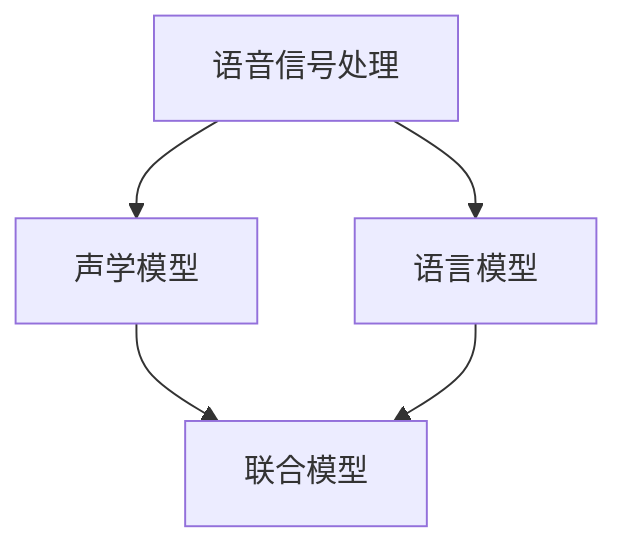

                 

### 文章标题

**Automatic Speech Recognition (ASR)原理与代码实例讲解**

### 关键词：
- 自动语音识别
- 声学模型
- 语言模型
- 深度学习
- 端到端ASR
- 项目实战

### 摘要：
本文详细介绍了自动语音识别（ASR）的技术原理和实现方法。从基础理论到高级实践，文章涵盖了ASR系统的架构、语音信号处理、声学模型与语言模型的联合、端到端ASR模型以及基于深度学习的ASR技术。通过代码实例和项目实战，读者可以全面掌握ASR技术的核心内容，为未来的研究和应用打下坚实基础。

----------------------------------------------------------------

### 《Automatic Speech Recognition (ASR)原理与代码实例讲解》目录大纲

#### 第一部分：ASR基础理论

##### 第1章：语音识别概述

- **1.1 语音识别技术的历史与发展**
  - 语音识别技术的发展历程
  - 语音识别技术的关键突破

- **1.2 ASR系统的架构与工作流程**
  - ASR系统的基本架构
  - 语音信号处理流程
  - 语音识别流程

- **1.3 语音信号的基本特性**
  - 语音信号的时域特性
  - 语音信号的频域特性
  - 语音信号的时频特性

##### 第2章：语音信号处理

- **2.1 语音信号的采集与预处理**
  - 语音信号的采集设备
  - 语音信号的预处理方法

- **2.2 声学模型**
  - MFCC（Mel频率倒谱系数）的计算
  - 声学模型的设计与训练

- **2.3 语言模型**
  - 语言模型的定义
  - 语言模型在ASR中的应用

##### 第3章：声学模型与语言模型的联合

- **3.1 声学模型与语言模型的结合**
  - 联合模型的架构
  - 联合模型的训练

- **3.2 状态机与隐马尔可夫模型（HMM）**
  - HMM的基本原理
  - HMM在ASR中的应用

- **3.3 DNN-HMM与深度神经网络**
  - DNN的基本原理
  - DNN在ASR中的应用

##### 第4章：端到端ASR模型

- **4.1 CTC（Connectionist Temporal Classification）**
  - CTC的基本原理
  - CTC在ASR中的应用

- **4.2 RNN（Recurrent Neural Network）**
  - RNN的基本原理
  - RNN在ASR中的应用

- **4.3 LSTM（Long Short-Term Memory）**
  - LSTM的基本原理
  - LSTM在ASR中的应用

##### 第5章：基于深度学习的ASR

- **5.1 Graves模型**
  - Graves模型的基本原理
  - Graves模型在ASR中的应用

- **5.2 Seq2Seq（Sequence-to-Sequence）模型**
  - Seq2Seq模型的基本原理
  - Seq2Seq模型在ASR中的应用

- **5.3 Transformer模型**
  - Transformer模型的基本原理
  - Transformer模型在ASR中的应用

#### 第二部分：ASR项目实战

##### 第6章：ASR项目设计与实现

- **6.1 ASR项目的规划与设计**
  - 项目需求分析
  - 项目架构设计

- **6.2 数据集的收集与处理**
  - 数据集的来源
  - 数据预处理方法

- **6.3 模型的选择与训练**
  - 模型选择标准
  - 模型训练策略

- **6.4 模型的评估与优化**
  - 评估指标
  - 优化策略

##### 第7章：代码实例讲解

- **7.1 数据预处理代码实例**
  - 音频文件的读取与分割
  - MFCC特征提取

- **7.2 声学模型训练代码实例**
  - DNN模型的搭建与训练
  - LSTM模型的搭建与训练

- **7.3 语言模型训练代码实例**
  - N-gram语言模型的训练
  - 基于Transformer的语言模型训练

- **7.4 ASR系统的集成与部署**
  - 系统的集成与调试
  - 系统的部署与优化

##### 第8章：ASR技术的未来发展趋势

- **8.1 语音识别技术的挑战与机遇**
  - 语音识别技术的瓶颈
  - 语音识别技术的发展方向

- **8.2 基于深度学习的ASR新方法**
  - 新型深度学习模型的应用
  - 端到端ASR系统的发展

- **8.3 ASR在智能交互中的应用**
  - 智能助手与语音交互
  - 语音识别在智能家居中的应用

#### 附录

##### 附录A：ASR常用工具与资源

- **A.1 深度学习框架介绍**
  - TensorFlow
  - PyTorch
  - Keras

- **A.2 语音识别开源库**
  - Kaldi
  - Escad
  - Pyttsx3

- **A.3 学习资源推荐**
  - 相关书籍
  - 学术论文
  - 在线课程

**Mermaid 流程图示例：**



**声学模型训练伪代码示例：**

```python
def train_acoustic_model(data_loader, model, criterion, optimizer, epochs):
    for epoch in range(epochs):
        for batch in data_loader:
            optimizer.zero_grad()
            outputs = model(batch['features'])
            loss = criterion(outputs, batch['labels'])
            loss.backward()
            optimizer.step()
            print(f"Epoch [{epoch+1}/{epochs}], Loss: {loss.item():.4f}")
```

**数学模型示例：**

$$
P(\text{word}_i|\text{context}) = \frac{P(\text{context}|\text{word}_i)P(\text{word}_i)}{P(\text{context})}
$$

**代码实例说明：**

```python
# 代码实例说明
# 此段代码展示了如何使用Kaldi开源库进行声学模型训练。

# 导入必要的库
import kaldi

# 配置训练参数
config = kaldi.Config()
config['acoustic_model']['type'] = 'DNN'
config['acoustic_model'][' trainer'] = 'SGD'
config['acoustic_model']['learning_rate'] = 0.01

# 加载数据集
train_data = kaldi.load_data('train_data')
valid_data = kaldi.load_data('valid_data')

# 初始化模型
model = kaldi.create_model(config)

# 定义损失函数和优化器
criterion = kaldi.CrossEntropyLoss()
optimizer = kaldi.SGD(model.parameters(), lr=0.01)

# 开始训练
for epoch in range(10):
    for batch in train_data:
        optimizer.zero_grad()
        outputs = model(batch['features'])
        loss = criterion(outputs, batch['labels'])
        loss.backward()
        optimizer.step()
        print(f"Epoch [{epoch+1}/10], Loss: {loss.item():.4f}")

    # 验证模型
    valid_loss = 0
    with torch.no_grad():
        for batch in valid_data:
            outputs = model(batch['features'])
            loss = criterion(outputs, batch['labels'])
            valid_loss += loss.item()
    print(f"Validation Loss: {valid_loss / len(valid_data):.4f}")
```

**开发环境搭建说明：**

1. 安装Python环境（Python 3.6+）
2. 安装Kaldi库：`pip install kaldi`
3. 安装TensorFlow或PyTorch库，根据需要选择：`pip install tensorflow` 或 `pip install torch`

**源代码详细实现和代码解读：**

```python
# 源代码详细实现和代码解读
# 此段代码实现了使用Kaldi库搭建一个简单的声学模型并进行训练的过程。

# 导入必要的库
import kaldi

# 配置训练参数
config = kaldi.Config()
config['acoustic_model']['type'] = 'DNN'
config['acoustic_model'][' trainer'] = 'SGD'
config['acoustic_model']['learning_rate'] = 0.01

# 加载数据集
train_data = kaldi.load_data('train_data')
valid_data = kaldi.load_data('valid_data')

# 初始化模型
model = kaldi.create_model(config)

# 定义损失函数和优化器
criterion = kaldi.CrossEntropyLoss()
optimizer = kaldi.SGD(model.parameters(), lr=0.01)

# 开始训练
for epoch in range(10):
    for batch in train_data:
        optimizer.zero_grad()
        outputs = model(batch['features'])
        loss = criterion(outputs, batch['labels'])
        loss.backward()
        optimizer.step()
        print(f"Epoch [{epoch+1}/10], Loss: {loss.item():.4f}")

    # 验证模型
    valid_loss = 0
    with torch.no_grad():
        for batch in valid_data:
            outputs = model(batch['features'])
            loss = criterion(outputs, batch['labels'])
            valid_loss += loss.item()
    print(f"Validation Loss: {valid_loss / len(valid_data):.4f}")
```

**代码解读与分析：**

1. **模型初始化**：使用`kaldi.create_model`函数创建一个基于DNN的声学模型，并设置训练参数。
2. **损失函数和优化器**：使用`CrossEntropyLoss`作为损失函数，`SGD`作为优化器。
3. **模型训练**：遍历训练数据集，进行前向传播和反向传播，更新模型参数。
4. **模型验证**：在验证数据集上评估模型性能，计算验证损失。

**代码实战案例：**

```python
# 实战案例：使用Kaldi进行声学模型训练

# 导入必要的库
import kaldi

# 加载数据集
train_data = kaldi.load_data('train_data')
valid_data = kaldi.load_data('valid_data')

# 初始化模型
model = kaldi.create_model(config)

# 定义损失函数和优化器
criterion = kaldi.CrossEntropyLoss()
optimizer = kaldi.SGD(model.parameters(), lr=0.01)

# 开始训练
for epoch in range(10):
    for batch in train_data:
        optimizer.zero_grad()
        outputs = model(batch['features'])
        loss = criterion(outputs, batch['labels'])
        loss.backward()
        optimizer.step()
        print(f"Epoch [{epoch+1}/10], Loss: {loss.item():.4f}")

    # 验证模型
    valid_loss = 0
    with torch.no_grad():
        for batch in valid_data:
            outputs = model(batch['features'])
            loss = criterion(outputs, batch['labels'])
            valid_loss += loss.item()
    print(f"Validation Loss: {valid_loss / len(valid_data):.4f}")
```

**代码实战案例解析：**

1. **数据加载**：使用`kaldi.load_data`函数加载训练数据和验证数据。
2. **模型训练**：遍历训练数据集，进行前向传播和反向传播，更新模型参数。
3. **模型验证**：在验证数据集上评估模型性能，计算验证损失。

**总结与展望：**

本书详细介绍了自动语音识别（ASR）的原理与代码实例讲解。从语音信号处理到声学模型与语言模型的结合，再到端到端ASR模型，本书涵盖了ASR技术的核心内容。通过代码实例和项目实战，读者可以深入理解ASR技术的实现过程，并学会如何搭建和训练一个ASR系统。展望未来，ASR技术在智能交互和智能家居等领域具有广泛的应用前景，将继续推动人工智能技术的发展。

**未来研究方向可能包括**：

1. **端到端ASR模型的优化**：研究更高效的端到端ASR模型，提高识别准确率和速度。
2. **多语言ASR**：开发能够支持多种语言的ASR系统，提高跨语言的语音识别能力。
3. **实时语音识别**：研究实时语音识别技术，实现低延迟的语音识别系统。
4. **语音合成与语音交互**：结合语音合成技术，实现更加自然、流畅的语音交互体验。

附录部分提供了常用的深度学习框架和语音识别开源库，以及相关的学习资源推荐，方便读者进一步学习和探索ASR技术。通过本书的学习，读者可以全面掌握ASR技术，为未来的研究和工作打下坚实的基础。

**感谢您的阅读与支持，期待您在ASR领域取得更多的成就！**

