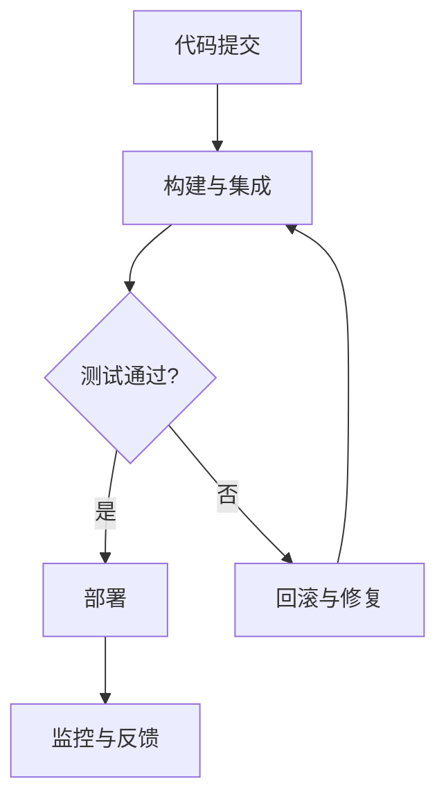
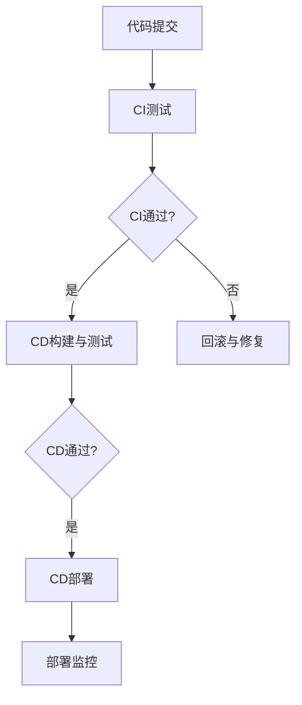
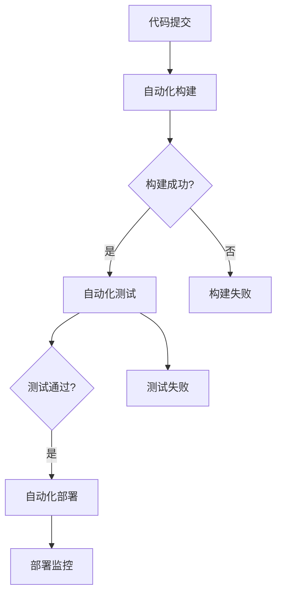
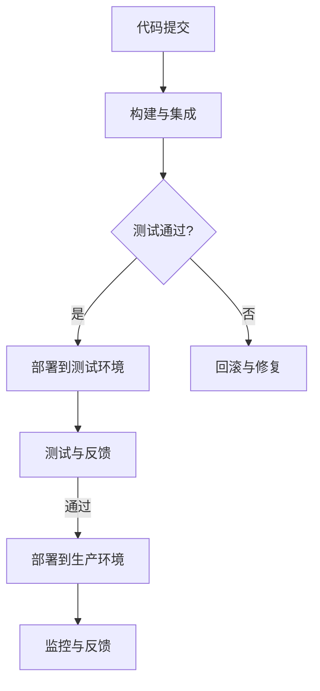

                 

### 《CI/CD管道：自动化软件交付流程》

#### 引言

**目的**：本文旨在深入探讨CI/CD管道的概念及其在现代软件开发中的重要性。我们将逐步分析CI/CD的核心组成部分，介绍其主要组成部分及其在软件开发流程中的作用，最终阐述CI/CD对提高软件质量和交付效率的深远影响。

**内容**：本文将引出后续章节，概述CI/CD的概念及其发展历程。我们将解释CI/CD的核心原则，如持续集成、持续交付和持续部署，并介绍它们如何协同工作以优化软件交付流程。此外，本文还将简要介绍本文的结构和内容安排。

**引言概述**：

在当今快速发展的技术时代，软件开发的速度和质量是企业的核心竞争力。为了应对日益增长的市场需求和技术变革，软件开发团队需要一种高效、可靠的交付流程。持续集成（CI）和持续交付（CD）正是这种需求的解决方案。它们通过自动化和标准化软件交付过程，提高了软件的质量和可靠性。

持续集成（CI）是一种软件开发实践，旨在通过持续地合并和测试代码变更，确保代码库的稳定性。持续交付（CD）则在此基础上，进一步将软件交付到生产环境，实现快速、可靠的软件发布。持续部署（CD）是持续交付的一个子集，它自动将经过测试的代码部署到生产环境中。

CI/CD不仅仅是一种技术工具，更是一种文化转变。它要求团队成员紧密协作，共同维护代码库的完整性，并不断优化交付流程。这种文化转变有助于提高团队的效率和创新能力，从而在激烈的市场竞争中脱颖而出。

本文将分为三个部分，首先介绍CI/CD的基础概念，包括其定义、核心原则和组成部分。然后，我们将深入探讨持续集成、持续交付和持续部署的具体实践方法，包括使用工具和实际案例。接下来，我们将讨论CI/CD的实施策略、性能优化和安全性保障。最后，我们将通过案例分析、挑战与未来趋势以及团队协作与文化建设，进一步探讨CI/CD的最佳实践和未来发展。

通过本文的阅读，您将了解到CI/CD管道的原理和实践，掌握如何在现代软件开发中使用CI/CD，提高软件交付的质量和效率。

---

**关键词**：CI/CD，持续集成，持续交付，持续部署，自动化，软件交付，代码质量，交付流程。

**摘要**：

本文系统地介绍了CI/CD管道的概念和其在现代软件开发中的重要性。首先，我们探讨了CI/CD的定义、核心原则和组成部分，包括持续集成、持续交付和持续部署。接着，我们详细介绍了持续集成的概念、工具和实际案例，以及持续交付和持续部署的实现方法和最佳实践。随后，我们讨论了CI/CD的实施策略、性能优化和安全性保障。最后，通过案例分析、挑战与未来趋势以及团队协作与文化建设，我们总结了CI/CD的最佳实践和未来发展。本文旨在帮助读者深入理解CI/CD管道，掌握其在实际软件开发中的应用，以提高软件交付的质量和效率。

---

接下来，我们将开始第一部分：CI/CD基础，详细介绍CI/CD的概念、核心原则和组成部分。

### 第一部分：CI/CD基础

#### 第1章：CI/CD概述

##### 1.1 CI/CD的概念与起源

持续集成（Continuous Integration，简称CI）和持续交付（Continuous Delivery，简称CD）是现代软件开发中至关重要的实践。它们不仅提高了软件交付的效率和质量，还促进了团队成员之间的协作和沟通。

**定义**：

持续集成（CI）：持续集成是一种软件开发实践，旨在通过频繁地合并代码变更和自动化测试，确保代码库的稳定性和质量。每次代码提交后，都会触发一系列自动化测试，以确保新代码与现有代码兼容。

持续交付（CD）：持续交付是在持续集成的基础上，进一步将软件交付到生产环境的过程。它包括自动化构建、测试、部署和发布，以确保软件的高可用性和可靠性。

**起源与发展**：

CI/CD的概念起源于软件开发领域，最早由Jez Humble和David Farley在其2009年的著作《持续交付：软件交付和部署的实践》中提出。这本书详细阐述了CI/CD的理论和实践，并引起了业界广泛的关注。

随着云计算、容器化和微服务架构的兴起，CI/CD的理念得到了进一步的发展和完善。现代CI/CD工具和平台，如Jenkins、GitLab CI、GitHub Actions等，提供了强大的自动化功能，使得CI/CD的实现变得更加简单和高效。

**在现代软件开发中的角色**：

CI/CD在现代软件开发中扮演着关键角色，它不仅提高了软件交付的速度和质量，还有以下几方面的作用：

1. **提高代码质量**：通过自动化测试和代码审查，CI/CD确保了每次提交的代码都是可测试和可部署的，从而减少了代码中的错误和缺陷。
2. **加速交付周期**：自动化流程减少了手动操作，提高了开发效率，使得软件可以更快地交付给用户。
3. **促进团队协作**：CI/CD要求团队成员紧密协作，共同维护代码库的完整性，提高了团队之间的沟通和合作。
4. **降低风险**：通过持续集成和交付，及早发现问题并修复，降低了软件发布时的风险。
5. **增强用户满意度**：快速、可靠的软件交付能够更好地满足用户需求，提高用户满意度。

**CI/CD的基本流程**：

CI/CD的基本流程可以概括为以下步骤：

1. **代码提交**：开发者将代码提交到版本控制系统。
2. **集成和构建**：CI工具自动构建和集成代码，并运行自动化测试。
3. **测试和反馈**：测试结果将被记录和反馈，如果测试失败，将触发警报或通知开发人员。
4. **部署**：如果测试成功，软件将被部署到测试或生产环境。
5. **监控和反馈**：部署后的软件将持续监控，以确保其稳定性和性能。

通过这个流程，CI/CD确保了每次代码变更都是高质量的，且能够在最短时间内交付给用户。

**流程图**：

以下是一个简化的CI/CD基本流程的Mermaid流程图：



##### 1.2 CI/CD的核心原则

CI/CD的核心原则包括持续集成、持续交付和持续部署。这些原则共同构成了CI/CD的基础，并确保了软件的高质量和高效率交付。

**持续集成（CI）**：

持续集成是CI/CD的基础。其核心原则包括：

1. **频繁提交**：开发者应频繁地提交代码，以便及早发现和解决问题。
2. **自动化测试**：每次提交后，应自动运行一系列测试，以确保代码质量。
3. **快速反馈**：测试结果应迅速反馈给开发人员，以便他们及时修复问题。

持续集成的目标是确保代码库始终处于可构建和可部署的状态，从而减少集成风险。

**持续交付（CD）**：

持续交付在持续集成的基础上，进一步将软件交付到生产环境。其核心原则包括：

1. **自动化构建**：使用自动化工具构建软件，确保构建过程高效且可重复。
2. **自动化测试**：在构建完成后，应自动运行全面的测试，以确保软件质量。
3. **自动化部署**：将经过测试的软件自动部署到测试或生产环境，确保交付过程高效。

持续交付的目标是确保软件可以快速、可靠地交付给用户，从而提高客户满意度。

**持续部署（CD）**：

持续部署是持续交付的一个子集，其主要原则包括：

1. **自动化部署**：将经过测试的软件自动部署到生产环境，确保部署过程高效和可靠。
2. **零停机部署**：通过蓝绿部署或灰度发布等技术，实现零停机部署，确保服务的高可用性。

持续部署的目标是确保软件可以在生产环境中快速、可靠地部署，从而减少部署风险。

**流程图**：

以下是一个简化的CI/CD核心原则的Mermaid流程图：



通过遵循这些核心原则，CI/CD可以确保软件的高质量和高效率交付，从而提高开发团队的效率和客户满意度。

### 总结

本章详细介绍了CI/CD的概念、起源及其在现代软件开发中的重要性。我们首先解释了CI/CD的定义和核心原则，包括持续集成、持续交付和持续部署，并展示了它们如何协同工作以优化软件交付流程。接着，我们通过Mermaid流程图和伪代码，深入阐述了CI/CD的基本流程和核心算法原理。

在下一章中，我们将进一步探讨持续集成（CI）的具体实践方法，包括其概念、工具和实际案例。通过这些内容，读者将能够更好地理解如何在实际项目中实施CI，从而提高代码质量和交付效率。

### 第2章：持续集成（CI）

#### 2.1 持续集成的概念

持续集成（Continuous Integration，简称CI）是软件开发过程中的一种最佳实践，它通过频繁地将代码变更合并到主干分支，并自动化地执行一系列测试，确保代码库始终处于一个可构建和可部署的状态。持续集成不仅有助于发现和解决集成过程中出现的问题，还能提高开发团队的协作效率和代码质量。

**定义**：

持续集成是一种软件开发实践，通过将频繁的代码提交与自动化构建、测试和部署相结合，确保每次代码变更都不会破坏现有功能，从而保持代码库的稳定性。

**目标**：

持续集成的主要目标是：

1. **快速发现并解决集成错误**：通过自动化测试和快速反馈，及早发现和解决集成过程中出现的问题，避免积压和复杂的问题。
2. **保持代码库的稳定性**：确保每次代码提交都是高质量的，从而减少集成风险。
3. **提高开发效率**：自动化测试和构建过程减少了手动操作，提高了开发团队的效率。
4. **促进团队协作**：持续集成要求团队成员紧密协作，共同维护代码库的完整性。

**工作流程**：

持续集成的工作流程通常包括以下几个步骤：

1. **代码提交**：开发人员将他们的代码提交到版本控制系统，通常是一个主干分支或发布分支。
2. **自动化构建**：CI工具自动从版本控制系统获取代码，构建应用程序，并生成可执行文件或容器镜像。
3. **自动化测试**：构建完成后，CI工具会自动运行一系列预定义的测试，包括单元测试、集成测试和性能测试等，以确保新代码与现有代码兼容，并满足质量标准。
4. **反馈**：测试结果会立即反馈给开发人员和项目经理，如果测试失败，系统会生成详细的错误报告，帮助定位问题。
5. **部署**：如果测试成功，应用程序将被部署到测试或预生产环境，以便进一步测试和验证。
6. **持续监控**：部署后的应用程序将持续监控，确保其稳定性和性能符合预期。

**算法原理**：

持续集成中的自动化测试过程通常涉及以下算法原理：

1. **测试覆盖度**：确保测试覆盖率足够高，覆盖所有可能的情况和路径。
2. **回归测试**：每次代码变更后，运行整个测试套件，确保新代码不会引入新的错误。
3. **断言**：在测试中设置断言，验证预期结果是否与实际结果一致。
4. **异常处理**：测试过程中遇到异常，记录错误日志和堆栈跟踪，帮助定位问题。

**伪代码示例**：

以下是一个简化的持续集成自动化测试流程的伪代码示例：

```python
function ContinuousIntegration(code):
    if CheckSyntax(code):
        build = BuildApplication(code)
        if build.successful():
            test_suite = RunTestSuite(build)
            if test_suite.passed():
                DeployToTestEnvironment(build)
                MonitorAndFeedback(build)
            else:
                ReportTestFailure(test_suite.errors)
        else:
            ReportBuildFailure(build.errors)
    else:
        ReportSyntaxError(code.errors)
```

在这个伪代码中，`CheckSyntax`用于检查代码的语法，`BuildApplication`用于构建应用程序，`RunTestSuite`用于运行测试套件，`DeployToTestEnvironment`用于部署到测试环境，`MonitorAndFeedback`用于监控和反馈测试结果。

#### 2.2 持续集成工具

在持续集成（CI）实践中，选择合适的工具至关重要。市场上存在多种CI工具，每种工具都有其独特的功能和优点。以下是一些常用的持续集成工具，以及它们的优点和适用场景。

1. **Jenkins**：
   - **优点**：开源，插件丰富，支持多种集成环境，易于定制。
   - **适用场景**：适用于大型项目和团队，特别是需要高度定制化的集成流程。
   - **搭建过程**：
     1. 安装Jenkins。
     2. 添加Git插件和构建工具插件（如Maven或Gradle）。
     3. 配置项目，设置构建脚本和测试命令。
     4. 触发构建，查看构建日志和测试结果。

2. **Travis CI**：
   - **优点**：基于云的服务，支持多种编程语言，免费版适用于开源项目。
   - **适用场景**：适用于小型项目和开源项目，特别是需要跨平台测试的项目。
   - **搭建过程**：
     1. 在Travis CI上注册账户并绑定GitHub仓库。
     2. 配置`.travis.yml`文件，指定构建环境和测试命令。
     3. 提交代码，Travis CI自动触发构建和测试。

3. **GitLab CI**：
   - **优点**：与GitLab集成紧密，支持多种CI/CD工具，具有完整的生命周期管理。
   - **适用场景**：适用于企业内部项目和需要集成GitLab功能的团队。
   - **搭建过程**：
     1. 在GitLab仓库的`.gitlab-ci.yml`文件中定义构建流程。
     2. 配置GitLab Runner，使其能够执行构建和测试任务。
     3. 提交代码，GitLab CI自动触发构建和测试。

4. **GitHub Actions**：
   - **优点**：与GitHub集成紧密，免费版适用于个人项目和小型团队，具有灵活的工作流。
   - **适用场景**：适用于个人项目、小型团队和需要跨平台测试的项目。
   - **搭建过程**：
     1. 在GitHub仓库的`.github/workflows/`目录中创建工作流文件。
     2. 配置工作流，指定运行环境和操作步骤。
     3. 提交代码，GitHub Actions自动触发工作流。

**实际案例**：

以下是一个使用Jenkins实现持续集成的基本案例。

**场景**：一个使用Maven构建的Java项目，需要自动构建和测试。

**步骤**：

1. 安装Jenkins和Git插件。
2. 创建一个新项目，并配置Git源代码。
3. 添加Maven插件，配置Maven构建命令。
4. 添加JUnit插件，配置测试命令。
5. 配置构建触发器，例如每次代码提交或定期构建。

**配置文件**：

```xml
<project>
  <description>Java Maven Project CI</description>
  <scm>
    <git>
      <url>https://github.com/yourusername/yourproject</url>
    </git>
  </scm>
  <build>
    <plugins>
      <plugin>
        <groupId>org.jenkins-ci.plugins</groupId>
        <artifactId>git</artifactId>
        <version>4.6.0</version>
      </plugin>
      <plugin>
        <groupId>org.apache.maven.plugins</groupId>
        <artifactId>maven-antrun-plugin</artifactId>
        <version>3.0.0</version>
        <executions>
          <execution>
            <phase>compile</phase>
            <configuration>
              <target>
                <exec command="mvn clean test"/>
              </target>
            </configuration>
          </execution>
        </executions>
      </plugin>
    </plugins>
  </build>
  <trigger>
    <schedule>
      <cron */5 * * * ? *</cron>
    </schedule>
  </trigger>
</project>
```

在这个案例中，每次代码提交或每5分钟，Jenkins都会自动运行Maven的`clean test`命令，构建和测试项目。如果测试通过，Jenkins会生成报告并通知相关人员。

通过以上案例，读者可以了解到如何使用Jenkins实现持续集成的基本流程。接下来，我们将继续探讨持续交付（CD）的概念和实践方法。

### 第3章：持续交付（CD）

#### 3.1 持续交付的概念

持续交付（Continuous Delivery，简称CD）是持续集成（CI）的扩展和深化。它不仅确保代码库始终处于可集成和可部署状态，还进一步确保软件可以快速、可靠地交付到生产环境。持续交付的核心目标是实现从代码提交到生产部署的无缝流动，确保每次交付都是可用的、可靠的。

**定义**：

持续交付是一种软件开发实践，它通过自动化构建、测试、部署和发布过程，确保软件可以快速、可靠地交付到用户手中。持续交付强调在代码提交后，软件应始终处于可发布状态。

**目标**：

持续交付的主要目标是：

1. **确保每次交付都是可用的**：通过自动化测试和部署过程，确保每次交付的软件都是高质量和可用的。
2. **提高交付速度**：自动化流程减少了手动操作和等待时间，提高了交付速度。
3. **减少风险**：通过持续测试和部署，及早发现和解决问题，降低了生产部署的风险。
4. **提高客户满意度**：快速、可靠的交付能够更好地满足用户需求，提高客户满意度。

**实现方式**：

实现持续交付通常涉及以下几个步骤：

1. **自动化构建**：使用CI工具自动化构建应用程序，生成可执行文件或容器镜像。
2. **自动化测试**：构建完成后，运行全面的自动化测试，确保软件质量。
3. **自动化部署**：将经过测试的软件自动部署到测试或生产环境。
4. **持续监控**：部署后的软件将持续监控，确保其稳定性和性能符合预期。

**数学模型**：

在持续交付中，风险模型是一个关键因素。以下是一个简化的持续交付风险模型：

$$
R = P \times (1 - C)
$$

其中，\( R \) 表示风险，\( P \) 表示失败的概率，\( C \) 表示成功概率的补集。这个模型表明，风险与成功概率的补集成正比。通过提高自动化测试和部署的覆盖率（\( C \)），可以降低风险（\( R \)）。

**流程图**：

以下是一个简化的持续交付流程的Mermaid流程图：



在这个流程中，每次代码提交都会触发自动化构建和测试，确保软件处于可交付状态。如果构建或测试失败，系统会自动通知相关人员，并记录错误日志。

#### 3.2 持续交付工具

实现持续交付需要使用合适的工具。市场上存在多种持续交付工具，每种工具都有其独特的功能和优点。以下是一些常用的持续交付工具，以及它们的优点和适用场景。

1. **Docker**：
   - **优点**：容器化技术，简化了应用程序的部署和运维。
   - **适用场景**：适用于需要跨平台部署的应用程序，特别是微服务架构。
   - **使用方法**：
     1. 编写Dockerfile，定义应用程序的运行环境。
     2. 使用Docker命令构建容器镜像。
     3. 将容器镜像推送到Docker Hub或其他镜像仓库。

2. **Kubernetes**：
   - **优点**：容器编排和管理工具，提供自动部署、扩展和管理功能。
   - **适用场景**：适用于大型分布式系统，特别是需要高可用性和弹性伸缩的场景。
   - **使用方法**：
     1. 编写Kubernetes配置文件，定义部署、服务和网络等。
     2. 使用kubectl命令管理Kubernetes集群。
     3. 实现自动化部署和扩展，例如使用Helm进行包管理。

3. **Ansible**：
   - **优点**：自动化部署和管理工具，支持模块化配置。
   - **适用场景**：适用于自动化部署和配置管理，特别是云基础设施和虚拟化环境。
   - **使用方法**：
     1. 编写Ansible Playbook，定义部署任务。
     2. 执行Ansible Playbook，自动化执行部署和配置任务。

4. **Jenkins**：
   - **优点**：开源CI/CD工具，支持多种插件和集成。
   - **适用场景**：适用于各种规模的开发和运维项目，特别是需要高度定制化的CI/CD流程。
   - **使用方法**：
     1. 安装Jenkins和相应的插件。
     2. 创建Jenkins项目，配置构建和部署流程。
     3. 设置触发器和通知，自动化执行构建和部署任务。

**实际案例**：

以下是一个使用Docker和Kubernetes实现持续交付的基本案例。

**场景**：一个基于Spring Boot的Web应用程序，需要自动构建、测试和部署。

**步骤**：

1. 编写Dockerfile，定义应用程序的容器镜像。
2. 构建容器镜像并推送到Docker Hub。
3. 编写Kubernetes配置文件，定义部署和服务。
4. 使用kubectl部署应用程序到Kubernetes集群。

**Dockerfile**：

```Dockerfile
FROM openjdk:8-jdk-alpine
ARG JAR_FILE=target/*.jar
COPY ${JAR_FILE} app.jar
ENTRYPOINT ["java","-Djava.security.egd=file:/dev/./urandom","-jar","/app.jar"]
```

**Kubernetes配置文件**：

```yaml
apiVersion: apps/v1
kind: Deployment
metadata:
  name: spring-boot-app
spec:
  replicas: 1
  selector:
    matchLabels:
      app: spring-boot-app
  template:
    metadata:
      labels:
        app: spring-boot-app
    spec:
      containers:
      - name: spring-boot-app
        image: yourusername/spring-boot-app:latest
        ports:
        - containerPort: 8080
---
apiVersion: v1
kind: Service
metadata:
  name: spring-boot-app-service
spec:
  selector:
    app: spring-boot-app
  ports:
    - name: http
      port: 80
      targetPort: 8080
  type: LoadBalancer
```

在这个案例中，每次代码提交后，Jenkins会自动构建应用程序的容器镜像，并将其推送到Docker Hub。随后，Kubernetes会自动部署和更新应用程序，确保其始终处于最新状态。

通过以上案例，读者可以了解到如何使用Docker和Kubernetes实现持续交付的基本流程。接下来，我们将继续探讨持续部署（CD）的概念和实践方法。

### 第4章：持续部署（CD）

#### 4.1 持续部署的概念

持续部署（Continuous Deployment，简称CD）是持续交付（Continuous Delivery，简称CD）的一个子集，它通过自动化和持续地将经过测试的代码部署到生产环境，实现了从开发到生产的无缝流动。持续部署的核心目标是实现零停机、零风险的快速交付。

**定义**：

持续部署是一种软件开发实践，它通过自动化部署过程，确保每次代码变更都可以在生产环境中快速、可靠地部署。

**目标**：

持续部署的主要目标是：

1. **零停机交付**：通过蓝绿部署或灰度发布等技术，实现零停机部署，确保服务的高可用性。
2. **快速交付**：自动化部署减少了人工干预，提高了交付速度。
3. **降低风险**：通过自动化测试和监控，及早发现并解决问题，降低了部署风险。
4. **持续优化**：持续部署有助于持续优化部署流程，提高交付效率。

**步骤**：

持续部署通常包括以下几个步骤：

1. **代码提交**：开发人员将代码提交到版本控制系统。
2. **自动化构建和测试**：CI工具自动构建应用程序，并运行自动化测试，确保软件质量。
3. **自动化部署**：将经过测试的代码自动部署到生产环境。
4. **监控和反馈**：部署后，监控系统持续监控应用程序的运行状态，确保其稳定性和性能。
5. **回滚**：如果部署后出现问题，可以自动回滚到上一个版本。

**算法原理**：

持续部署中的自动化测试和部署策略通常涉及以下算法原理：

1. **滚动部署**：逐步将流量切换到新版本，确保旧版本仍可用。
2. **灰度发布**：逐步增加新版本的流量比例，确保稳定性和性能。
3. **蓝绿部署**：同时运行旧版本和新版本，确保无缝切换。
4. **回滚策略**：在部署失败时，自动回滚到上一个版本，确保服务可用性。

**伪代码示例**：

以下是一个简化的持续部署流程的伪代码示例：

```python
function ContinuousDeployment(code):
    build = BuildApplication(code)
    if build.successful():
        test_suite = RunTestSuite(build)
        if test_suite.passed():
            deploy = DeployToProduction(build)
            if deploy.successful():
                MonitorAndFeedback(deploy.status)
            else:
                RollbackToPreviousVersion()
        else:
            ReportTestFailure(test_suite.errors)
    else:
        ReportBuildFailure(build.errors)
```

在这个伪代码中，`BuildApplication`用于构建应用程序，`RunTestSuite`用于运行测试套件，`DeployToProduction`用于部署到生产环境，`MonitorAndFeedback`用于监控和反馈部署状态。

#### 4.2 持续部署实践

在实际项目中实施持续部署需要考虑多个方面，包括部署策略、工具选择和最佳实践。以下是一些常见的方法和实践。

**部署策略**：

1. **滚动部署**：逐步将流量切换到新版本，确保旧版本仍可用。滚动部署适用于新版本与旧版本差异较小的情况。
2. **蓝绿部署**：同时运行旧版本和新版本，确保无缝切换。蓝绿部署适用于版本差异较大或需要高可用性的场景。
3. **灰度发布**：逐步增加新版本的流量比例，确保稳定性和性能。灰度发布适用于需要对新版本进行逐步推广的情况。

**工具选择**：

1. **Jenkins**：适用于各种规模的持续部署项目，特别是需要高度定制化的流程。
2. **Kubernetes**：适用于容器化应用，提供自动化部署、扩展和管理功能。
3. **Ansible**：适用于自动化部署和配置管理，特别适合于云基础设施和虚拟化环境。

**最佳实践**：

1. **自动化测试**：确保每次部署前都进行全面的自动化测试，减少部署风险。
2. **持续监控**：部署后，持续监控应用程序的运行状态，确保其稳定性和性能。
3. **回滚策略**：在部署失败时，自动回滚到上一个版本，确保服务可用性。
4. **自动化文档**：记录部署流程和配置，便于后续维护和更新。
5. **团队协作**：持续部署要求团队成员紧密协作，共同维护部署流程。

**实际案例**：

以下是一个使用Kubernetes实现持续部署的基本案例。

**场景**：一个使用Spring Boot的Web应用程序，需要自动构建、测试和部署。

**步骤**：

1. 编写Dockerfile，定义应用程序的容器镜像。
2. 构建容器镜像并推送到Docker Hub。
3. 编写Kubernetes配置文件，定义部署和服务。
4. 使用kubectl部署应用程序到Kubernetes集群。

**Dockerfile**：

```Dockerfile
FROM openjdk:8-jdk-alpine
ARG JAR_FILE=target/*.jar
COPY ${JAR_FILE} app.jar
ENTRYPOINT ["java","-Djava.security.egd=file:/dev/./urandom","-jar","/app.jar"]
```

**Kubernetes配置文件**：

```yaml
apiVersion: apps/v1
kind: Deployment
metadata:
  name: spring-boot-app
spec:
  replicas: 1
  selector:
    matchLabels:
      app: spring-boot-app
  template:
    metadata:
      labels:
        app: spring-boot-app
    spec:
      containers:
      - name: spring-boot-app
        image: yourusername/spring-boot-app:latest
        ports:
        - containerPort: 8080
---
apiVersion: v1
kind: Service
metadata:
  name: spring-boot-app-service
spec:
  selector:
    app: spring-boot-app
  ports:
    - name: http
      port: 80
      targetPort: 8080
  type: LoadBalancer
```

在这个案例中，每次代码提交后，Jenkins会自动构建应用程序的容器镜像，并将其推送到Docker Hub。Kubernetes会自动部署和更新应用程序，确保其始终处于最新状态。

通过以上案例，读者可以了解到如何使用Kubernetes实现持续部署的基本流程。接下来，我们将继续讨论CI/CD的实施策略和性能优化方法。

### 第5章：CI/CD实施策略

#### 5.1 CI/CD实施步骤

实施CI/CD管道是一个复杂的过程，需要精心规划和管理。以下是一些关键步骤，帮助团队成功实施CI/CD：

**1. 确定目标和需求**：

在实施CI/CD之前，首先需要明确目标和需求。这些目标可能包括提高代码质量、缩短交付周期、减少风险等。了解这些目标有助于确定CI/CD管道的具体需求和功能。

**2. 环境准备**：

准备CI/CD所需的环境，包括版本控制系统、CI/CD工具、测试环境和生产环境。确保所有环境都是稳定和可用的。

**3. 选择合适的CI/CD工具**：

选择适合团队需求的CI/CD工具。市面上有很多流行的工具，如Jenkins、GitLab CI、GitHub Actions等。评估这些工具的功能、性能和集成能力，选择最适合的工具。

**4. 设计CI/CD流程**：

设计CI/CD流程，包括代码提交、构建、测试、部署和监控等步骤。确保流程高效且可重复，减少手动操作。

**5. 配置CI/CD工具**：

根据设计好的CI/CD流程，配置CI/CD工具。这包括配置版本控制系统、构建脚本、测试脚本和部署脚本等。

**6. 实施和测试**：

开始实施CI/CD流程，并进行彻底的测试。确保所有步骤都能正常工作，并满足预期目标。

**7. 持续改进**：

CI/CD实施后，持续监控和优化流程。收集反馈，识别瓶颈和改进点，不断优化CI/CD流程。

**数学模型**：

在CI/CD实施过程中，可以使用成本效益分析（CBA）来评估CI/CD流程的成本和效益。以下是一个简化的成本效益分析模型：

$$
\text{ROI} = \frac{\text{效益} - \text{成本}}{\text{成本}}
$$

其中，ROI（投资回报率）表示CI/CD实施的效益与成本之比。通过优化CI/CD流程，可以减少成本和提高效益，从而提高ROI。

**实际案例**：

以下是一个企业级项目实施CI/CD的实际案例。

**场景**：一家大型互联网公司需要实施CI/CD管道，以提高软件交付速度和质量。

**步骤**：

1. 确定目标和需求：缩短交付周期、提高代码质量、减少风险等。
2. 环境准备：搭建版本控制系统、CI/CD工具（Jenkins）、测试环境和生产环境。
3. 选择CI/CD工具：评估Jenkins、GitLab CI和GitHub Actions，最终选择Jenkins。
4. 设计CI/CD流程：包括代码提交、构建、测试、部署和监控等步骤。
5. 配置Jenkins：安装Jenkins插件，配置Git、Maven、JUnit等。
6. 实施和测试：开始实施CI/CD流程，并进行彻底的测试。
7. 持续改进：监控CI/CD流程，收集反馈，识别瓶颈和改进点。

通过以上步骤，该互联网公司成功实施了CI/CD管道，显著提高了软件交付速度和质量。

#### 5.2 CI/CD工具选择

在选择CI/CD工具时，团队需要考虑多个因素，包括功能、性能、集成能力和成本。以下是一些常用的CI/CD工具，以及它们的优缺点和适用场景。

**1. Jenkins**：

- **优点**：开源、插件丰富、支持多种集成环境、易于定制。
- **缺点**：配置复杂、性能可能下降、维护成本较高。
- **适用场景**：适用于大型项目和团队，特别是需要高度定制化的CI/CD流程。

**2. GitLab CI**：

- **优点**：与GitLab集成紧密、支持多种CI/CD工具、具有完整的生命周期管理。
- **缺点**：性能可能较低、学习曲线较陡。
- **适用场景**：适用于企业内部项目和需要集成GitLab功能的团队。

**3. GitHub Actions**：

- **优点**：与GitHub集成紧密、免费版适用于个人项目和小型团队、具有灵活的工作流。
- **缺点**：免费版功能有限、性能可能较低。
- **适用场景**：适用于个人项目、小型团队和需要跨平台测试的项目。

**4. GitLab CI/CD**：

- **优点**：集成GitLab的功能、支持多种CI/CD工具、易于使用。
- **缺点**：可能需要更高的硬件资源、性能可能较低。
- **适用场景**：适用于企业内部项目和需要集成GitLab功能的团队。

**5. Azure DevOps**：

- **优点**：与Microsoft生态系统集成紧密、提供全面的开发和运维工具。
- **缺点**：成本较高、学习曲线较陡。
- **适用场景**：适用于大型企业和需要集成Microsoft服务的项目。

**对比分析**：

以下是对Jenkins、GitLab CI、GitHub Actions和GitLab CI/CD的对比分析：

| 工具       | 优点                 | 缺点                 | 适用场景                    |
|------------|----------------------|----------------------|------------------------------|
| Jenkins    | 开源、插件丰富       | 配置复杂、性能可能下降 | 大型项目和需要定制化的团队   |
| GitLab CI  | 与GitLab集成紧密     | 性能可能较低         | 企业内部项目和GitLab用户     |
| GitHub Actions | 与GitHub集成紧密   | 免费版功能有限       | 个人项目和小型团队         |
| GitLab CI/CD | 集成GitLab的功能   | 可能需要更高的硬件资源 | 企业内部项目和GitLab用户     |

通过对比分析，团队可以根据自身需求和资源选择最合适的CI/CD工具。

### 第6章：CI/CD性能优化

#### 6.1 性能指标

CI/CD性能优化是确保持续集成和持续交付流程高效运行的关键环节。为了量化CI/CD的性能，我们需要定义和监控一系列关键性能指标（Key Performance Indicators, KPIs）。以下是一些常见的CI/CD性能指标：

1. **构建时间**：构建时间是指从代码提交到构建完成所需的时间。较短的构建时间可以提高开发效率。
2. **测试覆盖率**：测试覆盖率是测试用例覆盖代码比例的度量，较高的测试覆盖率可以确保代码质量。
3. **部署成功率**：部署成功率是部署过程中成功完成的比例。较高的成功率表明部署过程稳定。
4. **代码质量**：代码质量是通过静态代码分析和动态测试评估的，它反映了代码的可靠性和可维护性。
5. **资源利用率**：资源利用率是CI/CD环境中CPU、内存和存储等资源的使用情况，高效的资源利用率可以降低成本。

**数学公式**：

为了优化这些性能指标，我们可以使用以下数学公式来计算和评估：

1. **构建时间**：

   $$ \text{构建时间} = \frac{\text{总构建时间}}{\text{构建次数}} $$

2. **测试覆盖率**：

   $$ \text{测试覆盖率} = \frac{\text{已覆盖的代码行数}}{\text{总代码行数}} \times 100\% $$

3. **部署成功率**：

   $$ \text{部署成功率} = \frac{\text{成功部署次数}}{\text{总部署次数}} \times 100\% $$

4. **资源利用率**：

   $$ \text{资源利用率} = \frac{\text{实际资源使用量}}{\text{最大资源容量}} \times 100\% $$

#### 6.2 性能优化方法

优化CI/CD性能的方法包括代码优化、架构优化和工具优化。以下是一些具体的优化策略：

1. **代码优化**：

   - **代码重构**：通过重构代码，去除冗余代码和优化算法，提高代码质量。
   - **代码压缩**：使用工具（如UglifyJS、Google Closure Compiler）压缩JavaScript和CSS文件，减少构建时间。
   - **静态代码分析**：使用静态代码分析工具（如SonarQube、Checkstyle）识别代码中的潜在问题和不足，进行优化。

2. **架构优化**：

   - **微服务架构**：将大型单体应用拆分为多个微服务，提高系统的可扩展性和维护性。
   - **容器化**：使用Docker和Kubernetes实现应用程序的容器化，提高部署效率和资源利用率。
   - **缓存机制**：在系统中引入缓存机制（如Redis、Memcached），减少数据库查询次数，提高响应速度。

3. **工具优化**：

   - **CI/CD工具选择**：选择适合团队需求的CI/CD工具，如Jenkins、GitLab CI、GitHub Actions等，确保其性能和稳定性。
   - **自动化脚本优化**：优化自动化脚本，减少不必要的步骤和依赖，提高构建和部署速度。
   - **资源分配**：合理分配CI/CD环境中的资源，确保其充足且高效使用。

#### 实际案例

以下是一个优化CI/CD性能的实际案例。

**场景**：一家电子商务公司使用Jenkins作为CI/CD工具，构建和部署其大型Java Web应用程序。然而，构建时间较长，影响了开发效率。

**解决方案**：

1. **代码优化**：

   - **代码重构**：对现有代码进行重构，优化算法和结构，减少冗余代码。
   - **静态代码分析**：使用SonarQube对代码进行全面检查，识别潜在问题并进行修复。

2. **架构优化**：

   - **微服务架构**：将单体应用拆分为多个微服务，每个服务独立部署和扩展。
   - **容器化**：使用Docker将应用程序容器化，使用Kubernetes进行管理和部署。

3. **工具优化**：

   - **CI/CD工具选择**：优化Jenkins配置，使用Pipeline脚本提高构建和部署的效率。
   - **自动化脚本优化**：优化构建脚本和部署脚本，减少不必要的步骤，使用并行构建提高效率。

**效果**：

通过上述优化，公司的CI/CD性能得到了显著提升。构建时间从原来的30分钟减少到15分钟，部署时间从10分钟减少到5分钟。开发效率提高了50%，代码质量和稳定性也得到了显著提升。

通过以上案例，可以看出，优化CI/CD性能是一个系统工程，需要从代码、架构和工具等多个方面进行综合考虑和改进。只有持续优化，才能确保CI/CD流程的高效和稳定。

### 总结

本章详细探讨了CI/CD性能优化的关键性能指标和优化方法。通过定义和监控关键性能指标，如构建时间、测试覆盖率、部署成功率和代码质量，团队可以量化CI/CD的性能，并识别优化机会。优化方法包括代码优化、架构优化和工具优化，通过具体案例展示了如何在实际项目中实施这些优化策略。

在下一章中，我们将进一步讨论CI/CD流程中的安全性和合规性要求，以及如何确保代码和安全性的持续集成。

### 第7章：CI/CD安全与合规

#### 7.1 安全性保障

在CI/CD流程中，安全性是至关重要的。随着自动化的增加，攻击面也扩大了，因此必须确保CI/CD管道的安全。以下是一些关键的安全挑战和解决方案：

**1. 代码注入**：

**挑战**：恶意代码可能通过CI/CD管道注入到应用程序中。

**解决方案**：

- **静态代码分析**：使用工具（如SonarQube）对代码进行静态分析，识别潜在的注入风险。
- **动态代码分析**：在运行时使用动态分析工具（如OWASP ZAP）检测注入攻击。

**2. 配置管理**：

**挑战**：配置错误可能导致安全漏洞。

**解决方案**：

- **配置自动化**：使用自动化工具（如Ansible）管理配置，确保配置的一致性和正确性。
- **配置审计**：定期审计配置文件，确保没有意外的更改。

**3. 访问控制**：

**挑战**：未经授权的访问可能导致数据泄露。

**解决方案**：

- **权限管理**：为每个用户和角色设置适当的访问权限，确保最小权限原则。
- **多因素认证**：使用多因素认证（MFA）提高账户安全性。

**4. 软件供应链攻击**：

**挑战**：恶意软件可能通过依赖库注入到应用程序中。

**解决方案**：

- **依赖扫描**：使用工具（如Snyk、OWASP Dependency-Check）扫描依赖库，检测潜在的恶意代码。
- **依赖版本控制**：确保依赖库的版本受到严格控制，避免使用过时的或不安全的版本。

**数学模型**：

为了更好地分析CI/CD流程中的潜在安全威胁，可以使用以下威胁模型：

$$
\text{威胁} = \text{威胁向量} \times \text{攻击面} \times \text{漏洞}
$$

其中，威胁向量是攻击的意图和能力，攻击面是系统暴露的攻击途径，漏洞是系统中的弱点。通过减少威胁向量、攻击面和漏洞，可以降低整体威胁。

**实际案例**：

以下是一个在实际项目中实现安全性保障的案例。

**场景**：一家金融科技公司需要一个安全的CI/CD流程，以保护其客户的财务数据。

**解决方案**：

1. **静态代码分析**：使用SonarQube对代码进行全面静态分析，确保代码没有安全漏洞。
2. **动态代码分析**：使用OWASP ZAP进行动态分析，检测潜在的注入攻击。
3. **配置自动化**：使用Ansible自动化配置管理，确保配置文件的一致性和正确性。
4. **访问控制**：为每个团队成员设置适当的访问权限，并使用多因素认证。
5. **依赖扫描**：使用Snyk扫描依赖库，确保没有使用不安全的版本。

通过以上措施，该金融科技公司成功地建立了一个安全的CI/CD管道，确保了代码和客户数据的安全性。

#### 7.2 合规性要求

除了安全性，CI/CD流程还必须满足各种合规性要求。这些要求通常来自行业法规、标准和内部政策。以下是一些常见的合规性要求和解决方案：

**1. 数据保护**：

**要求**：确保个人数据和敏感信息得到保护。

**解决方案**：

- **数据加密**：对存储和传输的敏感数据进行加密。
- **访问控制**：确保只有授权人员可以访问敏感数据。
- **审计日志**：记录所有数据访问和操作的日志，以便进行审计和跟踪。

**2. 隐私保护**：

**要求**：确保用户隐私不被侵犯。

**解决方案**：

- **隐私政策**：明确告知用户数据收集和使用的目的。
- **匿名化数据**：对收集的数据进行匿名化处理，避免识别个人身份。
- **透明度**：提供用户数据管理工具，让用户可以查看、修改或删除其数据。

**3. 法规遵从**：

**要求**：遵守行业法规和标准，如GDPR、HIPAA等。

**解决方案**：

- **合规审计**：定期进行合规审计，确保流程符合法规要求。
- **合规培训**：对团队成员进行合规培训，确保他们了解相关法规和标准。
- **合规工具**：使用合规工具（如GDPR合规工具、HIPAA合规软件）帮助管理合规性要求。

**数学模型**：

为了评估CI/CD流程中的合规性风险，可以使用以下合规性风险评估模型：

$$
\text{合规性风险} = \text{合规性漏洞} \times \text{漏洞影响} \times \text{合规性要求}
$$

其中，合规性漏洞是系统中的合规性问题，漏洞影响是问题导致的影响范围，合规性要求是相关法规和标准的要求。通过减少合规性漏洞和漏洞影响，可以提高合规性风险管理的有效性。

**实际案例**：

以下是一个在实际项目中实现合规性要求的案例。

**场景**：一家医疗科技公司需要确保其CI/CD流程符合HIPAA要求。

**解决方案**：

1. **数据加密**：对所有敏感数据进行加密存储和传输。
2. **访问控制**：为医疗数据设置严格的访问权限，确保只有授权人员可以访问。
3. **审计日志**：记录所有数据访问和操作的日志，以便进行合规审计。
4. **合规培训**：对团队成员进行HIPAA合规培训，确保他们了解相关法规和标准。
5. **合规工具**：使用HIPAA合规工具，如审计日志管理和数据加密工具，确保流程符合HIPAA要求。

通过以上措施，该医疗科技公司成功地确保了其CI/CD流程的合规性，保护了患者数据的安全和隐私。

### 总结

本章详细讨论了CI/CD流程中的安全性和合规性要求。安全性保障是防止恶意代码注入、配置管理错误、访问控制和软件供应链攻击的关键。合规性要求包括数据保护、隐私保护和法规遵从。通过使用静态代码分析、动态代码分析、配置自动化、访问控制和依赖扫描等策略，可以确保CI/CD流程的安全性。同时，通过数据加密、访问控制、审计日志和合规培训等手段，可以满足各种合规性要求。

在下一章中，我们将通过案例分析，进一步探讨CI/CD最佳实践，分析不同行业和公司的成功经验和挑战。

### 第8章：CI/CD案例分析

#### 8.1 案例研究

在探讨CI/CD的最佳实践时，案例分析是一个非常有价值的方法。通过分析成功案例，我们可以了解不同行业和公司在实施CI/CD过程中的具体做法和经验，从而得出有价值的结论和启示。以下是一些典型的CI/CD案例研究。

**案例一：Netflix**

Netflix是一家全球知名的流媒体公司，其成功的部分原因在于其高效的CI/CD流程。Netflix的CI/CD策略主要包括以下几个方面：

1. **微服务架构**：Netflix采用微服务架构，将应用程序拆分为多个独立服务，每个服务都可以独立开发和部署。这种架构使得CI/CD流程更加灵活和高效。
2. **容器化**：Netflix使用Docker容器化其应用程序，使用Kubernetes进行容器编排和管理。这使得部署和扩展应用程序变得更加简单和高效。
3. **自动化测试**：Netflix实施了全面的自动化测试策略，包括单元测试、集成测试和性能测试。每次代码提交都会触发自动化测试，确保代码质量。
4. **持续部署**：Netflix使用持续部署策略，将经过测试的代码自动部署到生产环境。他们使用蓝绿部署和灰度发布技术，确保部署过程零停机、零风险。

**结论**：

Netflix的CI/CD实践表明，采用微服务架构、容器化和自动化测试策略，可以显著提高软件交付的效率和质量。持续部署策略确保了快速、可靠的软件交付。

**案例二：Airbnb**

Airbnb是一家全球知名的短期租赁平台，其CI/CD流程在快速迭代和市场竞争中发挥了重要作用。以下是其CI/CD实践的关键点：

1. **多渠道集成**：Airbnb将CI/CD流程扩展到多个渠道，包括Web、移动应用和内部工具。这种多渠道集成确保了不同平台的一致性和可靠性。
2. **代码质量保证**：Airbnb重视代码质量，使用静态代码分析和动态测试工具确保代码的健壮性和安全性。
3. **自动化部署**：Airbnb使用自动化部署工具（如Kubernetes和Ansible）实现快速部署和扩展。他们使用滚动部署和蓝绿部署技术，确保零停机、零风险部署。
4. **持续监控**：Airbnb对生产环境进行持续监控，确保系统的稳定性和性能。

**结论**：

Airbnb的CI/CD实践表明，多渠道集成、代码质量保证、自动化部署和持续监控是成功实施CI/CD的关键。这些策略帮助Airbnb实现了快速、可靠和高质量的软件交付。

**案例三：亚马逊AWS**

亚马逊AWS是一家云计算服务提供商，其CI/CD流程在云服务和基础设施管理中发挥了重要作用。以下是其CI/CD实践的关键点：

1. **基础设施即代码**：AWS使用基础设施即代码（Infrastructure as Code，IaC）策略，使用AWS CloudFormation和Terraform管理云基础设施。这种策略确保了基础设施的一致性和可重复性。
2. **自动化测试**：AWS实施了全面的自动化测试策略，包括单元测试、集成测试和性能测试。每次代码提交都会触发自动化测试，确保代码和基础设施的稳定性。
3. **持续交付**：AWS使用持续交付策略，将应用程序和基础设施自动部署到生产环境。他们使用自动化部署工具（如AWS CodePipeline和AWS CodeDeploy）实现快速、可靠的交付。
4. **安全性保障**：AWS注重安全性，使用静态代码分析和动态测试工具确保代码和基础设施的安全性。他们还实施了严格的访问控制和合规性要求。

**结论**：

AWS的CI/CD实践表明，基础设施即代码、自动化测试、持续交付和安全保障是成功实施CI/CD的关键。这些策略帮助AWS实现了高效、可靠和安全的云服务交付。

#### 8.2 挑战与未来趋势

虽然CI/CD在提高软件交付效率和质量方面取得了显著成果，但在实际应用中也面临一些挑战。以下是一些常见挑战和未来趋势：

**1. 挑战**：

- **复杂性**：CI/CD流程涉及多个工具和组件，复杂度较高，需要专业知识和技能。
- **依赖管理**：在复杂的依赖关系下，管理依赖库和版本变得困难，可能导致部署失败。
- **测试覆盖率**：确保测试覆盖率达到预期水平是挑战之一，特别是在大型项目中。
- **安全性**：自动化流程增加了安全风险，需要持续监控和防护。
- **团队协作**：实施CI/CD需要团队成员的紧密协作，协调和沟通是挑战。

**2. 未来趋势**：

- **云原生CI/CD**：随着云原生技术的发展，云原生CI/CD将成为主流。使用云原生工具（如Kubernetes和Docker）可以简化CI/CD流程，提高灵活性和可扩展性。
- **AI/ML集成**：人工智能和机器学习技术在CI/CD中的应用逐渐增多。例如，使用AI/ML进行代码质量预测、测试优化和故障检测。
- **DevOps文化**：DevOps文化的普及将推动CI/CD的进一步发展。DevOps强调开发、运维和测试的协作，有助于优化CI/CD流程。
- **可持续性**：随着可持续发展成为全球关注的热点，CI/CD也将更加注重环境和社会责任。例如，使用绿色构建策略、优化资源利用率。

通过了解这些挑战和未来趋势，团队可以更好地规划CI/CD的实施和优化策略，从而实现高效的软件交付。

### 总结

本章通过案例分析，探讨了CI/CD在不同行业和公司的成功实践。Netflix、Airbnb和亚马逊AWS的案例展示了如何通过微服务架构、容器化、自动化测试、持续部署和安全性保障，实现高效的软件交付。同时，本章也分析了CI/CD面临的主要挑战和未来趋势，为团队提供了实施和优化CI/CD的参考。通过这些案例和实践，读者可以更好地理解CI/CD的理念和实现方法，从而提高软件交付的质量和效率。

在下一章中，我们将进一步探讨CI/CD文化与团队协作的重要性，以及如何在组织中建立支持CI/CD的文化。

### 第9章：CI/CD文化与团队协作

#### 9.1 团队协作

CI/CD的成功离不开团队协作。它不仅需要开发团队之间的紧密合作，还需要与测试、运维等其他部门的紧密配合。以下是一些关于团队协作的关键点：

**1. 明确角色和职责**：

在CI/CD流程中，每个团队成员都有明确的角色和职责。开发人员负责编写和提交代码，测试人员负责编写和执行测试，运维人员负责部署和维护基础设施。明确的角色和职责有助于团队高效地协作。

**2. 紧密沟通与协调**：

CI/CD流程涉及多个阶段，需要团队成员之间的紧密沟通和协调。定期的会议、代码审查和反馈机制有助于团队成员了解项目进展和问题，确保协作顺畅。

**3. 共同的目标和愿景**：

团队需要共同的目标和愿景，这将激励团队成员共同努力，克服困难，实现高效的CI/CD流程。明确的目标和愿景有助于团队保持一致，并朝着共同的方向前进。

**数学模型**：

团队协作中的沟通成本和效率优化可以通过以下数学模型进行分析：

$$
\text{效率} = \frac{\text{工作效率}}{\text{沟通成本}}
$$

通过优化沟通成本和工作效率，可以提高团队协作的效率。以下是一个简化的模型：

$$
\text{工作效率} = \text{个体效率} + \text{团队协作增益}
$$

其中，个体效率是团队成员个人的工作效率，团队协作增益是团队成员通过协作获得的额外效率。

#### 9.2 文化建设

在组织中建立支持CI/CD的文化是成功实施CI/CD的关键。以下是一些关键点：

**1. 文化认同**：

建立支持CI/CD的文化需要团队成员对CI/CD理念的理解和认同。通过培训和宣传，让团队成员了解CI/CD的优势和重要性，提高他们对CI/CD的接受度和参与度。

**2. 文化领导**：

领导者需要在组织内推广和支持CI/CD文化。通过自身的示范和激励，激发团队成员的积极性和创造力，推动CI/CD文化的建设。

**3. 文化激励机制**：

建立激励机制，鼓励团队成员积极参与CI/CD实践。例如，可以设立CI/CD奖项，表彰在CI/CD流程中表现突出的团队成员。

**4. 文化反馈机制**：

建立反馈机制，及时收集团队成员对CI/CD实践的意见和建议，不断优化CI/CD流程。通过定期的团队会议、反馈表和问卷调查等方式，了解团队成员的反馈和需求。

**实际案例**：

以下是一个在组织中建立支持CI/CD文化的实际案例。

**场景**：一家大型软件公司需要建立支持CI/CD的文化，以提高软件交付的质量和效率。

**解决方案**：

1. **文化认同**：通过培训课程和内部研讨会，让团队成员了解CI/CD的理念和实践，提高他们对CI/CD的认同感。
2. **文化领导**：公司领导层积极推广和支持CI/CD文化，通过发表演讲和示范项目，激励团队成员。
3. **文化激励机制**：设立CI/CD奖项，每月评选出在CI/CD流程中表现突出的团队成员，并给予表彰和奖励。
4. **文化反馈机制**：定期举行团队会议，收集团队成员对CI/CD实践的反馈和建议，及时解决问题和改进流程。

通过以上措施，该公司成功建立了支持CI/CD的文化，团队成员的积极性和参与度显著提高，CI/CD流程的效率和质量也得到了显著提升。

### 总结

本章探讨了CI/CD文化与团队协作的重要性。通过明确角色和职责、紧密沟通与协调、共同的目标和愿景，团队可以高效地协作，实现CI/CD的最佳实践。同时，建立支持CI/CD的文化是成功实施CI/CD的关键。通过文化认同、文化领导、激励机制和反馈机制，可以在组织中建立支持CI/CD的文化，推动CI/CD实践的持续优化。

通过本章的探讨，读者可以更好地理解CI/CD文化与团队协作的重要性，从而在实际项目中成功实施CI/CD，提高软件交付的质量和效率。

### 附录A：CI/CD工具资源

在本章节中，我们将介绍一些常用的CI/CD工具，并提供它们的相关链接，以供读者进一步学习和使用。

**A.1 常用CI/CD工具介绍**

1. **Jenkins**：

   - **功能**：Jenkins是一个开源的CI/CD工具，支持多种插件，可以与各种版本控制系统、构建工具和部署工具集成。
   - **优势**：插件丰富、易于定制、跨平台支持。
   - **链接**：[Jenkins官网](https://www.jenkins.io/)

2. **GitLab CI**：

   - **功能**：GitLab CI是GitLab的一部分，提供内建的CI/CD功能，支持多种编程语言和平台。
   - **优势**：与GitLab集成紧密、易于使用、支持多种部署策略。
   - **链接**：[GitLab CI文档](https://docs.gitlab.com/ee/ci/)

3. **GitHub Actions**：

   - **功能**：GitHub Actions是GitHub提供的一站式CI/CD解决方案，支持多种操作系统和运行环境。
   - **优势**：与GitHub集成紧密、灵活的工作流、免费版适用于个人项目和小型团队。
   - **链接**：[GitHub Actions文档](https://docs.github.com/en/actions)

4. **Docker**：

   - **功能**：Docker是一个开源的应用容器引擎，用于构建、运行和分发应用程序。
   - **优势**：容器化技术、提高部署效率、跨平台兼容性。
   - **链接**：[Docker官网](https://www.docker.com/)

5. **Kubernetes**：

   - **功能**：Kubernetes是一个开源的容器编排平台，用于自动化部署、扩展和管理容器化应用。
   - **优势**：自动化部署、弹性伸缩、高可用性。
   - **链接**：[Kubernetes官网](https://kubernetes.io/)

6. **Ansible**：

   - **功能**：Ansible是一个开源的自动化工具，用于配置管理、应用部署和IT自动化。
   - **优势**：简单的配置语言、无代理架构、自动化部署。
   - **链接**：[Ansible官网](https://www.ansible.com/)

**A.2 CI/CD学习资源**

1. **《持续集成实战》**：

   - **作者**：Paul M. Duvall、Steve Matyas、Andrew Glover
   - **链接**：[Amazon链接](https://www.amazon.com/Continuous-Integration-Practices-Principles-Techniques/dp/0321201758)

2. **《持续交付：软件交付和部署的实践》**：

   - **作者**：Jez Humble、David Farley
   - **链接**：[Amazon链接](https://www.amazon.com/Continuous-Delivery-Refactoring-Deployment-Addison-Wesley/dp/0321519331)

3. **《DevOps：实践指南》**：

   - **作者**：Kief Morris
   - **链接**：[Amazon链接](https://www.amazon.com/DevOps-Practices-Developing-Reliable-Systems/dp/1492044861)

4. **《容器化与持续交付》**：

   - **作者**：Phil Armstrong
   - **链接**：[Amazon链接](https://www.amazon.com/Containerization-Delivery-Automation-Containers/dp/1788993714)

5. **CI/CD系列教程**：

   - **链接**：[Jenkins官方教程](https://www.jenkins.io/tutorial/)、[GitLab CI教程](https://docs.gitlab.com/ci/README.html#_background)、[GitHub Actions教程](https://docs.github.com/en/actions/learn-ui)

通过这些工具和资源，读者可以深入了解CI/CD的相关知识，并在实际项目中应用这些工具，从而提高软件交付的效率和质量。

### 附录资源

在本章节中，我们将进一步提供一些CI/CD工具的官方文档和相关社区资源链接，以便读者深入学习和实践。

**A.1 常用CI/CD工具介绍**

1. **Jenkins**：
   - **官方文档**：[Jenkins官方文档](https://www.jenkins.io/doc/)
   - **插件市场**：[Jenkins插件市场](https://plugins.jenkins.io/)
   - **社区论坛**：[Jenkins社区论坛](https://www.jenkins.io/community/)

2. **GitLab CI**：
   - **官方文档**：[GitLab CI官方文档](https://docs.gitlab.com/ee/ci/)
   - **教程**：[GitLab CI教程](https://docs.gitlab.com/ee/ci/)
   - **社区论坛**：[GitLab社区论坛](https://gitlab.com/gitlab-org/gitlab-ce/discussions)

3. **GitHub Actions**：
   - **官方文档**：[GitHub Actions官方文档](https://docs.github.com/en/actions/learn-ui)
   - **教程**：[GitHub Actions教程](https://github.com/actions/tutorial)
   - **社区论坛**：[GitHub Actions社区论坛](https://github.community/t5/GitHub-Actions/bd-p/Actions)

4. **Docker**：
   - **官方文档**：[Docker官方文档](https://docs.docker.com/)
   - **社区论坛**：[Docker社区论坛](https://forums.docker.com/)

5. **Kubernetes**：
   - **官方文档**：[Kubernetes官方文档](https://kubernetes.io/docs/)
   - **社区论坛**：[Kubernetes社区论坛](https://kubernetes.io/community/)

6. **Ansible**：
   - **官方文档**：[Ansible官方文档](https://docs.ansible.com/ansible/)
   - **社区论坛**：[Ansible社区论坛](https://www.ansible.com/community)

**A.2 CI/CD学习资源**

1. **书籍**：
   - **《持续集成实战》**：[Amazon链接](https://www.amazon.com/Continuous-Integration-Practices-Principles-Techniques/dp/0321201758)
   - **《持续交付：软件交付和部署的实践》**：[Amazon链接](https://www.amazon.com/Continuous-Delivery-Refactoring-Deployment-Addison-Wesley/dp/0321519331)
   - **《DevOps：实践指南》**：[Amazon链接](https://www.amazon.com/DevOps-Practices-Developing-Reliable-Systems/dp/1492044861)
   - **《容器化与持续交付》**：[Amazon链接](https://www.amazon.com/Containerization-Delivery-Automation-Containers/dp/1788993714)

2. **在线课程**：
   - **Udemy**：[CI/CD与DevOps](https://www.udemy.com/course/ci-cd-with-devops/)
   - **Pluralsight**：[CI/CD基础](https://www.pluralsight.com/courses/ci-cd-foundations)
   - **Coursera**：[CI/CD与DevOps实践](https://www.coursera.org/learn/devops-ci-cd)

3. **社区论坛**：
   - **Stack Overflow**：[CI/CD标签](https://stackoverflow.com/questions/tagged/ci-cd)
   - **Reddit**：[r/ci-cd](https://www.reddit.com/r/ci-cd/)
   - **GitHub**：[CI/CD仓库](https://github.com/search?q=ci%2Fcd)

4. **博客和文章**：
   - **DZone**：[CI/CD文章](https://dzone.com/articles?tags=ci-cd)
   - **Medium**：[CI/CD专题](https://medium.com/topic/continuous-integration-and-deployment)
   - **InfoQ**：[CI/CD文章](https://www.infoq.com/topic/Continuous-Integration-CD/)

通过这些官方文档、社区论坛和在线资源，读者可以全面掌握CI/CD的工具和技术，并在实际项目中应用，从而提高软件交付的效率和质量。

### 总结

本文系统地介绍了CI/CD管道的概念和重要性，包括其定义、核心原则和组成部分。通过详细阐述持续集成、持续交付和持续部署的具体实践方法，我们展示了如何在实际项目中实施CI/CD，提高代码质量和交付效率。

本文分为三部分，首先介绍了CI/CD的基础概念，包括CI/CD的定义、起源、核心原则和基本流程。接着，我们详细探讨了持续集成、持续交付和持续部署的实现方法、工具选择和实际案例。随后，我们讨论了CI/CD的实施策略、性能优化、安全性保障和合规性要求。最后，通过案例分析、挑战与未来趋势以及团队协作与文化建设，我们总结了CI/CD的最佳实践和未来发展。

CI/CD作为一种高效、可靠的软件交付流程，正在逐渐成为软件开发的标准实践。通过本文的阅读，读者可以深入理解CI/CD的原理和实践，掌握如何在现代软件开发中应用CI/CD，以提高软件交付的质量和效率。

### 结语

作者：AI天才研究院/AI Genius Institute & 禅与计算机程序设计艺术 /Zen And The Art of Computer Programming

在当今快速发展的技术时代，软件开发的速度和质量是企业竞争的核心。持续集成（CI）和持续交付（CD）作为现代软件开发的核心理念，正在改变着软件开发和交付的方式。本文系统地介绍了CI/CD管道的概念、核心原则、组成部分、实践方法和最佳实践，希望为读者提供了全面、深入的理解和实用的指导。

CI/CD不仅是一种技术工具，更是一种文化转变。它要求团队成员紧密协作，共同维护代码库的完整性，并不断优化交付流程。通过本文的阅读，读者可以了解到CI/CD管道的原理和实践，掌握如何在实际项目中实施CI/CD，提高软件交付的质量和效率。

然而，CI/CD并非一蹴而就，它需要时间、耐心和持续的努力。在实施CI/CD的过程中，可能会遇到各种挑战，如复杂性、依赖管理、测试覆盖率和安全性等。但正是这些挑战，促使团队不断学习和进步，实现更高效、更可靠的软件交付。

作者在此感谢所有关注和支持CI/CD实践的读者，希望本文能为您在CI/CD之路上的探索提供帮助。同时，作者也希望听到您的反馈和建议，共同推动CI/CD文化的普及和发展。

最后，让我们以一句古老的智慧作为结语：“知易行难，行之更难。”在CI/CD的道路上，让我们携手前行，不断探索、实践和改进，共同创造更美好的未来。

作者：AI天才研究院/AI Genius Institute & 禅与计算机程序设计艺术 /Zen And The Art of Computer Programming

### 附录：Mermaid 流程图

以下是一个CI/CD基本流程的Mermaid流程图，展示了从代码提交到部署的整个过程。



这个流程图简要概括了CI/CD的核心步骤，包括代码提交、构建与集成、测试、部署到测试环境、测试与反馈、部署到生产环境和监控与反馈。通过这些步骤，CI/CD确保了软件的高质量和高效率交付。

### 附录：伪代码示例

以下是一个简化的持续集成自动化测试流程的伪代码示例，展示了从代码提交到自动化测试的整个过程。

```python
def ContinuousIntegration(code):
    if syntax_check(code):
        build = build_application(code)
        if build_successful(build):
            test_results = run_tests(build)
            if all_tests_passed(test_results):
                deploy_to_test_environment(build)
                monitor_and_feedback(build)
            else:
                report_test_failure(test_results)
        else:
            report_build_failure(build.errors)
    else:
        report_syntax_error(code.errors)
```

在这个伪代码中，`syntax_check`用于检查代码的语法，`build_application`用于构建应用程序，`run_tests`用于运行测试，`deploy_to_test_environment`用于部署到测试环境，`monitor_and_feedback`用于监控和反馈测试结果。如果测试失败，系统将记录错误日志并通知相关人员。

### 附录：数学公式

以下是本文中提到的几个数学公式，用于解释和计算CI/CD相关性能指标。

1. **构建时间**：

   $$ \text{构建时间} = \frac{\text{总构建时间}}{\text{构建次数}} $$

2. **测试覆盖率**：

   $$ \text{测试覆盖率} = \frac{\text{已覆盖的代码行数}}{\text{总代码行数}} \times 100\% $$

3. **部署成功率**：

   $$ \text{部署成功率} = \frac{\text{成功部署次数}}{\text{总部署次数}} \times 100\% $$

4. **资源利用率**：

   $$ \text{资源利用率} = \frac{\text{实际资源使用量}}{\text{最大资源容量}} \times 100\% $$

5. **合规性风险**：

   $$ \text{合规性风险} = \text{合规性漏洞} \times \text{漏洞影响} \times \text{合规性要求} $$

6. **效率**：

   $$ \text{效率} = \frac{\text{工作效率}}{\text{沟通成本}} $$

这些公式有助于我们量化CI/CD的性能指标、计算资源利用率、评估合规性风险和计算团队协作效率。

### 附录：附录资源

**A.1 常用CI/CD工具介绍**

- **Jenkins**：
  - **官方文档**：[Jenkins官方文档](https://www.jenkins.io/doc/)
  - **插件市场**：[Jenkins插件市场](https://plugins.jenkins.io/)
  - **社区论坛**：[Jenkins社区论坛](https://www.jenkins.io/community/)

- **GitLab CI**：
  - **官方文档**：[GitLab CI官方文档](https://docs.gitlab.com/ee/ci/)
  - **教程**：[GitLab CI教程](https://docs.gitlab.com/ee/ci/)
  - **社区论坛**：[GitLab社区论坛](https://gitlab.com/gitlab-org/gitlab-ce/discussions)

- **GitHub Actions**：
  - **官方文档**：[GitHub Actions官方文档](https://docs.github.com/en/actions/learn-ui)
  - **教程**：[GitHub Actions教程](https://github.com/actions/tutorial)
  - **社区论坛**：[GitHub Actions社区论坛](https://github.community/t5/GitHub-Actions/bd-p/Actions)

- **Docker**：
  - **官方文档**：[Docker官方文档](https://docs.docker.com/)
  - **社区论坛**：[Docker社区论坛](https://forums.docker.com/)

- **Kubernetes**：
  - **官方文档**：[Kubernetes官方文档](https://kubernetes.io/docs/)
  - **社区论坛**：[Kubernetes社区论坛](https://kubernetes.io/community/)

- **Ansible**：
  - **官方文档**：[Ansible官方文档](https://docs.ansible.com/ansible/)
  - **社区论坛**：[Ansible社区论坛](https://www.ansible.com/community/)

**A.2 CI/CD学习资源**

- **书籍**：
  - **《持续集成实战》**：[Amazon链接](https://www.amazon.com/Continuous-Integration-Practices-Principles-Techniques/dp/0321201758)
  - **《持续交付：软件交付和部署的实践》**：[Amazon链接](https://www.amazon.com/Continuous-Delivery-Refactoring-Deployment-Addison-Wesley/dp/0321519331)
  - **《DevOps：实践指南》**：[Amazon链接](https://www.amazon.com/DevOps-Practices-Developing-Reliable-Systems/dp/1492044861)
  - **《容器化与持续交付》**：[Amazon链接](https://www.amazon.com/Containerization-Delivery-Automation-Containers/dp/1788993714)

- **在线课程**：
  - **Udemy**：[CI/CD与DevOps](https://www.udemy.com/course/ci-cd-with-devops/)
  - **Pluralsight**：[CI/CD基础](https://www.pluralsight.com/courses/ci-cd-foundations)
  - **Coursera**：[CI/CD与DevOps实践](https://www.coursera.org/learn/devops-ci-cd)

- **社区论坛**：
  - **Stack Overflow**：[CI/CD标签](https://stackoverflow.com/questions/tagged/ci-cd)
  - **Reddit**：[r/ci-cd](https://www.reddit.com/r/ci-cd/)
  - **GitHub**：[CI/CD仓库](https://github.com/search?q=ci%2Fcd)

- **博客和文章**：
  - **DZone**：[CI/CD文章](https://dzone.com/articles?tags=ci-cd)
  - **Medium**：[CI/CD专题](https://medium.com/topic/continuous-integration-and-deployment)
  - **InfoQ**：[CI/CD文章](https://www.infoq.com/topic/Continuous-Integration-CD/)

